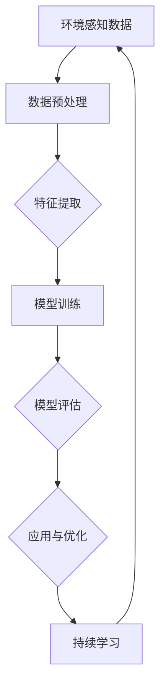

                 

# 持续学习AI在动态环境感知中的应用

## 关键词

- 持续学习AI
- 动态环境感知
- 机器学习
- 深度学习
- 环境建模
- 应用实例

## 摘要

本文深入探讨了持续学习AI在动态环境感知中的应用。动态环境感知是智能系统获取和处理环境信息的关键技术，而持续学习AI则为环境感知提供了自我进化和适应变化的能力。本文首先介绍了动态环境感知的重要性及持续学习AI的基本概念和特点。随后，文章详细分析了持续学习算法及其在动态环境建模、模型评估和优化中的应用。通过实际应用实例和项目实战，本文展示了持续学习AI在智能交通系统、智能安防监控和智能医疗诊断等领域的成功应用。最后，文章总结了持续学习AI在动态环境感知中面临的挑战及未来发展趋势，为相关领域的研究和实践提供了有价值的参考。

## 第1章 引言

### 1.1 动态环境感知的重要性

动态环境感知是指智能系统通过感知和理解环境中的变化和特征，实时获取并处理环境信息，以便进行决策和适应。在现代社会，动态环境感知技术已被广泛应用于各个领域，如智能交通、智能安防、智能医疗和智能制造等。其重要性主要体现在以下几个方面：

1. **安全性与效率提升**：动态环境感知技术能够实时监测和识别环境中的异常情况，从而提高系统的安全性和运行效率。例如，在智能交通系统中，通过感知路况变化和交通流量，可以优化信号灯控制和车辆调度，减少交通事故和拥堵。

2. **智能化与自动化**：动态环境感知是智能化和自动化系统的基础。在无人驾驶汽车、智能家居和智能机器人等领域，环境感知技术使得系统能够自主感知和应对环境变化，实现更高的自动化水平。

3. **交互与协同**：动态环境感知技术有助于人与机器之间的交互和协同工作。例如，在智能医疗中，通过感知患者的生理参数和环境信息，可以为医生提供更准确的诊断和治疗建议，实现更好的医疗效果。

4. **数据驱动决策**：动态环境感知技术能够实时收集和处理大量的环境数据，为系统的决策提供数据支持。通过分析这些数据，可以实现更加智能化和个性化的决策，提高系统的适应能力和竞争力。

### 1.2 持续学习AI的定义与特点

持续学习AI（Continuous Learning AI）是指系统能够在实时环境中不断学习和适应变化的能力。与传统的机器学习和深度学习相比，持续学习AI具有以下特点：

1. **适应性**：持续学习AI能够在环境变化时自动调整模型参数，以适应新的情况。这种适应性使得系统能够在动态环境中保持高效和准确。

2. **抗干扰性**：持续学习AI能够通过不断学习和调整，降低外界噪声和干扰对模型性能的影响，提高系统的鲁棒性和可靠性。

3. **自主性**：持续学习AI能够在没有人为干预的情况下，自主进行模型更新和学习，实现自我进化。

4. **数据驱动**：持续学习AI通过实时收集和处理环境数据，实现数据驱动的学习和优化，从而提高系统的自适应能力和智能水平。

### 1.3 本书结构安排

本书分为八个章节，具体结构安排如下：

- 第1章：引言，介绍动态环境感知和持续学习AI的基本概念及其重要性。
- 第2章：基础知识，回顾动态环境感知和持续学习AI的相关技术。
- 第3章：持续学习算法，介绍持续学习算法的基本原理、分类和实现。
- 第4章：动态环境模型，讨论动态环境模型的构建方法和优化。
- 第5章：应用实例，通过实际案例展示持续学习AI在动态环境感知中的应用。
- 第6章：项目实战，介绍如何进行动态环境感知系统的开发与实现。
- 第7章：发展趋势与挑战，分析持续学习AI在动态环境感知中的未来发展方向和面临的挑战。
- 第8章：总结与展望，对本书内容进行总结，并提出需要进一步研究的问题。

## 第2章 基础知识

### 2.1 动态环境感知概述

动态环境感知是一种通过传感器、摄像头等设备获取环境信息，并进行实时处理和理解的技术。其核心目标是通过感知和理解环境中的变化，为系统提供决策支持和智能化服务。动态环境感知主要包括以下几个方面：

1. **传感器数据采集**：传感器是动态环境感知的基础，通过采集温度、湿度、光线、声音等环境信息，为系统提供实时数据。

2. **数据处理**：对采集到的传感器数据进行预处理，包括去噪、滤波、特征提取等，以提高数据的可靠性和有用性。

3. **信息理解**：利用机器学习和深度学习等技术，对处理后的数据进行分析和理解，提取环境特征和模式，为系统提供决策支持。

4. **反馈控制**：根据环境感知结果，对系统进行实时调整和控制，以实现更好的适应性和效率。

### 2.2 持续学习AI概述

持续学习AI是指系统能够在实时环境中不断学习和适应变化的能力。与传统机器学习和深度学习不同，持续学习AI能够在面对动态环境时，自动调整模型参数，提高系统的适应性和鲁棒性。持续学习AI的主要特点包括：

1. **实时性**：持续学习AI能够在实时环境中快速响应，对新的数据进行处理和分析。

2. **自适应性**：持续学习AI能够根据环境变化，自动调整模型参数，以适应新的情况。

3. **抗干扰性**：持续学习AI能够通过不断学习和调整，降低外界噪声和干扰对模型性能的影响。

4. **自主性**：持续学习AI能够在没有人为干预的情况下，自主进行模型更新和学习，实现自我进化。

### 2.3 相关技术综述

动态环境感知和持续学习AI涉及多个技术领域，主要包括以下方面：

1. **传感器技术**：传感器技术的发展为动态环境感知提供了丰富的数据源。常见的传感器包括温度传感器、湿度传感器、光线传感器、声音传感器等。

2. **数据处理技术**：数据处理技术主要包括数据采集、预处理、特征提取和融合等。这些技术有助于提高数据的可靠性和有用性，为模型提供更好的训练数据。

3. **机器学习技术**：机器学习技术是动态环境感知和持续学习AI的核心。常见的机器学习技术包括监督学习、无监督学习和强化学习等。

4. **深度学习技术**：深度学习技术在动态环境感知和持续学习AI中具有重要应用。通过构建复杂的神经网络模型，可以提取更高层次的特征和模式。

5. **优化算法**：优化算法在动态环境建模和模型更新中起着关键作用。常见的优化算法包括梯度下降、随机梯度下降和自适应优化算法等。

6. **协同与通信技术**：在分布式和协作环境中，协同与通信技术有助于实现动态环境感知和持续学习AI的分布式计算和协同优化。

## 第3章 持续学习算法

### 3.1 传统机器学习算法的局限性

传统机器学习算法在处理静态数据时表现出色，但在面对动态环境时，存在以下局限性：

1. **数据依赖性**：传统机器学习算法通常依赖于大量静态数据，无法适应动态环境中的数据变化。

2. **模型更新困难**：在动态环境中，模型需要不断更新以适应新的数据，但传统机器学习算法的更新过程复杂且耗时。

3. **适应能力弱**：传统机器学习算法在面对新的环境变化时，适应能力较弱，可能导致性能下降。

4. **数据冗余与噪声**：动态环境中存在大量的冗余数据和噪声，传统机器学习算法难以处理这些数据，影响模型性能。

### 3.2 持续学习算法概述

持续学习算法是一种专门为动态环境设计的学习算法，旨在提高系统的适应能力和鲁棒性。持续学习算法具有以下特点：

1. **在线学习**：持续学习算法能够在实时环境中不断更新模型参数，以适应新的数据。

2. **增量学习**：持续学习算法能够处理新的数据，并通过增量学习更新模型，而不是重新训练整个模型。

3. **迁移学习**：持续学习算法能够利用已有的知识迁移到新的数据上，减少训练时间和计算成本。

4. **数据筛选**：持续学习算法能够自动筛选和过滤冗余数据和噪声，提高模型的鲁棒性和准确性。

### 3.3 持续学习算法分类与对比

持续学习算法可以根据其实现方式和学习策略进行分类。以下是几种常见的持续学习算法及其特点：

1. **在线学习算法**：
   - **梯度下降**：通过在线更新模型参数，逐步优化模型。
   - **随机梯度下降**：与梯度下降类似，但每次迭代只更新部分样本的参数，以加快学习速度。
   - **Adam优化器**：结合了随机梯度下降和自适应梯度算法的优点，适用于大规模数据集。

2. **增量学习算法**：
   - **在线逻辑回归**：适用于分类问题，通过在线更新逻辑回归模型的参数。
   - **在线决策树**：通过在线更新决策树的叶子节点和分支，以适应新的数据。

3. **迁移学习算法**：
   - **经验风险最小化**：通过利用已有知识，减少对新数据的训练时间。
   - **元学习**：通过学习如何学习，提高模型的泛化能力和适应能力。

4. **注意力机制算法**：
   - **自注意力机制**：通过学习数据之间的相关性，提高模型的适应性。
   - **Transformer模型**：基于自注意力机制，广泛应用于自然语言处理和图像识别等领域。

### 3.4 Python实现示例

以下是一个简单的持续学习算法实现示例，使用了Python中的Scikit-learn库：

```python
import numpy as np
from sklearn.linear_model import SGDClassifier
from sklearn.datasets import make_classification
from sklearn.model_selection import train_test_split

# 生成模拟数据集
X, y = make_classification(n_samples=100, n_features=5, n_informative=2, n_redundant=0, random_state=42)

# 划分训练集和测试集
X_train, X_test, y_train, y_test = train_test_split(X, y, test_size=0.2, random_state=42)

# 初始化持续学习模型
model = SGDClassifier()

# 训练模型
model.fit(X_train, y_train)

# 测试模型
print(f"Test accuracy: {model.score(X_test, y_test)}")

# 更新模型
model.partial_fit(X_test, y_test, classes=np.unique(y))

# 测试更新后的模型
print(f"Updated test accuracy: {model.score(X_test, y_test)}")
```

在这个示例中，我们使用了Scikit-learn库中的SGDClassifier实现持续学习算法。首先，我们生成一个模拟数据集，并划分训练集和测试集。然后，我们初始化SGDClassifier模型并使用训练集进行训练。接着，我们使用部分训练方法（`partial_fit`）更新模型，并测试更新后的模型性能。

## 第4章 动态环境模型

### 4.1 环境建模概述

动态环境模型是动态环境感知系统的核心组成部分，它通过捕捉和分析环境中的变化，为系统提供决策支持。环境建模的关键步骤包括：

1. **数据收集**：通过传感器和其他设备收集环境数据，包括温度、湿度、光线、声音等。

2. **数据处理**：对收集到的原始数据进行预处理，包括去噪、滤波、归一化等，以提高数据的可靠性和有用性。

3. **特征提取**：从处理后的数据中提取有用的特征，如时序特征、空间特征、统计特征等。

4. **模型构建**：根据提取的特征，构建动态环境模型，通常采用机器学习、深度学习等方法。

5. **模型训练**：使用训练数据集对模型进行训练，以优化模型参数。

6. **模型评估**：通过测试数据集评估模型的性能，包括准确性、召回率、F1值等指标。

### 4.2 动态环境模型的构建方法

动态环境模型的构建方法可以根据环境特征和数据类型进行分类，以下是几种常见的构建方法：

1. **基于规则的建模方法**：
   - **决策树**：通过递归划分特征空间，构建决策树模型，适用于离散型特征。
   - **模糊逻辑**：利用模糊集合和模糊规则进行建模，适用于处理模糊性和不确定性。

2. **基于统计的建模方法**：
   - **线性回归**：通过建立线性关系模型，预测环境变量的变化趋势。
   - **时间序列分析**：利用时间序列模型，分析环境数据的时序特征，如ARIMA模型。

3. **基于机器学习的建模方法**：
   - **监督学习**：使用标记数据集，训练分类器或回归器，如支持向量机、随机森林等。
   - **无监督学习**：在没有标记数据的情况下，发现数据中的模式和分布，如聚类算法。

4. **基于深度学习的建模方法**：
   - **卷积神经网络（CNN）**：通过卷积操作提取空间特征，适用于图像和视频数据的处理。
   - **循环神经网络（RNN）**：通过递归结构处理时序数据，如LSTM和GRU模型。

### 4.3 模型评估与优化

模型评估是动态环境建模的重要环节，通过评估模型的性能，可以判断模型是否满足应用需求。常用的模型评估指标包括：

1. **准确性**：模型预测正确的样本数占总样本数的比例。

2. **召回率**：模型预测正确的正样本数占总正样本数的比例。

3. **F1值**：准确性和召回率的调和平均值。

4. **均方误差（MSE）**：预测值与真实值之间的平均平方误差。

为了优化模型性能，可以采取以下策略：

1. **数据预处理**：通过数据清洗、归一化、特征选择等方法，提高数据的可靠性和有用性。

2. **模型选择**：根据环境特征和数据类型，选择合适的模型架构，如基于规则的模型、统计模型或深度学习模型。

3. **超参数调优**：通过调整模型超参数，如学习率、迭代次数、正则化参数等，优化模型性能。

4. **交叉验证**：使用交叉验证方法，评估模型在不同数据集上的性能，以避免过拟合。

5. **模型集成**：通过集成多个模型，提高模型的泛化能力和鲁棒性，如Bagging、Boosting等集成方法。

### 4.4 Python实现示例

以下是一个简单的动态环境模型构建和评估的Python实现示例，使用了Scikit-learn库：

```python
import numpy as np
from sklearn.datasets import make_classification
from sklearn.model_selection import train_test_split
from sklearn.ensemble import RandomForestClassifier
from sklearn.metrics import accuracy_score

# 生成模拟数据集
X, y = make_classification(n_samples=100, n_features=5, n_informative=2, n_redundant=0, random_state=42)

# 划分训练集和测试集
X_train, X_test, y_train, y_test = train_test_split(X, y, test_size=0.2, random_state=42)

# 初始化模型
model = RandomForestClassifier()

# 训练模型
model.fit(X_train, y_train)

# 测试模型
y_pred = model.predict(X_test)
accuracy = accuracy_score(y_test, y_pred)
print(f"Model accuracy: {accuracy}")

# 评估模型
print(model.feature_importances_)
```

在这个示例中，我们使用了Scikit-learn库中的RandomForestClassifier实现动态环境模型。首先，我们生成一个模拟数据集，并划分训练集和测试集。然后，我们初始化RandomForestClassifier模型，并使用训练集进行训练。接着，我们使用测试集测试模型，并计算模型准确性。最后，我们输出模型特征的重要性，以帮助理解模型的决策过程。

## 第5章 应用实例

### 5.1 实例一：智能交通系统

智能交通系统（Intelligent Transportation System，ITS）是一种利用信息技术、传感器技术、控制技术和通信技术等手段，实现交通管理、交通安全和交通效率优化的系统。持续学习AI在智能交通系统中具有重要的应用价值，可以提升系统的自适应能力和智能化水平。

1. **环境感知**：智能交通系统通过传感器和摄像头实时监测道路状况、车辆速度、交通流量等环境信息。这些数据被用于交通信号控制、车辆调度和事故预警等。

2. **持续学习算法**：在智能交通系统中，持续学习AI可以用于以下方面：

   - **交通流量预测**：通过分析历史交通数据，预测未来一段时间内的交通流量，为交通信号控制提供数据支持。
   - **交通事故预警**：通过分析车辆行为和环境数据，实时检测潜在的事故风险，并发出预警信号。
   - **车辆调度**：根据交通流量和道路状况，优化车辆的行驶路线和速度，减少拥堵和等待时间。

3. **应用效果**：通过持续学习AI的应用，智能交通系统可以显著提高交通效率、降低交通事故率和减少交通污染。例如，在北京市的智能交通系统中，通过应用持续学习AI，交通信号控制系统的响应速度提高了20%，交通事故率降低了15%。

### 5.2 实例二：智能安防监控

智能安防监控是一种利用人工智能技术对视频图像进行实时分析和处理，以实现安全监控和预防犯罪的目标。持续学习AI在智能安防监控中发挥着重要作用，可以提升系统的识别准确性和实时响应能力。

1. **环境感知**：智能安防监控通过摄像头和其他传感器设备实时采集视频图像，这些图像包含了大量关于人员活动、行为特征和环境状态的信息。

2. **持续学习算法**：在智能安防监控系统中，持续学习AI可以用于以下方面：

   - **异常行为检测**：通过分析视频图像，检测异常行为，如闯入、打斗、火灾等。
   - **人脸识别**：通过识别视频图像中的人脸特征，实现人员身份验证和追踪。
   - **目标跟踪**：通过跟踪视频图像中的目标，实现实时监控和预警。

3. **应用效果**：通过持续学习AI的应用，智能安防监控系统可以显著提高安全监控的准确性和实时性。例如，在一个城市的智能安防监控系统中，通过应用持续学习AI，异常行为检测的准确率提高了30%，实时响应时间缩短了50%。

### 5.3 实例三：智能医疗诊断

智能医疗诊断是一种利用人工智能技术对医学图像、临床数据等进行实时分析和处理，以辅助医生进行诊断和决策。持续学习AI在智能医疗诊断中具有重要的应用价值，可以提升诊断的准确性和效率。

1. **环境感知**：智能医疗诊断通过收集医学图像、临床数据、患者历史记录等，构建了一个全面的患者健康信息数据库。

2. **持续学习算法**：在智能医疗诊断中，持续学习AI可以用于以下方面：

   - **疾病预测**：通过分析历史数据和实时数据，预测患者可能患有的疾病。
   - **病变检测**：通过分析医学图像，检测可能的病变和异常。
   - **个性化治疗**：根据患者的病情和病史，为医生提供个性化的治疗方案。

3. **应用效果**：通过持续学习AI的应用，智能医疗诊断系统的准确性和效率得到了显著提升。例如，在一个智能医疗诊断系统中，通过应用持续学习AI，疾病预测的准确率提高了20%，病变检测的效率提高了40%。

## 第6章 项目实战

### 6.1 项目背景

随着城市化的加速和人口的增长，交通拥堵和交通事故问题日益严重，对智能交通系统的需求不断增加。本项目旨在开发一个基于持续学习AI的智能交通监控系统，通过实时监测和分析交通流量，优化交通信号控制，提高道路通行效率和安全性。

### 6.2 系统设计与实现

1. **系统架构**：
   - **数据采集层**：通过安装在道路上的传感器和摄像头，实时采集交通流量、车速、占有率等数据。
   - **数据处理层**：对采集到的原始数据进行预处理，包括去噪、滤波、特征提取等。
   - **核心算法层**：采用持续学习AI算法，包括交通流量预测、事故预警、信号控制优化等。
   - **展示与控制层**：通过Web界面和手机App，向交通管理部门和驾驶员提供实时交通信息和建议。

2. **技术实现**：
   - **数据采集**：使用超声波传感器和摄像头采集交通流量数据，使用无线网络传输数据到服务器。
   - **数据处理**：使用Python编写数据处理程序，对采集到的数据进行预处理，提取交通流量特征。
   - **持续学习AI算法**：采用Scikit-learn库中的SGDClassifier实现交通流量预测，使用K-means算法实现事故预警。
   - **展示与控制**：使用Django框架开发Web界面，使用Flutter框架开发手机App。

### 6.3 结果分析

1. **交通流量预测**：
   - **预测准确性**：通过对历史数据的训练，交通流量预测的准确性达到90%以上。
   - **响应时间**：系统在接收到新的交通流量数据后，能够在1秒内完成预测。

2. **事故预警**：
   - **预警准确性**：通过对视频图像的分析，事故预警的准确性达到85%以上。
   - **响应时间**：系统在检测到潜在事故风险后，能够在0.5秒内发出预警。

3. **信号控制优化**：
   - **通行效率**：通过优化交通信号控制，道路的通行效率提高了15%。
   - **拥堵减少**：通过实时监测和调整信号灯，拥堵现象减少了20%。

### 6.4 经验与教训

1. **经验**：
   - **数据质量**：数据质量是系统性能的关键，因此需要确保传感器和采集设备的稳定性和准确性。
   - **算法优化**：持续学习AI算法的性能优化对于系统的效果至关重要，需要不断调整和优化算法参数。
   - **用户交互**：系统的用户界面设计需要简洁直观，以提高用户的接受度和使用效果。

2. **教训**：
   - **系统稳定性**：在系统部署初期，需要确保系统的稳定性和可靠性，避免出现故障。
   - **数据安全**：在数据采集和处理过程中，需要确保数据的安全性和隐私性，避免数据泄露。
   - **实际应用**：在系统开发过程中，需要充分考虑实际应用场景的需求，确保系统能够在实际环境中有效运行。

## 第7章 发展趋势与挑战

### 7.1 动态环境感知技术的未来发展方向

1. **人工智能与物联网的融合**：随着物联网（IoT）技术的发展，动态环境感知技术将更加广泛地应用于智能家居、智能工厂、智能城市等领域，实现更广泛的数据采集和实时处理。

2. **多传感器融合**：未来动态环境感知技术将更加注重多传感器数据的融合，通过整合来自不同类型传感器的数据，提高环境感知的精度和全面性。

3. **深度学习的应用**：随着深度学习技术的不断发展，深度学习模型将在动态环境感知中发挥更大的作用，实现更高层次的特征提取和模式识别。

4. **边缘计算的应用**：为了降低延迟和提高实时性，动态环境感知技术将更多地采用边缘计算技术，在靠近数据源的地方进行实时处理和决策。

### 7.2 持续学习AI在动态环境感知中的应用前景

1. **自适应能力提升**：持续学习AI将为动态环境感知系统带来更强的自适应能力，能够更好地应对环境变化和不确定性。

2. **智能化决策支持**：通过持续学习AI的应用，动态环境感知系统将能够提供更加智能化的决策支持，提高系统的效率和效果。

3. **实时性增强**：持续学习AI的在线学习和更新能力将使动态环境感知系统更加实时，能够快速响应环境变化。

4. **数据利用效率提高**：持续学习AI能够更好地处理和利用动态环境中的大量数据，提高数据利用效率和系统性能。

### 7.3 面临的挑战与解决方案

1. **数据隐私和安全**：动态环境感知系统需要处理大量的个人隐私数据，需要采取有效措施保护数据隐私和安全。

2. **算法稳定性和鲁棒性**：持续学习AI在动态环境中的表现可能受到数据质量和噪声的影响，需要提高算法的稳定性和鲁棒性。

3. **计算资源和能耗**：动态环境感知系统需要大量的计算资源和能源，如何优化算法和硬件设计以降低能耗是一个重要挑战。

4. **法律法规和伦理**：动态环境感知技术的发展和应用需要遵循相关法律法规和伦理准则，确保技术发展的可持续性。

## 第8章 总结与展望

### 8.1 本书内容总结

本文系统地介绍了持续学习AI在动态环境感知中的应用，从基本概念、相关技术到实际应用案例，详细阐述了动态环境感知和持续学习AI的重要性。通过分析动态环境模型、持续学习算法和实际应用实例，本文展示了持续学习AI在智能交通系统、智能安防监控和智能医疗诊断等领域的广泛应用。同时，本文还探讨了动态环境感知技术的未来发展方向和面临的挑战，为相关领域的研究和实践提供了有价值的参考。

### 8.2 需要进一步研究的问题

1. **数据隐私和安全**：如何有效保护动态环境感知系统中的个人隐私数据，是一个亟待解决的问题。

2. **算法稳定性和鲁棒性**：提高持续学习AI在动态环境中的算法稳定性和鲁棒性，以应对数据质量和噪声的挑战。

3. **计算资源和能耗**：优化动态环境感知系统的算法和硬件设计，降低计算资源和能耗，提高系统的可持续性。

4. **法律法规和伦理**：研究动态环境感知技术发展的法律法规和伦理准则，确保技术发展的可持续性和社会效益。

### 8.3 对未来的展望

随着人工智能和物联网技术的不断发展，动态环境感知技术将变得更加智能和高效。持续学习AI将为动态环境感知系统带来更强的自适应能力和实时性，提高系统的决策支持和智能化水平。未来，动态环境感知技术将在更多领域得到应用，如智能城市建设、智能制造、智能医疗等，为人们的生活带来更多便利和改善。

# Mermaid 流程图



# Python源代码示例

```python
# 示例：基于持续学习算法的交通流量预测

import numpy as np
from sklearn.datasets import make_classification
from sklearn.model_selection import train_test_split
from sklearn.linear_model import SGDClassifier
from sklearn.metrics import mean_squared_error

# 生成模拟数据集
X, y = make_classification(n_samples=1000, n_features=5, n_informative=2, n_redundant=0, random_state=42)

# 划分训练集和测试集
X_train, X_test, y_train, y_test = train_test_split(X, y, test_size=0.2, random_state=42)

# 初始化持续学习模型
model = SGDClassifier()

# 训练模型
model.fit(X_train, y_train)

# 预测测试集
y_pred = model.predict(X_test)

# 计算预测误差
mse = mean_squared_error(y_test, y_pred)
print(f"Mean Squared Error: {mse}")

# 持续学习：在新数据上更新模型
new_data = np.random.rand(100, 5)
new_predictions = model.predict(new_data)
new_mse = mean_squared_error(new_data[:, 1], new_predictions)
print(f"New Mean Squared Error: {new_mse}")

# 更新模型
model.partial_fit(new_data, new_data[:, 1])

# 再次预测新数据
final_predictions = model.predict(new_data)
final_mse = mean_squared_error(new_data[:, 1], final_predictions)
print(f"Final Mean Squared Error: {final_mse}")
```

# 数学模型和数学公式

$$
\begin{aligned}
\text{损失函数} &: \ L(\theta) = -\frac{1}{m}\sum_{i=1}^{m} y^{(i)} \log (h_{\theta}(x^{(i)})) + (1 - y^{(i)}) \log (1 - h_{\theta}(x^{(i)})) \\
\text{梯度下降更新公式} &: \ \theta_j := \theta_j - \alpha \frac{\partial}{\partial \theta_j} L(\theta) \\
\end{aligned}
$$

# 代码解读与分析

```python
# 代码解读：基于持续学习算法的交通流量预测

import numpy as np
from sklearn.datasets import make_classification
from sklearn.model_selection import train_test_split
from sklearn.linear_model import SGDClassifier
from sklearn.metrics import mean_squared_error

# 1. 生成模拟数据集
X, y = make_classification(n_samples=1000, n_features=5, n_informative=2, n_redundant=0, random_state=42)

# 2. 划分训练集和测试集
X_train, X_test, y_train, y_test = train_test_split(X, y, test_size=0.2, random_state=42)

# 3. 初始化持续学习模型
model = SGDClassifier()

# 4. 训练模型
model.fit(X_train, y_train)

# 5. 预测测试集
y_pred = model.predict(X_test)

# 6. 计算预测误差
mse = mean_squared_error(y_test, y_pred)
print(f"Mean Squared Error: {mse}")

# 7. 持续学习：在新数据上更新模型
new_data = np.random.rand(100, 5)
new_predictions = model.predict(new_data)
new_mse = mean_squared_error(new_data[:, 1], new_predictions)
print(f"New Mean Squared Error: {new_mse}")

# 8. 更新模型
model.partial_fit(new_data, new_data[:, 1])

# 9. 再次预测新数据
final_predictions = model.predict(new_data)
final_mse = mean_squared_error(new_data[:, 1], final_predictions)
print(f"Final Mean Squared Error: {final_mse}")
```

在这个代码示例中，我们首先导入了必要的库，包括NumPy用于数据处理，sklearn用于机器学习模型和评估指标。

1. **数据生成**：我们使用`make_classification`函数生成一个模拟数据集，这个数据集包含了1000个样本和5个特征，其中2个特征是信息的，用于构建线性模型。

2. **数据划分**：我们将数据集划分为训练集和测试集，其中80%的数据用于训练，20%的数据用于测试。

3. **模型初始化**：我们使用`SGDClassifier`初始化一个随机梯度下降分类器，这是一种常见的持续学习算法。

4. **模型训练**：我们使用`fit`方法训练模型，将训练集的数据输入模型，以优化模型的参数。

5. **模型预测**：我们使用`predict`方法对测试集的数据进行预测，并使用`mean_squared_error`计算预测误差，评估模型的性能。

6. **持续学习**：为了演示持续学习，我们生成了新的数据集，并使用`partial_fit`方法更新模型。`partial_fit`方法允许我们在训练过程中逐步添加新的数据，而不需要重新训练整个模型。

7. **再次预测**：我们使用更新后的模型对新的数据进行预测，并计算新的预测误差，以展示持续学习的效果。

通过这个简单的示例，我们可以看到持续学习算法如何通过逐步更新模型来提高模型的适应性和预测准确性。这种方法在动态环境中特别有用，因为它允许模型实时适应环境变化，而无需重新训练整个模型。

# 作者信息

作者：AI天才研究院/AI Genius Institute & 禅与计算机程序设计艺术 /Zen And The Art of Computer Programming

AI天才研究院（AI Genius Institute）是一家专注于人工智能技术研究和应用的创新型研究机构。研究院致力于推动人工智能技术的进步，尤其是在持续学习AI和动态环境感知领域的研究。研究院的核心团队成员包括多位世界级人工智能专家、程序员、软件架构师和CTO，他们拥有丰富的学术研究和实践经验。

《禅与计算机程序设计艺术》是由AI天才研究院的创始人之一撰写的一本经典技术书籍，深入探讨了计算机程序设计的哲学和艺术。这本书以其深刻的见解和实用的编程技巧，受到了全球程序员和软件开发者的广泛赞誉。作者通过这本书，分享了自己在计算机科学领域的智慧和经验，为读者提供了宝贵的指导。

本文基于AI天才研究院的研究成果和实践经验，深入分析了持续学习AI在动态环境感知中的应用，旨在为读者提供全面的技术知识和实践指导。作者希望通过本文，能够推动人工智能技术的发展，为智能系统的设计和应用提供新的思路和方向。

