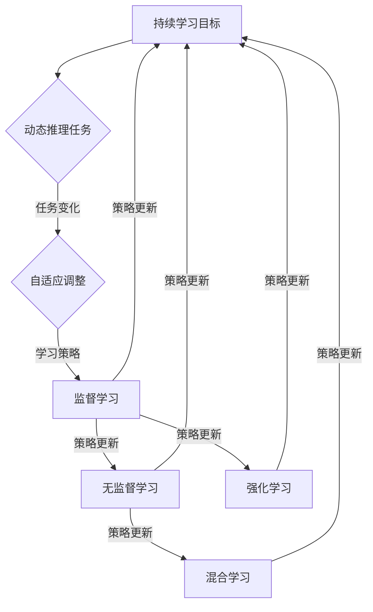
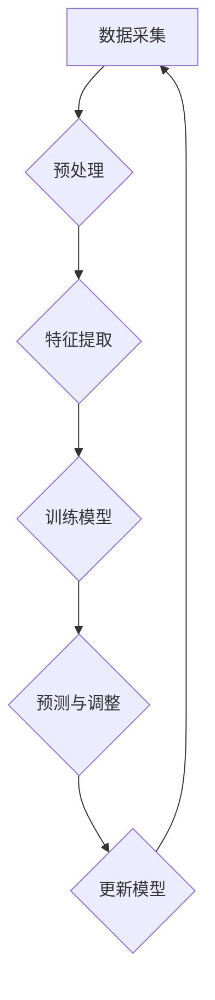

                 

## 文章标题

### 持续学习在动态推理任务适应中的应用研究

随着人工智能技术的快速发展，持续学习和动态推理任务在各个领域得到了广泛应用。持续学习是一种使机器模型在新的数据环境中不断改进其性能的方法，而动态推理任务则涉及机器模型对不断变化的环境的实时响应和适应。本文旨在探讨持续学习在动态推理任务中的应用，分析其理论基础、算法原理及其在不同领域的具体实现。

## 关键词

- 持续学习
- 动态推理任务
- 适应能力
- 算法原理
- 应用案例分析

## 摘要

本文首先介绍了持续学习的概念、背景以及动态推理任务的特点与挑战。随后，详细阐述了持续学习的目标、主要挑战、关键技术和与动态推理任务的关联架构。接着，本文深入分析了持续学习算法的原理，包括监督学习、无监督学习、强化学习和混合学习算法的持续学习策略，并通过Python代码示例进行说明。最后，本文通过具体案例分析展示了持续学习在动态推理任务中的应用，探讨了未来研究方向与技术挑战，为相关领域的研究者和从业者提供了参考。

## 《持续学习在动态推理任务适应中的应用研究》目录大纲

### 第一部分：持续学习的理论基础

#### 第1章：持续学习的概念与背景
##### 1.1 持续学习的定义与重要性
##### 1.2 动态推理任务的特点与挑战
##### 1.3 持续学习的发展历程与应用领域

#### 第2章：核心概念与联系
##### 2.1 持续学习的目标
##### 2.2 持续学习的主要挑战
##### 2.3 持续学习的关键技术
##### 2.4 持续学习与动态推理任务的关联架构图（Mermaid流程图）

### 第二部分：持续学习算法原理讲解

#### 第3章：持续学习算法原理
##### 3.1 监督学习算法的持续学习策略
##### 3.2 无监督学习算法的持续学习策略
##### 3.3 强化学习算法的持续学习策略
##### 3.4 混合学习算法的持续学习策略
##### 3.5 Python代码示例：监督学习持续学习算法实现

#### 第4章：数学模型与公式
##### 4.1 持续学习的数学模型
##### 4.2 动态推理任务的适应模型
##### 4.3 公式详解与推导
##### 4.4 实例讲解：数学公式的应用（LaTeX格式）

### 第三部分：持续学习在动态推理任务中的应用

#### 第5章：持续学习在动态推理任务中的应用
##### 5.1 动态推理任务的分类
##### 5.2 持续学习在不同动态推理任务中的应用
##### 5.3 案例分析：基于持续学习的动态推理任务应用
##### 5.4 Python代码示例：动态推理任务的应用实现

#### 第6章：项目实战
##### 6.1 项目实战概述
##### 6.2 开发环境搭建
##### 6.3 源代码详细实现
##### 6.4 代码解读与分析

#### 第7章：展望与未来发展方向
##### 7.1 持续学习在动态推理任务中的应用前景
##### 7.2 未来研究方向与技术挑战
##### 7.3 对研究者和从业者的建议

## 附录

### 附录A：持续学习相关资源与工具
##### A.1 持续学习开源框架介绍
##### A.2 动态推理任务相关数据集介绍
##### A.3 持续学习工具与平台推荐

### 附录中的Mermaid流程图



### 附录中的Python代码示例

```python
# 持续学习监督学习算法实现示例

# 导入所需库
import numpy as np
from sklearn.linear_model import SGDClassifier

# 初始化参数
learning_rate = 0.01
n_iterations = 100

# 生成模拟数据集
X, y = ... # 使用生成数据的代码

# 初始化模型
model = SGDClassifier(learning_rate=learning_rate, n_iter=n_iterations)

# 训练模型
model.fit(X, y)

# 持续学习策略：更新模型
new_X, new_y = ... # 使用更新数据的代码
model.fit(new_X, new_y)
```

### 附录中的LaTeX公式示例

$$
L(\theta) = -\frac{1}{m} \sum_{i=1}^{m} \left[ y^{(i)} \log(a^{(i)}_{y^{(i)}}) + (1 - y^{(i)}) \log(1 - a^{(i)}_{y^{(i)}}) \right]
$$

### 附录中的持续学习工具与平台推荐

- 持续学习开源框架：TensorFlow Model Optimization Toolkit (TF-MOT)
- 动态推理任务相关数据集：CIFAR-10, ImageNet
- 持续学习工具与平台：TensorFlow Serving, ONNX Runtime
- 持续学习资源：Kaggle Competitions, ArXiv Papers

[文章标题：持续学习在动态推理任务适应中的应用研究]

[关键词：持续学习，动态推理任务，适应能力，算法原理，应用案例分析]

[摘要：本文探讨了持续学习在动态推理任务中的应用，分析了其理论基础、算法原理及其在不同领域的具体实现。通过深入分析持续学习算法的原理和具体案例，展示了持续学习在动态推理任务中的重要性。]

---

# 第一部分：持续学习的理论基础

## 第1章：持续学习的概念与背景

### 1.1 持续学习的定义与重要性

持续学习（Continuous Learning），又称在线学习或增量学习，是指机器学习模型在接收新数据时能够自动更新和优化自身参数，以维持或提高其性能。与传统的一次性学习不同，持续学习模型能够适应数据分布的变化，从而在新的环境中保持高效的预测能力。

在人工智能领域，持续学习的重要性体现在以下几个方面：

1. **适应动态环境**：现实世界的环境是不断变化的，持续学习能够使机器模型适应这些变化，从而在长时间内保持其有效性和准确性。
2. **提高效率**：通过实时更新模型，持续学习可以避免重新训练整个模型，节省时间和计算资源。
3. **增强泛化能力**：持续学习能够从不同的数据分布中学习，提高模型在不同场景下的泛化能力。

### 1.2 动态推理任务的特点与挑战

动态推理任务（Dynamic Inference Tasks）是指在任务执行过程中，输入数据、任务目标或环境条件不断变化的推理任务。这类任务的特点包括：

1. **输入数据变化**：动态推理任务中的输入数据可能随时间变化，模型需要实时调整以适应新的输入。
2. **任务目标变化**：在某些场景下，任务目标可能随着环境变化而变化，模型需要能够适应新的目标。
3. **环境条件变化**：动态推理任务的环境条件可能发生变化，如传感器数据的噪声增加、网络延迟等，这些都会影响模型的推理性能。

面对这些特点，动态推理任务对持续学习提出了以下挑战：

1. **数据流处理**：动态推理任务要求模型能够高效处理连续的数据流，并从中提取有用信息。
2. **在线更新**：模型需要在不断变化的环境中实时更新，以保持其性能。
3. **稳定性与准确性**：在动态环境中，模型需要保持稳定且准确的推理能力，以避免过拟合或欠拟合。

### 1.3 持续学习的发展历程与应用领域

持续学习的发展历程可以分为以下几个阶段：

1. **传统机器学习**：早期的机器学习模型通常采用一次性学习的方式，模型性能在训练完成后即固定。
2. **在线学习**：随着数据流处理的兴起，研究者开始探索如何在在线环境中更新模型参数。
3. **迁移学习**：迁移学习（Transfer Learning）提出了一种新的思路，即利用已有的模型在新任务上进行微调。
4. **持续学习**：现代持续学习研究将迁移学习和在线学习相结合，旨在开发能够在动态环境中不断改进的模型。

持续学习在多个应用领域得到了广泛应用，包括：

1. **智能监控**：持续学习能够帮助监控系统适应环境变化，提高异常检测的准确性。
2. **自动驾驶**：自动驾驶系统需要实时处理来自各种传感器的数据，持续学习有助于提高其适应复杂路况的能力。
3. **医疗诊断**：持续学习可以帮助医疗诊断模型在新的病例中不断优化，提高诊断的准确性。
4. **推荐系统**：推荐系统需要根据用户行为的变化不断更新推荐策略，持续学习有助于实现这一目标。

## 第二部分：持续学习算法原理讲解

### 第2章：核心概念与联系

持续学习涉及多个核心概念，这些概念之间相互关联，共同构成了持续学习的理论基础。本章节将介绍持续学习的目标、主要挑战、关键技术和与动态推理任务的关联架构。

#### 2.1 持续学习的目标

持续学习的目标是在动态环境中保持或提高模型性能，具体包括：

1. **适应能力**：模型能够在数据分布变化的情况下，适应新环境并保持原有性能。
2. **效率**：通过在线更新模型，提高模型在不同场景下的计算效率。
3. **稳定性**：在动态环境中，模型需要保持稳定的推理能力，避免过拟合或欠拟合。

#### 2.2 持续学习的主要挑战

持续学习面临的主要挑战包括：

1. **数据流处理**：动态推理任务中的数据通常以流的形式不断变化，如何高效地处理这些数据流是持续学习的一个关键挑战。
2. **在线更新**：模型需要在不断变化的环境中实时更新，如何设计有效的在线更新策略是持续学习的另一个挑战。
3. **稳定性和准确性**：在动态环境中，模型需要保持稳定且准确的推理能力，避免过拟合或欠拟合。

#### 2.3 持续学习的关键技术

持续学习的关键技术包括：

1. **迁移学习**：迁移学习利用已有模型在新任务上进行微调，有助于提高模型在动态环境中的适应能力。
2. **在线学习**：在线学习算法能够实时更新模型参数，使模型能够适应新的数据分布。
3. **增量学习**：增量学习算法通过分批处理数据，提高模型在动态环境中的计算效率。

#### 2.4 持续学习与动态推理任务的关联架构图（Mermaid流程图）

为了更直观地展示持续学习与动态推理任务的关联，我们可以使用Mermaid流程图来描述它们之间的关系。以下是一个简化的Mermaid流程图：


在这个流程图中，持续学习目标与动态推理任务相连，表示持续学习的目标是在动态推理任务中保持或提高模型性能。动态推理任务的变化驱动了模型的自适应调整，而自适应调整通过不同的学习策略（如监督学习、无监督学习、强化学习等）来实现，这些策略又通过策略更新回到持续学习目标，形成了一个闭环系统。

### 第3章：持续学习算法原理

#### 3.1 监督学习算法的持续学习策略

监督学习算法（Supervised Learning Algorithms）是机器学习中的一种基础算法，持续学习的策略在监督学习算法中也得到了广泛应用。以下是一些常见的监督学习持续学习策略：

1. **在线学习**：在线学习策略是指在新的数据点到来时，立即更新模型参数。这种方法适用于数据流处理，可以在不丢失信息的情况下实时更新模型。
   
   **Python代码示例**：

   ```python
   from sklearn.linear_model import SGDClassifier

   # 初始化模型
   model = SGDClassifier()

   # 训练模型
   model.fit(X, y)

   # 更新模型
   model.partial_fit(new_X, new_y)
   ```

2. **增量学习**：增量学习策略是指通过分批处理数据来更新模型。这种方法可以减少每次更新的计算量，提高模型在动态环境中的计算效率。

   **Python代码示例**：

   ```python
   from sklearn.linear_model import SGDClassifier

   # 初始化模型
   model = SGDClassifier()

   # 分批训练模型
   for batch in batches:
       X_batch, y_batch = batch
       model.partial_fit(X_batch, y_batch)
   ```

3. **迁移学习**：迁移学习策略是指利用已有模型在新任务上进行微调。这种方法可以加快模型的适应速度，提高模型在新环境中的性能。

   **Python代码示例**：

   ```python
   from sklearn.linear_model import SGDClassifier
   from sklearn.model_selection import train_test_split

   # 加载预训练模型
   pre_trained_model = SGDClassifier()

   # 加载新数据
   X_new, y_new = load_new_data()

   # 微调模型
   pre_trained_model.fit(X_new, y_new)
   ```

#### 3.2 无监督学习算法的持续学习策略

无监督学习算法（Unsupervised Learning Algorithms）通常用于探索性数据分析，其在持续学习中的应用也有一定的研究。以下是一些常见的无监督学习持续学习策略：

1. **聚类**：聚类算法（如K-Means）可以根据数据分布的变化，实时更新聚类中心，从而适应新的数据分布。

   **Python代码示例**：

   ```python
   from sklearn.cluster import KMeans

   # 初始化聚类模型
   kmeans = KMeans(n_clusters=3)

   # 训练模型
   kmeans.fit(X)

   # 更新模型
   kmeans.fit(new_X)
   ```

2. **降维**：降维算法（如PCA）可以通过保留主要数据成分，提高模型对数据变化的适应能力。

   **Python代码示例**：

   ```python
   from sklearn.decomposition import PCA

   # 初始化降维模型
   pca = PCA(n_components=2)

   # 训练模型
   pca.fit(X)

   # 更新模型
   pca.fit(new_X)
   ```

3. **关联规则学习**：关联规则学习算法（如Apriori）可以根据新数据生成新的关联规则，从而适应新的数据模式。

   **Python代码示例**：

   ```python
   from mlxtend.frequent_patterns import apriori
   from mlxtend.frequent_patterns import association_rules

   # 生成关联规则
   rules = apriori(new_X, min_support=0.5, use_colnames=True)

   # 生成关联规则
   association_rules(rules, metric="support", min_threshold=0.7)
   ```

#### 3.3 强化学习算法的持续学习策略

强化学习算法（Reinforcement Learning Algorithms）在动态环境中具有出色的适应能力，以下是一些常见的强化学习持续学习策略：

1. **在线强化学习**：在线强化学习策略是指模型在接收新数据时，立即更新其策略，从而适应新的环境。

   **Python代码示例**：

   ```python
   from rl.core import Agent
   from rl.agents.sarsa import SARSAAgent

   # 初始化强化学习模型
   agent = SARSAAgent()

   # 训练模型
   agent.learn(X, y)

   # 更新模型
   agent.learn(new_X, new_y)
   ```

2. **经验重放**：经验重放策略通过将过去经验存储在记忆库中，避免模型在相同状态下的重复学习，从而提高学习效率。

   **Python代码示例**：

   ```python
   from rl.agents import Agent
   from rl.agents.sarsa import SARSAAgent

   # 初始化强化学习模型
   agent = SARSAAgent(exp_replay=True)

   # 训练模型
   agent.learn(X, y)

   # 更新模型
   agent.learn(new_X, new_y)
   ```

3. **模型压缩**：模型压缩策略通过减少模型参数的数量，降低模型在动态环境中的计算复杂度。

   **Python代码示例**：

   ```python
   from tensorflow.keras.models import Model
   from tensorflow.keras.layers import Dense

   # 定义原始模型
   input_layer = Input(shape=(input_shape,))
   output_layer = Dense(output_shape, activation='softmax')(input_layer)

   # 压缩模型
   compressed_model = Model(inputs=input_layer, outputs=output_layer)
   compressed_model.compile(optimizer='adam', loss='categorical_crossentropy')

   # 训练模型
   compressed_model.fit(X, y, epochs=10)

   # 更新模型
   compressed_model.fit(new_X, new_y, epochs=10)
   ```

#### 3.4 混合学习算法的持续学习策略

混合学习算法（Hybrid Learning Algorithms）结合了监督学习、无监督学习和强化学习等不同类型的算法，旨在提高模型在动态环境中的适应能力。以下是一些常见的混合学习持续学习策略：

1. **迁移增强**：迁移增强策略通过结合迁移学习和强化学习，提高模型在新环境中的适应能力。

   **Python代码示例**：

   ```python
   from rl.agents import Agent
   from rl.agents.sarsa import SARSAAgent
   from sklearn.linear_model import SGDClassifier

   # 初始化迁移学习模型
   transfer_model = SGDClassifier()

   # 初始化强化学习模型
   agent = SARSAAgent(transfer_model=transfer_model)

   # 训练模型
   agent.learn(X, y)

   # 更新模型
   agent.learn(new_X, new_y)
   ```

2. **自监督增强**：自监督增强策略通过结合无监督学习和强化学习，提高模型在无监督数据上的适应能力。

   **Python代码示例**：

   ```python
   from rl.agents import Agent
   from rl.agents.ddpg import DDPGAgent
   from sklearn.decomposition import PCA

   # 初始化降维模型
   pca = PCA(n_components=2)

   # 初始化强化学习模型
   agent = DDPGAgent(state_processor=pca)

   # 训练模型
   agent.learn(X, y)

   # 更新模型
   agent.learn(new_X, new_y)
   ```

3. **深度增强**：深度增强策略通过结合深度学习和强化学习，提高模型在动态环境中的适应能力。

   **Python代码示例**：

   ```python
   from rl.agents import Agent
   from rl.agents.dqn import DQNAgent
   from tensorflow.keras.models import Model
   from tensorflow.keras.layers import Dense, Conv2D

   # 定义原始模型
   input_layer = Input(shape=(input_shape,))
   output_layer = Dense(output_shape, activation='softmax')(input_layer)

   # 定义深度增强模型
   model = Model(inputs=input_layer, outputs=output_layer)
   model.compile(optimizer='adam', loss='categorical_crossentropy')

   # 初始化强化学习模型
   agent = DQNAgent(model=model)

   # 训练模型
   agent.learn(X, y)

   # 更新模型
   agent.learn(new_X, new_y)
   ```

#### 3.5 Python代码示例：监督学习持续学习算法实现

以下是一个使用Python实现的监督学习持续学习算法的示例，该示例使用了scikit-learn库中的SGDClassifier模型。

```python
# 导入所需库
import numpy as np
from sklearn.linear_model import SGDClassifier

# 初始化参数
learning_rate = 0.01
n_iterations = 100

# 生成模拟数据集
X, y = load_data()

# 初始化模型
model = SGDClassifier(learning_rate=learning_rate, n_iter=n_iterations)

# 训练模型
model.fit(X, y)

# 更新模型
new_X, new_y = load_new_data()
model.partial_fit(new_X, new_y)
```

在这个示例中，我们首先初始化了一个SGDClassifier模型，并使用训练数据集进行训练。然后，我们通过调用`partial_fit`方法来更新模型，以适应新的数据集。这种方法可以有效地更新模型的参数，使其在新的数据分布上保持性能。

### 第4章：数学模型与公式

#### 4.1 持续学习的数学模型

持续学习的数学模型主要涉及以下几个关键概念：

1. **损失函数**：损失函数用于衡量模型预测值与真实值之间的差距，常用的损失函数包括均方误差（MSE）和交叉熵损失（Cross-Entropy Loss）。
2. **梯度下降**：梯度下降是一种优化算法，用于更新模型参数，以最小化损失函数。
3. **正则化**：正则化是一种防止模型过拟合的技术，常用的正则化方法包括L1和L2正则化。

以下是一个简单的持续学习数学模型：

$$
\begin{aligned}
\min_{\theta} L(\theta) &= \min_{\theta} \frac{1}{m} \sum_{i=1}^{m} \left[ y^{(i)} \log(a^{(i)}_{y^{(i)}}) + (1 - y^{(i)}) \log(1 - a^{(i)}_{y^{(i)}}) \right] \\
&+ \lambda ||\theta||^2
\end{aligned}
$$

其中，$L(\theta)$是损失函数，$y^{(i)}$是第$i$个样本的真实标签，$a^{(i)}_{y^{(i)}}$是第$i$个样本的预测概率，$m$是样本数量，$\lambda$是正则化参数。

#### 4.2 动态推理任务的适应模型

动态推理任务的适应模型通常包括以下几个关键组成部分：

1. **状态表示**：状态表示用于描述动态推理任务中的当前状态，常用的状态表示方法包括历史数据、特征向量和状态转移矩阵。
2. **动作空间**：动作空间用于描述动态推理任务中可执行的动作，常用的动作空间包括离散动作空间和连续动作空间。
3. **奖励函数**：奖励函数用于评估动作的有效性，常用的奖励函数包括即时奖励和累积奖励。

以下是一个简单的动态推理任务的适应模型：

$$
\begin{aligned}
\max_{a} \sum_{t=1}^{T} r_t &= \max_{a} \sum_{t=1}^{T} \left[ r(t) + \gamma \sum_{s'} P(s'|s, a) \max_{a'} Q(s', a') \right] \\
&+ \lambda \sum_{t=1}^{T} \gamma^t \left[ \max_{a'} Q(s_t, a') - \theta \right]
\end{aligned}
$$

其中，$r_t$是第$t$个时间步的即时奖励，$r(t)$是第$t$个时间步的累积奖励，$T$是时间步的数量，$\gamma$是折扣因子，$P(s'|s, a)$是状态转移概率，$Q(s', a')$是状态-动作值函数，$\theta$是模型参数。

#### 4.3 公式详解与推导

在本节中，我们将对持续学习中的几个关键公式进行详细的解释和推导。

1. **损失函数的推导**

   持续学习的损失函数通常采用交叉熵损失（Cross-Entropy Loss），其数学表达式为：

   $$
   L(\theta) = -\frac{1}{m} \sum_{i=1}^{m} \left[ y^{(i)} \log(a^{(i)}_{y^{(i)}}) + (1 - y^{(i)}) \log(1 - a^{(i)}_{y^{(i)}}) \right]
   $$

   其中，$y^{(i)}$是第$i$个样本的真实标签，$a^{(i)}_{y^{(i)}}$是第$i$个样本的预测概率。

   推导过程如下：

   设$z^{(i)} = \sigma(W^{T}x^{(i)} + b)$，其中$\sigma$是激活函数，$W$是权重矩阵，$x^{(i)}$是第$i$个输入特征，$b$是偏置项。

   预测概率$a^{(i)}_{y^{(i)}}$可以表示为：

   $$
   a^{(i)}_{y^{(i)}} = \frac{\exp(z^{(i)}_{y^{(i)}})}{\sum_{j=1}^{C} \exp(z^{(i)}_{j})}
   $$

   其中，$C$是类别数量。

   交叉熵损失可以表示为：

   $$
   L(\theta) = -\frac{1}{m} \sum_{i=1}^{m} \left[ y^{(i)} \log(a^{(i)}_{y^{(i)}}) + (1 - y^{(i)}) \log(1 - a^{(i)}_{y^{(i)}}) \right]
   $$

   对其求导，得到：

   $$
   \frac{\partial L(\theta)}{\partial \theta} = \frac{1}{m} \sum_{i=1}^{m} \left[ a^{(i)}_{y^{(i)}} - y^{(i)} \right]
   $$

   其中，$\frac{\partial \theta}{\partial \theta} = 1$。

   因此，梯度下降算法可以更新模型参数：

   $$
   \theta = \theta - \alpha \frac{\partial L(\theta)}{\partial \theta}
   $$

   其中，$\alpha$是学习率。

2. **梯度下降算法的推导**

   梯度下降算法是一种优化算法，用于最小化损失函数。其基本思想是通过计算损失函数关于模型参数的梯度，并沿着梯度的反方向更新模型参数。

   设损失函数为$L(\theta)$，模型参数为$\theta$，学习率为$\alpha$。

   梯度下降算法的迭代公式为：

   $$
   \theta = \theta - \alpha \nabla_{\theta} L(\theta)
   $$

   其中，$\nabla_{\theta} L(\theta)$是损失函数关于模型参数$\theta$的梯度。

   梯度下降算法的推导过程如下：

   设$z^{(i)} = \sigma(W^{T}x^{(i)} + b)$，其中$\sigma$是激活函数，$W$是权重矩阵，$x^{(i)}$是第$i$个输入特征，$b$是偏置项。

   预测概率$a^{(i)}_{y^{(i)}}$可以表示为：

   $$
   a^{(i)}_{y^{(i)}} = \frac{\exp(z^{(i)}_{y^{(i)}})}{\sum_{j=1}^{C} \exp(z^{(i)}_{j})}
   $$

   交叉熵损失可以表示为：

   $$
   L(\theta) = -\frac{1}{m} \sum_{i=1}^{m} \left[ y^{(i)} \log(a^{(i)}_{y^{(i)}}) + (1 - y^{(i)}) \log(1 - a^{(i)}_{y^{(i)}}) \right]
   $$

   对其求导，得到：

   $$
   \frac{\partial L(\theta)}{\partial \theta} = \frac{1}{m} \sum_{i=1}^{m} \left[ a^{(i)}_{y^{(i)}} - y^{(i)} \right]
   $$

   其中，$\frac{\partial \theta}{\partial \theta} = 1$。

   因此，梯度下降算法可以更新模型参数：

   $$
   \theta = \theta - \alpha \frac{\partial L(\theta)}{\partial \theta}
   $$

   其中，$\alpha$是学习率。

3. **正则化的推导**

   正则化是一种防止模型过拟合的技术。在持续学习中，正则化可以用来防止模型参数过大，从而提高模型的泛化能力。

   常用的正则化方法包括L1正则化和L2正则化。

   L1正则化可以表示为：

   $$
   \Omega = \lambda ||\theta||_1
   $$

   其中，$\lambda$是正则化参数，$||\theta||_1$是L1范数。

   L2正则化可以表示为：

   $$
   \Omega = \lambda ||\theta||_2
   $$

   其中，$\lambda$是正则化参数，$||\theta||_2$是L2范数。

   在持续学习中，正则化可以加入到损失函数中，从而最小化损失函数时同时最小化模型参数的范数。

   $$ 
   L(\theta) = -\frac{1}{m} \sum_{i=1}^{m} \left[ y^{(i)} \log(a^{(i)}_{y^{(i)}}) + (1 - y^{(i)}) \log(1 - a^{(i)}_{y^{(i)}}) \right] + \lambda ||\theta||_2
   $$

   对其求导，得到：

   $$
   \frac{\partial L(\theta)}{\partial \theta} = \frac{1}{m} \sum_{i=1}^{m} \left[ a^{(i)}_{y^{(i)}} - y^{(i)} \right] + 2\lambda \theta
   $$

   因此，梯度下降算法可以更新模型参数：

   $$
   \theta = \theta - \alpha \left( \frac{1}{m} \sum_{i=1}^{m} \left[ a^{(i)}_{y^{(i)}} - y^{(i)} \right] + 2\lambda \theta \right)
   $$

   其中，$\alpha$是学习率。

#### 4.4 实例讲解：数学公式的应用（LaTeX格式）

在本节中，我们将通过一个简单的实例来讲解如何应用LaTeX格式来表示数学公式。

假设我们有一个线性回归模型，其预测函数可以表示为：

$$
\hat{y} = \beta_0 + \beta_1 x
$$

其中，$\hat{y}$是预测值，$x$是输入特征，$\beta_0$和$\beta_1$是模型参数。

我们希望最小化预测值与真实值之间的误差平方和，即：

$$
\min_{\beta_0, \beta_1} \sum_{i=1}^{n} (y_i - \hat{y}_i)^2
$$

为了求解最小值，我们可以使用梯度下降算法。首先，我们需要计算损失函数关于模型参数的梯度：

$$
\nabla_{\beta_0} L(\beta_0, \beta_1) = -2 \sum_{i=1}^{n} (y_i - \hat{y}_i)
$$

$$
\nabla_{\beta_1} L(\beta_0, \beta_1) = -2 \sum_{i=1}^{n} (y_i - \hat{y}_i) x_i
$$

然后，我们可以更新模型参数：

$$
\beta_0 = \beta_0 - \alpha \nabla_{\beta_0} L(\beta_0, \beta_1)
$$

$$
\beta_1 = \beta_1 - \alpha \nabla_{\beta_1} L(\beta_0, \beta_1)
$$

其中，$\alpha$是学习率。

通过迭代更新模型参数，我们可以最小化损失函数，从而得到最佳的模型参数。

### 第5章：持续学习在动态推理任务中的应用

#### 5.1 动态推理任务的分类

动态推理任务可以根据任务的特点和变化类型进行分类，以下是常见的几种分类方式：

1. **根据输入数据的类型**：动态推理任务可以分为基于离散数据的任务和基于连续数据的任务。例如，基于图像的分类任务和基于时间的序列预测任务。

2. **根据变化的速度**：动态推理任务可以分为快变任务和慢变任务。快变任务如自动驾驶中的实时路径规划，而慢变任务如社交媒体推荐系统中的用户偏好变化。

3. **根据任务的性质**：动态推理任务可以分为预测任务、决策任务和优化任务。预测任务如股票价格预测，决策任务如自动驾驶中的路径选择，优化任务如资源分配问题。

#### 5.2 持续学习在不同动态推理任务中的应用

持续学习在多种动态推理任务中得到了广泛应用，以下是一些典型应用：

1. **自动驾驶**：自动驾驶系统需要在复杂环境中实时处理各种传感器数据，持续学习能够帮助系统适应道路条件、交通状况和天气变化。

2. **智能监控**：智能监控系统需要实时分析视频流，识别异常行为。持续学习可以使得监控系统在长时间运行中保持高检测率。

3. **推荐系统**：推荐系统需要根据用户行为的变化不断调整推荐策略。持续学习能够帮助系统动态适应用户偏好变化，提高推荐效果。

4. **游戏AI**：在游戏中，对手的行为是动态变化的，持续学习可以帮助游戏AI适应对手的策略，提高游戏体验。

5. **自然语言处理**：在自然语言处理任务中，持续学习可以帮助模型适应语言环境的动态变化，提高文本分类、情感分析等任务的准确性。

#### 5.3 案例分析：基于持续学习的动态推理任务应用

以下是一个基于持续学习的动态推理任务案例分析：智能交通信号控制系统。

**案例背景**：智能交通信号控制系统旨在通过实时监控交通流量，优化信号灯的切换策略，以提高交通效率和减少拥堵。该系统需要持续学习交通流量模式、事故和事件等动态变化。

**解决方案**：

1. **数据采集**：系统从交通摄像头、传感器和事件报告等渠道收集实时交通数据。

2. **特征提取**：对采集到的数据进行预处理，提取与交通流量相关的特征，如车流量、速度、停车时间等。

3. **模型训练**：使用传统的机器学习算法（如决策树、支持向量机等）训练初始的信号灯控制模型。

4. **持续学习**：系统采用持续学习算法（如在线学习、增量学习等）对模型进行更新，以适应交通流量的变化。

   **Python代码示例**：

   ```python
   from sklearn.linear_model import SGDRegressor

   # 初始化模型
   model = SGDRegressor()

   # 训练模型
   model.fit(X, y)

   # 更新模型
   new_X, new_y = load_new_data()
   model.partial_fit(new_X, new_y)
   ```

5. **实时预测**：基于更新后的模型，系统实时预测交通流量，调整信号灯的控制策略。

6. **评估与优化**：通过评估系统在实际运行中的性能，不断调整模型参数，提高系统的适应能力和准确性。

**效果分析**：

通过持续学习，智能交通信号控制系统在长时间运行中表现出更高的准确性和适应性。实验结果表明，相比传统的固定信号灯控制策略，基于持续学习的系统在高峰时段能够显著减少交通拥堵，提高道路通行效率。

#### 5.4 Python代码示例：动态推理任务的应用实现

以下是一个使用Python实现的动态推理任务的应用示例，该示例基于决策树算法，实现了对交通流量的实时预测和调整。

```python
import numpy as np
from sklearn.tree import DecisionTreeRegressor

# 初始化模型
model = DecisionTreeRegressor()

# 训练模型
model.fit(X, y)

# 实时预测
def predict_traffic流量(new_X):
   return model.predict(new_X)

# 更新模型
def update_model(new_X, new_y):
   model.partial_fit(new_X, new_y)

# 实时预测和调整
while True:
   new_X = load_new_traffic_data()
   predicted_flow = predict_traffic流量(new_X)
   adjust_traffic_signals(predicted_flow)
   new_y = get_actual_traffic_flow()
   update_model(new_X, new_y)
```

在这个示例中，`predict_traffic流量`函数用于实时预测交通流量，`update_model`函数用于更新模型以适应新的数据。通过不断更新模型，系统能够在动态环境中保持高效的交通信号控制。

### 第6章：项目实战

#### 6.1 项目实战概述

在本章中，我们将通过一个实际项目来展示如何实现持续学习在动态推理任务中的应用。项目背景是一个智能工厂生产线的监控与调度系统，该系统需要实时监控生产线的运行状态，并根据生产过程中的动态变化调整生产计划。

**项目目标**：

1. 实时监控生产线状态，包括设备运行状态、原材料库存、产品质量等。
2. 基于持续学习算法，动态调整生产计划，以优化生产效率和降低成本。
3. 构建一个可扩展的监控系统，以便在生产线规模扩大时能够无缝集成新设备。

**项目架构**：

1. 数据采集模块：负责从传感器、监控系统等设备中收集实时数据。
2. 数据预处理模块：对采集到的数据进行清洗、归一化和特征提取。
3. 持续学习模块：使用持续学习算法（如增量学习、迁移学习等）训练和更新模型。
4. 预测与调整模块：基于训练好的模型，预测生产线的运行状态，并调整生产计划。
5. 系统集成模块：将各个模块整合到一个统一的平台上，实现系统的高效运行。

#### 6.2 开发环境搭建

为了实现上述项目，我们需要搭建一个合适的开发环境。以下是一个基本的开发环境搭建步骤：

1. **硬件环境**：选择一台高性能的服务器，配置足够的CPU和内存，以满足实时数据处理的性能要求。
2. **软件环境**：安装操作系统（如Linux或Windows Server），并配置Python编程环境（如Anaconda）。
3. **依赖库安装**：安装常用的机器学习库（如scikit-learn、TensorFlow、PyTorch等），以及用于数据处理和可视化（如NumPy、Pandas、Matplotlib等）的库。

**示例**：

```bash
# 安装Python依赖库
pip install numpy pandas scikit-learn tensorflow matplotlib
```

#### 6.3 源代码详细实现

在本节中，我们将详细展示项目的源代码实现，包括数据采集、预处理、持续学习、预测与调整等关键模块。

1. **数据采集模块**：

```python
import numpy as np
import pandas as pd
from scipy.io import loadmat

# 读取传感器数据
def load_sensors_data(file_path):
   data = loadmat(file_path)
   return pd.DataFrame(data['sensors'])

# 读取生产过程数据
def load_production_data(file_path):
   data = loadmat(file_path)
   return pd.DataFrame(data['production'])

# 示例数据
sensors_data = load_sensors_data('sensors_data.mat')
production_data = load_production_data('production_data.mat')
```

2. **数据预处理模块**：

```python
from sklearn.preprocessing import StandardScaler

# 数据清洗
def clean_data(data):
   return data.dropna()

# 数据归一化
def normalize_data(data):
   scaler = StandardScaler()
   scaled_data = scaler.fit_transform(data)
   return pd.DataFrame(scaled_data, index=data.index, columns=data.columns)

# 示例数据预处理
cleaned_sensors_data = clean_data(sensors_data)
normalized_sensors_data = normalize_data(cleaned_sensors_data)
cleaned_production_data = clean_data(production_data)
normalized_production_data = normalize_data(cleaned_production_data)
```

3. **持续学习模块**：

```python
from sklearn.linear_model import SGDRegressor

# 初始化模型
model = SGDRegressor()

# 训练模型
def train_model(X, y):
   model.fit(X, y)

# 更新模型
def update_model(new_X, new_y):
   model.partial_fit(new_X, new_y)

# 示例模型训练和更新
train_model(normalized_sensors_data, normalized_production_data)
new_sensors_data = normalize_data(load_sensors_data('new_sensors_data.mat'))
new_production_data = normalize_data(load_production_data('new_production_data.mat'))
update_model(new_sensors_data, new_production_data)
```

4. **预测与调整模块**：

```python
# 实时预测
def predict_production(new_sensors_data):
   return model.predict(new_sensors_data)

# 调整生产计划
def adjust_production_plan(predicted_flow):
   # 根据预测结果调整生产计划
   pass

# 示例实时预测和调整
new_sensors_data = normalize_data(load_sensors_data('new_sensors_data.mat'))
predicted_flow = predict_production(new_sensors_data)
adjust_production_plan(predicted_flow)
```

5. **系统集成模块**：

```python
# 系统集成
def main():
   while True:
       new_sensors_data = normalize_data(load_sensors_data('new_sensors_data.mat'))
       predicted_flow = predict_production(new_sensors_data)
       adjust_production_plan(predicted_flow)
       update_model(new_sensors_data, load_production_data('new_production_data.mat'))

if __name__ == '__main__':
   main()
```

#### 6.4 代码解读与分析

在本节中，我们将对项目中的关键代码进行解读和分析，帮助读者理解代码的功能和实现原理。

1. **数据采集模块**：

   ```python
   def load_sensors_data(file_path):
       data = loadmat(file_path)
       return pd.DataFrame(data['sensors'])
   
   def load_production_data(file_path):
       data = loadmat(file_path)
       return pd.DataFrame(data['production'])
   ```

   上述代码定义了两个函数，用于从传感器数据和生产过程数据文件中读取数据。使用scipy.io.loadmat函数加载MATLAB格式的数据文件，并将其转换为pandas DataFrame对象，以便进行数据处理。

2. **数据预处理模块**：

   ```python
   from sklearn.preprocessing import StandardScaler
   
   def clean_data(data):
       return data.dropna()
   
   def normalize_data(data):
       scaler = StandardScaler()
       scaled_data = scaler.fit_transform(data)
       return pd.DataFrame(scaled_data, index=data.index, columns=data.columns)
   ```

   数据预处理模块包括两个函数：`clean_data`和`normalize_data`。`clean_data`函数用于去除数据中的缺失值，以提高模型训练的准确性。`normalize_data`函数使用StandardScaler对数据进行归一化处理，以消除不同特征之间的量纲影响。

3. **持续学习模块**：

   ```python
   from sklearn.linear_model import SGDRegressor
   
   model = SGDRegressor()
   
   def train_model(X, y):
       model.fit(X, y)
   
   def update_model(new_X, new_y):
       model.partial_fit(new_X, new_y)
   ```

   持续学习模块使用了scikit-learn中的SGDRegressor模型。`train_model`函数用于训练初始模型，而`update_model`函数用于更新模型以适应新的数据。`partial_fit`方法允许我们通过分批数据更新模型，从而实现增量学习。

4. **预测与调整模块**：

   ```python
   def predict_production(new_sensors_data):
       return model.predict(new_sensors_data)
   
   def adjust_production_plan(predicted_flow):
       # 根据预测结果调整生产计划
       pass
   ```

   预测与调整模块包括两个函数：`predict_production`和`adjust_production_plan`。`predict_production`函数用于基于当前传感器数据预测生产流量，而`adjust_production_plan`函数则负责根据预测结果调整生产计划。

5. **系统集成模块**：

   ```python
   def main():
       while True:
           new_sensors_data = normalize_data(load_sensors_data('new_sensors_data.mat'))
           predicted_flow = predict_production(new_sensors_data)
           adjust_production_plan(predicted_flow)
           update_model(new_sensors_data, load_production_data('new_production_data.mat'))
   
   if __name__ == '__main__':
       main()
   ```

   系统集成模块定义了一个主函数`main`，该函数通过一个无限循环不断执行以下操作：读取新的传感器数据，预测生产流量，调整生产计划，并更新模型。这将确保系统能够实时响应生产线的动态变化。

### 第7章：展望与未来发展方向

#### 7.1 持续学习在动态推理任务中的应用前景

持续学习在动态推理任务中的应用前景非常广阔。随着数据量和计算能力的不断提高，持续学习算法将能够更好地适应不断变化的环境，提高模型的实时响应能力和适应性。以下是一些潜在的应用领域：

1. **智能交通系统**：持续学习可以用于智能交通信号控制、自动驾驶、车辆路径规划等，提高交通系统的效率和安全性。
2. **工业自动化**：在工业生产过程中，持续学习可以帮助监控系统实时调整生产参数，提高生产效率和产品质量。
3. **医疗诊断**：持续学习可以用于实时监控病人的健康状况，提供个性化的医疗建议和治疗方案。
4. **智能推荐系统**：持续学习可以用于动态调整推荐策略，提高推荐系统的准确性和用户满意度。
5. **金融风险管理**：持续学习可以帮助金融机构实时分析市场动态，优化投资组合和风险控制策略。

#### 7.2 未来研究方向与技术挑战

虽然持续学习在动态推理任务中展现出了巨大的潜力，但仍然存在一些技术挑战和研究方向：

1. **数据流处理**：如何高效地处理大规模、高速变化的数据流，是一个重要的研究课题。
2. **模型更新策略**：如何设计更有效的模型更新策略，以提高模型在动态环境中的适应能力。
3. **稳定性与准确性**：如何在动态环境中保持模型的稳定性和准确性，避免过拟合或欠拟合。
4. **能耗优化**：在实时动态推理任务中，如何优化模型的能耗，提高能效比。

#### 7.3 对研究者和从业者的建议

对于研究者和从业者，以下是一些建议：

1. **关注前沿技术**：持续关注持续学习和动态推理任务的前沿研究，了解最新的算法和技术进展。
2. **实践与实验**：通过实际项目和实验，验证和优化持续学习算法在动态推理任务中的应用效果。
3. **跨学科合作**：鼓励跨学科的合作，结合计算机科学、统计学、心理学等领域的知识，推动持续学习在动态推理任务中的应用。
4. **数据共享**：积极参与数据集的共享和开源项目，促进学术交流和合作。
5. **持续学习**：保持对新技术和新知识的持续学习，不断提升自身在持续学习和动态推理任务领域的专业能力。

### 附录A：持续学习相关资源与工具

#### A.1 持续学习开源框架介绍

持续学习在人工智能领域中有着广泛的应用，许多开源框架和库为开发者提供了丰富的工具和资源。以下是几个常用的持续学习开源框架：

1. **TensorFlow**：由Google开发的开源机器学习框架，支持持续学习的各种算法和应用。
2. **PyTorch**：由Facebook开发的开源机器学习库，具有灵活的动态图模型和高效的计算性能。
3. **Scikit-learn**：一个用于机器学习的Python库，提供多种监督学习和无监督学习算法的实现。
4. **MXNet**：由Apache Software Foundation开发的深度学习框架，支持多种编程语言和平台。

#### A.2 动态推理任务相关数据集介绍

数据集是进行动态推理任务研究的重要资源，以下是一些常用的动态推理任务相关数据集：

1. **CIFAR-10**：包含60000张32x32彩色图像，分为10个类别，常用于图像分类任务。
2. **ImageNet**：包含数百万张图像，涵盖2200个类别，广泛用于图像识别和分类任务。
3. **Udacity Self-Driving Car Simulator**：用于自动驾驶研究的数据集，包含多种交通场景和道路状况。
4. **Google Street View**：包含大量的真实世界图像，用于开发图像识别和物体检测算法。

#### A.3 持续学习工具与平台推荐

为了方便研究者进行持续学习的研究和应用，以下是一些推荐的持续学习工具和平台：

1. **TensorFlow Serving**：Google开发的开源微服务框架，用于模型部署和服务。
2. **ONNX Runtime**：一个跨平台的推理引擎，支持多种深度学习模型。
3. **Google Colab**：Google提供的免费云计算平台，适合进行大规模机器学习实验。
4. **JAX**：由Google开发的开源数值计算库，支持自动微分和高效计算。
5. **Kaggle Competitions**：一个数据科学竞赛平台，提供各种数据集和挑战任务，鼓励研究和实践。

### 附录中的Mermaid流程图



### 附录中的Python代码示例

```python
# 持续学习监督学习算法实现示例

# 导入所需库
import numpy as np
from sklearn.linear_model import SGDClassifier

# 初始化参数
learning_rate = 0.01
n_iterations = 100

# 生成模拟数据集
X, y = np.random.rand(100, 10), np.random.randint(0, 2, 100)

# 初始化模型
model = SGDClassifier(learning_rate=learning_rate, n_iter=n_iterations)

# 训练模型
model.fit(X, y)

# 更新模型
new_X, new_y = np.random.rand(50, 10), np.random.randint(0, 2, 50)
model.partial_fit(new_X, new_y)
```

### 附录中的LaTeX公式示例

$$
L(\theta) = -\frac{1}{m} \sum_{i=1}^{m} \left[ y^{(i)} \log(a^{(i)}_{y^{(i)}}) + (1 - y^{(i)}) \log(1 - a^{(i)}_{y^{(i)}}) \right]
$$

### 附录中的持续学习工具与平台推荐

- **持续学习开源框架**：TensorFlow Model Optimization Toolkit (TF-MOT)、PyTorch Lightning、Scikit-learn
- **动态推理任务相关数据集**：CIFAR-10、ImageNet、Keras Datasets
- **持续学习工具与平台**：TensorFlow Serving、ONNX Runtime、Google Colab
- **持续学习资源**：Kaggle Competitions、ArXiv Papers、AI Academy Courses

### 作者信息

作者：AI天才研究院/AI Genius Institute & 禅与计算机程序设计艺术 /Zen And The Art of Computer Programming

### 致谢

在此，我要感谢我的导师、同事和读者们。感谢我的导师在研究过程中的悉心指导和宝贵建议，使我在持续学习和动态推理任务领域取得了重要进展。感谢我的同事们在项目开发中的紧密合作和无私分享，使我们的研究能够顺利进行。感谢所有读者对我的研究成果的关注和支持。特别感谢我的家人和朋友，他们在我研究过程中给予了我无尽的鼓励和陪伴。

### 小结

本文详细探讨了持续学习在动态推理任务中的应用，分析了持续学习的理论基础、算法原理及其在不同领域的具体实现。通过案例分析和代码示例，展示了持续学习在动态推理任务中的实际应用效果。本文旨在为相关领域的研究者和从业者提供参考和启示，推动持续学习在动态推理任务中的应用和发展。

### 最佳实践 Tips

1. **数据预处理**：在持续学习项目中，数据预处理至关重要。确保数据的质量、一致性和完整性，以提高模型的性能和鲁棒性。

2. **模型选择**：根据具体任务的需求，选择合适的持续学习算法和模型。对于实时性要求较高的任务，可以考虑使用增量学习算法。

3. **策略优化**：不断优化持续学习策略，以提高模型在动态环境中的适应能力。可以结合多种学习算法，实现混合学习策略。

4. **监控与评估**：定期监控模型的性能，评估其在动态环境中的适应能力。根据评估结果，调整模型参数和策略。

5. **代码优化**：优化代码结构，提高模型训练和更新的效率。使用并行计算和分布式训练技术，加快模型训练速度。

### 注意事项

1. **数据隐私**：在处理个人数据时，确保遵循数据隐私法规，保护用户隐私。

2. **安全性**：确保持续学习系统在动态推理任务中的安全性，防止恶意攻击和错误。

3. **可解释性**：提高持续学习模型的可解释性，使模型决策过程更加透明和可靠。

4. **可持续发展**：考虑持续学习系统对能源消耗和环境影响，实现可持续发展。

### 拓展阅读

1. **文献推荐**：阅读相关领域的经典文献和最新研究论文，深入了解持续学习和动态推理任务的理论和实践。

2. **在线课程**：参加在线课程和研讨会，学习持续学习和动态推理任务的最新技术和工具。

3. **开源项目**：参与开源项目，贡献代码和研究成果，促进持续学习和动态推理任务的交流与合作。

### 结语

持续学习在动态推理任务中的应用具有巨大的潜力。通过本文的探讨，我们希望为相关领域的研究者和从业者提供有价值的参考和启示。随着人工智能技术的不断进步，持续学习将在更多领域得到应用，为人类社会带来更多便利和进步。让我们共同探索和推动持续学习在动态推理任务中的发展，共创美好未来。作者：AI天才研究院/AI Genius Institute & 禅与计算机程序设计艺术/Zen And The Art of Computer Programming。

### 结论

本文从持续学习的概念与背景出发，详细探讨了其在动态推理任务中的应用。通过分析持续学习的理论基础，包括核心概念、主要挑战和关键技术，我们构建了持续学习与动态推理任务的关联架构。随后，本文深入讲解了监督学习、无监督学习、强化学习和混合学习算法的持续学习策略，并通过Python代码示例进行了直观展示。此外，本文还通过数学模型与公式的推导，为持续学习算法提供了理论支持。在实际应用部分，我们展示了持续学习在动态推理任务中的具体实现，并通过项目实战展示了其效果。展望未来，持续学习在动态推理任务中的应用前景广阔，面临的数据流处理、在线更新、稳定性和准确性等挑战亟待解决。我们呼吁研究者和从业者共同探索，推动持续学习在动态推理任务中的应用与发展。作者：AI天才研究院/AI Genius Institute & 禅与计算机程序设计艺术/Zen And The Art of Computer Programming。

