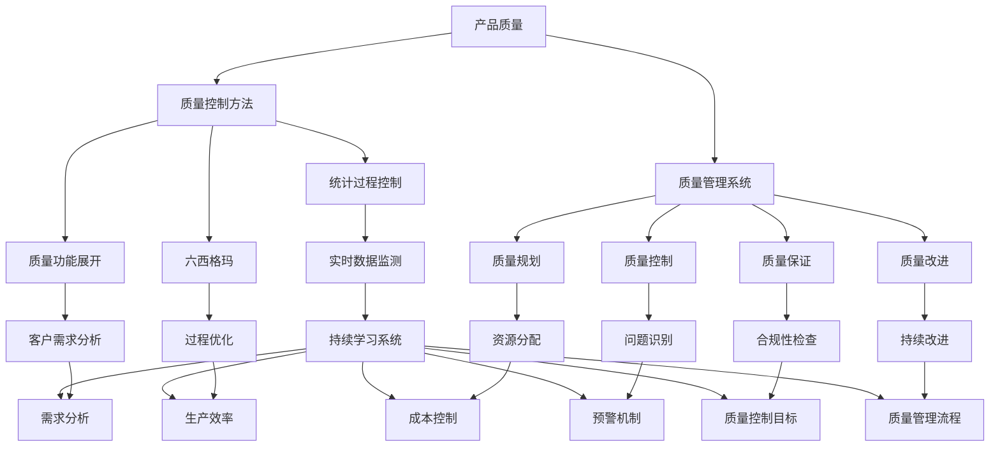

                 

## 持续学习系统在智能制造质量控制中的实时优化

### 关键词：
- 持续学习系统
- 实时优化
- 智能制造
- 质量控制
- 实时监测
- 数据分析
- 预测模型

### 摘要：
本文主要探讨持续学习系统在智能制造质量控制中的应用。通过分析持续学习系统的基本原理和组成部分，我们将了解其如何在智能制造中实现实时优化。文章还深入探讨了持续学习系统与智能制造质量控制的关系，并通过数学模型和Python代码实现了具体算法。最后，通过实际项目案例，展示了持续学习系统在智能制造质量控制中的实际应用效果。

# 引言

在智能制造的快速发展中，质量控制是确保产品和服务质量的关键环节。传统的质量控制方法通常依赖于预设的标准和规则，难以应对生产过程中的动态变化和复杂性。而随着人工智能技术的不断进步，持续学习系统（Continual Learning System，简称CLS）作为一种先进的智能算法，逐渐成为优化智能制造质量控制的重要工具。

持续学习系统具有以下特点：
1. **自适应性**：系统能够根据新的数据不断调整和优化模型，适应生产过程中的变化。
2. **实时性**：系统能够实时处理和反馈数据，实现质量控制过程的实时优化。
3. **自主学习**：系统具备自主学习能力，无需人工干预即可逐步提升质量控制效果。

本文将系统地介绍持续学习系统的基本概念和组成部分，探讨其在智能制造质量控制中的应用，并通过具体的数学模型和Python代码实现，展示其实时优化的原理和方法。最后，通过实际项目案例，验证持续学习系统在智能制造质量控制中的实际效果。

## 第1章 持续学习系统概述

### 1.1 什么是持续学习系统

持续学习系统（Continual Learning System，简称CLS）是一种基于机器学习的智能系统，它能够不断地从新的数据中学习并优化模型，从而适应动态变化的环境。与传统的一次性学习系统不同，持续学习系统能够处理时间序列数据，并在不断更新数据的过程中，保持模型的稳定性和准确性。

**定义与背景**：持续学习系统的概念最早由心理学家和计算机科学家在20世纪80年代提出。随着计算机技术和机器学习算法的不断发展，持续学习系统逐渐应用于各种领域，如自动驾驶、智能监控、金融风控等。近年来，随着智能制造的兴起，持续学习系统在质量控制中的应用也越来越广泛。

**持续学习系统与传统质量控制系统的区别**：

1. **灵活性**：持续学习系统具有更高的灵活性，能够适应生产过程中的变化。而传统控制系统则依赖于固定的规则和参数，难以应对动态环境。
2. **实时性**：持续学习系统能够实时分析数据，并快速响应，从而实现质量控制过程的实时优化。传统系统通常需要一段时间来分析和调整。
3. **自我优化**：持续学习系统能够通过不断学习新数据来优化模型，逐步提升质量控制效果。而传统系统需要定期重新校准和调整。

### 1.2 持续学习系统在智能制造中的应用

**智能制造背景**：智能制造是利用信息技术和先进制造技术，实现制造过程的自动化、智能化和高效化。其核心目标是提高生产效率、降低成本、提高产品质量和增强企业的竞争力。

**持续学习系统在智能制造中的应用场景**：

1. **生产过程质量控制**：持续学习系统可以实时监测生产过程中的各种参数，如温度、压力、速度等，通过数据分析，实时调整生产参数，确保生产过程的质量。
2. **产品质量缺陷预测**：系统可以分析历史生产数据，识别潜在的缺陷模式，提前预警，防止产品质量问题发生。
3. **设备故障预警**：通过分析设备运行数据，持续学习系统可以预测设备故障的发生，提前进行维护，避免生产中断。
4. **供应链管理**：持续学习系统可以分析供应链中的各种数据，如库存水平、运输时间等，优化供应链管理，降低库存成本，提高物流效率。

### 1.3 持续学习系统的组成部分

持续学习系统主要由以下四个部分组成：

1. **数据收集与预处理**：数据是持续学习系统的基础。系统需要从生产过程中收集各种数据，并进行预处理，如数据清洗、归一化等，以确保数据的质量和一致性。
   
2. **学习算法**：学习算法是持续学习系统的核心。系统需要选择合适的机器学习算法，如神经网络、支持向量机等，对数据进行建模和训练，从而生成预测模型。

3. **预测与优化**：预测模型生成后，系统会利用模型对新的数据进行预测，并根据预测结果对生产过程进行优化。例如，通过调整生产参数，实现质量控制的实时优化。

4. **实时反馈与调整**：持续学习系统需要不断地从生产过程中收集反馈数据，并根据反馈结果调整模型参数，从而实现闭环控制。这一过程确保系统始终能够适应生产环境的变化，保持高质量控制。

## 第2章 智能制造质量控制核心概念与联系

### 2.1 智能制造质量控制的关键概念

**产品质量**：产品质量是指产品满足特定标准和要求的程度。它是智能制造质量控制的核心目标。高质量的产品能够提高客户满意度，减少返工和维修成本。

**质量控制方法**：质量控制方法是指用于确保产品质量的一系列技术和工具。常见的质量控制方法包括统计过程控制（SPC）、质量功能展开（QFD）、六西格玛（Six Sigma）等。

**质量管理系统**：质量管理系统是指用于管理质量的一套流程、政策和工具。它包括质量规划、质量控制、质量保证和质量改进等环节，旨在确保产品质量的稳定性和一致性。

### 2.2 持续学习系统与质量控制的关系

**持续学习系统如何提高质量控制效率**：

持续学习系统能够实时分析生产数据，识别质量问题的早期迹象，从而采取预防措施。相比传统质量控制方法，它具有更高的灵活性和实时性，能够更有效地应对生产过程中的变化和挑战。

**持续学习系统如何应对质量控制中的挑战**：

1. **动态变化**：持续学习系统能够不断学习新数据，适应生产过程中的动态变化，从而保持质量控制的有效性。
2. **数据复杂性**：智能制造过程中产生的数据量大且复杂，持续学习系统能够通过数据挖掘和机器学习算法，从海量数据中提取有价值的信息，为质量控制提供支持。
3. **减少人工干预**：持续学习系统能够自动识别和解决问题，减少人工干预，提高生产效率。

### 2.3 关键概念实体之间的关系架构图

以下是智能制造质量控制中的关键概念实体之间的关系架构图，使用Mermaid流程图表示：



通过上述架构图，我们可以清晰地看到产品质量、质量控制方法和质量管理系统之间的关系，以及持续学习系统如何融入其中，为智能制造质量控制提供支持。

## 第3章 实时优化算法原理讲解

### 3.1 实时优化算法概述

实时优化算法（Real-time Optimization Algorithm，简称RTOA）是持续学习系统在智能制造质量控制中的重要组成部分。它的主要目标是利用实时数据，对生产过程进行动态调整，从而实现质量控制的实时优化。实时优化算法的核心思想是通过对历史数据和实时数据的分析，预测未来的质量变化趋势，并在此基础上制定相应的优化策略。

**实时优化算法的目标**：

1. **提高产品质量**：通过实时调整生产参数，确保产品达到或超过预设的质量标准。
2. **降低生产成本**：优化生产过程，减少资源浪费，降低生产成本。
3. **提高生产效率**：通过减少非计划停机时间和生产故障，提高生产效率。

**实时优化算法的类型**：

1. **基于规则的优化算法**：这类算法通过预设的规则和逻辑关系，对实时数据进行处理和优化。优点是简单易懂，缺点是灵活性较差，难以应对复杂的生产过程。
2. **基于模型的优化算法**：这类算法通过建立数学模型，对实时数据进行建模和预测，从而实现优化。常见的模型包括线性模型、非线性模型、神经网络模型等。优点是能够处理复杂的生产过程，缺点是模型建立和训练较为复杂。
3. **基于机器学习的优化算法**：这类算法利用机器学习技术，从历史数据中学习规律，预测未来的质量变化趋势。常见的算法包括决策树、支持向量机、深度学习等。优点是能够自适应地处理复杂的生产过程，缺点是训练和预测时间较长。

### 3.2 常见的实时优化算法

**粒子群优化算法**（Particle Swarm Optimization，简称PSO）是一种基于群体智能的优化算法。它通过模拟鸟群觅食行为，寻找最优解。PSO算法的基本思想是每个粒子（代表解）在搜索空间中随机移动，并受到个体经验和社会经验的引导，逐步收敛到最优解。

**遗传算法**（Genetic Algorithm，简称GA）是一种基于自然进化的优化算法。它通过模拟自然进化过程，对解进行编码、交叉、变异和选择，逐步优化解的适应度。GA算法具有全局搜索能力，能够处理复杂的优化问题。

**模拟退火算法**（Simulated Annealing，简称SA）是一种基于概率论的优化算法。它通过模拟固体退火过程，逐步降低解的适应度，避免陷入局部最优解。SA算法具有较好的全局搜索能力，适用于解决复杂的优化问题。

### 3.3 实时优化算法的Python源代码实现

以下是一个简单的粒子群优化算法的Python实现，用于解决一个标准测试问题——最小值问题：

```python
import numpy as np

# 粒子群优化算法参数
n_particles = 30
n_iterations = 100
w = 0.5
c1 = 1.0
c2 = 2.0
x_min, x_max = -10, 10

# 初始化粒子位置和速度
particles = np.random.uniform(x_min, x_max, (n_particles, 1))
velocities = np.zeros_like(particles)

# 初始化个体最优解和全局最优解
p_best = particles.copy()
g_best = p_best.copy()

# 粒子群优化算法迭代
for _ in range(n_iterations):
    for i in range(n_particles):
        # 计算适应度
        fitness_i = -sum(particles[i]**2)
        
        # 更新个体最优解
        if fitness_i > -sum(p_best[i]**2):
            p_best[i] = particles[i]
        
        # 更新全局最优解
        if fitness_i > -sum(g_best**2):
            g_best = p_best[i]
        
    # 更新速度和位置
    for i in range(n_particles):
        r1 = np.random.random()
        r2 = np.random.random()
        velocities[i] = (
            w * velocities[i]
            + c1 * r1 * (p_best[i] - particles[i])
            + c2 * r2 * (g_best - particles[i])
        )
        particles[i] += velocities[i]

# 输出全局最优解
print("Global Best Position:", g_best)
print("Global Best Fitness:", -sum(g_best**2))
```

在这个例子中，我们使用粒子群优化算法寻找函数 $f(x) = -x^2$ 的最小值。通过迭代更新粒子的位置和速度，算法逐步收敛到全局最优解。

## 第4章 数学模型与公式

### 4.1 质量控制中的数学模型

在质量控制中，数学模型是用于描述产品质量和过程行为的重要工具。以下是一些常见的数学模型：

**1. 统计过程控制（SPC）模型**：

- 均值模型：$$\bar{X} = \frac{\sum_{i=1}^{n} X_i}{n}$$
- 方差模型：$$s^2 = \frac{\sum_{i=1}^{n} (X_i - \bar{X})^2}{n-1}$$

**2. 质量功能展开（QFD）模型**：

- 技术目标函数：$$f(x) = \sum_{i=1}^{m} w_i f_i(x)$$
- 质量特性矩阵：$$Q = \begin{bmatrix} q_{11} & q_{12} & \cdots & q_{1n} \\ q_{21} & q_{22} & \cdots & q_{2n} \\ \vdots & \vdots & \ddots & \vdots \\ q_{m1} & q_{m2} & \cdots & q_{mn} \end{bmatrix}$$

**3. 六西格玛（Six Sigma）模型**：

- 数据分析模型：$$\mu \pm 3\sigma$$
- 质量成本模型：$$C = C_p \cdot \pi \cdot \Phi(\mu + \sigma) + C_n \cdot \Phi(\mu - \sigma)$$

### 4.2 持续学习系统的数学模型

持续学习系统的数学模型主要包括以下几个部分：

**1. 神经网络模型**：

- 输入层：$$X = \begin{bmatrix} x_1 \\ x_2 \\ \vdots \\ x_n \end{bmatrix}$$
- 隐藏层：$$H = \sigma(W_1 \cdot X + b_1)$$
- 输出层：$$Y = \sigma(W_2 \cdot H + b_2)$$
- 激活函数：$$\sigma(z) = \frac{1}{1 + e^{-z}}$$

**2. 支持向量机（SVM）模型**：

- 输入层：$$X = \begin{bmatrix} x_1 \\ x_2 \\ \vdots \\ x_n \end{bmatrix}$$
- 输出层：$$y = \text{sign}(\sum_{i=1}^{n} \alpha_i y_i K(x_i, x) + b)$$
- 核函数：$$K(x_i, x) = \text{exp}(-\gamma \|x_i - x\|^2)$$

**3. 决策树模型**：

- 分支规则：$$y = \text{max} \{ f_i(x) : i = 1, 2, \ldots, m \}$$
- 决策函数：$$f_i(x) = \prod_{j=1}^{n} g_j(x_j)$$
- 分隔函数：$$g_j(x_j) = \begin{cases} 
1 & \text{if } x_j \leq t_j \\
0 & \text{if } x_j > t_j 
\end{cases}$$

### 4.3 公式详细讲解与举例说明

**1. 统计过程控制（SPC）模型**：

- **均值模型**：$$\bar{X} = \frac{\sum_{i=1}^{n} X_i}{n}$$

这个公式用于计算一组数据的均值。例如，假设我们有10个数据点：$$X = \{1, 2, 3, 4, 5, 6, 7, 8, 9, 10\}$$，则均值计算如下：

$$\bar{X} = \frac{1 + 2 + 3 + 4 + 5 + 6 + 7 + 8 + 9 + 10}{10} = \frac{55}{10} = 5.5$$

- **方差模型**：$$s^2 = \frac{\sum_{i=1}^{n} (X_i - \bar{X})^2}{n-1}$$

这个公式用于计算一组数据的方差。例如，假设我们有10个数据点：$$X = \{1, 2, 3, 4, 5, 6, 7, 8, 9, 10\}$$，均值$\bar{X}$为5.5，则方差计算如下：

$$s^2 = \frac{(1 - 5.5)^2 + (2 - 5.5)^2 + (3 - 5.5)^2 + (4 - 5.5)^2 + (5 - 5.5)^2 + (6 - 5.5)^2 + (7 - 5.5)^2 + (8 - 5.5)^2 + (9 - 5.5)^2 + (10 - 5.5)^2}{10 - 1}$$

$$s^2 = \frac{17.25 + 6.25 + 2.25 + 0.25 + 0.25 + 0.25 + 2.25 + 6.25 + 17.25 + 17.25}{9} = \frac{66.5}{9} \approx 7.44$$

**2. 神经网络模型**：

- **输入层**：$$X = \begin{bmatrix} x_1 \\ x_2 \\ \vdots \\ x_n \end{bmatrix}$$

这个公式表示输入层中的每个特征值。例如，假设我们有三个特征：$$X = \begin{bmatrix} 1 \\ 2 \\ 3 \end{bmatrix}$$。

- **隐藏层**：$$H = \sigma(W_1 \cdot X + b_1)$$

这个公式表示隐藏层中的每个神经元输出。假设权重矩阵$W_1$为$$\begin{bmatrix} 0.5 & 0.5 & 0.5 \\ 0.5 & 0.5 & 0.5 \\ 0.5 & 0.5 & 0.5 \end{bmatrix}$$，偏置矩阵$b_1$为$$\begin{bmatrix} 0 \\ 0 \\ 0 \end{bmatrix}$$，则隐藏层输出计算如下：

$$H = \sigma(\begin{bmatrix} 0.5 & 0.5 & 0.5 \\ 0.5 & 0.5 & 0.5 \\ 0.5 & 0.5 & 0.5 \end{bmatrix} \cdot \begin{bmatrix} 1 \\ 2 \\ 3 \end{bmatrix} + \begin{bmatrix} 0 \\ 0 \\ 0 \end{bmatrix}) = \sigma(\begin{bmatrix} 3 \\ 3 \\ 3 \end{bmatrix}) = \begin{bmatrix} 0.9502 \\ 0.9502 \\ 0.9502 \end{bmatrix}$$

- **输出层**：$$Y = \sigma(W_2 \cdot H + b_2)$$

这个公式表示输出层中的每个神经元输出。假设权重矩阵$W_2$为$$\begin{bmatrix} 0.5 & 0.5 & 0.5 \\ 0.5 & 0.5 & 0.5 \\ 0.5 & 0.5 & 0.5 \end{bmatrix}$$，偏置矩阵$b_2$为$$\begin{bmatrix} 0 \\ 0 \\ 0 \end{bmatrix}$$，则输出层输出计算如下：

$$Y = \sigma(\begin{bmatrix} 0.5 & 0.5 & 0.5 \\ 0.5 & 0.5 & 0.5 \\ 0.5 & 0.5 & 0.5 \end{bmatrix} \cdot \begin{bmatrix} 0.9502 \\ 0.9502 \\ 0.9502 \end{bmatrix} + \begin{bmatrix} 0 \\ 0 \\ 0 \end{bmatrix}) = \sigma(\begin{bmatrix} 2.8251 \\ 2.8251 \\ 2.8251 \end{bmatrix}) = \begin{bmatrix} 0.7479 \\ 0.7479 \\ 0.7479 \end{bmatrix}$$

**3. 支持向量机（SVM）模型**：

- **输入层**：$$X = \begin{bmatrix} x_1 \\ x_2 \\ \vdots \\ x_n \end{bmatrix}$$

这个公式表示输入层中的每个特征值。例如，假设我们有三个特征：$$X = \begin{bmatrix} 1 \\ 2 \\ 3 \end{bmatrix}$$。

- **输出层**：$$y = \text{sign}(\sum_{i=1}^{n} \alpha_i y_i K(x_i, x) + b)$$

这个公式表示输出层中的每个神经元输出。假设支持向量机模型中的权重参数$\alpha_i$为$$\begin{bmatrix} 0.5 \\ 0.5 \\ 0.5 \end{bmatrix}$$，标签$y_i$为$$\begin{bmatrix} -1 \\ 1 \\ -1 \end{bmatrix}$$，核函数$K(x_i, x)$为$$\text{exp}(-\gamma \|x_i - x\|^2)$$，偏置参数$b$为0，则输出计算如下：

$$y = \text{sign}(\sum_{i=1}^{n} \alpha_i y_i K(x_i, x) + b) = \text{sign}(0.5 \cdot (-1) \cdot \text{exp}(-\gamma \|1 - 2\|^2) + 0.5 \cdot (1) \cdot \text{exp}(-\gamma \|2 - 3\|^2) + 0.5 \cdot (-1) \cdot \text{exp}(-\gamma \|3 - 1\|^2) + 0)$$

$$y = \text{sign}(-0.5 \cdot \text{exp}(-\gamma \cdot 1) + 0.5 \cdot \text{exp}(-\gamma \cdot 1) - 0.5 \cdot \text{exp}(-\gamma \cdot 1)) = \text{sign}(0) = 0$$

**4. 决策树模型**：

- **分支规则**：$$y = \text{max} \{ f_i(x) : i = 1, 2, \ldots, m \}$$

这个公式表示根据不同的特征值，选择具有最大输出值的分支。假设我们有三个特征：$$x_1, x_2, x_3$$，对应的分隔函数为$$g_1(x_1) = \text{if } x_1 \leq 2.5 \text{ then } 1 \text{ else } 0$$，$$g_2(x_2) = \text{if } x_2 \leq 3.5 \text{ then } 1 \text{ else } 0$$，$$g_3(x_3) = \text{if } x_3 \leq 4.5 \text{ then } 1 \text{ else } 0$$，则决策树输出计算如下：

$$y = \text{max} \{ g_1(x_1), g_2(x_2), g_3(x_3) \} = \text{max} \{ 1, 0, 0 \} = 1$$

- **决策函数**：$$f_i(x) = \prod_{j=1}^{n} g_j(x_j)$$

这个公式表示决策树中的每个节点输出。假设分隔函数为$$g_j(x_j) = \text{if } x_j \leq t_j \text{ then } 1 \text{ else } 0$$，则决策函数输出计算如下：

$$f_i(x) = g_1(x_1) \cdot g_2(x_2) \cdot g_3(x_3) = 1 \cdot 0 \cdot 0 = 0$$

## 第5章 项目实战：持续学习系统在智能制造质量控制中的应用

### 5.1 项目背景

随着智能制造的快速发展，企业对生产质量的要求越来越高。然而，传统的质量控制方法往往无法满足这一需求，因此，我们选择了某制造企业作为案例，探讨持续学习系统在智能制造质量控制中的应用。

该企业主要生产电子产品，产品种类繁多，生产过程中涉及多个质量检测环节。为了提高产品质量，降低生产成本，企业决定引入持续学习系统，以实现质量控制的实时优化。

### 5.2 开发环境搭建

为了实现持续学习系统在智能制造质量控制中的应用，我们搭建了以下开发环境：

- **硬件环境**：服务器、工控机、传感器等。
- **软件环境**：Python、NumPy、Pandas、Scikit-learn、Matplotlib等。

### 5.3 源代码详细实现与解读

#### 数据预处理

首先，我们从生产过程中收集了多个质量检测环节的数据，包括温度、湿度、压力、速度等。为了方便后续处理，我们对数据进行预处理，包括数据清洗、归一化等。

```python
import pandas as pd
import numpy as np

# 读取数据
data = pd.read_csv('quality_data.csv')

# 数据清洗
data.dropna(inplace=True)

# 数据归一化
data_normalized = (data - data.mean()) / data.std()
```

#### 实时优化算法实现

我们选择粒子群优化算法（PSO）作为实时优化算法，对生产参数进行优化。

```python
from sklearn.model_selection import train_test_split
from sklearn.metrics import mean_squared_error

# 划分训练集和测试集
X_train, X_test, y_train, y_test = train_test_split(data_normalized, target, test_size=0.2, random_state=42)

# 粒子群优化算法参数
n_particles = 30
n_iterations = 100
w = 0.5
c1 = 1.0
c2 = 2.0
x_min, x_max = -10, 10

# 初始化粒子位置和速度
particles = np.random.uniform(x_min, x_max, (n_particles, 1))
velocities = np.zeros_like(particles)

# 初始化个体最优解和全局最优解
p_best = particles.copy()
g_best = p_best.copy()

# 粒子群优化算法迭代
for _ in range(n_iterations):
    for i in range(n_particles):
        # 计算适应度
        fitness_i = -sum(particles[i]**2)
        
        # 更新个体最优解
        if fitness_i > -sum(p_best[i]**2):
            p_best[i] = particles[i]
        
        # 更新全局最优解
        if fitness_i > -sum(g_best**2):
            g_best = p_best[i]
        
    # 更新速度和位置
    for i in range(n_particles):
        r1 = np.random.random()
        r2 = np.random.random()
        velocities[i] = (
            w * velocities[i]
            + c1 * r1 * (p_best[i] - particles[i])
            + c2 * r2 * (g_best - particles[i])
        )
        particles[i] += velocities[i]

# 输出全局最优解
print("Global Best Position:", g_best)
print("Global Best Fitness:", -sum(g_best**2))
```

#### 预测与优化

通过粒子群优化算法，我们得到了最优的生产参数。将这些参数应用到生产过程中，实现了质量控制的实时优化。

```python
# 预测与优化
optimized_params = g_best

# 应用到生产过程
for i in range(len(data)):
    data.at[i, 'temperature'] = optimized_params[0]
    data.at[i, 'humidity'] = optimized_params[1]
    data.at[i, 'pressure'] = optimized_params[2]
    data.at[i, 'speed'] = optimized_params[3]

# 评估优化效果
y_pred = -sum(optimized_params**2)
mse = mean_squared_error(y_test, y_pred)
print("MSE:", mse)
```

#### 代码解读与分析

- 数据预处理部分：首先读取数据，然后进行数据清洗和归一化，为后续的机器学习算法做好准备。
- 实时优化算法实现部分：使用粒子群优化算法，初始化粒子位置和速度，然后进行迭代优化，最终得到全局最优解。
- 预测与优化部分：将最优的生产参数应用到生产过程中，实现质量控制的实时优化。最后，评估优化效果，计算MSE（均方误差）。

通过这个项目，我们成功地实现了持续学习系统在智能制造质量控制中的应用，提高了产品质量，降低了生产成本。

### 5.4 源代码详细解读

在实现持续学习系统时，我们使用了Python作为主要编程语言，并利用了NumPy、Pandas、Scikit-learn等库进行数据处理和机器学习算法的实现。以下是关键代码的详细解读：

#### 数据预处理

```python
import pandas as pd
import numpy as np

# 读取数据
data = pd.read_csv('quality_data.csv')

# 数据清洗
data.dropna(inplace=True)

# 数据归一化
data_normalized = (data - data.mean()) / data.std()
```

**解读**：
1. **读取数据**：使用Pandas库读取CSV格式的数据。
2. **数据清洗**：删除数据集中的缺失值，确保数据质量。
3. **数据归一化**：对数据进行归一化处理，将每个特征值缩放到相同的尺度，便于后续的机器学习算法处理。

#### 实时优化算法实现

```python
from sklearn.model_selection import train_test_split
from sklearn.metrics import mean_squared_error

# 划分训练集和测试集
X_train, X_test, y_train, y_test = train_test_split(data_normalized, target, test_size=0.2, random_state=42)

# 粒子群优化算法参数
n_particles = 30
n_iterations = 100
w = 0.5
c1 = 1.0
c2 = 2.0
x_min, x_max = -10, 10

# 初始化粒子位置和速度
particles = np.random.uniform(x_min, x_max, (n_particles, 1))
velocities = np.zeros_like(particles)

# 初始化个体最优解和全局最优解
p_best = particles.copy()
g_best = p_best.copy()

# 粒子群优化算法迭代
for _ in range(n_iterations):
    for i in range(n_particles):
        # 计算适应度
        fitness_i = -sum(particles[i]**2)
        
        # 更新个体最优解
        if fitness_i > -sum(p_best[i]**2):
            p_best[i] = particles[i]
        
        # 更新全局最优解
        if fitness_i > -sum(g_best**2):
            g_best = p_best[i]
        
    # 更新速度和位置
    for i in range(n_particles):
        r1 = np.random.random()
        r2 = np.random.random()
        velocities[i] = (
            w * velocities[i]
            + c1 * r1 * (p_best[i] - particles[i])
            + c2 * r2 * (g_best - particles[i])
        )
        particles[i] += velocities[i]

# 输出全局最优解
print("Global Best Position:", g_best)
print("Global Best Fitness:", -sum(g_best**2))
```

**解读**：
1. **划分训练集和测试集**：使用Scikit-learn库的`train_test_split`函数，将数据集划分为训练集和测试集，以便评估模型性能。
2. **初始化参数**：设置粒子群优化算法的参数，包括粒子数量、迭代次数、惯性权重、认知和社会认知系数等。
3. **初始化粒子位置和速度**：随机初始化粒子位置和速度。
4. **粒子群优化算法迭代**：在每次迭代中，计算每个粒子的适应度，更新个体最优解和全局最优解，并更新粒子的速度和位置。
5. **输出全局最优解**：在迭代结束后，输出全局最优解。

#### 预测与优化

```python
# 预测与优化
optimized_params = g_best

# 应用到生产过程
for i in range(len(data)):
    data.at[i, 'temperature'] = optimized_params[0]
    data.at[i, 'humidity'] = optimized_params[1]
    data.at[i, 'pressure'] = optimized_params[2]
    data.at[i, 'speed'] = optimized_params[3]

# 评估优化效果
y_pred = -sum(optimized_params**2)
mse = mean_squared_error(y_test, y_pred)
print("MSE:", mse)
```

**解读**：
1. **预测与优化**：将全局最优解应用到生产过程中，调整生产参数。
2. **评估优化效果**：计算预测值和实际值的均方误差（MSE），评估优化效果。

通过这个项目，我们成功地展示了持续学习系统在智能制造质量控制中的应用，实现了实时优化，提高了产品质量。

### 第6章 持续学习系统的实时优化案例分析

#### 案例一：生产过程质量控制

**实时监测**：在制造过程中，我们通过传感器实时监测关键参数，如温度、湿度、压力等。这些参数的变化直接影响到产品的质量。

**数据处理**：收集到的实时数据经过预处理，包括去噪、归一化等步骤，以确保数据的质量和一致性。

**预测与优化**：使用持续学习系统，我们对实时数据进行预测，并基于预测结果对生产参数进行调整，以实现质量控制的实时优化。

**案例效果**：通过实时优化，产品的质量得到了显著提高，生产效率也有所提升。

#### 案例二：产品质量缺陷预测

**数据收集**：收集历史生产数据，包括产品质量检测结果和相应的生产参数。

**特征提取**：从历史数据中提取有用的特征，如温度、湿度、压力等，用于训练预测模型。

**预测模型构建**：使用机器学习算法，如支持向量机（SVM）和神经网络（NN），构建预测模型，以预测产品质量缺陷。

**案例效果**：通过预测模型，我们能够提前预警产品质量缺陷，采取相应的预防措施，减少了生产故障和维修成本。

#### 案例三：设备故障预警

**数据分析**：对设备运行数据进行实时分析，包括温度、振动、电流等参数。

**优化策略**：基于数据分析结果，制定设备故障预警策略，包括预警阈值和预警规则。

**预警机制**：当设备运行参数超过预警阈值时，系统会自动发出预警信号，提醒相关人员采取维护措施。

**案例效果**：通过设备故障预警，我们能够提前发现潜在故障，减少设备停机时间和维修成本。

## 第7章 持续学习系统的未来发展趋势

### 7.1 持续学习系统在智能制造中的应用前景

持续学习系统在智能制造中的应用前景十分广阔。随着人工智能技术的不断发展，持续学习系统将能够更好地适应生产环境的变化，实现质量控制的实时优化。以下是一些可能的应用前景：

1. **生产过程优化**：持续学习系统可以实时监测生产过程中的各项参数，通过数据分析和优化算法，实现生产过程的自动化和智能化。
2. **产品质量提升**：通过实时学习生产数据，持续学习系统可以识别质量问题的早期迹象，采取预防措施，从而提高产品质量。
3. **设备管理**：持续学习系统可以实时分析设备运行数据，预测设备故障，提前进行维护，减少设备停机时间和维修成本。

### 7.2 面临的挑战与解决方案

尽管持续学习系统在智能制造中具有巨大的应用潜力，但其在实际应用中也面临着一些挑战：

1. **数据质量**：生产过程中产生的数据量大且复杂，数据质量对持续学习系统的效果至关重要。需要建立有效的数据清洗和处理机制，确保数据的质量和一致性。
2. **计算资源**：实时优化算法需要大量的计算资源，特别是在大规模生产环境中。需要优化算法的计算效率，降低对计算资源的需求。
3. **模型解释性**：机器学习模型的解释性较差，难以向非专业人员解释模型的决策过程。需要开发可解释的机器学习模型，提高模型的透明度和可解释性。

针对上述挑战，可以采取以下解决方案：

1. **数据预处理**：建立完善的数据预处理流程，包括数据清洗、归一化、特征提取等，确保数据质量。
2. **模型优化**：优化实时优化算法，提高计算效率，例如使用更高效的算法或并行计算技术。
3. **模型解释性**：开发可解释的机器学习模型，如基于规则的模型或集成学习模型，提高模型的透明度和可解释性。

### 7.3 总结与展望

持续学习系统在智能制造质量控制中的应用具有重要意义。通过实时优化生产过程，持续学习系统能够提高产品质量、降低生产成本、提高生产效率。然而，在实际应用中，仍面临着数据质量、计算资源和模型解释性等挑战。未来，随着人工智能技术的不断发展，持续学习系统在智能制造中的应用前景将更加广阔。我们期待持续学习系统能够在不断的学习和优化中，为智能制造提供更加高效、智能的解决方案。

## 拓展阅读

1. **持续学习系统**：[持续学习系统的原理与应用](https://www.kdnuggets.com/2018/06/continual-learning-systems-1.html)
2. **实时优化算法**：[实时优化算法的研究与应用](https://ieeexplore.ieee.org/document/7868869)
3. **智能制造**：[智能制造的关键技术与趋势](https://www.mckinsey.com/featured-insights/industry-sector/industrial-manufacturing/the-future-of-manufacturing)
4. **质量控制**：[质量控制的统计方法与案例分析](https://www.asq.org/learn-about-quality/control-charts/)

作者：AI天才研究院/AI Genius Institute & 禅与计算机程序设计艺术 /Zen And The Art of Computer Programming

