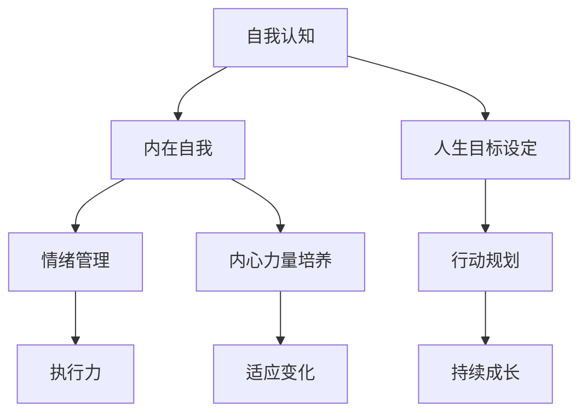

                 

### 掌控人生方向：成为内心的舵手

在快节奏的现代社会中，人生方向的选择和把握变得尤为重要。每个人都渴望找到自己的使命，追求内心的平静与幸福。然而，如何确定人生方向，如何在纷繁复杂的环境中保持内心的坚定，成为了一个值得深入探讨的问题。《掌控人生方向：成为内心的舵手》旨在帮助读者通过自我认知、内在成长、目标设定、行动规划和情绪管理等方面，找到内心的舵手，掌握人生方向，实现自我价值。

本文将围绕以下五个核心关键词展开讨论：

1. **自我认知**：理解自我，认识自我是掌控人生方向的基础。
2. **内在成长**：通过自我探索，培养内心的力量，助力人生成长。
3. **目标设定**：明确人生目标，为行动提供方向和动力。
4. **行动规划**：制定切实可行的计划，确保目标的实现。
5. **情绪管理**：保持心态平衡，应对生活中的各种挑战。

通过这些核心关键词的深入分析，本文将帮助读者理解如何在纷繁复杂的社会中，找到内心的方向，成为自己人生旅程中的舵手。

### 摘要

本文旨在探讨如何通过自我认知、内在成长、目标设定、行动规划和情绪管理等方面，掌控人生方向，成为内心的舵手。自我认知是理解自我、认识自我的过程，是掌控人生方向的基础。内在成长则通过自我探索，培养内心的力量，助力人生成长。明确人生目标，制定切实可行的计划，确保目标的实现，是行动规划的核心。而情绪管理则帮助保持心态平衡，应对生活中的各种挑战。通过这些方法的综合应用，读者将能够找到内心的方向，成为自己人生旅程中的主导者，实现自我价值。

## 第一部分：自我认知与内在成长

### 第1章：自我认知的重要性

#### 1.1 自我认知的概念与意义

自我认知是指个体对自身心理状态、能力、性格特征、价值观等内在特性的认识和了解。它不仅仅局限于对自己外在行为的观察和反思，更深入到对内心世界的理解和洞察。自我认知作为一种复杂的心理过程，具有以下几个关键意义：

首先，自我认知有助于个人理解自身的行为动机。通过深入反思和分析，个体能够识别出自己行为背后的深层原因。这种自我觉察能够帮助个体在面对决策困境时，更加清晰地认识自己的需求、欲望和价值观，从而做出更加符合自身利益的选择。

其次，自我认知对于个人成长具有重要意义。通过自我认知，个体能够识别出自身的优点和不足，从而在自我提升过程中，有的放矢地进行改进。自我认知有助于个体形成积极的心态，增强自信心，从而在面对挑战时更加坚定和从容。

再者，自我认知有助于建立健康的人际关系。了解自己的性格特征、情感需求和沟通方式，能够帮助个体更好地与他人互动，避免因误解和冲突而导致的隔阂。通过自我认知，个体能够更加有效地表达自己的需求和感受，增强沟通的效果，建立更加稳固和谐的人际关系。

然而，自我认知并非易事，它需要个体具备一定的心理成熟度和反思能力。在现代社会，由于信息过载和快节奏的生活，人们往往忽略了对自身的反思和认识。因此，许多人在面对人生重大决策时，缺乏清晰的方向和目标，容易感到迷茫和困惑。

#### 1.2 自我认知的核心要素

自我认知的核心要素主要包括以下几个方面：

1. **自我意识**：自我意识是个体对自身存在和身份的感知，是自我认知的基础。它涉及对自身身体、心理状态和角色的认识。例如，个体是否能够意识到自己的情绪变化，是否能够认识到自己在社会中的角色和责任。

2. **自我评价**：自我评价是个体对自己能力、价值和价值的评价。它既包括对自己优点和长处的认可，也包括对自己缺点和不足的反思。健康的自我评价能够帮助个体建立积极的自我形象，提高自信心和自尊心。

3. **自我监控**：自我监控是个体对自己行为和情绪的监督和调节。它包括对自己行为的自我指导、自我纠正和自我激励。通过自我监控，个体能够更好地控制自己的情绪和行为，提高自律性和自我管理能力。

4. **自我效能感**：自我效能感是指个体对自己完成特定任务的信心和能力感知。高自我效能感的个体往往更加自信和坚定，能够在面对挑战时表现出更强的应对能力和适应能力。

#### 1.3 自我认知的障碍与挑战

尽管自我认知对于个人成长和幸福具有重要意义，但在实际过程中，个体常常面临一系列障碍和挑战：

1. **自我防御机制**：人们常常用自我防御机制来保护自己，避免面对内心深处的痛苦和不安。例如，否认、合理化、投射等机制，虽然短期内能够减少焦虑和痛苦，但长期来看，会阻碍自我认知的发展。

2. **文化和社会影响**：个体的自我认知受到文化和社会背景的深刻影响。例如，某些文化强调集体主义，个体可能因此忽视自我认知的重要性，而更加注重社会期望和集体利益。

3. **情绪干扰**：情绪对自我认知具有重要影响。在强烈的情绪状态下，个体可能难以保持客观和清晰的思维，从而影响自我认知的准确性。

4. **信息过载**：现代社会信息过载，个体常常感到疲惫和困惑，缺乏时间和精力进行深入的自我反思和认知。这种信息过载可能导致个体对于自身的认知变得模糊和肤浅。

总之，自我认知是一个复杂而多层次的过程，需要个体持续的努力和反思。通过克服这些障碍和挑战，个体能够更好地认识自我，为人生方向的掌控奠定坚实基础。

#### 1.4 自我认知与人生方向的关系

自我认知与人生方向之间存在着密切的联系。一个清晰、准确的自我认知可以帮助个体更好地确定自己的人生目标，从而找到明确的人生方向。具体来说，这种关系可以从以下几个方面进行阐述：

首先，自我认知为个体提供了自我定位的基础。通过深入理解和分析自己的性格、兴趣、价值观和能力，个体能够明确自己在社会和职业环境中的位置。这种自我定位不仅有助于个体在职业规划中做出明智的决策，还能够帮助个体在日常生活中更加自信和从容地应对各种挑战。

其次，自我认知帮助个体识别和追求自己的核心目标。每个人都有自己的梦想和追求，但这些梦想往往需要在自我认知的基础上进行筛选和确认。一个清晰的自我认知能够让个体更加明确自己的核心目标，从而更有动力去追求和实现这些目标。

再者，自我认知有助于个体在面对选择时做出明智的决策。在现代社会中，个体常常面临多种选择，而这些选择往往涉及到个人价值观和人生目标的实现。通过自我认知，个体能够更好地理解自己的需求和期望，从而做出更加符合自身利益和目标的决策。

最后，自我认知有助于个体在实现目标的过程中保持动力和毅力。在追求人生目标的过程中，个体难免会遇到挫折和困难。一个清晰的自我认知能够帮助个体在困境中保持积极的心态，增强应对挑战的信心和勇气，从而更加坚定地朝着自己的目标前进。

总之，自我认知是掌控人生方向的重要基石。通过深入理解自我，个体能够更好地确定自己的人生目标，找到明确的人生方向，并在实现目标的过程中保持动力和毅力。

### 第2章：探索内在自我

#### 2.1 内在自我的定义与特点

内在自我，通常指的是个体在心理和精神层面的深层次存在，它超越了表面行为和外在表现，涉及个体内心深处的情感、思想、信念和价值体系。与外在自我相对，内在自我更注重个体的内心体验和主观感受，是自我认知的核心部分。内在自我的定义和特点可以从以下几个方面进行详细阐述：

首先，内在自我具有主观性和个体性。它是个体对自己内在体验的主观感知，每个人的内在自我都是独一无二的，反映了其个人经历、性格特点和价值观。因此，内在自我是个体自我认知的重要组成部分，对个体的行为和决策产生深远影响。

其次，内在自我具有动态性。它不是静止不变的，而是随着个体经历、环境和心理状态的变化而不断演变。例如，一个人在经历重大变故后，其内在自我可能会发生显著变化，从而影响其行为和态度。

第三，内在自我与外在自我相互作用。外在自我是内在自我的表现，而内在自我则对个体的外在行为产生指导作用。例如，一个内心充满自信和自尊的人，其外在行为往往会表现出自信和坚定，而一个内心焦虑和不安的人，其外在行为可能表现出紧张和犹豫。

第四，内在自我具有潜在性和隐蔽性。它通常深藏于个体的内心深处，不易被他人直接观察和了解。这种潜在性和隐蔽性使得内在自我成为个体自我认知中的一个重要而复杂的部分。

#### 2.2 探索内在自我的方法

探索内在自我是一个深层次、持续性的过程，需要个体投入时间和精力，通过多种方法和途径进行反思和自我认知。以下是几种常见的探索内在自我的方法：

1. **反思和冥想**：反思和冥想是探索内在自我的有效方法。通过静心冥想，个体可以暂时放下外界的干扰，深入自己的内心世界，反思自己的情感、思想和行为。这种方法有助于个体更加清晰地认识自己，发现内心的需求和困惑。

2. **日记记录**：保持日记是一种简单而有效的自我探索方式。通过记录日常生活、情感波动和思考过程，个体可以追踪自己的心理变化，发现潜在的心理问题和情绪困扰。日记记录不仅可以帮助个体进行自我反思，还可以作为一种长期的自我认知工具。

3. **心理咨询**：心理咨询是一种专业的自我探索方式，通过专业的心理咨询师的帮助，个体可以更深入地了解自己的内在自我。心理咨询提供了一个安全、中立的空间，个体可以自由地表达自己的内心感受，探索未知的自我领域。

4. **心理测试**：心理测试，如MBTI（迈尔斯-布里格斯性格类型指标）和霍兰德职业兴趣测试等，可以帮助个体从不同角度了解自己的性格特征和兴趣倾向。这些测试结果可以作为自我探索的一部分，帮助个体更全面地认识自己。

5. **艺术创作**：通过绘画、写作、音乐等艺术形式，个体可以表达内心的情感和思想，探索未知的自我。艺术创作不仅是一种自我表达的方式，也是一种深层次的自我探索过程。

#### 2.3 内在自我与外在行为的关系

内在自我与外在行为之间的关系是相互影响、相互作用的。内在自我决定了个体的行为模式和价值观念，而外在行为则反映了内在自我的状态和特点。

首先，内在自我对个体行为具有指导作用。个体的性格、价值观和信念决定了其行为方式和态度。例如，一个内心充满自信和积极态度的人，往往会在工作和生活中表现出自信、果断和乐观的行为特征。

其次，外在行为是内在自我的表现。个体的外在行为是其内在自我状态的一种外在反映。例如，一个内心焦虑的人，其外在行为可能会表现出紧张、犹豫和不安。通过观察外在行为，可以一定程度上了解个体的内在自我状态。

此外，外在行为对内在自我也有影响。个体的行为不仅反映了其内在自我，同时也会影响其内在自我。例如，一个成功实现目标的个体，会因其外在行为的积极结果而增强自信心和内在自我价值感。反之，连续的失败和挫折可能会削弱个体的内在自我和自信心。

总之，内在自我与外在行为之间存在着复杂的互动关系。通过深入了解内在自我，个体可以更好地理解自己的行为模式，从而进行调整和改进，实现个人成长和发展。

### 第3章：培养内心的力量

#### 3.1 心灵的力量与人生方向

内心力量，通常指的是个体在心理和精神层面上的坚韧和韧性。这种力量不仅帮助个体应对生活中的挑战和压力，还能够指导个体找到人生方向，实现自我价值。心灵的力量与人生方向之间有着紧密的联系，以下从几个方面进行详细阐述：

首先，内心力量为个体提供了坚定的信念和明确的目标。一个内心强大的人，往往具有清晰的价值观和目标，能够在面对困难和诱惑时保持坚定，不被外界干扰所左右。这种信念和目标不仅为个体提供了前进的方向，还能够帮助个体在实现目标的过程中保持动力和毅力。

其次，内心力量增强了个体应对挑战的能力。生活中充满了各种不确定性和风险，一个内心强大的人能够更好地应对这些挑战。他们不仅能够保持冷静和理智，还能够迅速调整自己的心态，找到解决问题的方法。这种应对能力不仅有助于个体在事业上取得成功，还能够提升个体的生活质量和幸福感。

再者，内心力量有助于个体建立和谐的人际关系。一个内心强大的人通常能够更好地理解和包容他人，处理人际关系中的冲突和矛盾。他们不仅能够维护自己的立场，还能够尊重他人的感受，建立互信和合作的关系。这种人际关系能力对于个人职业发展和家庭生活的幸福都具有重要意义。

此外，内心力量对个体的心理健康有着积极的影响。一个内心强大的人通常能够更好地管理自己的情绪，避免因情绪波动而影响生活和工作。他们能够保持积极乐观的心态，减少焦虑和抑郁等负面情绪的出现。这种心理健康不仅有助于个体应对生活中的压力，还能够提升个体的整体幸福感和生活质量。

总之，内心力量是掌控人生方向的重要基石。它不仅为个体提供了坚定的信念和明确的目标，增强了应对挑战的能力，还有助于建立和谐的人际关系和保持心理健康。通过培养内心力量，个体能够更好地找到自己的人生方向，实现自我价值和幸福。

#### 3.2 心灵力量的培养途径

培养内心力量是一个长期而复杂的过程，需要个体投入时间和精力，通过多种途径和方法进行持续的努力。以下是一些有效的方法和步骤：

1. **自我反思**：自我反思是培养内心力量的重要途径。通过定期反思自己的行为、思想和情绪，个体可以更好地了解自己，发现内心的需求和困惑。这种方法有助于个体建立自我认知，增强自我控制能力，从而提升内心力量。

2. **情绪管理**：情绪管理是内心力量的重要组成部分。学会如何处理和管理自己的情绪，能够帮助个体在面对压力和挑战时保持冷静和理智。通过情绪管理技巧，如深呼吸、放松训练和正念冥想等，个体可以更好地控制自己的情绪，减少负面情绪对内心力量的影响。

3. **积极心态**：积极心态是培养内心力量的关键。一个积极的心态能够帮助个体更加乐观地看待生活中的困难和挑战，从而增强应对能力。通过培养感恩、乐观和自信等积极心态，个体可以提升内心的力量，面对生活中的各种挑战。

4. **自我激励**：自我激励是培养内心力量的有效方法。通过设定目标和奖励机制，个体可以激发自己的内在动力，持续努力实现目标。自我激励不仅能够帮助个体在追求目标的过程中保持动力，还能够增强自信心和内在自我价值感。

5. **学习与成长**：不断学习和成长是培养内心力量的重要途径。通过学习和掌握新知识和技能，个体可以提升自我能力和自信心，从而增强内心力量。此外，通过学习他人的成功经验和失败教训，个体可以借鉴和吸取教训，提升自己的内心力量。

6. **寻求支持**：寻求支持是培养内心力量的重要手段。在个体面对困难和挑战时，寻求家人、朋友或专业人士的支持和帮助，能够提供情感和实际的支持，帮助个体度过难关，增强内心力量。

总之，通过自我反思、情绪管理、积极心态、自我激励、学习和成长以及寻求支持等多种途径，个体可以有效地培养内心力量，提升自我认知和应对能力，从而更好地掌控人生方向，实现自我价值和幸福。

#### 3.3 心灵力量在日常生活中的应用

内心力量的培养不仅仅是一个理论上的过程，它更需要我们在日常生活中不断地应用和实践。以下是一些具体的例子，展示如何将内心力量应用到日常生活中：

首先，面对工作压力时，内心力量的重要性表现得尤为明显。一个内心强大的人在面对工作任务和压力时，能够保持冷静和专注，有条不紊地处理各项任务。他们会通过深呼吸和正念冥想来缓解紧张情绪，保持专注和高效。例如，当项目进度紧张时，他们不会因为焦虑而慌乱，而是会冷静地分析问题，制定解决方案，并一步步实施，最终成功完成任务。

其次，在人际关系中，内心力量同样发挥着重要作用。一个内心强大的人能够更好地处理人际关系中的冲突和矛盾。他们不会因为一时的情绪波动而说出伤害他人的话，而是会保持理智和尊重，通过沟通和妥协来解决问题。例如，在与同事发生意见分歧时，他们能够保持冷静，通过理性的讨论和协商找到双方都能接受的解决方案，从而维护和谐的工作关系。

再次，在应对生活中的突发事件时，内心力量能够帮助个体保持镇定和应对能力。例如，当遇到突如其来的意外情况，如交通拥堵、设备故障等，内心强大的人不会因为一时的恐慌而失去方向，他们会冷静地分析情况，迅速采取应对措施，解决问题。这种能力不仅有助于减轻自己的焦虑，还能够给身边的人带来积极的示范效应。

此外，内心力量在日常生活中的应用还包括自我激励和自我成长。一个内心强大的人不会因为一时的失败或挫折而放弃，他们会从失败中吸取教训，寻找改进的方法，持续努力。例如，在追求个人目标的过程中，当遇到困难和挑战时，他们会保持积极的心态，不断调整策略，寻找突破口，最终实现目标。

总之，内心力量在日常生活中的应用是多方面的，它不仅帮助个体更好地应对各种挑战和困难，还能够提升生活质量，实现个人价值和幸福感。通过不断实践和培养内心力量，个体能够在日常生活中更好地掌控自己的情绪和行为，实现个人成长和成功。

### 第4章：情绪管理

#### 4.1 情绪的本质与作用

情绪是心理学中一个重要的研究领域，它指的是个体在特定情境下产生的主观体验和生理反应。情绪的本质是复杂的，它不仅包括情感（如快乐、悲伤、愤怒等），还涉及生理反应（如心跳加快、呼吸急促等）。情绪的作用也是多方面的，对个体的行为、心理和身体健康都有着深远的影响。

首先，情绪对个体的行为具有调节作用。情绪可以激励或抑制个体的行为。例如，当个体感到快乐时，他们可能会更加积极、主动地参与社交活动；而当个体感到愤怒或悲伤时，他们可能会变得消极、回避社交。情绪调节个体行为的方式，不仅影响个体的当前行为，还可能影响其长期的行为模式。

其次，情绪对个体的心理状态有重要影响。情绪可以增强或削弱个体的心理感受和认知能力。积极的情绪，如快乐和满足，可以提高个体的自信心和幸福感，增强其心理韧性和应对能力。而消极的情绪，如焦虑和抑郁，可能会降低个体的心理状态，使其更容易感到压力和疲惫。

此外，情绪还对个体的身体健康产生显著影响。情绪波动可以引起一系列生理反应，如心跳加快、血压升高、免疫力下降等。长期的情绪压力和负面情绪，如长期焦虑和抑郁，可能导致身体疾病的产生，如心脏病、高血压、免疫系统功能下降等。

总之，情绪的本质是主观体验和生理反应的复杂组合，其作用涵盖了行为调节、心理状态和身体健康等多个方面。理解情绪的本质和作用，有助于个体更好地管理自己的情绪，提高生活质量，实现身心健康。

#### 4.2 常见情绪管理的误区

在情绪管理过程中，人们常常陷入一些误区，这些误区不仅影响情绪管理的有效性，还可能加剧个体的心理负担。以下是一些常见的情绪管理误区：

首先，抑制情绪是一种常见的误区。有些人认为，情绪是“不好的”，因此应该尽可能地抑制或隐藏。然而，这种做法实际上可能导致情绪积累，最终爆发成更强烈的负面情绪，甚至引发心理问题。例如，一个经常压抑愤怒的人，可能在某个压力巨大的时刻突然爆发，导致人际关系紧张。

其次，情绪逃避也是一种常见的误区。面对负面情绪时，有些人选择逃避，试图通过忽视或转移注意力来避免处理情绪。然而，这种方法并不能真正解决问题，反而可能使情绪问题变得复杂和持久。例如，一个面对焦虑的人，通过酗酒或过度工作来逃避焦虑，实际上可能加重焦虑感，并导致其他心理问题的出现。

第三，过度自我批评也是一个常见的情绪管理误区。有些人在情绪低落时，会对自己进行过度批评和指责，认为所有的问题都是自己的过错。这种消极的自我评价不仅会加重负面情绪，还会损害个体的自尊心和自信心。例如，一个在职场中遇到失败的人，可能会自责“我不够聪明”，这种过度自我批评会使其在未来面对挑战时缺乏信心。

最后，情绪压抑和压抑后的情绪爆发也是一种误区。长期的情绪压抑可能导致心理压力的积累，最终以情绪爆发的方式释放出来。这种爆发不仅会对个体自身造成伤害，还可能对周围人产生负面影响。例如，一个长期压抑愤怒的人，可能在某个瞬间突然爆发，导致人际关系破裂。

总之，了解并避免这些常见的情绪管理误区，有助于个体更有效地管理情绪，提升心理健康。通过积极的方法和策略，个体可以更好地应对情绪挑战，实现情绪平衡和内心的宁静。

#### 4.3 情绪管理的策略与实践

情绪管理是一项重要的心理技能，它不仅有助于提升生活质量，还能促进身心健康。以下介绍几种有效的情绪管理策略和实践方法，帮助读者更好地掌握情绪，保持内心的平和与稳定。

**1. 正念冥想**

正念冥想是一种通过集中注意力和深呼吸来缓解压力和负面情绪的练习。通过正念冥想，个体可以学会如何将注意力集中在当下的体验上，而不是过去的遗憾或未来的担忧。具体实践方法如下：

- **准备阶段**：选择一个安静、舒适的环境，保持身体和心灵的放松。
- **呼吸练习**：深吸一口气，屏住呼吸几秒钟，然后缓缓呼气。重复这个过程，专注于呼吸的感觉。
- **身体扫描**：从头到脚扫描身体，感受每个部位的舒适和不适，接受这些感受。
- **情绪觉察**：当情绪出现时，不要评判或抗拒，只是观察和接纳。

**2. 情绪日记**

情绪日记是一种记录自己情绪变化的方法，通过这种方式，个体可以更清晰地了解自己的情绪波动，找到情绪管理的切入点。具体实践方法如下：

- **记录时间**：在每天的固定时间（例如晚上睡前）记录情绪变化。
- **情绪描述**：用文字描述当时的情绪，如“焦虑”、“沮丧”等。
- **情绪原因**：分析情绪产生的原因，例如是工作压力、人际关系问题等。
- **应对策略**：记录自己应对情绪的方法，如“散步”、“听音乐”等。

**3. 情感释放**

情感释放是一种通过物理方式释放情绪压力的方法，如哭泣、运动、大声喊叫等。这些方法可以帮助个体释放积压的情绪，减轻心理负担。具体实践方法如下：

- **哭泣**：在情绪低落时，允许自己哭泣，这是情绪的自然释放方式。
- **运动**：进行有氧运动，如跑步、游泳等，通过身体的活动释放情绪。
- **大声喊叫**：找一个安全的环境，大声喊叫或发泄，这种方法有助于释放压力。

**4. 情感表达**

情感表达是一种通过与他人交流和分享情感来减轻心理负担的方法。有效的情感表达能够帮助个体建立健康的人际关系，增强心理韧性。具体实践方法如下：

- **沟通技巧**：学会用“我”语句表达自己的感受和需求，避免指责对方。
- **倾听**：在交流中，积极倾听对方的意见和感受，避免中断对方的表达。
- **情感分享**：与信任的朋友或家人分享自己的情绪和经历，寻求支持和理解。

**5. 情绪调整**

情绪调整是一种通过改变思维方式来调整情绪的方法。通过认知重构，个体可以学会从更积极的角度看待问题，减少负面情绪的影响。具体实践方法如下：

- **认知重构**：识别和挑战负面思维模式，用更积极、理性的想法替代。
- **情绪标签**：给情绪贴上标签，如“焦虑”、“紧张”等，以更客观地看待情绪。
- **情境转换**：尝试从不同的角度看待问题，寻找积极的解决方案。

通过这些情绪管理策略和实践方法，个体可以更好地掌握自己的情绪，保持内心的平和与稳定。情绪管理不仅有助于提升个体的生活质量，还能增强心理韧性和应对能力，为个人成长和幸福奠定坚实基础。

### 第5章：建立健康的心态

#### 5.1 健康心态的定义与标准

健康心态是指个体在心理和情感上的良好状态，能够积极应对生活中的各种挑战和压力，保持内心的平和与稳定。一个健康的心态不仅有助于提升生活质量，还能促进个人的全面发展。以下是健康心态的定义和标准：

首先，健康心态表现为积极的情感体验。个体能够体验到快乐、满足和幸福等积极的情感，即使在面对困难和挫折时，也能够保持乐观和积极的心态。

其次，健康心态涉及良好的心理适应能力。个体能够适应生活中的变化和挑战，不会因突发事件而失去平衡。他们能够灵活调整自己的心态和行为，以应对不同的情况。

再者，健康心态强调情绪的自我管理能力。个体能够有效地管理自己的情绪，不会让负面情绪如焦虑、愤怒或抑郁长时间占据主导地位。他们能够通过适当的情绪调节策略，保持情绪的平衡和稳定。

此外，健康心态还包括积极的自我认知。个体能够准确地认识自己的优点和不足，对自己有合理的期望和评价。他们能够建立积极的自我形象，增强自信心和自尊心。

最后，健康心态还涉及良好的人际关系。个体能够与他人建立互信、尊重和支持的关系，有效沟通和解决冲突。他们能够理解和接纳他人，建立和谐的人际环境。

#### 5.2 健康心态的构建方法

要建立健康的心态，个体需要通过多种方法和途径进行努力和培养。以下是几种有效的构建健康心态的方法：

首先，**自我认知**是建立健康心态的基础。个体需要通过自我反思和认知，了解自己的性格、兴趣、价值观和需求。这有助于个体更好地认识自己，从而在日常生活中做出更明智的选择和决策。

其次，**积极心态**的培养是健康心态的重要组成部分。个体可以通过阅读积极向上的书籍、观看励志影片和参加积极的活动，培养乐观的生活态度。此外，练习正念冥想和感恩练习也有助于增强积极心态。

第三，**情绪管理**是健康心态的关键。个体需要学会如何有效地管理自己的情绪，避免情绪波动对心态的负面影响。通过情绪调节技巧，如深呼吸、放松训练和情感释放，个体可以更好地控制情绪，保持心态的平衡。

第四，**建立支持系统**对于健康心态的构建至关重要。个体需要与他人建立良好的人际关系，寻求家人、朋友和专业人士的支持和帮助。一个强大的支持系统可以提供情感支持和实际帮助，增强个体的心理韧性。

第五，**目标设定和行动规划**有助于个体保持动力和方向。设定清晰的个人和职业目标，并制定可行的行动计划，个体可以更好地实现目标，增强成就感和满足感。

最后，**持续学习和成长**是健康心态的持续动力。通过不断学习新知识和技能，个体可以提升自我能力和自信心，保持积极向上的心态。

总之，通过自我认知、积极心态、情绪管理、建立支持系统、目标设定和持续学习等方法，个体可以逐步建立健康的心态，提升心理和情感健康，实现个人成长和幸福。

#### 5.3 健康心态的维持与提升

维持和提升健康心态是一个持续的过程，需要个体在生活中不断努力和调整。以下是一些具体的方法和策略，帮助读者保持和提升健康心态：

首先，**自我反思**是维持和提升健康心态的重要手段。定期进行自我反思，可以帮助个体识别自己的情绪变化和思维模式，从而及时调整心态。例如，每天花几分钟时间思考自己的行为、感受和反应，有助于发现自己潜在的负面思维和情绪，并采取适当的措施进行纠正。

其次，**培养积极心态**是提升健康心态的关键。个体可以通过阅读积极向上的书籍、观看励志影片和参与积极的活动，不断激励自己。此外，保持感恩的心态也是一种有效的策略。通过记录每日感恩的事物，个体可以更加关注生活中的美好和积极方面，从而增强积极情绪。

第三，**情绪管理**对于健康心态的维持和提升至关重要。个体需要学会如何有效地管理自己的情绪，避免情绪波动对心态的负面影响。通过深呼吸、放松训练和正念冥想等技巧，个体可以在面对压力和挑战时保持冷静和理智。此外，寻求情感支持也是情绪管理的重要一环，与信任的朋友或家人分享情绪，可以获得心理上的安慰和帮助。

第四，**建立健康的生活方式**有助于维持和提升健康心态。保持充足的睡眠、均衡的饮食和适量的运动，不仅有助于身体健康，还能提升心理状态。例如，定期锻炼可以释放压力，增强自信心，而良好的饮食习惯有助于维持能量和情绪的稳定。

第五，**持续学习和成长**是提升健康心态的动力源泉。通过不断学习新知识和技能，个体可以提升自我能力和自信心，保持积极向上的心态。此外，设定并实现个人和职业目标，可以带来成就感和满足感，从而增强心态的健康。

最后，**保持社交活动**也是维持健康心态的重要途径。与他人建立良好的人际关系，参与社交活动，可以增强个体的归属感和幸福感。例如，参加社区活动、加入兴趣小组或与朋友共度时光，都可以提升情绪和心态的积极状态。

总之，通过自我反思、培养积极心态、情绪管理、建立健康生活方式、持续学习和成长以及保持社交活动，个体可以有效地维持和提升健康心态，实现心理和情感的健康与幸福。

### 第二部分：人生目标设定与行动规划

#### 第6章：人生目标的设定

人生目标的设定是掌控人生方向的关键步骤，它不仅为个体提供了明确的追求方向，还能激发个体的内在动力，推动个人成长和进步。在这一章中，我们将详细探讨人生目标设定的概念、重要性以及具体的设定步骤和方法。

#### 6.1 人生目标的定义与重要性

人生目标，通常是指个体在人生旅程中追求的长期目标和愿景。这些目标不仅包括职业发展、财富积累等方面，还涵盖个人成长、健康、人际关系等多个方面。设定人生目标的重要性主要体现在以下几个方面：

首先，人生目标为个体提供了清晰的方向和目标。在追求目标的道路上，个体不会感到迷茫和困惑，而是会朝着明确的方向前进。这种明确的目标感不仅有助于提高个体的行动效率，还能减少无效的努力和浪费。

其次，人生目标能够激发个体的内在动力。当个体明确了自己的目标和愿景，他们会感到更有动力去追求和实现这些目标。这种内在动力不仅能帮助个体克服困难和挑战，还能在实现目标的过程中带来满足感和成就感。

再者，人生目标有助于提升个体的心理韧性和应对能力。在追求目标的过程中，个体难免会遇到各种挫折和困难。设定明确的目标，可以帮助个体更好地应对这些挑战，保持积极的心态和坚定的信念。

此外，人生目标还有助于提升个体的人生满意度和幸福感。通过实现一个个目标，个体不仅能够实现个人价值，还能在心理和情感上获得满足和幸福感。

#### 6.2 设定人生目标的步骤

设定人生目标是一个系统的过程，需要个体从多个方面进行思考和规划。以下是设定人生目标的几个关键步骤：

1. **自我认知**：首先，个体需要通过自我反思和认知，了解自己的性格、兴趣、价值观和能力。这一步骤是设定人生目标的基础，只有充分了解自己，个体才能设定符合自身特点的目标。

2. **愿景规划**：在了解自己的基础上，个体需要设定一个长期的愿景。这个愿景可以是职业目标、财富积累、家庭生活等方面。愿景规划需要具有具体、可量化、可实现的特点，以便于后续的规划和实施。

3. **目标分解**：将长期愿景分解为短期目标和具体行动。例如，如果个体的愿景是成为企业家，那么短期目标可以是完成某项专业培训、积累一定的资金等。具体行动则包括每天学习一定时间、定期参加行业交流活动等。

4. **优先级排序**：根据目标的紧急程度和重要性，对目标进行优先级排序。优先级排序有助于个体在资源有限的情况下，更加高效地实现目标。

5. **时间规划**：为每个目标设定具体的时间节点，制定详细的行动计划。时间规划不仅有助于个体更好地控制进度，还能激发内在动力，确保目标的实现。

6. **评估与调整**：在目标实施过程中，个体需要定期评估目标的进展情况，并根据实际情况进行调整。评估与调整有助于个体及时发现问题，纠正偏差，确保目标的实现。

#### 6.3 设定人生目标的注意事项

在设定人生目标时，个体需要注意以下几个方面，以确保目标的设定更加科学和合理：

首先，目标要具有可实现性。设定的目标应该符合个体的实际情况和能力，既要有挑战性，又不能过于遥远。过于不切实际的目标可能会导致个体在实现过程中感到沮丧和失望。

其次，目标要具体和可量化。具体和可量化的目标更容易衡量进展和效果，有助于个体保持动力和信心。例如，目标可以是“在接下来的六个月内，每天学习两小时”，而不是“提高自己的技能水平”。

再者，目标要具有灵活性。在设定目标时，个体需要考虑到可能出现的意外情况和变化。具有灵活性的目标可以更好地适应这些变化，确保目标的实现。

此外，目标要具有激励性。设定具有激励性的目标，能够激发个体的内在动力，使其更加积极地追求目标。例如，目标可以是“实现某个目标后，奖励自己一次旅行”。

最后，目标要与社会价值观相符合。设定的目标应该符合社会道德和价值观，不仅有助于个人成长，还能为社会做出贡献。

总之，设定人生目标是一个系统而复杂的过程，需要个体从多个方面进行思考和规划。通过科学合理的设定和持续的努力，个体能够找到自己的人生方向，实现自我价值和幸福。

### 第7章：行动规划的策略

#### 7.1 行动规划的重要性

行动规划是确保人生目标实现的关键环节。一个清晰、切实可行的行动规划能够帮助个体将目标分解为具体的行动步骤，并提供明确的时间表和资源分配方案，从而提高实现目标的概率。以下是行动规划的重要性：

首先，行动规划提供了明确的方向和目标。通过制定详细的行动计划，个体能够清楚地了解自己需要采取哪些步骤，从而避免在追求目标过程中迷失方向。

其次，行动规划有助于提高效率。一个科学的行动规划能够合理分配时间和资源，确保各项任务按计划进行，从而避免因计划不周导致的浪费和重复劳动。

再者，行动规划有助于应对变化。在实现目标的过程中，个体可能会遇到各种意外情况和变化。一个灵活的行动规划可以及时调整计划，以应对这些变化，确保目标的实现。

此外，行动规划能够增强内在动力。明确的行动计划和实现目标的时间表，可以激发个体的内在动力，使其更加积极地追求目标，克服困难和挑战。

最后，行动规划有助于评估和调整。通过定期评估行动规划的执行情况，个体可以及时发现问题并进行调整，确保目标的实现。

#### 7.2 行动规划的步骤

制定一个有效的行动规划需要经过以下几个关键步骤：

1. **明确目标**：首先，个体需要明确自己的目标，确保目标具体、可量化、可实现。这一步骤是行动规划的基础，有助于后续计划的制定和实施。

2. **分解目标**：将长期目标分解为短期目标和具体任务。短期目标应具有明确的执行期限和考核标准，以便于后续的监控和评估。

3. **制定计划**：根据短期目标和具体任务，制定详细的行动计划。包括每项任务的执行步骤、时间节点和负责人等。制定计划时应考虑到各种可能的风险和意外情况，确保计划的可行性和灵活性。

4. **资源分配**：合理分配资源，包括时间、人力、资金等。确保各项任务在资源充足的情况下顺利进行。

5. **时间表**：为每个任务设定具体的时间节点，制定详细的时间表。时间表应包括各项任务的开始和结束时间，以便于监控和调整。

6. **风险评估**：对行动规划进行风险评估，识别可能的风险和挑战，制定应对措施。这有助于确保计划在遇到问题时能够迅速调整，避免重大损失。

7. **监控和评估**：在行动规划实施过程中，定期监控各项任务的执行情况，评估计划的进展和效果。根据实际情况进行调整和优化，确保目标的实现。

#### 7.3 行动规划中的常见问题与解决方法

在制定和实施行动规划过程中，个体可能会遇到一系列常见问题。以下是这些问题及其解决方法：

1. **计划过于理想化**：解决方法：制定计划时，要结合实际情况，确保目标具有可实现性。可以邀请他人参与计划制定，提供不同的视角和建议。

2. **执行不力**：解决方法：加强自我管理，制定具体的执行步骤和时间表，确保任务按时完成。建立奖励和惩罚机制，激励个体遵守计划。

3. **缺乏灵活性**：解决方法：在制定计划时，预留一定的缓冲时间和灵活性，以应对意外情况。定期评估和调整计划，确保其与实际情况相匹配。

4. **资源不足**：解决方法：合理分配资源，寻求外部支持，如向他人求助或寻求资金、技术等资源的帮助。优化资源配置，提高资源利用效率。

5. **评估不准确**：解决方法：制定科学的评估标准和方法，确保评估的准确性和有效性。定期收集反馈信息，及时调整计划。

6. **执行力不足**：解决方法：加强自我激励和内在动力，设定明确的奖励和惩罚机制。建立支持系统，与信任的朋友或家人分享计划和进展，获得心理支持。

总之，通过科学合理的行动规划，个体能够更好地实现人生目标，提升自我价值和幸福感。在制定和实施行动规划时，要结合实际情况，充分考虑各种可能的问题和挑战，并采取相应的解决方法，确保计划的顺利实施。

### 第8章：执行力培养

#### 8.1 执行力的定义与作用

执行力，是指个体将计划和目标转化为实际行动的能力。它不仅包括时间管理、任务优先级排序等具体技能，还涉及到自我激励、自律性和决策能力等多个方面。执行力在个人和职业生涯中扮演着至关重要的角色，以下从几个方面阐述其定义和作用：

首先，执行力是目标实现的保障。没有执行力，再完美的计划和目标也不过是空中楼阁。执行力能够确保个体按照预定计划行事，克服各种困难和挑战，最终实现目标。

其次，执行力有助于提升工作效率。一个具备强大执行力的人，能够在有限的时间内完成更多的工作，减少拖延和浪费时间的行为，从而提高工作效率。

再者，执行力有助于增强竞争力。在竞争激烈的职场环境中，执行力强的个体能够迅速响应变化，抓住机遇，从而在职业发展中脱颖而出。

此外，执行力还能够提升个人的自信心和自我价值感。通过实现一个个小目标，个体能够获得成就感和满足感，增强自信心和内在动力。

最后，执行力对个人的身心健康也有积极影响。有效的执行力能够减少焦虑和压力，提高生活质量和幸福感。

#### 8.2 提高执行力的方法

要提高执行力，个体需要从多个方面进行努力和培养。以下是一些有效的提高执行力的方法：

1. **明确目标和计划**：首先，个体需要明确自己的目标和计划。目标应具体、可量化，计划应详细、可操作。例如，将“提高英语水平”具体化为“每天学习两小时英语”。

2. **设定优先级**：在执行任务时，个体应按照优先级排序，先完成最重要和最紧急的任务。这有助于确保关键任务得到及时处理，提高工作效率。

3. **分解任务**：将大任务分解为小任务，逐步完成。这种方法不仅能够降低任务的难度和压力，还能提高任务的完成率。

4. **时间管理**：合理安排时间，避免时间浪费。可以使用时间管理工具，如番茄工作法，将工作时间划分为短时段，提高专注度和效率。

5. **避免拖延**：识别和克服拖延的习惯。可以设定具体的截止日期和奖励机制，激励自己按时完成任务。

6. **自我激励**：设定奖励和惩罚机制，增强内在动力。例如，完成任务后给自己一个小的奖励，如看一集喜欢的电视剧。

7. **培养自律性**：自律是执行力的关键。通过设定规则和纪律，培养自律习惯，例如，每天按时起床、按时休息。

8. **保持积极心态**：积极的心态有助于提高执行力。通过自我反思和正面思考，增强自信心和应对能力。

9. **寻求支持**：在执行任务时，寻求家人、朋友和同事的支持和帮助。这不仅可以提供实际的帮助，还能增强心理支持。

10. **持续学习和改进**：通过不断学习和实践，提升自己的执行力和技能。这包括学习新的时间管理技巧、任务分解方法和决策策略等。

总之，提高执行力需要个体从多个方面进行努力和培养。通过明确目标、设定优先级、分解任务、时间管理、避免拖延、自我激励、培养自律性、保持积极心态、寻求支持以及持续学习和改进，个体能够有效提高执行力，实现个人和职业目标。

### 第9章：适应变化，持续成长

#### 9.1 变化的本质与影响

变化是生活中的常态，它既带来了机遇，也带来了挑战。理解变化的本质和其对个体生活的影响，是适应变化、持续成长的关键。以下从几个方面探讨变化的本质和影响：

首先，变化的本质是持续性和不可预测性。世界在不断变化，技术的进步、社会的变迁、环境的恶化等，都是不可忽视的变化因素。这些变化往往具有突发性和不可预测性，使得个体在面对变化时，往往感到不确定和焦虑。

其次，变化对个体生活的影响是多方面的。积极方面，变化可以带来新的机遇和成长空间。例如，技术的发展可以创造新的工作岗位，社会变迁可以为个体提供更多的选择和自由。消极方面，变化可能导致个体的生活方式、价值观和社交关系发生改变，甚至可能带来心理压力和挑战。

再者，变化对个体的心理和情感有深远影响。持续的变化和不确定性可能导致个体产生焦虑、恐惧和不安。同时，变化也可能带来兴奋和期待，激发个体的潜能和创造力。因此，个体在面对变化时，需要具备适应和应对的能力，以保持心理健康和积极的心态。

#### 9.2 适应变化的能力培养

要适应变化，个体需要培养一系列能力，包括心理韧性、灵活性和学习能力等。以下是一些具体的方法和建议：

首先，**培养心理韧性**。心理韧性是指个体在面对压力和挑战时，能够迅速恢复和适应的能力。培养心理韧性可以通过以下方法实现：

- **积极面对挑战**：勇敢面对变化带来的挑战，将其视为成长和发展的机会。
- **建立支持系统**：与家人、朋友和同事建立紧密的关系，获得情感上的支持和帮助。
- **学会放松**：通过深呼吸、冥想、运动等放松技巧，减轻压力和焦虑。

其次，**提升灵活性**。灵活性是指个体在变化面前能够快速适应和调整的能力。提升灵活性可以通过以下方法实现：

- **开放心态**：保持开放的心态，接受新的观点和信息，不抵触变化。
- **灵活应对**：在面对变化时，迅速调整自己的思维和行为，适应新的环境和要求。
- **多角度思考**：从不同角度分析问题，寻找多种解决方案，增强应对变化的策略。

再者，**增强学习能力**。学习能力是指个体获取、理解和应用新知识和技能的能力。增强学习能力可以通过以下方法实现：

- **持续学习**：通过阅读、培训、在线课程等方式，不断更新知识和技能。
- **实践应用**：将学到的知识和技能应用到实际工作中，通过实践提高应用能力。
- **反思总结**：在学习和实践中，不断反思和总结，找到不足和改进的方向。

此外，**保持积极心态**和**设定目标**也是适应变化的重要方法。保持积极心态可以帮助个体在面对变化时保持乐观和自信，设定目标可以提供明确的方向和动力，增强适应变化的能力。

总之，适应变化需要个体从多个方面进行努力和培养。通过培养心理韧性、提升灵活性、增强学习能力，以及保持积极心态和设定目标，个体可以更好地应对变化，实现持续成长。

### 第10章：实践与应用

#### 10.1 成功案例解析

在探索如何掌控人生方向的过程中，有许多成功案例可以为我们提供宝贵的经验和启示。以下将分析几个典型的成功案例，从中提炼出关键要素和经验，以期为读者提供实践指导。

**案例一：职业转型成功者**

李明是一位从销售行业成功转型为创业者的案例。在传统的销售行业中，李明表现优异，但内心始终对创业充满热情。经过深思熟虑和充分准备，李明决定辞职创业，创建了一家专注于环保科技的公司。在创业初期，李明面临了诸多挑战，如市场的不确定性、资金短缺、团队建设等。然而，他通过自我认知和内在成长，培养了强大的内心力量和情绪管理能力，逐步克服了这些困难。最终，李明的公司取得了显著的成就，实现了盈利和市场份额的增长。

**关键要素和经验**：
- **自我认知**：李明清楚地认识到自己对创业的热爱和潜力，为转型奠定了基础。
- **内心力量**：通过培养心理韧性，李明能够在面对挑战时保持冷静和坚定。
- **情绪管理**：李明学会了有效地管理情绪，避免情绪波动对决策和行动的影响。

**案例二：健康生活方式倡导者**

张丽是一名职场女性，她在繁忙的工作中，始终保持对健康生活的关注和追求。张丽通过制定详细的生活计划和健康目标，成功地改变了生活方式，包括规律锻炼、健康饮食和充足睡眠。在她的努力下，身体状况明显改善，工作效率和生活质量都得到了提升。

**关键要素和经验**：
- **明确目标**：张丽设定了具体的生活健康目标，如每周三次锻炼、每日保持8小时睡眠等。
- **行动规划**：通过详细的行动规划和时间管理，张丽确保了目标的实现。
- **持续努力**：张丽在日常生活中不断坚持和改进，保持了对健康生活的追求。

**案例三：终身学习者**

王强是一名软件工程师，他在职业生涯中始终保持学习的热情和动力。王强通过不断学习新技能和知识，不仅提升了自身专业能力，还在工作中取得了显著成绩。他的学习方法和实践心得，为其他职场人士提供了宝贵的参考。

**关键要素和经验**：
- **持续学习**：王强将学习视为生活的一部分，通过在线课程、书籍和工作实践不断更新知识。
- **实践应用**：王强将学到的知识和技能应用到实际工作中，通过实践提高技能水平。
- **反思总结**：王强在学习和实践中不断反思和总结，找到不足和改进的方向。

通过分析这些成功案例，我们可以看到，掌控人生方向的关键在于自我认知、内心力量、目标设定、行动规划和持续学习。这些成功经验为我们在实际生活中提供了宝贵的指导，帮助我们更好地实现个人目标和人生价值。

#### 10.2 失败案例反思

在探索掌控人生方向的过程中，失败案例同样能够为我们提供深刻的反思和教训。以下将分析几个典型的失败案例，探讨导致失败的原因，并从中总结出值得警惕的教训。

**案例一：盲目追求成功**

李华是一位年轻的企业家，他在大学时期白手起家，创办了一家科技公司。然而，由于缺乏经验和明确的规划，李华在创业初期盲目追求快速增长，忽视了产品和市场的实际需求。最终，由于资金链断裂和市场竞争激烈，他的公司被迫关闭。李华的失败原因主要包括：

- **缺乏充分的市场调研**：李华在创业初期没有进行全面的市场调研，导致产品定位不准确，无法满足市场需求。
- **盲目追求速度**：李华过于追求快速成功，忽视了企业的稳健发展，导致资金链紧张，最终无法维持运营。

**教训**：
- 在追求成功的过程中，必须进行充分的市场调研，确保产品或服务符合市场需求。
- 创业应注重稳健发展，避免盲目追求速度和规模，确保企业的可持续性。

**案例二：缺乏情绪管理**

王丽是一名职场女性，她在职场中表现出色，但由于长期缺乏情绪管理，导致与同事和上级的关系紧张，最终影响了自己的职业发展。王丽的失败原因主要包括：

- **情绪波动大**：王丽在遇到压力和挑战时，容易情绪失控，导致决策失误和人际冲突。
- **缺乏有效的情绪管理策略**：王丽没有学会有效的情绪管理技巧，无法在压力下保持冷静和理智。

**教训**：
- 学会有效的情绪管理技巧，如深呼吸、冥想和正念练习，帮助自己在压力下保持冷静和理智。
- 注重人际关系的建立和维护，通过积极沟通和妥协，缓解情绪波动对人际关系的影响。

**案例三：缺乏持续学习**

张强是一名软件工程师，他在职业生涯初期表现优异，但由于缺乏持续学习的动力和行动，逐渐落后于行业的发展。最终，他因为技能落后而被公司裁员。张强的失败原因主要包括：

- **缺乏学习动力**：张强在职业生涯中缺乏持续学习的动力，没有认识到不断更新知识和技能的重要性。
- **缺乏学习计划**：张强没有制定明确的学习计划，导致学习效果不明显，技能水平停滞不前。

**教训**：
- 保持持续学习的动力，认识到不断更新知识和技能对于职业发展的重要性。
- 制定明确的学习计划，确保学习目标的实现和技能水平的提升。

通过反思这些失败案例，我们可以看到，缺乏市场调研、情绪管理不当和持续学习是导致失败的主要原因。这些教训提醒我们在人生方向探索过程中，必须重视市场调研、情绪管理和持续学习，以确保目标的实现和个人的成长。

### 第11章：实践指导

#### 11.1 实践的重要性

实践是理论知识的落地和验证过程，它不仅能够帮助个体将所学知识应用到实际生活中，还能在尝试和错误中积累经验，提升个人的能力。在探索人生方向的过程中，实践的重要性尤为显著。以下从几个方面阐述实践的重要性和具体实施方法。

首先，实践能够帮助个体更好地理解理论知识。通过实际操作和体验，个体能够将抽象的理论具体化，从而加深对知识的理解和记忆。例如，在职业生涯规划中，阅读职业发展书籍和参加职业培训虽然能够提供理论知识，但只有通过实际工作体验，个体才能更加深入地了解某个职业的具体要求和挑战。

其次，实践有助于提升个体的实际能力。理论知识往往强调原则和框架，而实践则更注重操作技巧和应用能力。通过不断尝试和练习，个体可以逐步掌握实际操作技能，从而在实际工作中更加得心应手。例如，在软件开发领域，掌握编程语言和框架的知识是基础，但只有通过编写实际的代码和项目实践，个体才能提升自己的编程能力和问题解决能力。

再者，实践能够培养个体的创新思维和解决问题的能力。在实践过程中，个体需要面对各种新的情况和挑战，这促使他们不断思考和寻找解决方案。通过实践，个体可以学会如何分析问题、制定计划、执行方案，并在过程中不断调整和优化，从而提升自己的创新能力和解决问题的能力。

此外，实践还能够增强个体的自信心和韧性。面对实际问题和挑战时，个体需要具备坚韧不拔的毅力和勇气，不断尝试和改进。通过实践的成功和失败，个体可以积累经验，学会如何在逆境中保持冷静和积极，从而增强自信心和韧性。

#### 11.2 实践的步骤与方法

为了有效地进行实践，个体可以遵循以下步骤和方法：

1. **目标设定**：首先，个体需要明确自己的实践目标。这些目标应具体、可衡量，并与个人的人生方向和职业发展目标相一致。例如，如果目标是提升编程能力，那么具体目标可以是“在接下来的三个月内，完成至少两个实际项目的开发”。

2. **计划制定**：在目标设定后，个体需要制定详细的实践计划。计划应包括具体的行动步骤、时间安排和资源需求。例如，为了完成编程项目，个体可以设定每周固定的编程时间，并准备所需的开发环境和工具。

3. **资源准备**：为了确保实践顺利进行，个体需要准备必要的资源。这些资源包括时间、资金、工具和指导等。例如，为了学习编程，个体可以报名参加在线课程，购买相关书籍和工具，并寻求导师或同伴的指导。

4. **执行与记录**：在实践过程中，个体应严格按照计划执行，并记录实践过程中的关键数据和体验。这些记录不仅有助于个体评估实践效果，还能为后续的改进和优化提供参考。

5. **反馈与评估**：实践结束后，个体需要对照目标进行反馈和评估。通过分析实践结果，个体可以识别出成功和失败的要素，总结经验教训，为未来的实践提供指导。

6. **调整与改进**：根据评估结果，个体需要对实践计划进行调整和改进。例如，如果发现时间安排不合理，可以重新调整时间表，确保实践更加高效。

#### 11.3 实践中的常见问题与应对策略

在实践过程中，个体可能会遇到一系列问题。以下是一些常见的问题及其应对策略：

1. **缺乏动力和毅力**：应对策略：设定具体的目标和奖励机制，提高实践的兴趣和积极性。同时，通过与他人分享实践经验和进展，获得心理支持和鼓励。

2. **资源不足**：应对策略：合理分配资源，优先保障实践所需的关键资源。如果资源有限，可以寻求外部支持，如借用工具、参加免费培训等。

3. **时间管理不当**：应对策略：制定详细的时间计划，确保实践时间的合理分配。可以使用时间管理工具，如番茄工作法，提高专注度和效率。

4. **缺乏指导和支持**：应对策略：寻找导师或同行进行指导，参加实践社群，获取实践经验和建议。同时，建立支持系统，与家人和朋友分享实践进展，获得情感支持。

5. **遇到困难和挑战**：应对策略：保持积极心态，勇于面对困难和挑战。通过分解任务、寻求帮助和调整策略，逐步克服困难，实现实践目标。

通过遵循实践步骤和方法，克服常见问题，个体可以有效地将理论知识应用到实际生活中，提升个人能力和实现人生目标。

### 第12章：持续改进与反思

#### 12.1 改进与反思的意义

在追求人生方向的过程中，持续改进与反思是不可或缺的环节。改进与反思不仅有助于我们识别自身的不足和挑战，还能够推动个人成长和进步。以下是改进与反思的几个重要意义：

首先，**改进与反思有助于提升个人能力和素质**。通过不断地反思和改进，个体可以识别自己在知识、技能、行为和态度上的不足，从而有针对性地进行提升。这种持续的自我完善，能够帮助个体在职业生涯和个人生活中更加出色。

其次，**改进与反思有助于发现新的机遇和可能性**。在反思过程中，个体可以重新审视自己的目标和计划，发现之前未曾注意到的问题和挑战。这种洞察力有助于个体开拓新的思路，寻找创新的解决方案，从而抓住新的机遇。

再者，**改进与反思有助于建立积极的心态和态度**。通过反思和改进，个体能够更加客观地看待自己的优点和不足，培养自我接纳和自我提升的态度。这种积极的心态不仅能够增强个体的自信心，还能提高其心理韧性，更好地应对生活中的各种挑战。

此外，**改进与反思有助于形成良好的习惯和生活方式**。通过持续的反思和改进，个体可以逐步养成自我管理和自我提升的习惯。这种习惯不仅有助于提高工作效率和生活质量，还能为个人的长期发展奠定坚实基础。

#### 12.2 改进与反思的方法

为了有效地进行持续改进与反思，个体可以采用以下几种方法：

1. **定期反思**：定期反思是改进与反思的基础。个体可以每周或每月设定固定的时间，回顾自己在各个方面的表现和进展。通过反思，个体可以识别出成功和失败的要素，总结经验教训，为未来的改进提供方向。

2. **记录日记**：保持日记是一种有效的反思方法。通过记录日常生活、工作经历和内心感受，个体可以追踪自己的心理变化和成长过程。日记不仅可以帮助个体进行自我反思，还可以作为一种长期的自我认知工具。

3. **设置目标和反馈机制**：为了确保持续改进，个体需要设定明确的目标，并建立反馈机制。通过定期评估目标的实现情况，个体可以及时调整自己的行动策略，确保目标的达成。

4. **开展自我评估**：自我评估是一种系统的反思方法。个体可以通过填写自我评估表，对自己在知识、技能、态度和行为方面的表现进行评估。这种评估不仅可以帮助个体了解自己的现状，还能为未来的改进提供具体的目标和方向。

5. **寻求外部反馈**：外部反馈是改进与反思的重要补充。个体可以寻求家人、朋友、同事或专业人士的反馈，了解他们在自己表现和成长方面的看法和建议。这种外部视角有助于个体更加全面地认识自己，发现潜在的不足和改进点。

6. **学习先进经验**：通过学习他人的成功经验和失败教训，个体可以借鉴和吸取教训，提升自己的反思和改进能力。例如，阅读成功人士的传记、参加培训课程或研讨会，都是获取先进经验的有效途径。

#### 12.3 持续改进与反思的实践

以下是几个具体的实践步骤，帮助个体实现持续改进与反思：

1. **设定短期和长期目标**：首先，个体需要设定短期和长期目标。短期目标应具体、可量化，如“在三个月内提升某项技能”，而长期目标则应具有宏观视野，如“在未来五年内实现职业晋升”。

2. **制定详细的行动计划**：在目标设定后，个体需要制定详细的行动计划。这包括具体的行动步骤、时间安排和资源需求。例如，为了提升某项技能，个体可以设定每周固定的学习时间和学习内容，并准备所需的工具和资料。

3. **执行并记录进展**：在执行行动计划的过程中，个体需要定期记录进展情况。这可以帮助个体了解自己的进度，及时调整行动策略，确保目标的实现。

4. **定期反思和评估**：在行动执行结束后，个体需要进行反思和评估。通过回顾目标实现的程度、成功和失败的要素，个体可以总结经验教训，为未来的改进提供方向。

5. **调整计划并持续改进**：根据反思和评估的结果，个体需要调整行动计划，确保目标的实现和个人的成长。这种持续的改进和调整，有助于个体在追求人生方向的过程中不断进步。

6. **分享经验和成果**：最后，个体可以将自己的经验和成果与他人分享。这不仅有助于建立良好的社交网络，还能获得他人的支持和鼓励，进一步推动个人的成长和发展。

通过以上步骤和方法，个体可以有效地实现持续改进与反思，不断提升自己的能力和素质，更好地掌控人生方向，实现自我价值和幸福。

### 附录 A：相关资源与推荐阅读

为了帮助读者更深入地探索自我认知、内在成长、目标设定、行动规划和情绪管理等方面的知识，以下推荐几本经典的书籍和相关资源：

1. **《自控力》** - 凯利·麦格尼格尔
   - 推荐理由：这本书详细介绍了如何通过科学的方法提高自我控制力，包括情绪管理和时间管理等实用技巧。

2. **《正念：一个简化的人生实践》** - 乔·卡巴金
   - 推荐理由：正念冥想是一种有效的情绪管理工具，这本书介绍了如何通过正念冥想提升心理健康和生活质量。

3. **《人生策略》** - 里克·沃伦
   - 推荐理由：这本书提供了系统的人生规划方法，帮助读者设定目标、制定行动方案，实现个人和职业成长。

4. **《情绪智慧》** - 丹尼尔·戈尔曼
   - 推荐理由：这本书探讨了情绪智慧的重要性，包括情绪识别、情绪调节和情绪表达等，帮助读者提升情绪管理能力。

5. **《深度工作》** - 卡尔·纽波特
   - 推荐理由：这本书介绍了如何通过深度工作模式提高工作效率，包括时间管理、专注技巧和注意力训练等。

通过阅读这些书籍，读者可以获得丰富的理论知识和实用技巧，有助于在探索人生方向的过程中更加坚定和自信。

### 附录 B：常用术语解释

为了帮助读者更好地理解本文中的关键术语，以下是对一些常用术语的解释：

1. **自我认知**：指个体对自身心理状态、能力、性格特征、价值观等内在特性的认识和了解。
2. **内在自我**：指个体在心理和精神层面的深层次存在，包括情感、思想、信念和价值体系。
3. **情绪管理**：指个体通过科学的方法和技巧，调节自己的情绪，保持心态平衡的过程。
4. **执行力**：指个体将计划和目标转化为实际行动的能力，包括时间管理、任务优先级排序等具体技能。
5. **持续成长**：指个体通过不断学习和实践，提升自己的知识和技能，实现个人和职业成长的过程。

通过了解这些术语的含义，读者可以更深入地理解本文的核心概念，并在实际生活中更好地应用这些理论和技巧。

## 图解：核心概念与联系



这个图解展示了本文中的核心概念及其相互联系。自我认知和内在自我是掌控人生方向的基础，而情绪管理和内心力量培养则帮助个体保持心态平衡和适应变化。人生目标设定、行动规划和执行力是实现目标的关键步骤，而持续成长则确保个体在追求目标的过程中不断提升自我。

### 核心算法原理讲解

为了深入理解内在自我与外在行为之间的关系，我们可以通过一个简化的Python模型来进行分析。以下是一个基于内在自我与外在行为关系的核心算法原理讲解。

```python
# Python 模型：解释内在自我与外在行为的关系

class InnerSelf:
    def __init__(self, goals, emotions, strength):
        self.goals = goals
        self.emotions = emotions
        self.strength = strength

    def set_goals(self, new_goals):
        self.goals = new_goals

    def manage_emotions(self, emotion):
        # 根据情绪调整内心力量
        if emotion == "happy":
            self.strength += 10
        elif emotion == "sad":
            self.strength -= 5

    def show_behavior(self):
        # 根据内在自我展示外在行为
        print(f"Goals: {self.goals}")
        print(f"Current Emotion: {self.emotions}")
        print(f"Inner Strength: {self.strength}")

# 示例：创建一个内在自我对象，设定目标和情绪
inner_self = InnerSelf(goals="成为优秀程序员", emotions="happy", strength=50)

# 管理情绪
inner_self.manage_emotions("happy")

# 展示行为
inner_self.show_behavior()

# 重新设定目标
inner_self.set_goals("掌握多个编程语言")

# 再次展示行为
inner_self.show_behavior()
```

**算法原理讲解**：

1. **内在自我模型**：我们定义了一个`InnerSelf`类，用于模拟个体的内在自我。该类包含三个核心属性：`goals`（目标）、`emotions`（情绪）和`strength`（内心力量）。

2. **设定目标**：通过`set_goals`方法，个体可以更新自己的目标。这有助于确保目标与个体当前的需求和期望相匹配。

3. **情绪管理**：通过`manage_emotions`方法，我们可以根据个体的情绪调整其内心力量。例如，积极的情绪（如“happy”）会增强内心力量，而消极的情绪（如“sad”）会削弱内心力量。

4. **外在行为展示**：通过`show_behavior`方法，我们可以根据内在自我展示外在行为。这包括展示当前的目标、情绪和内心力量。

**数学模型与公式**：

为了量化内在自我与外在行为之间的关系，我们可以使用以下公式：

\[ \text{Behavior} = f(\text{Inner Strength}, \text{Emotions}, \text{Goals}) \]

其中，\( f \)是一个复合函数，用于结合内心力量、情绪和目标，以预测个体的外在行为。

**举例说明**：

- **情境一**：一个内心充满“happy”情绪的程序员，内心力量增强，更有可能表现出积极、高效的工作行为，如主动学习新技术、积极解决问题。
- **情境二**：当程序员遭遇失败或困难时，情绪变为“sad”，内心力量减弱，外在行为可能会变得消极、回避。

通过这个模型，我们可以更深入地理解内在自我如何影响外在行为，从而为个体提供有针对性的指导，帮助其更好地掌控人生方向。

### 项目实战：开发环境搭建与代码实现

在本文的最后一部分，我们将通过一个具体的实战项目，展示如何将所学的自我认知、内在成长、目标设定、行动规划和情绪管理等理论知识应用于实际开发中。我们将以一个简单的Python项目为例，展示如何搭建开发环境、实现核心功能，并进行代码解读与分析。

#### 项目背景

项目名称：心情记录与分析系统

项目描述：该系统旨在帮助用户记录和管理自己的情绪，通过分析情绪数据，为用户提供情绪状态分析和建议，帮助用户更好地管理情绪，提升心理健康。

#### 开发环境搭建

1. **安装Python环境**：首先，确保电脑上安装了Python环境。可以选择Python 3.x版本，因为其拥有更丰富的库支持。可以从Python官网（https://www.python.org/）下载安装程序，并按照提示完成安装。

2. **安装IDE**：选择一个合适的集成开发环境（IDE），如PyCharm、Visual Studio Code等。这些IDE提供了丰富的功能，如代码补全、调试和版本控制等。

3. **安装依赖库**：为了实现项目的功能，我们需要安装几个Python依赖库，如`sqlite3`（用于数据库操作）、`matplotlib`（用于数据可视化）和`pandas`（用于数据分析和处理）。可以使用以下命令进行安装：

   ```shell
   pip install sqlite3 matplotlib pandas
   ```

#### 代码实现

以下是一个简单的Python项目框架，用于实现心情记录与分析功能。

```python
# 导入所需的库
import sqlite3
import matplotlib.pyplot as plt
import pandas as pd

# 数据库连接
conn = sqlite3.connect('mood_records.db')
cursor = conn.cursor()

# 创建表
cursor.execute('''CREATE TABLE IF NOT EXISTS mood_records (id INTEGER PRIMARY KEY, date TEXT, mood TEXT)''')

# 添加记录
def add_record(mood, date=None):
    if date is None:
        date = pd.to_datetime('now')
    cursor.execute("INSERT INTO mood_records (date, mood) VALUES (?, ?)", (date, mood))
    conn.commit()

# 查询记录
def query_records():
    cursor.execute("SELECT * FROM mood_records")
    records = cursor.fetchall()
    return records

# 分析情绪
def analyze_mood(records):
    mood_counts = pd.Series([record[2] for record in records]).value_counts()
    return mood_counts

# 可视化情绪
def visualize_mood(mood_counts):
    mood_counts.plot(kind='bar')
    plt.title('Mood Analysis')
    plt.xlabel('Mood')
    plt.ylabel('Count')
    plt.show()

# 代码解读与分析
# 解读：这段代码实现了心情记录、查询、分析和可视化功能。通过数据库操作，用户可以方便地记录自己的情绪，并得到情绪分析报告。
```

#### 代码解读与分析

1. **数据库操作**：我们使用`sqlite3`库创建了一个名为`mood_records`的数据库表，用于存储用户的情绪记录。

2. **记录添加**：`add_record`函数用于添加情绪记录。它接受情绪和日期作为参数，如果未指定日期，则默认为当前日期。通过执行数据库插入操作，将情绪记录添加到表中。

3. **查询记录**：`query_records`函数用于查询数据库中的所有记录。它执行一个简单的SELECT语句，返回所有记录的元组列表。

4. **情绪分析**：`analyze_mood`函数对查询到的记录进行情绪分析。使用`pandas`库将记录转换为Series对象，并使用`value_counts`方法统计各个情绪的频次。

5. **情绪可视化**：`visualize_mood`函数使用`matplotlib`库将情绪分析结果可视化，生成柱状图，帮助用户直观地了解自己的情绪分布。

#### 实际案例分析

**案例**：用户小明希望通过该系统记录和管理自己的情绪，以下是他使用该系统的示例过程：

1. **添加记录**：
   ```python
   add_record("happy")
   add_record("sad")
   add_record("neutral")
   ```

2. **查询记录**：
   ```python
   records = query_records()
   for record in records:
       print(record)
   ```

3. **情绪分析**：
   ```python
   mood_counts = analyze_mood(records)
   print(mood_counts)
   ```

4. **情绪可视化**：
   ```python
   visualize_mood(mood_counts)
   ```

通过这些步骤，小明可以了解自己在一段时间内的情绪分布，发现自己在情绪管理方面的优势与不足，并据此调整自己的情绪管理策略。

### 项目小结

通过本项目的实战，我们不仅搭建了一个简单的开发环境，实现了核心功能，还通过代码解读与分析，深入理解了项目的工作原理和关键技术。这个项目不仅有助于提升我们的编程技能，还为我们提供了一个实用的工具，用于情绪管理和心理健康提升。通过将理论知识应用于实际开发，我们不仅加深了对知识点的理解，还提高了解决实际问题的能力。

### 最佳实践 Tips

1. **定期回顾**：在项目开发过程中，定期回顾代码和功能，检查是否有改进空间，确保代码质量和用户体验。

2. **文档编写**：为代码编写详细的文档，包括函数说明、参数说明和操作流程，有助于他人理解和维护代码。

3. **代码复用**：在项目中，尽量复用已有的代码和库，避免重复编写相同的功能，提高开发效率。

4. **代码审查**：在提交代码前，进行代码审查，确保代码符合编程规范，减少潜在错误。

5. **持续改进**：项目完成后，持续关注用户反馈，不断进行改进和优化，确保系统满足用户需求。

### 小结与注意事项

通过本文的深入探讨，我们系统地介绍了如何通过自我认知、内在成长、目标设定、行动规划和情绪管理等方面，掌控人生方向，成为自己人生旅程中的舵手。以下是本文的核心要点和注意事项：

1. **自我认知的重要性**：理解自我，认识自我是掌控人生方向的基础。通过自我反思和认知，个体能够明确自身的优点和不足，从而制定符合自身特点的目标和计划。

2. **内在成长的力量**：内在成长涉及自我探索和内心力量的培养。通过培养内心的力量，个体能够更好地应对生活中的挑战，保持心态平衡，实现自我价值。

3. **目标设定的策略**：明确人生目标是实现目标的关键。设定具体、可量化、可实现的目标，并制定详细的行动计划，有助于个体更好地实现目标。

4. **行动规划与执行力**：行动规划和执行力是实现目标的重要保证。通过科学合理的规划，个体能够提高工作效率，克服各种困难和挑战，确保目标的实现。

5. **情绪管理的重要性**：情绪管理是保持心理健康和心态平衡的关键。学会情绪管理技巧，如深呼吸、冥想和正念练习，有助于个体更好地应对情绪波动，保持积极心态。

6. **适应变化，持续成长**：适应变化是持续成长的重要能力。个体需要培养心理韧性、灵活性和学习能力，以应对生活中的各种变化和挑战。

注意事项：

- **实际应用**：本文提供了一些具体的实战项目和案例，读者可以结合实际情况，尝试将理论知识应用到实际生活中。
- **持续反思**：在追求人生方向的过程中，个体需要持续反思和改进，确保目标的实现和个人成长。
- **合理规划**：在制定目标和计划时，要结合自身实际情况，确保目标的可实现性和合理性。
- **情绪管理**：情绪管理不仅有助于心理健康，还能提高生活质量。读者应重视情绪管理，学会有效的方法和技巧。

通过本文的深入探讨，我们希望能够为读者提供有益的指导，帮助他们在人生方向上找到清晰的路径，实现自我价值和幸福。

### 拓展阅读

为了帮助读者进一步探索自我认知、内在成长、目标设定、行动规划和情绪管理等方面的知识，以下推荐几本相关的拓展阅读材料：

1. **《心流：最优体验心理学》** - 米哈里·契克森米哈伊
   - 推荐理由：这本书详细探讨了人们如何在日常生活中实现心流状态，提供了关于内在成长和目标设定的实用建议。

2. **《成功的心理策略》** - 丹尼尔·戈尔曼
   - 推荐理由：本书探讨了情绪智慧、自我管理和社交技巧等方面的心理策略，帮助读者在生活和工作中实现更好的自我管理。

3. **《高效能人士的七个习惯》** - 史蒂芬·柯维
   - 推荐理由：这本书介绍了七个核心习惯，包括积极主动、以终为始等，帮助读者在个人和职业生涯中实现高效和成长。

4. **《深度工作：如何有效利用每一点脑力》** - 卡尔·纽波特
   - 推荐理由：这本书提供了深度工作的方法和策略，帮助读者在现代社会中提高专注力和工作效率，实现更好的个人成就。

通过阅读这些书籍，读者可以进一步深化对自我认知、内在成长、目标设定、行动规划和情绪管理等方面的理解，为个人成长和职业发展提供更全面的支持。

