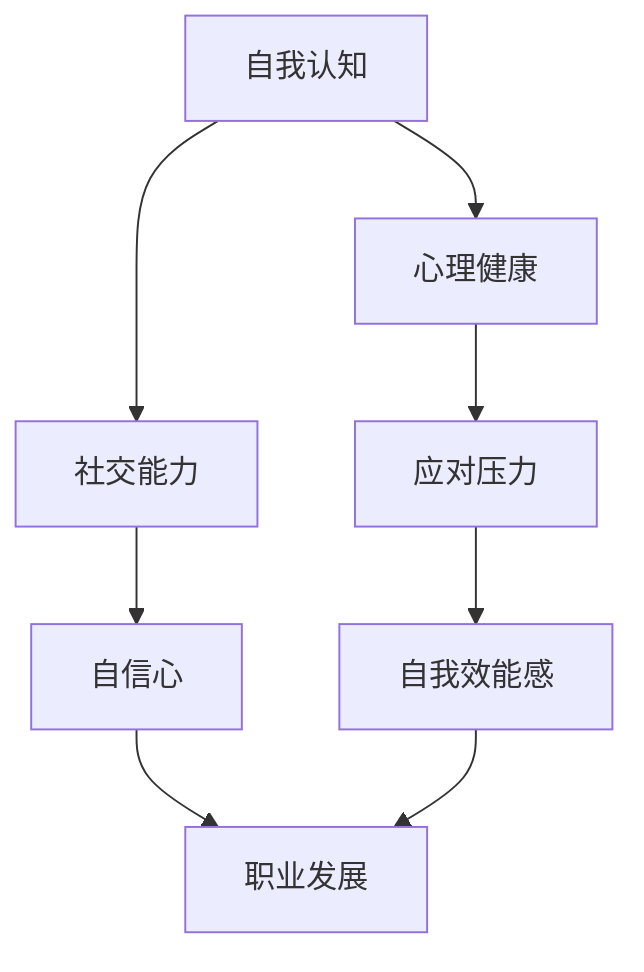

                 

### 第一部分：自我探索

#### 第1章：认识自我

##### 1.1 自我认知的重要性

自我认知是指一个人对自己的认识和理解，包括自己的性格、能力、价值观等方面。在技术领域，自我认知同样重要，因为它直接影响着个人的职业发展和生活质量。了解自我认知的重要性，有助于我们更好地定位自己，发挥自身优势，克服不足，从而实现个人成长和成功。

**背景介绍**

人类行为心理学研究表明，自我认知对个人的心理健康和社交能力有着深远的影响。自我认知能力较强的人，通常能够更好地应对压力和挑战，拥有更高的自我效能感和自信心。在技术领域，这种能力同样不可或缺。一个具备良好自我认知的程序员，能够更加准确地评估自己的技能水平，选择合适的编程语言和工具，从而提高工作效率和代码质量。

**核心概念与联系**

为了更好地理解自我认知的重要性，我们可以通过以下Mermaid流程图来展示其与个人成长和成功之间的联系：



在这个流程图中，我们可以看到自我认知如何通过影响心理健康和社交能力，进而影响个人的自信心和自我效能感，最终促进职业发展。

**核心算法原理讲解**

以下是一个使用Python编写的简单算法，用于评估个人的自我认知水平。通过输入一些关于自己的问题的答案，程序可以给出一个综合评分，帮助个人了解自己的自我认知程度。

```python
import random

def self_awareness_score(questions, scores):
    total_score = 0
    for i, question in enumerate(questions):
        answer = input(question)
        total_score += scores[i][answer]
    return total_score

questions = [
    "你认为自己在技术方面的能力如何？(1-5分)",
    "你对自己的职业生涯有清晰的规划吗？(1-5分)",
    "你在面对困难时，通常如何应对？(1-5分)",
    "你如何评价自己的团队合作能力？(1-5分)",
]

scores = {
    '1': [1, 1, 1, 1],
    '2': [2, 2, 2, 2],
    '3': [3, 3, 3, 3],
    '4': [4, 4, 4, 4],
    '5': [5, 5, 5, 5],
}

score = self_awareness_score(questions, scores)
print(f"你的自我认知得分为：{score}/20")
```

在这个算法中，我们通过设定一系列关于自我认知的问题，并给每个问题的答案分配一定的分数，最终计算出总分，以评估个人的自我认知水平。

**举例说明**

假设一个程序员在回答上述问题时给出了以下答案：

- "我认为自己在技术方面的能力如何？(1-5分)"：5分
- "你对自己的职业生涯有清晰的规划吗？(1-5分)"：3分
- "你在面对困难时，通常如何应对？(1-5分)"：5分
- "你如何评价自己的团队合作能力？(1-5分)"：4分

那么，他的自我认知得分将是：

```
score = 5 + 3 + 5 + 4 = 17/20
```

这个得分可以帮助他了解自己在自我认知方面的优势和不足，从而有针对性地进行提升。

##### 1.2 自我评估的方法

自我评估是指个人通过自我反思和自我评价，来了解自己的现状和潜在能力的过程。自我评估的方法有很多，以下是一些常用的方法：

**SWOT分析**

SWOT分析是一种常用的自我评估方法，它通过分析个人的优势（Strengths）、劣势（Weaknesses）、机会（Opportunities）和威胁（Threats），来帮助个人全面了解自己。

**360度反馈**

360度反馈是一种通过收集来自同事、上级、下属和其他相关人员的意见和建议，来评估个人表现的方法。这种方法可以帮助个人从不同角度了解自己，发现自己的盲点和不足。

**心理测试**

心理测试是通过一系列标准化的测试工具，来评估个人的性格、能力、兴趣等方面的方法。例如，MBTI（Myers-Briggs Type Indicator）和DISC测试都是常用的心理测试工具。

**案例解析**

假设一个程序员想要通过SWOT分析来评估自己的技术能力。他可能会进行如下分析：

- **优势（Strengths）**：熟练掌握Python和Java，有丰富的项目经验，善于团队合作。
- **劣势（Weaknesses）**：对前端技术了解不足，英语水平有待提高，有时在工作中容易拖延。
- **机会（Opportunities）**：公司即将开展前端项目，有学习前端技术的机会；公司提供英语培训，可以提高英语水平。
- **威胁（Threats）**：随着技术的发展，如果不对前端技术进行学习，可能会影响职业发展；拖延习惯可能会影响工作效率和项目进度。

通过这样的SWOT分析，程序员可以明确自己的优势和不足，以及面临的机会和威胁，从而有针对性地制定个人发展计划。

##### 1.3 自我激励与成长

自我激励是指个人通过内在的动力和信念，来推动自己不断进步和成长的过程。自我激励与成长密切相关，一个缺乏自我激励的人，很难在技术和职业生涯中取得显著成就。

**自我激励的来源**

自我激励的来源有很多，以下是一些常见的来源：

- **成就感**：通过完成一项困难的任务或解决一个复杂的问题，获得的成就感可以极大地激发自我激励。
- **信念**：坚定的信念和目标，可以帮助个人克服困难和挑战，持续努力。
- **内在动机**：对工作的热爱和对知识的渴望，是自我激励的重要来源。
- **榜样**：身边的榜样和成功故事，可以激发个人的自我激励。

**如何通过自我激励推动个人成长**

以下是一些通过自我激励推动个人成长的策略：

- **设定清晰的目标**：明确的目标可以帮助个人聚焦于具体的行动，提高自我激励的效果。
- **定期自我反思**：通过自我反思，了解自己的成长和进步，及时调整目标和策略。
- **学习与分享**：不断学习新知识和技能，与他人分享学习经验，可以提高自我激励和成就感。
- **积极应对挑战**：将挑战视为成长的机会，积极应对，不断提升自己的能力和素质。

**案例分析**

假设一个程序员想要通过自我激励来提升自己的技术能力。他可能会采取以下策略：

- **设定目标**：明确自己的技术学习目标，如学习前端技术、提高英语水平等。
- **定期反思**：每周进行一次自我反思，总结自己的学习成果和不足，调整学习计划。
- **学习与分享**：参加技术社区的活动，学习新技术，分享自己的学习经验。
- **积极应对挑战**：在工作中遇到技术难题，积极寻求解决方案，不断提升自己的技术水平。

通过这些策略，程序员可以持续地自我激励，推动个人成长，实现职业目标。

综上所述，自我认知、自我评估和自我激励是自我探索的重要方面，它们共同构成了个人成长和成功的基础。在接下来的章节中，我们将继续探讨如何设定目标、管理时间和情绪，以及建立良好的人际关系，帮助读者全面掌握人生方向，成为自己的生命舵手。

