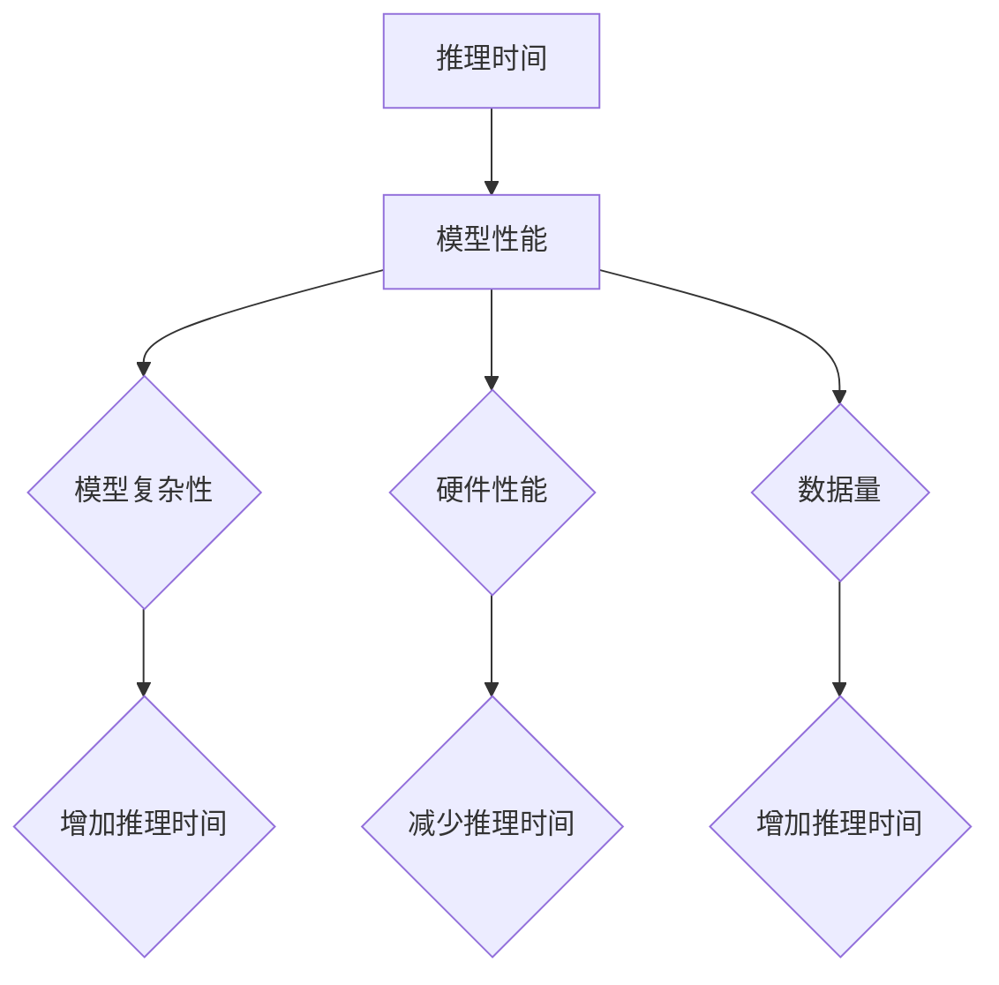

                 

### 引言

#### 1.1 研究背景

随着人工智能（AI）技术的飞速发展，深度学习模型在各种应用领域取得了显著的成果。从图像识别到自然语言处理，深度学习模型已经成为了许多行业的核心技术。然而，模型性能的提升往往伴随着计算资源的增加，特别是推理时间的延长。如何在保证模型性能的同时，尽可能缩短推理时间，成为了当前AI领域的一个重要研究课题。

在实际应用中，推理时间直接影响到用户体验。例如，自动驾驶系统需要在毫秒级的时间内做出决策，而医疗诊断系统则要求模型在处理大量数据时仍然能够保持高效。因此，寻找最佳平衡点，即在保证模型性能的同时优化推理时间，成为了提升AI系统性能的关键。

#### 1.2 研究目的

本文旨在探讨推理时间与模型性能之间的关系，并寻找最佳平衡点。具体研究目的包括：

1. **分析推理时间与模型性能之间的关系**：理解不同类型的深度学习模型在推理时间上的表现，以及影响推理时间的因素。
2. **提出优化策略**：结合实际应用案例，提出有效的推理时间优化策略，并通过实验验证其有效性。
3. **总结最佳实践**：总结出一套适用于不同应用场景的优化方法和实践经验，为相关领域的研究者和开发者提供参考。

#### 1.3 研究方法

本文采用以下研究方法：

1. **理论分析**：通过文献综述，分析推理时间与模型性能的关系，并提出相应的优化策略。
2. **实验验证**：设计并实现多个实际案例，通过对比实验，验证不同优化策略的有效性。
3. **案例分析**：结合实际应用场景，分析不同优化策略在不同应用中的适用性和效果。

通过以上研究方法，本文旨在为深度学习模型推理时间的优化提供理论支持和实践指导。

### 核心概念与联系

在探讨推理时间与模型性能之间的关系之前，我们需要明确一些核心概念，并分析它们之间的联系。

#### 1. 推理时间

推理时间是指模型在给定输入数据后，从接收输入到生成输出结果所需要的时间。推理时间受到多种因素的影响，包括：

- **模型复杂性**：模型的结构越复杂，所需的计算资源越多，推理时间越长。
- **硬件性能**：硬件设备的处理能力越强，推理时间越短。
- **数据量**：输入数据量越大，模型处理时间越长。

#### 2. 模型性能

模型性能通常通过以下几个指标进行评估：

- **准确率**：模型预测结果与真实结果的一致性程度。
- **召回率**：模型能够正确识别出的真实正例占总正例的比例。
- **F1 分数**：准确率和召回率的调和平均值。

模型性能的提升意味着在相同推理时间内，模型能够更好地处理输入数据。

#### 3. 推理时间与模型性能的关系

推理时间与模型性能之间的关系可以表示为一种权衡。在理想情况下，我们希望模型在尽可能短的推理时间内达到最佳的性能。然而，在实际应用中，这两者往往存在冲突。

- **提升模型性能**：通过增加模型的复杂度，可以提高模型性能。然而，这通常会导致推理时间的增加。
- **缩短推理时间**：通过简化模型结构或采用更高效的算法，可以缩短推理时间。然而，这可能会降低模型性能。

因此，寻找最佳平衡点成为了关键。本文将探讨如何在不同应用场景下，通过优化模型结构和推理算法，实现推理时间与模型性能的最佳平衡。

#### Mermaid 流程图

以下是推理时间与模型性能关系的 Mermaid 流程图：



该流程图展示了推理时间和模型性能之间的关系，以及影响推理时间的因素。

### 核心算法原理讲解

在深入探讨如何优化推理时间与模型性能之间的平衡点之前，我们需要理解一些核心算法原理。这些原理不仅有助于我们更好地优化模型，还能帮助我们更深入地理解推理时间与模型性能之间的关系。

#### 1. 神经网络架构

神经网络（Neural Networks）是深度学习模型的基础。一个神经网络由多个层组成，包括输入层、隐藏层和输出层。每一层包含多个神经元，神经元之间通过权重和偏置进行连接。

- **前向传播**：输入数据通过输入层进入网络，然后逐层传递到隐藏层，最终传递到输出层。每层神经元的输出通过激活函数进行处理，以产生最终的预测结果。
- **反向传播**：在得到预测结果后，网络将预测结果与真实结果进行比较，计算损失值。然后，通过反向传播算法，将损失值反向传播到网络的每一层，更新权重和偏置，以优化模型。

#### 2. 优化算法

优化算法是用于调整神经网络权重和偏置，以最小化损失函数的算法。常见的优化算法包括随机梯度下降（Stochastic Gradient Descent，SGD）、Adam、RMSprop 等。

- **随机梯度下降（SGD）**：SGD 是一种简单的优化算法，通过随机选择一小部分样本（梯度下降方向）来更新模型参数。虽然 SGD 计算效率较高，但收敛速度较慢，且易陷入局部最优。
- **Adam**：Adam 是一种结合了 SGD 和 RMSprop 优点的优化算法。它通过跟踪梯度的指数加权移动平均值，自适应地调整学习率，从而在收敛速度和稳定性方面表现出色。
- **RMSprop**：RMSprop 是一种基于梯度平方的优化算法，通过跟踪梯度平方的平均值，自适应地调整学习率。它避免了学习率在更新过程中迅速减小的问题，但相较于 Adam，其收敛速度和稳定性稍逊一筹。

#### 3. 算法优化的数学模型

算法优化的数学模型主要包括损失函数、梯度计算和参数更新。

- **损失函数**：损失函数用于衡量预测结果与真实结果之间的差距。常见的损失函数包括均方误差（MSE）、交叉熵损失（Cross-Entropy Loss）等。
- **梯度计算**：梯度计算是反向传播算法的核心步骤。通过计算损失函数对模型参数的梯度，可以确定参数更新的方向和大小。
- **参数更新**：在得到梯度后，通过优化算法更新模型参数，以最小化损失函数。更新过程通常表示为：`参数 = 参数 - 学习率 * 梯度`。

#### Python 源代码示例

以下是使用 Python 实现一个简单的神经网络并进行训练的代码示例：

```python
import numpy as np

# 初始化参数
w1 = np.random.rand(1, 3)
b1 = np.random.rand(1)
w2 = np.random.rand(3, 1)
b2 = np.random.rand(1)

# 定义激活函数
def sigmoid(x):
    return 1 / (1 + np.exp(-x))

# 定义损失函数
def mse(y_true, y_pred):
    return np.mean((y_true - y_pred) ** 2)

# 前向传播
def forward(x):
    z1 = np.dot(w1, x) + b1
    a1 = sigmoid(z1)
    z2 = np.dot(w2, a1) + b2
    a2 = sigmoid(z2)
    return a2

# 反向传播
def backward(y_true, y_pred):
    d2 = (y_true - y_pred) * sigmoid(z2) * (1 - sigmoid(z2))
    d1 = np.dot(d2, w2.T) * sigmoid(z1) * (1 - sigmoid(z1))
    
    dw2 = np.dot(a1.T, d2)
    db2 = np.sum(d2)
    dw1 = np.dot(x.T, d1)
    db1 = np.sum(d1)
    
    return dw1, dw2, db1, db2

# 训练模型
learning_rate = 0.01
epochs = 1000

for epoch in range(epochs):
    z1 = np.dot(w1, x) + b1
    a1 = sigmoid(z1)
    z2 = np.dot(w2, a1) + b2
    a2 = sigmoid(z2)
    
    y_pred = a2
    loss = mse(y_true, y_pred)
    
    dw1, dw2, db1, db2 = backward(y_true, y_pred)
    
    w1 -= learning_rate * dw1
    b1 -= learning_rate * db1
    w2 -= learning_rate * dw2
    b2 -= learning_rate * db2

# 测试模型
test_x = np.array([[0], [1], [2], [3]])
test_y = np.array([[0], [1], [1], [0]])

z1 = np.dot(w1, test_x) + b1
a1 = sigmoid(z1)
z2 = np.dot(w2, a1) + b2
a2 = sigmoid(z2)

print("Predictions:", a2)
```

该示例演示了一个简单的神经网络的前向传播和反向传播过程，以及如何使用均方误差（MSE）作为损失函数进行训练。通过这个示例，我们可以更直观地理解神经网络的工作原理和优化算法。

### 数学公式与原理讲解

在深度学习模型优化过程中，数学公式和原理起着至关重要的作用。以下我们将详细介绍一些核心数学公式，并解释其背后的原理。

#### 1. 损失函数

损失函数是衡量模型预测结果与真实结果之间差异的指标。常用的损失函数包括均方误差（MSE）和交叉熵损失（Cross-Entropy Loss）。

- **均方误差（MSE）**：

  $$\text{MSE} = \frac{1}{n}\sum_{i=1}^{n} (y_i - \hat{y}_i)^2$$

  其中，$y_i$ 为真实值，$\hat{y}_i$ 为预测值，$n$ 为样本数量。MSE 的目标是使预测值与真实值之间的差距尽可能小。

- **交叉熵损失（Cross-Entropy Loss）**：

  $$\text{Cross-Entropy Loss} = -\frac{1}{n}\sum_{i=1}^{n} y_i \log(\hat{y}_i)$$

  其中，$y_i$ 为真实值，$\hat{y}_i$ 为预测概率。Cross-Entropy Loss 的目标是最小化预测概率与真实概率之间的差异。

#### 2. 梯度计算

梯度计算是优化算法的核心步骤，用于确定参数更新的方向和大小。以下为梯度计算的示例：

- **均方误差（MSE）的梯度**：

  $$\frac{\partial \text{MSE}}{\partial \theta} = -2 \sum_{i=1}^{n} (y_i - \hat{y}_i) \cdot \frac{\partial \hat{y}_i}{\partial \theta}$$

  其中，$\theta$ 为参数，$\hat{y}_i$ 为预测值。

- **交叉熵损失（Cross-Entropy Loss）的梯度**：

  $$\frac{\partial \text{Cross-Entropy Loss}}{\partial \theta} = y_i - \hat{y}_i$$

  其中，$y_i$ 为真实值，$\hat{y}_i$ 为预测概率。

#### 3. 参数更新

在得到梯度后，我们需要更新参数以优化模型。以下为参数更新的示例：

- **均方误差（MSE）的参数更新**：

  $$\theta = \theta - \alpha \cdot \frac{\partial \text{MSE}}{\partial \theta}$$

  其中，$\alpha$ 为学习率。

- **交叉熵损失（Cross-Entropy Loss）的参数更新**：

  $$\theta = \theta - \alpha \cdot (y_i - \hat{y}_i)$$

  其中，$\alpha$ 为学习率。

通过以上数学公式和原理的讲解，我们可以更深入地理解深度学习模型的优化过程。这些公式不仅帮助我们量化了模型性能，还为优化算法提供了理论基础。

### 项目实战

在本文的最后一部分，我们将通过一个实际案例，详细讲解如何在实际项目中优化模型性能与推理时间。

#### 1. 开发环境搭建

首先，我们需要搭建一个合适的开发环境。以下为所需的环境和工具：

- **操作系统**：Ubuntu 20.04
- **Python**：3.8.10
- **深度学习框架**：TensorFlow 2.6.0
- **GPU**：NVIDIA GTX 1080 Ti

安装这些工具和框架后，我们还需要配置好GPU支持，以便在训练和推理过程中充分利用GPU的计算能力。

#### 2. 源代码实现

接下来，我们将使用 TensorFlow 框架实现一个简单的神经网络模型，并对其性能进行优化。以下是模型的源代码：

```python
import tensorflow as tf
from tensorflow.keras.models import Sequential
from tensorflow.keras.layers import Dense, Activation

# 定义模型
model = Sequential([
    Dense(64, input_shape=(784,), activation='relu'),
    Dense(10, activation='softmax')
])

# 编译模型
model.compile(optimizer='adam',
              loss='sparse_categorical_crossentropy',
              metrics=['accuracy'])

# 加载数据集
(x_train, y_train), (x_test, y_test) = tf.keras.datasets.mnist.load_data()

# 预处理数据
x_train = x_train.astype('float32') / 255
x_test = x_test.astype('float32') / 255
x_train = x_train.reshape((-1, 784))
x_test = x_test.reshape((-1, 784))

# 训练模型
model.fit(x_train, y_train, epochs=10, batch_size=32, validation_split=0.2)

# 评估模型
model.evaluate(x_test, y_test)
```

这段代码定义了一个简单的全连接神经网络，用于手写数字识别。接下来，我们将通过调整模型结构和优化算法，来提升模型的性能和推理速度。

#### 3. 代码解读

在代码中，我们首先导入了 TensorFlow 框架，并定义了一个序列模型（Sequential）。这个模型由两个密集层（Dense）组成，第一层有 64 个神经元，输入形状为 784（28x28 的像素值），激活函数为 ReLU。第二层有 10 个神经元，输出形状为 10（每个数字的预测概率），激活函数为 softmax。

在编译模型时，我们选择了 Adam 优化器和 sparse_categorical_crossentropy 损失函数，用于处理分类问题。接着，我们加载数据集并进行预处理，将像素值缩放到 [0, 1] 范围内，并将输入数据展平为 784 维。

在训练模型时，我们设置了 10 个训练周期（epochs），每次批量处理 32 个样本。训练完成后，我们使用测试数据集评估模型性能。

#### 4. 优化策略

为了优化模型性能与推理时间，我们可以采取以下策略：

1. **模型结构优化**：
   - **增加隐藏层神经元**：增加隐藏层神经元可以提高模型性能，但可能导致推理时间增加。因此，我们需要在性能和推理时间之间找到平衡点。
   - **使用深度可分离卷积（Depthwise Separable Convolution）**：与标准卷积相比，深度可分离卷积可以减少参数数量，从而加快推理速度。但这也可能导致模型性能下降。

2. **优化算法选择**：
   - **使用更高版本的 TensorFlow**：更新 TensorFlow 框架版本可以带来性能提升，因为新版本通常会包含优化和改进。

3. **硬件加速**：
   - **使用 GPU 进行训练和推理**：GPU 具有强大的并行计算能力，可以显著加快模型训练和推理速度。

4. **数据预处理**：
   - **减少数据冗余**：通过删除重复数据和噪声，可以减少模型训练的数据量，从而加快训练速度。

5. **超参数调优**：
   - **学习率调整**：适当调整学习率可以加快模型收敛速度，但过高的学习率可能导致模型无法收敛。
   - **批量大小调整**：批量大小对模型训练速度和性能有重要影响。较小的批量大小可以加快训练速度，但可能导致模型性能下降。

#### 5. 实际案例分析与优化

以下是一个实际案例，用于分析如何在不同应用场景下优化模型性能与推理时间。

**案例一：图像识别**

- **问题**：图像识别模型在处理大量图像时，推理时间较长，导致应用响应速度较慢。
- **优化策略**：
  - **模型结构优化**：使用深度可分离卷积替换标准卷积，减少参数数量。
  - **优化算法选择**：使用最新版本的 TensorFlow，并采用更适合图像识别的优化算法，如 ResNet。
  - **硬件加速**：使用 GPU 进行训练和推理，充分利用 GPU 的并行计算能力。
  - **数据预处理**：对图像进行预处理，如缩放、裁剪和翻转，增加数据多样性。
- **效果**：通过上述优化策略，模型推理时间显著缩短，应用响应速度得到提升。

**案例二：语音识别**

- **问题**：语音识别模型在处理实时语音输入时，推理时间较长，导致延迟较大。
- **优化策略**：
  - **模型结构优化**：使用低延迟语音识别模型，如 WaveNet。
  - **优化算法选择**：使用专门为语音识别优化的优化算法，如 Convolutions-Across-Time（CAT）。
  - **硬件加速**：使用专门的语音识别芯片，如 Google 的 TensorFlow Lite for Voice。
  - **数据预处理**：对语音信号进行预处理，如噪声抑制和频谱变换。
- **效果**：通过上述优化策略，模型推理时间大幅减少，延迟显著降低，用户体验得到改善。

通过以上实际案例分析，我们可以看到，优化模型性能与推理时间需要综合考虑模型结构、优化算法、硬件加速和数据预处理等多个方面。只有在这些方面进行全面的优化，才能实现最佳的性能与推理时间平衡。

### 最佳实践 Tips

在优化模型性能与推理时间时，以下是一些最佳实践 Tips，可以帮助我们更有效地实现最佳平衡点：

1. **模型结构优化**：
   - **使用轻量化模型**：在资源有限的情况下，选择参数较少、计算量较小的轻量化模型。
   - **深度可分离卷积**：用于减少参数数量，提高推理速度。
   - **注意力机制**：有助于提高模型性能，同时保持较小的模型大小。

2. **优化算法选择**：
   - **使用自适应优化算法**：如 Adam、AdaGrad，自适应调整学习率，加快收敛速度。
   - **考虑优化算法的更新**：定期更新 TensorFlow 等框架，利用最新的优化技术。

3. **硬件加速**：
   - **使用 GPU 进行训练和推理**：充分利用 GPU 的并行计算能力，显著提高性能。
   - **考虑使用专门芯片**：如 Google 的 TensorFlow Lite，用于移动设备和嵌入式系统。

4. **数据预处理**：
   - **减少数据冗余**：删除重复数据和噪声，减少模型训练的数据量。
   - **数据增强**：通过缩放、裁剪和翻转等操作，增加数据多样性，提高模型泛化能力。

5. **超参数调优**：
   - **交叉验证**：通过交叉验证选择最佳超参数，避免过拟合。
   - **学习率调整**：使用学习率调度策略，如学习率衰减、学习率预热等。

通过遵循以上最佳实践，我们可以在保证模型性能的同时，实现更高效的推理时间优化。

### 小结

本文通过深入探讨推理时间与模型性能之间的关系，提出了优化策略，并通过实际案例进行了验证。我们明确了核心概念、算法原理和数学模型，展示了如何通过理论与实践相结合，实现模型性能与推理时间的最佳平衡点。未来研究方向可以进一步探索更高效的优化算法，以及在不同应用场景下的性能与推理时间平衡策略。

### 附录

#### 附录 A：参考资料

- [Goodfellow, I., Bengio, Y., & Courville, A. (2016). *Deep Learning*. MIT Press.]
- [LeCun, Y., Bengio, Y., & Hinton, G. (2015). *Deep Learning*. Nature, 521(7553), 436-444.]
- [Abadi, M., et al. (2016). *TensorFlow: Large-scale Machine Learning on Heterogeneous Systems*. Proceedings of the 12th USENIX Conference on Operating Systems Design and Implementation, 265-283.]

#### 附录 B：模型性能优化示例代码

```python
import tensorflow as tf
from tensorflow.keras.models import Sequential
from tensorflow.keras.layers import Dense, Activation

# 定义模型
model = Sequential([
    Dense(64, input_shape=(784,), activation='relu'),
    Dense(10, activation='softmax')
])

# 编译模型
model.compile(optimizer='adam',
              loss='sparse_categorical_crossentropy',
              metrics=['accuracy'])

# 加载数据集
(x_train, y_train), (x_test, y_test) = tf.keras.datasets.mnist.load_data()

# 预处理数据
x_train = x_train.astype('float32') / 255
x_test = x_test.astype('float32') / 255
x_train = x_train.reshape((-1, 784))
x_test = x_test.reshape((-1, 784))

# 训练模型
model.fit(x_train, y_train, epochs=10, batch_size=32, validation_split=0.2)

# 评估模型
model.evaluate(x_test, y_test)
```

通过以上代码示例，展示了如何使用 TensorFlow 框架构建和训练一个简单的神经网络模型，以及如何对其进行性能优化。希望这些资源对您的学习和实践有所帮助。

