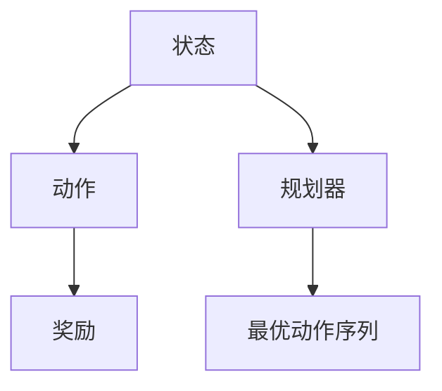

                 

# 推理端增加算力解决多步推理问题的案例

## 关键词

多步推理、算力提升、算法优化、应用案例、金融、医疗、自动驾驶

## 摘要

多步推理在人工智能领域中扮演着至关重要的角色，然而，随着推理复杂度的增加，其计算资源需求也显著提升。本文将探讨通过增加推理端算力来解决多步推理问题的方法，详细分析硬件加速、软件优化和算力资源管理策略。同时，结合金融、医疗和自动驾驶等实际应用案例，阐述多步推理问题在不同领域的解决思路和实现过程，为未来的研究和应用提供参考。

## 第一部分：多步推理问题背景与挑战

### 第1章：多步推理问题的现状与挑战

多步推理是指基于已有信息进行推理，以预测未来或理解复杂系统行为的过程。它在决策支持系统、智能监控、数据分析等众多领域有着广泛的应用。然而，随着数据的规模和复杂性不断增加，多步推理问题面临着计算资源不足、算法效率低下等问题。

**1.1 多步推理问题的重要性**

多步推理是实现人工智能系统自主决策和智能行为的基础。无论是自动驾驶、智能金融还是医疗诊断，都需要进行复杂的多步推理来处理海量数据，从而做出准确的决策。因此，解决多步推理问题对于推动人工智能技术的发展具有重要意义。

**1.2 多步推理问题在现实场景中的应用**

- **金融行业**：金融市场的预测、风险管理、投资组合优化等都需要进行多步推理，以预测市场趋势和风险。

- **医疗行业**：疾病预测、治疗方案优化、药物研发等医疗应用场景中，多步推理能够提高诊断和治疗的准确性。

- **自动驾驶**：自动驾驶系统需要对道路环境、交通状况和车辆状态进行实时多步推理，以确保行车安全。

**1.3 多步推理面临的挑战与问题**

- **计算资源需求**：多步推理涉及大量计算，对计算资源的需求显著增加。

- **算法效率**：现有算法在处理复杂推理时效率较低，难以满足实时性要求。

- **数据质量**：数据质量对推理结果有直接影响，数据的不确定性和噪声增加了推理的难度。

### 第2章：多步推理问题分类与基本原理

**2.1 多步推理问题的分类**

多步推理问题可以分为以下几类：

- **基于规则推理**：基于预先定义的规则进行推理，适用于结构化数据的处理。

- **基于数据驱动推理**：基于历史数据和统计模型进行推理，适用于非结构化数据的处理。

- **基于模型推理**：基于机器学习模型进行推理，适用于处理复杂和大规模数据。

**2.2 基本推理算法原理讲解**

- **基于规则推理**：使用条件-动作规则进行推理，如专家系统。

- **基于数据驱动推理**：使用统计模型和机器学习算法进行推理，如决策树、神经网络。

- **基于模型推理**：使用深度学习模型进行推理，如卷积神经网络（CNN）、递归神经网络（RNN）。

**2.3 多步推理问题中的核心概念与联系**

多步推理问题涉及以下几个核心概念：

- **状态**：表示系统在某一时刻的状态。

- **动作**：表示系统可以采取的操作。

- **奖励**：表示动作带来的效果。

- **规划器**：用于计算最优动作序列的算法。

图解：多步推理问题中的核心概念与联系

## 第二部分：推理端增加算力技术

### 第3章：推理端算力提升方法

提升推理端的算力是解决多步推理问题的关键。以下介绍几种常见的提升方法：

**3.1 硬件加速技术**

- **图形处理单元（GPU）加速**：GPU具有高度并行处理能力，适用于大规模并行计算。

- **专用推理芯片**：针对特定推理任务设计的芯片，具有高性能和低功耗的特点。

**3.2 软件优化技术**

- **向量化与并行化**：将计算过程转化为向量化操作，提高计算效率。

- **低精度计算**：使用低精度浮点数进行计算，减少计算资源消耗。

**3.3 算力资源管理策略**

- **负载均衡**：合理分配计算任务，避免资源浪费。

- **热点预测与预取技术**：预测计算热点并提前加载数据，减少延迟。

### 第4章：推理端加速算法研究

算法优化是提升推理端算力的重要途径。以下介绍几种推理端加速算法：

**4.1 传统算法优化**

- **改进算法设计**：优化算法结构和流程，减少计算复杂度。

- **算法加速技巧**：使用并行计算、向量计算等技巧，提高计算效率。

**4.2 新型加速算法介绍**

- **深度强化学习加速**：结合强化学习和深度学习，提高推理效率和准确性。

- **机器学习算法优化**：针对特定任务优化机器学习算法，提高推理性能。

### 第5章：推理端算力评估与优化

评估和优化推理端算力是确保推理效果的关键。以下介绍几种评估和优化方法：

**5.1 算力评估指标**

- **性能评估指标**：计算时间、吞吐量等指标。

- **能耗评估指标**：功耗、能效比等指标。

**5.2 算力优化策略**

- **算法优化策略**：调整算法参数，提高计算效率。

- **硬件与软件协同优化**：结合硬件和软件优化手段，提升整体性能。

## 第三部分：多步推理问题应用案例

### 第6章：金融行业多步推理应用案例

#### 6.1 案例背景

金融市场是一个高度复杂的系统，预测市场趋势和风险对于投资者具有重要意义。多步推理可以帮助投资者更好地把握市场动态，制定投资策略。

#### 6.2 应用场景

- **市场预测**：使用多步推理预测市场趋势，为投资者提供决策依据。

- **风险管理**：使用多步推理评估投资组合的风险，为投资者提供风险管理建议。

#### 6.3 解决方案与技术选型

- **技术选型**：基于机器学习算法构建多步推理模型，结合GPU加速技术提高计算效率。

- **实现过程与代码解读**：详细讲解模型构建、训练和推理过程，以及关键代码实现。

#### 6.4 实现过程与代码解读

- **模型构建**：使用Python编写机器学习模型，结合数学模型和公式进行详细讲解。

- **代码实现**：展示关键代码实现，包括数据预处理、模型训练和推理过程。

#### 6.5 案例分析

- **案例分析**：结合实际数据，分析多步推理在金融市场预测和风险管理中的应用效果。

### 第7章：医疗行业多步推理应用案例

#### 7.1 案例背景

医疗行业中的多步推理可以帮助医生更好地诊断疾病、制定治疗方案和预测疾病发展趋势。

#### 7.2 应用场景

- **疾病预测**：使用多步推理预测患者病情变化，为医生提供诊断依据。

- **治疗方案优化**：使用多步推理评估不同治疗方案的效果，为医生提供优化建议。

#### 7.3 解决方案与技术选型

- **技术选型**：基于深度学习算法构建多步推理模型，结合GPU加速技术提高计算效率。

- **实现过程与代码解读**：详细讲解模型构建、训练和推理过程，以及关键代码实现。

#### 7.4 实现过程与代码解读

- **模型构建**：使用Python编写深度学习模型，结合数学模型和公式进行详细讲解。

- **代码实现**：展示关键代码实现，包括数据预处理、模型训练和推理过程。

#### 7.5 案例分析

- **案例分析**：结合实际数据，分析多步推理在医疗行业中的应用效果。

### 第8章：自动驾驶多步推理应用案例

#### 8.1 案例背景

自动驾驶系统需要实时对道路环境、交通状况和车辆状态进行多步推理，以确保行车安全。

#### 8.2 应用场景

- **路况预测**：使用多步推理预测道路状况，为自动驾驶车辆提供决策依据。

- **交通管理**：使用多步推理优化交通信号控制和路径规划。

#### 8.3 解决方案与技术选型

- **技术选型**：基于深度强化学习算法构建多步推理模型，结合GPU加速技术提高计算效率。

- **实现过程与代码解读**：详细讲解模型构建、训练和推理过程，以及关键代码实现。

#### 8.4 实现过程与代码解读

- **模型构建**：使用Python编写深度强化学习模型，结合数学模型和公式进行详细讲解。

- **代码实现**：展示关键代码实现，包括数据预处理、模型训练和推理过程。

#### 8.5 案例分析

- **案例分析**：结合实际数据，分析多步推理在自动驾驶中的应用效果。

## 第四部分：未来展望与挑战

### 第9章：多步推理问题的未来发展方向

多步推理问题在人工智能领域的应用前景广阔。未来发展方向包括：

- **算法创新**：探索新型推理算法，提高推理效率和准确性。

- **跨学科融合**：结合不同学科的知识，提升多步推理问题的解决能力。

- **应用拓展**：将多步推理应用于更多领域，推动人工智能技术的发展。

### 第10章：政策与产业环境对多步推理的影响

政策与产业环境对多步推理问题的发展具有重要影响。以下分析政策与产业环境对多步推理的影响：

- **政策支持**：政府对人工智能领域的研究和应用给予支持，有助于推动多步推理技术的发展。

- **产业环境**：企业对人工智能技术的需求驱动了多步推理问题的研究和应用。

- **企业影响**：企业在多步推理问题中的应用和实践，推动了技术进步和产业发展。

## 作者信息

作者：AI天才研究院/AI Genius Institute & 禅与计算机程序设计艺术 /Zen And The Art of Computer Programming

