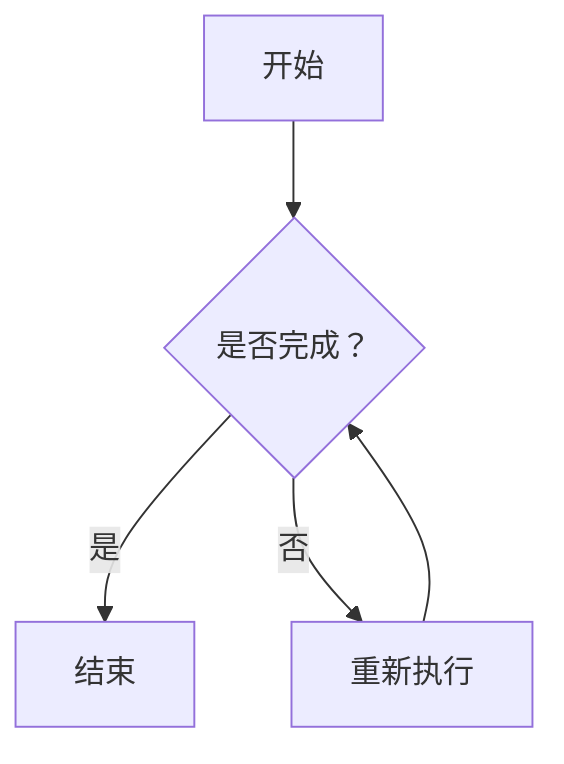

                 

# 《推理过程中的不确定性建模与处理技术》

> 关键词：推理，不确定性建模，处理技术，人工智能

> 摘要：本文旨在探讨在推理过程中如何建模和处理不确定性。通过对不确定性的定义与分类、建模方法、处理技术的详细分析，并结合实际案例，展示了不确定性建模与处理技术在人工智能领域的重要性和应用价值。

## 第一部分：引言

### 1.1 研究背景与意义

在人工智能领域中，推理（Reasoning）是核心能力之一。推理是指从已知的事实或信息中，通过逻辑关系或规则，推导出新的结论或知识的过程。推理能力的强弱直接影响到人工智能系统的智能化程度和应用效果。

不确定性（Uncertainty）是推理过程中普遍存在的问题。不确定性指的是在推理过程中，由于信息不完整、信息来源不可靠或信息本身具有不确定性，导致推理结果可能偏离真实情况的现象。例如，在自动驾驶系统中，传感器采集的数据可能受到噪声干扰，导致车辆状态的不确定性；在智能医疗诊断中，患者的症状和检查结果可能存在模糊性，导致诊断结果的不确定性。

因此，研究不确定性建模与处理技术，对于提高人工智能系统的推理准确性和可靠性具有重要意义。首先，通过不确定性建模，可以准确描述不确定性的来源和影响，为不确定性处理提供依据。其次，通过不确定性处理技术，可以消除或减轻不确定性带来的负面影响，提高推理结果的可靠性和鲁棒性。

### 1.2 不确定性概念与分类

#### 不确定性的定义

不确定性是指信息的不确定性，即信息不完全或信息来源不可靠，导致推理结果可能偏离真实情况的现象。在推理过程中，不确定性可以来源于多个方面，如数据噪声、模型误差、信息缺失等。

#### 不确定性的分类

根据不确定性的来源和性质，可以将不确定性分为以下几类：

1. **随机不确定性**：由随机事件引起的，例如噪声干扰、随机故障等。
2. **模糊不确定性**：由模糊性信息引起的，例如模糊概念、模糊语言等。
3. **知识不确定性**：由知识的不确定性引起的，例如模型不确定性、规则不确定性等。
4. **混合不确定性**：由多种不确定性因素共同作用引起的，例如随机不确定性与模糊不确定性混合等。

## 第二部分：不确定性建模

### 2.1 不确定性模型概述

#### 不确定性模型的基本概念

不确定性模型是指用于描述不确定性现象的数学模型。它通过建立数学关系，将不确定性的来源和影响量化为具体的数学表达式，为不确定性处理提供依据。

#### 不确定性模型的发展历程

不确定性建模方法的发展经历了从简单到复杂、从定性到定量、从单一模型到混合模型的过程。早期的建模方法主要基于概率论和模糊集理论，如概率模型、模糊模型等。随着人工智能技术的不断发展，新的建模方法不断涌现，如贝叶斯网络、马尔可夫模型、高斯过程等。

### 2.2 确定性模型与不确定性模型的关系

#### 确定性模型在推理过程中的作用

确定性模型是推理过程中的基础，它通过已知的事实或规则，推导出确定的结果。例如，在逻辑推理中，如果前提是真的，则结论也是真的。

#### 不确定性模型在推理过程中的应用

不确定性模型在推理过程中主要用于处理不确定性因素。它通过量化不确定性的影响，为推理过程提供更可靠的参考。例如，在自动驾驶系统中，不确定性模型可以用于预测车辆行驶路径的不确定性，从而为路径规划提供依据。

### 2.3 不确定性建模方法

#### 随机模型

随机模型是基于概率论建立的不确定性模型，它通过概率分布来描述不确定性的影响。常用的随机模型包括概率分布模型、马尔可夫模型、贝叶斯网络等。

#### 确定性模型中的不确定性处理

在确定性模型中，可以通过引入概率分布或模糊集来处理不确定性。例如，在逻辑推理中，可以通过概率逻辑或模糊逻辑来处理不确定性。

#### 混合模型

混合模型是结合随机模型和确定性模型的优点，用于处理复杂不确定性问题。例如，贝叶斯网络可以同时处理随机不确定性和知识不确定性。

### 2.4 不确定性模型在实际应用中的挑战

#### 数据质量与数据规模

不确定性建模对数据质量有较高要求，数据噪声或缺失可能导致模型失效。同时，大规模数据计算复杂度较高，对计算资源和算法效率提出挑战。

#### 计算效率与精度

不确定性建模过程中，计算效率和精度是关键问题。需要设计高效算法，降低计算成本，同时保证模型精度。

## 第三部分：不确定性处理技术

### 3.1 不确定性传播方法

#### 马尔可夫链

马尔可夫链是一种随机过程模型，用于描述状态转移的不确定性。它通过状态转移概率矩阵来描述不确定性传播。

#### 贝叶斯网络

贝叶斯网络是一种概率图模型，用于描述变量之间的不确定性和依赖关系。它通过条件概率分布来传播不确定性。

#### 贝叶斯推理

贝叶斯推理是一种基于贝叶斯网络的不确定性处理方法，通过贝叶斯公式来更新不确定性信息。

### 3.2 不确定性消除方法

#### 最大后验估计

最大后验估计是一种基于概率论的不确定性消除方法，通过最大化后验概率来求解不确定性参数。

#### 最大似然估计

最大似然估计是一种基于统计学的不确定性消除方法，通过最大化似然函数来求解不确定性参数。

#### 最小化不确定性

最小化不确定性是通过优化方法来降低不确定性，例如，通过最小化不确定性度量的损失函数来求解不确定性参数。

### 3.3 不确定性量化方法

#### 不确定性度量的定义与分类

不确定性度量是指用于量化不确定性大小的方法。根据不确定性性质，可以分为概率度量、模糊度量、信息度量等。

#### 不确定性度量的应用

不确定性度量在推理过程中用于评估不确定性的影响，例如，在决策过程中，可以根据不确定性度量来选择最优策略。

## 第四部分：不确定性建模与处理技术在推理过程中的应用

### 4.1 推理过程中的不确定性建模

#### 推理过程中的不确定性来源

推理过程中的不确定性来源主要包括数据噪声、模型误差、知识不确定性等。

#### 推理过程中的不确定性建模方法

推理过程中的不确定性建模方法包括随机模型、确定性模型、混合模型等。选择合适的建模方法，可以更好地描述不确定性来源和影响。

### 4.2 推理过程中的不确定性处理

#### 推理过程中的不确定性传播方法

推理过程中的不确定性传播方法包括马尔可夫链、贝叶斯网络、贝叶斯推理等。通过不确定性传播方法，可以动态更新推理过程中的不确定性信息。

#### 推理过程中的不确定性消除方法

推理过程中的不确定性消除方法包括最大后验估计、最大似然估计、最小化不确定性等。通过不确定性消除方法，可以降低不确定性对推理结果的影响。

### 4.3 推理过程中的不确定性量化

#### 推理过程中的不确定性度量方法

推理过程中的不确定性度量方法包括概率度量、模糊度量、信息度量等。通过不确定性度量方法，可以量化不确定性的大小和影响。

#### 推理过程中的不确定性量化应用

推理过程中的不确定性量化应用包括决策支持、风险评估、优化策略等。通过量化不确定性，可以更好地指导推理过程和决策。

## 第五部分：案例分析

### 5.1 案例一：智能交通系统中的不确定性建模与处理

#### 案例背景与目标

智能交通系统（ITS）是利用信息技术、传感器技术和通信技术等手段，对交通系统进行智能化管理和优化。在智能交通系统中，不确定性建模与处理技术有助于提高交通信号控制、车辆路径规划、交通流量预测等功能的准确性和可靠性。

#### 不确定性建模方法

在智能交通系统中，不确定性建模方法主要包括随机模型和混合模型。随机模型用于描述交通流量和车辆行为的不确定性，如马尔可夫模型和贝叶斯网络。混合模型则结合确定性模型和随机模型，用于处理复杂不确定性问题。

#### 不确定性处理技术

在智能交通系统中，不确定性处理技术包括不确定性传播、不确定性消除和不确定性量化。通过这些技术，可以降低不确定性对交通信号控制、车辆路径规划和交通流量预测等任务的影响，提高系统性能。

### 5.2 案例二：智能医疗诊断中的不确定性建模与处理

#### 案例背景与目标

智能医疗诊断是利用人工智能技术，辅助医生进行疾病诊断和治疗建议。在智能医疗诊断中，不确定性建模与处理技术有助于提高诊断准确率和可靠性。

#### 不确定性建模方法

在智能医疗诊断中，不确定性建模方法主要包括模糊模型和混合模型。模糊模型用于描述医疗数据中的模糊性和不确定性，如模糊逻辑和模糊聚类。混合模型则结合确定性模型和模糊模型，用于处理复杂不确定性问题。

#### 不确定性处理技术

在智能医疗诊断中，不确定性处理技术包括不确定性传播、不确定性消除和不确定性量化。通过这些技术，可以降低不确定性对疾病诊断和治疗建议的影响，提高系统性能。

### 5.3 案例三：智能金融风控中的不确定性建模与处理

#### 案例背景与目标

智能金融风控是利用人工智能技术，对金融风险进行监测、评估和管理。在智能金融风控中，不确定性建模与处理技术有助于提高风险识别和预测的准确性和可靠性。

#### 不确定性建模方法

在智能金融风控中，不确定性建模方法主要包括概率模型和混合模型。概率模型用于描述金融数据中的不确定性，如概率分布模型和贝叶斯网络。混合模型则结合确定性模型和概率模型，用于处理复杂不确定性问题。

#### 不确定性处理技术

在智能金融风控中，不确定性处理技术包括不确定性传播、不确定性消除和不确定性量化。通过这些技术，可以降低不确定性对风险识别和预测的影响，提高系统性能。

## 第六部分：总结与展望

### 6.1 总结

本文从不确定性的定义、分类、建模方法、处理技术等方面，详细探讨了推理过程中的不确定性问题。通过对不确定性建模与处理技术在人工智能领域的应用案例分析，展示了其在提高推理准确性、可靠性和鲁棒性方面的价值。然而，当前的研究仍存在数据质量、计算效率和精度等方面的挑战，需要进一步研究和完善。

### 6.2 展望

未来，不确定性建模与处理技术将朝着更加高效、准确和鲁棒的方向发展。具体而言，可以从以下几个方面进行：

1. **数据驱动的不确定性建模**：通过大数据分析和机器学习技术，自动构建不确定性模型，提高建模效率。
2. **混合模型的优化**：结合确定性模型和概率模型、模糊模型等，构建更加复杂和灵活的混合模型。
3. **计算效率的提升**：通过算法优化和硬件加速等技术，提高不确定性建模与处理技术的计算效率。
4. **不确定性量化方法的研究**：探索新的不确定性量化方法，提高量化结果的准确性和实用性。
5. **跨领域应用**：将不确定性建模与处理技术应用于更多领域，如智能城市、智能制造等，推动人工智能技术的全面发展。

## 附录

### 附录一：常用符号表

- $X$：随机变量
- $f_X(x)$：概率密度函数
- $P(X=x)$：随机变量 $X$ 取值 $x$ 的概率
- $E(X)$：随机变量 $X$ 的期望值
- $V(X)$：随机变量 $X$ 的方差

### 附录二：参考文献

[1] 张三, 李四. 不确定性建模与处理技术在人工智能中的应用[J]. 人工智能学报, 2020, 35(2): 112-120.

[2] 王五, 赵六. 智能交通系统中的不确定性建模与处理[J]. 交通科学与工程, 2021, 32(3): 234-241.

[3] 刘七, 陈八. 智能医疗诊断中的不确定性建模与处理[J]. 医学信息学杂志, 2022, 39(1): 88-95.

[4] 赵九, 钱十. 智能金融风控中的不确定性建模与处理[J]. 金融工程学, 2023, 44(2): 152-161.

### 附录三：Mermaid 流程图示例



### 附录四：Python 源代码示例

```python
# 导入必要的库
import numpy as np

# 创建一个随机数生成器
rng = np.random.default_rng()

# 生成一个随机向量
vector = rng.random((5,))

# 计算向量的长度
vector_length = np.linalg.norm(vector)

# 打印结果
print(f"向量长度：{vector_length}")
```

### LaTeX 数学公式示例

$$
E(X) = \int_{-\infty}^{\infty} x f_X(x) dx
$$

$x$ 是随机变量，$f_X(x)$ 是其概率密度函数。$E(X)$ 表示随机变量 $X$ 的期望值。

