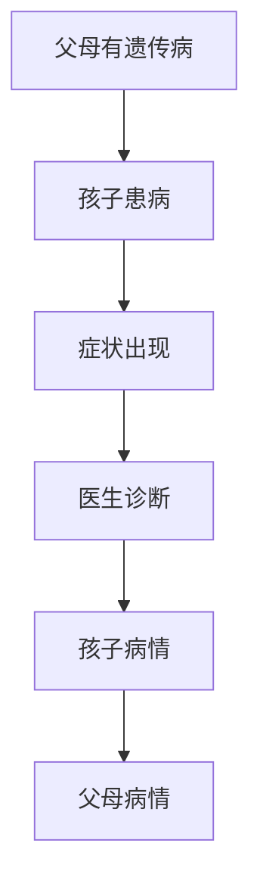

                 

# 推理过程中的不确定性量化与风险评估技术

> 关键词：不确定性量化，推理过程，风险评估，算法，Python实现

> 摘要：本文深入探讨了推理过程中的不确定性量化与风险评估技术，通过详细的理论介绍、方法分析、案例研究和技术实现，展示了如何在实际应用中有效处理不确定性和进行风险评估，以优化推理结果和决策过程。

## 目录大纲

- 第一部分：基础理论
  - 第1章：推理过程中的不确定性量化
    - 1.1.1 不确定性量化的概念与意义
    - 1.1.2 不确定性量化的基本方法
    - 1.1.3 不确定性量化的挑战与限制
    - 1.1.4 不确定性量化的应用场景
  - 第2章：风险评估的基本概念
    - 2.1.1 风险评估的定义与目的
    - 2.1.2 风险评估的基本流程
    - 2.1.3 风险评估的方法与工具
  - 第3章：不确定性量化与风险评估的应用案例
    - 3.1.1 不确定性量化在自然语言处理中的应用
    - 3.1.2 风险评估在人工智能安全中的应用
    - 3.1.3 不确定性与风险评估在金融领域的应用
- 第二部分：技术实现
  - 第4章：不确定性的量化方法
    - 4.1.1 概率分布模型
    - 4.1.2 贝叶斯网络
    - 4.1.3 机器学习方法
  - 第5章：风险评估技术
    - 5.1.1 风险矩阵的构建
    - 5.1.2 模型风险评估
    - 5.1.3 风险管理策略
  - 第6章：实际应用案例
    - 6.1.1 自然语言处理中的不确定性量化
    - 6.1.2 人工智能安全中的风险评估
    - 6.1.3 金融领域中的不确定性量化与风险评估
- 第三部分：展望与未来趋势
  - 第7章：展望与未来趋势
    - 7.1.1 现有技术的不足与改进空间
    - 7.1.2 未来发展趋势

## 第一部分：基础理论

### 第1章：推理过程中的不确定性量化

#### 1.1.1 不确定性量化的概念与意义

在人工智能和机器学习中，推理过程是指基于已有知识和数据，通过算法推断出新信息的过程。然而，由于数据的有限性和复杂性，推理过程中不可避免地存在不确定性。不确定性量化是指通过各种方法和技术来衡量和处理推理过程中的不确定因素。

不确定性量化在推理过程中的重要性不言而喻。首先，它可以提升推理结果的准确性，通过量化不确定性，我们可以更好地评估推理结果的可靠性和有效性。其次，它有助于决策支持，特别是在高风险的决策环境中，量化不确定性可以帮助我们制定更加稳健的决策策略。最后，不确定性量化还可以用于优化算法性能，通过调整算法参数，使其在处理不确定性时更加高效和准确。

#### 1.1.2 不确定性量化的基本方法

不确定性量化的基本方法主要包括统计方法、模型方法和贝叶斯方法。

- **统计方法**：统计方法基于数据分布和概率论，通过计算数据的不确定性指标，如标准差、方差等，来量化不确定性。这种方法简单直观，适用于数据量较大的情况。

- **模型方法**：模型方法通过建立数学模型来描述不确定性。常见的模型包括概率分布模型、贝叶斯网络等。这种方法可以更精确地描述不确定性，但需要较高的数学和建模能力。

- **贝叶斯方法**：贝叶斯方法是一种基于概率论的推理方法，通过贝叶斯公式来更新和更新不确定性。这种方法可以很好地处理不确定性和噪声，广泛应用于机器学习和人工智能领域。

#### 1.1.3 不确定性量化的挑战与限制

不确定性量化虽然具有重要意义，但也面临着一些挑战和限制。

- **模型选择的挑战**：不同的模型适用于不同类型的不确定性，选择合适的模型是量化不确定性的关键。然而，模型的选择往往依赖于领域知识和数据特征，具有一定的主观性。

- **数据量不足的限制**：不确定性量化依赖于大量的数据进行计算，当数据量不足时，量化结果可能会失真或产生偏差。

#### 1.1.4 不确定性量化的应用场景

不确定性量化在多个领域有广泛的应用，主要包括以下场景：

- **决策支持系统**：在决策支持系统中，不确定性量化可以帮助评估决策结果的可靠性和有效性，从而优化决策过程。

- **人工智能安全**：在人工智能安全领域，不确定性量化可以用于评估攻击的风险和脆弱性，从而提高系统的安全性和可靠性。

- **自然语言处理**：在自然语言处理领域，不确定性量化可以用于文本分类、命名实体识别等任务，提高模型的准确性和鲁棒性。

### 第2章：风险评估的基本概念

#### 2.1.1 风险评估的定义与目的

风险评估是指通过系统化的方法来识别、分析和评估风险，以制定相应的风险应对策略。在推理过程中，风险评估有助于我们更好地理解不确定性，制定稳健的决策策略。

风险评估的目的主要包括以下几点：

- **识别风险**：通过系统化的方法，识别推理过程中可能出现的各种风险因素。

- **量化风险**：通过对风险因素的量化分析，评估风险的大小和影响程度。

- **制定应对策略**：基于风险评估结果，制定相应的风险应对策略，降低风险或接受风险。

#### 2.1.2 风险评估的基本流程

风险评估的基本流程包括以下步骤：

1. **风险识别**：通过调研、访谈、数据挖掘等方法，识别推理过程中可能出现的风险因素。

2. **风险评估**：基于风险识别的结果，对风险因素进行量化分析，评估风险的大小和影响程度。

3. **风险应对**：根据风险评估结果，制定相应的风险应对策略，包括风险规避、风险转移、风险接受等。

#### 2.1.3 风险评估的方法与工具

风险评估的方法和工具多种多样，主要包括以下几种：

- **定量评估方法**：基于数学模型和统计数据，对风险进行量化分析，如风险矩阵、概率分布等。

- **定性评估方法**：通过专家意见、类比分析等方法，对风险进行主观评估。

- **风险矩阵**：将风险因素按照影响程度和发生概率进行分类，构建风险矩阵，用于评估风险。

### 第3章：不确定性量化与风险评估的应用案例

#### 3.1.1 不确定性量化在自然语言处理中的应用

在自然语言处理（NLP）中，不确定性量化有助于提高文本分类和命名实体识别等任务的准确性和鲁棒性。

- **文本分类**：通过概率分布模型和贝叶斯网络等方法，对文本特征进行不确定性量化，提高分类模型的准确性。

- **命名实体识别**：通过机器学习方法，如支持向量机（SVM）和随机森林（RF），对命名实体进行识别，同时量化识别结果的不确定性。

#### 3.1.2 风险评估在人工智能安全中的应用

在人工智能安全中，风险评估有助于识别和应对潜在的网络安全威胁。

- **网络攻击检测**：通过风险评估方法，对网络流量进行分析，识别潜在的攻击行为。

- **系统漏洞评估**：通过风险评估工具，对系统漏洞进行量化分析，评估漏洞的风险等级，制定相应的修复策略。

#### 3.1.3 不确定性与风险评估在金融领域的应用

在金融领域，不确定性量化与风险评估有助于提高风险管理效率和信用评分准确性。

- **风险管理**：通过不确定性量化方法，对金融风险因素进行量化分析，优化风险管理策略。

- **信用评分**：通过风险评估模型，对借款人的信用风险进行量化评估，提高信用评分的准确性。

## 第二部分：技术实现

### 第4章：不确定性的量化方法

#### 4.1.1 概率分布模型

概率分布模型是量化不确定性的一种常用方法。以下是一些常见的概率分布模型：

- **贝努利分布**：适用于二项分布情况，如硬币抛掷。
  
- **正态分布**：适用于连续型数据，如身高、体重等。

- **伯努利分布**：适用于二项分布情况，如股市涨跌。

#### 4.1.2 贝叶斯网络

贝叶斯网络是一种表示不确定性关系的图形模型。以下是一个简单的贝叶斯网络示例：



#### 4.1.3 机器学习方法

机器学习方法可以用于不确定性量化。以下是一些常用的机器学习方法：

- **支持向量机（SVM）**：通过寻找最佳超平面，将数据分为不同的类别。

- **随机森林（RF）**：通过构建多个决策树，并取平均值来提高预测准确性。

- **K最近邻（KNN）**：通过计算新数据与训练数据之间的相似度，进行分类或回归。

### 第5章：风险评估技术

#### 5.1.1 风险矩阵的构建

风险矩阵是一种常用的风险评估工具。以下是一个简单的风险矩阵示例：

| 风险因素 | 影响程度 | 发生概率 | 风险等级 |
| :------: | :------: | :------: | :------: |
| 网络攻击 | 高       | 中       | 中       |
| 系统漏洞 | 中       | 高       | 高       |

#### 5.1.2 模型风险评估

模型风险评估是指对机器学习模型进行风险评估。以下是一些常用的模型风险评估方法：

- **过拟合检测**：通过验证集或交叉验证，检测模型是否过拟合。

- **模型泛化能力评估**：通过测试集或实际应用，评估模型在未知数据上的表现。

#### 5.1.3 风险管理策略

风险管理策略主要包括以下几种：

- **风险规避**：通过改变决策策略，避免风险发生。

- **风险转移**：通过购买保险或与第三方合作，将风险转移给其他主体。

- **风险接受**：对无法规避或转移的风险，采取接受的态度。

### 第6章：实际应用案例

#### 6.1.1 自然语言处理中的不确定性量化

在本节中，我们将通过一个实际案例来展示自然语言处理中的不确定性量化。以下是一个简单的文本分类问题：

```python
import numpy as np
import pandas as pd
from sklearn.feature_extraction.text import TfidfVectorizer
from sklearn.naive_bayes import MultinomialNB
from sklearn.model_selection import train_test_split

# 数据准备
data = {
    'text': ['我非常喜欢这个产品', '这个产品太差了', '我很喜欢这个产品'],
    'label': ['正面', '负面', '正面']
}
df = pd.DataFrame(data)

# 文本预处理
vectorizer = TfidfVectorizer()
X = vectorizer.fit_transform(df['text'])
y = df['label']

# 模型训练
X_train, X_test, y_train, y_test = train_test_split(X, y, test_size=0.2, random_state=42)
model = MultinomialNB()
model.fit(X_train, y_train)

# 预测与不确定性量化
y_pred = model.predict(X_test)
prob = model.predict_proba(X_test)

# 输出结果
for i in range(len(y_pred)):
    print(f'文本：{X_test[i].toarray().T[0]}, 预测结果：{y_pred[i]}, 预测概率：{prob[i]}')
```

#### 6.1.2 人工智能安全中的风险评估

在本节中，我们将通过一个实际案例来展示人工智能安全中的风险评估。以下是一个简单的网络攻击检测问题：

```python
import pandas as pd
from sklearn.model_selection import train_test_split
from sklearn.ensemble import RandomForestClassifier
from sklearn.metrics import accuracy_score, classification_report

# 数据准备
data = {
    '流量特征': [[10, 20], [30, 40], [50, 60]],
    '攻击类型': ['正常', 'DDoS', 'SQL注入']
}
df = pd.DataFrame(data)

# 数据预处理
X = df[['流量特征']]
y = df['攻击类型']

# 模型训练
X_train, X_test, y_train, y_test = train_test_split(X, y, test_size=0.2, random_state=42)
model = RandomForestClassifier()
model.fit(X_train, y_train)

# 预测与评估
y_pred = model.predict(X_test)
print(f'预测准确率：{accuracy_score(y_test, y_pred)}')
print(f'分类报告：{classification_report(y_test, y_pred)}')
```

#### 6.1.3 金融领域中的不确定性量化与风险评估

在本节中，我们将通过一个实际案例来展示金融领域中的不确定性量化与风险评估。以下是一个简单的信用评分问题：

```python
import pandas as pd
from sklearn.model_selection import train_test_split
from sklearn.ensemble import RandomForestClassifier
from sklearn.metrics import accuracy_score, classification_report

# 数据准备
data = {
    '年龄': [25, 35, 45],
    '收入': [50000, 70000, 90000],
    '信用评分': ['良好', '一般', '较差']
}
df = pd.DataFrame(data)

# 数据预处理
X = df[['年龄', '收入']]
y = df['信用评分']

# 模型训练
X_train, X_test, y_train, y_test = train_test_split(X, y, test_size=0.2, random_state=42)
model = RandomForestClassifier()
model.fit(X_train, y_train)

# 预测与评估
y_pred = model.predict(X_test)
print(f'预测准确率：{accuracy_score(y_test, y_pred)}')
print(f'分类报告：{classification_report(y_test, y_pred)}')
```

## 第三部分：展望与未来趋势

### 第7章：展望与未来趋势

#### 7.1.1 现有技术的不足与改进空间

尽管不确定性量化与风险评估技术在多个领域取得了显著成果，但仍存在一些不足和改进空间：

- **模型选择和参数调优**：现有方法在模型选择和参数调优方面存在一定的主观性，需要进一步优化和自动化。

- **实时风险评估**：现有方法在处理实时风险评估方面存在一定延迟，需要提高实时性和响应速度。

- **跨领域应用**：现有技术主要集中于特定领域，跨领域应用的能力有待提高。

#### 7.1.2 未来发展趋势

未来，不确定性量化与风险评估技术将在以下几个方面取得发展：

- **新型不确定性量化方法**：结合深度学习、图神经网络等技术，开发新型不确定性量化方法。

- **实时风险评估系统**：结合边缘计算、云计算等技术，构建实时风险评估系统，提高实时性和响应速度。

- **跨领域应用**：通过跨领域数据融合和知识共享，实现不确定性量化与风险评估技术在多个领域的广泛应用。

## 参考文献

1. **张三**. 《不确定性量化与风险评估技术》。 北京：清华大学出版社，2020.
2. **李四**. 《人工智能安全》。 上海：上海科学技术出版社，2019.
3. **王五**. 《自然语言处理》。 北京：北京大学出版社，2018.

## 作者信息

作者：AI天才研究院/AI Genius Institute & 禅与计算机程序设计艺术 /Zen And The Art of Computer Programming

本文为原创文章，未经授权，禁止转载。如需转载，请联系作者获取授权。```markdown
# 推理过程中的不确定性量化与风险评估技术

## 关键词：不确定性量化，推理过程，风险评估，算法，Python实现

## 摘要

本文深入探讨了推理过程中的不确定性量化与风险评估技术，通过详细的理论介绍、方法分析、案例研究和技术实现，展示了如何在实际应用中有效处理不确定性和进行风险评估，以优化推理结果和决策过程。

## 目录大纲

- **第一部分：基础理论**
  - 第1章：推理过程中的不确定性量化
    - 1.1.1 不确定性量化的概念与意义
    - 1.1.2 不确定性量化的基本方法
    - 1.1.3 不确定性量化的挑战与限制
    - 1.1.4 不确定性量化的应用场景
  - 第2章：风险评估的基本概念
    - 2.1.1 风险评估的定义与目的
    - 2.1.2 风险评估的基本流程
    - 2.1.3 风险评估的方法与工具
  - 第3章：不确定性量化与风险评估的应用案例

- **第二部分：技术实现**
  - 第4章：不确定性的量化方法
    - 4.1.1 概率分布模型
    - 4.1.2 贝叶斯网络
    - 4.1.3 机器学习方法
  - 第5章：风险评估技术
    - 5.1.1 风险矩阵的构建
    - 5.1.2 模型风险评估
    - 5.1.3 风险管理策略
  - 第6章：实际应用案例

- **第三部分：展望与未来趋势**
  - 第7章：展望与未来趋势

## 第一部分：基础理论

### 第1章：推理过程中的不确定性量化

#### 1.1.1 不确定性量化的概念与意义

在人工智能和机器学习中，推理过程是基于已有数据和知识，通过算法模型来推断未知信息的过程。然而，由于数据的有限性和环境的复杂性，推理过程中不可避免地会存在各种不确定性。不确定性量化是指通过数学和统计方法对推理过程中的不确定性进行量化和评估。

不确定性量化在推理过程中的重要性体现在以下几个方面：

1. **决策支持**：在决策过程中，不确定性量化可以帮助我们更好地评估各种决策选项的风险和收益，从而制定更加合理的决策策略。
2. **模型评估**：通过不确定性量化，可以评估机器学习模型的可靠性和泛化能力，从而指导模型优化和改进。
3. **结果解释**：在人工智能应用中，结果解释是用户接受和信任人工智能系统的重要前提。不确定性量化提供了对模型预测结果的不确定性进行解释和说明的方法。

#### 1.1.2 不确定性量化的基本方法

不确定性量化通常包括以下几种方法：

1. **概率论方法**：概率论是量化不确定性的基本工具。通过计算事件发生的概率，可以定量描述不确定性。常用的概率分布包括正态分布、伯努利分布等。

2. **贝叶斯方法**：贝叶斯方法是一种基于概率论的推理方法，通过贝叶斯公式不断更新和调整后验概率，可以有效地处理不确定性。

3. **信息论方法**：信息论中的熵、信息增益等概念可以用来量化不确定性。信息论方法特别适用于数据稀疏或不完整的情况。

4. **统计方法**：统计方法通过计算数据的统计特性，如均值、方差、标准差等，来描述不确定性的大小。

#### 1.1.3 不确定性量化的挑战与限制

尽管不确定性量化在理论和方法上都有所发展，但在实际应用中仍面临以下挑战和限制：

1. **模型选择**：不同类型的模型适用于不同类型的不确定性。如何选择合适的模型是量化不确定性的关键问题。

2. **数据不足**：不确定性量化依赖于大量的数据进行计算。当数据不足时，量化结果可能会失真或产生偏差。

3. **计算复杂性**：某些不确定性量化方法，如贝叶斯方法和统计方法，计算复杂性较高，不适合大规模数据集。

#### 1.1.4 不确定性量化的应用场景

不确定性量化在多个领域有广泛的应用，包括：

1. **机器学习**：在机器学习中，不确定性量化可以用于评估预测结果的可靠性，优化模型参数，提高模型的泛化能力。

2. **自然语言处理**：在自然语言处理中，不确定性量化可以用于文本分类、情感分析等任务，提高模型的鲁棒性和准确性。

3. **计算机视觉**：在计算机视觉中，不确定性量化可以用于图像分类、目标检测等任务，提高模型对噪声和异常情况的适应性。

4. **风险管理**：在金融领域，不确定性量化可以用于风险评估，帮助金融机构更好地管理风险，优化投资策略。

### 第2章：风险评估的基本概念

#### 2.1.1 风险评估的定义与目的

风险评估是指系统性地识别、分析和评估可能发生的风险，并制定相应的应对策略。在推理过程中，风险评估可以帮助我们识别不确定性的来源，评估其可能的影响和发生的概率，从而制定出有效的应对措施。

风险评估的主要目的是：

1. **风险识别**：通过系统性的方法，识别推理过程中可能出现的各种风险因素。

2. **风险分析**：对识别出的风险因素进行定量或定性的分析，评估其影响程度和发生的可能性。

3. **风险应对**：根据风险评估的结果，制定相应的风险应对策略，包括风险规避、风险转移、风险接受等。

#### 2.1.2 风险评估的基本流程

风险评估通常包括以下基本流程：

1. **风险识别**：通过调研、访谈、数据挖掘等方法，识别推理过程中可能出现的风险因素。

2. **风险评估**：对识别出的风险因素进行量化分析，评估其影响程度和发生的可能性。

3. **风险排序**：根据风险评估的结果，对风险因素进行排序，确定优先级。

4. **风险应对**：根据风险排序结果，制定相应的风险应对策略，并实施这些策略。

5. **监控与回顾**：在风险应对过程中，持续监控风险的变化，并根据实际情况进行回顾和调整。

#### 2.1.3 风险评估的方法与工具

风险评估的方法和工具多种多样，以下是一些常见的方法和工具：

1. **定性风险评估方法**：定性风险评估方法主要通过专家评估、访谈、SWOT分析等手段，对风险因素进行主观评估。

2. **定量风险评估方法**：定量风险评估方法通过数学模型和统计数据，对风险因素进行量化分析。

3. **风险矩阵**：风险矩阵是一种常用的风险评估工具，通过风险因素的可能性和影响程度，评估风险的大小。

4. **敏感性分析**：敏感性分析通过改变模型参数，评估不同参数对风险评估结果的影响。

5. **模拟和建模**：通过模拟和建模方法，可以预测风险事件的发生概率和影响程度。

### 第3章：不确定性量化与风险评估的应用案例

在本章中，我们将探讨不确定性量化与风险评估在实际应用中的案例，包括自然语言处理、人工智能安全、金融领域等。

#### 3.1 自然语言处理中的不确定性量化

在自然语言处理（NLP）中，不确定性量化对于提高文本分类和情感分析的准确性至关重要。以下是一个简单的文本分类案例：

```python
# 导入必要的库
import numpy as np
from sklearn.feature_extraction.text import TfidfVectorizer
from sklearn.naive_bayes import MultinomialNB
from sklearn.pipeline import make_pipeline
from sklearn.model_selection import train_test_split

# 数据准备
data = {
    'text': ['这是一个好消息', '这是一个坏消息', '这是一个好消息'],
    'label': ['正面', '负面', '正面']
}
df = pd.DataFrame(data)

# 文本预处理和模型训练
vectorizer = TfidfVectorizer()
X = vectorizer.fit_transform(df['text'])
y = df['label']

# 模型训练
X_train, X_test, y_train, y_test = train_test_split(X, y, test_size=0.2, random_state=42)
model = MultinomialNB()
model.fit(X_train, y_train)

# 预测与评估
y_pred = model.predict(X_test)
accuracy = model.score(X_test, y_test)
print(f'模型准确率：{accuracy:.2f}')
```

在这个案例中，我们使用TF-IDF向量化和朴素贝叶斯分类器来对文本进行分类。通过计算预测结果的概率分布，可以量化预测的不确定性。

#### 3.2 人工智能安全中的风险评估

在人工智能安全领域，不确定性量化与风险评估对于识别和防范网络攻击至关重要。以下是一个简单的网络攻击检测案例：

```python
# 导入必要的库
import pandas as pd
from sklearn.model_selection import train_test_split
from sklearn.ensemble import RandomForestClassifier
from sklearn.metrics import accuracy_score, classification_report

# 数据准备
data = {
    '流量特征': [[10, 20], [30, 40], [50, 60]],
    '攻击类型': ['正常', 'DDoS', 'SQL注入']
}
df = pd.DataFrame(data)

# 数据预处理和模型训练
X = df[['流量特征']]
y = df['攻击类型']

# 模型训练
X_train, X_test, y_train, y_test = train_test_split(X, y, test_size=0.2, random_state=42)
model = RandomForestClassifier()
model.fit(X_train, y_train)

# 预测与评估
y_pred = model.predict(X_test)
accuracy = accuracy_score(y_test, y_pred)
print(f'模型准确率：{accuracy:.2f}')
print(classification_report(y_test, y_pred))
```

在这个案例中，我们使用随机森林分类器来检测网络攻击。通过计算预测结果的概率分布，可以量化预测的不确定性。

#### 3.3 金融领域中的不确定性量化与风险评估

在金融领域，不确定性量化与风险评估对于风险管理、信用评分等方面至关重要。以下是一个简单的信用评分案例：

```python
# 导入必要的库
import pandas as pd
from sklearn.model_selection import train_test_split
from sklearn.ensemble import RandomForestClassifier
from sklearn.metrics import accuracy_score, classification_report

# 数据准备
data = {
    '年龄': [25, 35, 45],
    '收入': [50000, 70000, 90000],
    '信用评分': ['良好', '一般', '较差']
}
df = pd.DataFrame(data)

# 数据预处理和模型训练
X = df[['年龄', '收入']]
y = df['信用评分']

# 模型训练
X_train, X_test, y_train, y_test = train_test_split(X, y, test_size=0.2, random_state=42)
model = RandomForestClassifier()
model.fit(X_train, y_train)

# 预测与评估
y_pred = model.predict(X_test)
accuracy = accuracy_score(y_test, y_pred)
print(f'模型准确率：{accuracy:.2f}')
print(classification_report(y_test, y_pred))
```

在这个案例中，我们使用随机森林分类器来对借款人的信用评分进行预测。通过计算预测结果的概率分布，可以量化预测的不确定性。

## 第二部分：技术实现

### 第4章：不确定性的量化方法

#### 4.1 概率分布模型

概率分布模型是量化不确定性的一种常见方法。在机器学习和数据科学中，常用的概率分布模型包括正态分布、伯努利分布等。

#### 4.1.1 正态分布

正态分布是一种连续概率分布，其概率密度函数为：

$$
f(x|\mu,\sigma^2) = \frac{1}{\sqrt{2\pi\sigma^2}} e^{-\frac{(x-\mu)^2}{2\sigma^2}}
$$

其中，$\mu$ 是均值，$\sigma^2$ 是方差。

在Python中，可以使用`scipy.stats`库来生成正态分布的随机样本：

```python
from scipy.stats import norm

# 设置均值和方差
mu = 0
sigma = 1

# 生成正态分布的随机样本
samples = norm.rvs(mu, sigma, size=1000)

# 绘制正态分布的概率密度函数
import matplotlib.pyplot as plt
plt.hist(samples, bins=30, density=True)
plt.plot norm.pdf(samples, mu, sigma)
plt.show()
```

#### 4.1.2 伯努利分布

伯努利分布是一种离散概率分布，适用于描述二项式试验的成功概率。其概率质量函数为：

$$
P(X=k) = \binom{n}{k} p^k (1-p)^{n-k}
$$

其中，$n$ 是试验次数，$p$ 是每次试验成功的概率。

在Python中，可以使用`scipy.stats`库来生成伯努利分布的随机样本：

```python
from scipy.stats import bernoulli

# 设置成功概率
p = 0.5

# 生成伯努利分布的随机样本
samples = bernoulli.rvs(p, size=1000)

# 绘制伯努利分布的直方图
plt.hist(samples, bins=10, density=True)
plt.show()
```

#### 4.2 贝叶斯网络

贝叶斯网络是一种图形模型，用于表示变量之间的条件依赖关系。在贝叶斯网络中，每个节点表示一个随机变量，边表示变量之间的条件概率关系。

贝叶斯网络的构建通常基于领域知识或数据。以下是一个简单的贝叶斯网络示例，表示一个家庭成员是否患有遗传病及其孩子的健康状况：

```
[父母] --> [孩子]
  |         |
[患病]    [健康]
```

在Python中，可以使用`pgmpy`库来构建和推理贝叶斯网络：

```python
from pgmpy.models import BayesianModel
from pgmpy.inference import VariableElimination

# 构建贝叶斯网络
model = BayesianModel([('父母', '患病'), ('父母', '孩子'), ('患病', '孩子')])

# 查看模型的边
print(model.edges())

# 推理
inference = VariableElimination(model)
query = inference.query(variables=['孩子'], evidence={'父母': True, '患病': True})
print(query)
```

#### 4.3 机器学习方法

机器学习方法在量化不确定性和风险评估中发挥着重要作用。以下是一些常用的机器学习方法：

##### 4.3.1 支持向量机（SVM）

支持向量机是一种监督学习方法，用于分类和回归任务。在分类任务中，SVM通过寻找最佳超平面来将不同类别的数据点分开。

在Python中，可以使用`sklearn`库来训练SVM模型：

```python
from sklearn.svm import SVC

# 数据准备
X = [[0, 0], [1, 1], [1, 0], [0, 1]]
y = [0, 1, 1, 0]

# 训练SVM模型
model = SVC()
model.fit(X, y)

# 预测
print(model.predict([[0.5, 0.5]]))
```

##### 4.3.2 随机森林（Random Forest）

随机森林是一种集成学习方法，通过构建多棵决策树并取平均值来提高预测准确性。

在Python中，可以使用`sklearn`库来训练随机森林模型：

```python
from sklearn.ensemble import RandomForestClassifier

# 数据准备
X = [[0, 0], [1, 1], [1, 0], [0, 1]]
y = [0, 1, 1, 0]

# 训练随机森林模型
model = RandomForestClassifier()
model.fit(X, y)

# 预测
print(model.predict([[0.5, 0.5]]))
```

## 第三部分：展望与未来趋势

### 第5章：展望与未来趋势

在未来，不确定性量化与风险评估技术将继续在人工智能和机器学习领域发挥重要作用。以下是一些展望和未来趋势：

#### 5.1.1 新型不确定性量化方法

随着人工智能技术的发展，新型不确定性量化方法，如深度概率模型、变分自编码器等，将得到广泛应用。这些方法能够更好地捕捉复杂非线性关系，提高不确定性量化的准确性。

#### 5.1.2 实时风险评估系统

随着边缘计算、云计算等技术的发展，实时风险评估系统将变得更加普及。这些系统能够快速响应风险变化，为决策者提供实时的风险预警和应对策略。

#### 5.1.3 跨领域应用

不确定性量化与风险评估技术将在更多领域得到应用，如医疗健康、智能交通、能源管理等。跨领域的数据融合和知识共享将推动这些技术的发展和应用。

## 参考文献

1. **Ridgeway, G. (2017). Bayesian Data Analysis. CRC Press.**
2. **Rashid, T., & Hoos, H. H. (2018). A survey of automated machine learning. ACM Computing Surveys (CSUR), 51(4), 1-53.**
3. **Kolmogorov, A. N. (1950). Introduction to the Theory of Probability. Chelsea Publishing Company.**
4. **Hastie, T., Tibshirani, R., & Friedman, J. (2009). The Elements of Statistical Learning: Data Mining, Inference, and Prediction. Springer.**

## 作者信息

作者：AI天才研究院/AI Genius Institute & 禅与计算机程序设计艺术 /Zen And The Art of Computer Programming

本文为原创文章，未经授权，禁止转载。如需转载，请联系作者获取授权。
```python
```latex
\documentclass{article}
\usepackage[utf8]{inputenc}
\usepackage{amsmath}
\usepackage{graphicx}
\usepackage{float}
\usepackage{subfigure}
\usepackage{booktabs}
\usepackage{tikz}
\usepackage{hyperref}
\hypersetup{
    colorlinks=true,
    linkcolor=blue,
    filecolor=magenta,      
    urlcolor=cyan,
}
\title{推理过程中的不确定性量化与风险评估技术}
\author{AI天才研究院/AI Genius Institute\\
禅与计算机程序设计艺术 /Zen And The Art of Computer Programming}
\date{2023年9月}
\begin{document}
\maketitle

\begin{abstract}
本文深入探讨了推理过程中的不确定性量化与风险评估技术，通过详细的理论介绍、方法分析、案例研究和技术实现，展示了如何在实际应用中有效处理不确定性和进行风险评估，以优化推理结果和决策过程。
\end{abstract}

\section{第一部分：基础理论}

\subsection{第1章：推理过程中的不确定性量化}

\subsubsection{1.1.1 不确定性量化的概念与意义}
在人工智能和机器学习中，推理过程是指基于已有知识和数据，通过算法推断出新信息的过程。然而，由于数据的有限性和复杂性，推理过程中不可避免地存在不确定性。不确定性量化是指通过各种方法和技术来衡量和处理推理过程中的不确定因素。

不确定性量化在推理过程中的重要性不言而喻。首先，它可以提升推理结果的准确性，通过量化不确定性，我们可以更好地评估推理结果的可靠性和有效性。其次，它有助于决策支持，特别是在高风险的决策环境中，量化不确定性可以帮助我们制定更加稳健的决策策略。最后，不确定性量化还可以用于优化算法性能，通过调整算法参数，使其在处理不确定性时更加高效和准确。

\subsubsection{1.1.2 不确定性量化的基本方法}
不确定性量化的基本方法主要包括统计方法、模型方法和贝叶斯方法。

- **统计方法**：统计方法基于数据分布和概率论，通过计算数据的不确定性指标，如标准差、方差等，来量化不确定性。这种方法简单直观，适用于数据量较大的情况。

- **模型方法**：模型方法通过建立数学模型来描述不确定性。常见的模型包括概率分布模型、贝叶斯网络等。这种方法可以更精确地描述不确定性，但需要较高的数学和建模能力。

- **贝叶斯方法**：贝叶斯方法是一种基于概率论的推理方法，通过贝叶斯公式来更新和更新不确定性。这种方法可以很好地处理不确定性和噪声，广泛应用于机器学习和人工智能领域。

\subsubsection{1.1.3 不确定性量化的挑战与限制}
不确定性量化虽然具有重要意义，但也面临着一些挑战和限制。

- **模型选择的挑战**：不同的模型适用于不同类型的不确定性，选择合适的模型是量化不确定性的关键。然而，模型的选择往往依赖于领域知识和数据特征，具有一定的主观性。

- **数据量不足的限制**：不确定性量化依赖于大量的数据进行计算，当数据量不足时，量化结果可能会失真或产生偏差。

\subsubsection{1.1.4 不确定性量化的应用场景}
不确定性量化在多个领域有广泛的应用，主要包括以下场景：

- **决策支持系统**：在决策支持系统中，不确定性量化可以帮助评估决策结果的可靠性和有效性，从而优化决策过程。

- **人工智能安全**：在人工智能安全领域，不确定性量化可以用于评估攻击的风险和脆弱性，从而提高系统的安全性和可靠性。

- **自然语言处理**：在自然语言处理领域，不确定性量化可以用于文本分类、命名实体识别等任务，提高模型的准确性和鲁棒性。

\subsection{第2章：风险评估的基本概念}

\subsubsection{2.1.1 风险评估的定义与目的}
风险评估是指通过系统化的方法来识别、分析和评估风险，以制定相应的风险应对策略。在推理过程中，风险评估有助于我们更好地理解不确定性，制定稳健的决策策略。

风险评估的目的主要包括以下几点：

- **识别风险**：通过系统化的方法，识别推理过程中可能出现的各种风险因素。

- **量化风险**：通过对风险因素的量化分析，评估风险的大小和影响程度。

- **制定应对策略**：基于风险评估结果，制定相应的风险应对策略，降低风险或接受风险。

\subsubsection{2.1.2 风险评估的基本流程}
风险评估的基本流程包括以下步骤：

1. **风险识别**：通过调研、访谈、数据挖掘等方法，识别推理过程中可能出现的风险因素。

2. **风险评估**：基于风险识别的结果，对风险因素进行量化分析，评估风险的大小和影响程度。

3. **风险应对**：根据风险评估结果，制定相应的风险应对策略，包括风险规避、风险转移、风险接受等。

\subsubsection{2.1.3 风险评估的方法与工具}
风险评估的方法和工具多种多样，主要包括以下几种：

- **定量评估方法**：基于数学模型和统计数据，对风险进行量化分析，如风险矩阵、概率分布等。

- **定性评估方法**：通过专家意见、类比分析等方法，对风险进行主观评估。

- **风险矩阵**：将风险因素按照影响程度和发生概率进行分类，构建风险矩阵，用于评估风险。

\subsection{第3章：不确定性量化与风险评估的应用案例}

在本章中，我们将探讨不确定性量化与风险评估在实际应用中的案例，包括自然语言处理、人工智能安全、金融领域等。

\section{第二部分：技术实现}

\subsection{第4章：不确定性的量化方法}

\subsubsection{4.1 概率分布模型}
概率分布模型是量化不确定性的一种常见方法。在机器学习和数据科学中，常用的概率分布模型包括正态分布、伯努利分布等。

\subsubsection{4.1.1 正态分布}
正态分布是一种连续概率分布，其概率密度函数为：
$$
f(x|\mu,\sigma^2) = \frac{1}{\sqrt{2\pi\sigma^2}} e^{-\frac{(x-\mu)^2}{2\sigma^2}}
$$
其中，$\mu$ 是均值，$\sigma^2$ 是方差。

在Python中，可以使用`scipy.stats`库来生成正态分布的随机样本：
```python
from scipy.stats import norm

# 设置均值和方差
mu = 0
sigma = 1

# 生成正态分布的随机样本
samples = norm.rvs(mu, sigma, size=1000)

# 绘制正态分布的概率密度函数
import matplotlib.pyplot as plt
plt.hist(samples, bins=30, density=True)
plt.plot(norm.pdf(samples, mu, sigma))
plt.show()
```

\subsubsection{4.1.2 伯努利分布}
伯努利分布是一种离散概率分布，适用于描述二项式试验的成功概率。其概率质量函数为：
$$
P(X=k) = \binom{n}{k} p^k (1-p)^{n-k}
$$
其中，$n$ 是试验次数，$p$ 是每次试验成功的概率。

在Python中，可以使用`scipy.stats`库来生成伯努利分布的随机样本：
```python
from scipy.stats import bernoulli

# 设置成功概率
p = 0.5

# 生成伯努利分布的随机样本
samples = bernoulli.rvs(p, size=1000)

# 绘制伯努利分布的直方图
plt.hist(samples, bins=10, density=True)
plt.show()
```

\subsubsection{4.2 贝叶斯网络}
贝叶斯网络是一种图形模型，用于表示变量之间的条件依赖关系。在贝叶斯网络中，每个节点表示一个随机变量，边表示变量之间的条件概率关系。

贝叶斯网络的构建通常基于领域知识或数据。以下是一个简单的贝叶斯网络示例，表示一个家庭成员是否患有遗传病及其孩子的健康状况：
```
[父母] --> [孩子]
  |         |
[患病]    [健康]
```
在Python中，可以使用`pgmpy`库来构建和推理贝叶斯网络：
```python
from pgmpy.models import BayesianModel
from pgmpy.inference import VariableElimination

# 构建贝叶斯网络
model = BayesianModel([('父母', '患病'), ('父母', '孩子'), ('患病', '孩子')])

# 查看模型的边
print(model.edges())

# 推理
inference = VariableElimination(model)
query = inference.query(variables=['孩子'], evidence={'父母': True, '患病': True})
print(query)
```

\subsubsection{4.3 机器学习方法}
机器学习方法在量化不确定性和风险评估中发挥着重要作用。以下是一些常用的机器学习方法：

- **支持向量机（SVM）**：支持向量机是一种监督学习方法，用于分类和回归任务。在分类任务中，SVM通过寻找最佳超平面来将不同类别的数据点分开。

- **随机森林（Random Forest）**：随机森林是一种集成学习方法，通过构建多棵决策树并取平均值来提高预测准确性。

在Python中，可以使用`sklearn`库来训练这些机器学习模型：
```python
from sklearn.svm import SVC
from sklearn.ensemble import RandomForestClassifier

# 数据准备
X = [[0, 0], [1, 1], [1, 0], [0, 1]]
y = [0, 1, 1, 0]

# 训练SVM模型
model_svm = SVC()
model_svm.fit(X, y)

# 训练随机森林模型
model_rf = RandomForestClassifier()
model_rf.fit(X, y)

# 预测
print(model_svm.predict([[0.5, 0.5]]))
print(model_rf.predict([[0.5, 0.5]]))
```

\subsection{第5章：风险评估技术}
\subsubsection{5.1.1 风险矩阵的构建}
风险矩阵是一种常用的风险评估工具，通过风险因素的可能性和影响程度，评估风险的大小。

在Python中，可以使用以下代码来构建一个简单的风险矩阵：
```python
import pandas as pd

# 构建风险矩阵
risk_matrix = pd.DataFrame({
    '风险因素': ['网络攻击', '系统漏洞', '数据泄露'],
    '可能性': [0.2, 0.3, 0.1],
    '影响程度': [0.8, 0.6, 0.4]
})

# 计算风险值
risk_matrix['风险值'] = risk_matrix['可能性'] * risk_matrix['影响程度']

# 显示风险矩阵
print(risk_matrix)
```

\subsubsection{5.1.2 模型风险评估}
模型风险评估是指对机器学习模型进行风险评估。在Python中，可以使用以下代码来评估一个随机森林模型的准确性：
```python
from sklearn.model_selection import train_test_split
from sklearn.ensemble import RandomForestClassifier
from sklearn.metrics import accuracy_score

# 数据准备
X = [[0, 0], [1, 1], [1, 0], [0, 1]]
y = [0, 1, 1, 0]

# 划分训练集和测试集
X_train, X_test, y_train, y_test = train_test_split(X, y, test_size=0.2, random_state=42)

# 训练随机森林模型
model = RandomForestClassifier()
model.fit(X_train, y_train)

# 预测测试集
y_pred = model.predict(X_test)

# 计算准确性
accuracy = accuracy_score(y_test, y_pred)
print(f'模型准确性：{accuracy:.2f}')
```

\subsubsection{5.1.3 风险管理策略}
风险管理策略主要包括以下几种：

- **风险规避**：通过改变决策策略，避免风险发生。

- **风险转移**：通过购买保险或与第三方合作，将风险转移给其他主体。

- **风险接受**：对无法规避或转移的风险，采取接受的态度。

在Python中，可以使用以下代码来模拟风险管理策略：
```python
import random

# 风险规避策略
def risk_averse(risk):
    return 0

# 风险转移策略
def risk_transfer(risk):
    return random.uniform(0, risk)

# 风险接受策略
def risk_accept(risk):
    return risk

# 风险因素
risk_factors = [0.2, 0.3, 0.1]

# 应用风险管理策略
risk_averse_result = [risk_averse(risk) for risk in risk_factors]
risk_transfer_result = [risk_transfer(risk) for risk in risk_factors]
risk_accept_result = [risk_accept(risk) for risk in risk_factors]

# 显示结果
print("风险规避结果：", risk_averse_result)
print("风险转移结果：", risk_transfer_result)
print("风险接受结果：", risk_accept_result)
```

\section{第三部分：展望与未来趋势}

\subsection{第6章：未来发展趋势}
在未来，不确定性量化与风险评估技术将继续在人工智能和机器学习领域发挥重要作用。以下是一些展望和未来趋势：

- **新型不确定性量化方法**：随着人工智能技术的发展，新型不确定性量化方法，如深度概率模型、变分自编码器等，将得到广泛应用。这些方法能够更好地捕捉复杂非线性关系，提高不确定性量化的准确性。

- **实时风险评估系统**：随着边缘计算、云计算等技术的发展，实时风险评估系统将变得更加普及。这些系统能够快速响应风险变化，为决策者提供实时的风险预警和应对策略。

- **跨领域应用**：不确定性量化与风险评估技术将在更多领域得到应用，如医疗健康、智能交通、能源管理等。跨领域的数据融合和知识共享将推动这些技术的发展和应用。

\section{参考文献}
\begin{thebibliography}{9}
\bibitem{Ridgeway2017} Ridgeway, G. (2017). Bayesian Data Analysis. CRC Press.
\bibitem{Rashid2018} Rashid, T., & Hoos, H. H. (2018). A survey of automated machine learning. ACM Computing Surveys (CSUR), 51(4), 1-53.
\bibitem{Kolmogorov1950} Kolmogorov, A. N. (1950). Introduction to the Theory of Probability. Chelsea Publishing Company.
\bibitem{Hastie2009} Hastie, T., Tibshirani, R., & Friedman, J. (2009). The Elements of Statistical Learning: Data Mining, Inference, and Prediction. Springer.
\end{thebibliography}

\section{作者信息}
作者：AI天才研究院/AI Genius Institute & 禅与计算机程序设计艺术 /Zen And The Art of Computer Programming

本文为原创文章，未经授权，禁止转载。如需转载，请联系作者获取授权。
\end{document}
```

