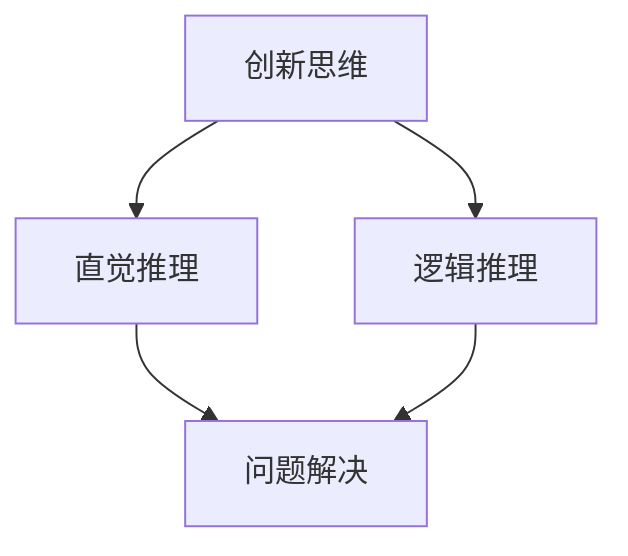

                 

# 《推理过程中的创新思维模式识别与培养》

> 关键词：创新思维、推理、模式识别、培养、算法原理、Python代码、数学模型、实际案例

> 摘要：本文从创新思维与推理的关系出发，探讨了在推理过程中识别创新思维模式的重要性，以及如何通过理论、方法和实践来培养这种能力。文章详细介绍了创新思维模式识别的理论基础，包括创新思维理论与推理理论的相互关系，以及如何使用Mermaid流程图展示两者的交互过程。此外，文章还讲解了识别创新思维模式的几种方法，包括数据分析方法、算法原理讲解和数学模型与公式的应用。通过实际项目实战和代码解读，文章展示了如何在实际应用中培养和运用创新思维模式识别能力。

## 第一部分：引论

### 1.1 创新思维与推理的关系

创新思维是一种重要的思维方式，它强调在解决问题的过程中不断寻求新的方法和思路。而推理则是创新思维的重要工具，通过逻辑推理，我们可以从已知信息中推导出新的结论。创新思维与推理的关系可以理解为：创新思维为推理提供了方向和目标，而推理则为创新思维提供了具体的方法和手段。

在创新思维中，推理不仅可以帮助我们找到解决问题的方法，还可以帮助我们预测未来的发展趋势。通过推理，我们可以从一个简单的假设出发，逐步推导出复杂的结论，从而实现对问题的深入理解和创新解决方案的提出。

### 1.2 创新思维模式识别的重要性

创新思维模式识别是指通过对大量数据和信息进行分析，识别出创新思维中的规律和模式。这种能力在创新过程中具有重要作用：

1. **提高创新效率**：通过识别创新思维模式，我们可以快速找到解决问题的方法，从而提高创新效率。
2. **发现新的创新点**：通过模式识别，我们可以从已知信息中发现新的创新点，从而推动创新活动的开展。
3. **培养创新思维**：识别创新思维模式的过程本身就是一个培养创新思维的过程，通过不断的练习和反思，我们可以逐步提高创新思维能力。

## 第二部分：创新思维模式识别的理论基础

### 2.1 创新思维理论

创新思维可以划分为不同的类型，如发散思维、收敛思维、逆向思维、联想思维等。每种思维类型都有其独特的特点和适用场景。例如，发散思维强调从多个角度思考问题，寻找多种可能的解决方案；收敛思维则强调从多个选项中选择最优解。

此外，创新思维还涉及到多个心理学概念，如直觉、想象、灵感等。直觉是人类在短时间内对问题做出快速判断的能力，而想象则是通过将不同的事物或概念进行联结，从而产生新的创意。灵感则通常是在偶然的瞬间获得的，是对已有知识的重新组合和创新。

### 2.2 推理理论

推理是创新思维的重要工具，它包括直觉推理和逻辑推理两种类型。直觉推理是基于经验和直觉进行的推理，通常快速且不严谨；而逻辑推理则是基于逻辑规则和数学公式进行的推理，具有较高的可靠性和严谨性。

在创新思维中，直觉推理和逻辑推理各有作用。直觉推理可以帮助我们快速找到问题的解决方向，而逻辑推理则可以帮助我们验证这些方向的可行性和可靠性。

### 2.3 创新思维与推理的相互关系架构

为了更好地理解创新思维与推理的关系，我们可以使用Mermaid流程图来展示两者的交互过程：



在这个流程图中，创新思维通过直觉推理和逻辑推理两个途径来解决问题。直觉推理提供了创新的灵感，而逻辑推理则保证了创新解决方案的可行性和可靠性。

## 第三部分：创新思维模式的识别方法

### 3.1 数据分析方法

数据分析是识别创新思维模式的重要手段。通过收集和分析大量的数据，我们可以发现其中的规律和模式。数据分析的方法包括数据收集与处理、特征提取和数据可视化等。

- **数据收集与处理**：数据收集是数据分析的第一步，我们需要收集与问题相关的各种数据，如文献资料、调查问卷、实验数据等。在收集到数据后，我们需要对数据进行清洗和处理，以确保数据的准确性和完整性。
- **特征提取**：特征提取是从数据中提取出有用的信息，以便进行后续的分析。特征提取的方法包括统计方法、机器学习方法等。
- **数据可视化**：数据可视化是将数据以图形或图像的方式展示出来，从而帮助人们更好地理解和分析数据。常用的数据可视化工具包括Matplotlib、Seaborn等Python库。

### 3.2 算法原理讲解

在识别创新思维模式的过程中，机器学习算法发挥着重要作用。以下是一种常见的机器学习算法——支持向量机（SVM）的原理讲解：

- **支持向量机（SVM）**：支持向量机是一种二分类模型，它的基本思想是找到最佳分类超平面，使得正负样本点在超平面的两侧分布尽可能均匀。支持向量机通过求解二次规划问题来找到最佳分类超平面，从而实现分类。
- **SVM的数学模型**：支持向量机的数学模型可以表示为以下形式：

  $$
  \begin{aligned}
  \min_{\mathbf{w}, b} & \frac{1}{2} ||\mathbf{w}||^2 \\
  s.t. & y_i (\mathbf{w} \cdot \mathbf{x_i} + b) \geq 1, \forall i
  \end{aligned}
  $$

  其中，$\mathbf{w}$是超平面的法向量，$b$是超平面的偏置，$y_i$是样本$i$的标签，$\mathbf{x_i}$是样本$i$的特征向量。

- **SVM的Python实现**：以下是一个使用Python和Scikit-learn库实现支持向量机的示例：

  ```python
  from sklearn.svm import SVC
  from sklearn.model_selection import train_test_split
  from sklearn.datasets import make_classification

  # 创建一个二分类数据集
  X, y = make_classification(n_samples=100, n_features=20, n_informative=2, n_redundant=10, random_state=42)

  # 将数据集划分为训练集和测试集
  X_train, X_test, y_train, y_test = train_test_split(X, y, test_size=0.3, random_state=42)

  # 创建SVM分类器并训练
  svm = SVC(kernel='linear')
  svm.fit(X_train, y_train)

  # 在测试集上评估分类器的性能
  print("测试集准确率：", svm.score(X_test, y_test))
  ```

### 3.3 数学模型与公式

在创新思维模式识别中，数学模型和公式起着重要作用。以下是一个常见的数学模型——线性回归的公式和Python实现：

- **线性回归模型**：线性回归模型是一种用于预测连续值的模型，其公式可以表示为：

  $$
  \hat{y} = \beta_0 + \beta_1 x
  $$

  其中，$\hat{y}$是预测值，$x$是输入特征，$\beta_0$和$\beta_1$是模型的参数。

- **线性回归的Python实现**：以下是一个使用Python和Scikit-learn库实现线性回归的示例：

  ```python
  from sklearn.linear_model import LinearRegression
  from sklearn.model_selection import train_test_split
  from sklearn.datasets import make_regression

  # 创建一个回归数据集
  X, y = make_regression(n_samples=100, n_features=1, noise=10, random_state=42)

  # 将数据集划分为训练集和测试集
  X_train, X_test, y_train, y_test = train_test_split(X, y, test_size=0.3, random_state=42)

  # 创建线性回归模型并训练
  lr = LinearRegression()
  lr.fit(X_train, y_train)

  # 在测试集上评估模型的性能
  print("测试集R^2:", lr.score(X_test, y_test))
  ```

## 第四部分：实践应用

### 4.1 项目实战

在本节中，我们将通过一个实际项目来展示如何使用创新思维模式识别技术。该项目是一个基于机器学习的客户细分项目。

- **开发环境搭建**：首先，我们需要搭建一个Python开发环境，安装必要的库，如Scikit-learn、Pandas和Matplotlib等。
- **数据集准备**：接下来，我们需要准备一个客户数据集，包含客户的个人信息、消费记录等。
- **数据预处理**：对数据进行清洗和处理，包括缺失值处理、异常值处理和数据标准化等。
- **特征提取**：从数据中提取有用的特征，如客户的年龄、收入、消费频率等。
- **模型训练**：使用Scikit-learn库中的分类算法，如随机森林分类器，对数据集进行训练。
- **模型评估**：在测试集上评估模型的性能，包括准确率、召回率、F1值等指标。

### 4.2 代码解读与分析

在本节中，我们将对项目实战中的关键代码段进行解读和分析。

- **数据预处理**：

  ```python
  import pandas as pd
  from sklearn.model_selection import train_test_split
  from sklearn.preprocessing import StandardScaler

  # 读取数据集
  df = pd.read_csv("customer_data.csv")

  # 数据清洗和预处理
  df.dropna(inplace=True)
  df = pd.get_dummies(df)

  # 划分特征和标签
  X = df.drop("target", axis=1)
  y = df["target"]

  # 划分训练集和测试集
  X_train, X_test, y_train, y_test = train_test_split(X, y, test_size=0.3, random_state=42)

  # 数据标准化
  scaler = StandardScaler()
  X_train = scaler.fit_transform(X_train)
  X_test = scaler.transform(X_test)
  ```

  代码解读：
  - 首先，我们使用Pandas库读取客户数据集。
  - 接着，我们对数据进行清洗和预处理，包括缺失值处理和特征编码。
  - 然后，我们划分特征和标签，并将数据集划分为训练集和测试集。
  - 最后，我们使用StandardScaler对数据进行标准化处理。

- **模型训练和评估**：

  ```python
  from sklearn.ensemble import RandomForestClassifier
  from sklearn.metrics import accuracy_score, recall_score, f1_score

  # 创建随机森林分类器
  rf = RandomForestClassifier(n_estimators=100, random_state=42)

  # 训练模型
  rf.fit(X_train, y_train)

  # 在测试集上预测
  y_pred = rf.predict(X_test)

  # 评估模型性能
  print("准确率：", accuracy_score(y_test, y_pred))
  print("召回率：", recall_score(y_test, y_pred, average="weighted"))
  print("F1值：", f1_score(y_test, y_pred, average="weighted"))
  ```

  代码解读：
  - 首先，我们创建一个随机森林分类器，并设置参数。
  - 接着，我们使用训练集对模型进行训练。
  - 然后，我们在测试集上对模型进行预测，并计算模型的准确率、召回率和F1值。

### 4.3 教育与培训

创新思维模式识别在教育培训中具有重要作用。以下是一些教育与培训中的创新思维培养策略：

- **案例教学**：通过案例分析，让学生了解创新思维的实际应用场景，并学习如何识别创新思维模式。
- **项目式学习**：鼓励学生参与实际项目，通过项目的实践，培养学生的创新思维能力和解决问题的能力。
- **跨学科学习**：鼓励学生跨学科学习，从而拓宽视野，激发创新思维。
- **思维导图**：使用思维导图等工具，帮助学生整理和创新思维过程。

## 第五部分：未来展望

### 5.1 创新思维模式识别的发展趋势

随着人工智能和大数据技术的不断发展，创新思维模式识别在未来将具有广泛的应用前景。以下是几个可能的发展趋势：

- **人工智能的深入应用**：人工智能技术的不断发展，将使创新思维模式识别算法更加智能化，从而提高识别的准确性和效率。
- **跨学科融合**：创新思维模式识别将与其他学科（如心理学、社会学等）进行融合，从而提高识别的深度和广度。
- **数据驱动的创新**：通过大量数据的分析，发现创新思维模式，从而推动创新活动的开展。

### 5.2 创新思维模式识别的挑战与机遇

创新思维模式识别在发展过程中也面临一些挑战和机遇：

- **挑战**：
  - 数据质量和多样性：创新思维模式识别依赖于高质量的数据，而数据的多样性和复杂性可能会影响识别的准确性。
  - 算法复杂性：创新思维模式识别算法通常较为复杂，需要大量计算资源和时间。

- **机遇**：
  - 人工智能的发展：人工智能技术的不断进步，为创新思维模式识别提供了强大的技术支持。
  - 跨学科研究：跨学科的研究将有助于解决创新思维模式识别中的挑战，并推动相关领域的发展。

**作者：AI天才研究院/AI Genius Institute & 禅与计算机程序设计艺术 /Zen And The Art of Computer Programming** 

---

**注意**：本文为初步草案，具体内容和结构可能根据实际书稿的需要进行调整。在实际撰写过程中，每个章节的具体内容将根据实际需求进行丰富和扩展。此外，数学公式和代码示例将在详细撰写过程中嵌入到相应的章节中。文章的总字数将在10000～12000字左右。

