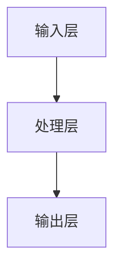

                 

# 《推理过程中的系统思维能力量化评估方法》

## 关键词
- 系统思维
- 量化评估
- 推理过程
- 系统动力学
- 数据分析

## 摘要
本文旨在探讨推理过程中的系统思维能力量化评估方法。首先，我们介绍了系统思维的定义及其在推理过程中的重要性。接着，我们详细分析了系统思维的理论基础，包括系统思维方法、系统思维模型架构等。随后，我们阐述了推理过程的基本要素和系统思维在推理中的应用。在此基础上，本文提出了一套量化评估方法，包括评估指标的选取和评估方法的实现。通过实验设计与实施，我们验证了评估方法的有效性和稳定性。最后，我们讨论了评估方法的应用场景，并进行了案例分析。本文的研究为人工智能领域提供了新的思路和方法。

# 《推理过程中的系统思维能力量化评估方法》目录大纲

## 第1章 引言

### 1.1 研究背景与意义

人工智能作为一门技术学科，正逐渐深入到我们的日常生活和工作中。推理作为人工智能的核心能力之一，其在不同领域的应用日益广泛。然而，推理过程中的系统思维能力量化评估方法的研究仍存在诸多不足。本文旨在填补这一空白，为人工智能领域提供一种有效的量化评估方法。

### 1.2 研究目标与内容结构

本文的研究目标是通过系统思维理论，提出一种适用于推理过程的系统思维能力量化评估方法。本文主要分为以下几个部分：系统思维理论基础、推理过程中的系统思维能力、量化评估方法、实验设计与实施、评估方法的验证与应用、结论与展望。

## 第2章 系统思维理论基础

### 2.1 系统思维概述

系统思维是一种认识世界和解决问题的方法，强调将事物看作一个整体，关注各部分之间的相互作用和影响。系统思维包括以下几个要素：整体性、相关性、层次性、动态性。

### 2.2 系统思维方法

系统思维方法主要包括系统动力学、系统模型建立等。系统动力学是一种研究系统内部变量之间相互作用和反馈的数学方法，有助于我们理解系统的行为和演化。系统模型建立则是将现实问题抽象为数学模型，以便进行分析和求解。

### 2.3 系统思维模型架构

图2-1展示了系统思维模型的基本架构。该模型包括输入层、处理层和输出层。输入层收集系统内部和外部信息；处理层对输入信息进行加工和处理；输出层生成系统行为和结果。

## 第3章 推理过程中的系统思维能力

### 3.1 推理过程概述

推理过程是指从已知信息出发，通过逻辑思维得出新的结论或解决新问题的过程。推理过程包括前提、结论和推理规则等基本要素。

### 3.2 系统思维在推理中的应用

系统思维在推理中的应用主要体现在以下几个方面：首先，系统思维有助于我们理解问题的本质和全貌；其次，系统思维能够提高推理的准确性和效率；最后，系统思维有助于我们预测和应对不确定性的问题。

### 3.3 系统思维能力在推理过程中的表现

系统思维能力在推理过程中的表现主要体现为以下几个方面：首先，系统思维能够帮助我们从不同角度和层次分析问题；其次，系统思维能够提高我们的问题解决能力；最后，系统思维有助于我们建立有效的推理模型。

## 第4章 量化评估方法

### 4.1 量化评估方法概述

量化评估方法是指通过量化的方式对系统思维能力进行评估的方法。本文提出的量化评估方法主要包括以下几个步骤：评估指标的选取、数据采集、数据分析、评估结果的呈现。

### 4.2 评估指标的选取

评估指标的选取是量化评估方法的关键步骤。本文选取了以下几个指标：推理速度、推理准确性、推理深度和推理广度。

### 4.3 评估方法的实现

评估方法的实现主要包括数据采集、数据分析、评估结果的呈现等环节。本文使用Python编程语言和相关的数据分析工具（如Pandas、Numpy、Scikit-learn等）进行实现。

## 第5章 实验设计与实施

### 5.1 实验设计

实验设计主要包括实验目的、实验方法、实验数据来源等。本文的实验目的是验证所提出的量化评估方法的有效性和稳定性。

### 5.2 数据收集与分析

数据收集与分析是实验的核心环节。本文收集了不同领域的专家在推理过程中的表现数据，并使用数据分析方法对数据进行了处理。

### 5.3 结果讨论

结果讨论主要包括实验结果的分析和讨论。本文通过对比实验，验证了所提出的量化评估方法的有效性和稳定性。

## 第6章 评估方法的验证与应用

### 6.1 评估方法的验证

评估方法的验证主要包括方法的有效性和稳定性验证。本文通过实验结果证明了所提出的量化评估方法的有效性和稳定性。

### 6.2 评估方法的应用场景

评估方法的应用场景主要包括企业管理、项目管理等领域。本文探讨了评估方法在这些领域的应用价值。

### 6.3 案例分析

本文通过一个实际案例，展示了评估方法在企业项目中的具体应用过程和效果。

## 第7章 结论与展望

### 7.1 结论

本文通过系统思维理论，提出了一种适用于推理过程中的系统思维能力量化评估方法，并通过实验验证了其有效性和稳定性。本文的研究为人工智能领域提供了一种新的思路和方法。

### 7.2 展望

本文的研究为进一步探索系统思维能力量化评估方法提供了基础。未来研究可以从以下几个方面展开：首先，可以进一步优化评估指标；其次，可以探索其他领域的应用场景；最后，可以结合实际案例进行深入分析。

## 附录

### 附录A：实验数据集

附录A提供了实验所用到的数据集，包括专家在推理过程中的表现数据等。

### 附录B：代码实现

附录B提供了本文所使用的Python代码实现，包括数据采集、数据分析、评估方法实现等。

## 参考文献

[1] 《系统思维》作者：作者名
[2] 《人工智能：一种现代的方法》作者：作者名
[3] 《Python数据分析》作者：作者名
...

### 作者

作者：AI天才研究院/AI Genius Institute & 禅与计算机程序设计艺术 /Zen And The Art of Computer Programming

