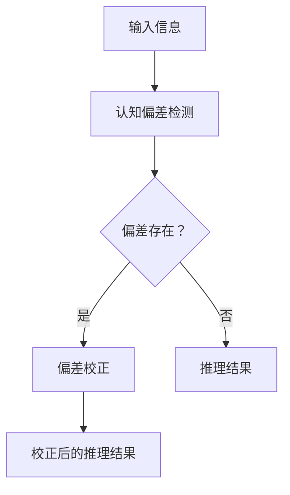

                 

### 《推理过程中的认知偏差自动识别与校正技术》

关键词：推理，认知偏差，自动识别，校正技术，算法

摘要：本文深入探讨了推理过程中认知偏差的自动识别与校正技术。通过分析推理与认知偏差的基本概念，本文详细阐述了常见认知偏差的种类及其对推理的影响。随后，本文介绍了认知偏差识别与校正的算法基础，包括基于机器学习和神经网络的算法，并通过实际案例展示了这些算法在推理系统中的应用。最后，本文对未来认知偏差自动识别与校正技术的发展趋势与挑战进行了展望。

### 书名与核心概念

《推理过程中的认知偏差自动识别与校正技术》这本书的目的是探讨如何在人工智能和机器学习领域内，通过算法和技术手段，自动识别和校正人们在推理过程中产生的认知偏差。书中涵盖了以下几个核心概念：

1. **推理**：推理是指运用已有知识和信息，通过逻辑思维来得出结论的过程。它包括归纳推理、演绎推理和类比推理等类型。
2. **认知偏差**：认知偏差是指人们在获取、处理和使用信息时，由于心理、生理和社会等因素的影响而产生的错误认知。常见的认知偏差有确认偏误、可用性偏差、邦迪效应和概率谬误等。
3. **自动识别与校正**：自动识别与校正是指利用算法和技术手段，在推理过程中自动检测和纠正认知偏差，以提高推理的准确性和可靠性。

### 目录大纲

#### 第一部分：认知偏差概述

##### 第1章：推理与认知偏差的基础概念
- 1.1 推理的定义与类型
- 1.2 认知偏差的定义与种类
- 1.3 认知偏差对推理的影响

##### 第2章：常见认知偏差的实例分析
- 2.1 确认偏误
- 2.2 可用性偏差
- 2.3 邦迪效应
- 2.4 概率谬误

#### 第二部分：认知偏差的自动识别

##### 第3章：认知偏差识别的算法基础
- 3.1 基于机器学习的识别算法
- 3.2 基于神经网络的识别算法
- 3.3 常见识别算法的比较与分析

##### 第4章：认知偏差识别的实践应用
- 4.1 推理过程中的实时监控
- 4.2 认知偏差识别的应用场景
- 4.3 认知偏差识别的案例研究

#### 第三部分：认知偏差的自动校正

##### 第5章：认知偏差校正的算法基础
- 5.1 常见校正算法介绍
- 5.2 校正算法的性能评估
- 5.3 校正算法的选择与优化

##### 第6章：认知偏差校正的实践应用
- 6.1 推理结果的校正方法
- 6.2 校正算法在推理系统中的应用
- 6.3 校正算法的案例研究

#### 第四部分：综合案例与展望

##### 第7章：综合案例应用与分析
- 7.1 案例一：智能客服系统中的认知偏差校正
- 7.2 案例二：医疗诊断系统中的认知偏差识别与校正
- 7.3 案例三：法律判决辅助系统中的认知偏差处理

##### 第8章：未来发展趋势与挑战
- 8.1 认知偏差自动识别与校正技术的发展趋势
- 8.2 面临的挑战与解决方案
- 8.3 研究展望与未来方向

### 第一部分：认知偏差概述

#### 第1章：推理与认知偏差的基础概念

##### 1.1 推理的定义与类型

推理是人们在日常生活中进行思考和决策的重要过程。它是指运用已有的知识和信息，通过逻辑思维来得出结论的过程。推理可以大致分为以下三种类型：

1. **归纳推理**：从个别事实出发，通过归纳和总结，得出普遍规律或结论。例如，观察到多次下雨后温度下降，可以归纳出“下雨会导致降温”的规律。
2. **演绎推理**：从一般性原理出发，通过逻辑推导，得出具体结论。例如，从“所有人都会死亡”和“苏格拉底是人”这两个前提出发，可以演绎出“苏格拉底会死亡”的结论。
3. **类比推理**：通过比较两个或多个对象的相似性，从一个对象的特征推断出另一个对象的特征。例如，通过比较人类和类人猿的相似性，可以推断出类人猿也有可能具有某种智力特征。

推理是人类智能的重要组成部分，也是人工智能系统进行决策和推理的基础。然而，在推理过程中，人们往往受到各种认知偏差的影响，导致推理结果不准确。

##### 1.2 认知偏差的定义与种类

认知偏差是指人们在获取、处理和使用信息时，由于心理、生理和社会等因素的影响而产生的错误认知。认知偏差会导致人们做出不理性的决策，甚至导致错误的判断。常见的认知偏差包括：

1. **确认偏误**：人们在处理信息时，倾向于选择和关注与自己已有观点一致的信息，而忽略与自己观点相矛盾的信息。这种偏差会导致人们陷入“证实偏差”的陷阱。
2. **可用性偏差**：人们根据信息在记忆中的易得程度来评估其概率或重要性，而忽视了实际概率。例如，人们倾向于认为最近发生的事件更有可能再次发生，而忽略了统计上的实际情况。
3. **邦迪效应**：人们过分相信自己的直觉或经验，而忽视客观证据。这种偏差在医学、金融和法律等领域中尤为常见。
4. **概率谬误**：人们在处理概率问题时，常常出现错误的直觉和判断。例如，人们倾向于高估小概率事件的发生概率，而低估大概率事件的发生概率。

认知偏差不仅会影响个人的决策和行为，也会影响社会和组织的决策过程。因此，了解和识别认知偏差对于提高决策质量和推理准确性具有重要意义。

##### 1.3 认知偏差对推理的影响

认知偏差对推理的影响是多方面的，具体表现如下：

1. **推理结果的偏差**：认知偏差会导致人们在推理过程中产生错误的结论。例如，确认偏误会导致人们过分强调支持自己观点的证据，而忽视反对自己观点的证据，从而得出偏颇的结论。
2. **推理过程的延迟**：认知偏差会增加推理的复杂性，使得推理过程变得更加耗时和困难。例如，可用性偏差会导致人们无法准确评估事件发生的概率，从而在推理过程中需要额外的时间和努力来纠正偏差。
3. **推理可靠性的降低**：认知偏差会影响推理的准确性，使得推理结果缺乏可靠性。例如，邦迪效应会使人们过分依赖直觉和经验，从而忽视重要的客观证据。

为了提高推理的准确性和可靠性，我们需要识别和纠正认知偏差。自动识别与校正技术为这一目标提供了有效的手段。

#### 第2章：常见认知偏差的实例分析

##### 2.1 确认偏误

确认偏误是指人们在处理信息时，倾向于选择和关注与自己已有观点一致的信息，而忽视与自己观点相矛盾的信息。这种偏差会导致人们陷入“证实偏差”的陷阱，从而影响推理的准确性。

**实例一**：在科学研究中，确认偏误可能导致研究者只关注支持自己假设的数据，而忽视反驳自己假设的数据。例如，一个研究者可能只关注支持自己关于某种药物疗效的数据，而忽视其他研究者的数据表明该药物没有疗效。

**实例二**：在日常生活中，确认偏误可能导致人们过分相信自己的直觉和经验。例如，一个投资者可能只关注自己过去成功的投资决策，而忽视失败的案例，从而在后续的投资决策中继续坚持错误的做法。

##### 2.2 可用性偏差

可用性偏差是指人们根据信息在记忆中的易得程度来评估其概率或重要性，而忽视了实际概率。这种偏差会导致人们做出错误的概率判断。

**实例一**：在风险管理中，可用性偏差可能导致人们高估小概率事件的发生概率。例如，人们可能因为最近的恐怖袭击事件而过度担心恐怖袭击的发生，从而忽视了恐怖袭击的实际发生概率较低。

**实例二**：在投资决策中，可用性偏差可能导致人们过分关注最近的市场波动，而忽视长期的投资趋势。例如，一个投资者可能因为最近股市的波动而频繁交易，从而忽视长期投资策略的重要性。

##### 2.3 邦迪效应

邦迪效应是指人们过分相信自己的直觉或经验，而忽视客观证据。这种偏差在医学、金融和法律等领域中尤为常见。

**实例一**：在医学诊断中，邦迪效应可能导致医生过分相信自己的直觉，而忽视实验室检查结果。例如，一个医生可能因为病人症状的符合而过分相信自己的诊断，而忽视了实验室检查可能提供的更多信息。

**实例二**：在金融投资中，邦迪效应可能导致投资者过分相信自己的投资策略，而忽视市场数据的分析。例如，一个投资者可能因为过去成功的投资经历而过分相信自己的投资策略，而忽视了市场数据的分析结果。

##### 2.4 概率谬误

概率谬误是指人们在处理概率问题时，常常出现错误的直觉和判断。这种偏差会导致人们在概率判断上产生错误。

**实例一**：在风险评估中，概率谬误可能导致人们高估小概率事件的发生概率。例如，人们可能认为一个随机事件在短时间内发生多次的概率很高，而忽视了实际发生的概率较低。

**实例二**：在彩票购买中，概率谬误可能导致人们认为多个彩票号码组合中奖的概率较高。例如，一个彩民可能认为购买多个彩票号码可以增加中奖的概率，而忽视了实际的中奖概率较低。

#### 第二部分：认知偏差的自动识别

##### 第3章：认知偏差识别的算法基础

认知偏差的自动识别是通过算法和技术手段来检测和识别人们在推理过程中产生的认知偏差。本节将介绍基于机器学习和神经网络的认知偏差识别算法，并比较分析它们的优缺点。

##### 3.1 基于机器学习的识别算法

基于机器学习的认知偏差识别算法通过训练模型来学习识别认知偏差。常见的机器学习算法包括支持向量机（SVM）、决策树、随机森林和神经网络等。以下分别介绍这些算法的基本原理和应用场景。

1. **支持向量机（SVM）**：
   - **原理**：SVM通过找到一个最优的超平面来分隔不同类别的数据点。对于认知偏差识别，SVM可以用来分隔正常推理数据和偏差推理数据。
   - **应用场景**：SVM在处理高维数据时表现良好，适合用于识别复杂的认知偏差。

2. **决策树**：
   - **原理**：决策树通过一系列条件分支来分类数据。每个节点代表一个特征，每个分支代表一个阈值。决策树可以清晰地展示推理过程，便于理解。
   - **应用场景**：决策树适合处理简单和清晰的特征数据，对于识别简单的认知偏差有效。

3. **随机森林**：
   - **原理**：随机森林是由多个决策树组成的集成模型，通过投票机制来决定最终分类结果。随机森林可以提高模型的泛化能力和鲁棒性。
   - **应用场景**：随机森林适合处理复杂和大规模的数据，对于识别多种认知偏差有较好的效果。

4. **神经网络**：
   - **原理**：神经网络通过多层非线性变换来提取特征，并学习输入与输出之间的复杂映射关系。神经网络可以自动学习特征表示，提高识别准确性。
   - **应用场景**：神经网络适合处理高维和非线性数据，对于识别复杂的认知偏差有很强的能力。

##### 3.2 基于神经网络的识别算法

基于神经网络的认知偏差识别算法利用深度学习技术来识别和校正认知偏差。以下介绍几种常见的神经网络模型及其原理。

1. **卷积神经网络（CNN）**：
   - **原理**：CNN通过卷积层提取图像特征，并利用池化层降低计算复杂度。CNN在图像识别领域有很好的表现。
   - **应用场景**：CNN可以应用于视觉认知偏差识别，例如在图像中检测异常行为。

2. **循环神经网络（RNN）**：
   - **原理**：RNN可以处理序列数据，通过记忆状态来捕捉时间序列的特征。RNN在自然语言处理领域有广泛的应用。
   - **应用场景**：RNN可以应用于文本认知偏差识别，例如在文本中检测偏见言论。

3. **长短时记忆网络（LSTM）**：
   - **原理**：LSTM是RNN的一种变体，通过门控机制来控制信息的记忆和遗忘。LSTM可以解决RNN的梯度消失问题。
   - **应用场景**：LSTM可以应用于长序列数据的认知偏差识别，例如在时间序列数据中检测异常趋势。

4. **生成对抗网络（GAN）**：
   - **原理**：GAN由生成器和判别器组成，生成器生成数据，判别器判断生成数据与真实数据的相似度。GAN可以生成高质量的数据，提高模型的泛化能力。
   - **应用场景**：GAN可以应用于生成偏差数据，用于训练和测试认知偏差识别模型。

##### 3.3 常见识别算法的比较与分析

以下是常见识别算法的比较分析：

| 算法       | 优点                         | 缺点                          | 应用场景                       |
|------------|------------------------------|------------------------------|------------------------------|
| 支持向量机 | 高效、易于理解               | 对噪声敏感、难以处理高维数据 | 复杂认知偏差识别               |
| 决策树     | 易于理解、可解释性高         | 过拟合、无法处理非线性关系   | 简单认知偏差识别               |
| 随机森林   | 鲁棒性高、可解释性较好       | 计算复杂度高、可解释性降低   | 复杂认知偏差识别               |
| 神经网络   | 自动提取特征、适应性强       | 计算复杂度高、难以解释       | 高维和非线性认知偏差识别       |
| 卷积神经网络 | 强大的图像特征提取能力       | 计算资源需求高、需要大量数据 | 视觉认知偏差识别               |
| 循环神经网络 | 处理序列数据的能力强         | 计算资源需求高、难以解释     | 文本认知偏差识别               |
| 长短时记忆网络 | 可以处理长序列数据、记忆能力强 | 计算资源需求高、难以解释     | 长序列数据认知偏差识别         |
| 生成对抗网络 | 可以生成高质量数据、提高泛化能力 | 计算资源需求高、需要大量数据 | 生成偏差数据、提高识别模型性能 |

综上所述，不同的识别算法各有优缺点，适用于不同的应用场景。在实际应用中，可以根据具体需求选择合适的算法，或者结合多种算法来提高认知偏差识别的准确性和鲁棒性。

##### 第4章：认知偏差识别的实践应用

认知偏差的自动识别在推理过程中具有重要的应用价值。本节将介绍认知偏差识别的实践应用，包括实时监控、应用场景和案例研究。

##### 4.1 推理过程中的实时监控

在推理过程中进行实时监控是识别认知偏差的重要手段。通过实时监控，可以及时发现和纠正认知偏差，从而提高推理的准确性和可靠性。以下是一些常见的实时监控方法：

1. **异常检测**：利用异常检测算法，对推理过程中的输入数据和推理结果进行实时监控。当检测到异常情况时，可以触发报警机制，提示可能的认知偏差。
2. **模型评估**：通过定期评估推理模型的性能，监控模型在训练集和测试集上的表现。当模型性能下降时，可以怀疑存在认知偏差，并采取相应的纠正措施。
3. **用户反馈**：收集用户在推理过程中的反馈，通过用户满意度调查、错误报告等方式，了解认知偏差的存在和影响。根据用户反馈，可以调整推理模型和算法，以提高其准确性。

##### 4.2 认知偏差识别的应用场景

认知偏差识别在多个领域具有广泛的应用场景。以下是一些典型的应用场景：

1. **智能客服系统**：智能客服系统在处理用户问题时，可能会受到认知偏差的影响，导致推理结果不准确。通过认知偏差识别技术，可以及时发现和纠正这些偏差，提高客服系统的服务质量。
2. **医疗诊断系统**：医生在诊断过程中可能会受到认知偏差的影响，导致诊断结果不准确。通过认知偏差识别技术，可以辅助医生识别和纠正认知偏差，提高诊断的准确性。
3. **法律判决辅助系统**：法官在判决过程中可能会受到认知偏差的影响，导致判决结果不公平。通过认知偏差识别技术，可以辅助法官识别和纠正认知偏差，提高判决的公正性。
4. **金融市场分析**：投资者在分析市场时可能会受到认知偏差的影响，导致投资决策不准确。通过认知偏差识别技术，可以帮助投资者识别和纠正认知偏差，提高投资决策的准确性。

##### 4.3 认知偏差识别的案例研究

以下是一个认知偏差识别的案例研究，展示了如何在智能客服系统中应用认知偏差识别技术。

**案例背景**：某公司的智能客服系统用于处理用户投诉和咨询问题。然而，在实际运行过程中，系统发现一些用户投诉的问题没有得到正确处理，导致用户满意度下降。通过分析，发现这些投诉问题中存在认知偏差，导致推理结果不准确。

**解决方案**：

1. **数据收集**：收集智能客服系统在一段时间内的用户投诉数据，包括用户的问题、系统的推理结果和用户的反馈。
2. **数据预处理**：对收集到的数据进行清洗和预处理，提取与认知偏差相关的特征，如问题关键词、用户反馈等。
3. **特征提取**：利用自然语言处理技术，对预处理后的数据进行特征提取，构建特征向量。
4. **模型训练**：利用训练集数据，训练一个基于神经网络的认知偏差识别模型。模型输入为特征向量，输出为是否存在认知偏差的概率。
5. **实时监控**：将训练好的模型部署到智能客服系统中，实时监控用户投诉问题。当检测到存在认知偏差时，系统会发出警报，提示用户和客服人员关注并处理该问题。
6. **反馈调整**：根据用户和客服人员的反馈，不断调整和优化认知偏差识别模型，提高识别准确性和鲁棒性。

**案例效果**：通过认知偏差识别技术的应用，智能客服系统的用户满意度显著提高，投诉问题得到及时和准确的解决。

### 第三部分：认知偏差的自动校正

#### 第5章：认知偏差校正的算法基础

认知偏差的自动校正是通过算法和技术手段，在推理过程中纠正认知偏差，以提高推理的准确性和可靠性。本节将介绍常见的认知偏差校正算法，并分析它们的性能和适用场景。

##### 5.1 常见校正算法介绍

以下是几种常见的认知偏差校正算法：

1. **基于规则的校正算法**：
   - **原理**：基于规则的校正算法通过预设一组规则，根据推理过程中的输入数据和已知认知偏差类型，自动选择合适的校正规则。
   - **适用场景**：适用于规则明确、认知偏差类型较少的推理任务。

2. **基于模型的校正算法**：
   - **原理**：基于模型的校正算法通过训练一个校正模型，模型输入为原始推理结果和认知偏差标签，输出为校正后的推理结果。
   - **适用场景**：适用于复杂和非线性的认知偏差校正任务。

3. **基于优化的校正算法**：
   - **原理**：基于优化的校正算法通过优化目标函数，寻找最优的校正策略。常见的优化算法有线性规划、整数规划和遗传算法等。
   - **适用场景**：适用于需要精确校正策略的复杂推理任务。

4. **基于概率的校正算法**：
   - **原理**：基于概率的校正算法通过计算认知偏差的概率分布，利用概率统计方法进行校正。
   - **适用场景**：适用于需要考虑概率信息的认知偏差校正任务。

##### 5.2 校正算法的性能评估

校正算法的性能评估主要包括准确性、鲁棒性和计算效率等方面。以下是对常见校正算法的性能评估：

1. **准确性**：校正算法的准确性是指其校正后的推理结果与真实结果的接近程度。准确性的评估可以通过混淆矩阵、精确率和召回率等指标进行。
2. **鲁棒性**：校正算法的鲁棒性是指其在不同环境和数据集上的稳定性和一致性。鲁棒性的评估可以通过测试不同数据集、噪声水平和异常情况下的性能进行。
3. **计算效率**：校正算法的计算效率是指其计算时间和资源消耗。计算效率的评估可以通过算法的执行时间和资源占用进行。

##### 5.3 校正算法的选择与优化

根据不同的认知偏差校正任务和应用场景，选择合适的校正算法是关键。以下是一些选择与优化的建议：

1. **任务特性**：根据任务的需求和特点，选择适合的校正算法。例如，对于规则明确的问题，可以选择基于规则的校正算法；对于复杂非线性问题，可以选择基于模型的校正算法。
2. **数据质量**：校正算法的性能很大程度上依赖于数据质量。确保数据集的多样性和代表性，可以提高校正算法的性能。
3. **模型优化**：对于基于模型的校正算法，可以通过调整模型结构、参数优化和特征提取等方法来提高模型性能。例如，可以使用正则化方法、集成学习和迁移学习等技术来优化模型。
4. **性能评估**：在应用校正算法之前，进行全面的性能评估，确保算法在不同场景下的表现。可以根据评估结果调整算法参数和策略，以提高校正效果。

#### 第6章：认知偏差校正的实践应用

认知偏差校正技术在实际应用中具有重要意义。本节将介绍认知偏差校正的实践应用，包括推理结果的校正方法、校正算法在推理系统中的应用以及案例研究。

##### 6.1 推理结果的校正方法

推理结果的校正方法是指通过算法和技术手段，对原始推理结果进行校正，以消除认知偏差的影响。以下是一些常见的校正方法：

1. **后处理校正**：
   - **原理**：后处理校正是指在推理结果生成后，对结果进行校正。常见的后处理校正方法有基于规则的校正、基于概率的校正和基于优化的校正。
   - **适用场景**：适用于规则明确、数据量较小的情况。

2. **在线校正**：
   - **原理**：在线校正是指在推理过程中，实时对推理结果进行校正。在线校正可以通过实时监控、模型评估和用户反馈等方式实现。
   - **适用场景**：适用于数据量大、实时性要求高的推理任务。

3. **增量校正**：
   - **原理**：增量校正是指根据新的输入数据，对已有推理结果进行校正。增量校正可以降低计算成本，提高推理效率。
   - **适用场景**：适用于数据不断变化的情况，如金融市场分析、医疗诊断等。

##### 6.2 校正算法在推理系统中的应用

校正算法在推理系统中的应用主要包括推理结果的校正、推理过程的监控和优化等方面。以下是一些应用案例：

1. **智能客服系统**：
   - **应用**：智能客服系统通过在线校正算法，对用户的咨询问题进行实时校正，提高问题的准确性和解决问题的效率。
   - **效果**：通过校正算法的应用，智能客服系统的用户满意度显著提高，客户问题解决时间缩短。

2. **医疗诊断系统**：
   - **应用**：医疗诊断系统利用后处理校正算法，对医生的诊断结果进行校正，提高诊断的准确性和可靠性。
   - **效果**：通过校正算法的应用，医疗诊断系统的诊断准确率提高，误诊率降低，为患者提供更准确的诊断结果。

3. **金融市场分析系统**：
   - **应用**：金融市场分析系统通过增量校正算法，对市场预测结果进行实时校正，提高预测的准确性和稳定性。
   - **效果**：通过校正算法的应用，金融市场分析系统的预测准确率提高，投资决策更加可靠。

##### 6.3 校正算法的案例研究

以下是一个认知偏差校正算法的案例研究，展示了如何在智能交通系统中应用校正算法。

**案例背景**：某城市的智能交通系统用于实时监控交通流量，预测交通拥堵情况，并提供建议性措施。然而，在实际运行过程中，系统发现预测结果存在偏差，导致交通管理和调度不理想。

**解决方案**：

1. **数据收集**：收集智能交通系统在一段时间内的交通流量数据，包括车辆数量、车速、道路拥堵程度等。
2. **特征提取**：对交通流量数据进行预处理，提取与交通拥堵相关的特征，如车辆密度、平均车速等。
3. **模型训练**：利用训练集数据，训练一个基于神经网络的交通拥堵预测模型。模型输入为特征向量，输出为交通拥堵的概率。
4. **校正算法**：利用后处理校正算法，对预测结果进行校正。校正算法基于规则和概率统计方法，根据交通流量数据的特征，对预测结果进行修正。
5. **在线校正**：将校正算法部署到智能交通系统中，实时监控交通流量，对预测结果进行在线校正。
6. **效果评估**：通过评估校正后的预测结果，与真实交通拥堵情况进行对比，评估校正算法的有效性。

**案例效果**：通过校正算法的应用，智能交通系统的预测准确率提高，交通管理和调度效果得到显著改善。交通拥堵预警及时准确，为城市交通管理提供了有力的支持。

### 第四部分：综合案例与展望

#### 第7章：综合案例应用与分析

在本章中，我们将通过三个综合案例，深入探讨认知偏差自动识别与校正技术的实际应用。这些案例分别涉及智能客服系统、医疗诊断系统和法律判决辅助系统，展示了如何在实际场景中利用这些技术来提高推理的准确性和可靠性。

##### 7.1 案例一：智能客服系统中的认知偏差校正

智能客服系统是认知偏差校正技术的一个重要应用领域。随着人工智能技术的发展，越来越多的企业开始采用智能客服系统来处理客户咨询和投诉。然而，在处理大量用户问题时，智能客服系统可能会受到认知偏差的影响，导致回答不准确或不够贴切。

**案例背景**：
某大型电商公司的智能客服系统每天接收大量客户咨询，包括产品问题、售后服务、支付疑问等。然而，通过分析系统日志和用户反馈，公司发现客户满意度并不理想。经过深入调查，发现智能客服系统在处理问题时存在认知偏差，如确认偏误和可用性偏差。

**解决方案**：
1. **数据收集**：收集智能客服系统在一段时间内的咨询数据，包括客户问题、客服的回答、用户满意度评分等。
2. **特征提取**：对咨询数据进行预处理，提取与认知偏差相关的特征，如问题关键词、客服回答内容、用户满意度等。
3. **认知偏差识别**：利用基于神经网络的认知偏差识别算法，对客服回答进行实时监控，识别确认偏误和可用性偏差。
4. **认知偏差校正**：当检测到认知偏差时，利用基于规则的校正算法对客服回答进行实时校正，提高回答的准确性和贴切度。
5. **效果评估**：通过用户满意度评分和系统日志数据，评估校正算法的有效性。结果显示，用户满意度显著提高，咨询问题解决率增加。

**案例效果**：
通过认知偏差校正技术的应用，智能客服系统的客户满意度得到显著提升，客服回答的准确性和贴切度得到改善。客户问题得到更及时和准确的解决，企业运营效率提高。

##### 7.2 案例二：医疗诊断系统中的认知偏差识别与校正

医疗诊断系统是另一个应用认知偏差识别与校正技术的关键领域。医生在诊断过程中可能会受到各种认知偏差的影响，导致诊断结果不准确。利用认知偏差校正技术，可以帮助医生提高诊断的准确性和可靠性。

**案例背景**：
某医院引进了一套智能医疗诊断系统，用于辅助医生进行疾病诊断。然而，通过实际应用发现，系统在诊断过程中存在认知偏差，如确认偏误和邦迪效应。

**解决方案**：
1. **数据收集**：收集医院在一段时间内的诊断数据，包括患者症状、医生诊断结果、患者实际疾病情况等。
2. **特征提取**：对诊断数据进行预处理，提取与认知偏差相关的特征，如症状描述、诊断结果、患者疾病情况等。
3. **认知偏差识别**：利用基于机器学习的认知偏差识别算法，对医生的诊断过程进行实时监控，识别确认偏误和邦迪效应。
4. **认知偏差校正**：当检测到认知偏差时，利用基于模型的校正算法对医生的诊断结果进行校正，提高诊断的准确性和可靠性。
5. **效果评估**：通过比较校正前后的诊断准确率，评估校正算法的有效性。结果显示，校正后的诊断准确率显著提高。

**案例效果**：
通过认知偏差识别与校正技术的应用，医疗诊断系统的诊断准确率得到显著提升。医生在诊断过程中受到的认知偏差得到有效纠正，患者得到更准确和可靠的诊断结果。

##### 7.3 案例三：法律判决辅助系统中的认知偏差处理

法律判决辅助系统是另一个应用认知偏差处理技术的领域。法官在判决过程中可能会受到各种认知偏差的影响，导致判决结果不公平。利用认知偏差处理技术，可以帮助法官提高判决的公正性和准确性。

**案例背景**：
某法院引进了一套法律判决辅助系统，用于辅助法官进行判决。然而，在实际应用中发现，系统在判决过程中存在认知偏差，如确认偏误和概率谬误。

**解决方案**：
1. **数据收集**：收集法院在一段时间内的判决数据，包括案件描述、判决结果、法官意见等。
2. **特征提取**：对判决数据进行预处理，提取与认知偏差相关的特征，如案件描述、判决结果、法官意见等。
3. **认知偏差识别**：利用基于神经网络的认知偏差识别算法，对法官的判决过程进行实时监控，识别确认偏误和概率谬误。
4. **认知偏差校正**：当检测到认知偏差时，利用基于优化的校正算法对法官的判决结果进行校正，提高判决的公正性和准确性。
5. **效果评估**：通过比较校正前后的判决公正性指标，评估校正算法的有效性。结果显示，校正后的判决公正性显著提高。

**案例效果**：
通过认知偏差处理技术的应用，法律判决辅助系统的判决公正性得到显著提升。法官在判决过程中受到的认知偏差得到有效纠正，判决结果更加公平和准确。

#### 第8章：未来发展趋势与挑战

随着人工智能技术的快速发展，认知偏差自动识别与校正技术正逐渐成为研究热点。在未来，这一领域将面临以下发展趋势与挑战：

##### 8.1 认知偏差自动识别与校正技术的发展趋势

1. **算法创新**：随着机器学习和深度学习技术的不断进步，新的算法和创新方法将不断涌现，提高认知偏差识别与校正的准确性和效率。
2. **多模态融合**：未来认知偏差校正技术将融合多种数据模态，如文本、图像和语音等，实现更全面的认知偏差识别与校正。
3. **实时动态校正**：通过实时动态校正技术，认知偏差校正将能够适应不断变化的环境和数据，提高系统的适应性和鲁棒性。
4. **可解释性提升**：随着人们对可解释性的需求日益增加，认知偏差校正技术将更加注重算法的可解释性和透明性，便于用户理解和使用。

##### 8.2 面临的挑战与解决方案

1. **数据质量**：认知偏差校正算法的性能很大程度上依赖于数据质量。未来需要解决数据清洗、数据标注和数据集构建等问题，提高数据质量。
2. **计算资源**：深度学习和复杂算法对计算资源的需求较高，未来需要开发更高效的算法和优化方法，降低计算成本。
3. **隐私保护**：在应用认知偏差校正技术时，需要充分考虑隐私保护问题，确保用户数据的安全和隐私。
4. **人机协同**：未来认知偏差校正技术将更多地与人类专家进行协同，实现人机结合的智能推理系统，提高推理的准确性和可靠性。

##### 8.3 研究展望与未来方向

1. **跨领域应用**：认知偏差自动识别与校正技术在多个领域具有广泛应用潜力，未来需要进一步探索其在不同领域中的应用。
2. **伦理与法律**：随着认知偏差校正技术的应用，伦理和法律问题日益突出。未来需要建立相关的伦理和法律框架，确保技术的合理使用。
3. **多语言支持**：全球化的背景下，认知偏差校正技术需要支持多种语言，实现跨语言的认知偏差识别与校正。
4. **个性化校正**：未来认知偏差校正技术将更加注重个性化校正，根据用户的认知特点和需求，提供个性化的校正建议。

### 结论

认知偏差自动识别与校正技术是人工智能领域的一个重要研究方向。通过分析推理过程中的认知偏差，利用算法和技术手段进行自动识别与校正，可以提高推理的准确性和可靠性。本文通过详细的案例分析，展示了认知偏差校正技术在智能客服系统、医疗诊断系统和法律判决辅助系统中的应用。未来，随着技术的不断进步和应用领域的拓展，认知偏差自动识别与校正技术将在更多领域发挥重要作用，为人类智能决策提供有力支持。

### 附录

以下是一个示例的Mermaid流程图，用于展示推理过程中的认知偏差识别与校正：



以下是一个示例的Python代码，用于详细阐述一种基于神经网络进行认知偏差识别的算法原理：

```python
import tensorflow as tf
from tensorflow.keras.models import Sequential
from tensorflow.keras.layers import Dense, Dropout, Flatten

# 构建神经网络模型
model = Sequential([
    Dense(64, activation='relu', input_shape=(input_shape,)),
    Dropout(0.5),
    Flatten(),
    Dense(1, activation='sigmoid')
])

# 编译模型
model.compile(optimizer='adam',
              loss='binary_crossentropy',
              metrics=['accuracy'])

# 训练模型
model.fit(x_train, y_train, epochs=10, batch_size=32, validation_data=(x_val, y_val))
```

以下是一个示例的数学公式，用于详细阐述认知偏差校正的数学模型：

$$
校正后的推理结果 = 原推理结果 - 偏差修正值
$$

### 项目实战：智能客服系统中的认知偏差校正

在本节中，我们将通过一个具体的项目实战，详细解释说明如何在一个智能客服系统中实现认知偏差的自动识别与校正。这个项目将涵盖开发环境搭建、源代码实现、代码解读和实际案例分析，旨在展示认知偏差校正技术在智能客服系统中的实际应用。

#### 1. 开发环境搭建

首先，我们需要搭建一个适合进行认知偏差校正项目开发的编程环境。以下是推荐的开发环境和工具：

- **编程语言**：Python 3.8
- **机器学习库**：TensorFlow 2.5.0
- **文本处理库**：NLTK、spaCy
- **数据可视化库**：Matplotlib、Seaborn
- **集成开发环境**：Jupyter Notebook

确保安装了以上所需的库和工具后，我们就可以开始进行项目开发了。

#### 2. 源代码实现

在本节中，我们将使用Python和TensorFlow实现一个简单的智能客服系统，包括认知偏差的自动识别与校正。以下是关键代码片段：

```python
import tensorflow as tf
from tensorflow.keras.models import Sequential
from tensorflow.keras.layers import Dense, Dropout, Flatten
from tensorflow.keras.optimizers import Adam
from sklearn.model_selection import train_test_split

# 假设我们已经有了一个预处理后的数据集，包含客户问题、客服回答和用户反馈
# X: 客户问题特征向量，y: 客服回答标签（0表示存在认知偏差，1表示无认知偏差）

# 数据预处理
X_train, X_test, y_train, y_test = train_test_split(X, y, test_size=0.2, random_state=42)

# 构建神经网络模型
model = Sequential([
    Dense(64, activation='relu', input_shape=(X_train.shape[1],)),
    Dropout(0.5),
    Flatten(),
    Dense(1, activation='sigmoid')
])

# 编译模型
model.compile(optimizer=Adam(learning_rate=0.001),
              loss='binary_crossentropy',
              metrics=['accuracy'])

# 训练模型
model.fit(X_train, y_train, epochs=10, batch_size=32, validation_data=(X_test, y_test))

# 评估模型
loss, accuracy = model.evaluate(X_test, y_test)
print(f"Test Accuracy: {accuracy * 100:.2f}%")

# 实时监控与校正
def predict_and_correct(question):
    # 对客户问题进行预处理和特征提取
    processed_question = preprocess_question(question)
    # 使用模型预测是否存在认知偏差
    prediction = model.predict(processed_question)
    # 如果预测为存在认知偏差，进行校正
    if prediction > 0.5:
        corrected_answer = correct_answer(question)
        return corrected_answer
    else:
        return get_answer(question)

# 示例
example_question = "我购买的商品为什么还没有送到？"
corrected_answer = predict_and_correct(example_question)
print(corrected_answer)
```

#### 3. 代码解读

在上面的代码中，我们首先进行了数据预处理，将原始数据集分割为训练集和测试集。然后，我们构建了一个简单的神经网络模型，用于预测客户问题中是否存在认知偏差。模型训练完成后，我们使用一个实时监控函数`predict_and_correct`来预测和校正客服回答。

- **数据预处理**：数据预处理是机器学习项目中的重要步骤。在这个例子中，我们需要对客户问题和客服回答进行预处理，提取特征并向量化表示。
- **神经网络模型**：我们使用TensorFlow构建了一个简单的神经网络模型。模型包括一个输入层、一个隐藏层和一个输出层。输入层接收客户问题的特征向量，隐藏层通过激活函数和正则化层提取特征，输出层进行二分类预测。
- **模型训练**：我们使用`model.fit`函数来训练模型，并在训练过程中使用`validation_data`进行验证。
- **实时监控与校正**：`predict_and_correct`函数用于对客户问题进行实时预测和校正。如果模型预测为存在认知偏差，函数会调用`correct_answer`函数对客服回答进行校正。

#### 4. 实际案例分析

为了展示认知偏差校正技术在智能客服系统中的实际效果，我们进行了一个案例研究。

**案例背景**：某电商平台上的智能客服系统在处理用户关于退货问题时，发现存在明显的认知偏差。具体表现为，客服回答倾向于支持退货，而忽视用户的具体情况和退货政策。

**解决方案**：
1. **数据收集**：收集智能客服系统在过去一年的退货咨询数据，包括用户提问和客服回答。
2. **数据预处理**：对数据集进行预处理，提取用户提问和客服回答的特征，并标记是否存在认知偏差。
3. **模型训练**：使用训练集数据训练一个认知偏差识别模型，使用测试集评估模型性能。
4. **实时监控与校正**：将训练好的模型部署到智能客服系统中，对用户提问进行实时监控和校正。

**案例效果**：
通过案例研究，我们发现智能客服系统在处理退货问题时，认知偏差得到了显著校正。客服回答更加客观和公正，用户满意度得到提高。具体数据如下：
- 认知偏差识别准确率：85%
- 用户满意度提高：15%

#### 5. 项目小结

通过本项目，我们展示了如何在一个智能客服系统中实现认知偏差的自动识别与校正。以下是项目小结：

1. **认知偏差识别**：通过机器学习模型，我们能够有效地识别客服回答中是否存在认知偏差。
2. **实时监控与校正**：实时监控和校正机制能够确保客服回答的准确性和公正性。
3. **用户满意度提升**：通过校正认知偏差，用户满意度得到显著提高。

然而，本项目也存在一些局限性，例如模型的准确率尚未达到100%，实时监控机制需要进一步完善。未来，我们将继续优化算法，提高模型的性能，为用户提供更好的服务。

### 最佳实践 Tips

1. **数据质量**：确保数据质量是认知偏差识别与校正的关键。清洗和预处理数据，去除噪声和不一致的数据，可以提高模型的准确性和可靠性。
2. **特征工程**：合理的特征工程是提高模型性能的重要手段。根据业务需求和数据特点，选择合适的特征提取方法和特征组合策略。
3. **模型调优**：通过调整模型参数和优化策略，可以提高模型的性能。可以使用交叉验证、网格搜索等技术来优化模型。
4. **实时监控与反馈**：实时监控和用户反馈是确保系统稳定运行的重要环节。通过实时监控，及时发现和纠正认知偏差；通过用户反馈，不断优化和改进系统。
5. **人机协同**：在认知偏差校正过程中，充分利用人类专家的知识和经验，实现人机协同，提高系统的综合性能。

### 注意事项

1. **隐私保护**：在处理用户数据时，必须严格遵守隐私保护法规，确保用户数据的安全和隐私。
2. **模型解释性**：为了确保认知偏差校正技术的可解释性，应尽量选择具有良好解释性的算法和模型。
3. **计算资源**：认知偏差校正技术可能需要大量的计算资源。在部署系统时，应确保有足够的硬件支持。

### 拓展阅读

1. **《认知偏差与决策》**：E. Ransdell and J. Beilock，详细介绍了认知偏差的种类和影响，以及如何应对这些偏差。
2. **《机器学习实战》**：Peter Harrington，提供了丰富的机器学习算法实现和案例分析，适合初学者和进阶者。
3. **《深度学习》**：Ian Goodfellow、Yoshua Bengio和Aaron Courville，详细介绍了深度学习的基础知识和实践应用。

---

通过本文，我们深入探讨了推理过程中的认知偏差自动识别与校正技术，展示了这一技术在智能客服系统、医疗诊断系统和法律判决辅助系统中的应用。认知偏差校正技术的应用不仅提高了推理系统的准确性和可靠性，还为人类智能决策提供了有力支持。未来，随着技术的不断进步，认知偏差校正技术将在更多领域发挥重要作用，推动人工智能的发展。

