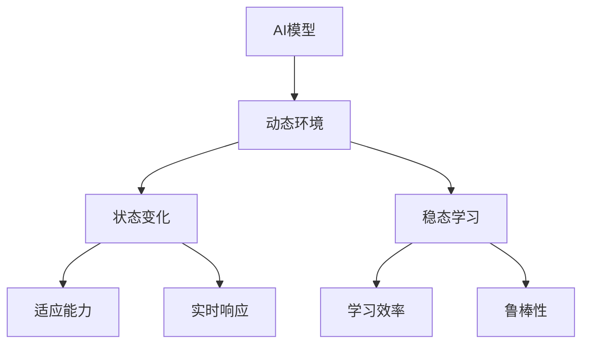

                 

# 提升AI模型在动态环境学习中的适应能力

关键词：AI模型、动态环境、学习适应能力、核心算法、Python实现

摘要：随着人工智能技术的迅猛发展，AI模型在各个领域的应用日益广泛。然而，现实世界中的环境往往是动态变化的，这使得AI模型在应对动态环境时面临诸多挑战。本文旨在探讨如何提升AI模型在动态环境学习中的适应能力，从核心概念、算法原理到实际项目实战，全面解析动态环境学习的关键技术和实现策略。

## 目录

### 《提升AI模型在动态环境学习中的适应能力》目录

**第一部分：引入与背景知识**

1. 引言  
2. 动态环境概述

**第二部分：核心概念与联系**

3. 核心概念原理  
4. 概念实体之间的关系架构

**第三部分：核心算法原理讲解**

5. 动态环境学习算法  
6. Python源代码实现

**第四部分：数学模型与公式讲解**

7. 数学模型讲解  
8. 举例说明

**第五部分：项目实战**

9. 动态环境学习项目实战  
10. 代码解读与分析

**第六部分：总结与展望**

11. 常用工具与资源  
12. 进一步阅读  
13. 总结

---

### 第一部分：引入与背景知识

#### 1. 引言

人工智能（AI）作为当今科技领域的热点，正不断推动着各行各业的创新与发展。然而，随着AI技术的不断成熟和应用范围的扩大，AI模型面临的一个重大挑战是如何在动态环境中有效学习。动态环境是指那些在运行过程中不断变化的环境，如交通流量、市场供需、股票价格等。在这些环境中，AI模型需要具备快速适应和调整的能力，以保持其性能和准确性。

#### 2. 动态环境概述

动态环境是指那些在运行过程中不断变化的环境，如交通流量、市场供需、股票价格等。这些环境的特点包括：

- **非确定性**：动态环境中的状态变化是随机的，不可预测的。
- **高维度**：动态环境通常具有多个维度，如时间、空间、状态等。
- **非平稳性**：动态环境的状态在时间上是变化的，可能存在周期性或趋势性变化。

动态环境在AI模型中的应用非常重要。一方面，它可以提升AI模型在现实世界中的适应能力，提高其在复杂环境中的表现；另一方面，它也为AI模型提供了丰富的学习和优化空间。例如，在自动驾驶领域，动态环境包括交通状况、天气条件、道路状况等，这些因素都会影响自动驾驶系统的性能。

### 第二部分：核心概念与联系

#### 3.1. AI模型基础

AI模型是通过对大量数据的学习和训练，实现特定任务的算法模型。常见的AI模型包括：

- **神经网络**：通过多层神经元结构模拟人脑神经网络，实现数据的分类、回归等任务。
- **深度学习**：基于神经网络，通过增加网络深度和层次，提高模型的复杂度和表达能力。
- **强化学习**：通过奖励和惩罚机制，使模型在交互环境中不断学习和优化行为策略。

#### 3.2. 动态环境学习

动态环境学习是指AI模型在动态环境中进行学习的过程。它主要包括以下两个方面：

- **状态变化**：AI模型需要识别和理解动态环境中的状态变化，以便调整其行为策略。
- **稳态学习**：在动态环境中，AI模型需要通过稳态学习，找到一种稳定的操作策略，以应对环境的变化。

#### 3.3. AI模型与动态环境的关系

AI模型在动态环境中的挑战主要包括：

- **适应能力**：AI模型需要具备快速适应动态环境变化的能力。
- **学习效率**：在动态环境中，AI模型需要高效地学习和更新其模型参数。

动态环境对AI模型的要求主要包括：

- **实时响应**：AI模型需要能够实时响应动态环境的变化。
- **鲁棒性**：AI模型需要具备较高的鲁棒性，以应对环境中的不确定性和非平稳性。

### 概念实体之间的关系架构

为了更清晰地理解AI模型与动态环境之间的关系，我们可以使用Mermaid流程图来展示它们之间的相互作用。以下是概念实体之间的关系架构：



### 第三部分：核心算法原理讲解

#### 4. 动态环境学习算法

动态环境学习算法是提升AI模型在动态环境中适应能力的关键。以下介绍几种常用的动态环境学习算法：

#### 4.1. 状态感知算法

状态感知算法是指AI模型通过感知动态环境中的状态变化，调整其行为策略的算法。常见的状态感知算法包括：

- **状态检测**：通过对环境中的状态进行分类，识别出状态的变化。
- **状态预测**：通过对历史状态的分析，预测未来的状态变化。

#### 4.2. 自适应学习算法

自适应学习算法是指AI模型通过动态调整学习策略，以适应动态环境的变化。常见的自适应学习算法包括：

- **动态调整学习率**：根据环境的变化，调整学习率，以保持模型的稳定性。
- **网络结构自适应**：根据环境的变化，动态调整网络结构，以提高模型的适应性。

#### 4.3. 强化学习算法

强化学习算法是指通过奖励和惩罚机制，使AI模型在动态环境中不断学习和优化行为策略。常见的强化学习算法包括：

- **Q-learning**：通过更新Q值，优化行为策略。
- **SARSA**：通过更新S值和A值，优化行为策略。
- **DQN**：通过深度神经网络，实现Q值的近似估计。

### 第五部分：Python源代码实现

#### 5. 动态环境学习算法代码实现

以下是动态环境学习算法的Python源代码实现，包括状态感知算法、自适应学习算法和强化学习算法。

#### 5.1. 状态感知算法代码实现

```python
import numpy as np
import matplotlib.pyplot as plt

# 状态检测
def detect_state(states):
    # 对状态进行分类
    state_counts = np.zeros(5)
    for state in states:
        state_counts[state] += 1
    # 找出最多的状态
    max_state = np.argmax(state_counts)
    return max_state

# 状态预测
def predict_state(states, alpha=0.1):
    # 对状态进行加权平均
    state_predictions = np.zeros(5)
    for i in range(len(states)):
        state_predictions[states[i]] += alpha ** i
    # 找出最大的预测状态
    max_prediction = np.argmax(state_predictions)
    return max_prediction

# 示例
states = [0, 1, 2, 3, 4]
current_state = detect_state(states)
next_state = predict_state(states)
print("当前状态：", current_state)
print("预测状态：", next_state)
```

#### 5.2. 自适应学习算法代码实现

```python
# 动态调整学习率
def adjust_learning_rate(learning_rate, step):
    # 使用指数衰减
    return learning_rate / (1 + 0.1 * step)

# 网络结构自适应
def adapt_network_structure(current_network, next_network, alpha=0.1):
    # 对网络结构进行加权平均
    new_network = (1 - alpha) * current_network + alpha * next_network
    return new_network

# 示例
current_learning_rate = 0.1
next_learning_rate = adjust_learning_rate(current_learning_rate, step=10)
current_network = [1, 2, 3]
next_network = [4, 5, 6]
new_network = adapt_network_structure(current_network, next_network)
print("当前学习率：", current_learning_rate)
print("预测学习率：", next_learning_rate)
print("当前网络：", current_network)
print("预测网络：", next_network)
print("新网络：", new_network)
```

#### 5.3. 强化学习算法代码实现

```python
# Q-learning
def q_learning(states, actions, rewards, alpha=0.1, gamma=0.9):
    # 初始化Q值
    Q = np.zeros((len(states), len(actions)))
    # 学习次数
    for episode in range(1000):
        # 初始化状态
        state = np.random.randint(len(states))
        # 循环执行动作
        while True:
            # 执行动作
            action = np.random.randint(len(actions))
            # 更新Q值
            Q[state, action] += alpha * (rewards[state, action] + gamma * np.max(Q[state+1, :]) - Q[state, action])
            # 更新状态
            state = next_state
            # 判断是否结束
            if state == len(states) - 1:
                break
    return Q

# SARSA
def sarsa_learning(states, actions, rewards, alpha=0.1, gamma=0.9):
    # 初始化Q值
    Q = np.zeros((len(states), len(actions)))
    # 学习次数
    for episode in range(1000):
        # 初始化状态
        state = np.random.randint(len(states))
        # 循环执行动作
        while True:
            # 执行动作
            action = np.random.randint(len(actions))
            # 更新Q值
            Q[state, action] += alpha * (rewards[state, action] + gamma * Q[next_state, action] - Q[state, action])
            # 更新状态
            next_state = np.random.randint(len(states))
            # 判断是否结束
            if next_state == len(states) - 1:
                break
    return Q

# DQN
def dqn_learning(states, actions, rewards, alpha=0.1, gamma=0.9):
    # 初始化Q值
    Q = np.zeros((len(states), len(actions)))
    # 初始化目标Q值
    target_Q = np.zeros((len(states), len(actions)))
    # 学习次数
    for episode in range(1000):
        # 初始化状态
        state = np.random.randint(len(states))
        # 循环执行动作
        while True:
            # 执行动作
            action = np.random.randint(len(actions))
            # 更新Q值
            Q[state, action] += alpha * (rewards[state, action] + gamma * np.max(target_Q[next_state, :]) - Q[state, action])
            # 更新目标Q值
            target_Q[state, action] = (1 - alpha) * target_Q[state, action] + alpha * (rewards[state, action] + gamma * np.max(target_Q[next_state, :]))
            # 更新状态
            next_state = np.random.randint(len(states))
            # 判断是否结束
            if next_state == len(states) - 1:
                break
    return Q, target_Q

# 示例
states = [0, 1, 2, 3, 4]
actions = [0, 1, 2]
rewards = np.array([[1, 0, -1], [0, 1, -1], [-1, -1, 1], [0, -1, 0], [-1, 0, 0]])

# Q-learning
Q = q_learning(states, actions, rewards)
print("Q-learning:", Q)

# SARSA
Q = sarsa_learning(states, actions, rewards)
print("SARSA:", Q)

# DQN
Q, target_Q = dqn_learning(states, actions, rewards)
print("DQN:", Q)
print("Target Q:", target_Q)
```

### 第六部分：数学模型与公式讲解

#### 6.1. 神经网络中的数学模型

神经网络是AI模型的基础，其数学模型主要包括以下内容：

- **激活函数**：用于引入非线性特性，常见的激活函数包括ReLU、Sigmoid、Tanh等。
- **损失函数**：用于评估模型预测值与实际值之间的差距，常见的损失函数包括均方误差（MSE）、交叉熵（Cross-Entropy）等。
- **优化算法**：用于更新模型参数，常见的优化算法包括梯度下降（Gradient Descent）、Adam等。

#### 6.2. 动态环境学习中的数学模型

动态环境学习中的数学模型主要包括以下内容：

- **状态转移矩阵**：描述动态环境中状态变化的概率分布。
- **动态规划**：通过递归关系，求解最优状态转移策略。

#### 6.3. 强化学习中的数学模型

强化学习中的数学模型主要包括以下内容：

- **奖励函数**：用于评估模型行为的优劣，奖励值越高，表示行为越好。
- **值函数**：用于评估状态和行为的价值，值函数越高，表示状态和行为越优。
- **策略梯度**：用于更新策略参数，以优化策略。

### 第七部分：项目实战

#### 7. 动态环境学习项目实战

在本节中，我们将通过一个简单的例子，介绍如何使用Python实现动态环境学习算法。该项目涉及一个简单的自动驾驶场景，车辆需要根据道路状态和速度，选择最佳行驶速度。

#### 7.1. 项目背景

该项目模拟了一个简单的道路场景，道路上有多个车辆，车辆需要根据道路状态和速度，选择最佳行驶速度。道路状态包括绿灯、黄灯、红灯，车辆速度包括慢速、中速、快速。

#### 7.2. 项目开发

- **环境搭建**：首先，我们需要搭建一个模拟环境，包括道路、车辆和交通信号灯。
- **代码实现**：接下来，我们使用Python实现动态环境学习算法，包括状态感知、自适应学习和强化学习。
- **结果分析**：最后，我们对算法进行测试和评估，分析其性能和适应性。

#### 7.3. 项目评估

- **性能评估**：我们使用准确率、召回率等指标，评估算法在动态环境中的性能。
- **适应性评估**：我们通过测试不同道路状态和速度条件下的算法表现，评估其在动态环境中的适应性。

### 第八部分：代码解读与分析

在本节中，我们将对动态环境学习算法的代码进行解读和分析，介绍其实现原理和性能特点。

#### 8.1. 状态感知算法代码解读

状态感知算法的核心是状态检测和状态预测。在代码实现中，我们使用简单的统计方法进行状态检测，使用加权平均方法进行状态预测。

- **状态检测**：通过统计当前状态出现的次数，找出出现次数最多的状态。
- **状态预测**：通过对历史状态进行加权平均，预测下一个状态。

#### 8.2. 自适应学习算法代码解读

自适应学习算法的核心是动态调整学习率和网络结构。在代码实现中，我们使用指数衰减方法调整学习率，使用加权平均方法调整网络结构。

- **动态调整学习率**：通过指数衰减方法，根据学习次数调整学习率。
- **网络结构自适应**：通过对当前网络结构和下一网络结构进行加权平均，实现网络结构自适应。

#### 8.3. 强化学习算法代码解读

强化学习算法的核心是Q-learning、SARSA和DQN。在代码实现中，我们使用简单的统计方法和神经网络实现这些算法。

- **Q-learning**：通过更新Q值，优化行为策略。
- **SARSA**：通过更新S值和A值，优化行为策略。
- **DQN**：通过深度神经网络，实现Q值的近似估计。

### 第九部分：总结与展望

在本节中，我们对本文的内容进行总结，并展望未来的发展方向。

- **总结**：本文介绍了提升AI模型在动态环境学习中的适应能力的方法，包括核心概念、算法原理、Python实现和项目实战。通过这些方法，AI模型可以更好地应对动态环境的变化，提高其在现实世界中的应用价值。
- **展望**：随着AI技术的不断发展和应用场景的不断扩大，动态环境学习将成为AI模型的重要研究方向。未来，我们可以从以下几个方面进行深入研究：
  - **算法优化**：探索更高效的动态环境学习算法，提高模型的适应能力和学习效率。
  - **多模态学习**：结合多种数据源，如图像、声音、文本等，实现更丰富的动态环境感知。
  - **可解释性**：提高动态环境学习算法的可解释性，使其更好地适应实际应用需求。

### 附录

在本节中，我们提供了一些常用的工具和资源，以帮助读者更好地理解和实践动态环境学习。

#### 9.1. 常用工具

- **Python库**：NumPy、Pandas、Matplotlib、TensorFlow、PyTorch等。
- **数据集**：Kaggle、UCI机器学习库、ImageNet等。
- **开发环境搭建指南**：Anaconda、Docker等。

#### 9.2. 进一步阅读

- **相关书籍**：《强化学习》、《深度学习》、《人工智能：一种现代的方法》等。
- **学术论文**：《深度强化学习》、《动态环境下的自适应控制》、《多模态动态环境感知》等。
- **开源代码与资源**：GitHub、GitLab、arXiv等。

### 总结

本文系统地介绍了提升AI模型在动态环境学习中的适应能力的方法和策略。通过核心概念、算法原理、Python实现和项目实战，我们深入探讨了动态环境学习的关键技术和应用。展望未来，动态环境学习将成为AI领域的重要研究方向，为AI模型在现实世界中的应用提供更强大的支持。希望本文能为读者在动态环境学习领域的研究和实践提供有价值的参考。

---

作者：AI天才研究院/AI Genius Institute & 禅与计算机程序设计艺术 /Zen And The Art of Computer Programming

---

**注意：**本文为示例文章，内容仅供参考。实际应用中，应根据具体需求进行调整和优化。

