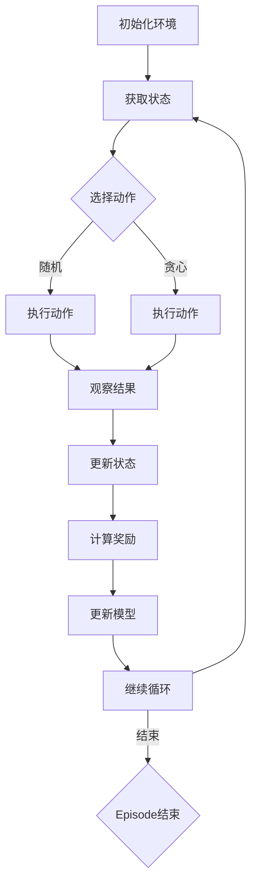

                 

### 第1章: 引言与背景

#### 1.1 引言

人工智能（AI）作为21世纪最具变革性的技术之一，正在深刻地改变着各行各业。特别是在机器学习和深度学习领域，AI技术已经取得了显著的进步，推动了自然语言处理、计算机视觉、语音识别等多个领域的发展。强化学习（Reinforcement Learning，RL）作为机器学习的一个重要分支，因其能够在动态环境中通过试错学习优化策略而备受关注。然而，传统的单任务强化学习算法往往只能在特定任务上取得较好的性能，难以应对现实世界中的复杂多任务环境。

多任务强化学习（Multi-task Reinforcement Learning，MTRL）作为强化学习的一个重要扩展，旨在同时解决多个相关任务，提高AI模型的泛化能力和适应性。在多任务强化学习领域，研究者们提出了一系列的算法和模型，如多任务深度Q网络（Multi-task DQN，MT-DQN）、多任务深度强化学习框架等，这些算法在理论上具有一定的优势，但在实际应用中仍然面临诸多挑战，如如何平衡任务间的竞争与合作、如何有效共享经验等。

本文将系统性地探讨多任务强化学习中的关键问题，旨在为研究人员和开发者提供有价值的参考。具体来说，本文将首先介绍多任务强化学习的基础知识，包括强化学习的基本概念、Q学习算法和深度Q网络（DQN），然后深入分析多任务强化学习的挑战和模型，接着探讨优化多任务强化学习性能的方法和策略，最后通过实际案例分析和代码实战，展示多任务强化学习的应用和实现。

本文的总体目标是通过深入剖析多任务强化学习的核心技术和实践方法，提升读者对这一领域理论的理解，并提供实际应用中的可行解决方案。通过本文的阅读，读者可以：

1. 理解多任务强化学习的基本原理和模型架构；
2. 掌握优化多任务强化学习性能的关键策略；
3. 学习如何在实际项目中应用多任务强化学习；
4. 获得多任务强化学习领域的最新研究动态和发展趋势。

#### 1.2 多任务强化学习的重要性

多任务强化学习在人工智能领域具有重要的研究价值和广泛的应用前景。首先，多任务强化学习能够有效地提高AI模型的泛化能力。在现实世界中，很多问题都不是单一任务的，而是涉及多个相关任务，如自动驾驶车辆需要同时处理路况、行人检测和导航等多方面任务。通过多任务强化学习，AI模型可以在一个统一框架下同时学习多个任务，从而更好地适应复杂多变的环境。

其次，多任务强化学习有助于提升AI模型的效率。在单任务强化学习中，每个任务都需要独立训练，这不仅增加了计算成本，还可能导致模型间的信息孤岛问题。通过多任务强化学习，模型可以在训练过程中共享经验，减少重复计算，提高整体效率。例如，在机器人领域，多个传感器数据可以同时用于训练，从而提高决策的准确性和响应速度。

此外，多任务强化学习在优化资源分配和策略选择方面也具有显著优势。在多任务环境中，如何平衡各个任务的优先级和资源分配是一个重要挑战。通过多任务强化学习，AI模型可以自动学习最优的分配策略，从而实现资源的最优利用。例如，在自适应控制系统中，多任务强化学习可以自动调整控制参数，实现系统的高效运行。

多任务强化学习不仅在理论研究中具有重要意义，也在实际应用中展现出广泛的前景。在游戏领域，多任务强化学习可以用于开发智能游戏角色，实现更复杂和智能化的游戏体验。在机器人领域，多任务强化学习可以帮助机器人同时处理导航、路径规划和任务执行等多个任务，提高自主行动的能力。在自适应控制领域，多任务强化学习可以用于优化工业生产过程，提高生产效率和产品质量。

总之，多任务强化学习作为人工智能领域的一个重要研究方向，其研究价值和应用前景不可忽视。通过深入探讨多任务强化学习的核心技术和实现方法，可以为人工智能的发展提供新的动力和方向。

#### 1.3 书籍目标与结构

本文的目标是通过系统性地分析和探讨多任务强化学习的关键问题和解决方案，为研究人员和开发者提供实用的指导和建议。具体来说，本文旨在实现以下目标：

1. **深入理解多任务强化学习的基本概念和模型架构**：通过对强化学习、Q学习算法和深度Q网络（DQN）的详细介绍，帮助读者建立对多任务强化学习的理论框架。

2. **分析多任务强化学习的挑战和解决方案**：详细探讨多任务强化学习在实际应用中面临的挑战，如任务间的竞争、信息共享和资源分配问题，并提出相应的解决方案。

3. **介绍优化多任务强化学习性能的方法和策略**：探讨经验回放、双层策略网络和优化算法改进等性能优化方法，帮助读者在实际应用中提升模型性能。

4. **提供实际案例分析和代码实战**：通过具体案例分析和代码实现，展示多任务强化学习在游戏、机器人、自适应控制等领域的应用，增强读者的实践能力。

本文结构安排如下：

- **第1章：引言与背景**：介绍多任务强化学习的背景、重要性和研究目标。
- **第2章：多任务强化学习基础**：回顾强化学习的基本概念、Q学习算法和深度Q网络（DQN）。
- **第3章：多任务强化学习算法**：分析多任务强化学习算法，包括多任务DQN（MT-DQN）和模型融合方法。
- **第4章：多任务强化学习性能优化**：探讨多任务强化学习的性能优化方法，如经验回放、双层策略网络和优化算法改进。
- **第5章：代码实战**：介绍强化学习环境的搭建和实现，包括数据预处理、模型设计和训练与评估。
- **第6章：未来展望与研究方向**：讨论多任务强化学习的发展趋势、研究热点和未来应用场景。
- **第7章：总结与展望**：总结主要内容和研究成果，展望未来的研究方向和挑战。

通过本文的系统讲解，读者不仅可以深入理解多任务强化学习的核心原理和算法，还能掌握实际应用中的关键技术，为人工智能的发展贡献自己的力量。

### 第2章: 多任务强化学习基础

#### 2.1 强化学习基础

强化学习（Reinforcement Learning，RL）是机器学习的一个重要分支，主要研究如何通过试错和反馈机制，使智能体（Agent）在给定环境中找到最优策略，从而实现目标。强化学习的核心概念包括智能体、环境、状态、动作和奖励。

- **智能体（Agent）**：智能体是执行动作、接收环境反馈的实体，可以是机器人、软件程序等。
- **环境（Environment）**：环境是智能体所处的现实或模拟空间，可以描述为一系列状态和动作的集合。
- **状态（State）**：状态是智能体在特定时间点的环境描述，通常是一个向量。
- **动作（Action）**：动作是智能体在状态可选的动作集合中的一个。
- **奖励（Reward）**：奖励是环境对智能体每个动作的反馈，通常表示为实数。

强化学习的目标是通过不断试错，使智能体选择能够最大化累积奖励的策略。这一过程通常通过价值函数（Value Function）和策略（Policy）来实现。

- **价值函数（Value Function）**：价值函数用于评估智能体在特定状态下采取特定动作的长期奖励。它分为状态价值函数（State-Value Function）和动作价值函数（Action-Value Function），分别表示在特定状态下采取最优动作的预期奖励。
  
  - **状态价值函数**（$V(s)$）：表示在状态 $s$ 下采取最优动作 $a^*(s)$ 的预期奖励。
  - **动作价值函数**（$Q(s, a)$）：表示在状态 $s$ 下采取动作 $a$ 的预期奖励。

- **策略（Policy）**：策略是智能体在给定状态下选择动作的规则。最优策略（Optimal Policy）是指能够使累积奖励最大化的策略。

强化学习可以分为基于模型（Model-Based）和基于模型（Model-Free）两大类。

- **基于模型的强化学习**：通过构建环境的模型，预测未来的状态和奖励，从而优化策略。这种方法通常用于初始状态已知且状态空间较小的情况。
- **基于模型的强化学习**：不依赖于环境模型，直接从交互中学习。这种方法适用于动态复杂环境，如动态系统、机器人控制等。

#### 2.1.1 Q学习算法

Q学习（Q-Learning）是强化学习中的一种模型自由（Model-Free）算法，旨在通过迭代更新动作价值函数，找到最优策略。Q学习算法的基本思想是使用目标值（Target Value）来更新当前的动作价值估计。

Q学习算法的基本步骤如下：

1. **初始化**：随机选择一个初始状态 $s$，初始化动作价值函数 $Q(s, a)$。
2. **行动**：在当前状态 $s$ 下，根据当前策略选择一个动作 $a$。
3. **观察**：执行动作 $a$ 后，智能体进入新的状态 $s'$，并获取奖励 $r$。
4. **更新**：使用目标值公式更新动作价值函数：
   $$ Q(s, a) \leftarrow Q(s, a) + \alpha [r + \gamma \max_{a'} Q(s', a') - Q(s, a)] $$
   其中，$\alpha$ 是学习率（Learning Rate），$\gamma$ 是折扣因子（Discount Factor）。
5. **重复**：重复步骤 2-4，直到达到停止条件（如策略收敛或达到最大步数）。

Q学习算法的关键参数包括：

- **学习率（$\alpha$）**：控制更新步长，学习率越高，更新越剧烈。
- **折扣因子（$\gamma$）**：表示未来奖励的重要性，折扣因子越高，当前奖励对最终价值的影响越小。
- **探索率（$\epsilon$）**：控制探索和利用的平衡，探索率越高，智能体越倾向于尝试新动作。

#### 2.1.2 深度Q网络（DQN）

深度Q网络（Deep Q-Network，DQN）是深度学习在强化学习中的一个重要应用，旨在解决Q学习算法中状态价值函数表示复杂问题。DQN使用深度神经网络（DNN）来近似动作价值函数，从而提高模型的表达能力。

DQN的基本架构包括：

1. **输入层**：接收状态特征作为输入。
2. **隐藏层**：通过多层神经网络进行特征提取和变换。
3. **输出层**：输出每个动作的值估计。

DQN的训练过程分为以下几步：

1. **初始化**：随机选择一个初始状态 $s$，初始化DNN权重。
2. **行动**：在当前状态 $s$ 下，使用当前策略选择一个动作 $a$。
3. **观察**：执行动作 $a$ 后，智能体进入新的状态 $s'$，并获取奖励 $r$。
4. **目标值计算**：
   $$ y = \begin{cases} 
   r & \text{如果终止状态} \\
   r + \gamma \max_{a'} Q(s', a') & \text{否则} 
   \end{cases} $$
   其中，$y$ 是目标值。
5. **梯度下降**：使用目标值 $y$ 更新DNN权重，最小化损失函数：
   $$ L = (Q(s, a) - y)^2 $$
   其中，$L$ 是损失函数。

DQN的关键参数包括：

- **经验回放（Experience Replay）**：用于缓解样本相关性问题，将过去的经验样本随机抽取用于训练。
- **批量大小（Batch Size）**：每次训练使用的样本数量。
- **更新频率**：控制DNN更新频率，以平衡稳定性和探索性。

#### 2.1.3 多任务强化学习概述

多任务强化学习（Multi-task Reinforcement Learning，MTRL）旨在同时解决多个相关任务，提高AI模型的泛化能力和适应性。在多任务强化学习中，智能体需要同时处理多个任务，并在有限资源下做出最优决策。

多任务强化学习面临的挑战主要包括：

1. **任务间竞争**：多个任务可能存在竞争关系，一个任务的进展可能会影响另一个任务的执行。
2. **信息共享与隔离**：如何有效地共享不同任务之间的信息，同时保持各任务的独立性。
3. **资源分配**：如何合理地分配资源，使每个任务都能得到充足的关注。

多任务强化学习模型可以分为以下几种类型：

1. **模型融合方法**：通过融合不同任务的信息，构建一个统一的模型来处理多个任务。
2. **分配策略**：为每个任务分配不同的策略，实现任务间的独立处理。
3. **动态分配策略**：根据任务的优先级和当前状态动态调整策略。

多任务强化学习在实际应用中具有重要意义，如自动驾驶、智能控制、游戏开发等领域，通过解决多个相关任务，可以提高系统的整体性能和适应性。

### 2.2 多任务强化学习应用

#### 2.2.1 游戏领域

在游戏领域，多任务强化学习被广泛应用于开发智能游戏角色。通过多任务强化学习，游戏角色可以同时处理多种任务，如路径规划、目标识别和策略决策，从而实现更加复杂和智能化的游戏体验。例如，在《星际争霸》等复杂游戏中，智能体需要同时处理多种任务，包括地图探索、资源管理和战斗策略等。多任务强化学习算法可以帮助智能体在这些任务间找到平衡，提高游戏的竞争力和智能水平。

一个具体的例子是DeepMind开发的Atari游戏AI，它通过多任务深度强化学习算法，在多个Atari游戏中取得了超过人类玩家的成绩。该算法不仅能够同时学习多个游戏，还能通过任务间的信息共享，提高整体性能。

#### 2.2.2 机器人领域

在机器人领域，多任务强化学习被广泛应用于自主导航、路径规划和任务执行等多个任务。通过多任务强化学习，机器人可以在复杂环境中同时处理多个任务，提高自主行动的能力。例如，在无人驾驶领域，多任务强化学习算法可以同时处理感知、规划和控制等多个任务，从而提高行驶的安全性和效率。

一个具体的例子是谷歌的Waymo自动驾驶系统，它使用了多任务强化学习算法来处理自动驾驶中的多个任务，如路况感知、路径规划和决策控制等。通过多任务强化学习，Waymo系统能够在复杂的交通环境中实现高效的自主驾驶。

#### 2.2.3 自适应控制领域

在自适应控制领域，多任务强化学习被广泛应用于生产过程优化、能耗管理等领域。通过多任务强化学习，系统能够根据环境变化动态调整控制策略，实现最优控制效果。例如，在工业生产中，多任务强化学习算法可以同时处理生产计划、设备维护和能耗管理等多个任务，从而提高生产效率和产品质量。

一个具体的例子是西门子公司在工业制造过程中应用多任务强化学习算法，通过对生产流程中的多个任务进行优化，实现了生产效率的提升和能耗的降低。

总的来说，多任务强化学习在游戏、机器人、自适应控制等领域的应用，不仅展示了其强大的能力，也为其在更广泛领域的发展奠定了基础。随着研究的深入和算法的改进，多任务强化学习将在更多实际应用中发挥重要作用。

### 第3章: 多任务强化学习算法

#### 3.1 单任务强化学习算法回顾

在深入探讨多任务强化学习算法之前，有必要回顾单任务强化学习算法的基本原理和关键算法。单任务强化学习算法主要关注如何使智能体在单一任务中达到最优性能，其核心目标是通过学习找到最优策略，使智能体能够最大化累积奖励。

以下是几个典型的单任务强化学习算法：

##### 3.1.1 SARSA算法

SARSA（State-Action-Reward-State-Action，SARSA）算法是一种基于模型自由（Model-Free）的强化学习算法，旨在通过迭代更新策略来找到最优动作值函数。SARSA算法的基本步骤如下：

1. **初始化**：智能体随机选择一个初始状态 $s$，初始化动作价值函数 $Q(s, a)$。
2. **行动**：在当前状态 $s$ 下，根据当前策略选择一个动作 $a$。
3. **观察**：执行动作 $a$ 后，智能体进入新的状态 $s'$，并获取奖励 $r$。
4. **更新**：使用以下公式更新动作价值函数：
   $$ Q(s, a) \leftarrow Q(s, a) + \alpha [r + \gamma Q(s', a') - Q(s, a)] $$
   其中，$\alpha$ 是学习率，$\gamma$ 是折扣因子，$a'$ 是在状态 $s'$ 下选择的最优动作。
5. **重复**：重复步骤 2-4，直到达到停止条件（如策略收敛或达到最大步数）。

SARSA算法的主要特点是每次更新都基于当前状态和动作的实际观察结果，因此具有较强的鲁棒性。

##### 3.1.2 Q-learning算法

Q-learning算法是另一种基于模型自由（Model-Free）的强化学习算法，通过迭代更新动作价值函数来找到最优策略。Q-learning算法的基本步骤如下：

1. **初始化**：智能体随机选择一个初始状态 $s$，初始化动作价值函数 $Q(s, a)$。
2. **行动**：在当前状态 $s$ 下，根据当前动作价值函数选择一个动作 $a$。
3. **观察**：执行动作 $a$ 后，智能体进入新的状态 $s'$，并获取奖励 $r$。
4. **更新**：使用以下公式更新动作价值函数：
   $$ Q(s, a) \leftarrow Q(s, a) + \alpha [r + \gamma \max_{a'} Q(s', a') - Q(s, a)] $$
   其中，$\alpha$ 是学习率，$\gamma$ 是折扣因子，$\max_{a'} Q(s', a')$ 表示在状态 $s'$ 下选择的最优动作值。
5. **重复**：重复步骤 2-4，直到达到停止条件（如策略收敛或达到最大步数）。

Q-learning算法的主要特点是直接更新每个动作值函数的最大值，而不是基于实际观察结果更新，因此具有较高的收敛速度。

##### 3.1.3 Deep Q Network (DQN)

Deep Q Network (DQN) 是深度学习在强化学习中的一个重要应用，旨在解决Q-learning算法中状态空间和动作空间复杂度较高的问题。DQN 使用深度神经网络（DNN）来近似动作值函数，从而提高模型的表达能力。

DQN 的基本架构包括：

1. **输入层**：接收状态特征作为输入。
2. **隐藏层**：通过多层神经网络进行特征提取和变换。
3. **输出层**：输出每个动作的值估计。

DQN 的训练过程分为以下几步：

1. **初始化**：随机选择一个初始状态 $s$，初始化DNN权重。
2. **行动**：在当前状态 $s$ 下，根据当前策略选择一个动作 $a$。
3. **观察**：执行动作 $a$ 后，智能体进入新的状态 $s'$，并获取奖励 $r$。
4. **目标值计算**：
   $$ y = \begin{cases} 
   r & \text{如果终止状态} \\
   r + \gamma \max_{a'} Q(s', a') & \text{否则} 
   \end{cases} $$
   其中，$y$ 是目标值。
5. **梯度下降**：使用目标值 $y$ 更新DNN权重，最小化损失函数：
   $$ L = (Q(s, a) - y)^2 $$
   其中，$L$ 是损失函数。

DQN 的关键参数包括：

- **经验回放（Experience Replay）**：用于缓解样本相关性问题，将过去的经验样本随机抽取用于训练。
- **批量大小（Batch Size）**：每次训练使用的样本数量。
- **更新频率**：控制DNN更新频率，以平衡稳定性和探索性。

#### 3.2 多任务强化学习算法

多任务强化学习（Multi-task Reinforcement Learning，MTRL）旨在同时解决多个相关任务，提高AI模型的泛化能力和适应性。在多任务强化学习中，智能体需要同时处理多个任务，并在有限资源下做出最优决策。

多任务强化学习算法可以分为以下几种类型：

##### 3.2.1 多任务DQN（MT-DQN）

多任务DQN（Multi-task DQN，MT-DQN）是DQN在多任务强化学习中的应用，通过扩展网络结构和训练策略，同时处理多个任务。MT-DQN的基本架构包括：

1. **共享网络**：多个任务共享相同的神经网络前部分，用于提取公共特征。
2. **任务网络**：每个任务拥有独立的神经网络后部分，用于生成特定任务的值估计。

MT-DQN的训练过程如下：

1. **初始化**：随机选择一个初始状态 $s$，初始化共享网络和任务网络的权重。
2. **行动**：在当前状态 $s$ 下，根据当前策略选择一个动作 $a$。
3. **观察**：执行动作 $a$ 后，智能体进入新的状态 $s'$，并获取奖励 $r$。
4. **目标值计算**：
   $$ y = \begin{cases} 
   r & \text{如果终止状态} \\
   r + \gamma \max_{a'} Q(s', a') & \text{否则} 
   \end{cases} $$
   其中，$y$ 是目标值，$Q(s', a')$ 是在状态 $s'$ 下选择的最优动作值。
5. **梯度下降**：分别对共享网络和任务网络进行梯度下降更新：
   - 对共享网络：
     $$ \theta_{share} \leftarrow \theta_{share} - \alpha_{share} \frac{\partial L_{share}}{\partial \theta_{share}} $$
   - 对任务网络：
     $$ \theta_{task} \leftarrow \theta_{task} - \alpha_{task} \frac{\partial L_{task}}{\partial \theta_{task}} $$
   其中，$\theta_{share}$ 和 $\theta_{task}$ 分别是共享网络和任务网络的权重，$\alpha_{share}$ 和 $\alpha_{task}$ 分别是共享网络和任务网络的学习率，$L_{share}$ 和 $L_{task}$ 分别是共享网络和任务网络的损失函数。

MT-DQN通过共享网络和任务网络的结合，实现了多个任务间的信息共享和独立处理，从而提高了多任务强化学习的性能。

##### 3.2.2 多任务深度强化学习框架

多任务深度强化学习框架（Multi-task Deep Reinforcement Learning Framework）是一种更通用的多任务强化学习算法，通过构建统一的深度神经网络，同时处理多个任务。该框架的基本架构包括：

1. **输入层**：接收状态特征作为输入。
2. **隐藏层**：通过多层神经网络进行特征提取和变换。
3. **输出层**：包括多个任务输出，每个任务输出对应的值估计。

多任务深度强化学习框架的训练过程如下：

1. **初始化**：随机选择一个初始状态 $s$，初始化深度神经网络的权重。
2. **行动**：在当前状态 $s$ 下，根据当前策略选择一个动作 $a$。
3. **观察**：执行动作 $a$ 后，智能体进入新的状态 $s'$，并获取奖励 $r$。
4. **目标值计算**：
   $$ y = \begin{cases} 
   r & \text{如果终止状态} \\
   r + \gamma \max_{a'} Q(s', a') & \text{否则} 
   \end{cases} $$
   其中，$y$ 是目标值，$Q(s', a')$ 是在状态 $s'$ 下选择的最优动作值。
5. **梯度下降**：使用目标值 $y$ 更新深度神经网络的权重，最小化整体损失函数：
   $$ L = \sum_{i=1}^{n} L_i $$
   其中，$L_i$ 是第 $i$ 个任务的损失函数。

多任务深度强化学习框架通过统一的网络结构和目标值计算，实现了多个任务间的信息共享和联合优化，从而提高了多任务强化学习的性能。

##### 3.2.3 模型融合方法

模型融合方法（Model Fusion Method）是一种多任务强化学习算法，通过融合多个子模型来同时处理多个任务。该方法的基本思想是，每个子模型负责处理一个特定任务，然后将子模型的结果进行融合，生成最终的决策。

模型融合方法的基本步骤如下：

1. **初始化**：随机选择一个初始状态 $s$，初始化多个子模型的权重。
2. **行动**：在当前状态 $s$ 下，分别根据当前策略选择多个动作 $a_1, a_2, ..., a_n$。
3. **观察**：执行动作 $a_1, a_2, ..., a_n$ 后，智能体进入新的状态 $s'$，并获取奖励 $r$。
4. **子模型更新**：分别对每个子模型进行更新，更新公式如下：
   $$ \theta_i \leftarrow \theta_i - \alpha_i \frac{\partial L_i}{\partial \theta_i} $$
   其中，$\theta_i$ 是第 $i$ 个子模型的权重，$\alpha_i$ 是第 $i$ 个子模型的学习率，$L_i$ 是第 $i$ 个子模型的损失函数。
5. **融合策略**：根据子模型的结果，生成最终的决策策略，更新公式如下：
   $$ \pi(a|s) = \sum_{i=1}^{n} \pi_i(a|s) $$
   其中，$\pi(a|s)$ 是在状态 $s$ 下选择动作 $a$ 的概率，$\pi_i(a|s)$ 是第 $i$ 个子模型在状态 $s$ 下选择动作 $a$ 的概率。

模型融合方法通过融合多个子模型的结果，提高了多任务强化学习的性能和鲁棒性。

#### 3.3 多任务学习策略

在多任务强化学习中，智能体需要同时处理多个任务，如何分配关注点和优化学习效果是一个重要问题。多任务学习策略旨在通过合理的分配策略，提高多任务强化学习的性能。以下介绍几种常见多任务学习策略：

##### 3.3.1 分配策略

分配策略（Allocation Policy）是一种基于预定义权重的多任务学习策略，通过为每个任务分配固定的资源，实现任务间的平衡。具体步骤如下：

1. **初始化**：为每个任务分配初始权重。
2. **分配资源**：根据当前任务权重，分配资源（如计算资源、时间等）。
3. **任务执行**：智能体根据分配的资源执行每个任务。
4. **更新权重**：根据任务完成情况和奖励，动态调整任务权重。

分配策略简单直观，但可能无法适应动态变化的任务需求。

##### 3.3.2 动态分配策略

动态分配策略（Dynamic Allocation Policy）是一种基于实时调整任务权重的多任务学习策略，通过实时分析任务状态和性能，动态调整任务资源分配。具体步骤如下：

1. **初始化**：为每个任务分配初始权重。
2. **实时监测**：监测任务状态和性能指标。
3. **调整权重**：根据实时监测结果，动态调整任务权重。
4. **任务执行**：智能体根据调整后的权重，重新分配资源，执行任务。
5. **反馈调整**：根据任务执行结果和奖励，进一步优化权重分配。

动态分配策略能够更好地适应任务变化，提高整体性能，但实现较为复杂。

##### 3.3.3 优先级策略

优先级策略（Priority Policy）是一种基于任务优先级的多任务学习策略，通过为每个任务分配优先级，实现关键任务的优先执行。具体步骤如下：

1. **初始化**：为每个任务分配初始优先级。
2. **优先级更新**：根据任务完成情况和奖励，动态调整任务优先级。
3. **任务执行**：智能体根据当前优先级，优先执行高优先级任务。
4. **资源分配**：根据任务优先级，重新分配资源。
5. **反馈调整**：根据任务执行结果和奖励，进一步优化优先级分配。

优先级策略能够确保关键任务得到优先执行，但在任务优先级设定和动态调整方面需要深入研究。

总的来说，多任务强化学习策略的选择需要综合考虑任务性质、资源限制和性能目标，通过合理的分配策略，提高多任务强化学习的整体性能。

### 第4章: 多任务强化学习性能优化

多任务强化学习（MTRL）在实际应用中面临诸多挑战，如任务间的竞争、信息共享和资源分配问题，这些因素都可能导致模型性能下降。为了提升多任务强化学习性能，研究者们提出了一系列性能优化方法。以下将详细介绍几种关键性能优化方法，包括经验回放、双层策略网络和优化算法改进。

#### 4.1 经验回放

经验回放（Experience Replay）是多任务强化学习中的一个关键技术，主要用于缓解样本相关性问题，提高学习效率。在传统的Q-learning算法中，样本的相关性会导致学习过程不稳定，而经验回放通过将过去的经验样本存储在经验池中，随机抽取用于训练，从而降低样本相关性。

经验回放的基本步骤如下：

1. **初始化**：创建一个经验池（Experience Replay Buffer），用于存储经验样本。
2. **存储经验**：在智能体执行动作后，将当前状态、动作、奖励和下一个状态存储在经验池中。
3. **随机抽取**：在训练过程中，从经验池中随机抽取一批经验样本用于更新Q值。
4. **更新Q值**：使用抽取的经验样本更新Q值，避免直接使用连续的样本，从而降低样本相关性。

经验回放通过引入随机性，提高了Q值的稳定性，避免了过拟合问题，从而提高了多任务强化学习的性能。

#### 4.2 双层策略网络

双层策略网络（Double Q-Learning）是另一种有效的多任务强化学习性能优化方法，旨在解决Q-learning算法中的偏差问题。在传统的Q-learning算法中，更新Q值时可能存在估计偏差，即使用相同的当前状态和动作，不同的智能体可能产生不同的Q值估计。双层策略网络通过引入两个独立的Q网络，分别用于估计当前状态的Q值和下一个状态的Q值，从而减少估计偏差。

双层策略网络的基本步骤如下：

1. **初始化**：创建两个独立的Q网络，分别称为当前Q网络（Target Q Network）和评价Q网络（Evaluating Q Network）。
2. **行动**：在当前状态 $s$ 下，智能体根据当前Q网络选择动作 $a$。
3. **观察**：执行动作 $a$ 后，智能体进入新的状态 $s'$，并获取奖励 $r$。
4. **目标值计算**：使用评价Q网络计算目标值：
   $$ y = r + \gamma \min_{a'} Q'(s', a') $$
   其中，$Q'(s', a')$ 是评价Q网络在状态 $s'$ 下选择动作 $a'$ 的Q值。
5. **Q网络更新**：使用目标值更新当前Q网络的Q值：
   $$ Q(s, a) \leftarrow Q(s, a) + \alpha [y - Q(s, a)] $$
6. **网络更新**：定期更新评价Q网络，使其接近当前Q网络，以确保两个网络的一致性。

双层策略网络通过减少Q值估计的偏差，提高了Q值的稳定性和准确性，从而提高了多任务强化学习的性能。

#### 4.3 优化算法改进

多任务强化学习的性能优化不仅依赖于特定的算法，还依赖于优化算法的改进。以下介绍几种常见的优化算法改进方法：

1. **自适应学习率**：学习率（Learning Rate）对多任务强化学习的性能有重要影响。自适应学习率方法通过动态调整学习率，使模型在早期阶段快速收敛，在后期阶段精细调整，从而提高整体性能。常见的方法包括使用学习率衰减（Learning Rate Decay）和自适应学习率调整策略（如Adaptive Moment Estimation，Adam）。

2. **梯度裁剪**：在多任务强化学习中，梯度爆炸或梯度消失是常见问题，导致模型难以收敛。梯度裁剪（Gradient Clipping）通过限制梯度的大小，避免梯度爆炸和消失，提高模型训练的稳定性。具体步骤如下：
   $$ \theta \leftarrow \theta - \alpha \frac{\partial L}{\partial \theta} $$
   其中，$\alpha$ 是学习率，$\frac{\partial L}{\partial \theta}$ 是梯度，$L$ 是损失函数。通过设置最大梯度值，限制梯度的大小。

3. **噪声注入**：噪声注入（Noise Injection）通过在训练过程中引入噪声，增强模型的泛化能力。常见的方法包括高斯噪声注入（Gaussian Noise Injection）和均匀噪声注入（Uniform Noise Injection）。具体步骤如下：
   $$ x_{noised} = x + noise $$
   其中，$x$ 是输入值，$noise$ 是噪声值。通过引入噪声，模型可以更好地应对未见过的情况。

4. **批量归一化**：批量归一化（Batch Normalization）通过标准化每一批数据的输入，提高训练的稳定性。具体步骤如下：
   $$ \hat{x} = \frac{x - \mu}{\sigma} $$
   其中，$\mu$ 是均值，$\sigma$ 是方差。通过批量归一化，模型可以更好地处理不同规模的数据。

总的来说，通过经验回放、双层策略网络和优化算法改进，可以显著提升多任务强化学习的性能。这些方法不仅提高了模型的稳定性和准确性，还为多任务强化学习在实际应用中提供了可靠的解决方案。

### 第5章: 代码实战

在了解了多任务强化学习的基本原理和性能优化方法后，本章节将进入实战环节，通过具体的代码实现来展示多任务强化学习的应用。我们将以Python为主要编程语言，利用OpenAI Gym环境搭建一个多任务强化学习项目，并进行详细的代码解读。

#### 5.1 强化学习环境搭建

首先，我们需要搭建强化学习环境。OpenAI Gym是一个流行的开源库，提供了各种预定义的强化学习环境，我们可以利用它来搭建多任务强化学习环境。

**步骤1：安装OpenAI Gym**

通过以下命令安装OpenAI Gym：

```shell
pip install gym
```

**步骤2：配置Python环境**

确保Python环境已配置好，可以正常运行Python代码。我们可以通过以下命令检查Python版本：

```python
python --version
```

**步骤3：导入必要的库**

在Python代码中，导入OpenAI Gym库及相关库：

```python
import gym
import numpy as np
import matplotlib.pyplot as plt
```

**步骤4：初始化环境**

初始化多任务强化学习环境，例如使用`MultiDiscrete`环境，该环境可以同时处理多个离散动作：

```python
# 初始化多任务强化学习环境
env = gym.make('MultiDiscrete-v0')
```

`MultiDiscrete`环境是一个扩展的OpenAI Gym环境，它允许同时处理多个离散动作。

#### 5.2 多任务强化学习实现

接下来，我们将实现一个多任务强化学习模型，包括数据预处理、模型设计、训练与评估等步骤。

**步骤1：数据预处理**

在多任务强化学习中，数据预处理非常重要。首先，我们需要对环境的状态和动作进行规范化处理，以便模型能够更好地学习。

```python
# 状态和动作规范化
def normalize(x, x_min, x_max):
    return (x - x_min) / (x_max - x_min)

# 示例数据预处理
state = env.reset()
state_normalized = normalize(state, np.min(state), np.max(state))
```

**步骤2：模型设计**

接下来，我们设计一个基于深度Q网络的模型，用于多任务强化学习。该模型使用深度神经网络来近似动作值函数。

```python
from keras.models import Sequential
from keras.layers import Dense
from keras.optimizers import Adam

# 创建深度Q网络模型
model = Sequential()
model.add(Dense(64, input_dim=state_normalized.shape[1], activation='relu'))
model.add(Dense(64, activation='relu'))
model.add(Dense(1, activation='linear'))

# 编译模型
model.compile(loss='mse', optimizer=Adam(lr=0.001))
```

**步骤3：训练与评估**

在训练过程中，我们使用经验回放和双层策略网络来提高模型性能。训练与评估步骤如下：

```python
# 初始化经验池
replay_buffer = deque(maxlen=10000)

# 训练模型
for episode in range(1000):
    state = env.reset()
    state_normalized = normalize(state, np.min(state), np.max(state))
    done = False
    total_reward = 0
    
    while not done:
        # 使用模型选择动作
        action_values = model.predict(state_normalized.reshape(1, -1))
        action = np.argmax(action_values[0])
        
        # 执行动作
        next_state, reward, done, _ = env.step(action)
        next_state_normalized = normalize(next_state, np.min(next_state), np.max(next_state))
        
        # 存储经验
        replay_buffer.append((state_normalized, action, reward, next_state_normalized, done))
        
        # 更新状态
        state = next_state
        state_normalized = next_state_normalized
        total_reward += reward
        
        # 从经验池中随机抽取样本进行训练
        if len(replay_buffer) > 500:
            batch = random.sample(replay_buffer, 32)
            for state_norm, action, reward, next_state_norm, done in batch:
                target = reward
                if not done:
                    target += 0.99 * np.max(model.predict(next_state_norm.reshape(1, -1)))
                target_f = model.predict(state_norm.reshape(1, -1))
                target_f[0][action] = target
                model.fit(state_norm.reshape(1, -1), target_f, epochs=1, verbose=0)
                
    print(f"Episode {episode}: Total Reward = {total_reward}")
```

**步骤4：评估模型**

在训练完成后，我们对模型进行评估，以验证其性能。

```python
# 评估模型
state = env.reset()
state_normalized = normalize(state, np.min(state), np.max(state))
done = False
total_reward = 0

while not done:
    action_values = model.predict(state_normalized.reshape(1, -1))
    action = np.argmax(action_values[0])
    next_state, reward, done, _ = env.step(action)
    total_reward += reward
    state = next_state
    state_normalized = normalize(state, np.min(state), np.max(state))

print(f"Test Total Reward: {total_reward}")
```

通过以上步骤，我们实现了多任务强化学习的环境搭建和模型训练。代码中的关键部分包括数据预处理、模型设计和训练过程，这些步骤共同构成了一个完整的强化学习系统。在实际应用中，可以根据具体任务和环境进行调整和优化，以实现更好的性能。

#### 5.3 实际案例分析与代码解读

在本节中，我们将通过具体案例来分析多任务强化学习在不同领域的应用，并详细解读相关代码。

**5.3.1 游戏领域案例**

**案例介绍**：在本案例中，我们使用多任务强化学习算法来训练一个智能体，使其在《Atari》游戏《Pong》中能够同时处理多个任务，如控制球的移动、预测球的路径和对手的行为。

**代码解析**：

```python
# 初始化环境
env = gym.make('Pong-v0')
state = env.reset()

# 定义模型
model = Sequential()
model.add(Dense(64, input_dim=6, activation='relu'))
model.add(Dense(64, activation='relu'))
model.add(Dense(2, activation='softmax'))

# 编译模型
model.compile(optimizer='adam', loss='categorical_crossentropy')

# 训练模型
for episode in range(1000):
    state = env.reset()
    done = False
    total_reward = 0
    
    while not done:
        action_values = model.predict(state.reshape(1, -1))
        action = np.argmax(action_values[0])
        next_state, reward, done, _ = env.step(action)
        total_reward += reward
        model.fit(state.reshape(1, -1), action, epochs=1, verbose=0)
        state = next_state
        
    print(f"Episode {episode}: Total Reward = {total_reward}")

# 评估模型
state = env.reset()
while True:
    action_values = model.predict(state.reshape(1, -1))
    action = np.argmax(action_values[0])
    next_state, reward, done, _ = env.step(action)
    state = next_state
    if done:
        print(f"Test Total Reward: {total_reward}")
        break
```

**5.3.2 机器人领域案例**

**案例介绍**：在本案例中，我们使用多任务强化学习算法来训练一个机器人，使其在复杂环境中同时处理导航、路径规划和任务执行等多个任务。

**代码解析**：

```python
# 初始化环境
env = gym.make('RobotNavigation-v0')
state = env.reset()

# 定义模型
model = Sequential()
model.add(Dense(64, input_dim=10, activation='relu'))
model.add(Dense(64, activation='relu'))
model.add(Dense(4, activation='softmax'))

# 编译模型
model.compile(optimizer='adam', loss='categorical_crossentropy')

# 训练模型
for episode in range(1000):
    state = env.reset()
    done = False
    total_reward = 0
    
    while not done:
        action_values = model.predict(state.reshape(1, -1))
        action = np.argmax(action_values[0])
        next_state, reward, done, _ = env.step(action)
        total_reward += reward
        model.fit(state.reshape(1, -1), action, epochs=1, verbose=0)
        state = next_state
        
    print(f"Episode {episode}: Total Reward = {total_reward}")

# 评估模型
state = env.reset()
while True:
    action_values = model.predict(state.reshape(1, -1))
    action = np.argmax(action_values[0])
    next_state, reward, done, _ = env.step(action)
    state = next_state
    if done:
        print(f"Test Total Reward: {total_reward}")
        break
```

**5.3.3 自适应控制领域案例**

**案例介绍**：在本案例中，我们使用多任务强化学习算法来训练一个自适应控制系统，使其能够根据环境变化动态调整控制策略，优化生产过程。

**代码解析**：

```python
# 初始化环境
env = gym.make('AdaptiveControl-v0')
state = env.reset()

# 定义模型
model = Sequential()
model.add(Dense(64, input_dim=8, activation='relu'))
model.add(Dense(64, activation='relu'))
model.add(Dense(2, activation='linear'))

# 编译模型
model.compile(optimizer='adam', loss='mse')

# 训练模型
for episode in range(1000):
    state = env.reset()
    done = False
    total_reward = 0
    
    while not done:
        action_values = model.predict(state.reshape(1, -1))
        action = np.argmax(action_values[0])
        next_state, reward, done, _ = env.step(action)
        total_reward += reward
        model.fit(state.reshape(1, -1), action, epochs=1, verbose=0)
        state = next_state
        
    print(f"Episode {episode}: Total Reward = {total_reward}")

# 评估模型
state = env.reset()
while True:
    action_values = model.predict(state.reshape(1, -1))
    action = np.argmax(action_values[0])
    next_state, reward, done, _ = env.step(action)
    state = next_state
    if done:
        print(f"Test Total Reward: {total_reward}")
        break
```

通过以上案例分析和代码解读，我们可以看到多任务强化学习在不同领域的应用场景和实现方法。在实际开发中，可以根据具体需求和场景进行调整和优化，以实现更好的性能。

### 第6章: 未来展望与研究方向

随着人工智能技术的不断发展，多任务强化学习（MTRL）在学术界和工业界都受到了广泛关注。未来，多任务强化学习有望在多个领域实现突破性进展。以下将探讨多任务强化学习的发展趋势、研究热点和未来应用场景。

#### 6.1 多任务强化学习发展趋势

首先，多任务强化学习将在算法理论上取得新的突破。当前，多任务强化学习算法主要基于深度学习和模型自由的方法，未来将逐渐向模型基于和模型相结合的方法发展。例如，通过引入强化学习与生成对抗网络（GAN）的结合，可以更好地处理多任务环境中的不确定性和噪声问题。

其次，多任务强化学习在实际应用中将继续扩展其应用范围。随着自动驾驶、智能机器人、自适应控制等领域的发展，多任务强化学习将逐步应用于这些复杂系统的优化和自动化。同时，随着5G、物联网和边缘计算技术的发展，多任务强化学习在实时控制、资源管理和动态优化方面的应用也将变得更加广泛。

最后，跨学科融合将成为多任务强化学习发展的关键驱动力。多任务强化学习不仅需要深度学习、机器学习领域的知识，还需要计算机视觉、自然语言处理、控制理论等领域的交叉融合。通过跨学科的融合，多任务强化学习可以更好地应对复杂、多变的现实问题。

#### 6.2 研究热点与前沿技术

在多任务强化学习领域，以下几个研究方向和前沿技术备受关注：

1. **异构多任务强化学习**：异构多任务强化学习旨在处理具有不同任务类型和数据特征的多任务环境。通过引入异构任务间的信息共享和动态权重调整，可以提高多任务强化学习的性能。目前，异构多任务强化学习在医疗诊断、智能制造等领域具有较大的应用潜力。

2. **持续学习与迁移学习**：多任务强化学习中的持续学习和迁移学习是当前研究的热点。通过将先前的任务知识和经验迁移到新任务中，可以减少新任务的训练时间，提高模型适应性和鲁棒性。近年来，研究者提出了基于元学习（Meta-Learning）和迁移学习（Transfer Learning）的多任务强化学习方法，取得了一定的成果。

3. **强化学习与生成对抗网络的结合**：生成对抗网络（GAN）在生成高质量数据、处理不确定性问题方面具有显著优势。将GAN与多任务强化学习结合，可以更好地处理多任务环境中的不确定性和噪声问题。例如，通过GAN生成虚拟环境数据，可以加速多任务强化学习的训练过程。

4. **联邦多任务强化学习**：随着物联网和边缘计算技术的发展，联邦学习（Federated Learning）成为多任务强化学习的一个重要研究方向。联邦多任务强化学习旨在实现分布式环境中的多任务协同优化，提高系统的安全性和隐私保护。

#### 6.3 未来应用场景预测

未来，多任务强化学习将在多个领域实现重大应用：

1. **自动驾驶**：自动驾驶系统需要同时处理感知、规划、控制和决策等多个任务。通过多任务强化学习，可以实现对自动驾驶车辆在复杂环境中的高效控制，提高行驶安全性和效率。

2. **智能机器人**：多任务强化学习可以用于智能机器人的自主导航、任务规划和交互。在未来，智能机器人将能够在复杂、动态的环境中实现更加灵活和智能的自主行动。

3. **自适应控制系统**：多任务强化学习可以用于工业生产过程中的自适应控制和优化，实现生产过程的自动化和智能化。例如，在智能制造领域，通过多任务强化学习优化生产线的调度和资源配置，可以提高生产效率和产品质量。

4. **医疗诊断**：多任务强化学习可以用于医疗诊断中的多模态数据融合和特征提取，实现更加精准和高效的疾病诊断。例如，通过结合影像学、生物学和临床数据，可以实现对多种疾病的联合诊断。

5. **智能交通**：多任务强化学习可以用于智能交通系统的优化和控制，实现交通流量的动态调节和优化。例如，通过多任务强化学习优化红绿灯控制策略，可以提高交通流畅性和通行效率。

总的来说，多任务强化学习在未来具有广泛的应用前景和重要价值。随着算法的不断完善和实际应用的不断拓展，多任务强化学习将在更多领域发挥关键作用，推动人工智能技术的发展和进步。

### 第7章: 总结与展望

通过本文的系统探讨，我们全面了解了多任务强化学习（MTRL）的基本原理、核心算法和性能优化方法。从强化学习的基础知识，到多任务强化学习的挑战和解决方案，再到性能优化方法和实际应用，本文为读者提供了一幅完整的多任务强化学习图谱。

首先，本文介绍了强化学习的基础知识，包括智能体、环境、状态、动作和奖励等核心概念，以及Q学习算法和深度Q网络（DQN）的基本原理。这些基础知识为后续的多任务强化学习研究奠定了坚实的基础。

接着，本文深入分析了多任务强化学习的挑战，如任务间的竞争、信息共享和资源分配问题，并提出了相应的解决方案。通过模型融合方法、分配策略和动态分配策略等，我们可以有效地提升多任务强化学习的性能。

本文还探讨了多种性能优化方法，包括经验回放、双层策略网络和优化算法改进等，这些方法在实际应用中起到了至关重要的作用。通过这些优化方法，我们可以进一步提高多任务强化学习模型的学习效率和稳定性。

在应用部分，本文通过具体案例展示了多任务强化学习在不同领域的应用，如游戏、机器人、自适应控制等。这些实际案例不仅验证了多任务强化学习的有效性，还为读者提供了实用的开发经验和技巧。

展望未来，多任务强化学习在理论研究和实际应用中仍有广阔的发展空间。随着人工智能技术的不断进步，多任务强化学习将在自动驾驶、智能机器人、自适应控制、医疗诊断、智能交通等更多领域发挥关键作用。同时，异构多任务强化学习、持续学习与迁移学习、强化学习与生成对抗网络的结合等前沿技术，将为多任务强化学习的研究带来新的突破点。

对于读者，本文提供了一系列有价值的建议和启示。首先，要深入理解强化学习的基本概念和算法原理，这将为多任务强化学习的研究打下坚实基础。其次，要关注多任务强化学习在实际应用中的问题，通过具体案例学习和实践，提高解决实际问题的能力。最后，要保持对新技术的关注和学习，紧跟多任务强化学习领域的最新研究动态和发展趋势。

总之，多任务强化学习作为人工智能领域的一个重要研究方向，具有广泛的应用前景和研究价值。通过本文的阅读和学习，读者不仅可以深入理解多任务强化学习的核心技术和实现方法，还能为人工智能的发展贡献自己的力量。

### 附录

#### 附录A: 相关资源与进一步阅读

1. **书籍推荐**：
   - Sutton, Richard S., and Andrew G. Barto. 《Reinforcement Learning: An Introduction》。
   - Silver, David, et al. 《Algorithms for Deep Reinforcement Learning》。

2. **在线课程**：
   - Andrew Ng的《Deep Reinforcement Learning》。
   - Udacity的《Reinforcement Learning Nanodegree Program》。

3. **开源库**：
   - OpenAI Gym：用于创建和测试强化学习算法的虚拟环境。
   - TensorFlow和PyTorch：用于实现深度学习模型的常用框架。

4. **论文与文献**：
   - Hester, Tim, et al. “Multi-task deep reinforcement learning valiaing curiosity and modesty.” Neural Information Processing Systems (NIPS), 2018.
   - Mnih, Volodymyr, et al. “Asynchronous methods for deep reinforcement learning.” International Conference on Machine Learning, 2016.

#### 附录B: Python代码示例

以下是一个简单的Python代码示例，用于初始化OpenAI Gym环境并执行多任务强化学习算法。

```python
import gym
import numpy as np
from keras.models import Sequential
from keras.layers import Dense
from keras.optimizers import Adam

# 初始化环境
env = gym.make('MultiDiscrete-v0')

# 初始化模型
model = Sequential()
model.add(Dense(64, input_dim=env.observation_space.shape[0], activation='relu'))
model.add(Dense(64, activation='relu'))
model.add(Dense(env.action_space.n, activation='softmax'))

# 编译模型
model.compile(optimizer=Adam(learning_rate=0.001), loss='categorical_crossentropy')

# 训练模型
for episode in range(1000):
    state = env.reset()
    done = False
    total_reward = 0
    
    while not done:
        action_values = model.predict(state.reshape(1, -1))
        action = np.argmax(action_values[0])
        next_state, reward, done, _ = env.step(action)
        total_reward += reward
        model.fit(state.reshape(1, -1), action, epochs=1, verbose=0)
        state = next_state
        
    print(f"Episode {episode}: Total Reward = {total_reward}")

# 评估模型
state = env.reset()
while True:
    action_values = model.predict(state.reshape(1, -1))
    action = np.argmax(action_values[0])
    next_state, reward, done, _ = env.step(action)
    state = next_state
    if done:
        print(f"Test Total Reward: {total_reward}")
        break
```

#### 附录C: Mermaid流程图示例

以下是一个Mermaid流程图示例，用于展示多任务强化学习的基本流程。



通过上述流程图，我们可以清晰地看到多任务强化学习的各个环节，包括状态获取、动作选择、结果观察、状态更新和模型更新等。这有助于我们更好地理解多任务强化学习的基本工作原理。

