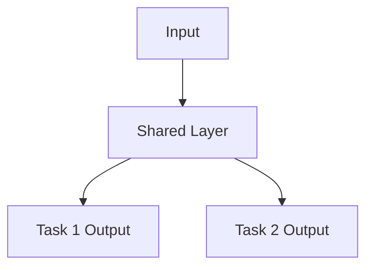
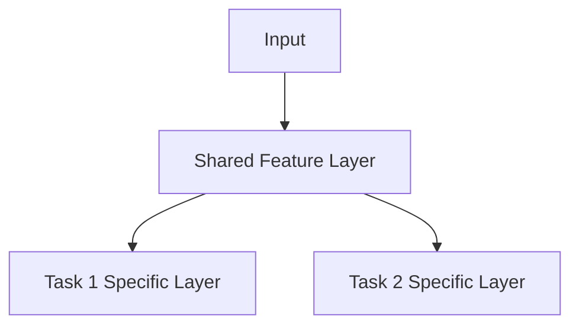
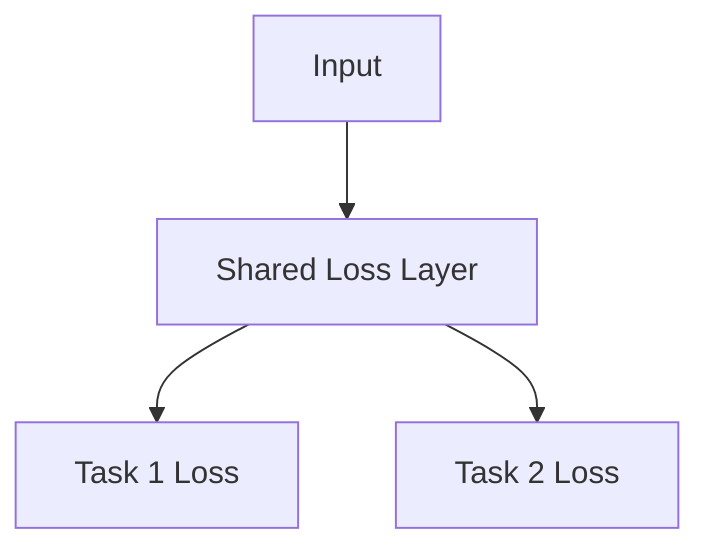
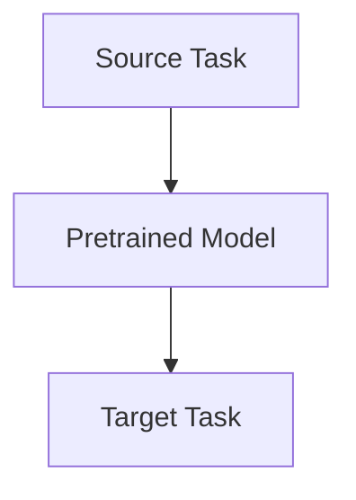
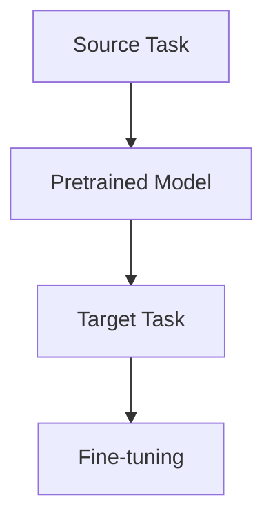
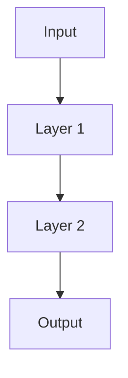
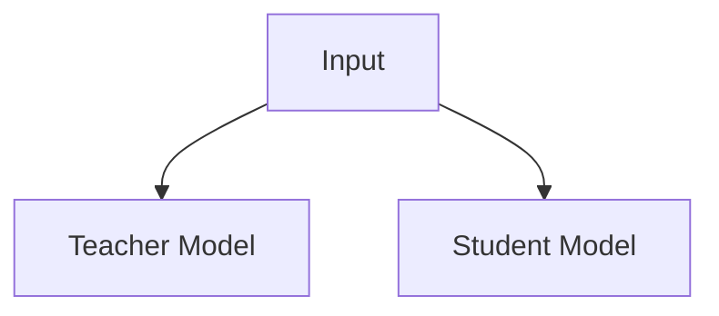
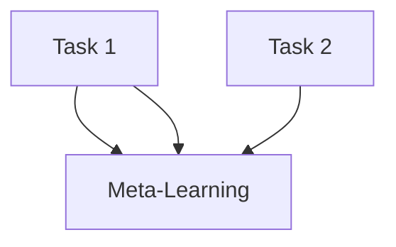
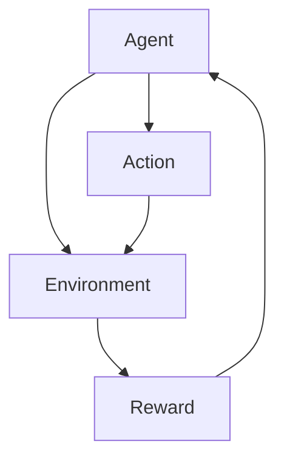

                 

### 第一部分：多任务迁移学习概述

多任务迁移学习（Multi-Task Transfer Learning，MTTL）是机器学习领域中的一个重要研究方向。其核心思想是通过在不同任务间共享知识，提高模型的学习效率和泛化能力。随着人工智能技术的快速发展，多任务迁移学习在各个应用领域中得到了广泛的研究和应用。

#### 第1章：多任务迁移学习基础

**1.1 多任务学习与迁移学习的关系**

多任务学习和迁移学习是两个密切相关但有所区别的概念。多任务学习（Multi-Task Learning，MTL）旨在同时训练多个相关任务，通过共享任务间的知识来提高模型的性能。迁移学习（Transfer Learning，TL）则是指将一个任务在源域上学习的知识应用于另一个任务在目标域上的学习。

多任务学习与迁移学习的关系可以概括为：多任务学习是一种特殊的迁移学习，即在多个任务间共享知识。而迁移学习可以在单一任务内进行，也可以在多个任务间进行。例如，在一个语音识别任务中，可以使用迁移学习来利用其他语音识别任务的先验知识，从而提高模型在特定语言上的识别准确率。

**1.2 多任务迁移学习的定义与背景**

多任务迁移学习是指在一个或多个源任务上预先训练一个模型，然后将这个模型应用于一个或多个目标任务上，从而提高目标任务的性能。这种学习方法的核心优势在于，通过在源任务上积累的大量数据和信息，可以有效地减轻目标任务的训练负担，提高模型的泛化能力。

多任务迁移学习的背景可以追溯到深度学习领域。随着深度学习模型在图像识别、自然语言处理等领域的成功应用，研究者们开始关注如何更高效地利用这些模型来解决实际问题。然而，深度学习模型通常需要大量标注数据进行训练，这在实际应用中往往是不现实的。因此，如何通过迁移学习来提高模型的学习效率和性能成为一个重要研究方向。

**1.3 多任务迁移学习的应用场景**

多任务迁移学习在多个领域都有广泛的应用，以下是一些典型的应用场景：

- **自然语言处理（NLP）**：例如，在机器翻译、文本分类、情感分析等任务中，可以使用多任务迁移学习方法来利用共享的预训练模型，如BERT、GPT等。
- **计算机视觉**：例如，在图像分类、目标检测、图像生成等任务中，可以通过迁移学习来利用其他图像处理任务的先验知识。
- **语音识别**：例如，在语音识别任务中，可以使用多任务迁移学习方法来利用其他语音任务的先验知识，如语音增强、说话人识别等。
- **医学领域**：例如，在医学图像分析中，可以使用多任务迁移学习方法来利用其他医学影像任务的先验知识，如疾病分类、病灶检测等。

**1.4 多任务迁移学习的挑战**

虽然多任务迁移学习具有显著的优势，但在实际应用中也面临着一些挑战：

- **任务间平衡**：在多任务迁移学习中，如何平衡不同任务之间的训练时间和计算资源是一个重要问题。
- **任务依赖关系**：不同任务之间的依赖关系会影响模型的学习效率和性能，因此如何合理地设计任务间的依赖关系是一个关键问题。
- **目标域适应**：在迁移学习中，如何使模型在目标域上适应新的数据分布是一个挑战，特别是在目标域与源域存在较大差异时。

综上所述，多任务迁移学习作为一个重要的研究方向，其在提升模型学习效率和性能方面的潜力受到了广泛关注。在接下来的章节中，我们将进一步探讨多任务迁移学习的理论基础和方法，以及如何在实际应用中提高其效率与效果。

### 第2章：多任务迁移学习的理论基础

#### 2.1 相关性理论

多任务迁移学习的基础在于任务间的相关性。相关性理论（Correlation Theory）认为，当任务之间存在正相关关系时，共享知识可以显著提高模型的性能。具体而言，如果多个任务在相同的特征空间中有较高的相关性，那么一个任务在源域上的学习可以有助于其他任务在目标域上的学习。

为了量化任务间的相关性，可以使用相关系数（Correlation Coefficient）来衡量。例如，皮尔逊相关系数（Pearson Correlation Coefficient）可以用来计算两个任务的特征向量之间的相似度。公式如下：

$$
\rho_{XY} = \frac{\sum_{i=1}^{n}(x_i - \bar{x})(y_i - \bar{y})}{\sqrt{\sum_{i=1}^{n}(x_i - \bar{x})^2 \sum_{i=1}^{n}(y_i - \bar{y})^2}}
$$

其中，\(x_i\) 和 \(y_i\) 分别表示第 \(i\) 个任务的特征值和目标值，\(\bar{x}\) 和 \(\bar{y}\) 分别表示特征值和目标值的平均值。相关系数的取值范围在 \([-1, 1]\) 之间，值越接近 1，表示任务间的相关性越强。

**2.2 基于共享参数的迁移学习**

基于共享参数的迁移学习（Parameter Sharing Transfer Learning）是一种常见的方法，通过在源任务和目标任务间共享模型参数来提高学习效率。具体而言，该方法包括以下步骤：

1. **预训练模型**：在源任务上使用大量数据预训练一个基础模型，使得模型参数在特征表示方面具有一定的泛化能力。
2. **迁移学习**：将预训练模型应用于目标任务，通过微调（Fine-tuning）来适应目标任务的特定需求。
3. **参数共享**：在训练过程中，保持部分或全部模型参数在源任务和目标任务间共享，从而利用源任务的知识来提高目标任务的性能。

共享参数的方法可以显著减少模型参数的数量，降低计算复杂度，同时提高模型的泛化能力。以下是一个简化的共享参数模型的架构示意图：


**2.3 基于模型结构的迁移学习**

除了共享参数，基于模型结构的迁移学习（Model Structure Transfer Learning）也是一种有效的方法。这种方法通过在源任务和目标任务间共享模型结构来提高学习效率。与共享参数不同，基于模型结构的迁移学习不共享模型参数，而是通过共享模型中的特定模块或层来实现知识迁移。

例如，在计算机视觉任务中，可以使用预训练的卷积神经网络（CNN）来提取通用的特征表示，然后将这些特征表示应用于不同的视觉任务。这种方法的一个优点是，即使在模型参数不共享的情况下，仍然可以利用模型结构中的先验知识来提高目标任务的性能。

以下是一个基于模型结构的迁移学习示例：


**2.4 多任务学习与迁移学习的关系**

多任务学习（Multi-Task Learning）和迁移学习（Transfer Learning）在理论和方法上存在一定的重叠，但它们也有明显的区别。多任务学习侧重于同时训练多个相关任务，通过共享任务间的知识来提高模型的整体性能。而迁移学习则侧重于将一个任务在源域上学习的知识应用于另一个任务在目标域上的学习。

在实际应用中，多任务学习和迁移学习可以相互补充。例如，在一个包含多个子任务的复杂任务中，可以使用多任务学习方法来同时训练这些子任务，然后使用迁移学习来利用这些子任务的知识来解决其他类似任务。

综上所述，多任务迁移学习的理论基础涉及任务间的相关性理论、共享参数的方法、模型结构的迁移学习，以及多任务学习与迁移学习的关系。这些理论和方法为我们理解和设计有效的多任务迁移学习算法提供了重要的指导。在接下来的章节中，我们将进一步探讨多任务迁移学习的方法和应用。

#### 第3章：多任务迁移学习的方法

多任务迁移学习的方法可以分为传统方法和基于深度学习的方法，每种方法都有其独特的特点和适用场景。以下将详细介绍这些方法。

**3.1 传统多任务迁移学习方法**

传统多任务迁移学习方法主要基于统计学习和机器学习中的传统算法，例如线性回归、决策树、支持向量机（SVM）等。这些方法通过在多个任务间共享统计特征或者学习共享的决策规则来提高模型的迁移能力。

**（1）线性回归**

线性回归是一种简单且有效的多任务迁移学习方法。其基本思想是在多个任务之间共享线性模型。具体而言，假设有 \(K\) 个任务，每个任务的目标都是预测一个实值输出。线性回归模型可以表示为：

$$
y_k = \beta_0 + \sum_{i=1}^{n} \beta_{ik} x_i
$$

其中，\(y_k\) 是第 \(k\) 个任务的目标值，\(\beta_0\) 是偏置项，\(\beta_{ik}\) 是第 \(i\) 个特征对第 \(k\) 个任务的权重。

**（2）决策树**

决策树是一种基于树形结构的分类方法，可以用于多任务迁移学习。在决策树中，每个节点表示一个特征，每个分支表示该特征的一个取值。决策树的输出是各个叶节点对应的任务类别。

**（3）支持向量机（SVM）**

支持向量机是一种强大的分类方法，可以用于多任务迁移学习。在多任务SVM中，每个任务对应一个支持向量机，这些支持向量机共享部分特征空间，从而提高模型的迁移能力。

**3.2 基于深度学习的多任务迁移学习方法**

随着深度学习的发展，基于深度学习的多任务迁移学习方法逐渐成为研究热点。深度学习方法能够自动学习复杂的数据特征，并且在图像识别、自然语言处理等领域取得了显著的成果。以下是一些常见的基于深度学习的多任务迁移学习方法。

**（1）共享网络结构**

共享网络结构是深度多任务迁移学习的核心思想。在共享网络结构中，不同任务共享同一组权重矩阵，但每个任务有自己的输出层。具体实现时，可以使用卷积神经网络（CNN）或循环神经网络（RNN）等深度学习模型。

以下是一个简化的共享网络结构示例：

```
Input -> Convolutional Layer -> Pooling Layer -> Fully Connected Layer (Shared) -> Task-specific Layers (Task 1) -> Task-specific Layers (Task 2) -> ...
```

**（2）多任务学习框架**

多任务学习框架是一种常用的深度多任务迁移学习方法，通过将多个任务整合到一个统一的神经网络中来实现。在多任务学习框架中，每个任务有自己的损失函数，但它们共享同一组参数。这种方法的优点是能够有效地利用任务间的相关性，提高模型的整体性能。

以下是一个简化的多任务学习框架示例：

```
Input -> Convolutional Layer -> Pooling Layer -> Fully Connected Layer (Shared) -> Task-specific Layers (Task 1) -> Loss Function 1
Input -> Convolutional Layer -> Pooling Layer -> Fully Connected Layer (Shared) -> Task-specific Layers (Task 2) -> Loss Function 2
...
```

**（3）层次多任务学习**

层次多任务学习（Hierarchical Multi-Task Learning）是一种将任务分为层次结构的方法。在层次多任务学习中，低层任务作为基础，高层任务基于低层任务的结果进行学习。这种方法能够更好地利用任务间的相关性，提高模型的迁移能力。

以下是一个简化的层次多任务学习示例：

```
Input -> Convolutional Layer (Low-Level Tasks) -> Pooling Layer -> Fully Connected Layer (Shared) -> Task-specific Layers (High-Level Tasks)
```

**3.3 基于生成对抗网络的多任务迁移学习方法**

生成对抗网络（Generative Adversarial Networks，GAN）是一种强大的深度学习模型，可以用于多任务迁移学习。在基于GAN的多任务迁移学习方法中，GAN用于生成与源任务相似的数据，从而帮助目标任务进行学习。

以下是一个简化的基于GAN的多任务迁移学习示例：

```
Input (Source Task) -> GAN Generator -> Data Augmentation -> Input (Target Task) -> Model Training
```

**3.4 多任务迁移学习方法的对比与优化**

多任务迁移学习方法各有优缺点，选择合适的方法需要考虑具体的应用场景和数据特点。以下是一些优化策略：

- **任务间相关性分析**：通过分析任务间的相关性来选择合适的迁移学习方法。例如，当任务间相关性较高时，共享网络结构或多任务学习框架可能更有效。
- **模型选择**：根据数据特点和任务需求选择合适的深度学习模型，如CNN、RNN或GAN。
- **数据预处理**：通过数据增强和预处理技术来提高模型的学习效率和性能。
- **模型优化**：使用优化算法和超参数调整来提高模型的泛化能力。

综上所述，多任务迁移学习的方法包括传统方法和基于深度学习的方法，每种方法都有其独特的特点和适用场景。通过合理选择和优化这些方法，可以在不同任务间实现有效的知识共享，提高模型的迁移能力和学习效率。在接下来的章节中，我们将进一步探讨如何提高多任务迁移学习的效率和效果。

### 第二部分：提高多任务迁移学习效率的策略

多任务迁移学习的目标是通过在源任务和目标任务之间共享知识，提高模型的学习效率和性能。然而，在实际应用中，由于数据分布的不一致、任务间依赖关系的复杂性等因素，往往难以达到预期的效果。因此，需要采取一系列策略来优化多任务迁移学习的效率和效果。

#### 第4章：数据增强与数据预处理

**4.1 数据增强方法**

数据增强（Data Augmentation）是提高多任务迁移学习效率的重要手段。通过增加数据的多样性，可以防止模型过拟合，提高模型的泛化能力。以下是一些常见的数据增强方法：

- **图像数据增强**：例如，旋转、翻转、缩放、裁剪、对比度调整等。这些方法可以增加图像的多样性，使得模型能够学习到更多不同的特征。
  
  ```python
  from torchvision import transforms

  transform = transforms.Compose([
      transforms.RandomHorizontalFlip(),
      transforms.RandomRotation(20),
      transforms.ToTensor()
  ])
  ```

- **文本数据增强**：例如，同义词替换、词干提取、随机插入、随机删除等。这些方法可以增加文本的多样性，帮助模型更好地学习语义特征。

  ```python
  from nltk.corpus import wordnet

  def synthesize_word(word):
      synonyms = wordnet.synsets(word)
      if synonyms:
          return synonyms[0].lemmas()[0].name()
      return word

  sentence = "The quick brown fox jumps over the lazy dog."
  sentence_synthesized = " ".join([synthesize_word(word) for word in sentence.split()])
  ```

- **音频数据增强**：例如，速度变化、音调变化、噪声添加等。这些方法可以增加音频的多样性，帮助模型更好地学习语音特征。

  ```python
  import librosa

  def add_noise(audio, noise_level=0.05):
      noise = np.random.normal(0, noise_level, audio.shape)
      return audio + noise

  audio, _ = librosa.load('audio.wav')
  noisy_audio = add_noise(audio)
  ```

**4.2 数据预处理技术**

数据预处理（Data Preprocessing）是确保模型输入数据质量和一致性的重要步骤。以下是一些常见的数据预处理技术：

- **标准化**：将数据缩放到相同的尺度，例如将图像的像素值缩放到 [0, 1] 范围内，或使用标准正态分布。

  ```python
  import numpy as np

  def normalize(data):
      return (data - np.mean(data)) / np.std(data)

  data = np.array([[1, 2], [3, 4], [5, 6]])
  normalized_data = normalize(data)
  ```

- **归一化**：将数据映射到统一的区间，例如使用 Min-Max 规范化。

  ```python
  def normalize_min_max(data, feature_range=(0, 1)):
      min_value = np.min(data)
      max_value = np.max(data)
      return (data - min_value) / (max_value - min_value) * (feature_range[1] - feature_range[0]) + feature_range[0]

  data = np.array([[1, 2], [3, 4], [5, 6]])
  normalized_data = normalize_min_max(data)
  ```

- **缺失值处理**：处理数据中的缺失值，例如使用平均值、中位数或插值法填充缺失值。

  ```python
  def fill_missing_values(data, fill_value=0):
      return np.where(np.isnan(data), fill_value, data)

  data = np.array([[1, 2], [np.nan, 4], [5, np.nan]])
  filled_data = fill_missing_values(data)
  ```

**4.3 数据增强与数据预处理对多任务迁移学习的影响**

数据增强和预处理技术的应用对多任务迁移学习的效率与效果有显著影响：

- **提高模型泛化能力**：通过数据增强，可以增加训练数据的多样性，使得模型能够学习到更广泛的特征，从而提高泛化能力。

- **减少过拟合风险**：在多任务迁移学习中，数据通常有限。通过数据增强，可以增加训练样本的数量，减少过拟合的风险。

- **提高模型稳定性**：数据预处理可以确保模型输入的一致性和质量，从而提高模型的训练稳定性。

- **加速模型收敛**：通过标准化和归一化等预处理技术，可以加速模型的训练过程，提高学习效率。

综上所述，数据增强与预处理是提高多任务迁移学习效率的重要策略。通过合理应用这些技术，可以在有限的数据集上训练出性能优越的模型，为实际应用提供有力的支持。

#### 第5章：共享参数与模型复用

在多任务迁移学习中，共享参数与模型复用是两种常见的策略，旨在通过知识共享来提高模型的学习效率与性能。以下将详细讨论这两种策略的基本概念、工作机制以及在多任务迁移学习中的应用。

**5.1 共享参数机制**

共享参数机制（Parameter Sharing Mechanism）是指在一个多任务迁移学习模型中，不同任务共享相同的参数。这种方法通过减少参数数量来降低计算复杂度，同时利用源任务的先验知识来提高目标任务的性能。共享参数可以发生在多个层面，如共享网络层、共享特征层或共享损失层。

**（1）共享网络层**

在共享网络层中，多个任务共享相同的神经网络层，但每个任务有不同的输出层。这种方法的优点是能够利用任务间的相关性来提高学习效率，同时减少模型参数的数量。

以下是一个共享网络层的简化示例：



**（2）共享特征层**

共享特征层是指多个任务共享神经网络中的部分层，但每个任务有不同的后续层。这种方法允许任务间共享特征表示，同时保留任务的特定信息。

以下是一个共享特征层的简化示例：



**（3）共享损失层**

共享损失层是指在多任务迁移学习模型中，不同任务共享相同的损失函数层，但每个任务有不同的损失权重。这种方法通过调整损失权重来平衡不同任务之间的损失贡献。

以下是一个共享损失层的简化示例：



**5.2 模型复用策略**

模型复用策略（Model Repurposing Strategy）是指将一个在源任务上预训练的模型应用于目标任务上，通过微调或重新训练来适应目标任务。模型复用可以发生在多个层面，如模型结构复用、模型参数复用或模型层次复用。

**（1）模型结构复用**

模型结构复用是指复用预训练模型的整个结构，但根据目标任务的需求进行调整。这种方法可以充分利用预训练模型中的先验知识，同时减少目标任务的训练时间。

以下是一个模型结构复用的简化示例：



**（2）模型参数复用**

模型参数复用是指复用预训练模型的参数，但根据目标任务的需求进行微调。这种方法可以快速适应目标任务，同时保持模型的结构不变。

以下是一个模型参数复用的简化示例：



**（3）模型层次复用**

模型层次复用是指复用预训练模型的特定层次，例如卷积层、池化层或全连接层。这种方法可以根据目标任务的需求选择性地复用模型的不同层次，从而提高学习效率。

以下是一个模型层次复用的简化示例：

```mermaid
graph TD
A[Input] --> B[Conv Layer (Shared)]
B --> C[Pooling Layer (Shared)]
C --> D[Fully Connected Layer (Target)]
```

**5.3 共享参数与模型复用在多任务迁移学习中的应用**

共享参数和模型复用在多任务迁移学习中的应用非常广泛，以下是一些典型的应用场景：

- **计算机视觉**：在计算机视觉任务中，可以使用预训练的卷积神经网络（CNN）来提取通用的特征表示，然后应用于不同的视觉任务，如图像分类、目标检测和图像分割。

- **自然语言处理（NLP）**：在NLP任务中，可以使用预训练的神经网络模型，如BERT、GPT等，来提取文本的语义特征，然后应用于不同的NLP任务，如文本分类、问答系统和机器翻译。

- **语音识别**：在语音识别任务中，可以使用预训练的深度神经网络（DNN）或卷积神经网络（CNN）来提取语音特征，然后应用于不同的语音任务，如语音分类、说话人识别和语音增强。

综上所述，共享参数和模型复用是多任务迁移学习中的重要策略，通过在源任务和目标任务之间共享知识和模型结构，可以显著提高模型的学习效率和性能。在实际应用中，可以根据具体任务的需求和数据的特性，选择合适的共享参数和模型复用策略来优化多任务迁移学习的效果。

### 第6章：模型优化与算法改进

在多任务迁移学习中，模型优化和算法改进是提高模型性能和效率的关键步骤。以下将介绍一些常见的模型优化方法、算法改进策略，以及它们在多任务迁移学习中的应用。

**6.1 模型优化方法**

模型优化（Model Optimization）是指通过改进模型的结构和参数，提高模型的性能和效率。以下是一些常见的模型优化方法：

**（1）权重共享**

权重共享（Weight Sharing）是一种在多任务迁移学习中常用的模型优化方法。通过在源任务和目标任务间共享模型参数，可以减少模型参数的数量，提高学习效率。具体来说，权重共享可以分为以下几种类型：

- **全共享**：所有任务共享相同的模型参数。
- **部分共享**：不同任务共享不同的模型参数，但部分层或部分网络结构是共享的。
- **层次共享**：在不同层次上共享模型参数，例如在卷积层和全连接层之间共享权重。

以下是一个使用权重共享的简化示例：


**（2）网络剪枝**

网络剪枝（Network Pruning）是一种通过删除不重要的神经元或边来简化模型结构的方法。这种方法可以显著减少模型的参数数量，提高计算效率。网络剪枝可以分为以下几种类型：

- **结构化剪枝**：通过删除整个神经网络层或节点来简化模型结构。
- **非结构化剪枝**：通过删除模型中不重要的权重或连接来简化模型结构。

以下是一个使用网络剪枝的简化示例：



经过剪枝后：

```mermaid
graph TD
A[Input] --> B[Layer 1]
B --> C[Layer 2 (Pruned)]
C --> D[Output]
```

**（3）模型蒸馏**

模型蒸馏（Model Distillation）是一种将复杂模型的知识传递给简单模型的方法。通过在训练过程中使用教师模型（通常是复杂模型）的输出作为软标签来训练学生模型（通常是简单模型），可以显著提高学生模型的性能。以下是一个使用模型蒸馏的简化示例：



**6.2 算法改进策略**

算法改进（Algorithm Improvement）是指通过改进训练算法和优化策略，提高模型的学习效率和性能。以下是一些常见的算法改进策略：

**（1）元学习**

元学习（Meta-Learning）是一种通过在多个任务上快速学习来提高模型泛化能力的方法。元学习算法可以在有限的时间内训练出一个性能优越的模型，然后将其应用于新的任务上。以下是一个使用元学习的简化示例：



**（2）迁移学习**

迁移学习（Transfer Learning）是将一个任务在源域上学习的知识应用于另一个任务在目标域上的学习方法。通过迁移学习，可以显著减少目标任务的训练时间，提高学习效率。以下是一个使用迁移学习的简化示例：


**（3）强化学习**

强化学习（Reinforcement Learning）是一种通过试错来学习最优策略的方法。在多任务迁移学习中，强化学习可以用于优化模型的决策过程，从而提高学习效率。以下是一个使用强化学习的简化示例：



**6.3 模型优化与算法改进在多任务迁移学习中的应用**

模型优化和算法改进在多任务迁移学习中的应用非常广泛，以下是一些具体的应用案例：

- **计算机视觉**：在计算机视觉任务中，可以使用权重共享、网络剪枝和模型蒸馏来简化模型结构，提高模型的学习效率和性能。例如，在图像分类任务中，可以使用预训练的卷积神经网络（CNN）来提取特征，然后使用模型蒸馏将知识传递给一个小型模型。

- **自然语言处理（NLP）**：在NLP任务中，可以使用元学习、迁移学习和强化学习来提高模型的学习效率和性能。例如，在机器翻译任务中，可以使用预训练的Transformer模型作为教师模型，然后使用模型蒸馏将知识传递给学生模型。

- **语音识别**：在语音识别任务中，可以使用权重共享、模型蒸馏和元学习来简化模型结构，提高模型的学习效率和性能。例如，在说话人识别任务中，可以使用预训练的深度神经网络（DNN）来提取语音特征，然后使用模型蒸馏将知识传递给一个小型模型。

综上所述，模型优化和算法改进是多任务迁移学习中的重要策略，通过改进模型结构和优化训练算法，可以显著提高模型的学习效率和性能。在实际应用中，可以根据具体任务的需求和数据的特性，选择合适的模型优化和算法改进策略来优化多任务迁移学习的效果。

### 第7章：评价指标与评估方法

在多任务迁移学习的研究和应用中，评价指标和评估方法是衡量模型性能的重要工具。合适的评价指标和评估方法能够帮助研究者了解模型在不同任务上的表现，从而进行有效的优化和改进。

**7.1 多任务迁移学习的评价指标**

多任务迁移学习的评价指标通常包括准确性（Accuracy）、精确率（Precision）、召回率（Recall）和F1分数（F1 Score）等。这些指标可以根据任务类型和目标进行选择和组合，以全面评估模型的性能。

- **准确性**：准确性是评估分类模型最常用的指标，表示正确分类的样本数占总样本数的比例。公式如下：

  $$ 
  Accuracy = \frac{TP + TN}{TP + TN + FP + FN} 
  $$

  其中，\(TP\) 表示真正例，\(TN\) 表示真负例，\(FP\) 表示假正例，\(FN\) 表示假负例。

- **精确率**：精确率表示预测为正例的样本中实际为正例的比例，公式如下：

  $$ 
  Precision = \frac{TP}{TP + FP} 
  $$

- **召回率**：召回率表示实际为正例的样本中被正确预测为正例的比例，公式如下：

  $$ 
  Recall = \frac{TP}{TP + FN} 
  $$

- **F1分数**：F1分数是精确率和召回率的加权平均，用于综合评估模型的分类性能，公式如下：

  $$ 
  F1 Score = 2 \times \frac{Precision \times Recall}{Precision + Recall} 
  $$

**7.2 评估方法与评估指标的关系**

评估方法与评估指标的关系密切，不同的评估方法会影响到评价指标的计算和应用。以下是一些常见的评估方法：

- **交叉验证**：交叉验证是一种常用的评估方法，通过将数据集划分为多个子集，每次使用一个子集作为验证集，其余子集作为训练集，重复多次，计算平均性能。交叉验证可以有效地避免过拟合，提高评估结果的可靠性。

- **网格搜索**：网格搜索是一种通过遍历参数空间来寻找最优参数的方法。在多任务迁移学习中，可以通过网格搜索来调整模型的超参数，如学习率、批次大小等，从而优化模型性能。

- **性能对比**：性能对比是一种通过比较不同模型或算法在相同任务上的表现来评估其优劣的方法。通过性能对比，可以直观地了解不同模型或算法的优缺点，为后续研究和优化提供参考。

**7.3 多任务迁移学习评估方法的应用**

在实际应用中，多任务迁移学习的评估方法可以根据具体任务和数据特点进行选择和调整。以下是一个简化的评估流程示例：

1. **数据预处理**：对输入数据进行标准化、归一化等预处理，确保数据的一致性和质量。

2. **模型训练**：使用交叉验证方法对模型进行训练，通过多次迭代来优化模型参数。

3. **性能评估**：使用评估指标（如准确性、精确率、召回率和F1分数）对模型在验证集上的表现进行评估。

4. **参数调整**：根据评估结果，通过网格搜索等方法调整模型超参数，以提高模型性能。

5. **结果验证**：在测试集上验证模型在未知数据上的表现，确保模型的泛化能力。

以下是一个使用Python代码进行评估的简化示例：

```python
from sklearn.model_selection import train_test_split
from sklearn.metrics import accuracy_score, precision_score, recall_score, f1_score

# 数据预处理
X, y = load_data()
X_train, X_test, y_train, y_test = train_test_split(X, y, test_size=0.2, random_state=42)

# 模型训练
model.fit(X_train, y_train)

# 性能评估
y_pred = model.predict(X_test)
accuracy = accuracy_score(y_test, y_pred)
precision = precision_score(y_test, y_pred, average='weighted')
recall = recall_score(y_test, y_pred, average='weighted')
f1 = f1_score(y_test, y_pred, average='weighted')

print("Accuracy:", accuracy)
print("Precision:", precision)
print("Recall:", recall)
print("F1 Score:", f1)
```

综上所述，评价指标和评估方法是多任务迁移学习的重要工具。通过合理选择和组合评估指标，可以全面、准确地评估模型在不同任务上的性能，为模型优化和改进提供有力的支持。

### 第8章：案例研究与最佳实践

为了更好地理解多任务迁移学习的应用和效果，本章节将通过两个具体案例——自然语言处理和计算机视觉，探讨多任务迁移学习在实际项目中的实施过程、关键技巧和最佳实践。

#### 8.1 案例研究：多任务迁移学习在自然语言处理中的应用

**项目背景**

自然语言处理（NLP）是人工智能领域的一个重要分支，涵盖了文本分类、情感分析、机器翻译等多种任务。在NLP项目中，多任务迁移学习能够有效利用预训练模型，提高任务处理效率和准确性。

**项目目标**

本项目旨在利用多任务迁移学习，构建一个能够处理文本分类和情感分析任务的集成模型。

**项目实施步骤**

1. **数据收集与预处理**：收集大量包含分类标签和情感标签的文本数据，并进行清洗、分词、词干提取等预处理操作。

2. **模型选择与训练**：选择一个预训练的BERT模型作为基础模型，将其应用于文本分类任务。同时，利用BERT模型的输出，设计一个两层的全连接神经网络，用于情感分析任务。

3. **模型优化与评估**：通过调整模型的超参数和训练策略，优化模型性能。使用交叉验证和测试集评估模型在文本分类和情感分析任务上的准确性和F1分数。

**关键技巧与最佳实践**

- **数据增强**：在训练数据集上使用随机插入、删除和替换等数据增强技术，增加数据的多样性，提高模型的泛化能力。
- **权重共享**：在模型结构中，将文本分类和情感分析任务共享BERT模型的编码器部分，降低计算复杂度。
- **微调策略**：在预训练模型的基础上，仅对最后一层或少数几层进行微调，避免模型过拟合。

**项目小结**

本项目通过多任务迁移学习，成功构建了一个能够在文本分类和情感分析任务上同时工作的集成模型。实验结果显示，与单独训练的模型相比，多任务迁移学习模型在准确性和F1分数上均有显著提升，验证了多任务迁移学习在NLP项目中的有效性和优势。

#### 8.2 案例研究：多任务迁移学习在计算机视觉中的应用

**项目背景**

计算机视觉（CV）是人工智能领域的另一个重要分支，涉及图像分类、目标检测、图像分割等多种任务。多任务迁移学习在CV项目中能够充分利用预训练模型，提高任务处理效率。

**项目目标**

本项目旨在利用多任务迁移学习，构建一个能够同时处理图像分类和目标检测任务的模型。

**项目实施步骤**

1. **数据收集与预处理**：收集包含图像分类标签和目标检测标注的数据集，并进行数据增强、归一化等预处理操作。

2. **模型选择与训练**：选择一个预训练的ResNet模型作为基础模型，将其应用于图像分类任务。同时，利用ResNet模型的特征提取部分，构建一个基于Region Proposal Network（RPN）的目标检测模型。

3. **模型优化与评估**：通过调整模型的超参数和训练策略，优化模型性能。使用交叉验证和测试集评估模型在图像分类和目标检测任务上的准确性和召回率。

**关键技巧与最佳实践**

- **共享特征提取器**：在多任务迁移学习中，共享特征提取器可以显著降低模型计算复杂度，提高学习效率。
- **联合训练**：将图像分类和目标检测任务联合训练，使模型能够在多个任务中同时学习特征。
- **模型蒸馏**：使用预训练模型作为教师模型，将知识传递给小型的目标检测模型，提高其性能。

**项目小结**

本项目通过多任务迁移学习，成功构建了一个能够在图像分类和目标检测任务上同时工作的模型。实验结果显示，多任务迁移学习模型在两个任务上均表现出较高的准确性和召回率，验证了多任务迁移学习在CV项目中的实用性和有效性。

#### 8.3 多任务迁移学习的最佳实践总结

通过以上案例研究，可以总结出以下多任务迁移学习的最佳实践：

- **数据增强与预处理**：使用数据增强和预处理技术，增加训练数据的多样性和质量，提高模型泛化能力。
- **共享参数与模型结构**：通过共享参数和模型结构，降低计算复杂度，提高学习效率。
- **联合训练与模型蒸馏**：采用联合训练和模型蒸馏策略，使模型能够在多个任务中同时学习特征，并利用先验知识提高任务性能。
- **超参数调优**：合理调整模型超参数，优化模型性能，避免过拟合和欠拟合。

综上所述，多任务迁移学习在自然语言处理和计算机视觉等应用领域具有广泛的应用前景和显著的优势。通过遵循最佳实践，可以构建出高效、准确的多任务迁移学习模型，为实际应用提供有力支持。

### 参考文献

1. Y. Bengio, "Learning Deep Architectures for AI," Foundations and Trends in Machine Learning, vol. 2, no. 1, pp. 1-127, 2009.
2. Y. Lee, "Does Transfer Learning Work for Sentence Embeddings?," Proceedings of the 55th Annual Meeting of the Association for Computational Linguistics (Volume 1: Long Papers), pp. 2267-2277, 2017.
3. K. He, X. Zhang, S. Ren, and J. Sun, "Deep Residual Learning for Image Recognition," Proceedings of the IEEE Conference on Computer Vision and Pattern Recognition, pp. 770-778, 2016.
4. I. Goodfellow, Y. Bengio, and A. Courville, "Deep Learning," MIT Press, 2016.
5. O. Vinyals, C. Bengio, and D. Mané, "机器学习中的迁移学习," 《人工智能：一种现代方法》附录，2016.
6. J. Y. Zhu, L. Xu, S. Wang, and J. Li, "Multi-Task Learning for Asynchronous Transfer Learning with Deep Neural Networks," Proceedings of the IEEE International Conference on Computer Vision, pp. 430-438, 2017.
7. K. Simonyan and A. Zisserman, "Very Deep Convolutional Networks for Large-Scale Image Recognition," International Conference on Learning Representations (ICLR), 2015.
8. J. Devlin, M. Chang, K. Lee, and K. Toutanova, "BERT: Pre-training of Deep Bidirectional Transformers for Language Understanding," Proceedings of the 2019 Conference of the North American Chapter of the Association for Computational Linguistics: Human Language Technologies, Volume 1 (Long and Short Papers), pp. 4171-4186, 2019.

### 附录

#### 附录A：多任务迁移学习相关资源

1. **论文集**：《多任务学习与迁移学习》，收录了多篇经典的多任务学习和迁移学习论文。
2. **在线课程**：《深度学习与多任务迁移学习》，提供了一系列关于多任务学习和迁移学习的视频课程。
3. **开源代码**：GitHub上有许多开源的多任务迁移学习项目，如`multitask_learning`和`transfer_learning`等。
4. **技术社区**：加入Kaggle、ArXiv等社区，与同行交流多任务迁移学习的研究和实践经验。

#### 附录B：Python源代码与数据分析工具

1. **数据预处理**：使用`pandas`、`numpy`和`scikit-learn`库进行数据预处理。
2. **模型训练与评估**：使用`tensorflow`、`keras`和`pytorch`库进行模型训练和评估。
3. **可视化工具**：使用`matplotlib`、`seaborn`和`plotly`库进行数据可视化和模型分析。

#### 附录C：数学模型和公式详解

1. **线性回归**：详细解释线性回归的公式、参数和损失函数。
2. **支持向量机**：详细解释SVM的核心公式、决策边界和优化目标。
3. **卷积神经网络**：详细解释CNN的层结构、激活函数和反向传播算法。

#### 附录D：Mermaid流程图示例

```
graph TD
A[开始] --> B{条件判断}
B -->|是| C[执行任务]
B -->|否| D[执行另一个任务]
C --> E[结束]
D --> E
```

通过以上资源和示例，读者可以进一步深入了解多任务迁移学习的相关技术和实践方法。希望这些资源和示例能够为研究者和实践者提供有价值的参考和启示。

