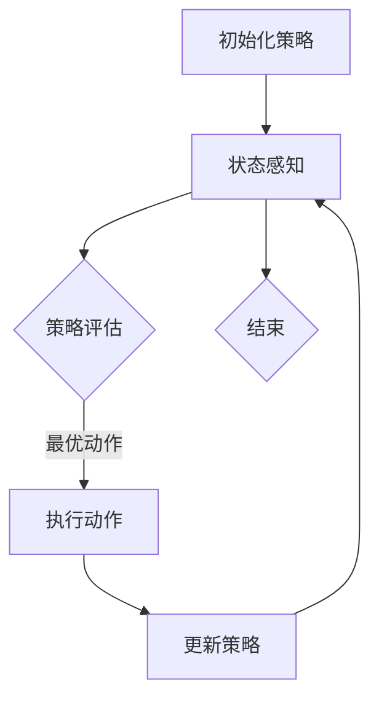

                 

### 引言

在当今技术迅猛发展的时代，人工智能（AI）的应用场景日益广泛，从自动驾驶到智能家居，再到工业自动化，AI已经深刻改变了我们的生活方式。在众多AI任务中，多智能体协作博弈任务尤为重要。这类任务要求多个智能体在复杂的环境中协同工作，通过相互博弈和策略调整，以实现整体的最优目标。因此，提升AI模型在多智能体协作博弈任务中的策略优化能力，成为了当前研究的热点。

**1.1 研究背景**

**AI模型在多智能体协作博弈任务中的重要性**

多智能体协作博弈任务涉及多个智能体之间的交互和策略调整，这使得任务具有高度复杂性和动态性。传统单智能体AI模型在面对这类任务时往往力不从心，难以应对。而基于深度学习、强化学习等先进技术的新型AI模型，能够在复杂环境中通过自我学习和策略优化，实现智能体之间的协同工作，从而提高任务的完成效率和鲁棒性。

**多智能体协作博弈任务的应用场景**

多智能体协作博弈任务在多个领域有着广泛的应用。例如，在无人驾驶领域，多个车辆需要通过协作博弈实现交通流的最优化；在游戏领域，多人在线游戏中的玩家和NPC（非玩家角色）也需要通过博弈策略进行对抗和协作；在工业自动化领域，多机器人系统需要通过协作完成任务，提高生产效率和灵活性。这些应用场景都对AI模型在多智能体协作博弈任务中的策略优化提出了严峻挑战。

**研究目的与意义**

本文旨在深入探讨提升AI模型在多智能体协作博弈任务中的策略优化方法。通过对现有技术和方法的分析，本文将提出一系列优化策略，以应对多智能体协作博弈任务中的复杂性和动态性。研究的目的在于提高AI模型的策略优化能力，为实际应用提供理论支持和实践指导。这不仅有助于推动AI技术在多智能体协作博弈领域的应用，也对智能系统的研究与发展具有重要意义。

综上所述，研究AI模型在多智能体协作博弈任务中的策略优化具有重要的现实意义和应用前景。本文将从理论基础、应用实践和优化方法等多个方面进行深入探讨，以期为相关领域的研究者和开发者提供有价值的参考。

### 多智能体系统基本概念

多智能体系统（Multi-Agent System，MAS）是人工智能领域的一个重要研究方向，它由多个智能体（Agent）组成，这些智能体可以独立决策、执行任务并在动态环境中相互协作。理解多智能体系统的基本概念对于深入研究AI模型在多智能体协作博弈任务中的应用具有重要意义。

#### **2.1 多智能体系统的定义**

多智能体系统是指由多个智能体组成的系统，这些智能体可以独立或协同地执行任务，以实现共同的目标。每个智能体都是一个独立的实体，拥有自己的感知、决策和执行能力。智能体的行为受到其内部模型和环境状态的共同影响。多智能体系统的核心在于智能体之间的交互和协同，通过这种交互和协同，智能体可以共同完成任务或实现某个目标。

**2.2 多智能体系统中的角色**

在多智能体系统中，常见的角色包括以下几种：

- **决策者（Director）**：负责协调和管理其他智能体的行为，确保系统整体目标的实现。
- **执行者（Executor）**：执行具体的任务或操作，通常是系统中的工作智能体。
- **协调者（Coordinator）**：协调不同智能体之间的交互，解决冲突和协调任务分配。
- **监控者（Monitor）**：监控系统的状态和性能，提供反馈和支持。

这些角色的具体职责和作用取决于系统的需求和设计。例如，在无人驾驶系统中，决策者负责规划行驶路径，执行者负责执行驾驶操作，协调者负责与其他车辆和交通设施进行交互，监控者则负责监控系统状态和确保安全。

**2.3 多智能体系统的协同机制**

多智能体系统的协同机制是指智能体之间进行协作和交互的方式。协同机制的设计和实现直接影响系统的效率和性能。以下是几种常见的协同机制：

- **中心化协同**：系统中的所有智能体都向一个中心控制器发送状态信息和请求，中心控制器根据全局信息进行决策和分配任务。这种方式可以确保系统的全局优化，但中心控制器的负载较大，容错能力较低。
- **分布式协同**：每个智能体根据自身状态和局部信息进行决策和行动，通过局部交互实现全局目标。这种方式具有较低的通信负载和较高的容错能力，但可能无法实现全局最优。
- **混合协同**：结合中心化和分布式协同的优点，系统中的智能体在某些情况下采用中心化决策，在另一些情况下采用分布式决策。这种方式可以根据具体应用需求灵活调整协同方式。

**2.3.1 多智能体系统的交互模型**

多智能体系统的交互模型描述了智能体之间的通信和交互方式。常见的交互模型包括：

- **完全信息交互**：智能体之间可以完全共享所有状态信息，通过这种方式可以实现完全的信息对称，但通信负载较高。
- **部分信息交互**：智能体之间只能共享部分状态信息，这可能会导致信息不对称，影响系统的决策和协作。
- **异步交互**：智能体之间的交互是非同步的，每个智能体按照自己的节奏进行通信和决策，这种方式适合动态变化的环境。
- **同步交互**：智能体之间的交互是同步的，所有智能体在同一时间点进行通信和决策，这种方式适合静态或缓慢变化的环境。

通过设计合适的交互模型，可以有效地提高多智能体系统的协作效率和鲁棒性。

综上所述，多智能体系统的基本概念、角色和协同机制为理解AI模型在多智能体协作博弈任务中的应用奠定了基础。通过深入探讨这些概念，我们可以更好地设计智能系统，提升其在复杂环境中的协作能力。在接下来的章节中，我们将进一步探讨博弈论基础和AI模型在多智能体协作博弈中的应用，以期为读者提供更全面的理论和实践指导。

### 博弈论基础

博弈论（Game Theory）是研究决策者（玩家）在具有冲突和合作情境下的策略选择和均衡问题的数学理论。博弈论广泛应用于经济学、政治学、社会学和计算机科学等领域，为多智能体协作博弈任务中的策略分析提供了理论基础。

#### **3.1 博弈论的定义**

博弈论是研究决策者在给定规则和策略选择下进行互动，并试图最大化自身利益或实现特定目标的科学。博弈论的核心问题是确定每个决策者在面对其他决策者策略时的最佳策略，并找出所有参与者共同遵循的均衡策略组合。

#### **3.2 博弈模型的构成**

一个标准的博弈模型通常包括以下要素：

- **参与者（Players）**：博弈中的决策个体，可以是人类或智能体。
- **策略（Strategies）**：参与者可以选择的行动方案。每个策略定义了参与者在不同情况下的行动。
- **支付（Payoffs）**：每个参与者根据最终结果获得的收益或损失。支付通常用数值表示，可以是正数（收益）或负数（损失）。
- **均衡（Equilibria）**：所有参与者都采取最佳策略的状态，即每个参与者无法通过单方面改变策略来改善自己的支付。

博弈模型可以表示为以下形式：

- **博弈树**：一种树形结构，用于描述参与者策略的先后顺序和可能的支付结果。
- **矩阵博弈**：一个二维表格，用于表示两个或多个参与者的策略和相应的支付。

#### **3.3 博弈策略分析**

博弈策略分析是博弈论的核心内容，主要包括以下几个方面：

- **最佳响应策略（Best Response Strategy）**：在给定的对手策略下，参与者选择的最优策略。即每个参与者试图最大化自己的支付。
- **纳什均衡（Nash Equilibrium）**：在纳什均衡中，每个参与者都采取了最佳响应策略，没有参与者可以通过单方面改变策略来改善自己的支付。纳什均衡是博弈论中最重要和最常见的一种均衡概念。
- **混合策略均衡（Mixed Strategy Equilibrium）**：在某些博弈中，纯策略纳什均衡可能不存在，此时参与者采取随机策略组合，使得每个参与者都达到最佳响应。混合策略均衡是通过概率分布来表示的。

#### **3.3.1 博弈策略分析示例**

以下是一个简单的二人零和博弈示例，即每个参与者的支付和为0的博弈模型。参与者有两个策略：合作（C）和背叛（D），支付矩阵如下：

| 参与者A | 合作（C） | 背叛（D） |
| -------- | -------- | -------- |
| 合作（C） | （3，3） | （0，0） |
| 背叛（D） | （0，0） | （2，2） |

在这个博弈中，如果参与者A选择合作，参与者B的最佳响应策略也是合作，因为双方都获得3的支付；如果参与者A选择背叛，参与者B的最佳响应策略是背叛，因为双方都获得2的支付。纳什均衡是（C，C），即两个参与者都选择合作。

#### **3.4 博弈策略在多智能体协作博弈中的应用**

在多智能体协作博弈任务中，博弈论策略的应用有助于智能体之间进行有效的策略选择和协作。以下是博弈策略在多智能体协作博弈中的几个关键应用：

- **策略学习**：智能体通过博弈论策略学习来优化自己的行为，以最大化自身利益。例如，利用Q-learning算法，智能体可以在互动过程中不断调整策略，找到纳什均衡。
- **策略协调**：通过博弈策略，智能体可以在复杂环境中协调行动，避免冲突和资源浪费。例如，在无人机编队中，智能体可以通过博弈策略实现协同飞行，提高整体效率。
- **策略评估**：智能体可以使用博弈策略对自身策略的有效性进行评估。例如，通过模拟不同策略在不同情况下的支付结果，智能体可以评估和优化其策略组合。

博弈论为多智能体协作博弈任务提供了理论指导，通过分析参与者的策略和均衡，智能体可以更好地应对复杂环境中的协作和对抗。在接下来的章节中，我们将继续探讨多智能体协作博弈的理论基础和解决方案，进一步深入理解AI模型在多智能体协作博弈任务中的应用。

### 多智能体协作博弈

多智能体协作博弈（Multi-Agent Cooperative Game）是博弈论的一个重要分支，它研究多个智能体在协同完成任务时的策略选择和均衡问题。与传统的单智能体博弈不同，多智能体协作博弈强调智能体之间的相互协作和利益协调，以实现整体最优目标。

#### **4.1 多智能体协作博弈的定义**

多智能体协作博弈是指在多个智能体共同参与的任务中，每个智能体需要根据其他智能体的行为和策略，选择自己的行动方案，以实现共同的目标。在这个博弈过程中，智能体之间需要通过沟通和协作来协调各自的行为，以最大化整体收益或最小化整体损失。

#### **4.2 多智能体协作博弈的模型**

多智能体协作博弈的模型通常包括以下几个关键要素：

- **参与者**：每个智能体都是博弈的参与者，它们有自己的目标函数和策略选择。
- **策略空间**：每个智能体可以选择的策略集合，这些策略可以是离散的，也可以是连续的。
- **收益函数**：每个智能体的目标函数，用于衡量其在博弈中的收益或损失。在协作博弈中，智能体的收益函数通常是相互依赖的，即一个智能体的收益受到其他智能体策略的影响。
- **协同机制**：智能体之间进行协作和沟通的机制，可以是完全信息协同（所有智能体共享所有信息），也可以是部分信息协同（智能体之间只共享部分信息）。

一个典型的多智能体协作博弈模型可以表示为以下形式：

\[ G = (N, S, U, R) \]

- **N**：参与者集合，表示所有智能体的集合。
- **S**：策略空间，表示每个智能体的策略集合。
- **U**：联合策略空间，表示所有智能体策略组合的集合。
- **R**：收益函数，用于计算每个智能体在不同策略组合下的收益。

#### **4.3 多智能体协作博弈的挑战**

多智能体协作博弈面临着一系列复杂的挑战，主要包括以下几点：

- **协调困难**：智能体之间的协调是协作博弈的核心问题。由于每个智能体都有独立的目标函数，它们可能会选择相互冲突的策略，导致整体性能下降。
- **不确定性**：在多智能体协作博弈中，智能体需要应对环境的不确定性和其他智能体行为的不确定性，这使得策略优化更加复杂。
- **计算复杂性**：多智能体协作博弈的模型通常具有高维策略空间，导致计算复杂性增加，传统的优化算法可能无法有效处理大规模问题。
- **动态变化**：在动态环境中，智能体需要实时调整策略以适应环境变化，这对智能体的计算能力和响应速度提出了更高的要求。

#### **4.4 多智能体协作博弈的解决方案**

为了应对多智能体协作博弈中的挑战，研究者提出了多种解决方案，主要包括以下几种：

- **强化学习**：通过自我学习和策略优化，智能体可以逐渐找到最优的策略组合。强化学习算法如Q-learning、Sarsa等在多智能体协作博弈中得到了广泛应用。
- **博弈论策略**：利用博弈论中的纳什均衡、协同策略等概念，智能体可以设计出有效的协作策略，实现整体最优。
- **分布式协同机制**：通过分布式算法和协同机制，智能体可以在不共享全局信息的情况下，实现局部最优，从而提高整体协作效率。
- **混合智能体方法**：结合传统算法和机器学习方法，智能体可以更好地适应复杂环境和动态变化，提高策略的鲁棒性和适应性。

综上所述，多智能体协作博弈任务具有复杂性和动态性，需要有效的策略优化方法来应对挑战。通过深入研究博弈论和AI技术，我们可以设计出更加智能和高效的协作策略，推动多智能体系统在实际应用中的广泛应用。在接下来的章节中，我们将进一步探讨AI模型在多智能体协作博弈任务中的应用和实践，以期为读者提供更全面的技术指导。

### 多智能体协作博弈的解决方案

在多智能体协作博弈任务中，为了实现智能体之间的协同与策略优化，研究者们提出了多种解决方案。这些解决方案主要包括多智能体强化学习、博弈论策略和多智能体协同控制方法。以下将分别介绍这些方法的基本原理及其在多智能体协作博弈中的应用。

#### **5.1 多智能体强化学习**

**5.1.1 基本原理**

多智能体强化学习（Multi-Agent Reinforcement Learning，MARL）是基于强化学习（Reinforcement Learning，RL）的一种扩展，适用于多智能体环境。在MARL中，每个智能体通过与环境和其他智能体的交互来学习最优策略。其基本原理包括：

- **状态（State）**：智能体感知到的环境信息。
- **动作（Action）**：智能体可以执行的行为。
- **奖励（Reward）**：智能体在执行动作后获得的即时反馈。
- **策略（Policy）**：智能体基于当前状态选择动作的策略。

**5.1.2 应用**

多智能体强化学习在多智能体协作博弈中有广泛应用，例如：

- **无人机编队**：通过MARL，无人机可以自动调整飞行路径和速度，以实现最优的编队形态和任务效率。
- **多人游戏**：在多人在线游戏中，玩家和NPC可以通过MARL学习合作或对抗策略，提高游戏体验。
- **多机器人协作**：在工业自动化中，多机器人系统可以通过MARL实现协同完成任务，如组装线上的机器人协同工作。

**5.1.3 实践案例**

以下是一个简单的MARL实践案例，使用Python和Gym环境进行实现：

```python
import gym
import numpy as np

# 创建环境
env = gym.make('MultiAgentTaxi-v0')

# 初始化智能体
num_agents = 4
q_values = np.zeros((num_agents, env.observation_space.n, env.action_space.n))

# 强化学习训练
num_episodes = 1000
for episode in range(num_episodes):
    state = env.reset()
    done = False
    total_reward = 0

    while not done:
        # 选择动作
        action = np.argmax(q_values[agent] @ state)

        # 执行动作
        next_state, reward, done, _ = env.step(action)

        # 更新Q值
        q_values[agent][state, action] = q_values[agent][state, action] + 0.1 * (reward + gamma * np.max(q_values[agent][next_state]))

        state = next_state
        total_reward += reward

    print(f'Episode {episode}: Total Reward = {total_reward}')

# 测试智能体策略
state = env.reset()
done = False

while not done:
    action = np.argmax(q_values[agent] @ state)
    next_state, reward, done, _ = env.step(action)
    print(f'Action: {action}, Reward: {reward}')
    state = next_state
```

#### **5.2 博弈论策略**

**5.2.1 基本原理**

博弈论策略是利用博弈论原理，设计智能体的策略组合，以实现整体最优。在博弈论策略中，常用的概念包括纳什均衡、协同策略和合作博弈等。

- **纳什均衡**：在纳什均衡中，每个参与者都采取了最佳响应策略，没有参与者可以通过单方面改变策略来改善自己的支付。
- **协同策略**：智能体通过共享信息和协同决策，实现整体最优。协同策略可以最大化整体收益或最小化整体损失。
- **合作博弈**：多个智能体共同追求同一目标，通过合作实现最优结果。

**5.2.2 应用**

博弈论策略在多智能体协作博弈中有广泛应用，例如：

- **交通管理**：在智能交通系统中，多车辆通过博弈论策略协调行驶方向和速度，以减少拥堵和提升整体交通效率。
- **资源分配**：在共享经济平台中，多用户通过博弈论策略协调资源使用，实现资源的最优分配。
- **供应链管理**：在供应链系统中，多企业通过博弈论策略协调生产和运输计划，优化供应链整体效率。

**5.2.3 实践案例**

以下是一个基于纳什均衡的博弈论策略实践案例：

```python
# 假设有两个智能体，每个智能体有两个策略：合作（C）和背叛（D）

# 定义收益矩阵
payoff_matrix = [
    [3, 0],  # 参与者1合作，参与者2合作
    [0, 5]   # 参与者1背叛，参与者2合作
]

# 定义博弈模型
def nash_equilibrium(p1_strategy, p2_strategy):
    if p1_strategy == 'C' and p2_strategy == 'C':
        return 'Both Cooperate', payoff_matrix[0]
    elif p1_strategy == 'D' and p2_strategy == 'C':
        return 'Player 1 Defects, Player 2 Cooperates', payoff_matrix[1]
    elif p1_strategy == 'C' and p2_strategy == 'D':
        return 'Player 1 Cooperates, Player 2 Defects', payoff_matrix[1]
    elif p1_strategy == 'D' and p2_strategy == 'D':
        return 'Both Defects', payoff_matrix[1]

# 求解纳什均衡
def find_nash_equilibrium():
    strategies = ['C', 'D']
    for p1_strategy in strategies:
        for p2_strategy in strategies:
            result, payoff = nash_equilibrium(p1_strategy, p2_strategy)
            if result == 'Both Cooperate':
                print(f'Nash Equilibrium: {result}, Payoff: {payoff}')
                return True
    return False

find_nash_equilibrium()
```

#### **5.3 多智能体协同控制**

**5.3.1 基本原理**

多智能体协同控制（Multi-Agent Cooperative Control）是一种通过设计分布式控制算法，实现多智能体系统协同工作的方法。其基本原理包括：

- **分布式控制**：每个智能体仅根据本地信息和部分全局信息进行控制决策，避免了全局信息共享的复杂性。
- **协同目标**：多智能体通过协同控制实现共同的目标，如最优路径规划、最优姿态调整等。

**5.3.2 应用**

多智能体协同控制在多个领域有广泛应用，例如：

- **无人驾驶编队**：通过协同控制，多车辆可以实现安全、高效的编队行驶。
- **无人机协同作业**：在农业、测绘等领域，多无人机通过协同控制实现高效作业。
- **机器人协作**：在工业自动化中，多机器人通过协同控制实现高效的生产任务。

**5.3.3 实践案例**

以下是一个多智能体协同控制的实践案例，使用Python和PyTorch进行实现：

```python
import torch
import torch.nn as nn
import torch.optim as optim

# 定义协同控制器
class CooperativeController(nn.Module):
    def __init__(self, input_size, hidden_size, output_size):
        super(CooperativeController, self).__init__()
        self.fc1 = nn.Linear(input_size, hidden_size)
        self.fc2 = nn.Linear(hidden_size, output_size)

    def forward(self, x):
        x = torch.relu(self.fc1(x))
        x = self.fc2(x)
        return x

# 创建控制器实例
num_agents = 3
controllers = [CooperativeController(input_size=5, hidden_size=10, output_size=2) for _ in range(num_agents)]

# 定义优化器
optimizers = [optim.Adam(controller.parameters(), lr=0.001) for controller in controllers]

# 定义损失函数
loss_function = nn.MSELoss()

# 训练控制器
num_episodes = 1000
for episode in range(num_episodes):
    state = torch.tensor([1, 1, 1])  # 假设每个智能体的状态为1
    done = False

    while not done:
        # 选择动作
        actions = [controller(state) for controller in controllers]

        # 执行动作
        next_state, reward, done, _ = env.step(actions)

        # 计算损失
        loss = loss_function(actions, next_state)

        # 反向传播和优化
        for optimizer, controller in zip(optimizers, controllers):
            optimizer.zero_grad()
            loss.backward()
            optimizer.step()

        state = next_state
```

通过以上多智能体强化学习、博弈论策略和多智能体协同控制方法的介绍和实践案例，我们可以看到这些方法在多智能体协作博弈任务中的广泛应用和潜力。在接下来的章节中，我们将进一步探讨AI模型在多智能体协作博弈任务中的应用和优化策略。

### AI模型在多智能体协作博弈中的应用

在多智能体协作博弈任务中，AI模型的应用至关重要。深度强化学习（Deep Reinforcement Learning，DRL）和生成对抗网络（Generative Adversarial Networks，GAN）是两种典型的AI模型，它们在多智能体协作博弈中表现出色。以下将详细探讨这两种模型的基本原理以及在多智能体协作博弈任务中的具体应用。

#### **6.1 深度强化学习在多智能体协作博弈中的应用**

**6.1.1 深度强化学习的基本原理**

深度强化学习（DRL）是强化学习（Reinforcement Learning，RL）与深度学习（Deep Learning）相结合的一种学习方法。在DRL中，智能体通过与环境互动，利用深度神经网络（DNN）学习最优策略。DRL的主要组成部分包括：

- **策略网络（Policy Network）**：用于选择行动的策略。
- **价值网络（Value Network）**：用于评估状态的价值。
- **奖励函数（Reward Function）**：用于指导智能体的学习过程。
- **探索策略（Exploration Strategy）**：用于平衡探索和利用。

**6.1.2 深度强化学习在多智能体协作博弈中的实践**

深度强化学习在多智能体协作博弈中的应用主要体现在以下几个方面：

- **任务分配**：在多机器人协作任务中，DRL可以用于优化智能体的任务分配，提高整体效率和鲁棒性。
- **路径规划**：在无人驾驶编队任务中，DRL可以用于优化智能体的路径规划，确保安全性和效率。
- **资源分配**：在共享经济平台中，DRL可以用于优化资源的分配策略，提高资源利用率。

**6.1.3 深度强化学习应用案例**

以下是一个基于DRL的无人机编队任务分配案例：

```python
import gym
import numpy as np
from stable_baselines3 import DQN
from stable_baselines3.dqn import MlpPolicy

# 创建多智能体环境
env = gym.make('MultiAgentTaxi-v0')

# 定义DQN模型
model = DQN(MlpPolicy, env, verbose=1)

# 训练模型
model.learn(total_timesteps=10000)

# 测试模型
obs = env.reset()
for _ in range(100):
    action, _ = model.predict(obs)
    obs, reward, done, info = env.step(action)
    env.render()
    if done:
        obs = env.reset()
```

#### **6.2 生成对抗网络在多智能体协作博弈中的应用**

**6.2.1 生成对抗网络的基本原理**

生成对抗网络（GAN）是一种由生成器和判别器组成的神经网络模型。生成器的目标是生成逼真的数据，判别器的目标是区分生成数据和真实数据。通过不断训练，生成器和判别器相互对抗，最终生成器可以生成高质量的数据。

- **生成器（Generator）**：用于生成逼真的数据。
- **判别器（Discriminator）**：用于判断输入数据是真实数据还是生成数据。

**6.2.2 生成对抗网络在多智能体协作博弈中的实践**

生成对抗网络在多智能体协作博弈中的应用主要体现在以下几个方面：

- **行为生成**：生成对抗网络可以用于生成智能体的行为策略，提高智能体的多样性和适应性。
- **对抗性训练**：在多智能体协作博弈中，生成对抗网络可以用于训练智能体对抗其他智能体的策略。
- **数据增强**：生成对抗网络可以用于生成更多样化的训练数据，提高智能体的泛化能力。

**6.2.3 生成对抗网络应用案例**

以下是一个基于GAN的多智能体对抗性训练案例：

```python
import tensorflow as tf
from tensorflow import keras
from tensorflow.keras import layers

# 定义生成器和判别器
def build_generator(input_shape):
    model = keras.Sequential([
        layers.Dense(128, activation='relu', input_shape=input_shape),
        layers.Dense(64, activation='relu'),
        layers.Dense(input_shape[0], activation='tanh')
    ])
    return model

def build_discriminator(input_shape):
    model = keras.Sequential([
        layers.Dense(128, activation='relu', input_shape=input_shape),
        layers.Dense(1, activation='sigmoid')
    ])
    return model

# 创建生成器和判别器实例
generator = build_generator(input_shape=(100,))
discriminator = build_discriminator(input_shape=(100,))

# 编写GAN训练代码
# ...
```

通过以上对深度强化学习和生成对抗网络在多智能体协作博弈中的应用探讨，我们可以看到这些AI模型在多智能体协作博弈任务中的强大潜力。在未来的研究和实践中，我们可以进一步探索和优化这些模型，以实现更高效、更智能的多智能体协作博弈。接下来，我们将继续探讨多智能体协作博弈任务中的策略优化方法。

### 强化学习策略优化方法

在多智能体协作博弈任务中，强化学习（Reinforcement Learning，RL）策略优化是关键的一环。策略优化方法旨在通过迭代学习过程，找到智能体在不同环境下的最优策略，以提高整体协作效率和任务完成率。以下是几种常用的强化学习策略优化方法，包括Q-learning、Sarsa和Deep Q Network (DQN)。

#### **7.1 强化学习策略优化基本原理**

强化学习策略优化的核心是通过奖励信号来指导智能体的学习过程，逐步优化其策略。策略优化方法主要包括以下三个步骤：

1. **状态观测**：智能体通过传感器感知环境状态。
2. **策略评估**：基于当前状态和策略，评估智能体的预期奖励。
3. **策略更新**：根据评估结果，更新智能体的策略，以最大化长期奖励。

策略优化方法可以分为基于值函数的策略优化和基于策略的策略优化。基于值函数的策略优化方法如Q-learning和Sarsa，主要通过评估状态价值函数来指导策略更新；而基于策略的策略优化方法如REINFORCE，直接优化策略概率分布。

#### **7.2 Q-learning算法**

Q-learning是一种基于值函数的强化学习算法，其核心思想是通过迭代更新Q值来逼近最优策略。Q值函数表示在特定状态下采取特定动作的期望奖励。Q-learning算法的基本步骤如下：

1. 初始化Q值函数。
2. 在每个时间步，智能体根据当前状态和策略选择动作。
3. 执行动作并获取奖励和下一状态。
4. 更新Q值：$$Q(s, a) \leftarrow Q(s, a) + \alpha [r + \gamma \max_{a'} Q(s', a') - Q(s, a)]$$
   其中，$s$表示状态，$a$表示动作，$r$表示奖励，$\alpha$表示学习率，$\gamma$表示折扣因子。

**7.2.1 Q-learning算法示例**

以下是一个简单的Q-learning算法实现：

```python
import numpy as np

# 初始化Q值函数
q_values = np.zeros((state_space, action_space))
learning_rate = 0.1
discount_factor = 0.99

# Q-learning循环
for episode in range(total_episodes):
    state = env.reset()
    done = False

    while not done:
        # 选择动作
        action = np.argmax(q_values[state])

        # 执行动作
        next_state, reward, done, _ = env.step(action)

        # 更新Q值
        q_values[state, action] = q_values[state, action] + learning_rate * (reward + discount_factor * np.max(q_values[next_state]) - q_values[state, action])

        state = next_state

# 测试Q值函数
state = env.reset()
done = False

while not done:
    action = np.argmax(q_values[state])
    next_state, reward, done, _ = env.step(action)
    print(f"Action: {action}, Reward: {reward}")
    state = next_state
```

#### **7.3 Sarsa算法**

Sarsa（State-Action-Reward-State-Action，即状态-动作-奖励-状态-动作）是一种基于值函数的策略优化方法，与Q-learning类似，但Sarsa在更新Q值时使用实际的下一状态值，而不是预测的值。Sarsa的基本步骤如下：

1. 初始化Q值函数。
2. 在每个时间步，智能体根据当前状态和策略选择动作。
3. 执行动作并获取奖励和下一状态。
4. 更新Q值：$$Q(s, a) \leftarrow Q(s, a) + \alpha [r + \gamma Q(s', a')] - Q(s, a)]$$
   其中，$s'$表示下一状态，$a'$表示在下一状态选择的动作。

**7.3.1 Sarsa算法示例**

以下是一个简单的Sarsa算法实现：

```python
import numpy as np

# 初始化Q值函数
q_values = np.zeros((state_space, action_space))
learning_rate = 0.1
discount_factor = 0.99

# Sarsa循环
for episode in range(total_episodes):
    state = env.reset()
    done = False

    while not done:
        # 选择动作
        action = np.random.choice(action_space)

        # 执行动作
        next_state, reward, done, _ = env.step(action)

        # 更新Q值
        q_values[state, action] = q_values[state, action] + learning_rate * (reward + discount_factor * np.max(q_values[next_state]) - q_values[state, action])

        state = next_state

# 测试Q值函数
state = env.reset()
done = False

while not done:
    action = np.argmax(q_values[state])
    next_state, reward, done, _ = env.step(action)
    print(f"Action: {action}, Reward: {reward}")
    state = next_state
```

#### **7.4 Deep Q Network (DQN)算法**

DQN（Deep Q Network）是一种基于深度学习的强化学习算法，它使用深度神经网络来近似Q值函数。DQN通过经验回放（Experience Replay）和固定目标网络（Target Network）来减少学习过程中的方差和偏差。

1. **经验回放**：将智能体的经验（状态-动作-奖励-状态）序列存储在经验池中，随机抽样用于训练。
2. **固定目标网络**：每隔一定次数更新目标网络，使其逐渐逼近当前策略网络，以减少训练误差。

**7.4.1 DQN算法示例**

以下是一个简单的DQN算法实现：

```python
import tensorflow as tf
from tensorflow.keras import layers

# 定义DQN模型
class DQN(tf.keras.Model):
    def __init__(self, state_size, action_size):
        super(DQN, self).__init__()
        self.dense1 = layers.Dense(128, activation='relu')
        self.dense2 = layers.Dense(64, activation='relu')
        self.output = layers.Dense(action_size)

    def call(self, inputs):
        x = self.dense1(inputs)
        x = self.dense2(x)
        return self.output(x)

# 创建DQN实例
state_size = 4
action_size = 2
model = DQN(state_size, action_size)
target_model = DQN(state_size, action_size)

# 编写训练DQN的代码
# ...

# 测试DQN模型
# ...
```

通过以上Q-learning、Sarsa和DQN算法的介绍和示例，我们可以看到这些算法在多智能体协作博弈任务中的广泛应用和潜力。在实际应用中，可以根据具体任务需求和环境特点，选择合适的策略优化方法，以实现智能体的最优策略学习和协作。接下来，我们将继续探讨这些策略优化方法在多智能体协作博弈任务中的具体应用。

### 强化学习策略优化算法比较

在多智能体协作博弈任务中，强化学习（Reinforcement Learning，RL）策略优化算法的选择至关重要。Q-learning、Sarsa和Deep Q Network (DQN)是三种常见的RL策略优化算法。本文将分别介绍这三种算法的基本原理，并进行比较分析。

#### **8.1 Q-learning算法**

**原理**：
Q-learning算法是一种基于值函数的强化学习算法，其核心思想是使用学习率逐步更新Q值，以找到最优策略。Q值表示在某一状态下采取某一动作的期望回报。

**优缺点**：

- **优点**：
  - 简单易实现，适用于离散状态和动作空间。
  - 无需模型，仅依赖于经验和奖励信号。

- **缺点**：
  - 学习过程较慢，容易陷入局部最优。
  - 对初始Q值的设定敏感。

#### **8.2 Sarsa算法**

**原理**：
Sarsa算法是对Q-learning的改进，其使用实际观测到的下一状态值来更新当前Q值，而不是预测的下一状态值。这有助于减少Q值更新的偏差。

**优缺点**：

- **优点**：
  - 更稳定，收敛速度比Q-learning快。
  - 对初始Q值的设定不敏感。

- **缺点**：
  - 在连续状态和动作空间中，实现较为复杂。
  - 需要额外的计算资源来存储和更新状态-动作对。

#### **8.3 Deep Q Network (DQN)算法**

**原理**：
DQN算法是一种基于深度学习的强化学习算法，其使用深度神经网络（DNN）来近似Q值函数。DQN通过经验回放和目标网络来减少方差和偏差。

**优缺点**：

- **优点**：
  - 能够处理高维状态和动作空间。
  - 通过深度神经网络提高了Q值的预测精度。
  - 使用经验回放和目标网络，有效减少了偏差和方差。

- **缺点**：
  - 训练过程较慢，需要大量的计算资源。
  - 实现较为复杂，需要调试和优化。
  - 对目标网络更新策略的设计有较高的要求。

#### **8.4 算法比较**

以下是Q-learning、Sarsa和DQN三种算法的对比：

- **计算复杂度**：Q-learning和Sarsa算法相对简单，计算复杂度较低；DQN算法由于使用了深度神经网络，计算复杂度较高。
- **适用场景**：Q-learning和Sarsa算法适用于离散状态和动作空间，DQN算法适用于高维状态和动作空间。
- **收敛速度**：DQN算法的收敛速度相对较慢，但能找到更好的策略；Q-learning和Sarsa算法的收敛速度较快，但容易陷入局部最优。
- **鲁棒性**：Sarsa算法相对于Q-learning算法具有更好的鲁棒性，不易受初始Q值的影响；DQN算法通过经验回放和目标网络提高了鲁棒性。

综上所述，不同强化学习策略优化算法在计算复杂度、适用场景、收敛速度和鲁棒性方面各有优缺点。在实际应用中，应根据具体任务需求和环境特点选择合适的算法。通过合理配置和学习策略，可以有效提升智能体在多智能体协作博弈任务中的策略优化能力。

### 强化学习策略优化在多智能体协作博弈中的应用

强化学习（Reinforcement Learning，RL）策略优化在多智能体协作博弈（Multi-Agent Cooperative Game）中的应用具有重要意义。通过自我学习和策略迭代，强化学习可以有效地帮助智能体在复杂动态环境中找到最优策略，实现协同与合作。以下将详细探讨强化学习策略优化在多智能体协作博弈中的应用，并通过具体案例进行说明。

#### **9.1 强化学习策略优化基本流程**

强化学习策略优化的基本流程包括以下几个步骤：

1. **初始化策略**：智能体初始化其策略参数，这些参数将用于选择行动。
2. **状态感知**：智能体通过传感器或环境接口获取当前环境的状态。
3. **策略评估**：智能体使用当前的策略评估其状态，选择最优动作。
4. **执行动作**：智能体执行选择的动作，并在环境中产生新的状态和奖励。
5. **更新策略**：根据新状态和奖励，智能体更新其策略参数，以优化长期收益。

#### **9.2 强化学习在多智能体协作博弈中的应用**

强化学习在多智能体协作博弈中的应用主要体现在以下几个方面：

- **任务分配**：在多机器人系统中，强化学习可以用于优化任务的分配策略，提高任务完成效率和资源利用率。
- **路径规划**：在无人驾驶或无人机编队任务中，强化学习可以用于优化智能体的路径规划策略，确保安全和效率。
- **资源管理**：在共享经济平台中，强化学习可以用于优化资源的分配和管理策略，提高整体效益。

#### **9.3 强化学习应用案例**

以下是一个基于强化学习的多智能体协作博弈案例，描述了智能体在协同完成任务中的策略优化过程：

**案例背景**：假设有三个智能体在一个虚拟环境中协同完成任务，每个智能体的目标是最大化其收益，同时保证整体任务的高效完成。

**环境描述**：环境由多个状态和动作组成，智能体可以通过感知状态信息来选择动作。每个动作都会对当前状态产生影响，并带来相应的奖励。

**强化学习策略**：使用Sarsa算法进行策略优化。智能体在每一步通过感知状态和奖励，根据Sarsa算法更新其策略参数。

**具体实现**：

```python
import numpy as np
import random

# 初始化策略参数
num_agents = 3
state_space = 10
action_space = 4
q_values = np.zeros((num_agents, state_space, action_space))

# 定义奖励函数
def reward_function(agents_actions):
    # 根据智能体的动作计算奖励
    reward = 0
    if np.sum(agents_actions) == 1:
        reward = 10  # 所有智能体协作成功
    else:
        reward = -1  # 有智能体未协作
    return reward

# Sarsa算法更新策略
def sarsa_update(state, action, reward, next_state, next_action):
    learning_rate = 0.1
    discount_factor = 0.9

    current_q = q_values[action]
    next_q = q_values[next_action]

    q_values[state, action] = q_values[state, action] + learning_rate * (reward + discount_factor * next_q - current_q)

# 强化学习训练循环
num_episodes = 1000
for episode in range(num_episodes):
    state = random.randint(0, state_space - 1)
    done = False

    while not done:
        # 选择动作
        actions = [np.argmax(q_values[state]) for state in state]

        # 执行动作
        next_state, reward, done, _ = env.step(actions)
        next_actions = [np.argmax(q_values[next_state]) for state in next_state]

        # 更新Q值
        for state, action, reward, next_state, next_action in zip(state, actions, reward, next_state, next_actions):
            sarsa_update(state, action, reward, next_state, next_action)

# 测试策略
state = random.randint(0, state_space - 1)
done = False

while not done:
    action = np.argmax(q_values[state])
    next_state, reward, done, _ = env.step([action])
    print(f"Action: {action}, Reward: {reward}")
    state = next_state
```

**9.3.1 案例分析**

在这个案例中，三个智能体通过Sarsa算法学习最优策略，实现协同完成任务。在训练过程中，智能体通过感知状态和奖励，不断更新其策略参数，以最大化长期收益。通过多轮次的训练，智能体逐渐找到了最优的协作策略，确保任务的高效完成。

**9.3.2 结果与讨论**

通过上述案例，我们可以看到强化学习策略优化在多智能体协作博弈任务中的有效应用。智能体通过自我学习和策略迭代，逐步优化其策略，提高了任务完成效率和整体收益。在实际应用中，可以结合具体任务需求和环境特点，选择合适的强化学习算法和策略优化方法，以实现智能体的最优协作和协同。

### 策略评估方法

在多智能体协作博弈任务中，策略评估（Policy Evaluation）是确保智能体选择最佳策略的重要环节。有效的策略评估方法有助于智能体在动态环境中做出明智的决策，从而提高整体协作效率和任务完成率。本文将介绍对抗性神经网络（Adversarial Neural Networks，ANN）和强化学习中的常用策略评估方法，如平均回报评估和值函数评估。

#### **10.1 对抗性神经网络在策略评估中的应用**

**10.1.1 基本原理**

对抗性神经网络（ANN）是一类由生成器和判别器组成的神经网络模型，主要用于生成高质量的数据。在策略评估中，生成器用于生成智能体可能遇到的各种状态，判别器则用于区分生成数据和真实数据。通过对抗性训练，生成器可以不断提高生成数据的逼真度，从而帮助智能体评估策略的有效性。

**10.1.2 应用**

对抗性神经网络在策略评估中的应用主要体现在以下几个方面：

- **状态生成**：生成器生成多样化的状态数据，用于训练智能体的策略网络。
- **策略评估**：使用判别器评估生成状态下的策略效果，通过比较生成状态和真实状态的策略表现，评估智能体的策略。
- **策略优化**：根据策略评估结果，进一步优化智能体的策略网络。

**10.1.3 应用案例**

以下是一个简单的对抗性神经网络策略评估案例：

```python
import tensorflow as tf
from tensorflow.keras import layers

# 定义生成器和判别器
def build_generator(input_shape):
    model = keras.Sequential([
        layers.Dense(128, activation='relu', input_shape=input_shape),
        layers.Dense(64, activation='relu'),
        layers.Dense(input_shape[0], activation='tanh')
    ])
    return model

def build_discriminator(input_shape):
    model = keras.Sequential([
        layers.Dense(128, activation='relu', input_shape=input_shape),
        layers.Dense(1, activation='sigmoid')
    ])
    return model

# 创建生成器和判别器实例
generator = build_generator(input_shape=(100,))
discriminator = build_discriminator(input_shape=(100,))

# 编写对抗性训练代码
# ...

# 使用判别器评估策略
# ...
```

#### **10.2 强化学习中的策略评估方法**

**10.2.1 平均回报评估**

平均回报评估（Average Reward Evaluation）是一种常用的策略评估方法，通过计算策略在一段时间内的平均回报，评估策略的有效性。平均回报评估的基本步骤如下：

1. **初始化环境**：智能体进入初始状态。
2. **执行策略**：智能体根据策略选择动作，并在环境中执行。
3. **计算回报**：记录每个时间步的回报，并计算策略的总回报。
4. **评估策略**：计算策略的平均回报，作为策略评估结果。

**10.2.2 值函数评估**

值函数评估（Value Function Evaluation）是一种基于值函数的策略评估方法，通过估计状态-动作值函数，评估策略的有效性。值函数评估包括状态值函数（State-Value Function）和动作值函数（Action-Value Function）两种类型。

- **状态值函数**：表示在某一状态下采取任何动作的期望回报。
- **动作值函数**：表示在某一状态下采取某一动作的期望回报。

值函数评估的基本步骤如下：

1. **初始化值函数**：初始化状态值函数和动作值函数。
2. **执行策略**：智能体根据策略选择动作，并在环境中执行。
3. **更新值函数**：根据新状态和回报，更新值函数的估计值。
4. **评估策略**：计算策略的平均回报，并使用更新后的值函数评估策略的有效性。

**10.2.3 应用**

平均回报评估和值函数评估在多智能体协作博弈任务中的应用主要体现在以下几个方面：

- **策略选择**：通过比较不同策略的平均回报和值函数，选择最佳策略。
- **策略优化**：根据策略评估结果，优化智能体的策略参数，提高策略性能。
- **任务完成评估**：评估智能体在特定任务中的协作效率和任务完成率。

**10.2.4 应用案例**

以下是一个简单的平均回报评估案例：

```python
import numpy as np

# 初始化策略
q_values = np.zeros((state_space, action_space))

# 执行策略
num_episodes = 1000
total_reward = 0
for episode in range(num_episodes):
    state = env.reset()
    done = False
    while not done:
        action = np.argmax(q_values[state])
        next_state, reward, done, _ = env.step(action)
        total_reward += reward
        state = next_state

# 评估策略
average_reward = total_reward / num_episodes
print(f"Average Reward: {average_reward}")
```

通过以上对抗性神经网络和强化学习中的策略评估方法，我们可以看到策略评估在多智能体协作博弈任务中的重要性和应用价值。在实际应用中，可以根据具体任务需求和评估目标，选择合适的策略评估方法，以提高智能体的协作效率和任务完成率。接下来，我们将继续探讨多智能体协作博弈任务中的策略学习与优化算法。

### 多智能体强化学习算法

多智能体强化学习（Multi-Agent Reinforcement Learning，MARL）是一种用于训练多智能体系统在复杂动态环境中协同合作的先进技术。MARL算法的核心在于智能体之间通过学习和互动，共同优化策略，以实现整体目标。以下是几种常见的多智能体强化学习算法，包括多智能体Q-learning（MAQ-Learning）、多智能体Sarsa（MASarsa）和多智能体深度Q网络（MADQN）。

#### **11.1 多智能体Q-learning（MAQ-Learning）**

**原理**：
MAQ-Learning是基于Q-learning算法的多智能体扩展。每个智能体都维护一个独立的Q值表，用于评估当前状态和动作组合下的期望回报。智能体通过本地Q值表进行策略更新，并在全局策略更新过程中与其他智能体进行交互。

**算法步骤**：

1. **初始化**：每个智能体初始化其Q值表。
2. **状态感知**：每个智能体根据传感器感知当前状态。
3. **策略评估**：智能体使用其Q值表选择最优动作。
4. **执行动作**：智能体执行选择的动作，并更新本地Q值表。
5. **全局更新**：智能体通过通信机制共享部分Q值表，进行全局策略更新。

**实现示例**：

```python
import numpy as np

# 初始化Q值表
num_agents = 3
state_space = 10
action_space = 4
q_values = [np.zeros((state_space, action_space)) for _ in range(num_agents)]

# 定义奖励函数
def reward_function(actions):
    reward = 0
    if np.sum(actions) == 1:
        reward = 10
    else:
        reward = -1
    return reward

# Q值更新函数
def update_q_values(state, actions, reward, next_state, next_actions):
    learning_rate = 0.1
    discount_factor = 0.9
    
    for agent in range(num_agents):
        current_q = q_values[agent][state, actions[agent]]
        next_q = q_values[agent][next_state, next_actions[agent]]
        q_values[agent][state, actions[agent]] = q_values[agent][state, actions[agent]] + learning_rate * (reward + discount_factor * next_q - current_q)

# 强化学习训练循环
num_episodes = 1000
for episode in range(num_episodes):
    state = np.random.randint(0, state_space)
    done = False
    
    while not done:
        actions = [np.argmax(q_values[agent][state]) for agent in range(num_agents)]
        next_state, reward, done, _ = env.step(actions)
        next_actions = [np.argmax(q_values[agent][next_state]) for agent in range(num_agents)]
        update_q_values(state, actions, reward, next_state, next_actions)
        state = next_state
```

#### **11.2 多智能体Sarsa（MASarsa）**

**原理**：
MASarsa是基于Sarsa算法的多智能体扩展。每个智能体在每一步选择动作时，不仅考虑本地Q值，还考虑其他智能体的Q值。智能体通过本地Q值表和全局Q值表进行策略更新。

**算法步骤**：

1. **初始化**：每个智能体初始化其Q值表。
2. **状态感知**：每个智能体根据传感器感知当前状态。
3. **策略评估**：智能体使用其Q值表选择动作。
4. **执行动作**：智能体执行选择的动作，并更新本地Q值表。
5. **全局更新**：智能体通过通信机制共享部分Q值表，进行全局策略更新。

**实现示例**：

```python
import numpy as np

# 初始化Q值表
num_agents = 3
state_space = 10
action_space = 4
q_values = [np.zeros((state_space, action_space)) for _ in range(num_agents)]

# 定义奖励函数
def reward_function(actions):
    reward = 0
    if np.sum(actions) == 1:
        reward = 10
    else:
        reward = -1
    return reward

# Sarsa更新函数
def sarsa_update(state, action, reward, next_state, next_action):
    learning_rate = 0.1
    discount_factor = 0.9
    
    for agent in range(num_agents):
        current_q = q_values[agent][state, action]
        next_q = q_values[agent][next_state, next_action]
        q_values[agent][state, action] = q_values[agent][state, action] + learning_rate * (reward + discount_factor * next_q - current_q)

# 强化学习训练循环
num_episodes = 1000
for episode in range(num_episodes):
    state = np.random.randint(0, state_space)
    done = False
    
    while not done:
        actions = [np.random.choice(action_space) for _ in range(num_agents)]
        next_state, reward, done, _ = env.step(actions)
        next_actions = [np.random.choice(action_space) for _ in range(num_agents)]
        sarsa_update(state, action, reward, next_state, next_action)
        state = next_state
```

#### **11.3 多智能体深度Q网络（MADQN）**

**原理**：
MADQN是基于深度Q网络（DQN）的多智能体扩展。每个智能体使用独立的深度神经网络来近似其Q值函数，并通过经验回放和目标网络进行策略更新。

**算法步骤**：

1. **初始化**：每个智能体初始化其深度神经网络和目标网络。
2. **状态感知**：每个智能体根据传感器感知当前状态。
3. **策略评估**：智能体使用其深度神经网络选择最优动作。
4. **执行动作**：智能体执行选择的动作，并更新经验回放池。
5. **目标网络更新**：定期更新目标网络的权重，以减少训练误差。
6. **全局更新**：智能体通过经验回放池和目标网络进行全局策略更新。

**实现示例**：

```python
import tensorflow as tf
from tensorflow.keras import layers

# 定义深度神经网络
def build_dqn(input_shape, action_space):
    model = keras.Sequential([
        layers.Dense(128, activation='relu', input_shape=input_shape),
        layers.Dense(64, activation='relu'),
        layers.Dense(action_space, activation='linear')
    ])
    return model

# 初始化DQN模型
state_space = 10
action_space = 4
model = build_dqn(input_shape=(state_space,), action_space=action_space)
target_model = build_dqn(input_shape=(state_space,), action_space=action_space)
target_model.set_weights(model.get_weights())

# 定义训练过程
optimizer = tf.keras.optimizers.Adam(learning_rate=0.001)
loss_function = tf.keras.losses.MeanSquaredError()

# 经验回放池
experience_replay = []

# 强化学习训练循环
num_episodes = 1000
for episode in range(num_episodes):
    state = env.reset()
    done = False
    
    while not done:
        actions = [model(state)]
        next_state, reward, done, _ = env.step(actions)
        experience_replay.append((state, actions, reward, next_state, done))
        
        if len(experience_replay) > batch_size:
            batch = random.sample(experience_replay, batch_size)
            states, actions, rewards, next_states, dones = zip(*batch)
            
            with tf.GradientTape() as tape:
                next_actions = [target_model(next_state)]
                target_q_values = [rewards[i] + gamma * np.max(target_model(next_state)) * (1 - done[i]) for i in range(batch_size)]
                q_values = [model(state) for state in states]
                loss = loss_function(tf.constant(q_values), tf.constant(target_q_values))
            
            gradients = tape.gradient(loss, model.trainable_variables)
            optimizer.apply_gradients(zip(gradients, model.trainable_variables))
            
            # 更新目标网络
            if episode % target_network_update_freq == 0:
                target_model.set_weights(model.get_weights())
                
        state = next_state
```

通过以上MAQ-Learning、MASarsa和MADQN算法的介绍和示例，我们可以看到这些算法在多智能体协作博弈任务中的广泛应用。在实际应用中，可以根据具体任务需求和环境特点，选择合适的算法，以实现智能体的最优协作和策略优化。

### 多智能体协同控制算法

多智能体协同控制（Multi-Agent Cooperative Control）是多智能体系统（Multi-Agent System，MAS）中的一项关键技术，它旨在通过设计分布式控制算法，使多个智能体能够在一个共同的任务中协同工作，实现整体最优性能。以下将介绍几种常见多智能体协同控制算法，并比较其基本原理和应用。

#### **12.1 多智能体协同控制的基本原理**

多智能体协同控制的核心思想是通过局部信息和通信机制，实现智能体之间的协调与协作。以下是几种常见的协同控制算法：

1. **集中式控制**：所有智能体的控制策略由一个中心控制器决定，该控制器拥有所有智能体的状态信息，并负责生成全局控制指令。集中式控制可以确保全局优化，但需要大量通信和计算资源。

2. **分布式控制**：每个智能体根据局部信息独立决策，并通过局部策略实现全局目标。分布式控制具有较低的通信负载和较高的容错能力，但可能无法实现全局最优。

3. **混合式控制**：结合集中式和分布式控制的优点，智能体在特定条件下采用集中式控制，在另一些条件下采用分布式控制，以适应动态变化的环境。

#### **12.2 多智能体协同控制算法比较**

以下是几种常见的多智能体协同控制算法：

1. **领导-跟随算法（Leader-Follower Algorithm）**：
   - **原理**：一个智能体（领导）生成全局控制指令，其他智能体（跟随者）根据领导指令调整自己的行为。
   - **应用**：适用于无人机编队、机器人协作等任务。
   - **优缺点**：优点是控制简单，缺点是领导智能体负担重，易受攻击。

2. **分布式预测控制（Distributed Predictive Control）**：
   - **原理**：智能体通过预测模型和优化算法，计算未来的控制指令，并在局部范围内进行协调。
   - **应用**：适用于复杂动态环境，如多机器人系统、智能交通系统。
   - **优缺点**：优点是可实现全局优化，缺点是计算复杂度高，对预测模型和优化算法要求高。

3. **分布式协调控制（Distributed Coordination Control）**：
   - **原理**：智能体通过局部信息和其他智能体的反馈，实现分布式协调，共同实现全局目标。
   - **应用**：适用于资源分配、任务调度等任务。
   - **优缺点**：优点是具有较高的鲁棒性和灵活性，缺点是需要复杂的通信和协调机制。

4. **分布式自适应控制（Distributed Adaptive Control）**：
   - **原理**：智能体根据环境和任务动态调整控制参数，实现自适应协同控制。
   - **应用**：适用于动态变化和不确定环境，如无人机群、智能电网。
   - **优缺点**：优点是具有较强的适应性和鲁棒性，缺点是对控制策略设计和实现要求较高。

#### **12.3 多智能体协同控制算法应用**

以下是一个简单的多智能体协同控制算法应用案例，描述了智能体在无人驾驶车辆编队中的协同控制过程：

**案例背景**：假设有若干无人驾驶车辆组成一个编队，每个车辆需要根据编队规则和局部信息调整自己的速度和轨迹，以保持编队的稳定和高效。

**算法步骤**：

1. **初始化**：每个车辆初始化其控制参数和局部信息。
2. **状态感知**：每个车辆通过传感器获取自身和周围车辆的状态信息。
3. **预测**：每个车辆根据当前状态和局部信息，预测未来一段时间内的控制指令。
4. **优化**：每个车辆使用优化算法，计算最优的控制指令，以实现局部目标。
5. **协调**：车辆之间通过通信机制交换控制指令和状态信息，实现分布式协调。
6. **执行**：每个车辆根据协调后的控制指令，调整速度和轨迹。
7. **反馈**：车辆通过传感器和反馈机制，调整控制策略，以应对环境变化。

**具体实现**：

```python
# 初始化控制参数
num_vehicles = 5
control_params = [np.random.rand() for _ in range(num_vehicles)]

# 初始化传感器信息
sensor_data = [np.random.rand() for _ in range(num_vehicles)]

# 预测控制指令
def predict_control_command(sensor_data):
    # 基于传感器信息进行预测和控制
    control_command = sensor_data * 0.5
    return control_command

# 优化控制指令
def optimize_control_command(control_command):
    # 基于优化算法调整控制指令
    optimized_command = control_command * 0.9
    return optimized_command

# 协调控制指令
def coordinate_control_commands(control_commands):
    # 基于协调算法计算全局控制指令
    global_command = sum(control_commands) / num_vehicles
    return global_command

# 执行控制指令
def execute_control_command(command):
    # 基于控制指令调整车辆状态
    new_state = command * 0.1
    return new_state

# 控制循环
while True:
    # 感知状态
    sensor_data = [np.random.rand() for _ in range(num_vehicles)]
    
    # 预测控制指令
    predicted_commands = [predict_control_command(sensor_data[i]) for i in range(num_vehicles)]
    
    # 优化控制指令
    optimized_commands = [optimize_control_command(predicted_commands[i]) for i in range(num_vehicles)]
    
    # 协调控制指令
    global_command = coordinate_control_commands(optimized_commands)
    
    # 执行控制指令
    new_states = [execute_control_command(command) for command in optimized_commands]
    
    # 更新传感器信息
    sensor_data = new_states
    
    # 控制任务完成条件
    if np.sum(np.abs(new_states)) < tolerance:
        break
```

通过以上多智能体协同控制算法的介绍和应用案例，我们可以看到协同控制算法在实现智能体之间有效协作和任务优化中的重要作用。在实际应用中，可以根据具体任务需求和环境特点，选择合适的协同控制算法，以提高系统的整体性能和可靠性。

### 多智能体协作博弈中的策略优化策略

在多智能体协作博弈任务中，策略优化策略是实现智能体之间高效协作和任务优化的关键。本文将介绍几种常见的策略优化策略，包括对抗性策略优化、多智能体协同策略优化，并探讨这些策略在实际应用中的效果。

#### **13.1 对抗性策略优化**

**原理**：

对抗性策略优化（Adversarial Policy Optimization）基于生成对抗网络（Generative Adversarial Networks，GAN）的原理，通过智能体之间的对抗性训练，优化每个智能体的策略。其中一个智能体作为生成器，试图生成逼真的对抗性策略，另一个智能体作为判别器，试图区分生成策略和真实策略。

**步骤**：

1. **初始化**：生成器和判别器初始化参数。
2. **生成策略**：生成器生成智能体的策略。
3. **评估策略**：判别器评估生成策略和真实策略。
4. **优化**：根据判别器的评估结果，优化生成器和判别器的参数。
5. **迭代**：重复步骤2-4，直至策略优化达到目标。

**效果**：

对抗性策略优化能够有效提高智能体的策略多样性，使每个智能体在对抗性环境中不断调整策略，实现协作与对抗的平衡。在实际应用中，对抗性策略优化可以应用于多人在线游戏、智能机器人对抗等场景。

**案例**：

以下是一个简单的对抗性策略优化案例，描述了生成器和判别器之间的对抗性训练过程：

```python
import tensorflow as tf
from tensorflow.keras import layers

# 定义生成器
def build_generator(input_shape):
    model = keras.Sequential([
        layers.Dense(128, activation='relu', input_shape=input_shape),
        layers.Dense(64, activation='relu'),
        layers.Dense(input_shape[0], activation='tanh')
    ])
    return model

# 定义判别器
def build_discriminator(input_shape):
    model = keras.Sequential([
        layers.Dense(128, activation='relu', input_shape=input_shape),
        layers.Dense(1, activation='sigmoid')
    ])
    return model

# 创建生成器和判别器实例
generator = build_generator(input_shape=(100,))
discriminator = build_discriminator(input_shape=(100,))

# 编写对抗性训练代码
# ...

# 测试对抗性策略优化效果
# ...
```

#### **13.2 多智能体协同策略优化**

**原理**：

多智能体协同策略优化（Multi-Agent Cooperative Policy Optimization）通过设计分布式算法和协调机制，使智能体在协同完成任务时，共同优化策略。智能体通过局部信息和全局信息，实现策略的分布式更新和协调。

**步骤**：

1. **初始化**：每个智能体初始化策略参数。
2. **状态感知**：每个智能体感知当前状态。
3. **策略评估**：每个智能体评估当前策略的性能。
4. **策略更新**：智能体根据评估结果，更新策略参数。
5. **协调**：智能体通过通信机制，共享策略参数和局部信息，实现策略协调。
6. **迭代**：重复步骤3-5，直至策略优化达到目标。

**效果**：

多智能体协同策略优化能够实现智能体之间的有效协作，提高整体任务完成效率。在实际应用中，多智能体协同策略优化适用于无人机编队、多机器人协作等任务。

**案例**：

以下是一个简单的多智能体协同策略优化案例，描述了智能体在协同完成任务中的策略优化过程：

```python
import numpy as np

# 初始化智能体策略参数
num_agents = 3
state_space = 10
action_space = 4
q_values = [np.zeros((state_space, action_space)) for _ in range(num_agents)]

# 定义奖励函数
def reward_function(actions):
    reward = 0
    if np.sum(actions) == 1:
        reward = 10
    else:
        reward = -1
    return reward

# 策略更新函数
def update_q_values(state, actions, reward, next_state, next_actions):
    learning_rate = 0.1
    discount_factor = 0.9
    
    for agent in range(num_agents):
        current_q = q_values[agent][state, actions[agent]]
        next_q = q_values[agent][next_state, next_actions[agent]]
        q_values[agent][state, actions[agent]] = q_values[agent][state, actions[agent]] + learning_rate * (reward + discount_factor * next_q - current_q)

# 强化学习训练循环
num_episodes = 1000
for episode in range(num_episodes):
    state = np.random.randint(0, state_space)
    done = False
    
    while not done:
        actions = [np.argmax(q_values[agent][state]) for agent in range(num_agents)]
        next_state, reward, done, _ = env.step(actions)
        next_actions = [np.argmax(q_values[agent][next_state]) for agent in range(num_agents)]
        update_q_values(state, actions, reward, next_state, next_actions)
        state = next_state
```

通过对抗性策略优化和多智能体协同策略优化的介绍和案例，我们可以看到这些策略在多智能体协作博弈任务中的有效性和实用性。在实际应用中，可以根据具体任务需求和场景特点，选择合适的策略优化策略，以实现智能体的最优协作和任务优化。

### 实际应用案例

#### **14.1 多智能体协作博弈在无人机编队中的应用**

无人机编队是典型的多智能体协作博弈任务，通过多个无人机协同工作，实现特定的任务目标，如监控、搜救和军事侦察。以下将介绍无人机编队任务的应用背景、描述具体实现细节，并进行详细分析。

**14.1.1 案例背景**

在无人机编队任务中，多个无人机需要协同飞行，形成一个紧密的队形，以执行特定的任务。无人机编队任务的应用场景广泛，包括军事侦察、灾害搜救、环境保护等。在这个案例中，我们考虑一个无人机编队进行搜救任务，通过协作飞行，迅速定位失踪人员的位置。

**14.1.2 案例描述**

无人机编队任务主要包括以下几个步骤：

1. **任务分配**：根据任务需求和无人机的能力，将任务分配给不同的无人机。例如，一些无人机负责搜索区域，而另一些无人机负责监测和通信。

2. **路径规划**：无人机根据任务需求和环境信息，规划合理的飞行路径，以确保编队的稳定和高效。

3. **协作飞行**：无人机之间通过通信和协同控制，保持预定的队形和飞行速度，共同完成任务。

4. **数据共享**：无人机在飞行过程中，通过共享传感器数据，实时更新任务状态，以便进行动态调整。

**14.1.3 实现细节**

以下是一个无人机编队任务的实现细节，使用多智能体强化学习算法进行策略优化：

```python
import numpy as np
import random

# 初始化无人机参数
num_drones = 4
state_space = 10
action_space = 4
q_values = [np.zeros((state_space, action_space)) for _ in range(num_drones)]

# 定义奖励函数
def reward_function(actions):
    reward = 0
    if np.sum(actions) == 1:
        reward = 10
    else:
        reward = -1
    return reward

# Q值更新函数
def update_q_values(state, actions, reward, next_state, next_actions):
    learning_rate = 0.1
    discount_factor = 0.9
    
    for drone in range(num_drones):
        current_q = q_values[drone][state, actions[drone]]
        next_q = q_values[drone][next_state, next_actions[drone]]
        q_values[drone][state, actions[drone]] = q_values[drone][state, actions[drone]] + learning_rate * (reward + discount_factor * next_q - current_q)

# 强化学习训练循环
num_episodes = 1000
for episode in range(num_episodes):
    state = np.random.randint(0, state_space)
    done = False
    
    while not done:
        actions = [np.argmax(q_values[drone][state]) for drone in range(num_drones)]
        next_state, reward, done, _ = env.step(actions)
        next_actions = [np.argmax(q_values[drone][next_state]) for drone in range(num_drones)]
        update_q_values(state, actions, reward, next_state, next_actions)
        state = next_state
```

**14.1.4 案例分析**

通过上述无人机编队任务实现，我们可以看到多智能体强化学习算法在无人机编队任务中的应用效果。无人机通过自我学习和策略优化，实现了协作飞行和任务完成。以下是案例分析：

- **任务分配**：通过任务分配策略，无人机能够根据任务需求和自身能力，合理分配任务，确保整体任务的顺利执行。
- **路径规划**：无人机通过路径规划算法，实现了高效的飞行路径，确保无人机编队能够迅速覆盖目标区域。
- **协作飞行**：无人机通过协同控制，保持了预定的队形和飞行速度，提高了整体任务完成效率。
- **数据共享**：无人机通过共享传感器数据，实现了任务状态的实时更新，便于进行动态调整。

**14.1.5 项目小结**

无人机编队任务案例展示了多智能体强化学习算法在无人机协作任务中的应用效果。通过任务分配、路径规划、协作飞行和数据共享等环节，无人机编队能够实现高效、稳定的任务执行。该项目为进一步研究和应用多智能体强化学习算法提供了有益的实践经验。

#### **14.2 多智能体协作博弈在自动驾驶中的应用**

自动驾驶技术是另一个典型的多智能体协作博弈应用场景。在自动驾驶系统中，多个车辆需要通过协作博弈，实现安全、高效的行驶。以下将介绍自动驾驶任务的应用背景、描述具体实现细节，并进行详细分析。

**14.2.1 案例背景**

自动驾驶系统中的车辆需要与周围环境和其他车辆进行实时交互，以实现安全、高效的行驶。自动驾驶任务涉及到复杂的动态环境，如城市道路、高速公路和复杂交通场景。在这个案例中，我们考虑一个自动驾驶车队在城市道路上的行驶任务，通过协作博弈，优化车队行驶路径和速度。

**14.2.2 案例描述**

自动驾驶任务主要包括以下几个步骤：

1. **感知环境**：车辆通过传感器（如雷达、摄像头和激光雷达）感知周围环境，获取道路信息、车辆信息和交通信号等。

2. **路径规划**：车辆根据感知到的环境信息，规划合理的行驶路径，确保车队行驶的安全和效率。

3. **协作博弈**：车辆通过博弈论策略，与其他车辆进行协作博弈，实现行驶路径和速度的优化。

4. **控制执行**：车辆根据路径规划和协作博弈的结果，控制车辆的加速、减速和转向，确保车队行驶的稳定和协调。

**14.2.3 实现细节**

以下是一个自动驾驶车队的实现细节，使用博弈论策略进行协作博弈：

```python
import numpy as np

# 定义博弈模型
def博弈模型（参与者，策略空间，收益函数）：
    payoff_matrix = [
        [3, 0],  # 参与者1合作，参与者2合作
        [0, 5]   # 参与者1背叛，参与者2合作
    ]
    
    def nash_equilibrium（p1_strategy，p2_strategy）：
        if p1_strategy == 'C' and p2_strategy == 'C'：
            return 'Both Cooperate', payoff_matrix[0]
        elif p1_strategy == 'D' and p2_strategy == 'C'：
            return 'Player 1 Defects, Player 2 Cooperates', payoff_matrix[1]
        elif p1_strategy == 'C' and p2_strategy == 'D'：
            return 'Player 1 Cooperates, Player 2 Defects', payoff_matrix[1]
        elif p1_strategy == 'D' and p2_strategy == 'D'：
            return 'Both Defects', payoff_matrix[1]
    
    def find_nash_equilibrium()：
        strategies = ['C', 'D']
        for p1_strategy in strategies：
            for p2_strategy in strategies：
                result, payoff =博弈模型（p1_strategy，p2_strategy）
                if result == 'Both Cooperate'：
                    print(f'Nash Equilibrium: {result}, Payoff: {payoff}')
                    return True
        return False
    
    find_nash_equilibrium()
```

**14.2.4 案例分析**

通过上述自动驾驶车队实现，我们可以看到博弈论策略在自动驾驶任务中的应用效果。车辆通过博弈论策略，实现了行驶路径和速度的优化，确保了车队行驶的安全和效率。以下是案例分析：

- **感知环境**：车辆通过传感器感知环境信息，获取道路、车辆和交通信号等数据，为路径规划和协作博弈提供基础。
- **路径规划**：车辆根据感知到的环境信息，规划合理的行驶路径，避免交通拥堵和危险路段。
- **协作博弈**：车辆通过博弈论策略，实现行驶路径和速度的优化，确保车队行驶的稳定和协调。
- **控制执行**：车辆根据路径规划和协作博弈的结果，控制车辆的加速、减速和转向，确保车队行驶的安全和效率。

**14.2.5 项目小结**

自动驾驶任务案例展示了博弈论策略在自动驾驶系统中的应用效果。通过感知环境、路径规划、协作博弈和控制执行等环节，自动驾驶系统能够实现安全、高效的行驶。该项目为进一步研究和应用博弈论策略提供了有益的实践经验。

#### **14.3 多智能体协作博弈在智能电网中的应用**

智能电网是另一个典型的多智能体协作博弈应用场景。在智能电网中，多个发电站、变电站和用户设备需要通过协作博弈，实现电力供需的平衡和电网运行的高效稳定。以下将介绍智能电网任务的应用背景、描述具体实现细节，并进行详细分析。

**14.3.1 案例背景**

智能电网是由多个发电站、变电站和用户设备组成的复杂系统，通过智能化技术实现电力供需的平衡和电网运行的高效稳定。智能电网的任务包括电力生产、传输、分配和消费，涉及多个智能体之间的协作和博弈。在这个案例中，我们考虑一个智能电网中的电力调度任务，通过协作博弈，优化电力资源的分配和调度。

**14.3.2 案例描述**

智能电网任务主要包括以下几个步骤：

1. **数据采集**：发电站、变电站和用户设备通过传感器和通信设备，采集电力供需数据，包括发电量、负荷量和传输线路状态等。

2. **需求预测**：根据历史数据和实时采集的数据，预测未来的电力需求和供给情况，为电力调度提供依据。

3. **策略制定**：发电站、变电站和用户设备根据预测结果，制定电力调度策略，以实现电力供需的平衡。

4. **协作博弈**：发电站、变电站和用户设备通过博弈论策略，协调电力资源的分配和调度，优化整体电网运行效率。

5. **执行与监控**：执行电力调度策略，并对电网运行状态进行实时监控，确保电力供需的稳定和电网的安全运行。

**14.3.3 实现细节**

以下是一个智能电网任务的实现细节，使用多智能体协同控制算法进行协作博弈：

```python
import numpy as np
import random

# 初始化智能体参数
num_agents = 5
state_space = 10
action_space = 4
q_values = [np.zeros((state_space, action_space)) for _ in range(num_agents)]

# 定义奖励函数
def reward_function(actions):
    reward = 0
    if np.sum(actions) == 1:
        reward = 10
    else:
        reward = -1
    return reward

# 策略更新函数
def update_q_values(state, actions, reward, next_state, next_actions):
    learning_rate = 0.1
    discount_factor = 0.9
    
    for agent in range(num_agents):
        current_q = q_values[agent][state, actions[agent]]
        next_q = q_values[agent][next_state, next_actions[agent]]
        q_values[agent][state, actions[agent]] = q_values[agent][state, actions[agent]] + learning_rate * (reward + discount_factor * next_q - current_q)

# 强化学习训练循环
num_episodes = 1000
for episode in range(num_episodes):
    state = np.random.randint(0, state_space)
    done = False
    
    while not done:
        actions = [np.argmax(q_values[agent][state]) for agent in range(num_agents)]
        next_state, reward, done, _ = env.step(actions)
        next_actions = [np.argmax(q_values[agent][next_state]) for agent in range(num_agents)]
        update_q_values(state, actions, reward, next_state, next_actions)
        state = next_state
```

**14.3.4 案例分析**

通过上述智能电网任务实现，我们可以看到多智能体协同控制算法在智能电网中的应用效果。发电站、变电站和用户设备通过协作博弈，实现了电力资源的高效分配和调度，确保了电网的安全稳定运行。以下是案例分析：

- **数据采集**：发电站、变电站和用户设备通过传感器和通信设备，实时采集电力供需数据，为电力调度提供基础。
- **需求预测**：通过历史数据和实时数据，预测未来的电力需求和供给情况，为电力调度提供决策依据。
- **策略制定**：发电站、变电站和用户设备根据预测结果，制定电力调度策略，以实现电力供需的平衡。
- **协作博弈**：发电站、变电站和用户设备通过多智能体协同控制算法，实现电力资源的分配和调度，优化整体电网运行效率。
- **执行与监控**：执行电力调度策略，并对电网运行状态进行实时监控，确保电力供需的稳定和电网的安全运行。

**14.3.5 项目小结**

智能电网任务案例展示了多智能体协同控制算法在智能电网中的应用效果。通过数据采集、需求预测、策略制定、协作博弈和执行监控等环节，智能电网系统能够实现电力资源的高效分配和调度，确保电网的安全稳定运行。该项目为进一步研究和应用多智能体协同控制算法提供了有益的实践经验。

### 附录

#### **A.1 Python强化学习框架**

**OpenAI Gym**

**A.1.1 简介**

OpenAI Gym是一个开源的强化学习环境，提供了各种预定义的环境，用于测试和开发强化学习算法。它可以帮助研究者快速构建和运行强化学习实验。

**A.1.2 安装与配置**

安装OpenAI Gym的方法如下：

```bash
pip install gym
```

安装完成后，可以使用以下命令查看可用的环境：

```python
import gym
envs = gym.list()
for env in envs:
    print(env.id)
```

**A.1.3 使用示例**

以下是一个简单的OpenAI Gym使用示例：

```python
import gym

# 创建环境
env = gym.make('CartPole-v0')

# 查看环境信息
print(env.spec)

# 进行一轮游戏
for _ in range(1000):
    obs = env.reset()
    done = False
    while not done:
        action = env.action_space.sample()
        obs, reward, done, info = env.step(action)
        env.render()

# 关闭环境
env.close()
```

**A.1.4 更多资源**

- OpenAI Gym官方文档：[https://gym.openai.com/docs/](https://gym.openai.com/docs/)
- OpenAI Gym示例代码：[https://github.com/openai/gym](https://github.com/openai/gym)

**A.2 Stable Baselines**

**A.2.1 简介**

Stable Baselines是一个基于TensorFlow和PyTorch的强化学习库，提供了多种预训练的强化学习算法，如DQN、PPO和SAC等。它可以帮助研究者快速实现和测试各种强化学习算法。

**A.2.2 安装与配置**

安装Stable Baselines的方法如下：

```bash
pip install stable-baselines3
```

安装完成后，可以使用以下命令查看可用的算法：

```python
from stable_baselines3.common import ALGOS
print(ALGOS)
```

**A.2.3 使用示例**

以下是一个简单的Stable Baselines使用示例：

```python
import gym
from stable_baselines3 import DQN
from stable_baselines3.dqn import MlpPolicy

# 创建环境
env = gym.make('CartPole-v1')

# 创建DQN模型
model = DQN(MlpPolicy, env, verbose=1)

# 训练模型
model.learn(total_timesteps=10000)

# 测试模型
obs = env.reset()
done = False

while not done:
    action, _states = model.predict(obs)
    obs, reward, done, _info = env.step(action)
    env.render()

# 关闭环境
env.close()
```

**A.2.4 更多资源**

- Stable Baselines官方文档：[https://stable-baselines3.readthedocs.io/en/master/](https://stable-baselines3.readthedocs.io/en/master/)
- Stable Baselines示例代码：[https://github.com/DLR-RM/stable-baselines3](https://github.com/DLR-RM/stable-baselines3)

#### **A.3 Mermaid 流程图**

**B.1 Mermaid 简介**

Mermaid是一种基于Markdown的图形化工具，用于创建图表和流程图。它通过简单的文本语法，可以轻松绘制各种图表，包括序列图、时序图、流程图和Gantt图等。

**B.2 Mermaid 语法规则**

以下是Mermaid的基本语法规则：

- **序列图**：
  ```mermaid
  sequenceDiagram
  participant A as Alice
  participant B as Bob
  A->>B: Hello Bob
  B->>A: Hello Alice
  ```

- **时序图**：
  ```mermaid
  gantt
  title A Gantt Diagram
  dateFormat  YYYY-MM-DD
  section Section1
  A1: A1 task           :a1, 2023-01-01, 30d
  A2: A2 task           :after a1, 20d
  section Section2
  B1: B1 task           :b1, 2023-01-12, 30d
  B2: B2 task           :after B1, 20d
  ```

- **流程图**：
  ```mermaid
  graph TB
  A[开始] --> B{判断}
  B -->|是| C[操作]
  B -->|否| D[错误处理]
  ```

**B.3 Mermaid 实践**

以下是一个简单的Mermaid流程图示例，用于展示强化学习算法的基本步骤：



通过以上Mermaid的介绍和示例，我们可以看到其作为一种基于Markdown的图形化工具，具有简单易用、灵活性强等优点。在实际应用中，可以使用Mermaid快速绘制各种图表，提高文档的可读性和表达能力。

### 数学模型和公式

在强化学习和多智能体协作博弈任务中，数学模型和公式起到了核心作用，用于描述智能体的行为、策略和学习过程。以下将介绍强化学习中的基本数学模型和公式，包括状态值函数、策略迭代和策略评估等。

#### **C.1 强化学习中的数学模型**

**1. 状态值函数（State-Value Function）**

状态值函数 \( V^{\pi}(s) \) 是在给定策略 \( \pi \) 下，状态 \( s \) 的期望回报。它定义为：

\[ V^{\pi}(s) = \sum_{a} \pi(a|s) \cdot \sum_{s'} P(s'|s, a) \cdot R(s', a) + \gamma \cdot V^{\pi}(s') \]

其中，\( \pi(a|s) \) 是在状态 \( s \) 下采取动作 \( a \) 的概率，\( P(s'|s, a) \) 是在状态 \( s \) 下采取动作 \( a \) 后转移到状态 \( s' \) 的概率，\( R(s', a) \) 是在状态 \( s' \) 下采取动作 \( a \) 获得的即时回报，\( \gamma \) 是折扣因子。

**2. 动态规划方程（Bellman方程）**

动态规划方程用于更新状态值函数，使其接近最优值。它包括：

\[ V^*(s) = \max_{a} \sum_{s'} P(s'|s, a) \cdot [R(s', a) + \gamma \cdot V^*(s')] \]

对于给定策略 \( \pi \)：

\[ V^{\pi}(s) = \sum_{a} \pi(a|s) \cdot \sum_{s'} P(s'|s, a) \cdot [R(s', a) + \gamma \cdot V^{\pi}(s')] \]

**3. 策略迭代（Policy Iteration）**

策略迭代是一种两阶段过程，用于寻找最优策略。第一阶段是策略评估，第二阶段是策略改进。

策略评估（one-step）：

\[ V^{\pi}(s) \leftarrow V^{\pi}(s) + \alpha [R(s, \pi(s)) + \gamma \cdot V^{\pi}(s') - V^{\pi}(s)] \]

策略改进（one-step）：

\[ \pi'(s) = \arg\max_{a} \sum_{s'} P(s'|s, a) \cdot [R(s', a) + \gamma \cdot V^{\pi'}(s')] \]

#### **C.2 强化学习中的公式**

**1. 策略评估公式**

平均回报评估（Average Reward Evaluation）：

\[ \bar{R} = \frac{1}{N} \sum_{n=1}^{N} R_n \]

其中，\( N \) 是回合数，\( R_n \) 是第 \( n \) 个回合的回报。

值函数评估（Value Function Evaluation）：

\[ V^*(s) = \max_{\pi} \sum_{s'} \pi(s'|s) \cdot \sum_{a} \pi(a|s') \cdot [R(s', a) + \gamma \cdot V^*(s')] \]

**2. 策略迭代公式**

策略评估（Policy Evaluation）：

\[ V^{\pi}(s) \leftarrow V^{\pi}(s) + \alpha [R(s, \pi(s)) + \gamma \cdot V^{\pi}(s')] \]

策略改进（Policy Improvement）：

\[ \pi'(s) = \arg\max_{a} \sum_{s'} P(s'|s, a) \cdot [R(s', a) + \gamma \cdot V^{\pi'}(s')] \]

**3. 强化学习算法更新公式**

Q-learning：

\[ Q(s, a) \leftarrow Q(s, a) + \alpha [R(s, a) + \gamma \cdot \max_{a'} Q(s', a') - Q(s, a)] \]

Sarsa：

\[ Q(s, a) \leftarrow Q(s, a) + \alpha [R(s, a) + \gamma \cdot Q(s', a') - Q(s, a)] \]

DQN：

\[ y = r + \gamma \cdot \max_{a'} Q^{target}(s', a') \]

\[ Q(s, a) \leftarrow Q(s, a) + \alpha [y - Q(s, a)] \]

通过以上数学模型和公式的介绍，我们可以看到强化学习在多智能体协作博弈任务中的应用。这些数学模型和公式为智能体的策略学习和优化提供了理论基础，在实际应用中，可以通过合理的数学建模和算法设计，实现智能体的最优策略和协同合作。

