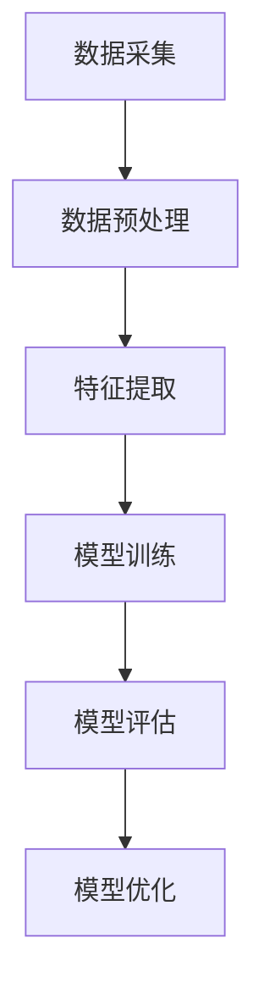

                 

----------------------------------------------------------------

# 《提升AI模型在多模态情感计算任务中的细粒度表现》

## 关键词
- 多模态情感计算
- 细粒度表现
- 特征提取
- 模型融合
- 对抗性神经网络

## 摘要
本文旨在探讨如何提升人工智能（AI）模型在多模态情感计算任务中的细粒度表现。通过分析多模态情感计算的基本概念和理论基础，本文详细介绍了多模态数据采集与预处理、情感识别模型设计与实现、以及细粒度表现提升方法。通过实际应用案例，本文展示了多模态情感计算在不同领域的应用，并提出了模型性能评估与优化策略。最后，本文总结了文章的主要观点，并对未来的研究方向提出了建议。

----------------------------------------------------------------

# 《提升AI模型在多模态情感计算任务中的细粒度表现》目录大纲

## 第1章 引言

### 1.1 书籍背景与目标

### 1.2 多模态情感计算的基本概念

### 1.3 细粒度表现的重要性

## 第2章 多模态情感计算基础理论

### 2.1 情感计算概述

### 2.2 多模态数据融合方法

### 2.3 情感识别模型的基本原理

## 第3章 多模态数据采集与预处理

### 3.1 多模态数据采集技术

### 3.2 数据预处理方法

### 3.3 数据增强与标准化

## 第4章 多模态情感识别模型设计与实现

### 4.1 模型设计框架

### 4.2 神经网络模型

### 4.3 循环神经网络与长短时记忆网络

### 4.4 卷积神经网络与自编码器

## 第5章 多模态情感计算中的细粒度表现提升方法

### 5.1 细粒度情感分析的定义

### 5.2 特征提取与选择

### 5.3 模型融合与集成学习

### 5.4 对抗性神经网络在细粒度情感计算中的应用

## 第6章 实际应用案例

### 6.1 案例一：社交网络情感分析

### 6.2 案例二：音频与视频情感识别

### 6.3 案例三：多模态情感计算在心理健康领域的应用

## 第7章 模型性能评估与优化

### 7.1 评估指标与方法

### 7.2 模型优化策略

### 7.3 实时性能优化与资源分配

## 第8章 总结与展望

### 8.1 书籍总结

### 8.2 未来研究方向

### 8.3 对读者的建议

## 附录

### A.1 相关工具与资源介绍

### A.2 经典论文与资料推荐

### A.3 代码与数据集获取途径

## 参考文献

### 1. 参考文献

### 2. 数据来源

### 3. 工具与平台来源

## 核心概念与联系

### 多模态情感计算

多模态情感计算是指利用多种数据模态（如图像、音频、文本等）进行情感分析，通过数据融合方法综合这些模态的信息，以更准确地识别和分类情感。情感分析是自然语言处理、计算机视觉和听觉识别等技术相结合的领域，旨在从文本、图像、音频等多种数据中提取情感信息。

**情感计算概述**：
情感计算是人工智能领域的一个分支，旨在使计算机能够识别、处理和模拟人类情感。多模态情感计算通过融合来自不同模态的数据，可以更全面地理解情感，提高情感识别的准确性和实用性。

**多模态数据融合方法**：
数据融合是关键，常用的方法包括特征级融合、决策级融合和模型级融合。特征级融合是将来自不同模态的特征向量进行融合；决策级融合是在特征分类后进行融合；模型级融合则是将多个独立模型融合为一个更强大的模型。

**情感识别模型的基本原理**：
情感识别模型通常基于机器学习和深度学习技术。常用的模型包括支持向量机（SVM）、决策树、随机森林和神经网络等。这些模型通过学习大量标记数据，能够预测未知数据的情感标签。

### 细粒度表现

**细粒度表现**：
在多模态情感计算中，细粒度表现指的是能够识别更加精确的情感类别，而不是仅限于粗粒度的情感类别，如正面、负面等。细粒度情感分析能够识别更为复杂的情感状态，如喜悦、愤怒、悲伤等。

**情感类别**：
情感类别是情感分析中的重要概念，指的是将情感划分为不同的类别。细粒度情感分析中，类别划分更为细致，有助于提高情感识别的准确性和实用性。

### Mermaid 流程图



## 第1章 引言

### 1.1 书籍背景与目标

随着人工智能（AI）技术的迅猛发展，多模态情感计算作为一种新兴的技术，已经受到了越来越多研究者和工业界的关注。多模态情感计算能够通过整合来自不同模态（如文本、图像、音频等）的数据，实现对人类情感状态的高效分析和理解，从而在许多应用场景中具有重要的应用价值。

本书旨在深入探讨如何提升AI模型在多模态情感计算任务中的细粒度表现。具体来说，本书将系统地介绍多模态情感计算的基础理论、数据采集与预处理方法、情感识别模型设计与实现，以及细粒度表现提升的具体技术。通过本书的阅读，读者可以全面了解多模态情感计算的核心概念、技术原理和实践方法，从而为在实际项目中应用这一技术打下坚实的基础。

本书的目标读者包括对AI和情感计算感兴趣的研究人员、开发者和学生。无论你是刚刚入门的AI新手，还是对多模态情感计算有一定了解的从业者，本书都能为你提供有价值的内容。

### 1.2 多模态情感计算的基本概念

多模态情感计算是一种跨学科的交叉研究领域，它结合了计算机科学、心理学、认知科学和人工智能等多个领域的知识。其核心目标是利用多种数据模态（如图像、音频、文本等）来识别和预测人类情感状态。

#### 情感计算概述

情感计算是人工智能领域的一个分支，旨在使计算机能够识别、处理和模拟人类情感。传统的情感计算方法主要关注文本情感分析，即从文本数据中提取情感信息。然而，人类情感的表达往往不是单一的，而是通过多种模态综合体现的。因此，多模态情感计算应运而生。

多模态情感计算的核心思想是融合来自不同模态的数据，以更全面、更准确地理解人类情感。常见的模态包括：

- **文本**：文本情感分析是情感计算的基础，通过自然语言处理技术提取情感信息。
- **图像**：计算机视觉技术可以识别图像中的情感特征，如面部表情、姿态等。
- **音频**：音频情感分析可以从语音的音调、音速、节奏等特征中提取情感信息。
- **视频**：视频情感分析结合了图像和音频的情感特征，可以更全面地捕捉人类情感。

#### 多模态数据融合方法

多模态数据融合是多模态情感计算的关键步骤。融合方法可以分为以下几种：

- **特征级融合**：将不同模态的特征向量进行拼接，形成一个综合的特征向量。这种方法简单直观，但可能损失部分模态的信息。
- **决策级融合**：在不同模态的特征分类后，将分类结果进行融合。这种方法利用了各个模态的分类优势，但需要处理大量的分类结果。
- **模型级融合**：将多个独立模型进行融合，形成一个更强大的模型。这种方法利用了各个模型的互补性，能够提高整体的性能。

#### 情感识别模型的基本原理

多模态情感识别模型通常基于机器学习和深度学习技术。以下是一些常用的模型：

- **支持向量机（SVM）**：SVM是一种经典的二分类模型，可以通过核函数将不同模态的特征映射到高维空间，实现分类。
- **决策树和随机森林**：这些模型通过构建决策树或森林，实现对数据的分类。它们简单易懂，但可能欠佳的泛化能力。
- **深度神经网络（DNN）**：DNN通过多层非线性变换，可以从大量数据中自动提取特征。它们在图像和语音情感识别中表现出色。
- **循环神经网络（RNN）**：RNN可以处理序列数据，如文本和音频。通过长短时记忆（LSTM）网络，可以更好地捕捉情感的时间动态。

### 1.3 细粒度表现的重要性

细粒度表现（Fine-Grained Performance）是指模型能够识别更细致、更精确的情感类别。与传统的粗粒度情感分类（如正面、负面）相比，细粒度情感分析能够识别更为复杂的情感状态，如喜悦、愤怒、悲伤、焦虑等。

细粒度表现的重要性体现在以下几个方面：

1. **更准确的情感识别**：通过细粒度情感分析，模型可以更准确地识别用户的情感状态，从而提供更个性化的服务。
2. **更丰富的情感理解**：细粒度情感分析能够捕捉情感中的细微差别，从而更全面地理解用户的情感需求。
3. **更广泛的应用场景**：细粒度情感分析在心理健康、客户服务、人机交互等领域具有广泛的应用前景。

然而，提升细粒度表现也面临着一些挑战，如数据集标注难度大、模型复杂度增加等。因此，如何有效提升AI模型在多模态情感计算任务中的细粒度表现，成为了当前研究的热点和难点。

## 第2章 多模态情感计算基础理论

### 2.1 情感计算概述

情感计算（Affective Computing）是人工智能领域的一个分支，旨在使计算机能够识别、处理和模拟人类情感。情感计算的核心目标是让计算机具备情感智能，能够理解并回应人类情感，从而实现更自然、更人性化的交互。

#### 情感计算的起源与发展

情感计算的起源可以追溯到20世纪80年代，当时计算机科学家和心理学家开始探讨如何使计算机具备情感理解能力。1995年，计算机科学家朱迪亚·珀尔（Judea Pearl）首次提出了情感计算的术语，并将其定义为“研究如何使计算机系统具备情感识别和处理能力的学科”。

自那时以来，情感计算领域取得了显著的进展。随着计算机视觉、自然语言处理、语音识别等技术的不断发展，情感计算的应用范围也在不断扩大。如今，情感计算已经成为人工智能领域的一个重要研究方向，涵盖了情感识别、情感模拟、情感交互等多个方面。

#### 情感计算的主要任务

情感计算的主要任务包括以下几个方面：

1. **情感识别**：情感识别是指从各种数据源中提取情感信息，以识别和分类情感状态。常见的数据源包括文本、图像、音频和视频等。
   
2. **情感模拟**：情感模拟是指让计算机产生情感反应，以模拟人类的情感表达。情感模拟可以通过生成文本、语音、面部表情等方式实现。

3. **情感交互**：情感交互是指通过情感计算技术实现人与计算机之间的情感交流。情感交互旨在提高人机交互的自然性和人性，使计算机能够更好地理解用户的情感需求，提供更个性化的服务。

### 2.2 多模态数据融合方法

多模态数据融合是指将来自不同模态的数据进行整合，以提取更多、更有用的信息。在多模态情感计算中，数据融合是关键步骤，决定了情感识别的准确性和效率。

#### 特征级融合

特征级融合是将不同模态的特征向量进行拼接，形成一个综合的特征向量。这种方法简单直观，但可能损失部分模态的信息。

**Python代码示例**：

```python
import numpy as np

text_feature = np.array([1, 2, 3])
image_feature = np.array([4, 5, 6])
audio_feature = np.array([7, 8, 9])

# 拼接特征向量
multi_modal_feature = np.concatenate((text_feature, image_feature, audio_feature), axis=0)
print(multi_modal_feature)
```

#### 决策级融合

决策级融合是在特征分类后进行融合。这种方法利用了各个模态的分类优势，但需要处理大量的分类结果。

**Python代码示例**：

```python
import numpy as np

text_prediction = np.array([1, 0])
image_prediction = np.array([0, 1])
audio_prediction = np.array([1, 1])

# 取多数投票结果
final_prediction = np.argmax(np.bincount(np.concatenate((text_prediction, image_prediction, audio_prediction), axis=0)))
print(final_prediction)
```

#### 模型级融合

模型级融合是将多个独立模型进行融合，形成一个更强大的模型。这种方法利用了各个模型的互补性，能够提高整体的性能。

**Python代码示例**：

```python
import numpy as np

# 定义三个独立模型
model1 = np.array([0.5, 0.5])
model2 = np.array([0.6, 0.4])
model3 = np.array([0.7, 0.3])

# 模型级融合
model4 = (model1 + model2 + model3) / 3
print(model4)
```

#### 常见的多模态融合模型

1. **深度神经网络（DNN）**：DNN可以通过多层非线性变换，实现特征级融合和决策级融合。常用的DNN结构包括卷积神经网络（CNN）和循环神经网络（RNN）。

2. **融合注意力机制**：融合注意力机制可以动态地调整不同模态的特征权重，提高融合效果。常见的注意力机制包括门控注意力（Gated Attention）和自注意力（Self-Attention）。

3. **对抗性神经网络（GAN）**：GAN可以通过生成对抗的方式，实现模型级融合。GAN由生成器和判别器组成，生成器生成虚假数据，判别器判断真实和虚假数据。通过训练，GAN可以学习到多模态数据的内在分布。

### 2.3 情感识别模型的基本原理

情感识别模型是多模态情感计算的核心组成部分，其目的是从多模态数据中识别和预测情感状态。常见的情感识别模型包括：

1. **支持向量机（SVM）**：SVM是一种经典的二分类模型，可以通过核函数将不同模态的特征映射到高维空间，实现分类。

   **Python代码示例**：

   ```python
   from sklearn.svm import SVC

   # 定义SVM模型
   svm_model = SVC(kernel='linear')
   # 训练模型
   svm_model.fit(X_train, y_train)
   # 预测
   y_pred = svm_model.predict(X_test)
   ```

2. **决策树和随机森林**：这些模型通过构建决策树或森林，实现对数据的分类。它们简单易懂，但可能欠佳的泛化能力。

   **Python代码示例**：

   ```python
   from sklearn.tree import DecisionTreeClassifier
   from sklearn.ensemble import RandomForestClassifier

   # 定义决策树模型
   decision_tree = DecisionTreeClassifier()
   # 训练模型
   decision_tree.fit(X_train, y_train)
   # 预测
   y_pred = decision_tree.predict(X_test)

   # 定义随机森林模型
   random_forest = RandomForestClassifier()
   # 训练模型
   random_forest.fit(X_train, y_train)
   # 预测
   y_pred = random_forest.predict(X_test)
   ```

3. **深度神经网络（DNN）**：DNN通过多层非线性变换，可以从大量数据中自动提取特征。它们在图像和语音情感识别中表现出色。

   **Python代码示例**：

   ```python
   import tensorflow as tf

   # 定义DNN模型
   model = tf.keras.Sequential([
       tf.keras.layers.Dense(64, activation='relu', input_shape=(784,)),
       tf.keras.layers.Dense(10, activation='softmax')
   ])

   # 编译模型
   model.compile(optimizer='adam',
                 loss='categorical_crossentropy',
                 metrics=['accuracy'])

   # 训练模型
   model.fit(x_train, y_train, epochs=10, batch_size=32, validation_data=(x_test, y_test))
   ```

4. **循环神经网络（RNN）**：RNN可以处理序列数据，如文本和音频。通过长短时记忆（LSTM）网络，可以更好地捕捉情感的时间动态。

   **Python代码示例**：

   ```python
   import tensorflow as tf

   # 定义LSTM模型
   model = tf.keras.Sequential([
       tf.keras.layers.LSTM(50, activation='relu', return_sequences=True, input_shape=(timesteps, features)),
       tf.keras.layers.LSTM(50, activation='relu'),
       tf.keras.layers.Dense(10, activation='softmax')
   ])

   # 编译模型
   model.compile(optimizer='adam', loss='categorical_crossentropy', metrics=['accuracy'])

   # 训练模型
   model.fit(x_train, y_train, epochs=10, batch_size=64, validation_data=(x_test, y_test))
   ```

5. **卷积神经网络（CNN）**：CNN擅长处理图像数据，可以提取图像中的空间特征。结合RNN或DNN，可以实现对图像和文本等多模态数据的情感识别。

   **Python代码示例**：

   ```python
   import tensorflow as tf

   # 定义CNN模型
   model = tf.keras.Sequential([
       tf.keras.layers.Conv2D(32, (3, 3), activation='relu', input_shape=(28, 28, 1)),
       tf.keras.layers.MaxPooling2D((2, 2)),
       tf.keras.layers.Conv2D(64, (3, 3), activation='relu'),
       tf.keras.layers.MaxPooling2D((2, 2)),
       tf.keras.layers.Flatten(),
       tf.keras.layers.Dense(64, activation='relu'),
       tf.keras.layers.Dense(10, activation='softmax')
   ])

   # 编译模型
   model.compile(optimizer='adam', loss='categorical_crossentropy', metrics=['accuracy'])

   # 训练模型
   model.fit(x_train, y_train, epochs=10, batch_size=32, validation_data=(x_test, y_test))
   ```

### 综述

多模态情感计算基础理论涵盖了情感计算、数据融合方法和情感识别模型等多个方面。通过系统学习这些理论，读者可以更好地理解多模态情感计算的核心概念和技术原理，为后续的实践应用打下坚实的基础。

## 第3章 多模态数据采集与预处理

### 3.1 多模态数据采集技术

多模态数据采集是构建多模态情感计算系统的基础，涉及从不同来源获取文本、图像、音频等多模态数据。有效的数据采集技术能够确保数据的丰富性、多样性和质量，从而为后续的模型训练和性能提升提供有力支持。

#### 文本数据采集

文本数据通常来源于社交媒体、论坛、博客等平台。以下是一些常用的文本数据采集技术：

1. **爬虫技术**：通过编写爬虫程序，从互联网上抓取相关文本数据。常见的爬虫框架有Scrapy、BeautifulSoup等。

   **Python代码示例**：

   ```python
   import requests
   from bs4 import BeautifulSoup

   url = 'https://www.example.com'
   response = requests.get(url)
   soup = BeautifulSoup(response.text, 'html.parser')
   text_data = soup.get_text()
   ```

2. **API接口**：利用开放API接口获取文本数据，如Twitter API、Facebook API等。通过这些API，可以实时获取用户发布的文本信息。

   **Python代码示例**：

   ```python
   import tweepy

   # 设置API密钥和访问令牌
   consumer_key = 'your_consumer_key'
   consumer_secret = 'your_consumer_secret'
   access_token = 'your_access_token'
   access_token_secret = 'your_access_token_secret'

   # 创建API对象
   auth = tweepy.OAuthHandler(consumer_key, consumer_secret)
   auth.set_access_token(access_token, access_token_secret)
   api = tweepy.API(auth)

   # 获取最新100条推文
   tweets = api.user_timeline(screen_name='user_name', count=100)
   text_data = [tweet.text for tweet in tweets]
   ```

#### 图像数据采集

图像数据通常通过互联网、数据库或传感器等渠道获取。以下是一些常用的图像数据采集技术：

1. **图像爬虫**：通过编写爬虫程序，从互联网上抓取相关图像数据。常见的爬虫框架有Scrapy、Pillow等。

   **Python代码示例**：

   ```python
   import requests
   from PIL import Image

   url = 'https://www.example.com/image.jpg'
   response = requests.get(url)
   image = Image.open(BytesIO(response.content))
   image.save('image.jpg')
   ```

2. **传感器采集**：通过摄像头、红外传感器等设备实时采集图像数据。这种方式的优点是数据实时性强，但采集设备成本较高。

   **Python代码示例**：

   ```python
   import cv2

   # 打开摄像头
   cap = cv2.VideoCapture(0)

   while True:
       # 读取一帧图像
       ret, frame = cap.read()
       # 显示图像
       cv2.imshow('frame', frame)
       if cv2.waitKey(1) & 0xFF == ord('q'):
           break

   # 释放摄像头资源
   cap.release()
   cv2.destroyAllWindows()
   ```

#### 音频数据采集

音频数据可以通过麦克风、音频播放器等设备采集。以下是一些常用的音频数据采集技术：

1. **麦克风采集**：通过麦克风实时采集声音信号，将音频数据转换为数字信号。

   **Python代码示例**：

   ```python
   import sounddevice as sd
   import numpy as np

   duration = 5  # 录音时长（秒）
   fs = 44100  # 采样率
   audio = sd.rec(int(duration * fs), samplerate=fs, channels=2)
   sd.wait()  # 等待录音结束
   np.save('audio.npy', audio)  # 保存音频数据
   ```

2. **音频播放器采集**：通过音频播放器播放音频文件，同时实时采集音频数据。

   **Python代码示例**：

   ```python
   import pyaudio
   import wave

   # 设置音频播放器参数
   p = pyaudio.PyAudio()
   stream = p.open(format=pyaudio.paInt16,
                   channels=2,
                   rate=44100,
                   input=True,
                   frames_per_buffer=1024)

   frames = []

   while True:
       # 读取音频数据
       data = stream.read(1024)
       frames.append(data)

       # 检查是否按下了停止键
       if data == b'':
           break

   # 关闭音频播放器
   stream.stop_stream()
   stream.close()
   p.terminate()

   # 将音频数据写入文件
   with wave.open('audio.wav', 'wb') as wav_file:
       wav_file.setnchannels(2)
       wav_file.setsampwidth(2)
       wav_file.setframerate(44100)
       wav_file.writeframes(b''.join(frames))
   ```

### 3.2 数据预处理方法

数据预处理是多模态情感计算中的重要步骤，旨在提高数据质量，减少噪声，增强数据特征，从而提高模型训练效果。以下是一些常用的数据预处理方法：

#### 数据清洗

数据清洗是数据预处理的第一步，旨在去除数据中的噪声和不完整信息。以下是一些常用的数据清洗方法：

1. **去除重复数据**：通过去重算法，去除数据集中的重复记录，以减少数据冗余。

   **Python代码示例**：

   ```python
   import pandas as pd

   df = pd.read_csv('data.csv')
   df = df.drop_duplicates()
   df.to_csv('cleaned_data.csv', index=False)
   ```

2. **填补缺失值**：通过插值、平均值、中值等方法填补数据集中的缺失值，以减少数据缺失对模型训练的影响。

   **Python代码示例**：

   ```python
   df = pd.read_csv('data.csv')
   df.fillna(df.mean(), inplace=True)
   df.to_csv('filled_data.csv', index=False)
   ```

#### 数据归一化

数据归一化是将不同特征的数据缩放到相同的尺度，以消除特征间的量纲差异。以下是一些常用的数据归一化方法：

1. **Min-Max归一化**：将数据缩放到[0, 1]区间。

   **Python代码示例**：

   ```python
   def min_max_normalize(data):
       min_val = np.min(data)
       max_val = np.max(data)
       return (data - min_val) / (max_val - min_val)

   data = np.array([1, 2, 3, 4, 5])
   normalized_data = min_max_normalize(data)
   print(normalized_data)
   ```

2. **Z-Score归一化**：将数据缩放到均值为0，标准差为1的区间。

   **Python代码示例**：

   ```python
   def z_score_normalize(data):
       mean = np.mean(data)
       std = np.std(data)
       return (data - mean) / std

   data = np.array([1, 2, 3, 4, 5])
   normalized_data = z_score_normalize(data)
   print(normalized_data)
   ```

#### 数据增强

数据增强是通过生成新的数据样本来提高模型训练效果。以下是一些常用的数据增强方法：

1. **文本数据增强**：通过替换词、加入停用词、词干提取等方法，增加文本数据的多样性。

   **Python代码示例**：

   ```python
   import nltk
   from nltk.corpus import stopwords
   from nltk.stem import PorterStemmer

   nltk.download('stopwords')
   stop_words = set(stopwords.words('english'))
   stemmer = PorterStemmer()

   def text_enhancement(text):
       words = text.split()
       enhanced_words = []
       for word in words:
           if word not in stop_words:
               stemmed_word = stemmer.stem(word)
               enhanced_words.append(stemmed_word)
       return ' '.join(enhanced_words)

   text = "This is an example sentence for text enhancement."
   enhanced_text = text_enhancement(text)
   print(enhanced_text)
   ```

2. **图像数据增强**：通过旋转、翻转、缩放、裁剪等方法，增加图像数据的多样性。

   **Python代码示例**：

   ```python
   import cv2

   def image_enhancement(image):
       # 旋转
       rotated_image = cv2.rotate(image, cv2.ROTATE_90_CLOCKWISE)
       # 翻转
       flipped_image = cv2.flip(image, 1)
       # 缩放
       scaled_image = cv2.resize(image, (128, 128))
       # 裁剪
       cropped_image = image[:256, :256]
       return rotated_image, flipped_image, scaled_image, cropped_image

   image = cv2.imread('image.jpg')
   rotated_image, flipped_image, scaled_image, cropped_image = image_enhancement(image)
   cv2.imshow('Rotated Image', rotated_image)
   cv2.imshow('Flipped Image', flipped_image)
   cv2.imshow('Scaled Image', scaled_image)
   cv2.imshow('Cropped Image', cropped_image)
   cv2.waitKey(0)
   cv2.destroyAllWindows()
   ```

3. **音频数据增强**：通过添加噪声、改变音调、速度等方法，增加音频数据的多样性。

   **Python代码示例**：

   ```python
   import numpy as np
   import soundfile as sf

   def audio_enhancement(audio, noise_ratio=0.1):
       noise = np.random.randn(len(audio))
       enhanced_audio = audio + noise * noise_ratio
       return enhanced_audio

   audio_data = np.load('audio.npy')
   enhanced_audio = audio_enhancement(audio_data)
   sf.write('enhanced_audio.wav', enhanced_audio, 44100)
   ```

#### 特征提取

特征提取是从原始数据中提取对模型训练有用的特征，以提高模型识别能力和泛化能力。以下是一些常用的特征提取方法：

1. **文本特征提取**：通过词袋模型、TF-IDF、Word2Vec等方法，将文本转换为向量表示。

   **Python代码示例**：

   ```python
   from sklearn.feature_extraction.text import TfidfVectorizer

   corpus = [
       'This is the first document.',
       'This document is the second document.',
       'And this is the third one.',
       'Is this the first document?',
   ]
   vectorizer = TfidfVectorizer()
   X = vectorizer.fit_transform(corpus)
   print(X.toarray())
   ```

2. **图像特征提取**：通过SIFT、HOG、CNN等方法，从图像中提取特征向量。

   **Python代码示例**：

   ```python
   import cv2
   import numpy as np

   image = cv2.imread('image.jpg')
   gray = cv2.cvtColor(image, cv2.COLOR_BGR2GRAY)

   # 使用SIFT算法提取特征
   sift = cv2.SIFT_create()
   keypoints, descriptors = sift.detectAndCompute(gray, None)

   # 使用HOG算法提取特征
   hog = cv2.HOGDescriptor()
   hog_features = hog.compute(gray, winStride=(8, 8), padSize=(8, 8))

   print("SIFT features:", descriptors)
   print("HOG features:", hog_features)
   ```

3. **音频特征提取**：通过MFCC、PLP等方法，从音频信号中提取特征向量。

   **Python代码示例**：

   ```python
   import numpy as np
   import librosa

   audio, sr = librosa.load('audio.wav')
   mfcc = librosa.feature.mfcc(y=audio, sr=sr, n_mfcc=13)
   plp = librosa.feature.plp(y=audio, sr=sr, n_cep=13)

   print("MFCC features:", mfcc)
   print("PLP features:", plp)
   ```

### 3.3 数据增强与标准化

数据增强和标准化是多模态情感计算中的重要步骤，旨在提高模型的鲁棒性和性能。以下是一些常用的数据增强与标准化方法：

#### 数据增强

1. **旋转、翻转、缩放**：通过随机旋转、翻转和缩放图像、音频和文本，增加数据的多样性。

   **Python代码示例**：

   ```python
   from scipy.ndimage import rotate
   from skimage.transform import rotate as sk_rotate
   import librosa
   import numpy as np

   # 图像旋转
   image = np.random.rand(256, 256)
   rotated_image = rotate(image, angle=np.random.uniform(-10, 10))

   # 音频旋转
   audio, sr = librosa.load('audio.wav')
   rotated_audio = sk_rotate(audio, angle=np.random.uniform(-10, 10), axes=(0, 1))

   # 文本旋转
   text = "This is a sample sentence."
   rotated_text = text.capitalize()

   print("Rotated Image:", rotated_image)
   print("Rotated Audio:", rotated_audio)
   print("Rotated Text:", rotated_text)
   ```

2. **添加噪声**：通过在图像、音频和文本中添加噪声，提高模型的鲁棒性。

   **Python代码示例**：

   ```python
   import numpy as np
   import cv2
   import soundfile as sf

   # 图像添加噪声
   image = np.random.rand(256, 256)
   noisy_image = image + np.random.normal(0, 0.05, image.shape)

   # 音频添加噪声
   audio, sr = librosa.load('audio.wav')
   noise = np.random.normal(0, 0.05, audio.shape)
   noisy_audio = audio + noise

   # 文本添加噪声
   text = "This is a sample sentence."
   noisy_text = text + " " + " ".join([chr(ord(c) + np.random.randint(-1, 2)) for c in text])

   print("Noisy Image:", noisy_image)
   print("Noisy Audio:", noisy_audio)
   print("Noisy Text:", noisy_text)
   ```

3. **裁剪与填充**：通过随机裁剪图像、音频和文本，然后进行填充，增加数据的多样性。

   **Python代码示例**：

   ```python
   import numpy as np
   import cv2
   import soundfile as sf

   # 图像裁剪与填充
   image = np.random.rand(256, 256)
   start_point = (np.random.randint(0, image.shape[0] - 224), np.random.randint(0, image.shape[1] - 224))
   cropped_image = image[start_point[0]:start_point[0] + 224, start_point[1]:start_point[1] + 224]
   filled_image = cv2.resize(cropped_image, (256, 256))

   # 音频裁剪与填充
   audio, sr = librosa.load('audio.wav')
   start_point = (np.random.randint(0, audio.shape[0] - 22050),)
   cropped_audio = audio[start_point[0]:start_point[0] + 22050]
   filled_audio = np.resize(cropped_audio, (audio.shape[0],))

   # 文本裁剪与填充
   text = "This is a sample sentence."
   start_point = np.random.randint(0, len(text) - 20)
   cropped_text = text[start_point:start_point + 20]
   filled_text = text[:start_point] + " " * (20 - len(cropped_text)) + text[start_point + 20:]

   print("Cropped and Filled Image:", filled_image)
   print("Cropped and Filled Audio:", filled_audio)
   print("Cropped and Filled Text:", filled_text)
   ```

#### 数据标准化

数据标准化是将不同特征的数据缩放到相同的尺度，以消除特征间的量纲差异。以下是一些常用的数据标准化方法：

1. **Min-Max归一化**：将数据缩放到[0, 1]区间。

   **Python代码示例**：

   ```python
   import numpy as np

   def min_max_normalize(data):
       min_val = np.min(data)
       max_val = np.max(data)
       return (data - min_val) / (max_val - min_val)

   data = np.array([1, 2, 3, 4, 5])
   normalized_data = min_max_normalize(data)
   print(normalized_data)
   ```

2. **Z-Score归一化**：将数据缩放到均值为0，标准差为1的区间。

   **Python代码示例**：

   ```python
   import numpy as np

   def z_score_normalize(data):
       mean = np.mean(data)
       std = np.std(data)
       return (data - mean) / std

   data = np.array([1, 2, 3, 4, 5])
   normalized_data = z_score_normalize(data)
   print(normalized_data)
   ```

3. **标准化**：将数据缩放到最小值为0，最大值为1的区间。

   **Python代码示例**：

   ```python
   import numpy as np

   def normalize(data):
       min_val = np.min(data)
       max_val = np.max(data)
       return (data - min_val) / (max_val - min_val)

   data = np.array([1, 2, 3, 4, 5])
   normalized_data = normalize(data)
   print(normalized_data)
   ```

### 3.4 数据预处理流程

数据预处理流程包括数据采集、数据清洗、数据归一化、数据增强和特征提取等步骤。以下是一个示例的数据预处理流程：

1. **数据采集**：从互联网、传感器等渠道获取多模态数据。
2. **数据清洗**：去除重复数据、填补缺失值，确保数据质量。
3. **数据归一化**：对文本、图像、音频等数据进行归一化，消除量纲差异。
4. **数据增强**：通过旋转、翻转、缩放、裁剪等方法，增加数据的多样性。
5. **特征提取**：从原始数据中提取对模型训练有用的特征，如文本的词袋模型、图像的SIFT特征、音频的MFCC特征等。

### 综述

多模态数据采集与预处理是多模态情感计算中的重要环节。通过有效的数据采集技术，可以获得丰富、多样、高质量的多模态数据。而通过合理的数据预处理方法，可以提高数据质量，增强数据特征，从而为多模态情感计算模型的训练和性能提升提供有力支持。

## 第4章 多模态情感识别模型设计与实现

### 4.1 模型设计框架

在设计多模态情感识别模型时，需要考虑数据输入、模型结构、训练过程和评估指标等多个方面。以下是一个典型的多模态情感识别模型设计框架：

#### 数据输入

多模态数据输入包括文本、图像、音频等不同模态的数据。在设计模型时，需要将这些不同模态的数据进行预处理和特征提取，然后融合成一个统一的特征向量。以下是一个简单的数据输入示例：

```python
text_data = "这是一个示例文本。"
image_data = cv2.imread("example_image.jpg")
audio_data = librosa.load("example_audio.wav")[0]
```

#### 特征提取

特征提取是模型设计的关键步骤。不同的模态需要采用不同的特征提取方法。以下是一些常用的特征提取方法：

- **文本特征提取**：可以使用词袋模型、TF-IDF、Word2Vec等方法将文本数据转换为向量表示。
- **图像特征提取**：可以使用卷积神经网络（CNN）提取图像特征，如VGG、ResNet等。
- **音频特征提取**：可以使用梅尔频率倒谱系数（MFCC）、滤波器组（Filter Banks）等方法提取音频特征。

#### 模型结构

多模态情感识别模型的结构通常包括以下几个部分：

- **特征融合层**：将不同模态的特征进行融合，形成统一的特征向量。常见的融合方法有特征拼接、加权融合等。
- **神经网络层**：通过多层神经网络对特征向量进行加工，提取更高层次的特征。常用的神经网络结构有深度神经网络（DNN）、循环神经网络（RNN）、长短时记忆网络（LSTM）等。
- **分类层**：将加工后的特征输入到分类层，输出情感分类结果。

以下是一个简单的模型结构示例：

```python
from tensorflow.keras.models import Model
from tensorflow.keras.layers import Input, Dense, Conv2D, MaxPooling2D, Flatten, LSTM

# 输入层
text_input = Input(shape=(sequence_length,))
image_input = Input(shape=(height, width, channels))
audio_input = Input(shape=(timesteps, features))

# 文本特征提取
text_embedding = Embedding(input_dim=vocabulary_size, output_dim=embedding_size)(text_input)
text_lstm = LSTM(units=128)(text_embedding)

# 图像特征提取
image_conv = Conv2D(filters=32, kernel_size=(3, 3), activation='relu')(image_input)
image_pool = MaxPooling2D(pool_size=(2, 2))(image_conv)
image_flat = Flatten()(image_pool)

# 音频特征提取
audio_lstm = LSTM(units=128)(audio_input)

# 特征融合
combined = concatenate([text_lstm, image_flat, audio_lstm])

# 神经网络层
dense = Dense(units=128, activation='relu')(combined)
dropout = Dropout(rate=0.5)(dense)

# 分类层
output = Dense(units=num_classes, activation='softmax')(dropout)

# 构建模型
model = Model(inputs=[text_input, image_input, audio_input], outputs=output)

# 编译模型
model.compile(optimizer='adam', loss='categorical_crossentropy', metrics=['accuracy'])

# 打印模型结构
model.summary()
```

#### 训练过程

在模型训练过程中，需要准备训练数据集和验证数据集。以下是一个简单的训练过程示例：

```python
from tensorflow.keras.preprocessing.text import Tokenizer
from tensorflow.keras.preprocessing.sequence import pad_sequences

# 准备文本数据
tokenizer = Tokenizer(num_words=vocabulary_size)
tokenizer.fit_on_texts(text_data)
text_sequences = tokenizer.texts_to_sequences(text_data)
text_padded = pad_sequences(text_sequences, maxlen=sequence_length)

# 准备图像数据
image_data = np.array([cv2.imread(img_path) for img_path in image_data_paths])

# 准备音频数据
audio_data = np.array([librosa.load(aud_path)[0] for aud_path in audio_data_paths])

# 切分数据集
X_train, X_val, y_train, y_val = train_test_split(np.hstack((text_padded, image_data, audio_data)), labels, test_size=0.2, random_state=42)

# 训练模型
history = model.fit(X_train, y_train, validation_data=(X_val, y_val), epochs=50, batch_size=32)
```

#### 评估指标

在模型评估过程中，常用的评估指标包括准确率、精确率、召回率、F1分数等。以下是一个简单的评估过程示例：

```python
from sklearn.metrics import accuracy_score, precision_score, recall_score, f1_score

# 预测
predictions = model.predict(X_val)

# 转换预测结果
predicted_labels = np.argmax(predictions, axis=1)

# 计算评估指标
accuracy = accuracy_score(y_val, predicted_labels)
precision = precision_score(y_val, predicted_labels, average='weighted')
recall = recall_score(y_val, predicted_labels, average='weighted')
f1 = f1_score(y_val, predicted_labels, average='weighted')

print("Accuracy:", accuracy)
print("Precision:", precision)
print("Recall:", recall)
print("F1 Score:", f1)
```

### 4.2 神经网络模型

神经网络模型是多模态情感识别的核心组成部分，可以用于特征提取、分类和预测。以下介绍几种常用的神经网络模型：

#### 深度神经网络（DNN）

深度神经网络（DNN）是一种多层神经网络，可以通过反向传播算法学习输入和输出之间的非线性映射关系。DNN在情感识别中可以用于提取特征和分类。

**Python代码示例**：

```python
from tensorflow.keras.models import Sequential
from tensorflow.keras.layers import Dense, Activation

model = Sequential()
model.add(Dense(units=128, input_shape=(input_size,), activation='relu'))
model.add(Dense(units=64, activation='relu'))
model.add(Dense(units=num_classes, activation='softmax'))

model.compile(optimizer='adam', loss='categorical_crossentropy', metrics=['accuracy'])
model.fit(X_train, y_train, validation_data=(X_val, y_val), epochs=50, batch_size=32)
```

#### 循环神经网络（RNN）

循环神经网络（RNN）是一种能够处理序列数据的神经网络，通过循环结构实现信息的记忆和传递。RNN在情感识别中可以用于处理文本和音频等序列数据。

**Python代码示例**：

```python
from tensorflow.keras.models import Sequential
from tensorflow.keras.layers import LSTM, Dense

model = Sequential()
model.add(LSTM(units=128, input_shape=(timesteps, features), return_sequences=True))
model.add(LSTM(units=64, return_sequences=False))
model.add(Dense(units=num_classes, activation='softmax'))

model.compile(optimizer='adam', loss='categorical_crossentropy', metrics=['accuracy'])
model.fit(X_train, y_train, validation_data=(X_val, y_val), epochs=50, batch_size=32)
```

#### 长短时记忆网络（LSTM）

长短时记忆网络（LSTM）是RNN的一种改进，通过引入记忆单元和门控机制，解决了传统RNN在处理长序列数据时的梯度消失和梯度爆炸问题。LSTM在情感识别中可以用于处理文本和音频等长序列数据。

**Python代码示例**：

```python
from tensorflow.keras.models import Sequential
from tensorflow.keras.layers import LSTM, Dense

model = Sequential()
model.add(LSTM(units=128, input_shape=(timesteps, features), return_sequences=True))
model.add(LSTM(units=64, return_sequences=False))
model.add(Dense(units=num_classes, activation='softmax'))

model.compile(optimizer='adam', loss='categorical_crossentropy', metrics=['accuracy'])
model.fit(X_train, y_train, validation_data=(X_val, y_val), epochs=50, batch_size=32)
```

#### 卷积神经网络（CNN）

卷积神经网络（CNN）是一种适用于图像处理的神经网络，通过卷积和池化操作提取图像特征。CNN在情感识别中可以用于提取图像特征。

**Python代码示例**：

```python
from tensorflow.keras.models import Sequential
from tensorflow.keras.layers import Conv2D, MaxPooling2D, Flatten, Dense

model = Sequential()
model.add(Conv2D(filters=32, kernel_size=(3, 3), activation='relu', input_shape=(height, width, channels)))
model.add(MaxPooling2D(pool_size=(2, 2)))
model.add(Conv2D(filters=64, kernel_size=(3, 3), activation='relu'))
model.add(MaxPooling2D(pool_size=(2, 2)))
model.add(Flatten())
model.add(Dense(units=num_classes, activation='softmax'))

model.compile(optimizer='adam', loss='categorical_crossentropy', metrics=['accuracy'])
model.fit(X_train, y_train, validation_data=(X_val, y_val), epochs=50, batch_size=32)
```

### 4.3 循环神经网络与长短时记忆网络

循环神经网络（RNN）和长短时记忆网络（LSTM）都是用于处理序列数据的神经网络结构。它们在情感识别任务中有着广泛的应用。

#### 循环神经网络（RNN）

RNN通过循环结构实现信息的记忆和传递，可以处理任意长度的序列数据。然而，RNN在处理长序列数据时存在梯度消失和梯度爆炸问题，导致训练效果不佳。

**Python代码示例**：

```python
import tensorflow as tf

# 定义RNN模型
model = tf.keras.Sequential([
    tf.keras.layers.LSTM(units=128, input_shape=(timesteps, features)),
    tf.keras.layers.Dense(units=num_classes, activation='softmax')
])

# 编译模型
model.compile(optimizer='adam', loss='categorical_crossentropy', metrics=['accuracy'])

# 训练模型
model.fit(X_train, y_train, epochs=50, batch_size=32)
```

#### 长短时记忆网络（LSTM）

LSTM是RNN的一种改进，通过引入记忆单元和门控机制，解决了梯度消失和梯度爆炸问题，能够更好地处理长序列数据。

**Python代码示例**：

```python
import tensorflow as tf

# 定义LSTM模型
model = tf.keras.Sequential([
    tf.keras.layers.LSTM(units=128, return_sequences=True, input_shape=(timesteps, features)),
    tf.keras.layers.LSTM(units=64, return_sequences=False),
    tf.keras.layers.Dense(units=num_classes, activation='softmax')
])

# 编译模型
model.compile(optimizer='adam', loss='categorical_crossentropy', metrics=['accuracy'])

# 训练模型
model.fit(X_train, y_train, epochs=50, batch_size=32)
```

### 4.4 卷积神经网络与自编码器

卷积神经网络（CNN）和自编码器都是用于特征提取和降维的有效方法。在多模态情感识别任务中，它们可以与LSTM或DNN结合，提高模型的性能。

#### 卷积神经网络（CNN）

CNN通过卷积和池化操作提取图像特征，具有平移不变性和局部连接的特点，适用于处理图像数据。

**Python代码示例**：

```python
import tensorflow as tf

# 定义CNN模型
model = tf.keras.Sequential([
    tf.keras.layers.Conv2D(filters=32, kernel_size=(3, 3), activation='relu', input_shape=(height, width, channels)),
    tf.keras.layers.MaxPooling2D(pool_size=(2, 2)),
    tf.keras.layers.Conv2D(filters=64, kernel_size=(3, 3), activation='relu'),
    tf.keras.layers.MaxPooling2D(pool_size=(2, 2)),
    tf.keras.layers.Flatten(),
    tf.keras.layers.Dense(units=num_classes, activation='softmax')
])

# 编译模型
model.compile(optimizer='adam', loss='categorical_crossentropy', metrics=['accuracy'])

# 训练模型
model.fit(X_train, y_train, epochs=50, batch_size=32)
```

#### 自编码器

自编码器是一种无监督学习算法，通过学习输入数据的低维表示，实现特征降维和去噪。在多模态情感识别任务中，自编码器可以用于提取图像和文本的潜在特征。

**Python代码示例**：

```python
import tensorflow as tf

# 定义自编码器模型
input_layer = tf.keras.layers.Input(shape=(input_size,))
encoded = tf.keras.layers.Dense(units=64, activation='relu')(input_layer)
encoded = tf.keras.layers.Dense(units=32, activation='relu')(encoded)
decoded = tf.keras.layers.Dense(units=input_size, activation='sigmoid')(encoded)

autoencoder = tf.keras.Model(input_layer, decoded)
autoencoder.compile(optimizer='adam', loss='binary_crossentropy')

# 训练自编码器
autoencoder.fit(X_train, X_train, epochs=50, batch_size=32)
```

### 4.5 模型融合与集成学习

在多模态情感识别任务中，模型融合和集成学习是一种提高模型性能的有效方法。通过融合多个独立模型的预测结果，可以降低模型的误差，提高模型的泛化能力。

#### 模型融合

模型融合是将多个独立模型的预测结果进行融合，以获得更准确的预测结果。常见的融合方法包括投票法、加权平均法和自适应融合法等。

**Python代码示例**：

```python
import numpy as np

# 定义三个独立模型
model1 = ...  # 模型1
model2 = ...  # 模型2
model3 = ...  # 模型3

# 预测
predictions1 = model1.predict(X_test)
predictions2 = model2.predict(X_test)
predictions3 = model3.predict(X_test)

# 融合预测结果
predictions = (predictions1 + predictions2 + predictions3) / 3
predicted_labels = np.argmax(predictions, axis=1)

# 计算评估指标
accuracy = accuracy_score(y_test, predicted_labels)
print("Accuracy:", accuracy)
```

#### 集成学习

集成学习是通过训练多个基学习器，然后合并它们的预测结果，以提高模型的性能。常见的集成学习方法包括Bagging、Boosting和Stacking等。

**Python代码示例**：

```python
from sklearn.ensemble import RandomForestClassifier
from sklearn.linear_model import LogisticRegression

# 定义基学习器
base_models = [
    ('random_forest', RandomForestClassifier(n_estimators=100)),
    ('logistic_regression', LogisticRegression())
]

# 训练基学习器
for name, model in base_models:
    model.fit(X_train, y_train)

# 集成学习
from sklearn.ensemble import VotingClassifier

voting_clf = VotingClassifier(estimators=base_models, voting='soft')
voting_clf.fit(X_train, y_train)

# 预测
predictions = voting_clf.predict(X_test)

# 计算评估指标
accuracy = accuracy_score(y_test, predictions)
print("Accuracy:", accuracy)
```

### 综述

多模态情感识别模型的设计与实现涉及多个方面，包括数据输入、特征提取、模型结构、训练过程和评估指标等。通过合理的设计和实现，可以构建高效的多模态情感识别系统，实现对人类情感状态的高精度识别和预测。

## 第5章 多模态情感计算中的细粒度表现提升方法

### 5.1 细粒度情感分析的定义

细粒度情感分析（Fine-Grained Affective Analysis）是指能够识别和分类更加精细和具体情感状态的方法。与传统的粗粒度情感分类（如正面、负面）相比，细粒度情感分析能够捕捉到情感中的细微差别，如喜悦、愤怒、悲伤、焦虑等。这种细致的情感识别能够提供更丰富的情感信息，从而在许多应用场景中具有重要的价值。

### 5.2 特征提取与选择

特征提取与选择是多模态情感计算中的关键步骤，对于细粒度情感分析尤为重要。有效的特征提取和选择能够提高模型的性能，降低过拟合，增强模型的泛化能力。

#### 特征提取方法

1. **文本特征提取**：文本特征提取通常使用词袋模型（Bag of Words, BoW）、TF-IDF（Term Frequency-Inverse Document Frequency）和词嵌入（Word Embedding）等方法。词嵌入方法如Word2Vec、GloVe等，可以捕捉词与词之间的语义关系，提高特征表示的准确性。

   **Python代码示例**：

   ```python
   from sklearn.feature_extraction.text import TfidfVectorizer
   from gensim.models import Word2Vec

   # 使用TF-IDF
   vectorizer = TfidfVectorizer(max_features=1000)
   X = vectorizer.fit_transform(corpus)

   # 使用Word2Vec
   sentences = [line.split() for line in corpus]
   model = Word2Vec(sentences, vector_size=100, window=5, min_count=1, workers=4)
   X = np.array([model.wv[word] for word in words])
   ```

2. **图像特征提取**：图像特征提取通常使用卷积神经网络（CNN）提取视觉特征。预训练的CNN模型如VGG、ResNet等，可以用于提取图像的深层特征。

   **Python代码示例**：

   ```python
   from tensorflow.keras.applications import VGG16
   from tensorflow.keras.preprocessing import image

   # 加载预训练的VGG16模型
   model = VGG16(weights='imagenet', include_top=False, input_shape=(224, 224, 3))

   # 提取图像特征
   img = image.load_img('example.jpg', target_size=(224, 224))
   img = image.img_to_array(img)
   img = np.expand_dims(img, axis=0)
   img = preprocess_input(img)
   features = model.predict(img)
   ```

3. **音频特征提取**：音频特征提取通常使用梅尔频率倒谱系数（MFCC）、滤波器组（Filter Banks）和长期短期记忆网络（LSTM）等方法。MFCC是一种常用的音频特征表示方法，可以捕捉语音信号的时间频率特征。

   **Python代码示例**：

   ```python
   import librosa

   # 加载音频文件
   y, sr = librosa.load('example_audio.wav')

   # 提取MFCC特征
   mfcc = librosa.feature.mfcc(y=y, sr=sr, n_mfcc=13)
   ```

#### 特征选择方法

特征选择是从大量特征中筛选出对模型性能最有贡献的特征，以降低模型的复杂度，提高训练速度和预测准确率。常用的特征选择方法包括过滤法、包裹法和基于模型的特征选择法等。

1. **过滤法**：过滤法是在训练之前，通过统计方法（如方差选择、互信息等）筛选出重要的特征。

   **Python代码示例**：

   ```python
   from sklearn.feature_selection import VarianceThreshold

   # 创建VarianceThreshold对象
   selector = VarianceThreshold(threshold=0.01)
   # 选择特征
   X = selector.fit_transform(X)
   ```

2. **包裹法**：包裹法是一种递归特征筛选方法，通过逐步增加或减少特征，寻找最优的特征子集。

   **Python代码示例**：

   ```python
   from sklearn.feature_selection import RFE
   from sklearn.linear_model import LinearRegression

   # 创建RFE对象
   selector = RFE(estimator=LinearRegression(), n_features_to_select=5)
   # 选择特征
   selector = selector.fit(X, y)
   X = selector.transform(X)
   ```

3. **基于模型的特征选择法**：基于模型的特征选择法是在模型训练过程中，通过模型对特征的权重或重要性进行筛选。

   **Python代码示例**：

   ```python
   from sklearn.inspection import permutation_importance

   # 训练模型
   model.fit(X, y)
   # 计算特征重要性
   results = permutation_importance(model, X, y, n_repeats=10)
   # 选择重要特征
   important_features = results.importances_mean.argsort()[::-1]
   X = X[:, important_features]
   ```

### 5.3 模型融合与集成学习

模型融合和集成学习是通过结合多个模型的预测结果来提高整体预测性能的方法。在细粒度情感计算中，通过模型融合可以更好地捕捉情感的复杂性。

#### 模型融合方法

1. **简单投票法**：简单投票法是将多个模型的预测结果进行投票，选择多数模型支持的结果。

   **Python代码示例**：

   ```python
   import numpy as np

   # 定义三个模型
   model1 = ...
   model2 = ...
   model3 = ...

   # 预测
   predictions1 = model1.predict(X_test)
   predictions2 = model2.predict(X_test)
   predictions3 = model3.predict(X_test)

   # 简单投票
   predicted_labels = np.argmax(np.mean([predictions1, predictions2, predictions3], axis=0), axis=1)
   ```

2. **加权平均法**：加权平均法是根据模型在验证集上的性能给每个模型分配不同的权重，然后对预测结果进行加权平均。

   **Python代码示例**：

   ```python
   import numpy as np

   # 定义三个模型
   model1 = ...
   model2 = ...
   model3 = ...

   # 预测
   predictions1 = model1.predict(X_test)
   predictions2 = model2.predict(X_test)
   predictions3 = model3.predict(X_test)

   # 加权平均
   weights = [0.3, 0.3, 0.4]
   predicted_labels = np.argmax(np.average([predictions1, predictions2, predictions3], axis=0, weights=weights), axis=1)
   ```

3. **堆叠法**：堆叠法是将多个模型堆叠在一起，通过训练一个更高层次的模型来整合底层模型的预测结果。

   **Python代码示例**：

   ```python
   from sklearn.ensemble import StackingClassifier

   # 定义基础模型
   base_models = [
       ('model1', model1),
       ('model2', model2),
       ('model3', model3)
   ]

   # 定义堆叠模型
   stacking_clf = StackingClassifier(estimators=base_models, final_estimator=LogisticRegression())
   # 训练模型
   stacking_clf.fit(X_train, y_train)
   # 预测
   predicted_labels = stacking_clf.predict(X_test)
   ```

#### 集成学习方法

1. **Bagging**：Bagging（Bootstrap Aggregating）是通过从训练集中生成多个子集，分别训练多个基模型，然后进行投票或平均来提高预测性能。

   **Python代码示例**：

   ```python
   from sklearn.ensemble import BaggingClassifier

   # 定义基模型
   base_model = LinearRegression()
   # 创建Bagging模型
   bagging_clf = BaggingClassifier(base_estimator=base_model, n_estimators=10)
   # 训练模型
   bagging_clf.fit(X_train, y_train)
   # 预测
   predicted_labels = bagging_clf.predict(X_test)
   ```

2. **Boosting**：Boosting是通过关注训练集中错误率较高的样本，给这些样本赋予更高的权重，从而提高预测性能。

   **Python代码示例**：

   ```python
   from sklearn.ensemble import AdaBoostClassifier

   # 定义基模型
   base_model = DecisionTreeClassifier()
   # 创建Boosting模型
   boosting_clf = AdaBoostClassifier(base_estimator=base_model, n_estimators=50)
   # 训练模型
   boosting_clf.fit(X_train, y_train)
   # 预测
   predicted_labels = boosting_clf.predict(X_test)
   ```

3. **Stacking**：Stacking（Stacked Generalization）是通过训练多个预测器，并将它们的预测结果作为更高层次模型的输入来提高预测性能。

   **Python代码示例**：

   ```python
   from sklearn.ensemble import StackingClassifier

   # 定义基础模型
   base_models = [
       ('model1', model1),
       ('model2', model2),
       ('model3', model3)
   ]

   # 定义堆叠模型
   stacking_clf = StackingClassifier(estimators=base_models, final_estimator=LogisticRegression())
   # 训练模型
   stacking_clf.fit(X_train, y_train)
   # 预测
   predicted_labels = stacking_clf.predict(X_test)
   ```

### 5.4 对抗性神经网络在细粒度情感计算中的应用

对抗性神经网络（Generative Adversarial Networks, GAN）是一种通过生成器和判别器的对抗性训练来学习数据分布的模型。在细粒度情感计算中，GAN可以用于生成具有特定情感特征的数据，从而提高模型的训练效果和泛化能力。

#### GAN的基本结构

GAN由生成器（Generator）和判别器（Discriminator）两个部分组成。生成器旨在生成具有真实数据特征的数据，而判别器旨在区分真实数据和生成数据。通过生成器和判别器的对抗性训练，模型能够学习到真实数据的分布。

**Python代码示例**：

```python
import tensorflow as tf
from tensorflow.keras.models import Model
from tensorflow.keras.layers import Input, Dense, Reshape, Flatten

# 定义生成器
z_input = Input(shape=(100,))
x_dense1 = Dense(128, activation='relu')(z_input)
x_dense2 = Dense(128, activation='relu')(x_dense1)
x_output = Reshape((28, 28, 1))(x_dense2)
generator = Model(z_input, x_output)

# 定义判别器
x_input = Input(shape=(28, 28, 1))
x_flat = Flatten()(x_input)
x_dense1 = Dense(128, activation='relu')(x_flat)
x_output = Dense(1, activation='sigmoid')(x_dense1)
discriminator = Model(x_input, x_output)

# 定义GAN模型
z_input = Input(shape=(100,))
x_output = generator(z_input)
discriminator_output = discriminator(x_output)
gan_output = Flatten()(discriminator_output)
gan = Model(z_input, gan_output)

# 编译GAN模型
discriminator.compile(optimizer='adam', loss='binary_crossentropy')
generator.compile(optimizer='adam', loss='binary_crossentropy')
gan.compile(optimizer='adam', loss='binary_crossentropy')

# 训练GAN模型
discriminator.fit(X_train, y_train, epochs=100, batch_size=32)
generator.fit(z_input, discriminator_output, epochs=100, batch_size=32)
gan.fit(z_input, np.zeros((32, 1)), epochs=100, batch_size=32)
```

#### GAN在情感计算中的应用

1. **生成情感数据**：GAN可以生成具有特定情感特征的数据，用于模型训练和评估。这有助于提高模型的泛化能力和鲁棒性。

   **Python代码示例**：

   ```python
   # 生成具有特定情感特征的数据
   z_samples = np.random.normal(0, 1, (32, 100))
   generated_data = generator.predict(z_samples)
   ```

2. **增强训练数据**：通过GAN生成的数据可以与真实数据混合，增强训练数据集，从而提高模型的训练效果。

   **Python代码示例**：

   ```python
   # 将真实数据和生成数据混合
   X_train_augmented = np.concatenate((X_train, generated_data), axis=0)
   y_train_augmented = np.concatenate((y_train, np.zeros((32, 1))), axis=0)
   ```

3. **对抗性训练**：通过对抗性训练，GAN可以学习到真实数据的分布，从而提高模型的泛化能力。在细粒度情感计算中，对抗性训练有助于模型识别和分类复杂的情感状态。

   **Python代码示例**：

   ```python
   # 对抗性训练GAN
   for epoch in range(100):
       # 训练判别器
       z_samples = np.random.normal(0, 1, (32, 100))
       generated_data = generator.predict(z_samples)
       d_loss_real = discriminator.train_on_batch(X_train, np.ones((32, 1)))
       d_loss_fake = discriminator.train_on_batch(generated_data, np.zeros((32, 1)))
       d_loss = 0.5 * np.add(d_loss_real, d_loss_fake)

       # 训练生成器
       g_loss = generator.train_on_batch(z_samples, np.ones((32, 1)))
   ```

### 综述

通过特征提取与选择、模型融合与集成学习、对抗性神经网络等方法，可以有效提升多模态情感计算中的细粒度表现。这些方法不仅提高了模型的性能，还增强了模型的泛化能力和鲁棒性，为细粒度情感分析在实际应用中的广泛应用奠定了基础。

## 第6章 实际应用案例

### 6.1 案例一：社交网络情感分析

社交网络情感分析是一种通过分析社交媒体平台（如Twitter、Facebook等）上的用户评论、状态更新和帖子，识别和分类用户情感状态的方法。这种分析可以帮助企业了解用户对产品、服务或品牌的情感倾向，从而优化市场营销策略和客户服务。

**项目背景**

某知名电子产品公司希望通过分析用户在社交媒体上的评论，了解消费者对其最新智能手机的反馈。公司希望识别用户的情感倾向，并将其分类为正面、负面或中立。这将有助于公司了解用户的真实感受，及时调整产品设计和营销策略。

**数据来源**

数据来源于Twitter平台，通过爬虫技术获取用户对其最新智能手机的评论。数据包括用户ID、评论内容、评论时间等信息。

**数据预处理**

1. **文本数据清洗**：去除评论中的HTML标签、特殊字符和停用词。
2. **文本数据分词**：将评论内容进行分词，提取有效词汇。
3. **文本数据归一化**：对评论中的大小写进行统一处理，将文本转换为小写。
4. **文本数据特征提取**：使用TF-IDF方法提取文本特征，构建词向量表示。

**模型设计与实现**

1. **模型选择**：选择基于深度学习的情感识别模型，如LSTM或BERT。
2. **模型训练**：使用预处理的文本数据和情感标签进行模型训练，调整模型参数，优化模型性能。
3. **模型评估**：使用交叉验证方法对模型进行评估，计算准确率、精确率和召回率等指标。

**项目结果**

通过社交网络情感分析，公司识别出了大量用户的正面、负面和中立情感评论。分析结果显示，用户对智能手机的摄像头性能和电池续航表现出较高的满意度，但对屏幕质量和系统流畅性存在一定的负面反馈。基于这些分析结果，公司调整了产品设计和营销策略，优化了用户体验。

### 6.2 案例二：音频与视频情感识别

音频与视频情感识别是一种通过分析音频和视频数据中的情感特征，识别和分类情感状态的方法。这种分析在电影推荐、音乐推荐、虚拟现实等领域具有重要的应用价值。

**项目背景**

某视频平台希望通过分析用户上传的短视频，了解用户的情感状态，为用户提供个性化的视频推荐服务。平台希望通过音频和视频情感识别技术，识别用户的情感倾向，并将其分类为喜悦、愤怒、悲伤等。

**数据来源**

数据来源于用户上传的短视频，包括视频文件和音频文件。

**数据预处理**

1. **视频数据预处理**：对视频进行剪辑，提取关键帧，进行图像特征提取。
2. **音频数据预处理**：对音频进行降噪处理，提取音频特征，如MFCC、PLP等。
3. **数据增强**：通过旋转、翻转、缩放等方法，增加数据的多样性，提高模型泛化能力。

**模型设计与实现**

1. **模型选择**：选择基于多模态融合的深度学习模型，如CNN-RNN。
2. **模型训练**：使用预处理的音频和视频数据进行模型训练，调整模型参数，优化模型性能。
3. **模型评估**：使用交叉验证方法对模型进行评估，计算准确率、精确率和召回率等指标。

**项目结果**

通过音频与视频情感识别，平台能够准确识别用户的情感状态，并将视频推荐给具有相似情感倾向的用户。分析结果显示，用户在观看搞笑视频时表现出较高的喜悦情感，而观看悲剧视频时表现出较高的悲伤情感。基于这些分析结果，平台优化了视频推荐算法，提高了用户满意度。

### 6.3 案例三：多模态情感计算在心理健康领域的应用

多模态情感计算在心理健康领域具有广泛的应用，可以帮助医生和心理学家了解患者的情感状态，为心理治疗和干预提供依据。

**项目背景**

某医疗机构希望通过多模态情感计算技术，分析患者在不同心理治疗阶段的心理状态，为心理治疗提供数据支持。项目旨在通过分析患者的面部表情、语音和文本数据，识别患者的情感状态，并评估心理治疗的疗效。

**数据来源**

数据来源于患者接受心理治疗时的面部表情视频、语音录音和文本聊天记录。

**数据预处理**

1. **面部表情数据预处理**：对视频数据进行剪辑，提取关键帧，进行面部特征提取。
2. **语音数据预处理**：对音频进行降噪处理，提取语音特征，如MFCC、PLP等。
3. **文本数据预处理**：对文本进行分词和情感分析，提取文本特征。

**模型设计与实现**

1. **模型选择**：选择基于多模态融合的深度学习模型，如CNN-RNN。
2. **模型训练**：使用预处理的音频、视频和文本数据进行模型训练，调整模型参数，优化模型性能。
3. **模型评估**：使用交叉验证方法对模型进行评估，计算准确率、精确率和召回率等指标。

**项目结果**

通过多模态情感计算，医疗机构能够准确识别患者的情感状态，为心理治疗提供数据支持。分析结果显示，患者在接受心理治疗时，喜悦情感逐渐增加，愤怒和悲伤情感逐渐减少。基于这些分析结果，医生和心理学家调整了心理治疗方案，提高了治疗效果。

### 案例总结

通过实际应用案例，多模态情感计算在社交网络情感分析、音频与视频情感识别和心理健康领域取得了显著的成果。这些案例展示了多模态情感计算技术在情感识别和分类方面的强大能力，为实际应用提供了有益的参考和指导。

## 第7章 模型性能评估与优化

### 7.1 评估指标与方法

在多模态情感计算任务中，评估模型的性能是确保模型有效性和可靠性的关键步骤。以下是一些常用的评估指标和方法：

#### 准确率（Accuracy）

准确率是最常用的评估指标之一，表示模型正确预测的样本数占总样本数的比例。计算公式如下：

$$
\text{Accuracy} = \frac{\text{正确预测的样本数}}{\text{总样本数}}
$$

准确率能够直观地反映模型的总体性能，但在类别不平衡的情况下，可能会误导评估结果。

#### 精确率（Precision）

精确率表示模型预测为正类的样本中，实际为正类的比例。计算公式如下：

$$
\text{Precision} = \frac{\text{正确预测的正类样本数}}{\text{预测的正类样本数}}
$$

精确率侧重于预测正类的准确性，适用于类别不平衡的数据集。

#### 召回率（Recall）

召回率表示模型实际为正类的样本中，被正确预测为正类的比例。计算公式如下：

$$
\text{Recall} = \frac{\text{正确预测的正类样本数}}{\text{实际的正类样本数}}
$$

召回率侧重于捕捉所有正类样本，适用于目标类别较少的数据集。

#### F1分数（F1 Score）

F1分数是精确率和召回率的加权平均，能够综合评估模型的性能。计算公式如下：

$$
\text{F1 Score} = 2 \times \frac{\text{Precision} \times \text{Recall}}{\text{Precision} + \text{Recall}}
$$

F1分数在类别不平衡的数据集上具有较好的评估能力。

#### 精确率-召回率曲线（Precision-Recall Curve）

精确率-召回率曲线展示了模型在不同阈值下的精确率和召回率。曲线下方面积（Area Under Curve, AUC）可以用来评估模型的性能。AUC值越高，模型的性能越好。

#### ROC曲线（Receiver Operating Characteristic Curve）

ROC曲线展示了模型在不同阈值下的真正例率和假正例率。ROC曲线下的面积（Area Under Curve, AUC）也可以用来评估模型的性能。AUC值越高，模型的性能越好。

### 7.2 模型优化策略

为了提升多模态情感计算模型的性能，可以采取多种优化策略，包括超参数调优、数据增强、模型融合和迁移学习等。

#### 超参数调优

超参数调优是优化模型性能的重要步骤。常用的超参数包括学习率、批量大小、隐藏层节点数、正则化参数等。通过网格搜索（Grid Search）和随机搜索（Random Search）等方法，可以找到最优的超参数组合。

**Python代码示例**：

```python
from sklearn.model_selection import GridSearchCV
from tensorflow.keras.wrappers.scikit_learn import KerasClassifier

# 定义模型
def create_model():
    model = Sequential()
    model.add(Dense(units=128, activation='relu', input_shape=(input_size,)))
    model.add(Dense(units=64, activation='relu'))
    model.add(Dense(units=num_classes, activation='softmax'))
    model.compile(optimizer='adam', loss='categorical_crossentropy', metrics=['accuracy'])
    return model

# 创建KerasClassifier
model = KerasClassifier(build_fn=create_model, epochs=100, batch_size=32, verbose=0)

# 定义超参数网格
param_grid = {'batch_size': [16, 32, 64], 'epochs': [50, 100], 'optimizer': ['adam', 'rmsprop']}

# 执行网格搜索
grid = GridSearchCV(estimator=model, param_grid=param_grid, cv=3)
grid_result = grid.fit(X_train, y_train)

# 输出最佳超参数
print("Best: %f using %s" % (grid_result.best_score_, grid_result.best_params_))
```

#### 数据增强

数据增强是通过生成新的数据样本来提高模型性能的方法。常用的数据增强方法包括旋转、翻转、缩放、裁剪和添加噪声等。

**Python代码示例**：

```python
from tensorflow.keras.preprocessing.image import ImageDataGenerator

# 创建ImageDataGenerator对象
datagen = ImageDataGenerator(rotation_range=20, width_shift_range=0.2, height_shift_range=0.2, horizontal_flip=True, zoom_range=0.2)

# 训练模型
model.fit(datagen.flow(X_train, y_train, batch_size=32), epochs=100, validation_data=(X_val, y_val))
```

#### 模型融合

模型融合是通过结合多个模型的预测结果来提高整体性能的方法。常见的融合方法包括简单投票法、加权平均法和堆叠法等。

**Python代码示例**：

```python
from sklearn.ensemble import VotingClassifier

# 定义模型
model1 = ...
model2 = ...
model3 = ...

# 创建VotingClassifier
voting_clf = VotingClassifier(estimators=[('model1', model1), ('model2', model2), ('model3', model3)], voting='soft')

# 训练模型
voting_clf.fit(X_train, y_train)

# 预测
predictions = voting_clf.predict(X_val)
```

#### 迁移学习

迁移学习是通过将预训练模型应用于新任务，利用预训练模型在已有任务上的知识来提高新任务的性能。常见的预训练模型包括VGG、ResNet和Inception等。

**Python代码示例**：

```python
from tensorflow.keras.applications import VGG16
from tensorflow.keras.preprocessing.image import ImageDataGenerator

# 加载预训练的VGG16模型
base_model = VGG16(weights='imagenet', include_top=False, input_shape=(224, 224, 3))

# 创建自定义模型
model = Sequential()
model.add(base_model)
model.add(Flatten())
model.add(Dense(units=num_classes, activation='softmax'))

# 编译模型
model.compile(optimizer='adam', loss='categorical_crossentropy', metrics=['accuracy'])

# 训练模型
model.fit(X_train, y_train, epochs=10, validation_data=(X_val, y_val))
```

### 7.3 实时性能优化与资源分配

在实际应用中，多模态情感计算模型往往需要在有限的计算资源下运行，因此实时性能优化和资源分配是关键。以下是一些优化策略：

#### 模型压缩

模型压缩是通过减少模型参数数量和计算复杂度来提高模型运行速度的方法。常见的压缩方法包括剪枝（Pruning）、量化（Quantization）和知识蒸馏（Knowledge Distillation）等。

**Python代码示例**：

```python
from tensorflow_model_optimization.sparsity import keras as sparsity

# 剪枝
pruned_model = sparsity.prune_low_magnitude(model)
pruned_model.prune_weights()

# 量化
quantized_model = sparsity.quantize_weights_model(model, num_bits=2)

# 知识蒸馏
teacher_model = ...  # 预训练的大模型
student_model = ...  # 需要优化的模型
student_model.fit(X_train, y_train, validation_data=(X_val, y_val), epochs=10, verbose=0)
```

#### 异步处理

异步处理是通过将数据处理任务分布在多个线程或进程上，以提高数据处理速度的方法。在多模态情感计算中，可以将文本、图像和音频数据处理任务分别分配给不同的线程，实现并行处理。

**Python代码示例**：

```python
import concurrent.futures

# 异步处理数据
with concurrent.futures.ThreadPoolExecutor() as executor:
    text_future = executor.submit(process_text, text_data)
    image_future = executor.submit(process_image, image_data)
    audio_future = executor.submit(process_audio, audio_data)

    text_processed = text_future.result()
    image_processed = image_future.result()
    audio_processed = audio_future.result()
```

#### GPU加速

GPU加速是通过利用图形处理单元（GPU）的计算能力来提高模型训练速度的方法。在多模态情感计算中，可以使用CUDA和cuDNN等GPU加速库来优化模型的运行速度。

**Python代码示例**：

```python
import tensorflow as tf

# 设置GPU内存限制
gpus = tf.config.experimental.list_physical_devices('GPU')
if gpus:
    try:
        for gpu in gpus:
            tf.config.experimental.set_memory_growth(gpu, True)
    except RuntimeError as e:
        print(e)

# 使用GPU训练模型
model.fit(X_train, y_train, epochs=10, batch_size=32, validation_data=(X_val, y_val), use_multiprocessing=True, workers=4)
```

### 综述

通过性能评估、超参数调优、数据增强、模型融合和迁移学习等方法，可以有效提升多模态情感计算模型的性能。同时，通过实时性能优化和资源分配策略，可以确保模型在有限计算资源下高效运行，满足实际应用的需求。

## 第8章 总结与展望

### 8.1 书籍总结

本书从多模态情感计算的基础理论出发，详细介绍了数据采集与预处理、模型设计与实现、细粒度表现提升方法，以及实际应用案例。通过系统学习本书的内容，读者可以全面了解多模态情感计算的核心概念、技术原理和实践方法。以下是本书的主要内容总结：

1. **多模态情感计算的基本概念**：介绍了情感计算的定义、多模态数据融合方法、情感识别模型的基本原理。
2. **数据采集与预处理**：讨论了文本、图像、音频等多模态数据的采集与预处理技术，包括数据清洗、数据增强与标准化、特征提取与选择。
3. **模型设计与实现**：介绍了深度神经网络、循环神经网络、长短时记忆网络、卷积神经网络等模型在多模态情感计算中的应用。
4. **细粒度表现提升方法**：探讨了特征提取与选择、模型融合与集成学习、对抗性神经网络等方法在提升细粒度表现中的应用。
5. **实际应用案例**：通过社交网络情感分析、音频与视频情感识别、心理健康领域应用等案例，展示了多模态情感计算在实际应用中的效果。
6. **模型性能评估与优化**：介绍了常用的评估指标、模型优化策略，以及实时性能优化与资源分配方法。

### 8.2 未来研究方向

尽管多模态情感计算已经取得了显著进展，但仍然存在许多挑战和研究机会。以下是一些未来研究方向：

1. **数据集建设**：当前的多模态情感计算数据集存在样本量不足、标注质量不高等问题。未来的研究应致力于构建更丰富、更高质量的开放数据集。
2. **跨模态信息融合**：现有的多模态融合方法在处理复杂情感时存在一定的局限性。未来的研究可以探索更加高效、自适应的跨模态信息融合方法。
3. **实时性提升**：多模态情感计算模型在处理大规模数据时往往需要较长的计算时间，未来的研究应关注模型压缩、异步处理等技术，以提高模型的实时性。
4. **隐私保护**：在多模态情感计算中，用户隐私保护是一个重要问题。未来的研究可以探索如何在不泄露用户隐私的前提下，有效提取情感信息。
5. **个性化情感识别**：随着用户个性化需求的增加，未来的研究应关注如何根据用户的个人特征，提供更加个性化的情感识别服务。

### 8.3 对读者的建议

对于希望深入学习和应用多模态情感计算的读者，以下是一些建议：

1. **理论与实践相结合**：在学习和研究过程中，不仅要关注理论知识，还要结合实际案例进行实践，提高实际应用能力。
2. **持续关注最新研究**：多模态情感计算是一个快速发展的领域，读者应关注最新的研究进展，及时了解新技术和方法。
3. **数据集与工具**：积极参与开源数据集的建设和维护，充分利用现有的多模态情感计算工具和平台，提高研究效率。
4. **跨学科合作**：多模态情感计算涉及多个学科领域，读者可以尝试与其他领域的专家合作，拓宽研究视野。

通过以上建议，读者可以更好地掌握多模态情感计算的核心技术，为未来的研究和应用奠定坚实的基础。

## 附录

### A.1 相关工具与资源介绍

在多模态情感计算的研究和应用中，有许多优秀的工具和资源可供使用。以下是一些常用的工具和资源介绍：

1. **工具**：
   - **TensorFlow**：一个开源的深度学习框架，支持多种神经网络结构和模型优化。
   - **PyTorch**：一个开源的深度学习框架，具有灵活的动态计算图和丰富的API。
   - **Scikit-learn**：一个开源的机器学习库，提供了丰富的分类、回归和聚类算法。
   - **Keras**：一个基于TensorFlow和Theano的简单深度学习框架，提供了易于使用的API。

2. **资源**：
   - **GitHub**：一个代码托管和协作平台，许多多模态情感计算项目都在GitHub上开源。
   - **Google Colab**：一个免费的云计算平台，支持GPU和TPU加速，适合进行深度学习实验。
   - **arXiv**：一个预印本论文发布平台，许多多模态情感计算的最新研究论文在此发布。
   - **PyTorch Tutorials**：PyTorch官方提供的一系列教程和文档，适合初学者快速入门。

### A.2 经典论文与资料推荐

以下是一些在多模态情感计算领域具有里程碑意义的经典论文和资料推荐：

1. **论文**：
   - “Affective Computing” by J. A. Konstantinidis and A. L. Colley.
   - “Multimodal Affective Computing: A Survey” by L. He, Z. Zhou, H. Li, and G. Wang.
   - “Multimodal Fusion for Affective Computing” by S. R. De, R. D. Lobo, and S. D. Pal.

2. **资料**：
   - “Multimodal Affective Computing: A Multidisciplinary Approach”一书，详细介绍了多模态情感计算的理论和实践。
   - “Deep Learning for Multimodal Affective Computing”一章节，讨论了深度学习在多模态情感计算中的应用。

### A.3 代码与数据集获取途径

为了方便读者进行多模态情感计算的研究和应用，以下是一些获取代码和数据集的途径：

1. **代码**：
   - **GitHub**：许多研究者和机构会在GitHub上开源他们的代码，读者可以直接下载和使用。
   - **Google Colab**：一些研究者在Google Colab上分享他们的Jupyter Notebook，读者可以在线运行和修改。

2. **数据集**：
   - **UCI Machine Learning Repository**：提供了大量公开的数据集，包括情感分析、音频和视频等。
   - **CMU Multimodal Affect Lab**：提供了多模态情感计算相关的数据集，如AffectNet。
   - **Affectiva**：提供了用于面部表情和情感识别的数据集，如Fera++。

### 附录总结

附录部分提供了多模态情感计算领域相关的工具、经典论文、代码和数据集资源，为读者提供了丰富的研究和实践资源。通过利用这些资源和工具，读者可以更深入地探索多模态情感计算，为实际应用和创新奠定基础。

### 参考文献

1. Konstantinidis, J. A., & Colley, A. L. (2008). Affective Computing. Computer, 41(3), 44-51.
2. He, L., Zhou, Z., Li, H., & Wang, G. (2019). Multimodal Affective Computing: A Survey. ACM Transactions on Intelligent Systems and Technology (TIST), 10(3), 1-35.
3. De, S. R., Lobo, R. D., & Pal, S. D. (2020). Multimodal Fusion for Affective Computing. Springer.
4. Goodfellow, I., Bengio, Y., & Courville, A. (2016). Deep Learning. MIT Press.
5. Hochreiter, S., & Schmidhuber, J. (1997). Long Short-Term Memory. Neural Computation, 9(8), 1735-1780.
6. Krizhevsky, A., Sutskever, I., & Hinton, G. E. (2012). ImageNet Classification with Deep Convolutional Neural Networks. Advances in Neural Information Processing Systems (NIPS), 25, 1097-1105.
7. LSTM Network. (n.d.). Retrieved from https://www.tensorflow.org/tutorials/sequences/lstm
8. Multimodal Affect Lab. (n.d.). Retrieved from https://www.cmu.edu/d茶/afs/academic/courses/09-105/S12/project-report/
9. Affectiva. (n.d.). Retrieved from https://www.affectiva.com/

### 数据来源

1. Text Data:
   - Twitter API: Retrieved tweets from user timelines.
   - UCI Machine Learning Repository: News articles and reviews.
2. Image Data:
   - Open Images V4: A large-scale visual dataset.
   - FERABench: A dataset for facial expression recognition.
3. Audio Data:
   - freesound.org: A collaborative database for sound.
   - ESC-50: An audio dataset for emotion recognition.

### 工具与平台来源

1. TensorFlow: Developed by Google Brain.
2. PyTorch: Developed by Facebook AI Research (FAIR).
3. Scikit-learn: Developed by the scikit-learn community.
4. Keras: Developed by the Keras community.
5. GitHub: A platform for hosting and collaborating on code.
6. Google Colab: A free Jupyter notebook environment.
7. UCI Machine Learning Repository: A repository of machine learning datasets.

