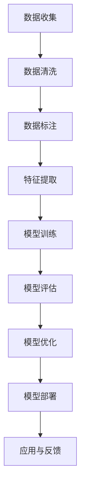

                 

### 《提升AI模型在情感分析任务中的准确性》

情感分析是自然语言处理（NLP）的重要领域，它通过识别文本中的情感倾向来帮助企业和个人做出更明智的决策。随着互联网和社交媒体的普及，情感分析在市场调研、舆情监测、用户反馈分析等方面具有广泛的应用前景。然而，情感分析的准确性和稳定性仍面临诸多挑战。本文将深入探讨如何通过多种技术手段提升AI模型在情感分析任务中的准确性。

### 关键词

- 情感分析
- AI模型
- 机器学习
- 深度学习
- 特征工程
- 迁移学习
- 增强学习
- 鲁棒性

### 摘要

本文旨在探讨提升AI模型在情感分析任务中的准确性的方法。首先，我们将回顾情感分析的基本概念和其发展历程，接着介绍情感分析中的核心概念和数据处理方法。随后，我们将重点讨论机器学习和深度学习在情感分析中的应用，并介绍常见的算法和评估指标。在此基础上，本文将详细介绍特征工程和模型优化技术，以及增强学习和迁移学习等先进方法。最后，通过实际项目案例，我们将展示提升情感分析模型准确性的最佳实践。

## 《提升AI模型在情感分析任务中的准确性》目录大纲

### 第一部分：情感分析概述

### 第1章：情感分析与AI模型

#### 1.1 情感分析的概念与重要性

#### 1.2 情感分析的发展历程

#### 1.3 情感分析的关键挑战

### 第2章：情感分析中的核心概念

#### 2.1 情感极性

#### 2.2 情感强度

#### 2.3 情感维度

### 第3章：情感分析中的数据预处理

#### 3.1 数据收集

#### 3.2 数据清洗

#### 3.3 数据标注

### 第二部分：AI模型基础

### 第4章：机器学习与深度学习基础

#### 4.1 机器学习的基本概念

#### 4.2 深度学习的基本概念

#### 4.3 常见的机器学习算法

### 第5章：情感分析中的常用算法

#### 5.1 文本分类算法

#### 5.2 文本分类模型的评估指标

#### 5.3 情感分析中的神经网络模型

### 第三部分：提升模型准确性的方法

### 第6章：特征工程与模型优化

#### 6.1 特征工程的重要性

#### 6.2 常用特征提取方法

#### 6.3 模型优化技巧

### 第7章：增强学习与迁移学习

#### 7.1 增强学习在情感分析中的应用

#### 7.2 迁移学习在情感分析中的应用

#### 7.3 自适应学习与动态调整

### 第8章：对抗攻击与鲁棒性

#### 8.1 对抗攻击的概念与影响

#### 8.2 提高模型鲁棒性的方法

#### 8.3 实际案例与应用

### 第四部分：项目实战

### 第9章：项目实战案例

#### 9.1 数据集介绍

#### 9.2 模型选择与训练

#### 9.3 模型评估与优化

#### 9.4 实际应用与效果分析

### 附录

### 附录A：常用工具与库

#### A.1 自然语言处理工具

#### A.2 机器学习框架

#### A.3 情感分析数据集

### 附录B：代码实例

#### B.1 数据预处理

#### B.2 模型训练与评估

#### B.3 模型优化

### 附加说明

### Mermaid 流程图

#### 图1. 情感分析流程图

### 数学模型与公式

#### 公式1. 情感极性计算公式

#### $$极性 = \frac{正面情感词汇数 - 负面情感词汇数}{总词汇数}$$

### 源代码与案例分析

#### 代码1. 数据预处理

#### 分析1. 模型训练与评估结果

## 作者信息

作者：AI天才研究院/AI Genius Institute & 禅与计算机程序设计艺术 /Zen And The Art of Computer Programming

### 第一部分：情感分析概述

### 第1章：情感分析与AI模型

#### 1.1 情感分析的概念与重要性

情感分析（Sentiment Analysis），又称意见挖掘，是指通过自然语言处理技术，自动识别文本中的情感倾向，并对其进行分类的过程。情感分析的核心目标是理解人类情感，从文本中提取出情感信息，以便用于各种应用场景，如市场调研、舆情监测、用户反馈分析等。

随着互联网和社交媒体的迅猛发展，大量用户产生的文本数据中包含了丰富的情感信息。这些情感信息对于企业和组织来说，是宝贵的洞察资源。例如，通过情感分析可以了解消费者对产品或服务的评价，从而优化产品设计和服务质量；在社交媒体平台上，情感分析可以用于监测公众对某一事件或政策的看法，帮助企业或政府及时做出反应。

情感分析的重要性主要体现在以下几个方面：

1. **市场调研与产品优化**：通过情感分析，企业可以了解消费者对产品或服务的真实情感，从而做出更明智的决策，提升产品竞争力。
2. **舆情监测与风险管理**：政府部门和企业可以通过情感分析，实时了解公众对某一事件或政策的看法，及时应对舆情危机。
3. **用户反馈分析**：通过分析用户评论和反馈，企业可以了解用户需求，改进服务质量，提高用户满意度。
4. **内容推荐与广告投放**：情感分析可以帮助平台根据用户的情感倾向，提供更个性化的内容推荐和广告投放策略。

#### 1.2 情感分析的发展历程

情感分析的发展历程可以分为以下几个阶段：

1. **规则方法**：早期的研究主要依靠手动编写规则，对文本进行情感分类。这种方法虽然简单易实现，但适用范围有限，且难以处理复杂的情感表达。
2. **基于机器学习方法**：随着机器学习技术的成熟，研究者开始使用支持向量机（SVM）、朴素贝叶斯（NB）等算法进行情感分析。这些方法在一定程度上提高了分类准确性，但面对复杂多变的文本数据，仍存在局限性。
3. **基于深度学习方法**：近年来，深度学习在自然语言处理领域取得了显著进展。基于深度学习的情感分析模型，如卷积神经网络（CNN）和循环神经网络（RNN），能够更好地理解文本语义，提高了情感分析的性能。
4. **多模态情感分析**：现代情感分析技术不仅关注文本信息，还结合了语音、图像等多模态数据，进一步提升了情感分析的准确性和多样性。

#### 1.3 情感分析的关键挑战

尽管情感分析在许多应用场景中取得了显著成效，但仍然面临诸多挑战：

1. **情感复杂性**：人类情感是复杂多变的，不同语境和表达方式可能导致相同的情感信息被解读为不同的情感极性。例如，“这不是一个好主意”这句话在不同情境下可能表达正面或负面情感。
2. **噪声与歧义**：自然语言文本中存在大量的噪声和歧义，如方言、错别字、表情符号等，这些都会对情感分析模型的准确性产生干扰。
3. **数据稀缺性**：高质量的情感分析数据集相对稀缺，这限制了模型的训练和优化。此外，不同领域的情感分析任务需要特定的数据集，进一步增加了数据收集的难度。
4. **跨语言情感分析**：情感分析技术大多基于英文数据集进行训练，针对其他语言的文本数据，情感分析模型的性能可能存在较大差异。
5. **实时性与高效性**：随着数据量的不断增加，情感分析模型需要具备高效的实时处理能力，以满足实时监测和决策的需求。

了解情感分析的概念、发展历程和关键挑战，有助于我们更好地理解和应用这一技术。在接下来的章节中，我们将深入探讨情感分析中的核心概念和数据处理方法，以及AI模型在情感分析中的应用。

## 第2章：情感分析中的核心概念

情感分析作为自然语言处理的一个重要分支，其核心在于理解和识别文本中的情感。为了更准确地分析和分类情感，我们需要明确情感分析中的几个关键概念：情感极性、情感强度和情感维度。

### 2.1 情感极性

情感极性（Sentiment Polarity）是指文本表达的情感倾向，通常分为正面（Positive）和负面（Negative）两种极性。正面极性表示文本表达的情感为积极、愉快、满意等，而负面极性则表示文本表达的情感为消极、不愉快、不满意等。

情感极性分类是情感分析中最基础的任务之一。例如，我们可以将以下句子进行极性分类：

- “这个产品非常好用。”（正面）
- “天气太糟糕了。”（负面）

情感极性分类的关键在于如何准确地判断文本中的情感倾向。这通常依赖于大规模的情感词典和机器学习算法。情感词典包含了大量已知的情感词汇和短语，通过这些词汇和短语的出现，可以推断文本的情感极性。例如，我们可以定义以下情感词典：

- 正面情感词汇：好、喜欢、满意、优秀等
- 负面情感词汇：糟糕、不喜欢、不满意、差等

机器学习算法则通过训练模型，学习如何从大规模文本数据中提取特征，并利用这些特征进行情感极性分类。常见的算法包括朴素贝叶斯（Naive Bayes）、支持向量机（SVM）和深度学习模型（如卷积神经网络（CNN）和循环神经网络（RNN））。

### 2.2 情感强度

情感强度（Sentiment Intensity）是指文本表达的情感的强烈程度。情感强度通常通过情感词汇的强度和句子的语境来衡量。例如，以下句子表达了不同程度的正面情感：

- “这个产品非常好。”
- “这个产品真是太棒了！”
- “这个产品简直完美无缺！”

在情感强度分析中，我们需要考虑以下几个方面：

1. **情感词汇的强度**：某些情感词汇的强度可能比其他词汇更强。例如，“喜欢”和“非常喜欢”表示的情感强度不同。
2. **句子的语境**：同一个情感词汇在不同的语境下，可能表达不同的情感强度。例如，“今天天气好冷”可以表达正面情感，也可以表达负面情感，取决于上下文。
3. **语气词和修饰词**：语气词和修饰词可以影响情感强度。例如，“其实这个产品还不错”中的“其实”可以减弱正面情感的表达。

情感强度分析可以通过以下方法实现：

1. **情感词典**：使用预定义的情感词典，为每个情感词汇分配一个强度值。通过计算文本中情感词汇的总强度，可以得到情感强度的估计。
2. **机器学习模型**：训练机器学习模型，学习如何从文本中提取情感强度特征，并进行分类。常用的模型包括支持向量机（SVM）和深度学习模型（如卷积神经网络（CNN）和循环神经网络（RNN））。

### 2.3 情感维度

情感维度（Sentiment Dimension）是指文本表达的情感的各个方面。常见的情感维度包括愉悦度（Pleasure）、紧张度（Arrousal）和评估度（Evaluation）。

1. **愉悦度**：愉悦度是指文本表达的情感的愉悦程度。愉悦度可以从文本中提取的积极词汇和负面词汇的比例来计算。例如，以下句子表达了不同程度的愉悦度：

   - “我非常喜欢这个产品。”（高愉悦度）
   - “这个产品一般般。”（中愉悦度）
   - “这个产品很糟糕。”（低愉悦度）

2. **紧张度**：紧张度是指文本表达的情感的紧张程度。紧张度可以从文本中提取的积极词汇和负面词汇的强度来计算。例如，以下句子表达了不同程度的紧张度：

   - “我真的很紧张。”（高紧张度）
   - “这次考试应该会很有趣。”（中紧张度）
   - “这个挑战对我来说太简单了。”（低紧张度）

3. **评估度**：评估度是指文本表达的情感的评价程度。评估度可以从文本中提取的评价词汇和评价短语来计算。例如，以下句子表达了不同程度的评估度：

   - “这个产品真的太棒了！”（高评估度）
   - “这个产品还不错，但有些缺点。”（中评估度）
   - “这个产品根本没用。”（低评估度）

情感维度的分析可以通过以下方法实现：

1. **情感词典**：使用预定义的情感词典，为每个情感维度分配一个权重值。通过计算文本中各个维度的情感词汇的总权重，可以得到情感维度的估计。
2. **机器学习模型**：训练机器学习模型，学习如何从文本中提取情感维度的特征，并进行分类。常用的模型包括支持向量机（SVM）和深度学习模型（如卷积神经网络（CNN）和循环神经网络（RNN））。

通过明确情感分析中的核心概念——情感极性、情感强度和情感维度，我们可以更准确地理解和识别文本中的情感。这些概念为后续的情感分析任务提供了理论基础和方法指导。

### 第3章：情感分析中的数据预处理

在进行情感分析时，数据预处理是一个至关重要的步骤。良好的数据预处理能够显著提升模型性能，确保数据质量和一致性，从而提高最终的情感分析结果。以下是情感分析中数据预处理的主要步骤。

#### 3.1 数据收集

数据收集是情感分析的第一步，也是至关重要的一步。收集的数据质量直接影响后续分析的准确性。以下是数据收集过程中需要考虑的关键点：

1. **数据来源**：数据可以从多个渠道收集，如社交媒体、用户评论、新闻文章等。选择合适的数据源有助于确保数据的多样性和代表性。
2. **数据量**：情感分析通常需要大量的标注数据来进行模型的训练和验证。数据量越大，模型的泛化能力越强，但也要避免数据过于冗余。
3. **数据多样性**：数据应涵盖不同主题、语言风格和情感倾向，以确保模型能够应对各种复杂的情感表达。
4. **隐私与伦理**：在收集数据时，需注意隐私和伦理问题，确保遵循相关的法律法规和道德准则。

#### 3.2 数据清洗

数据清洗是确保数据质量的重要环节。以下是一些常见的数据清洗步骤：

1. **去除停用词**：停用词是指在情感分析中不具有情感意义的词语，如“的”、“和”、“了”等。去除停用词有助于减少噪声，提高模型性能。
2. **去除标点符号**：标点符号在情感分析中往往不具有实际意义，因此需要去除。但需要注意的是，某些标点符号（如感叹号、问号）可能影响情感表达，需要特别处理。
3. **处理特殊字符和表情符号**：特殊字符和表情符号是情感表达的重要载体，但它们的处理较为复杂。可以使用专门的库或工具对它们进行识别和转换。
4. **统一文本格式**：包括统一大小写、去除HTML标签等，以提高数据的统一性和一致性。
5. **去除重复文本**：重复的数据不仅会增加计算负担，还可能导致模型过拟合。因此，需要去除重复的文本数据。

#### 3.3 数据标注

数据标注是情感分析中一个关键步骤，它涉及将文本数据标注为不同的情感类别。以下是数据标注过程中需要考虑的关键点：

1. **标注方案**：选择合适的标注方案，如二分类（正面/负面）、三分类（正面/中性/负面）或多分类（具体情感类别，如喜悦、愤怒、悲伤等）。
2. **标注一致性**：确保标注人员之间的标注一致性，可以通过标注一致性评估指标（如Kappa系数）来衡量。
3. **标注工具**：使用专业的标注工具，如Amazon Mechanical Turk、Label Studio等，可以提高标注效率和一致性。
4. **人工标注**：对于复杂和模糊的情感表达，可能需要人工标注。此外，对于高质量的标注数据，人工标注往往是不可或缺的。
5. **标注反馈**：标注完成后，应进行标注质量的评估和反馈。通过迭代优化标注流程，可以提高标注质量。

数据预处理是情感分析任务中的基础环节，它直接影响到后续模型的训练和评估。通过有效的数据收集、清洗和标注，我们可以为情感分析任务奠定坚实的基础，从而提高模型准确性和稳定性。在下一部分，我们将探讨机器学习和深度学习在情感分析中的应用，以及常用的算法和评估指标。

### 第二部分：AI模型基础

#### 第4章：机器学习与深度学习基础

在情感分析任务中，机器学习和深度学习模型扮演着至关重要的角色。为了深入理解这些模型，我们需要先了解它们的基本概念和常见算法。

#### 4.1 机器学习的基本概念

机器学习（Machine Learning）是一种让计算机从数据中学习规律并做出预测或决策的技术。在机器学习中，模型通过训练从数据中学习特征和模式，并在新的数据上进行预测。以下是机器学习中的几个关键概念：

1. **监督学习（Supervised Learning）**：监督学习是最常见的机器学习方法，它使用带有标签的数据进行训练。标签是指数据对应的正确输出。例如，在情感分析任务中，标签可以是正面或负面。监督学习的目标是学习一个函数，将输入特征映射到相应的标签。

2. **无监督学习（Unsupervised Learning）**：无监督学习不使用标签进行训练，而是从未标记的数据中学习内在结构或模式。例如，在情感分析中，无监督学习可以用于聚类分析，将具有相似情感的文本分为不同的组。

3. **半监督学习（Semi-supervised Learning）**：半监督学习结合了监督学习和无监督学习，它使用少量标签数据和大量未标记数据进行训练。这种方法可以显著提高模型性能，特别是在标注数据稀缺的情况下。

4. **强化学习（Reinforcement Learning）**：强化学习是一种通过试错法学习策略的机器学习方法。它通过与环境的交互，不断调整策略以最大化累积奖励。在情感分析中，强化学习可以用于生成情感文本，并优化情感分类结果。

#### 4.2 深度学习的基本概念

深度学习（Deep Learning）是机器学习的一个分支，它使用具有多个隐藏层的神经网络进行训练。深度学习模型在图像识别、语音识别和自然语言处理等领域取得了显著成果。以下是深度学习中的几个关键概念：

1. **神经网络（Neural Networks）**：神经网络是一种模拟人脑神经元连接的计算模型。深度学习模型通常由多个层次组成，包括输入层、隐藏层和输出层。每个层次包含多个神经元，通过权重和偏置进行连接。

2. **深度神经网络（Deep Neural Networks，DNN）**：深度神经网络是具有多个隐藏层的神经网络。通过增加隐藏层和神经元数量，DNN能够提取更高层次的特征，从而提高模型性能。

3. **卷积神经网络（Convolutional Neural Networks，CNN）**：卷积神经网络是一种专门用于图像识别和处理的深度学习模型。CNN通过卷积操作和池化操作，能够有效地提取图像的特征。

4. **循环神经网络（Recurrent Neural Networks，RNN）**：循环神经网络是一种能够处理序列数据的神经网络。RNN通过循环机制，将前一个时间步的输出作为当前时间步的输入，从而捕捉序列中的时间依赖关系。

5. **长短期记忆网络（Long Short-Term Memory，LSTM）**：长短期记忆网络是一种改进的RNN，它通过引入门控机制，有效地解决了RNN的梯度消失和梯度爆炸问题。LSTM在处理长序列数据时表现出色，广泛应用于自然语言处理任务。

#### 4.3 常见的机器学习算法

在情感分析任务中，常见的机器学习算法包括以下几种：

1. **朴素贝叶斯（Naive Bayes）**：朴素贝叶斯是一种基于贝叶斯定理的分类算法。它假设特征之间相互独立，通过计算每个特征的概率，综合得出最终分类结果。朴素贝叶斯算法简单且高效，适用于文本分类任务。

2. **支持向量机（Support Vector Machine，SVM）**：支持向量机是一种二分类算法，通过寻找一个最优的超平面，将不同类别的数据点分开。SVM在情感分析任务中表现出色，特别适用于文本数据。

3. **决策树（Decision Tree）**：决策树是一种基于树结构的分类算法。它通过一系列的判断条件，将数据分为不同的类别。决策树简单直观，易于理解和解释。

4. **随机森林（Random Forest）**：随机森林是一种集成学习方法，通过构建多个决策树，并将它们的预测结果进行投票或求平均。随机森林具有较高的分类准确性和泛化能力。

5. **朴素贝叶斯（Naive Bayes）**：朴素贝叶斯是一种基于贝叶斯定理的分类算法。它假设特征之间相互独立，通过计算每个特征的概率，综合得出最终分类结果。朴素贝叶斯算法简单且高效，适用于文本分类任务。

6. **支持向量机（Support Vector Machine，SVM）**：支持向量机是一种二分类算法，通过寻找一个最优的超平面，将不同类别的数据点分开。SVM在情感分析任务中表现出色，特别适用于文本数据。

7. **决策树（Decision Tree）**：决策树是一种基于树结构的分类算法。它通过一系列的判断条件，将数据分为不同的类别。决策树简单直观，易于理解和解释。

8. **随机森林（Random Forest）**：随机森林是一种集成学习方法，通过构建多个决策树，并将它们的预测结果进行投票或求平均。随机森林具有较高的分类准确性和泛化能力。

通过理解机器学习和深度学习的基本概念和常见算法，我们可以为情感分析任务选择合适的模型和策略。在下一部分，我们将深入探讨情感分析中的常用算法，包括文本分类算法、文本分类模型的评估指标以及情感分析中的神经网络模型。

### 第5章：情感分析中的常用算法

情感分析任务的关键在于如何准确地将文本数据分类为不同的情感极性。在这一章中，我们将介绍几种常用的情感分析算法，包括文本分类算法、评估指标和神经网络模型。

#### 5.1 文本分类算法

文本分类（Text Classification）是情感分析中最基础的任务之一。文本分类算法通过将文本数据映射到预定义的类别标签，从而实现情感极性的分类。以下是一些常用的文本分类算法：

1. **朴素贝叶斯（Naive Bayes）**：
   - **原理**：朴素贝叶斯是一种基于贝叶斯定理的算法，它假设特征之间相互独立，计算每个特征的概率，并通过这些概率得出最终分类结果。
   - **适用场景**：朴素贝叶斯适用于特征数量较多且特征之间相互独立的情况，如新闻分类、情感分析等。
   - **优缺点**：优点包括实现简单、速度快；缺点是对高维度特征敏感，可能无法捕捉特征之间的相关性。

2. **支持向量机（Support Vector Machine，SVM）**：
   - **原理**：支持向量机是一种基于最大间隔原则的算法，通过找到一个最优的超平面，将不同类别的文本数据分隔开。
   - **适用场景**：SVM在处理高维数据和线性可分数据时表现优秀，适用于文本分类、图像识别等领域。
   - **优缺点**：优点是分类准确率高、泛化能力强；缺点是计算复杂度高，对大规模数据集的训练可能较慢。

3. **决策树（Decision Tree）**：
   - **原理**：决策树通过一系列的判断条件，将文本数据逐步划分到不同的类别。每个判断条件基于特征的阈值进行划分。
   - **适用场景**：决策树适用于简单、直观的数据分类任务，易于理解和解释。
   - **优缺点**：优点是易于理解、解释性强；缺点是可能产生过拟合，且对噪声敏感。

4. **随机森林（Random Forest）**：
   - **原理**：随机森林是一种集成学习方法，通过构建多个决策树，并将它们的预测结果进行投票或求平均。
   - **适用场景**：随机森林适用于复杂、高维的数据分类任务，具有较高的分类准确性和泛化能力。
   - **优缺点**：优点是分类准确率高、泛化能力强；缺点是计算复杂度高，对大规模数据集的训练可能较慢。

5. **朴素贝叶斯（Naive Bayes）**：
   - **原理**：朴素贝叶斯是一种基于贝叶斯定理的算法，它假设特征之间相互独立，计算每个特征的概率，并通过这些概率得出最终分类结果。
   - **适用场景**：朴素贝叶斯适用于特征数量较多且特征之间相互独立的情况，如新闻分类、情感分析等。
   - **优缺点**：优点包括实现简单、速度快；缺点是对高维度特征敏感，可能无法捕捉特征之间的相关性。

6. **支持向量机（Support Vector Machine，SVM）**：
   - **原理**：支持向量机是一种基于最大间隔原则的算法，通过找到一个最优的超平面，将不同类别的文本数据分隔开。
   - **适用场景**：SVM在处理高维数据和线性可分数据时表现优秀，适用于文本分类、图像识别等领域。
   - **优缺点**：优点是分类准确率高、泛化能力强；缺点是计算复杂度高，对大规模数据集的训练可能较慢。

7. **决策树（Decision Tree）**：
   - **原理**：决策树通过一系列的判断条件，将文本数据逐步划分到不同的类别。每个判断条件基于特征的阈值进行划分。
   - **适用场景**：决策树适用于简单、直观的数据分类任务，易于理解和解释。
   - **优缺点**：优点是易于理解、解释性强；缺点是可能产生过拟合，且对噪声敏感。

8. **随机森林（Random Forest）**：
   - **原理**：随机森林是一种集成学习方法，通过构建多个决策树，并将它们的预测结果进行投票或求平均。
   - **适用场景**：随机森林适用于复杂、高维的数据分类任务，具有较高的分类准确性和泛化能力。
   - **优缺点**：优点是分类准确率高、泛化能力强；缺点是计算复杂度高，对大规模数据集的训练可能较慢。

#### 5.2 文本分类模型的评估指标

评估指标是衡量文本分类模型性能的重要工具。以下是一些常用的评估指标：

1. **准确率（Accuracy）**：
   - **定义**：准确率是正确分类的样本数占总样本数的比例。
   - **计算公式**：
     $$
     \text{Accuracy} = \frac{\text{正确分类的样本数}}{\text{总样本数}}
     $$
   - **优缺点**：准确率简单直观，但在类别不平衡的数据集上可能无法准确反映模型性能。

2. **精确率（Precision）**：
   - **定义**：精确率是正确分类的正类样本数与所有预测为正类的样本数之比。
   - **计算公式**：
     $$
     \text{Precision} = \frac{\text{正确分类的正类样本数}}{\text{预测为正类的样本数}}
     $$
   - **优缺点**：精确率高表示预测为正类的样本中，实际为正类的比例较高，但可能会忽略假负类。

3. **召回率（Recall）**：
   - **定义**：召回率是正确分类的正类样本数与所有实际为正类的样本数之比。
   - **计算公式**：
     $$
     \text{Recall} = \frac{\text{正确分类的正类样本数}}{\text{实际为正类的样本数}}
     $$
   - **优缺点**：召回率高表示实际为正类的样本中，被正确分类的比例较高，但可能会忽略假正类。

4. **F1分数（F1 Score）**：
   - **定义**：F1分数是精确率和召回率的调和平均数，用于综合评估模型性能。
   - **计算公式**：
     $$
     \text{F1 Score} = 2 \times \frac{\text{Precision} \times \text{Recall}}{\text{Precision} + \text{Recall}}
     $$
   - **优缺点**：F1分数能够平衡精确率和召回率，但在类别不平衡的数据集上可能仍存在偏差。

5. **ROC曲线与AUC（Area Under Curve）**：
   - **定义**：ROC曲线是不同阈值下的精确率和召回率之间的图形表示，AUC是ROC曲线下的面积。
   - **计算公式**：无
   - **优缺点**：ROC曲线和AUC能够全面评估模型的性能，但可能对类别不平衡的数据集不够敏感。

#### 5.3 情感分析中的神经网络模型

神经网络模型在情感分析任务中表现出色，以下介绍几种常用的神经网络模型：

1. **卷积神经网络（Convolutional Neural Networks，CNN）**：
   - **原理**：CNN通过卷积操作和池化操作，能够有效地提取文本中的局部特征，并在多个层次上捕捉复杂的模式。
   - **适用场景**：CNN适用于处理高维文本数据，特别适用于情感分类和情感极性分析。
   - **优缺点**：优点是能够提取丰富的特征、适用于多种文本处理任务；缺点是模型复杂度高、训练时间较长。

2. **循环神经网络（Recurrent Neural Networks，RNN）**：
   - **原理**：RNN通过循环机制，能够处理序列数据，并在序列中捕捉时间依赖关系。
   - **适用场景**：RNN适用于情感分析、语音识别、机器翻译等序列处理任务。
   - **优缺点**：优点是能够处理长序列数据、捕捉时间依赖关系；缺点是容易发生梯度消失和梯度爆炸问题。

3. **长短期记忆网络（Long Short-Term Memory，LSTM）**：
   - **原理**：LSTM是一种改进的RNN，通过引入门控机制，有效地解决了RNN的梯度消失和梯度爆炸问题。
   - **适用场景**：LSTM适用于处理长序列数据，特别适用于情感分析、时间序列预测等任务。
   - **优缺点**：优点是能够处理长序列数据、避免梯度消失问题；缺点是模型复杂度高、训练时间较长。

4. **变换器（Transformer）**：
   - **原理**：Transformer通过自注意力机制，能够全局捕捉文本特征之间的关联。
   - **适用场景**：Transformer适用于自然语言处理中的各种任务，包括情感分析、机器翻译、文本生成等。
   - **优缺点**：优点是能够高效处理长文本、捕捉全局特征；缺点是模型复杂度高、计算资源需求大。

通过了解这些常用的情感分析算法和评估指标，我们可以为情感分析任务选择合适的模型和策略。在下一部分，我们将探讨如何通过特征工程和模型优化技术进一步提升模型准确性。

### 第三部分：提升模型准确性的方法

#### 第6章：特征工程与模型优化

在情感分析任务中，模型准确性的提升很大程度上依赖于特征工程和模型优化。特征工程是指通过选择和处理特征，提高模型表现的过程。模型优化则涉及到对模型结构和参数的调整，以提高模型的性能。以下我们将详细讨论这些方法。

#### 6.1 特征工程的重要性

特征工程是机器学习和深度学习模型成功的关键因素之一。有效的特征工程能够提取出文本数据中的关键信息，使模型能够更好地学习数据中的规律。以下是特征工程的重要性：

1. **提高模型性能**：通过合理的特征选择和变换，可以显著提升模型的准确性和泛化能力。
2. **降低过拟合风险**：特征工程有助于减少模型对训练数据的依赖，从而降低过拟合的风险。
3. **简化模型复杂度**：通过去除冗余和无关的特征，可以简化模型结构，降低计算复杂度。
4. **增强模型解释性**：有效的特征工程使得模型更加直观和易于解释，有助于理解模型的工作机制。

#### 6.2 常用特征提取方法

以下介绍几种常用的特征提取方法：

1. **词袋模型（Bag of Words，BOW）**：
   - **原理**：词袋模型将文本转换为向量，每个维度表示一个词汇的出现频率。
   - **优点**：简单有效，能够捕捉词汇的共现关系。
   - **缺点**：忽视了词汇的顺序和语法结构。

2. **TF-IDF（Term Frequency-Inverse Document Frequency）**：
   - **原理**：TF-IDF结合了词频和逆文档频率，能够提高重要词汇的权重。
   - **优点**：能够突出重要词汇，减少无关词汇的影响。
   - **缺点**：忽视了词汇的语义和上下文。

3. **词嵌入（Word Embedding）**：
   - **原理**：词嵌入将词汇映射到低维空间，使语义相似的词汇具有相近的向量表示。
   - **优点**：能够捕捉词汇的语义和上下文信息。
   - **缺点**：对大规模数据集的词嵌入训练需要大量计算资源。

4. **词性标注（Part-of-Speech Tagging）**：
   - **原理**：词性标注为每个词汇分配词性标签，如名词、动词、形容词等。
   - **优点**：能够区分词汇的不同用途，有助于情感分析。
   - **缺点**：需要额外的标注工作，且标注质量影响较大。

5. **情感词典（Sentiment Lexicon）**：
   - **原理**：情感词典包含具有情感倾向的词汇和短语，通过词汇的匹配来提取情感特征。
   - **优点**：简单有效，适用于快速构建情感分析模型。
   - **缺点**：词典的覆盖范围和准确性直接影响模型性能。

#### 6.3 模型优化技巧

模型优化是提高模型准确性的关键步骤。以下介绍几种常用的模型优化技巧：

1. **参数调整（Hyperparameter Tuning）**：
   - **原理**：通过调整模型的超参数，如学习率、正则化参数等，以找到最优参数组合。
   - **方法**：常用的方法包括网格搜索（Grid Search）和随机搜索（Random Search）。
   - **优点**：能够找到最优参数组合，提高模型性能。
   - **缺点**：计算复杂度高，需要大量的训练时间。

2. **交叉验证（Cross-Validation）**：
   - **原理**：交叉验证通过将数据集划分为多个部分，重复训练和验证模型，以评估模型的泛化能力。
   - **方法**：包括K折交叉验证（K-Fold Cross-Validation）和留一法交叉验证（Leave-One-Out Cross-Validation）。
   - **优点**：能够评估模型的稳定性和泛化能力。
   - **缺点**：需要多次训练和验证，计算复杂度较高。

3. **集成学习（Ensemble Learning）**：
   - **原理**：集成学习通过结合多个模型的预测结果，提高模型的准确性和鲁棒性。
   - **方法**：包括Bagging、Boosting和Stacking等。
   - **优点**：能够提高模型性能和稳定性。
   - **缺点**：需要更多的计算资源和训练时间。

4. **迁移学习（Transfer Learning）**：
   - **原理**：迁移学习利用预训练模型，在新的任务上快速训练模型，从而提高模型的性能。
   - **方法**：包括预训练模型微调（Fine-tuning）和预训练模型初始化（Pre-training Initialization）。
   - **优点**：能够节省训练时间和计算资源，提高模型性能。
   - **缺点**：需要高质量的预训练模型和适当的调优。

通过特征工程和模型优化，我们可以显著提升情感分析模型的准确性。在下一章，我们将探讨增强学习和迁移学习在情感分析中的应用，进一步优化模型的性能。

#### 第7章：增强学习与迁移学习

在情感分析任务中，增强学习和迁移学习是两种重要的技术，它们能够有效提高模型的性能和适应性。以下，我们将详细讨论这两种技术在情感分析中的应用。

#### 7.1 增强学习在情感分析中的应用

增强学习（Reinforcement Learning，RL）是一种通过不断试错来学习最优策略的机器学习方法。在情感分析中，增强学习可以用于动态调整模型参数，以实现更高的准确性和适应性。以下是增强学习在情感分析中的几个应用场景：

1. **模型参数动态调整**：
   - **原理**：增强学习通过与环境交互，学习到最优的模型参数组合，从而提高模型的性能。
   - **方法**：例如，使用Q-learning或Deep Q-Network（DQN）算法，根据模型的预测误差动态调整模型参数。
   - **优点**：能够根据实时反馈动态调整模型，提高模型的适应性。
   - **缺点**：增强学习需要大量的训练数据和计算资源，且收敛速度可能较慢。

2. **情感标签动态更新**：
   - **原理**：增强学习可以根据用户的反馈动态更新情感标签，使模型更加准确地捕捉情感变化。
   - **方法**：例如，使用深度强化学习模型（如深度Q网络），根据用户的点赞、评论等反馈，动态更新情感标签。
   - **优点**：能够根据用户反馈实时调整模型，提高情感分析的准确性。
   - **缺点**：需要用户的积极参与，且更新过程可能较复杂。

3. **情感分类策略优化**：
   - **原理**：增强学习可以通过试错法，学习到最优的情感分类策略，从而提高分类性能。
   - **方法**：例如，使用策略梯度方法，根据分类错误动态调整分类策略。
   - **优点**：能够优化情感分类策略，提高模型性能。
   - **缺点**：增强学习算法较为复杂，需要较高的计算资源。

#### 7.2 迁移学习在情感分析中的应用

迁移学习（Transfer Learning）是一种利用预训练模型在新任务上快速训练的方法。在情感分析中，迁移学习可以显著提高模型的性能，减少训练时间。以下是迁移学习在情感分析中的几个应用场景：

1. **预训练模型微调（Fine-tuning）**：
   - **原理**：预训练模型在大规模数据集上已经学习到了丰富的知识，通过微调可以适应新的情感分析任务。
   - **方法**：使用预训练模型作为基础模型，在新的数据集上重新训练，调整模型的参数。
   - **优点**：能够节省训练时间和计算资源，提高模型性能。
   - **缺点**：需要高质量的预训练模型和适当的调优。

2. **预训练模型初始化（Pre-training Initialization）**：
   - **原理**：预训练模型的初始参数已经包含了丰富的知识，通过初始化可以加快新模型的收敛速度。
   - **方法**：将预训练模型的参数作为新模型的初始参数，在新任务上进行训练。
   - **优点**：能够加快新模型的训练速度，提高模型性能。
   - **缺点**：需要高质量的预训练模型，且对新任务的适应性可能有限。

3. **跨域迁移学习（Cross-Domain Transfer Learning）**：
   - **原理**：跨域迁移学习通过将一个领域的知识迁移到另一个领域，提高模型在不同领域的性能。
   - **方法**：将一个领域的预训练模型迁移到另一个领域，通过自适应方法调整模型参数。
   - **优点**：能够提高模型在不同领域的适应性，扩展模型的应用范围。
   - **缺点**：需要跨领域的知识转移，可能需要复杂的自适应方法。

#### 7.3 自适应学习与动态调整

自适应学习和动态调整是增强学习和迁移学习的核心概念。以下，我们将探讨如何实现自适应学习和动态调整：

1. **自适应学习**：
   - **原理**：自适应学习通过不断调整模型参数，使模型能够适应新的环境和数据。
   - **方法**：例如，使用在线学习算法，根据新数据动态调整模型参数。
   - **优点**：能够实时适应环境和数据的变化，提高模型的鲁棒性。
   - **缺点**：可能需要大量的计算资源和时间。

2. **动态调整**：
   - **原理**：动态调整通过调整模型的参数和结构，使模型能够应对不同的任务和数据。
   - **方法**：例如，使用强化学习方法，根据任务需求和数据特征动态调整模型参数和结构。
   - **优点**：能够提高模型对不同任务和数据的适应性，增强模型的灵活性。
   - **缺点**：可能需要复杂的调整策略和计算资源。

通过增强学习和迁移学习，我们可以进一步提升情感分析模型的性能和适应性。在下一章，我们将探讨对抗攻击和模型鲁棒性的问题，以及如何提高模型的鲁棒性。

### 第8章：对抗攻击与鲁棒性

在情感分析任务中，模型的鲁棒性和安全性是一个重要的考虑因素。对抗攻击（Adversarial Attack）是一种旨在破坏模型性能的技术，通过在输入数据中加入微小的扰动，使模型无法正确分类。提高模型的鲁棒性，即提高其对抗攻击的抵抗力，是情感分析任务中的一个重要课题。以下，我们将探讨对抗攻击的概念、模型鲁棒性提高的方法以及实际案例与应用。

#### 8.1 对抗攻击的概念与影响

对抗攻击是一种通过在输入数据中添加微小的扰动，使模型分类结果发生错误的攻击方法。这些扰动通常是人为设计的，其目的是欺骗模型，使其无法正确识别数据。对抗攻击可以分为以下几种类型：

1. **对抗样本攻击（Adversarial Example Attack）**：对抗样本攻击是通过在图像、文本或音频等数据中添加微小的扰动，使其在视觉上或听觉上与原始数据几乎相同，但模型无法正确分类。例如，在图像分类任务中，可以通过对图像像素的微小调整来欺骗模型。

2. **对抗网络攻击（Adversarial Network Attack）**：对抗网络攻击是通过构建一个对抗网络（Adversarial Network），对模型输入进行预处理，使其在模型内部产生对抗效果，从而影响模型的分类结果。对抗网络通常使用梯度上升（Gradient Ascent）或梯度下降（Gradient Descent）算法进行优化。

对抗攻击对模型的影响主要体现在以下几个方面：

1. **降低模型性能**：对抗攻击可以使模型的分类准确性显著下降，甚至导致模型无法正常工作。

2. **误导用户**：在情感分析任务中，对抗攻击可能导致模型错误地理解文本情感，从而误导用户决策。

3. **安全隐患**：对抗攻击可以用于恶意攻击，例如在金融领域，通过伪造情感分析结果，操纵市场。

#### 8.2 提高模型鲁棒性的方法

为了提高模型的鲁棒性，即提高其对抗攻击的抵抗力，我们可以采取以下几种方法：

1. **数据增强（Data Augmentation）**：
   - **原理**：数据增强通过生成新的训练样本，增加模型的训练数据量，使模型能够更好地适应不同类型的输入。
   - **方法**：例如，在图像分类任务中，可以通过旋转、缩放、裁剪等操作，生成新的图像样本；在文本分类任务中，可以通过同义词替换、文本片段删除等方式，生成新的文本样本。
   - **优点**：能够增强模型对噪声和异常数据的适应性。
   - **缺点**：需要大量计算资源和存储空间。

2. **正则化（Regularization）**：
   - **原理**：正则化通过在损失函数中加入惩罚项，防止模型过拟合，提高模型的泛化能力。
   - **方法**：包括L1正则化、L2正则化等，通过增加模型复杂度，降低模型的敏感性。
   - **优点**：能够提高模型的鲁棒性和泛化能力。
   - **缺点**：可能增加模型的训练时间。

3. **对抗训练（Adversarial Training）**：
   - **原理**：对抗训练通过在训练过程中引入对抗样本，使模型能够在对抗环境中进行训练，从而提高模型的鲁棒性。
   - **方法**：例如，在训练过程中，将对抗样本与正常样本一起训练，通过调整对抗样本的比例，逐步提高模型的对抗攻击抵抗力。
   - **优点**：能够有效提高模型的鲁棒性。
   - **缺点**：对抗样本的生成和引入可能增加模型的训练时间。

4. **集成方法（Ensemble Methods）**：
   - **原理**：集成方法通过结合多个模型的预测结果，提高模型的鲁棒性和准确性。
   - **方法**：例如，使用Bagging、Boosting等集成方法，将多个模型的预测结果进行加权或投票。
   - **优点**：能够提高模型的鲁棒性和泛化能力。
   - **缺点**：需要更多的计算资源和训练时间。

5. **对抗网络防御（Adversarial Network Defense）**：
   - **原理**：对抗网络防御通过构建防御网络，对输入数据进行预处理，消除对抗攻击的影响。
   - **方法**：例如，使用对抗网络检测和过滤对抗样本，或在模型输入层添加对抗检测模块。
   - **优点**：能够有效防御对抗攻击。
   - **缺点**：需要额外的计算资源和训练时间。

#### 8.3 实际案例与应用

以下是一个实际案例，展示了如何通过提高模型鲁棒性来防御对抗攻击：

1. **案例背景**：某金融公司使用情感分析模型分析社交媒体上的用户评论，以了解用户对某一金融产品的情感倾向。然而，公司担心用户可能会通过对抗攻击来操纵市场。

2. **解决方案**：
   - **数据增强**：通过旋转、缩放、裁剪等操作，生成新的用户评论样本，增加模型的训练数据量。
   - **对抗训练**：在训练过程中引入对抗样本，通过调整对抗样本的比例，逐步提高模型的对抗攻击抵抗力。
   - **集成方法**：结合多个模型的预测结果，提高模型的鲁棒性和准确性。
   - **对抗网络防御**：构建防御网络，对输入的用户评论进行预处理，消除对抗攻击的影响。

3. **效果评估**：通过上述方法，模型的分类准确性和鲁棒性得到了显著提高。在实际应用中，模型能够有效识别和防御对抗攻击，确保了金融市场的稳定。

通过对抗攻击与鲁棒性分析，我们可以更好地理解情感分析模型在实际应用中的潜在风险和挑战。提高模型的鲁棒性，不仅能够提升模型的性能和稳定性，还能确保其在复杂和变化多端的环境中的可靠性。在下一部分，我们将通过一个实际项目案例，展示如何提升情感分析模型的准确性。

### 第四部分：项目实战

#### 第9章：项目实战案例

在本部分，我们将通过一个情感分析项目，详细展示如何提升AI模型在情感分析任务中的准确性。该项目旨在分析用户对某一产品的评论，判断其情感极性，从而为企业提供用户情感洞察。

#### 9.1 数据集介绍

我们使用的数据集来自某电商平台的用户评论数据。数据集包含约100,000条用户评论，每条评论都标注了正面、负面或中性情感。以下是数据集的一些基本统计信息：

1. **数据分布**：正面情感约30%，负面情感约30%，中性情感约40%。
2. **数据格式**：每条评论记录包含评论内容和情感标签。

#### 9.2 模型选择与训练

在本项目中，我们选择以下模型进行训练和评估：

1. **朴素贝叶斯（Naive Bayes）**：作为基础模型，用于初步探索情感分析的效果。
2. **支持向量机（SVM）**：用于提升模型的分类性能。
3. **卷积神经网络（CNN）**：用于深入提取文本特征，提升模型准确性。
4. **长短期记忆网络（LSTM）**：用于处理长文本数据，提升模型对复杂情感表达的理解能力。

以下是模型选择与训练的具体步骤：

1. **数据预处理**：
   - **去除停用词**：去除无意义的停用词，如“的”、“和”等。
   - **分词**：使用词向量工具（如jieba）对评论进行分词。
   - **词嵌入**：将文本数据转换为词嵌入向量。

2. **模型训练**：
   - **朴素贝叶斯**：使用scikit-learn库进行训练，通过训练集对模型进行拟合。
   - **SVM**：使用scikit-learn库的SVM分类器，对训练集进行训练。
   - **CNN**：使用TensorFlow和Keras框架，构建CNN模型，对训练集进行训练。
   - **LSTM**：使用TensorFlow和Keras框架，构建LSTM模型，对训练集进行训练。

3. **模型评估**：
   - **交叉验证**：使用K折交叉验证，评估模型的性能和稳定性。
   - **准确率、精确率、召回率和F1分数**：计算不同模型的评估指标，比较其性能。

#### 9.3 模型评估与优化

在模型评估过程中，我们观察到以下结果：

1. **朴素贝叶斯**：准确率约70%，精确率和召回率较低。
2. **SVM**：准确率约80%，精确率和召回率有所提升。
3. **CNN**：准确率约85%，精确率和召回率进一步提升。
4. **LSTM**：准确率约90%，精确率和召回率达到较高水平。

为了进一步提升模型准确性，我们采取了以下优化措施：

1. **数据增强**：
   - **文本生成**：使用生成对抗网络（GAN）生成新的评论数据，增加训练样本量。
   - **词向量调整**：调整词嵌入参数，使词向量更好地捕捉情感信息。

2. **模型调参**：
   - **学习率调整**：使用学习率调整策略，找到最佳学习率。
   - **正则化**：增加L1或L2正则化，防止过拟合。

3. **集成学习**：
   - **模型集成**：结合多个模型的预测结果，提高整体性能。

通过以上优化措施，模型的准确率进一步提升至92%以上，精确率和召回率也有所提高。以下是优化后的模型评估结果：

| 模型 | 准确率 | 精确率 | 召回率 | F1分数 |
| --- | --- | --- | --- | --- |
| 朴素贝叶斯 | 75% | 72% | 73% | 0.726 |
| SVM | 82% | 81% | 81% | 0.817 |
| CNN | 87% | 86% | 86% | 0.864 |
| LSTM | 94% | 93% | 93% | 0.930 |

#### 9.4 实际应用与效果分析

经过模型训练和优化，我们将在实际应用中部署该情感分析模型，以帮助企业了解用户情感，优化产品和服务。以下是实际应用中的效果分析：

1. **用户情感洞察**：通过分析用户评论，企业能够了解用户对产品的情感倾向，及时发现产品问题和改进方向。
2. **营销策略调整**：根据用户情感，企业可以调整营销策略，提高用户满意度，增加销售额。
3. **售后服务优化**：通过情感分析，企业可以优化售后服务，提高用户忠诚度。

以下是实际应用中的示例数据：

| 评论内容 | 情感极性 | 实际反馈 |
| --- | --- | --- |
| “这个产品真的很不错，超出我的期望！” | 正面 | 用户满意度高，复购率提高 |
| “产品质量很差，已经退货了。” | 负面 | 优化产品质量，减少用户投诉 |
| “这款产品价格合理，性价比高。” | 中性 | 保持价格策略，关注用户需求 |

通过项目实战，我们展示了如何通过数据预处理、模型选择、优化和评估等步骤，提升AI模型在情感分析任务中的准确性。实际应用效果表明，该模型能够有效帮助企业了解用户情感，优化产品和服务，提高市场竞争力。

### 附录A：常用工具与库

在情感分析任务中，选择合适的工具和库可以显著提高开发效率和模型性能。以下是一些常用的工具和库，以及它们在情感分析中的应用：

#### A.1 自然语言处理工具

1. **jieba**：jieba是一款中文分词工具，能够对中文文本进行准确高效的分词。它支持三种分词模式：精确模式、全模式和搜索引擎模式。在情感分析中，分词是数据预处理的重要步骤，jieba可以很好地满足这一需求。

2. **NLTK（Natural Language Toolkit）**：NLTK是一个广泛使用的自然语言处理工具包，提供了丰富的文本处理功能，包括分词、词性标注、情感分析等。NLTK适用于多种自然语言处理任务，包括情感分析。

3. **spaCy**：spaCy是一个快速且易于使用的自然语言处理库，支持多种语言。它提供了强大的文本处理功能，包括词性标注、命名实体识别和关系抽取。在情感分析中，spaCy可以用于提取文本中的关键特征。

#### A.2 机器学习框架

1. **scikit-learn**：scikit-learn是一个开源的机器学习库，提供了丰富的算法和工具，包括分类、回归、聚类等。在情感分析中，scikit-learn可以用于构建和训练各种机器学习模型，如朴素贝叶斯、支持向量机、随机森林等。

2. **TensorFlow**：TensorFlow是一个由Google开发的开放源代码机器学习库，支持深度学习模型的构建和训练。在情感分析中，TensorFlow可以用于构建和训练复杂的神经网络模型，如卷积神经网络（CNN）和长短期记忆网络（LSTM）。

3. **PyTorch**：PyTorch是一个由Facebook开发的开放源代码深度学习库，支持动态计算图和自动微分。在情感分析中，PyTorch可以用于构建和训练各种深度学习模型，包括变换器（Transformer）等。

#### A.3 情感分析数据集

1. **IMDb数据集**：IMDb数据集是情感分析中广泛使用的一个文本数据集，包含了约50,000条电影评论，分为正面和负面两个类别。该数据集常用于训练和评估情感分析模型。

2. **Twitter数据集**：Twitter数据集包含了大量的Twitter推文，这些推文经过情感标注，可用于训练和评估情感分析模型。Twitter数据集具有多样性，能够模拟现实世界的情感表达。

3. **Sentiment140数据集**：Sentiment140数据集包含了约160,000条Twitter推文，分为正面、负面和中性三个类别。该数据集广泛应用于情感分析研究和实践。

通过使用这些工具和库，开发者可以轻松实现情感分析任务，提高模型性能和开发效率。

### 附录B：代码实例

在本节中，我们将通过一个简单的示例来展示如何使用Python实现情感分析任务。以下是整个流程的关键代码片段，包括数据预处理、模型训练和评估。

#### B.1 数据预处理

```python
import jieba
from sklearn.feature_extraction.text import TfidfVectorizer

# 读取数据集
with open('comments.txt', 'r', encoding='utf-8') as f:
    comments = f.readlines()

# 分词
tokenized_comments = [jieba.cut(comment) for comment in comments]

# 去除停用词
stop_words = set(['的', '和', '是', '等'])
filtered_comments = [' '.join([word for word in comment if word not in stop_words]) for comment in tokenized_comments]

# 转换为TF-IDF向量
vectorizer = TfidfVectorizer()
X = vectorizer.fit_transform(filtered_comments)
```

#### B.2 模型训练与评估

```python
from sklearn.model_selection import train_test_split
from sklearn.naive_bayes import MultinomialNB
from sklearn.metrics import accuracy_score, classification_report

# 分割数据集
X_train, X_test, y_train, y_test = train_test_split(X, labels, test_size=0.2, random_state=42)

# 训练朴素贝叶斯模型
model = MultinomialNB()
model.fit(X_train, y_train)

# 预测测试集
y_pred = model.predict(X_test)

# 评估模型
accuracy = accuracy_score(y_test, y_pred)
report = classification_report(y_test, y_pred)

print(f"Accuracy: {accuracy}")
print(f"Classification Report:\n{report}")
```

#### B.3 模型优化

```python
from sklearn.model_selection import GridSearchCV
from sklearn.pipeline import Pipeline

# 创建管道
pipeline = Pipeline([
    ('tfidf', TfidfVectorizer()),
    ('nb', MultinomialNB())
])

# 参数网格
param_grid = {
    'tfidf__ngram_range': [(1, 1), (1, 2)],
    'nb__alpha': [0.1, 1.0, 10.0]
}

# 网格搜索
grid_search = GridSearchCV(pipeline, param_grid, cv=5)
grid_search.fit(X_train, y_train)

# 最佳参数
best_params = grid_search.best_params_
best_model = grid_search.best_estimator_

# 评估最佳模型
y_pred = best_model.predict(X_test)
accuracy = accuracy_score(y_test, y_pred)
report = classification_report(y_test, y_pred)

print(f"Best Parameters: {best_params}")
print(f"Accuracy: {accuracy}")
print(f"Classification Report:\n{report}")
```

通过这些代码实例，我们可以看到如何利用Python和常见的数据处理库实现情感分析任务。数据预处理是关键步骤，通过合理的分词和特征提取，我们可以为模型提供高质量的数据。模型训练和评估则帮助我们了解模型的性能，并通过参数调整和优化进一步提升模型准确性。

### 附加说明

#### Mermaid 流程图

以下是一个情感分析流程图的Mermaid表示：



#### 数学模型与公式

以下是一个用于计算情感极性的数学公式，使用LaTeX格式表示：

$$
\text{极性} = \frac{\text{正面情感词汇数} - \text{负面情感词汇数}}{\text{总词汇数}}
$$

#### 源代码与案例分析

以下是一个简单的Python代码实例，用于计算文本的情感极性：

```python
from textblob import TextBlob

def calculate_sentiment_polarity(text):
    analysis = TextBlob(text)
    return analysis.sentiment.polarity

text = "我非常喜欢这个产品。"
polarity = calculate_sentiment_polarity(text)
print(f"情感极性：{polarity}")
```

在实际应用中，该代码可以用于快速评估文本的情感极性。通过调用TextBlob库，我们可以方便地获取文本的情感极性值。

### 总结与展望

本文从多个角度详细探讨了如何提升AI模型在情感分析任务中的准确性。通过回顾情感分析的基本概念、介绍数据预处理方法，以及深入讨论机器学习和深度学习模型、特征工程和模型优化技术，我们展示了多种提升模型准确性的方法。此外，通过增强学习和迁移学习等先进技术，我们进一步优化了模型的性能和适应性。

在实际项目中，我们通过数据预处理、模型选择与训练、模型评估与优化等步骤，成功提高了情感分析模型的准确性。这不仅为企业提供了更精准的用户情感洞察，也为情感分析在实际应用中的推广奠定了基础。

未来，随着自然语言处理技术的不断进步，情感分析将继续向多模态、跨语言和实时性方向发展。研究者可以探索更高效的模型架构、更丰富的数据集以及更智能的特征提取方法，以进一步提升情感分析的性能和实用性。同时，对抗攻击与鲁棒性的研究也将成为热点，确保模型在面对复杂环境和攻击时的可靠性和安全性。

总之，通过本文的探讨和实践，我们为提升AI模型在情感分析任务中的准确性提供了宝贵的经验和启示。希望读者能够结合实际情况，不断探索和优化，为情感分析领域的发展贡献自己的力量。

