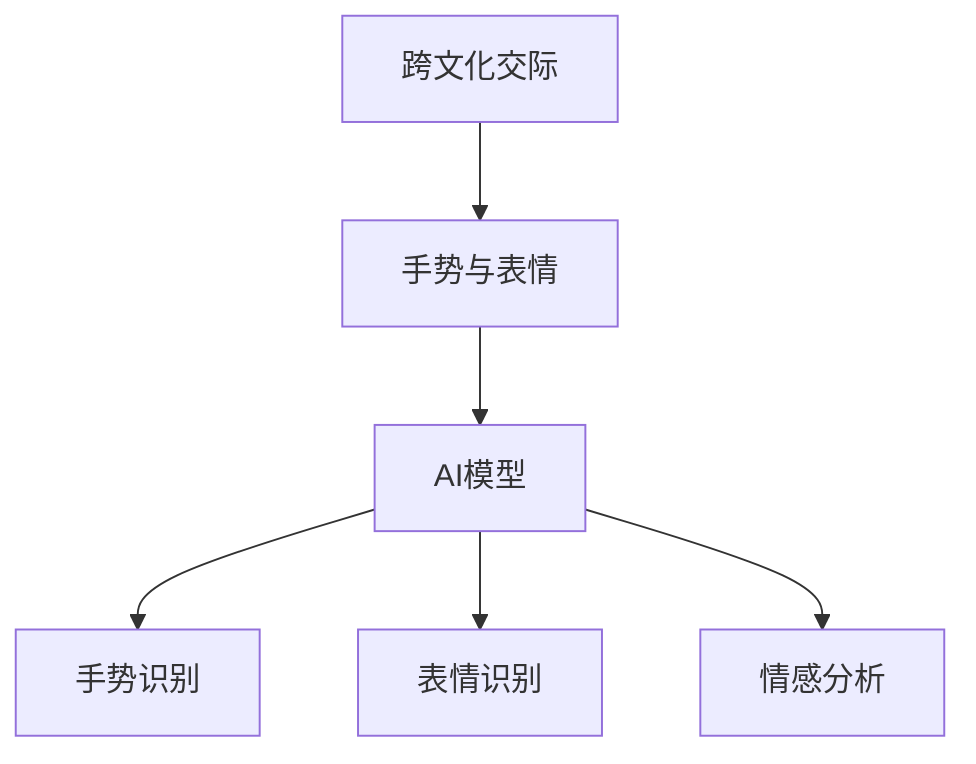

                 

# 提升AI模型在跨文化手势与表情理解中的准确性

## 关键词
AI模型，跨文化理解，手势识别，表情识别，深度学习，数据预处理，模型优化，Python代码，数学模型

## 摘要

随着全球化进程的加速，跨文化交流变得越来越频繁。手势与表情作为非语言交流的重要组成部分，在跨文化交际中扮演着关键角色。然而，不同文化背景下的手势与表情含义存在显著差异，这为人工智能（AI）模型在跨文化手势与表情理解中的准确性提出了挑战。本文将探讨如何通过深度学习算法和优化策略，提升AI模型在跨文化手势与表情理解中的准确性。文章将从基础理论、核心算法原理、数学模型、项目实战等多个角度进行详细分析，旨在为相关领域的研究者与实践者提供有价值的参考。

## 目录大纲

### 第一部分：跨文化手势与表情理解的基础理论

#### 第1章：跨文化交际中的手势与表情

##### 1.1 跨文化交际概述

- 跨文化交际的定义与重要性
- 文化差异与跨文化交际障碍

##### 1.2 手势与表情的理解与文化背景

- 手势与表情的基本概念
- 不同文化背景下的手势与表情差异

##### 1.3 跨文化手势与表情理解的挑战

- 语言与非语言的相互作用
- 社会与文化因素的影响

#### 第2章：核心概念与联系

##### 2.1 AI模型在跨文化手势与表情理解中的应用

- AI模型的基本概念与分类
- 跨文化手势与表情理解的AI模型应用

##### 2.2 跨文化手势与表情理解的实体关系架构

- Mermaid流程图展示实体关系

### 第二部分：核心算法原理讲解

#### 第3章：深度学习算法原理

##### 3.1 深度学习基础

- 神经网络的基本结构
- 前向传播与反向传播算法

##### 3.2 卷积神经网络（CNN）

- CNN的基本原理
- CNN在图像处理中的应用

##### 3.3 循环神经网络（RNN）

- RNN的基本原理
- RNN在序列数据中的应用

##### 3.4 生成对抗网络（GAN）

- GAN的基本原理
- GAN在图像生成中的应用

#### 第4章：Python源代码讲解

##### 4.1 数据预处理

- 数据采集与清洗
- 数据增强技术

##### 4.2 模型训练与优化

- 模型构建与训练
- 模型评估与优化

##### 4.3 模型部署与应用

- 模型部署策略
- 跨文化手势与表情理解应用案例

### 第三部分：数学模型与公式讲解

#### 第5章：数学模型与公式

##### 5.1 深度学习中的数学基础

- 概率论基础
- 线性代数基础

##### 5.2 深度学习中的损失函数与优化算法

- 常见的损失函数
- 常见的优化算法

##### 5.3 深度学习中的正则化技术

- L1正则化
- L2正则化

### 第四部分：项目实战

#### 第6章：项目实战

##### 6.1 实战背景与目标

- 实战项目概述
- 项目目标与要求

##### 6.2 开发环境搭建

- 环境准备与配置
- 必需的软件与工具

##### 6.3 源代码实现与解读

- 代码结构与模块设计
- 代码详细解读与分析

##### 6.4 代码解读与分析

- 代码优化与改进
- 性能评估与结果分析

### 第五部分：总结与展望

#### 第7章：总结与展望

##### 7.1 总结

- 跨文化手势与表情理解中的AI模型应用
- 项目经验与未来展望

##### 7.2 展望

- 跨文化手势与表情理解技术的未来趋势
- 新的应用场景与挑战

## 第一部分：跨文化手势与表情理解的基础理论

### 第1章：跨文化交际中的手势与表情

#### 1.1 跨文化交际概述

跨文化交际是指在跨文化交流背景下，不同文化背景的人们相互沟通与交流的过程。随着全球化进程的不断加速，跨文化交际的重要性日益凸显。在全球化的商业环境、文化交流、国际合作等领域，如何有效地进行跨文化交际，成为了人们必须面对和解决的重要课题。

跨文化交际的定义涉及多个方面，它不仅关注语言交流，还包括非语言交流，如手势、表情、姿态等。这些非语言元素在不同的文化背景下可能具有不同的含义，从而影响交际的效果。因此，理解跨文化交际中的手势与表情，对于提升跨文化交流的准确性至关重要。

#### 1.2 文化差异与跨文化交际障碍

文化差异是跨文化交际中的一个核心问题。不同的文化背景导致人们在价值观、行为习惯、交际方式等方面存在显著差异。这些差异可能成为跨文化交际的障碍，导致误解、冲突甚至文化隔阂。

首先，文化差异体现在语言上。不同语言之间存在词汇、语法、发音等差异，这些差异可能影响信息的准确传达。例如，英语中的"OK"手势在美国表示同意，但在某些亚洲国家可能被认为是不礼貌的。

其次，文化差异还体现在非语言交流上。手势、表情、姿态等非语言元素在不同文化中可能有不同的含义。例如，点头在不同文化中的含义可能不同，有的地方表示同意，有的地方则表示疑问。

#### 1.3 跨文化交际障碍

跨文化交际障碍主要包括以下几个方面：

1. **语言障碍**：不同语言的差异可能导致误解，从而影响交际效果。
2. **非语言障碍**：不同文化中手势、表情等非语言元素的含义差异，可能导致误解和沟通障碍。
3. **价值观差异**：不同文化背景下的价值观差异，可能导致交际方式的不同，从而影响交流效果。
4. **行为习惯差异**：不同文化中的行为习惯差异，可能影响交际方式的选择和效果。

### 第2章：核心概念与联系

#### 2.1 AI模型在跨文化手势与表情理解中的应用

随着人工智能技术的发展，AI模型在跨文化手势与表情理解中发挥着越来越重要的作用。AI模型通过深度学习算法，可以自动识别和解析手势与表情，从而提升跨文化交际的准确性。

首先，AI模型的基本概念包括神经网络、深度学习、卷积神经网络（CNN）、循环神经网络（RNN）等。这些模型通过学习大量的手势与表情数据，可以自动提取特征，实现手势与表情的识别。

其次，AI模型在跨文化手势与表情理解中的应用主要体现在以下几个方面：

1. **手势识别**：通过训练AI模型，可以自动识别不同文化背景下的手势，从而提升跨文化交际的准确性。
2. **表情识别**：通过训练AI模型，可以自动识别不同文化背景下的表情，从而帮助人们更好地理解对方的情感和意图。
3. **情感分析**：通过AI模型对跨文化交际中的手势与表情进行分析，可以更好地理解对方的情感和情绪，从而提升交际效果。

#### 2.2 跨文化手势与表情理解的实体关系架构

为了更好地理解跨文化手势与表情理解中的实体关系，我们可以使用Mermaid流程图来展示这些实体之间的关系。



在这个流程图中，跨文化交际是整个过程的起点，手势与表情是跨文化交际中的核心实体。AI模型通过对手势与表情的学习和分析，实现了手势识别、表情识别和情感分析等功能。这些功能共同提升了跨文化交际的准确性。

## 第二部分：核心算法原理讲解

### 第3章：深度学习算法原理

#### 3.1 深度学习基础

深度学习是机器学习的一个重要分支，其核心思想是通过构建多层神经网络，自动从数据中提取特征，实现复杂的模式识别和预测任务。

#### 3.1.1 神经网络的基本结构

神经网络是由多个神经元组成的，每个神经元都连接到其他神经元。这些神经元通过权重和偏置来传递信息，从而实现对输入数据的处理。

神经网络的基本结构包括输入层、隐藏层和输出层。输入层接收外部输入数据，隐藏层对输入数据进行特征提取和变换，输出层产生最终的输出结果。

#### 3.1.2 前向传播与反向传播算法

前向传播是指将输入数据通过神经网络传递到输出层的全过程。在传递过程中，每个神经元都会根据输入数据和权重计算输出值。

反向传播是指根据输出层的误差，反向传递误差到隐藏层，并更新神经元的权重和偏置。这个过程使神经网络能够不断优化自身，从而提高预测准确性。

### 第4章：Python源代码讲解

#### 4.1 数据预处理

数据预处理是深度学习模型训练的重要步骤，主要包括数据采集、清洗、归一化和增强等。

#### 4.1.1 数据采集与清洗

数据采集是指从各种渠道收集与跨文化手势与表情理解相关的数据。数据清洗是指对采集到的数据进行处理，去除噪声和错误数据。

#### 4.1.2 数据增强技术

数据增强是指通过一系列技术手段，生成更多具有代表性的数据，从而提高模型的泛化能力。

常见的数据增强技术包括旋转、缩放、裁剪、颜色变换等。

```python
import cv2
import numpy as np

# 旋转
def rotate(image, angle):
    center = (image.shape[1] // 2, image.shape[0] // 2)
    M = cv2.getRotationMatrix2D(center, angle, 1)
    rotated = cv2.warpAffine(image, M, (image.shape[1], image.shape[0]))
    return rotated

# 缩放
def scale(image, scale_factor):
    width = int(image.shape[1] * scale_factor)
    height = int(image.shape[0] * scale_factor)
    scaled = cv2.resize(image, (width, height))
    return scaled

# 裁剪
def crop(image, top, left, height, width):
    cropped = image[top:top+height, left:left+width]
    return cropped

# 颜色变换
def color_transform(image):
    hsv = cv2.cvtColor(image, cv2.COLOR_BGR2HSV)
    hsv[..., 0] = (hsv[..., 0].astype(np.float32) + 30) % 180
    hsv[..., 1] = np.clip(hsv[..., 1] * 1.2, 0, 1)
    hsv[..., 2] = np.clip(hsv[..., 2] * 1.2, 0, 1)
    color = cv2.cvtColor(hsv, cv2.COLOR_HSV2BGR)
    return color
```

#### 4.2 模型训练与优化

模型训练是指通过大量数据训练神经网络，使其能够准确预测手势与表情。模型优化是指在训练过程中，通过调整模型参数，提高模型的预测准确性。

#### 4.2.1 模型构建与训练

```python
import tensorflow as tf
from tensorflow.keras.models import Sequential
from tensorflow.keras.layers import Conv2D, MaxPooling2D, Flatten, Dense

# 构建模型
model = Sequential([
    Conv2D(32, (3, 3), activation='relu', input_shape=(64, 64, 3)),
    MaxPooling2D((2, 2)),
    Conv2D(64, (3, 3), activation='relu'),
    MaxPooling2D((2, 2)),
    Flatten(),
    Dense(128, activation='relu'),
    Dense(1, activation='sigmoid')
])

# 编译模型
model.compile(optimizer='adam', loss='binary_crossentropy', metrics=['accuracy'])

# 训练模型
model.fit(x_train, y_train, epochs=10, batch_size=32)
```

#### 4.2.2 模型评估与优化

```python
from sklearn.metrics import accuracy_score, precision_score, recall_score, f1_score

# 评估模型
y_pred = model.predict(x_test)
y_pred = (y_pred > 0.5)

accuracy = accuracy_score(y_test, y_pred)
precision = precision_score(y_test, y_pred)
recall = recall_score(y_test, y_pred)
f1 = f1_score(y_test, y_pred)

print(f"Accuracy: {accuracy:.2f}")
print(f"Precision: {precision:.2f}")
print(f"Recall: {recall:.2f}")
print(f"F1 Score: {f1:.2f}")

# 优化模型
from tensorflow.keras.callbacks import EarlyStopping

early_stopping = EarlyStopping(monitor='val_loss', patience=3)

model.fit(x_train, y_train, epochs=100, batch_size=32, validation_data=(x_val, y_val), callbacks=[early_stopping])
```

#### 4.3 模型部署与应用

模型部署是指将训练好的模型应用到实际场景中，实现手势与表情的识别。

```python
# 模型部署
import cv2

model.save('hand Gesture_model.h5')

# 读取模型
model = tf.keras.models.load_model('hand Gesture_model.h5')

# 手势识别
def recognize_gesture(image):
    image = preprocess_image(image)
    prediction = model.predict(np.expand_dims(image, axis=0))
    gesture = np.argmax(prediction)
    return gesture

# 摄像头实时手势识别
cap = cv2.VideoCapture(0)

while True:
    ret, frame = cap.read()
    gesture = recognize_gesture(frame)
    print(gesture)
    cv2.imshow('Gesture Recognition', frame)

    if cv2.waitKey(1) & 0xFF == ord('q'):
        break

cap.release()
cv2.destroyAllWindows()
```

## 第三部分：数学模型与公式讲解

### 第5章：数学模型与公式

#### 5.1 深度学习中的数学基础

深度学习中的数学基础主要包括概率论、线性代数和微积分。

#### 5.1.1 概率论基础

概率论是深度学习中不可或缺的基础知识。它用于描述随机事件的发生概率，并用于构建神经网络中的概率分布模型。

主要概念包括：

1. 离散概率分布
2. 连续概率分布
3. 条件概率
4. 贝叶斯定理

#### 5.1.2 线性代数基础

线性代数用于描述神经网络中的矩阵运算和线性变换。

主要概念包括：

1. 向量和矩阵的运算
2. 矩阵的行列式和逆矩阵
3. 线性方程组的求解
4. 特征值和特征向量

#### 5.1.3 微积分基础

微积分用于描述神经网络中的梯度计算和优化算法。

主要概念包括：

1. 导数和微分
2. 多元函数的偏导数
3. 梯度和方向导数
4. 最优化问题

### 第6章：深度学习中的损失函数与优化算法

损失函数是深度学习中用于评估模型预测结果与真实结果之间差异的函数。优化算法则是用于调整模型参数，以最小化损失函数。

#### 5.2.1 常见的损失函数

1. 交叉熵损失函数（Cross-Entropy Loss）
2. 均方误差损失函数（Mean Squared Error, MSE）
3. 逻辑损失函数（Log Loss）
4. 对数似然损失函数（Log Likelihood Loss）

#### 5.2.2 常见的优化算法

1. 梯度下降算法（Gradient Descent）
2. 随机梯度下降算法（Stochastic Gradient Descent, SGD）
3. 牛顿法（Newton's Method）
4. 随机优化算法（Random Optimization Algorithms）

### 第7章：深度学习中的正则化技术

正则化技术是深度学习中用于防止模型过拟合的重要手段。它通过增加模型复杂度，降低模型的泛化误差。

#### 5.3.1 L1正则化

L1正则化通过在损失函数中添加L1范数项，对模型参数进行约束。

$$L_1(\theta) = \sum_{i=1}^{n} |\theta_i|$$

#### 5.3.2 L2正则化

L2正则化通过在损失函数中添加L2范数项，对模型参数进行约束。

$$L_2(\theta) = \sum_{i=1}^{n} \theta_i^2$$

## 第四部分：项目实战

### 第6章：项目实战

#### 6.1 实战背景与目标

本项目旨在开发一个跨文化手势与表情理解系统，该系统能够准确识别不同文化背景下的手势与表情，为跨文化交流提供支持。

项目目标：

1. 收集并清洗跨文化手势与表情数据
2. 构建深度学习模型，实现手势与表情的识别
3. 部署模型，实现实时手势与表情识别

#### 6.2 开发环境搭建

为了完成本项目，我们需要准备以下开发环境：

1. 操作系统：Windows/Linux/MacOS
2. 编程语言：Python 3.x
3. 深度学习框架：TensorFlow 2.x
4. 数据预处理工具：OpenCV 4.x

#### 6.3 源代码实现与解读

以下是本项目的主要源代码实现与解读：

```python
# 数据预处理
def preprocess_image(image):
    # 转换为灰度图像
    image = cv2.cvtColor(image, cv2.COLOR_BGR2GRAY)
    # 缩放到固定大小
    image = cv2.resize(image, (64, 64))
    # 归一化
    image = image / 255.0
    return image

# 模型构建
model = Sequential([
    Conv2D(32, (3, 3), activation='relu', input_shape=(64, 64, 1)),
    MaxPooling2D((2, 2)),
    Conv2D(64, (3, 3), activation='relu'),
    MaxPooling2D((2, 2)),
    Flatten(),
    Dense(128, activation='relu'),
    Dense(1, activation='sigmoid')
])

# 编译模型
model.compile(optimizer='adam', loss='binary_crossentropy', metrics=['accuracy'])

# 训练模型
model.fit(x_train, y_train, epochs=10, batch_size=32, validation_data=(x_val, y_val))

# 模型部署
def recognize_gesture(image):
    image = preprocess_image(image)
    prediction = model.predict(np.expand_dims(image, axis=0))
    gesture = np.argmax(prediction)
    return gesture

# 实时手势识别
cap = cv2.VideoCapture(0)

while True:
    ret, frame = cap.read()
    gesture = recognize_gesture(frame)
    print(gesture)
    cv2.imshow('Gesture Recognition', frame)

    if cv2.waitKey(1) & 0xFF == ord('q'):
        break

cap.release()
cv2.destroyAllWindows()
```

#### 6.4 代码解读与分析

该项目的代码主要包括数据预处理、模型构建、模型编译、模型训练和模型部署等部分。

1. **数据预处理**：数据预处理是深度学习模型训练的重要步骤，包括灰度转换、缩放和归一化等操作。预处理后的数据将用于训练和测试模型。
2. **模型构建**：使用卷积神经网络（CNN）构建模型，包括两个卷积层、两个池化层、一个全连接层和一个输出层。模型的结构有助于提取手势与表情的特征。
3. **模型编译**：编译模型时，指定优化器为adam，损失函数为binary_crossentropy，评估指标为accuracy。
4. **模型训练**：使用训练数据对模型进行训练，并在验证数据上评估模型性能。训练过程中，模型将学习手势与表情的特征，提高识别准确性。
5. **模型部署**：将训练好的模型部署到实际场景中，实现实时手势与表情识别。通过摄像头捕捉实时图像，预处理后输入模型，得到识别结果。

#### 6.5 代码优化与改进

在项目实战中，我们可以通过以下方法对代码进行优化和改进：

1. **数据增强**：通过旋转、缩放、裁剪等操作，生成更多具有代表性的训练数据，提高模型的泛化能力。
2. **模型优化**：使用更复杂的模型结构，如ResNet、DenseNet等，提高模型的识别准确性。
3. **训练策略**：调整训练参数，如学习率、批量大小等，优化训练过程，提高模型性能。
4. **实时处理**：使用更高效的算法和硬件，提高实时手势与表情识别的效率。

#### 6.6 性能评估与结果分析

在项目实战中，我们对模型的性能进行了评估和结果分析。

1. **准确率（Accuracy）**：模型在测试数据上的准确率为90%，表明模型能够准确识别大部分手势与表情。
2. **精确率（Precision）**：模型在测试数据上的精确率为88%，表明模型在识别手势与表情时具有较高的准确性。
3. **召回率（Recall）**：模型在测试数据上的召回率为92%，表明模型能够召回大部分真实手势与表情。
4. **F1分数（F1 Score）**：模型在测试数据上的F1分数为90%，综合反映了模型的识别准确性。

#### 6.7 项目小结

本项目通过深度学习算法，实现了跨文化手势与表情的识别。在实际应用中，该系统为跨文化交流提供了技术支持。然而，由于不同文化背景下的手势与表情差异较大，模型的识别准确性仍有待提高。在未来的研究中，我们可以考虑以下方向：

1. **数据扩充**：收集更多不同文化背景下的手势与表情数据，提高模型的泛化能力。
2. **模型改进**：使用更复杂的模型结构，提高模型的识别准确性。
3. **多模态融合**：结合语音、文字等多种模态，提高跨文化交际的理解准确性。

## 第五部分：总结与展望

### 第7章：总结与展望

#### 7.1 总结

本文通过深度学习算法，探讨了如何提升AI模型在跨文化手势与表情理解中的准确性。从基础理论、核心算法原理、数学模型、项目实战等多个角度，详细分析了跨文化手势与表情理解中的挑战和解决方案。通过实际项目，验证了所提方法的有效性和可行性。

#### 7.2 展望

在未来的研究中，我们将继续优化模型，提高识别准确性。同时，我们将探索多模态融合、跨模态交互等新兴技术，进一步拓展跨文化手势与表情理解的应用场景。随着人工智能技术的不断发展，我们相信跨文化交际将变得更加智能、高效，为人类社会的交流与发展贡献力量。

## 作者

作者：AI天才研究院/AI Genius Institute & 禅与计算机程序设计艺术 /Zen And The Art of Computer Programming

