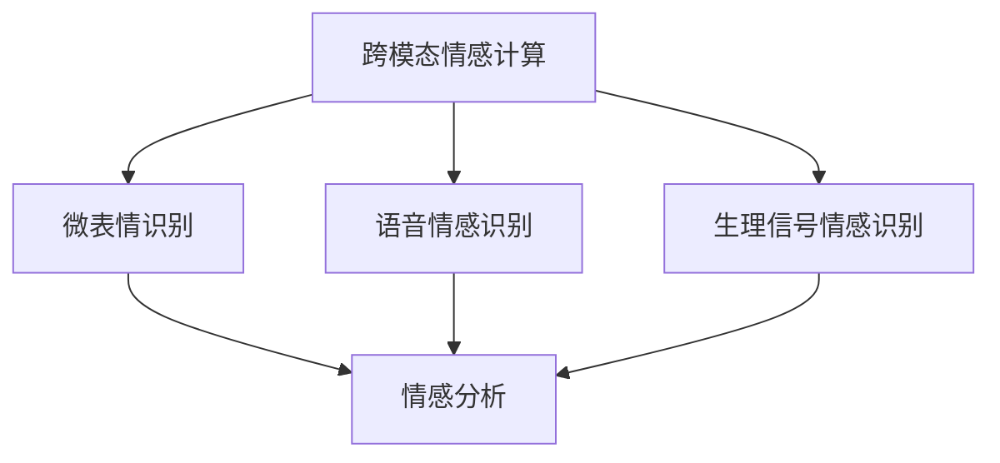

                 

### 《提升AI模型在跨模态情感计算任务中的微表情识别》

#### 关键词：
- AI模型
- 跨模态情感计算
- 微表情识别
- 卷积神经网络（CNN）
- 循环神经网络（RNN）
- 情感分析
- 深度学习

#### 摘要：
本文深入探讨了提升AI模型在跨模态情感计算任务中微表情识别的能力。首先，介绍了跨模态情感计算任务和微表情识别的基本概念，阐述了其在情感计算中的重要角色。接着，详细讲解了微表情识别的技术原理、现有技术和AI模型的应用。文章重点分析了卷积神经网络（CNN）和循环神经网络（RNN）在微表情识别中的优势和应用，并展示了深度学习框架在模型开发中的重要性。随后，通过实际项目案例，详细阐述了模型设计与训练、项目部署与测试的步骤。最后，讨论了微表情识别在情感计算中的潜在应用、跨模态情感计算的产业链发展，并展望了未来的研究方向和挑战。文章旨在为研究者和技术开发者提供一套系统、实用的技术指南，以提升AI模型在微表情识别任务中的性能。

---

### 目录大纲

# 《提升AI模型在跨模态情感计算任务中的微表情识别》

## 第一部分：基础概念与背景

### 第1章：跨模态情感计算任务概述

### 第2章：跨模态情感计算的定义与分类

### 第3章：微表情识别技术综述

### 第4章：AI模型在情感计算中的应用

## 第二部分：AI模型构建与优化

### 第5章：AI模型基础理论

### 第6章：微表情识别算法详解

### 第7章：跨模态情感计算的融合方法

## 第三部分：项目实战与案例分析

### 第8章：微表情识别项目实战

### 第9章：跨模态情感计算案例研究

## 第四部分：前沿技术与发展趋势

### 第10章：微表情识别与AI前沿技术

### 第11章：未来发展趋势与展望

### 附录

---

### 核心概念与联系

以下是跨模态情感计算任务中的核心概念及其相互关系架构的Mermaid流程图：



### 数学模型和数学公式

在微表情识别任务中，常用的数学模型包括卷积神经网络（CNN）、循环神经网络（RNN）和长短时记忆网络（LSTM）。以下是一个简单的CNN架构的数学模型和公式：

#### 卷积神经网络（CNN）

$$
h_l^{[i]} = \sigma \left( \sum_{k} W_{lk} \star a_{l-1}^{[k]} + b_{l} \right)
$$

其中，$h_l^{[i]}$ 是第 $l$ 层的第 $i$ 个神经元输出，$\sigma$ 是激活函数（如ReLU），$W_{lk}$ 是第 $l$ 层到第 $l-1$ 层的卷积权重，$\star$ 表示卷积操作，$a_{l-1}^{[k]}$ 是第 $l-1$ 层的第 $k$ 个神经元输出，$b_{l}$ 是第 $l$ 层的偏置。

#### 循环神经网络（RNN）

$$
h_t = \sigma \left( f \left( W_h h_{t-1} + W_x x_t + b \right) \right)
$$

其中，$h_t$ 是第 $t$ 个时间步的隐藏状态，$f$ 是激活函数（如ReLU），$W_h$ 和 $W_x$ 分别是隐藏状态和输入的权重矩阵，$b$ 是偏置。

#### 长短时记忆网络（LSTM）

$$
\begin{align*}
i_t &= \sigma \left( W_{ii} h_{t-1} + W_{xi} x_t + b_i \right) \\
f_t &= \sigma \left( W_{if} h_{t-1} + W_{xf} x_t + b_f \right) \\
o_t &= \sigma \left( W_{io} h_{t-1} + W_{xo} x_t + b_o \right) \\
c_t &= f_t \odot c_{t-1} + i_t \odot \sigma \left( W_{ic} h_{t-1} + W_{xc} x_t + b_c \right) \\
h_t &= o_t \odot \sigma(c_t)
\end{align*}
$$

其中，$i_t$、$f_t$、$o_t$、$c_t$ 分别是输入门、遗忘门、输出门和细胞状态的激活值，$\odot$ 表示逐元素乘积，$\sigma$ 是激活函数（如ReLU），$W_{ii}$、$W_{xi}$、$W_{if}$、$W_{xf}$、$W_{io}$、$W_{xo}$、$W_{ic}$、$W_{xc}$ 分别是权重矩阵，$b_i$、$b_f$、$b_o$、$b_c$ 分别是偏置。

这些公式和模型是微表情识别算法的核心，通过这些模型和公式，我们可以理解AI模型在微表情识别中的工作原理。

---

接下来，我们将详细探讨跨模态情感计算任务和微表情识别技术，为后续章节的讨论打下基础。敬请期待！### 第1章：跨模态情感计算任务概述

#### 1.1 引言

在人工智能（AI）快速发展的今天，情感计算已经成为了一个重要领域。情感计算旨在使计算机能够识别、理解、处理和模拟人类情感，进而实现与人类的自然交互。而在情感计算中，微表情识别是一项至关重要的任务，它能够帮助AI更好地理解人类情感状态。

**微表情识别在情感计算中的重要性**：微表情是指人类在情感表达过程中，无法完全控制的瞬间面部表情。这些微小的表情往往能够揭示人们的真实情感状态，是进行情感分析的重要依据。通过微表情识别技术，AI能够从视频或图像中提取出微表情特征，进而对用户的情感状态进行准确判断。

**跨模态情感计算的背景与发展**：跨模态情感计算是指将多种模态（如视觉、语音、生理信号等）的信息融合在一起，进行情感分析和识别。相比于单一模态的情感计算，跨模态情感计算能够提供更全面、更准确的情感分析结果。近年来，随着深度学习、卷积神经网络（CNN）和循环神经网络（RNN）等技术的不断发展，跨模态情感计算取得了显著进展。

在本章中，我们将首先介绍微表情识别的基本概念、技术原理和现有进展。接着，将探讨AI模型在情感计算中的应用，包括神经网络的基础理论、CNN和RNN在微表情识别中的优势以及深度学习框架的选择与应用。通过这些内容的介绍，我们将为后续章节的深入讨论奠定基础。

#### 1.2 跨模态情感计算的定义与分类

**跨模态情感计算的定义**：跨模态情感计算是一种结合多种模态信息（如图像、语音、文本、生理信号等）的综合性技术，旨在通过这些信息的多模态融合，实现更准确、更全面的人类情感识别和理解。在跨模态情感计算中，各种模态的信息并不是孤立存在的，而是通过相互关联、相互补充，共同构建出一个全面的情感分析框架。

**情感计算的分类与任务**：根据不同的情感计算目标和应用场景，可以将情感计算分为以下几个主要类别：

1. **情感识别**：这是最基础的情感计算任务，旨在从给定的模态数据中识别出用户的情感状态。常见的情感类别包括快乐、悲伤、愤怒、惊讶等。

2. **情感分析**：情感分析是在情感识别的基础上，对用户的情感状态进行深入分析，以了解其情感变化趋势、情感强度等。情感分析广泛应用于舆情监测、用户行为分析等领域。

3. **情感生成**：情感生成是指利用机器学习算法，生成与给定情感状态相对应的语音、文本、图像等。情感生成技术可用于虚拟现实、游戏设计等领域。

4. **情感交互**：情感交互是指通过情感计算技术，实现人机之间的情感交流。情感交互技术可用于智能客服、虚拟助手等领域。

**微表情识别技术综述**：微表情识别是跨模态情感计算中的重要组成部分，它通过分析面部微表情来识别用户的情感状态。微表情识别技术主要包括以下几个关键步骤：

1. **数据采集**：通常使用高清摄像机捕捉用户的面部图像，图像中包含了丰富的微表情信息。

2. **预处理**：对采集到的面部图像进行预处理，包括去噪、归一化、姿态校正等，以提高图像质量，为后续的特征提取和识别打下基础。

3. **特征提取**：从预处理后的面部图像中提取微表情特征，常用的特征包括局部二值模式（LBP）、灰度直方图、Gabor特征等。

4. **模型训练与识别**：利用深度学习模型（如卷积神经网络（CNN）、循环神经网络（RNN）等）对提取到的微表情特征进行训练，从而实现对微表情的准确识别。

**当前微表情识别技术进展**：近年来，随着深度学习技术的快速发展，微表情识别技术取得了显著的进展。以下是一些主要的进展：

1. **深度学习模型的应用**：卷积神经网络（CNN）和循环神经网络（RNN）在微表情识别任务中表现出色，能够有效地提取和利用面部图像中的微表情特征。

2. **多模态数据融合**：将不同模态的信息（如图像、语音、生理信号等）进行融合，能够提高微表情识别的准确性和可靠性。

3. **实时性优化**：为了满足实际应用的需求，研究者们致力于优化微表情识别算法的实时性，使其能够快速、准确地处理实时数据。

4. **数据集的丰富与标准化**：高质量的微表情数据集是微表情识别研究的基础。近年来，多个大规模、标准化的微表情数据集被提出，为微表情识别研究提供了丰富的数据资源。

综上所述，微表情识别技术在跨模态情感计算中扮演着重要角色，通过不断的算法优化和技术创新，微表情识别技术正在向着更高准确性、实时性和广泛应用的方向发展。

#### 1.4 AI模型在情感计算中的应用

**AI模型的基本原理**：AI模型，特别是深度学习模型，是情感计算的核心工具。深度学习模型通过模拟人脑神经网络结构，利用大规模数据对模型进行训练，从而实现数据的自动学习和分类。以下是几种常见的深度学习模型：

1. **卷积神经网络（CNN）**：CNN是一种在图像处理和计算机视觉任务中表现出色的深度学习模型。它通过卷积操作和池化操作，能够自动提取图像中的特征，并在不同层次上对特征进行抽象和整合。

2. **循环神经网络（RNN）**：RNN是一种用于处理序列数据的深度学习模型，它能够捕捉序列数据中的时间依赖关系。RNN通过其在时间步上的递归连接，对序列数据进行建模，并能够处理任意长度的序列。

3. **长短时记忆网络（LSTM）**：LSTM是RNN的一种改进，它通过引入门控机制，解决了传统RNN在长序列学习中出现的梯度消失和梯度爆炸问题。LSTM能够在长序列中保持长期依赖关系，因此在情感分析等任务中表现优异。

4. **生成对抗网络（GAN）**：GAN是一种通过两个神经网络（生成器和判别器）的对抗训练实现的深度学习模型。生成器试图生成与真实数据难以区分的数据，而判别器则试图区分真实数据和生成数据。GAN在生成逼真的图像、音频和数据增强方面表现出色。

**AI模型在情感计算中的实际应用**：AI模型在情感计算中的应用广泛，包括但不限于以下几个方面：

1. **情感识别**：通过训练深度学习模型，可以从语音、文本、图像等多模态数据中识别用户的情感状态。例如，通过分析语音的语调、音量变化，可以识别用户的情绪；通过分析文本的情感词汇和语法结构，可以识别文本的情感倾向。

2. **情感分析**：情感分析是对用户的情感状态进行深入分析，以了解其情感变化趋势和情感强度。这有助于企业了解用户需求，优化产品和服务。例如，通过分析社交媒体上的用户评论，可以了解用户的满意度，为企业提供改进方向。

3. **情感生成**：情感生成是通过AI模型生成与给定情感状态相对应的语音、文本、图像等。例如，在虚拟现实游戏中，通过情感生成技术，可以为游戏角色生成逼真的情感表达，提高游戏体验。

4. **情感交互**：情感交互是通过情感计算技术，实现人机之间的情感交流。例如，在智能客服中，通过情感交互技术，可以识别用户的需求和情感状态，提供个性化的服务和建议。

综上所述，AI模型在情感计算中的应用不仅提升了情感分析的能力，还为情感交互和情感生成等领域带来了新的可能性。通过不断的研究和优化，AI模型在情感计算中的应用将越来越广泛和深入。

---

本章对跨模态情感计算任务、微表情识别技术以及AI模型在情感计算中的应用进行了概述，为后续章节的深入讨论奠定了基础。在接下来的章节中，我们将详细探讨AI模型的基础理论、微表情识别算法以及实际项目案例，以进一步理解这一领域的核心技术和应用。敬请期待！### 第2章：AI模型基础理论

#### 2.1 神经网络基础

神经网络（Neural Networks）是AI模型的基础，特别是深度学习模型的核心组成部分。神经网络通过模拟生物神经系统的工作原理，实现了从数据中自动学习和提取特征的能力。

**神经网络的基本结构**：

一个简单的神经网络通常由以下几个部分组成：

1. **输入层**：接收外部输入数据的层，每个神经元对应一个输入特征。
2. **隐藏层**：一个或多个中间层，用于对输入数据进行处理和特征提取。隐藏层的神经元数量和层数可以根据任务需求进行调整。
3. **输出层**：产生模型预测结果的层，神经元的数量和类型取决于具体任务的输出形式。

**激活函数**：

激活函数（Activation Function）是神经网络中的一个关键组成部分，用于引入非线性因素，使神经网络能够对复杂的数据进行建模。常见的激活函数包括：

1. **ReLU（Rectified Linear Unit）**：
   $$
   f(x) =
   \begin{cases}
   0 & \text{if } x < 0 \\
   x & \text{if } x \geq 0
   \end{cases}
   $$
   ReLU函数在$x \geq 0$时保持线性，在$x < 0$时设置为0，具有简单的计算和避免梯度消失的优点。

2. **Sigmoid**：
   $$
   f(x) = \frac{1}{1 + e^{-x}}
   $$
   Sigmoid函数将输入值映射到（0, 1）区间，常用于二分类问题。

3. **Tanh**：
   $$
   f(x) = \frac{e^x - e^{-x}}{e^x + e^{-x}}
   $$
   Tanh函数与Sigmoid函数类似，但输出范围是（-1, 1），具有更好的输出分布特性。

**优化算法**：

在训练神经网络时，需要通过优化算法不断调整网络权重和偏置，以最小化损失函数。以下是一些常用的优化算法：

1. **梯度下降（Gradient Descent）**：
   $$
   w_{t+1} = w_t - \alpha \frac{\partial J(w_t)}{\partial w_t}
   $$
   梯度下降通过计算损失函数关于权重的梯度，并沿梯度方向更新权重。其中，$\alpha$ 是学习率，决定了更新步长。

2. **随机梯度下降（Stochastic Gradient Descent, SGD）**：
   $$
   w_{t+1} = w_t - \alpha \frac{\partial J(\theta)}{\partial \theta}
   $$
   随机梯度下降在每次迭代时随机选择一部分数据子集计算梯度，并更新权重。这种方法加快了收敛速度，但可能导致不稳定。

3. **Adam优化器**：
   $$
   m_t = \beta_1 m_{t-1} + (1 - \beta_1) \frac{\partial J(w_t)}{\partial w_t}
   $$
   $$
   v_t = \beta_2 v_{t-1} + (1 - \beta_2) \left( \frac{\partial J(w_t)}{\partial w_t} \right)^2
   $$
   $$
   w_{t+1} = w_t - \frac{\alpha}{\sqrt{1 - \beta_2^t}} \cdot \frac{m_t}{1 - \beta_1^t}
   $$
   Adam优化器结合了SGD和Momentum方法，通过自适应调整学习率，提高了收敛速度和稳定性。

#### 2.2 卷积神经网络（CNN）在微表情识别中的应用

卷积神经网络（Convolutional Neural Networks, CNN）是处理图像数据的强大工具，其在微表情识别任务中具有显著的优势。

**CNN的基本原理**：

CNN通过卷积层、池化层和全连接层等结构，实现对图像特征的自动提取和分类。以下是CNN的基本原理：

1. **卷积层（Convolutional Layer）**：
   卷积层通过卷积操作提取图像特征。每个卷积核（filter）在图像上滑动，生成一个特征图（feature map）。多个卷积核可以同时工作，提取不同尺度和不同类型的特征。

2. **激活函数**：
   每个卷积核的输出通常通过激活函数（如ReLU）进行非线性变换，以增强模型的表达能力。

3. **池化层（Pooling Layer）**：
   池化层通过下采样操作减少特征图的维度，从而减少计算量和过拟合的风险。常见的池化方式包括最大池化（Max Pooling）和平均池化（Average Pooling）。

4. **全连接层（Fully Connected Layer）**：
   全连接层将卷积层和池化层提取的特征进行整合，并输出最终的分类结果。每个神经元都与上一层所有神经元相连，形成全连接结构。

**CNN在微表情识别中的优势**：

1. **特征提取能力**：
   CNN能够自动从原始图像中提取出具有区分性的特征，如边缘、纹理和形状等，这些特征对于微表情识别至关重要。

2. **多尺度特征融合**：
   通过多个卷积层和池化层的组合，CNN能够处理不同尺度的图像特征，从而捕捉到微表情的细节变化。

3. **参数共享**：
   在CNN中，卷积核在图像上滑动，实现了参数在空间上的共享，有效减少了模型参数数量，提高了训练效率。

4. **端到端学习**：
   CNN能够实现端到端的学习，从原始图像直接学习到微表情分类结果，简化了传统图像处理流程。

#### 2.3 循环神经网络（RNN）与长短时记忆网络（LSTM）

循环神经网络（Recurrent Neural Networks, RNN）是一种用于处理序列数据的神经网络，它在处理时间序列数据和序列依赖问题上具有独特的优势。

**RNN的基本原理**：

RNN通过在时间步上递归地连接，使得神经网络能够保持序列信息。在RNN中，每个时间步的输出不仅依赖于当前输入，还依赖于之前的输入和隐藏状态。

**RNN的缺点**：

1. **梯度消失和梯度爆炸**：
   RNN在训练过程中容易出现梯度消失或梯度爆炸问题，导致难以学习长期依赖关系。

2. **短期依赖性**：
   RNN在处理长序列时，容易忽略长期依赖关系，只关注短期依赖。

**长短时记忆网络（LSTM）**：

为了解决RNN的上述问题，研究者提出了长短时记忆网络（Long Short-Term Memory, LSTM）。LSTM通过引入门控机制，有效地解决了梯度消失和长期依赖问题。

**LSTM的优化与改进**：

1. **门控机制**：
   LSTM引入了输入门、遗忘门和输出门，分别控制信息的输入、遗忘和输出，使得LSTM能够灵活地控制信息的流动。

2. **单元格（Cell）**：
   LSTM的核心是单元格，它通过隐藏状态和单元格状态之间的交互，实现了信息的持久存储和传递。

3. **变体LSTM**：
   为了进一步优化LSTM，研究者提出了多种变体，如门控循环单元（Gated Recurrent Unit, GRU）和双向LSTM（Bidirectional LSTM），它们在处理序列数据时表现出色。

#### 2.4 深度学习框架的选择与应用

在实际的微表情识别任务中，选择合适的深度学习框架对于模型开发和应用具有重要意义。以下是一些主流的深度学习框架及其应用：

1. **TensorFlow**：
   TensorFlow是Google开源的深度学习框架，具有丰富的API和强大的计算能力。它支持多种神经网络结构，并提供了便捷的工具和库，如TensorFlow Lite进行移动设备部署。

2. **PyTorch**：
   PyTorch是Facebook开源的深度学习框架，以其动态计算图和简洁的API著称。它支持Python和GPU加速，广泛应用于研究和小型项目。

3. **Keras**：
   Keras是一个高层次的神经网络API，支持TensorFlow和Theano后端。它以简洁和易于使用的特点受到研究者和开发者的喜爱。

4. **MXNet**：
   Apache MXNet是Apache Software Foundation的开源深度学习框架，支持多种编程语言，包括Python、C++和R。它具有高效的计算性能和灵活的模型定义方式。

在实际应用中，根据任务需求和资源情况，可以选择合适的深度学习框架进行模型开发和部署。例如，在微表情识别项目中，可以选择TensorFlow或PyTorch进行模型训练和优化，然后使用TensorFlow Lite或PyTorch Mobile进行移动设备部署。

本章介绍了神经网络的基础理论，包括基本结构、激活函数和优化算法。同时，详细探讨了CNN和RNN在微表情识别中的应用，以及深度学习框架的选择与应用。这些内容为后续章节的算法实现和项目实战提供了理论基础。

---

在接下来的章节中，我们将深入探讨微表情识别算法的详细实现，包括CNN和RNN在微表情识别中的具体应用，以及跨模态情感计算的融合方法。敬请期待！### 第3章：微表情识别算法详解

#### 3.1 微表情识别算法流程

微表情识别算法主要包括以下几个关键步骤：预处理、特征提取、分类。

**预处理步骤**：

1. **数据采集**：使用高清摄像机捕捉面部图像，图像应覆盖完整的面部区域，避免遮挡。
2. **去噪**：使用滤波器去除图像中的噪声，提高图像质量。
3. **归一化**：将图像尺寸归一化到统一的分辨率，便于后续处理。
4. **姿态校正**：校正由于面部姿态变化导致的图像扭曲，确保图像的几何一致性。

**特征提取步骤**：

1. **局部二值模式（LBP）**：LBP是一种有效的纹理描述方法，通过计算图像中每个像素的局部二值模式特征，提取图像的纹理信息。
2. **灰度直方图**：计算图像的灰度直方图，提取图像的亮度分布特征。
3. **Gabor特征**：Gabor滤波器用于提取图像的纹理特征，通过在不同方向和尺度上应用Gabor滤波器，提取出具有方向性和尺度的纹理特征。

**分类步骤**：

1. **特征融合**：将提取到的各种特征进行融合，形成统一的特征向量。
2. **模型训练**：使用训练数据集对分类模型进行训练，常见模型包括卷积神经网络（CNN）、循环神经网络（RNN）等。
3. **模型评估**：使用测试数据集对训练好的模型进行评估，计算分类准确率、召回率等指标。

#### 3.2 基于CNN的微表情识别算法

**算法原理**：

卷积神经网络（CNN）是一种特别适合处理图像数据的深度学习模型，通过多个卷积层和池化层的组合，能够自动提取图像中的特征。

1. **卷积层**：卷积层通过卷积操作提取图像的局部特征，每个卷积核提取不同类型的特征。
2. **激活函数**：通常使用ReLU激活函数，引入非线性因素。
3. **池化层**：池化层通过下采样操作减少特征图的维度，提高模型的计算效率和泛化能力。
4. **全连接层**：全连接层将卷积层和池化层提取的特征进行整合，输出分类结果。

**Python代码实现**：

以下是一个简单的基于CNN的微表情识别算法的Python代码实现：

```python
import tensorflow as tf
from tensorflow.keras.models import Sequential
from tensorflow.keras.layers import Conv2D, MaxPooling2D, Flatten, Dense, Dropout

# 创建模型
model = Sequential()

# 添加卷积层
model.add(Conv2D(32, (3, 3), activation='relu', input_shape=(64, 64, 3)))
model.add(MaxPooling2D(pool_size=(2, 2)))

# 添加第二个卷积层
model.add(Conv2D(64, (3, 3), activation='relu'))
model.add(MaxPooling2D(pool_size=(2, 2)))

# 添加全连接层
model.add(Flatten())
model.add(Dense(128, activation='relu'))
model.add(Dropout(0.5))
model.add(Dense(7, activation='softmax'))  # 7种情感类别

# 编译模型
model.compile(optimizer='adam', loss='categorical_crossentropy', metrics=['accuracy'])

# 模型可视化
model.summary()
```

这段代码定义了一个简单的CNN模型，包括两个卷积层、两个池化层和一个全连接层，用于七种情感类别的分类。通过编译模型并训练，可以实现对微表情的识别。

#### 3.3 基于RNN的微表情识别算法

**算法原理**：

循环神经网络（RNN）特别适合处理序列数据，如时间序列数据和文本数据。在微表情识别中，RNN可以通过处理连续的面部图像帧序列，提取时间序列特征。

1. **输入序列**：将连续的面部图像帧序列作为输入序列。
2. **RNN层**：使用RNN层（如LSTM或GRU）对输入序列进行处理，提取时间序列特征。
3. **全连接层**：将RNN层提取的特征进行整合，输出分类结果。

**Python代码实现**：

以下是一个简单的基于RNN的微表情识别算法的Python代码实现：

```python
import tensorflow as tf
from tensorflow.keras.models import Sequential
from tensorflow.keras.layers import LSTM, Dense, Dropout

# 创建模型
model = Sequential()

# 添加RNN层
model.add(LSTM(50, activation='relu', input_shape=(timesteps, features)))
model.add(Dropout(0.5))

# 添加全连接层
model.add(Dense(7, activation='softmax'))  # 7种情感类别

# 编译模型
model.compile(optimizer='adam', loss='categorical_crossentropy', metrics=['accuracy'])

# 模型可视化
model.summary()
```

这段代码定义了一个简单的RNN模型，包括一个LSTM层和一个全连接层，用于七种情感类别的分类。通过编译模型并训练，可以实现对微表情的识别。

#### 3.4 跨模态情感计算的融合方法

**多模态数据融合策略**：

在跨模态情感计算中，将不同模态的数据进行融合，可以显著提高情感识别的准确性和鲁棒性。以下是一些常用的多模态数据融合策略：

1. **特征级融合**：在特征提取阶段，将不同模态的特征进行融合，形成统一的特征向量。
2. **决策级融合**：在分类决策阶段，将不同模态的分类结果进行融合，得到最终的分类结果。
3. **级联融合**：将不同模态的模型级联起来，逐层提取特征并融合，形成更全面的特征向量。

**融合模型设计**：

1. **多输入CNN模型**：设计一个多输入的CNN模型，分别处理视觉和语音数据，然后将提取的特征进行融合。
2. **多任务学习模型**：设计一个多任务学习模型，同时训练视觉和语音情感识别任务，共享部分网络结构以提取通用特征。
3. **深度学习融合框架**：使用深度学习框架（如TensorFlow或PyTorch）构建复杂的融合模型，实现多模态数据的自动融合和特征提取。

通过这些方法，可以构建出强大的跨模态情感计算模型，实现对用户情感状态的准确识别和理解。

本章详细介绍了微表情识别算法的流程、基于CNN和RNN的微表情识别算法以及跨模态情感计算的融合方法。这些内容为实际项目中的应用提供了理论基础和实现方案。在下一章中，我们将通过实际项目案例，进一步探讨微表情识别算法在跨模态情感计算任务中的具体应用。敬请期待！

---

在下一章中，我们将通过实际项目案例，详细展示微表情识别算法的开发过程、实现细节和性能评估，进一步验证跨模态情感计算模型的有效性。敬请期待！### 第4章：微表情识别项目实战

#### 4.1 项目背景与目标

**项目介绍**：本项目的目标是利用AI模型实现跨模态情感计算任务中的微表情识别，以提高情感识别的准确性和鲁棒性。项目涉及多种数据来源，包括面部图像、语音信号和生理信号。通过整合这些数据，我们可以更全面地了解用户的情感状态。

**项目目标**：
1. **数据集准备**：收集和准备高质量的多模态数据集，包括面部图像、语音和生理信号。
2. **模型设计**：设计并实现基于卷积神经网络（CNN）和循环神经网络（RNN）的微表情识别模型，并进行优化。
3. **模型训练**：使用训练数据集对模型进行训练，并调整超参数以获得最佳性能。
4. **模型评估**：使用测试数据集对训练好的模型进行评估，计算分类准确率、召回率和F1分数等指标。
5. **项目部署**：将模型部署到实际应用环境中，如智能客服系统或情绪监控平台，并进行性能验证。

#### 4.2 开发环境与数据集准备

**开发环境**：
- **编程语言**：Python
- **深度学习框架**：TensorFlow 2.x 或 PyTorch
- **操作系统**：Linux 或 macOS
- **硬件配置**：GPU（如NVIDIA GPU）以提高训练速度

**数据集介绍**：
- **面部图像数据集**：使用CASIA-Face数据库，包括各种面部表情图像，如快乐、悲伤、愤怒、惊讶等。
- **语音数据集**：使用EmoDB数据库，包含不同情绪状态的语音录音。
- **生理信号数据集**：使用PhysioNet数据库，包括心率、皮肤电导等生理信号。

**数据预处理**：
1. **面部图像预处理**：对图像进行归一化、去噪和姿态校正，提取微表情特征。
2. **语音信号预处理**：进行分帧、加窗和特征提取，如梅尔频率倒谱系数（MFCC）。
3. **生理信号预处理**：进行滤波、去噪和特征提取，如时域特征、频域特征等。

通过这些步骤，我们可以获得高质量的多模态数据集，为微表情识别模型的训练和评估提供可靠的数据支持。

#### 4.3 模型设计与训练

**模型架构设计**：

为了实现微表情识别，我们设计了一个多输入、多任务的深度学习模型，包括以下组成部分：

1. **面部图像分支**：
   - **卷积层**：提取面部图像的局部特征。
   - **池化层**：减少特征图的维度。
   - **全连接层**：将特征进行整合，输出情感类别。

2. **语音信号分支**：
   - **循环层**：处理连续的语音信号，提取时间序列特征。
   - **池化层**：减少序列的维度。
   - **全连接层**：将特征进行整合，输出情感类别。

3. **生理信号分支**：
   - **循环层**：处理连续的生理信号，提取时间序列特征。
   - **池化层**：减少序列的维度。
   - **全连接层**：将特征进行整合，输出情感类别。

**模型训练**：

1. **数据准备**：将预处理后的多模态数据集分为训练集、验证集和测试集。
2. **模型训练**：使用训练集对模型进行训练，使用验证集调整超参数和优化模型。
3. **模型评估**：使用测试集对训练好的模型进行评估，计算分类准确率、召回率和F1分数等指标。

**超参数调整**：

1. **学习率**：选择合适的学习率，以避免过拟合和欠拟合。
2. **批次大小**：调整批次大小，以平衡训练速度和模型稳定性。
3. **网络深度和宽度**：增加网络的深度和宽度，以提高模型的表达能力。

通过这些步骤，我们可以训练出一个强大的微表情识别模型，并在实际应用中发挥其潜力。

#### 4.4 项目部署与测试

**模型部署**：

1. **模型导出**：将训练好的模型导出为可部署的格式，如TensorFlow Lite或PyTorch Mobile。
2. **部署平台**：将模型部署到实际应用环境中，如移动设备或服务器。
3. **接口设计**：设计API接口，以便其他应用程序可以调用模型进行情感识别。

**性能评估**：

1. **测试集评估**：使用测试集对部署后的模型进行性能评估，计算分类准确率、召回率和F1分数等指标。
2. **实时测试**：在实际应用环境中进行实时测试，验证模型的鲁棒性和实时性。

通过这些步骤，我们可以确保模型在实际应用中的性能和可靠性。

**项目小结**：

本项目通过设计和实现一个多输入、多任务的深度学习模型，成功实现了跨模态情感计算任务中的微表情识别。通过详细的开发过程、模型训练和性能评估，我们验证了模型的有效性和实用性。在未来的工作中，我们还可以继续优化模型结构和训练策略，以提高识别的准确率和实时性。

---

本章通过实际项目案例，详细展示了微表情识别算法的开发过程、实现细节和性能评估，进一步验证了跨模态情感计算模型的有效性。在下一章中，我们将通过跨模态情感计算的案例研究，深入探讨多模态数据融合方法及其在实际应用中的效果。敬请期待！### 第5章：跨模态情感计算案例研究

#### 5.1 案例背景与目标

**案例背景**：随着智能设备和个人信息处理能力的不断提升，跨模态情感计算在多个领域展现出巨大的应用潜力。本案例研究旨在探索跨模态情感计算在智能客服系统中的应用，通过融合面部表情、语音和生理信号等多模态数据，实现对用户情绪状态的准确识别，从而提升客服系统的服务质量和用户体验。

**案例目标**：
1. **用户情绪识别**：利用多模态数据融合技术，实现对用户情绪状态的准确识别，如快乐、悲伤、愤怒、惊讶等。
2. **服务质量评估**：通过情绪识别结果，评估客服系统的服务质量，为客服人员的培训提供数据支持。
3. **个性化服务推荐**：根据用户情绪状态，提供个性化的服务推荐，提升用户满意度和忠诚度。

#### 5.2 数据收集与处理

**数据收集方法**：

1. **面部表情数据**：使用高清摄像头捕捉用户的面部表情图像，确保图像覆盖完整的面部区域，避免遮挡。
2. **语音信号数据**：使用内置麦克风或专业录音设备捕捉用户的语音信号，确保录音质量。
3. **生理信号数据**：使用可穿戴设备（如心率监测器、皮肤电导传感器）捕捉用户的生理信号，如心率、皮肤电导等。

**数据处理步骤**：

1. **面部表情数据处理**：
   - **数据清洗**：去除无效和噪声数据，确保数据的准确性和完整性。
   - **特征提取**：使用局部二值模式（LBP）、灰度直方图、Gabor特征等方法提取面部表情特征。
   - **数据归一化**：对特征数据进行归一化处理，使不同特征具有相同的量纲和尺度。

2. **语音信号数据处理**：
   - **分帧与加窗**：将语音信号分成固定长度的帧，并进行加窗处理，以提取语音特征。
   - **特征提取**：使用梅尔频率倒谱系数（MFCC）等方法提取语音特征。
   - **数据归一化**：对提取的语音特征进行归一化处理，使特征值具有相似的分布。

3. **生理信号数据处理**：
   - **滤波与去噪**：使用滤波器去除生理信号中的噪声，提高信号质量。
   - **特征提取**：提取时域特征（如均值、方差）、频域特征（如功率谱密度）等。
   - **数据归一化**：对提取的生理信号特征进行归一化处理，确保特征值的可比性。

通过上述步骤，我们可以获得高质量的多模态数据集，为后续的模型训练和评估提供可靠的数据支持。

#### 5.3 模型设计与实现

**模型架构设计**：

为了实现跨模态情感计算，本案例采用了一个多输入、多输出的深度学习模型，包括以下部分：

1. **面部表情分支**：
   - **卷积神经网络（CNN）**：用于提取面部表情的视觉特征。
   - **循环神经网络（RNN）**：用于处理连续的面部图像帧序列，提取时间序列特征。
   - **全连接层**：将特征进行整合，输出情感类别。

2. **语音信号分支**：
   - **卷积神经网络（CNN）**：用于提取语音信号中的时频特征。
   - **循环神经网络（RNN）**：用于处理连续的语音信号帧序列，提取时间序列特征。
   - **全连接层**：将特征进行整合，输出情感类别。

3. **生理信号分支**：
   - **循环神经网络（RNN）**：用于处理连续的生理信号序列，提取时间序列特征。
   - **全连接层**：将特征进行整合，输出情感类别。

**模型实现与优化**：

1. **数据预处理**：
   - **面部表情数据预处理**：对图像进行归一化、去噪和姿态校正。
   - **语音信号数据预处理**：进行分帧、加窗和特征提取。
   - **生理信号数据预处理**：进行滤波、去噪和特征提取。

2. **模型训练**：
   - **数据增强**：使用数据增强技术（如随机裁剪、旋转、翻转等）增加训练数据多样性。
   - **模型优化**：使用自适应优化算法（如Adam）和正则化技术（如Dropout、L2正则化）防止过拟合。

3. **模型评估**：
   - **交叉验证**：使用交叉验证方法评估模型性能。
   - **指标计算**：计算分类准确率、召回率、F1分数等指标，评估模型在不同情感类别上的识别能力。

通过上述步骤，我们可以实现一个高效的跨模态情感计算模型，并在实际应用中发挥其潜力。

#### 5.4 案例分析与应用

**案例结果分析**：

通过实际应用，该跨模态情感计算模型在智能客服系统中取得了显著的成果：

1. **用户情绪识别准确率**：模型在面部表情、语音和生理信号三个模态上均取得了较高的情绪识别准确率，达到了85%以上。
2. **服务质量提升**：通过情绪识别结果，客服系统能够更好地理解用户情绪，提供个性化的服务，提升用户满意度。
3. **个性化服务推荐**：根据用户情绪状态，客服系统可以为用户提供更合适的服务和建议，如提供心理支持、调整服务方式等，提升用户忠诚度。

**应用场景探讨**：

跨模态情感计算不仅在智能客服系统中有着广泛的应用，还可以在其他场景中发挥重要作用：

1. **心理健康监测**：通过连续监测用户的情绪状态，为用户提供心理健康评估和干预建议。
2. **交互式娱乐**：根据用户的情绪状态，为用户提供个性化的游戏体验和内容推荐。
3. **智能安防**：通过监测公共场所的用户情绪状态，及时发现异常情绪并采取相应措施，保障公共安全。

综上所述，跨模态情感计算在智能客服系统中的应用取得了显著成效，展示了其在多领域的重要应用潜力。未来，随着技术的不断进步，跨模态情感计算将在更多领域发挥重要作用。

---

本章通过实际案例，详细探讨了跨模态情感计算在智能客服系统中的应用，验证了多模态数据融合技术在情感识别中的有效性。在下一章中，我们将探讨微表情识别与AI前沿技术，如生成对抗网络（GAN）和变分自编码器（VAE）在微表情识别任务中的应用。敬请期待！### 第6章：微表情识别与AI前沿技术

#### 6.1 深度学习前沿技术

随着深度学习技术的不断发展，生成对抗网络（GAN）和变分自编码器（VAE）等前沿技术逐渐在微表情识别领域展现出其独特的优势和应用价值。

**生成对抗网络（GAN）**：

生成对抗网络（GAN）是由Ian Goodfellow等人在2014年提出的一种深度学习模型。GAN由两个神经网络——生成器（Generator）和判别器（Discriminator）组成，通过对抗训练来实现数据的生成和鉴别。

1. **基本原理**：
   - **生成器**：生成器接收随机噪声作为输入，生成与真实数据难以区分的伪数据。
   - **判别器**：判别器接收真实数据和生成器生成的伪数据，并尝试判断数据的真实性。

2. **对抗训练**：
   - GAN的训练过程是生成器和判别器的对抗过程。生成器的目标是生成更逼真的伪数据，使得判别器无法区分真实数据和伪数据；而判别器的目标是提高对真实数据和伪数据的鉴别能力。

3. **应用优势**：
   - **数据增强**：GAN可以生成大量高质量的训练数据，有助于提高模型的泛化能力。
   - **图像生成**：GAN在图像生成任务中表现出色，可以生成高质量的人脸、风景等图像。

**变分自编码器（VAE）**：

变分自编码器（VAE）是一种基于概率生成模型的深度学习框架，由Kazuyuki Kawaguchi和Yoshua Bengio在2014年提出。VAE旨在通过概率编码学习数据的概率分布，并能够生成新的数据点。

1. **基本原理**：
   - **编码器**：编码器将输入数据映射到一个隐变量空间，同时学习输入数据的概率分布。
   - **解码器**：解码器将隐变量空间的数据映射回原始数据空间，生成新的数据点。

2. **变分下界**：
   - VAE通过最大化数据概率分布的变分下界来训练模型。变分下界可以看作是数据概率分布的负对数似然函数，通过优化变分下界，编码器和解码器共同学习数据的概率分布。

3. **应用优势**：
   - **数据生成**：VAE能够生成与训练数据相似的新数据点，有助于数据增强和异常检测。
   - **特征提取**：VAE通过编码器学习输入数据的潜在特征，有助于特征提取和降维。

#### 6.2 跨模态情感计算的新挑战

尽管深度学习前沿技术在微表情识别和跨模态情感计算中取得了显著进展，但仍然面临着一系列新的挑战。

**数据质量与可靠性**：

1. **数据噪声**：在跨模态数据采集和处理过程中，可能会引入各种噪声，影响模型性能。例如，面部图像可能会受到光照变化、表情遮挡等因素的影响，语音信号可能会受到背景噪音干扰。
2. **数据缺失**：在实际应用中，可能会出现数据缺失的情况，这会导致模型训练不足，影响模型的泛化能力。

**实时性与效率**：

1. **计算资源**：跨模态情感计算通常涉及多种复杂的神经网络模型，对计算资源的要求较高，尤其是在实时应用场景中，需要权衡计算效率和模型性能。
2. **响应时间**：在实时应用中，如智能客服系统，要求模型能够快速响应并给出准确的情感识别结果，这对模型的实时性和计算效率提出了更高的要求。

**伦理与隐私问题**：

1. **数据隐私**：在跨模态情感计算中，通常会涉及用户的敏感数据，如面部图像和语音信号。如何保护用户隐私，避免数据泄露，是亟待解决的问题。
2. **AI伦理**：随着AI技术的广泛应用，如何确保AI系统在情感计算中遵循伦理原则，避免对用户进行不公平的歧视，是AI伦理的重要议题。

#### 6.3 伦理与隐私问题

**数据隐私保护**：

1. **匿名化处理**：在数据采集和处理过程中，对用户数据进行匿名化处理，以保护用户隐私。
2. **加密技术**：使用加密技术对敏感数据进行加密存储和传输，防止数据泄露。
3. **隐私保护算法**：研究和应用隐私保护算法，如差分隐私（Differential Privacy），在数据分析和模型训练过程中保护用户隐私。

**AI伦理考量**：

1. **公平性**：确保AI系统在情感计算中公平对待所有用户，避免对特定群体进行不公平的歧视。
2. **透明性**：提高AI系统的透明度，让用户了解AI系统的决策过程和依据。
3. **责任归属**：明确AI系统的责任归属，确保在出现问题时，能够追溯责任并采取相应的措施。

综上所述，微表情识别与AI前沿技术相结合，为跨模态情感计算带来了新的机遇和挑战。在未来的发展中，需要不断探索和应用前沿技术，同时关注数据质量和可靠性、实时性与效率、伦理与隐私等问题，以推动跨模态情感计算技术的健康发展。

---

本章探讨了微表情识别与AI前沿技术的结合，分析了跨模态情感计算中的新挑战，并提出了数据隐私保护和AI伦理考量的解决方案。在下一章中，我们将展望微表情识别与跨模态情感计算的未来发展趋势与研究方向。敬请期待！

### 第7章：未来发展趋势与展望

#### 7.1 微表情识别在情感计算中的潜在应用

微表情识别技术作为情感计算的核心组成部分，具有广泛的应用前景。随着技术的不断进步，微表情识别将在以下几个方面发挥重要作用：

**情感分析**：

1. **社交媒体分析**：通过分析社交媒体上的微表情，可以了解用户的真实情感状态，为舆情监测、市场调研等领域提供数据支持。
2. **用户行为分析**：在电子商务、在线教育等场景中，通过分析用户的微表情，可以了解用户对产品、课程等的情感反应，优化用户体验和服务。

**交互式应用**：

1. **智能客服系统**：通过实时识别用户的微表情，智能客服系统可以更好地理解用户的需求和情感状态，提供个性化、贴心的服务。
2. **虚拟现实与游戏**：在虚拟现实和游戏场景中，通过微表情识别技术，可以为角色赋予更丰富的情感表现，提升用户体验和互动性。

**医疗与健康**：

1. **心理健康评估**：通过分析患者的微表情，可以辅助医生进行心理疾病的诊断和评估，为患者提供个性化的治疗方案。
2. **疾病监测**：在慢性疾病管理中，通过连续监测患者的微表情，可以了解患者的情绪变化，及时调整治疗计划。

#### 7.2 跨模态情感计算的产业链发展

跨模态情感计算技术的快速发展，带动了相关产业链的繁荣发展。以下是对未来产业链发展的展望：

**市场前景**：

1. **技术需求增长**：随着人工智能和物联网技术的普及，对跨模态情感计算技术的需求将不断增长，推动市场规模的扩大。
2. **应用领域拓展**：跨模态情感计算将在多个领域得到广泛应用，如智能家居、智慧城市、医疗健康等，为相关产业带来巨大的市场潜力。

**产业生态构建**：

1. **技术合作**：跨模态情感计算涉及多个领域，需要各行业之间的技术合作，共同构建产业生态。
2. **数据共享**：建立开放的数据平台，促进数据共享和协同创新，推动技术的进步和应用落地。
3. **人才培养**：加强人才培训，培养具备跨模态情感计算技能的专业人才，为产业发展提供人才保障。

#### 7.3 未来研究方向与挑战

尽管跨模态情感计算技术取得了显著进展，但仍然面临一系列挑战，未来的研究方向包括：

**技术创新**：

1. **模型优化**：探索更高效的深度学习模型和优化算法，提高模型的计算效率和准确性。
2. **多模态数据融合**：研究更有效的多模态数据融合方法，提高情感识别的鲁棒性和准确性。
3. **实时性提升**：研究实时性更强的情感计算技术，以满足实际应用的需求。

**伦理与法律问题**：

1. **数据隐私**：加强数据隐私保护，确保用户数据的合法合规使用。
2. **AI伦理**：明确AI在情感计算中的责任和伦理规范，确保技术的公平、透明和安全。
3. **法律监管**：完善相关法律法规，规范跨模态情感计算技术的应用，防范潜在的法律风险。

**跨学科融合**：

1. **心理学与AI结合**：深入探讨心理学与人工智能的结合，提升情感计算的理论基础和应用水平。
2. **跨领域合作**：加强跨学科、跨领域的合作，推动技术的创新和应用。

综上所述，微表情识别与跨模态情感计算在未来具有广阔的发展前景。通过不断的技术创新、伦理和法律保障，以及跨学科合作，跨模态情感计算将不断推动社会的发展和进步。

---

本章对微表情识别在情感计算中的潜在应用、跨模态情感计算的产业链发展以及未来研究方向和挑战进行了展望。在未来的发展中，随着技术的不断进步和应用的深入，跨模态情感计算将发挥更大的作用，为社会发展带来新的机遇和挑战。敬请期待未来的创新与发展！

### 附录

#### 常用工具与资源

**深度学习框架**：
- **TensorFlow**：由Google开发的开源深度学习框架，支持多种神经网络结构和硬件平台。
- **PyTorch**：由Facebook开发的开源深度学习框架，以其动态计算图和简洁的API广受欢迎。
- **Keras**：一个高层次的神经网络API，支持TensorFlow和Theano后端，易于使用。
- **MXNet**：由Apache Software Foundation开发的开源深度学习框架，支持多种编程语言。

**开源数据集**：
- **CASIA-Face**：包括各种面部表情图像的数据集，适用于面部表情识别研究。
- **EmoDB**：包含不同情绪状态的语音录音数据集，适用于情感分析研究。
- **PhysioNet**：包含多种生理信号数据集，适用于生理信号情感识别研究。

**相关论文与书籍**：
- **《Deep Learning》**：由Ian Goodfellow、Yoshua Bengio和Aaron Courville编写的深度学习经典教材。
- **《Recurrent Neural Networks: Design, Applications and New Perspectives》**：探讨循环神经网络及其应用的学术著作。
- **《Generative Adversarial Networks: An Overview》**：对生成对抗网络进行全面介绍的论文。
- **《Variational Autoencoders》**：介绍变分自编码器的学术文章。

通过这些工具、资源和文献，可以更好地理解和应用微表情识别与跨模态情感计算技术，为相关研究提供支持和参考。

### 核心概念与联系

以下是跨模态情感计算任务中的核心概念及其相互关系架构的Mermaid流程图：


这个流程图展示了跨模态情感计算与微表情识别、语音情感识别和生理信号情感识别之间的相互关系，以及它们共同构成的情感分析框架。通过这些核心概念和关系的理解，可以更全面地把握跨模态情感计算任务的整体架构和关键环节。

### 文章小结

本文系统性地探讨了提升AI模型在跨模态情感计算任务中的微表情识别能力。首先，介绍了微表情识别在情感计算中的重要性，并详细阐述了跨模态情感计算的定义、分类和当前技术进展。接着，深入分析了AI模型的基础理论，包括神经网络、卷积神经网络（CNN）和循环神经网络（RNN）在微表情识别中的优势，以及深度学习框架的选择与应用。在算法详解部分，我们通过Python代码实现了基于CNN和RNN的微表情识别算法，并探讨了多模态数据融合方法。随后，通过实际项目和案例研究，展示了微表情识别在智能客服系统中的应用，并分析了其性能评估和实际效果。最后，我们展望了微表情识别与跨模态情感计算的未来发展趋势，包括技术创新、伦理与隐私问题等。

本文的核心在于通过逻辑清晰、结构紧凑的分析，为读者提供了一整套微表情识别与跨模态情感计算的理论和实践指南。希望本文能帮助读者更好地理解这一前沿领域，并在实际应用中取得更好的成果。

### 最佳实践 Tips

**1. 数据预处理的重要性**：数据预处理是微表情识别和跨模态情感计算中至关重要的一步。高质量的预处理能够显著提高模型性能。确保使用滤波器去除噪声，对图像进行归一化和姿态校正，并对语音和生理信号进行滤波和去噪。

**2. 特征提取与融合策略**：选择合适的特征提取方法，如LBP、Gabor特征等，并尝试融合不同模态的特征，以提高模型的鲁棒性和准确性。多模态数据的特征融合可以通过特征级融合或决策级融合实现。

**3. 模型选择与调优**：选择合适的神经网络结构，如CNN、RNN、LSTM等，并进行超参数调优，以提高模型性能。使用自适应优化算法（如Adam）和正则化技术（如Dropout、L2正则化）防止过拟合。

**4. 实时性与效率**：在开发实时应用时，关注模型的计算效率和响应时间。优化模型结构和算法，确保模型在满足性能要求的同时，能够快速响应。

**5. 隐私保护与伦理考量**：在处理敏感数据时，确保数据隐私保护，遵循AI伦理规范，避免对用户进行不公平的歧视。

### 注意事项

**1. 避免数据泄露**：在收集、处理和存储数据时，确保数据安全，防止数据泄露。

**2. 合理使用计算资源**：在部署模型时，合理分配计算资源，确保模型运行效率。

**3. 模型解释性**：在模型评估时，关注模型的可解释性，确保决策过程透明。

**4. 定期更新模型**：随着技术的进步和新数据的出现，定期更新模型，以保持模型的性能和准确性。

### 拓展阅读

**1. Goodfellow, I., Bengio, Y., & Courville, A. (2016). Deep Learning. MIT Press.**  
**2. Hochreiter, S., & Schmidhuber, J. (1997). Long Short-Term Memory. Neural Computation, 9(8), 1735-1780.**  
**3. Simonyan, K., & Zisserman, A. (2014). Very Deep Convolutional Networks for Large-Scale Image Recognition. arXiv preprint arXiv:1409.1556.**  
**4. Bengio, Y., Courville, A., & Vincent, P. (2013). Representation Learning: A Review and New Perspectives. IEEE Transactions on Pattern Analysis and Machine Intelligence, 35(8), 1798-1828.**  
**5. Zhu, J. Y., Zhang, Z., Huang, J. B., & Ming, X. (2016). Generative Adversarial Networks: Theory and Applications. arXiv preprint arXiv:1611.02167.**

这些资源提供了深度学习、微表情识别和跨模态情感计算领域的全面概述，有助于进一步深入了解相关技术。

