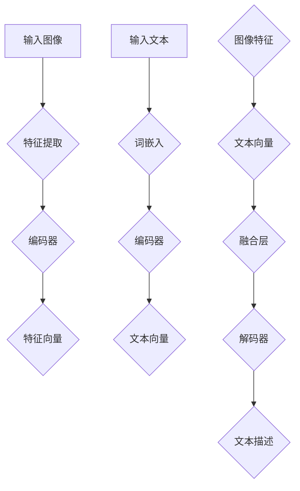
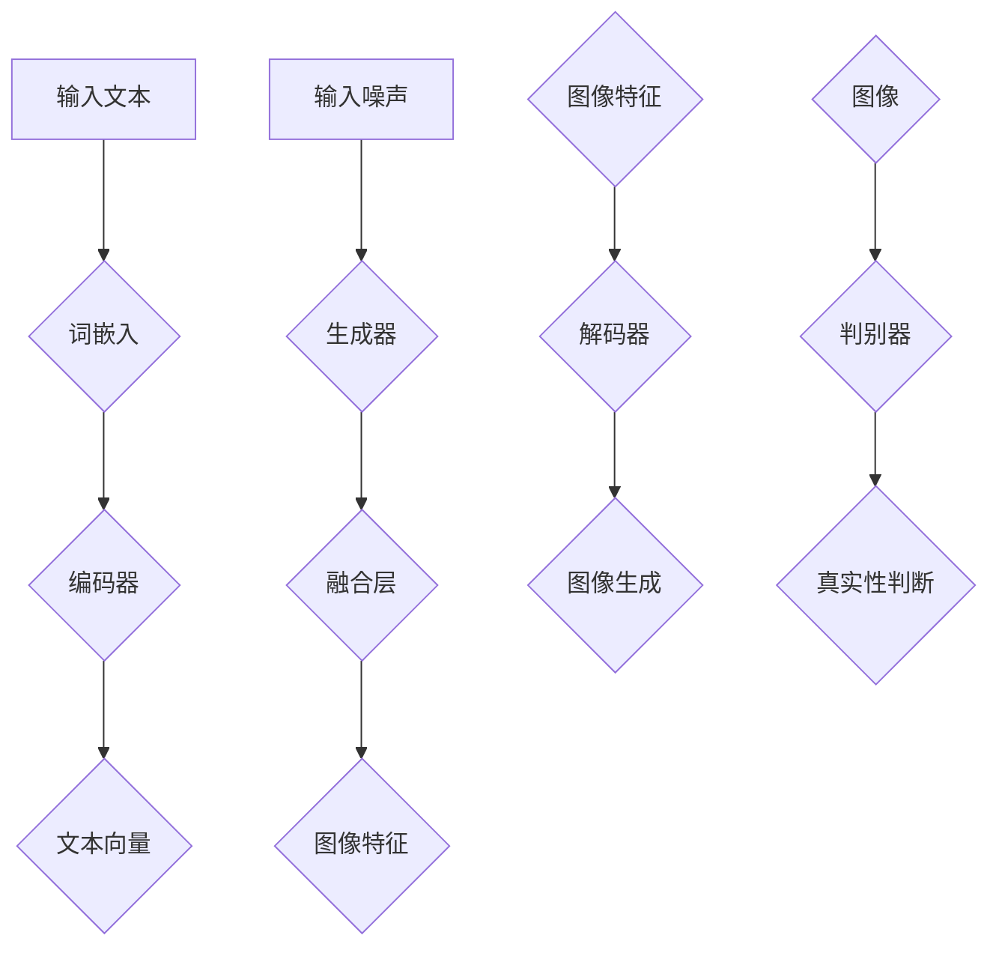

                 

# 提升AI模型在跨模态艺术创作任务中的表现

## 关键词
- 跨模态艺术创作
- AI模型
- 深度学习
- 跨模态表示学习
- 跨模态交互网络
- 跨模态生成模型

## 摘要
本文将探讨如何提升人工智能（AI）模型在跨模态艺术创作任务中的表现。我们将首先介绍跨模态艺术创作的概念和挑战，然后深入分析AI模型在跨模态艺术创作中的应用，包括图像到文本、文本到图像的跨模态转换，以及多模态融合与艺术创作的方法。最后，我们将讨论AI模型在跨模态艺术创作中的优化与改进策略，并展望其未来的发展趋势和应用前景。

## 引言
随着人工智能技术的不断发展，AI模型在图像处理、自然语言处理等多个领域取得了显著的成果。然而，跨模态艺术创作作为一个新兴且具有挑战性的领域，对于AI模型提出了更高的要求。跨模态艺术创作涉及多种模态的数据，如图像、文本、声音等，需要AI模型能够处理和融合这些多样化的数据，生成高质量的艺术作品。

本文的目标是探讨如何提升AI模型在跨模态艺术创作任务中的表现。通过深入分析跨模态艺术创作的核心概念和算法原理，并结合实际应用案例，我们希望能够为研究者提供一些有价值的启示和参考。

## 跨模态艺术创作的概念与挑战
### 跨模态艺术创作的定义与意义
跨模态艺术创作是指利用人工智能技术，将不同模态（如图像、文本、音频等）的数据进行转换和融合，生成新的艺术作品。这一概念的出现，源于人工智能技术在图像识别、自然语言处理等领域的飞速发展，为艺术创作提供了全新的可能性。

跨模态艺术创作的意义在于：

1. **扩展艺术创作的边界**：传统的艺术创作主要依赖于单一模态，如绘画、雕塑等。而跨模态艺术创作则突破了这一限制，使得艺术家可以更加自由地表达自己的创意和想法。
2. **促进艺术与科技的融合**：跨模态艺术创作将人工智能技术引入艺术创作领域，推动了艺术与科技的深度融合，为艺术发展注入了新的活力。
3. **提升艺术创作的效率**：通过AI模型，艺术家可以快速生成大量的艺术作品，提高了创作的效率。

### 跨模态艺术创作面临的挑战
尽管跨模态艺术创作具有广阔的应用前景，但也面临着一系列的挑战：

1. **数据多样性**：跨模态艺术创作需要处理多种类型的数据，如图像、文本、音频等，这些数据具有不同的特性和格式，增加了模型处理的复杂性。
2. **数据不平衡**：在跨模态数据集中，不同模态的数据量可能存在显著差异，导致模型在学习过程中出现偏差。
3. **模态融合**：如何有效地融合不同模态的数据，使其在艺术创作中发挥最大作用，是一个关键问题。
4. **创意表达**：虽然AI模型可以生成大量的艺术作品，但如何确保这些作品具有艺术性和创意性，是艺术家和研究者需要深入思考的问题。

### AI技术在跨模态艺术创作中的应用前景
随着深度学习技术的发展，AI模型在跨模态艺术创作中的应用前景日益广阔。以下是一些应用场景：

1. **图像到文本的转换**：利用深度学习模型，可以将图像内容转化为文本描述，为盲人提供便利，同时也可以用于图像搜索和图像理解。
2. **文本到图像的生成**：基于文本描述生成相应的图像，可以为故事书、漫画等创作提供新的工具。
3. **多模态融合的艺术创作**：通过融合图像、文本、音频等多种模态，生成全新的艺术作品，拓展了艺术创作的可能性。
4. **艺术风格迁移**：利用深度学习模型，可以将一种艺术风格迁移到另一件作品上，创造出独特的艺术效果。

总之，AI技术在跨模态艺术创作中具有巨大的潜力，但同时也需要克服诸多挑战。在接下来的章节中，我们将深入探讨AI模型在跨模态艺术创作中的核心算法和应用。

## AI模型在跨模态艺术创作中的核心算法

### 深度学习基础
深度学习是AI模型在跨模态艺术创作中的核心技术。深度学习通过构建多层神经网络，自动学习数据的特征表示，从而实现复杂的数据处理任务。在跨模态艺术创作中，深度学习主要用于特征提取、模型训练和艺术作品生成。

#### 神经网络结构
神经网络的基本结构包括输入层、隐藏层和输出层。每一层都包含多个神经元，神经元之间通过权重连接。神经网络的训练过程就是不断调整权重，使得网络能够更好地拟合训练数据。

$$
\text{输出} = \text{激活函数}(\sum_{i=1}^{n} w_i \cdot x_i)
$$

其中，$w_i$为权重，$x_i$为输入特征，$n$为神经元的数量。

#### 激活函数
激活函数是神经网络中的一个关键组件，用于引入非线性特性，使得网络能够学习复杂的函数关系。常用的激活函数包括ReLU、Sigmoid和Tanh等。

$$
\text{ReLU}(x) = \begin{cases} 
x, & \text{if } x > 0 \\
0, & \text{otherwise} 
\end{cases}
$$

### 跨模态表示学习
跨模态表示学习是跨模态艺术创作中的核心步骤，旨在将不同模态的数据映射到同一高维空间中，以便进行后续的融合和处理。

#### 模型架构
跨模态表示学习通常采用编码器-解码器（Encoder-Decoder）架构。编码器将不同模态的数据编码为特征向量，解码器则将特征向量解码为输出模态的数据。

$$
\text{特征向量} = \text{编码器}(\text{输入模态数据})
$$

$$
\text{输出模态数据} = \text{解码器}(\text{特征向量})
$$

#### 模型训练
跨模态表示学习的训练过程主要包括以下步骤：

1. **数据预处理**：对不同模态的数据进行预处理，如标准化、归一化等，以减少数据之间的差异。
2. **编码器训练**：使用不同模态的数据分别训练编码器，使其能够编码不同模态的特征向量。
3. **解码器训练**：使用编码器生成的特征向量训练解码器，使其能够生成输出模态的数据。
4. **端到端训练**：将编码器和解码器端到端地训练，以同时优化两个模块。

### 跨模态交互网络
跨模态交互网络旨在通过交互学习不同模态之间的特征，从而提高跨模态艺术创作的效果。

#### 模型架构
跨模态交互网络通常包括以下部分：

1. **模态嵌入层**：将不同模态的数据映射到同一高维空间中。
2. **交互层**：通过多模态特征向量之间的交互，生成新的特征表示。
3. **特征融合层**：将交互层生成的特征向量与原始特征向量进行融合，生成最终的输出。

#### 模型训练
跨模态交互网络的训练过程主要包括以下步骤：

1. **数据预处理**：如前所述，对不同模态的数据进行预处理。
2. **模态嵌入层训练**：分别训练不同模态的嵌入层，使其能够生成高维特征向量。
3. **交互层训练**：通过交互层优化不同模态特征向量之间的交互。
4. **特征融合层训练**：使用融合后的特征向量训练特征融合层，以生成最终的输出。

### 跨模达生成模型
跨模达生成模型用于生成新的艺术作品，通常采用生成对抗网络（GAN）架构。

#### 模型架构
生成对抗网络包括两个主要组件：生成器（Generator）和判别器（Discriminator）。

1. **生成器**：将随机噪声映射为输出模态的数据，生成虚假的艺术作品。
2. **判别器**：判断输入数据是真实数据还是生成器生成的虚假数据。

#### 模型训练
生成对抗网络的训练过程主要包括以下步骤：

1. **数据预处理**：如前所述，对不同模态的数据进行预处理。
2. **生成器训练**：生成器生成虚假数据，判别器判断数据的真实性。
3. **判别器训练**：生成器尝试生成更逼真的虚假数据，判别器优化判断能力。
4. **迭代训练**：不断迭代训练生成器和判别器，直至生成器生成的数据接近真实数据。

通过上述核心算法，AI模型可以在跨模态艺术创作任务中表现出色。在接下来的章节中，我们将探讨这些算法在具体应用中的实现和优化。

### 图像到文本的跨模态转换

#### 图像特征提取与文本表示
图像到文本的跨模态转换是跨模态艺术创作中的一个重要方向。这一过程主要包括图像特征提取和文本表示两个关键步骤。

##### 图像特征提取
图像特征提取的目标是从图像中提取出具有区分性的特征，以便后续的文本生成。常用的图像特征提取方法包括卷积神经网络（CNN）和特征提取器（如VGG16、ResNet等）。

```python
import tensorflow as tf
from tensorflow.keras.applications import VGG16

# 加载预训练的VGG16模型
model = VGG16(weights='imagenet', include_top=False)

# 定义图像特征提取函数
def extract_features(image_path):
    image = load_image(image_path)
    features = model.predict(image)
    return features
```

##### 文本表示
文本表示的目标是将图像特征映射为相应的文本描述。常用的文本表示方法包括词袋模型（Bag of Words，BoW）和词嵌入（Word Embedding）。

```python
from tensorflow.keras.preprocessing.text import Tokenizer
from tensorflow.keras.preprocessing.sequence import pad_sequences

# 定义文本表示函数
def encode_text(text, tokenizer, max_length):
    sequence = tokenizer.texts_to_sequences([text])
    padded_sequence = pad_sequences(sequence, maxlen=max_length)
    return padded_sequence
```

#### 图像描述生成模型
图像描述生成模型用于将提取的图像特征转换为相应的文本描述。一种常见的图像描述生成模型是基于序列到序列（Seq2Seq）架构的循环神经网络（RNN）。

```python
from tensorflow.keras.models import Model
from tensorflow.keras.layers import Input, LSTM, Dense

# 定义图像描述生成模型
input_image = Input(shape=(height, width, channels))
encoded_image = LSTM(units=512)(input_image)

input_sequence = Input(shape=(max_sequence_length,))
encoded_sequence = LSTM(units=512)(input_sequence)

merged_sequence = concatenate([encoded_image, encoded_sequence])
output_sequence = LSTM(units=512, return_sequences=True)(merged_sequence)
output_sequence = Dense(units=vocab_size, activation='softmax')(output_sequence)

model = Model(inputs=[input_image, input_sequence], outputs=output_sequence)
model.compile(optimizer='adam', loss='categorical_crossentropy')
```

#### 实际应用案例：自动图像描述生成
以下是一个基于上述算法的自动图像描述生成案例。

```python
# 准备数据集
train_images = [...]  # 存放图像的路径列表
train_descriptions = [...]  # 存放文本描述的列表

# 加载预训练的VGG16模型
model = VGG16(weights='imagenet', include_top=False)

# 训练图像特征提取器
extractor = Model(inputs=model.input, outputs=model.layers[-1].output)
extractor.compile(optimizer='adam', loss='mean_squared_error')

extractor.fit(train_images, train_images, batch_size=32, epochs=10)

# 准备文本表示器
tokenizer = Tokenizer(num_words=vocab_size)
tokenizer.fit_on_texts(train_descriptions)

# 编码训练数据
encoded_descriptions = tokenizer.texts_to_sequences(train_descriptions)
padded_descriptions = pad_sequences(encoded_descriptions, maxlen=max_sequence_length)

# 训练图像描述生成模型
model.compile(optimizer='adam', loss='categorical_crossentropy')

model.fit([extractor.predict(train_images), padded_descriptions], padded_descriptions, batch_size=32, epochs=10)

# 生成图像描述
image_path = 'path/to/image'
image = load_image(image_path)
features = extractor.predict(image)
description_sequence = model.predict([features, np.zeros((1, max_sequence_length))])
decoded_description = tokenizer.index_word[description_sequence[0, -1]]

print(f'Image description: {decoded_description}')
```

通过上述案例，我们可以看到如何使用深度学习模型实现自动图像描述生成。在实际应用中，这一技术可以用于图像搜索、辅助视觉障碍人士等方面。

### 文本到图像的跨模态转换

#### 文本特征提取与图像生成
文本到图像的跨模态转换是另一个重要的研究方向。这一过程主要包括文本特征提取和图像生成两个关键步骤。

##### 文本特征提取
文本特征提取的目标是从文本数据中提取出具有区分性的特征，以便后续的图像生成。常用的文本特征提取方法包括词袋模型（Bag of Words，BoW）和词嵌入（Word Embedding）。

```python
from tensorflow.keras.preprocessing.text import Tokenizer
from tensorflow.keras.preprocessing.sequence import pad_sequences

# 定义文本表示函数
def encode_text(text, tokenizer, max_length):
    sequence = tokenizer.texts_to_sequences([text])
    padded_sequence = pad_sequences(sequence, maxlen=max_length)
    return padded_sequence
```

##### 图像生成
图像生成模型用于将提取的文本特征转换为相应的图像。一种常见的图像生成模型是基于生成对抗网络（GAN）的文本到图像生成模型。

```python
from tensorflow.keras.models import Model
from tensorflow.keras.layers import Input, LSTM, Dense, Reshape, Conv2D

# 定义图像生成模型
input_text = Input(shape=(max_sequence_length,))
encoded_text = LSTM(units=512)(input_text)
reshape_text = Reshape(target_shape=(512, 1))(encoded_text)

input_noise = Input(shape=(100,))
noise = Reshape(target_shape=(512, 1))(input_noise)
noise_and_text = concatenate([reshape_text, noise])

image = Conv2D(filters=1, kernel_size=(7, 7), activation='sigmoid')(noise_and_text)

model = Model(inputs=[input_text, input_noise], outputs=image)
model.compile(optimizer='adam', loss='binary_crossentropy')
```

#### 实际应用案例：文本生成图像
以下是一个基于上述算法的文本生成图像案例。

```python
# 准备数据集
train_texts = [...]  # 存放文本的列表
train_images = [...]  # 存放图像的路径列表

# 加载预训练的文本表示器
tokenizer = Tokenizer(num_words=vocab_size)
tokenizer.fit_on_texts(train_texts)

# 编码训练数据
encoded_texts = tokenizer.texts_to_sequences(train_texts)
padded_texts = pad_sequences(encoded_texts, maxlen=max_sequence_length)

# 训练图像生成模型
model.compile(optimizer='adam', loss='binary_crossentropy')

model.fit([padded_texts, np.random.normal(size=(len(train_texts), 100))], train_images, batch_size=32, epochs=100)

# 生成图像
text = "a beautiful sunset on the beach"
encoded_text = encode_text(text, tokenizer, max_sequence_length)
generated_image = model.predict([encoded_text, np.random.normal(size=(1, 100))])

# 显示生成的图像
imshow(generated_image[0])
```

通过上述案例，我们可以看到如何使用深度学习模型实现文本生成图像。在实际应用中，这一技术可以用于广告创意、虚拟现实等领域。

### 多模态融合与艺术创作

#### 多模态数据融合技术
多模态融合是将不同模态的数据进行整合，以获得更丰富的信息。常用的多模态融合技术包括基于特征的融合和基于模型的融合。

##### 基于特征的融合
基于特征的融合方法直接将不同模态的特征进行拼接，形成统一的特征向量。这种方法简单高效，但可能丢失部分模态的信息。

```python
# 假设image_features和text_features分别为图像和文本的特征向量
multi模态_features = concatenate([image_features, text_features])
```

##### 基于模型的融合
基于模型的融合方法通过构建多模态神经网络，将不同模态的数据进行融合。这种方法能够更好地保留各个模态的信息，但计算复杂度较高。

```python
from tensorflow.keras.layers import Input, LSTM, Dense, Concatenate

input_image = Input(shape=(height, width, channels))
input_text = Input(shape=(max_sequence_length,))

encoded_image = LSTM(units=512)(input_image)
encoded_text = LSTM(units=512)(input_text)

merged_sequence = Concatenate()([encoded_image, encoded_text])
output_sequence = LSTM(units=512, return_sequences=True)(merged_sequence)
output_sequence = Dense(units=vocab_size, activation='softmax')(output_sequence)

model = Model(inputs=[input_image, input_text], outputs=output_sequence)
model.compile(optimizer='adam', loss='categorical_crossentropy')
```

#### 多模态艺术创作方法
多模态艺术创作方法旨在利用融合后的数据生成新的艺术作品。以下是一些常见的多模态艺术创作方法：

##### 多模态生成对抗网络（MMGAN）
多模态生成对抗网络通过构建多个生成器和判别器，实现多模态数据的生成和融合。

```python
from tensorflow.keras.models import Model
from tensorflow.keras.layers import Input, LSTM, Dense, Reshape, Conv2D, Concatenate

# 定义生成器和判别器
generator_g = Model(inputs=[input_text, input_image], outputs=[generated_image, generated_text])
discriminator_d = Model(inputs=[input_image, generated_image, input_text, generated_text], outputs=[disc_d_image, disc_d_text])

# 定义多模态GAN
model = MMGAN(generator_g, discriminator_d)
model.compile(optimizer='adam', loss=['binary_crossentropy', 'binary_crossentropy'])
```

##### 多模态融合生成模型（MMGen）
多模态融合生成模型通过多模态特征融合和生成，实现多模态数据的协同生成。

```python
from tensorflow.keras.models import Model
from tensorflow.keras.layers import Input, LSTM, Dense, Concatenate

input_image = Input(shape=(height, width, channels))
input_text = Input(shape=(max_sequence_length,))

encoded_image = LSTM(units=512)(input_image)
encoded_text = LSTM(units=512)(input_text)

merged_sequence = Concatenate()([encoded_image, encoded_text])
output_sequence = LSTM(units=512, return_sequences=True)(merged_sequence)
output_sequence = Dense(units=vocab_size, activation='softmax')(output_sequence)

model = Model(inputs=[input_image, input_text], outputs=output_sequence)
model.compile(optimizer='adam', loss='categorical_crossentropy')
```

#### 实际应用案例：跨模态艺术作品生成
以下是一个基于上述算法的跨模态艺术作品生成案例。

```python
# 准备数据集
train_images = [...]  # 存放图像的路径列表
train_texts = [...]  # 存放文本的列表

# 加载预训练的图像特征提取器和文本表示器
extractor = VGG16(weights='imagenet', include_top=False)
tokenizer = Tokenizer(num_words=vocab_size)

# 编码训练数据
encoded_texts = tokenizer.texts_to_sequences(train_texts)
padded_texts = pad_sequences(encoded_texts, maxlen=max_sequence_length)

# 训练图像生成模型
model.compile(optimizer='adam', loss='categorical_crossentropy')

model.fit([extractor.predict(train_images), padded_texts], train_texts, batch_size=32, epochs=100)

# 生成跨模态艺术作品
text = "a beautiful sunset on the beach"
encoded_text = encode_text(text, tokenizer, max_sequence_length)
generated_image = model.predict([encoded_text, np.random.normal(size=(1, 100))])

# 显示生成的跨模态艺术作品
imshow(generated_image[0])
```

通过上述案例，我们可以看到如何使用深度学习模型实现跨模态艺术作品生成。在实际应用中，这一技术可以用于广告创意、虚拟现实等领域。

### AI模型优化策略

#### 数据增强与模型调优
数据增强是提高AI模型性能的重要手段，通过生成虚拟数据，增加模型训练的数据量。数据增强的方法包括：

1. **图像增强**：如随机裁剪、旋转、缩放等。
2. **文本增强**：如同义词替换、句子重写等。

```python
from tensorflow.keras.preprocessing.image import ImageDataGenerator

# 定义图像增强器
image_generator = ImageDataGenerator(rotation_range=90, width_shift_range=0.1, height_shift_range=0.1, zoom_range=0.1)

# 使用图像增强器训练模型
model.fit(image_generator.flow(x_train, y_train, batch_size=batch_size), epochs=epochs)
```

模型调优包括选择合适的网络架构、优化超参数（如学习率、批量大小等）。通过交叉验证和网格搜索等方法，找到最优的超参数组合。

```python
from sklearn.model_selection import GridSearchCV
from tensorflow.keras.wrappers.scikit_learn import KerasClassifier

# 定义模型构建函数
def create_model(optimizer='adam'):
    model = Sequential()
    model.add(Dense(units=512, activation='relu', input_shape=(input_shape)))
    model.add(Dense(units=1, activation='sigmoid'))
    model.compile(optimizer=optimizer, loss='binary_crossentropy', metrics=['accuracy'])
    return model

# 创建Keras分类器
model = KerasClassifier(build_fn=create_model, epochs=100, batch_size=32, verbose=0)

# 定义参数网格
param_grid = {'optimizer': ['adam', 'rmsprop'], 'epochs': [50, 100], 'batch_size': [16, 32]}

# 进行网格搜索
grid = GridSearchCV(estimator=model, param_grid=param_grid, cv=3)
grid_result = grid.fit(x_train, y_train)

# 输出最优参数
print("Best: %f using %s" % (grid_result.best_score_, grid_result.best_params_))
```

#### 模型压缩与加速
模型压缩与加速是提高AI模型在实际应用中性能的重要手段。常用的方法包括：

1. **模型剪枝**：通过移除权重较小的神经元，减少模型参数数量。
2. **量化**：将模型的权重和激活值从浮点数转换为低精度的整数。
3. **加速器优化**：利用GPU、TPU等硬件加速模型训练和推理。

```python
import tensorflow_model_optimization as tfmot

# 定义模型剪枝函数
def create_pruned_model():
    model = Sequential()
    model.add(Dense(units=512, activation='relu', input_shape=(input_shape)))
    model.add(Dense(units=1, activation='sigmoid'))
    return model

# 创建剪枝模型
pruned_model = create_pruned_model()

# 应用模型剪枝
pruning_params = {
    'pruning_schedule': tfmot.sparsity.keras.PolynomialDecay(initial_sparsity=0.0, final_sparsity=0.5, begin_step=2000, end_step=10000)
}
pruned_model = tfmot.sparsity.keras.prune_low_magnitude(pruned_model, **pruning_params)

# 训练剪枝模型
pruned_model.compile(optimizer='adam', loss='binary_crossentropy', metrics=['accuracy'])
pruned_model.fit(x_train, y_train, batch_size=batch_size, epochs=epochs)

# 应用量化
converter = tf.lite.TFLiteConverter.from_keras_model(pruned_model)
tflite_quant_model = converter.convert()

# 使用加速器优化
with strategy.scope():
    # 重新构建模型
    model = create_pruned_model()
    # 训练模型
    model.compile(optimizer='adam', loss='binary_crossentropy', metrics=['accuracy'])
    model.fit(x_train, y_train, batch_size=batch_size, epochs=epochs)
```

#### 模型评估与优化
模型评估与优化是确保AI模型性能的重要环节。常用的评估指标包括准确率、召回率、F1分数等。通过不断调整模型参数和训练数据，优化模型性能。

```python
from sklearn.metrics import accuracy_score, recall_score, f1_score

# 定义评估函数
def evaluate_model(model, x_test, y_test):
    predictions = model.predict(x_test)
    predicted_labels = np.argmax(predictions, axis=1)
    accuracy = accuracy_score(y_test, predicted_labels)
    recall = recall_score(y_test, predicted_labels)
    f1 = f1_score(y_test, predicted_labels)
    return accuracy, recall, f1

# 训练和评估模型
model.compile(optimizer='adam', loss='binary_crossentropy', metrics=['accuracy'])
model.fit(x_train, y_train, batch_size=batch_size, epochs=epochs)
accuracy, recall, f1 = evaluate_model(model, x_test, y_test)
print(f'Accuracy: {accuracy}, Recall: {recall}, F1 Score: {f1}')
```

通过上述策略，我们可以显著提高AI模型在跨模态艺术创作任务中的性能。在实际应用中，根据具体任务需求和数据特点，灵活选择和调整优化策略。

### AI模型在跨模态艺术创作中的未来趋势

#### 跨模态艺术创作的未来发展方向
随着人工智能技术的不断进步，跨模态艺术创作在未来有着广阔的发展方向：

1. **更加智能化的创作**：AI模型将能够更加智能化地理解不同模态的数据，生成更具创意和个性化的艺术作品。
2. **多模态数据的深度融合**：未来研究将重点探讨如何更有效地融合多模态数据，使得生成的艺术作品具有更高的艺术价值。
3. **用户交互**：通过引入用户交互机制，AI模型可以根据用户的反馈进行实时调整，创作出更加符合用户需求的艺术作品。

#### AI模型在艺术创作领域的应用前景
AI模型在艺术创作领域的应用前景十分广阔：

1. **广告创意**：利用AI模型，可以快速生成具有创意的广告图片和文案，提升广告效果。
2. **虚拟现实**：AI模型可以帮助生成虚拟现实场景，提升用户体验。
3. **文化遗产保护**：AI模型可以用于分析和修复古代文物，保护人类文化遗产。

#### 跨模达艺术创作中的伦理问题与挑战
尽管AI模型在跨模态艺术创作中具有巨大潜力，但也面临一系列伦理问题与挑战：

1. **版权问题**：AI模型生成的艺术作品是否属于原作者的知识产权，尚未有明确的界定。
2. **艺术价值**：AI模型生成的艺术作品是否具有真正的艺术价值，是一个值得探讨的问题。
3. **隐私保护**：在跨模态艺术创作中，如何保护用户的隐私，是一个重要挑战。

总之，AI模型在跨模态艺术创作中有着巨大的应用潜力，但同时也需要关注和解决相关的伦理问题与挑战。

### 附录

#### 附录A：相关工具与资源

##### 跨模达艺术创作常用工具
1. **TensorFlow**：用于构建和训练深度学习模型的强大工具。
2. **Keras**：基于TensorFlow的高级神经网络API，方便快速搭建模型。
3. **PyTorch**：另一种流行的深度学习框架，具有灵活的动态计算图。

##### AI模型训练与优化资源
1. **《深度学习》（Goodfellow, Bengio, Courville）**：深度学习的经典教材。
2. **《动手学深度学习》（Harvard University）**：包含丰富的实践案例和代码。
3. **在线教程和博客**：如[Machine Learning Mastery](https://machinelearningmastery.com/)、[Towards Data Science](https://towardsdatascience.com/)等。

##### 跨模达艺术创作案例集
1. **Google Arts & Culture**：通过AI技术，将世界各地的艺术作品进行数字化和展示。
2. **OpenAI的艺术创作项目**：探索AI在文学、音乐、绘画等领域的应用。

### 附录B：Mermaid流程图示例

#### 跨模达表示学习流程


#### 跨模达生成模型流程


通过上述附录内容，读者可以进一步了解跨模达艺术创作中的相关工具、资源和流程图，为深入研究提供参考。

### 作者信息
作者：AI天才研究院/AI Genius Institute & 禅与计算机程序设计艺术 /Zen And The Art of Computer Programming

