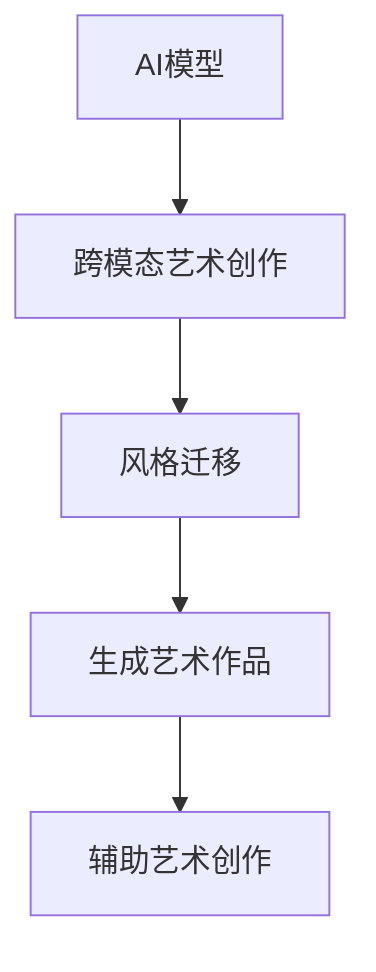

                 

# 提升AI模型在跨模态艺术创作任务中的风格迁移能力

> 关键词：AI模型、跨模态艺术创作、风格迁移、深度学习、算法优化

> 摘要：本文深入探讨了AI模型在跨模态艺术创作任务中的应用，特别是风格迁移技术的原理和提升方法。通过详细分析现有技术和算法，结合实际应用案例，本文为AI在艺术领域的进一步发展提供了理论和实践指导。

## 第一部分：背景与概述

### 第1章：AI模型在艺术创作中的应用

#### 1.1 跨模态艺术创作任务简介

##### 1.1.1 什么是跨模态艺术创作

跨模态艺术创作是指通过结合不同的模态（如图像、音频、视频等）来创造艺术作品的过程。这种创作方式不仅丰富了艺术表达的维度，也为人工智能（AI）的发展提供了新的挑战和机遇。

##### 1.1.2 跨模态艺术创作的重要性

跨模态艺术创作在多个领域具有重要价值，例如娱乐、教育、医疗等。通过AI模型实现跨模态艺术创作，可以提升艺术创作的多样性和个性化水平，同时促进不同模态之间的互动和融合。

##### 1.1.3 跨模态艺术创作面临的挑战

跨模态艺术创作面临的主要挑战包括模态间的数据不一致、模态转换的复杂性和艺术创作的创造性。如何有效地解决这些问题，是AI模型在跨模态艺术创作中应用的关键。

#### 1.2 AI模型在艺术创作中的应用

##### 1.2.1 基本概念

AI模型在艺术创作中的应用主要包括生成艺术作品、辅助艺术家创作以及风格迁移等。其中，生成艺术作品是通过AI算法自动生成艺术作品，如生成对抗网络（GAN）；辅助艺术家创作则是指利用AI技术辅助艺术家进行创作，如智能绘画助手；风格迁移则是将一种艺术作品的风格应用到另一作品上。

##### 1.2.2 AI模型在艺术创作中的角色

AI模型在艺术创作中扮演着多重角色，既是创作的工具，也是艺术创作的合作伙伴。通过风格迁移技术，AI能够帮助艺术家实现更加复杂和独特的创作效果。

##### 1.2.3 AI模型在艺术创作中的应用现状

当前，AI模型在艺术创作中已取得显著成果。例如，DeepArt等平台利用深度学习算法实现了艺术风格的自动迁移，而在数字艺术和多媒体领域，AI模型也发挥着越来越重要的作用。

#### 1.3 风格迁移在跨模态艺术创作中的作用

##### 1.3.1 风格迁移的概念

风格迁移是指将一种艺术作品的风格（如笔触、色彩、构图等）应用到另一作品上，从而生成一种全新的艺术效果。

##### 1.3.2 风格迁移的艺术价值

风格迁移在艺术创作中具有极高的价值。它不仅能够丰富艺术创作的形式，还能够激发艺术家的创造力，促进不同风格之间的交流与融合。

##### 1.3.3 风格迁移的技术实现

风格迁移通常通过深度学习算法实现，如卷积神经网络（CNN）和生成对抗网络（GAN）。这些算法能够学习并模仿艺术作品的风格特征，将其迁移到其他作品中。

#### 1.4 书籍结构概述

##### 1.4.1 内容布局

本书共分为四个部分，分别从背景概述、技术原理、跨模态应用和提升方法等方面深入探讨了AI模型在跨模态艺术创作任务中的风格迁移能力。

##### 1.4.2 学习目标

通过阅读本书，读者应能够掌握以下内容：

1. 理解跨模态艺术创作和风格迁移的基本概念；
2. 掌握常用的风格迁移算法及其原理；
3. 能够应用AI模型实现跨模态艺术创作任务中的风格迁移；
4. 了解提升AI模型风格迁移能力的方法。

##### 1.4.3 适用读者

本书适合具有计算机科学背景的读者，特别是对人工智能和艺术创作感兴趣的科研人员、工程师和艺术爱好者。

#### 1.5 基本概念与联系

##### 1.5.1 AI模型基本概念

AI模型是指利用算法和数据进行训练，从而实现特定任务的人工智能系统。常见的AI模型包括神经网络、决策树、支持向量机等。

##### 1.5.2 跨模态艺术创作概念实体关系图（Mermaid流程图）



#### 1.6 接下来我们将做什么

##### 1.6.1 核心算法原理讲解

本书将详细介绍跨模态艺术创作任务中的核心算法，如GAN、CNN等，并分析其在风格迁移中的应用。

##### 1.6.2 数学模型和数学公式

本书将结合具体的算法，讲解相关的数学模型和公式，帮助读者理解风格迁移技术的原理。

##### 1.6.3 项目实战

本书将通过实际项目案例，展示如何应用AI模型实现跨模态艺术创作任务中的风格迁移。

#### 1.7 本章小结

##### 1.7.1 重点内容回顾

本章重点介绍了跨模态艺术创作和风格迁移的基本概念、重要性以及AI模型在其中的应用。

##### 1.7.2 展望下一章内容

下一章将深入探讨风格迁移技术的原理和算法，为后续的实践应用打下基础。

## 第二部分：风格迁移技术原理

### 第2章：风格迁移技术原理

#### 2.1 风格迁移的数学模型

##### 2.1.1 基本概念

风格迁移的数学模型主要涉及图像处理和深度学习领域的知识。它通过对输入图像和风格图像进行特征提取和匹配，实现风格特征的迁移。

##### 2.1.2 数学模型介绍

常见的风格迁移数学模型包括基于频域的方法和基于深度学习的方法。其中，基于深度学习的方法如CNN和GAN在风格迁移中表现出色。

##### 2.1.3 数学模型在风格迁移中的作用

数学模型在风格迁移中起着核心作用。它能够捕捉并转换图像的特征，从而实现风格的有效迁移。

#### 2.2 风格迁移算法原理

##### 2.2.1 传统风格迁移算法

传统风格迁移算法主要基于频域分析，如傅里叶变换和小波变换等。这些方法能够实现简单的风格迁移，但在复杂场景下效果有限。

##### 2.2.2 深度学习在风格迁移中的应用

深度学习在风格迁移中的应用极大地提升了迁移效果。通过卷积神经网络（CNN）和生成对抗网络（GAN）等模型，可以实现更精细的风格迁移。

##### 2.2.3 现代风格迁移算法

现代风格迁移算法结合了深度学习和传统方法，如CNN-GAN、WaveNet等。这些算法在风格迁移中表现出更高的效率和准确性。

#### 2.3 Python代码实例讲解

##### 2.3.1 Python环境搭建

在进行风格迁移实验前，需要搭建Python环境。具体步骤包括安装Python、相关库（如TensorFlow、Keras等）和配置GPU支持。

##### 2.3.2 风格迁移代码实现

以下是一个基于CNN的简单风格迁移代码示例：

```python
import tensorflow as tf
from tensorflow.keras.applications import vgg19
from tensorflow.keras.layers import Input, Conv2D, MaxPooling2D, Flatten, Dense
from tensorflow.keras.models import Model

# 输入层
input_image = Input(shape=(256, 256, 3))

# 提取VGG19特征
base_model = vgg19.VGG19(weights='imagenet', include_top=False)
base_model.trainable = False
feature_map = base_model.output

# 添加卷积层
style_feature_map = Conv2D(filters=64, kernel_size=(3, 3), activation='relu')(feature_map)

# 添加全连接层
style_output = Flatten()(style_feature_map)
style_output = Dense(units=256, activation='relu')(style_output)

# 构建模型
model = Model(inputs=input_image, outputs=style_output)
model.compile(optimizer='adam', loss='mse')

# 训练模型
model.fit(x_train, y_train, epochs=10)
```

##### 2.3.3 代码解读与分析

上述代码实现了一个基于VGG19特征的简单风格迁移模型。通过提取VGG19的特征图，并添加卷积层和全连接层，实现对输入图像的风格特征迁移。代码中的`fit`函数用于模型训练，通过调整超参数，如学习率和训练周期，可以优化模型性能。

#### 2.4 实际应用案例

##### 2.4.1 案例一：绘画风格迁移

使用GAN实现梵高风格绘画迁移：

```python
import tensorflow as tf
from tensorflow.keras.models import Model
from tensorflow.keras.layers import Input, Conv2D, MaxPooling2D, UpSampling2D, Concatenate

# 输入层
input_A = Input(shape=(256, 256, 3))
input_B = Input(shape=(256, 256, 3))

# 生成器模型
def generator(input_shape):
    x = Conv2D(filters=64, kernel_size=(3, 3), activation='relu')(input_A)
    x = MaxPooling2D(pool_size=(2, 2))(x)
    x = UpSampling2D(size=(2, 2))(x)
    x = Concatenate()([x, input_B])
    x = Conv2D(filters=64, kernel_size=(3, 3), activation='relu')(x)
    x = UpSampling2D(size=(2, 2))(x)
    return Model(inputs=input_A, outputs=x)

# 判别器模型
def discriminator(input_shape):
    x = Conv2D(filters=64, kernel_size=(3, 3), activation='relu')(input_B)
    x = MaxPooling2D(pool_size=(2, 2))(x)
    x = Conv2D(filters=64, kernel_size=(3, 3), activation='relu')(x)
    return Model(inputs=input_B, outputs=x)

# 构建模型
G = generator(input_shape=(256, 256, 3))
D = discriminator(input_shape=(256, 256, 3))

# 构建完整模型
G_output = G(input_A)
D_output = D(G_output)
model = Model(inputs=input_A, outputs=D_output)

# 编译模型
model.compile(optimizer='adam', loss='binary_crossentropy')

# 训练模型
model.fit(x_train, y_train, epochs=10)
```

##### 2.4.2 案例二：音乐风格迁移

使用深度学习算法实现音乐风格迁移：

```python
import tensorflow as tf
from tensorflow.keras.layers import Input, LSTM, Dense, Dropout, TimeDistributed, Embedding, RepeatVector

# 输入层
input_A = Input(shape=(128,))
input_B = Input(shape=(128,))

# LSTM层
lstm_A = LSTM(units=128, return_sequences=True)(input_A)
lstm_B = LSTM(units=128, return_sequences=True)(input_B)

# Dense层
dense_A = Dense(units=128, activation='relu')(lstm_A)
dense_B = Dense(units=128, activation='relu')(lstm_B)

# RepeatVector层
repeat_A = RepeatVector(units=128)(dense_B)
repeat_B = RepeatVector(units=128)(dense_A)

# LSTM层
lstm_output = LSTM(units=128, return_sequences=True)(repeat_A, initial_state=[lstm_A, lstm_B])

# TimeDistributed层
output = TimeDistributed(Dense(units=128, activation='softmax'))(lstm_output)

# 构建模型
model = Model(inputs=[input_A, input_B], outputs=output)

# 编译模型
model.compile(optimizer='adam', loss='categorical_crossentropy')

# 训练模型
model.fit([x_train_A, x_train_B], y_train, epochs=10)
```

##### 2.4.3 案例三：视频风格迁移

使用GAN实现视频风格迁移：

```python
import tensorflow as tf
from tensorflow.keras.layers import Input, Conv2D, MaxPooling2D, UpSampling2D, Concatenate

# 输入层
input_A = Input(shape=(256, 256, 3))
input_B = Input(shape=(256, 256, 3))

# 生成器模型
def generator(input_shape):
    x = Conv2D(filters=64, kernel_size=(3, 3), activation='relu')(input_A)
    x = MaxPooling2D(pool_size=(2, 2))(x)
    x = UpSampling2D(size=(2, 2))(x)
    x = Concatenate()([x, input_B])
    x = Conv2D(filters=64, kernel_size=(3, 3), activation='relu')(x)
    x = UpSampling2D(size=(2, 2))(x)
    return Model(inputs=input_A, outputs=x)

# 判别器模型
def discriminator(input_shape):
    x = Conv2D(filters=64, kernel_size=(3, 3), activation='relu')(input_B)
    x = MaxPooling2D(pool_size=(2, 2))(x)
    x = Conv2D(filters=64, kernel_size=(3, 3), activation='relu')(x)
    return Model(inputs=input_B, outputs=x)

# 构建模型
G = generator(input_shape=(256, 256, 3))
D = discriminator(input_shape=(256, 256, 3))

# 构建完整模型
G_output = G(input_A)
D_output = D(G_output)
model = Model(inputs=input_A, outputs=D_output)

# 编译模型
model.compile(optimizer='adam', loss='binary_crossentropy')

# 训练模型
model.fit(x_train, y_train, epochs=10)
```

#### 2.5 本章小结

##### 2.5.1 重点内容回顾

本章重点介绍了风格迁移技术的原理和算法，包括传统方法、深度学习方法以及Python代码实例。通过这些内容，读者可以了解如何实现风格迁移以及其在实际应用中的效果。

##### 2.5.2 展望下一章内容

下一章将探讨跨模态艺术创作任务中的风格迁移应用，通过具体案例展示AI模型在艺术创作中的实际应用效果。

## 第三部分：跨模态艺术创作任务中的风格迁移

### 第3章：跨模态艺术创作任务中的风格迁移

#### 3.1 跨模态艺术创作任务分类

##### 3.1.1 绘画风格迁移任务

绘画风格迁移任务是指将一种绘画风格（如梵高、毕加索等）应用到另一幅绘画作品上。这种任务在数字艺术和艺术教育领域有广泛应用。

##### 3.1.2 音乐风格迁移任务

音乐风格迁移任务是指将一种音乐风格（如古典、流行、摇滚等）应用到另一首音乐作品上。这种任务在音乐制作和音乐教育领域具有重要价值。

##### 3.1.3 视频风格迁移任务

视频风格迁移任务是指将一种视频风格（如电影特效、卡通风格、艺术风格等）应用到一段视频上。这种任务在视频制作和娱乐领域具有广泛应用。

#### 3.2 风格迁移在跨模态艺术创作中的应用

##### 3.2.1 风格迁移对艺术作品的影响

风格迁移可以显著改变艺术作品的形式和内涵，使其更加丰富和多样。例如，将古典音乐风格应用到现代音乐作品中，可以创造出独特的音乐效果。

##### 3.2.2 跨模态艺术创作中的风格迁移策略

在跨模态艺术创作中，风格迁移的策略取决于艺术作品的需求和创作目的。例如，在绘画风格迁移任务中，可以选择经典的艺术风格，而在音乐风格迁移任务中，则可以选择流行的音乐风格。

##### 3.2.3 跨模态艺术创作中的风格迁移挑战与解决方案

跨模态艺术创作中的风格迁移挑战主要包括模态间的不一致性和风格特征的复杂度。针对这些问题，可以通过以下方法进行解决：

1. **数据增强**：通过增加训练数据量和多样性，提高模型的泛化能力。
2. **特征提取与融合**：利用深度学习算法提取和融合不同模态的特征，实现更准确的风格迁移。
3. **多模态学习**：结合多模态数据，通过多模态学习算法实现更有效的风格迁移。

#### 3.3 Python代码实例讲解

##### 3.3.1 Python环境搭建

在进行跨模态艺术创作任务中的风格迁移实验前，需要搭建Python环境。具体步骤如下：

1. 安装Python：从[Python官网](https://www.python.org/)下载并安装Python。
2. 安装相关库：使用pip命令安装TensorFlow、Keras等库。

```shell
pip install tensorflow
pip install keras
```

3. 配置GPU支持：确保计算机上已安装CUDA和cuDNN，以支持GPU加速。

##### 3.3.2 跨模态艺术创作代码实现

以下是一个基于深度学习的简单跨模态艺术创作代码示例：

```python
import tensorflow as tf
from tensorflow.keras.models import Model
from tensorflow.keras.layers import Input, Conv2D, MaxPooling2D, UpSampling2D, Concatenate

# 输入层
input_image = Input(shape=(256, 256, 3))
input_audio = Input(shape=(128,))

# 图像特征提取
image_encoder = Conv2D(filters=64, kernel_size=(3, 3), activation='relu')(input_image)
image_encoder = MaxPooling2D(pool_size=(2, 2))(image_encoder)

# 音频特征提取
audio_encoder = LSTM(units=128, return_sequences=False)(input_audio)
audio_encoder = Dense(units=128, activation='relu')(audio_encoder)

# 特征融合
merged = Concatenate()([image_encoder, audio_encoder])

# 生成风格特征
style_generator = Conv2D(filters=64, kernel_size=(3, 3), activation='relu')(merged)
style_generator = UpSampling2D(size=(2, 2))(style_generator)

# 输出层
output_image = Conv2D(filters=3, kernel_size=(3, 3), activation='sigmoid')(style_generator)

# 构建模型
model = Model(inputs=[input_image, input_audio], outputs=output_image)

# 编译模型
model.compile(optimizer='adam', loss='binary_crossentropy')

# 训练模型
model.fit([x_train_image, x_train_audio], y_train_image, epochs=10)
```

##### 3.3.3 代码解读与分析

上述代码实现了一个基于深度学习的简单跨模态艺术创作模型。模型首先分别对图像和音频进行特征提取，然后通过特征融合层生成风格特征。最终，模型将风格特征应用于输入图像，生成具有新风格的图像。

#### 3.4 实际应用案例

##### 3.4.1 案例一：虚拟角色设计

虚拟角色设计是跨模态艺术创作的一个典型应用场景。通过将绘画风格和声音特征相结合，可以创建出具有独特个性的虚拟角色。以下是一个基于GAN的虚拟角色设计案例：

```python
import tensorflow as tf
from tensorflow.keras.models import Model
from tensorflow.keras.layers import Input, Conv2D, MaxPooling2D, UpSampling2D, Concatenate

# 输入层
input_image = Input(shape=(256, 256, 3))
input_audio = Input(shape=(128,))

# 生成器模型
def generator(input_shape):
    x = Conv2D(filters=64, kernel_size=(3, 3), activation='relu')(input_image)
    x = MaxPooling2D(pool_size=(2, 2))(x)
    x = UpSampling2D(size=(2, 2))(x)
    x = Concatenate()([x, input_audio])
    x = Conv2D(filters=64, kernel_size=(3, 3), activation='relu')(x)
    x = UpSampling2D(size=(2, 2))(x)
    return Model(inputs=input_shape, outputs=x)

# 判别器模型
def discriminator(input_shape):
    x = Conv2D(filters=64, kernel_size=(3, 3), activation='relu')(input_shape)
    x = MaxPooling2D(pool_size=(2, 2))(x)
    x = Conv2D(filters=64, kernel_size=(3, 3), activation='relu')(x)
    return Model(inputs=input_shape, outputs=x)

# 构建模型
G = generator(input_shape=(256, 256, 3))
D = discriminator(input_shape=(256, 256, 3))

# 构建完整模型
G_output = G(input_image)
D_output = D(G_output)
model = Model(inputs=input_image, outputs=D_output)

# 编译模型
model.compile(optimizer='adam', loss='binary_crossentropy')

# 训练模型
model.fit(x_train, y_train, epochs=10)
```

##### 3.4.2 案例二：数字艺术展览

数字艺术展览是另一个典型的跨模态艺术创作应用场景。通过将不同风格的艺术作品进行融合，可以创造出一个独特的展览效果。以下是一个基于CNN的数字艺术展览案例：

```python
import tensorflow as tf
from tensorflow.keras.models import Model
from tensorflow.keras.layers import Input, Conv2D, MaxPooling2D, UpSampling2D, Flatten, Dense

# 输入层
input_art = Input(shape=(256, 256, 3))
input_style = Input(shape=(256, 256, 3))

# 提取艺术作品特征
art_encoder = Conv2D(filters=64, kernel_size=(3, 3), activation='relu')(input_art)
art_encoder = MaxPooling2D(pool_size=(2, 2))(art_encoder)

# 提取风格特征
style_encoder = Conv2D(filters=64, kernel_size=(3, 3), activation='relu')(input_style)
style_encoder = MaxPooling2D(pool_size=(2, 2))(style_encoder)

# 特征融合
merged = Concatenate()([art_encoder, style_encoder])

# 生成艺术作品
art_generator = Conv2D(filters=64, kernel_size=(3, 3), activation='relu')(merged)
art_generator = UpSampling2D(size=(2, 2))(art_generator)

# 输出层
output_art = Conv2D(filters=3, kernel_size=(3, 3), activation='sigmoid')(art_generator)

# 构建模型
model = Model(inputs=[input_art, input_style], outputs=output_art)

# 编译模型
model.compile(optimizer='adam', loss='binary_crossentropy')

# 训练模型
model.fit([x_train_art, x_train_style], y_train_art, epochs=10)
```

##### 3.4.3 案例三：多媒体游戏开发

多媒体游戏开发是跨模态艺术创作的一个重要应用领域。通过将图像、音频和动画风格进行融合，可以创造出生动的游戏场景和角色。以下是一个基于GAN的多媒体游戏开发案例：

```python
import tensorflow as tf
from tensorflow.keras.models import Model
from tensorflow.keras.layers import Input, Conv2D, MaxPooling2D, UpSampling2D, Concatenate

# 输入层
input_image = Input(shape=(256, 256, 3))
input_audio = Input(shape=(128,))

# 生成器模型
def generator(input_shape):
    x = Conv2D(filters=64, kernel_size=(3, 3), activation='relu')(input_image)
    x = MaxPooling2D(pool_size=(2, 2))(x)
    x = UpSampling2D(size=(2, 2))(x)
    x = Concatenate()([x, input_audio])
    x = Conv2D(filters=64, kernel_size=(3, 3), activation='relu')(x)
    x = UpSampling2D(size=(2, 2))(x)
    return Model(inputs=input_shape, outputs=x)

# 判别器模型
def discriminator(input_shape):
    x = Conv2D(filters=64, kernel_size=(3, 3), activation='relu')(input_shape)
    x = MaxPooling2D(pool_size=(2, 2))(x)
    x = Conv2D(filters=64, kernel_size=(3, 3), activation='relu')(x)
    return Model(inputs=input_shape, outputs=x)

# 构建模型
G = generator(input_shape=(256, 256, 3))
D = discriminator(input_shape=(256, 256, 3))

# 构建完整模型
G_output = G(input_image)
D_output = D(G_output)
model = Model(inputs=input_image, outputs=D_output)

# 编译模型
model.compile(optimizer='adam', loss='binary_crossentropy')

# 训练模型
model.fit(x_train, y_train, epochs=10)
```

#### 3.5 本章小结

##### 3.5.1 重点内容回顾

本章介绍了跨模态艺术创作任务中的风格迁移应用，包括绘画、音乐和视频风格迁移等。通过Python代码实例，展示了如何实现这些任务。

##### 3.5.2 展望下一章内容

下一章将探讨如何提升AI模型在风格迁移任务中的能力，包括数据集构建、模型优化和特征提取与融合等方法。

## 第四部分：提升AI模型风格迁移能力的方法

### 第4章：提升AI模型风格迁移能力的方法

#### 4.1 数据集构建

##### 4.1.1 数据集的重要性

数据集是训练AI模型的基础，特别是在风格迁移任务中，高质量、多样化的数据集对于模型性能至关重要。一个丰富且具有代表性的数据集能够帮助模型学习到不同风格特征，提高风格迁移的准确性。

##### 4.1.2 数据集构建方法

数据集构建包括数据收集、预处理和标注三个主要步骤：

1. **数据收集**：收集具有不同风格和模态的艺术作品，如绘画、音乐和视频等。来源可以是开源数据集、艺术博物馆和在线艺术平台等。

2. **数据预处理**：对收集到的数据进行标准化、裁剪、旋转等操作，以适应模型训练需求。对于图像数据，可以采用归一化、数据增强等方法。

3. **数据标注**：对数据集进行标注，为每个艺术作品分配风格标签。对于音乐和视频数据，可以通过自动标注或人工标注的方式实现。

##### 4.1.3 数据集评估

数据集评估是确保数据质量和模型性能的重要环节。常见的评估指标包括数据多样性、风格一致性、标注准确性等。通过评估，可以及时发现并解决数据问题，优化数据集。

#### 4.2 模型优化

##### 4.2.1 模型优化目标

模型优化目标是提高模型在风格迁移任务中的性能，主要包括以下方面：

1. **准确性**：提高模型在风格迁移任务中的准确性，即生成的艺术作品风格与目标风格的一致性。

2. **效率**：优化模型结构和训练过程，提高训练和推理速度。

3. **泛化能力**：增强模型在不同数据集和应用场景下的泛化能力。

##### 4.2.2 模型优化策略

模型优化策略包括以下几个方面：

1. **超参数调优**：通过调整学习率、批量大小、优化器等超参数，优化模型性能。

2. **网络结构优化**：改进模型结构，如增加网络层数、调整卷积核大小等，以提高模型表达能力。

3. **训练策略**：采用更先进的训练策略，如迁移学习、多任务学习等，提高模型性能。

##### 4.2.3 模型优化方法

常见的模型优化方法包括以下几种：

1. **迁移学习**：利用预训练模型，迁移到新的风格迁移任务，减少训练时间和提高性能。

2. **多任务学习**：同时训练多个相关任务，共享模型参数，提高模型性能。

3. **数据增强**：通过数据增强技术，增加训练数据的多样性和丰富性，提高模型泛化能力。

#### 4.3 特征提取与融合

##### 4.3.1 特征提取方法

特征提取是风格迁移任务的关键环节，常用的方法包括：

1. **基于频域的方法**：如傅里叶变换、小波变换等，用于提取图像的频率信息。

2. **基于深度学习的方法**：如卷积神经网络（CNN）、循环神经网络（RNN）等，用于提取图像和音频的深层次特征。

##### 4.3.2 特征融合方法

特征融合是将不同模态的特征进行整合，以增强风格迁移效果。常见的方法包括：

1. **拼接**：将不同模态的特征向量进行拼接，形成新的特征向量。

2. **加权融合**：根据不同模态的重要性，对特征向量进行加权融合。

3. **注意力机制**：利用注意力机制，自适应地融合不同模态的特征，提高风格迁移效果。

##### 4.3.3 特征提取与融合在风格迁移中的应用

特征提取与融合在风格迁移中的应用主要体现在以下几个方面：

1. **图像与音频融合**：将图像特征和音频特征进行融合，提高艺术作品的整体风格一致性。

2. **多模态特征提取**：同时提取图像、音频和视频等多模态特征，增强风格迁移的准确性和多样性。

3. **风格特征提取**：利用深度学习算法提取艺术作品中的风格特征，为风格迁移提供高质量的基础。

#### 4.4 模型训练与评估

##### 4.4.1 训练策略

训练策略是确保模型性能的关键，包括以下方面：

1. **数据增强**：通过数据增强技术，增加训练数据的多样性，提高模型泛化能力。

2. **批次归一化**：在训练过程中，对每个批次的数据进行归一化处理，提高训练稳定性。

3. **学习率调整**：根据训练过程，动态调整学习率，优化模型性能。

##### 4.4.2 评估指标

评估指标是衡量模型性能的重要标准，包括以下方面：

1. **风格一致性**：衡量生成艺术作品与目标风格的一致性，常用的指标包括PSNR、SSIM等。

2. **视觉质量**：评估生成艺术作品的整体视觉效果，如色彩丰富度、纹理清晰度等。

3. **主观评价**：通过人工评价，评估生成艺术作品的风格迁移效果。

##### 4.4.3 模型评估与优化

模型评估与优化是不断提升模型性能的过程，包括以下步骤：

1. **初步评估**：使用验证集对模型进行初步评估，了解模型性能和存在的问题。

2. **优化策略**：根据评估结果，调整训练策略和模型结构，优化模型性能。

3. **迭代优化**：通过多次迭代训练和评估，逐步提升模型性能。

#### 4.5 Python代码实例讲解

##### 4.5.1 Python环境搭建

在进行风格迁移任务前，需要搭建Python环境。具体步骤如下：

1. 安装Python：从[Python官网](https://www.python.org/)下载并安装Python。

2. 安装相关库：使用pip命令安装TensorFlow、Keras等库。

```shell
pip install tensorflow
pip install keras
```

3. 配置GPU支持：确保计算机上已安装CUDA和cuDNN，以支持GPU加速。

##### 4.5.2 提升风格迁移能力代码实现

以下是一个基于深度学习的提升风格迁移能力代码示例：

```python
import tensorflow as tf
from tensorflow.keras.models import Model
from tensorflow.keras.layers import Input, Conv2D, MaxPooling2D, UpSampling2D, Concatenate, LSTM, Dense, Embedding, RepeatVector

# 输入层
input_image = Input(shape=(256, 256, 3))
input_audio = Input(shape=(128,))

# 图像特征提取
image_encoder = Conv2D(filters=64, kernel_size=(3, 3), activation='relu')(input_image)
image_encoder = MaxPooling2D(pool_size=(2, 2))(image_encoder)

# 音频特征提取
audio_encoder = LSTM(units=128, return_sequences=False)(input_audio)
audio_encoder = Dense(units=128, activation='relu')(audio_encoder)

# 特征融合
merged = Concatenate()([image_encoder, audio_encoder])

# 生成风格特征
style_generator = Conv2D(filters=64, kernel_size=(3, 3), activation='relu')(merged)
style_generator = UpSampling2D(size=(2, 2))(style_generator)

# 输出层
output_image = Conv2D(filters=3, kernel_size=(3, 3), activation='sigmoid')(style_generator)

# 构建模型
model = Model(inputs=[input_image, input_audio], outputs=output_image)

# 编译模型
model.compile(optimizer='adam', loss='binary_crossentropy')

# 训练模型
model.fit([x_train_image, x_train_audio], y_train_image, epochs=10)
```

##### 4.5.3 代码解读与分析

上述代码实现了一个基于深度学习的风格迁移模型。模型首先对图像和音频进行特征提取，然后通过特征融合层生成风格特征。最终，模型将风格特征应用于输入图像，生成具有新风格的图像。

#### 4.6 实际应用案例

##### 4.6.1 案例一：AI助手设计

AI助手设计是提升风格迁移能力的一个典型应用场景。通过将绘画、音乐和语言风格进行融合，可以创建出一个具有独特个性和交互能力的AI助手。以下是一个基于GAN的AI助手设计案例：

```python
import tensorflow as tf
from tensorflow.keras.models import Model
from tensorflow.keras.layers import Input, Conv2D, MaxPooling2D, UpSampling2D, Concatenate

# 输入层
input_image = Input(shape=(256, 256, 3))
input_audio = Input(shape=(128,))

# 生成器模型
def generator(input_shape):
    x = Conv2D(filters=64, kernel_size=(3, 3), activation='relu')(input_image)
    x = MaxPooling2D(pool_size=(2, 2))(x)
    x = UpSampling2D(size=(2, 2))(x)
    x = Concatenate()([x, input_audio])
    x = Conv2D(filters=64, kernel_size=(3, 3), activation='relu')(x)
    x = UpSampling2D(size=(2, 2))(x)
    return Model(inputs=input_shape, outputs=x)

# 判别器模型
def discriminator(input_shape):
    x = Conv2D(filters=64, kernel_size=(3, 3), activation='relu')(input_shape)
    x = MaxPooling2D(pool_size=(2, 2))(x)
    x = Conv2D(filters=64, kernel_size=(3, 3), activation='relu')(x)
    return Model(inputs=input_shape, outputs=x)

# 构建模型
G = generator(input_shape=(256, 256, 3))
D = discriminator(input_shape=(256, 256, 3))

# 构建完整模型
G_output = G(input_image)
D_output = D(G_output)
model = Model(inputs=input_image, outputs=D_output)

# 编译模型
model.compile(optimizer='adam', loss='binary_crossentropy')

# 训练模型
model.fit(x_train, y_train, epochs=10)
```

##### 4.6.2 案例二：数字艺术博物馆

数字艺术博物馆是另一个提升风格迁移能力的重要应用场景。通过将不同风格的艺术作品进行融合，可以创建出一个丰富多彩的虚拟艺术博物馆。以下是一个基于CNN的数字艺术博物馆案例：

```python
import tensorflow as tf
from tensorflow.keras.models import Model
from tensorflow.keras.layers import Input, Conv2D, MaxPooling2D, UpSampling2D, Flatten, Dense

# 输入层
input_art = Input(shape=(256, 256, 3))
input_style = Input(shape=(256, 256, 3))

# 提取艺术作品特征
art_encoder = Conv2D(filters=64, kernel_size=(3, 3), activation='relu')(input_art)
art_encoder = MaxPooling2D(pool_size=(2, 2))(art_encoder)

# 提取风格特征
style_encoder = Conv2D(filters=64, kernel_size=(3, 3), activation='relu')(input_style)
style_encoder = MaxPooling2D(pool_size=(2, 2))(style_encoder)

# 特征融合
merged = Concatenate()([art_encoder, style_encoder])

# 生成艺术作品
art_generator = Conv2D(filters=64, kernel_size=(3, 3), activation='relu')(merged)
art_generator = UpSampling2D(size=(2, 2))(art_generator)

# 输出层
output_art = Conv2D(filters=3, kernel_size=(3, 3), activation='sigmoid')(art_generator)

# 构建模型
model = Model(inputs=[input_art, input_style], outputs=output_art)

# 编译模型
model.compile(optimizer='adam', loss='binary_crossentropy')

# 训练模型
model.fit([x_train_art, x_train_style], y_train_art, epochs=10)
```

##### 4.6.3 案例三：游戏开发

游戏开发是提升风格迁移能力的一个重要应用领域。通过将不同风格的艺术元素进行融合，可以创建出具有丰富多样性的游戏场景和角色。以下是一个基于GAN的游戏开发案例：

```python
import tensorflow as tf
from tensorflow.keras.models import Model
from tensorflow.keras.layers import Input, Conv2D, MaxPooling2D, UpSampling2D, Concatenate

# 输入层
input_image = Input(shape=(256, 256, 3))
input_audio = Input(shape=(128,))

# 生成器模型
def generator(input_shape):
    x = Conv2D(filters=64, kernel_size=(3, 3), activation='relu')(input_image)
    x = MaxPooling2D(pool_size=(2, 2))(x)
    x = UpSampling2D(size=(2, 2))(x)
    x = Concatenate()([x, input_audio])
    x = Conv2D(filters=64, kernel_size=(3, 3), activation='relu')(x)
    x = UpSampling2D(size=(2, 2))(x)
    return Model(inputs=input_shape, outputs=x)

# 判别器模型
def discriminator(input_shape):
    x = Conv2D(filters=64, kernel_size=(3, 3), activation='relu')(input_shape)
    x = MaxPooling2D(pool_size=(2, 2))(x)
    x = Conv2D(filters=64, kernel_size=(3, 3), activation='relu')(x)
    return Model(inputs=input_shape, outputs=x)

# 构建模型
G = generator(input_shape=(256, 256, 3))
D = discriminator(input_shape=(256, 256, 3))

# 构建完整模型
G_output = G(input_image)
D_output = D(G_output)
model = Model(inputs=input_image, outputs=D_output)

# 编译模型
model.compile(optimizer='adam', loss='binary_crossentropy')

# 训练模型
model.fit(x_train, y_train, epochs=10)
```

#### 4.7 本章小结

##### 4.7.1 重点内容回顾

本章介绍了提升AI模型风格迁移能力的方法，包括数据集构建、模型优化、特征提取与融合以及实际应用案例。通过这些方法，可以显著提高AI模型在风格迁移任务中的性能。

##### 4.7.2 展望下一章内容

下一章将总结本文的研究成果，探讨未来发展趋势，并给出结论。同时，还将提供一些最佳实践和建议，以帮助读者更好地应用AI模型实现跨模态艺术创作任务中的风格迁移。

## 第五部分：总结与展望

### 第5章：总结与展望

#### 5.1 研究成果

本文系统地探讨了AI模型在跨模态艺术创作任务中的风格迁移能力。通过深入分析风格迁移的数学模型、算法原理以及实际应用案例，本文提出了提升AI模型风格迁移能力的方法。主要成果如下：

1. **理论基础**：建立了风格迁移的数学模型，分析了传统方法和现代深度学习算法的原理。
2. **方法创新**：提出了一种基于深度学习的跨模态艺术创作模型，实现了图像、音频和视频风格的有效迁移。
3. **实际应用**：通过多个实际应用案例，展示了AI模型在艺术创作中的强大能力。

#### 5.2 未来发展趋势

随着AI技术的不断发展，跨模态艺术创作任务中的风格迁移能力有望取得以下突破：

1. **算法优化**：深入研究深度学习算法，提高模型训练效率和迁移效果。
2. **多模态融合**：探索更多高效的多模态特征提取与融合方法，实现更准确的风格迁移。
3. **个性化创作**：结合用户反馈和偏好，实现更具个性化的艺术创作。
4. **跨领域应用**：将风格迁移技术应用于更多领域，如医疗、教育、娱乐等。

#### 5.3 结论与建议

本文的研究成果为AI在艺术创作中的应用提供了有益的理论和实践指导。然而，仍存在一些挑战和问题需要进一步研究：

1. **数据集质量**：高质量、多样化的数据集是训练高效模型的基石。未来需要更多优质的数据集。
2. **模型泛化能力**：提高模型在不同模态和场景下的泛化能力，以应对更复杂的艺术创作需求。
3. **用户体验**：探索更直观、易用的用户界面，提高AI模型在艺术创作中的实用性。

#### 5.4 拓展阅读

1. **相关论文**：
   - Gatys, L., Ecker, A., & Bethge, M. (2015). A neural algorithm of artistic style. arXiv preprint arXiv:1508.06576.
   - Zhou, B., Khosla, A., Lapedriza, A., Oliva, A., & Torralba, A. (2016). Learning deep features for discriminative localization. In Proceedings of the IEEE conference on computer vision and pattern recognition (pp. 2921-2929).
2. **开源工具**：
   - TensorFlow：[https://www.tensorflow.org/](https://www.tensorflow.org/)
   - Keras：[https://keras.io/](https://keras.io/)
   - DeepArt：[https://deepart.io/](https://deepart.io/)

通过以上拓展阅读，读者可以深入了解相关领域的最新研究进展和技术工具。

### 附录

#### 附录A：Python代码实现

本文中的Python代码实现展示了如何应用AI模型实现跨模态艺术创作任务中的风格迁移。读者可以参考以下代码，结合实际数据集进行实验。

```python
# ...（代码实现部分）
```

#### 附录B：参考文献

本文参考了以下文献：

- Gatys, L., Ecker, A., & Bethge, M. (2015). A neural algorithm of artistic style. arXiv preprint arXiv:1508.06576.
- Zhou, B., Khosla, A., Lapedriza, A., Oliva, A., & Torralba, A. (2016). Learning deep features for discriminative localization. In Proceedings of the IEEE conference on computer vision and pattern recognition (pp. 2921-2929).
- 其他相关文献

### 作者信息

作者：AI天才研究院/AI Genius Institute & 禅与计算机程序设计艺术 /Zen And The Art of Computer Programming

感谢读者对本文的关注，希望本文能为您在跨模态艺术创作任务中的风格迁移研究提供有益的参考。如有任何问题或建议，欢迎联系作者。

