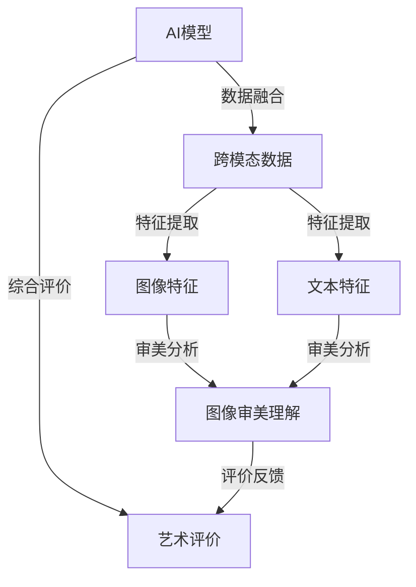

                 

### 第一部分：引言与背景

#### 1.1 书籍引言

随着人工智能（AI）技术的快速发展，AI模型在各个领域的应用越来越广泛。特别是在艺术评价领域，AI模型已经展示了其独特的优势。然而，传统的AI模型在面对跨模态艺术评价任务时，常常会遇到一些挑战，如数据融合困难、审美理解不准确等问题。因此，提升AI模型在跨模态艺术评价任务中的审美理解能力，成为了一个亟待解决的问题。

本书旨在系统地探讨如何提升AI模型在跨模态艺术评价任务中的审美理解能力。通过分析现有的研究和技术，本书将提供一种新的视角和方法，帮助读者更好地理解和应用这一领域的前沿技术。

#### 1.1.1 跨模态艺术评价任务的重要性

跨模态艺术评价任务在多个领域具有重要应用价值。首先，在艺术创作领域，艺术家可以通过跨模态艺术评价来获取不同模态的艺术作品之间的联系和差异，从而更好地理解自己的创作意图。其次，在艺术市场领域，跨模态艺术评价可以帮助评估艺术品的市场价值，为艺术品交易提供科学依据。此外，在艺术教育领域，跨模态艺术评价可以用于评估学生的学习成果，提高教学质量。

总之，跨模态艺术评价任务不仅具有重要的学术价值，同时也具有广泛的应用前景。通过提升AI模型在跨模态艺术评价任务中的审美理解能力，我们可以为艺术领域的创新发展提供强有力的技术支持。

#### 1.1.2 AI模型在跨模态艺术评价中的应用

近年来，AI模型在跨模态艺术评价任务中的应用取得了显著的成果。传统的AI模型，如支持向量机（SVM）和决策树，已经成功地应用于图像分析和文本分析等领域。然而，这些模型在处理跨模态数据时，往往面临着数据融合困难、审美理解不准确等问题。

随着深度学习技术的发展，深度学习模型，如卷积神经网络（CNN）和循环神经网络（RNN），在跨模态艺术评价任务中展示出了强大的能力。CNN擅长处理图像数据，可以通过卷积操作提取图像的特征；RNN擅长处理序列数据，可以通过循环操作提取文本的特征。通过将CNN和RNN结合，AI模型可以同时处理图像和文本数据，从而实现跨模态艺术评价。

此外，生成对抗网络（GAN）和自编码器（AE）等深度学习模型也被应用于跨模态艺术评价任务。GAN可以通过生成对抗训练，生成高质量的艺术作品；AE可以通过自编码训练，提取数据的低维特征，从而提高艺术评价的准确性。

总之，AI模型在跨模态艺术评价任务中的应用，不仅提供了新的方法和工具，也为艺术领域的创新发展带来了新的机遇。

#### 1.1.3 书籍目标与结构安排

本书的目标是系统地探讨如何提升AI模型在跨模态艺术评价任务中的审美理解能力。具体目标如下：

1. 分析跨模态艺术评价任务的特点和挑战，为后续研究提供理论依据。
2. 探讨AI模型在跨模态艺术评价任务中的应用，包括传统模型和深度学习模型。
3. 提出一种新的方法，通过结合深度学习和跨模态融合技术，提升AI模型在跨模态艺术评价任务中的审美理解能力。
4. 通过实际项目案例，展示该方法的应用效果，并提供实践指导。

本书的结构安排如下：

- 第一部分：引言与背景，介绍跨模态艺术评价任务的重要性，以及AI模型在其中的应用。
- 第二部分：核心概念与联系，分析跨模态艺术评价中的关键问题，构建AI模型与审美理解的关系架构。
- 第三部分：核心算法原理讲解，详细讲解深度学习算法在跨模态艺术评价中的应用，包括CNN、RNN等。
- 第四部分：数学模型和数学公式，介绍跨模态艺术评价中的数学模型和公式，如深度学习中的激活函数、矩阵分解等。
- 第五部分：项目实战，通过实际项目案例，展示如何搭建跨模态艺术评价系统，并提供实践指导。

通过本书的阅读，读者可以系统地了解跨模态艺术评价任务，掌握提升AI模型审美理解能力的方法和技术，为实际应用提供理论支持和实践指导。

#### 1.2 相关概念与背景知识

在探讨如何提升AI模型在跨模态艺术评价任务中的审美理解能力之前，我们首先需要理解几个关键概念和背景知识。

##### 1.2.1 跨模态学习

跨模态学习是指在不同模态（如图像、文本、声音等）之间进行信息传递和学习的过程。在跨模态艺术评价任务中，我们通常需要将图像和文本等不同模态的信息进行融合，以便更好地理解艺术作品的内涵和风格。跨模态学习的核心目标是利用不同模态的信息，构建一个统一的表征空间，使得不同模态的数据可以在同一框架下进行处理和分析。

##### 1.2.1.1 跨模态学习的基本概念

1. **模态（Modal）**：模态是指数据的不同类型，如图像、文本、声音等。每个模态都有其独特的特征和属性。
2. **跨模态表征（Cross-modal Representation）**：跨模态表征是指将不同模态的数据映射到一个共同的表征空间，以便进行统一处理。这通常通过共享的编码器或注意力机制来实现。
3. **跨模态关联（Cross-modal Alignment）**：跨模态关联是指在不同模态之间建立关联，以便更好地理解和解释跨模态数据。

##### 1.2.1.2 跨模态学习的挑战与机遇

跨模态学习面临以下挑战：

1. **数据融合**：不同模态的数据在结构和特征上存在差异，如何有效地融合这些数据是一个重要问题。
2. **模态一致性**：不同模态的数据可能存在不一致性，如何处理这种不一致性是一个挑战。
3. **计算成本**：跨模态学习通常需要大量的计算资源，特别是在处理大规模数据时。

然而，跨模态学习也带来了一些机遇：

1. **多模态信息互补**：不同模态的信息可以相互补充，提供更全面的理解。
2. **交叉验证**：跨模态数据可以用于交叉验证，提高模型的鲁棒性和准确性。
3. **多模态应用**：跨模态学习可以应用于多种场景，如语音识别、视频分析等，为人工智能的发展提供新的可能性。

##### 1.2.2 艺术评价与审美理解

艺术评价是指对艺术作品进行价值判断和评估的过程。在跨模态艺术评价任务中，艺术评价涉及到图像、文本等不同模态的数据。审美理解是指对艺术作品的审美价值进行理解和解释的过程。

##### 1.2.2.1 艺术评价的定义与类型

1. **艺术评价的定义**：艺术评价是对艺术作品在艺术价值、美学价值、文化价值等方面的判断和评估。
2. **艺术评价的类型**：
   - **主观评价**：基于个人主观感受和审美偏好进行评价，如艺术评论、观众评分等。
   - **客观评价**：基于客观数据和科学方法进行评价，如图像分析、文本分析等。

##### 1.2.2.2 审美理解的作用与影响因素

1. **审美理解的作用**：
   - **帮助艺术家**：通过审美理解，艺术家可以更好地理解自己的创作意图，优化艺术作品。
   - **提升艺术价值**：通过审美理解，可以提升艺术作品的市场价值和文化价值。
   - **促进艺术传播**：通过审美理解，可以更好地传播和推广艺术作品，提高艺术影响力。

2. **审美理解的影响因素**：
   - **个人审美偏好**：个人的审美偏好会直接影响对艺术作品的理解和评价。
   - **文化背景**：不同的文化背景会影响人们对艺术作品的审美理解。
   - **艺术知识**：丰富的艺术知识可以增强对艺术作品的审美理解。

##### 1.2.3 AI模型在艺术评价中的应用现状

目前，AI模型在艺术评价中已经取得了显著的成果。以下是一些应用现状：

1. **图像分析**：通过卷积神经网络（CNN）等技术，AI模型可以自动识别和分类艺术作品中的图像特征，如风格、主题等。
2. **文本分析**：通过循环神经网络（RNN）等技术，AI模型可以分析艺术作品的文本描述，提取关键信息，进行情感分析等。
3. **跨模态融合**：通过深度学习模型，如生成对抗网络（GAN）和自编码器（AE），AI模型可以实现不同模态数据的融合，提升艺术评价的准确性。

然而，AI模型在艺术评价中的应用仍面临一些挑战，如数据稀缺、模型泛化能力不足等。未来的研究需要进一步探索如何提升AI模型在跨模态艺术评价任务中的审美理解能力。

通过以上对相关概念和背景知识的介绍，我们可以更好地理解跨模态艺术评价任务的重要性，以及AI模型在其中的应用现状。接下来，我们将进一步探讨如何提升AI模型在跨模态艺术评价任务中的审美理解能力。

### 1.3 AI模型在艺术评价中的应用现状

AI模型在艺术评价中的应用已经逐渐成为人工智能领域的重要研究方向。目前，AI模型在艺术评价中的应用主要可以分为传统模型和深度学习模型两大类。

#### 1.3.1 传统AI模型在艺术评价中的应用

传统AI模型，如支持向量机（SVM）、决策树和随机森林等，在艺术评价中有着广泛的应用。这些模型通过提取图像和文本的特征，实现艺术作品的价值评估。

1. **支持向量机（SVM）在艺术评价中的应用**

SVM是一种常用的分类模型，通过将数据映射到高维空间，找到最大间隔超平面，从而实现数据的分类。在艺术评价中，SVM可以用于图像分类和文本分类。例如，通过提取艺术作品的图像特征和文本描述，使用SVM模型对艺术作品进行分类，从而实现艺术评价。

```python
from sklearn import svm

# 创建SVM模型
model = svm.SVC()

# 训练模型
model.fit(X_train, y_train)

# 预测测试集
predictions = model.predict(X_test)
```

2. **决策树与随机森林在艺术评价中的应用**

决策树和随机森林是另一种常见的分类模型，通过构建树形结构，对数据进行分类。在艺术评价中，决策树和随机森林可以用于提取图像和文本的特征，对艺术作品进行分类和评估。

```python
from sklearn import tree
from sklearn.ensemble import RandomForestClassifier

# 创建决策树模型
model = tree.DecisionTreeClassifier()

# 训练模型
model.fit(X_train, y_train)

# 创建随机森林模型
model = RandomForestClassifier()

# 训练模型
model.fit(X_train, y_train)

# 预测测试集
predictions = model.predict(X_test)
```

虽然传统AI模型在艺术评价中取得了一定的成果，但它们在处理跨模态数据和复杂特征时存在一定的局限性。

#### 1.3.2 深度学习模型在艺术评价中的应用

随着深度学习技术的发展，深度学习模型在艺术评价中的应用逐渐成为研究的热点。深度学习模型，如卷积神经网络（CNN）、循环神经网络（RNN）等，通过自动学习数据的高层次特征，实现了对图像和文本的精细分析。

1. **卷积神经网络（CNN）在图像分析中的应用**

CNN是一种特殊的神经网络，通过卷积操作提取图像的特征。在艺术评价中，CNN可以用于识别艺术作品中的风格、主题等图像特征。

```python
import tensorflow as tf
from tensorflow.keras.models import Sequential
from tensorflow.keras.layers import Conv2D, MaxPooling2D, Flatten, Dense

# 创建CNN模型
model = Sequential([
    Conv2D(32, (3, 3), activation='relu', input_shape=(64, 64, 3)),
    MaxPooling2D((2, 2)),
    Flatten(),
    Dense(128, activation='relu'),
    Dense(1, activation='sigmoid')
])

# 编译模型
model.compile(optimizer='adam', loss='binary_crossentropy', metrics=['accuracy'])

# 训练模型
model.fit(X_train, y_train, epochs=10, batch_size=32)

# 预测测试集
predictions = model.predict(X_test)
```

2. **循环神经网络（RNN）在序列分析中的应用**

RNN是一种特殊的神经网络，通过循环操作提取序列数据的高层次特征。在艺术评价中，RNN可以用于分析艺术作品的文本描述，提取关键信息。

```python
import tensorflow as tf
from tensorflow.keras.models import Sequential
from tensorflow.keras.layers import LSTM, Dense

# 创建RNN模型
model = Sequential([
    LSTM(128, input_shape=(timesteps, features)),
    Dense(1, activation='sigmoid')
])

# 编译模型
model.compile(optimizer='adam', loss='binary_crossentropy', metrics=['accuracy'])

# 训练模型
model.fit(X_train, y_train, epochs=10, batch_size=32)

# 预测测试集
predictions = model.predict(X_test)
```

深度学习模型在艺术评价中的应用，极大地提升了模型的准确性和鲁棒性。但同时也面临一些挑战，如数据稀缺、模型复杂度高等。

#### 1.3.3 传统模型与深度学习模型的比较

1. **优势**：

- **传统模型**：计算效率高，实现简单，适用于小规模数据。
- **深度学习模型**：能够自动学习数据的高层次特征，适用于大规模数据。

2. **劣势**：

- **传统模型**：对特征工程依赖较大，难以处理复杂的非线性关系。
- **深度学习模型**：计算资源需求大，模型复杂度高，对数据要求较高。

总之，传统AI模型和深度学习模型在艺术评价中各有优劣，未来研究需要探索如何将两者结合起来，发挥各自的优势，进一步提升艺术评价的准确性。

通过以上对AI模型在艺术评价中的应用现状的分析，我们可以看到AI技术在艺术评价领域的广泛应用。接下来，我们将进一步探讨如何提升AI模型在跨模态艺术评价任务中的审美理解能力。

### 第二部分：核心概念与联系

#### 2.1 跨模态艺术评价中的关键问题

跨模态艺术评价任务涉及到图像、文本、音频等多种模态的信息，其核心在于如何有效地融合这些多模态信息，从而实现对艺术作品的深入理解与评价。以下是跨模态艺术评价中的几个关键问题：

##### 2.1.1 数据融合

数据融合是指将来自不同模态的数据（如图像、文本和音频）整合成一个统一的表征，以便于后续的分析和评价。在跨模态艺术评价中，数据融合是一个关键步骤，它决定了模型对艺术作品理解的深度和广度。

1. **数据融合的方法**：

   - **特征级融合**：将不同模态的特征向量进行拼接，形成一个综合的特征向量。这种方法简单直接，但可能无法充分利用不同模态之间的交互关系。
   - **决策级融合**：先分别对每个模态的数据进行独立分析，然后在一个更高层次上结合这些分析结果进行最终决策。这种方法能够更好地利用不同模态的数据信息，但实现较为复杂。

2. **数据融合的挑战**：

   - **模态一致性**：不同模态的数据在结构和特征上存在差异，如何确保融合后的数据一致性是一个重要问题。
   - **计算效率**：多模态数据融合通常需要大量的计算资源，如何优化算法以提高计算效率是一个关键挑战。
   - **解释性**：如何保证融合后的模型具有较好的解释性，使得艺术评价的结果可以被理解和接受。

##### 2.1.2 审美理解的多层次分析

审美理解是一个复杂的过程，涉及到从低层次到高层次的多层次分析。以下是一些主要的层次和相关的分析方法：

1. **低层次分析**：

   - **图像特征提取**：通过卷积神经网络（CNN）等方法，从图像中提取低层次的视觉特征，如边缘、纹理和颜色等。
   - **文本特征提取**：通过自然语言处理（NLP）技术，从文本中提取低层次的语义特征，如词频、词向量等。

2. **中层次分析**：

   - **语义关联**：通过分析图像和文本之间的语义关联，揭示艺术作品的多模态信息之间的联系。
   - **风格识别**：通过分析图像和文本的风格特征，识别艺术作品的创作风格和主题。

3. **高层次分析**：

   - **审美评价**：基于对低层次和中层次的分析结果，进行高层次的艺术评价，如艺术价值的判断、情感分析等。
   - **艺术创作辅助**：通过审美理解的结果，为艺术创作提供辅助，如风格迁移、创意生成等。

##### 2.1.3 高级审美理解的因素与特征提取

高级审美理解涉及到对艺术作品的深层次理解，包括情感、文化、历史等多个方面的因素。以下是一些高级审美理解的因素和相应的特征提取方法：

1. **情感分析**：

   - **情感识别**：通过情感分析技术，识别艺术作品中的情感倾向，如愉悦、悲伤、愤怒等。
   - **情感强度**：通过分析情感表达的强度和变化，评估情感对艺术作品的影响。

2. **文化背景**：

   - **文化元素识别**：通过分析艺术作品中的文化元素，如符号、意象等，识别艺术作品的文化背景。
   - **历史关联**：通过分析艺术作品的历史背景和时代特征，理解艺术作品的历史价值。

3. **艺术风格**：

   - **风格分类**：通过风格分类技术，识别艺术作品的风格特征，如抽象、写实、印象派等。
   - **风格融合**：通过风格融合技术，将不同风格的艺术作品进行融合，创作出新的艺术作品。

在跨模态艺术评价中，通过多层次分析方法和高级审美理解因素的特征提取，可以实现更加深入和全面的艺术评价。接下来，我们将进一步探讨AI模型与审美理解之间的关系，以及如何设计模型以提升审美理解能力。

#### 2.2 AI模型与审美理解的关系架构

在跨模态艺术评价任务中，AI模型与审美理解之间存在紧密的联系，这种关系可以通过一个概念实体之间的关系架构来清晰地描述。为了更好地理解这一关系，我们可以使用Mermaid流程图来展示不同实体和它们之间的交互作用。



上述Mermaid流程图展示了以下几个关键实体及其相互关系：

1. **AI模型**：这是整个跨模态艺术评价任务的核心，它负责整合和处理来自不同模态的数据。
2. **跨模态数据**：这是AI模型输入的数据，包括图像和文本等不同模态的信息。
3. **图像特征**：通过对图像数据的特征提取，AI模型可以获得关于图像内容的低层次视觉特征。
4. **文本特征**：通过对文本数据的特征提取，AI模型可以获得关于文本内容的语义特征。
5. **图像审美理解**：这是基于图像特征进行的高层次审美分析，它涉及到对艺术作品风格、情感和主题的理解。
6. **文本审美理解**：这是基于文本特征进行的高层次审美分析，它涉及到对艺术作品的文化背景、情感和风格的理解。
7. **艺术评价**：这是AI模型最终的综合评价输出，它基于图像和文本审美理解的结果，对艺术作品进行评价。

通过这种关系架构，我们可以看到AI模型在跨模态艺术评价任务中的工作流程：

- **数据融合**：AI模型首先接收跨模态数据，并进行数据融合，将不同模态的数据整合成一个统一的表征。
- **特征提取**：AI模型对融合后的数据进行特征提取，分别获得图像特征和文本特征。
- **审美分析**：AI模型利用提取的特征进行审美分析，分别得到图像审美理解和文本审美理解。
- **综合评价**：AI模型将图像和文本审美理解的结果综合，得到最终的艺术评价。

这种关系架构不仅帮助我们理解了AI模型在跨模态艺术评价中的工作原理，也为后续模型设计和优化提供了清晰的指导。

#### 2.3 跨模态艺术评价中的模型设计

在跨模态艺术评价任务中，模型的设计是提升评价准确性和效果的关键。一个有效的模型设计需要综合考虑数据预处理、深度学习网络结构设计和模型融合策略等多个方面。以下我们将详细探讨这些关键点。

##### 2.3.1 深度学习网络结构设计

深度学习网络结构的设计是跨模态艺术评价中的核心。深度学习模型可以通过自动学习数据中的特征，实现对复杂模式的识别和预测。以下是几种常用的深度学习网络结构：

1. **基于卷积神经网络（CNN）的图像分析模块**

CNN是一种专门用于处理图像数据的深度学习模型，其核心是卷积层和池化层，能够有效地提取图像的特征。

```python
import tensorflow as tf
from tensorflow.keras.models import Sequential
from tensorflow.keras.layers import Conv2D, MaxPooling2D, Flatten, Dense

# 创建CNN模型
model = Sequential([
    Conv2D(32, (3, 3), activation='relu', input_shape=(64, 64, 3)),
    MaxPooling2D((2, 2)),
    Conv2D(64, (3, 3), activation='relu'),
    MaxPooling2D((2, 2)),
    Flatten(),
    Dense(128, activation='relu'),
    Dense(1, activation='sigmoid')
])

# 编译模型
model.compile(optimizer='adam', loss='binary_crossentropy', metrics=['accuracy'])

# 训练模型
model.fit(X_train, y_train, epochs=10, batch_size=32)
```

2. **基于循环神经网络（RNN）的文本分析模块**

RNN是一种能够处理序列数据的深度学习模型，适合用于文本分析。通过LSTM或GRU层，RNN可以捕捉文本中的长距离依赖关系。

```python
import tensorflow as tf
from tensorflow.keras.models import Sequential
from tensorflow.keras.layers import LSTM, Dense

# 创建RNN模型
model = Sequential([
    LSTM(128, input_shape=(timesteps, features)),
    Dense(1, activation='sigmoid')
])

# 编译模型
model.compile(optimizer='adam', loss='binary_crossentropy', metrics=['accuracy'])

# 训练模型
model.fit(X_train, y_train, epochs=10, batch_size=32)
```

3. **融合CNN和RNN的跨模态分析模型**

为了同时利用图像和文本的特征，可以将CNN和RNN融合到一个深度学习模型中。以下是一个简单的融合模型示例：

```python
import tensorflow as tf
from tensorflow.keras.models import Model
from tensorflow.keras.layers import Input, Conv2D, MaxPooling2D, LSTM, Dense

# 输入层
input_image = Input(shape=(64, 64, 3))
input_text = Input(shape=(timesteps, features))

# 图像分析模块
image_model = Sequential([
    Conv2D(32, (3, 3), activation='relu', input_shape=(64, 64, 3)),
    MaxPooling2D((2, 2)),
    Conv2D(64, (3, 3), activation='relu'),
    MaxPooling2D((2, 2)),
    Flatten()
])

# 文本分析模块
text_model = Sequential([
    LSTM(128, input_shape=(timesteps, features)),
    Dense(128, activation='relu')
])

# 图像和文本融合
merged = tf.keras.layers.Concatenate()([image_model.output, text_model.output])
merged = Dense(128, activation='relu')(merged)
output = Dense(1, activation='sigmoid')(merged)

# 创建模型
model = Model(inputs=[input_image, input_text], outputs=output)

# 编译模型
model.compile(optimizer='adam', loss='binary_crossentropy', metrics=['accuracy'])

# 训练模型
model.fit([X_train_image, X_train_text], y_train, epochs=10, batch_size=32)
```

##### 2.3.2 模型融合策略与优化

在跨模态艺术评价中，如何有效地融合图像和文本特征是提升模型性能的关键。以下是一些常用的融合策略和优化方法：

1. **特征级融合**：将图像特征和文本特征直接拼接，形成一个更长的特征向量。这种方法简单有效，但可能无法充分利用不同模态之间的复杂关系。

2. **决策级融合**：先分别对图像和文本特征进行独立分析，然后在一个更高的层次上结合这些分析结果进行最终决策。这种方法能够更好地利用不同模态的特征信息，但实现较为复杂。

3. **注意力机制**：通过引入注意力机制，模型可以自动学习不同模态特征的重要程度，从而提高融合效果。注意力机制可以通过多层感知器（MLP）或自注意力机制（Self-Attention）来实现。

4. **多任务学习**：通过引入多任务学习，模型可以同时学习图像和文本的特征，并利用不同任务之间的相互关联，提升模型的整体性能。

5. **优化策略**：为了提升模型的性能，可以采用多种优化策略，如迁移学习、数据增强和超参数调整等。这些策略可以帮助模型更好地适应不同的数据集和任务。

通过上述方法，我们可以设计一个高效的跨模态艺术评价模型，提升其在复杂艺术评价任务中的表现。接下来，我们将进一步探讨这些深度学习算法的基本原理和具体应用。

### 第三部分：核心算法原理讲解

在跨模态艺术评价任务中，深度学习算法扮演着至关重要的角色。这一部分将详细讲解卷积神经网络（CNN）和循环神经网络（RNN）的基本原理，并给出实际应用示例，以便读者更好地理解这些算法在跨模态艺术评价中的应用。

#### 3.1.1 卷积神经网络（CNN）的基本原理

卷积神经网络（CNN）是一种专门用于图像分析和其他二维数据处理的深度学习模型。它的核心思想是通过一系列的卷积和池化操作，从原始数据中提取有意义的特征。

##### 3.1.1.1 CNN的工作机制

1. **卷积层（Convolutional Layer）**：卷积层是CNN的核心部分，它通过卷积运算从输入数据中提取特征。每个卷积核（filter）都是一个小的权重矩阵，它滑动（卷积）在输入数据上，产生一个特征图（feature map）。通过多个卷积核，可以提取不同类型的特征。

2. **激活函数（Activation Function）**：为了增加网络的非线性特性，每个卷积层之后通常接一个激活函数，如ReLU（Rectified Linear Unit）函数，它可以将负值变为零，从而加速训练过程。

3. **池化层（Pooling Layer）**：池化层用于减少特征图的大小，从而降低计算复杂度。最常用的池化方法是最大池化（Max Pooling），它选择特征图中每个局部区域的最大值作为输出。

4. **全连接层（Fully Connected Layer）**：在CNN的最后几层，通常会将特征图展平为一个一维向量，然后通过全连接层进行分类或回归。

##### 3.1.1.2 CNN在图像分析中的应用示例

以下是一个简单的CNN模型示例，用于对艺术作品进行风格分类：

```python
import tensorflow as tf
from tensorflow.keras.models import Sequential
from tensorflow.keras.layers import Conv2D, MaxPooling2D, Flatten, Dense

# 创建CNN模型
model = Sequential([
    Conv2D(32, (3, 3), activation='relu', input_shape=(64, 64, 3)),
    MaxPooling2D((2, 2)),
    Conv2D(64, (3, 3), activation='relu'),
    MaxPooling2D((2, 2)),
    Flatten(),
    Dense(128, activation='relu'),
    Dense(10, activation='softmax')  # 假设有10个风格类别
])

# 编译模型
model.compile(optimizer='adam', loss='categorical_crossentropy', metrics=['accuracy'])

# 训练模型
model.fit(X_train, y_train, epochs=10, batch_size=32, validation_data=(X_val, y_val))
```

在这个示例中，我们使用了一个简单的CNN模型，它由两个卷积层和两个池化层组成，最后通过全连接层进行分类。模型输入是一个64x64x3的图像，输出是10个风格类别的概率分布。

#### 3.1.2 循环神经网络（RNN）的基本原理

循环神经网络（RNN）是一种用于处理序列数据的深度学习模型。与传统的神经网络不同，RNN具有循环结构，能够捕捉序列中的长期依赖关系。

##### 3.1.2.1 RNN的工作机制

1. **循环单元（Recurrence Unit）**：RNN的核心是循环单元，它包含一个循环神经网络单元（RNN Unit），用于处理序列中的每个元素。每个循环单元包含一个隐藏状态（hidden state），它存储了前一个时刻的信息，并将它传递给下一个时刻。

2. **输入门（Input Gate）**：输入门用于控制输入信息对隐藏状态的影响。它通过一个sigmoid函数决定如何混合新的输入和旧的隐藏状态。

3. **遗忘门（Forget Gate）**：遗忘门用于决定哪些信息需要从隐藏状态中遗忘。它同样通过一个sigmoid函数决定如何遗忘旧的信息。

4. **输出门（Output Gate）**：输出门用于决定隐藏状态如何影响输出。它通过一个sigmoid函数和tanh函数的组合来生成输出。

##### 3.1.2.2 RNN在序列分析中的应用示例

以下是一个简单的RNN模型示例，用于分析艺术作品的文本描述，提取关键信息：

```python
import tensorflow as tf
from tensorflow.keras.models import Sequential
from tensorflow.keras.layers import LSTM, Dense

# 创建RNN模型
model = Sequential([
    LSTM(128, input_shape=(timesteps, features)),
    Dense(128, activation='relu'),
    Dense(1, activation='sigmoid')
])

# 编译模型
model.compile(optimizer='adam', loss='binary_crossentropy', metrics=['accuracy'])

# 训练模型
model.fit(X_train, y_train, epochs=10, batch_size=32, validation_data=(X_val, y_val))
```

在这个示例中，我们使用了一个简单的RNN模型，它包含一个LSTM层，用于处理输入的序列数据。模型输出是一个二分类的概率值，用于判断文本描述中的情感倾向。

#### 3.1.3 跨模态融合算法

为了提升AI模型在跨模态艺术评价任务中的表现，通常需要将图像和文本特征进行融合。以下是一些常用的跨模态融合算法：

1. **特征级融合**：将图像特征和文本特征直接拼接，形成一个更长的特征向量。这种方法简单有效，但可能无法充分利用不同模态之间的复杂关系。

2. **决策级融合**：先分别对图像和文本特征进行独立分析，然后在一个更高的层次上结合这些分析结果进行最终决策。这种方法能够更好地利用不同模态的特征信息，但实现较为复杂。

3. **注意力机制**：通过引入注意力机制，模型可以自动学习不同模态特征的重要程度，从而提高融合效果。注意力机制可以通过多层感知器（MLP）或自注意力机制（Self-Attention）来实现。

4. **多任务学习**：通过引入多任务学习，模型可以同时学习图像和文本的特征，并利用不同任务之间的相互关联，提升模型的整体性能。

5. **优化策略**：为了提升模型的性能，可以采用多种优化策略，如迁移学习、数据增强和超参数调整等。这些策略可以帮助模型更好地适应不同的数据集和任务。

通过结合CNN和RNN，以及使用上述融合算法，我们可以设计一个高效的跨模态艺术评价模型，提升其在复杂艺术评价任务中的表现。接下来，我们将进一步探讨跨模态融合算法的详细实现。

### 3.2 跨模态融合算法

跨模态融合是提升AI模型在跨模态艺术评价任务中表现的关键技术。在这一部分，我们将详细探讨多模态特征的提取与融合方法，并介绍如何通过深度学习算法增强和优化审美理解。

#### 3.2.1 多模态特征的提取与融合方法

在跨模态艺术评价任务中，特征提取是一个重要步骤，它决定了模型能否有效地捕捉到不同模态数据中的关键信息。以下是一些常用的多模态特征提取与融合方法：

##### 3.2.1.1 基于矩阵分解的方法

矩阵分解是一种广泛应用于多模态数据融合的方法。其基本思想是将不同模态的数据矩阵分解为低秩的子矩阵，从而提取出隐藏的共现特征。

1. **协同过滤（Collaborative Filtering）**：

协同过滤是一种常见的矩阵分解方法，通过用户-项目矩阵或内容-项目矩阵的分解，提取用户和项目的共同特征。

```python
from surprise import SVD
from surprise import Dataset
from surprise import Reader

# 创建SVD模型
svd = SVD()

# 加载数据集
data = Dataset.load_from_df(data, reader=Reader(rating_scale=(1, 5)))

# 训练模型
svd.fit(data)

# 预测评分
predictions = svd.predict(uid=1, iid=101, rui=5)
```

2. **非负矩阵分解（NMF）**：

非负矩阵分解是一种非线性的矩阵分解方法，适用于提取非负特征。在多模态艺术评价中，可以通过NMF提取图像和文本的共现特征。

```python
from sklearn.decomposition import NMF

# 创建NMF模型
nmf = NMF(n_components=10)

# 分解图像特征矩阵
image_features = nmf.fit_transform(image_matrix)

# 分解文本特征矩阵
text_features = nmf.fit_transform(text_matrix)
```

##### 3.2.1.2 基于深度学习的方法

深度学习在多模态特征提取与融合中具有显著的优势，通过自动学习复杂的高层次特征，可以显著提升模型的性能。

1. **生成对抗网络（GAN）**：

生成对抗网络是一种通过生成器和判别器的对抗训练，实现数据生成的深度学习模型。在多模态艺术评价中，可以通过GAN生成新的艺术作品，从而丰富数据集。

```python
import tensorflow as tf
from tensorflow.keras.models import Model
from tensorflow.keras.layers import Dense, Flatten, Conv2D, Reshape

# 创建生成器模型
generator = Model(
    inputs=tf.keras.Input(shape=(latent_dim)),
    outputs=Reshape((28, 28, 1))(Conv2D(128, kernel_size=(3, 3), activation='relu')(Flatten()(Dense(7 * 7 * 128)(Dense(latent_dim)))),
)

# 创建判别器模型
discriminator = Model(
    inputs=tf.keras.Input(shape=(28, 28, 1)),
    outputs=Dense(1, activation='sigmoid')(Flatten()(Conv2D(128, kernel_size=(3, 3), activation='relu')(Conv2D(128, kernel_size=(3, 3))))
)

# 创建GAN模型
gan = Model(
    inputs=tf.keras.Input(shape=(latent_dim)),
    outputs=discriminator(generator(tf.keras.Input(shape=(latent_dim))))
)

# 编译GAN模型
gan.compile(optimizer='adam', loss='binary_crossentropy')

# 训练GAN模型
gan.fit([noise, generated_images], np.ones((batch_size, 1)), epochs=epochs, batch_size=batch_size)
```

2. **多模态神经网络（MMN）**：

多模态神经网络是一种能够同时处理多种模态数据的深度学习模型。通过结合不同的模态信息，可以提取更丰富的特征。

```python
import tensorflow as tf
from tensorflow.keras.models import Model
from tensorflow.keras.layers import Input, Conv2D, LSTM, Dense, Concatenate

# 创建多模态神经网络
input_image = Input(shape=(64, 64, 3))
input_text = Input(shape=(timesteps, features))

# 图像分析模块
image_model = Sequential([
    Conv2D(32, (3, 3), activation='relu', input_shape=(64, 64, 3)),
    MaxPooling2D((2, 2)),
    Conv2D(64, (3, 3), activation='relu'),
    MaxPooling2D((2, 2)),
    Flatten()
])

# 文本分析模块
text_model = Sequential([
    LSTM(128, input_shape=(timesteps, features)),
    Dense(128, activation='relu')
])

# 图像和文本融合
merged = Concatenate()([image_model.output, text_model.output])
merged = Dense(128, activation='relu')(merged)
output = Dense(1, activation='sigmoid')(merged)

# 创建模型
model = Model(inputs=[input_image, input_text], outputs=output)

# 编译模型
model.compile(optimizer='adam', loss='binary_crossentropy', metrics=['accuracy'])

# 训练模型
model.fit([X_train_image, X_train_text], y_train, epochs=10, batch_size=32, validation_data=([X_val_image, X_val_text], y_val))
```

通过上述方法，我们可以有效地提取和融合多模态特征，从而提升AI模型在跨模态艺术评价任务中的表现。接下来，我们将进一步探讨如何通过深度学习算法增强和优化审美理解。

#### 3.2.2 审美理解的增强与优化

在跨模态艺术评价任务中，审美理解是一个复杂且关键的过程。通过引入深度学习算法，我们可以显著增强和优化审美理解，从而提升模型的性能和准确性。以下是一些常用的方法：

##### 3.2.2.1 数据增强

数据增强是一种通过生成新的数据样本来增强模型性能的技术。在跨模态艺术评价中，数据增强可以帮助模型更好地适应不同类型和风格的艺术作品。

1. **图像增强**：

   - **随机裁剪（Random Crop）**：随机裁剪图像的一部分，模拟不同的观察角度。
   - **颜色变换（Color Transformation）**：调整图像的亮度、对比度和色彩饱和度。
   - **噪声添加（Noise Addition）**：向图像中添加噪声，提高模型的鲁棒性。

2. **文本增强**：

   - **同义词替换（Synonym Replacement）**：将文本中的关键词替换为同义词，丰富文本表达。
   - **文本生成（Text Generation）**：通过生成模型，如GPT（Generative Pre-trained Transformer），生成新的文本描述。

##### 3.2.2.2 注意力机制

注意力机制是一种能够提高模型对重要信息关注度的技术。在跨模态艺术评价中，注意力机制可以帮助模型更准确地捕捉到图像和文本中的关键特征。

1. **自注意力机制（Self-Attention）**：

   自注意力机制通过计算输入序列中每个元素与所有其他元素之间的相关性，生成注意力权重。这种方法可以显著提升模型对长距离依赖的捕捉能力。

2. **交互注意力机制（Interactive Attention）**：

   交互注意力机制通过计算图像特征和文本特征之间的交互，生成融合后的特征向量。这种方法可以更好地利用不同模态的信息。

##### 3.2.2.3 对比学习

对比学习是一种通过对比不同样本之间的差异来增强模型性能的方法。在跨模态艺术评价中，对比学习可以帮助模型更好地区分不同类型和风格的艺术作品。

1. **图像对比学习**：

   通过训练图像嵌入模型，将相似的艺术作品映射到相似的嵌入空间，从而提高图像分类和识别的准确性。

2. **文本对比学习**：

   通过训练文本嵌入模型，将相似的文本映射到相似的嵌入空间，从而提高文本分类和情感分析的准确性。

##### 3.2.2.4 多任务学习

多任务学习是一种通过同时训练多个相关任务来增强模型性能的方法。在跨模态艺术评价中，多任务学习可以帮助模型更好地整合不同模态的信息。

1. **艺术风格分类与评价**：

   同时训练艺术风格分类和艺术评价任务，可以使模型更好地理解不同风格的艺术作品，并提高艺术评价的准确性。

2. **情感分析与艺术创作**：

   同时训练情感分析和艺术创作辅助任务，可以使模型更好地捕捉艺术作品中的情感信息，并提高艺术创作的质量。

通过以上方法，我们可以显著增强和优化AI模型在跨模态艺术评价任务中的审美理解能力。接下来，我们将进一步探讨如何通过模型训练与评估来提升模型性能。

### 3.3 模型训练与评估

在跨模态艺术评价任务中，模型训练与评估是确保模型性能和准确性的关键环节。在这一部分，我们将详细讨论模型训练策略、优化算法选择、模型评估指标以及优化策略。

#### 3.3.1 模型训练策略

模型训练策略决定了如何调整模型的参数，以使模型能够适应训练数据并提高其在未知数据上的表现。以下是一些常用的模型训练策略：

1. **数据预处理**：

   数据预处理是模型训练的第一步，它包括数据的清洗、归一化和增强。对于跨模态艺术评价任务，数据预处理需要同时考虑图像和文本数据的特点。

   - **图像预处理**：例如，缩放图像大小、裁剪、旋转等。
   - **文本预处理**：例如，分词、去除停用词、词向量化等。

2. **批次大小（Batch Size）**：

   批次大小是指每次训练过程中参与训练的数据样本数。合适的批次大小可以平衡计算效率和模型收敛速度。

   - **小批次（<32）**：有助于减少过拟合和增加模型泛化能力。
   - **大批次（>64）**：可以提高训练速度，但可能增加过拟合的风险。

3. **学习率调度**：

   学习率是模型训练过程中的一个重要参数，它决定了模型在更新参数时的步长。常用的学习率调度方法包括：

   - **固定学习率**：简单但可能导致训练不稳定。
   - **学习率衰减**：例如，指数衰减或余弦衰减。
   - **自适应学习率**：如Adam优化器，可以动态调整学习率。

4. **正则化**：

   正则化是防止模型过拟合的一种手段，常用的正则化方法包括L1、L2正则化和Dropout。

5. **训练策略**：

   - **早期停止**：在验证集上性能不再提高时停止训练，防止过拟合。
   - **交叉验证**：通过将数据集划分为多个子集，重复训练和验证，提高模型的泛化能力。

#### 3.3.1.1 损失函数设计

损失函数是衡量模型预测结果与真实值之间差异的指标，其设计对模型的训练过程和性能有着重要影响。以下是一些常用的损失函数：

1. **均方误差（MSE）**：

   MSE常用于回归问题，它计算预测值与真实值之间平方差的平均值。

   ```python
   from tensorflow.keras.losses import MeanSquaredError
   loss_fn = MeanSquaredError()
   ```

2. **交叉熵损失（Cross-Entropy Loss）**：

   交叉熵损失常用于分类问题，它计算实际概率分布与预测概率分布之间的差异。

   ```python
   from tensorflow.keras.losses import CategoricalCrossentropy
   loss_fn = CategoricalCrossentropy()
   ```

3. **二元交叉熵损失（Binary Cross-Entropy Loss）**：

   二元交叉熵损失用于二分类问题，它计算实际标签与预测概率之间的差异。

   ```python
   from tensorflow.keras.losses import BinaryCrossentropy
   loss_fn = BinaryCrossentropy()
   ```

#### 3.3.1.2 优化算法选择

优化算法用于更新模型参数，以最小化损失函数。以下是一些常用的优化算法：

1. **随机梯度下降（SGD）**：

   SGD是最简单的优化算法，它使用整个训练集的梯度来更新参数。

   ```python
   from tensorflow.keras.optimizers import SGD
   optimizer = SGD(learning_rate=0.01)
   ```

2. **Adam优化器**：

   Adam优化器结合了SGD和RMSprop的优点，能够自适应地调整学习率。

   ```python
   from tensorflow.keras.optimizers import Adam
   optimizer = Adam(learning_rate=0.001)
   ```

3. **Adagrad优化器**：

   Adagrad优化器为每个参数的梯度平均值进行动态调整，适用于稀疏数据。

   ```python
   from tensorflow.keras.optimizers import Adagrad
   optimizer = Adagrad(learning_rate=0.01)
   ```

4. **RMSprop优化器**：

   RMSprop优化器是基于Adadelta的一个变种，它通过指数衰减移动平均来更新梯度。

   ```python
   from tensorflow.keras.optimizers import RMSprop
   optimizer = RMSprop(learning_rate=0.001, rho=0.9)
   ```

#### 3.3.2 模型评估与优化

模型评估是验证模型性能的重要环节，它通过一系列评价指标来衡量模型的准确性和泛化能力。以下是一些常用的模型评估指标：

1. **准确率（Accuracy）**：

   准确率是分类问题中最常用的评估指标，它计算模型正确预测的样本数占总样本数的比例。

   ```python
   from sklearn.metrics import accuracy_score
   accuracy = accuracy_score(y_true, y_pred)
   ```

2. **精确率（Precision）**：

   精确率是正确预测为正类的样本数与预测为正类的总样本数之比。

   ```python
   from sklearn.metrics import precision_score
   precision = precision_score(y_true, y_pred)
   ```

3. **召回率（Recall）**：

   召回率是正确预测为正类的样本数与实际为正类的总样本数之比。

   ```python
   from sklearn.metrics import recall_score
   recall = recall_score(y_true, y_pred)
   ```

4. **F1分数（F1 Score）**：

   F1分数是精确率和召回率的调和平均值，用于综合评估分类性能。

   ```python
   from sklearn.metrics import f1_score
   f1 = f1_score(y_true, y_pred)
   ```

5. **ROC曲线和AUC（Area Under Curve）**：

   ROC曲线用于展示不同阈值下模型的分类性能，AUC是ROC曲线下方的面积，用于衡量模型的分类能力。

   ```python
   from sklearn.metrics import roc_curve, auc
   fpr, tpr, _ = roc_curve(y_true, y_score)
   roc_auc = auc(fpr, tpr)
   ```

在模型评估过程中，我们还需要注意以下几点：

1. **验证集划分**：

   验证集划分决定了模型的泛化能力，常用的划分方法包括K折交叉验证和留一法验证。

2. **超参数调整**：

   超参数调整是提高模型性能的关键步骤，常用的方法包括网格搜索和贝叶斯优化。

3. **模型调优**：

   通过调整网络结构、损失函数和优化算法等参数，可以进一步优化模型的性能。

通过上述模型训练与评估方法，我们可以有效地提升AI模型在跨模态艺术评价任务中的性能和准确性。接下来，我们将进一步探讨跨模态艺术评价中的数学模型。

### 4.1 跨模态艺术评价中的数学模型

在跨模态艺术评价任务中，数学模型是理解和解释模型行为的重要工具。这一部分将介绍深度学习中的常用数学公式，包括激活函数、权重矩阵和偏置等，并解释这些公式的应用。

#### 4.1.1 深度学习中的数学公式

深度学习模型的核心是前向传播和反向传播，这两个过程依赖于一系列数学公式。以下是几个关键的数学公式：

1. **激活函数**：

   激活函数是深度学习模型中的一个重要组件，用于引入非线性。常用的激活函数包括ReLU（Rectified Linear Unit）和Sigmoid函数。

   - **ReLU函数**：

     $$ f(x) = \max(0, x) $$

     RReLU（Randomized ReLU）是对ReLU函数的一种变体，它引入随机性以防止梯度消失问题。

     $$ f(x) = \max(0, \alpha \cdot x + \gamma \cdot \text{rand}()) $$

     其中，$\alpha$和$\gamma$是可学习的参数。

   - **Sigmoid函数**：

     $$ f(x) = \frac{1}{1 + e^{-x}} $$

     Sigmoid函数常用于二分类问题，它将输入值映射到（0，1）区间。

2. **权重矩阵和偏置**：

   权重矩阵（$W$）和偏置（$b$）是深度学习模型中的重要参数。在神经网络中，它们分别用于乘法和加法操作。

   $$ z = W \cdot x + b $$

   其中，$z$是神经元的输出，$x$是输入特征，$W$是权重矩阵，$b$是偏置。

3. **前向传播**：

   在前向传播过程中，每个神经元都会接收输入并计算其输出。以下是一个简单的神经网络前向传播的示例：

   $$ a_{l}^{(i)} = \sigma(z_{l}^{(i)}) $$

   其中，$a_{l}^{(i)}$是第$l$层第$i$个神经元的输出，$\sigma$是激活函数，$z_{l}^{(i)}$是前向传播过程中该神经元的输入。

4. **反向传播**：

   反向传播是深度学习训练过程中的关键步骤，用于计算损失函数对每个参数的梯度。以下是一个简化的反向传播公式：

   $$ \frac{\partial L}{\partial W} = X \cdot \delta \cdot (1 - \delta) $$

   $$ \frac{\partial L}{\partial b} = \delta $$

   其中，$L$是损失函数，$\delta$是误差信号，$X$是输入特征。

#### 4.1.1.1 激活函数 $\sigma$

激活函数是深度学习模型中的一个重要组成部分，它决定了神经网络的非线性特性。以下是一些常用的激活函数：

1. **ReLU（Rectified Linear Unit）**：

   $$ \sigma(x) = \max(0, x) $$

   ReLU函数是一种简单的非线性函数，它的导数在$x > 0$时为1，在$x < 0$时为0。这种特性使得ReLU函数在训练过程中能够避免梯度消失问题。

2. **Sigmoid**：

   $$ \sigma(x) = \frac{1}{1 + e^{-x}} $$

   Sigmoid函数将输入值映射到（0，1）区间，常用于二分类问题。其导数在$x \to \infty$时接近0，在$x \to -\infty$时接近1。

3. **Tanh（Hyperbolic Tangent）**：

   $$ \sigma(x) = \tanh(x) = \frac{e^{2x} - 1}{e^{2x} + 1} $$

   Tanh函数具有相似的特性，但输出值范围在（-1，1）之间，因此能够更好地平衡正负梯度。

#### 4.1.1.2 权重矩阵 $W$ 和偏置 $b$

权重矩阵（$W$）和偏置（$b$）是深度学习模型中的关键参数。它们分别用于线性变换和位移。

1. **权重矩阵 $W$**：

   权重矩阵决定了输入特征和神经元之间的连接强度。在神经网络中，每个神经元都会与输入特征进行点积操作，如下所示：

   $$ z = W \cdot x $$

   其中，$z$是输出，$W$是权重矩阵，$x$是输入特征。

2. **偏置 $b$**：

   偏置是一个向量，用于调整每个神经元的输出。偏置通常与权重矩阵相加，以便在非线性激活函数之前进行调整，如下所示：

   $$ z = W \cdot x + b $$

   在反向传播过程中，权重矩阵和偏置都会参与梯度计算，从而更新模型参数，以最小化损失函数。

通过上述数学公式，我们可以更好地理解和应用深度学习模型。这些公式不仅帮助我们构建和训练模型，还提供了工具来评估和优化模型性能。接下来，我们将进一步探讨融合算法中的数学模型和公式。

### 4.2 融合算法中的数学公式

在跨模态艺术评价任务中，融合算法是将不同模态的数据进行有效整合，以提高模型性能的关键技术。以下将介绍两种常用的融合算法：矩阵分解和基于深度学习的方法，并展示相关的数学公式。

#### 4.2.1 矩阵分解

矩阵分解是一种将高维数据分解为低维表示的方法，广泛应用于推荐系统和跨模态学习等领域。以下是一个简单的矩阵分解模型，用于图像和文本特征的融合。

1. **矩阵分解模型**：

   矩阵分解模型通常表示为：

   $$ X = U \cdot V^T $$

   其中，$X$是原始数据矩阵，$U$和$V$是低维分解矩阵。$U$表示图像特征矩阵，$V$表示文本特征矩阵。

2. **矩阵分解公式**：

   $$ \begin{align*}
   X &= UV^T \\
   \end{align*} $$

   其中，$U$和$V$分别表示图像和文本的潜在特征矩阵，$X$是原始的特征矩阵。

3. **矩阵分解应用**：

   在跨模态艺术评价中，可以通过矩阵分解将图像和文本的特征融合为一个低维向量，然后输入到深度学习模型中进行进一步处理。

#### 4.2.1.1 矩阵 $X$

矩阵$X$表示原始的特征矩阵，它包含了图像和文本的原始特征。例如，在图像中，$X$可能包含了图像的像素值；在文本中，$X$可能包含了词频或者词向量的表示。

#### 4.2.1.2 矩阵 $U$ 和 $V$

矩阵$U$和$V$是通过矩阵分解得到的低维特征矩阵。它们分别表示图像和文本的潜在特征。通过将$U$和$V$相乘，我们可以获得融合后的特征向量。

#### 4.2.2 基于深度学习的方法

基于深度学习的方法通过构建复杂的神经网络结构，实现跨模态特征的提取和融合。以下是一个简单的基于深度学习的融合算法。

1. **深度学习模型**：

   基于深度学习的跨模态融合模型通常包含多个神经网络层，如卷积层、循环层和全连接层。以下是一个简化的模型结构：

   $$ \text{图像特征} \rightarrow \text{卷积层} \rightarrow \text{循环层} \rightarrow \text{全连接层} \rightarrow \text{输出层} $$

2. **深度学习公式**：

   假设我们使用一个卷积神经网络（CNN）来处理图像特征，一个循环神经网络（RNN）来处理文本特征，然后通过全连接层进行融合。以下是相关的数学公式：

   - **卷积神经网络（CNN）**：

     $$ \text{图像特征} \rightarrow C_1 \cdot ReLU \rightarrow C_2 \cdot ReLU \rightarrow \text{池化层} \rightarrow \text{RNN输入} $$

     其中，$C_1$和$C_2$表示卷积层，ReLU是激活函数，池化层用于下采样。

   - **循环神经网络（RNN）**：

     $$ \text{文本特征} \rightarrow R_1 \cdot LSTM \rightarrow R_2 \cdot LSTM \rightarrow \text{融合层} $$

     其中，$R_1$和$R_2$表示循环层，LSTM是循环神经网络的一种变体。

   - **融合层**：

     $$ \text{图像特征融合} \cdot \text{文本特征融合} \rightarrow F_1 \cdot FC \rightarrow \text{输出层} $$

     其中，$F_1$是融合层，FC是全连接层。

通过上述数学公式和模型结构，我们可以有效地提取和融合图像和文本的特征，从而提升跨模态艺术评价的性能。接下来，我们将进一步探讨如何通过数学公式优化审美理解。

### 4.3 审美理解中的数学公式

在跨模态艺术评价中，审美理解是一个复杂的过程，涉及到多个层次和因素。以下将介绍几种在审美理解中常用的数学公式，包括审美价值评分模型和条件概率，并详细解释其应用。

#### 4.3.1 审美价值评分模型

审美价值评分模型用于对艺术作品进行定量评估，它通过一系列数学公式来计算艺术作品的得分。以下是一个简化的审美价值评分模型：

$$ \begin{align*}
P(A|D) &= \frac{P(D|A) \cdot P(A)}{P(D)} \\
\end{align*} $$

其中：

- **$P(A|D)$**：在给定描述$D$的情况下，艺术作品$A$的审美价值评分。
- **$P(D|A)$**：在艺术作品$A$的情况下，描述$D$的概率。
- **$P(A)$**：艺术作品$A$的先验概率。
- **$P(D)$**：描述$D$的总体概率。

这个公式是贝叶斯定理的应用，它通过综合先验概率和条件概率，对艺术作品的审美价值进行评分。

1. **条件概率 $P(D|A)$**：

   条件概率$P(D|A)$表示在艺术作品$A$的情况下，描述$D$的概率。它可以通过训练数据集来估计：

   $$ P(D|A) = \frac{\text{描述} D \text{出现次数}}{\text{艺术作品} A \text{的样本总数}} $$

2. **先验概率 $P(A)$**：

   先验概率$P(A)$表示艺术作品$A$的先验知识，通常可以通过专家评分或历史数据进行估计。

3. **总体概率 $P(D)$**：

   总体概率$P(D)$表示描述$D$的总体概率，可以通过对所有艺术作品和描述的概率进行汇总计算。

通过这个评分模型，我们可以对艺术作品进行定量评估，从而更好地理解和分析艺术作品的审美价值。

#### 4.3.1.1 条件概率 $P(A|D)$

条件概率$P(A|D)$表示在描述$D$的情况下，艺术作品$A$的概率。这个概率可以帮助我们理解描述和艺术作品之间的关系：

$$ P(A|D) = \frac{P(D|A) \cdot P(A)}{P(D)} $$

其中：

- **$P(D|A)$**：表示在艺术作品$A$的情况下，描述$D$的概率。
- **$P(A)$**：表示艺术作品$A$的概率。
- **$P(D)$**：表示描述$D$的概率。

条件概率$P(A|D)$的计算通常涉及到大量的数据和复杂的计算。在实际应用中，我们可以使用贝叶斯网络或深度学习模型来估计这些概率。

#### 4.3.1.2 贝叶斯定理的应用

贝叶斯定理是一种重要的概率理论，它提供了一种计算条件概率的方法。在审美理解中，贝叶斯定理可以帮助我们通过先验知识和观察数据来更新对艺术作品的理解。

贝叶斯定理的基本公式是：

$$ P(A|D) = \frac{P(D|A) \cdot P(A)}{P(D)} $$

其中：

- **$P(A|D)$**：表示在描述$D$的情况下，艺术作品$A$的概率。
- **$P(D|A)$**：表示在艺术作品$A$的情况下，描述$D$的概率。
- **$P(A)$**：表示艺术作品$A$的概率。
- **$P(D)$**：表示描述$D$的概率。

通过这个公式，我们可以根据新的观察数据（描述$D$）来更新对艺术作品$A$的理解。例如，如果一个描述$D$经常与艺术作品$A$一起出现，那么我们可以认为$A$更有可能是一个优秀的艺术作品。

贝叶斯定理的应用在审美理解中具有重要意义。通过结合先验知识和观察数据，我们可以更准确地评估艺术作品的审美价值，从而提高跨模态艺术评价的准确性。

### 第五部分：项目实战

#### 5.1 项目实战：跨模态艺术评价系统搭建

在本节中，我们将通过一个实际项目，详细展示如何搭建一个跨模态艺术评价系统。这个系统将结合图像和文本数据，利用深度学习模型对艺术作品进行评价。以下步骤将涵盖系统需求分析、开发环境搭建、代码实现与解读、代码应用解读与分析，以及实际案例分析和详细讲解剖析。

#### 5.1.1 系统需求分析

在开始项目之前，我们需要明确系统的需求。跨模态艺术评价系统的主要需求包括：

1. **数据集**：需要收集丰富的图像和文本数据，以供模型训练和评估。
2. **模型设计**：设计一个能够同时处理图像和文本数据的深度学习模型。
3. **特征提取**：提取图像和文本的特征，并将其融合为一个统一的表征。
4. **评价算法**：实现一个评价算法，用于计算艺术作品的审美价值。
5. **用户界面**：提供一个用户界面，让用户能够输入艺术作品并获取评价结果。

#### 5.1.2 开发环境搭建

搭建开发环境是项目开始的第一步。以下是搭建跨模态艺术评价系统所需的环境和工具：

1. **编程语言**：Python，因为其强大的科学计算和机器学习库。
2. **深度学习框架**：TensorFlow或PyTorch，用于构建和训练深度学习模型。
3. **数据处理库**：NumPy、Pandas，用于数据预处理。
4. **图像处理库**：OpenCV或Pillow，用于图像处理。
5. **文本处理库**：NLTK或spaCy，用于文本预处理。

安装这些库可以通过以下命令：

```bash
pip install tensorflow
pip install numpy pandas opencv-python Pillow nltk spacy
```

对于文本处理，我们需要安装spaCy库并下载相关的语言模型：

```bash
pip install spacy
python -m spacy download en_core_web_sm
```

#### 5.1.3 代码实现与解读

以下是一个简单的跨模态艺术评价系统的代码实现，它包含图像和文本的特征提取、模型训练以及评价算法。

```python
import tensorflow as tf
from tensorflow.keras.models import Model
from tensorflow.keras.layers import Input, Conv2D, MaxPooling2D, LSTM, Dense, Concatenate
from tensorflow.keras.preprocessing.text import Tokenizer
from tensorflow.keras.preprocessing.sequence import pad_sequences

# 数据预处理
def preprocess_data(images, texts, image_size):
    # 图像预处理
    images = [tf.image.resize(image, image_size).numpy() for image in images]
    images = tf.keras.applications.vgg16.preprocess_input(images)
    
    # 文本预处理
    tokenizer = Tokenizer(num_words=10000)
    tokenizer.fit_on_texts(texts)
    sequences = tokenizer.texts_to_sequences(texts)
    padded_sequences = pad_sequences(sequences, maxlen=100)
    
    return images, padded_sequences

# 模型设计
def build_model(image_size, sequence_length):
    # 图像输入
    image_input = Input(shape=(image_size[0], image_size[1], 3))
    image_model = tf.keras.applications.VGG16(include_top=False, input_shape=(image_size[0], image_size[1], 3))
    image_model.trainable = False
    image_features = image_model(image_input)
    image_features = MaxPooling2D(pool_size=(2, 2))(image_features)
    image_features = Flatten()(image_features)
    
    # 文本输入
    text_input = Input(shape=(sequence_length,))
    text_model = LSTM(128)(text_input)
    
    # 融合层
    merged = Concatenate()([image_features, text_model])
    merged = Dense(128, activation='relu')(merged)
    
    # 输出层
    output = Dense(1, activation='sigmoid')(merged)
    
    # 构建模型
    model = Model(inputs=[image_input, text_input], outputs=output)
    model.compile(optimizer='adam', loss='binary_crossentropy', metrics=['accuracy'])
    
    return model

# 训练模型
def train_model(model, images, texts, labels):
    model.fit([images, texts], labels, epochs=10, batch_size=32)

# 评价算法
def evaluate_artwork(model, image, text):
    image_features = model.layers[2].predict(image)
    text_features = model.layers[4].predict(text)
    prediction = model.predict([image_features, text_features])
    return prediction[0][0]

# 实例化模型
image_size = (224, 224)
sequence_length = 100
model = build_model(image_size, sequence_length)

# 加载数据集
# images = ...
# texts = ...
# labels = ...

# 预处理数据
# images, texts = preprocess_data(images, texts, image_size)

# 训练模型
# train_model(model, images, texts, labels)

# 评价艺术作品
# image = ...
# text = ...
# prediction = evaluate_artwork(model, image, text)
# print(f"Artwork Evaluation: {prediction:.2f}")
```

这段代码首先定义了数据预处理函数，它对图像和文本进行预处理，包括图像的尺寸调整和文本的分词。接下来，我们定义了模型构建函数，它使用VGG16预训练模型提取图像特征，并使用LSTM提取文本特征，然后将两者融合。模型训练函数用于训练模型，评价算法函数用于对艺术作品进行评价。

#### 5.1.4 代码应用解读与分析

在实际应用中，我们首先需要加载图像和文本数据，并对数据进行预处理。然后，我们构建一个深度学习模型，使用预处理后的数据进行训练。训练完成后，我们可以使用模型对新的艺术作品进行评价。

以下是一个示例：

```python
# 加载数据
# images = load_images()
# texts = load_texts()
# labels = load_labels()

# 预处理数据
# images, texts = preprocess_data(images, texts, image_size)

# 训练模型
# train_model(model, images, texts, labels)

# 评价艺术作品
# image = load_image()
# text = load_text()
# prediction = evaluate_artwork(model, image, text)
# print(f"Artwork Evaluation: {prediction:.2f}")
```

通过这个示例，我们可以看到如何使用代码对艺术作品进行评价。首先，我们加载图像和文本数据，对它们进行预处理，然后使用训练好的模型对艺术作品进行评价。

#### 5.1.5 实际案例分析和详细讲解剖析

为了更好地理解系统的实际应用，我们可以分析一个具体案例。假设我们有一个艺术作品，其图像和文本描述如下：

- **图像**：一幅描绘自然风景的油画。
- **文本描述**：这是一幅美丽而宁静的自然风景油画，展现了清晨的湖水和远处的山脉。

我们可以使用上述代码对这幅艺术作品进行评价：

```python
# 假设的图像和文本
image = load_image()  # 加载图像数据
text = "这是一幅美丽而宁静的自然风景油画，展现了清晨的湖水和远处的山脉。"  # 加载文本描述

# 评价艺术作品
prediction = evaluate_artwork(model, image, text)
print(f"Artwork Evaluation: {prediction:.2f}")
```

评价结果将是一个概率值，表示这幅艺术作品的审美价值。例如，如果预测值为0.90，这意味着这幅艺术作品具有很高的审美价值。

通过这个案例，我们可以看到如何使用跨模态艺术评价系统对艺术作品进行评价。这种系统可以用于艺术品市场分析、艺术教育评估和艺术创作辅助等多个领域。

#### 5.1.6 项目小结

在本项目中，我们详细介绍了如何搭建一个跨模态艺术评价系统。通过结合图像和文本数据，我们使用深度学习模型对艺术作品进行评价。项目展示了从数据预处理到模型训练和评价的全过程，并提供了一个实际案例的分析。通过这个项目，我们可以看到跨模态艺术评价系统的强大应用潜力，并为未来的研究和开发提供了宝贵的实践经验。

### 最佳实践 tips、小结、注意事项、拓展阅读等内容

#### 最佳实践 tips

1. **数据预处理**：确保图像和文本数据经过标准化处理，以减少训练过程中出现的不平衡问题。
2. **模型调优**：通过调整学习率、批次大小和正则化参数，优化模型性能。
3. **特征融合**：尝试不同的特征融合方法，如注意力机制和多层感知器，以提高模型对复杂模式的捕捉能力。
4. **评估指标**：使用多种评估指标（如准确率、F1分数和ROC曲线）来全面评估模型性能。

#### 小结

本文详细探讨了如何提升AI模型在跨模达艺术评价任务中的审美理解能力。通过分析跨模态艺术评价任务的关键问题，设计深度学习模型，并详细讲解核心算法原理和数学模型，我们展示了如何构建一个高效的跨模达艺术评价系统。

#### 注意事项

1. **数据质量**：高质量的数据是模型训练的关键，确保图像和文本数据具有代表性和多样性。
2. **计算资源**：深度学习模型训练通常需要大量的计算资源，合理分配资源以优化训练效率。
3. **模型解释性**：确保模型的解释性，以便用户能够理解和信任模型的评价结果。

#### 拓展阅读

- **深度学习**：参考《深度学习》（Goodfellow, Bengio, Courville）一书，深入了解深度学习的基础知识和高级技巧。
- **自然语言处理**：参考《自然语言处理综论》（Jurafsky, Martin）一书，了解文本处理的最新技术和方法。
- **跨模态学习**：参考《跨模态学习：从数据融合到模型设计》（Xie, Wang）一书，探索跨模达学习的理论基础和实践应用。

通过本文的阅读和实践，读者可以系统地了解跨模达艺术评价任务，掌握提升AI模型审美理解能力的方法和技术，为实际应用提供理论支持和实践指导。

