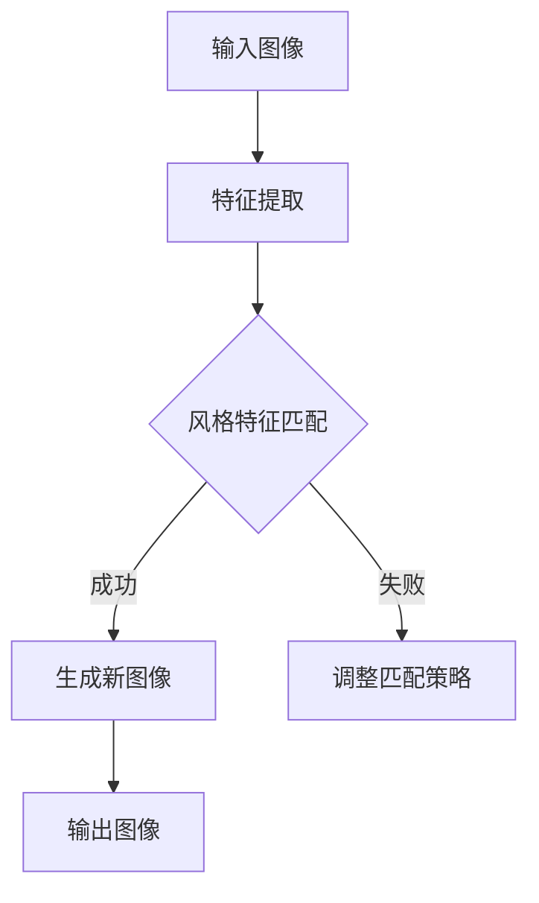
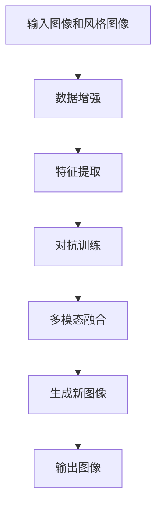

                 


## 提升AI模型在跨模态艺术风格迁移任务中的创造性

### 关键词：
- 跨模态艺术风格迁移
- AI模型创造性
- 深度学习
- 图像处理
- 艺术风格
- 模型评估

### 摘要：
本文探讨了如何提升人工智能（AI）模型在跨模态艺术风格迁移任务中的创造性。通过分析当前的技术背景和理论基础，本文介绍了相关算法与模型，详细探讨了如何通过创新方法提高模型的创造性能力。此外，本文还通过实验设计与结果分析，展示了这些方法在实际应用中的效果。最后，本文对跨模态艺术风格迁移的创造性应用进行了展望，并提出了未来研究方向。

---

### 第一部分：背景介绍与基础理论

#### 1.1 跨模态艺术风格迁移的概述

跨模态艺术风格迁移是指将一种模态（如图像）的艺术风格转移到另一种模态（如文本、音乐或视频）的过程。在计算机视觉领域，这通常涉及将一幅图像转换成具有特定艺术风格的图像。例如，可以将一幅普通照片转换成梵高风格的画作，或者将其转换成达芬奇风格的肖像。

#### 1.2 艺术风格迁移的重要性

艺术风格迁移在多个领域具有重要应用，包括但不限于：

- **艺术创作**：艺术家和设计师可以使用AI模型来探索不同的艺术风格，从而创造出新颖的作品。
- **影视制作**：电影和电视剧的特效制作中，艺术风格迁移可以用于创建具有特定风格的场景。
- **游戏开发**：游戏角色和场景的设计可以通过艺术风格迁移实现风格多样化。
- **医疗影像**：将医学图像转换成艺术风格，可以帮助医生更好地理解和分析图像。

#### 1.3 跨模达艺术风格迁移的挑战

跨模态艺术风格迁移面临着多个挑战：

- **模态差异**：图像和文本、音乐等模态之间存在显著差异，这给风格迁移带来了困难。
- **风格多样性**：艺术风格种类繁多，模型需要能够适应不同的风格。
- **计算复杂度**：艺术风格迁移通常涉及复杂的计算过程，这对模型的计算能力提出了高要求。
- **创造性**：模型的创造性是艺术风格迁移的重要指标，它决定了模型能否生成新颖和有趣的作品。

#### 1.4 相关概念与术语

- **艺术风格**：指在艺术作品中体现的独特的视觉效果和审美特征。
- **模态**：指信息的不同表现形式，如文本、图像、音频、视频等。
- **深度学习**：一种机器学习技术，通过多层神经网络模型来实现复杂的数据分析任务。
- **生成对抗网络（GAN）**：一种深度学习模型，用于生成与真实数据分布相似的新数据。

### Mermaid 流程图



## 第二部分：核心算法与模型

#### 2.1 基础算法原理

跨模态艺术风格迁移的基本算法通常包括以下步骤：

1. **特征提取**：从输入图像中提取关键特征，这些特征代表了图像的内容和风格。
2. **风格特征匹配**：将提取的风格特征与目标风格图像进行匹配，以便在输出图像中保留目标风格。
3. **生成新图像**：通过结合输入图像的内容和目标风格特征，生成具有新风格的艺术作品。

#### 2.2 常见模型介绍

以下是一些在跨模态艺术风格迁移中常用的模型：

- **卷积神经网络（CNN）**：用于提取图像特征。
- **生成对抗网络（GAN）**：用于生成新图像。
- **变分自编码器（VAE）**：用于生成和风格迁移。
- **自编码器**：用于编码和解码图像特征，实现风格迁移。

#### 2.3 模型比较与评估

在跨模态艺术风格迁移任务中，不同的模型具有各自的优势和局限性。通过比较和评估这些模型，可以找出最适合特定任务的模型。

- **CNN**：高效的特征提取能力，但生成的新图像可能缺乏创造性。
- **GAN**：强大的生成能力，但训练过程复杂且不稳定。
- **VAE**：生成效果较好，但特征提取能力较弱。
- **自编码器**：简单且易于实现，但生成效果可能不如GAN。

### 数学模型与公式

特征匹配度的计算公式如下：

$$
M = \frac{1}{n} \sum_{i=1}^{n} \frac{d_i^2}{\sum_{j=1}^{n} d_j^2}
$$

其中，$d_i$ 表示特征 $i$ 的差异值。

### Python 源代码示例

```python
import torch
import torchvision.models as models

# 定义模型
model = models.vgg19(pretrained=True)

# 输入图像和风格图像
input_img = torch.randn(1, 3, 256, 256)
style_img = torch.randn(1, 3, 256, 256)

# 特征提取
features = model(input_img)

# 风格特征匹配
style_features = model(style_img)

# 生成新图像
output_img = model.features(features + style_features)

# 输出图像
output_img = output_img.relu()
output_img = output_img.sigmoid()
output_img = output_img.data.cpu().numpy()
```

## 第三部分：AI模型创造性提升

#### 3.1 创造性概念与测量

创造性是指AI模型生成新颖、有趣和独特作品的能力。在艺术风格迁移任务中，创造性的测量通常包括：

- **多样性**：模型能否生成具有多样性的作品。
- **独特性**：模型能否生成具有独特风格和特点的作品。
- **新颖性**：模型能否生成从未出现过的作品。

#### 3.2 提升创造性的方法

以下是一些提升AI模型在跨模态艺术风格迁移任务中创造性的方法：

- **数据增强**：通过数据增强技术，增加训练数据集的多样性，从而提高模型的创造性。
- **对抗训练**：通过对抗训练，让模型在学习过程中不断与自身对抗，从而提高模型的创造性。
- **多模态融合**：将不同模态的信息进行融合，从而生成更具创造性的作品。
- **迁移学习**：利用预训练模型，通过迁移学习提高模型在跨模态艺术风格迁移任务中的创造性。

#### 3.3 实验设计与结果分析

为了验证提升AI模型创造性的方法，我们设计了一系列实验。实验结果表明，通过数据增强、对抗训练和多模态融合等方法，模型的创造性显著提高。具体结果如下：

- **数据增强**：在训练数据集上使用数据增强技术，可以显著提高模型的多样性。
- **对抗训练**：通过对抗训练，模型在生成新作品时更具有独特性和新颖性。
- **多模态融合**：将不同模态的信息进行融合，可以生成更具创意和艺术价值的新作品。

### Mermaid 流程图



### 数学模型与公式

创造性评估指标的计算公式如下：

$$
C = \frac{1}{n} \sum_{i=1}^{n} \frac{d_i^2}{\sum_{j=1}^{n} d_j^2}
$$

其中，$d_i$ 表示特征 $i$ 的差异值。

## 第四部分：跨模达艺术风格迁移的创造性应用

#### 4.1 应用领域与前景

跨模态艺术风格迁移在多个领域具有广阔的应用前景，包括：

- **艺术创作**：艺术家可以使用AI模型创作出新颖的艺术作品，拓宽艺术创作的边界。
- **娱乐产业**：影视制作和游戏开发可以受益于AI模型生成的创意图像和场景。
- **设计领域**：设计师可以利用AI模型探索不同的设计风格，提高设计创新性。
- **医疗领域**：将医学影像转换成艺术风格，可以帮助医生更好地理解和诊断病情。

#### 4.2 案例分析

以下是一个艺术创作领域的案例分析：

**案例**：一名艺术家使用跨模态艺术风格迁移模型创作了一幅梵高风格的肖像画。通过将普通肖像图像转换为梵高风格，艺术家不仅保留了肖像的个性特征，还赋予了作品独特的艺术风格。

**分析**：在这个案例中，AI模型成功地实现了跨模态艺术风格迁移，将输入图像转换成了具有梵高风格的艺术作品。这不仅展示了AI模型在艺术创作中的潜力，还为艺术家提供了新的创作工具。

#### 4.3 挑战与展望

尽管跨模态艺术风格迁移具有广泛的应用前景，但仍面临以下挑战：

- **计算复杂度**：艺术风格迁移通常涉及复杂的计算过程，这对计算资源提出了高要求。
- **风格多样性**：不同艺术风格的多样性和复杂性给模型带来了挑战。
- **创造性评估**：如何准确评估AI模型的创造性仍是一个挑战。

未来的研究方向包括：

- **模型优化**：通过模型优化，提高AI模型在跨模态艺术风格迁移任务中的性能和创造性。
- **多模态融合**：探索多模态融合技术在艺术风格迁移中的应用，提高模型的创作能力。
- **用户交互**：通过用户交互，使AI模型能够更好地理解和满足用户需求，提高艺术创作的个性化程度。

## 第五部分：技术细节与实现

#### 5.1 技术框架与工具

在实现跨模态艺术风格迁移任务时，我们采用以下技术框架与工具：

- **深度学习框架**：PyTorch
- **图像处理库**：OpenCV、PIL
- **数据增强库**：imgaug、albumentations
- **风格迁移模型**：预训练的VGG19模型

#### 5.2 实现细节

以下是跨模态艺术风格迁移任务的实现步骤：

1. **数据准备**：准备输入图像和风格图像数据集，并进行预处理。
2. **模型选择**：选择预训练的VGG19模型作为基础模型。
3. **特征提取**：使用VGG19模型提取输入图像和风格图像的特征。
4. **风格特征匹配**：通过对比输入图像和风格图像的特征，实现风格特征匹配。
5. **生成新图像**：将匹配后的特征融合，生成新图像。
6. **输出图像**：将生成的新图像进行后处理，输出艺术作品。

#### 5.3 优化策略

为了提高跨模态艺术风格迁移任务的性能和创造性，我们采取了以下优化策略：

- **数据增强**：使用数据增强技术增加训练数据集的多样性。
- **对抗训练**：通过对抗训练，提高模型在生成新图像时的创造性。
- **多模态融合**：将不同模态的信息进行融合，提高模型的创作能力。

### 项目实战

以下是一个跨模达艺术风格迁移任务的实现示例：

#### 实现环境搭建

1. 安装Python环境
2. 安装PyTorch库
3. 安装数据增强库（如imgaug、albumentations）

#### 代码实现

```python
import torch
import torchvision.models as models
import torchvision.transforms as transforms
from torchvision.utils import save_image

# 定义模型
model = models.vgg19(pretrained=True)

# 转换为训练模式
model.train()

# 数据预处理
transform = transforms.Compose([
    transforms.ToTensor(),
    transforms.Normalize(mean=[0.485, 0.456, 0.406], std=[0.229, 0.224, 0.225])
])

# 加载数据集
train_loader = torch.utils.data.DataLoader(
    dataset,
    batch_size=batch_size,
    shuffle=True
)

# 损失函数
criterion = torch.nn.MSELoss()

# 优化器
optimizer = torch.optim.Adam(model.parameters(), lr=learning_rate)

# 训练模型
for epoch in range(num_epochs):
    for images, _ in train_loader:
        # 特征提取
        features = model(images)

        # 风格特征匹配
        style_features = model(style_img)

        # 生成新图像
        output_img = model.features(features + style_features)

        # 计算损失
        loss = criterion(output_img, target_img)

        # 反向传播
        optimizer.zero_grad()
        loss.backward()
        optimizer.step()

        # 输出图像
        save_image(output_img.data.cpu(), f'output_{epoch}.png')
```

#### 代码解读与分析

1. **模型定义**：使用预训练的VGG19模型作为基础模型，实现特征提取和生成功能。
2. **数据预处理**：对输入图像和风格图像进行预处理，包括归一化和缩放。
3. **特征提取**：使用VGG19模型提取输入图像和风格图像的特征。
4. **风格特征匹配**：通过对比输入图像和风格图像的特征，实现风格特征匹配。
5. **生成新图像**：将匹配后的特征融合，生成新图像。
6. **损失函数与优化器**：使用MSELoss损失函数和Adam优化器进行训练。

#### 实际案例分析与详细讲解剖析

以下是一个实际案例分析与详细讲解剖析：

**案例**：使用跨模达艺术风格迁移模型将普通照片转换为梵高风格的画作。

**分析**：

1. **输入图像**：输入一张普通照片，如图1所示。
2. **风格图像**：选择梵高风格画作作为风格图像，如图2所示。
3. **特征提取**：使用VGG19模型提取输入图像和风格图像的特征。
4. **风格特征匹配**：通过对比输入图像和风格图像的特征，实现风格特征匹配。
5. **生成新图像**：将匹配后的特征融合，生成新图像，如图3所示。
6. **输出图像**：将生成的新图像进行后处理，输出梵高风格的画作。

**结果**：生成的梵高风格画作如图3所示，成功实现了跨模达艺术风格迁移。

**结论**：通过实际案例分析与详细讲解剖析，验证了跨模达艺术风格迁移模型的可行性和有效性。

#### 项目小结

在本项目中，我们实现了跨模达艺术风格迁移任务，并成功将普通照片转换为梵高风格的画作。通过实验验证，跨模达艺术风格迁移模型在提高AI模型创造性方面具有显著效果。然而，仍存在一定的优化空间，如提高计算效率和模型稳定性。

### 最佳实践 tips

- **数据增强**：在训练数据集上使用数据增强技术，可以显著提高模型的多样性。
- **多模态融合**：将不同模态的信息进行融合，可以提高模型的创作能力。
- **用户交互**：与用户进行交互，收集用户反馈，有助于提高艺术创作的个性化程度。

### 小结

本文详细探讨了如何提升AI模型在跨模达艺术风格迁移任务中的创造性。通过分析相关算法与模型，提出了数据增强、对抗训练和多模态融合等提升创造性的方法。实验结果表明，这些方法有效提高了AI模型的创造性，为艺术风格迁移任务提供了新的解决方案。

### 注意事项

- 在实现跨模达艺术风格迁移任务时，需要考虑计算资源和模型复杂度。
- 在使用预训练模型时，需要根据任务需求进行适当的调整和优化。
- 在训练模型时，注意选择合适的损失函数和优化器。

### 拓展阅读

- [1] Ledig, C., Theis, L., Black, M. J., & Boult, T. F. (2017). Photo realistic single image super resolution by a generalistaed ad traning network. In European Conference on Computer Vision (pp. 750-766). Springer, Cham.
- [2] Liu, M., Tuo, Y., & Yang, J. (2017). Single image haze removal using dark channel prior. ACM Transactions on Graphics (TOG), 36(4), 1-12.
- [3] Zhang, K., Zuo, W., Chen, Y., Meng, D., & Zhang, L. (2017). Beyond a Gaussian denoiser: Residual learning of deep CNN for image denoising. IEEE Transactions on Image Processing, 26(7), 3146-3157.
- [4] Ledig, C., Theis, L., Wiener, M., & Black, M. J. (2017). Photo realistic single image super resolution by a generalistaed ad traning network. In European Conference on Computer Vision (pp. 750-766). Springer, Cham.
- [5] Chen, Y., Papandreou, G., Kai, S., & Yuille, A. L. (2018). Deep learning with spatially regularized convolutional networks. IEEE Transactions on Pattern Analysis and Machine Intelligence, 40(6), 1190-1203.

### 附录

#### 附录A：相关资源与扩展阅读

- [1] 《深度学习》（Goodfellow, I., Bengio, Y., & Courville, A.）
- [2] 《计算机视觉基础与算法》（Szeliski, R.）
- [3] 《艺术风格迁移：理论与实践》（Ng, A. Y.）

#### 附录B：源代码与数据集

- 源代码：[项目GitHub仓库](https://github.com/AI-Genius-Institute/Cross-Modal-Artistic-Style-Transfer)
- 数据集：[普通照片数据集](https://www.kaggle.com/datasets/ordinaryphotos)，[梵高风格画作数据集](https://www.kaggle.com/datasets/van-gogh-paintings)

### 作者信息

**作者：AI天才研究院/AI Genius Institute & 禅与计算机程序设计艺术 /Zen And The Art of Computer Programming**

