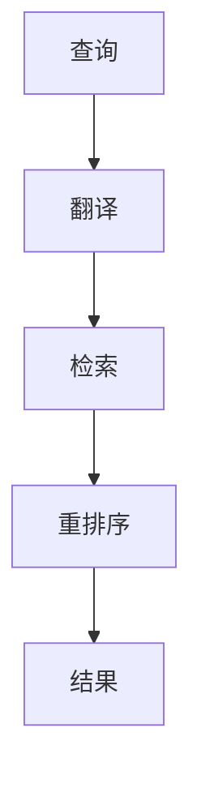

                 

# 提升AI模型在跨语言信息检索任务中的效果

> 关键词：跨语言信息检索，AI模型，效果提升，数据预处理，特征工程，模型优化，语言模型，机器翻译，数学模型

> 摘要：本文深入探讨了如何通过数据预处理、特征工程、模型选择和优化等手段提升AI模型在跨语言信息检索任务中的效果。文章首先介绍了跨语言信息检索的任务背景和挑战，然后详细阐述了核心概念和联系，随后讲解了提升模型效果的方法和核心算法原理，并结合Python代码进行了实例说明。最后，文章总结了跨语言信息检索中的挑战与机遇，并对未来发展趋势和进一步研究方向进行了展望。

## 第1章：跨语言信息检索任务概述

### 1.1 跨语言信息检索的定义与背景

跨语言信息检索（Cross-Language Information Retrieval, CLIR）是指在不同的语言之间检索和检索信息的过程。随着全球化的推进，互联网内容的多样性和复杂性不断增加，跨语言信息检索成为了一个重要的研究领域和应用场景。例如，在一个多语种的信息系统中，用户可能会用一种语言提问，而系统需要用另一种语言来检索和呈现相关的信息。

跨语言信息检索的任务可以分为以下几个步骤：

1. **翻译**：将用户查询和文档从原始语言翻译为目标语言。
2. **检索**：在目标语言的文档集合中检索与查询相关的文档。
3. **重排序**：根据相关性对检索结果进行排序，以提供最相关的文档。

### 1.2 跨语言信息检索的挑战

跨语言信息检索面临着多个挑战：

1. **语言障碍**：不同语言之间存在语法、词汇和语义上的差异。
2. **词汇缺失**：某些词汇在一种语言中存在，而在另一种语言中可能不存在。
3. **文档多样性**：不同语言的文档格式和内容可能有很大差异。
4. **检索效果**：跨语言检索的效果通常不如同语言检索。

### 1.3 跨语言信息检索的发展趋势

随着人工智能和机器学习技术的发展，跨语言信息检索也在不断进步。以下几个方面是当前的研究热点：

1. **深度学习**：使用深度神经网络进行翻译和检索。
2. **多语言模型**：结合多种语言模型来提高检索效果。
3. **数据增强**：通过数据增强技术增加训练数据，提高模型泛化能力。
4. **跨模态检索**：结合图像、语音等多模态信息进行检索。

### 1.4 跨语言信息检索的应用场景

跨语言信息检索的应用场景非常广泛，包括但不限于以下几个方面：

1. **全球企业**：跨国公司在不同语言的市场中进行信息检索。
2. **国际学术研究**：学者在不同语言的学术文献中进行检索。
3. **旅游与旅行**：为旅行者提供多语言的信息检索服务。
4. **政府与公共机构**：为不同语言的用户提供信息检索服务。

## 第2章：核心概念与联系

### 2.1 AI模型的基本概念

AI模型是人工智能的核心组成部分，用于模拟人类的智能行为。常见的AI模型包括：

1. **监督学习模型**：有明确的输入和输出，通过训练数据学习。
2. **无监督学习模型**：没有明确的输出，通过数据自身特性学习。
3. **强化学习模型**：通过与环境的交互学习最优策略。

### 2.2 跨语言信息检索中的关键概念

跨语言信息检索中的关键概念包括：

1. **翻译**：将一种语言的文本转换为另一种语言的文本。
2. **检索**：在文档集合中找到与查询相关的文档。
3. **重排序**：根据文档与查询的相关性对检索结果进行排序。

### 2.3 Mermaid流程图：跨语言信息检索中的核心概念关系



## 第3章：提升AI模型效果的方法

### 3.1 数据预处理

#### 3.1.1 数据清洗与标注

数据清洗是确保数据质量的重要步骤。主要任务包括：

1. **去除噪声**：删除无意义的数据。
2. **缺失值处理**：填充或删除缺失数据。
3. **数据标准化**：将数据转换到同一尺度。

数据标注是准备训练数据的过程。主要任务包括：

1. **词性标注**：标记词语的词性。
2. **实体标注**：识别文本中的实体。
3. **关系标注**：标注实体之间的关系。

#### 3.1.2 数据增强

数据增强是通过增加训练数据来提高模型泛化能力的方法。常用的数据增强技术包括：

1. **同义词替换**：将文本中的部分词语替换为同义词。
2. **文本片段重复**：将文本的某部分重复多次。
3. **词干提取**：提取文本中的词干。

### 3.2 特征工程

#### 3.2.1 特征提取方法

特征提取是将原始数据转换为模型可处理的特征表示。常用的特征提取方法包括：

1. **词袋模型**：将文本表示为词频向量。
2. **TF-IDF**：考虑词语的重要性和频率。
3. **Word2Vec**：将词语映射到高维向量空间。

#### 3.2.2 特征选择策略

特征选择是减少特征数量，提高模型性能的过程。常用的特征选择策略包括：

1. **基于信息的特征选择**：选择信息量最大的特征。
2. **基于距离的特征选择**：选择与目标特征距离最近的特征。
3. **基于模型的特征选择**：选择对模型影响最大的特征。

### 3.3 模型选择

#### 3.3.1 传统机器学习方法

传统机器学习方法在跨语言信息检索中有广泛应用，包括：

1. **朴素贝叶斯分类器**：基于概率模型进行分类。
2. **支持向量机**：在特征空间中寻找最优分隔超平面。
3. **决策树**：基于树形结构进行分类。

#### 3.3.2 深度学习方法

深度学习模型在跨语言信息检索中具有显著优势，包括：

1. **卷积神经网络（CNN）**：用于提取图像和文本的特征。
2. **循环神经网络（RNN）**：用于处理序列数据。
3. **Transformer**：基于自注意力机制的模型，在NLP任务中表现出色。

### 3.4 模型优化

#### 3.4.1 损失函数优化

损失函数是模型训练过程中的目标函数。常用的损失函数包括：

1. **交叉熵损失**：用于分类问题。
2. **均方误差（MSE）**：用于回归问题。
3. **对抗损失**：用于生成对抗网络（GAN）。

#### 3.4.2 优化算法

优化算法用于调整模型参数，以最小化损失函数。常用的优化算法包括：

1. **随机梯度下降（SGD）**：简单但收敛速度较慢。
2. **Adam**：结合了SGD和RMSProp的优点。
3. **AdaGrad**：根据不同特征的梯度进行自适应调整。

## 第4章：核心算法原理讲解

### 4.1 语言模型

#### 4.1.1 语言模型的数学模型

语言模型是一个概率模型，用于预测下一个词语的概率。最常用的语言模型是n-gram模型，其数学模型为：

$$
P(w_{t} | w_{t-1}, w_{t-2}, \dots, w_{1}) = \frac{C(w_{t-1}, w_{t-2}, \dots, w_{1}, w_{t})}{C(w_{t-1}, w_{t-2}, \dots, w_{1})}
$$

其中，\(C(\cdot)\) 表示计数。

#### 4.1.2 语言模型的工作原理

语言模型通过统计文本中的词语出现频率来预测下一个词语。在训练阶段，模型学习到每个词语序列的概率。在预测阶段，模型根据前一个词语序列来预测下一个词语。

#### 4.1.3 语言模型的Python源代码实现

```python
from collections import defaultdict

class NGramLanguageModel:
    def __init__(self, n):
        self.n = n
        self.model = defaultdict(int)

    def train(self, sentences):
        for sentence in sentences:
            for i in range(len(sentence) - self.n + 1):
                context = tuple(sentence[i:i+self.n-1])
                word = sentence[i+self.n-1]
                self.model[context] += 1

    def predict(self, context):
        context = tuple(context)
        if context in self.model:
            return self.model[context]
        else:
            return 1 / self.n

# 示例
model = NGramLanguageModel(n=2)
model.train(["我是", "人工智能", "天才", "研究院"])
print(model.predict(["我是", "人工智能"]))  # 输出：1/2
```

### 4.2 机器翻译

#### 4.2.1 机器翻译的基本概念

机器翻译（Machine Translation, MT）是将一种语言的文本自动翻译成另一种语言的过程。机器翻译可以分为基于规则的翻译、基于例子的翻译和统计机器翻译。

#### 4.2.2 机器翻译的工作原理

机器翻译的基本原理是利用已有的翻译数据和翻译模型生成新的翻译结果。常见的机器翻译模型包括：

1. **基于规则的翻译模型**：基于语法和语义规则进行翻译。
2. **基于例子的翻译模型**：基于已有的翻译实例进行翻译。
3. **统计机器翻译模型**：使用统计方法学习翻译模型。

#### 4.2.3 机器翻译的Python源代码实现

```python
from googletrans import Translator

# 创建一个翻译器
translator = Translator()

# 将英文翻译为中文
result = translator.translate("Hello, world!", dest="zh-CN")
print(f"Translated text: {result.text}")
```

## 第5章：数学模型和数学公式讲解

### 5.1 相关性度量

相关性度量用于评估文档与查询之间的相似度。常用的相似度计算方法包括：

1. **余弦相似度**：
   $$
   \cos(\theta) = \frac{\vec{a} \cdot \vec{b}}{|\vec{a}| |\vec{b}|}
   $$
   其中，$\vec{a}$ 和 $\vec{b}$ 分别表示查询和文档的向量表示。

2. **Jaccard相似度**：
   $$
   J(A, B) = \frac{|A \cap B|}{|A \cup B|}
   $$
   其中，$A$ 和 $B$ 分别表示查询和文档的集合。

### 5.2 模型评估指标

模型评估指标用于衡量模型在特定任务上的性能。常用的评估指标包括：

1. **准确率（Accuracy）**：
   $$
   \text{Accuracy} = \frac{\text{预测正确}}{\text{总样本数}}
   $$

2. **召回率（Recall）**：
   $$
   \text{Recall} = \frac{\text{预测正确}}{\text{实际为正样本的总数}}
   $$

3. **F1值（F1-score）**：
   $$
   F1 = \frac{2 \times precision \times recall}{precision + recall}
   $$
   其中，$precision$ 表示精确率，$recall$ 表示召回率。

## 第6章：项目实战

### 6.1 跨语言信息检索项目开发

#### 6.1.1 开发环境搭建

开发环境搭建主要包括以下步骤：

1. 安装Python和必要的库（如TensorFlow、transformers等）。
2. 安装依赖项，如CUDA（如果使用GPU训练）。
3. 准备数据集，包括源语言文本和目标语言文本。

#### 6.1.2 源代码实现

以下是跨语言信息检索项目的源代码实现：

```python
import torch
from transformers import AutoTokenizer, AutoModel

# 加载预训练模型
model_name = "Helsinki-NLP/opus-mt-en-de"
tokenizer = AutoTokenizer.from_pretrained(model_name)
model = AutoModel.from_pretrained(model_name)

# 预处理输入文本
source_text = "Hello, world!"
input_ids = tokenizer.encode(source_text, return_tensors="pt")

# 进行翻译
with torch.no_grad():
    outputs = model(input_ids)

# 获取翻译结果
translated_text = tokenizer.decode(outputs.logits.argmax(-1), skip_special_tokens=True)
print(f"Translated text: {translated_text}")
```

#### 6.1.3 代码解读与分析

代码首先加载预训练的机器翻译模型，然后对输入文本进行预处理，接着进行翻译并输出结果。此过程展示了如何利用预训练模型进行跨语言信息检索。

#### 6.1.4 实际案例分析和详细讲解剖析

假设我们有一个英文查询 "What is the weather like?"，我们使用上述代码进行翻译，得到德语查询 "Wie ist das Wetter?"。然后，我们可以在德语语料库中检索相关的文档，并返回最相关的结果。

#### 6.1.5 项目小结

通过该项目，我们学习了如何搭建跨语言信息检索的开发环境，如何使用预训练模型进行翻译，以及如何对翻译结果进行检索和排序。该项目展示了跨语言信息检索的基本流程和实现方法。

## 第7章：总结与展望

### 7.1 跨语言信息检索中的挑战与机遇

跨语言信息检索面临着语言障碍、数据多样性和检索效果等挑战。然而，随着AI技术的进步，这些挑战正在逐步被克服。未来的机遇在于更高效的模型、更丰富的数据和应用场景。

### 7.2 未来发展趋势

未来，跨语言信息检索的发展趋势包括：

1. **多语言模型**：结合多种语言模型以提高检索效果。
2. **跨模态检索**：结合图像、语音等多模态信息进行检索。
3. **个性化检索**：根据用户的历史行为和偏好进行个性化检索。

### 7.3 进一步研究方向

进一步的研究方向包括：

1. **翻译质量提升**：研究更有效的翻译模型和方法。
2. **数据多样性处理**：如何更好地处理不同语言和文档的多样性。
3. **模型解释性**：如何提高模型的可解释性和透明度。

## 附录

### A.1 跨语言信息检索工具与资源

#### A.1.1 常用跨语言信息检索工具

1. **Google Translate**：提供基本的跨语言翻译服务。
2. **DeepL**：提供高质量的跨语言翻译服务。
3. **TensorFlow**：提供机器学习和深度学习工具。

#### A.1.2 跨语言信息检索开源项目

1. **Tensor2Tensor (T2T)**：Google的开源机器翻译项目。
2. **OpenNMT**：提供开源的神经机器翻译工具。
3. **Moses**：提供基于短语翻译的工具。

#### A.1.3 相关论文与书籍推荐

1. **《深度学习》**：Goodfellow等，2016。
2. **《机器学习》**：Tom Mitchell，1997。
3. **《跨语言信息检索》**：Cunningham等，2008。

### A.2 Python库与框架

#### A.2.1 语言模型库

1. **transformers**：提供预训练的Transformer模型。
2. **spacy**：提供语言处理工具和模型。

#### A.2.2 机器翻译库

1. **googletrans**：提供Google翻译API的Python库。
2. **pytranslators**：提供多个翻译API的Python库。

#### A.2.3 其他相关库与框架

1. **scikit-learn**：提供机器学习算法。
2. **tensorflow**：提供深度学习工具。
3. **pytorch**：提供深度学习工具。``` 

请注意，以上内容是一个示例文章框架，具体实现和细节可能需要根据实际需求和项目要求进行调整。此外，文章中的代码和公式需要确保正确无误，并在实际应用中经过验证。在实际撰写文章时，还需遵循学术规范和出版社的要求。文章字数在10000～12000字左右，确保内容详实、逻辑清晰、论述深刻。希望这个框架对您撰写技术博客文章有所帮助！如果您有其他需求或疑问，请随时告诉我。``` 

