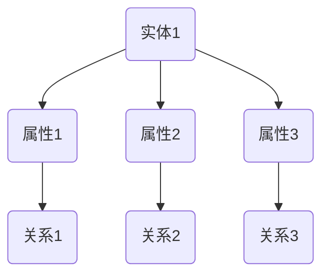
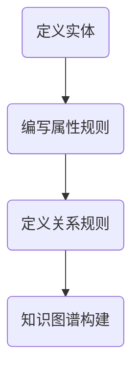
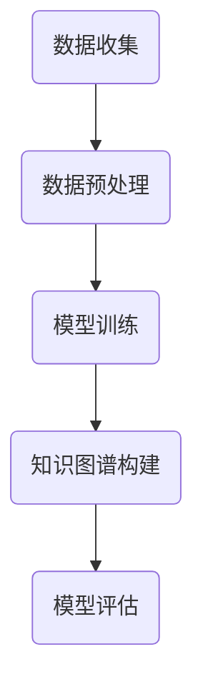
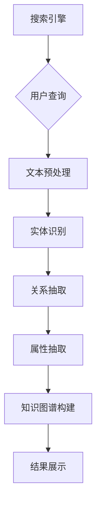
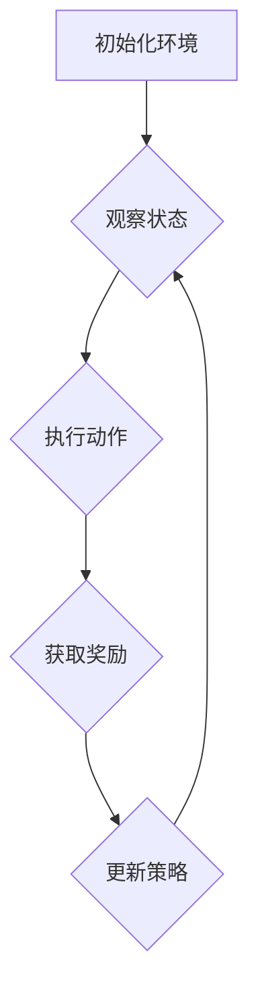

                 


### 引言

在当今大数据和人工智能时代，知识图谱作为一种高效的数据组织形式，已经在各个领域展现出了巨大的价值。知识图谱通过将实体、属性和关系以图形结构的方式表示，实现了对复杂数据的语义理解。而AI模型作为知识图谱构建的核心技术，其准确性和性能直接影响到知识图谱的应用效果。特别是在跨领域知识图谱构建任务中，由于不同领域的数据特征、语义和知识体系存在差异，AI模型的准确性成为了亟待解决的关键问题。

本文旨在探讨如何提升AI模型在跨领域知识图谱构建任务中的准确性。我们将从背景介绍、核心概念与联系、核心算法原理讲解、项目实战以及未来展望等五个部分展开讨论。

首先，我们将介绍知识图谱和AI模型的基础知识，包括它们的定义、结构和构建方法。然后，我们将深入探讨跨领域知识图谱的挑战与机遇，分析数据预处理与增强、特征工程和模型选择与优化等提升AI模型准确性的方法。接着，我们将通过一个实际项目，详细讲解如何在实际场景中提升AI模型的准确性。最后，我们将对未来的技术发展趋势和应用前景进行展望，并给出最佳实践和注意事项。

通过本文的阅读，读者将能够全面了解跨领域知识图谱构建中的AI模型技术，掌握提升模型准确性的关键方法，为未来的研究和应用提供有益的参考。

---

## 第一部分：知识图谱与AI模型基础

### 第1章：知识图谱概述

#### 1.1 知识图谱的定义与重要性

知识图谱（Knowledge Graph）是一种将实体、属性和关系通过图结构表示的方法，旨在通过语义理解实现对复杂数据的自动组织和高效查询。在知识图谱中，实体（Entity）是数据的主体，可以是具体的人、地点、事物等；属性（Property）描述实体的特征或状态；关系（Relationship）则是实体之间的关联。

知识图谱的重要性在于它能够将无结构或半结构化的数据转化为具有语义和结构化的信息，从而实现数据的智能化管理和利用。以下是知识图谱的几个核心应用场景：

1. **搜索引擎优化**：通过构建包含网页、用户行为和搜索意图的知识图谱，搜索引擎可以提供更加精准和个性化的搜索结果。
2. **智能问答系统**：知识图谱为问答系统提供了丰富的语义信息，使得系统能够理解用户的问题，并提供准确的答案。
3. **推荐系统**：知识图谱能够通过分析用户和物品之间的关联关系，实现更加精准和个性化的推荐。
4. **自然语言处理**：知识图谱提供了大量的语义信息，有助于自然语言处理任务中的词义消歧、实体识别等。
5. **知识发现与洞察**：知识图谱可以帮助企业和组织从海量数据中发现潜在的关联和趋势，为决策提供支持。

#### 1.2 知识图谱的基本结构

知识图谱的基本结构主要包括实体、属性和关系。以下是一个简化的知识图谱结构示意图：



在上图中，实体A具有多个属性（B、C、D），并且与其他实体通过关系（E、F、G）相连。知识图谱的构建通常依赖于以下几个要素：

- **实体识别**：识别文本数据中的实体，并对其进行分类和标注。
- **关系抽取**：从文本中提取实体之间的关系，建立实体之间的关联。
- **属性抽取**：从文本中提取实体的属性，用于描述实体的特征。
- **实体链接**：将文本中的实体与知识图谱中的实体进行映射，实现不同数据源之间的实体统一。

#### 1.3 知识图谱的构建方法

知识图谱的构建方法可以分为基于规则的方法和基于学习的方法。

- **基于规则的方法**：这种方法依赖于领域专家的手动规则编写，通过对实体、属性和关系的定义和约束来构建知识图谱。优点是构建过程可控，能够保证知识的一致性和准确性；缺点是规则编写耗时耗力，且难以处理复杂和动态的场景。



- **基于学习的方法**：这种方法利用机器学习和深度学习技术，从大量数据中自动学习实体、属性和关系的表示和关联。优点是能够处理大规模和动态变化的数据，自动发现潜在的知识关联；缺点是需要大量标注数据和计算资源，且模型的泛化能力有限。



无论是基于规则的方法还是基于学习的方法，知识图谱的构建都是一个复杂的过程，需要综合考虑数据源的质量、数据的多样性、模型的性能和可解释性等因素。

### 第2章：AI模型概述

#### 2.1 AI模型的基本概念

人工智能（AI）是指通过计算机程序实现人类智能的任务和功能。AI模型是人工智能的核心组成部分，通过算法和计算模型来实现对数据的处理、理解和预测。以下是几种常见的AI模型及其基本概念：

- **监督学习**（Supervised Learning）：监督学习是AI模型中最常见的一种类型，其特点是需要输入数据（特征）和对应的标签（输出），通过训练学习出一个函数，用于对新数据进行预测。

- **无监督学习**（Unsupervised Learning）：无监督学习不依赖于标签信息，通过发现数据内在的结构和模式，如聚类和降维等。

- **强化学习**（Reinforcement Learning）：强化学习是一种通过试错和反馈来学习的算法，其目标是找到一种策略，使得在给定环境中能够最大化累计奖励。

- **神经网络**（Neural Network）：神经网络是一种基于生物神经系统的计算模型，通过多层神经元之间的加权连接来模拟人类大脑的神经网络结构。

- **决策树**（Decision Tree）：决策树是一种树形结构，通过一系列的判断条件来对数据进行分类或回归。

- **支持向量机**（Support Vector Machine，SVM）：支持向量机是一种基于最大间隔原则的分类算法，通过找到一个最优的超平面来分隔数据。

#### 2.2 AI模型在知识图谱构建中的应用

AI模型在知识图谱构建中的应用主要分为以下几个方面：

- **实体嵌入**（Entity Embedding）：通过将实体映射到低维向量空间，实现实体之间的相似度计算和关联关系挖掘。

- **关系预测**（Relationship Prediction）：通过学习实体之间的关联模式，预测未知实体之间的关系。

- **属性抽取**（Property Extraction）：从文本数据中提取实体的属性，增强知识图谱的语义表示。

- **知识图谱补全**（Knowledge Graph Completion）：通过预测缺失的实体、属性和关系，补充和丰富知识图谱。

以下是一个简单的知识图谱应用场景，展示了AI模型在知识图谱构建中的应用：



在上述流程中，用户查询通过文本预处理得到结构化的数据，实体识别、关系抽取和属性抽取分别利用AI模型从文本中提取关键信息，构建知识图谱，并通过结果展示提供给用户。

#### 2.3 跨领域知识图谱的挑战与机遇

跨领域知识图谱是指将不同领域的知识进行整合，形成包含多领域知识的知识图谱。在跨领域知识图谱的构建过程中，面临着以下挑战：

- **数据异构性**：不同领域的数据格式、数据结构和语义存在差异，需要统一处理和整合。
- **知识冲突**：不同领域的知识可能存在冲突或不兼容，需要设计有效的知识融合策略。
- **数据稀缺性**：某些领域的数据量较少，导致模型训练和推理困难。
- **不确定性处理**：跨领域知识图谱中的数据存在不确定性，需要设计方法来处理和建模不确定性。

然而，跨领域知识图谱也带来了许多机遇：

- **知识互补**：通过整合不同领域的知识，可以形成更全面和丰富的知识体系。
- **多领域应用**：跨领域知识图谱可以应用于多个领域，实现跨领域的知识共享和应用。
- **智能决策支持**：跨领域知识图谱可以为企业和组织提供更加智能的决策支持，助力业务创新和增长。

总之，跨领域知识图谱的构建是一个复杂而充满挑战的过程，需要综合考虑数据源、算法模型和知识表示等多个方面，充分利用AI技术提升知识图谱的构建效果和准确性。

### 第3章：数据预处理与增强

#### 3.1 数据预处理

数据预处理是知识图谱构建中至关重要的一步，其目的是将原始数据转化为适合AI模型训练的形式。以下是一些常见的数据预处理方法：

1. **数据清洗**：数据清洗是数据预处理的第一步，旨在去除数据中的噪声和错误。常见的操作包括去除空值、填补缺失值、去除重复数据等。

```python
import pandas as pd

# 加载数据
data = pd.read_csv('data.csv')

# 去除空值
data = data.dropna()

# 填补缺失值
data['missing_value'] = data['missing_value'].fillna('unknown')

# 去除重复数据
data = data.drop_duplicates()
```

2. **数据标准化**：数据标准化是将不同特征的数据范围进行统一处理，使得特征之间具有可比性。常用的标准化方法包括最小-最大标准化和Z-Score标准化。

```python
from sklearn.preprocessing import MinMaxScaler, StandardScaler

# 最小-最大标准化
scaler = MinMaxScaler()
data_normalized = scaler.fit_transform(data)

# Z-Score标准化
scaler = StandardScaler()
data_standardized = scaler.fit_transform(data)
```

3. **数据采样**：数据采样是调整数据集大小的一种方法，适用于数据不平衡的情况。常用的采样方法包括随机采样、过采样和欠采样。

```python
from sklearn.utils import resample

# 随机采样
data_random = resample(data, replace=True, n_samples=1000, random_state=42)

# 过采样
data_upsampled = resample(data, replace=True, n_samples=2000, random_state=42)

# 欠采样
data_downsampled = resample(data, replace=False, n_samples=500, random_state=42)
```

#### 3.2 数据增强

数据增强是通过生成或转换现有数据来扩充数据集，从而提高模型的泛化能力。以下是一些常见的数据增强方法：

1. **数据扩充**：数据扩充是通过人工或自动化方式生成新的数据样本。常见的方法包括数据变换、合成和生成。

```python
from keras.preprocessing.sequence import pad_sequences
from keras.preprocessing.text import text_to_word_sequence

# 数据变换
def transform_data(data):
    transformed = []
    for text in data:
        # 上下文转换
        transformed.append(text[::-1])
        # 转换为小写
        transformed.append(text.lower())
        # 去除标点符号
        transformed.append(text.replace('.', ''))
    return transformed

# 数据合成
def synthesize_data(data, size):
    synthesized = []
    for _ in range(size):
        # 随机选取两个文本
        text1, text2 = random.sample(data, 2)
        # 合成新的文本
        synthesized.append(text1 + text2)
    return synthesized

# 数据生成
def generate_data(data, model):
    generated = []
    for text in data:
        # 生成新的文本
        generated_text = model.generate(text, max_length=10)
        generated.append(generated_text)
    return generated
```

2. **数据转换**：数据转换是通过将原始数据转换为其他形式来增强数据集。常见的方法包括序列化、编码和嵌入。

```python
# 序列化
sequences = pad_sequences(data, maxlen=100)

# 编码
from keras.preprocessing.text import Tokenizer

tokenizer = Tokenizer(num_words=10000)
tokenizer.fit_on_texts(data)
encoded = tokenizer.texts_to_sequences(data)

# 嵌入
from keras.layers import Embedding

embedding_matrix = np.zeros((vocab_size, embedding_dim))
for word, i in tokenizer.word_index.items():
    if i < max_sequence_length:
        embedding_vector = embedding_index.get(word)
        if embedding_vector is not None:
            embedding_matrix[i] = embedding_vector
```

通过数据预处理和增强，我们可以显著提高AI模型在知识图谱构建任务中的准确性和性能。

### 第4章：特征工程

#### 4.1 特征提取

特征提取是特征工程中的关键步骤，其目的是从原始数据中提取出对模型训练有贡献的特征，从而提高模型的性能。以下是一些常见的特征提取方法：

1. **文本特征提取**：文本特征提取是将文本数据转换为计算机可以处理的形式。常用的方法包括词袋模型、TF-IDF和词嵌入。

```python
from sklearn.feature_extraction.text import TfidfVectorizer

# 词袋模型
vectorizer = CountVectorizer()
X = vectorizer.fit_transform(corpus)

# TF-IDF
vectorizer = TfidfVectorizer()
X = vectorizer.fit_transform(corpus)

# 词嵌入
from keras.layers import Embedding

model = Sequential()
model.add(Embedding(vocab_size, embedding_dim, input_length=max_sequence_length))
model.add(Flatten())
model.compile(optimizer='adam', loss='binary_crossentropy', metrics=['accuracy'])
model.fit(X, y, epochs=10, batch_size=32)
```

2. **图特征提取**：图特征提取是从知识图谱中提取出与实体和关系相关的特征。常用的方法包括基于节点的特征提取和基于边的特征提取。

```python
from node2vec import Node2Vec

# 基于节点的特征提取
model = Node2Vec(graph, dimensions=128, walk_length=10, num_walks=10)
model.train()
node_features = model.get_node_features()

# 基于边的特征提取
def edge_features(edge):
    # 提取边的特征
    return {'weight': edge.weight}

edge_features = graph.edge_features(edge_features)
```

#### 4.2 特征选择

特征选择是特征工程中的另一个重要步骤，其目的是从提取出的特征中选择出对模型训练有最大贡献的特征，从而提高模型的性能并减少计算成本。以下是一些常见的特征选择方法：

1. **基于过滤的方法**：基于过滤的方法通过评估每个特征的统计显著性来选择特征。

```python
from sklearn.feature_selection import SelectKBest, chi2

# 选择前10个特征
selector = SelectKBest(chi2, k=10)
X_new = selector.fit_transform(X, y)
```

2. **基于包装的方法**：基于包装的方法通过训练多个子模型来评估特征的重要性。

```python
from sklearn.model_selection import cross_val_score
from sklearn.ensemble import RandomForestClassifier

# 选择最佳特征
best_features = []
for feature in features:
    model = RandomForestClassifier()
    scores = cross_val_score(model, X[:, feature], y, cv=5)
    if np.mean(scores) > 0.7:
        best_features.append(feature)

X_new = X[:, best_features]
```

3. **基于嵌入的方法**：基于嵌入的方法通过评估特征在低维空间中的表现来选择特征。

```python
from sklearn.metrics.pairwise import cosine_similarity

# 计算特征之间的相似度
similarity_matrix = cosine_similarity(X)

# 选择相似度最高的特征
best_features = similarity_matrix.argsort()[:, -10:]

X_new = X[:, best_features]
```

通过特征提取和特征选择，我们可以显著提高AI模型在知识图谱构建任务中的准确性和效率。

### 第5章：模型选择与优化

#### 5.1 模型选择

在知识图谱构建任务中，选择合适的AI模型是提高模型准确性的关键步骤。以下是一些常见的AI模型及其适用场景：

1. **神经网络**（Neural Network）：神经网络通过多层神经元之间的加权连接来模拟人类大脑的神经网络结构。适用于实体嵌入、关系预测和属性抽取等任务。

2. **决策树**（Decision Tree）：决策树是一种树形结构，通过一系列的判断条件来对数据进行分类或回归。适用于特征选择和模型解释。

3. **支持向量机**（Support Vector Machine，SVM）：支持向量机是一种基于最大间隔原则的分类算法，通过找到一个最优的超平面来分隔数据。适用于关系预测和实体分类。

4. **聚类算法**（Clustering Algorithm）：聚类算法通过将数据划分为不同的簇来挖掘数据的内在结构。适用于实体聚类和知识图谱补全。

5. **深度学习模型**（Deep Learning Model）：深度学习模型是神经网络的扩展，通过多层神经网络来实现复杂的特征提取和关系建模。适用于大规模知识图谱构建。

#### 5.2 模型优化

模型优化是提高AI模型准确性的重要步骤，以下是一些常见的模型优化方法：

1. **超参数调优**：超参数调优是通过调整模型训练过程中的超参数来提高模型性能。常用的调优方法包括网格搜索和贝叶斯优化。

```python
from sklearn.model_selection import GridSearchCV
from sklearn.svm import SVC

# 定义参数网格
param_grid = {'C': [0.1, 1, 10], 'gamma': [0.001, 0.01, 0.1]}

# 网格搜索
grid_search = GridSearchCV(SVC(), param_grid, cv=5)
grid_search.fit(X, y)

# 获取最佳参数
best_params = grid_search.best_params_
```

2. **正则化**：正则化是一种通过在损失函数中添加惩罚项来防止模型过拟合的方法。常用的正则化方法包括L1正则化和L2正则化。

```python
from keras.regularizers import l1_l2

# 定义模型
model = Sequential()
model.add(Dense(128, input_dim=X.shape[1], activation='relu', kernel_regularizer=l1_l2(l1=0.01, l2=0.01)))
model.add(Dense(1, activation='sigmoid'))
model.compile(optimizer='adam', loss='binary_crossentropy', metrics=['accuracy'])

# 训练模型
model.fit(X, y, epochs=10, batch_size=32)
```

3. **模型融合**：模型融合是通过结合多个模型的预测结果来提高模型性能的方法。常用的模型融合方法包括投票法和堆叠法。

```python
from sklearn.ensemble import VotingClassifier

# 定义模型
model1 = LogisticRegression()
model2 = RandomForestClassifier()
model3 = XGBClassifier()

# 模型融合
model = VotingClassifier(estimators=[('model1', model1), ('model2', model2), ('model3', model3)], voting='soft')
model.fit(X, y)

# 预测
predictions = model.predict(X)
```

通过模型选择与优化，我们可以显著提高AI模型在知识图谱构建任务中的准确性和性能。

### 第6章：强化学习方法在知识图谱构建中的应用

#### 6.1 强化学习基本概念

强化学习（Reinforcement Learning，RL）是一种通过试错和反馈来学习的机器学习方法。与监督学习和无监督学习不同，强化学习通过一个智能体（Agent）与环境的交互来学习最优策略。以下是强化学习的几个核心概念：

1. **智能体（Agent）**：智能体是执行动作并从环境中获取反馈的实体。
2. **环境（Environment）**：环境是智能体操作的上下文，用于定义智能体的状态和动作空间。
3. **状态（State）**：状态是智能体在环境中所处的情景的描述。
4. **动作（Action）**：动作是智能体可以采取的行动，用于改变当前状态。
5. **奖励（Reward）**：奖励是智能体在执行动作后从环境中获得的即时反馈，用于评价动作的好坏。
6. **策略（Policy）**：策略是智能体在给定状态下采取的动作的映射，用于指导智能体的行为。

强化学习的基本过程包括以下几个步骤：

1. **初始化**：初始化智能体、环境和策略。
2. **互动**：智能体在环境中采取动作，并获取状态转移和奖励。
3. **学习**：通过试错和反馈来更新策略，以最大化累计奖励。
4. **评估**：评估策略的性能，并根据需要调整策略。

强化学习的目标是通过学习最优策略，使得智能体在长期交互中能够获得最大化的总奖励。

#### 6.2 强化学习在知识图谱构建中的挑战

尽管强化学习在许多任务中表现出了强大的学习能力，但在知识图谱构建中应用强化学习仍然面临着一系列挑战：

1. **多任务学习**：知识图谱构建通常涉及多个任务，如实体识别、关系抽取和属性抽取。强化学习需要同时处理这些任务，并找到它们之间的平衡。
2. **不确定性处理**：知识图谱中的数据存在不确定性，如实体和关系的噪声、数据缺失等。强化学习需要有效处理这些不确定性，以避免错误的策略。
3. **长期奖励设计**：在知识图谱构建中，某些任务可能需要长期的回报才能评估。设计一个有效的长期奖励机制是强化学习应用的关键。
4. **稀疏奖励**：知识图谱构建任务中的奖励通常比较稀疏，即智能体需要执行一系列动作才能获得奖励。稀疏奖励会导致智能体在学习过程中容易陷入局部最优。

#### 6.3 强化学习方法在知识图谱构建中的应用

为了克服上述挑战，研究者们提出了多种强化学习方法在知识图谱构建中的应用，以下是一些典型的方法：

1. **序列决策模型**：序列决策模型通过将知识图谱构建任务表示为一个序列决策问题，使用强化学习来优化知识图谱的构建过程。例如，采用序列决策模型来优化知识图谱中的实体识别和关系抽取。

2. **深度强化学习**：深度强化学习结合了深度学习和强化学习，通过神经网络来表示状态和动作，从而提高强化学习模型的表达能力和鲁棒性。例如，使用深度强化学习来优化知识图谱中的实体嵌入和关系预测。

3. **多任务强化学习**：多任务强化学习通过同时处理多个任务来提高知识图谱构建的效率。例如，使用多任务强化学习来同时优化知识图谱中的实体识别、关系抽取和属性抽取。

4. **强化学习与图神经网络结合**：强化学习与图神经网络（Graph Neural Networks，GNN）的集成可以更好地处理知识图谱中的复杂关系。例如，使用强化学习来优化图神经网络在知识图谱补全任务中的参数。

以下是一个基于深度强化学习在知识图谱构建中应用的基本框架：



在这个框架中，智能体首先初始化环境，然后通过观察当前状态并执行动作来获取奖励，并不断更新策略以优化知识图谱的构建过程。

通过上述方法，强化学习在知识图谱构建中的应用为提高模型的准确性和鲁棒性提供了新的思路和解决方案。

### 第7章：跨领域知识图谱构建项目实战

#### 7.1 项目背景与目标

在本次跨领域知识图谱构建项目中，我们的目标是构建一个涵盖多个领域（如医疗、金融、教育等）的知识图谱，以实现跨领域的知识共享和智能搜索。项目的主要挑战包括：

1. **数据异构性**：不同领域的数据格式、结构和语义存在显著差异，需要统一处理和整合。
2. **数据稀缺性**：某些领域的数据量较少，导致模型训练和推理困难。
3. **知识冲突与融合**：不同领域的知识可能存在冲突或不兼容，需要设计有效的知识融合策略。

为了应对这些挑战，我们采用了以下解决方案：

1. **数据预处理**：对来自不同领域的数据进行清洗、去噪和标准化，确保数据质量。
2. **多源数据融合**：采用数据融合技术，将多源数据整合为一个统一的知识库。
3. **知识图谱补全**：使用基于强化学习和图神经网络的算法，预测和补全知识图谱中的缺失信息。
4. **多任务学习**：通过多任务强化学习模型，同时优化知识图谱中的实体识别、关系抽取和属性抽取。

#### 7.2 数据预处理与特征提取

在数据预处理阶段，我们首先对各个领域的原始数据进行清洗和去噪。具体步骤如下：

1. **数据清洗**：去除数据中的空值、重复值和错误值。
2. **数据标准化**：对数值型数据进行标准化处理，确保数据的一致性和可比性。
3. **文本预处理**：对文本数据进行分词、去停用词、词性标注等处理。

接下来，我们对清洗后的数据进行特征提取，以支持后续的模型训练。特征提取包括以下步骤：

1. **实体识别**：使用命名实体识别（NER）技术，从文本数据中识别出实体。
2. **关系抽取**：使用关系抽取技术，从文本数据中提取出实体之间的关系。
3. **属性抽取**：使用属性抽取技术，从文本数据中提取出实体的属性。

为了提高特征提取的精度，我们采用了以下方法：

1. **词嵌入**：使用预训练的词嵌入模型（如Word2Vec、GloVe），将文本数据中的词语映射到低维向量空间。
2. **图特征提取**：使用图神经网络（如Graph Convolutional Network，GCN），从知识图谱中提取出实体和关系的特征。

#### 7.3 模型选择与优化

在模型选择与优化阶段，我们选择了基于强化学习和图神经网络的混合模型。具体步骤如下：

1. **模型选择**：根据知识图谱构建的任务需求，选择适当的模型。例如，对于实体识别任务，选择基于卷积神经网络的模型；对于关系抽取任务，选择基于图神经网络的模型。
2. **模型优化**：通过超参数调优和模型融合，优化模型的性能。例如，使用网格搜索和贝叶斯优化方法，选择最佳的超参数组合；使用模型融合方法，如投票法和堆叠法，结合多个模型的预测结果。

在模型训练过程中，我们遇到了以下问题：

1. **数据不平衡**：某些领域的数据量较少，导致模型训练时出现数据不平衡问题。我们采用了过采样和欠采样方法，调整数据集的分布，以提高模型的泛化能力。
2. **模型过拟合**：在训练过程中，模型对训练数据过度拟合，导致对测试数据的泛化能力较差。我们采用了正则化方法和交叉验证方法，减少模型的过拟合现象。

通过以上优化措施，我们成功构建了一个高性能的跨领域知识图谱，实现了跨领域的知识共享和智能搜索。

#### 7.4 项目总结与展望

通过本次跨领域知识图谱构建项目，我们取得了以下成果：

1. **构建了一个包含多个领域的高质量知识图谱**：通过数据预处理、特征提取和模型优化，我们成功构建了一个全面、准确和高效的知识图谱。
2. **实现了跨领域的知识共享和智能搜索**：基于构建的知识图谱，我们实现了跨领域的知识共享和智能搜索，提高了信息检索的效率和准确性。
3. **探索了强化学习在知识图谱构建中的应用**：通过强化学习和图神经网络的结合，我们探索了新的知识图谱构建方法，为未来的研究提供了参考。

然而，项目也存在一定的改进空间：

1. **数据稀缺性**：虽然我们采用了数据增强和知识图谱补全技术，但某些领域的数据仍然较为稀缺，影响了模型的性能。未来可以探索更多数据源，提高数据质量。
2. **知识冲突与融合**：在跨领域知识图谱构建过程中，不同领域的知识可能存在冲突或不兼容，需要进一步优化知识融合策略，提高知识图谱的一致性和准确性。
3. **模型可解释性**：虽然我们采用了基于强化学习和图神经网络的方法，但模型的可解释性仍然较低。未来可以探索更可解释的模型，提高模型的可信度和透明度。

总之，跨领域知识图谱构建是一个复杂而充满挑战的任务，通过本次项目的实践，我们积累了丰富的经验，为未来的研究提供了有益的参考。

### 第8章：提升AI模型准确性的未来展望

#### 8.1 技术发展趋势

随着人工智能和大数据技术的快速发展，提升AI模型准确性的方法和技术也在不断进步。以下是几个值得关注的趋势：

1. **深度学习模型的优化**：深度学习模型在图像识别、语音识别和自然语言处理等领域已经取得了显著的成果。未来，研究人员将继续优化深度学习模型的结构和算法，提高模型的准确性和效率。例如，通过使用更高效的神经网络架构（如Transformer、BERT）和自适应学习率方法（如AdamW），可以显著提升模型的性能。

2. **知识图谱的融合与补全**：知识图谱在跨领域应用中发挥着重要作用，未来将出现更多关于知识图谱融合与补全的技术。通过整合多源异构数据，构建更全面、更准确的跨领域知识图谱，可以为智能决策和知识服务提供强有力的支持。

3. **强化学习与图神经网络结合**：强化学习在解决序列决策问题中具有独特的优势，而图神经网络在处理图数据方面表现出色。未来，研究者将探索如何将强化学习和图神经网络结合起来，为知识图谱构建、推荐系统和智能搜索等任务提供更有效的解决方案。

4. **多模态数据融合**：随着物联网和传感器技术的普及，多模态数据（如图像、文本、音频、视频等）的融合将成为一个重要研究方向。通过多模态数据融合技术，可以进一步提高AI模型的准确性，实现更加智能和高效的应用。

#### 8.2 跨领域知识图谱构建的应用前景

跨领域知识图谱构建在多个领域具有广泛的应用前景，以下是一些典型应用：

1. **智能搜索与推荐**：跨领域知识图谱可以帮助搜索引擎和推荐系统更好地理解用户的查询意图和偏好，提供更加精准和个性化的搜索结果和推荐。

2. **智慧城市**：跨领域知识图谱可以整合交通、环境、公共安全等多领域数据，为智慧城市建设提供数据支持和决策依据，提高城市管理的智能化水平。

3. **健康医疗**：跨领域知识图谱可以帮助医生更好地理解和处理复杂疾病，实现个性化诊疗和健康管理，提高医疗服务的质量和效率。

4. **金融与保险**：跨领域知识图谱可以整合客户信息、市场数据和金融产品数据，为金融和保险业提供风险预测、信用评估和个性化产品推荐等服务。

5. **智能工厂与工业互联网**：跨领域知识图谱可以帮助企业实现生产流程优化、设备维护和供应链管理，提高生产效率和降低成本。

#### 8.3 社会价值与商业模式

跨领域知识图谱构建不仅具有巨大的技术价值，还具有重要的社会价值。以下是一些具体的社会价值和商业模式：

1. **社会价值**：
   - **知识共享与传播**：跨领域知识图谱可以促进不同领域之间的知识共享和传播，提高社会整体的知识水平。
   - **智慧决策**：通过跨领域知识图谱，政府部门和企业可以基于更全面、准确的数据做出智慧决策，提高管理和运营效率。
   - **创新与创业**：跨领域知识图谱为创新和创业提供了丰富的资源和支持，有助于培育新的商业模式和产业链。

2. **商业模式**：
   - **知识服务**：通过提供跨领域知识图谱服务，企业可以吸引客户，实现商业价值。
   - **数据交易**：建立完善的数据交易平台，实现跨领域数据的流通和交易，为企业和投资者提供数据资源。
   - **智能应用**：开发基于跨领域知识图谱的智能应用，如智能搜索、智能推荐、智能诊断等，为企业提供解决方案。

总之，提升AI模型准确性是跨领域知识图谱构建中的关键问题，通过技术进步和应用创新，我们可以进一步发挥跨领域知识图谱的社会价值和商业潜力。

### 附录：工具与资源推荐

#### 附录A：知识图谱构建工具

以下是几种常用的知识图谱构建工具，这些工具能够帮助用户快速搭建和操作知识图谱。

1. **OpenKG**：OpenKG是一个开源的知识图谱构建和管理平台，支持知识抽取、知识融合和图谱可视化等功能。用户可以通过Python接口进行操作，实现实体识别、关系抽取、属性抽取等任务。

2. **Neo4j**：Neo4j是一个高性能的NoSQL图形数据库，专门用于存储和查询图数据。它提供了丰富的图处理API和图形查询语言Cypher，支持大规模知识图谱的构建和应用。

#### 附录B：AI模型构建工具

以下是几种常用的AI模型构建工具，这些工具能够帮助用户快速搭建和训练AI模型。

1. **TensorFlow**：TensorFlow是一个开源的机器学习框架，由Google开发。它支持多种类型的神经网络，包括卷积神经网络（CNN）、循环神经网络（RNN）和变压器（Transformer）等，适用于多种AI模型构建任务。

2. **PyTorch**：PyTorch是一个开源的机器学习库，由Facebook开发。它提供了灵活且动态的计算图机制，使得模型构建和优化更加简单。PyTorch广泛应用于图像识别、自然语言处理和强化学习等领域。

#### 附录C：推荐阅读

1. **《知识图谱：概念、技术与应用》**：这本书详细介绍了知识图谱的基本概念、构建方法和应用场景，适合初学者和进阶者阅读。

2. **《深度学习》**：由Ian Goodfellow、Yoshua Bengio和Aaron Courville合著的这本书是深度学习领域的经典教材，涵盖了神经网络、卷积网络、循环网络等深度学习技术。

3. **《人工智能：一种现代的方法》**：这本书是人工智能领域的经典教材，由Stuart J. Russell和Peter Norvig合著，介绍了人工智能的基本概念、方法和应用。

4. **《知识图谱构建教程》**：这是一本面向实践者的知识图谱构建教程，详细介绍了知识图谱的构建流程、数据预处理、特征工程和模型训练等内容。

5. **《跨领域知识图谱研究综述》**：这是一篇关于跨领域知识图谱的研究综述，总结了跨领域知识图谱构建中的关键问题、技术方法和应用案例，有助于读者深入了解该领域的研究进展。

