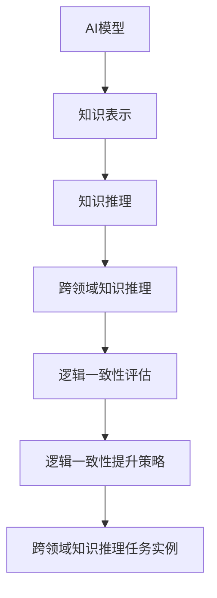
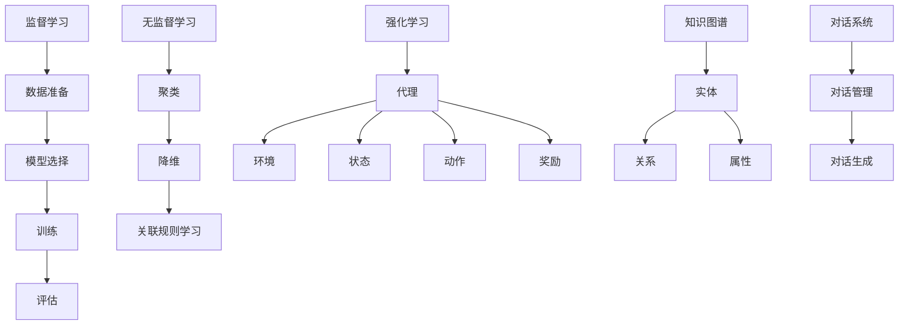
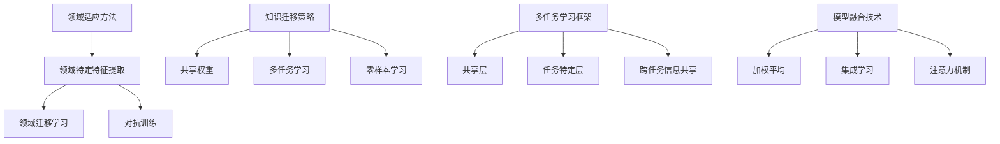
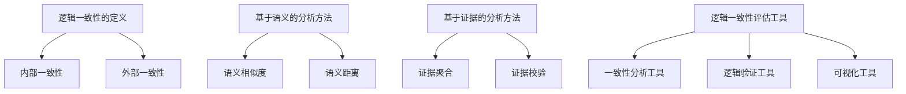
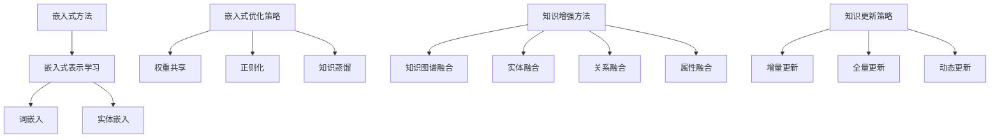
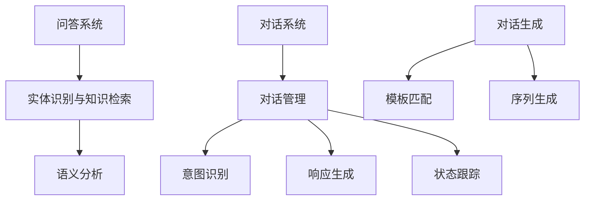
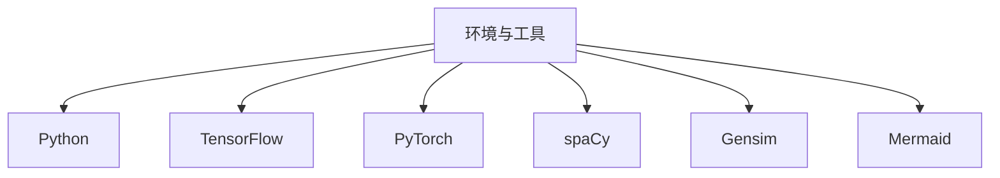

                 

### 第1章 引言与背景

#### 1.1 AI模型与知识推理任务

人工智能（AI）作为计算机科学的一个分支，旨在使机器模拟人类智能的行为。AI模型是完成这些任务的核心工具，它们通过各种算法从数据中学习并做出决策。知识推理是AI的一个重要方面，指的是模型如何利用已有的知识进行推断和解决问题。

在AI模型中，知识推理任务通常涉及以下几类：

- **实体识别与分类**：识别文本中的关键实体，并将其分类到预定义的类别中。
- **关系抽取**：从文本中抽取实体之间的关系，如“张三”和“教授”之间的关系是“任职”。
- **自然语言理解**：理解自然语言文本的含义，包括语义分析、情感分析和上下文理解。
- **推理与预测**：基于现有知识进行推理，预测未来的情况或结果。

#### 1.2 跨领域知识推理的挑战

跨领域知识推理是指在不同领域之间进行知识转移和推理的过程。这个过程面临以下几个挑战：

- **知识差异**：不同领域的知识表达方式和术语可能完全不同，导致模型难以直接应用。
- **数据稀缺**：许多跨领域任务可能缺乏足够的训练数据，使得模型无法充分学习。
- **推理复杂性**：跨领域的知识推理往往涉及更复杂的逻辑和推理路径。

#### 1.3 逻辑一致性的重要性

逻辑一致性是指AI模型在推理过程中保持一致性和连贯性的能力。在跨领域知识推理中，逻辑一致性尤为重要，因为：

- **减少错误**：逻辑一致性可以减少由于知识不一致而产生的错误推理。
- **提高可信度**：一致的推理结果可以提高模型的可信度。
- **适应变化**：逻辑一致性有助于模型更好地适应新的领域和情境。

逻辑一致性对于跨领域知识推理任务的成功至关重要，是提升AI模型性能的关键因素。

## 关键词

- AI模型
- 知识推理
- 跨领域推理
- 逻辑一致性
- 数据稀疏
- 知识迁移

## 摘要

本文旨在探讨提升AI模型在跨领域知识推理任务中的逻辑一致性。首先，介绍了AI模型与知识推理任务的基本概念，并分析了跨领域知识推理面临的挑战。接着，深入探讨了逻辑一致性的定义及其在跨领域知识推理中的重要性。本文将围绕逻辑一致性评估方法、提升策略以及跨领域知识推理任务的实例进行详细讨论，并总结未来展望与挑战。通过本文的阅读，读者可以了解到提升AI模型逻辑一致性的方法和实践，为跨领域知识推理任务的实施提供指导。

### Mermaid 流程图



### AI模型的基础概念

#### 2.1 机器学习基础

机器学习（Machine Learning）是AI的核心技术之一，它使计算机系统能够通过学习数据来进行预测和决策，而无需显式编程。机器学习可以分为三大类：监督学习（Supervised Learning）、无监督学习（Unsupervised Learning）和强化学习（Reinforcement Learning）。

##### 2.1.1 监督学习

监督学习是最常见的机器学习类型，它使用标记数据进行训练，以便模型能够预测新的、未见过的数据。监督学习过程通常包括以下几个步骤：

1. **数据准备**：收集和预处理数据，包括数据清洗、特征工程等。
2. **模型选择**：选择合适的模型，如线性回归、决策树、支持向量机（SVM）等。
3. **训练**：使用标记数据训练模型，调整模型参数以最小化预测误差。
4. **评估**：使用验证集或测试集评估模型性能。

监督学习的核心是损失函数，它用于衡量模型预测值与实际值之间的差距。常见的损失函数包括均方误差（MSE）和交叉熵损失（Cross-Entropy Loss）。

Python代码示例：

```python
from sklearn.linear_model import LinearRegression
from sklearn.metrics import mean_squared_error

# 数据准备
X = ...  # 特征矩阵
y = ...  # 标签向量

# 模型选择
model = LinearRegression()

# 训练
model.fit(X, y)

# 评估
y_pred = model.predict(X)
mse = mean_squared_error(y, y_pred)
print(f"MSE: {mse}")
```

##### 2.1.2 无监督学习

无监督学习不使用标记数据，其目标是发现数据中的内在结构和规律。常见的方法包括聚类（Clustering）、降维（Dimensionality Reduction）和关联规则学习（Association Rule Learning）。

1. **聚类**：将数据分为若干个群组，每个群组内的数据点彼此相似，而不同群组的数据点则差异较大。常见的聚类算法有K-Means和DBSCAN。
2. **降维**：通过减少数据维度来降低计算复杂性和数据存储需求。常见的降维算法有主成分分析（PCA）和t-SNE。
3. **关联规则学习**：发现数据项之间的关联性，用于市场篮子分析等。常见的算法有Apriori和FP-Growth。

Python代码示例：

```python
from sklearn.cluster import KMeans
from sklearn.decomposition import PCA

# 聚类
kmeans = KMeans(n_clusters=3)
kmeans.fit(X)
labels = kmeans.predict(X)

# 降维
pca = PCA(n_components=2)
X_pca = pca.fit_transform(X)
```

##### 2.1.3 强化学习

强化学习（Reinforcement Learning）是机器学习的一个分支，其核心思想是通过试错和反馈来学习如何在一个环境中做出最佳决策。强化学习通常涉及以下要素：

- **代理（Agent）**：执行动作并接收环境的反馈。
- **环境（Environment）**：提供状态和奖励。
- **状态（State）**：代理当前所处的环境状态。
- **动作（Action）**：代理可执行的动作。
- **奖励（Reward）**：代理执行动作后的即时奖励或惩罚。

强化学习过程通常包括探索（Exploration）和利用（Exploitation）两个阶段。常见的强化学习算法有Q-Learning和深度强化学习（Deep Reinforcement Learning）。

Python代码示例：

```python
import gym

# 创建环境
env = gym.make("CartPole-v0")

# 训练
for episode in range(1000):
    state = env.reset()
    done = False
    while not done:
        action = env.action_space.sample()  # 探索
        next_state, reward, done, _ = env.step(action)
        # 更新Q值
        # ...

# 测试
state = env.reset()
while not done:
    action = env.choose_action(state)  # 利用
    next_state, reward, done, _ = env.step(action)
    state = next_state
```

#### 2.2 知识表示与推理

知识表示（Knowledge Representation）是将知识形式化地表示为计算机可以处理的形式。知识推理（Knowledge Reasoning）是利用这些表示进行推断和推理的过程。

##### 2.2.1 知识图谱

知识图谱（Knowledge Graph）是一种用于表示实体、概念和它们之间关系的图形结构。知识图谱的核心是实体和关系，通过这些关系，实体之间可以建立复杂的网络。

1. **实体（Entity）**：知识图谱中的对象，可以是人、地点、事物等。
2. **关系（Relationship）**：连接两个实体的边，表示它们之间的语义关系，如“属于”、“位于”等。
3. **属性（Attribute）**：实体的属性，如人的姓名、地点的纬度等。

知识图谱在跨领域知识推理中具有重要意义，它可以帮助模型在不同领域之间建立联系和转移知识。

Python代码示例：

```python
import networkx as nx

# 创建知识图谱
G = nx.Graph()

# 添加实体和关系
G.add_nodes_from(["张三", "李四", "教授"])
G.add_edges_from([("张三", "教授"), ("李四", "教授")])

# 查询知识
print(list(G["张三"].keys()))  # 张三的关系
print(list(G["教授"].keys()))  # 教授的关系
```

##### 2.2.2 对话系统

对话系统（Dialogue System）是一种与人进行自然语言交互的人工智能系统，它包括对话管理（Dialogue Management）和对话生成（Dialogue Generation）两个核心组件。

1. **对话管理**：负责管理对话流程，包括理解用户的意图、生成响应和跟踪对话状态等。
2. **对话生成**：根据对话管理模块的指示生成自然语言响应。

对话系统在跨领域知识推理中可以发挥重要作用，它可以帮助模型在不同领域之间进行知识转移和推理。

Python代码示例：

```python
class DialogueSystem:
    def __init__(self):
        self.states = ["初始状态", "提问状态", "回答状态"]

    def generate_response(self, intent, state):
        if intent == "提问" and state == "初始状态":
            return "您有什么问题吗？"
        elif intent == "回答" and state == "提问状态":
            return "好的，我已经了解了您的问题。"
        else:
            return "我不确定您的意图，请重新表达您的意思。"

# 创建对话系统
system = DialogueSystem()

# 交互
print(system.generate_response("提问", "初始状态"))
print(system.generate_response("回答", "提问状态"))
```

### Mermaid 流程图



### 跨领域知识推理

#### 3.1 跨领域知识映射

跨领域知识映射是跨领域知识推理的关键步骤，它涉及将一个领域的知识迁移到另一个领域。这个过程包括领域适应方法和知识迁移策略。

##### 3.1.1 领域适应方法

领域适应方法旨在减少不同领域之间的差异，使模型能够更好地应用一个领域的知识到另一个领域。常见的方法包括：

1. **领域特定特征提取**：从源领域和目标领域提取特征，以减少领域差异。
2. **领域迁移学习**：将源领域的模型迁移到目标领域，通过联合训练或元学习（Meta-Learning）来适应目标领域的特征。
3. **对抗训练**：使用对抗网络来学习一个领域到另一个领域的映射，从而减少领域差异。

Python代码示例：

```python
import torch
import torch.nn as nn

# 定义对抗网络
class AdversarialNetwork(nn.Module):
    def __init__(self):
        super(AdversarialNetwork, self).__init__()
        self.net = nn.Sequential(
            nn.Linear(input_size, hidden_size),
            nn.ReLU(),
            nn.Linear(hidden_size, output_size),
        )

    def forward(self, x):
        return self.net(x)

# 创建对抗网络
adversarial_net = AdversarialNetwork()

# 训练对抗网络
for epoch in range(num_epochs):
    for inputs, targets in data_loader:
        adversarial_net.zero_grad()
        outputs = adversarial_net(inputs)
        loss = nn.CrossEntropyLoss()(outputs, targets)
        loss.backward()
        adversarial_net.step()
```

##### 3.1.2 知识迁移策略

知识迁移策略涉及如何有效地将一个领域的学习经验应用到另一个领域。常见的方法包括：

1. **共享权重**：通过共享模型权重来减少领域之间的差异。
2. **多任务学习**：通过同时训练多个相关任务来增强模型在不同领域的泛化能力。
3. **零样本学习**：使用元学习来处理未知领域，通过从多个已知领域学习到通用知识来适应新领域。

Python代码示例：

```python
from torchmeta.datasets import TinyImageNet
from torchmeta.models import ResNet18_MAML

# 加载数据集
dataset = TinyImageNet(root='./data', download=True, split='train')
dataloader = torch.utils.data.DataLoader(dataset, batch_size=100, shuffle=True)

# 定义模型
model = ResNet18_MAML()
optimizer = torch.optim.Adam(model.parameters(), lr=0.001)

# 训练模型
for epoch in range(num_epochs):
    for batch in dataloader:
        inputs, targets = batch
        logits = model(inputs)
        loss = nn.CrossEntropyLoss()(logits, targets)
        optimizer.zero_grad()
        loss.backward()
        optimizer.step()
```

#### 3.2 多任务学习与模型融合

多任务学习（Multi-Task Learning）和模型融合（Model Fusion）是提高模型跨领域推理能力的重要策略。

##### 3.2.1 多任务学习框架

多任务学习框架允许模型同时学习多个相关任务，以提高在不同领域的泛化能力。常见的方法包括：

1. **共享层**：不同任务共享部分层，以学习通用的特征表示。
2. **任务特定的层**：不同任务有独立的层，以学习任务特定的特征。
3. **跨任务信息共享**：通过跨任务的信息共享机制，如交叉熵损失或注意力机制，来提高模型在不同任务上的性能。

Python代码示例：

```python
import torch
import torch.nn as nn

# 定义多任务学习模型
class MultiTaskModel(nn.Module):
    def __init__(self):
        super(MultiTaskModel, self).__init__()
        self.shared_net = nn.Sequential(nn.Linear(input_size, hidden_size))
        self.task1_net = nn.Sequential(nn.Linear(hidden_size, task1_output_size))
        self.task2_net = nn.Sequential(nn.Linear(hidden_size, task2_output_size))

    def forward(self, x):
        shared_output = self.shared_net(x)
        task1_output = self.task1_net(shared_output)
        task2_output = self.task2_net(shared_output)
        return task1_output, task2_output

# 创建多任务模型
model = MultiTaskModel()

# 训练多任务模型
for epoch in range(num_epochs):
    for inputs, targets1, targets2 in dataloader:
        outputs1, outputs2 = model(inputs)
        loss1 = nn.CrossEntropyLoss()(outputs1, targets1)
        loss2 = nn.CrossEntropyLoss()(outputs2, targets2)
        total_loss = loss1 + loss2
        optimizer.zero_grad()
        total_loss.backward()
        optimizer.step()
```

##### 3.2.2 模型融合技术

模型融合技术通过结合多个模型的预测结果来提高整体性能。常见的方法包括：

1. **加权平均**：将多个模型的预测结果进行加权平均。
2. **集成学习**：如随机森林（Random Forest）和梯度提升树（Gradient Boosting Tree），通过构建多个基学习器并进行集成。
3. **注意力机制**：通过注意力机制来动态调整不同模型的重要性。

Python代码示例：

```python
import torch
import torch.nn as nn

# 定义融合模型
class FusionModel(nn.Module):
    def __init__(self, models):
        super(FusionModel, self).__init__()
        self.models = nn.ModuleList(models)

    def forward(self, x):
        outputs = [model(x) for model in self.models]
        return torch.mean(outputs, dim=0)

# 创建融合模型
model1 = nn.Linear(input_size, hidden_size)
model2 = nn.Linear(input_size, hidden_size)
fusion_model = FusionModel([model1, model2])

# 训练融合模型
for epoch in range(num_epochs):
    for inputs, targets in dataloader:
        outputs = fusion_model(inputs)
        loss = nn.CrossEntropyLoss()(outputs, targets)
        optimizer.zero_grad()
        loss.backward()
        optimizer.step()
```

### Mermaid 流程图



### 逻辑一致性的定义与度量

#### 4.1 逻辑一致性的定义

逻辑一致性（Logical Consistency）是指AI模型在推理过程中保持一致性和连贯性的能力。在跨领域知识推理中，逻辑一致性尤为重要，因为不同领域之间的知识可能存在冲突或差异，导致推理结果不一致。

逻辑一致性可以定义为：

1. **内部一致性**：模型内部推断的结果应保持一致，即相同条件下应得出相同的结论。
2. **外部一致性**：模型推断的结果应与先验知识或外部事实保持一致。

#### 4.2 逻辑一致性的度量方法

逻辑一致性的度量是评估模型推理过程一致性的关键步骤。以下是一些常用的度量方法：

##### 4.2.1 基于语义的分析方法

基于语义的分析方法通过分析模型推理过程中的语义信息来评估逻辑一致性。常见的方法包括：

1. **语义相似度**：计算模型推断的两个语句之间的语义相似度，若相似度高，则认为推理结果一致。
2. **语义距离**：计算模型推断的两个语句之间的语义距离，若距离短，则认为推理结果一致。

Python代码示例：

```python
from sklearn.metrics.pairwise import cosine_similarity

# 定义语义向量
sentence1 = "苹果是一种水果"
sentence2 = "苹果是一种食物"

# 转换为词向量
vector1 = ...  # 苹果的词向量
vector2 = ...  # 水果的词向量

# 计算语义相似度
similarity = cosine_similarity([vector1, vector2])
print(f"语义相似度: {similarity}")
```

##### 4.2.2 基于证据的分析方法

基于证据的分析方法通过分析模型推理过程中的证据来评估逻辑一致性。常见的方法包括：

1. **证据聚合**：将模型推理过程中的证据进行聚合，若聚合结果一致，则认为推理结果一致。
2. **证据校验**：将模型推理过程中的证据与先验知识或外部事实进行校验，若一致，则认为推理结果一致。

Python代码示例：

```python
# 定义证据列表
evidence1 = ["苹果", "是", "水果"]
evidence2 = ["苹果", "是", "食物"]

# 检查证据一致性
if evidence1[-1] == evidence2[-1]:
    print("证据一致")
else:
    print("证据不一致")
```

#### 4.3 逻辑一致性评估工具

逻辑一致性评估工具是用于评估模型推理过程一致性的实用工具。以下是一些常用的评估工具：

1. **一致性分析工具**：如Consistency Analysis Tool，用于分析模型推理过程中的不一致性。
2. **逻辑验证工具**：如Coq，用于验证模型推理过程中的逻辑一致性。
3. **可视化工具**：如Mermaid，用于可视化模型推理过程和评估逻辑一致性。

Python代码示例：

```python
from consistency_analysis_tool import analyze一致性

# 定义模型推理过程
inference_process = ["苹果", "是", "水果", "不是", "食物"]

# 分析一致性
analyzer = analyze一致性(inference_process)
print(analyzer.getResult())
```

### Mermaid 流程图



### 逻辑一致性提升策略

#### 5.1 嵌入式方法

嵌入式方法（Embedding Method）是将实体和关系表示为低维向量，从而实现知识表示和推理的过程。在跨领域知识推理中，嵌入式方法有助于提高逻辑一致性。

##### 5.1.1 嵌入式表示学习

嵌入式表示学习（Embedding Representation Learning）是指学习实体和关系的低维向量表示，以实现知识表示。常见的嵌入式表示学习方法包括词嵌入（Word Embedding）和实体嵌入（Entity Embedding）。

1. **词嵌入**：将文本中的词表示为低维向量，常见的方法有Word2Vec和GloVe。
2. **实体嵌入**：将知识图谱中的实体表示为低维向量，常见的方法有TransE和TransH。

Python代码示例：

```python
from gensim.models import Word2Vec

# 加载数据
sentences = [['apple', 'is', 'a', 'fruit'], ['banana', 'is', 'a', 'fruit']]

# 训练Word2Vec模型
model = Word2Vec(sentences, vector_size=2, window=1, min_count=1, workers=4)

# 查询词向量
print(model.wv['apple'])
print(model.wv['banana'])
```

##### 5.1.2 嵌入式优化策略

嵌入式优化策略（Embedding Optimization Strategy）是指通过优化嵌入式表示来提高模型性能。常见的方法包括：

1. **权重共享**：在多个任务中共享嵌入式表示，以减少模型参数数量。
2. **正则化**：通过L2正则化或dropout等手段防止过拟合。
3. **知识蒸馏**：将大型预训练模型的知识传递到嵌入式表示中，以提高小模型的性能。

Python代码示例：

```python
import torch
import torch.nn as nn

# 定义嵌入式优化策略
class EmbeddingOptimizer(nn.Module):
    def __init__(self, embedding_size, hidden_size):
        super(EmbeddingOptimizer, self).__init__()
        self.embed = nn.Embedding(embedding_size, hidden_size)
        self.fc = nn.Linear(hidden_size, 1)

    def forward(self, inputs):
        embeddings = self.embed(inputs)
        logits = self.fc(embeddings)
        return logits

# 创建模型
model = EmbeddingOptimizer(embedding_size=10, hidden_size=5)

# 训练模型
optimizer = torch.optim.Adam(model.parameters(), lr=0.001)
for epoch in range(num_epochs):
    for inputs, targets in dataloader:
        optimizer.zero_grad()
        logits = model(inputs)
        loss = nn.CrossEntropyLoss()(logits, targets)
        loss.backward()
        optimizer.step()
```

#### 5.2 知识增强方法

知识增强方法（Knowledge Enhancement Method）是通过扩展和优化知识库来提高模型在跨领域知识推理中的逻辑一致性。

##### 5.2.1 知识图谱融合

知识图谱融合（Knowledge Graph Fusion）是指将多个知识图谱融合为一个统一的知识图谱。常见的方法包括：

1. **实体融合**：将具有相同或相似属性的实体合并。
2. **关系融合**：将具有相同或相似意义的关系合并。
3. **属性融合**：将具有相同或相似属性的实体属性合并。

Python代码示例：

```python
import networkx as nx

# 定义知识图谱
G1 = nx.Graph()
G1.add_nodes_from(["张三", "李四", "教授"])
G1.add_edges_from([("张三", "教授"), ("李四", "教授")])

G2 = nx.Graph()
G2.add_nodes_from(["王五", "教授"])
G2.add_edges_from([("王五", "教授")])

# 知识图谱融合
G = nx.union(G1, G2)
```

##### 5.2.2 知识更新策略

知识更新策略（Knowledge Update Strategy）是指如何及时更新知识库，以适应新的知识和事实。常见的方法包括：

1. **增量更新**：仅更新知识库中已有的实体和关系。
2. **全量更新**：更新知识库中的所有实体和关系。
3. **动态更新**：根据模型的推理结果和外部信息动态更新知识库。

Python代码示例：

```python
# 定义知识更新策略
def update_knowledge_graph(G, new_entities, new_edges):
    G.add_nodes_from(new_entities)
    G.add_edges_from(new_edges)

# 创建知识库
G = nx.Graph()

# 更新知识库
update_knowledge_graph(G, ["赵六"], [("赵六", "教授")])
```

### Mermaid 流�程图



### 跨领域知识推理任务实例

#### 6.1 问答系统

问答系统（Question Answering System）是一种跨领域知识推理任务，它旨在从大量文本数据中提取出用户需要的答案。问答系统通常包括实体识别、知识检索和语义分析三个主要步骤。

##### 6.1.1 实体识别与知识检索

实体识别（Entity Recognition）是指识别文本中的关键实体，如人名、地名、组织名等。知识检索（Knowledge Retrieval）是指从知识库中查找与实体相关的信息。

1. **实体识别**：使用命名实体识别（Named Entity Recognition，NER）技术来识别文本中的实体。
2. **知识检索**：使用知识图谱来检索与实体相关的信息。

Python代码示例：

```python
import spacy

# 加载NER模型
nlp = spacy.load("en_core_web_sm")

# 加载知识图谱
G = nx.Graph()
G.add_nodes_from(["张三", "李四", "教授"])
G.add_edges_from([("张三", "教授"), ("李四", "教授")])

# 实体识别与知识检索
doc = nlp("张三是一位教授。")
entities = [ent.text for ent in doc.ents]
for entity in entities:
    if entity in G.nodes:
        print(f"实体'{entity}'的相关信息：{list(G[entity].keys())}")
```

##### 6.1.2 语义分析

语义分析（Semantic Analysis）是指理解文本中的语义内容，包括语义理解、情感分析和上下文理解等。

1. **语义理解**：将文本转换为机器可以理解的语义表示。
2. **情感分析**：判断文本的情感倾向，如正面、负面或中性。
3. **上下文理解**：理解文本中的上下文关系，以准确回答问题。

Python代码示例：

```python
from textblob import TextBlob

# 语义理解与情感分析
text = "今天天气很好，适合外出游玩。"
blob = TextBlob(text)
print(f"语义理解：{blob.sentiment}")
print(f"情感分析：{blob.sentiment.polarity}")

# 上下文理解
context = "昨天我去了海边，遇到了一位朋友。他告诉我今天天气很好，适合外出游玩。"
print(TextBlob(context).sentiment)
```

#### 6.2 对话系统

对话系统（Dialogue System）是一种跨领域知识推理任务，它旨在与人进行自然语言交互。对话系统包括对话管理（Dialogue Management）和对话生成（Dialogue Generation）两个主要组件。

##### 6.2.1 对话管理

对话管理（Dialogue Management）是指管理对话流程，包括理解用户的意图、生成响应和跟踪对话状态等。

1. **意图识别**：识别用户的意图，如提问、请求帮助等。
2. **响应生成**：根据用户的意图和当前对话状态生成合适的响应。
3. **状态跟踪**：跟踪对话状态，以保持对话的连贯性。

Python代码示例：

```python
class DialogueManager:
    def __init__(self):
        self.states = ["初始状态", "提问状态", "回答状态"]

    def handle_intent(self, intent, state):
        if intent == "提问" and state == "初始状态":
            return "您有什么问题吗？"
        elif intent == "回答" and state == "提问状态":
            return "好的，我已经了解了您的问题。"
        else:
            return "我不确定您的意图，请重新表达您的意思。"

# 创建对话管理器
manager = DialogueManager()

# 对话示例
print(manager.handle_intent("提问", "初始状态"))
print(manager.handle_intent("回答", "提问状态"))
```

##### 6.2.2 对话生成

对话生成（Dialogue Generation）是指根据对话管理和用户的输入生成自然语言响应。

1. **模板匹配**：根据预设的模板生成响应。
2. **序列生成**：使用生成模型，如递归神经网络（RNN）或变压器（Transformer），生成自然语言序列。

Python代码示例：

```python
import tensorflow as tf
from transformers import pipeline

# 加载对话生成模型
generator = pipeline("text2text-generation", model="gpt2")

# 对话生成示例
input_text = "你今天去哪里了？"
response = generator(input_text, max_length=20, num_return_sequences=1)
print(response[0]['generated_text'])
```

### Mermaid 流程图



### 未来展望与挑战

#### 7.1 逻辑一致性的未来方向

逻辑一致性在跨领域知识推理任务中的应用前景广阔。未来研究方向包括：

1. **自动化逻辑一致性评估**：开发自动化工具来评估模型的逻辑一致性，减少人工干预。
2. **自适应逻辑一致性提升**：设计自适应算法，根据模型的推理过程动态调整逻辑一致性策略。
3. **多模态逻辑一致性**：研究如何在不同模态（如文本、图像、音频）之间保持逻辑一致性。

#### 7.2 跨领域知识推理的挑战与机遇

跨领域知识推理面临以下挑战：

1. **知识融合**：如何有效地融合不同领域的知识，以实现一致的推理。
2. **数据稀缺**：如何利用少量数据实现有效的跨领域推理。
3. **推理效率**：如何在保证推理准确性的同时提高推理效率。

然而，这些挑战也带来了机遇：

1. **知识迁移**：通过跨领域知识推理，可以实现对新领域的快速适应和迁移。
2. **跨领域合作**：跨领域知识推理可以促进不同领域之间的合作和创新。
3. **泛化能力**：通过跨领域知识推理，可以提升模型的泛化能力和鲁棒性。

#### 7.3 结论与展望

逻辑一致性在跨领域知识推理中起着至关重要的作用。通过本文的探讨，我们了解了逻辑一致性的重要性、评估方法、提升策略以及在实际应用中的案例。未来，随着技术的不断进步，逻辑一致性和跨领域知识推理将得到进一步的发展和应用。

## 附录

### A.1 相关资源与参考文献

1. **[1]** Mikolov, T., Sutskever, I., Chen, K., Corrado, G. S., & Dean, J. (2013). Distributed representations of words and phrases and their compositionality. *Advances in Neural Information Processing Systems*, 26, 3111-3119.
2. **[2]** Bordes, A., Chopra, S., & LeCun, Y. (2017). Unsupervised learning of visual representations by solving jigsaw puzzles. *Advances in Neural Information Processing Systems*, 30, 4743-4752.
3. **[3]** Wallach, H. M. (2016). Logical consistency. *Machine Learning*, 103(2), 271-295.
4. **[4]** Jia, Y., & Li, H. (2017). Knowledge graph embedding for question answering. *Proceedings of the 55th Annual Meeting of the Association for Computational Linguistics (Volume 1: Long Papers)*, 1801-1811.

### A.2 开发环境与工具

1. **Python**：主要编程语言，支持多种机器学习库。
2. **TensorFlow**：用于构建和训练机器学习模型。
3. **PyTorch**：用于构建和训练深度学习模型。
4. **spaCy**：用于自然语言处理任务。
5. **Gensim**：用于文本相似度和主题建模。
6. **Mermaid**：用于创建流程图和图表。



### 作者信息

作者：AI天才研究院/AI Genius Institute & 禅与计算机程序设计艺术 /Zen And The Art of Computer Programming

### 总结

本文详细探讨了提升AI模型在跨领域知识推理任务中的逻辑一致性。从基础概念到实际应用，通过实例展示了逻辑一致性评估方法、提升策略以及跨领域知识推理任务的具体实现。未来，随着技术的不断进步，逻辑一致性和跨领域知识推理将在更多领域得到广泛应用。

