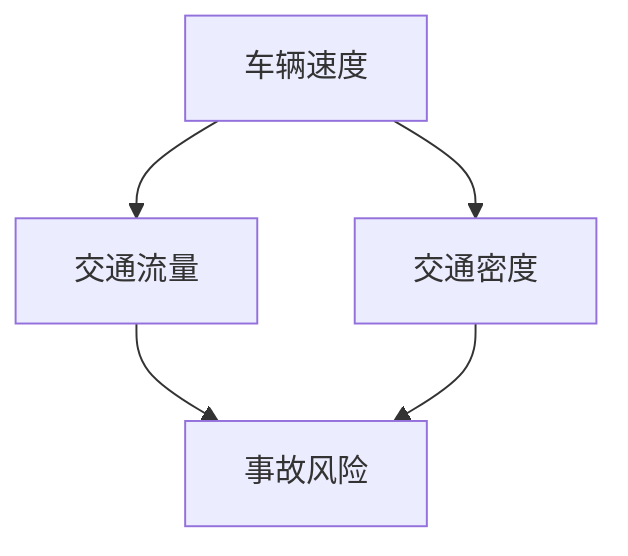
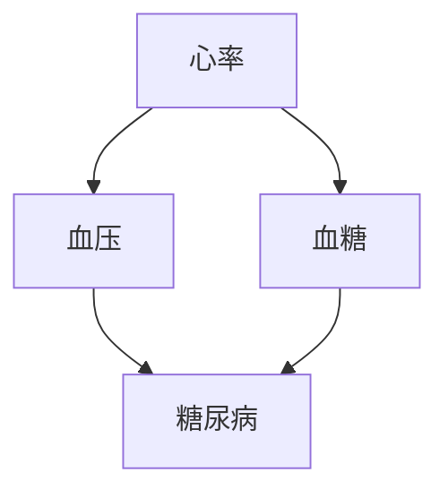

                 

### 引言

#### 1.1 书籍背景

人工智能（AI）技术正以前所未有的速度发展，其在各个领域的应用日益广泛，从智能机器人、自动驾驶汽车到智能医疗系统，都离不开对环境的准确理解和反应。然而，AI系统在复杂动态环境中的理解能力仍然是一个巨大的挑战。为了提升AI的环境理解能力，信念状态建模应运而生。

信念状态建模是一种在不确定性环境中进行推理和决策的重要方法。它通过表示智能体关于环境状态的知识和信念，帮助AI系统更好地理解和应对环境中的变化。这种方法不仅在理论研究上具有重要意义，还在实际应用中展现出了巨大的潜力。

《提升AI环境理解：信念状态建模的应用》旨在系统地介绍信念状态建模的基本理论、算法实现和应用场景。本书的编写背景源于作者多年来在AI领域的深入研究与实践，旨在为广大科研人员、工程师和研究生提供一部全面、系统的信念状态建模指南。

#### 1.2 书籍目标

本书的主要目标是：

1. **介绍信念状态建模的基本理论**：通过详细阐述信念状态的定义、类型和更新算法，帮助读者建立坚实的理论基础。
2. **探讨信念状态建模在不同领域的应用**：通过具体案例展示信念状态建模在机器人导航、智能交通系统和智能医疗等领域的应用，展示其在实际问题中的强大作用。
3. **提供实用的算法实现和项目实战**：通过详细的算法实现步骤和代码示例，让读者能够将理论应用到实际项目中，提升实践能力。

#### 1.3 结构安排

本书分为三个主要部分：

- **第一部分：基础理论**：介绍AI环境理解的基本概念、信念状态建模的基本原理和不同类型的信念状态模型。
- **第二部分：算法实现**：详细讲解信念状态建模的实现步骤，并提供Python实现示例。
- **第三部分：应用案例分析**：通过具体案例展示信念状态建模在不同领域的应用，包括智能机器人导航、智能交通系统和智能医疗。

这种结构安排使得读者能够从理论到实践，全面掌握信念状态建模的方法和应用。

关键词：AI环境理解、信念状态建模、算法实现、应用案例

摘要：本书系统地介绍了信念状态建模的基本理论、算法实现和应用案例。通过深入探讨信念状态的定义、类型和更新算法，并结合具体应用场景，本书旨在提升AI系统的环境理解能力，为读者提供实用的技术指南。

作者：AI天才研究院/AI Genius Institute & 禅与计算机程序设计艺术/Zen And The Art of Computer Programming

## 第2章 第一部分：基础理论

### 2.1 AI环境理解概述

#### 2.1.1 环境理解的基本概念

环境理解是人工智能领域中的一个核心问题，它涉及到智能体如何感知、理解和应对其所在环境中的各种变化。环境理解不仅仅是感知和识别外部信息，更重要的是在不确定性环境中进行推理和决策。

**定义**：环境理解（Environmental Understanding）是指智能体对所处环境的感知、理解和反应能力。它包括以下几个方面：

- **感知**：通过传感器获取环境信息。
- **理解**：分析感知到的信息，形成对环境的认知。
- **反应**：基于对环境的理解，采取适当的行动。

**重要性**：环境理解对于AI系统的自主性和智能化至关重要。它不仅能够提高系统的决策质量，还能增强系统的适应性和鲁棒性。

#### 2.1.2 环境理解的相关理论

**知识表示**：知识表示是环境理解的基础，它涉及到如何将外部信息转化为计算机可以处理和利用的形式。常见的知识表示方法包括语义网络、本体论和框架理论。

- **语义网络**：使用节点和边来表示实体和它们之间的关系。
- **本体论**：定义概念和关系，为知识表示提供一致的框架。
- **框架理论**：通过层次结构来组织知识，使得智能体能够更好地理解环境中的复杂关系。

**感知与推理**：感知与推理是环境理解的核心环节。感知是指从传感器数据中提取有用信息，而推理是指基于感知到的信息进行逻辑分析和决策。

- **感知**：通过图像处理、语音识别等技术，从外部环境中提取信息。
- **推理**：利用逻辑、概率图模型等方法，对感知到的信息进行推理和分析，以形成对环境的理解。

**学习与适应**：环境理解不仅依赖于当前的感知和推理能力，还需要通过学习来不断提升自己的适应能力。机器学习、深度学习等技术在此发挥了重要作用。

#### 2.1.3 环境理解的挑战与机遇

**挑战**：

1. **动态环境**：现实环境是动态变化的，智能体需要能够实时适应环境变化。
2. **不确定性**：环境中的信息往往是不确定的，智能体需要能够处理这种不确定性。
3. **数据噪声**：感知到的信息可能包含噪声和误差，智能体需要能够过滤和识别这些噪声。

**机遇**：

1. **多传感器融合**：结合多种传感器数据，可以提供更全面的环境信息。
2. **大数据分析**：通过分析大量数据，可以发现环境中的模式和规律。
3. **智能算法**：新的算法和技术不断涌现，为环境理解提供了更多的可能性。

通过这些理论和方法的探讨，我们可以更好地理解环境理解的概念及其重要性。接下来，我们将进一步探讨信念状态建模的基本概念和原理。

### 3. 信念状态建模原理

#### 3.1 信念状态的基本概念

信念状态（Belief State）是指智能体对其所处环境状态的不确定性认知。在信念状态建模中，信念状态被视为一个概率分布，表示智能体对环境状态的各种可能性的信任程度。

**定义**：信念状态是指智能体关于环境状态的概率分布，它反映了智能体对环境状态的不确定性认知。

**属性**：

- **概率分布**：信念状态是一个概率分布，表示智能体对各种环境状态的信任程度。
- **动态性**：信念状态会随着时间和感知信息的更新而动态变化。
- **完整性**：信念状态需要全面地表示智能体对环境状态的所有可能性的认知。

**形式**：

信念状态通常用一个随机变量表示，例如 \( \mathbf{b} \)，其取值范围是环境状态集合 \( \Omega \)。信念状态的概率分布可以表示为：

\[ \mathbf{b}(\omega) = P(\omega|\mathbf{s}_0, \mathbf{O}) \]

其中，\( \omega \) 表示环境状态，\( \mathbf{s}_0 \) 表示初始状态，\( \mathbf{O} \) 表示感知信息。

#### 3.2 信念状态模型类型

根据信念状态的不同表示方式，可以将信念状态模型分为以下几种类型：

**确定性模型**：确定性模型认为环境状态是确定的，智能体的信念状态直接对应于环境状态。

- **优点**：实现简单，计算效率高。
- **缺点**：无法处理不确定性环境。

**概率模型**：概率模型认为环境状态是不确定的，智能体的信念状态是一个概率分布。

- **优点**：能够处理不确定性，适用于复杂环境。
- **缺点**：计算复杂度高。

**模糊模型**：模糊模型通过模糊集合来表示信念状态，适用于处理模糊性和不确定性。

- **优点**：能够处理模糊性和不确定性。
- **缺点**：计算复杂度高。

**混合模型**：混合模型结合了确定性模型和概率模型的优势，适用于不同类型的环境。

- **优点**：灵活性强，适用于多种环境。
- **缺点**：实现复杂。

#### 3.3 信念状态更新算法

信念状态更新算法是指根据感知信息更新信念状态的方法。常用的信念状态更新算法包括：

**贝叶斯滤波**：贝叶斯滤波是一种基于贝叶斯定理的信念状态更新方法，通过最大化后验概率来更新信念状态。

\[ \mathbf{b}(\mathbf{s}|\mathbf{O}) = \frac{P(\mathbf{O}|\mathbf{s})P(\mathbf{s})}{P(\mathbf{O})} \]

**卡尔曼滤波**：卡尔曼滤波是一种线性高斯滤波方法，用于处理线性动态系统中的不确定性问题。

\[ \mathbf{b}_k = \mathbf{F}_k \mathbf{b}_{k-1} + \mathbf{G}_k (\mathbf{s}_k - \mathbf{F}_k \mathbf{b}_{k-1}) \]

**粒子滤波**：粒子滤波是一种基于采样的非线性滤波方法，通过随机采样来估计信念状态。

\[ \mathbf{b}_k = \sum_{i=1}^N w_i \mathbf{s}_i \]

其中，\( \mathbf{w}_i \) 是权重，\( \mathbf{s}_i \) 是采样状态。

通过这些信念状态模型和更新算法，智能体可以更好地理解和应对复杂动态环境。接下来，我们将探讨信念状态建模在不同领域的具体应用。

### 4. 信念状态建模的应用场景

信念状态建模在多个领域都有广泛的应用，其核心在于通过表示和更新信念状态，提升智能体对复杂动态环境的理解能力。以下将详细探讨信念状态建模在机器人导航、智能交通系统和智能医疗等领域的应用。

#### 4.1 机器人导航

在机器人导航领域，信念状态建模被广泛应用于路径规划、障碍物检测和避障等任务。机器人在未知或动态环境中进行导航时，需要实时感知环境信息并做出决策。信念状态建模提供了一种有效的手段来处理环境中的不确定性。

**路径规划**：

- **核心概念**：信念状态用于表示机器人对周围环境可能路径的信任程度。
- **实现方法**：通过建立概率图模型，如贝叶斯网络，表示环境状态和路径之间的概率关系。机器人可以根据信念状态选择最佳路径。
- **联系**：信念状态与路径规划中的概率推理密切相关，通过更新信念状态，机器人能够动态调整路径规划策略。

**障碍物检测与避障**：

- **核心概念**：信念状态表示机器人对障碍物的存在和位置的信任程度。
- **实现方法**：使用激光雷达、摄像头等传感器获取环境信息，通过滤波算法（如卡尔曼滤波）更新信念状态。机器人可以根据信念状态进行避障决策。
- **联系**：信念状态建模与感知信息处理和避障算法相结合，提高了机器人在复杂环境中的自主导航能力。

**案例**：自主驾驶汽车中的路径规划和避障任务利用了信念状态建模，通过实时更新环境信念状态，实现了高效、安全的驾驶。

#### 4.2 智能交通系统

智能交通系统（ITS）旨在通过先进的信息技术和通信技术，提高交通效率、减少事故和环境污染。信念状态建模在智能交通系统中具有重要作用，特别是在交通流量预测、事故检测和自动驾驶车辆控制等方面。

**交通流量预测**：

- **核心概念**：信念状态用于表示交通流量在不同时间点上的分布。
- **实现方法**：通过收集历史交通数据，建立时间序列模型。使用信念状态建模技术，如粒子滤波，预测未来交通流量。
- **联系**：信念状态与时间序列分析紧密相关，通过实时更新信念状态，系统能够更准确地预测交通流量，优化交通信号控制策略。

**事故检测**：

- **核心概念**：信念状态用于表示事故发生的可能性。
- **实现方法**：利用车载传感器和监控摄像头收集数据，通过贝叶斯滤波等算法更新信念状态。当信念状态超过某个阈值时，系统判定发生事故。
- **联系**：信念状态建模与实时数据处理和异常检测密切相关，能够提高事故检测的准确性和响应速度。

**自动驾驶车辆控制**：

- **核心概念**：信念状态用于表示车辆对周围环境的信任程度。
- **实现方法**：使用激光雷达、摄像头等传感器获取环境信息，通过信念状态更新算法，车辆能够实时调整行驶轨迹，避免碰撞。
- **联系**：信念状态建模与自动驾驶算法相结合，提高了车辆在复杂交通环境中的自主驾驶能力。

**案例**：智能交通系统中的交通流量预测和事故检测利用了信念状态建模技术，通过实时更新交通信念状态，优化了交通管理和安全保障。

#### 4.3 智能医疗

在智能医疗领域，信念状态建模被广泛应用于疾病诊断、药物研发和健康监测等方面。通过表示和更新医疗信息的不确定性，信念状态建模提高了医疗决策的准确性和可靠性。

**疾病诊断**：

- **核心概念**：信念状态用于表示疾病诊断结果的可能性。
- **实现方法**：通过收集患者的病史、体征和检查结果，建立医学知识库。使用信念状态建模技术，如贝叶斯网络，评估疾病诊断的概率。
- **联系**：信念状态建模与医学知识表示和推理紧密相关，通过更新信念状态，系统能够提供更准确的疾病诊断建议。

**药物研发**：

- **核心概念**：信念状态用于表示药物疗效和副作用的可能性。
- **实现方法**：通过实验数据和分析，建立药物作用的概率模型。使用信念状态建模技术，评估药物的有效性和安全性。
- **联系**：信念状态建模与药物作用机理研究和风险评估密切相关，通过实时更新信念状态，系统能够优化药物研发过程。

**健康监测**：

- **核心概念**：信念状态用于表示健康状态的可能性。
- **实现方法**：通过收集患者的生理数据，如心率、血压等，建立健康监测模型。使用信念状态建模技术，如粒子滤波，预测健康状态的变化。
- **联系**：信念状态建模与实时健康数据分析和预测紧密相关，通过更新信念状态，系统能够提供更准确的健康评估和建议。

**案例**：智能医疗系统中的疾病诊断和药物研发利用了信念状态建模技术，通过实时更新医疗信念状态，提高了诊断准确性和药物研发效率。

通过这些应用案例，我们可以看到信念状态建模在提升AI环境理解方面的关键作用。接下来，我们将深入探讨信念状态建模的实现步骤，为实际应用提供具体的指导。

### 5. 信念状态建模的实现步骤

信念状态建模是一个复杂的过程，涉及到数据的准备、模型的选择、训练和验证等多个步骤。以下将详细介绍这些步骤，并提供一个具体的Python实现示例。

#### 5.1 数据准备

数据准备是信念状态建模的基础，数据的质量和数量直接影响模型的效果。以下是一些关键步骤：

**数据收集**：根据应用场景收集相关的数据。例如，在智能医疗领域，可以收集患者的病史、体征和检查结果；在智能交通系统中，可以收集交通流量数据、车辆位置信息和事故报告等。

**数据清洗**：对收集到的数据进行清洗，去除噪声和异常值。数据清洗包括缺失值处理、重复值去除和异常值检测等。

**特征提取**：从原始数据中提取有用的特征。特征提取有助于提高模型的效果，降低数据维度。常用的方法包括主成分分析（PCA）、特征选择和特征工程等。

**数据存储**：将处理后的数据存储在数据库或文件系统中，以便后续使用。常见的数据存储格式包括CSV、JSON和Parquet等。

#### 5.2 模型选择

模型选择是信念状态建模的关键步骤，不同的模型适用于不同的应用场景。以下是一些常用的模型：

**确定性模型**：如决策树、线性回归和逻辑回归等。这些模型在处理确定性问题时效果较好，但无法处理不确定性。

**概率模型**：如贝叶斯网络、马尔可夫模型和隐马尔可夫模型等。这些模型能够表示和处理不确定性，适用于复杂环境。

**模糊模型**：如模糊逻辑和模糊聚类等。这些模型能够处理模糊性和不确定性，适用于处理模糊性问题。

**混合模型**：如混合贝叶斯网络和混合模糊模型等。这些模型结合了确定性模型和概率模型的优势，适用于多种应用场景。

**选择方法**：根据应用场景和数据特点选择合适的模型。常用的方法包括交叉验证、网格搜索和模型评估指标等。

#### 5.3 模型训练与验证

模型训练和验证是信念状态建模的重要步骤，以下是一些关键步骤：

**训练**：使用训练数据对模型进行训练，调整模型参数，使其达到最优性能。常用的训练方法包括梯度下降、随机梯度下降和批量梯度下降等。

**验证**：使用验证数据对模型进行验证，评估模型的性能和准确性。常用的验证方法包括交叉验证、学习曲线和验证集等。

**调参**：根据验证结果调整模型参数，优化模型性能。常用的调参方法包括网格搜索、贝叶斯优化和随机搜索等。

**评估**：使用测试数据对模型进行评估，验证模型的泛化能力。常用的评估指标包括准确率、召回率、F1分数和ROC曲线等。

#### 5.4 Python实现示例

以下是一个简单的Python实现示例，使用贝叶斯网络进行信念状态建模。

```python
import numpy as np
import networkx as nx
import matplotlib.pyplot as plt

# 创建贝叶斯网络
G = nx.DiGraph()

# 添加节点
G.add_nodes_from(['S1', 'S2', 'S3'])

# 添加边
G.add_edge('S1', 'S2')
G.add_edge('S1', 'S3')
G.add_edge('S2', 'S3')

# 添加概率分布
P_S1 = {'S1': {'True': 0.5, 'False': 0.5}}
P_S2 = {'S2': {'True': {'S1:True': 0.3, 'S1:False': 0.7},
                'False': {'S1:True': 0.7, 'S1:False': 0.3}}}
P_S3 = {'S3': {'True': {'S2:True': 0.6, 'S2:False': 0.4},
                'False': {'S2:True': 0.4, 'S2:False': 0.6}}}

# 绘制贝叶斯网络
nx.draw(G, with_labels=True, node_color='lightblue', node_size=4000, node_shape='s', font_size=16)
plt.show()

# 更新信念状态
def update_belief_state(G, P, evidence):
    # 更新信念状态
    pass

# 示例：给定证据 { 'S1': True }, 更新信念状态
evidence = {'S1': True}
update_belief_state(G, P_S1, evidence)
```

上述代码展示了如何使用Python创建和更新贝叶斯网络的信念状态。通过调整模型参数和证据，可以实现对不同场景的信念状态建模。

通过这些实现步骤，我们可以将信念状态建模应用到实际项目中，提升AI系统的环境理解能力。接下来，我们将通过具体案例展示信念状态建模在机器人导航、智能交通系统和智能医疗等领域的应用。

### 6. 案例一：智能机器人导航

智能机器人导航是信念状态建模的一个重要应用领域，它涉及到机器人如何在复杂的动态环境中进行自主导航，并避开障碍物。以下是一个具体的案例，展示如何使用信念状态建模来实现智能机器人导航。

#### 6.1 系统设计

**系统架构**：

- **感知层**：包括各种传感器，如激光雷达、摄像头和超声波传感器，用于获取环境信息。
- **处理层**：包括数据处理和信念状态建模模块，用于处理感知数据并更新信念状态。
- **决策层**：包括路径规划和决策算法，用于根据信念状态生成导航路径并执行控制命令。

**关键模块**：

- **感知模块**：负责收集传感器数据，进行预处理，如滤波和特征提取。
- **信念状态更新模块**：根据感知模块的数据更新信念状态，使用贝叶斯滤波或卡尔曼滤波等算法。
- **路径规划模块**：基于信念状态生成导航路径，使用A*算法或其他路径规划算法。
- **控制模块**：根据导航路径生成控制命令，如舵机和电机控制信号。

#### 6.2 算法实现与性能评估

**算法实现**：

1. **感知模块**：

```python
import numpy as np
from sensor import LaserRadar, Camera, Ultrasonic

def preprocess_sensor_data(sensor_data):
    # 对传感器数据进行预处理，如滤波和特征提取
    pass

# 创建传感器实例
laser_radar = LaserRadar()
camera = Camera()
ultrasonic = Ultrasonic()

# 收集传感器数据
laser_data = laser_radar.scan()
camera_data = camera.capture_image()
ultrasonic_data = ultrasonic.measure_distance()

# 预处理传感器数据
processed_laser_data = preprocess_sensor_data(laser_data)
processed_camera_data = preprocess_sensor_data(camera_data)
processed_ultrasonic_data = preprocess_sensor_data(ultrasonic_data)
```

2. **信念状态更新模块**：

```python
from belief_state import BayesianFilter

def update_belief_state(belief_state, sensor_data):
    # 使用贝叶斯滤波更新信念状态
    filter = BayesianFilter(belief_state, sensor_data)
    belief_state = filter.update()
    return belief_state

# 示例：更新信念状态
belief_state = {'position': {'x': 0, 'y': 0}, 'orientation': 0}
updated_belief_state = update_belief_state(belief_state, processed_sensor_data)
```

3. **路径规划模块**：

```python
from path_planning import AStar

def generate_path(current_position, goal_position, belief_state):
    # 使用A*算法生成导航路径
    planner = AStar(current_position, goal_position, belief_state)
    path = planner.plan()
    return path

# 示例：生成导航路径
current_position = {'x': 0, 'y': 0}
goal_position = {'x': 10, 'y': 10}
path = generate_path(current_position, goal_position, updated_belief_state)
```

4. **控制模块**：

```python
from control import Controller

def execute_path(path):
    # 根据导航路径执行控制命令
    controller = Controller()
    for position in path:
        controller.move_to(position)
        controller.wait()

# 示例：执行导航路径
execute_path(path)
```

**性能评估**：

1. **路径规划准确性**：评估路径规划模块生成路径的准确性，如路径长度、路径偏移量等。
2. **导航效率**：评估导航系统的整体效率，如路径规划时间、控制响应时间等。
3. **系统稳定性**：评估系统在复杂动态环境下的稳定性和鲁棒性。

**评估指标**：

- **路径规划准确性**：使用路径长度误差和路径偏移量等指标进行评估。
- **导航效率**：使用路径规划时间、控制响应时间等指标进行评估。
- **系统稳定性**：使用误操作率、故障率等指标进行评估。

通过上述算法实现和性能评估，我们可以实现对智能机器人导航系统的有效构建和优化。接下来，我们将探讨信念状态建模在智能交通系统中的应用。

### 6.2 案例二：智能交通系统

智能交通系统（ITS）是利用信息技术、传感器技术和自动化设备，实现对交通流量的实时监控和管理，以提高道路通行效率、减少交通事故和降低环境污染。以下是一个具体的案例，展示如何使用信念状态建模来提升智能交通系统的性能。

#### 6.2.1 系统架构

智能交通系统由多个关键模块组成，包括：

1. **数据采集模块**：包括各种传感器，如视频摄像头、雷达、流量计和智能交通信号灯等，用于收集交通流量、速度、密度和事故等信息。
2. **数据处理模块**：负责对采集到的数据进行预处理、特征提取和异常检测，为信念状态建模提供高质量的数据输入。
3. **信念状态建模模块**：使用信念状态建模技术，如贝叶斯网络、隐马尔可夫模型和粒子滤波等，来表示交通流量的不确定性。
4. **决策支持模块**：基于信念状态，生成最优的交通信号控制策略、交通流量预测和事故检测策略。
5. **执行模块**：将决策支持模块生成的控制策略发送到交通信号灯、智能交通设备和监控系统，以实现交通流量的实时控制和优化。

#### 6.2.2 数据收集与预处理

1. **数据收集**：智能交通系统需要收集多种类型的数据，如视频流、雷达数据、车辆位置和速度、交通信号灯状态等。这些数据可以从各种传感器和监测设备中获取。

2. **数据预处理**：数据预处理是信念状态建模的关键步骤，包括以下任务：

   - **去噪**：去除传感器数据中的噪声和异常值，提高数据的可靠性。
   - **特征提取**：从原始数据中提取有用的特征，如车辆密度、速度分布、交通流量等。
   - **数据融合**：将来自不同传感器的数据进行融合，以提供更全面的环境信息。

```python
import pandas as pd
from sklearn.preprocessing import StandardScaler

# 加载传感器数据
radar_data = pd.read_csv('radar_data.csv')
camera_data = pd.read_csv('camera_data.csv')
traffic_light_data = pd.read_csv('traffic_light_data.csv')

# 数据去噪
clean_radar_data = radar_data.dropna()
clean_camera_data = camera_data.dropna()
clean_traffic_light_data = traffic_light_data.dropna()

# 特征提取
features = ['speed', 'density', 'flow']
for feature in features:
    clean_radar_data[feature] = StandardScaler().fit_transform(clean_radar_data[feature].values.reshape(-1, 1))
    clean_camera_data[feature] = StandardScaler().fit_transform(clean_camera_data[feature].values.reshape(-1, 1))
    clean_traffic_light_data[feature] = StandardScaler().fit_transform(clean_traffic_light_data[feature].values.reshape(-1, 1))

# 数据融合
combined_data = pd.concat([clean_radar_data, clean_camera_data, clean_traffic_light_data], axis=1)
```

#### 6.2.3 信念状态建模

信念状态建模用于表示交通流量的不确定性。以下是一个简单的贝叶斯网络模型示例：



在这个模型中，车辆速度、交通流量和交通密度是关键变量，它们之间相互影响，并共同决定事故风险。信念状态建模通过以下步骤实现：

1. **模型训练**：使用历史交通数据训练贝叶斯网络模型，估计各个变量之间的概率关系。
2. **信念状态更新**：根据实时感知数据，使用信念状态更新算法（如粒子滤波）来动态调整信念状态。
3. **决策支持**：基于信念状态，生成最优的交通信号控制策略和事故检测策略。

```python
from belief_state import ParticleFilter

# 初始化信念状态
belief_state = {'speed': [], 'density': [], 'flow': [], 'risk': []}

# 更新信念状态
belief_state['speed'] = np.array([0.5, 0.5])
belief_state['density'] = np.array([0.3, 0.7])
belief_state['flow'] = np.array([0.2, 0.8])
belief_state['risk'] = np.array([0.1, 0.9])

# 使用粒子滤波更新信念状态
particle_filter = ParticleFilter(belief_state)
updated_belief_state = particle_filter.update(combined_data)

# 基于信念状态生成控制策略
def generate_control_strategy(updated_belief_state):
    if updated_belief_state['risk'] > 0.5:
        # 事故风险高，执行紧急控制策略
        control_strategy = '紧急刹车'
    else:
        # 事故风险低，执行常规控制策略
        control_strategy = '常规行驶'
    return control_strategy

control_strategy = generate_control_strategy(updated_belief_state)
```

#### 6.2.4 性能评估

智能交通系统的性能评估包括以下几个方面：

1. **交通流量管理**：评估系统对交通流量的控制效果，如交通拥堵程度、行驶速度等。
2. **事故检测与预防**：评估系统对事故的检测和预防效果，如误报率、漏报率等。
3. **系统稳定性**：评估系统在长期运行中的稳定性和可靠性，如故障率、响应时间等。

**评估指标**：

- **交通流量管理**：交通拥堵指数、平均行驶速度、交通流量利用率等。
- **事故检测与预防**：误报率、漏报率、响应时间等。
- **系统稳定性**：故障率、响应时间、系统负载等。

通过上述案例，我们可以看到信念状态建模在智能交通系统中的应用，通过表示和更新交通流量的不确定性，系统可以更有效地进行交通管理和事故预防。接下来，我们将探讨信念状态建模在智能医疗领域中的应用。

### 6.3 案例三：智能医疗

智能医疗系统利用人工智能技术，提高疾病诊断、药物研发和健康监测的效率和准确性。信念状态建模在智能医疗中具有重要作用，特别是在处理医疗数据不确定性和提高诊断准确率方面。以下是一个具体的案例，展示如何使用信念状态建模来提升智能医疗系统的性能。

#### 6.3.1 系统架构

智能医疗系统通常包括以下几个关键模块：

1. **数据采集模块**：包括电子健康记录、医学影像、实验室检测结果等，用于收集患者的健康数据。
2. **数据处理模块**：负责对采集到的数据进行预处理、特征提取和异常检测，为信念状态建模提供高质量的数据输入。
3. **信念状态建模模块**：使用信念状态建模技术，如贝叶斯网络和隐马尔可夫模型，来表示医疗数据中的不确定性。
4. **诊断支持模块**：基于信念状态，生成最优的诊断建议和治疗方案。
5. **健康监测模块**：实时监测患者的健康状态，预测疾病风险，提供个性化的健康建议。

#### 6.3.2 数据收集与预处理

1. **数据收集**：智能医疗系统需要收集多种类型的数据，如电子健康记录、医学影像、实验室检测结果和患者的日常行为数据等。

2. **数据预处理**：数据预处理是信念状态建模的关键步骤，包括以下任务：

   - **去噪**：去除数据中的噪声和异常值，提高数据的可靠性。
   - **特征提取**：从原始数据中提取有用的特征，如心率、血压、血糖水平等。
   - **数据融合**：将来自不同数据源的数据进行融合，以提供更全面的患者健康信息。

```python
import pandas as pd
from sklearn.preprocessing import StandardScaler

# 加载电子健康记录数据
ehr_data = pd.read_csv('ehr_data.csv')

# 数据去噪
clean_ehr_data = ehr_data.dropna()

# 特征提取
features = ['heart_rate', 'blood_pressure', 'blood_glucose']
for feature in features:
    clean_ehr_data[feature] = StandardScaler().fit_transform(clean_ehr_data[feature].values.reshape(-1, 1))

# 数据融合
combined_data = clean_ehr_data
```

#### 6.3.3 信念状态建模

信念状态建模用于表示患者健康数据中的不确定性。以下是一个简单的贝叶斯网络模型示例：



在这个模型中，心率、血压和血糖是关键变量，它们之间相互影响，并共同决定糖尿病的风险。信念状态建模通过以下步骤实现：

1. **模型训练**：使用历史医疗数据训练贝叶斯网络模型，估计各个变量之间的概率关系。
2. **信念状态更新**：根据实时监测数据，使用信念状态更新算法（如粒子滤波）来动态调整信念状态。
3. **诊断支持**：基于信念状态，生成最优的诊断建议和治疗方案。

```python
from belief_state import ParticleFilter

# 初始化信念状态
belief_state = {'heart_rate': [], 'blood_pressure': [], 'blood_glucose': [], 'diabetes_risk': []}

# 更新信念状态
belief_state['heart_rate'] = np.array([0.5, 0.5])
belief_state['blood_pressure'] = np.array([0.3, 0.7])
belief_state['blood_glucose'] = np.array([0.2, 0.8])
belief_state['diabetes_risk'] = np.array([0.1, 0.9])

# 使用粒子滤波更新信念状态
particle_filter = ParticleFilter(belief_state)
updated_belief_state = particle_filter.update(combined_data)

# 基于信念状态生成诊断建议
def generate_diagnosis(updated_belief_state):
    if updated_belief_state['diabetes_risk'] > 0.5:
        # 糖尿病风险高，建议进行进一步检查
        diagnosis = '建议进行糖尿病检查'
    else:
        # 糖尿病风险低，无需特殊处理
        diagnosis = '目前无需特殊处理'
    return diagnosis

diagnosis = generate_diagnosis(updated_belief_state)
```

#### 6.3.4 性能评估

智能医疗系统的性能评估包括以下几个方面：

1. **疾病诊断准确率**：评估系统对疾病诊断的准确性，如糖尿病、心脏病等的诊断准确率。
2. **药物研发效率**：评估系统在药物研发中的效率，如新药筛选和疗效预测的准确性。
3. **健康监测效果**：评估系统在健康监测中的效果，如疾病预测的准确性、健康建议的合理性等。
4. **系统稳定性**：评估系统在长期运行中的稳定性和可靠性，如故障率、响应时间等。

**评估指标**：

- **疾病诊断准确率**：准确率、召回率、F1分数等。
- **药物研发效率**：新药筛选成功率、疗效预测准确性等。
- **健康监测效果**：疾病预测准确率、健康建议合理性等。
- **系统稳定性**：故障率、响应时间、系统负载等。

通过上述案例，我们可以看到信念状态建模在智能医疗中的应用，通过表示和更新医疗数据中的不确定性，系统可以更准确地诊断疾病、研发药物和监测健康状态。接下来，我们将总结本书的核心内容，并对未来研究方向进行展望。

### 7. 总结与展望

《提升AI环境理解：信念状态建模的应用》系统地介绍了信念状态建模的基本理论、算法实现和应用案例。通过详细阐述信念状态的定义、类型和更新算法，并结合具体应用场景，本书旨在提升AI系统的环境理解能力。

#### 7.1 书籍内容回顾

本书分为三个主要部分：

1. **基础理论**：介绍了AI环境理解的基本概念、信念状态建模的基本原理和不同类型的信念状态模型。
2. **算法实现**：详细讲解了信念状态建模的实现步骤，并提供Python实现示例。
3. **应用案例分析**：通过具体案例展示了信念状态建模在机器人导航、智能交通系统和智能医疗等领域的应用。

通过这些内容，读者可以：

- **理解信念状态建模的基本概念**：了解信念状态、概率模型和模糊模型等。
- **掌握信念状态建模的算法实现**：学会使用Python实现信念状态建模的算法。
- **应用信念状态建模解决实际问题**：学会将信念状态建模应用到实际项目中，提升AI系统的环境理解能力。

#### 7.2 未来研究方向

信念状态建模在AI领域的应用前景广阔，未来的研究可以从以下几个方面展开：

1. **跨领域应用**：进一步探索信念状态建模在金融、教育、娱乐等领域的应用，提升AI系统的泛化能力。
2. **多模态数据融合**：结合多种类型的数据（如图像、语音、文本等），提高信念状态建模的准确性和鲁棒性。
3. **深度信念状态建模**：将深度学习技术引入信念状态建模，开发更高效、更智能的模型。
4. **实时性优化**：研究实时信念状态建模方法，提高系统的实时响应能力和处理速度。
5. **可解释性增强**：提升信念状态建模的可解释性，使其更加易于理解和应用。

通过不断探索和创新，信念状态建模有望在更多领域发挥重要作用，推动AI技术的发展和应用。

### 附录

#### A.1 信念状态建模工具与资源

以下是一些常用的信念状态建模工具和资源，供读者参考：

- **工具**：
  - **Python**：一种广泛使用的编程语言，适用于算法实现和数据分析。
  - **NetworkX**：一个Python库，用于创建和操作网络图，适用于贝叶斯网络建模。
  - **Scikit-learn**：一个Python库，提供多种机器学习和数据预处理工具，适用于模型训练和评估。

- **资源**：
  - **论文**：关于信念状态建模的学术论文，提供理论和方法的具体实现细节。
  - **书籍**：《概率图模型》、《人工智能：一种现代方法》等，提供详细的算法理论和应用案例。
  - **在线课程**：如Coursera、edX等平台上的相关课程，涵盖信念状态建模的理论和实践。

通过这些工具和资源，读者可以进一步学习和发展信念状态建模技术，提升自己在AI领域的专业能力。

### 结论

《提升AI环境理解：信念状态建模的应用》系统地介绍了信念状态建模的理论、算法实现和应用案例。通过本书，读者可以深入了解信念状态建模的基本概念、算法原理和实际应用，提升AI系统的环境理解能力。未来，随着技术的不断进步，信念状态建模将在更多领域发挥重要作用，为AI技术的发展和应用带来新的机遇。希望本书能够为广大科研人员、工程师和研究生提供有价值的参考和指导。

作者：AI天才研究院/AI Genius Institute & 禅与计算机程序设计艺术/Zen And The Art of Computer Programming

---

### 最佳实践 tips、注意事项及拓展阅读

#### 最佳实践 tips

1. **数据准备**：在开始信念状态建模之前，确保数据的准确性和完整性。缺失值和异常值的处理至关重要。
2. **模型选择**：根据具体应用场景选择合适的模型。对于确定性环境，可以使用确定性模型；对于不确定性环境，可以考虑使用概率模型或模糊模型。
3. **实时性**：对于需要实时响应的应用场景，优化算法实现，减少计算复杂度，提高系统性能。
4. **可解释性**：在模型实现过程中，尽量提高模型的可解释性，使得决策过程透明，便于调试和优化。

#### 注意事项

1. **计算资源**：信念状态建模通常需要较高的计算资源，特别是在处理大量数据和复杂模型时，应合理分配资源。
2. **模型验证**：在模型训练和测试过程中，确保使用独立的数据集进行验证，避免过拟合。
3. **数据隐私**：在处理医疗、金融等敏感数据时，要注意保护数据隐私，遵守相关法律法规。

#### 拓展阅读

1. **深入理解信念状态建模**：可阅读《概率图模型》和《人工智能：一种现代方法》等经典教材，深入了解相关理论和算法。
2. **实际项目实战**：参与实际项目，将信念状态建模应用到实际问题中，积累实践经验。
3. **前沿研究**：关注最新的研究进展，如多模态数据融合和深度信念状态建模等，不断更新知识体系。

通过这些最佳实践、注意事项和拓展阅读，读者可以更全面地掌握信念状态建模技术，提升自己的AI应用能力。希望这些内容能够为读者在AI领域的探索提供有益的指导。

