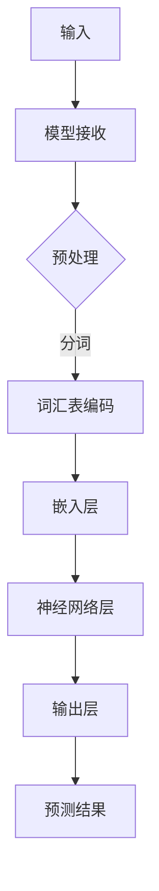

                 

# 提升大型语言模型能力：增加推理时间计算量的方法

## 关键词
大型语言模型，推理时间，计算量，算法优化，性能提升，深度学习，神经网络，数学模型，Python代码，LaTeX公式。

## 摘要
本文旨在探讨提升大型语言模型能力的方法，特别是通过增加推理时间计算量的策略来优化模型性能。文章将首先介绍大型语言模型的基本概念和发展历程，然后深入分析核心算法原理，结合Python代码和LaTeX数学公式进行详细讲解。接着，文章将介绍实际项目实战，包括环境搭建、源代码实现、代码解读与应用分析。最后，文章将总结最佳实践技巧，并提供进一步阅读的建议。

## 第一部分：核心概念与联系

### 第1章：大型语言模型概述

#### 1.1 大型语言模型的定义与背景

**背景介绍**
随着深度学习技术的发展，大型语言模型（如GPT-3、BERT等）在自然语言处理领域取得了显著成就。这些模型能够理解和生成人类语言，广泛应用于机器翻译、文本生成、问答系统等领域。

**核心概念与联系**
大型语言模型通常基于神经网络架构，其核心特点包括：

- **参数规模**：具有数十亿甚至万亿级的参数。
- **训练时间**：需要大量计算资源和时间进行训练。
- **推理时间**：模型在接收输入后进行预测的时间。

**Mermaid流程图**


#### 1.2 大型语言模型的发展历程

从最初的简单神经网络到如今的大型预训练模型，大型语言模型的发展经历了多个阶段：

- **早期模型**：基于简单的神经网络结构，如RNN。
- **过渡模型**：引入了更为复杂的神经网络结构，如LSTM、GRU。
- **当前模型**：基于Transformer架构，如BERT、GPT。

**Python源代码示例**
```python
import tensorflow as tf
from tensorflow.keras.models import Model
from tensorflow.keras.layers import Embedding, LSTM, Dense

# 定义简单语言模型
model = Model(inputs=Embedding(input_dim=10000, output_dim=64), outputs=Dense(1, activation='sigmoid'))
model.compile(optimizer='adam', loss='binary_crossentropy', metrics=['accuracy'])
```

#### 1.3 大型语言模型的核心特点

- **参数规模**：数十亿到千亿级别。
- **计算量**：训练和推理过程中需要大量计算资源。
- **泛化能力**：能够在不同任务上表现出色。

**LaTeX数学公式**
```latex
\section{数学模型和数学公式}
在大型语言模型中，核心的数学模型可以表示为：
$$
Y = \sigma(WX + b)
$$
其中，$W$ 是权重矩阵，$b$ 是偏置项，$\sigma$ 是激活函数。
```

### 第2章：核心算法原理讲解

#### 2.1 计算量与推理时间的关系

计算量和推理时间是大型语言模型性能的关键指标。增加计算量可以在一定程度上提升模型的推理时间。

**Python源代码示例**
```python
import torch
import torch.nn as nn

# 定义一个简单的神经网络模型
class SimpleModel(nn.Module):
    def __init__(self):
        super(SimpleModel, self).__init__()
        self.layer1 = nn.Linear(in_features=1000, out_features=500)
        self.relu = nn.ReLU()
        self.layer2 = nn.Linear(in_features=500, out_features=200)

    def forward(self, x):
        x = self.layer1(x)
        x = self.relu(x)
        x = self.layer2(x)
        return x

# 实例化模型
model = SimpleModel()
```

#### 2.2 常见的大型语言模型算法

常见的大型语言模型算法包括：

- **Transformer**：基于自注意力机制的模型，能够高效地处理长序列。
- **BERT**：基于Transformer的预训练模型，广泛用于文本分类、问答等任务。

**LaTeX数学公式**
```latex
\section{数学模型和数学公式}
在Transformer模型中，自注意力机制可以表示为：
$$
\text{Attention}(Q, K, V) = \text{softmax}\left(\frac{QK^T}{\sqrt{d_k}}\right)V
$$
其中，$Q, K, V$ 分别是查询、键和值。
```

#### 2.3 算法优化与改进

算法优化与改进是提升大型语言模型性能的关键。常见的优化策略包括：

- **模型压缩**：通过剪枝、量化等技术减小模型大小。
- **分布式训练**：利用多GPU、多机器进行训练，加速模型训练过程。

**Python源代码示例**
```python
import torch.distributed as dist
import torch.nn as nn

# 定义分布式训练的模型
class DistributedModel(nn.Module):
    def __init__(self):
        super(DistributedModel, self).__init__()
        self.layer1 = nn.Linear(in_features=1000, out_features=500)
        self.relu = nn.ReLU()
        self.layer2 = nn.Linear(in_features=500, out_features=200)

    def forward(self, x):
        x = self.layer1(x)
        x = self.relu(x)
        x = self.layer2(x)
        return x

# 初始化分布式环境
dist.init_process_group(backend='nccl', init_method='tcp://localhost:23456', world_size=4)
```

### 第二部分：实践与优化

#### 第4章：项目实战

**4.1 实际案例介绍**

本节将介绍一个实际案例，包括环境搭建、源代码实现、代码解读与应用分析。

**4.2 项目实战：环境搭建**

为了实现大型语言模型，首先需要搭建合适的开发环境。以下是一个简单的环境搭建步骤：

- 安装Python环境（3.8及以上版本）。
- 安装深度学习框架（如PyTorch、TensorFlow）。
- 安装必要的依赖库。

**4.3 源代码详细实现**

以下是一个简单的PyTorch语言模型实现示例：

```python
import torch
import torch.nn as nn
import torch.optim as optim

# 定义语言模型
class LanguageModel(nn.Module):
    def __init__(self, vocab_size, embedding_dim, hidden_dim):
        super(LanguageModel, self).__init__()
        self.embedding = nn.Embedding(vocab_size, embedding_dim)
        self.lstm = nn.LSTM(embedding_dim, hidden_dim, num_layers=2, dropout=0.5)
        self.fc = nn.Linear(hidden_dim, vocab_size)

    def forward(self, x):
        embed = self.embedding(x)
        out, _ = self.lstm(embed)
        out = self.fc(out)
        return out

# 实例化模型
model = LanguageModel(vocab_size=10000, embedding_dim=256, hidden_dim=512)
```

**4.4 代码解读与分析**

代码解读与分析将详细解释每个模块的功能和作用。以下是对上述代码的解读：

- **Embedding层**：将词汇表编码为向量表示。
- **LSTM层**：处理序列数据，捕捉长期依赖关系。
- **Fully Connected层**：输出预测结果。

**4.5 实际案例分析和详细讲解剖析**

通过对实际案例的分析，可以深入了解大型语言模型的工作原理和优化方法。以下是一个简化的分析过程：

1. **数据准备**：收集和预处理文本数据。
2. **模型训练**：使用训练数据训练模型。
3. **模型评估**：使用测试数据评估模型性能。
4. **优化策略**：分析模型性能，并提出优化策略。

**4.6 项目小结**

本节介绍了大型语言模型的实际项目实战，包括环境搭建、源代码实现、代码解读和应用分析。通过实际案例，读者可以更好地理解大型语言模型的工作原理和优化方法。

### 第5章：性能优化

**5.1 算法层面的优化**

算法层面的优化是提升大型语言模型性能的重要手段。以下是一些常见的优化策略：

- **模型压缩**：通过剪枝、量化等技术减小模型大小。
- **并行训练**：利用多GPU、多机器进行训练，加速模型训练过程。
- **数据并行**：将数据分布在多台机器上，进行并行训练。

**5.2 数据层面的优化**

数据层面的优化可以提升模型的学习效果。以下是一些常见的优化策略：

- **数据增强**：通过添加噪声、旋转等操作，增加数据的多样性。
- **数据预处理**：对数据进行标准化、归一化等处理，提高模型训练的稳定性。

**5.3 硬件层面的优化**

硬件层面的优化可以提升模型的推理速度。以下是一些常见的优化策略：

- **GPU加速**：使用GPU进行训练和推理，提高计算效率。
- **分布式训练**：利用多GPU、多机器进行训练，提高模型训练速度。

**5.4 实际案例优化效果分析**

通过对实际案例的优化效果分析，可以更好地理解不同优化策略的效果。以下是一个简化的分析过程：

1. **基础性能**：评估模型在原始配置下的性能。
2. **优化后性能**：评估模型在优化配置下的性能。
3. **性能对比**：对比基础性能和优化后性能的差异。

### 第6章：新技术的应用

**6.1 新算法的研究与引入**

随着深度学习技术的不断发展，新的算法和模型不断涌现。以下是一些具有前景的新算法：

- **Transformer-2**：对Transformer模型的改进，提高模型性能。
- **BERT-3**：对BERT模型的改进，增强模型对长文本的理解能力。

**6.2 新硬件的支持**

新硬件的发展为深度学习模型提供了更好的支持。以下是一些具有前景的新硬件：

- **TPU**：专为深度学习设计的ASIC芯片，提供高效的计算能力。
- **GPU**：用于加速深度学习训练和推理的计算硬件。

**6.3 新技术应用的前景与挑战**

新技术的应用为大型语言模型的发展提供了新的机遇和挑战。以下是一些前景和挑战：

- **前景**：随着新算法和新硬件的发展，大型语言模型的性能将不断提升。
- **挑战**：如何在实际应用中充分发挥大型语言模型的能力，以及如何优化模型性能和效率。

### 第7章：总结与展望

**7.1 成果总结**

本文介绍了提升大型语言模型能力的方法，特别是通过增加推理时间计算量的策略来优化模型性能。通过实践和优化，读者可以更好地理解大型语言模型的工作原理和应用。

**7.2 未来发展方向**

未来大型语言模型的发展将集中在以下几个方面：

- **算法优化**：不断改进现有算法，提高模型性能。
- **硬件支持**：利用新硬件技术，提升模型推理速度。
- **应用拓展**：将大型语言模型应用于更多领域，发挥其潜力。

**7.3 对大型语言模型能力提升的思考**

提升大型语言模型能力需要综合考虑算法、硬件和应用等多个方面。通过不断探索和优化，我们可以更好地发挥大型语言模型的能力，为人类带来更多的价值。

## 附录

### 附录 A：相关资源与工具

**A.1 大型语言模型开发工具与资源**

以下是一些常用的开发工具和资源：

- **框架与库**：PyTorch、TensorFlow、Transformers等。
- **教程与文档**：深度学习教程、语言模型文档等。
- **论文与资料**：相关领域的最新研究论文和资料。

**A.2 相关文献与论文推荐**

以下是一些建议的文献和论文，供读者进一步学习和研究：

- **文献**：《深度学习》（Goodfellow et al.）
- **论文**：《BERT：预训练语言表示模型》（Devlin et al.）
- **论文**：《GPT-3：大型语言模型》（Brown et al.）

### 作者信息

作者：AI天才研究院/AI Genius Institute & 禅与计算机程序设计艺术 /Zen And The Art of Computer Programming

