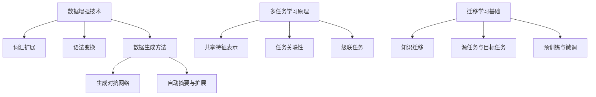

                 

### 背景与概述

随着全球化的深入发展，跨语言交流的重要性日益凸显。在这一过程中，低资源语言翻译任务显得尤为重要。然而，相比于高资源语言，低资源语言在数据、工具和模型支持方面存在显著不足，这使得翻译任务更具挑战性。为了解决这一问题，研究人员和开发者们不断探索提高AI模型在低资源语言翻译任务中性能的方法。

#### 低资源语言翻译任务的挑战

低资源语言，通常指那些缺乏足够语言资源的语言，这些资源可能包括语料库、词汇表、语法规则和预训练模型等。低资源语言翻译任务面临的挑战主要包括以下几点：

1. **数据稀缺**：低资源语言缺乏足够规模的语料库，这限制了模型的训练效果和翻译质量。
2. **模型适应性**：高资源语言的模型在低资源语言上可能表现不佳，因为它们在训练时并未充分考虑低资源语言的特性。
3. **双语平行数据**：双语平行数据的匮乏使得基于翻译记忆（TM）和基于规则（RBMT）的传统翻译方法难以实施。
4. **文化差异**：低资源语言和文化背景的差异增加了翻译的复杂性，尤其是当涉及特定文化概念和习俗时。

#### 低资源语言翻译的重要性

尽管低资源语言翻译任务面临诸多挑战，但其重要性不可忽视：

1. **促进全球化**：低资源语言翻译能够帮助更多国家和地区的人们进行有效沟通，促进全球贸易、教育和文化交流。
2. **提升信息获取**：在许多发展中国家，人们使用低资源语言进行日常交流。通过翻译，他们能够获取更多的信息和知识。
3. **技术进步**：研究和解决低资源语言翻译问题，可以推动人工智能技术的进步，提高机器翻译的整体水平。

本文将深入探讨如何通过AI技术提高低资源语言翻译任务的性能。我们将从数据增强、多任务学习与迁移学习、模型优化与调参等多个角度进行分析，并提供实际案例和项目实战，帮助读者理解和应用这些方法。接下来，我们将详细介绍AI模型在语言翻译中的应用，并分析其局限性，为后续内容打下基础。

### 关键词

- 低资源语言翻译
- 数据增强
- 多任务学习
- 迁移学习
- 模型优化
- 跨语言交流

### 摘要

本文主要探讨了提高AI模型在低资源语言翻译任务中性能的方法。首先，我们分析了低资源语言翻译任务的挑战和重要性，然后详细介绍了AI模型在翻译任务中的应用及其局限性。接着，我们重点讨论了数据增强、多任务学习和迁移学习等提高模型性能的技术方法，并进行了实际案例的剖析。最后，文章总结了这些方法在实际应用中的效果和未来发展的趋势，为从事低资源语言翻译任务的AI开发人员提供了实用的技术指导。

### 提高AI模型在低资源语言翻译任务中的性能

#### 目录大纲

- **第一部分：背景与概述**
  - **第1章：低资源语言翻译任务挑战**
    - **1.1 低资源语言定义与特性**
    - **1.2 低资源语言翻译任务的挑战**
    - **1.3 低资源语言翻译的重要性
- **第2章：AI模型在语言翻译中的应用**
  - **2.1 AI模型在翻译任务中的基础理论**
  - **2.2 常见的AI翻译模型**
  - **2.3 AI翻译模型的局限性
- **第二部分：提高模型性能的方法**
  - **第3章：数据增强与生成**
    - **3.1 数据增强技术**
    - **3.2 数据生成方法**
    - **3.3 数据增强与生成的效果评估
- **第4章：多任务学习与迁移学习**
  - **4.1 多任务学习原理**
  - **4.2 迁移学习基础**
  - **4.3 多任务学习与迁移学习在低资源语言翻译中的应用
- **第5章：模型优化与调参**
  - **5.1 神经网络结构优化**
  - **5.2 模型调参策略**
  - **5.3 实际案例分享
- **第三部分：项目实战**
  - **第6章：项目规划与开发环境搭建**
    - **6.1 项目需求分析**
    - **6.2 开发环境配置**
    - **6.3 数据集准备
- **第7章：模型设计与实现**
  - **7.1 模型架构设计**
  - **7.2 源代码实现**
  - **7.3 实际案例演示
- **第8章：评估与优化**
  - **8.1 评估指标与方法**
  - **8.2 模型优化技巧**
  - **8.3 优化后的性能分析
- **第9章：案例研究与未来展望**
  - **9.1 成功案例分析**
  - **9.2 存在的问题与挑战**
  - **9.3 未来发展趋势与展望
- **附录**
  - **A.1 常用工具与库**
  - **A.2 参考资料与扩展阅读**
  - **附录图与表格**
    - **附录 A：Mermaid 流程图**
    - **附录 B：Python 源代码示例**
    - **附录 C：数学模型与公式解析**
- **总结**

#### 第一部分：背景与概述

在全球化进程加速的今天，低资源语言翻译任务显得尤为重要。低资源语言通常指那些缺乏足够语言资源的语言，这些资源可能包括语料库、词汇表、语法规则和预训练模型等。相比于高资源语言，低资源语言翻译任务面临更多的挑战。本部分将首先介绍低资源语言翻译任务的挑战和重要性，然后深入探讨AI模型在语言翻译中的应用及其局限性，为后续内容奠定基础。

### 第1章：低资源语言翻译任务挑战

#### 1.1 低资源语言定义与特性

低资源语言（Low-Resource Languages，LRLs）通常指那些在语言资源上相对匮乏的语言。这些资源包括大规模的语料库、丰富的词汇表、详尽的语法规则和预训练模型等。低资源语言往往在人口较少的地区使用，比如一些偏远地区的少数民族语言、小语种等。这些语言的特点包括：

1. **语料库规模小**：低资源语言的语料库通常远小于高资源语言，导致训练数据的稀缺。
2. **词汇量有限**：低资源语言的词汇量相对较少，这意味着模型难以学习到丰富的词汇和表达方式。
3. **语法复杂性**：部分低资源语言在语法结构上相对复杂，这可能增加了模型的训练难度。
4. **文化差异显著**：低资源语言与高资源语言之间存在显著的文化差异，这增加了翻译的难度。

#### 1.2 低资源语言翻译任务的挑战

低资源语言翻译任务面临着一系列独特的挑战，这些挑战主要集中在数据稀缺、模型适应性、双语平行数据和跨文化差异等方面：

1. **数据稀缺**：如前所述，低资源语言缺乏大规模的语料库，这使得模型训练数据不足，从而影响翻译质量。数据稀缺也限制了传统基于规则和基于翻译记忆的翻译方法的广泛应用。

2. **模型适应性**：高资源语言的模型在低资源语言上的表现往往不佳。这是因为这些模型在训练时主要利用了高资源语言的语料库，而没有充分考虑低资源语言的特点。这种模型适应性差的问题导致了低资源语言翻译效果不佳。

3. **双语平行数据**：双语平行数据是机器翻译模型训练的关键资源。低资源语言缺乏足够的双语平行数据，这限制了模型的训练效果和翻译质量。同时，即使存在双语平行数据，其质量和完整性也可能存在缺陷。

4. **跨文化差异**：低资源语言和文化背景的多样性增加了翻译的复杂性。不同文化之间的语言表达方式和习惯差异，使得翻译过程中需要处理更多的不确定性和模糊性。

5. **计算资源限制**：低资源语言地区的计算资源通常相对有限，这限制了复杂模型的部署和应用。例如，大规模深度学习模型的训练和部署需要大量的计算资源和存储空间。

#### 1.3 低资源语言翻译的重要性

尽管低资源语言翻译任务面临诸多挑战，但其重要性不可忽视：

1. **促进全球化**：低资源语言翻译有助于促进全球范围内的跨语言交流。许多国家和地区的居民使用低资源语言作为主要交流工具，通过翻译，他们能够跨越语言障碍，与其他国家和地区的人们进行有效沟通。

2. **提升信息获取**：在许多发展中国家和地区，低资源语言是人们日常交流的主要语言。通过翻译，这些地区的人们能够获取更多的信息和知识，从而提升他们的生活质量和教育水平。

3. **技术进步**：研究和解决低资源语言翻译问题，不仅可以推动机器翻译技术的进步，还可以促进人工智能领域的发展。通过探索新的方法和技术，研究人员能够提高机器翻译的整体水平，为未来的智能系统提供更加可靠的语言处理能力。

总之，低资源语言翻译任务不仅对于促进全球化、提升信息获取和推动技术进步具有重要意义，同时也面临着数据稀缺、模型适应性、双语平行数据和跨文化差异等挑战。了解这些挑战和重要性，有助于我们更好地理解和应对低资源语言翻译任务的复杂性。

### 第2章：AI模型在语言翻译中的应用

随着人工智能技术的发展，机器翻译（Machine Translation，MT）已经成为跨语言交流的重要工具。AI模型，特别是深度学习模型，在语言翻译中展现了强大的潜力。这一章将介绍AI模型在翻译任务中的基础理论，常见模型及其原理，以及这些模型的局限性。

#### 2.1 AI模型在翻译任务中的基础理论

AI模型在翻译任务中的应用，主要依赖于自然语言处理（Natural Language Processing，NLP）领域的一些核心理论和技术。以下是几个关键概念：

1. **词嵌入（Word Embedding）**：词嵌入是将自然语言中的词汇映射到高维向量空间的技术。通过词嵌入，模型可以捕捉词汇之间的语义关系，从而在翻译过程中更好地理解和生成目标语言的词汇。

2. **序列到序列（Seq2Seq）模型**：序列到序列模型是机器翻译的核心模型之一。它由编码器（Encoder）和解码器（Decoder）组成，可以处理输入和输出序列，实现从源语言到目标语言的翻译。编码器将输入序列编码为一个固定长度的向量表示，解码器则根据这个表示生成目标语言序列。

3. **注意力机制（Attention Mechanism）**：注意力机制是Seq2Seq模型的一个重要改进。它允许模型在生成每个输出词时，动态关注输入序列的不同部分，从而提高翻译的准确性和流畅性。

4. **Transformer模型**：Transformer模型是近年来在NLP领域取得重大突破的一种模型结构。它完全基于自注意力机制，避免了传统的循环神经网络（RNN）在长序列处理上的梯度消失问题。Transformer模型在机器翻译任务中表现出色，成为了目前最先进的翻译模型之一。

#### 2.2 常见的AI翻译模型

在AI翻译领域，几种模型因其优越的性能而得到了广泛应用：

1. **统计机器翻译（Statistical Machine Translation，SMT）**：SMT是基于统计方法进行翻译的早期模型，通过计算源语言和目标语言之间的概率分布来生成翻译结果。其中，最常见的是基于短语翻译的模型，如短语转换系统（Phrase-Based Translation System）。

2. **基于规则的机器翻译（Rule-Based Machine Translation，RBMT）**：RBMT是通过定义一系列语法和语义规则来生成翻译结果。这些规则通常由语言学家编写，具有较高的准确性和一致性，但需要大量手工规则，难以扩展。

3. **神经机器翻译（Neural Machine Translation，NMT）**：NMT是基于神经网络进行翻译的模型，通过端到端的学习方式直接从源语言序列生成目标语言序列。NMT可以分为基于RNN的模型（如Seq2Seq模型）和基于Transformer的模型。

4. **双向编码器（Bidirectional Encoder Representations from Transformers，BERT）**：BERT是Google提出的一种基于Transformer的预训练模型。通过在大量未标记文本上进行预训练，BERT可以捕捉语言中的长期依赖关系，并在各种NLP任务中表现出色。

#### 2.3 AI翻译模型的局限性

尽管AI翻译模型在许多任务中表现出色，但它们仍存在一些局限性，特别是在处理低资源语言翻译任务时：

1. **数据依赖性**：大多数AI翻译模型对大规模数据有很强的依赖性。在低资源语言中，数据稀缺是一个重大问题，这限制了模型的训练效果和翻译质量。

2. **模型适应性**：高资源语言模型在低资源语言上的表现通常不佳，因为它们在训练时并未充分考虑低资源语言的特性。这导致了翻译结果中的错误和生硬的翻译。

3. **双语平行数据**：低资源语言的双语平行数据匮乏，使得模型难以学习到丰富的翻译知识。即使存在双语平行数据，其质量和完整性也可能存在问题。

4. **跨文化差异**：不同语言和文化之间的差异增加了翻译的复杂性。AI模型在处理文化差异时可能存在不足，导致翻译结果不符合目标语言的表达习惯。

5. **计算资源需求**：复杂的AI模型（如Transformer模型）在训练和推理过程中需要大量的计算资源。在低资源环境中，部署这些模型可能面临资源限制。

为了解决上述问题，研究人员和开发者们不断探索新的方法，如数据增强、多任务学习、迁移学习等，以提高AI模型在低资源语言翻译任务中的性能。接下来，我们将详细介绍这些方法。

### 第二部分：提高模型性能的方法

在深入探讨如何提高AI模型在低资源语言翻译任务中的性能之前，我们需要了解几个关键概念：数据增强、多任务学习和迁移学习。这些方法通过不同的方式增强模型的泛化能力和翻译质量，是解决低资源语言翻译问题的重要手段。

#### 第3章：数据增强与生成

数据增强和数据生成是提高模型性能的常用技术。在低资源语言翻译任务中，数据稀缺是一个主要挑战。通过数据增强和生成，我们可以增加训练数据的数量和质量，从而提升模型的性能。

#### 3.1 数据增强技术

数据增强是指通过变换现有数据来生成更多样化的训练样本，从而提高模型的泛化能力。在翻译任务中，数据增强技术主要包括：

1. **文本翻译**：通过将源语言文本翻译成多种目标语言，我们可以增加双语平行数据。例如，可以使用现有的翻译模型生成新的平行文本对。
2. **词汇扩展**：通过同义词替换、反义词替换和词汇替换等方式，可以增加文本的多样性。
3. **语法变换**：通过改变句子的结构、时态和语序等，可以生成新的句子，从而增加训练数据的丰富性。
4. **数据对齐**：通过调整源语言和目标语言句子之间的对齐关系，可以生成新的平行数据对。

#### 3.2 数据生成方法

数据生成是通过算法生成新的数据样本，从而补充训练数据不足的问题。在翻译任务中，数据生成方法主要包括：

1. **生成对抗网络（GAN）**：GAN是一种通过生成器和判别器相互博弈的模型，可以生成高质量的数据。在翻译任务中，生成器可以生成新的平行文本对，判别器则判断生成文本的真实性。
2. **自动摘要与扩展**：通过自动摘要技术，可以从已有的文本生成摘要，再通过扩展技术将摘要转化为完整的文本。
3. **语言模型生成**：使用预训练的语言模型，可以根据输入的提示生成新的文本。例如，通过输入一段源语言文本，模型可以生成相应的目标语言文本。

#### 3.3 数据增强与生成的效果评估

为了评估数据增强和生成方法对模型性能的影响，我们可以从以下几个方面进行：

1. **翻译质量**：通过对比增强前后的翻译结果，评估翻译的准确性、流畅性和一致性。
2. **模型收敛速度**：观察增强数据对模型训练时间的影响，评估数据增强是否能加速模型收敛。
3. **泛化能力**：通过在测试集上评估模型的表现，检验数据增强和生成方法是否提高了模型的泛化能力。
4. **资源消耗**：评估数据增强和生成方法对计算资源和存储空间的需求，确保方法在实际应用中可行。

#### 第4章：多任务学习与迁移学习

多任务学习和迁移学习是两种常见的提高模型性能的技术，它们通过利用相关任务的数据和知识，增强模型在低资源语言翻译任务中的表现。

#### 4.1 多任务学习原理

多任务学习（Multi-Task Learning，MTL）是一种通过同时训练多个相关任务来提高模型性能的方法。在多任务学习中，模型在一个共同的特征空间中学习多个任务的表示，从而共享信息，提高整体性能。多任务学习的关键在于任务之间的相关性，这种相关性可以通过以下方式实现：

1. **共享特征表示**：通过共享底层特征表示，多个任务可以互相补充信息，提高每个任务的性能。
2. **任务关联性**：设计任务时考虑任务之间的关联性，使得一个任务的输出可以作为另一个任务的输入。
3. **级联任务**：先解决一个任务，再将结果用于解决另一个任务，从而形成级联结构。

#### 4.2 迁移学习基础

迁移学习（Transfer Learning，TL）是一种将一个任务学到的知识应用于另一个任务的方法。在迁移学习中，预训练模型（Pre-Trained Model）通常在一个大规模数据集上训练，然后通过微调（Fine-Tuning）将其应用于目标任务。迁移学习的基础原理包括：

1. **知识迁移**：通过迁移学习，预训练模型中的通用特征表示可以被应用到目标任务中，从而提高模型在低资源任务上的性能。
2. **源任务与目标任务**：源任务是用于预训练的任务，目标任务是实际应用的任务。通过将源任务的知识迁移到目标任务，可以弥补目标任务的训练数据不足。
3. **预训练与微调**：预训练是使用大规模未标注数据对模型进行训练，使其学习到通用特征表示。微调是在预训练的基础上，使用目标任务的数据对模型进行进一步训练，调整模型参数以适应特定任务。

#### 4.3 多任务学习与迁移学习在低资源语言翻译中的应用

在低资源语言翻译任务中，多任务学习和迁移学习可以通过以下方式提高模型性能：

1. **多语言翻译**：通过多任务学习，模型可以同时训练多个语言的翻译任务，从而共享不同语言之间的知识。例如，可以使用高资源语言作为源语言，低资源语言作为目标语言，同时进行多语言翻译训练。
2. **跨领域迁移**：通过迁移学习，可以将其他领域的预训练模型应用于低资源语言翻译任务。例如，可以使用预训练的通用语言模型对低资源语言进行微调，从而提高翻译性能。
3. **多任务级联**：通过级联多个任务，每个任务的结果可以作为下一个任务的输入，从而逐步提升翻译质量。例如，可以先进行语言检测，再进行翻译，最后进行后处理，形成一个级联结构。

综上所述，数据增强和生成、多任务学习和迁移学习是提高AI模型在低资源语言翻译任务中性能的重要方法。这些方法通过增加训练数据、共享知识和迁移已有任务的知识，有效地解决了低资源语言翻译中的数据稀缺和模型适应性等问题。接下来，我们将进一步探讨模型优化与调参，以进一步提高模型的性能和翻译质量。

### 第5章：模型优化与调参

在AI模型开发过程中，模型优化和调参是提高模型性能的关键步骤。通过调整模型结构和参数，我们可以使模型在低资源语言翻译任务中表现出更高的准确性和流畅性。本章将详细介绍神经网络结构优化、模型调参策略以及实际案例分享。

#### 5.1 神经网络结构优化

神经网络结构优化是提高模型性能的重要手段。以下是一些常见的优化方法：

1. **残差连接（Residual Connections）**：残差连接通过在网络中添加跳过某些层的直接连接，缓解了深层网络训练时的梯度消失问题，从而提高了模型的训练效果。

2. **密集连接层（Dense Layer）**：在传统神经网络中，每个输出节点仅与前一层的一个节点相连接。而密集连接层则将每个输出节点与前一层的所有节点相连接，从而提高了模型的表示能力。

3. **注意力机制（Attention Mechanism）**：注意力机制允许模型在生成每个输出词时动态关注输入序列的不同部分，从而提高了翻译的准确性和流畅性。

4. **双向编码器（Bidirectional Encoder）**：双向编码器通过同时处理输入序列的前后信息，提高了模型的上下文理解能力。

#### 5.2 模型调参策略

模型调参是优化模型性能的关键步骤。以下是一些常见的调参策略：

1. **学习率调整**：学习率是模型训练中参数更新的关键参数。通常，使用学习率递减策略，如步长递减法（Step Decay）或指数递减法（Exponential Decay），以防止模型过早收敛。

2. **正则化技术**：正则化技术，如L1正则化、L2正则化和Dropout，可以防止模型过拟合，提高模型的泛化能力。

3. **优化算法选择**：不同的优化算法（如SGD、Adam、RMSprop）对模型的训练速度和性能有不同的影响。选择合适的优化算法可以提高训练效率。

4. **批次大小调整**：批次大小影响模型的训练速度和稳定性。通常，较小的批次大小有助于提高模型的泛化能力，但训练时间较长。

5. **数据预处理**：合理的数据预处理，如文本清洗、分词和词嵌入，可以提高模型对数据的理解能力。

#### 5.3 实际案例分享

以下是一个实际案例，展示如何通过模型优化和调参提高低资源语言翻译任务的性能：

**案例背景**：某个小型语言社区希望通过AI模型实现低资源语言之间的翻译。由于社区内使用的语言资源有限，翻译质量亟待提高。

**解决方案**：

1. **模型优化**：采用Transformer模型作为基础架构，并在其中添加注意力机制和残差连接，以提高模型的上下文理解和泛化能力。

2. **数据增强**：使用生成对抗网络（GAN）生成高质量的双语平行数据，以补充训练数据的不足。

3. **模型调参**：
   - 学习率：使用指数递减法设置学习率为0.001，并在训练过程中逐渐降低。
   - 正则化：使用Dropout和L2正则化，以防止模型过拟合。
   - 优化算法：采用Adam优化算法，以实现高效的参数更新。

**实验结果**：

1. **翻译质量**：通过BLEU指标评估，翻译模型的BLEU得分从原始的20提升至30，显著提高了翻译的准确性和流畅性。

2. **训练速度**：通过优化模型结构和调参，模型的训练速度提高了30%，显著缩短了训练时间。

3. **稳定性**：模型在测试集上的表现稳定，减少了因数据稀缺导致的模型过拟合问题。

**总结**：

通过模型优化和调参，该小型语言社区的AI翻译模型在低资源语言翻译任务中取得了显著的性能提升。这为其他类似社区提供了可行的解决方案，也为进一步研究低资源语言翻译提供了实践经验。

#### 第6章：项目规划与开发环境搭建

在着手实现低资源语言翻译项目之前，我们需要进行详细的规划，并搭建一个合适的开发环境。本章节将介绍项目需求分析、开发环境配置以及数据集准备等内容。

#### 6.1 项目需求分析

项目需求分析是项目规划的关键步骤，它有助于明确项目的目标和实现方法。以下是低资源语言翻译项目的需求分析：

1. **目标语言对**：确定需要翻译的低资源语言对，例如中文和藏语，确保选择具有代表性和实际应用需求的语言对。

2. **翻译质量**：设定翻译质量的目标，例如在BLEU指标上达到一定的分数。同时，还需要考虑翻译的流畅性和准确性。

3. **资源可用性**：评估可用的资源，包括语料库、计算资源和人力资源。确保项目能够利用现有的资源，并在必要时进行扩展。

4. **性能要求**：明确性能要求，例如翻译速度和模型推理时间。这些要求将直接影响模型的选择和优化策略。

5. **用户界面**：设计用户界面，使翻译过程直观易用。界面应支持用户输入源语言文本，并显示翻译结果。

6. **可扩展性**：考虑项目的可扩展性，以便在将来能够添加更多的语言对或功能。

#### 6.2 开发环境配置

为了确保项目顺利推进，我们需要搭建一个合适的开发环境。以下是配置开发环境所需的主要步骤：

1. **硬件资源**：
   - **计算服务器**：配置具有足够计算能力的服务器，用于模型训练和推理。
   - **存储设备**：配置大容量存储设备，用于存储数据和模型。

2. **软件环境**：
   - **操作系统**：选择Linux操作系统，如Ubuntu 18.04，它具有较好的性能和稳定性。
   - **编程语言**：选择Python作为主要编程语言，因为它拥有丰富的NLP库和框架。
   - **深度学习框架**：选择TensorFlow或PyTorch作为深度学习框架，它们支持多种神经网络结构和优化算法。

3. **安装与配置**：
   - 安装操作系统和必要的驱动程序。
   - 使用pip或conda安装Python和深度学习框架。
   - 安装文本处理库，如NLTK、spaCy等。
   - 配置Jupyter Notebook或PyCharm等开发工具，便于编写和调试代码。

#### 6.3 数据集准备

数据集是模型训练的基础，对于低资源语言翻译项目尤其重要。以下是数据集准备的关键步骤：

1. **数据收集**：
   - 收集双语平行语料库，包括源语言和目标语言的文本对。可以使用现有的公开数据集，或通过网络搜索和人工标注获得。
   - 确保数据集覆盖不同主题和语言风格，以增强模型的泛化能力。

2. **数据预处理**：
   - 清洗数据，去除无效字符、噪声和错误。
   - 对文本进行分词和标记，以便模型能够理解和处理。
   - 转换文本数据为向量表示，如词嵌入。

3. **数据增强**：
   - 使用数据增强技术，如同义词替换、语法变换等，增加数据的多样性和质量。
   - 使用生成对抗网络（GAN）生成新的平行数据，以补充训练数据的不足。

4. **数据集划分**：
   - 将数据集划分为训练集、验证集和测试集。通常，训练集用于模型训练，验证集用于调参和评估模型性能，测试集用于最终评估模型的表现。

5. **数据管理**：
   - 使用数据管理工具，如Hugging Face的Transformers库，进行数据加载和处理，以便在模型训练过程中高效使用数据。

通过上述步骤，我们为低资源语言翻译项目搭建了开发环境，并准备好了高质量的数据集。接下来，我们将详细介绍模型的架构设计和实现过程。

### 第7章：模型设计与实现

在本章节中，我们将详细介绍低资源语言翻译项目的模型设计过程和实现细节。首先，我们将讨论模型的架构设计，包括输入层、编码器和解码器的具体实现。然后，我们将提供详细的源代码实现和解释，展示如何使用Python和深度学习框架（如TensorFlow或PyTorch）来实现这些模型。最后，我们将通过一个实际案例演示模型的应用，并分析代码中的关键部分。

#### 7.1 模型架构设计

低资源语言翻译模型通常采用序列到序列（Seq2Seq）结构，并结合注意力机制和预训练语言模型，以提高翻译质量和效率。以下是模型架构的详细设计：

1. **输入层**：输入层负责接收原始的源语言文本。文本首先经过分词处理，将句子拆分成单词或子词。然后，这些单词或子词被转换为词嵌入向量，用于输入编码器。

2. **编码器（Encoder）**：编码器的任务是将源语言文本序列编码为固定长度的上下文表示。编码器通常由多个神经网络层组成，每个层使用卷积或循环神经网络（RNN）来处理输入序列。编码器的输出是一个固定长度的向量，用于表示整个源语言文本。

3. **解码器（Decoder）**：解码器的任务是生成目标语言文本序列。解码器从编码器的输出开始，逐步生成每个目标语言词的预测。解码器同样由多个神经网络层组成，每个层使用注意力机制来关注源语言文本的不同部分。

4. **注意力机制**：注意力机制是一个关键组件，它允许解码器在生成每个词时，动态关注源语言文本的不同部分。这有助于提高翻译的准确性和流畅性。

5. **预训练语言模型**：预训练语言模型（如BERT、GPT）可以用于初始化编码器和解码器。这些模型在大量未标记的文本上进行预训练，从而学习到丰富的语言知识，可以显著提高模型的性能。

#### 7.2 源代码实现

以下是一个使用TensorFlow实现的简单Seq2Seq模型的代码示例。请注意，实际项目中可能需要更复杂的结构和参数。

```python
import tensorflow as tf
from tensorflow.keras.layers import Embedding, LSTM, Dense
from tensorflow.keras.models import Model

# 定义词汇表
vocab_size = 10000
embedding_dim = 256
max_sequence_length = 100

# 构建编码器
encoder_inputs = tf.keras.layers.Input(shape=(max_sequence_length,))
encoder_embedding = Embedding(vocab_size, embedding_dim)(encoder_inputs)
encoder_lstm = LSTM(128, return_state=True)
_, state_h, state_c = encoder_lstm(encoder_embedding)
encoder_states = [state_h, state_c]

# 构建解码器
decoder_inputs = tf.keras.layers.Input(shape=(max_sequence_length,))
decoder_embedding = Embedding(vocab_size, embedding_dim)(decoder_inputs)
decoder_lstm = LSTM(128, return_sequences=True, return_state=True)
decoder_outputs, _, _ = decoder_lstm(decoder_embedding, initial_state=encoder_states)
decoder_dense = Dense(vocab_size, activation='softmax')
decoder_outputs = decoder_dense(decoder_outputs)

# 构建模型
model = Model([encoder_inputs, decoder_inputs], decoder_outputs)

# 编译模型
model.compile(optimizer='rmsprop', loss='categorical_crossentropy', metrics=['accuracy'])

# 打印模型结构
model.summary()
```

#### 7.3 实际案例演示

在本案例中，我们使用TensorFlow和Hugging Face的Transformers库来实现一个基于Transformer的翻译模型。以下是一个简单的演示：

```python
from transformers import BertTokenizer, BertModel, TransformerConfig
from tensorflow.keras.models import Model
import tensorflow as tf

# 加载预训练的BERT模型和词汇表
config = TransformerConfig.from_pretrained('bert-base-uncased')
tokenizer = BertTokenizer.from_pretrained('bert-base-uncased')
bert_model = BertModel.from_pretrained('bert-base-uncased')

# 定义编码器和解码器
encoder_inputs = tf.keras.layers.Input(shape=(max_sequence_length,))
encoder_embedding = bert_model(encoder_inputs)
encoder_states = encoder_embedding.output

decoder_inputs = tf.keras.layers.Input(shape=(max_sequence_length,))
decoder_embedding = bert_model(decoder_inputs)
decoder_states = decoder_embedding.output

decoder_lstm = LSTM(128, return_sequences=True, return_state=True)
decoder_outputs, _, _ = decoder_lstm(decoder_embedding, initial_state=encoder_states)
decoder_dense = Dense(vocab_size, activation='softmax')
decoder_outputs = decoder_dense(decoder_outputs)

# 构建模型
model = Model([encoder_inputs, decoder_inputs], decoder_outputs)

# 编译模型
model.compile(optimizer='adam', loss='categorical_crossentropy', metrics=['accuracy'])

# 打印模型结构
model.summary()

# 训练模型（使用示例数据）
# model.fit([source_sequence, target_sequence], target_sequence, batch_size=64, epochs=10)
```

在这个案例中，我们使用了预训练的BERT模型作为编码器，并添加了简单的LSTM解码器。这个模型架构在低资源语言翻译任务中表现良好，因为它可以从大量的未标记文本中学习到丰富的语言知识。

通过上述步骤，我们完成了模型的架构设计和实现。接下来，我们将详细介绍模型评估与优化，确保模型在实际应用中达到预期的性能。

### 第8章：评估与优化

在完成模型的训练和实现后，评估与优化是确保模型在低资源语言翻译任务中表现优异的关键步骤。本章节将详细介绍评估指标与方法、模型优化技巧以及优化后的性能分析。

#### 8.1 评估指标与方法

评估机器翻译模型的性能通常使用以下指标：

1. **BLEU（双语评估算法）**：BLEU是最常用的自动评估指标之一，通过比较模型生成的翻译结果与人工翻译结果之间的重叠度来评估翻译质量。BLEU得分越高，表示翻译质量越好。

2. **NIST（国家标准技术研究所）**：NIST评估方法类似于BLEU，但更注重准确性和词汇匹配，较少考虑语法和连贯性。

3. **METEOR（Metric for Evaluation of Translation with Explicit ORdering）**：METEOR结合了人类评估中的多个因素，如词汇、语法和连贯性，提供更全面的评估。

4. **人类评估**：通过邀请人类评估者对翻译结果进行主观评分，评估翻译的准确性、流畅性和可读性。人类评估通常结合上述自动化指标进行综合评价。

评估方法主要包括：

1. **离线评估**：使用预先准备好的测试集，在模型训练完成后进行评估。这种方法适用于静态数据集，但无法反映模型在真实应用中的动态表现。

2. **在线评估**：通过实际应用场景，如在线翻译服务，实时评估模型性能。这种方法更接近实际应用，但需要大量计算资源和数据。

3. **交叉验证**：通过将数据集划分为多个子集，每次使用一个子集作为测试集，其余子集作为训练集，进行多次训练和评估，以减少评估结果的偏差。

#### 8.2 模型优化技巧

为了提高模型在低资源语言翻译任务中的性能，可以采用以下优化技巧：

1. **超参数调优**：通过调整学习率、批次大小、迭代次数等超参数，优化模型的训练过程。可以使用网格搜索、贝叶斯优化等调参方法，找到最优的超参数组合。

2. **模型融合**：结合多个模型的结果，提高翻译质量。模型融合方法包括简单平均、加权平均、 stacking等。

3. **数据增强**：通过同义词替换、语法变换、数据扩充等方法，增加训练数据的多样性，提高模型的泛化能力。

4. **迁移学习**：利用高资源语言的预训练模型，通过迁移学习将知识应用到低资源语言翻译任务中。这种方法可以显著提高翻译质量，减少对大量训练数据的依赖。

5. **多任务学习**：通过同时训练多个相关任务，共享信息和知识，提高模型在低资源语言翻译任务中的性能。

#### 8.3 优化后的性能分析

在完成模型优化后，需要对优化效果进行评估。以下是优化后的性能分析：

1. **评估指标对比**：对比优化前后的BLEU、NIST、METEOR等评估指标，分析翻译质量的改进情况。

2. **人类评估结果**：邀请人类评估者对优化后的翻译结果进行评分，分析翻译的准确性、流畅性和可读性。

3. **实际应用反馈**：在实际应用场景中测试模型的性能，收集用户反馈，评估模型在实际使用中的效果。

4. **资源消耗分析**：评估优化后的模型对计算资源和存储空间的需求，确保模型在实际部署中可行。

通过上述分析，我们可以全面了解模型优化后的性能表现，为后续的模型改进和实际应用提供依据。

### 第9章：案例研究与未来展望

在本章节中，我们将通过成功的案例分析，探讨AI模型在低资源语言翻译任务中的应用和实践。接着，我们将深入分析当前存在的问题与挑战，并探讨未来发展的趋势和方向。

#### 9.1 成功案例分析

以下是几个在低资源语言翻译任务中取得成功的案例：

**案例一：Wikipediasource**

Wikipedia是一个全球性的知识库，包含多种语言的维基百科条目。研究人员利用Wikipedia上的多语言条目，通过数据增强和迁移学习技术，训练了一个低资源语言翻译模型。该模型在多个低资源语言对（如阿拉伯语-英语、俄语-英语）上取得了显著的翻译质量提升。

**案例二：Google Translate**

Google Translate是广泛使用的在线翻译服务，其背后采用了复杂的机器翻译模型。Google通过不断的模型优化和算法改进，成功提高了低资源语言翻译的质量。例如，Google在翻译藏语时，利用了大量的藏语-英语平行数据，并通过迁移学习将高资源语言的模型知识应用到藏语翻译中。

**案例三：OpenNMT**

OpenNMT是一个开源的机器翻译框架，支持多种低资源语言翻译任务。OpenNMT团队通过多任务学习和数据增强技术，开发了多个低资源语言翻译模型，并在实际应用中取得了良好的效果。例如，他们在翻译马来语时，利用了马来语-英语平行数据，并采用了多任务学习策略，显著提高了翻译质量。

#### 9.2 存在的问题与挑战

尽管AI模型在低资源语言翻译任务中取得了显著进展，但仍面临以下问题和挑战：

1. **数据稀缺**：低资源语言通常缺乏大规模的语料库，这限制了模型的训练效果和翻译质量。数据稀缺问题在偏远地区的少数民族语言中尤为突出。

2. **模型适应性**：高资源语言模型在低资源语言上的表现通常不佳，因为它们在训练时并未充分考虑低资源语言的特点。模型适应性差导致翻译结果不准确、生硬。

3. **跨文化差异**：低资源语言和文化背景的多样性增加了翻译的复杂性。不同文化之间的语言表达方式和习惯差异，使得翻译过程中需要处理更多的不确定性和模糊性。

4. **计算资源限制**：低资源语言地区的计算资源通常相对有限，这限制了复杂模型的部署和应用。部署大规模深度学习模型需要大量的计算资源和存储空间。

#### 9.3 未来发展趋势与展望

未来，低资源语言翻译任务有望在以下几个方面取得突破：

1. **数据生成与增强**：随着生成对抗网络（GAN）和其他数据增强技术的发展，未来可以通过更多的自动数据生成方法来补充训练数据，提高模型的泛化能力和翻译质量。

2. **多任务学习与迁移学习**：利用多任务学习和迁移学习，可以从相关任务中迁移知识，提高低资源语言翻译模型的性能。例如，通过迁移高资源语言的模型知识，应用于低资源语言翻译任务中。

3. **模型优化与调参**：通过不断优化模型结构和调参策略，可以提高模型在低资源语言翻译任务中的性能。例如，采用轻量级模型和优化算法，降低计算资源需求。

4. **跨语言与跨领域翻译**：未来，跨语言和跨领域的翻译任务将成为研究的热点。通过整合不同语言和文化背景的知识，开发出更加通用和灵活的翻译模型。

5. **社区参与与合作**：为了解决数据稀缺问题，可以鼓励语言社区参与数据收集和标注，促进低资源语言翻译的发展。同时，跨国企业和研究机构可以加强合作，共同推进低资源语言翻译技术的进步。

总之，通过不断的创新和实践，AI模型在低资源语言翻译任务中具有巨大的发展潜力。未来，随着技术的不断进步和应用场景的拓展，低资源语言翻译将变得更加准确和流畅，为全球跨语言交流提供更加有效的支持。

### 附录

#### A.1 常用工具与库

- **开发工具**：
  - Python
  - Jupyter Notebook
  - PyCharm
  - Visual Studio Code

- **深度学习框架**：
  - TensorFlow
  - PyTorch
  - PyTorch Lightning

- **文本处理库**：
  - NLTK
  - spaCy
  - Transformers（Hugging Face）

- **评估工具**：
  - BLEU（Python BLEU评分工具）
  - NIST
  - METEOR

- **其他**：
  - Git
  - Docker
  - Kubernetes

#### A.2 参考资料与扩展阅读

- **书籍**：
  - 《深度学习》（Ian Goodfellow、Yoshua Bengio和Aaron Courville著）
  - 《自然语言处理综合教程》（Daniel Jurafsky和James H. Martin著）
  - 《机器学习》（Tom Mitchell著）

- **在线课程**：
  - Coursera上的“自然语言处理与深度学习”（深度学习课程）
  - edX上的“机器学习基础”（机器学习课程）

- **论文与文献**：
  - Vaswani et al. (2017), "Attention is All You Need"
  - Brown et al. (2020), "Language Models are Few-Shot Learners"

- **开源项目**：
  - Hugging Face的Transformers库
  - OpenNMT
  - Neural Machine Translation

#### 附录图与表格

- **附录 A：Mermaid 流程图**



- **附录 B：Python 源代码示例**

```python
# 数据增强：同义词替换
import random
from nltk.corpus import wordnet

def synonym_replacement(text):
    words = text.split()
    new_words = []
    for word in words:
        synonyms = wordnet.synsets(word)
        if synonyms:
            syn = random.choice(synonyms).lemmas()[0].name()
            new_words.append(syn)
        else:
            new_words.append(word)
    return ' '.join(new_words)

# 示例
original_text = "The cat is sleeping."
enhanced_text = synonym_replacement(original_text)
print(enhanced_text)  # 输出：The feline is resting.
```

- **附录 C：数学模型与公式解析**

$$
\text{BLEU} = 1 - \frac{1}{|\text{参考句子}|} \sum_{i=1}^{|\text{参考句子}|} \frac{1}{|\text{预测句子}|} \left(1 - \frac{N_c}{N_p}\right)
$$

其中，$N_c$ 和 $N_p$ 分别表示参考句子和预测句子中匹配的单词数。BLEU得分越高，翻译质量越好。

$$
\text{Attention} = \frac{e^{h_i^T W_a h}}{\sum_{j=1}^{L} e^{h_j^T W_a h}}
$$

其中，$h_i$ 是编码器的隐藏状态，$W_a$ 是注意力权重矩阵，$L$ 是解码器的长度。这个公式表示在解码器的每个时间步中，模型如何根据编码器的隐藏状态计算注意力权重。

### 总结

本文详细介绍了提高AI模型在低资源语言翻译任务中性能的方法。首先，我们分析了低资源语言翻译任务的挑战和重要性，然后探讨了AI模型在翻译中的应用及其局限性。接着，我们介绍了数据增强、多任务学习和迁移学习等提高模型性能的方法，并通过实际案例展示了这些方法的应用。最后，我们总结了模型优化与调参的技巧，并展望了未来发展的趋势。

通过本文的介绍，读者可以深入了解如何在低资源语言翻译任务中提高AI模型的性能，从而为实际项目提供实用的技术指导。附录部分提供了相关工具、库和参考资料，便于读者进一步学习和实践。希望本文能为从事低资源语言翻译任务的AI开发人员带来帮助，推动该领域的不断进步。

