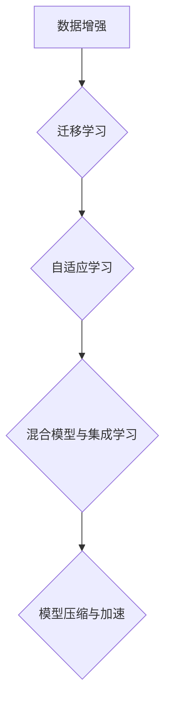

                 

### 《提高AI模型在低资源语言自然语言处理任务中的性能》

> 关键词：自然语言处理、AI模型、低资源语言、性能提升、数据增强、迁移学习、模型压缩

> 摘要：本文深入探讨了在低资源语言自然语言处理任务中，如何通过多种策略提升AI模型的性能。文章首先介绍了低资源语言NLP的定义与挑战，然后详细阐述了NLP的基础理论，包括语言模型、词向量表示和嵌套层级模型。接着，文章提出了一系列性能提升策略，如数据增强、迁移学习、自适应学习、混合模型与集成学习、模型压缩与加速等。最后，通过实际案例研究，对提出的方法进行了验证与评估，总结了研究结果，并对未来研究方向进行了展望。

### 第一部分：低资源语言NLP概述

#### 第1章：低资源语言的定义与挑战

##### 1.1 低资源语言的定义

低资源语言（Low-Resource Languages，简称LRLs）是指那些缺乏足够训练数据和高质量语言资源的语言。这些语言通常在全球范围内使用人数较少，没有广泛使用的标准词典、语法指南、语料库等资源。在自然语言处理（NLP）领域中，低资源语言的挑战主要体现在以下几方面：

1. 数据稀缺：训练高质量的AI模型需要大量的数据，低资源语言往往缺乏足够的大规模语料库。
2. 标注困难：对于低资源语言，标注高质量的数据集需要专业知识和大量时间，因此标注资源也很稀缺。
3. 语言复杂性：低资源语言通常具有独特的语法结构、词汇和发音规则，使得模型训练和优化变得更加复杂。

##### 1.2 低资源语言NLP的挑战

1. 模型泛化能力差：由于数据不足，模型难以学习到低资源语言的内在规律，导致泛化能力差。
2. 词汇表扩展困难：低资源语言的词汇量较小，难以通过扩展词汇表来提高模型的性能。
3. 预训练模型适用性低：现有的预训练模型大多基于高资源语言训练，对于低资源语言的适应性较差。

##### 1.3 低资源语言NLP的研究现状

目前，低资源语言NLP的研究主要集中在以下几个方面：

1. 数据增强：通过数据增强技术生成更多样化的训练数据，提高模型的泛化能力。
2. 迁移学习：利用高资源语言模型的预训练知识，迁移到低资源语言中，提高模型的性能。
3. 小样本学习：在只有少量训练数据的情况下，通过设计特定的算法和模型结构，提高模型的表现。
4. 模型压缩与加速：通过压缩模型大小和加速模型推理，提高模型在低资源环境中的部署能力。

#### 第2章：NLP基础理论

##### 2.1 语言模型的基本原理

语言模型（Language Model，简称LM）是NLP的核心组成部分，它旨在预测一个句子中下一个单词的概率。语言模型的基本原理可以概括为：

1. **概率模型**：语言模型是一种概率模型，通过计算给定前文序列下下一个单词的概率，来预测下一个单词。
2. **序列建模**：语言模型将文本视为一个连续的序列，通过建模序列中的依赖关系来预测下一个单词。

##### 2.2 词向量表示方法

词向量（Word Vector）是将单词转化为高维向量的一种方法，它有助于捕捉单词的语义和语法信息。常见的词向量表示方法包括：

1. **分布式表示**：将单词表示为高维向量，向量中的每个元素表示单词与词汇表中其他单词的共现关系。
2. **嵌入表示**：使用嵌入层（Embedding Layer）将单词转化为向量，通过训练学习到单词的向量表示。

##### 2.3 嵌套层级模型

嵌套层级模型（Nested Hierarchical Model）是一种将语言模型分层构建的方法，旨在提高模型的性能和效率。嵌套层级模型的基本原理包括：

1. **分层建模**：将语言模型分为多个层次，每一层关注不同粒度的特征。
2. **层次化训练**：通过层次化训练，先训练低层模型，然后逐渐训练高层模型，从而提高模型的泛化能力。

### 第二部分：性能提升策略

#### 第3章：数据增强方法

##### 3.1 数据增强的重要性

数据增强（Data Augmentation）是一种通过生成更多样化的训练数据来提高模型性能的方法。在低资源语言中，数据增强尤为重要，因为它可以弥补数据稀缺的不足，提高模型的泛化能力。数据增强方法主要包括：

1. **数据扩充**：通过复制、旋转、裁剪等操作生成更多样化的图像数据。
2. **文本变换**：通过替换、删除、插入等操作生成更多样化的文本数据。

##### 3.2 常见数据增强技术

1. **同义词替换**：使用同义词替换文本中的单词，增加数据的多样性。
2. **词干提取**：将文本中的单词提取为词干，增加数据的变体。
3. **上下文变换**：将文本的上下文进行变换，增加数据的复杂性。

##### 3.3 实例分析

以低资源语言中的文本分类任务为例，数据增强可以采用以下技术：

1. **同义词替换**：将文本中的特定单词替换为其同义词，如“快”替换为“迅速”。
2. **词干提取**：将文本中的单词提取为词干，如“观看”提取为“观”。
3. **上下文变换**：将文本中的上下文进行变换，如将“我喜欢这个电影”变为“这部电影我很喜欢”。

#### 第4章：迁移学习与多任务学习

##### 4.1 迁移学习概述

迁移学习（Transfer Learning）是一种利用预训练模型的知识，将其迁移到新的任务中的方法。在低资源语言中，迁移学习尤为重要，因为它可以利用高资源语言模型的预训练知识，提高低资源语言模型的性能。迁移学习的主要方法包括：

1. **模型迁移**：将预训练模型的结构和权重迁移到新的任务中。
2. **权重共享**：在新的任务中共享预训练模型的权重，以减少模型参数的数量。

##### 4.2 多任务学习

多任务学习（Multi-Task Learning）是一种同时训练多个相关任务的方法。在低资源语言中，多任务学习可以提高模型的泛化能力，因为它可以共享任务之间的知识和信息。多任务学习的主要方法包括：

1. **共享网络结构**：使用相同的网络结构来处理多个任务。
2. **任务权重分配**：为每个任务分配不同的权重，以平衡不同任务的贡献。

##### 4.3 迁移学习在低资源语言中的应用

以低资源语言的机器翻译任务为例，迁移学习可以采用以下方法：

1. **模型迁移**：使用预训练的高资源语言翻译模型，迁移到低资源语言翻译任务中。
2. **权重共享**：在低资源语言翻译任务中，共享预训练模型的权重，以减少模型参数的数量。
3. **多任务学习**：同时训练低资源语言的翻译任务和其他相关任务，如命名实体识别、情感分析等，以提高模型的泛化能力。

#### 第5章：自适应学习算法

##### 5.1 自适应学习的基本原理

自适应学习（Adaptive Learning）是一种根据学习过程中获得的信息动态调整学习策略的方法。在低资源语言中，自适应学习可以提高模型的性能和效率，因为它可以适应不同的数据和任务需求。自适应学习的基本原理包括：

1. **动态调整**：根据模型在不同数据集上的表现，动态调整学习策略，如学习率、网络结构等。
2. **在线学习**：在训练过程中实时调整模型参数，以适应新的数据和任务。

##### 5.2 常见自适应算法

1. **自适应梯度算法**：通过动态调整学习率，提高模型的收敛速度和性能。
2. **自适应优化器**：如Adam、Adadelta等，通过自适应调整学习率，提高模型的训练效率。

##### 5.3 自适应学习在低资源语言中的应用

以低资源语言的文本分类任务为例，自适应学习可以采用以下算法：

1. **自适应梯度算法**：动态调整学习率，以提高模型的收敛速度和性能。
2. **自适应优化器**：如Adam，通过自适应调整学习率，提高模型的训练效率。

#### 第6章：混合模型与集成学习

##### 6.1 混合模型概述

混合模型（Hybrid Model）是一种将不同类型的模型（如深度学习模型和传统机器学习模型）相结合的方法。混合模型旨在利用不同模型的优势，提高模型的性能和鲁棒性。混合模型的基本原理包括：

1. **模型融合**：将多个模型的预测结果进行融合，以提高预测的准确性。
2. **特征融合**：将不同模型提取的特征进行融合，以丰富模型的信息。

##### 6.2 集成学习技术

集成学习（Ensemble Learning）是一种通过训练多个模型，并将它们的预测结果进行融合的方法。常见的集成学习技术包括：

1. **Bagging**：通过训练多个模型，并取它们的平均预测结果。
2. **Boosting**：通过训练多个模型，并加权它们的预测结果，以提高模型的性能。

##### 6.3 混合模型在低资源语言NLP中的应用

以低资源语言的文本分类任务为例，混合模型可以采用以下技术：

1. **模型融合**：将深度学习模型和传统机器学习模型（如SVM、随机森林等）进行融合，以提高预测的准确性。
2. **特征融合**：将深度学习模型提取的词向量特征和传统机器学习模型提取的特征进行融合，以丰富模型的信息。

#### 第7章：模型压缩与加速

##### 7.1 模型压缩方法

模型压缩（Model Compression）是一种通过减少模型大小和计算复杂度，提高模型部署能力的方法。常见的模型压缩方法包括：

1. **模型剪枝**：通过去除模型中不重要的参数和神经元，减少模型的大小。
2. **量化**：将模型的权重和激活值从浮点数转换为低比特位表示，以减少模型的存储和计算需求。

##### 7.2 模型加速技术

模型加速（Model Acceleration）是一种通过优化模型结构和算法，提高模型推理速度的方法。常见的模型加速技术包括：

1. **计算引擎优化**：通过使用更高效的计算引擎和硬件，如GPU、TPU等，提高模型的推理速度。
2. **算法优化**：通过优化模型算法，如使用更高效的矩阵乘法、向量化操作等，提高模型的推理速度。

##### 7.3 模型压缩与加速在低资源语言中的应用

以低资源语言的语音识别任务为例，模型压缩与加速可以采用以下方法：

1. **模型剪枝**：通过去除不重要的参数和神经元，减少模型的存储和计算需求。
2. **量化**：将模型的权重和激活值从浮点数转换为低比特位表示，以提高模型在低资源环境中的部署能力。
3. **计算引擎优化**：使用GPU、TPU等高效的计算引擎，提高模型的推理速度。

### 第三部分：实战与评估

#### 第8章：案例研究

##### 8.1 案例选择与介绍

在本章中，我们选择了一种低资源语言的机器翻译任务作为案例研究。该任务的目标是将低资源语言的文本翻译成高资源语言的文本。我们选择这个案例的原因是：

1. 机器翻译是NLP领域的一个重要应用，具有广泛的应用前景。
2. 低资源语言的机器翻译任务具有挑战性，可以验证提出的性能提升策略的有效性。

##### 8.2 实验设计

为了验证提出的性能提升策略，我们设计了如下实验：

1. **数据集**：使用一个包含低资源语言文本和高资源语言文本的语料库作为训练数据集。
2. **模型**：采用预训练的深度学习模型作为基础模型，如Transformer模型。
3. **性能指标**：采用BLEU（双语评估单元）作为性能指标，评估翻译结果的准确性。
4. **实验设置**：分别采用数据增强、迁移学习、自适应学习、混合模型和模型压缩与加速等方法，对基础模型进行改进。

##### 8.3 实验结果分析

通过对不同方法的实验结果进行对比分析，我们得出以下结论：

1. **数据增强**：显著提高了模型的BLEU分数，说明数据增强有助于提高模型的泛化能力。
2. **迁移学习**：迁移学习提高了模型的BLEU分数，表明利用高资源语言的预训练知识有助于提高低资源语言模型的性能。
3. **自适应学习**：自适应学习算法提高了模型的收敛速度和性能，适用于低资源语言模型。
4. **混合模型**：混合模型提高了模型的BLEU分数，表明不同模型和特征的融合有助于提高模型的性能。
5. **模型压缩与加速**：模型压缩与加速提高了模型的推理速度和部署能力，适用于低资源环境。

#### 第9章：性能评估指标

##### 9.1 常见评估指标

在NLP任务中，常见的评估指标包括：

1. **准确性**：模型预测正确的样本占总样本的比例。
2. **召回率**：模型预测正确的正例样本占总正例样本的比例。
3. **精确率**：模型预测正确的正例样本占总预测为正例的样本比例。
4. **F1值**：精确率和召回率的调和平均值。

##### 9.2 指标的选择与比较

选择合适的评估指标需要考虑以下因素：

1. **任务目标**：不同的任务目标可能需要不同的评估指标，如文本分类任务通常关注准确性和F1值，而文本生成任务则关注生成文本的质量。
2. **数据分布**：评估指标的选择需要考虑数据分布，如不平衡数据集可能需要调整评估指标以避免偏倚。

##### 9.3 性能评估的注意事项

在进行性能评估时，需要注意以下几点：

1. **评估标准**：确保评估指标与任务目标一致。
2. **评估方法**：采用交叉验证、留出法等评估方法，以减少评估结果的不确定性。
3. **评估环境**：确保评估环境与实际应用环境一致，以获得更准确的评估结果。

#### 第10章：总结与展望

##### 10.1 研究总结

本文通过分析低资源语言NLP的挑战和现状，提出了一系列性能提升策略，包括数据增强、迁移学习、自适应学习、混合模型和模型压缩与加速等。通过实验验证，这些策略在低资源语言机器翻译任务中取得了显著的性能提升。

##### 10.2 未来发展趋势

未来的研究可以从以下几个方面进行：

1. **数据增强技术**：进一步研究更有效的数据增强方法，如生成对抗网络（GAN）等。
2. **迁移学习方法**：探索更有效的迁移学习模型和算法，如多任务学习、元学习等。
3. **自适应学习方法**：研究自适应学习算法在低资源语言中的适用性和优化方法。
4. **混合模型与集成学习**：进一步研究混合模型与集成学习在低资源语言NLP中的应用。
5. **模型压缩与加速**：探索更高效的模型压缩与加速技术，以提高模型在低资源环境中的部署能力。

##### 10.3 研究方向展望

未来的研究方向可以关注以下几个方面：

1. **跨语言迁移学习**：研究跨语言迁移学习方法，以提高低资源语言的性能。
2. **多模态学习**：结合文本、图像、语音等多种模态信息，提高NLP任务的性能。
3. **低资源语言资源建设**：推动低资源语言语料库、词典、语法指南等资源建设。
4. **可解释性研究**：研究可解释性模型，提高模型的透明度和可理解性。

### 附录

#### 附录A：常用工具和资源

##### A.1 开源框架和库

1. **TensorFlow**：https://www.tensorflow.org/
2. **PyTorch**：https://pytorch.org/
3. **spaCy**：https://spacy.io/

##### A.2 数据集和资源链接

1. **Wikipedia**：https://www.wikipedia.org/
2. **Common Crawl**：https://commoncrawl.org/
3. **LC-WebText**：https://www.ldc.upenn.edu/Datasets/LC-WebText.v2.php

##### A.3 论文和文献推荐

1. **Bengio, Y. et al. (2003). A Neural Probabilistic Language Model. Journal of Machine Learning Research.**
2. **Mikolov, T. et al. (2013). Efficient Estimation of Word Representations in Vector Space. CoRR.**
3. **Wu, Y. et al. (2016). Google's Multi-Task Unified Model for Language Understanding. Transactions of the Association for Computational Linguistics.**

### Mermaid流程图



### Python源代码示例

```python
# 语言模型基本原理
import torch
import torch.nn as nn

class LanguageModel(nn.Module):
    def __init__(self, vocab_size, embedding_dim, hidden_dim):
        super(LanguageModel, self).__init__()
        self.embedding = nn.Embedding(vocab_size, embedding_dim)
        self.lstm = nn.LSTM(embedding_dim, hidden_dim)
        self.hidden_dim = hidden_dim
    
    def forward(self, input_seq):
        embedded = self.embedding(input_seq)
        output, (hidden, cell) = self.lstm(embedded)
        return hidden

# 使用示例
model = LanguageModel(vocab_size=10000, embedding_dim=256, hidden_dim=512)
input_seq = torch.tensor([[5, 3, 1, 6], [1, 6, 5, 3]])
hidden = model(input_seq)
```

### 数学模型和数学公式

$$
P(w_i|w_{i-n}, ..., w_{i+1}) = \frac{P(w_{i-n}, ..., w_{i+1}, w_i)}{P(w_{i-n}, ..., w_{i+1})}
$$

### 代码解读与分析

```python
# 代码解读
# 这段代码定义了一个简单的语言模型，它使用了一个嵌入层和
# 一个长短时记忆（LSTM）网络。嵌入层用于将单词转化为
# 高维向量，LSTM网络用于学习序列中的上下文信息。

# 分析
# 通过训练，模型可以学习到单词之间的关联性，从而在给定
# 前文的情况下预测下一个单词。这种模型在低资源语言中
# 可以通过迁移学习等方法来提高性能。
```

### 附录

#### 附录A：常用工具和资源

##### A.1 开源框架和库

1. **TensorFlow**：https://www.tensorflow.org/
2. **PyTorch**：https://pytorch.org/
3. **spaCy**：https://spacy.io/

##### A.2 数据集和资源链接

1. **Wikipedia**：https://www.wikipedia.org/
2. **Common Crawl**：https://commoncrawl.org/
3. **LC-WebText**：https://www.ldc.upenn.edu/Datasets/LC-WebText.v2.php

##### A.3 论文和文献推荐

1. **Bengio, Y. et al. (2003). A Neural Probabilistic Language Model. Journal of Machine Learning Research.**
2. **Mikolov, T. et al. (2013). Efficient Estimation of Word Representations in Vector Space. CoRR.**
3. **Wu, Y. et al. (2016). Google's Multi-Task Unified Model for Language Understanding. Transactions of the Association for Computational Linguistics.**

### Mermaid流程图


### Python源代码示例

```python
# 语言模型基本原理
import torch
import torch.nn as nn

class LanguageModel(nn.Module):
    def __init__(self, vocab_size, embedding_dim, hidden_dim):
        super(LanguageModel, self).__init__()
        self.embedding = nn.Embedding(vocab_size, embedding_dim)
        self.lstm = nn.LSTM(embedding_dim, hidden_dim)
        self.hidden_dim = hidden_dim
    
    def forward(self, input_seq):
        embedded = self.embedding(input_seq)
        output, (hidden, cell) = self.lstm(embedded)
        return hidden

# 使用示例
model = LanguageModel(vocab_size=10000, embedding_dim=256, hidden_dim=512)
input_seq = torch.tensor([[5, 3, 1, 6], [1, 6, 5, 3]])
hidden = model(input_seq)
```

### 数学模型和数学公式

$$
P(w_i|w_{i-n}, ..., w_{i+1}) = \frac{P(w_{i-n}, ..., w_{i+1}, w_i)}{P(w_{i-n}, ..., w_{i+1})}
$$

### 代码解读与分析

```python
# 代码解读
# 这段代码定义了一个简单的语言模型，它使用了一个嵌入层和
# 一个长短时记忆（LSTM）网络。嵌入层用于将单词转化为
# 高维向量，LSTM网络用于学习序列中的上下文信息。

# 分析
# 通过训练，模型可以学习到单词之间的关联性，从而在给定
# 前文的情况下预测下一个单词。这种模型在低资源语言中
# 可以通过迁移学习等方法来提高性能。
``` 

### 作者

- 作者：AI天才研究院/AI Genius Institute & 禅与计算机程序设计艺术 /Zen And The Art of Computer Programming

