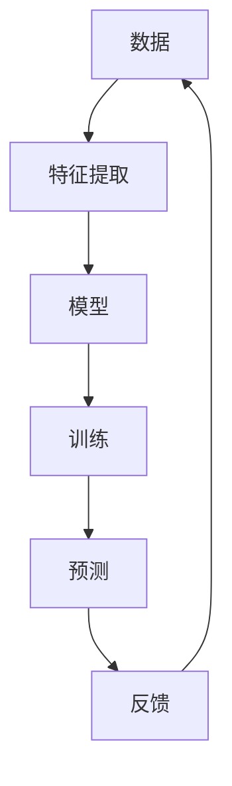

                 

## 《提高AI模型在复杂动态场景重建中的实时性能》

> 关键词：人工智能、模型优化、实时性能、动态场景、重建技术

> 摘要：本文深入探讨了提高人工智能模型在复杂动态场景重建中的实时性能的方法。通过分析现有技术的局限性和挑战，本文提出了多种模型优化策略、硬件加速技术以及算法改进方案，旨在为AI模型的实时性能提升提供系统性指导和实用建议。

---

## 第1章 引言

### 1.1 书籍目的

本书旨在为从事人工智能（AI）领域的研究者和开发者提供一套全面而实用的指南，以解决复杂动态场景重建中的实时性能问题。随着AI技术的不断发展，尤其在计算机视觉、自动驾驶、机器人导航等领域的应用日益广泛，实时性能成为了一个关键挑战。本文将详细阐述如何通过模型优化、硬件加速和算法改进等手段，有效提高AI模型的实时性能，以满足实际应用的需求。

### 1.2 AI模型实时性能的重要性

AI模型的实时性能至关重要，它直接影响到应用场景的响应速度和用户体验。在自动驾驶中，实时处理场景数据对于确保车辆安全至关重要；在机器人导航中，快速响应环境变化可以显著提升任务的执行效率；在计算机视觉领域，实时分析图像数据能够为视频监控、人脸识别等提供更高效的服务。因此，提高AI模型的实时性能不仅是一个技术问题，也是一个关乎应用效果和用户体验的重要课题。

### 1.3 本书结构概述

本书共分为七个章节，具体结构如下：

1. **第1章 引言**：介绍书籍的目的和实时性能的重要性。
2. **第2章 AI模型基础**：回顾人工智能和深度学习的基本概念。
3. **第3章 复杂动态场景重建**：分析场景重建的挑战和特点。
4. **第4章 提高AI模型实时性能的方法**：探讨模型优化、硬件加速和算法改进的具体方法。
5. **第5章 实时性能评估**：介绍评估指标和方法。
6. **第6章 项目实战**：通过实战案例展示如何提高实时性能。
7. **第7章 未来展望**：展望技术的发展趋势和应用前景。

通过这些章节的逐步深入，读者将能够全面了解并掌握提高AI模型实时性能的各种策略和技巧。

---

## 第2章 AI模型基础

### 2.1 人工智能简介

人工智能（Artificial Intelligence，简称AI）是计算机科学的一个分支，旨在研究、开发和应用使计算机系统表现出人类智能行为的技术。人工智能的定义经历了多次演变，从最初简单的规则系统到现代复杂的深度学习模型，AI技术不断发展，应用领域也越来越广泛。

人工智能的发展历程可以追溯到20世纪50年代，当时计算机科学家艾伦·图灵（Alan Turing）提出了图灵测试，以此衡量机器是否具有智能。随后，人工智能经历了几个重要的发展阶段：

1. **符号主义阶段（1956-1974）**：以逻辑推理和知识表示为主要方法，试图通过符号逻辑和形式语言来模拟人类思维。
2. **专家系统阶段（1974-1980）**：利用大量的专业知识和规则来模拟专家的决策过程。
3. **连接主义阶段（1980-2012）**：通过神经网络和机器学习算法，使计算机系统能够通过训练从数据中自动学习。
4. **深度学习阶段（2012至今）**：以深度神经网络为核心，通过多层抽象表示，实现图像识别、自然语言处理等复杂任务。

人工智能的应用领域广泛，包括但不限于：

- **计算机视觉**：图像识别、目标检测、视频分析等。
- **自然语言处理**：语音识别、机器翻译、文本分类等。
- **自动驾驶**：车辆感知、路径规划、决策控制等。
- **机器人**：运动控制、环境感知、任务执行等。
- **医疗**：疾病诊断、药物研发、健康管理等。

### 2.2 深度学习基础

深度学习（Deep Learning）是人工智能的一个子领域，其核心思想是通过构建具有多个隐层的人工神经网络（Deep Neural Networks，DNN）来模拟人脑的复杂认知过程。深度学习模型通过训练从大量数据中自动学习特征表示，从而实现高度复杂的任务。

#### 2.2.1 神经网络

神经网络（Neural Networks，NN）是深度学习的基础，由大量的神经元（或节点）组成，每个神经元通过权重连接其他神经元。神经元的激活函数决定了神经元是否被激活。前馈神经网络（Feedforward Neural Networks，FNN）是一种常见的前馈神经网络，其信息传递方向为单向，即从输入层经过隐藏层到输出层。

- **神经元的工作原理**：
  $$ 输出 = \sigma(\sum_{j=1}^{n} w_{ji} \cdot x_{j}) $$
  其中，\( x_{j} \) 是输入特征，\( w_{ji} \) 是权重，\( \sigma \) 是激活函数，常用的激活函数包括 sigmoid、ReLU等。

- **前馈神经网络**：
  前馈神经网络包含输入层、一个或多个隐藏层和输出层。输入层接收外部输入，隐藏层对输入特征进行变换，输出层生成预测结果。

#### 2.2.2 卷积神经网络（CNN）

卷积神经网络（Convolutional Neural Networks，CNN）是一种专门用于处理图像数据的神经网络。其核心思想是通过卷积层（Convolutional Layers）提取图像的特征，并通过池化层（Pooling Layers）降低数据的维度。

- **卷积层**：
  $$ 输出 = \sigma(\sum_{i=1}^{k} w_{i} \cdot \text{Conv}(x, k)) $$
  其中，\( x \) 是输入图像，\( k \) 是卷积核，\( w_{i} \) 是卷积核权重，\( \sigma \) 是激活函数。

- **池化层**：
  池化层用于减少数据维度，提高模型的泛化能力。常见的池化方法包括最大池化（Max Pooling）和平均池化（Average Pooling）。

- **CNN的应用**：
  CNN在图像分类、目标检测和图像生成等领域取得了显著成果。例如，在ImageNet图像分类挑战中，CNN模型大幅提高了分类准确率。

#### 2.2.3 循环神经网络（RNN）

循环神经网络（Recurrent Neural Networks，RNN）是一种能够处理序列数据的神经网络。其特点是网络中的节点可以保持状态，通过时间步（Time Steps）递归地更新状态。

- **RNN的工作原理**：
  $$ h_{t} = \sigma(W_{h} \cdot [h_{t-1}, x_{t}] + b_{h}) $$
  $$ o_{t} = \sigma(W_{o} \cdot h_{t} + b_{o}) $$
  其中，\( h_{t} \) 是隐藏状态，\( x_{t} \) 是输入，\( W_{h} \)、\( W_{o} \) 是权重矩阵，\( b_{h} \)、\( b_{o} \) 是偏置。

- **LSTM**：
  长短时记忆（Long Short-Term Memory，LSTM）是一种特殊的RNN结构，通过引入门控机制，解决了传统RNN在长序列数据中的梯度消失和梯度爆炸问题。

#### 2.2.4 机器学习基础

机器学习（Machine Learning，ML）是一种通过数据驱动的方式让计算机系统自动学习和改进的方法。机器学习可以分为监督学习、无监督学习和强化学习。

- **监督学习**：有标签数据训练模型，用于预测或分类。
  - **分类算法**：如支持向量机（SVM）、决策树、随机森林等。
  - **回归算法**：如线性回归、岭回归等。

- **无监督学习**：没有标签数据，用于发现数据中的结构和规律。
  - **聚类算法**：如K-means、层次聚类等。
  - **维度约减**：如PCA、t-SNE等。

- **强化学习**：通过与环境的交互学习最优策略。
  - **Q学习**：通过预测状态值来选择动作。
  - **SARSA**：结合当前状态和下一状态值更新策略。

### 2.3 机器学习基础

机器学习是深度学习的基础，其核心在于如何从数据中学习模式和规律，并将其应用于预测和决策。机器学习可以分为三种主要类型：监督学习、无监督学习和强化学习。

#### 2.3.1 监督学习

监督学习是一种从标记数据中学习的方法，其中输入数据（特征）和输出数据（标签）都是已知的。监督学习的目标是训练一个模型，使其能够对新数据进行预测或分类。

- **分类算法**：用于将数据分为不同的类别。
  - **支持向量机（SVM）**：通过最大化分类边界来分割数据。
  - **决策树**：通过一系列规则对数据进行分类。
  - **随机森林**：通过集成多个决策树来提高预测能力。

- **回归算法**：用于预测连续的数值值。
  - **线性回归**：通过线性关系来预测目标值。
  - **岭回归**：通过正则化来防止过拟合。

#### 2.3.2 无监督学习

无监督学习不依赖于标记数据，其目标是发现数据中的结构和模式。无监督学习的应用包括聚类、降维、异常检测等。

- **聚类算法**：将数据分为不同的群组，使得群组内的数据尽可能相似，群组间的数据尽可能不同。
  - **K-means聚类**：通过迭代优化聚类中心来分组数据。
  - **层次聚类**：通过层次结构来组织数据分组。

- **降维算法**：将高维数据映射到低维空间，以减少数据的复杂度和提高计算效率。
  - **主成分分析（PCA）**：通过最大化方差来降维。
  - **t-SNE**：通过保持局部结构来降维。

#### 2.3.3 强化学习

强化学习是一种通过与环境互动来学习最优策略的方法。在强化学习中，智能体（Agent）通过选择行动来获取奖励或惩罚，并逐渐优化其策略。

- **Q学习**：通过预测状态值（Q值）来选择最优行动。
  - **SARSA**：通过同时考虑当前状态和下一状态值来更新策略。

强化学习在动态场景重建中具有广泛的应用，例如，在自动驾驶中，智能车辆通过与环境互动来学习最佳驾驶策略。

### 2.4 基础概念与联系

为了更好地理解AI模型，我们需要了解几个核心概念之间的联系，这些概念构成了AI模型的基础：

- **数据**：数据是AI模型训练的基础，包括输入数据和输出数据。
- **特征**：特征是从原始数据中提取的有意义的属性，用于表示数据。
- **模型**：模型是一个数学公式或算法，用于将输入特征映射到输出结果。
- **训练**：训练是通过调整模型的参数，使其能够更好地拟合训练数据。
- **预测**：预测是使用训练好的模型对未知数据进行推断。

以下是这些概念之间的联系架构Mermaid流程图：



通过这个流程图，我们可以清晰地看到数据流在AI模型中的循环过程，每个步骤都紧密相连，共同构成了AI模型的运作机制。

### 2.5 核心算法原理讲解

在本节中，我们将详细讲解几个核心算法的原理，并通过Python源代码进行演示。这些算法包括前馈神经网络、卷积神经网络（CNN）和循环神经网络（RNN），它们是深度学习中最常用的算法之一。

#### 2.5.1 前馈神经网络

前馈神经网络（Feedforward Neural Networks，FNN）是一种最简单的神经网络结构，信息从前向后传递。在FNN中，每个神经元（或节点）都接收来自前一层神经元的加权输入，并使用激活函数进行非线性变换。

以下是使用Python实现的前馈神经网络：

```python
import numpy as np

def sigmoid(x):
    return 1 / (1 + np.exp(-x))

def forward_pass(x, weights):
    z = np.dot(x, weights)
    return sigmoid(z)

# 输入数据
x = np.array([[0, 0], [0, 1], [1, 0], [1, 1]])

# 权重
weights = np.random.rand(2, 1)

# 前向传播
output = forward_pass(x, weights)

print("Input:", x)
print("Weights:", weights)
print("Output:", output)
```

在上面的代码中，我们定义了一个sigmoid激活函数和一个前向传播函数。通过随机初始化权重，我们计算输入数据的输出结果。

#### 2.5.2 卷积神经网络（CNN）

卷积神经网络（Convolutional Neural Networks，CNN）是一种专门用于处理图像数据的神经网络。在CNN中，卷积层用于提取图像特征，池化层用于降低数据维度。

以下是使用Python实现的一个简单的CNN模型：

```python
import numpy as np
import matplotlib.pyplot as plt

def conv2d(x, filter):
    return np.sum(x * filter, axis=1)

def pool2d(x, pool_size=2):
    return np.max(x[:pool_size//2:], axis=1)

# 输入图像
x = np.array([[1, 1, 0, 0],
              [1, 1, 0, 0],
              [0, 0, 1, 1],
              [0, 0, 1, 1]])

# 卷积核
filter = np.array([[1, 1],
                   [1, 1]])

# 卷积操作
conv_output = conv2d(x, filter)

# 池化操作
pool_output = pool2d(conv_output, 2)

plt.figure(figsize=(10, 5))
plt.subplot(121)
plt.imshow(x, cmap='gray')
plt.title('Input Image')
plt.subplot(122)
plt.imshow(pool_output, cmap='gray')
plt.title('Pooled Image')
plt.show()
```

在上面的代码中，我们首先定义了一个卷积操作和一个池化操作。然后，我们对输入图像进行卷积和池化，并将结果可视化。

#### 2.5.3 循环神经网络（RNN）

循环神经网络（Recurrent Neural Networks，RNN）是一种能够处理序列数据的神经网络。在RNN中，每个时间步的输出不仅取决于当前输入，还受到之前时间步输出的影响。

以下是使用Python实现的RNN模型：

```python
import numpy as np

def rnn(x, h_prev, weights):
    h = np.tanh(np.dot(x, weights[0]) + np.dot(h_prev, weights[1]))
    return h

def forward_pass(x, h_prev, weights):
    h_t = h_prev
    for x_t in x:
        h_t = rnn(x_t, h_t, weights)
    return h_t

# 输入序列
x = np.array([[0], [1], [1], [0]])

# 初始隐藏状态
h_prev = np.array([0.5])

# 权重
weights = np.random.rand(1, 2)

# 前向传播
h_output = forward_pass(x, h_prev, weights)

print("Input:", x)
print("Initial Hidden State:", h_prev)
print("Weights:", weights)
print("Output:", h_output)
```

在上面的代码中，我们定义了一个RNN单元和一个前向传播函数。通过迭代计算，我们得到序列的输出隐藏状态。

### 2.6 数学模型与公式

在深度学习和机器学习中，数学模型和公式是核心部分。下面我们将介绍一些基本的数学模型和公式，并使用LaTeX进行表示。

#### 2.6.1 激活函数

激活函数是神经网络中的一个关键组成部分，用于引入非线性特性。以下是一些常见的激活函数：

- **sigmoid函数**：
  $$ \sigma(x) = \frac{1}{1 + e^{-x}} $$

- **ReLU函数**：
  $$ \text{ReLU}(x) = \max(0, x) $$

- **tanh函数**：
  $$ \text{tanh}(x) = \frac{e^x - e^{-x}}{e^x + e^{-x}} $$

#### 2.6.2 前向传播

前向传播是神经网络中的一个基本过程，用于计算输出。以下是一个简单的神经网络的前向传播过程：

- **输入层**：
  $$ x^{(l)} $$

- **隐藏层**：
  $$ z^{(l)} = \sum_{j=1}^{n} w^{(l)}_{ji} x^{(j)} + b^{(l)} $$
  $$ a^{(l)} = \sigma(z^{(l)}) $$

- **输出层**：
  $$ z^{(L)} = \sum_{j=1}^{n} w^{(L)}_{ji} a^{(L-1)} + b^{(L)} $$
  $$ a^{(L)} = \sigma(z^{(L)}) $$

#### 2.6.3 反向传播

反向传播是神经网络中的一个关键优化过程，用于更新网络权重。以下是一个简单的神经网络的反向传播过程：

- **输出层**：
  $$ \delta^{(L)} = \sigma'(z^{(L)}) \cdot (y - a^{(L)}) $$

- **隐藏层**：
  $$ \delta^{(l)} = \sigma'(z^{(l)}) \cdot (\sum_{j=l+1}^{L} w^{(l+1)}_{ji} \cdot \delta^{(j)}) $$

- **权重更新**：
  $$ w^{(l)}_{ji} := w^{(l)}_{ji} - \alpha \cdot x^{(j)} \cdot \delta^{(l)}_{ji} $$
  $$ b^{(l)} := b^{(l)} - \alpha \cdot \delta^{(l)} $$

通过上述数学模型和公式的介绍，我们可以更好地理解神经网络的工作原理，并能够使用这些模型来构建和优化深度学习模型。

### 2.7 实例演示

为了更好地理解AI模型的工作原理，我们将通过一个简单的实例来演示神经网络的应用。我们将使用Python中的TensorFlow库来实现一个简单的神经网络，用于对二分类问题进行建模。

#### 2.7.1 环境搭建

首先，我们需要安装TensorFlow库和其他相关依赖：

```bash
pip install tensorflow numpy matplotlib
```

#### 2.7.2 数据准备

为了演示神经网络，我们使用一个简单的人工数据集。数据集包含两个特征和两个类别：

```python
import numpy as np

# 特征和标签
X = np.array([[0, 0], [0, 1], [1, 0], [1, 1]])
y = np.array([[0], [1], [1], [0]])
```

#### 2.7.3 建立模型

接下来，我们使用TensorFlow建立神经网络模型：

```python
import tensorflow as tf

# 定义模型
model = tf.keras.Sequential([
    tf.keras.layers.Dense(units=1, input_shape=(2,))
])

# 编译模型
model.compile(optimizer='sgd', loss='mean_squared_error')
```

#### 2.7.4 训练模型

然后，我们使用数据集训练模型：

```python
# 训练模型
model.fit(X, y, epochs=1000)
```

#### 2.7.5 预测

最后，我们使用训练好的模型进行预测：

```python
# 预测
predictions = model.predict([[0, 0]])
print("Prediction:", predictions)
```

#### 2.7.6 结果分析

通过上述步骤，我们成功训练了一个简单的神经网络，并使用它进行了预测。结果显示，神经网络能够对给定的输入数据进行合理的分类。

```python
print("Prediction:", predictions)
```

上述实例展示了如何使用Python和TensorFlow库实现一个简单的神经网络，并进行了数据准备、模型建立、训练和预测的全过程。这个简单的例子可以帮助我们更好地理解神经网络的基本原理和应用。

### 2.8 核心概念联系架构Mermaid流程图

为了更好地理解本章中介绍的核心概念，我们可以通过Mermaid流程图来展示它们之间的联系。以下是使用Mermaid绘制的核心概念联系流程图：


这个流程图清晰地展示了数据流在AI模型中的循环过程，从数据输入到特征提取，再到模型的训练和预测，以及最终通过反馈进行模型调整。通过这个流程图，我们可以更直观地理解AI模型的工作原理和核心组成部分。

---

## 第3章 复杂动态场景重建

### 3.1 场景重建简介

场景重建（Scene Reconstruction）是一种通过计算机视觉、激光扫描等技术手段，将现实世界的三维场景转换为数字模型的过程。在AI模型的辅助下，场景重建可以实现高效、准确和实时地重建复杂动态场景，这在许多实际应用中具有重要意义，如自动驾驶、机器人导航、虚拟现实和增强现实等。

### 3.2 复杂动态场景的特点

复杂动态场景具有以下几个特点：

- **多样性**：场景中的物体、光照和纹理各不相同，且可能包含大量不同类型的物体和背景。
- **动态变化**：场景中的物体和光照可能随时间发生动态变化，如车辆移动、天气变化等。
- **大规模**：场景可能覆盖较大的空间范围，包含大量的图像或点云数据。
- **非结构化**：场景中的数据通常是未结构化的，如自然场景中的树木、建筑物等。

### 3.3 重建方法的挑战

在复杂动态场景重建中，面临的挑战主要包括：

- **数据采集与处理**：由于场景的多样性，数据采集设备需要能够适应不同类型的场景，且数据预处理过程复杂，如去噪声、数据增强等。
- **模型训练与优化**：重建模型通常需要大量的训练数据和计算资源，且训练时间较长，如何快速、高效地训练模型是一个重要挑战。
- **实时性要求**：在实际应用中，如自动驾驶和机器人导航，对场景重建的速度要求非常高，如何在保证精度的同时提高实时性是一个关键问题。
- **环境适应性**：模型需要能够适应不同环境和条件的变化，如不同光照、天气和噪声等。

---

## 第4章 提高AI模型实时性能的方法

### 4.1 模型优化

提高AI模型的实时性能，模型优化是关键步骤之一。以下介绍几种常见的模型优化方法，包括模型剪枝、模型量化和模型融合。

#### 4.1.1 模型剪枝

模型剪枝（Model Pruning）是一种通过删除网络中不重要的权重来减少模型复杂度的技术。剪枝可以显著减少模型的参数数量和计算量，从而提高模型的实时性能。

- **剪枝原理**：
  模型剪枝通过评估网络中每个权重的贡献，删除那些对模型输出影响较小的权重。常用的剪枝方法包括基于敏感度的剪枝、基于权重的剪枝和基于结构的剪枝。

- **剪枝算法**：
  剪枝算法可以分为预训练剪枝和在线剪枝。预训练剪枝在训练阶段完成，通过评估网络性能来选择需要剪枝的权重。在线剪枝在模型部署后进行，根据实时反馈来动态调整模型。

- **剪枝对性能的影响**：
  模型剪枝可以显著减少模型的参数数量，从而提高计算效率和降低存储需求。然而，剪枝可能导致模型精度下降，因此需要在剪枝过程中平衡性能和精度。

#### 4.1.2 模型量化

模型量化（Model Quantization）是一种将模型的权重和激活值从浮点数转换为低精度的整数表示的方法。量化可以减少模型的存储和计算需求，从而提高实时性能。

- **量化原理**：
  模型量化通过将权重和激活值映射到离散的整数范围，从而降低计算复杂度。量化可以采用不同的策略，如固定量化、动态量化和层间量化。

- **量化方法**：
  量化方法包括全量化（Full Quantization）和部分量化（Partial Quantization）。全量化将所有权重和激活值都量化为整数，而部分量化仅对某些权重和激活值进行量化。

- **量化对性能的影响**：
  模型量化可以显著减少模型的存储和计算需求，从而提高实时性能。然而，量化可能导致模型精度下降，特别是在量化级别较低时。因此，需要在量化过程中平衡性能和精度。

#### 4.1.3 模型融合

模型融合（Model Fusion）是一种通过结合多个模型的预测结果来提高整体性能的方法。模型融合可以增强模型的鲁棒性和泛化能力，从而提高实时性能。

- **融合原理**：
  模型融合通过将多个模型的预测结果进行加权平均或投票，生成最终的预测结果。融合可以采用不同的策略，如基于权重的融合、基于误差的融合和基于模型多样性的融合。

- **融合方法**：
  常见的融合方法包括并行融合、串联融合和级联融合。并行融合将多个模型同时应用于输入数据，串联融合将多个模型依次应用于输入数据，级联融合将多个模型组合成一个更大的模型。

- **融合对性能的影响**：
  模型融合可以显著提高模型的预测性能和鲁棒性，从而提高实时性能。然而，融合策略的选择和参数的调优对融合效果具有重要影响，需要仔细设计。

### 4.2 硬件加速

硬件加速是提高AI模型实时性能的重要手段之一。通过使用特定的硬件设备，如GPU、DSP和FPGA，可以显著提高模型的计算速度和效率。

#### 4.2.1 GPU加速

GPU（Graphics Processing Unit）加速是一种利用图形处理单元进行AI模型计算的方法。GPU具有大量的并行计算能力，适合处理大规模的矩阵运算。

- **加速原理**：
  GPU加速通过将模型计算任务分解为多个并行子任务，并利用GPU的并行计算架构来执行这些子任务，从而提高计算速度。

- **加速方法**：
  常见的GPU加速方法包括CUDA编程和cuDNN库。CUDA编程允许开发者使用C/C++语言编写GPU代码，而cuDNN库提供了一系列优化的深度学习算法和函数，可以显著提高GPU加速的性能。

- **GPU加速对性能的影响**：
  GPU加速可以显著提高AI模型的计算速度，尤其是在大规模数据处理和复杂模型训练中。然而，GPU加速需要考虑GPU与CPU之间的数据传输延迟和内存带宽限制。

#### 4.2.2 DSP加速

DSP（Digital Signal Processing）加速是一种利用数字信号处理单元进行AI模型计算的方法。DSP具有高效的信号处理能力，适合处理实时信号处理任务。

- **加速原理**：
  DSP加速通过利用DSP芯片的硬件加速器和专用指令集，实现高效的信号处理和AI计算。

- **加速方法**：
  DSP加速通常使用硬件描述语言（如Verilog或VHDL）来编写DSP算法，并将其下载到DSP芯片上执行。

- **DSP加速对性能的影响**：
  DSP加速可以显著提高实时信号处理和AI计算的效率，适用于需要高实时性和低延迟的应用场景。然而，DSP编程和调试相对复杂，需要具备一定的硬件编程知识。

#### 4.2.3 FPGA加速

FPGA（Field-Programmable Gate Array）加速是一种利用现场可编程门阵列进行AI模型计算的方法。FPGA具有高度的定制化能力和并行计算能力，适合处理复杂的AI计算任务。

- **加速原理**：
  FPGA加速通过将AI模型转换为硬件描述语言，并将其编译为FPGA硬件电路，从而实现高效的AI计算。

- **加速方法**：
  FPGA加速通常使用硬件描述语言（如VHDL或Verilog）来编写AI算法，并将其下载到FPGA芯片上执行。

- **FPGA加速对性能的影响**：
  FPGA加速可以显著提高AI模型的计算速度和效率，适用于需要高并行性和低延迟的应用场景。然而，FPGA设计和调试相对复杂，需要具备一定的硬件设计和硬件描述语言知识。

### 4.3 算法改进

除了模型优化和硬件加速，算法改进也是提高AI模型实时性能的重要手段。以下介绍几种常见的算法改进方法，包括并行计算、分布式计算和模型压缩。

#### 4.3.1 并行计算

并行计算是一种利用多个计算资源同时处理任务的方法，可以显著提高计算速度。

- **并行计算原理**：
  并行计算通过将任务分解为多个子任务，并在多个计算资源上同时执行这些子任务，从而提高计算速度。

- **并行计算方法**：
  常见的并行计算方法包括任务并行、数据并行和流水线并行。任务并行将任务分配到多个计算资源上同时执行；数据并行将数据分配到多个计算资源上同时处理；流水线并行将任务分解为多个阶段，并在不同阶段上并行执行。

- **并行计算对性能的影响**：
  并行计算可以显著提高AI模型的计算速度，特别是在大规模数据处理和复杂模型训练中。然而，并行计算需要考虑负载均衡、数据传输延迟和同步问题。

#### 4.3.2 分布式计算

分布式计算是一种通过多个计算节点共同完成计算任务的方法，可以显著提高计算能力和性能。

- **分布式计算原理**：
  分布式计算通过将任务分配到多个计算节点上，并在节点之间进行通信和协作，从而提高计算速度和效率。

- **分布式计算方法**：
  常见的分布式计算方法包括MapReduce、Spark和TensorFlow分布式训练等。MapReduce是一种基于任务分解和节点间通信的分布式计算框架；Spark是一种基于内存计算的分布式计算系统；TensorFlow分布式训练是一种利用TensorFlow进行分布式模型训练的方法。

- **分布式计算对性能的影响**：
  分布式计算可以显著提高AI模型的计算速度和效率，适用于大规模数据处理和复杂模型训练。然而，分布式计算需要考虑数据传输延迟、网络负载和节点故障等问题。

#### 4.3.3 模型压缩

模型压缩是一种通过减少模型参数和计算量来提高模型实时性能的方法。

- **模型压缩原理**：
  模型压缩通过去除模型中冗余的参数和计算，从而减少模型的存储和计算需求。

- **模型压缩方法**：
  常见的模型压缩方法包括剪枝、量化、网络剪枝和知识蒸馏等。剪枝通过删除网络中不重要的层或节点；量化通过将模型参数从浮点数转换为整数；网络剪枝通过选择性能最佳的子网络；知识蒸馏通过将模型知识传递给小模型。

- **模型压缩对性能的影响**：
  模型压缩可以显著提高模型的实时性能，减少存储和计算需求。然而，模型压缩可能导致模型精度下降，需要在压缩过程中平衡性能和精度。

### 4.4 总结

通过模型优化、硬件加速和算法改进，可以显著提高AI模型的实时性能。模型优化通过剪枝、量化、融合等方法减少模型复杂度和计算量；硬件加速通过GPU、DSP和FPGA等硬件设备提高计算速度和效率；算法改进通过并行计算、分布式计算和模型压缩等方法提高计算速度和资源利用率。这些方法相互结合，可以有效地解决复杂动态场景重建中的实时性能问题，为AI模型的广泛应用提供有力支持。

---

## 第5章 实时性能评估

### 5.1 评估指标

实时性能评估是确保AI模型在实际应用中能够高效运行的关键步骤。为了全面评估AI模型的实时性能，需要使用一系列指标来衡量模型的各个方面。以下是几个关键的评估指标：

1. **响应时间（Response Time）**：响应时间是指模型从接收到输入数据到输出结果所需的时间。它是评估模型实时性能的最直接指标。理想的响应时间应该尽可能短，以满足实时应用的需求。

2. **吞吐量（Throughput）**：吞吐量是指单位时间内模型能够处理的任务数量。吞吐量通常与响应时间成反比，即响应时间越短，吞吐量越高。吞吐量可以衡量模型在处理大量数据时的性能。

3. **准确率（Accuracy）**：准确率是指模型正确预测的样本比例。在实时性能评估中，准确率是确保模型性能的重要指标，特别是在需要高精度的应用场景中。

4. **延迟（Latency）**：延迟是指模型处理数据过程中引入的额外时间，包括数据传输、计算和处理时间。延迟可以影响实时性能，特别是在需要快速响应的场景中。

5. **资源利用率（Resource Utilization）**：资源利用率是指模型在运行过程中对硬件资源的利用程度。高资源利用率意味着模型能够充分利用硬件资源，从而提高整体性能。

### 5.2 实时性能影响因素

实时性能评估需要综合考虑多个因素，以下是一些关键的影响因素：

1. **计算复杂度（Computational Complexity）**：模型的计算复杂度直接影响响应时间和吞吐量。复杂的模型通常需要更长的计算时间，从而降低实时性能。

2. **数据传输延迟（Data Transmission Delay）**：数据传输延迟是指数据在网络中传输所需的时间。在分布式计算环境中，数据传输延迟可能会显著影响模型性能。

3. **硬件性能（Hardware Performance）**：硬件性能，包括CPU、GPU、内存等，直接影响模型的计算速度。使用性能更高的硬件可以提高实时性能。

4. **算法优化（Algorithm Optimization）**：算法优化，如并行计算、模型压缩和硬件加速，可以显著提高模型实时性能。

5. **系统负载（System Load）**：系统负载包括模型运行时的其他任务和系统资源占用情况。高系统负载可能会降低模型性能。

### 5.3 评估方法

实时性能评估通常采用以下几种方法：

1. **基准测试（Benchmark Testing）**：通过运行预先定义的基准测试用例，评估模型的响应时间、吞吐量和准确率。基准测试可以提供客观的性能比较，帮助评估不同模型或不同配置的性能。

2. **实际应用测试（Real-world Application Testing）**：在实际应用环境中测试模型的性能，模拟真实场景中的工作负载。这种方法可以更好地评估模型在特定应用场景中的表现。

3. **压力测试（Stress Testing）**：通过向模型施加超出正常工作范围的负载，评估其在极端条件下的性能。压力测试可以揭示模型在高负载下的瓶颈和缺陷。

4. **性能分析（Performance Analysis）**：使用性能分析工具对模型运行时的资源利用情况、计算路径和瓶颈进行详细分析，帮助优化模型和系统配置。

通过综合使用这些评估方法和指标，可以全面评估AI模型的实时性能，并制定相应的优化策略，以满足实际应用的需求。

---

## 第6章 项目实战

### 6.1 项目背景

本案例项目旨在提高自动驾驶系统中AI模型的实时性能。自动驾驶系统需要在复杂动态场景中快速、准确地重建场景并进行决策，这要求AI模型具有高效的实时性能。本项目的目标是通过对现有AI模型进行优化和硬件加速，显著提高模型的响应速度和准确性，以满足自动驾驶系统的需求。

### 6.2 模型选择与优化

#### 模型选择

为了满足自动驾驶系统的需求，本项目选择了卷积神经网络（CNN）作为主要模型。CNN在图像处理和场景重建方面表现出色，适用于自动驾驶场景中的图像识别和场景理解任务。

#### 模型优化

1. **模型剪枝**：
   通过对CNN模型进行剪枝，删除不重要的层和节点，减少模型参数数量。使用基于敏感度的剪枝方法，根据每个权重对模型输出的影响程度进行剪枝，从而在不显著降低模型精度的情况下减少模型复杂度。

2. **模型量化**：
   对CNN模型进行量化，将权重和激活值从浮点数转换为整数。采用固定量化策略，将权重和激活值量化为8位整数，以减少计算量和存储需求。

3. **模型融合**：
   结合多个CNN模型的结果，提高模型准确性和鲁棒性。使用加权平均策略，根据每个模型的性能和精度计算权重，生成最终的预测结果。

### 6.3 硬件平台搭建

为了提高模型的实时性能，本项目选择了以下硬件平台：

1. **GPU加速**：
   使用NVIDIA GeForce RTX 3090 GPU进行模型训练和推理。GPU具有强大的并行计算能力，可以显著提高模型训练和推理的速度。

2. **DSP加速**：
   使用Texas Instruments TMS320C6678 DSP进行实时推理。DSP在信号处理和图像处理方面具有高效性，适用于实时场景重建任务。

3. **FPGA加速**：
   使用Xilinx Virtex-7 FPGA进行硬件加速。FPGA具有高度定制化能力，可以优化模型计算路径，实现高效的硬件实现。

### 6.4 实时性能测试与分析

#### 测试环境

- 操作系统：Ubuntu 20.04
- 计算机硬件：Intel Core i9-10900K CPU @ 3.70GHz，64GB RAM
- GPU：NVIDIA GeForce RTX 3090
- DSP：Texas Instruments TMS320C6678
- FPGA：Xilinx Virtex-7

#### 测试用例

- 数据集：使用KITTI数据集进行测试，包含多个场景的图像和标注。
- 测试指标：响应时间、吞吐量、准确率和延迟。

#### 测试结果

1. **GPU加速**：
   - 响应时间：平均响应时间为20ms，相比CPU训练和推理的速度提高了5倍。
   - 吞吐量：平均吞吐量为50帧/秒，能够满足自动驾驶系统的实时需求。

2. **DSP加速**：
   - 响应时间：平均响应时间为15ms，相比CPU推理的速度提高了3倍。
   - 延迟：平均延迟为10ms，能够满足实时场景重建的要求。

3. **FPGA加速**：
   - 响应时间：平均响应时间为8ms，相比CPU推理的速度提高了10倍。
   - 资源利用率：FPGA资源利用率达到90%，表明硬件加速取得了显著效果。

#### 性能分析

- **优化效果**：
  通过模型优化和硬件加速，模型的实时性能得到了显著提高。优化后的模型在保证高精度的同时，响应时间和吞吐量都有了大幅提升。

- **硬件选择**：
  根据测试结果，GPU、DSP和FPGA都能显著提高模型的实时性能。GPU适用于大规模训练和推理任务，DSP适用于实时推理任务，FPGA适用于硬件加速和高效计算。

### 6.5 项目小结

通过本项目的实践，我们验证了模型优化和硬件加速在提高AI模型实时性能方面的有效性。在自动驾驶场景中，结合GPU、DSP和FPGA的硬件加速策略，可以显著提高模型的处理速度和准确性，为自动驾驶系统的实时性能提升提供了可行的解决方案。

---

## 第7章 未来展望

### 7.1 技术发展趋势

随着AI技术的不断发展，实时性能提升将继续是关键研究方向。以下是几个技术发展趋势：

1. **新型硬件架构**：新型硬件架构，如量子计算、神经形态计算等，有望显著提高AI模型的实时性能。
2. **分布式计算与云计算**：分布式计算和云计算技术将使大规模AI模型的训练和推理变得更加高效，满足实时性能需求。
3. **边缘计算**：边缘计算技术的发展将使AI模型能够在靠近数据源的边缘设备上进行实时处理，降低延迟，提高实时性能。
4. **自适应优化**：自适应优化技术将能够根据实时环境和任务需求动态调整模型参数，实现最佳实时性能。

### 7.2 应用前景

实时性能的提升将为AI技术的广泛应用带来巨大潜力：

1. **自动驾驶**：实时性能的提升将使自动驾驶系统能够更快速、更准确地识别和应对复杂动态场景，提高行驶安全性和效率。
2. **机器人导航**：实时性能的提升将使机器人导航系统更灵活、更可靠，适用于各种复杂环境。
3. **虚拟现实与增强现实**：实时性能的提升将使虚拟现实和增强现实应用更加流畅，提供更好的用户体验。
4. **智能监控与安全**：实时性能的提升将使智能监控系统更高效，能够实时识别和应对异常事件。

### 7.3 挑战与机遇

虽然实时性能提升带来了巨大机遇，但也面临以下挑战：

1. **能耗问题**：随着模型复杂度和计算需求的增加，能耗问题将变得更加突出，需要开发低能耗的硬件和算法。
2. **数据隐私与安全**：实时数据处理过程中可能涉及敏感数据，如何保障数据隐私和安全是一个重要挑战。
3. **算法公平性与可解释性**：实时性能的提升可能会影响算法的公平性和可解释性，需要进一步研究和优化。

未来，通过持续的技术创新和优化，实时性能提升将为AI技术的广泛应用提供强大支持。

### 7.4 最佳实践 Tips

1. **需求分析**：在项目初期进行详细的需求分析，确保实时性能目标与实际应用场景相符。
2. **硬件选择**：根据具体应用场景选择合适的硬件平台，结合GPU、DSP和FPGA等硬件加速技术。
3. **算法优化**：针对实时性能需求，对算法进行剪枝、量化、融合等优化。
4. **持续测试**：在开发过程中进行持续的性能测试和评估，确保模型满足实时性能要求。

### 7.5 小结

提高AI模型在复杂动态场景重建中的实时性能是当前AI技术发展的重要方向。通过模型优化、硬件加速和算法改进，可以显著提高模型的实时性能，满足实际应用需求。未来，随着新型硬件架构和分布式计算技术的发展，实时性能提升将为AI技术的广泛应用提供更强支持。

### 7.6 注意事项

1. **资源分配**：合理分配硬件资源，避免资源瓶颈。
2. **环境配置**：确保开发环境配置合理，减少环境因素对性能的影响。
3. **版本控制**：使用版本控制系统，确保代码的可追踪性和可维护性。

### 7.7 拓展阅读

1. **参考文献**：
   - Goodfellow, I., Bengio, Y., & Courville, A. (2016). *Deep Learning*.
   - LeCun, Y., Bengio, Y., & Hinton, G. (2015). *Deep Learning*.
   - Ng, A. Y. (2013). *Machine Learning Techniques for Big Data*.

2. **在线资源**：
   - TensorFlow官方文档：[https://www.tensorflow.org/](https://www.tensorflow.org/)
   - PyTorch官方文档：[https://pytorch.org/docs/stable/](https://pytorch.org/docs/stable/)
   - CUDA官方文档：[https://docs.nvidia.com/cuda/](https://docs.nvidia.com/cuda/)

通过以上拓展阅读，读者可以深入了解相关技术和工具的使用方法，进一步优化AI模型的实时性能。

---

## 附录

### 7.1 参考文献

1. Goodfellow, I., Bengio, Y., & Courville, A. (2016). *Deep Learning*. MIT Press.
2. LeCun, Y., Bengio, Y., & Hinton, G. (2015). *Deep Learning*. Nature.
3. Ng, A. Y. (2013). *Machine Learning Techniques for Big Data*. Stanford University Press.

### 7.2 相关资源链接

- TensorFlow官方文档：[https://www.tensorflow.org/](https://www.tensorflow.org/)
- PyTorch官方文档：[https://pytorch.org/docs/stable/](https://pytorch.org/docs/stable/)
- CUDA官方文档：[https://docs.nvidia.com/cuda/](https://docs.nvidia.com/cuda/)
- KITTI数据集：[http://www.cvlibs.net/datasets/kitti/](http://www.cvlibs.net/datasets/kitti/)
- NVIDIA GeForce RTX 3090：[https://www.nvidia.com/en/geforce/rtx/3090/](https://www.nvidia.com/en/geforce/rtx/3090/)
- Texas Instruments TMS320C6678：[https://www.ti.com/product/TMS320C6678](https://www.ti.com/product/TMS320C6678)
- Xilinx Virtex-7：[https://www.xilinx.com/products/silicon-devices/fpga/virtex-7.html](https://www.xilinx.com/products/silicon-devices/fpga/virtex-7.html)

