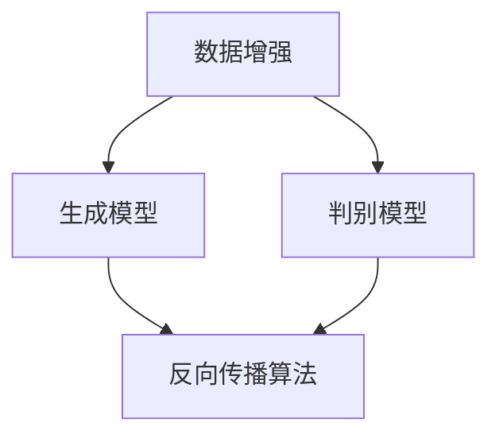

                 

### 提高AI模型在复杂图像生成任务中的质量

在人工智能领域，图像生成是一个极具挑战性的任务，它不仅要求模型能够捕捉图像的复杂结构，还要求生成图像在视觉上具有高度的真实感。随着深度学习技术的不断发展，生成对抗网络（GAN）和变分自编码器（VAE）等生成模型已经在复杂图像生成任务中取得了显著成果。然而，如何进一步提高这些模型在复杂图像生成任务中的质量，仍是一个亟待解决的问题。

关键词：复杂图像生成、AI模型、GAN、VAE、图像质量提升

**摘要**：
本文将从背景与基础、核心算法原理讲解、数学模型与公式、项目实战、提高图像生成质量的策略以及总结与展望六个部分，系统性地探讨如何提高AI模型在复杂图像生成任务中的质量。首先，我们将回顾复杂图像生成任务的发展历程和核心概念，接着深入讲解GAN、VAE和其他相关算法的原理，并通过Python代码示例进行阐述。随后，我们将介绍GAN、VAE和C-GAN的数学模型，并在实际项目中应用这些算法。最后，我们将总结提高图像生成质量的策略，并提出未来研究的方向和应用领域的扩展。

## 第一部分：背景与基础

### 1.1 复杂图像生成任务概述

复杂图像生成任务指的是利用人工智能技术生成具有高度复杂结构和视觉真实感的图像。这类任务广泛应用于计算机视觉、虚拟现实、游戏开发、艺术创作等领域。复杂图像生成不仅要求模型能够捕捉图像的细节和纹理，还需要在图像的整体结构上保持一致性。

应用场景包括：

1. **虚拟现实**：生成高度真实的虚拟环境，提高用户体验。
2. **游戏开发**：生成丰富且具有个性化的游戏场景和角色，提高游戏的可玩性。
3. **艺术创作**：利用生成模型创作新的艺术作品，拓宽艺术创作的边界。
4. **医疗影像**：生成辅助诊断的医学影像，提高诊断准确率。
5. **动漫制作**：生成高质量的角色和场景动画，提高动漫的制作效率。

### 1.2 AI模型在图像生成中的发展历程

1. **早期的图像生成方法**：
   - **随机噪声**：通过生成随机噪声来生成图像，这种方法生成的图像往往缺乏结构性和细节。
   - **迭代法**：如线性迭代法，通过迭代的方式逐渐逼近目标图像，但效率较低。

2. **卷积神经网络（CNN）的应用**：
   - CNN的出现使得图像生成任务取得了显著进展。通过卷积层、池化层和全连接层的组合，CNN能够提取图像中的特征并生成新的图像。

3. **生成对抗网络（GAN）的兴起**：
   - GAN由生成器和判别器组成，通过竞争对抗的方式，生成器不断生成越来越真实的图像，而判别器则不断判断图像的真实性。GAN在图像生成任务中取得了革命性的成果。

4. **其他类型的生成模型**：
   - **变分自编码器（VAE）**：通过引入隐变量，VAE能够在生成图像时保持一定的概率分布。
   - **输出层感知器（OCP）**：OCP通过调节输出层的权重来生成图像，但效果不如GAN和VAE。

### 1.3 图像生成中的核心概念与联系

1. **数据增强**：
   - 数据增强是通过变换和扩充原始数据集，以提高模型的泛化能力和鲁棒性。常见的数据增强方法包括旋转、翻转、缩放、裁剪等。

2. **生成模型与判别模型**：
   - 生成模型如GAN和VAE负责生成新的图像，而判别模型则负责判断图像的真实性。二者在训练过程中相互竞争，共同提高生成图像的质量。

3. **反向传播算法**：
   - 反向传播算法是神经网络训练的核心，通过梯度下降法优化模型参数，使生成图像更接近真实图像。

4. **Mermaid流程图展示核心概念之间的关系**：

通过Mermaid流程图，我们可以清晰地看到数据增强、生成模型、判别模型和反向传播算法之间的联系。这些核心概念共同构成了复杂图像生成任务的理论基础。

在下一部分，我们将深入探讨GAN的原理，并逐步讲解其他图像生成算法的原理和实现。请继续阅读。

