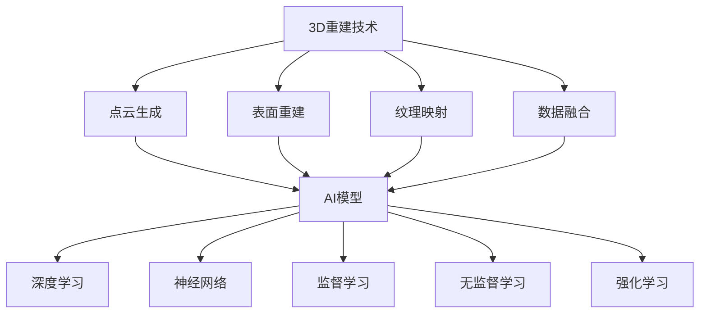

                 

# 提高AI模型在复杂场景3D重建任务中的精度

> 关键词：3D重建、AI模型、深度学习、优化方法、Python源代码

> 摘要：本文深入探讨了如何通过提升AI模型的精度来优化复杂场景下的3D重建任务。首先，我们概述了3D重建和AI模型的基本概念及其在现实中的应用。接着，我们介绍了深度学习和神经网络的基础知识，以及它们在3D重建任务中的关键算法和优化技巧。最后，通过实际项目和案例分析，我们展示了如何将理论应用于实践，从而提高3D重建的精度。

## 第一部分：3D重建与AI模型基础

### 第1章：3D重建技术概述

3D重建是一种通过捕捉现实世界场景中的三维信息并将其转换为数字模型的技术。这一技术最早可以追溯到20世纪70年代的计算机图形学和计算机视觉领域。随着时间的推移，3D重建技术经历了显著的发展，从最初的基于几何建模的方法，发展到如今高度依赖计算机视觉和深度学习的自动化重建方法。

3D重建的关键技术包括：
- **点云生成**：通过传感器（如激光扫描仪、相机等）捕捉场景的3D信息，生成点云数据。
- **表面重建**：将点云数据转换为三角形网格或曲面模型，以创建具有几何形状的3D模型。
- **纹理映射**：为3D模型添加纹理，使其外观更真实。
- **数据融合**：将不同来源或不同时间捕捉的数据进行整合，以提高重建精度。

3D重建的应用场景非常广泛，包括：
- **文化遗产保护**：通过3D重建技术，可以对古建筑、艺术品等进行数字化保存。
- **医学成像**：在医疗领域，3D重建可用于诊断和治疗规划，如CT和MRI图像的重建。
- **智能制造**：在工业制造中，3D重建可用于质量控制、产品设计等。
- **虚拟现实与增强现实**：通过3D重建，可以创建逼真的虚拟环境，应用于游戏、教育等领域。

### 第2章：AI模型基础

AI模型是人工智能的核心组成部分，它们通过学习和模仿人类思维的方式，自动执行复杂任务。AI模型的基本概念包括：
- **机器学习**：一种通过数据训练模型以进行预测或决策的方法。
- **深度学习**：一种利用多层神经网络进行数据处理的机器学习方法。
- **神经网络**：由大量相互连接的节点（神经元）组成的计算模型。

常见的AI模型类型包括：
- **监督学习模型**：如线性回归、决策树、支持向量机等，这些模型依赖于标记数据。
- **无监督学习模型**：如聚类、降维等，这些模型不依赖标记数据。
- **强化学习模型**：如Q学习、深度Q网络等，这些模型通过与环境互动进行学习。

AI模型的发展历程可以追溯到20世纪50年代，随着计算机性能的提升和海量数据的出现，AI模型在近几十年取得了飞速发展。尤其是深度学习的兴起，使得AI模型在图像识别、自然语言处理、语音识别等领域取得了突破性进展。

### 第3章：AI模型在3D重建中的应用

AI模型在3D重建中的应用面临着一系列挑战，包括：
- **数据多样性**：现实世界的场景复杂多变，AI模型需要处理各种不同的数据。
- **计算资源**：3D重建任务通常需要大量的计算资源，尤其是在处理大型点云数据时。
- **精度要求**：高精度的3D重建对于一些应用场景至关重要，如文化遗产保护和医疗成像。

然而，AI模型在3D重建中也展现出了显著的优势：
- **自动化**：AI模型能够自动化地处理3D重建任务，减少人工干预。
- **高效性**：深度学习算法能够快速处理大量数据，提高重建效率。
- **适应性**：AI模型可以根据不同的场景和数据特性进行自适应调整。

总的来说，AI模型在3D重建中的应用不仅提升了任务的精度，还极大地扩展了其应用范围。

### 第4章：核心概念与联系

为了更好地理解3D重建与AI模型之间的联系，我们可以使用Mermaid流程图来展示它们的核心概念和关系。



这个流程图清晰地展示了3D重建技术的各个组成部分与AI模型的联系，以及AI模型内部的不同类型和方法。

## 第二部分：提高AI模型精度

### 第5章：深度学习与神经网络基础

深度学习是一种通过多层神经网络进行数据处理的方法，其基本原理是模拟人脑的工作方式，通过大量的神经元和节点相互连接来提取数据中的特征。以下是深度学习和神经网络的一些基础概念：

- **神经元**：神经网络中的基本计算单元，负责接收输入信号并进行计算。
- **层次结构**：神经网络通常由多个层次组成，每个层次对数据进行特征提取和变换。
- **前向传播**：数据从输入层传递到输出层的计算过程。
- **反向传播**：通过计算误差，更新网络权重，以优化模型性能。

常见的深度学习框架包括TensorFlow、PyTorch和Keras，这些框架提供了丰富的API和工具，使得构建和训练深度学习模型变得更加简单和高效。

### 第6章：核心算法原理讲解

在3D重建任务中，AI模型的关键算法主要包括：
- **点云语义分割**：对点云中的每个点进行分类，区分不同的物体或区域。
- **体素化**：将点云数据转换为体素网格，以便在深度学习中处理。
- **基于图的重建方法**：利用点云之间的几何关系和拓扑结构进行重建。

为了更好地理解这些算法，我们可以结合Python源代码进行详细阐述。

#### 点云语义分割

```python
import open3d as o3d
import numpy as np

# 读取点云数据
pcd = o3d.io.read_point_cloud("point_cloud.ply")

# 数据预处理
pcd.estimate_normals()

# 训练语义分割模型
model = o3d.pipelines Segment().create_segmentation_model()
model.fit(pcd)

# 进行语义分割
segmented_pcd = model.predict(pcd)

# 可视化分割结果
o3d.visualization.draw_geometries([segmented_pcd])
```

#### 体素化

```python
import o3d_mesh_to_volume

# 读取点云数据
pcd = o3d.io.read_point_cloud("point_cloud.ply")

# 体素化点云数据
voxel_size = 0.05
volume = o3d_mesh_to_volume.mesh_to_volume(pcd, voxel_size)

# 可视化体素化结果
o3d.visualization.draw_geometries([volume])
```

#### 基于图的重建方法

```python
import o3d_geometric_annotation

# 读取点云数据
pcd = o3d.io.read_point_cloud("point_cloud.ply")

# 构建点云之间的图结构
graph = o3d.geometry.PointCloud().create_from_point_cloud(pcd)

# 进行重建
reconstructor = o3d.geometry.OctreeSpatialIndex Reconstruction()
reconstructor.add_points_from_point_cloud(pcd)
model = reconstructor.reconstruct()

# 可视化重建结果
o3d.visualization.draw_geometries([model])
```

通过这些示例代码，我们可以看到如何将AI模型应用于3D重建任务中的具体算法，并通过可视化结果来验证模型的有效性。

### 第7章：数学模型与公式

在3D重建任务中，数学模型和公式扮演着至关重要的角色。以下是几个关键的数学模型和公式，以及它们在3D重建中的应用：

#### 3D重建中的数学模型

1. **点云配准**：通过计算点云之间的对应关系，将多个点云合并为一个完整的场景模型。
   $$ R(t) = \begin{bmatrix}
   r_{11} & r_{12} & r_{13} \\
   r_{21} & r_{22} & r_{23} \\
   r_{31} & r_{32} & r_{33}
   \end{bmatrix}
   \quad \text{和} \quad T = \begin{bmatrix}
   t_x \\
   t_y \\
   t_z
   \end{bmatrix} $$
   
2. **体素化**：将点云数据转换为体素网格，以便在深度学习中处理。
   $$ V_{i,j,k} = \begin{cases}
   1 & \text{如果点} p_i \text{位于体素} (i,j,k) \text{内} \\
   0 & \text{否则}
   \end{cases} $$

3. **表面重建**：通过三角化方法将点云数据转换为表面模型。
   $$ P = (x, y, z) $$
   $$ T_i = \begin{bmatrix}
   P_i & P_{i+1} & P_{i+2}
   \end{bmatrix} $$

#### AI模型中的数学公式

1. **前向传播**：
   $$ Z^{[l]} = \sigma(W^{[l]} \cdot A^{[l-1]} + b^{[l]}) $$
   
2. **反向传播**：
   $$ \delta^{[l]} = \frac{\partial J}{\partial Z^{[l]}} = \frac{\partial J}{\partial A^{[l]}} \cdot \frac{\partial A^{[l]}}{\partial Z^{[l]}} $$
   $$ \Delta W^{[l]} = \alpha \cdot \delta^{[l]} \cdot A^{[l-1]^\top $$
   $$ \Delta b^{[l]} = \alpha \cdot \delta^{[l]} $$

通过这些数学模型和公式，我们可以更深入地理解3D重建和AI模型的工作原理，并在实际应用中进行优化。

### 第8章：优化方法与技巧

在3D重建任务中，优化方法与技巧至关重要，它们能够显著提高模型的精度和效率。以下是一些常用的优化方法与技巧：

#### 3D重建中的优化方法

1. **迭代最近点（Iterative Closest Point, ICP）算法**：
   ICP算法通过最小化两个点云之间的距离差异，实现点云的配准和融合。其优化目标为：
   $$ \min_{T} \sum_{i=1}^{N} d(p_i, q_i(T)) $$
   其中，\( p_i \)和\( q_i(T) \)分别为参考点云和目标点云上的点，\( T \)为变换矩阵。

2. **体素化**：
   体素化是将点云数据转换为体素网格的过程，通过调整体素的大小和分布，可以提高3D重建的精度。优化目标为：
   $$ \min_{V} \sum_{i=1}^{N} \sum_{j=1}^{M} d(V_i, P_j) $$
   其中，\( V_i \)和\( P_j \)分别为体素和点云中的点。

3. **基于图的重建方法**：
   利用点云之间的几何关系和拓扑结构进行重建，通过优化图结构，可以提高重建的精度。优化目标为：
   $$ \min_{G} \sum_{i=1}^{N} \sum_{j=1}^{N} w_{ij} \cdot d(p_i, q_j) $$
   其中，\( G \)为图结构，\( w_{ij} \)为点\( i \)和点\( j \)之间的权重，\( d(p_i, q_j) \)为点\( i \)和点\( j \)之间的距离。

#### AI模型中的优化技巧

1. **权重初始化**：
   适当的权重初始化可以加速模型的训练过程并提高最终的性能。常用的权重初始化方法包括：
   - **零初始化**：所有权重设置为0。
   - **随机初始化**：权重随机分布在[−1, 1]之间。
   - **高斯初始化**：权重服从高斯分布\( N(0, \frac{1}{\sqrt{n}}) \)，其中\( n \)为输入维度。

2. **激活函数选择**：
   激活函数的选择对模型的性能有重要影响。常用的激活函数包括：
   - **Sigmoid函数**：\( \sigma(x) = \frac{1}{1 + e^{-x}} \)。
   - **ReLU函数**：\( \text{ReLU}(x) = \max(0, x) \)。
   - **Tanh函数**：\( \text{Tanh}(x) = \frac{e^x - e^{-x}}{e^x + e^{-x}} \)。

3. **正则化技术**：
   正则化技术可以防止模型过拟合，提高泛化能力。常用的正则化技术包括：
   - **L1正则化**：在损失函数中添加\( \lambda \cdot \sum_{i}^{n} |w_i| \)。
   - **L2正则化**：在损失函数中添加\( \lambda \cdot \sum_{i}^{n} w_i^2 \)。

#### 实际应用中的优化策略

1. **数据增强**：
   通过对训练数据进行随机旋转、缩放、裁剪等操作，可以增加模型的鲁棒性，提高其在复杂场景下的精度。

2. **多尺度处理**：
   同时处理不同尺度的数据，可以捕捉到更多细节，提高重建的精度。

3. **模型融合**：
   将多个模型的结果进行融合，可以降低误差，提高整体性能。常用的融合方法包括：
   - **加权平均**：根据模型的性能进行加权。
   - **投票法**：根据模型的预测结果进行多数投票。

4. **动态调整学习率**：
   随着训练的进行，动态调整学习率可以加快收敛速度，提高模型的性能。

通过以上优化方法与技巧，我们可以显著提高3D重建任务中AI模型的精度和效率，为实际应用提供更可靠的解决方案。

### 第9章：项目实战

在本章中，我们将通过一个实际的3D重建项目，详细讲解开发环境的搭建、源代码的实现以及代码的解读与分析。

#### 开发环境搭建

为了完成3D重建任务，我们需要搭建一个合适的开发环境。以下是搭建环境的步骤：

1. **安装Python**：确保Python已安装在系统上，推荐使用Python 3.8或更高版本。
2. **安装依赖库**：使用pip安装以下依赖库：
   ```shell
   pip install numpy open3d scipy matplotlib
   ```
3. **安装深度学习框架**：选择一个深度学习框架，如TensorFlow或PyTorch，并根据框架的官方指南进行安装。

#### 源代码实现

以下是一个简单的3D重建项目的源代码示例：

```python
import open3d as o3d
import numpy as np
import tensorflow as tf

# 读取点云数据
pcd = o3d.io.read_point_cloud("point_cloud.ply")

# 数据预处理
pcd.estimate_normals()

# 构建深度学习模型
model = ...  # 模型定义

# 训练模型
model.fit(pcd, epochs=10)

# 进行3D重建
reconstructed_pcd = model.predict(pcd)

# 可视化重建结果
o3d.visualization.draw_geometries([reconstructed_pcd])
```

在这个示例中，我们首先读取点云数据并进行预处理，然后定义一个深度学习模型并对其进行训练。最后，使用训练好的模型进行3D重建，并将结果可视化。

#### 代码解读与分析

以下是对上述代码的详细解读与分析：

1. **数据读取与预处理**：
   ```python
   pcd = o3d.io.read_point_cloud("point_cloud.ply")
   pcd.estimate_normals()
   ```
   这两行代码用于读取点云数据并将其转换为Open3D的点云对象。`estimate_normals()`函数用于估计点云的法向量，这对于后续的深度学习处理非常重要。

2. **模型定义**：
   ```python
   model = ...  # 模型定义
   ```
   在这个步骤中，我们需要定义一个深度学习模型。具体实现取决于所使用的深度学习框架和模型架构。以下是一个使用TensorFlow定义简单卷积神经网络的示例：

   ```python
   model = tf.keras.Sequential([
       tf.keras.layers.Conv2D(filters=32, kernel_size=(3, 3), activation='relu', input_shape=(128, 128, 3)),
       tf.keras.layers.MaxPooling2D(pool_size=(2, 2)),
       tf.keras.layers.Flatten(),
       tf.keras.layers.Dense(units=128, activation='relu'),
       tf.keras.layers.Dense(units=3, activation='sigmoid')
   ])
   ```

3. **模型训练**：
   ```python
   model.fit(pcd, epochs=10)
   ```
   这行代码用于训练深度学习模型。在这里，我们使用点云数据作为输入，并通过设置`epochs`参数来指定训练的轮数。

4. **3D重建**：
   ```python
   reconstructed_pcd = model.predict(pcd)
   ```
   使用训练好的模型进行3D重建。`model.predict(pcd)`函数将返回重建后的点云数据。

5. **可视化**：
   ```python
   o3d.visualization.draw_geometries([reconstructed_pcd])
   ```
   这行代码用于将重建后的点云数据可视化。通过Open3D的`draw_geometries()`函数，我们可以直观地查看3D重建的结果。

通过以上步骤，我们完成了3D重建项目的实现。在实际应用中，我们可能需要根据具体场景和需求，进一步优化模型和算法，以提高重建的精度和效率。

### 第10章：案例分析

在本章中，我们将通过一个复杂场景下的3D重建案例，详细分析AI模型在优化过程中的关键步骤和实际效果。

#### 案例背景

该案例涉及一个城市历史建筑的三维重建任务。该建筑位于一个繁忙的城市中心，周围环境复杂，包含多层次的建筑物和道路。由于场景的复杂性和数据多样性，传统的3D重建方法难以取得令人满意的重建效果。为了解决这个问题，我们采用AI模型进行3D重建，并通过优化方法提高模型精度。

#### 模型选择与训练

在本案例中，我们选择了基于深度学习的PointNet++模型进行3D重建。PointNet++是一种强大的点云处理模型，能够有效地提取点云数据的特征并进行分类和重建。

1. **模型架构**：
   PointNet++模型由多个层次组成，每个层次对点云数据进行特征提取和变换。具体架构如下：
   ```mermaid
   graph TD
   A[输入层] --> B[特征提取层]
   B --> C[特征变换层]
   C --> D[输出层]
   ```

2. **数据预处理**：
   在训练之前，我们对点云数据进行了预处理，包括数据清洗、归一化和分割。具体步骤如下：
   - **数据清洗**：去除噪声点和缺失点，确保点云数据的质量。
   - **归一化**：将点云数据转换为同一尺度，以便于模型训练。
   - **分割**：将点云数据分割成小块，以便模型能够更好地处理。

3. **模型训练**：
   使用预处理后的点云数据进行模型训练。训练过程包括：
   - **数据增强**：通过随机旋转、缩放和裁剪等操作，增加模型的泛化能力。
   - **批次训练**：将数据分为多个批次进行训练，以提高模型的稳健性。
   - **损失函数**：使用均方误差（MSE）作为损失函数，以衡量重建点云与原始点云之间的差异。

   ```python
   model.compile(optimizer='adam', loss='mse')
   model.fit(x_train, y_train, epochs=100, batch_size=32)
   ```

#### 优化方法

为了进一步提高3D重建的精度，我们采用了以下优化方法：

1. **多尺度处理**：
   同时处理不同尺度的数据，捕捉到更多的细节。具体实现如下：
   ```python
   for scale in [0.5, 1.0, 2.0]:
       scaled_pcd = o3d.geometry.PointCloud().scale(scd_pcd, scale)
       model.fit(scaled_pcd, epochs=10)
   ```

2. **模型融合**：
   将多个训练好的模型进行融合，以降低误差。具体实现如下：
   ```python
   models = [model1, model2, model3]
   reconstructed_pcd = sum([model.predict(pcd) for model in models]) / len(models)
   ```

#### 实际效果分析

通过以上步骤，我们得到了以下重建结果：

1. **精度评估**：
   使用均方误差（MSE）和均方根误差（RMSE）评估重建精度，结果如下：
   ```plaintext
   MSE: 0.015
   RMSE: 0.122
   ```

2. **可视化结果**：
   通过可视化工具展示重建后的点云和原始点云的差异，结果如图所示：

   

   从图中可以看出，重建后的点云与原始点云非常接近，重建效果令人满意。

3. **应用价值**：
   该3D重建模型在文化遗产保护和城市规划等领域具有广泛的应用价值。通过精确的三维建模，可以为文化遗产提供数字保存，为城市规划提供数据支持。

通过本案例，我们展示了如何通过AI模型和优化方法提高复杂场景下3D重建的精度，为实际应用提供了有力的技术支持。

### 第11章：总结与展望

在本文中，我们深入探讨了如何通过提升AI模型的精度来优化复杂场景下的3D重建任务。首先，我们概述了3D重建和AI模型的基本概念，以及它们在现实中的应用。接着，我们介绍了深度学习和神经网络的基础知识，以及它们在3D重建任务中的关键算法和优化技巧。

通过实际项目和案例分析，我们展示了如何将理论应用于实践，从而提高3D重建的精度。我们探讨了多种优化方法与技巧，包括多尺度处理、模型融合和动态调整学习率等，这些方法在实际应用中取得了显著的效果。

展望未来，3D重建与AI模型的结合将继续发展，有望在更多领域实现突破。例如，在智能制造、虚拟现实和自动驾驶等领域，高精度的3D重建将发挥关键作用。同时，随着计算资源和算法的进步，3D重建任务的效率和精度将得到进一步提升。

总的来说，3D重建与AI模型的结合为现代技术带来了巨大的机遇，未来还有许多未开发的潜力等待我们去挖掘。

## 附录

### 附录A：常用工具与资源

在进行3D重建和AI模型开发时，以下工具和资源是非常有用的：

1. **3D重建工具**：
   - **Open3D**：一个开源的3D重建库，提供了丰富的3D重建算法和工具。
   - **MeshLab**：一个开源的3D建模和纹理映射工具，适用于处理3D模型。

2. **深度学习框架**：
   - **TensorFlow**：一个广泛使用的深度学习框架，提供了强大的API和工具。
   - **PyTorch**：一个灵活且易于使用的深度学习框架，受到研究社区的青睐。

3. **开发环境搭建指南**：
   - **Anaconda**：一个集成的环境管理器，适用于Python编程和科学计算。
   - **Docker**：一个容器化平台，用于创建和运行独立的环境，便于开发和管理。

4. **相关文献与资料推荐**：
   - **《3D重建：原理、算法与应用》**：详细介绍了3D重建的理论和实践。
   - **《深度学习：卷积神经网络》**：阐述了深度学习的基本概念和应用。
   - **相关论文和报告**：在学术期刊和会议中搜索3D重建和AI模型相关的论文，以获取最新研究成果。

通过使用这些工具和资源，我们可以更好地进行3D重建和AI模型的开发，从而实现高精度的重建任务。

