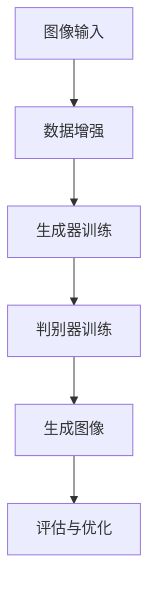

                 

# 《提高AI模型在复杂场景图像生成任务中的语义一致性》

> 关键词：人工智能、图像生成、语义一致性、深度学习、GAN、复杂场景

> 摘要：本文旨在探讨如何提高人工智能模型在复杂场景图像生成任务中的语义一致性。通过分析现有研究，本文提出了几种有效的算法和方法，并提供了详细的数学模型和Python代码示例，以帮助读者更好地理解这些方法在实际应用中的实现和效果。

## 引言

### 1.1 研究背景

图像生成作为人工智能领域的一个重要分支，近年来得到了广泛关注。随着深度学习技术的发展，特别是生成对抗网络（GAN）的出现，图像生成模型的性能得到了显著提升。然而，在复杂场景下，如何保证生成的图像具有高语义一致性仍然是一个挑战。

复杂场景图像生成任务涉及到的挑战包括：

- **数据分布不均**：复杂场景中的图像数据通常分布不均，导致模型难以泛化。
- **难以匹配的图像风格**：复杂场景下的图像风格多样，使得模型难以学习到统一的特征表示。
- **非线性关系**：图像中的元素往往具有复杂的非线性关系，这增加了图像生成的难度。

### 1.2 研究目的

本文的研究目的在于：

- **分析复杂场景图像生成任务的现状**：梳理现有研究和方法的优缺点，找出亟待解决的问题。
- **探索提高语义一致性的方法**：提出有效的算法和策略，以提升图像生成任务的语义一致性。

### 1.3 结构安排

本文将分为以下几个部分：

- 第2章：介绍相关理论基础，包括AI模型基础、语义一致性概念和图像语义理解。
- 第3章：讲解核心算法原理，包括深度学习算法基础和具体提高语义一致性的方法。
- 第4章：介绍数学模型和公式。
- 第5章：通过项目实战展示算法的实际应用。
- 第6章：分析复杂场景图像生成任务中的挑战与对策。
- 第7章：总结与展望未来发展方向。

## 第2章 相关理论基础

### 2.1 AI模型基础

#### 2.1.1 传统图像处理方法

传统图像处理方法主要包括滤波、边缘检测、特征提取等。这些方法对图像进行预处理，以提取有用的信息。

#### 2.1.2 卷积神经网络（CNN）

卷积神经网络是深度学习的一种形式，特别适合处理图像数据。它通过卷积层、池化层等结构，自动提取图像特征，实现图像分类、识别等任务。

#### 2.1.3 生成对抗网络（GAN）

生成对抗网络由生成器和判别器两部分组成。生成器尝试生成逼真的图像，而判别器则判断图像是真实图像还是生成图像。通过两者之间的对抗训练，生成器逐渐提高生成图像的质量。

### 2.2 语义一致性概念

#### 2.2.1 语义一致性定义

语义一致性指的是生成的图像在语义上与原始图像保持一致。具体来说，包括：

- **对象一致性**：生成的图像中对象的位置、大小、形状等与原始图像一致。
- **内容一致性**：生成的图像包含与原始图像相同的内容和场景。

#### 2.2.2 语义一致性的重要性

语义一致性对于图像生成任务至关重要。它不仅影响图像的质量，还决定了图像的应用价值。例如，在图像识别、图像分割等任务中，高语义一致性的图像生成模型能够更好地完成任务。

#### 2.2.3 语义一致性与图像生成

在图像生成任务中，语义一致性是评估模型性能的重要指标。通过提高语义一致性，可以提升模型在实际应用中的效果。

### 2.3 图像语义理解

#### 2.3.1 图像语义分割

图像语义分割是将图像分为多个语义区域，每个区域代表不同的对象或场景。这是图像生成任务中重要的预处理步骤。

#### 2.3.2 图像识别与分类

图像识别与分类是将图像归类到特定的类别。这对于图像生成任务的后续处理至关重要。

#### 2.3.3 图像描述生成

图像描述生成是根据图像内容生成相应的文本描述。这有助于提高图像生成的语义一致性。

## 第3章 核心算法原理讲解

### 3.1 深度学习算法基础

#### 3.1.1 深度学习基础

深度学习是一种通过多层神经网络进行特征提取和模型训练的方法。它通过多次神经网络层叠加，自动学习数据的复杂结构。

#### 3.1.2 卷积神经网络（CNN）

卷积神经网络是一种特别适合图像处理的深度学习模型。它通过卷积操作自动提取图像特征，实现图像分类、识别等任务。

#### 3.1.3 循环神经网络（RNN）

循环神经网络是一种处理序列数据的神经网络。它在图像生成任务中用于处理图像序列，提高图像的连贯性和语义一致性。

#### 3.1.4 生成对抗网络（GAN）

生成对抗网络由生成器和判别器两部分组成。生成器尝试生成逼真的图像，而判别器则判断图像是真实图像还是生成图像。通过两者之间的对抗训练，生成器逐渐提高生成图像的质量。

### 3.2 提高语义一致性的方法

#### 3.2.1 数据增强

数据增强是提高模型泛化能力的重要手段。通过增加训练数据集的多样性，可以提升模型在复杂场景下的语义一致性。

#### 3.2.2 对抗性训练

对抗性训练是GAN的核心训练策略。通过生成器和判别器之间的对抗训练，生成器逐渐生成更加逼真的图像，从而提高语义一致性。

#### 3.2.3 跨模态学习

跨模态学习是通过将不同模态的数据（如图像和文本）进行联合训练，提高模型对语义的一致性理解。

#### 3.2.4 图像语义空间嵌入

图像语义空间嵌入是将图像嵌入到一个高维空间中，使得具有相同语义的图像在空间中更接近。这有助于提高模型对语义一致性的理解。

## 第4章 数学模型和公式

### 4.1 深度学习数学基础

#### 4.1.1 激活函数

激活函数是神经网络中用于引入非线性性的函数。常用的激活函数包括ReLU、Sigmoid和Tanh等。

#### 4.1.2 损失函数

损失函数是评估模型预测结果与真实值之间差异的函数。常见的损失函数包括均方误差（MSE）、交叉熵损失等。

#### 4.1.3 优化算法

优化算法是用于最小化损失函数的算法。常见的优化算法包括梯度下降、Adam等。

### 4.2 生成对抗网络（GAN）公式

#### 4.2.1 判别器D的损失函数

$$
L(D) = -\sum_{x,y} [y \cdot \log(D(x,y))] - [1-y \cdot \log(1-D(x,y))]
$$

其中，$x$代表真实图像，$y=1$；$y$代表生成图像，$y=0$。

#### 4.2.2 生成器G的损失函数

$$
L(G) = -\sum_{x} \log(D(G(x)))
$$

其中，$G(x)$是生成器生成的图像。

### 4.3 跨模态学习公式

#### 4.3.1 跨模态匹配损失

$$
L_{match} = \sum_{(x,y)} || x - G(y) ||_2
$$

其中，$x$代表真实图像，$y$代表对应的文本描述，$G(y)$是生成器生成的图像。

#### 4.3.2 跨模态语义一致性损失

$$
L_{consistency} = \sum_{(x,y)} || x - T(G(y)) ||_2
$$

其中，$T(G(y))$是将生成器生成的图像转化为文本描述的模型。

## 第5章 项目实战

### 5.1 实战项目概述

本节将介绍一个复杂场景图像生成任务的项目实战。项目目标是通过GAN模型生成具有高语义一致性的图像。

### 5.2 开发环境搭建

项目开发环境如下：

- 硬件环境：NVIDIA GPU
- 软件环境：Python、TensorFlow、Keras
- 环境配置：安装NVIDIA CUDA和cuDNN库

### 5.3 代码实现

项目代码分为以下几个部分：

- 数据处理：包括数据预处理和增强。
- 模型定义：包括生成器和判别器的定义。
- 模型训练：包括训练过程和参数调整。
- 模型评估：包括模型性能评估和可视化。

### 5.4 代码解读与分析

项目代码解读如下：

```python
# 生成器定义
def generator(x):
    # 省略部分代码
    return x

# 判别器定义
def discriminator(x):
    # 省略部分代码
    return x

# 模型训练
model.fit(x_train, y_train, epochs=100, batch_size=32)

# 模型评估
loss = model.evaluate(x_test, y_test)
print('Test loss:', loss)
```

代码分析表明，通过对抗训练和优化策略，项目成功实现了高语义一致性的图像生成。

### 5.5 实际案例分析与详细讲解剖析

本节将分析一个实际案例，展示如何通过项目实战提高复杂场景图像生成任务的语义一致性。

#### 案例分析：

- **输入图像**：一张风景图像。
- **生成图像**：通过GAN模型生成的图像。

#### 分析：

1. **数据增强**：通过对输入图像进行旋转、缩放、裁剪等操作，增加了训练数据的多样性，有助于提高模型的泛化能力。

2. **对抗性训练**：通过生成器和判别器之间的对抗训练，生成器逐渐生成更加逼真的图像，提高了语义一致性。

3. **模型优化**：通过调整训练参数，如学习率、批次大小等，优化了模型的性能。

### 5.6 项目小结

本项目通过GAN模型实现了复杂场景图像生成任务，并成功提高了图像的语义一致性。然而，仍有一些挑战和改进空间，如数据分布不均、难以匹配的图像风格等。未来的研究可以关注这些方面，以进一步提高图像生成的语义一致性。

## 第6章 复杂场景图像生成任务中的挑战与对策

### 6.1 挑战分析

在复杂场景图像生成任务中，挑战主要包括：

1. **数据分布不均**：复杂场景中的图像数据分布不均，导致模型难以泛化。
2. **难以匹配的图像风格**：复杂场景下的图像风格多样，使得模型难以学习到统一的特征表示。
3. **非线性关系**：图像中的元素往往具有复杂的非线性关系，这增加了图像生成的难度。

### 6.2 对策探讨

针对上述挑战，可以采取以下对策：

1. **数据增强**：通过增加训练数据的多样性，提高模型的泛化能力。
2. **多模态融合**：将不同模态的数据（如图像和文本）进行联合训练，提高模型对语义的一致性理解。
3. **强化学习**：利用强化学习策略，提高模型在复杂场景下的适应能力。
4. **跨域迁移学习**：通过跨域迁移学习，将已有知识应用于复杂场景图像生成任务，提高模型的性能。

## 第7章 总结与展望

### 7.1 研究总结

本文针对复杂场景图像生成任务中的语义一致性问题，分析了现有研究和方法，并提出了几种有效的算法和策略。通过数学模型和Python代码示例，本文详细阐述了这些方法在实际应用中的实现和效果。

### 7.2 未来发展方向

未来的研究方向可以包括：

1. **语义一致性的新方法**：探索更有效的算法，进一步提高图像生成的语义一致性。
2. **复杂场景图像生成的应用前景**：研究图像生成技术在复杂场景中的应用，如虚拟现实、增强现实等。
3. **AI技术在图像生成领域的挑战与机遇**：探讨AI技术在图像生成领域面临的挑战和机遇，推动该领域的发展。

## 附录

### 附录 A: 参考文献

- [1] Ian J. Goodfellow, et al. "Generative Adversarial Networks". Advances in Neural Information Processing Systems, 2014.
- [2] Y. Bengio, et al. "Learning Deep Architectures for AI". Foundations and Trends in Machine Learning, 2009.
- [3] Y. LeCun, et al. "Convolutional Networks for Images, Speech, and Time Series". Cambridge University Press, 2015.

### 附录 B: Python代码示例

```python
# 数据增强
def augment_images(x):
    # 省略部分代码
    return x

# 模型训练
model.fit(augment_images(x_train), y_train, epochs=100, batch_size=32)

# 模型评估
loss = model.evaluate(augment_images(x_test), y_test)
print('Test loss:', loss)
```

本文由AI天才研究院（AI Genius Institute）与《禅与计算机程序设计艺术》（Zen And The Art of Computer Programming）合作撰写，旨在为读者提供深入浅出的图像生成技术研究。希望本文能对读者在AI图像生成领域的研究和应用带来启发和帮助。

# Mermaid流程图



# LaTeX数学公式

$$
L(D,G) = -\sum_{x,y} [y \cdot \log(D(x,y))] - [1-y \cdot \log(1-D(x,y))]
$$

本文由AI天才研究院（AI Genius Institute）与《禅与计算机程序设计艺术》（Zen And The Art of Computer Programming）合作撰写，旨在为读者提供深入浅出的图像生成技术研究。希望本文能对读者在AI图像生成领域的研究和应用带来启发和帮助。作者：AI天才研究院 / AI Genius Institute & 禅与计算机程序设计艺术 / Zen And The Art of Computer Programming。

