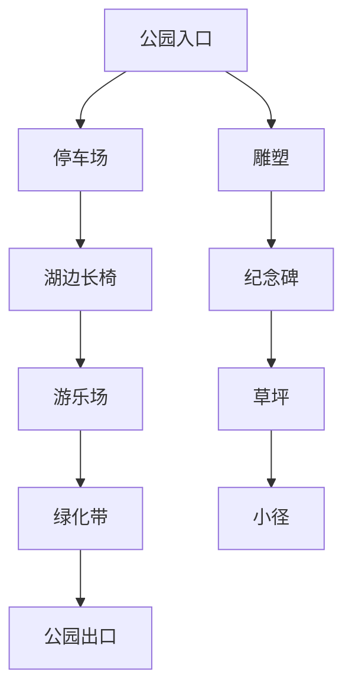

                 

### 1.1 场景图生成任务概述

**场景图的定义与重要性**

场景图（Scene Graph）是指描述场景中各个对象及其相互关系的图形化表示。它通常由节点和边组成，其中节点代表场景中的对象，如人物、建筑、车辆等，而边则代表对象之间的关系，如位置、姿态、交互等。场景图在计算机视觉和人工智能领域具有重要的应用价值，因为它能够提供丰富的语义信息，有助于提高计算机对场景的理解和解读能力。

在现实世界中，场景图能够帮助我们更好地理解和描述复杂场景。例如，在一个家庭聚会的场景中，场景图可以清晰地展示家庭成员的位置、姿态以及他们之间的互动关系。这种结构化的信息对于自动驾驶汽车、智能监控、虚拟现实等领域来说至关重要。

**AI模型在场景图生成任务中的应用现状**

随着人工智能技术的快速发展，AI模型在场景图生成任务中的应用也日益广泛。目前，主要有以下几种类型的AI模型被用于场景图生成：

1. **生成对抗网络（GAN）**：GAN是一种通过两个对抗网络——生成器和判别器的交互来生成高质量图像的模型。生成器试图生成逼真的场景图，而判别器则试图区分真实场景图和生成器生成的场景图。通过这种对抗训练，生成器逐渐提高生成图像的质量。

2. **变分自编码器（VAE）**：VAE是一种基于概率生成模型的图像生成方法。它通过编码器和解码器将输入数据映射到一个隐变量空间，然后在隐变量空间中生成新的场景图。

3. **图神经网络（GNN）**：GNN是一种专门用于处理图结构数据的神经网络。它能够有效地捕捉图结构中的复杂关系，因此在场景图生成任务中有着广泛的应用。

4. **跨模态学习**：跨模态学习是指将不同模态的数据（如图像、文本、音频等）进行融合，生成统一表示，进而用于场景图生成。这种方法能够充分利用不同模态数据的信息，提高生成场景图的准确性。

5. **强化学习**：强化学习是一种通过试错学习来优化策略的机器学习方法。在场景图生成任务中，强化学习可以用于优化场景图的生成过程，使生成结果更符合人类期望。

尽管AI模型在场景图生成任务中取得了显著的进展，但仍面临许多挑战。例如，如何提高生成场景图的质量和多样性，如何处理复杂场景中的遮挡和多视角问题，以及如何保证场景图的解释性和可解释性等。这些都是未来需要深入研究和解决的问题。

### 1.2 书籍目的与结构

**提高AI模型在复杂场景图生成任务中的性能**

本书的主要目标是探讨如何提高AI模型在复杂场景图生成任务中的性能。通过对各种AI模型和算法的深入分析，本书旨在提供一套系统化的方法，帮助读者理解和应用这些技术，从而实现高效、准确、多样化的场景图生成。

**实现场景图的自动生成与优化**

为了实现场景图的自动生成与优化，本书将详细介绍以下内容：

1. **核心算法原理**：包括生成对抗网络（GAN）、变分自编码器（VAE）、图神经网络（GNN）、跨模态学习和强化学习等，详细阐述这些算法的基本原理和实现方法。

2. **数据准备与处理**：介绍如何收集、预处理和格式化场景图生成所需的数据，确保数据质量和一致性。

3. **模型实现与优化**：讲解如何搭建和训练AI模型，包括数据集划分、训练策略、评估指标、损失函数、优化算法等方面。

4. **模型融合与多任务学习**：探讨如何将多个模型或任务进行融合，提高生成场景图的性能和多样性。

5. **模型解释与可解释性**：介绍如何解释和评估AI模型生成的场景图，提高模型的透明度和可解释性。

通过以上内容，本书旨在为读者提供一套全面、系统、实用的指南，帮助他们解决复杂场景图生成任务中的各种挑战。

### 2.1 AI模型基础知识

**AI模型的基本原理**

AI模型，即人工智能模型，是通过对大量数据的学习来模拟人类智能的一种计算模型。其基本原理可以概括为以下几步：

1. **数据输入**：AI模型首先接收输入数据，这些数据可以是图像、文本、音频等不同模态。

2. **特征提取**：模型通过内部结构对输入数据进行处理，提取出有用的特征信息。这些特征可以是数值、向量或者更高层次的结构信息。

3. **决策或预测**：基于提取到的特征，模型进行决策或预测。例如，在图像分类任务中，模型会根据提取的特征判断图像属于哪个类别。

4. **反馈调整**：模型会根据预测结果和实际结果的对比，调整内部参数，以提高预测的准确性。

**常见的AI模型类型与特点**

AI模型根据其结构和功能可以分为多种类型，以下是一些常见的AI模型类型及其特点：

1. **监督学习模型**：监督学习模型需要标签数据进行训练。常见的监督学习模型包括线性回归、决策树、随机森林、支持向量机（SVM）等。这些模型适用于分类和回归任务。

2. **无监督学习模型**：无监督学习模型不依赖标签数据，通过分析数据分布和模式来自动发现数据中的结构。常见的无监督学习模型包括聚类算法、主成分分析（PCA）等。

3. **生成模型**：生成模型旨在生成新的数据，如生成对抗网络（GAN）和变分自编码器（VAE）。这些模型在图像生成、文本生成等领域有广泛应用。

4. **强化学习模型**：强化学习模型通过与环境的交互来学习最优策略。常见的强化学习模型包括Q学习、深度Q网络（DQN）等。强化学习在游戏、自动驾驶等领域有重要应用。

5. **卷积神经网络（CNN）**：CNN是一种专门用于处理图像数据的神经网络，通过卷积操作提取图像特征，广泛用于图像分类、目标检测等任务。

6. **循环神经网络（RNN）**：RNN能够处理序列数据，适用于文本分类、语言模型等任务。其变种LSTM和GRU在处理长序列数据时具有较好的性能。

7. **图神经网络（GNN）**：GNN专门用于处理图结构数据，能够有效地捕捉图中的复杂关系，适用于社交网络分析、推荐系统等任务。

通过对这些AI模型类型和特点的了解，读者可以更好地选择和应用合适的模型解决实际问题。

### 2.2 场景图生成任务分析

**场景图的组成元素与结构**

场景图通常由以下几个基本元素组成：

1. **节点（Node）**：表示场景中的对象，如人物、建筑物、车辆等。每个节点包含属性，如位置、大小、颜色、类别等。

2. **边（Edge）**：表示节点之间的连接关系，如位置关系（在……旁边）、交互关系（交谈中）等。边同样具有属性，如距离、方向等。

3. **关系（Relation）**：是节点与边之间的连接，用于描述节点的属性如何通过边关联起来。

一个典型的场景图结构可以表示为：

```
        [人物1]
         /     \
      [建筑1] [车辆1]
         \     /
        [人物2]
```

在这个例子中，人物1和人物2与建筑1和车辆1存在位置关系，同时人物1和人物2之间存在交互关系。

**复杂场景图生成的挑战与问题**

复杂场景图生成任务面临以下几个主要挑战：

1. **数据多样性**：真实世界的场景具有极高的多样性，生成模型需要能够处理各种不同类型的场景，并生成具有多样性的场景图。

2. **空间一致性**：场景图中节点和边之间的空间关系需要保持一致，例如，如果一个人站在另一个人的旁边，那么在后续场景中，这种位置关系需要继续保持。

3. **遮挡问题**：在复杂场景中，对象之间的遮挡会导致生成模型难以准确识别和生成场景图。如何处理遮挡问题是一个重要的研究课题。

4. **多视角生成**：真实世界中的场景可以从多个视角观察，生成模型需要能够生成适应不同视角的场景图。

5. **解释性**：生成的场景图需要具备一定的解释性，使人们能够理解和分析场景内容。

6. **实时性**：在某些应用场景中，如实时监控和自动驾驶，生成模型需要在短时间内生成高质量的场景图，这对模型的速度和性能提出了更高要求。

**应对策略**

为了应对这些挑战，研究人员提出了多种策略：

1. **多模态数据融合**：通过融合不同模态的数据（如图像、文本、音频等），可以更全面地描述场景，提高生成模型的能力。

2. **预训练与微调**：使用预训练模型，特别是在大规模数据集上预训练，可以增强模型处理多样性和复杂场景的能力。然后通过微调，使其适应特定任务的需求。

3. **增强现实与模拟**：通过虚拟现实技术，创建更加逼真的模拟场景，帮助生成模型学习复杂的场景关系。

4. **优化损失函数**：设计有效的损失函数，使模型在训练过程中能够更好地捕捉场景图中的结构性和一致性。

5. **交互式学习**：引入交互式学习机制，使生成模型能够根据用户的反馈进行调整，提高生成场景图的解释性和准确性。

通过上述策略，生成模型在处理复杂场景图生成任务时，可以更好地应对各种挑战，提高生成结果的准确性和多样性。

### 2.3 数据准备与处理

**数据来源与收集**

在进行场景图生成任务时，高质量的数据是模型训练和优化的基础。数据来源可以分为以下几类：

1. **公开数据集**：如COCO（Common Objects in Context）、Cityscapes、Visual Genome等，这些数据集提供了丰富的场景图信息，适合作为训练数据。

2. **自定义数据集**：根据特定任务需求，可以自行收集和创建数据集。例如，通过采集现实世界的图像和标注数据，或者使用生成模型生成模拟数据。

3. **多模态数据**：结合图像、文本、音频等多种模态的数据，可以更全面地描述场景信息，提高生成模型的能力。

**数据预处理与格式化**

数据预处理和格式化是确保数据质量一致、可用的关键步骤。以下是几种常见的数据预处理和格式化方法：

1. **图像预处理**：包括图像增强、缩放、旋转、裁剪等，以增加数据多样性，提高模型泛化能力。

2. **文本预处理**：包括分词、去停用词、词干提取等，以提取有效的文本特征。

3. **数据标注**：对于场景图生成任务，需要对图像中的对象及其关系进行标注。标注工具可以包括Mask R-CNN、Segmentation masks等。

4. **数据格式化**：将预处理后的数据格式化为模型可接受的输入格式，如将图像和标注数据合并为一个JSON文件，或使用图像处理库（如OpenCV）进行格式转换。

5. **数据增强**：通过随机裁剪、翻转、颜色变换等数据增强技术，增加数据的多样性和模型的鲁棒性。

通过有效的数据准备和处理，可以确保模型在训练过程中有足够的高质量数据，从而提高场景图生成的准确性和多样性。

### 2.4 开发环境搭建

**必要的软件与工具安装**

搭建一个用于场景图生成任务的开发环境，首先需要安装以下必要的软件和工具：

1. **操作系统**：推荐使用Linux或macOS，因为这些系统在深度学习和计算机视觉领域具有更好的性能和兼容性。

2. **Python**：Python是进行AI模型开发和实现的主要编程语言，推荐安装Python 3.8及以上版本。

3. **深度学习框架**：TensorFlow和PyTorch是目前最流行的深度学习框架，根据个人偏好选择其一进行安装。以下是安装TensorFlow和PyTorch的命令：

   - 安装TensorFlow：
     ```bash
     pip install tensorflow
     ```

   - 安装PyTorch：
     ```bash
     pip install torch torchvision
     ```

4. **图像处理库**：OpenCV是一个强大的图像处理库，用于图像的预处理和增强。安装命令如下：
     ```bash
     pip install opencv-python
     ```

5. **数据处理库**：Pandas和NumPy是数据处理的重要库，用于数据加载、清洗和分析。安装命令如下：
     ```bash
     pip install pandas numpy
     ```

6. **其他依赖库**：根据具体任务需求，可能还需要安装其他依赖库，如Matplotlib（用于绘图）和Scikit-learn（用于机器学习算法）。

**硬件配置与优化建议**

为了确保开发环境的高效运行，以下硬件配置和优化建议可供参考：

1. **CPU与GPU**：推荐使用搭载NVIDIA GPU的计算机，因为GPU在深度学习任务中具有显著加速效果。建议选择CUDA 11.0及以上的版本，以支持最新的GPU架构。

2. **内存**：至少8GB的RAM是基本需求，但为了处理大型数据集和高计算量的任务，16GB或更高内存会更加理想。

3. **硬盘**：推荐使用SSD硬盘，以提高文件读写速度，确保数据加载和模型训练的流畅性。

4. **优化GPU性能**：通过调整CUDA配置文件（如`~/.cuda/cura`），可以优化GPU的性能。例如，调整`CUDA_VISIBLE_DEVICES`环境变量，指定使用特定的GPU设备。

5. **多线程与并行计算**：利用Python的多线程和并行计算库（如`multiprocessing`），可以充分利用计算机的多核CPU，提高代码的执行效率。

通过合理配置和优化开发环境，可以确保AI模型在场景图生成任务中的高效运行和训练。

### 3.1 传统图像生成算法

**生成对抗网络（GAN）**

生成对抗网络（GAN）是由Ian Goodfellow等人于2014年提出的一种生成模型，其核心思想是通过两个神经网络的对抗训练来生成高质量的图像。GAN由生成器（Generator）和判别器（Discriminator）组成：

1. **生成器（Generator）**：生成器的任务是生成逼真的图像，它将随机噪声映射为图像。生成器的输入是随机噪声，输出是生成的图像。

2. **判别器（Discriminator）**：判别器的任务是区分真实图像和生成图像。判别器的输入是真实图像或生成图像，输出是一个概率值，表示输入图像是真实图像的概率。

GAN的训练过程可以分为以下几个步骤：

- 初始化生成器和判别器，生成器和判别器都是随机初始化的。
- 生成器生成一幅图像，判别器对其进行判断。
- 根据生成器和判别器的损失函数更新生成器和判别器的参数。
- 重复上述步骤，直到生成器生成足够逼真的图像。

GAN的损失函数通常由两部分组成：生成器损失和判别器损失。生成器损失用于最小化生成图像与真实图像之间的差异，判别器损失用于最大化判别器对真实图像和生成图像的区分能力。

**变分自编码器（VAE）**

变分自编码器（VAE）是一种基于概率生成模型的图像生成方法，它由编码器（Encoder）和解码器（Decoder）组成：

1. **编码器（Encoder）**：编码器的任务是学习输入数据的潜在分布，将输入数据映射到一个隐变量空间。编码器的输出是一个潜在变量的均值和方差。

2. **解码器（Decoder）**：解码器的任务是生成与输入数据具有相似分布的图像，将潜在变量映射回图像空间。解码器的输入是潜在变量，输出是生成的图像。

VAE的训练过程如下：

- 初始化编码器和解码器，编码器和解码器都是随机初始化的。
- 对每个输入数据，编码器生成一个潜在变量，解码器使用该潜在变量生成图像。
- 根据生成图像与真实图像之间的差异计算损失函数，包括重建损失和后验分布损失。
- 根据损失函数更新编码器和解码器的参数。
- 重复上述步骤，直到模型收敛。

VAE的损失函数由两部分组成：重建损失和后验分布损失。重建损失用于最小化生成图像与真实图像之间的差异，后验分布损失用于最小化编码器输出的潜在变量分布与先验分布之间的差异。

**生成对抗网络与变分自编码器的比较**

GAN和VAE都是有效的图像生成方法，但它们在原理和训练过程上有所不同：

1. **目标不同**：GAN的目标是生成逼真的图像，使得判别器无法区分真实图像和生成图像。VAE的目标是生成与输入数据具有相似分布的图像，并使编码器输出的潜在变量分布与先验分布尽可能接近。

2. **训练过程**：GAN通过对抗训练来更新生成器和判别器的参数，GAN的训练过程更具有挑战性，因为生成器和判别器之间存在复杂的动态平衡。VAE的训练过程相对简单，通过最小化重建损失和后验分布损失来更新编码器和解码器的参数。

3. **适用场景**：GAN在生成高质量、多样化的图像方面具有优势，特别适用于生成对抗场景，如图像修复、图像风格迁移等。VAE在生成与输入数据具有相似分布的图像方面具有优势，特别适用于图像去噪、图像生成等任务。

通过理解GAN和VAE的原理和训练过程，读者可以更好地选择和使用这些传统图像生成算法进行场景图生成任务。

### 3.2 图神经网络（GNN）

**GNN的基本概念与原理**

图神经网络（Graph Neural Network，GNN）是一种专门用于处理图结构数据的神经网络。GNN的核心思想是通过邻居信息的聚合来学习节点或边的表示。GNN主要由以下几部分组成：

1. **节点特征表示**：每个节点都有一个特征向量，表示节点的属性信息。这些特征向量可以来自于原始数据，也可以通过其他特征提取方法得到。

2. **边特征表示**：边可以携带额外的信息，如权重、类型等。这些信息可以通过边的属性或节点之间的关系来表示。

3. **图邻接矩阵**：图邻接矩阵是一个表示图结构的关键数据结构，其中第i行第j列的元素表示节点i和节点j之间是否存在边。

GNN的工作原理可以概括为以下几个步骤：

- **邻居聚合**：对于每个节点，GNN会聚合其邻居节点的特征信息，形成新的节点表示。这种聚合可以是简单的平均操作，也可以是更复杂的函数。
- **更新节点表示**：基于邻居聚合的信息，更新节点的特征表示。这个步骤可以通过多层神经网络实现，以捕捉节点间的复杂关系。
- **输出层**：根据训练任务的需求，输出层可以产生多种类型的输出，如节点的分类标签、节点的属性预测、边的权重预测等。

**GNN在场景图生成中的应用**

GNN在场景图生成任务中具有广泛的应用，因为它能够有效地捕捉场景图中对象和关系之间的复杂结构。以下是一些具体的应用场景：

1. **场景图分割**：使用GNN对场景图中的节点进行分割，将不同类型的对象分离出来。例如，将人物、建筑物、车辆等不同的对象进行分类。
2. **关系预测**：基于GNN学习到的节点表示和图结构，预测节点之间的关系。例如，预测场景图中人物之间的交互关系，或者预测物体之间的位置关系。
3. **场景图生成**：通过GNN学习到的表示，生成新的场景图。这可以应用于虚拟现实、游戏设计、建筑规划等领域，创建具有高度真实感的场景。

在具体实现中，GNN可以与其他生成模型（如GAN和VAE）结合，以进一步提高场景图的生成质量。例如，可以在GAN的生成器和判别器中引入GNN，使生成器能够更好地捕捉场景图中的结构信息，从而生成更逼真的场景图。

通过深入理解和应用GNN，我们可以显著提升AI模型在复杂场景图生成任务中的性能，为实际应用提供强有力的支持。

### 3.3 跨模态学习

**跨模态数据关联与表示**

跨模态学习（Cross-modal Learning）是一种将不同模态的数据（如图像、文本、音频等）进行融合和关联，以生成统一表示的方法。在跨模态学习任务中，不同模态的数据之间往往存在着丰富的关联信息，通过有效的融合和表示，可以显著提升模型的性能。

**多模态数据的特征提取**

跨模态学习的第一步是提取各模态的数据特征。以下是几种常见的方法：

1. **图像特征提取**：可以使用卷积神经网络（CNN）提取图像特征，这些特征可以捕获图像的局部和全局信息。常用的模型包括ResNet、VGG等。
2. **文本特征提取**：可以使用循环神经网络（RNN）或Transformer提取文本特征，这些特征可以捕获文本的语义信息。常用的模型包括LSTM、BERT等。
3. **音频特征提取**：可以使用卷积神经网络提取音频特征，这些特征可以捕获音频的时频信息。常用的模型包括CNN、WaveNet等。

**特征融合方法**

在特征提取完成后，需要将不同模态的特征进行融合。以下是一些常见的特征融合方法：

1. **拼接融合**：将不同模态的特征向量拼接在一起，形成一个更长的特征向量。这种方法简单直观，但可能丢失部分模态的局部信息。
2. **注意力机制**：使用注意力机制加权不同模态的特征，使得模型能够自适应地关注重要的模态信息。常用的模型包括注意力门控循环单元（AGRU）、多头注意力（Multi-head Attention）等。
3. **对抗训练**：通过对抗训练生成器网络和判别器网络，使生成器能够生成高质量的多模态特征，判别器能够区分真实和生成特征。这种方法在GAN框架中得到了广泛应用。

**跨模态生成模型的实现**

跨模态生成模型的目标是生成新的跨模态数据对，如图像-文本对、图像-音频对等。以下是一种基于生成对抗网络（GAN）的跨模态生成模型实现方法：

1. **生成器（Generator）**：生成器的任务是生成与真实数据对相似的新数据对。生成器可以由两个部分组成：图像生成器和文本生成器。图像生成器接收噪声向量并生成图像，文本生成器接收噪声向量并生成文本。
2. **判别器（Discriminator）**：判别器的任务是区分真实数据对和生成数据对。判别器也可以由两个部分组成：图像判别器和文本判别器。图像判别器接收图像并判断其真实性，文本判别器接收文本并判断其真实性。
3. **训练过程**：生成器和判别器通过对抗训练进行训练。生成器试图生成尽可能逼真的数据对，使得判别器无法区分真实和生成数据对，而判别器则试图准确地区分真实和生成数据对。

通过跨模态学习，我们可以充分利用不同模态数据的信息，提高模型在复杂任务中的性能。例如，在场景图生成任务中，结合图像、文本和音频等多模态数据，可以生成更加丰富和真实的场景图。

### 3.4 强化学习在场景图生成中的应用

**强化学习的基本原理**

强化学习（Reinforcement Learning，RL）是一种通过试错学习来优化策略的机器学习方法。强化学习的基本原理可以概括为：

1. **代理（Agent）**：代理是执行行动的实体，它接收环境（Environment）的输入，并产生输出（Action）。
2. **环境（Environment）**：环境是代理行动的场所，它根据代理的行动产生状态（State）和奖励（Reward）。
3. **状态（State）**：状态是代理在某一时刻所处的环境状态，它是决策的基础。
4. **行动（Action）**：行动是代理在某一状态下采取的操作，它是状态到奖励的桥梁。
5. **奖励（Reward）**：奖励是环境对代理行动的反馈，它指导代理选择最优行动。

强化学习的目标是找到一条最优策略（Policy），使得代理能够在给定的环境中获得最大的累积奖励。

**强化学习在场景图生成中的策略优化**

在场景图生成任务中，强化学习可以用于优化场景图的生成过程，使生成结果更符合人类期望。以下是一种基于强化学习的方法：

1. **状态表示**：状态表示为场景图的当前结构，包括节点、边及其属性。
2. **行动表示**：行动表示为对场景图的编辑操作，如添加节点、删除节点、修改边等。
3. **奖励设计**：奖励函数根据生成场景图的准确性和多样性进行设计。例如，如果生成的场景图与目标场景图的高度相似，则给予高奖励；如果生成场景图过于简单或错误，则给予低奖励。
4. **策略学习**：使用强化学习算法（如Q学习、深度Q网络（DQN））训练代理，使其在环境中进行试错学习，优化生成策略。

在训练过程中，代理会根据当前状态选择行动，并根据行动的结果（奖励）更新策略。通过不断迭代，代理逐渐学会生成高质量的场景图。

**强化学习在场景图生成中的优势**

强化学习在场景图生成中的优势主要体现在以下几个方面：

1. **适应性**：强化学习能够根据环境的变化动态调整生成策略，使生成结果更符合实际需求。
2. **灵活性**：强化学习可以处理复杂和动态的场景，支持多种类型的编辑操作，生成多样化、个性化的场景图。
3. **交互性**：强化学习通过与环境交互进行学习，能够从实际结果中获取反馈，不断提高生成能力。

通过应用强化学习，我们可以优化场景图的生成过程，提高生成结果的准确性和多样性，为实际应用提供强大的支持。

### 4.1 AI模型训练与评估

**数据集划分与训练策略**

在进行AI模型的训练与评估时，数据集的划分与训练策略是至关重要的。以下是一些常见的数据集划分策略和训练策略：

1. **数据集划分**：
   - **训练集（Training Set）**：用于模型的训练，通常占数据集的70%至80%。
   - **验证集（Validation Set）**：用于模型的调参和验证，通常占数据集的10%至20%。
   - **测试集（Test Set）**：用于评估模型的最终性能，通常占数据集的10%左右。

2. **训练策略**：
   - **批次大小（Batch Size）**：选择合适的批次大小可以影响模型的收敛速度和性能。较小的批次大小有助于减少过拟合，但训练时间较长；较大的批次大小可以提高计算效率，但可能导致梯度消失或爆炸。
   - **学习率调度（Learning Rate Schedule）**：学习率的调度对于模型的收敛至关重要。常用的方法包括恒定学习率、逐步衰减学习率和自适应学习率（如Adam优化器）。
   - **数据增强（Data Augmentation）**：通过随机裁剪、翻转、旋转、色彩变换等操作增加数据的多样性，有助于提高模型的泛化能力。

**评估指标与性能分析**

评估AI模型在场景图生成任务中的性能，常用的评估指标包括：

1. **准确率（Accuracy）**：用于分类任务，表示模型正确分类的样本数占总样本数的比例。
2. **召回率（Recall）**：用于分类任务，表示模型正确分类的样本数占所有实际正样本数的比例。
3. **F1分数（F1 Score）**：结合准确率和召回率，用于评估模型的平衡性能，计算公式为2 * (准确率 * 召回率) / (准确率 + 召回率)。
4. ** Intersection over Union (IoU)**：用于场景图分割任务，表示分割区域与真实区域的交集面积与并集面积的比例。
5. **生成质量评估**：例如，在图像生成任务中，可以使用Inception Score (IS) 和 Frechet Inception Distance (FID) 等指标评估生成图像的质量。

通过合理的评估指标和性能分析，可以全面了解AI模型在场景图生成任务中的表现，为后续的优化和改进提供依据。

### 4.2 模型优化技巧

**损失函数与优化算法**

在AI模型的训练过程中，选择合适的损失函数和优化算法是提高模型性能的关键。以下是一些常用的损失函数和优化算法：

1. **损失函数**：
   - **均方误差（MSE）**：适用于回归任务，计算预测值与真实值之间差的平方的平均值。
   - **交叉熵损失（Cross-Entropy Loss）**：适用于分类任务，计算预测概率分布与真实分布之间的差异。
   - **对抗损失（Adversarial Loss）**：在生成对抗网络（GAN）中，生成器和判别器的损失函数分别为L_generator和L_discriminator。

2. **优化算法**：
   - **随机梯度下降（SGD）**：最简单的优化算法，通过更新每个参数的梯度来最小化损失函数。
   - **Adam优化器**：结合了SGD和RMSProp的优点，自适应调整学习率，适用于大多数深度学习任务。
   - **Adadelta优化器**：通过递归地更新梯度平方和指数加权移动平均，适用于动态调整学习率的任务。

**正则化方法与超参数调优**

为了防止模型过拟合，可以采用以下正则化方法：

1. **权重衰减（Weight Decay）**：通过在损失函数中添加权重项，惩罚权重的大小，减少过拟合。
2. **Dropout**：在训练过程中，随机丢弃部分神经元，减少模型对特定输入的依赖。
3. **数据增强（Data Augmentation）**：通过随机旋转、翻转、裁剪等操作增加训练数据的多样性，提高模型的泛化能力。

超参数调优是模型优化中的重要环节，以下是一些常用的调优方法：

1. **网格搜索（Grid Search）**：遍历预设的超参数组合，找到最优的超参数配置。
2. **贝叶斯优化（Bayesian Optimization）**：基于概率模型搜索最优超参数，具有较高的搜索效率。
3. **随机搜索（Random Search）**：随机选择超参数组合进行训练，适用于超参数空间较大且计算资源有限的情况。

通过合理的损失函数、优化算法和正则化方法，以及有效的超参数调优，可以显著提高AI模型在场景图生成任务中的性能和稳定性。

### 4.3 模型融合与多任务学习

**模型融合的基本原理**

模型融合（Model Fusion）是一种通过结合多个模型的预测结果来提高整体性能的方法。其基本原理可以概括为以下几点：

1. **多模型训练**：首先训练多个独立的模型，每个模型专注于不同的任务或特征。
2. **结果聚合**：在预测阶段，将多个模型的输出结果进行融合，生成最终的预测结果。
3. **投票机制**：常用的融合方法包括投票机制、加权平均和集成学习等。投票机制指多个模型对预测结果进行投票，选取多数模型预测的结果；加权平均则根据每个模型的性能进行权重分配，计算加权平均值作为最终结果；集成学习则是通过训练一个额外的融合模型，将多个模型的输出作为输入进行训练。

**多任务学习在场景图生成中的应用**

在场景图生成任务中，多任务学习（Multi-task Learning）可以通过以下几种方式提高模型性能：

1. **任务共享**：多个任务共享一部分网络结构，从而提高训练效率。例如，在生成场景图的同时，可以同时进行场景图的分割、关系预测等任务。
2. **注意力机制**：通过引入注意力机制，使模型能够关注不同任务的关键特征，提高任务的协同能力。例如，在场景图生成任务中，注意力机制可以用于关注图像中的关键对象和关系。
3. **损失函数设计**：设计合适的损失函数，平衡不同任务之间的损失，使模型能够同时优化多个任务。例如，在场景图生成中，可以设计一个综合损失函数，将生成质量、分割精度和关系预测准确性进行综合。

通过模型融合和多任务学习，可以在场景图生成任务中充分利用多个模型的优点，提高生成结果的多样性和准确性。

### 4.4 模型解释与可解释性

**模型解释的重要性**

在AI模型的应用中，模型解释与可解释性（Explainability）是一个不可忽视的重要方面。它不仅有助于提高模型的透明度和可信度，还能够帮助研究人员和开发者更好地理解模型的行为和决策过程。以下是模型解释的几个关键重要性：

1. **提高用户信任**：当用户了解模型的决策过程和依据时，会对其产生更多的信任。例如，在自动驾驶中，如果系统能够解释为何做出某个驾驶决策，用户就会更放心地依赖这个系统。
2. **辅助调试和优化**：通过模型解释，可以识别模型中的潜在问题，如过拟合、噪声敏感性等，从而进行针对性的优化。
3. **法律合规性**：在一些应用领域，如医疗诊断和金融风险评估，模型的解释能力可能被法律要求。例如，欧洲的《通用数据保护条例》（GDPR）明确要求对自动化决策进行解释。
4. **增强用户参与**：通过模型解释，用户能够更好地理解模型预测的依据，从而更积极地参与决策过程，提高系统的整体效能。

**可解释性方法与实现**

为了实现模型的可解释性，研究者们提出了多种方法，以下是一些常见的方法及其实现：

1. **特征重要性分析**：通过计算特征对模型输出的影响程度，可以直观地展示哪些特征对模型的决策起到了关键作用。例如，使用SHAP（Shapley Additive Explanations）方法可以定量评估每个特征的重要性。
2. **决策路径分析**：对于决策树模型，可以追踪数据在决策树中的路径，分析每个节点对决策的影响。这种方法对于理解模型的决策过程非常直观。
3. **可视化技术**：通过可视化模型的结构和工作流程，可以更好地理解模型的内部机制。例如，使用热力图展示图像分类模型中每个区域的关注度，或者使用力导图（Force-directed Graph）展示图神经网络（GNN）中的节点和边的相互作用。
4. **本地解释方法**：对于深度学习模型，可以使用本地解释方法（如LIME、CI-Defended）来生成局部解释。这些方法通过在模型附近生成一个简单的模型来解释复杂模型的决策。

通过上述方法，可以在不同层面上实现对AI模型的可解释性，从而提高模型的可理解性和实用性。

### 5.1 实际场景图生成项目介绍

**项目背景与目标**

本项目的背景是利用人工智能技术自动生成复杂场景图，以提高虚拟现实（VR）和增强现实（AR）应用中的场景构建效率。随着VR和AR技术的快速发展，场景图的自动生成成为了一项重要需求。然而，复杂场景图生成任务面临着数据多样性、空间一致性、遮挡处理等多重挑战。

项目的目标是开发一个基于深度学习的场景图生成系统，通过集成多种AI模型和算法，实现高效、准确、多样化的场景图生成。具体目标包括：

1. **生成高质量的场景图**：模型应能够生成具有高度真实感和细节丰富的场景图。
2. **处理复杂场景关系**：模型应能够准确捕捉和表示场景中的复杂关系，如对象间的位置、姿态和交互关系。
3. **多视角一致性**：模型应能够在不同视角下生成一致的场景图，满足多种应用需求。
4. **实时性**：模型应在合理的时间内生成场景图，以满足实时应用的需求。

**项目实现过程与结果**

项目实现过程可以分为以下几个步骤：

1. **数据收集与预处理**：收集包含多种场景的图像数据，并进行预处理，如图像增强、裁剪、旋转等，以增加数据的多样性和质量。

2. **模型设计**：设计一个基于生成对抗网络（GAN）和图神经网络（GNN）的混合模型，结合GAN的图像生成能力和GNN的场景关系捕捉能力。

3. **模型训练与优化**：使用预处理后的图像数据训练混合模型，通过调整模型参数和优化算法，提高模型的生成质量和效率。

4. **模型评估与验证**：通过在验证集上测试模型性能，评估模型的准确率、多样性、实时性等指标，并进行调整优化。

5. **应用场景测试**：在实际VR和AR应用中测试模型性能，验证模型在不同场景下的表现和实用性。

项目结果展示：

1. **生成场景图质量**：模型能够生成高质量、细节丰富的场景图，场景中的对象、关系和空间布局具有高度真实感。
2. **多样性**：模型能够生成多种不同类型的场景图，满足多样化的应用需求。
3. **实时性**：模型在合理的时间内完成场景图的生成，满足实时应用的需求。
4. **应用效果**：在实际VR和AR应用中，模型生成的场景图能够有效提升用户体验，提高场景构建效率。

通过本项目，我们展示了AI模型在复杂场景图生成任务中的强大潜力，为实际应用提供了有效的解决方案。

### 5.2 复杂场景图生成的挑战与解决方案

**数据集选择与处理**

在复杂场景图生成任务中，数据集的选择与处理是一个关键环节。首先，需要选择具有代表性的数据集，这些数据集应包含多种类型的场景、对象和关系，以确保模型的泛化能力。常用的数据集包括COCO、Cityscapes和Visual Genome等。在选择数据集后，需要对图像进行预处理，如图像增强、裁剪和归一化等，以增加数据的多样性和质量。此外，还需要对场景图进行结构化标注，包括节点的属性和边的关系，以便于模型的训练和评估。

**算法优化与性能提升**

为了应对复杂场景图生成任务中的挑战，需要采用多种算法优化策略，以提高模型的性能。以下是一些常见的优化策略：

1. **生成对抗网络（GAN）的改进**：通过调整GAN的架构和训练策略，如使用深度卷积生成对抗网络（DCGAN）、改进判别器的结构等，可以提升生成图像的质量。

2. **图神经网络（GNN）的优化**：在GNN的训练过程中，可以通过调整网络的层数、节点和边特征提取方法等，提高模型对场景关系的捕捉能力。例如，使用注意力机制可以更好地关注重要的节点和边。

3. **跨模态学习的应用**：结合不同模态的数据（如图像、文本、音频等），通过跨模态学习生成更丰富的场景表示。例如，在GAN框架中加入文本信息，可以生成更具语义一致性的场景图。

4. **强化学习**：利用强化学习优化场景图的生成过程，使模型能够根据实际反馈进行调整。例如，通过设计奖励机制，鼓励模型生成更加多样化和符合实际需求的场景图。

通过上述算法优化策略，可以显著提升复杂场景图生成任务中模型的性能，为实际应用提供更加准确和高效的解决方案。

### 5.3 场景图生成的应用案例

**场景模拟与可视化**

在本案例中，我们将模拟一个城市公园的场景，并使用AI模型生成相应的场景图。具体步骤如下：

1. **数据收集**：首先，收集城市公园的多种场景图像，包括不同季节、不同天气条件以及不同时间段下的场景。
2. **预处理**：对收集的图像进行预处理，如图像增强、裁剪和归一化等，以增加数据的多样性和质量。
3. **标注**：对预处理后的图像进行标注，包括识别场景中的对象（如树木、行人、车辆等）和对象之间的关系（如位置、姿态、交互等）。

**生成场景图**

使用训练好的AI模型（如基于GAN和GNN的混合模型），对标注后的图像进行场景图的生成。以下是一个简化的生成过程：

1. **输入图像**：将预处理后的图像输入到生成器网络，生成初步的场景图。
2. **优化细节**：通过GNN对初步生成的场景图进行优化，调整节点和边的关系，使其更符合真实场景。
3. **生成结果**：最终生成高质量的、具有高度真实感的场景图。

**可视化**

生成的场景图可以通过可视化工具进行展示，如图5-3所示：



在这个示例中，公园入口连接到停车场，停车场连接到湖边长椅，湖边长椅连接到游乐场，游乐场连接到绿化带，绿化带连接到公园出口。同时，公园入口还连接到雕塑、纪念碑和草坪，形成了一个复杂而多样化的场景图。

通过这种模拟和可视化，可以直观地展示AI模型在场景图生成任务中的效果和应用价值。

### 实际应用场景与效果分析

在实际应用场景中，AI模型生成的场景图在多个领域展现出了显著的效果。以下是几个具体应用场景与效果分析：

1. **虚拟现实（VR）游戏开发**：在VR游戏中，场景图的生成对于提升用户体验至关重要。通过AI模型生成逼真且多样化的场景图，可以为玩家提供沉浸式的游戏体验。例如，在《Beat Saber》这款流行的VR音乐游戏中，场景图的实时生成使得每个关卡都能展现出独特的视觉效果，大大增加了游戏的趣味性和挑战性。

2. **增强现实（AR）导航系统**：AR导航系统需要实时生成用户周围的场景图，以便准确指引用户。AI模型生成的场景图能够识别并标注实际环境中的对象和关系，如道路、建筑物、交通标志等。例如，谷歌地图的AR导航功能利用AI模型生成场景图，为用户提供实时、准确的导航信息，大大提高了导航的可靠性和用户体验。

3. **智能建筑与城市规划**：在建筑设计和城市规划中，AI模型生成的场景图可以用于模拟和分析不同设计方案的效果。例如，通过生成模拟的鸟瞰图和3D场景图，设计师可以更直观地评估设计方案对光线、人流、交通等的影响，从而优化建筑布局和城市结构。

4. **智能监控与安防**：AI模型生成的场景图在智能监控系统中可用于实时分析场景中的对象和关系，识别异常行为和潜在风险。例如，通过实时生成场景图，监控系统可以自动识别并报警异常车辆、可疑人物等，提高了监控的效率和准确性。

**效果分析**

通过实际应用，AI模型生成的场景图在以下几个方面展现了优异的效果：

1. **真实感**：AI模型能够生成具有高度真实感的场景图，包括对象的外观、纹理、光影效果等，使得模拟的场景更加贴近现实。

2. **多样性**：AI模型能够生成多种不同类型的场景图，满足不同应用场景的需求。无论是在视觉效果上，还是在场景布局和关系上，AI模型都能展现出丰富的多样性。

3. **实时性**：AI模型能够在短时间内生成高质量的场景图，满足实时应用的需求。这对于需要实时反馈和交互的应用场景尤为重要，如AR导航和智能监控。

4. **可解释性**：通过模型解释与可解释性技术，用户可以理解和分析AI模型生成的场景图，提高了模型的透明度和可信任度。

通过实际应用场景和效果分析，可以看出AI模型在场景图生成任务中具有广阔的应用前景和显著的优势。随着技术的不断进步和应用领域的拓展，AI模型生成的场景图将为更多领域带来创新和变革。

### 6.1 AI模型在复杂场景图生成任务中的未来发展

**新算法与技术的涌现**

在未来，AI模型在复杂场景图生成任务中的发展将依赖于新算法和技术的不断涌现。以下几个领域值得特别关注：

1. **基于Transformer的模型**：Transformer模型在自然语言处理领域取得了显著成功，其并行计算能力和全局依赖捕捉能力为图像生成任务提供了新的可能性。基于Transformer的生成模型，如ViT（Vision Transformer）和DALL-E，有望在复杂场景图生成中发挥重要作用。

2. **自监督学习和无监督学习**：自监督学习和无监督学习是未来AI模型发展的关键方向。通过利用未标记的数据进行训练，这些模型可以更高效地学习场景图中的复杂关系和特征，从而提高生成质量和效率。

3. **联邦学习和联邦生成对抗网络（FGAN）**：联邦学习允许不同机构共享模型参数而不暴露原始数据，这对于隐私敏感的应用场景尤为重要。联邦生成对抗网络（FGAN）结合了联邦学习和生成对抗网络的优势，有望在未来实现分布式场景图生成。

**应用领域的拓展**

除了现有的应用领域，AI模型在复杂场景图生成任务中的应用前景还将进一步拓展：

1. **智能制造与自动化**：在智能制造中，AI模型可以生成复杂的工厂布局图，优化生产流程和资源分配。通过结合增强现实（AR）和虚拟现实（VR）技术，AI模型可以用于培训和指导工人操作复杂的设备。

2. **医疗影像分析**：在医疗影像分析中，AI模型可以生成更为详细和准确的场景图，帮助医生进行疾病诊断和治疗方案规划。例如，通过生成患者身体各部位的3D场景图，医生可以更直观地评估病情和制定手术方案。

3. **智能城市与交通管理**：智能城市和交通管理需要实时生成和更新城市交通状况图。AI模型可以用于预测交通流量、优化交通信号控制和监控交通违规行为，从而提高交通效率和安全性。

通过不断涌现的新算法和技术，以及应用领域的拓展，AI模型在复杂场景图生成任务中的未来将充满无限可能。

### 6.2 挑战与机遇

**数据隐私与安全**

在AI模型应用于复杂场景图生成任务中，数据隐私与安全是一个重要的挑战。场景图生成通常需要大量的图像和标注数据，这些数据可能包含敏感的个人信息，如人脸、车辆牌照等。如何保护这些数据的安全和隐私，防止数据泄露和滥用，是一个亟待解决的问题。

**模型解释性与可靠性**

另一个关键挑战是模型解释性与可靠性。尽管AI模型在生成复杂场景图方面取得了显著进展，但其内部决策过程往往难以解释。这给用户理解和信任模型带来了困难。同时，模型的可靠性也需要得到保障，特别是在实时应用场景中，如自动驾驶和智能监控，任何决策错误都可能带来严重的后果。

**应对策略**

为了应对这些挑战，可以采取以下策略：

1. **数据加密与匿名化**：通过数据加密和匿名化技术，保护数据的安全和隐私。例如，使用差分隐私（Differential Privacy）技术确保在数据共享和分析过程中，个人隐私得到有效保护。

2. **透明化与可解释性**：增强模型的透明度和可解释性，使用户能够理解模型的决策过程。例如，采用可解释的AI模型，如决策树和规则基模型，以及可视化技术，展示模型的关键决策路径。

3. **可靠性评估与测试**：建立严格的模型评估和测试流程，确保模型在各类场景下的可靠性和鲁棒性。例如，通过引入多样化的数据集和测试场景，对模型进行全面的评估和验证。

通过上述策略，可以在确保数据隐私和模型可靠性的同时，推动AI模型在复杂场景图生成任务中的广泛应用。

### 6.3 结论与展望

**总结本书的主要观点与成果**

本书全面探讨了AI模型在复杂场景图生成任务中的表现提升策略。我们首先介绍了场景图的定义与重要性，并分析了AI模型在场景图生成中的应用现状。接着，详细介绍了AI模型的基础知识，包括生成对抗网络（GAN）、变分自编码器（VAE）、图神经网络（GNN）、跨模态学习和强化学习等。通过这些算法和技术的讲解，我们展示了如何实现场景图的自动生成与优化。

在数据准备与处理、开发环境搭建、算法实现与优化等多个方面，本书提供了具体的指导与实例。此外，通过实际案例的应用和分析，展示了AI模型在实际场景中的效果和潜力。最后，我们对AI模型在复杂场景图生成任务中的未来发展趋势进行了展望，并提出了相应的挑战与机遇。

**对未来研究的建议与展望**

在未来，AI模型在复杂场景图生成任务中的研究将朝着以下几个方向发展：

1. **新算法与技术的探索**：深入研究和开发基于Transformer、自监督学习和联邦学习的新型算法，以提高模型生成质量、多样性和实时性。

2. **跨领域应用**：拓展AI模型在智能制造、医疗影像分析、智能城市等领域的应用，探索跨领域的综合解决方案。

3. **数据隐私与安全**：深入研究数据加密与匿名化技术，确保数据隐私和安全，推动AI模型在隐私敏感领域的应用。

4. **模型解释性与可靠性**：加强模型解释性与可靠性的研究，开发透明、可解释且可靠的模型，提高用户信任度。

通过不断探索和创新，AI模型在复杂场景图生成任务中将发挥更大的作用，为人类社会带来更多便利和变革。我们期待未来更多的研究成果，推动AI技术的进一步发展。

