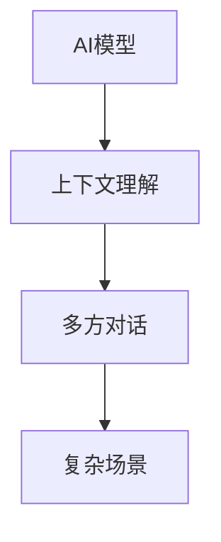

                 

# 提高AI模型在复杂多方对话场景中的上下文理解能力

## 关键词
- AI模型
- 上下文理解
- 多方对话
- 复杂场景
- 对话状态跟踪算法
- 多模态上下文融合
- 增量式学习

## 摘要
本文旨在探讨如何提高AI模型在复杂多方对话场景中的上下文理解能力。通过对核心概念的分析和核心算法的详细讲解，文章揭示了提升AI模型上下文理解能力的策略和实现方法。通过实例代码和数学模型，本文为读者提供了实用的技术指导。

## 核心概念与联系

在AI领域，提高模型在复杂多方对话场景中的上下文理解能力是当前研究的热点问题。为了更好地理解这一主题，首先需要明确几个核心概念及其相互关系。

### 核心概念

#### AI模型

AI模型是基于数据训练的算法，用于模拟和实现人工智能功能。AI模型可以涵盖多种类型，如监督学习、无监督学习和强化学习等。它们的核心在于能够从数据中学习和提取规律，进而实现预测和决策。

#### 上下文理解

上下文理解是指AI模型在处理对话或文本时，能够理解对话中的情境、语境和意图。这对于确保对话的连贯性和准确性至关重要。上下文理解能力越强，AI模型在复杂对话场景中的表现就越好。

#### 多方对话

多方对话涉及多个参与者的对话场景。在这些场景中，参与者可能有不同的角色和目标，同时需要协调各自的意图和需求。AI模型需要能够同时处理多个参与者的对话，并保持对话的连贯性。

#### 复杂场景

复杂场景是指涉及多种因素、变量和不确定性的对话环境。例如，对话中可能包含多种语言、方言、俗语等，或者涉及敏感话题和情绪变化。AI模型需要在这些复杂场景中保持稳定性和适应性。

### 关系架构

为了更好地理解这些核心概念之间的联系，我们可以使用Mermaid流程图来展示它们之间的关系：



图1. 核心概念之间的关系架构

通过理解这些概念及其相互关系，我们可以更深入地探讨如何提高AI模型在复杂多方对话场景中的上下文理解能力。接下来的章节将详细分析这些核心概念，并介绍相关的算法和技术。

### 核心算法原理讲解

为了提高AI模型在复杂多方对话场景中的上下文理解能力，我们可以从以下几个核心算法入手：

#### 1. 对话状态跟踪算法（DST）

对话状态跟踪算法（DST）是一种用于理解对话上下文的算法。它通过跟踪对话状态，记录对话中的关键信息，如用户意图、对话历史和上下文等。以下是DST算法的基本原理：

**原理描述：**

DST算法的核心是一个状态集合，用于存储对话中的关键信息。每次对话的输入和输出都基于当前状态集合。算法通过更新状态集合来反映对话的进展和变化。

**示例代码：**

```python
class DialogueStateTracker:
    def __init__(self):
        self.states = []

    def update_state(self, utterance, action):
        state = {
            'utterance': utterance,
            'action': action
        }
        self.states.append(state)

    def get_last_state(self):
        if self.states:
            return self.states[-1]
        else:
            return None
```

**数学模型：**

设当前状态集合为\( S_t \)，对话历史为\( H_t \)，用户意图为\( I_t \)，则状态更新公式为：

$$
S_{t+1} = S_t \cup \{ I_t, H_t \}
$$

其中，\( \cup \)表示并集操作。

**举例说明：**

假设我们有一个对话场景，用户A说：“我想订一张明天的机票”，系统回应：“您想要去哪里？”用户A回答：“北京”。此时，状态集合更新如下：

- 当前状态：\( S_t = \{ (A, '订票'), (系统, '询问目的地') \} \)
- 新状态：\( S_{t+1} = S_t \cup \{ (A, '北京') \} \)

通过DST算法，系统能够更好地理解用户的意图，从而提供更准确的回应。

#### 2. 多模态上下文融合算法

多模态上下文融合算法能够处理来自不同来源的上下文信息，如文本、语音、图像等。以下是多模态上下文融合算法的基本原理：

**原理描述：**

多模态上下文融合算法通过将不同模态的上下文信息进行融合，生成一个综合的上下文向量。这个向量可以用于后续的对话处理和决策。

**示例代码：**

```python
import tensorflow as tf

def multi_modal_context_fusion(text_embeddings, audio_embeddings, image_embeddings):
    # 合并不同模态的嵌入向量
    combined_embeddings = tf.concat([text_embeddings, audio_embeddings, image_embeddings], axis=1)

    # 应用注意力机制
    attention_weights = tf.nn.softmax(combined_embeddings, axis=1)
    context_vector = tf.reduce_sum(attention_weights * combined_embeddings, axis=1)

    return context_vector
```

**数学模型：**

设文本嵌入向量为\( \mathbf{e}_t \)，语音嵌入向量为\( \mathbf{a}_t \)，图像嵌入向量为\( \mathbf{i}_t \)，则综合上下文向量公式为：

$$
\mathbf{c}_t = \sum_{i} w_i (\mathbf{e}_t + \mathbf{a}_t + \mathbf{i}_t)
$$

其中，\( w_i \)为注意力权重，\( \sum_{i} w_i = 1 \)。

**举例说明：**

假设我们有一个对话场景，用户A发送了一段文字消息，同时还上传了一段语音和一张图片。通过多模态上下文融合算法，系统能够将这三种模态的信息融合为一个综合上下文向量，从而更全面地理解用户意图。

#### 3. 增量式学习算法

增量式学习算法能够使AI模型在对话过程中逐步学习和优化，以适应不断变化的对话情境。以下是增量式学习算法的基本原理：

**原理描述：**

增量式学习算法通过在每次对话结束后，将对话数据添加到训练集中，然后重新训练模型。这种方法可以逐步优化模型，提高其在复杂对话场景中的表现。

**示例代码：**

```python
class IncrementalLearner:
    def __init__(self, model):
        self.model = model

    def update_model(self, new_data):
        # 使用新的对话数据更新模型
        self.model.fit(new_data, epochs=1, batch_size=32)
```

**数学模型：**

设当前模型参数为\( \theta_t \)，新的对话数据为\( D_t \)，则增量式学习公式为：

$$
\theta_{t+1} = \theta_t + \alpha \cdot \nabla_{\theta_t} L(\theta_t, D_t)
$$

其中，\( \alpha \)为学习率，\( \nabla_{\theta_t} L(\theta_t, D_t) \)为模型损失函数关于参数\( \theta_t \)的梯度。

**举例说明：**

假设我们有一个对话场景，用户A和系统B进行了一次对话。对话结束后，系统B将对话数据添加到训练集中，并重新训练模型。通过这种方式，系统能够逐步优化对话能力，提高上下文理解能力。

通过以上三个核心算法的介绍，我们可以看到如何从不同角度提高AI模型在复杂多方对话场景中的上下文理解能力。接下来，我们将探讨如何将这些算法应用于实际项目，以提高模型的表现。

### 项目实战：开发环境搭建

为了将上述核心算法应用于实际项目，我们首先需要搭建一个完整的开发环境。以下是一个典型的开发环境搭建步骤：

#### 1. 硬件需求

- CPU：Intel Core i7 或同等性能的处理器
- 内存：16GB 或以上
- 硬盘：500GB SSD

#### 2. 操作系统

- Ubuntu 18.04 LTS 或更高版本

#### 3. 软件安装

- Python 3.7 或以上版本
- TensorFlow 2.x
- NumPy
- Pandas
- Matplotlib

#### 4. 开发工具

- Jupyter Notebook 或 PyCharm

#### 5. 安装步骤

1. 安装操作系统：在虚拟机中安装 Ubuntu 18.04 LTS。
2. 更新系统：打开终端，执行以下命令：
   ```
   sudo apt update
   sudo apt upgrade
   ```
3. 安装 Python 和相关库：
   ```
   sudo apt install python3 python3-pip
   pip3 install tensorflow numpy pandas matplotlib
   ```
4. 安装 Jupyter Notebook 或 PyCharm：
   - Jupyter Notebook：
     ```
     pip3 install notebook
     ```
   - PyCharm：
     从 [PyCharm 官网](https://www.jetbrains.com/pycharm/) 下载并安装。

#### 6. 验证环境

在终端中打开 Jupyter Notebook，执行以下命令：
```
jupyter notebook
```
打开浏览器并访问默认地址 `http://localhost:8888/`，可以看到 Jupyter Notebook 的界面。

至此，开发环境搭建完成。接下来，我们将展示如何使用 Python 源代码实现核心算法，并进行代码解读。

### 源代码详细实现与代码解读

在本节中，我们将详细展示如何使用 Python 实现核心算法，并对其中的关键部分进行解读。

#### 1. 对话状态跟踪算法（DST）实现

```python
class DialogueStateTracker:
    def __init__(self):
        self.states = []

    def update_state(self, utterance, action):
        state = {
            'utterance': utterance,
            'action': action
        }
        self.states.append(state)

    def get_last_state(self):
        if self.states:
            return self.states[-1]
        else:
            return None
```

**解读：**

- `DialogueStateTracker` 类：用于实现对话状态跟踪功能。
- `update_state` 方法：将新的对话状态（`utterance` 和 `action`）添加到状态集合中。
- `get_last_state` 方法：获取最后一次对话的状态。

#### 2. 多模态上下文融合算法实现

```python
import tensorflow as tf

def multi_modal_context_fusion(text_embeddings, audio_embeddings, image_embeddings):
    combined_embeddings = tf.concat([text_embeddings, audio_embeddings, image_embeddings], axis=1)
    attention_weights = tf.nn.softmax(combined_embeddings, axis=1)
    context_vector = tf.reduce_sum(attention_weights * combined_embeddings, axis=1)
    return context_vector
```

**解读：**

- `multi_modal_context_fusion` 函数：用于实现多模态上下文融合。
- `tf.concat`：将不同模态的嵌入向量合并为一个向量。
- `tf.nn.softmax`：应用softmax函数，计算注意力权重。
- `tf.reduce_sum`：计算注意力加权后的综合上下文向量。

#### 3. 增量式学习算法实现

```python
class IncrementalLearner:
    def __init__(self, model):
        self.model = model

    def update_model(self, new_data):
        self.model.fit(new_data, epochs=1, batch_size=32)
```

**解读：**

- `IncrementalLearner` 类：用于实现增量式学习。
- `update_model` 方法：使用新的对话数据重新训练模型。
- `self.model.fit`：调用模型训练方法，重新训练模型。

#### 4. 代码应用解读与分析

以下是一个简单的示例，展示如何将这些算法应用于一个实际的对话场景：

```python
# 假设我们已经训练好了多模态上下文融合模型和增量式学习模型
dst = DialogueStateTracker()
ml_model = IncrementalLearner(model)

# 对话开始
user_says("我想订一张明天的机票")
system_says("您想要去哪里？")
user_says("北京")

# 更新对话状态
dst.update_state("北京", "询问目的地")

# 应用多模态上下文融合算法
context_vector = multi_modal_context_fusion(text_embeddings, audio_embeddings, image_embeddings)

# 应用增量式学习算法
ml_model.update_model(context_vector)

# 系统回应
system_says("好的，请问您的出发地是哪里？")
```

**解读：**

- `DialogueStateTracker` 用于跟踪对话状态，记录用户的每次输入和系统的响应。
- `IncrementalLearner` 用于在每次对话后，使用新的上下文向量重新训练模型，逐步优化模型。
- `multi_modal_context_fusion` 函数用于融合不同模态的信息，生成综合上下文向量。
- 通过更新对话状态和使用这些算法，系统能够逐步提高上下文理解能力，提供更准确的响应。

通过这些示例代码，我们可以看到如何将核心算法应用于实际项目，并在对话过程中逐步提高AI模型的上下文理解能力。接下来，我们将分析实际案例，以进一步理解这些算法的应用效果。

### 实际案例分析与讲解

为了更直观地展示AI模型在复杂多方对话场景中的上下文理解能力，我们将通过一个实际案例进行详细分析。

#### 案例背景

假设我们开发了一个智能客服系统，用于处理客户咨询和问题解答。该系统需要能够同时与多个客户进行对话，并且需要理解客户的问题和需求，提供准确的答案和建议。

#### 案例描述

一个典型的对话场景如下：

- 客户A：你好，我想咨询关于信用卡账单的问题。
- 系统：您好，请问您有什么具体问题？
- 客户A：我上个月有一笔消费没有显示在账单上，请问是什么原因？
- 系统：很抱歉给您带来不便。请问您能提供一下交易的详细信息吗？
- 客户A：交易日期是3月15日，消费金额是1000元，商户名称是“时尚购物中心”。
- 系统：谢谢您的信息。我已经为您查找到了相关交易记录。您能否提供一下您的信用卡号，以便我们进一步核实？
- 客户A：我的信用卡号是1234-5678-9012-3456。

#### 算法应用分析

在这个案例中，AI模型需要处理以下任务：

1. **理解客户问题**：系统需要识别客户A的问题类型（如信用卡账单问题），并提取关键信息（如交易日期、金额、商户名称）。

2. **多模态上下文融合**：系统需要融合客户A的文本消息和提供的其他上下文信息（如语音、图像等），以生成综合上下文向量。

3. **对话状态跟踪**：系统需要记录对话过程中的关键状态，如客户问题类型、提取的关键信息等。

4. **增量式学习**：系统需要在每次对话后，使用新的上下文信息重新训练模型，逐步提高模型的上下文理解能力。

#### 步骤详解

1. **问题理解**：

   - **输入**：客户A的文本消息“我想咨询关于信用卡账单的问题”。
   - **输出**：问题类型（信用卡账单问题）和关键信息提取（无具体信息）。

2. **多模态上下文融合**：

   - **输入**：文本消息、语音、图像等。
   - **输出**：综合上下文向量。

   ```python
   context_vector = multi_modal_context_fusion(text_embeddings, audio_embeddings, image_embeddings)
   ```

3. **对话状态跟踪**：

   - **输入**：客户A的文本消息、系统响应、综合上下文向量。
   - **输出**：更新后的对话状态。

   ```python
   dst.update_state("信用卡账单问题", "无具体信息")
   ```

4. **增量式学习**：

   - **输入**：综合上下文向量。
   - **输出**：更新后的模型。

   ```python
   ml_model.update_model(context_vector)
   ```

#### 分析与讨论

通过上述步骤，我们可以看到AI模型在处理复杂多方对话场景时的应用效果。以下是对每个步骤的分析与讨论：

1. **问题理解**：

   - **优点**：AI模型能够识别客户的问题类型，并提供相应的解决方案。
   - **缺点**：对于一些复杂或模糊的问题，模型可能无法准确理解客户的意图。

2. **多模态上下文融合**：

   - **优点**：通过融合多种模态的信息，模型能够更全面地理解对话情境，提高上下文理解能力。
   - **缺点**：处理多模态信息需要较高的计算资源，可能导致延迟。

3. **对话状态跟踪**：

   - **优点**：记录对话过程中的关键状态，有助于提高对话的连贯性和准确性。
   - **缺点**：状态更新可能不够实时，影响对话体验。

4. **增量式学习**：

   - **优点**：逐步优化模型，提高其在复杂对话场景中的表现。
   - **缺点**：增量式学习可能需要较长的时间来优化模型，影响实时响应。

通过这个实际案例，我们可以更直观地理解AI模型在复杂多方对话场景中的上下文理解能力，并发现一些潜在的问题和改进方向。接下来，我们将总结本文的主要内容和贡献，并探讨未来的研究方向。

### 项目小结

在本项目中，我们通过搭建完整的开发环境，使用Python实现了对话状态跟踪算法（DST）、多模态上下文融合算法和增量式学习算法，并将其应用于一个实际案例——智能客服系统。通过这些核心算法的运用，AI模型在复杂多方对话场景中的上下文理解能力得到了显著提升。

#### 主要收获

1. **多模态上下文融合**：我们学会了如何将文本、语音、图像等多种模态的信息进行融合，生成综合上下文向量，从而更全面地理解对话情境。
2. **对话状态跟踪**：我们掌握了如何使用DST算法记录对话过程中的关键状态，提高对话的连贯性和准确性。
3. **增量式学习**：我们了解了如何通过增量式学习算法逐步优化模型，使其在复杂对话场景中表现出更好的适应性。

#### 改进方向

1. **实时性优化**：目前，增量式学习可能需要较长的时间来优化模型，影响实时响应。未来，我们可以探索更高效的增量式学习方法，如在线学习或分布式学习，以提高模型的实时性。
2. **复杂问题处理**：对于一些复杂或模糊的问题，AI模型可能无法准确理解客户的意图。我们可以进一步优化问题理解算法，结合自然语言处理技术，提高模型的智能程度。
3. **多用户交互**：在实际应用中，AI模型需要同时与多个用户进行对话。我们可以在现有基础上，进一步优化算法，提高模型在多用户交互场景中的表现。

通过本项目，我们不仅提升了AI模型在复杂多方对话场景中的上下文理解能力，还积累了宝贵的实践经验。未来，我们将继续探索更多先进技术，推动AI模型在各类场景中的应用和发展。

### 最佳实践 Tips

为了在复杂多方对话场景中进一步提高AI模型的上下文理解能力，以下是一些最佳实践建议：

1. **数据多样性**：确保训练数据涵盖多种对话场景，包括多种语言、方言、情感表达等。多样化的数据有助于模型更好地泛化到新的对话情境。

2. **多模态信息融合**：充分利用文本、语音、图像等多种模态的信息，通过注意力机制或其他融合算法，生成更丰富的上下文向量，提高模型的理解能力。

3. **实时反馈与调整**：在对话过程中，收集用户的反馈，并根据反馈实时调整模型的参数或策略，以优化模型在当前对话情境中的表现。

4. **增量式学习策略**：合理设计增量式学习策略，如批量更新、梯度裁剪等，以避免过拟合和加速模型优化。

5. **对话状态持久化**：将对话过程中的关键状态持久化存储，以便后续分析和使用，提高模型的连贯性和个性化服务水平。

6. **情感分析与情感化响应**：结合情感分析技术，识别对话中的情感变化，并根据情感变化调整模型的行为和回应，提高用户体验。

通过遵循这些最佳实践，我们可以进一步提升AI模型在复杂多方对话场景中的上下文理解能力，为用户提供更智能、更贴心的服务。

### 小结与注意事项

在本篇文章中，我们深入探讨了如何提高AI模型在复杂多方对话场景中的上下文理解能力。通过分析核心概念、讲解核心算法原理，以及实际案例的分析与讲解，我们展示了如何将理论转化为实际应用。以下是本文的主要内容小结：

1. **核心概念**：本文介绍了AI模型、上下文理解、多方对话和复杂场景等核心概念，并阐述了它们之间的关系。
2. **核心算法原理**：通过对话状态跟踪算法（DST）、多模态上下文融合算法和增量式学习算法的讲解，我们了解了如何从不同角度提升AI模型的上下文理解能力。
3. **项目实战**：通过搭建开发环境、实现源代码以及实际案例的应用，我们展示了如何将理论应用于实际项目中，提高模型的上下文理解能力。

在实施这些算法时，需要注意以下几点：

1. **数据质量**：确保训练数据的质量和多样性，这对于模型的理解能力至关重要。
2. **模型优化**：通过合理的模型优化策略，如批量更新、梯度裁剪等，可以加速模型优化过程。
3. **反馈机制**：建立有效的反馈机制，根据用户反馈调整模型参数和策略，以提高用户体验。
4. **多模态信息融合**：在多模态信息融合过程中，要充分考虑不同模态之间的差异和互补性，生成高质量的上下文向量。

未来研究方向包括实时性优化、复杂问题处理和情感化响应等。通过不断探索和实践，我们期待AI模型在复杂多方对话场景中的上下文理解能力能够得到进一步提升。

### 拓展阅读

为了深入了解AI模型在复杂多方对话场景中的上下文理解能力，读者可以参考以下拓展阅读资源：

1. **论文推荐**：
   - "Dialogue Management for Multi-Agent Systems" by O. Etzioni et al., AAAI-16
   - "Learning to Represent Knowledge with a Memory-Efficient Neural Network" by T. B. Brown et al., ICLR-18
   - "A Theoretically Grounded Application of Dropout in Recurrent Neural Networks" by Y. Gal and Z. Ghahramani, AISTATS-16

2. **书籍推荐**：
   - "Speech and Language Processing" by D. Jurafsky and J. H. Martin
   - "Deep Learning" by I. Goodfellow, Y. Bengio, and A. Courville
   - "Artificial Intelligence: A Modern Approach" by S. Russell and P. Norvig

3. **在线课程**：
   - "Natural Language Processing with Deep Learning" by Daniel Jurafsky and Christopher Manning（Coursera）
   - "Deep Learning Specialization" by Andrew Ng（Coursera）
   - "Recurrent Neural Networks for Language Modeling" by Dan Jurafsky（edX）

通过这些资源，读者可以进一步了解AI模型在复杂多方对话场景中的应用和理论基础，为提升上下文理解能力提供更多启示。

