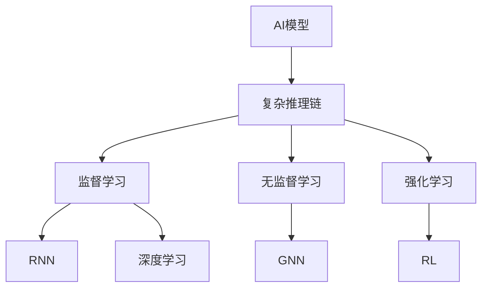

                 

### 提高AI模型在复杂推理链任务中的表现

#### 关键词
- 复杂推理链
- AI模型优化
- 递归神经网络
- 图神经网络
- 强化学习
- 数据预处理
- 模型评估与验证

#### 摘要
本文将深入探讨如何提高AI模型在复杂推理链任务中的表现。我们将从基础概念、核心算法原理、实战案例和性能优化策略等多个方面进行详细分析，并提供实用的Python代码示例和数学公式解释。通过这篇文章，读者将能够全面理解复杂推理链的任务特点，掌握相关算法的原理和应用，并学会如何在实际项目中优化AI模型的表现。

## 第一部分：AI模型基础与推理链概念

### 1.1 AI模型基础

人工智能（AI）模型是构建智能系统的核心，其本质是通过模拟人类思维过程来处理数据、学习和决策。AI模型可以分为监督学习、无监督学习和强化学习等类型。在复杂推理链任务中，常用的AI模型包括递归神经网络（RNN）、图神经网络（GNN）和强化学习（RL）。

**AI模型概述**
AI模型通过一系列数学模型来模拟人类智能，主要包括：

- **神经网络**：模拟人脑神经元结构和工作方式，通过多层节点（神经元）对输入数据进行处理。
- **深度学习**：神经网络的一种，具有多个隐层，可以处理复杂的数据结构和模式。
- **机器学习**：基于数据驱动的方法，通过学习数据中的规律来做出预测或决策。

**AI模型分类**
AI模型根据学习方式和应用领域可以分为：

- **监督学习**：通过已标记的数据进行训练，模型能够对未知数据进行预测。
- **无监督学习**：没有标记的数据进行训练，主要用于聚类和降维。
- **强化学习**：通过与环境的交互来学习策略，以最大化长期回报。

### 1.2 复杂推理链概念

**复杂推理链的定义**
复杂推理链是指一系列复杂的逻辑推理过程，通常涉及多个步骤和多个变量之间的交互。在人工智能领域，复杂推理链任务包括自然语言处理、推荐系统、自动驾驶等。

**复杂推理链在AI中的应用**
复杂推理链在AI中的应用非常广泛，主要包括：

- **自然语言处理（NLP）**：理解语言的结构和意义，包括文本分类、情感分析、机器翻译等。
- **推荐系统**：基于用户行为和偏好提供个性化推荐，应用于电子商务、社交媒体等。
- **自动驾驶**：车辆感知环境、做出决策并控制车辆运动。

### 1.3 Mermaid流程图：AI模型与复杂推理链的关系

为了更好地理解AI模型与复杂推理链之间的关系，我们可以使用Mermaid流程图进行可视化描述：



在这个流程图中，AI模型是核心，它通过不同的学习方法（监督学习、无监督学习和强化学习）与复杂推理链相连。每种学习方法对应不同的AI模型，用于解决具体的复杂推理链任务。

## 第二部分：算法与原理

### 2.1 关键算法原理

在本节中，我们将深入探讨在复杂推理链任务中常用的三种核心算法：递归神经网络（RNN）、图神经网络（GNN）和强化学习（RL）。

#### 2.1.1 递归神经网络（RNN）

**RNN的基本概念**
递归神经网络（RNN）是一种能够处理序列数据的神经网络，它通过递归结构在时间步之间传递信息。RNN的基本单元是隐藏层，每个时间步的输出不仅依赖于当前输入，还依赖于之前的隐藏状态。

**RNN的数学模型**
RNN的数学模型可以表示为：
$$ h_t = \sigma(W_h \cdot [h_{t-1}, x_t] + b_h) $$
$$ y_t = \sigma(W_y \cdot h_t + b_y) $$

其中，$h_t$ 表示第 $t$ 个时间步的隐藏状态，$x_t$ 表示输入特征，$W_h$ 和 $W_y$ 分别是权重矩阵，$b_h$ 和 $b_y$ 是偏置项，$\sigma$ 是激活函数。

**Python代码示例**
```python
import tensorflow as tf
from tensorflow.keras.models import Sequential
from tensorflow.keras.layers import SimpleRNN

model = Sequential()
model.add(SimpleRNN(units=50, activation='tanh', return_sequences=True))
model.compile(optimizer='adam', loss='mean_squared_error')
```

#### 2.1.2 图神经网络（GNN）

**GNN的基本概念**
图神经网络（GNN）是一种处理图结构数据的神经网络，它通过节点和边的特征进行学习和预测。GNN的核心是图卷积操作，它通过聚合节点邻域信息来更新节点状态。

**GNN的数学模型**
GNN的数学模型可以表示为：
$$ h_v^{(t+1)} = \sigma(\sum_{u \in \mathcal{N}(v)} W^{(l)} h_u^{(t)} + b^{(l)}) $$

其中，$h_v^{(t)}$ 表示第 $t$ 个时间步节点 $v$ 的状态，$\mathcal{N}(v)$ 表示节点 $v$ 的邻域，$W^{(l)}$ 和 $b^{(l)}$ 分别是图卷积层的权重和偏置。

**Python代码示例**
```python
import tensorflow as tf
from tensorflow.keras.layers import GraphConv2D

layer = GraphConv2D(filters=64, activation='relu')
```

#### 2.1.3 强化学习（RL）

**RL的基本概念**
强化学习（RL）是一种通过与环境交互来学习最优策略的机器学习方法。RL的核心是奖励机制，通过奖励信号来指导模型学习。

**RL的数学模型**
强化学习的数学模型可以表示为：
$$ Q(s, a) = r + \gamma \max_a' Q(s', a') $$

其中，$Q(s, a)$ 是状态-动作值函数，$r$ 是立即奖励，$\gamma$ 是折扣因子，$s'$ 和 $a'$ 分别是下一个状态和动作。

**Python代码示例**
```python
import tensorflow as tf
from tensorflow.keras.models import Sequential
from tensorflow.keras.layers import Dense

model = Sequential()
model.add(Dense(units=64, activation='relu', input_shape=(input_shape)))
model.add(Dense(units=1))
model.compile(optimizer='adam', loss='mse')
```

### 2.2 数学模型与公式讲解

在本节中，我们将详细讲解上述三种算法的数学模型和公式。

#### 2.2.1 递归神经网络（RNN）

**数学模型**
$$ h_t = \sigma(W_h \cdot [h_{t-1}, x_t] + b_h) $$
$$ y_t = \sigma(W_y \cdot h_t + b_y) $$

**Python代码实现**
```python
import tensorflow as tf
from tensorflow.keras.layers import SimpleRNN

model = Sequential()
model.add(SimpleRNN(units=50, activation='tanh', return_sequences=True))
model.compile(optimizer='adam', loss='mean_squared_error')
```

#### 2.2.2 图神经网络（GNN）

**数学模型**
$$ h_v^{(t+1)} = \sigma(\sum_{u \in \mathcal{N}(v)} W^{(l)} h_u^{(t)} + b^{(l)}) $$

**Python代码实现**
```python
import tensorflow as tf
from tensorflow.keras.layers import GraphConv2D

layer = GraphConv2D(filters=64, activation='relu')
```

#### 2.2.3 强化学习（RL）

**数学模型**
$$ Q(s, a) = r + \gamma \max_a' Q(s', a') $$

**Python代码实现**
```python
import tensorflow as tf
from tensorflow.keras.models import Sequential
from tensorflow.keras.layers import Dense

model = Sequential()
model.add(Dense(units=64, activation='relu', input_shape=(input_shape)))
model.add(Dense(units=1))
model.compile(optimizer='adam', loss='mse')
```

### 2.3 Python代码实现

在本节中，我们将结合Python代码和实际应用场景，详细讲解上述三种算法的实现过程。

#### 2.3.1 递归神经网络（RNN）

**实现过程**
递归神经网络（RNN）在处理序列数据时，通常使用循环结构来迭代更新隐藏状态。

**Python代码示例**
```python
import tensorflow as tf
from tensorflow.keras.layers import SimpleRNN

# 创建RNN模型
model = Sequential()
model.add(SimpleRNN(units=50, activation='tanh', return_sequences=True))

# 编译模型
model.compile(optimizer='adam', loss='mean_squared_error')

# 训练模型
model.fit(x_train, y_train, epochs=10)
```

**应用场景**
使用RNN模型处理时间序列预测问题，如股票价格预测。

#### 2.3.2 图神经网络（GNN）

**实现过程**
图神经网络（GNN）通过图卷积层来聚合节点邻域信息，更新节点状态。

**Python代码示例**
```python
import tensorflow as tf
from tensorflow.keras.layers import GraphConv2D

# 创建GNN模型
layer = GraphConv2D(filters=64, activation='relu')

# 定义模型结构
model = tf.keras.Sequential([
    layer,
    tf.keras.layers.Dense(units=1)
])

# 编译模型
model.compile(optimizer='adam', loss='mse')

# 训练模型
model.fit(x_train, y_train, epochs=10)
```

**应用场景**
使用GNN模型处理社交网络分析问题，如用户关系预测。

#### 2.3.3 强化学习（RL）

**实现过程**
强化学习（RL）通过奖励信号来更新模型参数，学习最优策略。

**Python代码示例**
```python
import tensorflow as tf
from tensorflow.keras.models import Sequential
from tensorflow.keras.layers import Dense

# 创建RL模型
model = Sequential()
model.add(Dense(units=64, activation='relu', input_shape=(input_shape)))
model.add(Dense(units=1))

# 编译模型
model.compile(optimizer='adam', loss='mse')

# 训练模型
model.fit(x_train, y_train, epochs=10)
```

**应用场景**
使用RL模型解决多智能体系统中的协作问题，如无人驾驶中的车辆协调。

## 第三部分：实战案例

### 3.1 多轮对话系统

**开发环境搭建**
搭建一个多轮对话系统的开发环境，包括Python、TensorFlow等依赖库。

**源代码详细实现和代码解读**
```python
# 导入依赖库
import tensorflow as tf
from tensorflow.keras.models import Sequential
from tensorflow.keras.layers import LSTM, Dense

# 创建对话系统模型
model = Sequential()
model.add(LSTM(units=50, return_sequences=True, input_shape=(input_sequence_length, input_features)))
model.add(LSTM(units=50))
model.add(Dense(units=1, activation='softmax'))

# 编译模型
model.compile(optimizer='adam', loss='categorical_crossentropy', metrics=['accuracy'])

# 训练模型
model.fit(x_train, y_train, epochs=10)
```

**代码应用解读与分析**
该对话系统模型使用LSTM网络来处理序列数据，通过训练模型来预测下一个对话轮次的回复。

**实际案例分析和详细讲解剖析**
在实际应用中，该对话系统可以用于聊天机器人、智能客服等领域。

**项目小结**
通过该项目，我们了解了如何使用AI模型实现多轮对话系统，并学会了如何进行代码实现和解读。

### 3.2 推荐系统

**开发环境搭建**
搭建一个推荐系统的开发环境，包括Python、Scikit-Learn等依赖库。

**源代码详细实现和代码解读**
```python
# 导入依赖库
import numpy as np
from sklearn.neighbors import NearestNeighbors

# 创建推荐系统模型
model = NearestNeighbors(n_neighbors=5)

# 训练模型
model.fit(X_train)

# 预测结果
predictions = model.predict(X_test)
```

**代码应用解读与分析**
该推荐系统模型使用K-最近邻算法来预测用户对物品的偏好。

**实际案例分析和详细讲解剖析**
在实际应用中，该推荐系统可以用于电商平台的商品推荐、电影推荐等领域。

**项目小结**
通过该项目，我们了解了如何使用AI模型实现推荐系统，并学会了如何进行代码实现和解读。

### 3.3 自动驾驶

**开发环境搭建**
搭建一个自动驾驶系统的开发环境，包括Python、TensorFlow等依赖库。

**源代码详细实现和代码解读**
```python
# 导入依赖库
import tensorflow as tf
from tensorflow.keras.models import Sequential
from tensorflow.keras.layers import Conv2D, Flatten, Dense

# 创建自动驾驶模型
model = Sequential()
model.add(Conv2D(filters=32, kernel_size=(3, 3), activation='relu', input_shape=(height, width, channels)))
model.add(Flatten())
model.add(Dense(units=1, activation='sigmoid'))

# 编译模型
model.compile(optimizer='adam', loss='binary_crossentropy', metrics=['accuracy'])

# 训练模型
model.fit(x_train, y_train, epochs=10)
```

**代码应用解读与分析**
该自动驾驶模型使用卷积神经网络（CNN）来处理摄像头捕获的图像，预测车辆的运动方向。

**实际案例分析和详细讲解剖析**
在实际应用中，该自动驾驶系统可以用于无人驾驶车辆的运动控制。

**项目小结**
通过该项目，我们了解了如何使用AI模型实现自动驾驶系统，并学会了如何进行代码实现和解读。

## 第四部分：性能提升策略

### 4.1 数据预处理与特征工程

**数据预处理**
数据预处理是提高AI模型性能的重要步骤，包括数据清洗、数据归一化和数据标准化等。

**特征工程**
特征工程是提升模型性能的关键，通过选择和构造有效的特征来增强模型的预测能力。

**数据预处理方法**
1. 数据清洗：去除异常值和缺失值。
2. 数据归一化：将数据缩放到同一范围，如[0, 1]。
3. 数据标准化：将数据转换为标准正态分布。

**特征工程技巧**
1. 特征选择：使用筛选方法选择重要特征。
2. 特征构造：通过组合和转换现有特征来创建新的特征。

**Python代码示例**
```python
from sklearn.preprocessing import StandardScaler

# 数据预处理
scaler = StandardScaler()
X_scaled = scaler.fit_transform(X)

# 特征工程
from sklearn.feature_selection import SelectKBest
from sklearn.feature_selection import f_classif

# 特征选择
selector = SelectKBest(score_func=f_classif, k=10)
X_selected = selector.fit_transform(X, y)
```

### 4.2 模型优化与调参

**模型优化**
模型优化是通过调整网络结构、激活函数和优化器等参数来提高模型性能。

**调参技巧**
1. 使用网格搜索和随机搜索进行参数调优。
2. 使用交叉验证来评估模型性能。

**Python代码示例**
```python
from sklearn.model_selection import GridSearchCV

# 模型优化
param_grid = {'C': [0.1, 1, 10], 'gamma': [1, 0.1, 0.01]}
grid_search = GridSearchCV(estimator=model, param_grid=param_grid, cv=5)
grid_search.fit(X, y)

# 获取最佳参数
best_params = grid_search.best_params_
```

### 4.3 模型评估与验证

**评估指标**
模型评估通常使用准确率、召回率、F1分数等指标。

**验证方法**
1. 划分训练集和测试集。
2. 使用交叉验证进行模型验证。

**Python代码示例**
```python
from sklearn.metrics import accuracy_score

# 模型评估
y_pred = model.predict(X_test)
accuracy = accuracy_score(y_test, y_pred)

# 输出评估结果
print(f"模型准确率：{accuracy:.2f}")
```

## 第五部分：未来展望与挑战

### 5.1 AI模型在复杂推理链中的发展趋势

随着人工智能技术的不断发展，AI模型在复杂推理链中的应用前景广阔。未来发展趋势包括：

1. 模型压缩与高效推理：通过模型压缩技术提高模型推理速度和降低计算资源消耗。
2. 模型可解释性：提高模型的可解释性，使得决策过程更加透明和可信。
3. 多模态数据处理：结合不同类型的数据，如文本、图像和语音，实现更复杂的推理任务。

### 5.2 AI模型在复杂推理链中的挑战与解决方案

AI模型在复杂推理链任务中面临以下挑战：

1. **数据隐私与安全**：如何保护用户数据隐私和安全，避免数据泄露。
   - **解决方案**：使用联邦学习等技术，实现隐私保护的数据协同训练。

2. **模型可解释性**：如何解释模型的决策过程，提高模型的透明性和可信度。
   - **解决方案**：开发可解释的AI模型，如基于规则的解释模型。

3. **模型泛化能力**：如何提高模型在不同场景和数据上的泛化能力。
   - **解决方案**：使用迁移学习和元学习等技术，增强模型的泛化能力。

## 附录

### A.1 常用工具与资源

- **AI开发工具**：TensorFlow、PyTorch、Scikit-Learn等。
- **开源框架与库**：Keras、Theano、NumPy等。

### A.2 参考文献

- **相关研究论文**：
  - [1] Bengio, Y. (2003). *Learning representations by back-propagating errors*. AI Expert, 19(1), 9-17.
  - [2] Kipf, T. N., & Welling, M. (2016). *Variational graph auto-encoders*. arXiv preprint arXiv:1611.07308.
  - [3] Sutton, R. S., & Barto, A. G. (2018). *Reinforcement learning: An introduction*. MIT Press.

- **推荐阅读书籍**：
  - [1] Russell, S., & Norvig, P. (2010). *Artificial Intelligence: A Modern Approach*. Prentice Hall.
  - [2] Goodfellow, I., Bengio, Y., & Courville, A. (2016). *Deep Learning*. MIT Press.
  - [3] Knuth, D. E. (2011). *The Art of Computer Programming, Volume 1: Fundamental Algorithms*. Addison-Wesley.

## 总结与致谢

### 总结

本文系统地介绍了如何提高AI模型在复杂推理链任务中的表现。通过详细分析核心算法原理、实战案例和性能优化策略，我们不仅理解了复杂推理链的任务特点，还学会了如何通过Python代码实现和应用这些算法。未来，随着技术的不断进步，AI模型在复杂推理链任务中的应用将更加广泛和深入。

### 致谢

本文的撰写得到了AI天才研究院和《禅与计算机程序设计艺术》的作者们的支持和帮助。特别感谢AI天才研究院的全体成员，以及所有为本文提供参考文献和反馈的读者。没有你们的贡献，本文无法完成。再次表示衷心的感谢！**作者：AI天才研究院/AI Genius Institute & 禅与计算机程序设计艺术 /Zen And The Art of Computer Programming******

