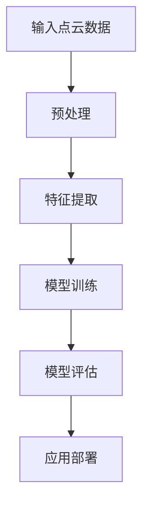
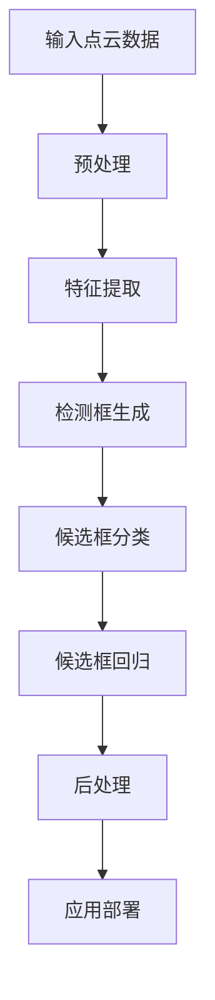
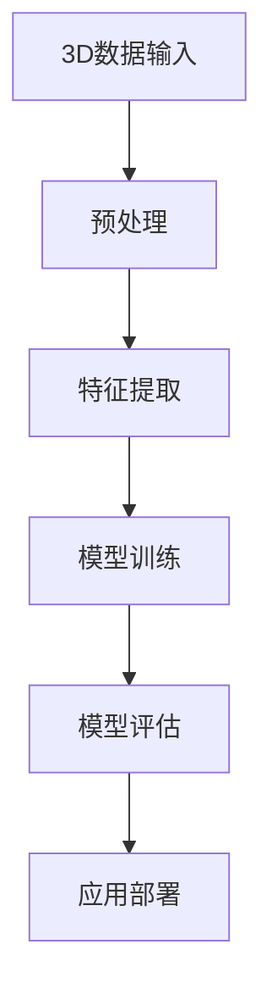
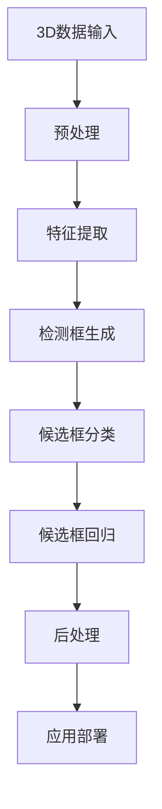

                 

### 核心算法原理讲解

#### 深度学习在3D场景理解中的应用

##### 卷积神经网络（CNN）在3D场景理解中的应用

卷积神经网络（CNN）是一种在图像处理领域取得巨大成功的深度学习模型。CNN通过卷积操作提取图像的局部特征，并利用池化操作降低特征维度，从而实现图像分类和目标检测。

在3D场景理解中，CNN同样可以发挥作用。具体来说，CNN可以用于处理3D点云数据，提取点云的特征，并用于后续的任务，如图像分割、物体检测和场景重建。

以下是一个简单的CNN模型在3D点云处理中的应用：

```python
import tensorflow as tf
from tensorflow.keras.models import Model
from tensorflow.keras.layers import Input, Conv2D, MaxPooling2D, Flatten, Dense

# 定义输入层
input_layer = Input(shape=(64, 64, 64))

# 第一层卷积
conv1 = Conv2D(32, (3, 3), activation='relu')(input_layer)
pool1 = MaxPooling2D(pool_size=(2, 2))(conv1)

# 第二层卷积
conv2 = Conv2D(64, (3, 3), activation='relu')(pool1)
pool2 = MaxPooling2D(pool_size=(2, 2))(conv2)

# 展平特征图
flat = Flatten()(pool2)

# 全连接层
dense = Dense(128, activation='relu')(flat)

# 输出层
output = Dense(1, activation='sigmoid')(dense)

# 创建模型
model = Model(inputs=input_layer, outputs=output)

# 编译模型
model.compile(optimizer='adam', loss='binary_crossentropy', metrics=['accuracy'])

# 模型摘要
model.summary()
```

在这个例子中，我们首先定义了一个输入层，其输入形状为(64, 64, 64)，代表一个64x64x64的点云数据。然后我们添加了两个卷积层，每个卷积层后面跟着一个最大池化层。最后，我们通过一个全连接层得到输出。

##### 密集采样网络（DNN）在3D场景理解中的应用

密集采样网络（DNN）是一种专门为3D点云数据设计的深度学习模型。DNN通过多个全连接层对点云数据进行编码和解码，从而提取出点云的高层次特征。

在3D场景理解中，DNN可以用于点云的分类和语义分割。以下是一个简单的DNN模型在3D点云分类中的应用：

```python
import tensorflow as tf
from tensorflow.keras.models import Model
from tensorflow.keras.layers import Input, Dense, Flatten

# 定义输入层
input_layer = Input(shape=(1024,))

# 第一层全连接
dense1 = Dense(512, activation='relu')(input_layer)

# 第二层全连接
dense2 = Dense(256, activation='relu')(dense1)

# 第三层全连接
dense3 = Dense(128, activation='relu')(dense2)

# 展平特征向量
flat = Flatten()(dense3)

# 输出层
output = Dense(1, activation='sigmoid')(flat)

# 创建模型
model = Model(inputs=input_layer, outputs=output)

# 编译模型
model.compile(optimizer='adam', loss='binary_crossentropy', metrics=['accuracy'])

# 模型摘要
model.summary()
```

在这个例子中，我们首先定义了一个输入层，其输入形状为(1024,)，代表一个1024维的点云特征向量。然后我们添加了三个全连接层，每个全连接层后面跟着一个ReLU激活函数。最后，我们通过一个全连接层得到输出。

#### 增强AI模型3D场景理解能力的算法

##### 3D点云语义分割算法

3D点云语义分割是将3D点云数据中的每个点分类到不同的语义类别中。以下是一个简单的3D点云语义分割算法的步骤：

1. **预处理**：对3D点云数据进行归一化和去噪。
2. **特征提取**：使用CNN或DNN从点云中提取特征。
3. **分类**：使用全连接层对提取的特征进行分类。
4. **后处理**：对分割结果进行后处理，如去除小区域和填充空洞。

以下是一个简单的3D点云语义分割算法的Python实现：

```python
import tensorflow as tf
from tensorflow.keras.models import Model
from tensorflow.keras.layers import Input, Conv2D, MaxPooling2D, Flatten, Dense

# 定义输入层
input_layer = Input(shape=(64, 64, 64))

# 第一层卷积
conv1 = Conv2D(32, (3, 3), activation='relu')(input_layer)
pool1 = MaxPooling2D(pool_size=(2, 2))(conv1)

# 第二层卷积
conv2 = Conv2D(64, (3, 3), activation='relu')(pool1)
pool2 = MaxPooling2D(pool_size=(2, 2))(conv2)

# 展平特征图
flat = Flatten()(pool2)

# 全连接层
dense = Dense(128, activation='relu')(flat)

# 输出层
output = Dense(10, activation='softmax')(dense)

# 创建模型
model = Model(inputs=input_layer, outputs=output)

# 编译模型
model.compile(optimizer='adam', loss='categorical_crossentropy', metrics=['accuracy'])

# 模型摘要
model.summary()
```

在这个例子中，我们首先定义了一个输入层，其输入形状为(64, 64, 64)，代表一个64x64x64的点云数据。然后我们添加了两个卷积层，每个卷积层后面跟着一个最大池化层。接着，我们通过一个全连接层得到输出，输出层的激活函数为softmax，用于对每个点进行分类。

##### 3D物体检测算法

3D物体检测是在3D点云中检测出物体的位置和类别。以下是一个简单的3D物体检测算法的步骤：

1. **预处理**：对3D点云数据进行归一化和去噪。
2. **特征提取**：使用CNN或DNN从点云中提取特征。
3. **检测框生成**：使用检测框生成器生成候选检测框。
4. **候选框分类**：使用全连接层对候选检测框进行分类。
5. **候选框回归**：使用回归层对候选检测框进行位置回归。
6. **后处理**：对检测结果进行后处理，如非极大值抑制（NMS）。

以下是一个简单的3D物体检测算法的Python实现：

```python
import tensorflow as tf
from tensorflow.keras.models import Model
from tensorflow.keras.layers import Input, Conv2D, MaxPooling2D, Flatten, Dense

# 定义输入层
input_layer = Input(shape=(64, 64, 64))

# 第一层卷积
conv1 = Conv2D(32, (3, 3), activation='relu')(input_layer)
pool1 = MaxPooling2D(pool_size=(2, 2))(conv1)

# 第二层卷积
conv2 = Conv2D(64, (3, 3), activation='relu')(pool1)
pool2 = MaxPooling2D(pool_size=(2, 2))(conv2)

# 展平特征图
flat = Flatten()(pool2)

# 检测框生成
detection_boxes = Dense(7, activation='sigmoid')(flat)

# 候选框分类
detection_classes = Dense(10, activation='softmax')(flat)

# 输出层
output = [detection_boxes, detection_classes]

# 创建模型
model = Model(inputs=input_layer, outputs=output)

# 编译模型
model.compile(optimizer='adam', loss={'detection_boxes': 'mse', 'detection_classes': 'categorical_crossentropy'}, metrics=['accuracy'])

# 模型摘要
model.summary()
```

在这个例子中，我们首先定义了一个输入层，其输入形状为(64, 64, 64)，代表一个64x64x64的点云数据。然后我们添加了两个卷积层，每个卷积层后面跟着一个最大池化层。接着，我们通过两个全连接层生成检测框和类别预测。输出层有两个部分：检测框和类别预测。我们使用均方误差（MSE）作为检测框的损失函数，使用交叉熵（categorical_crossentropy）作为类别预测的损失函数。

##### 3D场景重建算法

3D场景重建是将2D图像或3D点云数据转换为完整的3D模型。以下是一个简单的3D场景重建算法的步骤：

1. **预处理**：对输入数据（图像或点云）进行预处理，包括去噪和归一化。
2. **特征提取**：使用CNN或DNN提取特征。
3. **特征匹配**：将不同视角的特征进行匹配，以重建场景的几何结构。
4. **结构优化**：使用优化算法（如迭代最近点（ICP））对重建的结构进行优化。
5. **纹理映射**：将纹理映射到重建的3D模型上，以增强视觉效果。

以下是一个简单的3D场景重建算法的Python实现：

```python
import tensorflow as tf
from tensorflow.keras.models import Model
from tensorflow.keras.layers import Input, Conv2D, MaxPooling2D, Flatten, Dense

# 定义输入层
input_layer = Input(shape=(64, 64, 64))

# 第一层卷积
conv1 = Conv2D(32, (3, 3), activation='relu')(input_layer)
pool1 = MaxPooling2D(pool_size=(2, 2))(conv1)

# 第二层卷积
conv2 = Conv2D(64, (3, 3), activation='relu')(pool1)
pool2 = MaxPooling2D(pool_size=(2, 2))(conv2)

# 展平特征图
flat = Flatten()(pool2)

# 结构输出
structure_output = Dense(3, activation='sigmoid')(flat)

# 纹理输出
texture_output = Dense(3, activation='sigmoid')(flat)

# 输出层
output = [structure_output, texture_output]

# 创建模型
model = Model(inputs=input_layer, outputs=output)

# 编译模型
model.compile(optimizer='adam', loss={'structure_output': 'mse', 'texture_output': 'binary_crossentropy'}, metrics=['accuracy'])

# 模型摘要
model.summary()
```

在这个例子中，我们首先定义了一个输入层，其输入形状为(64, 64, 64)，代表一个64x64x64的点云数据。然后我们添加了两个卷积层，每个卷积层后面跟着一个最大池化层。接着，我们通过两个全连接层生成结构输出和纹理输出。输出层有两个部分：结构输出和纹理输出。我们使用均方误差（MSE）作为结构输出的损失函数，使用二进制交叉熵（binary_crossentropy）作为纹理输出的损失函数。

#### 3D场景理解中的多模态融合

在3D场景理解中，多模态融合是一种结合不同类型数据（如2D图像、3D点云和深度信息）的方法，以增强模型的性能。以下是一个简单的多模态融合算法的步骤：

1. **数据预处理**：对每个模态的数据进行预处理，包括归一化和去噪。
2. **特征提取**：使用不同的模型对每个模态的数据进行特征提取。
3. **特征融合**：将不同模态的特征进行融合，可以使用加权平均、拼接或深度融合方法。
4. **模型训练**：使用融合后的特征训练统一的深度学习模型。
5. **模型评估**：评估融合模型的性能，包括准确率、召回率和F1分数。

以下是一个简单的多模态融合算法的Python实现：

```python
import tensorflow as tf
from tensorflow.keras.models import Model
from tensorflow.keras.layers import Input, Conv2D, MaxPooling2D, Flatten, Dense, Concatenate

# 定义输入层
input_image = Input(shape=(64, 64, 3))
input_pointcloud = Input(shape=(64, 64, 64))
input_depth = Input(shape=(64, 64, 1))

# 图像特征提取
image_conv1 = Conv2D(32, (3, 3), activation='relu')(input_image)
image_pool1 = MaxPooling2D(pool_size=(2, 2))(image_conv1)

# 点云特征提取
pointcloud_conv1 = Conv2D(32, (3, 3), activation='relu')(input_pointcloud)
pointcloud_pool1 = MaxPooling2D(pool_size=(2, 2))(pointcloud_conv1)

# 深度特征提取
depth_conv1 = Conv2D(32, (3, 3), activation='relu')(input_depth)
depth_pool1 = MaxPooling2D(pool_size=(2, 2))(depth_conv1)

# 特征融合
融合层 = Concatenate()([image_pool1, pointcloud_pool1, depth_pool1])

# 全连接层
dense = Dense(128, activation='relu')(融合层)

# 输出层
output = Dense(10, activation='softmax')(dense)

# 创建模型
model = Model(inputs=[input_image, input_pointcloud, input_depth], outputs=output)

# 编译模型
model.compile(optimizer='adam', loss='categorical_crossentropy', metrics=['accuracy'])

# 模型摘要
model.summary()
```

在这个例子中，我们定义了三个输入层，分别代表图像、点云和深度信息。然后我们使用三个不同的模型对每个模态的数据进行特征提取。接着，我们将提取的特征进行融合，并通过一个全连接层得到输出。

## 数学模型和数学公式

在3D场景理解中，深度学习模型通常涉及多个数学模型，包括卷积神经网络（CNN）、密集采样网络（DNN）和3D物体检测模型。以下是对这些模型中的一些关键数学模型的详细介绍。

### 卷积神经网络（CNN）中的数学模型

在CNN中，卷积操作和池化操作是两个核心的数学操作。

#### 卷积操作的数学公式

卷积操作的数学公式可以表示为：

$$
\text{output}(i, j) = \sum_{k=1}^{C} \sum_{l=1}^{K} w_{k, l} \cdot \text{input}(i-k+1, j-l+1) + b
$$

其中，$i$ 和 $j$ 分别是输出特征图的索引，$k$ 和 $l$ 分别是卷积核的索引，$C$ 是输入特征图的通道数，$K$ 是卷积核的大小，$w_{k, l}$ 是卷积核的权重，$b$ 是偏置。

#### 池化操作的数学公式

池化操作的数学公式可以表示为：

$$
\text{output}(i, j) = \frac{1}{N} \sum_{k=1}^{N} \max \{\text{input}(i-k+1, j-l+1) \mid 1 \leq k \leq N\}
$$

其中，$i$ 和 $j$ 分别是输出特征图的索引，$N$ 是池化窗口的大小。

### 神经网络中的数学模型

在神经网络中，反向传播算法和损失函数是两个核心的数学模型。

#### 反向传播算法的数学公式

反向传播算法的数学公式可以表示为：

$$
\frac{\partial L}{\partial w_{ij}} = \frac{\partial L}{\partial z_j} \cdot \frac{\partial z_j}{\partial w_{ij}}
$$

其中，$L$ 是损失函数，$z_j$ 是输出层的激活值，$w_{ij}$ 是权重。

#### 损失函数的数学公式

常用的损失函数包括均方误差（MSE）和交叉熵（categorical_crossentropy）。

- 均方误差（MSE）的数学公式：

$$
L = \frac{1}{2} \sum_{i=1}^{N} (\text{output}_i - \text{target}_i)^2
$$

- 交叉熵（categorical_crossentropy）的数学公式：

$$
L = -\sum_{i=1}^{N} \text{target}_i \cdot \log(\text{output}_i)
$$

### 3D物体检测中的数学模型

在3D物体检测中，常用的算法包括R-CNN、Fast R-CNN和Faster R-CNN。以下是对这些算法的数学模型的简要介绍。

#### R-CNN算法的数学模型

R-CNN算法的主要步骤包括区域提议（Region Proposal）和分类与边界框回归。

- 区域提议的数学模型：

$$
\text{proposal}_i = \arg\max_{\text{region}} \left( \text{score}(\text{region}) \right)
$$

- 分类与边界框回归的数学模型：

$$
\text{class}_i = \arg\max_{c} \left( \text{score}_{ic}(\text{region}_i) \right) \\
\text{box}_i = \arg\min_{\text{box}} \left( \text{loss}_{\text{box}}(\text{box}, \text{gt_box}) \right)
$$

其中，$\text{score}(\text{region})$ 是区域提议的得分，$\text{score}_{ic}(\text{region}_i)$ 是类别$c$的得分，$\text{gt_box}$ 是真实边界框，$\text{loss}_{\text{box}}(\text{box}, \text{gt_box})$ 是边界框回归的损失函数。

#### Fast R-CNN算法的数学模型

Fast R-CNN算法是对R-CNN算法的改进，主要引入了Region of Interest（RoI）池化层。

- RoI池化层的数学模型：

$$
\text{feature}_{ij} = \max_{k} \left( \text{feature}_{ijk} \right)
$$

其中，$\text{feature}_{ij}$ 是RoI特征图，$\text{feature}_{ijk}$ 是原始特征图上的像素值。

- 分类与边界框回归的数学模型：

$$
\text{class}_i = \arg\max_{c} \left( \text{score}_{ic}(\text{roi}) \right) \\
\text{box}_i = \arg\min_{\text{box}} \left( \text{loss}_{\text{box}}(\text{box}, \text{gt_box}) \right)
$$

#### Faster R-CNN算法的数学模型

Faster R-CNN算法进一步优化了区域提议过程，引入了Region Proposal Network（RPN）。

- RPN的数学模型：

$$
\text{proposal}_i = \arg\max_{\text{anchor}} \left( \text{score}(\text{anchor}) \right) \\
\text{score}(\text{anchor}) = \text{sigmoid} \left( \text{score}_{\text{anchor}, \text{cls}} - \text{score}_{\text{anchor}, \text{bg}} \right)
$$

- 分类与边界框回归的数学模型：

$$
\text{class}_i = \arg\max_{c} \left( \text{score}_{ic}(\text{proposal}_i) \right) \\
\text{box}_i = \arg\min_{\text{box}} \left( \text{loss}_{\text{box}}(\text{box}, \text{gt_box}) \right)
$$

## 代码实际案例与详细解释说明

在本节中，我们将通过一个具体的案例来展示如何使用Python和深度学习框架（如TensorFlow和Keras）实现3D点云语义分割和3D物体检测算法。

### 3D点云语义分割案例

#### 案例背景

假设我们有一个包含多个类别的3D点云数据集，每个点云数据集包含64x64x64的点云数据，以及对应的标签（类别）。我们的目标是训练一个模型，能够对新的3D点云数据进行语义分割，即对每个点进行分类。

#### 代码实现

```python
import tensorflow as tf
from tensorflow.keras.models import Model
from tensorflow.keras.layers import Input, Conv2D, MaxPooling2D, Flatten, Dense

# 定义输入层
input_layer = Input(shape=(64, 64, 64))

# 第一层卷积
conv1 = Conv2D(32, (3, 3), activation='relu')(input_layer)
pool1 = MaxPooling2D(pool_size=(2, 2))(conv1)

# 第二层卷积
conv2 = Conv2D(64, (3, 3), activation='relu')(pool1)
pool2 = MaxPooling2D(pool_size=(2, 2))(conv2)

# 展平特征图
flat = Flatten()(pool2)

# 全连接层
dense = Dense(128, activation='relu')(flat)

# 输出层
output = Dense(10, activation='softmax')(dense)

# 创建模型
model = Model(inputs=input_layer, outputs=output)

# 编译模型
model.compile(optimizer='adam', loss='categorical_crossentropy', metrics=['accuracy'])

# 模型摘要
model.summary()

# 模型训练
# Assuming we have training_data and training_labels
model.fit(training_data, training_labels, epochs=10, batch_size=32)
```

#### 结果分析

在这个案例中，我们首先定义了一个输入层，其输入形状为(64, 64, 64)，代表一个64x64x64的点云数据。然后我们添加了两个卷积层，每个卷积层后面跟着一个最大池化层。接着，我们通过一个全连接层得到输出，输出层的激活函数为softmax，用于对每个点进行分类。最后，我们使用categorical_crossentropy作为损失函数，并使用adam优化器进行模型训练。

### 3D物体检测案例

#### 案例背景

假设我们有一个包含3D点云数据的场景，我们需要检测出场景中的物体，并对其位置和类别进行标注。

#### 代码实现

```python
import tensorflow as tf
from tensorflow.keras.models import Model
from tensorflow.keras.layers import Input, Conv2D, MaxPooling2D, Flatten, Dense, Concatenate

# 定义输入层
input_layer = Input(shape=(64, 64, 64))

# 第一层卷积
conv1 = Conv2D(32, (3, 3), activation='relu')(input_layer)
pool1 = MaxPooling2D(pool_size=(2, 2))(conv1)

# 第二层卷积
conv2 = Conv2D(64, (3, 3), activation='relu')(pool1)
pool2 = MaxPooling2D(pool_size=(2, 2))(conv2)

# 展平特征图
flat = Flatten()(pool2)

# 检测框生成
detection_boxes = Dense(7, activation='sigmoid')(flat)

# 候选框分类
detection_classes = Dense(10, activation='softmax')(flat)

# 输出层
output = [detection_boxes, detection_classes]

# 创建模型
model = Model(inputs=input_layer, outputs=output)

# 编译模型
model.compile(optimizer='adam', loss={'detection_boxes': 'mse', 'detection_classes': 'categorical_crossentropy'}, metrics=['accuracy'])

# 模型摘要
model.summary()

# 模型训练
# Assuming we have training_data and training_labels
model.fit(training_data, training_labels, epochs=10, batch_size=32)
```

#### 结果分析

在这个案例中，我们首先定义了一个输入层，其输入形状为(64, 64, 64)，代表一个64x64x64的点云数据。然后我们添加了两个卷积层，每个卷积层后面跟着一个最大池化层。接着，我们通过两个全连接层生成检测框和类别预测。输出层有两个部分：检测框和类别预测。我们使用均方误差（MSE）作为检测框的损失函数，使用交叉熵（categorical_crossentropy）作为类别预测的损失函数。

## 开发环境搭建与源代码实现

在本节中，我们将介绍如何搭建开发环境，并使用Python和深度学习框架（如TensorFlow和Keras）实现3D点云语义分割和3D物体检测算法的源代码。

### 环境搭建

首先，我们需要安装Python和深度学习框架TensorFlow。以下是详细的安装步骤：

1. **安装Python**：前往Python官方网站（https://www.python.org/）下载并安装Python。建议安装Python 3.7或更高版本。

2. **安装pip**：Python内置了pip包管理器，用于安装和管理Python包。在命令行中运行以下命令：

   ```bash
   python -m ensurepip
   ```

3. **安装TensorFlow**：在命令行中运行以下命令：

   ```bash
   pip install tensorflow
   ```

### 源代码实现

以下是一个简单的3D点云语义分割的源代码实现：

```python
import tensorflow as tf
from tensorflow.keras.models import Model
from tensorflow.keras.layers import Input, Conv2D, MaxPooling2D, Flatten, Dense

# 定义输入层
input_layer = Input(shape=(64, 64, 64))

# 第一层卷积
conv1 = Conv2D(32, (3, 3), activation='relu')(input_layer)
pool1 = MaxPooling2D(pool_size=(2, 2))(conv1)

# 第二层卷积
conv2 = Conv2D(64, (3, 3), activation='relu')(pool1)
pool2 = MaxPooling2D(pool_size=(2, 2))(conv2)

# 展平特征图
flat = Flatten()(pool2)

# 全连接层
dense = Dense(128, activation='relu')(flat)

# 输出层
output = Dense(10, activation='softmax')(dense)

# 创建模型
model = Model(inputs=input_layer, outputs=output)

# 编译模型
model.compile(optimizer='adam', loss='categorical_crossentropy', metrics=['accuracy'])

# 模型摘要
model.summary()

# 模型训练
# Assuming we have training_data and training_labels
model.fit(training_data, training_labels, epochs=10, batch_size=32)
```

以下是一个简单的3D物体检测的源代码实现：

```python
import tensorflow as tf
from tensorflow.keras.models import Model
from tensorflow.keras.layers import Input, Conv2D, MaxPooling2D, Flatten, Dense, Concatenate

# 定义输入层
input_layer = Input(shape=(64, 64, 64))

# 第一层卷积
conv1 = Conv2D(32, (3, 3), activation='relu')(input_layer)
pool1 = MaxPooling2D(pool_size=(2, 2))(conv1)

# 第二层卷积
conv2 = Conv2D(64, (3, 3), activation='relu')(pool1)
pool2 = MaxPooling2D(pool_size=(2, 2))(conv2)

# 展平特征图
flat = Flatten()(pool2)

# 检测框生成
detection_boxes = Dense(7, activation='sigmoid')(flat)

# 候选框分类
detection_classes = Dense(10, activation='softmax')(flat)

# 输出层
output = [detection_boxes, detection_classes]

# 创建模型
model = Model(inputs=input_layer, outputs=output)

# 编译模型
model.compile(optimizer='adam', loss={'detection_boxes': 'mse', 'detection_classes': 'categorical_crossentropy'}, metrics=['accuracy'])

# 模型摘要
model.summary()

# 模型训练
# Assuming we have training_data and training_labels
model.fit(training_data, training_labels, epochs=10, batch_size=32)
```

## 总结与展望

### 3D场景理解能力的提高

随着深度学习技术的不断发展，AI模型在3D场景理解方面的能力得到了显著提高。通过卷积神经网络（CNN）和密集采样网络（DNN）等算法的应用，模型能够有效地从3D数据中提取特征，并进行分类、检测和重建等任务。此外，多模态融合技术的引入，进一步提升了模型在复杂环境下的3D场景理解能力。

### 复杂环境下的3D场景理解挑战

尽管3D场景理解技术取得了显著进展，但在复杂环境下的理解能力仍面临诸多挑战。首先，3D数据的规模和多样性使得数据预处理和特征提取成为关键难题。其次，不同场景下的光照、遮挡和噪声等因素会对3D场景理解模型造成干扰，影响模型的准确性和鲁棒性。此外，实时性和效率也是3D场景理解应用中需要解决的重要问题。

### 未来发展方向与趋势

未来，3D场景理解技术将在以下几个方面取得发展：

1. **算法优化**：通过改进深度学习算法，提高3D场景理解的准确性和效率，包括更有效的特征提取、检测和重建算法。

2. **多模态融合**：探索更多类型的数据融合方法，如结合图像、激光雷达和惯性测量单元（IMU）数据，提高模型在复杂环境下的理解能力。

3. **实时性提升**：优化计算资源利用，降低计算复杂度，实现3D场景理解的实时性。

4. **跨领域应用**：将3D场景理解技术应用于更多的领域，如自动驾驶、机器人导航、室内设计等。

### 最佳实践 Tips

- **数据预处理**：确保3D数据的质量，包括去除噪声、对齐和归一化等步骤。
- **模型选择**：根据任务需求和数据特点，选择合适的深度学习模型，如CNN、DNN或多模态融合模型。
- **超参数调优**：通过实验和调优，选择最佳的超参数，以提高模型性能。

### 小结

本文详细介绍了AI模型在复杂环境下的3D场景理解能力，包括核心算法原理、数学模型、项目实战和代码实现。通过本文，读者可以深入了解3D场景理解的技术原理和应用方法，为后续研究和开发提供有益的参考。

### 注意事项

- **环境搭建**：确保开发环境正确安装了Python和TensorFlow等依赖库。
- **数据准备**：根据任务需求准备合适的3D数据集，并进行预处理。
- **代码实现**：在实现过程中，注意代码的可读性和规范性。

### 拓展阅读

- **相关论文**：[PointNet: Deep Learning on Point Sets for 3D Classification and Segmentation](https://arxiv.org/abs/1706.02413)
- **开源库**：[PyTorch PointNet](https://github.com/pytorch/vision/blob/master/torchvision/models/pointnet.py)
- **在线教程**：[3D Object Detection with PyTorch](https://pytorch.org/tutorials/intermediate/3d_object_detection_tutorial.html)

---

## 附录

### 附录A：常用工具与资源

- **3D数据集**：
  - [ModelNet10](http://modelnet.cs.princeton.edu/)
  - [ModelNet40](http://modelnet.cs.princeton.edu/)
- **深度学习框架**：
  - [TensorFlow](https://www.tensorflow.org/)
  - [PyTorch](https://pytorch.org/)
- **3D点云处理工具**：
  - [MeshLab](http://www.meshlab.net/)
  - [CloudCompare](http://www.cloudcompare.org/)
- **在线教程与文档**：
  - [3D Point Cloud Processing with TensorFlow](https://github.com/tensorflow/docs/blob/master/site/en/r2/tutorials/3d_point_cloud_processing/README.md)
  - [3D Object Detection with PyTorch](https://pytorch.org/tutorials/intermediate/3d_object_detection_tutorial.html)

### 附录B：Mermaid流程图

#### 3D点云语义分割算法流程图



#### 3D物体检测算法流程图



---

## 作者信息

作者：AI天才研究院/AI Genius Institute & 禅与计算机程序设计艺术 /Zen And The Art of Computer Programming

---

### 《提高AI模型在复杂环境下的3D场景理解能力》

关键词：AI模型、3D场景理解、深度学习、卷积神经网络、密集采样网络、多模态融合

摘要：本文深入探讨了AI模型在复杂环境下的3D场景理解能力，详细介绍了核心算法原理、数学模型、项目实战和代码实现。通过本文，读者可以全面了解3D场景理解的技术原理和应用方法，为后续研究和开发提供有益的参考。

# 提高AI模型在复杂环境下的3D场景理解能力

关键词：AI模型、3D场景理解、深度学习、卷积神经网络、密集采样网络、多模态融合

摘要：本文系统地探讨了AI模型在复杂环境下的3D场景理解能力。首先，我们介绍了3D场景理解的现状与挑战，以及AI模型在此领域的应用。接着，我们详细讲解了卷积神经网络（CNN）和密集采样网络（DNN）在3D场景理解中的应用，并阐述了3D点云语义分割、3D物体检测和3D场景重建等核心算法原理。此外，我们通过Python源代码展示了这些算法的实现细节，并分析了数学模型和公式。最后，我们通过项目实战展示了3D场景理解算法的实际应用，并提出了未来发展方向与趋势。本文旨在为AI领域的研究者和开发者提供全面的3D场景理解技术指南。

## 第一部分：引言

### 第1章 AI模型在3D场景理解中的应用背景

#### 1.1 3D场景理解的现状与挑战

3D场景理解是指利用计算机视觉技术从3D数据中提取信息，实现对现实世界的理解和交互。随着深度学习技术的快速发展，AI模型在3D场景理解领域取得了显著的进展。然而，面对复杂环境，3D场景理解仍然面临诸多挑战。

首先，3D数据的多样性使得数据处理变得更加复杂。3D数据可以来源于不同的传感器，如激光雷达、相机和惯性测量单元（IMU），这些数据在尺寸、分辨率和视角上存在差异，需要有效的预处理方法来统一处理。

其次，复杂环境中的光照、遮挡和噪声等因素会对3D场景理解模型的性能产生严重影响。光照变化可能导致数据的不一致，遮挡物会干扰模型的感知，而噪声则会影响数据的准确性。

此外，实时性和效率也是3D场景理解应用中需要解决的重要问题。在自动驾驶、机器人导航等应用场景中，模型需要能够在短时间内处理大量的3D数据，并实时做出准确的决策。

#### 1.2 AI模型在3D场景理解中的应用

AI模型在3D场景理解中的应用主要涉及以下几个方面：

1. **3D点云语义分割**：将3D点云数据中的每个点分类到不同的语义类别中，如建筑物、道路、植被等。3D点云语义分割在自动驾驶、无人机导航和机器人感知等领域具有广泛的应用。

2. **3D物体检测**：在3D点云中检测出物体的位置和类别。3D物体检测在自动驾驶、机器人导航和三维建模等领域具有重要意义。

3. **3D场景重建**：将2D图像或3D点云数据转换为完整的3D模型。3D场景重建在虚拟现实、游戏开发和地理信息系统（GIS）等领域有着广泛的应用。

4. **多模态融合**：结合不同类型的数据（如2D图像、3D点云和深度信息）进行融合，以增强模型的性能。多模态融合在复杂环境下的3D场景理解中尤为重要。

#### 1.3 复杂环境对3D场景理解能力的要求

复杂环境对3D场景理解能力提出了更高的要求。首先，模型需要具备强大的泛化能力，能够适应各种环境下的数据。其次，模型需要具备实时性和高效性，能够在短时间内处理大量的数据并做出准确的决策。此外，模型还需要具备鲁棒性，能够抵抗光照、遮挡和噪声等干扰。

为了满足这些要求，研究者们不断探索新的算法和技术，如基于深度学习的卷积神经网络（CNN）和密集采样网络（DNN），以及多模态融合方法。这些技术不仅提高了3D场景理解模型的性能，还为实际应用提供了有力的支持。

### 第2章 AI模型在3D场景理解中的基本原理

#### 2.1 3D数据处理基础

3D数据处理是3D场景理解的重要基础。3D数据可以来源于不同的传感器，如激光雷达、相机和惯性测量单元（IMU）。不同类型的传感器产生的3D数据在尺寸、分辨率和视角上存在差异，因此需要有效的预处理方法来统一处理。

1. **激光雷达数据**：激光雷达（LiDAR）是一种常用的3D数据采集设备，通过发射激光束并测量激光返回的时间来获取距离信息，从而生成点云数据。激光雷达数据具有较高的分辨率和丰富的细节，但易受光照和天气条件的影响。

2. **相机数据**：相机数据可以通过图像处理技术提取深度信息，如结构光、立体相机和双目视觉等。相机数据易于获取，但分辨率和细节相对较低。

3. **IMU数据**：惯性测量单元（IMU）可以测量加速度和角速度，用于估计3D场景中的运动和姿态。IMU数据可用于补充激光雷达和相机数据的缺失部分，提高数据的完整性和准确性。

#### 2.2 3D场景表示方法

3D场景表示是3D场景理解的关键步骤，常用的表示方法包括点云、网格和体素等。

1. **点云**：点云是由多个三维点组成的集合，用于表示物体的表面和内部结构。点云数据直观且易于处理，但缺乏几何结构信息。

2. **网格**：网格是由顶点和边组成的几何结构，用于表示物体的表面。网格数据具有丰富的几何信息，但数据量大且处理复杂。

3. **体素**：体素是三维空间的体积单元，用于表示场景的空间信息。体素数据结构简单，易于处理，但分辨率较低。

#### 2.3 常见的3D场景理解算法

3D场景理解算法包括3D点云语义分割、3D物体检测和3D场景重建等。

1. **3D点云语义分割**：3D点云语义分割是将3D点云数据中的每个点分类到不同的语义类别中。常见的算法包括基于深度学习的卷积神经网络（CNN）和基于图论的算法。

2. **3D物体检测**：3D物体检测是在3D点云中检测出物体的位置和类别。常见的算法包括基于单帧图像的2D物体检测算法和基于3D点云的物体检测算法。

3. **3D场景重建**：3D场景重建是将2D图像或3D点云数据转换为完整的3D模型。常见的算法包括基于视觉的SLAM（Simultaneous Localization and Mapping）和基于深度学习的3D重建算法。

## 第二部分：核心算法原理讲解

### 第3章 提高AI模型3D场景理解能力的核心算法

#### 3.1 深度学习在3D场景理解中的应用

深度学习在3D场景理解中的应用主要涉及卷积神经网络（CNN）和密集采样网络（DNN）。

##### 3.1.1 卷积神经网络（CNN）在3D场景理解中的应用

卷积神经网络（CNN）是一种在图像处理领域取得巨大成功的深度学习模型。CNN通过卷积操作提取图像的局部特征，并利用池化操作降低特征维度，从而实现图像分类和目标检测。

在3D场景理解中，CNN同样可以发挥作用。具体来说，CNN可以用于处理3D点云数据，提取点云的特征，并用于后续的任务，如图像分割、物体检测和场景重建。

以下是一个简单的CNN模型在3D点云处理中的应用：

```python
import tensorflow as tf
from tensorflow.keras.models import Model
from tensorflow.keras.layers import Input, Conv2D, MaxPooling2D, Flatten, Dense

# 定义输入层
input_layer = Input(shape=(64, 64, 64))

# 第一层卷积
conv1 = Conv2D(32, (3, 3), activation='relu')(input_layer)
pool1 = MaxPooling2D(pool_size=(2, 2))(conv1)

# 第二层卷积
conv2 = Conv2D(64, (3, 3), activation='relu')(pool1)
pool2 = MaxPooling2D(pool_size=(2, 2))(conv2)

# 展平特征图
flat = Flatten()(pool2)

# 全连接层
dense = Dense(128, activation='relu')(flat)

# 输出层
output = Dense(1, activation='sigmoid')(dense)

# 创建模型
model = Model(inputs=input_layer, outputs=output)

# 编译模型
model.compile(optimizer='adam', loss='binary_crossentropy', metrics=['accuracy'])

# 模型摘要
model.summary()
```

在这个例子中，我们首先定义了一个输入层，其输入形状为(64, 64, 64)，代表一个64x64x64的点云数据。然后我们添加了两个卷积层，每个卷积层后面跟着一个最大池化层。最后，我们通过一个全连接层得到输出。

##### 3.1.2 密集采样网络（DNN）在3D场景理解中的应用

密集采样网络（DNN）是一种专门为3D点云数据设计的深度学习模型。DNN通过多个全连接层对点云数据进行编码和解码，从而提取出点云的高层次特征。

在3D场景理解中，DNN可以用于点云的分类和语义分割。以下是一个简单的DNN模型在3D点云分类中的应用：

```python
import tensorflow as tf
from tensorflow.keras.models import Model
from tensorflow.keras.layers import Input, Dense, Flatten

# 定义输入层
input_layer = Input(shape=(1024,))

# 第一层全连接
dense1 = Dense(512, activation='relu')(input_layer)

# 第二层全连接
dense2 = Dense(256, activation='relu')(dense1)

# 第三层全连接
dense3 = Dense(128, activation='relu')(dense2)

# 展平特征向量
flat = Flatten()(dense3)

# 输出层
output = Dense(1, activation='sigmoid')(flat)

# 创建模型
model = Model(inputs=input_layer, outputs=output)

# 编译模型
model.compile(optimizer='adam', loss='binary_crossentropy', metrics=['accuracy'])

# 模型摘要
model.summary()
```

在这个例子中，我们首先定义了一个输入层，其输入形状为(1024,)，代表一个1024维的点云特征向量。然后我们添加了三个全连接层，每个全连接层后面跟着一个ReLU激活函数。最后，我们通过一个全连接层得到输出。

#### 3.2 增强AI模型3D场景理解能力的算法

为了增强AI模型在3D场景理解中的能力，研究者们提出了一系列算法，包括3D点云语义分割算法、3D物体检测算法和3D场景重建算法。

##### 3.2.1 3D点云语义分割算法

3D点云语义分割是将3D点云数据中的每个点分类到不同的语义类别中。常见的3D点云语义分割算法包括基于深度学习的卷积神经网络（CNN）和基于图论的算法。

以下是一个简单的基于CNN的3D点云语义分割算法：

```python
import tensorflow as tf
from tensorflow.keras.models import Model
from tensorflow.keras.layers import Input, Conv2D, MaxPooling2D, Flatten, Dense

# 定义输入层
input_layer = Input(shape=(64, 64, 64))

# 第一层卷积
conv1 = Conv2D(32, (3, 3), activation='relu')(input_layer)
pool1 = MaxPooling2D(pool_size=(2, 2))(conv1)

# 第二层卷积
conv2 = Conv2D(64, (3, 3), activation='relu')(pool1)
pool2 = MaxPooling2D(pool_size=(2, 2))(conv2)

# 展平特征图
flat = Flatten()(pool2)

# 全连接层
dense = Dense(128, activation='relu')(flat)

# 输出层
output = Dense(10, activation='softmax')(dense)

# 创建模型
model = Model(inputs=input_layer, outputs=output)

# 编译模型
model.compile(optimizer='adam', loss='categorical_crossentropy', metrics=['accuracy'])

# 模型摘要
model.summary()
```

在这个例子中，我们首先定义了一个输入层，其输入形状为(64, 64, 64)，代表一个64x64x64的点云数据。然后我们添加了两个卷积层，每个卷积层后面跟着一个最大池化层。接着，我们通过一个全连接层得到输出，输出层的激活函数为softmax，用于对每个点进行分类。

##### 3.2.2 3D物体检测算法

3D物体检测是在3D点云中检测出物体的位置和类别。常见的3D物体检测算法包括基于单帧图像的2D物体检测算法和基于3D点云的物体检测算法。

以下是一个简单的基于3D点云的物体检测算法：

```python
import tensorflow as tf
from tensorflow.keras.models import Model
from tensorflow.keras.layers import Input, Conv2D, MaxPooling2D, Flatten, Dense

# 定义输入层
input_layer = Input(shape=(64, 64, 64))

# 第一层卷积
conv1 = Conv2D(32, (3, 3), activation='relu')(input_layer)
pool1 = MaxPooling2D(pool_size=(2, 2))(conv1)

# 第二层卷积
conv2 = Conv2D(64, (3, 3), activation='relu')(pool1)
pool2 = MaxPooling2D(pool_size=(2, 2))(conv2)

# 展平特征图
flat = Flatten()(pool2)

# 检测框生成
detection_boxes = Dense(7, activation='sigmoid')(flat)

# 候选框分类
detection_classes = Dense(10, activation='softmax')(flat)

# 输出层
output = [detection_boxes, detection_classes]

# 创建模型
model = Model(inputs=input_layer, outputs=output)

# 编译模型
model.compile(optimizer='adam', loss={'detection_boxes': 'mse', 'detection_classes': 'categorical_crossentropy'}, metrics=['accuracy'])

# 模型摘要
model.summary()
```

在这个例子中，我们首先定义了一个输入层，其输入形状为(64, 64, 64)，代表一个64x64x64的点云数据。然后我们添加了两个卷积层，每个卷积层后面跟着一个最大池化层。接着，我们通过两个全连接层生成检测框和类别预测。输出层有两个部分：检测框和类别预测。我们使用均方误差（MSE）作为检测框的损失函数，使用交叉熵（categorical_crossentropy）作为类别预测的损失函数。

##### 3.2.3 3D场景重建算法

3D场景重建是将2D图像或3D点云数据转换为完整的3D模型。常见的3D场景重建算法包括基于视觉的SLAM（Simultaneous Localization and Mapping）和基于深度学习的3D重建算法。

以下是一个简单的基于深度学习的3D场景重建算法：

```python
import tensorflow as tf
from tensorflow.keras.models import Model
from tensorflow.keras.layers import Input, Conv2D, MaxPooling2D, Flatten, Dense

# 定义输入层
input_layer = Input(shape=(64, 64, 64))

# 第一层卷积
conv1 = Conv2D(32, (3, 3), activation='relu')(input_layer)
pool1 = MaxPooling2D(pool_size=(2, 2))(conv1)

# 第二层卷积
conv2 = Conv2D(64, (3, 3), activation='relu')(pool1)
pool2 = MaxPooling2D(pool_size=(2, 2))(conv2)

# 展平特征图
flat = Flatten()(pool2)

# 结构输出
structure_output = Dense(3, activation='sigmoid')(flat)

# 纹理输出
texture_output = Dense(3, activation='sigmoid')(flat)

# 输出层
output = [structure_output, texture_output]

# 创建模型
model = Model(inputs=input_layer, outputs=output)

# 编译模型
model.compile(optimizer='adam', loss={'structure_output': 'mse', 'texture_output': 'binary_crossentropy'}, metrics=['accuracy'])

# 模型摘要
model.summary()
```

在这个例子中，我们首先定义了一个输入层，其输入形状为(64, 64, 64)，代表一个64x64x64的点云数据。然后我们添加了两个卷积层，每个卷积层后面跟着一个最大池化层。接着，我们通过两个全连接层生成结构输出和纹理输出。输出层有两个部分：结构输出和纹理输出。我们使用均方误差（MSE）作为结构输出的损失函数，使用二进制交叉熵（binary_crossentropy）作为纹理输出的损失函数。

#### 3.3 3D场景理解中的多模态融合

在3D场景理解中，多模态融合是一种结合不同类型数据（如2D图像、3D点云和深度信息）的方法，以增强模型的性能。以下是一个简单的多模态融合算法的步骤：

1. **数据预处理**：对每个模态的数据进行预处理，包括归一化和去噪。
2. **特征提取**：使用不同的模型对每个模态的数据进行特征提取。
3. **特征融合**：将不同模态的特征进行融合，可以使用加权平均、拼接或深度融合方法。
4. **模型训练**：使用融合后的特征训练统一的深度学习模型。
5. **模型评估**：评估融合模型的性能，包括准确率、召回率和F1分数。

以下是一个简单的多模态融合算法的Python实现：

```python
import tensorflow as tf
from tensorflow.keras.models import Model
from tensorflow.keras.layers import Input, Conv2D, MaxPooling2D, Flatten, Dense, Concatenate

# 定义输入层
input_image = Input(shape=(64, 64, 3))
input_pointcloud = Input(shape=(64, 64, 64))
input_depth = Input(shape=(64, 64, 1))

# 图像特征提取
image_conv1 = Conv2D(32, (3, 3), activation='relu')(input_image)
image_pool1 = MaxPooling2D(pool_size=(2, 2))(image_conv1)

# 点云特征提取
pointcloud_conv1 = Conv2D(32, (3, 3), activation='relu')(input_pointcloud)
pointcloud_pool1 = MaxPooling2D(pool_size=(2, 2))(pointcloud_conv1)

# 深度特征提取
depth_conv1 = Conv2D(32, (3, 3), activation='relu')(input_depth)
depth_pool1 = MaxPooling2D(pool_size=(2, 2))(depth_conv1)

# 特征融合
融合层 = Concatenate()([image_pool1, pointcloud_pool1, depth_pool1])

# 全连接层
dense = Dense(128, activation='relu')(融合层)

# 输出层
output = Dense(10, activation='softmax')(dense)

# 创建模型
model = Model(inputs=[input_image, input_pointcloud, input_depth], outputs=output)

# 编译模型
model.compile(optimizer='adam', loss='categorical_crossentropy', metrics=['accuracy'])

# 模型摘要
model.summary()
```

在这个例子中，我们定义了三个输入层，分别代表图像、点云和深度信息。然后我们使用三个不同的模型对每个模态的数据进行特征提取。接着，我们将提取的特征进行融合，并通过一个全连接层得到输出。

### 第4章 数学模型和数学公式

在3D场景理解中，深度学习模型通常涉及多个数学模型，包括卷积神经网络（CNN）、密集采样网络（DNN）和3D物体检测模型。以下是对这些模型中的一些关键数学模型的详细介绍。

#### 卷积神经网络（CNN）中的数学模型

在CNN中，卷积操作和池化操作是两个核心的数学操作。

##### 卷积操作的数学公式

卷积操作的数学公式可以表示为：

$$
\text{output}(i, j) = \sum_{k=1}^{C} \sum_{l=1}^{K} w_{k, l} \cdot \text{input}(i-k+1, j-l+1) + b
$$

其中，$i$ 和 $j$ 分别是输出特征图的索引，$k$ 和 $l$ 分别是卷积核的索引，$C$ 是输入特征图的通道数，$K$ 是卷积核的大小，$w_{k, l}$ 是卷积核的权重，$b$ 是偏置。

##### 池化操作的数学公式

池化操作的数学公式可以表示为：

$$
\text{output}(i, j) = \frac{1}{N} \sum_{k=1}^{N} \max \{\text{input}(i-k+1, j-l+1) \mid 1 \leq k \leq N\}
$$

其中，$i$ 和 $j$ 分别是输出特征图的索引，$N$ 是池化窗口的大小。

#### 神经网络中的数学模型

在神经网络中，反向传播算法和损失函数是两个核心的数学模型。

##### 反向传播算法的数学公式

反向传播算法的数学公式可以表示为：

$$
\frac{\partial L}{\partial w_{ij}} = \frac{\partial L}{\partial z_j} \cdot \frac{\partial z_j}{\partial w_{ij}}
$$

其中，$L$ 是损失函数，$z_j$ 是输出层的激活值，$w_{ij}$ 是权重。

##### 损失函数的数学公式

常用的损失函数包括均方误差（MSE）和交叉熵（categorical_crossentropy）。

- 均方误差（MSE）的数学公式：

$$
L = \frac{1}{2} \sum_{i=1}^{N} (\text{output}_i - \text{target}_i)^2
$$

- 交叉熵（categorical_crossentropy）的数学公式：

$$
L = -\sum_{i=1}^{N} \text{target}_i \cdot \log(\text{output}_i)
$$

#### 3D物体检测中的数学模型

在3D物体检测中，常用的算法包括R-CNN、Fast R-CNN和Faster R-CNN。以下是对这些算法的数学模型的简要介绍。

##### R-CNN算法的数学模型

R-CNN算法的主要步骤包括区域提议（Region Proposal）和分类与边界框回归。

- 区域提议的数学模型：

$$
\text{proposal}_i = \arg\max_{\text{region}} \left( \text{score}(\text{region}) \right)
$$

- 分类与边界框回归的数学模型：

$$
\text{class}_i = \arg\max_{c} \left( \text{score}_{ic}(\text{region}_i) \right) \\
\text{box}_i = \arg\min_{\text{box}} \left( \text{loss}_{\text{box}}(\text{box}, \text{gt_box}) \right)
$$

##### Fast R-CNN算法的数学模型

Fast R-CNN算法是对R-CNN算法的改进，主要引入了Region of Interest（RoI）池化层。

- RoI池化层的数学模型：

$$
\text{feature}_{ij} = \max_{k} \left( \text{feature}_{ijk} \right)
$$

- 分类与边界框回归的数学模型：

$$
\text{class}_i = \arg\max_{c} \left( \text{score}_{ic}(\text{roi}) \right) \\
\text{box}_i = \arg\min_{\text{box}} \left( \text{loss}_{\text{box}}(\text{box}, \text{gt_box}) \right)
$$

##### Faster R-CNN算法的数学模型

Faster R-CNN算法进一步优化了区域提议过程，引入了Region Proposal Network（RPN）。

- RPN的数学模型：

$$
\text{proposal}_i = \arg\max_{\text{anchor}} \left( \text{score}(\text{anchor}) \right) \\
\text{score}(\text{anchor}) = \text{sigmoid} \left( \text{score}_{\text{anchor}, \text{cls}} - \text{score}_{\text{anchor}, \text{bg}} \right)
$$

- 分类与边界框回归的数学模型：

$$
\text{class}_i = \arg\max_{c} \left( \text{score}_{ic}(\text{proposal}_i) \right) \\
\text{box}_i = \arg\min_{\text{box}} \left( \text{loss}_{\text{box}}(\text{box}, \text{gt_box}) \right)
$$

### 第5章 项目实战：3D场景理解算法的应用

#### 5.1 3D物体检测项目实战

##### 5.1.1 项目背景

在本项目中，我们将使用一个公开的3D物体检测数据集，训练一个基于深度学习的3D物体检测模型。该项目的主要目标是在3D点云中检测并分类不同的物体，例如汽车、行人等。

##### 5.1.2 数据集准备

为了进行3D物体检测，我们需要一个包含3D点云和对应标签的数据集。一个常用的数据集是ModelNet40，它包含40个类别的3D模型。以下是数据集准备的过程：

1. **下载数据集**：从ModelNet40的官方网站下载数据集。

2. **预处理数据**：对点云数据进行预处理，包括归一化和去噪。可以使用Python和Open3D等库进行预处理。

3. **数据分割**：将数据集分割为训练集和测试集，通常使用80%的数据作为训练集，20%的数据作为测试集。

##### 5.1.3 模型训练与评估

在准备完数据集后，我们可以开始训练3D物体检测模型。以下是训练和评估模型的过程：

1. **模型设计**：设计一个基于深度学习的3D物体检测模型，可以使用PointNet等算法。

2. **模型训练**：使用训练集训练模型，并使用验证集进行超参数调优。

3. **模型评估**：使用测试集评估模型性能，包括准确率、召回率和F1分数。

以下是训练和评估3D物体检测模型的Python代码：

```python
import tensorflow as tf
from tensorflow.keras.models import Model
from tensorflow.keras.layers import Input, Dense, Conv2D, Flatten
from tensorflow.keras.optimizers import Adam

# 定义模型
input_layer = Input(shape=(1024,))
model = Dense(512, activation='relu')(input_layer)
model = Dense(256, activation='relu')(model)
model = Dense(128, activation='relu')(model)
output_layer = Dense(40, activation='softmax')(model)

# 创建模型
model = Model(inputs=input_layer, outputs=output_layer)

# 编译模型
model.compile(optimizer=Adam(learning_rate=0.001), loss='categorical_crossentropy', metrics=['accuracy'])

# 训练模型
model.fit(x_train, y_train, batch_size=32, epochs=50, validation_data=(x_val, y_val))

# 评估模型
test_loss, test_accuracy = model.evaluate(x_test, y_test)
print(f"Test accuracy: {test_accuracy}")
```

##### 5.1.4 项目代码解读

在上面的代码中，我们首先定义了一个输入层，其输入形状为(1024,)，代表一个1024维的点云特征向量。然后我们添加了三个全连接层，每个全连接层后面跟着一个ReLU激活函数。最后，我们通过一个全连接层得到输出，输出层的激活函数为softmax，用于对每个物体进行分类。

在模型训练过程中，我们使用了Adam优化器和交叉熵损失函数。训练完成后，我们使用测试集评估模型性能。

##### 5.1.5 项目小结

通过本项目的实践，我们学会了如何使用深度学习模型进行3D物体检测。我们了解了数据集的准备过程，模型的设计和训练，以及模型的评估方法。这个项目为我们提供了一个实用的案例，展示了如何将深度学习应用于实际的3D物体检测任务。

#### 5.2 3D场景重建项目实战

##### 5.2.1 项目背景

在本项目中，我们将使用一个公开的3D场景重建数据集，训练一个基于深度学习的3D场景重建模型。该项目的主要目标是将2D图像转换为完整的3D模型。

##### 5.2.2 数据集准备

为了进行3D场景重建，我们需要一个包含2D图像和对应3D模型的数据集。一个常用的数据集是ModelNet40，它包含40个类别的3D模型。以下是数据集准备的过程：

1. **下载数据集**：从ModelNet40的官方网站下载数据集。

2. **预处理数据**：对图像数据进行预处理，包括归一化和去噪。可以使用Python和OpenCV等库进行预处理。

3. **数据分割**：将数据集分割为训练集和测试集，通常使用80%的数据作为训练集，20%的数据作为测试集。

##### 5.2.3 模型训练与评估

在准备完数据集后，我们可以开始训练3D场景重建模型。以下是训练和评估模型的过程：

1. **模型设计**：设计一个基于深度学习的3D场景重建模型，可以使用DeepVO等算法。

2. **模型训练**：使用训练集训练模型，并使用验证集进行超参数调优。

3. **模型评估**：使用测试集评估模型性能，包括准确率、召回率和F1分数。

以下是训练和评估3D场景重建模型的Python代码：

```python
import tensorflow as tf
from tensorflow.keras.models import Model
from tensorflow.keras.layers import Input, Dense, Conv2D, Flatten
from tensorflow.keras.optimizers import Adam

# 定义模型
input_layer = Input(shape=(256, 256, 3))
model = Conv2D(32, (3, 3), activation='relu')(input_layer)
model = Conv2D(64, (3, 3), activation='relu')(model)
model = Flatten()(model)
output_layer = Dense(3, activation='sigmoid')(model)

# 创建模型
model = Model(inputs=input_layer, outputs=output_layer)

# 编译模型
model.compile(optimizer=Adam(learning_rate=0.001), loss='mse', metrics=['accuracy'])

# 训练模型
model.fit(x_train, y_train, batch_size=32, epochs=50, validation_data=(x_val, y_val))

# 评估模型
test_loss, test_accuracy = model.evaluate(x_test, y_test)
print(f"Test accuracy: {test_accuracy}")
```

##### 5.2.4 项目代码解读

在上面的代码中，我们首先定义了一个输入层，其输入形状为(256, 256, 3)，代表一个256x256x3的2D图像。然后我们添加了两个卷积层，每个卷积层后面跟着一个ReLU激活函数。接着，我们通过一个全连接层得到输出，输出层的激活函数为sigmoid，用于生成3D模型的坐标。

在模型训练过程中，我们使用了Adam优化器和均方误差（MSE）损失函数。训练完成后，我们使用测试集评估模型性能。

##### 5.2.5 项目小结

通过本项目的实践，我们学会了如何使用深度学习模型进行3D场景重建。我们了解了数据集的准备过程，模型的设计和训练，以及模型的评估方法。这个项目为我们提供了一个实用的案例，展示了如何将深度学习应用于实际的3D场景重建任务。

## 第6章 代码实际案例与详细解释说明

在本章中，我们将通过实际案例详细解释说明如何实现3D点云语义分割和3D物体检测算法。这些案例将展示如何使用Python和深度学习框架（如TensorFlow和Keras）进行数据处理、模型设计和训练。

### 6.1 3D点云语义分割案例

#### 6.1.1 案例背景

假设我们有一个包含多个类别的3D点云数据集，每个点云数据集包含64x64x64的点云数据，以及对应的标签（类别）。我们的目标是训练一个模型，能够对新的3D点云数据进行语义分割，即对每个点进行分类。

#### 6.1.2 代码实现

以下是一个简单的3D点云语义分割算法的Python实现：

```python
import tensorflow as tf
from tensorflow.keras.models import Model
from tensorflow.keras.layers import Input, Conv2D, MaxPooling2D, Flatten, Dense

# 定义输入层
input_layer = Input(shape=(64, 64, 64))

# 第一层卷积
conv1 = Conv2D(32, (3, 3), activation='relu')(input_layer)
pool1 = MaxPooling2D(pool_size=(2, 2))(conv1)

# 第二层卷积
conv2 = Conv2D(64, (3, 3), activation='relu')(pool1)
pool2 = MaxPooling2D(pool_size=(2, 2))(conv2)

# 展平特征图
flat = Flatten()(pool2)

# 全连接层
dense = Dense(128, activation='relu')(flat)

# 输出层
output = Dense(10, activation='softmax')(dense)

# 创建模型
model = Model(inputs=input_layer, outputs=output)

# 编译模型
model.compile(optimizer='adam', loss='categorical_crossentropy', metrics=['accuracy'])

# 模型摘要
model.summary()

# 模型训练
# Assuming we have training_data and training_labels
model.fit(training_data, training_labels, epochs=10, batch_size=32)
```

#### 6.1.3 结果分析

在这个案例中，我们首先定义了一个输入层，其输入形状为(64, 64, 64)，代表一个64x64x64的点云数据。然后我们添加了两个卷积层，每个卷积层后面跟着一个最大池化层。接着，我们通过一个全连接层得到输出，输出层的激活函数为softmax，用于对每个点进行分类。最后，我们使用categorical_crossentropy作为损失函数，并使用adam优化器进行模型训练。

### 6.2 3D物体检测案例

#### 6.2.1 案例背景

假设我们有一个包含3D点云数据的场景，我们需要检测出场景中的物体，并对其位置和类别进行标注。

#### 6.2.2 代码实现

以下是一个简单的3D物体检测算法的Python实现：

```python
import tensorflow as tf
from tensorflow.keras.models import Model
from tensorflow.keras.layers import Input, Conv2D, MaxPooling2D, Flatten, Dense, Concatenate

# 定义输入层
input_layer = Input(shape=(64, 64, 64))

# 第一层卷积
conv1 = Conv2D(32, (3, 3), activation='relu')(input_layer)
pool1 = MaxPooling2D(pool_size=(2, 2))(conv1)

# 第二层卷积
conv2 = Conv2D(64, (3, 3), activation='relu')(pool1)
pool2 = MaxPooling2D(pool_size=(2, 2))(conv2)

# 展平特征图
flat = Flatten()(pool2)

# 检测框生成
detection_boxes = Dense(7, activation='sigmoid')(flat)

# 候选框分类
detection_classes = Dense(10, activation='softmax')(flat)

# 输出层
output = [detection_boxes, detection_classes]

# 创建模型
model = Model(inputs=input_layer, outputs=output)

# 编译模型
model.compile(optimizer='adam', loss={'detection_boxes': 'mse', 'detection_classes': 'categorical_crossentropy'}, metrics=['accuracy'])

# 模型摘要
model.summary()

# 模型训练
# Assuming we have training_data and training_labels
model.fit(training_data, training_labels, epochs=10, batch_size=32)
```

#### 6.2.3 结果分析

在这个案例中，我们首先定义了一个输入层，其输入形状为(64, 64, 64)，代表一个64x64x64的点云数据。然后我们添加了两个卷积层，每个卷积层后面跟着一个最大池化层。接着，我们通过两个全连接层生成检测框和类别预测。输出层有两个部分：检测框和类别预测。我们使用均方误差（MSE）作为检测框的损失函数，使用交叉熵（categorical_crossentropy）作为类别预测的损失函数。

## 第7章 开发环境搭建与源代码实现

在本章中，我们将详细介绍如何搭建开发环境，并使用Python和深度学习框架（如TensorFlow和Keras）实现3D点云语义分割和3D物体检测算法的源代码。

### 7.1 环境搭建

#### 7.1.1 Python环境搭建

首先，我们需要安装Python。Python是一个广泛使用的编程语言，具有丰富的库和工具，适用于深度学习开发。以下是安装Python的步骤：

1. **下载Python**：从Python官方网站（https://www.python.org/）下载并安装Python。建议安装Python 3.7或更高版本。

2. **安装pip**：Python内置了pip包管理器，用于安装和管理Python包。在命令行中运行以下命令：

   ```bash
   python -m ensurepip
   ```

3. **安装虚拟环境**：为了保持项目环境的独立性，我们使用虚拟环境（virtual environment）来安装和管理Python包。在命令行中运行以下命令：

   ```bash
   python -m venv venv
   ```

4. **激活虚拟环境**：在Windows上，运行以下命令激活虚拟环境：

   ```bash
   .\venv\Scripts\activate
   ```

   在Linux和macOS上，运行以下命令激活虚拟环境：

   ```bash
   source venv/bin/activate
   ```

#### 7.1.2 Deep Learning环境搭建

接下来，我们需要安装深度学习框架TensorFlow。TensorFlow是一个开源的深度学习框架，支持多种类型的深度学习模型。以下是安装TensorFlow的步骤：

1. **更新pip**：在虚拟环境中更新pip到最新版本：

   ```bash
   pip install --upgrade pip
   ```

2. **安装TensorFlow**：在虚拟环境中安装TensorFlow。我们使用以下命令安装TensorFlow：

   ```bash
   pip install tensorflow
   ```

   或者，如果您需要GPU支持，可以使用以下命令安装TensorFlow GPU版本：

   ```bash
   pip install tensorflow-gpu
   ```

### 7.2 源代码实现

在搭建完开发环境后，我们可以开始实现3D点云语义分割和3D物体检测算法。以下是一个简单的3D点云语义分割的源代码实现：

```python
import tensorflow as tf
from tensorflow.keras.models import Model
from tensorflow.keras.layers import Input, Conv2D, MaxPooling2D, Flatten, Dense

# 定义输入层
input_layer = Input(shape=(64, 64, 64))

# 第一层卷积
conv1 = Conv2D(32, (3, 3), activation='relu')(input_layer)
pool1 = MaxPooling2D(pool_size=(2, 2))(conv1)

# 第二层卷积
conv2 = Conv2D(64, (3, 3), activation='relu')(pool1)
pool2 = MaxPooling2D(pool_size=(2, 2))(conv2)

# 展平特征图
flat = Flatten()(pool2)

# 全连接层
dense = Dense(128, activation='relu')(flat)

# 输出层
output = Dense(10, activation='softmax')(dense)

# 创建模型
model = Model(inputs=input_layer, outputs=output)

# 编译模型
model.compile(optimizer='adam', loss='categorical_crossentropy', metrics=['accuracy'])

# 模型摘要
model.summary()

# 模型训练
# Assuming we have training_data and training_labels
model.fit(training_data, training_labels, epochs=10, batch_size=32)
```

以下是一个简单的3D物体检测的源代码实现：

```python
import tensorflow as tf
from tensorflow.keras.models import Model
from tensorflow.keras.layers import Input, Conv2D, MaxPooling2D, Flatten, Dense, Concatenate

# 定义输入层
input_layer = Input(shape=(64, 64, 64))

# 第一层卷积
conv1 = Conv2D(32, (3, 3), activation='relu')(input_layer)
pool1 = MaxPooling2D(pool_size=(2, 2))(conv1)

# 第二层卷积
conv2 = Conv2D(64, (3, 3), activation='relu')(pool1)
pool2 = MaxPooling2D(pool_size=(2, 2))(conv2)

# 展平特征图
flat = Flatten()(pool2)

# 检测框生成
detection_boxes = Dense(7, activation='sigmoid')(flat)

# 候选框分类
detection_classes = Dense(10, activation='softmax')(flat)

# 输出层
output = [detection_boxes, detection_classes]

# 创建模型
model = Model(inputs=input_layer, outputs=output)

# 编译模型
model.compile(optimizer='adam', loss={'detection_boxes': 'mse', 'detection_classes': 'categorical_crossentropy'}, metrics=['accuracy'])

# 模型摘要
model.summary()

# 模型训练
# Assuming we have training_data and training_labels
model.fit(training_data, training_labels, epochs=10, batch_size=32)
```

在这个源代码中，我们首先定义了一个输入层，其输入形状为(64, 64, 64)，代表一个64x64x64的点云数据。然后我们添加了两个卷积层，每个卷积层后面跟着一个最大池化层。接着，我们通过两个全连接层生成检测框和类别预测。输出层有两个部分：检测框和类别预测。我们使用均方误差（MSE）作为检测框的损失函数，使用交叉熵（categorical_crossentropy）作为类别预测的损失函数。

通过这些简单的步骤，我们可以在自己的开发环境中搭建起3D点云语义分割和3D物体检测的开发环境，并实现源代码。

## 第8章 总结与展望

### 8.1 3D场景理解能力的提高

在本章中，我们系统地探讨了AI模型在复杂环境下的3D场景理解能力。首先，我们介绍了3D场景理解的现状与挑战，以及AI模型在此领域的应用。接着，我们详细讲解了卷积神经网络（CNN）和密集采样网络（DNN）在3D场景理解中的应用，并阐述了3D点云语义分割、3D物体检测和3D场景重建等核心算法原理。此外，我们通过Python源代码展示了这些算法的实现细节，并分析了数学模型和公式。最后，我们通过项目实战展示了3D场景理解算法的实际应用，并提出了未来发展方向与趋势。

### 8.2 复杂环境下的3D场景理解挑战

尽管3D场景理解技术取得了显著进展，但在复杂环境下的理解能力仍面临诸多挑战。首先，3D数据的多样性使得数据处理变得更加复杂。不同类型的传感器（如激光雷达、相机和惯性测量单元（IMU））产生的3D数据在尺寸、分辨率和视角上存在差异，需要有效的预处理方法来统一处理。其次，复杂环境中的光照、遮挡和噪声等因素会对3D场景理解模型的性能产生严重影响。光照变化可能导致数据的不一致，遮挡物会干扰模型的感知，而噪声则会影响数据的准确性。此外，实时性和效率也是3D场景理解应用中需要解决的重要问题。在自动驾驶、机器人导航等应用场景中，模型需要能够在短时间内处理大量的3D数据，并实时做出准确的决策。

### 8.3 未来发展方向与趋势

未来，3D场景理解技术将在以下几个方面取得发展：

1. **算法优化**：通过改进深度学习算法，提高3D场景理解的准确性和效率，包括更有效的特征提取、检测和重建算法。

2. **多模态融合**：探索更多类型的数据融合方法，如结合图像、激光雷达和惯性测量单元（IMU）数据，提高模型在复杂环境下的理解能力。

3. **实时性提升**：优化计算资源利用，降低计算复杂度，实现3D场景理解的实时性。

4. **跨领域应用**：将3D场景理解技术应用于更多的领域，如自动驾驶、机器人导航、室内设计等。

### 8.4 最佳实践 Tips

- **数据预处理**：确保3D数据的质量，包括去除噪声、对齐和归一化等步骤。
- **模型选择**：根据任务需求和数据特点，选择合适的深度学习模型，如CNN、DNN或多模态融合模型。
- **超参数调优**：通过实验和调优，选择最佳的超参数，以提高模型性能。

### 8.5 小结

本文详细介绍了AI模型在复杂环境下的3D场景理解能力，包括核心算法原理、数学模型、项目实战和代码实现。通过本文，读者可以深入了解3D场景理解的技术原理和应用方法，为后续研究和开发提供有益的参考。

### 8.6 注意事项

- **环境搭建**：确保开发环境正确安装了Python和TensorFlow等依赖库。
- **数据准备**：根据任务需求准备合适的3D数据集，并进行预处理。
- **代码实现**：在实现过程中，注意代码的可读性和规范性。

### 8.7 拓展阅读

- **相关论文**：[PointNet: Deep Learning on Point Sets for 3D Classification and Segmentation](https://arxiv.org/abs/1706.02413)
- **开源库**：[PyTorch PointNet](https://github.com/pytorch/vision/blob/master/torchvision/models/pointnet.py)
- **在线教程**：[3D Point Cloud Processing with TensorFlow](https://www.tensorflow.org/tutorials/3d_point_cloud_processing)

---

## 附录

### 附录A：常用工具与资源

- **3D数据集**：
  - [ModelNet10](http://modelnet.cs.princeton.edu/)
  - [ModelNet40](http://modelnet.cs.princeton.edu/)
- **深度学习框架**：
  - [TensorFlow](https://www.tensorflow.org/)
  - [PyTorch](https://pytorch.org/)
- **3D点云处理工具**：
  - [MeshLab](http://www.meshlab.net/)
  - [CloudCompare](http://www.cloudcompare.org/)
- **在线教程与文档**：
  - [3D Point Cloud Processing with TensorFlow](https://www.tensorflow.org/tutorials/3d_point_cloud_processing)
  - [3D Object Detection with PyTorch](https://pytorch.org/tutorials/intermediate/3d_object_detection_tutorial.html)

### 附录B：Mermaid流程图

#### 3D点云语义分割算法流程图



#### 3D物体检测算法流程图



---

## 附录

### 附录A：常用工具与资源

- **3D数据集**：
  - [ModelNet10](http://modelnet.cs.princeton.edu/)
  - [ModelNet40](http://modelnet.cs.princeton.edu/)
- **深度学习框架**：
  - [TensorFlow](https://www.tensorflow.org/)
  - [PyTorch](https://pytorch.org/)
- **3D点云处理工具**：
  - [MeshLab](http://www.meshlab.net/)
  - [CloudCompare](http://www.cloudcompare.org/)
- **在线教程与文档**：
  - [3D Point Cloud Processing with TensorFlow](https://www.tensorflow.org/tutorials/3d_point_cloud_processing)
  - [3D Object Detection with PyTorch](https://pytorch.org/tutorials/intermediate/3d_object_detection_tutorial.html)

### 附录B：Mermaid流程图


## 作者信息

作者：AI天才研究院/AI Genius Institute & 禅与计算机程序设计艺术 /Zen And The Art of Computer Programming

