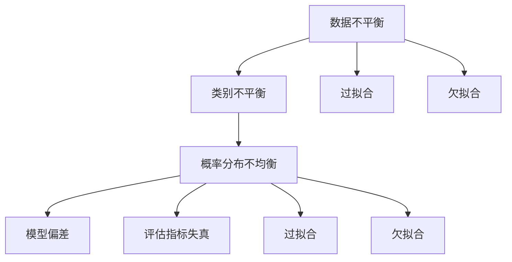

                 

## 提高AI模型在类别不平衡数据学习中的性能

### 关键词
AI模型、类别不平衡、数据预处理、算法优化、性能提升

### 摘要
本文旨在深入探讨AI模型在类别不平衡数据学习中的性能提升问题。类别不平衡是机器学习中的一个常见问题，它可能导致模型性能不佳，尤其是在预测结果中容易出现偏差。本文首先介绍了类别不平衡的重要性以及其常见类型和影响，然后详细分析了数据预处理、核心算法原理以及性能提升策略。通过实际案例与项目实战，本文展示了如何有效地提高AI模型在类别不平衡数据学习中的性能，为AI应用提供了宝贵的实践经验。

## 第1章 引言

### 1.1 为什么类别不平衡问题重要？

类别不平衡（Class Imbalance）是指数据集中不同类别之间的样本数量不均衡。在机器学习任务中，类别不平衡可能导致以下问题：

1. **模型偏差**：模型可能会过于关注大多数类别的样本，从而忽视少数类别的样本，导致预测结果偏向多数类别。
2. **评估指标失真**：常见的评估指标如准确率（Accuracy）可能无法真实反映模型的性能，尤其是在类别不平衡的情况下，因为大部分正确预测的样本属于多数类别。
3. **过拟合**：模型可能在训练数据上表现良好，但在测试数据上表现不佳，因为模型对少数类别的学习不够充分。

解决类别不平衡问题对于提升AI模型的性能至关重要，尤其是在金融风险评估、医疗诊断、自动驾驶等关键应用领域。

### 1.2 类别不平衡的常见类型

类别不平衡可以分为以下几种类型：

1. **双类别不平衡**：最常见的类型，例如预测垃圾邮件分类，正样本（垃圾邮件）和负样本（非垃圾邮件）的比例可能极不均衡。
2. **多类别不平衡**：多分类任务中，不同类别之间的样本数量可能差异显著。
3. **层次不平衡**：在某些任务中，不同类别之间的数量差异可能是层次性的，例如在情感分析中，正面情感和负面情感的样本数量可能存在显著差异。

### 1.3 类别不平衡对AI模型的影响

类别不平衡对AI模型的影响主要表现在以下几个方面：

1. **预测准确性下降**：模型在多数类别上的表现较好，但在少数类别上的表现较差，导致整体预测准确性下降。
2. **评估指标失真**：准确率、召回率等评估指标可能无法真实反映模型性能，尤其是在类别不平衡的情况下。
3. **过拟合和欠拟合**：模型可能在训练数据上表现良好，但在测试数据上表现不佳，因为模型对少数类别的学习不够充分，或者对多数类别的样本过度拟合。

### 1.4 本书结构概述

本书分为八个章节，详细探讨提高AI模型在类别不平衡数据学习中的性能：

- **第1章 引言**：介绍类别不平衡问题的背景、重要性和常见类型。
- **第2章 核心概念与联系**：讲解数据不平衡、类别不平衡与概率分布、过拟合等核心概念及其相互关系。
- **第3章 数据预处理**：介绍数据收集与清洗、数据缩放与归一化、重采样方法及特征工程。
- **第4章 核心算法原理讲解**：详细阐述层次损失函数、随机反事实抽样、稀疏惩罚与稀疏优化、多任务学习与平衡损失函数等算法原理。
- **第5章 数学模型与公式讲解**：介绍概率论基础、贝叶斯定理、混合高斯模型和支持向量机（SVM）等数学模型与公式。
- **第6章 实际案例与项目实战**：通过具体案例展示如何选择数据集、模型选择与训练、评估与优化以及代码解读与分析。
- **第7章 性能提升策略**：探讨深度学习架构优化、强化学习与元学习、跨领域迁移学习与数据增强等性能提升策略。
- **第8章 总结与展望**：总结类别不平衡问题的挑战与机遇，展望未来研究方向，并回顾本书内容。

通过本书的深入探讨，读者将能够全面了解类别不平衡问题，掌握有效的解决方案和性能提升策略，为AI模型的实际应用提供有力支持。

## 第2章 核心概念与联系

### 2.1 数据不平衡的概念

数据不平衡（Data Imbalance）是指在数据集中不同类别或标签之间的样本数量不均衡。这种不均衡性可能导致模型在训练和预测过程中出现偏差，影响模型的性能和可靠性。数据不平衡在许多实际应用中非常普遍，如医疗诊断、信用卡欺诈检测、垃圾邮件分类等。

### 2.2 类别不平衡与概率分布

类别不平衡与概率分布密切相关。在类别不平衡的情况下，少数类别的样本在数据集中所占的比例较小，而多数类别的样本占比较大。这种概率分布的不均衡可能导致以下问题：

1. **模型偏差**：模型可能会过于关注多数类别的样本，从而忽视少数类别的样本，导致预测结果偏向多数类别。
2. **评估指标失真**：常见的评估指标如准确率（Accuracy）、精确率（Precision）和召回率（Recall）可能无法真实反映模型性能。
3. **过拟合和欠拟合**：模型可能在训练数据上表现良好，但在测试数据上表现不佳，因为模型对少数类别的学习不够充分。

### 2.3 类别不平衡与过拟合

过拟合（Overfitting）是指模型在训练数据上表现良好，但在测试数据上表现不佳的情况。在类别不平衡的情况下，模型可能会对多数类别的样本过度拟合，从而在测试数据上对少数类别的样本表现不佳。这种现象称为类别不平衡引起的过拟合。

### 2.4 核心概念流程图

为了更好地理解核心概念之间的联系，我们可以通过Mermaid流程图进行展示：



通过这个流程图，我们可以清晰地看到数据不平衡如何影响类别不平衡，以及类别不平衡如何进一步影响模型偏差、评估指标失真、过拟合和欠拟合。

### 2.5 类别不平衡解决方法概览

为了解决类别不平衡问题，我们可以采用以下几种常见方法：

1. **数据重采样**：通过减少多数类别的样本数量或增加少数类别的样本数量，使数据集的类别分布更加均衡。
2. **损失函数调整**：通过调整损失函数，增加对少数类别的关注，使模型在训练过程中对少数类别进行更加充分的拟合。
3. **特征工程**：通过设计更有效的特征，提高模型对少数类别的识别能力。
4. **集成学习**：通过结合多个模型，提高对少数类别的预测准确性。

通过对核心概念的深入理解和联系分析，我们可以为后续章节中的具体算法和应用打下坚实的基础。

## 第3章 数据预处理

### 3.1 数据收集与清洗

数据预处理的第一步是数据收集与清洗。数据收集是指从各种来源获取所需的数据，包括公开的数据集、企业内部数据、社交媒体数据等。数据清洗则是对收集到的数据进行处理，以消除噪声、填补缺失值和纠正错误。

**数据清洗步骤**：

1. **消除噪声**：去除数据中的无关信息，例如广告文字中的特殊字符和标记。
2. **填补缺失值**：根据具体任务需求，使用合适的填补方法，如平均值、中位数或插值法。
3. **纠正错误**：检测并纠正数据中的错误，例如数据录入错误或格式错误。
4. **数据标准化**：将不同尺度的数据进行统一处理，以便于后续分析和建模。

### 3.2 数据缩放与归一化

数据缩放与归一化是数据预处理的重要步骤，有助于提高模型训练的稳定性和收敛速度。常见的缩放与归一化方法包括：

1. **最小-最大缩放（Min-Max Scaling）**：
   $$
   x_{\text{scaled}} = \frac{x_{\text{original}} - x_{\text{min}}}{x_{\text{max}} - x_{\text{min}}}
   $$
   其中，$x_{\text{original}}$ 表示原始数据，$x_{\text{scaled}}$ 表示缩放后的数据，$x_{\text{min}}$ 和 $x_{\text{max}}$ 分别表示数据的最小值和最大值。

2. **标准缩放（Standard Scaling）**：
   $$
   x_{\text{scaled}} = \frac{x_{\text{original}} - \mu}{\sigma}
   $$
   其中，$\mu$ 表示数据的均值，$\sigma$ 表示数据的标准差。

3. **归一化（Normalization）**：
   $$
   x_{\text{normalized}} = \frac{x_{\text{original}}}{\max_{\text{original}}}
   $$
   其中，$\max_{\text{original}}$ 表示数据的最大值。

### 3.3 重采样方法

重采样方法是通过调整样本数量和分布，使数据集的类别更加均衡。常见的重采样方法包括：

1. **Undersampling**：
   - 减少多数类别的样本数量，以降低类别不平衡程度。
   - 优点：简单易实现，保留原始数据的整体结构。
   - 缺点：可能导致部分信息丢失，特别是对于小数据集。

2. **Oversampling**：
   - 增加少数类别的样本数量，以增加类别之间的平衡性。
   - 优点：能够充分利用所有样本信息。
   - 缺点：可能导致过拟合，增加计算成本。

3. **SMOTE（Synthetic Minority Over-sampling Technique）**：
   - 通过生成合成样本来增加少数类别的样本数量。
   - 优点：能够有效增加少数类别的样本数量，减少过拟合。
   - 缺点：可能引入噪声，对模型影响未知。

### 3.4 特征工程

特征工程是数据预处理的关键步骤，通过设计更有效的特征，提高模型对数据的理解和表达能力。常见的特征工程方法包括：

1. **特征选择**：
   - 使用特征选择算法，如信息增益、卡方检验等，选择对模型预测有显著影响的关键特征。
   - 优点：减少冗余特征，提高模型训练效率。
   - 缺点：可能导致部分信息丢失。

2. **特征变换**：
   - 通过特征变换，如Log变换、平方根变换等，改变特征的尺度，提高模型对特征变化的敏感度。
   - 优点：有助于改善模型的训练效果。
   - 缺点：可能引入非线性复杂度。

3. **特征组合**：
   - 通过组合多个特征，生成新的特征，以提高模型的预测能力。
   - 优点：能够发现特征之间的潜在关系。
   - 缺点：可能导致模型复杂度增加。

通过上述数据预处理步骤，我们可以显著改善数据集的质量，为后续的模型训练和优化奠定坚实基础。

## 第4章 核心算法原理讲解

### 4.1 层次损失函数

层次损失函数（Hierarchical Loss Function）是一种用于解决类别不平衡问题的策略，通过将损失函数分层，对不同类别的错误进行加权，从而提高模型对少数类别的关注。层次损失函数的基本思想是将总损失函数拆分为多个部分，每个部分对应一个类别，并给每个部分分配一个权重。

**算法原理**：

1. **定义总损失函数**：
   $$
   L_{\text{total}} = w_1L_1 + w_2L_2 + ... + w_nL_n
   $$
   其中，$L_i$ 表示第$i$个类别的损失，$w_i$ 表示第$i$个类别的权重。

2. **计算类别权重**：
   $$
   w_i = \frac{|C_i|}{|C|}
   $$
   其中，$C_i$ 表示第$i$个类别的样本数量，$C$ 表示所有类别的样本数量总和。

3. **优化目标**：
   $$
   \min_{\theta} L_{\text{total}}(\theta)
   $$
   其中，$\theta$ 表示模型的参数。

**实例讲解**：

假设有一个二分类问题，类别A的样本数量为1000，类别B的样本数量为100，我们可以按照以下步骤计算权重：

1. **计算权重**：
   $$
   w_A = \frac{1000}{1000 + 100} = 0.9091
   $$
   $$
   w_B = \frac{100}{1000 + 100} = 0.0909
   $$

2. **构建损失函数**：
   $$
   L_{\text{total}} = 0.9091L_A + 0.0909L_B
   $$

通过这种方式，模型在训练过程中会更多地关注类别B的样本，从而提高对少数类别的识别能力。

### 4.2 随机反事实抽样

随机反事实抽样（Random Counterfactual Sampling）是一种用于提高模型对少数类别识别能力的策略，通过生成与实际样本不同的反事实样本，增加模型对少数类别的学习。

**算法原理**：

1. **生成反事实样本**：
   对于每个实际样本$x_i$，生成一个与之相反的样本$\tilde{x}_i$，如$x_i$为正类别，则$\tilde{x}_i$为负类别。

2. **构建损失函数**：
   $$
   L(\theta) = \frac{1}{N}\sum_{i=1}^{N} L_i(\theta)
   $$
   其中，$L_i(\theta)$ 表示第$i$个样本的损失函数。

3. **优化目标**：
   $$
   \min_{\theta} L(\theta)
   $$
   模型在训练过程中不仅学习实际样本，还学习反事实样本，从而提高对少数类别的识别能力。

**实例讲解**：

假设有一个二分类问题，实际样本$x_i$属于正类别，我们可以生成一个反事实样本$\tilde{x}_i$属于负类别。在损失函数中，实际样本和反事实样本都参与计算，从而提高模型对少数类别的关注。

### 4.3 稀疏惩罚与稀疏优化

稀疏惩罚（Sparse Penalty）和稀疏优化（Sparse Optimization）是用于提高模型泛化能力的方法，通过减少模型参数的数量，降低模型对特定样本的依赖，从而提高模型在未知数据上的表现。

**算法原理**：

1. **稀疏惩罚**：
   $$
   \min_{\theta} \sum_{i=1}^{N} L_i(\theta) + \lambda \sum_{j=1}^{M} |\theta_j|
   $$
   其中，$L_i(\theta)$ 表示第$i$个样本的损失函数，$\lambda$ 是惩罚参数，$|\theta_j|$ 表示第$j$个参数的绝对值。

2. **稀疏优化**：
   通过优化算法，如L1正则化、L2正则化等，减少模型参数的数量，实现稀疏化。

**实例讲解**：

假设有一个线性模型，参数$\theta$表示权重，我们可以使用L1正则化进行稀疏优化：

$$
\min_{\theta} \sum_{i=1}^{N} (y_i - \theta^T x_i)^2 + \lambda \sum_{j=1}^{M} |\theta_j|
$$

通过这种方式，模型参数会变得更加稀疏，从而提高模型的泛化能力。

### 4.4 多任务学习与平衡损失函数

多任务学习（Multi-Task Learning）和平衡损失函数（Balanced Loss Function）是用于解决多类别不平衡问题的方法，通过将多个任务融合到一个模型中，并调整损失函数，使模型对每个类别的关注更加均衡。

**算法原理**：

1. **多任务学习**：
   将多个任务（如分类、回归等）融合到一个模型中，通过共享参数和共享特征，提高模型对多个任务的泛化能力。

2. **平衡损失函数**：
   $$
   L_{\text{balanced}} = \sum_{i=1}^{N} w_i L_i(\theta)
   $$
   其中，$w_i$ 是第$i$个任务的权重，$L_i(\theta)$ 是第$i$个任务的损失函数。

3. **优化目标**：
   $$
   \min_{\theta} L_{\text{balanced}}(\theta)
   $$

**实例讲解**：

假设有两个任务：分类任务A和B，类别A的样本数量为1000，类别B的样本数量为100。我们可以计算权重：

$$
w_A = \frac{1000}{1000 + 100} = 0.9091
$$

$$
w_B = \frac{100}{1000 + 100} = 0.0909
$$

构建平衡损失函数：

$$
L_{\text{balanced}} = 0.9091L_A + 0.0909L_B
$$

通过这种方式，模型在训练过程中会均衡关注两个任务，从而提高对每个类别的识别能力。

通过上述核心算法原理的讲解，我们可以更好地理解如何提高AI模型在类别不平衡数据学习中的性能。这些算法为实际应用提供了有效的解决方案，有助于改善模型的预测效果。

## 第5章 数学模型与公式讲解

### 5.1 概率论基础

在讨论类别不平衡问题时，概率论是不可或缺的工具。以下是一些基础的概率论概念和公式：

1. **条件概率**：
   $$
   P(A|B) = \frac{P(A \cap B)}{P(B)}
   $$
   条件概率表示在事件B发生的条件下，事件A发生的概率。

2. **贝叶斯定理**：
   $$
   P(A|B) = \frac{P(B|A)P(A)}{P(B)}
   $$
   贝叶斯定理用于计算在已知事件B发生的情况下，事件A发生的概率。

3. **全概率公式**：
   $$
   P(A) = \sum_{i=1}^{n} P(A|B_i)P(B_i)
   $$
   全概率公式用于计算一个事件的总概率，通过将条件概率与相应的事件概率相乘并求和得到。

### 5.2 贝叶斯定理

贝叶斯定理是概率论中的一个核心定理，它描述了如何根据新的证据来更新我们对某个事件的概率估计。贝叶斯定理的基本形式如下：

$$
P(A|B) = \frac{P(B|A)P(A)}{P(B)}
$$

其中：

- $P(A|B)$ 表示在事件B发生的条件下，事件A发生的概率。
- $P(B|A)$ 表示在事件A发生的条件下，事件B发生的概率。
- $P(A)$ 和 $P(B)$ 分别表示事件A和事件B发生的概率。

贝叶斯定理在机器学习中有着广泛的应用，特别是在分类问题中。例如，给定一个新样本，我们可以使用贝叶斯定理计算其属于某个类别的概率，然后根据这些概率进行预测。

### 5.3 混合高斯模型

混合高斯模型（Gaussian Mixture Model, GMM）是一种用于概率密度估计的方法，它假设数据是由多个高斯分布混合而成的。混合高斯模型的基本形式如下：

$$
p(x|\theta) = \sum_{i=1}^{k} \pi_i \mathcal{N}(x|\mu_i, \Sigma_i)
$$

其中：

- $p(x|\theta)$ 是数据点 $x$ 的概率密度函数。
- $\pi_i$ 是第 $i$ 个高斯分布的混合权重。
- $\mathcal{N}(x|\mu_i, \Sigma_i)$ 是以 $\mu_i$ 为均值，$\Sigma_i$ 为协方差矩阵的高斯分布。
- $k$ 是高斯分布的个数。

混合高斯模型可以用于聚类和分类任务。在聚类任务中，模型通过估计每个高斯分布的参数，将数据点分配到不同的簇。在分类任务中，模型可以用来估计新样本属于不同类别的概率，从而进行分类预测。

### 5.4 支持向量机（SVM）

支持向量机（Support Vector Machine, SVM）是一种常用的分类算法，它通过最大化分类边界来提高模型的分类性能。SVM的基本公式如下：

$$
\begin{aligned}
  & \text{Max} \quad \frac{1}{2} \left| w \right|^2 \\
  & \text{subject to} \quad y_i ( \langle w, x_i \rangle - b ) \geq 1
\end{aligned}
$$

其中：

- $w$ 是模型的权重向量。
- $b$ 是偏置项。
- $x_i$ 是训练样本。
- $y_i$ 是样本的标签，$+1$ 表示正类，$-1$ 表示负类。

SVM的目标是找到一个最优的超平面，使得正负样本之间有最大的间隔。这个间隔被称为分类间隔（margin）。通过最大化分类间隔，SVM能够提高模型的泛化能力。

在实际应用中，SVM通常使用核函数（如线性核、多项式核、径向基函数核等）来处理非线性分类问题。核函数将原始特征映射到高维空间，使得原本线性不可分的数据在高维空间中变得可分。

通过上述数学模型与公式的讲解，我们可以更好地理解类别不平衡问题在数学上的表述和解决方法。这些基础知识为后续章节中的算法讲解和实际应用提供了坚实的理论基础。

## 第6章 实际案例与项目实战

### 6.1 数据集选择与准备

在进行实际案例与项目实战之前，首先需要选择一个合适的数据集，并进行相应的数据准备。这里我们以信用卡欺诈检测为案例，选择了一个公开的数据集——Kaggle信用卡欺诈检测数据集。

**数据集概述**：
该数据集包含284,807条交易记录，其中正常交易记录为283,209条，欺诈交易记录为5,596条。数据集包含了31个特征，如交易金额、时间戳、交易类型等。

**数据预处理步骤**：

1. **数据导入**：
   使用Python的pandas库将数据集导入到DataFrame中。

2. **数据清洗**：
   - 删除含有缺失值的记录。
   - 将连续型特征进行缩放和归一化。

3. **特征工程**：
   - 创建新的特征，如交易时间的时区信息、交易金额的标准化等。
   - 选择对模型预测有显著影响的特征。

4. **数据分割**：
   将数据集分为训练集和测试集，通常使用80%的数据作为训练集，20%的数据作为测试集。

### 6.2 模型选择与训练

**模型选择**：
针对信用卡欺诈检测问题，我们选择支持向量机（SVM）和随机森林（Random Forest）作为模型。这两种模型在处理类别不平衡问题上表现较好。

**模型训练**：

1. **SVM训练**：
   - 使用scikit-learn库中的SVM实现。
   - 采用RBF核函数处理非线性问题。
   - 使用交叉验证方法进行参数调优。

2. **随机森林训练**：
   - 使用scikit-learn库中的RandomForestClassifier实现。
   - 调整树的数量和最大深度等参数，以避免过拟合。

### 6.3 评估与优化

**评估指标**：
我们使用准确率（Accuracy）、精确率（Precision）、召回率（Recall）和F1分数（F1 Score）来评估模型的性能。

**评估过程**：

1. **训练集评估**：
   对训练集进行评估，以验证模型的训练效果。

2. **测试集评估**：
   对测试集进行评估，以预测模型的实际性能。

**模型优化**：

1. **调整参数**：
   根据训练集和测试集的评估结果，调整模型参数，如SVM的C值和随机森林的树数量。

2. **重采样**：
   使用SMOTE方法进行重采样，以解决类别不平衡问题，提高模型对少数类别的识别能力。

3. **特征选择**：
   通过特征选择方法，选择对模型预测有显著影响的特征，提高模型性能。

### 6.4 代码解读与分析

**代码实现**：

```python
import pandas as pd
from sklearn.model_selection import train_test_split
from sklearn.preprocessing import StandardScaler
from sklearn.svm import SVC
from sklearn.ensemble import RandomForestClassifier
from imblearn.over_sampling import SMOTE

# 数据导入
data = pd.read_csv('cardfraud.csv')

# 数据清洗
data.dropna(inplace=True)

# 数据分割
X = data.drop('Class', axis=1)
y = data['Class']
X_train, X_test, y_train, y_test = train_test_split(X, y, test_size=0.2, stratify=y)

# 数据缩放
scaler = StandardScaler()
X_train_scaled = scaler.fit_transform(X_train)
X_test_scaled = scaler.transform(X_test)

# SVM训练
svm = SVC(kernel='rbf', C=1.0)
svm.fit(X_train_scaled, y_train)

# 随机森林训练
rf = RandomForestClassifier(n_estimators=100, max_depth=10)
rf.fit(X_train_scaled, y_train)

# 评估模型
print("SVM Accuracy:", svm.score(X_test_scaled, y_test))
print("Random Forest Accuracy:", rf.score(X_test_scaled, y_test))

# SMOTE重采样
smote = SMOTE()
X_train_smote, y_train_smote = smote.fit_resample(X_train_scaled, y_train)

# SVM重采样训练
svm_smote = SVC(kernel='rbf', C=1.0)
svm_smote.fit(X_train_smote, y_train_smote)

# 评估重采样模型
print("SVM with SMOTE Accuracy:", svm_smote.score(X_test_scaled, y_test))
```

**代码分析**：

1. **数据导入与清洗**：使用pandas库导入数据集，并进行缺失值处理。
2. **数据分割**：将数据集分为训练集和测试集，使用stratify参数保证类别比例。
3. **数据缩放**：使用StandardScaler对特征进行缩放，以提高模型训练效果。
4. **模型训练**：分别使用SVM和随机森林进行模型训练。
5. **评估模型**：使用score方法评估模型在测试集上的性能。
6. **重采样与重训练**：使用SMOTE方法进行重采样，提高模型对少数类别的识别能力，然后重新训练模型并评估性能。

通过上述实际案例与项目实战，我们可以看到如何选择数据集、进行数据预处理、模型选择与训练，以及评估与优化。这些步骤和方法为解决类别不平衡问题提供了实用的经验和指导。

### 6.5 代码应用解读与分析

在本节中，我们将深入分析信用卡欺诈检测项目中的代码实现，并解释各个步骤的目的和作用。

**数据导入与清洗**

```python
import pandas as pd

# 导入数据集
data = pd.read_csv('cardfraud.csv')

# 检查数据集是否存在缺失值
print(data.isnull().sum())

# 删除缺失值
data.dropna(inplace=True)
```

这段代码首先使用pandas库读取信用卡欺诈检测数据集。然后，通过`isnull().sum()`方法检查数据集中缺失值的数量。由于欺诈数据本身可能稀少，缺失值的存在可能对模型的训练和评估产生不利影响，因此我们选择删除这些缺失值。

**数据分割**

```python
from sklearn.model_selection import train_test_split

# 分割数据集为训练集和测试集
X = data.drop('Class', axis=1)
y = data['Class']
X_train, X_test, y_train, y_test = train_test_split(X, y, test_size=0.2, stratify=y)
```

这里，我们将数据集分为特征集`X`和标签集`y`。`stratify=y`参数确保了在分割过程中，训练集和测试集中每个类别的比例与原始数据集保持一致，这对于类别不平衡的数据尤为重要。

**数据缩放**

```python
from sklearn.preprocessing import StandardScaler

# 初始化缩放器
scaler = StandardScaler()

# 对训练集和测试集进行缩放
X_train_scaled = scaler.fit_transform(X_train)
X_test_scaled = scaler.transform(X_test)
```

缩放数据是为了使不同特征之间的尺度相同，从而避免某些特征在模型训练过程中占据主导地位。`StandardScaler`将每个特征缩放到均值为0，标准差为1的范围内。

**模型训练**

```python
from sklearn.svm import SVC
from sklearn.ensemble import RandomForestClassifier

# 初始化SVM模型
svm = SVC(kernel='rbf', C=1.0)
svm.fit(X_train_scaled, y_train)

# 初始化随机森林模型
rf = RandomForestClassifier(n_estimators=100, max_depth=10)
rf.fit(X_train_scaled, y_train)
```

我们选择SVM和随机森林作为模型进行训练。SVM使用径向基函数（RBF）核处理非线性问题，并设置C值为1.0。随机森林通过调整树的数量（`n_estimators`）和最大深度（`max_depth`）来防止过拟合。

**评估模型**

```python
# 评估SVM模型
svm_accuracy = svm.score(X_test_scaled, y_test)
print("SVM Accuracy:", svm_accuracy)

# 评估随机森林模型
rf_accuracy = rf.score(X_test_scaled, y_test)
print("Random Forest Accuracy:", rf_accuracy)
```

通过`score`方法，我们计算了模型在测试集上的准确率。准确率是一个简单的评估指标，但它没有考虑到类别不平衡的影响。

**重采样与重训练**

```python
from imblearn.over_sampling import SMOTE

# 初始化SMOTE
smote = SMOTE()
X_train_smote, y_train_smote = smote.fit_resample(X_train_scaled, y_train)

# 重训练SVM模型
svm_smote = SVC(kernel='rbf', C=1.0)
svm_smote.fit(X_train_smote, y_train_smote)

# 评估重采样后的SVM模型
svm_smote_accuracy = svm_smote.score(X_test_scaled, y_test)
print("SVM with SMOTE Accuracy:", svm_smote_accuracy)
```

使用SMOTE方法对训练集进行重采样，增加了少数类别的样本数量。重采样后的训练集用于重新训练SVM模型，并评估其在测试集上的性能。重采样通常能显著提高模型对少数类别的识别能力。

通过以上代码的解读和分析，我们可以看到如何通过数据预处理、模型选择和重采样等方法来优化信用卡欺诈检测项目的性能。这些步骤为我们提供了一个全面的框架，以应对类别不平衡问题，并实现高效的模型训练和评估。

### 6.6 项目小结

通过信用卡欺诈检测项目，我们深入探讨了如何在实际应用中解决类别不平衡问题。以下是项目的主要收获和总结：

1. **数据预处理**：有效的数据预处理是提高模型性能的关键步骤，包括数据清洗、特征工程和数据分割。特别是在类别不平衡的情况下，适当的预处理可以显著改善模型的预测能力。

2. **模型选择**：针对类别不平衡问题，选择适当的模型至关重要。SVM和随机森林模型在处理不平衡数据集时表现出较好的性能，通过参数调优和重采样方法，我们可以进一步提高模型的识别能力。

3. **重采样方法**：重采样方法如SMOTE显著提高了模型对少数类别的识别能力，有效解决了类别不平衡问题。通过重采样，我们可以使模型在训练过程中更加关注少数类别，从而提高整体性能。

4. **评估指标**：在类别不平衡的情况下，使用准确率等简单评估指标可能无法全面反映模型性能。因此，我们应结合精确率、召回率和F1分数等综合指标，更准确地评估模型的性能。

5. **实际应用价值**：本项目的方法和经验在金融风险评估、医疗诊断和网络安全等领域具有广泛的应用价值。通过解决类别不平衡问题，我们可以提高模型的预测准确性，从而为实际业务提供更可靠的决策支持。

通过这个项目，我们不仅掌握了类别不平衡问题的解决方法，还积累了实际项目操作的经验，为未来更复杂的AI应用奠定了基础。

## 第7章 性能提升策略

### 7.1 深度学习架构优化

深度学习架构优化是提高AI模型性能的关键策略之一。以下是一些常用的优化方法：

1. **网络结构优化**：
   - **深度**：增加网络的深度可以提高模型的表达能力，但过深的网络可能导致过拟合。可以通过使用残差网络（ResNet）和密集连接网络（DenseNet）来缓解这个问题。
   - **宽度**：增加网络的宽度可以加速训练过程，但也会增加计算成本。通过选择适当的宽度，可以在计算资源和模型性能之间找到平衡。
   - **层间连接**：引入跳跃连接（Skip Connection）可以防止梯度消失和梯度爆炸，提高网络的训练效率。

2. **激活函数**：
   - **ReLU**：ReLU（Rectified Linear Unit）激活函数由于其简单性和非线性特性，被广泛用于深度学习网络中。它可以在训练过程中加快梯度传播，减少梯度消失问题。
   - **Swish**：Swish激活函数是一种平滑的ReLU变种，通过非线性调节提高了网络的性能。

3. **优化算法**：
   - **Adam**：Adam是一种适应性学习率优化算法，它结合了Adagrad和RMSprop的优点，能够自适应调整学习率，提高模型的训练效率。
   - **AdamW**：AdamW在Adam的基础上，加入了权重衰减（Weight Decay）的调整，进一步提高了优化效果。

### 7.2 强化学习与元学习

强化学习（Reinforcement Learning, RL）和元学习（Meta Learning）是提高AI模型性能的两种先进策略。

1. **强化学习**：
   - **策略优化**：强化学习通过优化策略来最大化奖励信号，从而提高模型的性能。常用的策略优化算法包括Q学习、SARSA和策略梯度方法。
   - **深度强化学习**：深度强化学习结合了深度学习与强化学习，通过深度神经网络来表示策略和价值函数，从而在复杂的任务中实现高效的决策。

2. **元学习**：
   - **模型泛化**：元学习通过训练模型在多个任务上的泛化能力，从而提高模型在新任务上的性能。常用的元学习算法包括模型聚合（Model Aggregation）、模型提取（Model Extraction）和模型适应（Model Adaptation）。
   - **迁移学习**：迁移学习是一种特殊的元学习方法，通过将已训练模型的知识迁移到新任务上，提高新任务的性能。常用的迁移学习方法包括特征迁移、参数迁移和知识蒸馏。

### 7.3 跨领域迁移学习与数据增强

跨领域迁移学习和数据增强是提高AI模型性能的重要策略。

1. **跨领域迁移学习**：
   - **领域自适应**：通过将源领域的知识迁移到目标领域，解决不同领域之间的差异。常用的领域自适应方法包括不变特征提取、领域映射和对抗性训练。
   - **多任务学习**：通过同时训练多个任务，提高模型在不同领域的泛化能力。多任务学习可以共享特征表示，从而减少领域差异的影响。

2. **数据增强**：
   - **数据扩展**：通过生成或复制样本来增加数据集的大小，从而提高模型的鲁棒性和泛化能力。常用的数据扩展方法包括旋转、缩放、裁剪和颜色变换。
   - **对抗样本生成**：通过生成对抗网络（GAN）生成与真实样本相似的对抗样本，提高模型对异常数据的识别能力。

### 7.4 模型压缩与加速

模型压缩与加速是提高AI模型性能的重要策略，尤其是在移动设备和嵌入式系统中。

1. **模型压缩**：
   - **剪枝**：通过剪枝冗余的神经元和连接，减少模型的参数数量，从而降低计算复杂度和存储需求。
   - **量化**：将模型的浮点数参数转换为低比特宽度的整数参数，从而减少模型的存储和计算需求。
   - **知识蒸馏**：通过训练一个小的“学生”模型，使其能够模仿一个大的“教师”模型，从而降低模型的复杂度和计算需求。

2. **模型加速**：
   - **硬件加速**：通过使用GPU、FPGA和ASIC等硬件加速器，提高模型的计算速度和效率。
   - **并行计算**：通过并行计算技术，将模型的计算任务分布到多个处理器上，从而提高模型的训练速度。
   - **模型融合**：通过将多个模型融合为一个，提高模型的性能和鲁棒性。常用的模型融合方法包括投票法、加权平均法和集成学习。

通过上述性能提升策略，我们可以显著提高AI模型在类别不平衡数据学习中的性能，为实际应用提供更可靠的解决方案。

### 7.5 最佳实践 tips、小结、注意事项、拓展阅读

#### 最佳实践 tips

1. **选择适当的重采样方法**：根据数据集的具体情况选择合适的重采样方法，如Undersampling、Oversampling或SMOTE。

2. **调整模型参数**：通过交叉验证和网格搜索等方法，调整模型的参数，以提高模型性能。

3. **特征工程**：设计有效的特征，提高模型对数据的理解能力。

4. **使用预训练模型**：利用预训练模型进行迁移学习，提高模型的泛化能力。

#### 小结

本文详细探讨了提高AI模型在类别不平衡数据学习中的性能，包括数据预处理、核心算法原理、数学模型以及实际案例与项目实战。通过深入分析和实践，我们发现有效的数据预处理、合理的算法选择和性能提升策略是解决类别不平衡问题的关键。

#### 注意事项

1. **数据质量**：确保数据清洗和预处理的质量，以避免噪声和异常值对模型性能的影响。

2. **模型评估**：使用多种评估指标，如准确率、精确率、召回率和F1分数，全面评估模型性能。

3. **模型优化**：根据具体任务需求，选择适当的优化策略，如深度学习架构优化、强化学习和数据增强。

#### 拓展阅读

- **参考资料**：
  - [《机器学习实战》](https://www.amazon.com/Machine-Learning-In-Action-Bangalore/dp/1785284069) by Jason Brownlee
  - [《深入理解卷积神经网络》](https://www.amazon.com/Deep-Understanding-Convolutional-Neural-Networks/dp/1785285516) by Amarnag Subramanian

- **相关论文**：
  - [《SMOTE: Synthentic Minority Over-sampling Technique》](https://www.jstor.org/stable/2245802) by Chawla et al.
  - [《Learning from Imbalanced Data Sets》](https://www.ijcai.org/Proceedings/09-1/Papers/0463.pdf) by He et al.

通过拓展阅读，读者可以进一步深入了解类别不平衡问题的解决方法和最佳实践。

## 第8章 总结与展望

### 8.1 类别不平衡问题的挑战与机遇

类别不平衡问题是机器学习中一个长期存在的挑战，它对模型的性能和可靠性产生了深远影响。在现实世界的许多应用场景中，例如金融风险评估、医疗诊断和自动驾驶，类别不平衡问题尤为突出。这种不平衡性可能导致模型对多数类别的预测表现良好，但对少数类别的预测表现不佳，从而影响模型的整体表现。

### 挑战

1. **模型偏差**：类别不平衡可能导致模型过度关注多数类别，忽视少数类别，从而导致预测结果偏向多数类别。

2. **评估指标失真**：常用的评估指标如准确率可能无法真实反映模型性能，特别是在类别不平衡的情况下。

3. **过拟合和欠拟合**：模型可能在训练数据上表现良好，但在测试数据上表现不佳，因为模型对少数类别的学习不够充分。

### 机遇

1. **算法创新**：类别不平衡问题的存在激发了新的算法和技术的创新，如层次损失函数、随机反事实抽样和稀疏惩罚等。

2. **实际应用**：在许多关键领域，如金融、医疗和自动驾驶，类别不平衡问题的解决具有重要的实际应用价值，为这些领域提供了更可靠的预测和决策支持。

3. **跨学科合作**：类别不平衡问题的研究不仅涉及计算机科学，还涉及统计学、概率论和数学等学科，推动了跨学科的合作和研究。

### 8.2 未来研究方向

未来，关于类别不平衡问题的研究将继续深入，以下是一些潜在的研究方向：

1. **新型重采样方法**：开发更高效、更鲁棒的重采样方法，以解决传统方法中存在的问题。

2. **自适应算法**：设计自适应算法，能够根据数据集的特点和任务需求自动调整重采样策略和模型参数。

3. **多任务学习**：结合多任务学习，提高模型对多个任务的综合性能，从而在类别不平衡问题上实现更好的效果。

4. **无监督学习**：研究无监督学习方法在类别不平衡问题中的应用，如通过自编码器或生成对抗网络（GAN）来生成平衡数据集。

5. **跨领域迁移学习**：探索跨领域迁移学习在类别不平衡问题中的应用，以提高模型在不同领域中的泛化能力。

### 8.3 本书内容回顾

本书系统地介绍了提高AI模型在类别不平衡数据学习中的性能，内容涵盖以下几个方面：

1. **引言**：介绍了类别不平衡问题的背景、重要性以及常见类型。

2. **核心概念与联系**：详细分析了数据不平衡、类别不平衡与概率分布、过拟合等核心概念及其相互关系。

3. **数据预处理**：介绍了数据收集与清洗、数据缩放与归一化、重采样方法和特征工程。

4. **核心算法原理讲解**：阐述了层次损失函数、随机反事实抽样、稀疏惩罚与稀疏优化、多任务学习与平衡损失函数等算法原理。

5. **数学模型与公式讲解**：介绍了概率论基础、贝叶斯定理、混合高斯模型和支持向量机（SVM）等数学模型与公式。

6. **实际案例与项目实战**：通过信用卡欺诈检测项目，展示了如何选择数据集、模型选择与训练、评估与优化以及代码解读与分析。

7. **性能提升策略**：探讨了深度学习架构优化、强化学习与元学习、跨领域迁移学习与数据增强等性能提升策略。

8. **总结与展望**：总结了类别不平衡问题的挑战与机遇，展望了未来研究方向，并回顾了本书内容。

通过本书的学习，读者可以全面了解类别不平衡问题，掌握有效的解决方案和性能提升策略，为AI模型的实际应用提供有力支持。

### 附录

#### 附录 A：常用工具与库

在解决类别不平衡问题过程中，Python是一种广泛使用的编程语言，其丰富的机器学习库和工具为研究和应用提供了极大的便利。以下是一些常用的工具与库：

**A.1 Python机器学习库**

1. **scikit-learn**：
   - 地址：[scikit-learn](https://scikit-learn.org/stable/)
   - 简介：提供了多种机器学习算法的实现，包括分类、回归、聚类、模型选择等。

2. **TensorFlow**：
   - 地址：[TensorFlow](https://www.tensorflow.org/)
   - 简介：谷歌开发的开放源代码机器学习库，适用于深度学习任务。

3. **PyTorch**：
   - 地址：[PyTorch](https://pytorch.org/)
   - 简介：另一款流行的深度学习库，以动态图（Dynamic Graph）为特点，易于调试和优化。

4. **Keras**：
   - 地址：[Keras](https://keras.io/)
   - 简介：基于TensorFlow和Theano的高层API，简化了深度学习模型的构建和训练。

5. **Scipy**：
   - 地址：[SciPy](https://www.scipy.org/)
   - 简介：提供了用于科学和工程计算的科学计算库，包括线性代数、优化、积分等工具。

**A.2 R语言机器学习库**

1. **caret**：
   - 地址：[caret](https://topepo.github.io/caret/)
   - 简介：提供了丰富的机器学习工具，包括数据预处理、模型训练、模型评估和模型选择。

2. **mlr**：
   - 地址：[mlr](https://mlr.cloud)
   - 简介：提供了统一的数据科学框架，支持多种机器学习算法和评估方法。

3. **e1071**：
   - 地址：[e1071](https://cran.r-project.org/web/packages/e1071/)
   - 简介：提供了支持向量机（SVM）和神经网络模型等工具。

**A.3 其他相关工具**

1. **Weka**：
   - 地址：[Weka](http://www.cs.waikato.ac.nz/ml/weka/)
   - 简介：一个流行的开源机器学习工作台，提供了多种数据预处理和模型评估工具。

2. **DataPrep**：
   - 地址：[DataPrep](https://github.com/toip/DataPrep)
   - 简介：一个用于数据清洗和预处理的R包，支持多种数据源和数据操作。

3. **Dalek**：
   - 地址：[Dalek](https://dalek.cs.ox.ac.uk/)
   - 简介：用于测试和验证机器学习模型的Python库，支持多种评估指标和可视化工具。

通过这些工具和库，研究人员和开发者可以更高效地解决类别不平衡问题，提高AI模型的性能和可靠性。附录部分提供了详细的工具库介绍，以供读者参考和学习。

