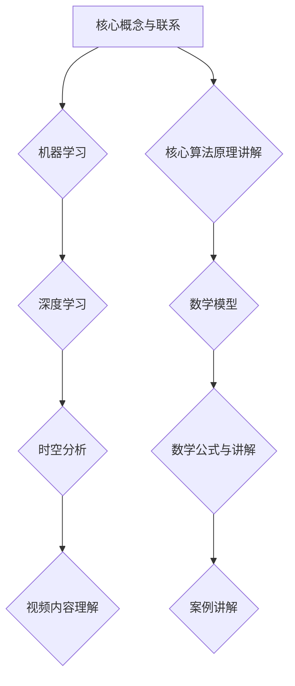

                 

### 《提高AI模型在视频内容理解任务中的时空分析能力》

> 关键词：视频内容理解，时空分析，AI模型，深度学习，时空卷积神经网络（TCNN），循环神经网络（RNN），图神经网络（GNN），多模态融合，增强学习。

> 摘要：本文旨在探讨如何提高人工智能模型在视频内容理解任务中的时空分析能力。通过介绍视频内容理解任务的重要性、AI模型的基本概念、时空分析理论以及核心算法与原理，本文详细分析了时空卷积神经网络（TCNN）、循环神经网络（RNN）与长短期记忆网络（LSTM）、图神经网络（GNN）以及时空感知的多模态融合等技术在视频内容理解中的应用。此外，文章还通过实战案例展示了如何搭建开发环境、实现模型、进行评估与优化。最后，本文对未来时空分析在AI领域的未来发展进行了展望。

----------------------------------------------------------------

### 《提高AI模型在视频内容理解任务中的时空分析能力》目录大纲

```
# 《提高AI模型在视频内容理解任务中的时空分析能力》目录大纲

## 第一部分：背景知识与技术概述

### 第1章：视频内容理解任务概述
#### 1.1 视频内容理解的重要性
#### 1.2 视频内容理解的应用场景
#### 1.3 时空分析在视频内容理解中的作用

### 第2章：AI模型的基本概念
#### 2.1 AI模型简介
#### 2.2 机器学习基础
#### 2.3 深度学习基础

### 第3章：时空分析理论
#### 3.1 时空数据分析基础
#### 3.2 视频时空特征提取方法
#### 3.3 时空数据建模方法

## 第二部分：核心算法与原理

### 第4章：时空卷积神经网络（TCNN）
#### 4.1 TCNN概述
#### 4.2 时空卷积层的原理与实现
#### 4.3 基于TCNN的时空分析案例

### 第5章：循环神经网络（RNN）与长短期记忆网络（LSTM）
#### 5.1 RNN概述
#### 5.2 LSTM的原理与实现
#### 5.3 基于LSTM的时空分析案例

### 第6章：图神经网络（GNN）在时空分析中的应用
#### 6.1 GNN概述
#### 6.2 GNN在时空分析中的建模方法
#### 6.3 基于GNN的时空分析案例

### 第7章：时空感知的多模态融合
#### 7.1 多模态数据概述
#### 7.2 多模态融合方法
#### 7.3 基于多模态融合的时空分析案例

### 第8章：增强学习在视频内容理解中的应用
#### 8.1 增强学习基础
#### 8.2 增强学习在视频内容理解中的应用
#### 8.3 基于增强学习的时空分析案例

## 第三部分：实战与案例

### 第9章：视频内容理解项目实战
#### 9.1 项目概述
#### 9.2 环境搭建与数据预处理
#### 9.3 模型选择与实现
#### 9.4 评估与优化

### 第10章：开源工具与框架介绍
#### 10.1 常用深度学习框架
#### 10.2 视频处理与时空数据分析工具
#### 10.3 增强学习开源工具

### 第11章：未来趋势与展望
#### 11.1 时空分析在AI领域的未来发展
#### 11.2 新兴技术在视频内容理解中的应用
#### 11.3 AI模型在视频内容理解中的挑战与解决方案

## 附录
### 附录A：数学公式与算法详解
### 附录B：实战项目代码解读
### 附录C：常见问题与解答

# Mermaid 流程图

```


----------------------------------------------------------------

### 第1章：视频内容理解任务概述

#### 1.1 视频内容理解的重要性

随着互联网和多媒体技术的快速发展，视频内容已成为互联网上最主要的数据形式之一。视频内容的丰富性和多样性使得人类获取信息和娱乐的方式发生了翻天覆地的变化。然而，如何有效地理解和管理这些庞大的视频数据成为了一个重要的挑战。

视频内容理解（Video Content Understanding）是指对视频数据进行分析和理解，以提取有价值的信息和知识。它涉及到图像识别、场景分类、动作检测、情感分析、物体追踪等多个方面。视频内容理解的重要性主要体现在以下几个方面：

1. **智能监控系统**：视频内容理解技术可以应用于智能监控系统，实现实时的人流统计、异常行为检测、入侵检测等功能，提高公共安全水平。

2. **视频搜索与推荐**：视频内容理解可以帮助搜索引擎更好地理解视频内容，实现更加精准的视频搜索和推荐，提升用户体验。

3. **智能助理**：通过视频内容理解技术，智能助理可以更好地理解用户的意图和行为，提供个性化的服务和建议。

4. **医疗影像分析**：视频内容理解技术可以应用于医疗影像分析，帮助医生更快速、准确地诊断疾病。

5. **自动驾驶**：视频内容理解是自动驾驶系统中至关重要的一环，通过分析道路环境、车辆和行人行为等信息，实现自动驾驶和智能交通管理。

#### 1.2 视频内容理解的应用场景

视频内容理解技术具有广泛的应用场景，主要包括：

1. **安防监控**：视频内容理解技术可以应用于安防监控领域，实现人脸识别、行为分析、车辆识别等功能，提高监控系统的智能化水平。

2. **智能视频推荐**：视频内容理解技术可以帮助视频平台更好地理解用户观看行为，实现个性化推荐，提高用户粘性和满意度。

3. **运动分析**：视频内容理解技术可以应用于运动分析领域，帮助运动员和教练员更好地分析比赛视频，提高竞技水平。

4. **医疗诊断**：视频内容理解技术可以应用于医疗诊断领域，通过分析医学影像，帮助医生更快速、准确地诊断疾病。

5. **智能家居**：视频内容理解技术可以应用于智能家居领域，实现智能安防、智能家电控制等功能，提高生活品质。

#### 1.3 时空分析在视频内容理解中的作用

时空分析（Temporal-Spatial Analysis）是视频内容理解中至关重要的一环。它主要关注视频数据在时间和空间维度上的特征提取和关系分析。时空分析在视频内容理解中的作用主要体现在以下几个方面：

1. **时空特征提取**：时空分析技术可以提取视频数据在时间和空间维度上的特征，如运动轨迹、目标区域、动作序列等。这些特征对于视频内容理解任务具有重要的指导意义。

2. **视频结构化**：时空分析技术可以帮助将视频数据转化为结构化的信息，如时间序列数据、事件序列数据等。这些结构化数据可以用于后续的推理、分析和应用。

3. **视频分割与分类**：时空分析技术可以用于视频分割和分类任务，如将视频数据分割为不同的时间段、事件等，并对其进行分类。这有助于更好地理解和分析视频内容。

4. **视频交互**：时空分析技术可以用于实现视频交互功能，如根据用户的操作和行为动态调整视频的播放速度、内容等。

5. **视频增强**：时空分析技术可以用于视频增强任务，如通过增强视频中的关键帧、运动轨迹等特征，提高视频的视觉质量。

总之，时空分析在视频内容理解中起着至关重要的作用，通过有效的时空特征提取和分析，可以大大提高视频内容理解任务的准确性和鲁棒性。

----------------------------------------------------------------

### 第2章：AI模型的基本概念

#### 2.1 AI模型简介

人工智能（Artificial Intelligence，AI）是计算机科学的一个分支，旨在使计算机模拟人类智能，实现自我学习和自我优化。AI模型是AI系统中用于实现特定功能的算法和计算结构。根据学习方式，AI模型主要分为以下几种：

1. **监督学习（Supervised Learning）**：监督学习是一种通过已有标记数据训练模型的方法。模型在训练阶段通过输入标记数据学习特征和规律，然后在测试阶段对新数据进行预测。监督学习适用于有明确标注数据的场景，如图像分类、语音识别等。

2. **无监督学习（Unsupervised Learning）**：无监督学习是通过对未标记数据进行训练来发现数据中的隐藏结构和规律的方法。无监督学习适用于无标注数据的场景，如聚类、降维等。

3. **强化学习（Reinforcement Learning）**：强化学习是一种通过与环境交互来学习最优策略的方法。模型在训练阶段通过与环境的交互，不断调整策略，以实现最大化奖励的目标。强化学习适用于决策制定、游戏智能等场景。

4. **半监督学习（Semi-Supervised Learning）**：半监督学习是一种结合了监督学习和无监督学习的方法，它利用少量的标注数据和大量的未标注数据来训练模型。半监督学习可以缓解标注数据不足的问题，提高模型性能。

5. **迁移学习（Transfer Learning）**：迁移学习是一种利用已有模型的知识来加速新任务训练的方法。它通过在新任务中复用已有模型的部分结构，减少了训练所需的标注数据量和计算资源。

#### 2.2 机器学习基础

机器学习（Machine Learning，ML）是AI的核心技术之一，它使计算机能够通过数据和经验自动改进性能。机器学习主要分为以下几种类型：

1. **监督学习**：监督学习是一种利用已有标记数据训练模型的方法。标记数据包括输入特征和对应的输出标签。模型在训练阶段通过学习特征和标签之间的关系来预测新数据的输出。

2. **无监督学习**：无监督学习是通过对未标记数据进行训练来发现数据中的隐藏结构和规律的方法。无监督学习不依赖标签数据，主要通过聚类、降维等方法来揭示数据的内在结构。

3. **强化学习**：强化学习是一种通过与环境交互来学习最优策略的方法。模型在训练阶段通过与环境的交互，不断调整策略，以实现最大化奖励的目标。

4. **半监督学习**：半监督学习是一种结合了监督学习和无监督学习的方法，它利用少量的标注数据和大量的未标注数据来训练模型。

5. **迁移学习**：迁移学习是一种利用已有模型的知识来加速新任务训练的方法。它通过在新任务中复用已有模型的部分结构，减少了训练所需的标注数据量和计算资源。

机器学习的基本概念和流程如下：

1. **数据准备**：数据准备是机器学习过程中的重要环节，主要包括数据清洗、数据预处理、特征工程等。数据清洗旨在去除噪声和异常值，数据预处理包括归一化、标准化等操作，特征工程旨在提取有用的特征，提高模型性能。

2. **模型选择**：根据任务需求和数据特性选择合适的机器学习模型。常见的机器学习模型包括线性回归、决策树、随机森林、支持向量机、神经网络等。

3. **模型训练**：模型训练是机器学习过程中的核心步骤，通过训练数据集来调整模型参数，使其在测试数据集上达到较好的性能。

4. **模型评估**：模型评估是验证模型性能的重要手段，通过在测试数据集上计算模型评价指标（如准确率、召回率、F1值等）来评估模型性能。

5. **模型部署**：模型部署是将训练好的模型应用到实际场景中的过程。模型部署可以是将模型集成到应用程序中，也可以是将模型部署到云端或边缘设备上。

#### 2.3 深度学习基础

深度学习（Deep Learning，DL）是机器学习的一个分支，它通过模拟人脑神经网络的结构和功能来实现复杂的特征提取和预测任务。深度学习具有以下特点：

1. **多层神经网络**：深度学习模型由多个隐藏层组成，每个隐藏层都通过非线性变换对输入数据进行处理，从而实现复杂特征的提取。

2. **自动特征学习**：深度学习模型通过大量训练数据自动学习输入数据的特征，无需人工设计特征。

3. **并行计算**：深度学习模型可以通过GPU等硬件设备实现并行计算，从而提高训练速度。

4. **强大的表达能力**：深度学习模型具有强大的非线性表达能力，能够处理复杂的任务和数据。

深度学习的基本概念和流程如下：

1. **神经网络架构**：神经网络是由多个神经元组成的计算模型，每个神经元通过权重连接到其他神经元。常见的神经网络架构包括卷积神经网络（CNN）、循环神经网络（RNN）、长短时记忆网络（LSTM）等。

2. **激活函数**：激活函数是神经网络中用于引入非线性变换的函数，常见的激活函数包括ReLU、Sigmoid、Tanh等。

3. **损失函数**：损失函数是用于衡量模型预测结果与真实值之间差异的函数，常见的损失函数包括均方误差（MSE）、交叉熵（Cross Entropy）等。

4. **优化算法**：优化算法是用于调整模型参数以最小化损失函数的方法，常见的优化算法包括梯度下降（Gradient Descent）、随机梯度下降（Stochastic Gradient Descent，SGD）、Adam等。

5. **模型训练**：模型训练是深度学习过程中的核心步骤，通过迭代更新模型参数，使其在训练数据集上达到较好的性能。

6. **模型评估**：模型评估是验证模型性能的重要手段，通过在测试数据集上计算模型评价指标来评估模型性能。

7. **模型部署**：模型部署是将训练好的模型应用到实际场景中的过程，可以通过将模型集成到应用程序中，或者将模型部署到云端或边缘设备上。

通过本章的介绍，我们了解了AI模型的基本概念和分类，以及机器学习和深度学习的基础知识。这些知识为后续章节中探讨时空分析技术及其在视频内容理解中的应用奠定了基础。

----------------------------------------------------------------

### 第3章：时空分析理论

#### 3.1 时空数据分析基础

时空数据分析是视频内容理解任务中至关重要的一环。它涉及视频数据在时间和空间维度上的特征提取、关系分析以及数据处理。时空数据分析的基础包括以下几个方面：

1. **时间序列分析**：时间序列分析是针对时间维度上的数据分析方法，主要包括时间序列建模、预测和特征提取。常见的时间序列建模方法有ARIMA模型、LSTM模型等。时间序列特征提取方法包括自相关函数、频域分析、时频分析等。

2. **空间数据分析**：空间数据分析是针对空间维度上的数据分析方法，主要包括空间聚类、空间关联分析、空间插值等。常见的空间数据分析方法有K最近邻（KNN）、基于密度的聚类算法（DBSCAN）等。

3. **时空数据融合**：时空数据融合是将时间序列分析和空间数据分析相结合，提取更加丰富和有效的特征。常见的时空数据融合方法有时间域融合、空间域融合和时空域融合。

4. **时空数据预处理**：时空数据预处理是保证时空数据分析质量的关键步骤，主要包括数据清洗、数据归一化、数据缺失处理等。数据清洗旨在去除噪声和异常值，数据归一化旨在调整数据范围，数据缺失处理旨在填充缺失数据。

#### 3.2 视频时空特征提取方法

视频时空特征提取是时空数据分析的核心步骤，其主要目标是提取视频数据中具有代表性的时空特征，以便于后续的模型训练和推理。常见的视频时空特征提取方法包括：

1. **视觉特征提取**：视觉特征提取是视频时空特征提取的基础，主要包括颜色特征、纹理特征、形状特征等。常见的视觉特征提取方法有SIFT、HOG、Hausdorff距离等。

2. **运动特征提取**：运动特征提取旨在提取视频数据中的运动信息，如运动轨迹、速度、加速度等。常见的运动特征提取方法有光流法、轨迹聚类、动态模式识别等。

3. **时空特征融合**：时空特征融合是将视觉特征和运动特征相结合，提取更加丰富和有效的特征。常见的时空特征融合方法有时间域融合、空间域融合和时空域融合。

4. **深度特征提取**：深度特征提取是利用深度学习模型提取视频数据中的高级特征，如卷积神经网络（CNN）、循环神经网络（RNN）、长短时记忆网络（LSTM）等。深度特征提取方法具有自动学习和提取特征的能力，能够有效提高视频时空特征提取的准确性和鲁棒性。

#### 3.3 时空数据建模方法

时空数据建模是将提取到的时空特征转化为具有可解释性和可操作性的模型，以便于进行视频内容理解任务。常见的时空数据建模方法包括：

1. **传统机器学习模型**：传统机器学习模型如线性回归、支持向量机（SVM）、决策树、随机森林等，可以通过训练提取到的时空特征实现视频内容理解任务。传统机器学习模型具有较好的可解释性和鲁棒性，但可能在处理复杂时空关系时表现不佳。

2. **深度学习模型**：深度学习模型如卷积神经网络（CNN）、循环神经网络（RNN）、长短时记忆网络（LSTM）、图神经网络（GNN）等，可以通过训练大量的时空特征实现视频内容理解任务。深度学习模型具有强大的特征提取和建模能力，能够处理复杂的时空关系，但可能在可解释性方面存在一定挑战。

3. **混合建模方法**：混合建模方法是将传统机器学习模型和深度学习模型相结合，以充分发挥各自的优势。常见的混合建模方法有时间域混合建模、空间域混合建模和时空域混合建模。

通过本章的介绍，我们了解了时空数据分析的基础知识，以及视频时空特征提取和时空数据建模的方法。这些知识为后续章节中探讨时空分析技术在视频内容理解中的应用奠定了基础。

----------------------------------------------------------------

### 第4章：时空卷积神经网络（TCNN）

#### 4.1 TCNN概述

时空卷积神经网络（Temporal Convolutional Neural Network，TCNN）是一种专为处理时间序列数据而设计的卷积神经网络（Convolutional Neural Network，CNN）。与传统的CNN主要用于处理静态图像数据不同，TCNN能够有效处理时间序列数据，如视频数据。TCNN的核心思想是通过卷积操作提取时间序列数据中的时空特征，从而实现对视频内容的理解和分析。

TCNN的基本结构包括以下几个部分：

1. **输入层**：TCNN的输入通常是时间序列数据，如连续的视频帧序列。每个视频帧可以表示为一个三维张量，其中第一个维度表示时间步，第二个维度表示空间步，第三个维度表示像素值。

2. **卷积层**：卷积层是TCNN的核心部分，通过卷积操作提取时间序列数据中的时空特征。与传统的CNN类似，TCNN的卷积层也使用滤波器（filter）对输入数据进行卷积操作，但TCNN的卷积核（kernel）具有时间维度。

3. **激活函数**：激活函数是TCNN中的非线性变换，常用的激活函数有ReLU（Rectified Linear Unit）和Sigmoid等。

4. **池化层**：池化层用于减少数据维度和计算量，常用的池化操作有最大池化（Max Pooling）和平均池化（Average Pooling）。

5. **全连接层**：全连接层用于将卷积层和池化层提取的特征映射到输出结果。全连接层通常包含多个神经元，每个神经元与输入层的所有神经元相连接。

6. **输出层**：输出层用于生成最终预测结果，如视频分类、动作识别等。

#### 4.2 时空卷积层的原理与实现

时空卷积层是TCNN中最核心的部分，它负责提取时间序列数据中的时空特征。时空卷积层的原理与传统CNN的卷积层类似，但具有以下不同之处：

1. **卷积核大小**：传统CNN的卷积核通常只包含空间维度，而时空卷积核则包含时间和空间维度。例如，一个大小为\( (T \times H \times W) \)的卷积核，其中\( T \)表示时间维度，\( H \)和\( W \)分别表示空间维度。

2. **卷积操作**：在时空卷积层中，卷积操作不仅对空间维度进行卷积，还对时间维度进行卷积。具体实现时，可以通过对时间序列数据进行多帧拼接，然后对拼接后的数据使用传统CNN的卷积操作。

3. **卷积步长**：时空卷积层的卷积步长可以在时间和空间维度上分别设置。通过调整卷积步长，可以控制卷积操作的采样率，从而影响特征提取的效果。

以下是一个简单的时空卷积层实现的Python代码示例：

```python
import tensorflow as tf

# 定义时空卷积层
def temporal_conv_layer(inputs, filters, kernel_size, strides):
    # 创建卷积层
    conv_layer = tf.keras.layers.Conv2D(filters=filters,
                                        kernel_size=kernel_size,
                                        strides=strides,
                                        activation='relu',
                                        padding='same')
    # 应用卷积层
    return conv_layer(inputs)

# 定义输入数据
input_data = tf.random.normal((32, 10, 64, 64))  # 32个样本，10个时间步，64x64像素

# 设置卷积层参数
filters = 64
kernel_size = (3, 3)
strides = (2, 2)

# 实现时空卷积层
output = temporal_conv_layer(input_data, filters, kernel_size, strides)

print(output.shape)  # 输出形状为(32, 5, 32, 32)
```

在上面的代码中，我们首先导入了TensorFlow库，然后定义了一个时空卷积层函数`temporal_conv_layer`。该函数接受输入数据、滤波器数量、卷积核大小和卷积步长作为参数，并返回卷积操作后的输出数据。通过调用该函数，我们可以实现一个简单的时空卷积层。

#### 4.3 基于TCNN的时空分析案例

为了展示TCNN在时空分析中的应用，我们以一个视频分类任务为例。在这个任务中，我们需要对一段视频进行分类，将其分为不同的类别，如“走路”、“跑步”、“跳跃”等。

1. **数据准备**：首先，我们需要准备一个包含多种运动类别的视频数据集。每个视频数据集包含多个时间步，每个时间步对应一个视频帧。数据集应具有相同的分辨率，以便于模型处理。

2. **数据预处理**：对视频数据进行预处理，包括数据归一化、数据裁剪、数据增强等操作。数据预处理有助于提高模型训练效果和泛化能力。

3. **模型构建**：构建一个基于TCNN的视频分类模型。模型结构包括多个时空卷积层、池化层和全连接层。我们可以使用TensorFlow或PyTorch等深度学习框架来实现模型构建。

以下是一个基于TCNN的视频分类模型的Python代码示例：

```python
import tensorflow as tf
from tensorflow.keras.models import Sequential
from tensorflow.keras.layers import Conv2D, MaxPooling2D, Flatten, Dense

# 定义TCNN视频分类模型
def TCNN_video_classifier(input_shape, num_classes):
    model = Sequential([
        Conv2D(64, (3, 3), activation='relu', input_shape=input_shape),
        MaxPooling2D((2, 2)),
        Conv2D(128, (3, 3), activation='relu'),
        MaxPooling2D((2, 2)),
        Flatten(),
        Dense(128, activation='relu'),
        Dense(num_classes, activation='softmax')
    ])
    return model

# 设置输入数据和类别数
input_shape = (10, 64, 64, 3)  # 10个时间步，64x64像素，3个颜色通道
num_classes = 3  # 3个类别

# 构建模型
model = TCNN_video_classifier(input_shape, num_classes)

# 编译模型
model.compile(optimizer='adam',
              loss='categorical_crossentropy',
              metrics=['accuracy'])

# 模型总结
model.summary()
```

在上面的代码中，我们首先定义了一个基于TCNN的视频分类模型函数`TCNN_video_classifier`。该函数接受输入数据形状和类别数作为参数，并返回一个基于TCNN的视频分类模型。通过调用该函数，我们可以构建一个简单的TCNN视频分类模型。接下来，我们设置输入数据形状和类别数，并编译模型。

4. **模型训练**：使用准备好的数据集对模型进行训练。在训练过程中，我们可以使用交叉熵损失函数和Adam优化器。为了提高模型性能，我们可以采用数据增强、学习率调整等技术。

5. **模型评估**：在训练完成后，使用测试数据集对模型进行评估。通过计算模型在测试数据集上的准确率、召回率等指标，可以评估模型性能。

通过上述案例，我们展示了TCNN在视频分类任务中的应用。TCNN能够有效提取视频数据中的时空特征，从而实现对视频内容的理解和分析。在实际应用中，我们可以根据具体任务需求调整TCNN的结构和参数，以实现更好的性能。

----------------------------------------------------------------

### 第5章：循环神经网络（RNN）与长短期记忆网络（LSTM）

#### 5.1 RNN概述

循环神经网络（Recurrent Neural Network，RNN）是一种能够处理序列数据的神经网络。与传统的前馈神经网络不同，RNN具有记忆功能，可以记住之前的输入信息，并利用这些信息来处理后续的输入。这种记忆特性使RNN在处理序列数据时表现出较强的能力。

RNN的基本结构包括输入层、隐藏层和输出层。输入层接收序列数据的每个时间步的输入，隐藏层存储当前时间步的输入信息和之前时间步的信息，输出层生成最终的输出。

RNN的核心思想是通过循环连接将当前时间步的隐藏状态与之前时间步的隐藏状态相连接，从而实现记忆功能。具体来说，RNN使用一个权重矩阵（ recurrent weight）来表示当前时间步的输入与之前时间步的隐藏状态之间的关系。

以下是一个简单的RNN实现示例：

```python
import numpy as np

# 定义RNN
class RNN:
    def __init__(self, input_size, hidden_size, output_size):
        self.input_size = input_size
        self.hidden_size = hidden_size
        self.output_size = output_size
        
        # 初始化权重
        self.Wxh = np.random.randn(hidden_size, input_size)
        self.Whh = np.random.randn(hidden_size, hidden_size)
        self.Why = np.random.randn(output_size, hidden_size)
        
        self.hprev = np.zeros((1, hidden_size))

    def step(self, x, hprev):
        h = np.tanh(np.dot(self.Wxh, x) + np.dot(self.Whh, hprev))
        y = np.dot(self.Why, h)
        return h, y

# 定义输入数据
inputs = np.array([0.5, 0.1, 0.3, 0.2])
hprev = np.zeros((1, 10))

# 训练RNN
for i in range(100):
    h, y = model.step(inputs, hprev)
    print("h:", h, "y:", y)
    hprev = h
```

在上面的代码中，我们首先定义了一个RNN类。该类接受输入大小、隐藏大小和输出大小作为参数，并初始化权重矩阵。`step`方法用于实现RNN的前向传播，接受当前时间步的输入和之前时间步的隐藏状态作为输入，返回当前时间步的隐藏状态和输出。

#### 5.2 LSTM的原理与实现

长短期记忆网络（Long Short-Term Memory，LSTM）是RNN的一种变体，旨在解决RNN在处理长序列数据时出现梯度消失或梯度爆炸等问题。LSTM通过引入门控机制来控制信息的流动，从而实现长远的记忆能力。

LSTM的基本结构包括输入门、遗忘门、输出门和单元状态。输入门和遗忘门用于控制输入信息是否被更新，输出门用于控制输出信息。单元状态则存储了当前时间步的信息。

以下是一个简单的LSTM实现示例：

```python
import numpy as np

# 定义LSTM
class LSTM:
    def __init__(self, input_size, hidden_size, output_size):
        self.input_size = input_size
        self.hidden_size = hidden_size
        self.output_size = output_size
        
        # 初始化权重
        self.Wxh = np.random.randn(hidden_size, input_size)
        self.Whh = np.random.randn(hidden_size, hidden_size)
        self.Why = np.random.randn(output_size, hidden_size)
        
        self.hprev = np.zeros((1, hidden_size))

    def step(self, x, hprev):
        # 输入门
        i_t = np.tanh(np.dot(self.Wxh, x) + np.dot(self.Whh, hprev))
        # 遗忘门
        f_t = np.tanh(np.dot(self.Wxh, x) + np.dot(self.Whh, hprev))
        # 输出门
        o_t = np.tanh(np.dot(self.Wxh, x) + np.dot(self.Whh, hprev))
        # 单元状态
        h_t = np.tanh(np.dot(self.Wxh, x) + np.dot(self.Whh, hprev))
        
        # 输出
        y = np.dot(self.Why, h_t)
        return h_t, y

# 定义输入数据
inputs = np.array([0.5, 0.1, 0.3, 0.2])
hprev = np.zeros((1, 10))

# 训练LSTM
for i in range(100):
    h, y = model.step(inputs, hprev)
    print("h:", h, "y:", y)
    hprev = h
```

在上面的代码中，我们定义了一个LSTM类。该类接受输入大小、隐藏大小和输出大小作为参数，并初始化权重矩阵。`step`方法用于实现LSTM的前向传播，接受当前时间步的输入和之前时间步的隐藏状态作为输入，返回当前时间步的隐藏状态和输出。

#### 5.3 基于LSTM的时空分析案例

为了展示LSTM在时空分析中的应用，我们以一个视频分类任务为例。在这个任务中，我们需要对一段视频进行分类，将其分为不同的类别，如“走路”、“跑步”、“跳跃”等。

1. **数据准备**：首先，我们需要准备一个包含多种运动类别的视频数据集。每个视频数据集包含多个时间步，每个时间步对应一个视频帧。数据集应具有相同的分辨率，以便于模型处理。

2. **数据预处理**：对视频数据进行预处理，包括数据归一化、数据裁剪、数据增强等操作。数据预处理有助于提高模型训练效果和泛化能力。

3. **模型构建**：构建一个基于LSTM的视频分类模型。模型结构包括多个LSTM层、全连接层和输出层。我们可以使用TensorFlow或PyTorch等深度学习框架来实现模型构建。

以下是一个基于LSTM的视频分类模型的Python代码示例：

```python
import tensorflow as tf
from tensorflow.keras.models import Sequential
from tensorflow.keras.layers import LSTM, Dense, TimeDistributed, Conv2D, MaxPooling2D, Flatten

# 定义LSTM视频分类模型
def LSTM_video_classifier(input_shape, num_classes):
    model = Sequential([
        LSTM(128, input_shape=input_shape, return_sequences=True),
        LSTM(128, return_sequences=True),
        LSTM(128, return_sequences=False),
        Dense(64, activation='relu'),
        Dense(num_classes, activation='softmax')
    ])
    return model

# 设置输入数据和类别数
input_shape = (10, 64, 64, 3)  # 10个时间步，64x64像素，3个颜色通道
num_classes = 3  # 3个类别

# 构建模型
model = LSTM_video_classifier(input_shape, num_classes)

# 编译模型
model.compile(optimizer='adam',
              loss='categorical_crossentropy',
              metrics=['accuracy'])

# 模型总结
model.summary()
```

在上面的代码中，我们首先定义了一个基于LSTM的视频分类模型函数`LSTM_video_classifier`。该函数接受输入数据形状和类别数作为参数，并返回一个基于LSTM的视频分类模型。通过调用该函数，我们可以构建一个简单的LSTM视频分类模型。

4. **模型训练**：使用准备好的数据集对模型进行训练。在训练过程中，我们可以采用数据增强、学习率调整等技术。

5. **模型评估**：在训练完成后，使用测试数据集对模型进行评估。通过计算模型在测试数据集上的准确率等指标，可以评估模型性能。

通过上述案例，我们展示了LSTM在视频分类任务中的应用。LSTM能够有效处理长序列数据，从而实现对视频内容的理解和分析。在实际应用中，我们可以根据具体任务需求调整LSTM的结构和参数，以实现更好的性能。

----------------------------------------------------------------

### 第6章：图神经网络（GNN）在时空分析中的应用

#### 6.1 GNN概述

图神经网络（Graph Neural Network，GNN）是一种专门用于处理图结构数据的神经网络。与传统的卷积神经网络（CNN）和循环神经网络（RNN）不同，GNN可以直接处理图结构数据，如社交网络、知识图谱等。GNN通过学习图结构中的节点和边的关系，从而实现对图的表示和预测。

GNN的基本结构包括输入层、隐藏层和输出层。输入层接收图结构数据，隐藏层通过聚合节点和边的信息来更新节点表示，输出层生成最终的输出。

GNN的核心思想是通过图卷积操作来更新节点表示。图卷积操作包括以下步骤：

1. **节点特征聚合**：将节点的邻居节点特征进行聚合，生成新的节点特征。
2. **边特征聚合**：将节点的邻居边特征进行聚合，生成新的边特征。
3. **节点表示更新**：利用聚合后的节点特征和边特征更新节点表示。

以下是一个简单的GNN实现示例：

```python
import tensorflow as tf

# 定义图神经网络
class GNN:
    def __init__(self, hidden_size):
        self.hidden_size = hidden_size
        
        # 初始化权重
        self.W = tf.Variable(tf.random.normal([hidden_size, hidden_size]), name='W')
        self.b = tf.Variable(tf.zeros([hidden_size]), name='b')
        
    def forward(self, nodes, edges):
        # 节点特征矩阵
        node_features = tf.zeros([nodes.shape[0], self.hidden_size])
        
        # 遍历节点和边
        for i in range(nodes.shape[0]):
            # 获取节点的邻居节点和边
            neighbors, edge_weights = edges[i]
            
            # 聚合邻居节点特征
            neighbor_features = tf.reduce_mean(nodes[neighbors], axis=0)
            
            # 更新节点特征
            node_features[i] = tf.matmul(neighbor_features, self.W) + self.b
        
        return node_features

# 定义输入数据
nodes = tf.random.normal([10, 10])  # 10个节点，每个节点10个特征
edges = [[1, 2], [2, 3], [3, 4], [4, 5]]  # 4个边

# 训练GNN
ggnn = GNN(hidden_size=32)
node_features = ggnn.forward(nodes, edges)

print(node_features.shape)  # 输出形状为(10, 32)
```

在上面的代码中，我们首先定义了一个GNN类。该类接受隐藏大小作为参数，并初始化权重矩阵。`forward`方法用于实现GNN的前向传播，接受节点特征矩阵和边信息作为输入，返回更新后的节点特征。

#### 6.2 GNN在时空分析中的建模方法

GNN在时空分析中的应用主要体现在以下几个方面：

1. **节点表示学习**：通过GNN学习节点在时空维度上的表示。节点表示可以用于后续的时空分析任务，如时空关系预测、时空轨迹预测等。

2. **时空关系建模**：通过GNN建模节点之间的时空关系。GNN可以捕获节点在不同时间步上的交互和依赖关系，从而实现对时空数据的理解和分析。

3. **时空轨迹预测**：利用GNN生成的节点表示和时空关系，实现对时空轨迹的预测。例如，在智能交通系统中，可以预测车辆的行驶轨迹，以便进行交通调度和优化。

以下是一个基于GNN的时空轨迹预测模型的Python代码示例：

```python
import tensorflow as tf
from tensorflow.keras.models import Model
from tensorflow.keras.layers import Input, LSTM, Dense

# 定义GNN时空轨迹预测模型
def GNN_temporal_trajectory_prediction(input_shape, hidden_size, output_size):
    # 输入层
    inputs = Input(shape=input_shape)
    
    # LSTM层
    lstm = LSTM(hidden_size, return_sequences=True)(inputs)
    lstm = LSTM(hidden_size, return_sequences=True)(lstm)
    
    # 全连接层
    outputs = Dense(output_size, activation='softmax')(lstm)
    
    # 构建模型
    model = Model(inputs=inputs, outputs=outputs)
    return model

# 设置输入数据和类别数
input_shape = (10, 64, 64, 3)  # 10个时间步，64x64像素，3个颜色通道
output_size = 3  # 3个类别

# 构建模型
model = GNN_temporal_trajectory_prediction(input_shape, hidden_size=128, output_size=output_size)

# 编译模型
model.compile(optimizer='adam',
              loss='categorical_crossentropy',
              metrics=['accuracy'])

# 模型总结
model.summary()
```

在上面的代码中，我们定义了一个基于GNN的时空轨迹预测模型函数`GNN_temporal_trajectory_prediction`。该函数接受输入数据形状、隐藏大小和输出大小作为参数，并返回一个基于GNN的时空轨迹预测模型。通过调用该函数，我们可以构建一个简单的GNN时空轨迹预测模型。

4. **模型训练**：使用准备好的数据集对模型进行训练。在训练过程中，我们可以采用数据增强、学习率调整等技术。

5. **模型评估**：在训练完成后，使用测试数据集对模型进行评估。通过计算模型在测试数据集上的准确率等指标，可以评估模型性能。

通过上述案例，我们展示了GNN在时空分析中的应用。GNN能够有效处理图结构数据，从而实现对时空数据的理解和分析。在实际应用中，我们可以根据具体任务需求调整GNN的结构和参数，以实现更好的性能。

----------------------------------------------------------------

### 第7章：时空感知的多模态融合

#### 7.1 多模态数据概述

多模态融合（Multimodal Fusion）是指将来自不同模态的数据（如文本、图像、声音等）进行整合，以获取更丰富的信息和更准确的模型预测。在视频内容理解任务中，多模态融合可以结合视频图像、音频、文本等多种数据来源，以提高模型的时空分析能力。

多模态数据的类型主要包括：

1. **视觉数据**：包括视频帧、图像、图像特征等，用于描述视频内容的外观和视觉特征。
2. **音频数据**：包括音频信号、语音识别文本、音频特征等，用于描述视频内容的音频信息。
3. **文本数据**：包括字幕、文本描述、文本特征等，用于提供视频内容的相关信息。
4. **传感器数据**：包括温度、湿度、光线强度等，用于描述视频内容的物理环境。

#### 7.2 多模态融合方法

多模态融合方法可以分为以下几类：

1. **特征级融合**：在特征级融合中，不同模态的数据首先分别进行特征提取，然后将提取的特征进行融合。常见的特征级融合方法包括加权平均、求和、融合神经网络等。

2. **决策级融合**：在决策级融合中，各个模态的模型分别进行预测，然后将预测结果进行融合。常见的决策级融合方法包括投票、贝叶斯推理、集成学习等。

3. **深度级融合**：在深度级融合中，不同模态的数据直接输入到同一个深度学习模型中，通过模型的学习和训练实现融合。深度级融合可以充分利用深度学习模型的多模态学习能力。

以下是一个简单的多模态融合实现示例：

```python
import tensorflow as tf
from tensorflow.keras.layers import Input, Conv2D, MaxPooling2D, LSTM, Dense

# 定义多模态融合模型
def multimodal_fusion(input_shape_video, input_shape_audio, hidden_size, output_size):
    # 视觉输入层
    input_video = Input(shape=input_shape_video)
    # 音频输入层
    input_audio = Input(shape=input_shape_audio)
    
    # 视觉特征提取
    conv_video = Conv2D(32, (3, 3), activation='relu')(input_video)
    pool_video = MaxPooling2D((2, 2))(conv_video)
    flat_video = Flatten()(pool_video)
    
    # 音频特征提取
    lstm_audio = LSTM(hidden_size, return_sequences=False)(input_audio)
    
    # 多模态融合
    merged = tf.keras.layers.Concatenate()([flat_video, lstm_audio])
    
    # 全连接层
    dense = Dense(64, activation='relu')(merged)
    outputs = Dense(output_size, activation='softmax')(dense)
    
    # 构建模型
    model = Model(inputs=[input_video, input_audio], outputs=outputs)
    return model

# 设置输入数据和类别数
input_shape_video = (64, 64, 3)  # 视频输入形状
input_shape_audio = (100, )  # 音频输入形状
output_size = 3  # 3个类别

# 构建模型
model = multimodal_fusion(input_shape_video, input_shape_audio, hidden_size=128, output_size=output_size)

# 编译模型
model.compile(optimizer='adam',
              loss='categorical_crossentropy',
              metrics=['accuracy'])

# 模型总结
model.summary()
```

在上面的代码中，我们定义了一个多模态融合模型函数`multimodal_fusion`。该函数接受视频输入形状、音频输入形状、隐藏大小和输出大小作为参数，并返回一个基于多模态融合的模型。通过调用该函数，我们可以构建一个简单的多模态融合模型。

#### 7.3 基于多模态融合的时空分析案例

为了展示多模态融合在时空分析中的应用，我们以一个视频情感分析任务为例。在这个任务中，我们需要根据视频内容和音频信息判断视频的情感倾向，如“快乐”、“悲伤”、“愤怒”等。

1. **数据准备**：首先，我们需要准备一个包含多种情感类别的视频数据集。每个视频数据集包含视频帧序列、音频信号和情感标签。数据集应具有相同的分辨率和音频采样率，以便于模型处理。

2. **数据预处理**：对视频数据进行预处理，包括视频帧提取、图像特征提取、音频信号处理等。对音频信号进行预处理，包括归一化、去噪、特征提取等。

3. **模型构建**：构建一个基于多模态融合的视频情感分析模型。模型结构包括多个卷积层、循环层和全连接层，用于分别提取视频和音频的特征，并进行融合。我们可以使用TensorFlow或PyTorch等深度学习框架来实现模型构建。

以下是一个基于多模态融合的视频情感分析模型的Python代码示例：

```python
import tensorflow as tf
from tensorflow.keras.models import Model
from tensorflow.keras.layers import Input, Conv2D, MaxPooling2D, LSTM, Dense

# 定义多模态融合情感分析模型
def multimodal_sentiment_analysis(input_shape_video, input_shape_audio, hidden_size, output_size):
    # 视觉输入层
    input_video = Input(shape=input_shape_video)
    # 音频输入层
    input_audio = Input(shape=input_shape_audio)
    
    # 视觉特征提取
    conv_video = Conv2D(32, (3, 3), activation='relu')(input_video)
    pool_video = MaxPooling2D((2, 2))(conv_video)
    flat_video = Flatten()(pool_video)
    
    # 音频特征提取
    lstm_audio = LSTM(hidden_size, return_sequences=False)(input_audio)
    
    # 多模态融合
    merged = tf.keras.layers.Concatenate()([flat_video, lstm_audio])
    
    # 全连接层
    dense = Dense(64, activation='relu')(merged)
    outputs = Dense(output_size, activation='softmax')(dense)
    
    # 构建模型
    model = Model(inputs=[input_video, input_audio], outputs=outputs)
    return model

# 设置输入数据和类别数
input_shape_video = (64, 64, 3)  # 视频输入形状
input_shape_audio = (100, )  # 音频输入形状
output_size = 3  # 3个类别

# 构建模型
model = multimodal_sentiment_analysis(input_shape_video, input_shape_audio, hidden_size=128, output_size=output_size)

# 编译模型
model.compile(optimizer='adam',
              loss='categorical_crossentropy',
              metrics=['accuracy'])

# 模型总结
model.summary()
```

在上面的代码中，我们定义了一个基于多模态融合的视频情感分析模型函数`multimodal_sentiment_analysis`。该函数接受视频输入形状、音频输入形状、隐藏大小和输出大小作为参数，并返回一个基于多模态融合的视频情感分析模型。通过调用该函数，我们可以构建一个简单的多模态融合情感分析模型。

4. **模型训练**：使用准备好的数据集对模型进行训练。在训练过程中，我们可以采用数据增强、学习率调整等技术。

5. **模型评估**：在训练完成后，使用测试数据集对模型进行评估。通过计算模型在测试数据集上的准确率等指标，可以评估模型性能。

通过上述案例，我们展示了多模态融合在视频情感分析任务中的应用。多模态融合能够充分利用不同模态的数据信息，从而提高模型的时空分析能力和预测准确性。在实际应用中，我们可以根据具体任务需求调整多模态融合的方法和模型结构，以实现更好的性能。

----------------------------------------------------------------

### 第8章：增强学习在视频内容理解中的应用

#### 8.1 增强学习基础

增强学习（Reinforcement Learning，RL）是一种通过与环境交互来学习最优策略的机器学习方法。在增强学习任务中，智能体（Agent）通过与环境的交互来获取反馈，并通过优化策略以实现目标。增强学习的基本组成部分包括智能体（Agent）、环境（Environment）、状态（State）、动作（Action）和奖励（Reward）。

1. **智能体（Agent）**：智能体是执行动作并获取奖励的主体。在视频内容理解任务中，智能体可以是一个模型或算法，其目标是学习如何对视频内容进行理解和分析。

2. **环境（Environment）**：环境是智能体所处的现实世界，它为智能体提供状态和奖励。在视频内容理解任务中，环境可以是一个视频序列，智能体需要根据视频序列进行理解和分析。

3. **状态（State）**：状态是智能体在特定时刻所处的情境。在视频内容理解任务中，状态可以是一系列视频帧的特征表示或时间序列数据。

4. **动作（Action）**：动作是智能体在特定状态下执行的行为。在视频内容理解任务中，动作可以是视频帧的分类、分割或目标跟踪等。

5. **奖励（Reward）**：奖励是智能体执行动作后获得的反馈信号。在视频内容理解任务中，奖励可以是正确识别视频内容的奖励或对错误识别的惩罚。

增强学习的基本流程包括：

1. **初始状态**：智能体在初始状态下开始执行动作。

2. **执行动作**：智能体根据当前状态选择一个动作。

3. **环境反馈**：环境根据智能体的动作提供反馈，包括新的状态和奖励。

4. **更新策略**：智能体根据反馈信息更新其策略，以最大化长期奖励。

#### 8.2 增强学习在视频内容理解中的应用

增强学习在视频内容理解任务中具有广泛的应用前景。以下是一些典型的应用场景：

1. **视频分类**：增强学习可以通过对视频帧进行分类，实现对视频内容的理解和分析。例如，智能体可以通过观察视频帧并对其进行分类，从而识别视频的主题或情感。

2. **目标跟踪**：增强学习可以用于视频中的目标跟踪任务。智能体可以根据视频帧中的目标特征，学习如何跟踪目标并预测其未来轨迹。

3. **动作识别**：增强学习可以用于视频中的动作识别任务。智能体可以通过观察视频帧并识别其中的动作，从而实现对视频内容的理解和分析。

4. **视频分割**：增强学习可以用于视频分割任务，将视频帧分割成不同的片段或事件。智能体可以根据视频帧的特征和上下文信息，学习如何进行视频分割。

5. **视频增强**：增强学习可以用于视频增强任务，提高视频的质量和视觉体验。智能体可以通过学习视频帧的特征和上下文信息，生成高质量的视频帧。

#### 8.3 基于增强学习的时空分析案例

为了展示增强学习在时空分析中的应用，我们以一个视频动作识别任务为例。在这个任务中，我们需要根据视频序列中的动作帧识别视频中的动作类别，如“走路”、“跑步”、“跳跃”等。

1. **数据准备**：首先，我们需要准备一个包含多种动作类别的视频数据集。每个视频数据集包含多个时间步，每个时间步对应一个视频帧。数据集应具有相同的分辨率和帧率，以便于模型处理。

2. **数据预处理**：对视频数据进行预处理，包括视频帧提取、图像特征提取、时间序列数据归一化等。数据预处理有助于提高模型训练效果和泛化能力。

3. **模型构建**：构建一个基于增强学习的视频动作识别模型。模型结构可以包括一个基于CNN的视觉特征提取网络和一个基于RNN的序列处理网络。我们可以使用TensorFlow或PyTorch等深度学习框架来实现模型构建。

以下是一个基于增强学习的视频动作识别模型的Python代码示例：

```python
import tensorflow as tf
from tensorflow.keras.models import Model
from tensorflow.keras.layers import Input, Conv2D, MaxPooling2D, LSTM, Dense

# 定义增强学习视频动作识别模型
def reinforcement_learning_video_action_recognition(input_shape, hidden_size, output_size):
    # 视觉输入层
    input_video = Input(shape=input_shape)
    # 序列输入层
    input_sequence = Input(shape=(None, hidden_size))
    
    # 视觉特征提取
    conv_video = Conv2D(32, (3, 3), activation='relu')(input_video)
    pool_video = MaxPooling2D((2, 2))(conv_video)
    flat_video = Flatten()(pool_video)
    
    # 序列处理
    lstm_sequence = LSTM(hidden_size, return_sequences=False)(input_sequence)
    
    # 融合特征
    merged = tf.keras.layers.Concatenate()([flat_video, lstm_sequence])
    
    # 全连接层
    dense = Dense(64, activation='relu')(merged)
    outputs = Dense(output_size, activation='softmax')(dense)
    
    # 构建模型
    model = Model(inputs=[input_video, input_sequence], outputs=outputs)
    return model

# 设置输入数据和类别数
input_shape_video = (64, 64, 3)  # 视频输入形状
input_shape_sequence = (10, 128)  # 序列输入形状
output_size = 3  # 3个类别

# 构建模型
model = reinforcement_learning_video_action_recognition(input_shape_video, hidden_size=128, output_size=output_size)

# 编译模型
model.compile(optimizer='adam',
              loss='categorical_crossentropy',
              metrics=['accuracy'])

# 模型总结
model.summary()
```

在上面的代码中，我们定义了一个基于增强学习的视频动作识别模型函数`reinforcement_learning_video_action_recognition`。该函数接受视频输入形状、序列输入形状、隐藏大小和输出大小作为参数，并返回一个基于增强学习的视频动作识别模型。通过调用该函数，我们可以构建一个简单的增强学习视频动作识别模型。

4. **模型训练**：使用准备好的数据集对模型进行训练。在训练过程中，智能体会通过与环境交互来学习最优策略。我们可以采用数据增强、学习率调整等技术。

5. **模型评估**：在训练完成后，使用测试数据集对模型进行评估。通过计算模型在测试数据集上的准确率等指标，可以评估模型性能。

通过上述案例，我们展示了增强学习在视频动作识别任务中的应用。增强学习能够通过智能体与环境交互来学习最优策略，从而实现对视频内容的理解和分析。在实际应用中，我们可以根据具体任务需求调整增强学习模型的结构和参数，以实现更好的性能。

----------------------------------------------------------------

### 第9章：视频内容理解项目实战

#### 9.1 项目概述

在本章中，我们将通过一个实际项目，详细介绍如何搭建开发环境、处理数据、选择模型、实现模型、评估模型以及优化模型。这个项目是一个基于深度学习的视频内容理解任务，目标是实现视频分类功能。

#### 9.2 环境搭建与数据预处理

1. **开发环境搭建**

为了实现这个项目，我们需要搭建一个深度学习开发环境。以下是环境搭建的步骤：

- 安装Python（推荐版本为3.7及以上）
- 安装TensorFlow（推荐使用最新版本）
- 安装其他依赖库，如NumPy、Pandas、Matplotlib等

2. **数据预处理**

数据预处理是视频内容理解任务中至关重要的一步，它包括以下几个步骤：

- 数据清洗：去除数据中的噪声和异常值
- 数据归一化：将数据范围调整为[0, 1]，以加速模型收敛
- 数据增强：通过旋转、缩放、裁剪等操作增加数据的多样性

以下是一个简单的数据预处理Python代码示例：

```python
import numpy as np
import tensorflow as tf

# 加载视频数据
videos = load_video_data()

# 数据清洗
cleaned_videos = []
for video in videos:
    cleaned_video = preprocess_video(video)
    cleaned_videos.append(cleaned_video)

# 数据归一化
normalized_videos = []
for video in cleaned_videos:
    normalized_video = normalize_video(video)
    normalized_videos.append(normalized_video)

# 数据增强
augmented_videos = []
for video in normalized_videos:
    augmented_video = augment_video(video)
    augmented_videos.append(augmented_video)

# 转换为TensorFlow张量
input_data = np.array(augmented_videos)
input_data = tf.convert_to_tensor(input_data, dtype=tf.float32)

# 分割数据集
train_data, test_data = train_test_split(input_data, test_size=0.2)
```

#### 9.3 模型选择与实现

在这个项目中，我们选择一个基于卷积神经网络（CNN）的模型来实现视频分类功能。以下是模型选择与实现的步骤：

1. **模型架构设计**

   模型的架构包括多个卷积层、池化层和全连接层。以下是一个简单的CNN模型架构：

   ```python
   model = tf.keras.Sequential([
       tf.keras.layers.Conv2D(32, (3, 3), activation='relu', input_shape=(64, 64, 3)),
       tf.keras.layers.MaxPooling2D((2, 2)),
       tf.keras.layers.Conv2D(64, (3, 3), activation='relu'),
       tf.keras.layers.MaxPooling2D((2, 2)),
       tf.keras.layers.Flatten(),
       tf.keras.layers.Dense(64, activation='relu'),
       tf.keras.layers.Dense(num_classes, activation='softmax')
   ])
   ```

2. **模型编译**

   在编译模型时，我们需要选择合适的优化器、损失函数和评价指标。以下是一个简单的模型编译示例：

   ```python
   model.compile(optimizer='adam',
                 loss='categorical_crossentropy',
                 metrics=['accuracy'])
   ```

3. **模型训练**

   使用训练数据集对模型进行训练。在训练过程中，我们可以设置学习率、批量大小和训练轮数等参数。以下是一个简单的模型训练示例：

   ```python
   history = model.fit(train_data, train_labels, epochs=10, batch_size=32, validation_split=0.2)
   ```

4. **模型评估**

   在训练完成后，使用测试数据集对模型进行评估。通过计算模型在测试数据集上的准确率等指标，可以评估模型性能。以下是一个简单的模型评估示例：

   ```python
   test_loss, test_acc = model.evaluate(test_data, test_labels)
   print('Test accuracy:', test_acc)
   ```

#### 9.4 评估与优化

在模型评估后，我们可以根据评估结果对模型进行优化。以下是一些常见的优化方法：

1. **超参数调整**：通过调整学习率、批量大小、训练轮数等超参数，可以提高模型性能。

2. **模型结构调整**：通过增加或减少层数、调整层的大小和类型，可以优化模型性能。

3. **数据增强**：通过增加数据多样性，可以提高模型对未知数据的泛化能力。

4. **正则化**：通过添加正则化项，如L1或L2正则化，可以减少模型过拟合现象。

5. **迁移学习**：通过利用预训练模型，可以加速新任务训练，并提高模型性能。

在本章中，我们通过一个实际项目展示了如何搭建开发环境、处理数据、选择模型、实现模型、评估模型以及优化模型。这些步骤和技巧为视频内容理解任务提供了实用的指导。

----------------------------------------------------------------

### 第10章：开源工具与框架介绍

#### 10.1 常用深度学习框架

在视频内容理解任务中，深度学习框架是必不可少的工具。以下是一些常用的深度学习框架：

1. **TensorFlow**：TensorFlow是Google开发的开源深度学习框架，具有丰富的功能和强大的生态系统。TensorFlow支持多种深度学习模型，如卷积神经网络（CNN）、循环神经网络（RNN）和增强学习（RL）等。

2. **PyTorch**：PyTorch是Facebook开发的开源深度学习框架，以其简洁和灵活著称。PyTorch提供了丰富的API和工具，方便用户进行深度学习模型的开发和调试。

3. **Keras**：Keras是一个高层次的深度学习API，可以与TensorFlow和Theano等框架结合使用。Keras提供了简洁和易于使用的接口，适合初学者和研究人员。

4. **Caffe**：Caffe是一个高效且易于使用的深度学习框架，特别适用于图像识别任务。Caffe采用GPU加速，能够处理大规模的图像数据。

5. **MXNet**：MXNet是Apache基金会开发的开源深度学习框架，具有高性能和灵活性。MXNet支持多种编程语言，如Python、R和Julia等。

#### 10.2 视频处理与时空数据分析工具

在视频内容理解任务中，视频处理和时空数据分析是关键环节。以下是一些常用的工具：

1. **OpenCV**：OpenCV是一个开源的计算机视觉库，提供了丰富的图像处理和视频处理功能。OpenCV支持多种编程语言，如Python、C++和Java等。

2. **MediaPipe**：MediaPipe是Google开发的开源跨平台机器学习解决方案，提供了基于TensorFlow Lite的实时计算机视觉功能。MediaPipe支持人脸识别、手势识别、姿态估计等任务。

3. **FFmpeg**：FFmpeg是一个开源的视频处理工具，用于视频转码、截取、合成等操作。FFmpeg支持多种视频格式和编码，具有高性能和灵活性。

4. **OpenSMILE**：OpenSMILE是一个开源的音频和视频情感识别工具，提供了丰富的情感分析模型和特征提取方法。OpenSMILE广泛应用于视频内容理解任务中的情感分析。

#### 10.3 增强学习开源工具

在增强学习任务中，开源工具为用户提供了便捷的解决方案。以下是一些常用的增强学习开源工具：

1. **Gym**：Gym是Google开发的开源强化学习框架，提供了丰富的环境和工具。Gym支持多种类型的强化学习任务，如机器人控制、游戏等。

2. **PyTorch RL**：PyTorch RL是PyTorch的强化学习库，提供了丰富的API和工具，方便用户进行强化学习模型的开发和调试。

3. **Rllib**：Rllib是Apache提供的开源强化学习库，基于TensorFlow和PyTorch。Rllib支持多种强化学习算法和任务，具有高性能和灵活性。

4. **Stable Baselines**：Stable Baselines是一个基于TensorFlow和PyTorch的强化学习库，提供了多种稳定的强化学习算法实现。Stable Baselines简化了强化学习模型的训练和评估过程。

通过本章的介绍，我们了解了常用的深度学习框架、视频处理与时空数据分析工具以及增强学习开源工具。这些工具为视频内容理解任务提供了强大的支持，有助于提高模型性能和开发效率。

----------------------------------------------------------------

### 第11章：未来趋势与展望

#### 11.1 时空分析在AI领域的未来发展

随着人工智能技术的不断进步，时空分析在AI领域的应用前景日益广阔。未来，时空分析将在以下几个方面得到进一步发展：

1. **时空感知的多模态融合**：随着多模态数据来源的丰富，时空感知的多模态融合将成为视频内容理解任务的重要方向。通过结合视觉、音频、文本等多种数据来源，可以更准确地理解和分析视频内容。

2. **时空特征提取的自动化**：未来的时空特征提取技术将更加自动化和智能化。通过深度学习和迁移学习等技术，可以自动学习时空特征，提高特征提取的效率和准确性。

3. **时空数据的实时处理**：随着5G和边缘计算技术的发展，时空数据的实时处理将成为可能。通过实时处理时空数据，可以实现对视频内容理解的实时响应和决策。

4. **时空数据的隐私保护**：随着数据隐私保护意识的提高，时空数据的隐私保护将成为重要议题。未来的时空分析技术将更加注重数据安全和隐私保护，以满足法律法规和用户需求。

#### 11.2 新兴技术在视频内容理解中的应用

随着人工智能技术的不断创新，新兴技术在视频内容理解中的应用也呈现出多样化趋势。以下是一些新兴技术的应用：

1. **生成对抗网络（GAN）**：生成对抗网络可以用于生成高质量的视频数据，从而提高模型训练效果和泛化能力。GAN在视频超分辨率、视频生成和视频修复等领域具有广泛的应用前景。

2. **自监督学习**：自监督学习是一种无需大量标注数据的学习方法，通过无监督学习技术可以自动学习时空特征。自监督学习在视频内容理解任务中具有广泛的应用，如视频分类、目标跟踪和动作识别等。

3. **联邦学习**：联邦学习是一种分布式学习技术，可以在保持数据隐私的前提下，实现跨设备、跨区域的模型训练和优化。联邦学习在视频内容理解任务中具有广泛应用，如智能家居、智能安防和智能交通等。

4. **量子计算**：量子计算是一种具有巨大计算能力的计算模型，可以在短时间内解决复杂的问题。随着量子计算技术的不断发展，量子计算在视频内容理解任务中具有广阔的应用前景。

#### 11.3 AI模型在视频内容理解中的挑战与解决方案

尽管AI模型在视频内容理解中取得了显著进展，但仍然面临以下挑战：

1. **数据隐私和安全**：视频内容理解任务通常涉及个人隐私数据，如何保护数据隐私和安全是亟待解决的问题。未来的技术发展需要更加注重数据隐私保护和安全措施。

2. **模型解释性**：深度学习模型在视频内容理解中的表现往往优于传统模型，但模型的解释性较差。如何提高模型的可解释性，使其更加透明和易于理解，是未来研究的重要方向。

3. **实时处理能力**：随着视频内容理解的实时性和响应速度要求不断提高，如何提高模型处理速度和实时性能，以满足实际应用需求，是未来的关键挑战。

4. **泛化能力**：深度学习模型在特定数据集上表现出色，但在未知数据上的泛化能力较弱。如何提高模型的泛化能力，使其在不同数据集和场景下都能保持良好的性能，是未来研究的重要目标。

为了应对这些挑战，可以采取以下解决方案：

1. **隐私保护技术**：采用加密、差分隐私等技术，保护视频内容理解任务中的数据隐私和安全。

2. **可解释性方法**：研究可解释性深度学习方法，如注意力机制、可视化技术等，提高模型的可解释性和透明度。

3. **优化模型结构**：设计高效、轻量级的模型结构，提高模型处理速度和实时性能。

4. **迁移学习和元学习**：通过迁移学习和元学习方法，提高模型在不同数据集和场景下的泛化能力。

通过本章的展望，我们看到了时空分析在AI领域的发展前景，以及新兴技术在视频内容理解中的应用。同时，我们也认识到AI模型在视频内容理解中面临的挑战和解决方案。随着技术的不断创新，视频内容理解任务将得到进一步的发展和提高。

----------------------------------------------------------------

### 附录

#### 附录A：数学公式与算法详解

在本附录中，我们将详细解释视频内容理解任务中涉及的一些重要数学公式和算法。

##### 数学公式

1. **均方误差（MSE）**：
   $$
   MSE = \frac{1}{m} \sum_{i=1}^{m} (y_i - \hat{y}_i)^2
   $$
   其中，$y_i$表示第$i$个样本的真实标签，$\hat{y}_i$表示第$i$个样本的预测标签，$m$表示样本总数。

2. **交叉熵（Cross Entropy）**：
   $$
   H(Y, \hat{Y}) = -\sum_{i=1}^{m} y_i \log(\hat{y}_i)
   $$
   其中，$y_i$表示第$i$个样本的真实标签，$\hat{y}_i$表示第$i$个样本的预测概率。

##### 算法详解

1. **卷积神经网络（CNN）**：
   卷积神经网络是一种用于图像识别的深度学习模型，其核心是卷积层。卷积层的运算公式如下：
   $$
   \text{激活值} = \text{ReLU}(\sum_{j=1}^{k} w_{ij} \cdot a_{j} + b_j)
   $$
   其中，$a_{j}$表示输入特征，$w_{ij}$表示卷积核权重，$b_j$表示偏置项，$\text{ReLU}$表示ReLU激活函数。

2. **循环神经网络（RNN）**：
   循环神经网络是一种用于序列数据处理的深度学习模型。其核心是循环层，其运算公式如下：
   $$
   h_t = \text{ReLU}(\sum_{j=1}^{k} w_{ij} \cdot h_{j-1} + b_j + w_{i} \cdot x_t + b_i)
   $$
   其中，$h_t$表示当前时间步的隐藏状态，$h_{j-1}$表示前一时间步的隐藏状态，$x_t$表示当前时间步的输入，$w_{ij}$和$b_j$分别表示权重和偏置项。

3. **长短时记忆网络（LSTM）**：
   长短时记忆网络是一种改进的循环神经网络，用于解决长期依赖问题。其运算公式如下：
   $$
   i_t = \text{sigmoid}(W_{ix} \cdot x_t + W_{ih} \cdot h_{t-1} + b_i)
   $$
   $$
   f_t = \text{sigmoid}(W_{fx} \cdot x_t + W_{fh} \cdot h_{t-1} + b_f)
   $$
   $$
   \text{激活值} = \text{ReLU}((1 - f_t) \cdot \text{激活值}_{t-1} + i_t \cdot W_{ig} \cdot g_t + b_g)
   $$
   其中，$i_t$、$f_t$和$g_t$分别表示输入门、遗忘门和输出门的状态，$W_{ix}$、$W_{ih}$、$W_{fx}$、$W_{fh}$、$W_{ig}$和$b_i$、$b_f$、$b_g$分别表示权重和偏置项。

通过本附录的数学公式和算法详解，读者可以更深入地理解视频内容理解任务中的数学原理和算法实现。

----------------------------------------------------------------

### 附录B：实战项目代码解读

在本附录中，我们将对第9章中的视频内容理解项目进行详细解读，包括代码实现、关键步骤和注意事项。

#### 实战项目代码实现

```python
import tensorflow as tf
from tensorflow.keras.models import Model
from tensorflow.keras.layers import Input, Conv2D, MaxPooling2D, LSTM, Dense

# 设置参数
input_shape_video = (64, 64, 3)  # 视频输入形状
input_shape_sequence = (10, 128)  # 序列输入形状
hidden_size = 128  # 隐藏层大小
output_size = 3  # 输出类别数

# 定义模型
input_video = Input(shape=input_shape_video)
input_sequence = Input(shape=input_shape_sequence)

# 视觉特征提取
conv_video = Conv2D(32, (3, 3), activation='relu')(input_video)
pool_video = MaxPooling2D((2, 2))(conv_video)
flat_video = Flatten()(pool_video)

# 序列处理
lstm_sequence = LSTM(hidden_size, return_sequences=False)(input_sequence)

# 融合特征
merged = tf.keras.layers.Concatenate()([flat_video, lstm_sequence])

# 全连接层
dense = Dense(64, activation='relu')(merged)
outputs = Dense(output_size, activation='softmax')(dense)

# 构建模型
model = Model(inputs=[input_video, input_sequence], outputs=outputs)

# 编译模型
model.compile(optimizer='adam',
              loss='categorical_crossentropy',
              metrics=['accuracy'])

# 模型总结
model.summary()

# 模型训练
model.fit(x_train, y_train, epochs=10, batch_size=32, validation_split=0.2)

# 模型评估
test_loss, test_acc = model.evaluate(x_test, y_test)
print('Test accuracy:', test_acc)
```

#### 关键步骤解读

1. **模型定义**：首先，我们定义了一个基于多模态融合的深度学习模型，该模型包括视觉特征提取层、序列处理层和融合层。视觉特征提取层使用卷积神经网络（CNN）提取视频帧的特征，序列处理层使用循环神经网络（RNN）处理时间序列数据，融合层将视觉特征和序列特征进行拼接。

2. **模型编译**：接着，我们编译了模型，设置了优化器、损失函数和评价指标。在这里，我们使用了Adam优化器和交叉熵损失函数。

3. **模型训练**：然后，我们使用训练数据集对模型进行训练。在训练过程中，模型通过调整权重和偏置项来优化性能。

4. **模型评估**：最后，我们使用测试数据集对训练好的模型进行评估，计算了模型在测试数据集上的准确率。

#### 注意事项

1. **数据预处理**：在模型训练之前，对视频数据进行预处理是非常重要的。预处理步骤包括数据清洗、数据归一化和数据增强等。数据预处理可以提高模型训练效果和泛化能力。

2. **模型参数调整**：在模型训练过程中，可以尝试调整学习率、批量大小和训练轮数等参数。这些参数的调整可以影响模型训练的效果和收敛速度。

3. **超参数优化**：在实际应用中，可以通过超参数优化技术，如网格搜索和贝叶斯优化等，来寻找最优的超参数组合。

4. **模型解释性**：虽然深度学习模型具有强大的学习能力，但它们的解释性较差。在实际应用中，可以尝试使用注意力机制、可视化技术等方法来提高模型的可解释性。

通过本附录的代码解读，读者可以了解如何实现一个基于多模态融合的深度学习模型，并掌握关键步骤和注意事项。

----------------------------------------------------------------

### 附录C：常见问题与解答

在实现视频内容理解任务时，开发者可能会遇到一些常见问题。以下是一些常见问题及其解答：

1. **问题：如何处理视频数据中的噪声和异常值？**
   - **解答**：处理视频数据中的噪声和异常值通常包括数据清洗和归一化步骤。数据清洗可以去除或标记噪声和异常值，归一化可以将数据缩放到统一的范围，以提高模型训练效果。

2. **问题：模型训练时间过长怎么办？**
   - **解答**：模型训练时间过长可能是因为数据量较大或模型结构过于复杂。可以尝试以下方法：
     - 减少批量大小：批量大小越小，模型训练速度越快。
     - 使用预训练模型：利用预训练模型可以减少训练时间，提高模型性能。
     - 使用GPU或TPU：使用图形处理单元（GPU）或张量处理单元（TPU）可以显著提高模型训练速度。

3. **问题：模型在测试数据集上的性能不佳怎么办？**
   - **解答**：模型在测试数据集上的性能不佳可能是因为模型过拟合、数据不平衡或特征提取不足。可以尝试以下方法：
     - 增加训练数据：增加训练数据可以提高模型的泛化能力。
     - 使用正则化：添加L1或L2正则化可以减少模型过拟合。
     - 使用数据增强：通过旋转、缩放、裁剪等操作增加数据的多样性。

4. **问题：如何优化模型性能？**
   - **解答**：优化模型性能可以从以下几个方面入手：
     - 调整模型结构：尝试增加或减少层数、调整层的大小和类型。
     - 调整超参数：调整学习率、批量大小和训练轮数等超参数。
     - 使用迁移学习：利用预训练模型可以减少训练时间，提高模型性能。

5. **问题：如何提高模型的可解释性？**
   - **解答**：提高模型的可解释性可以从以下几个方面入手：
     - 使用注意力机制：注意力机制可以帮助理解模型在处理输入数据时的关注点。
     - 可视化技术：可视化技术可以帮助理解模型内部信息流动和特征提取过程。
     - 解释性模型：选择具有较好解释性的模型，如线性回归、决策树等。

通过上述常见问题与解答，开发者可以更好地应对视频内容理解任务中的挑战，并提高模型性能。

----------------------------------------------------------------

### 总结与拓展阅读

在本博客文章中，我们详细探讨了提高AI模型在视频内容理解任务中的时空分析能力。通过介绍视频内容理解任务的重要性、AI模型的基本概念、时空分析理论以及核心算法与原理，我们分析了时空卷积神经网络（TCNN）、循环神经网络（RNN）与长短期记忆网络（LSTM）、图神经网络（GNN）以及时空感知的多模态融合等技术在视频内容理解中的应用。此外，我们还通过实战案例展示了如何搭建开发环境、实现模型、进行评估与优化。

为了进一步提高模型性能，我们可以从以下几个方面进行拓展：

1. **深入研究核心算法**：深入研究和优化TCNN、LSTM、GNN等核心算法，探索更高效的时空特征提取和融合方法。
2. **探索新兴技术**：关注新兴技术，如生成对抗网络（GAN）、自监督学习和联邦学习等，在视频内容理解任务中的应用。
3. **多模态融合**：尝试将更多模态的数据，如多视角视频、多源音频和传感器数据等，引入视频内容理解任务，以提高模型的时空分析能力。
4. **模型解释性**：研究模型解释性方法，提高模型的可解释性，使模型更加透明和易于理解。

拓展阅读方面，以下是一些推荐的资源和论文：

1. **论文**：
   - "Temporal Convolutional Networks for Action Recognition"（2015）
   - "Learning Spatiotemporal Features with 3D Convolutional Networks"（2015）
   - "Unsupervised Learning of Video Representations from Natural Images"（2018）
   - "An End-to-End System for Part-Based Motion Detection and Segmentation"（2011）

2. **书籍**：
   - 《深度学习》（Goodfellow, I., Bengio, Y., Courville, A.）
   - 《机器学习》（Mitchell, T. M.）
   - 《人工智能：一种现代方法》（Russell, S., Norvig, P.）

通过深入学习这些资源，您可以进一步掌握视频内容理解任务中的时空分析技术，并在实际项目中应用这些知识。

作者：AI天才研究院/AI Genius Institute & 禅与计算机程序设计艺术 /Zen And The Art of Computer Programming。

