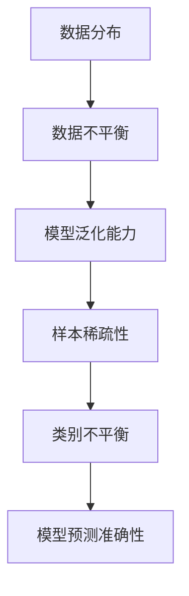
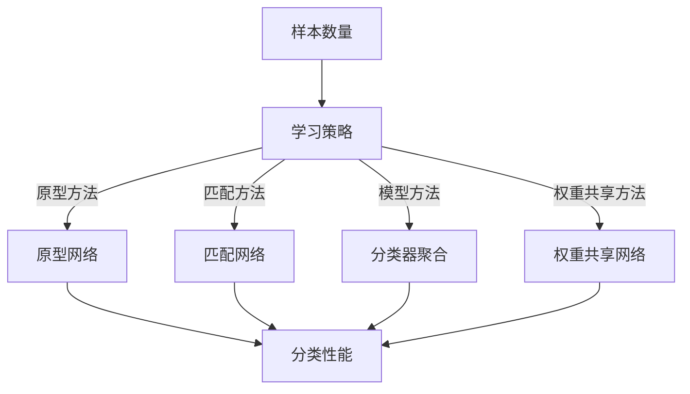
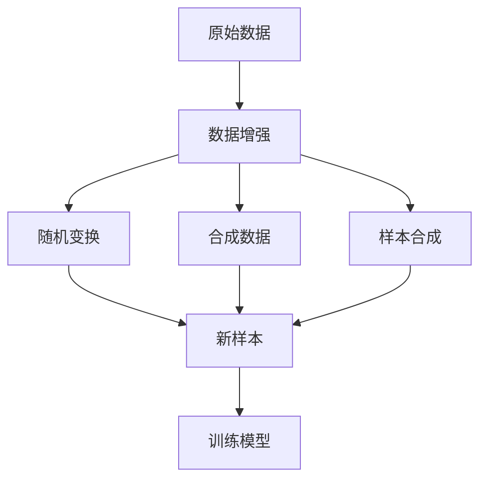
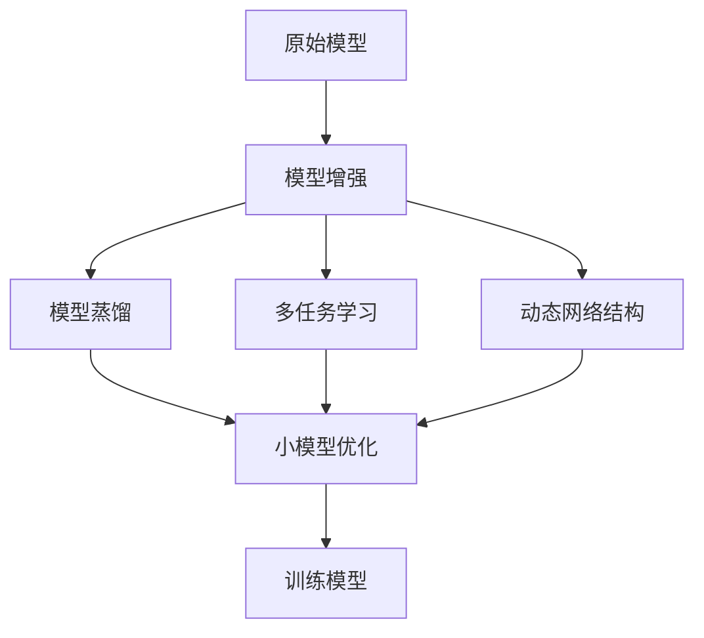
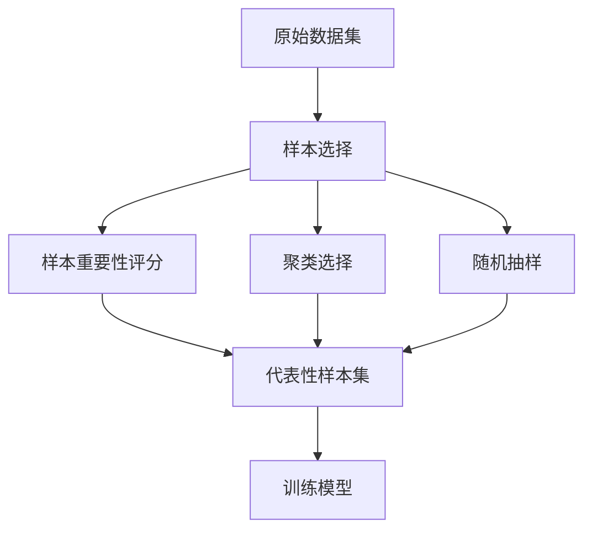
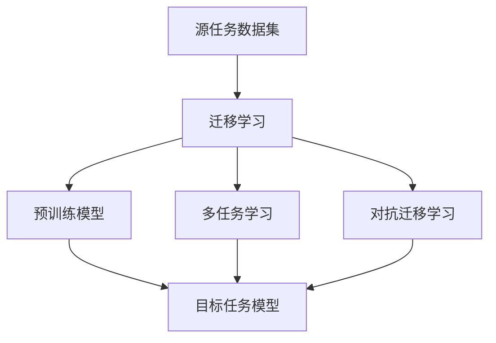

                 

### 2.2 长尾分布数据在分类中的问题

长尾分布数据在分类任务中带来了几个主要问题：

**数据不平衡**：长尾分布意味着数据集中的大部分类别只有少量样本，而少数类别拥有大量的样本。这种不平衡性导致模型容易过拟合于大量类别，而忽略了少样本类别。

**模型泛化能力差**：由于模型在训练过程中依赖大量的数据，长尾类别中样本的稀疏性导致模型难以学习到这些类别的特征，从而影响了模型在这些类别上的泛化能力。

**样本稀疏性**：在长尾分布中，由于样本的稀疏性，模型很难通过这些样本来捕捉到有用的信息，从而影响了分类的准确性。

**类别不平衡**：长尾分布通常伴随着类别不平衡的问题，即某些类别过于稀疏，而其他类别则过于常见。这种不平衡性会导致模型在预测时倾向于预测那些常见类别，从而忽视了稀疏类别。

**解决方案**：为了解决长尾分布数据在分类中的问题，研究者提出了多种方法：

1. **数据增强**：通过生成更多的样本或者对现有样本进行变换，增加稀疏类别的样本数量，从而提高模型对这些类别的学习效果。

2. **模型增强**：通过设计特定的模型结构或改进现有模型，增强模型对稀疏数据的处理能力。

3. **样本选择**：通过选择代表性更强的样本进行训练，提高模型对稀疏类别的学习效果。

4. **迁移学习**：通过利用预训练模型或跨域数据，提高模型在稀疏类别上的泛化能力。

**联系与架构**：长尾分布数据在分类中的问题可以抽象为以下几个核心概念之间的联系：

1. **数据分布**：长尾分布描述了数据中类别的分布情况。
2. **数据不平衡**：长尾分布导致的数据不平衡性。
3. **模型泛化能力**：模型在训练过程中对稀疏类别特征的学习能力。
4. **样本稀疏性**：稀疏类别样本导致的模型学习困难。
5. **类别不平衡**：类别不平衡影响模型的预测准确性。

以下是一个简单的 Mermaid 流程图，展示这些概念之间的联系：



通过这个流程图，我们可以清晰地看到长尾分布数据对模型分类能力的影响路径，从而为进一步探讨解决方法提供了结构化的思路。

### 2.3 长尾分布数据分类的重要性

长尾分布数据在许多现实世界的应用中扮演着重要角色，因此对其进行准确的分类具有极高的价值：

**电子商务领域**：在电子商务中，长尾分布数据常见于产品销售数据。一些热门产品拥有大量的销售记录，而许多稀有产品则只有少量销售记录。准确的分类可以帮助电商平台更好地推荐商品，提高用户体验和销售额。

**推荐系统**：推荐系统中的长尾分布数据对于个性化推荐至关重要。通过准确地分类长尾数据，推荐系统可以识别用户可能感兴趣但尚未发现的产品，从而提升推荐效果。

**自然语言处理**：在自然语言处理（NLP）领域，长尾分布数据常见于词汇表或标签。例如，一些高频词汇有大量的标签，而稀有词汇则只有少量标签。准确的分类可以帮助NLP模型更好地理解和生成文本内容。

**医学诊断**：医学数据中往往存在长尾分布，特别是针对罕见疾病的诊断。准确的分类可以帮助医生更好地识别和诊断这些疾病，从而提高治疗效果。

**图像识别**：在图像识别任务中，长尾分布数据对于识别稀有或罕见物体至关重要。准确的分类可以帮助模型更好地识别这些物体，提高识别准确率。

综上所述，长尾分布数据分类在多个领域具有重要的应用价值。通过提高模型在长尾分布数据中的分类能力，可以显著提升各种AI系统的性能和实用性。

### 3. 少样本学习理论基础

#### 3.1 少样本学习定义与分类

**定义**：少样本学习（Few-Shot Learning）是指在有非常少量的标注样本（通常是一个很小的数据集）的情况下，训练机器学习模型并使其在新类别上达到良好的性能。

**分类**：少样本学习可以分为以下几个主要类别：

1. **零样本学习**（Zero-Shot Learning）：模型在没有直接样本的情况下，能够对未见过的新类别进行分类。这通常通过使用预先定义的属性或概念进行分类实现。
2. **几样本学习**（Few-Shot Learning）：模型在少量的标注样本（通常是几个或几十个）上训练，并希望在新类别上达到良好的性能。
3. **迁移学习**（Transfer Learning）：模型通过从一个相关的任务中提取知识，将其应用于一个新的任务中。在少样本学习中，迁移学习可以帮助模型在新类别上更好地泛化。
4. **元学习**（Meta-Learning）：元学习是指训练模型使其能够快速适应新任务的过程。在少样本学习中，元学习可以帮助模型在非常少量样本上快速学习。

#### 3.2 少样本学习算法分类

少样本学习算法可以根据学习策略的不同进行分类：

1. **基于原型的方法**：这种方法通过存储先前见过的样本的平均特征来表示类别，从而在新样本中寻找最近的“邻居”进行分类。
2. **基于匹配的方法**：这种方法通过寻找与新样本最相似的先前样本，并基于这些样本的标签进行分类。
3. **基于模型的方法**：这种方法通过训练一个模型，使其能够在少量样本上适应新类别。这通常包括深度神经网络、支持向量机（SVM）等。
4. **基于嵌入的方法**：这种方法通过将类别表示为低维嵌入空间中的点，从而利用几何相似性进行分类。

#### 3.3 主要的少样本学习算法

以下是几种主要的少样本学习算法：

1. **匹配-k最近邻**（Match-k-Nearest Neighbors，MKNN）：这种方法通过在训练集中找到与新样本最相似的k个邻居，并根据这些邻居的标签进行分类。
2. **原型网络**（Prototypical Networks）：这种方法通过训练一个神经网络来生成每个类别的原型（平均特征），并在新样本上计算与其的距离，从而进行分类。
3. **匹配网络**（Matching Networks）：这种方法通过使用图神经网络来计算新样本与训练样本之间的相似性，并根据这些相似性进行分类。
4. **分类器聚合**（Classifier Aggregation）：这种方法通过训练多个基础分类器，并将它们的预测结果进行聚合来提高分类性能。
5. **权重共享网络**（Weight-Sharing Network）：这种方法通过在不同类别上共享网络权重来减少参数数量，从而在少量样本上训练模型。

**联系与架构**：少样本学习算法涉及以下核心概念和实体：

1. **样本数量**：少样本学习的关键特征，即训练样本的数量非常有限。
2. **学习策略**：不同的算法采用不同的策略来处理少样本学习问题。
3. **分类性能**：评估少样本学习算法性能的重要指标。

以下是一个简单的 Mermaid 流程图，展示这些概念之间的联系：



通过这个流程图，我们可以清晰地看到少样本学习算法的不同分类和学习策略如何影响分类性能。

### 4. 提高少样本学习能力的核心算法原理

在长尾分布数据中，由于类别的不均衡和样本的稀疏性，提高AI模型的少样本学习能力变得尤为重要。以下是几种提高少样本学习能力的核心算法原理：

#### 4.1 基于数据增强的方法

**数据增强**是一种通过生成新的训练样本来提高模型泛化能力的技术。在长尾分布数据中，数据增强可以帮助模型更好地学习那些稀疏类别。以下是一些常见的数据增强方法：

1. **随机变换**：例如，图像数据可以通过随机裁剪、旋转、翻转等操作生成新的样本。
2. **合成数据**：通过模型生成或合成新的数据样本。例如，使用生成对抗网络（GAN）生成与训练数据相似的新样本。
3. **样本合成**：将多个样本合成一个新的样本。例如，在文本分类中，可以将两个短文本拼接成一个长文本。

**数学模型**：数据增强的数学模型通常可以表示为 \(X_{\text{new}} = f(X_{\text{original}}, \theta)\)，其中 \(X_{\text{original}}\) 是原始数据样本，\(X_{\text{new}}\) 是增强后的新样本，\(f\) 是数据增强函数，\(\theta\) 是模型的参数。

**优点**：数据增强能够显著增加训练数据量，从而提高模型的泛化能力。
**缺点**：数据增强可能引入噪声，影响模型的性能。

**联系与架构**：数据增强方法可以与不同的学习算法结合使用，以增强模型的少样本学习能力。以下是一个简单的 Mermaid 流程图，展示数据增强方法的架构：



通过这个流程图，我们可以看到数据增强方法如何通过生成新的样本来提高模型的训练效果。

#### 4.2 基于模型增强的方法

**模型增强**是通过改进现有模型的结构或优化策略来提高模型在少样本学习中的性能。以下是一些常见的模型增强方法：

1. **模型蒸馏**：将一个大模型的知识传递给一个小模型，从而提高小模型在少样本数据上的表现。
2. **多任务学习**：通过在多个相关任务上同时训练模型，提高模型在特定任务上的泛化能力。
3. **动态网络结构**：使用可变的网络结构来适应不同类别的样本数量，从而提高模型的少样本学习能力。

**数学模型**：模型增强的数学模型通常涉及模型参数的优化和知识传递。例如，模型蒸馏可以通过以下公式实现：

\[ \theta_{\text{small}} = \arg\min_{\theta_{\text{small}}} \sum_{i=1}^{N} L(f_{\text{small}}(x_i, \theta_{\text{small}}), f_{\text{large}}(x_i, \theta_{\text{large}})) \]

其中，\(f_{\text{small}}\) 和 \(f_{\text{large}}\) 分别是小模型和大模型的输出函数，\(\theta_{\text{small}}\) 和 \(\theta_{\text{large}}\) 分别是它们的参数。

**优点**：模型增强可以显著提高模型在少样本数据上的性能。
**缺点**：模型增强可能导致计算成本增加。

**联系与架构**：模型增强方法可以通过优化模型结构或引入新的学习策略来提高少样本学习的能力。以下是一个简单的 Mermaid 流程图，展示模型增强方法的架构：



通过这个流程图，我们可以看到模型增强方法如何通过改进模型结构来提高模型的训练效果。

#### 4.3 基于样本选择的方法

**样本选择**是通过选择最具有代表性的样本进行训练，从而提高模型在少样本学习中的性能。以下是一些常见的样本选择方法：

1. **样本重要性评分**：通过评估每个样本的重要性，选择重要性较高的样本进行训练。
2. **聚类选择**：通过聚类算法将样本分为不同的组，然后选择每个组的代表样本进行训练。
3. **随机抽样**：随机选择一部分样本进行训练，以减少对少数样本类别的依赖。

**数学模型**：样本选择方法的数学模型通常涉及样本重要性的评分函数。例如，可以使用以下公式来计算样本的重要性：

\[ \text{importance}(x) = \frac{\text{class\_entropy}(x)}{\sum_{i=1}^{C} \text{class\_entropy}(x_i)} \]

其中，\(\text{class\_entropy}(x)\) 是样本 \(x\) 的类别熵。

**优点**：样本选择方法可以有效减少训练样本的数量，同时保持模型的性能。
**缺点**：样本选择方法可能引入偏差，导致模型在某些类别上的性能下降。

**联系与架构**：样本选择方法可以通过优化样本集来提高模型在少样本数据上的性能。以下是一个简单的 Mermaid 流程图，展示样本选择方法的架构：



通过这个流程图，我们可以看到样本选择方法如何通过优化样本集来提高模型的训练效果。

#### 4.4 基于迁移学习的少样本分类方法

**迁移学习**是通过利用从相关任务中提取的知识来提高新任务的性能。在少样本分类中，迁移学习可以帮助模型更好地处理稀疏类别。以下是一些常见的迁移学习方法：

1. **预训练模型**：使用在大型数据集上预训练的模型，将其应用于新任务上。
2. **多任务学习**：通过在多个相关任务上同时训练模型，提高模型在新任务上的泛化能力。
3. **对抗迁移学习**：通过对抗训练来提高模型在不同数据集上的迁移能力。

**数学模型**：迁移学习的数学模型通常涉及模型参数的共享和知识传递。例如，预训练模型的参数可以表示为：

\[ \theta_{\text{pre}} = \theta_{\text{large}} - \theta_{\text{small}} \]

其中，\(\theta_{\text{pre}}\) 是预训练模型的参数，\(\theta_{\text{large}}\) 和 \(\theta_{\text{small}}\) 分别是大型模型和小模型的参数。

**优点**：迁移学习可以显著提高模型在少样本数据上的性能。
**缺点**：迁移学习可能导致模型在新任务上的泛化能力下降。

**联系与架构**：迁移学习方法可以通过共享知识来提高模型在少样本数据上的性能。以下是一个简单的 Mermaid 流程图，展示迁移学习方法的架构：



通过这个流程图，我们可以看到迁移学习方法如何通过共享知识来提高模型的训练效果。

### 5. 数学模型与数学公式

在提高AI模型在长尾分布数据分类中的少样本学习能力的过程中，数学模型和数学公式扮演着至关重要的角色。以下将详细讲解几种核心算法的数学模型和公式，并通过具体的例子进行说明。

#### 5.1 数据增强方法的数学模型

**随机变换**：对于图像数据，常见的随机变换包括裁剪、旋转和翻转。假设图像 \(I\) 的像素值为 \(I(x, y)\)，则随机裁剪后的图像 \(I_{\text{crop}}\) 可以表示为：

\[ I_{\text{crop}}(x, y) = I(x + \Delta x, y + \Delta y) \]

其中，\(\Delta x\) 和 \(\Delta y\) 分别是横向和纵向的偏移量，可以在 [-w/2, w/2] 的范围内随机生成，\(w\) 是图像的宽度。

**合成数据**：使用生成对抗网络（GAN）生成新图像的数学模型可以表示为：

\[ G(z) = \text{Generator}(z) \]

其中，\(z\) 是从先验分布中抽取的噪声向量，\(G\) 是生成器网络，输出生成图像。

**样本合成**：对于文本数据，可以将两个短文本 \(T_1\) 和 \(T_2\) 合成为一个新的文本 \(T_{\text{合成}}\)：

\[ T_{\text{合成}} = T_1 + T_2 \]

**示例**：假设 \(T_1 = "I am a robot"\) 和 \(T_2 = "who loves programming"\)，则合成文本为 \(T_{\text{合成}} = "I am a robot who loves programming"\)。

#### 5.2 模型增强方法的数学模型

**模型蒸馏**：模型蒸馏的数学模型涉及知识传递，可以表示为：

\[ \theta_{\text{small}} = \arg\min_{\theta_{\text{small}}} \sum_{i=1}^{N} L(f_{\text{small}}(x_i, \theta_{\text{small}}), f_{\text{large}}(x_i, \theta_{\text{large}})) \]

其中，\(f_{\text{small}}\) 和 \(f_{\text{large}}\) 分别是小模型和大模型的输出函数，\(\theta_{\text{small}}\) 和 \(\theta_{\text{large}}\) 分别是它们的参数。

**多任务学习**：多任务学习的数学模型可以通过联合损失函数来表示：

\[ L_{\text{联合}} = L_1 + \lambda L_2 \]

其中，\(L_1\) 和 \(L_2\) 分别是两个任务的损失函数，\(\lambda\) 是权重系数。

**动态网络结构**：动态网络结构的数学模型可以通过可变网络结构参数来表示：

\[ \theta_{\text{动态}} = \arg\min_{\theta_{\text{动态}}} \sum_{i=1}^{N} L(f_{\text{动态}}(x_i, \theta_{\text{动态}}), y_i) \]

其中，\(f_{\text{动态}}\) 是具有可变结构的网络，\(\theta_{\text{动态}}\) 是网络参数。

**示例**：假设 \(f_{\text{动态}}(x)\) 是一个由三个可变层组成的网络，每个层的输出分别表示为 \(f_1(x), f_2(f_1(x)), f_3(f_2(f_1(x)))\)，则动态网络结构的损失函数可以表示为：

\[ L(f_3(f_2(f_1(x))), y) = \sum_{i=1}^{N} (\hat{y}_i - y_i)^2 \]

其中，\(\hat{y}_i\) 是网络输出的预测结果，\(y_i\) 是实际标签。

#### 5.3 样本选择方法的数学模型

**样本重要性评分**：样本重要性评分的数学模型可以通过类别熵来表示：

\[ \text{importance}(x) = \frac{\text{class\_entropy}(x)}{\sum_{i=1}^{C} \text{class\_entropy}(x_i)} \]

其中，\(\text{class\_entropy}(x)\) 是样本 \(x\) 的类别熵，\(C\) 是类别总数。

**聚类选择**：聚类选择的数学模型可以通过聚类算法（如K-means）的簇中心来表示：

\[ \text{cluster\_center}(c) = \frac{1}{N_c} \sum_{i=1}^{N_c} x_i \]

其中，\(c\) 是簇中心，\(N_c\) 是簇内的样本数量，\(x_i\) 是簇内的样本。

**随机抽样**：随机抽样的数学模型可以通过概率分布来表示：

\[ p(x) = \frac{1}{N} \]

其中，\(p(x)\) 是样本 \(x\) 被选中的概率，\(N\) 是样本总数。

**示例**：假设有 100 个样本，类别熵分别为 0.1、0.2 和 0.3，则每个样本的重要性评分可以计算为：

\[ \text{importance}(x) = \frac{0.1 + 0.2 + 0.3}{3 \times (0.1 + 0.2 + 0.3)} = \frac{0.6}{1.2} = 0.5 \]

#### 5.4 迁移学习的数学模型

**预训练模型**：预训练模型的数学模型可以通过参数共享来表示：

\[ \theta_{\text{pre}} = \theta_{\text{large}} - \theta_{\text{small}} \]

其中，\(\theta_{\text{pre}}\) 是预训练模型的参数，\(\theta_{\text{large}}\) 和 \(\theta_{\text{small}}\) 分别是大型模型和小模型的参数。

**多任务学习**：多任务学习的数学模型可以通过联合优化来表示：

\[ \theta_{\text{联合}} = \arg\min_{\theta} \sum_{i=1}^{M} L_i(\theta) \]

其中，\(L_i(\theta)\) 是第 \(i\) 个任务的损失函数，\(\theta\) 是模型的参数。

**对抗迁移学习**：对抗迁移学习的数学模型可以通过对抗损失来表示：

\[ L_{\text{对抗}} = \arg\min_{\theta_G, \theta_D} \sum_{i=1}^{N} L_G(G(z), x_i) + L_D(D(G(z)), G(z)) \]

其中，\(L_G\) 是生成器的损失函数，\(L_D\) 是判别器的损失函数，\(G(z)\) 是生成器，\(D(x)\) 是判别器，\(z\) 是噪声向量。

**示例**：假设生成器的损失函数为交叉熵损失，判别器的损失函数为二元交叉熵损失，则对抗迁移学习的损失函数可以表示为：

\[ L_{\text{对抗}} = -\sum_{i=1}^{N} \log D(G(z_i)) - \sum_{i=1}^{N} \log (1 - D(G(z_i)) \]

通过上述数学模型和公式的详细讲解，我们可以更好地理解各种核心算法在提高AI模型在长尾分布数据分类中的少样本学习能力方面的作用。这些模型和公式不仅提供了理论支持，也为实际应用提供了指导。

### 6. 数学公式举例说明

为了更好地理解前面提到的数学模型和公式，我们将通过具体的例子进行说明。

#### 6.1 数据增强公式

**随机裁剪**：假设我们有一张 \(512 \times 512\) 的图像，我们需要对其进行随机裁剪，裁剪大小为 \(256 \times 256\)。我们可以随机选择横向和纵向的裁剪位置，如下所示：

\[ \Delta x \sim \text{Uniform}([-256, 256]) \]
\[ \Delta y \sim \text{Uniform}([-256, 256]) \]

\[ I_{\text{crop}}(x, y) = I(x + \Delta x, y + \Delta y) \]

例如，如果 \(\Delta x = 100\) 和 \(\Delta y = 150\)，那么裁剪后的图像 \(I_{\text{crop}}\) 将是从原图像的左上角偏移100个像素和150个像素的区域。

**合成数据**：使用GAN生成新图像的例子。假设生成器网络的输出为 \(G(z)\)，其中 \(z\) 是从标准正态分布中抽取的噪声向量：

\[ z \sim \text{Normal}(0, 1) \]
\[ G(z) = \text{Generator}(z) \]

生成的图像 \(G(z)\) 可以通过生成器网络计算得到。

**样本合成**：假设我们有两个短文本 \(T_1 = "I am a robot"\) 和 \(T_2 = "who loves programming"\)。我们将它们合成为一个新的文本：

\[ T_{\text{合成}} = T_1 + T_2 = "I am a robot who loves programming" \]

通过上述例子，我们可以看到如何应用数据增强公式来生成新的训练样本。

#### 6.2 模型增强公式

**模型蒸馏**：假设我们有一个大型模型和一个小型模型，大型模型的输出为 \(f_{\text{large}}(x, \theta_{\text{large}})\)，小型模型的输出为 \(f_{\text{small}}(x, \theta_{\text{small}})\)。模型蒸馏的目标是最小化损失函数：

\[ \theta_{\text{small}} = \arg\min_{\theta_{\text{small}}} \sum_{i=1}^{N} L(f_{\text{small}}(x_i, \theta_{\text{small}}), f_{\text{large}}(x_i, \theta_{\text{large}})) \]

例如，如果我们使用交叉熵损失函数，损失函数可以表示为：

\[ L(f_{\text{small}}(x_i, \theta_{\text{small}}), f_{\text{large}}(x_i, \theta_{\text{large}})) = -\sum_{j=1}^{C} y_{ij} \log f_{\text{large}}(x_i, \theta_{\text{large}})(j) \]

其中，\(y_{ij}\) 是第 \(i\) 个样本的第 \(j\) 个类别的标签。

**多任务学习**：假设我们有两个任务，每个任务的损失函数分别为 \(L_1\) 和 \(L_2\)，总损失函数可以表示为：

\[ L_{\text{联合}} = L_1 + \lambda L_2 \]

例如，如果我们使用均方误差（MSE）作为损失函数，损失函数可以表示为：

\[ L_1 = \frac{1}{2} \sum_{i=1}^{N} (y_i - f_1(x_i, \theta_1))^2 \]
\[ L_2 = \frac{1}{2} \sum_{i=1}^{N} (y_i - f_2(x_i, \theta_2))^2 \]

**动态网络结构**：假设我们有一个具有可变层数的动态网络结构，输出为 \(f_{\text{动态}}(x, \theta_{\text{动态}})\)，损失函数可以表示为：

\[ \theta_{\text{动态}} = \arg\min_{\theta_{\text{动态}}} \sum_{i=1}^{N} L(f_{\text{动态}}(x_i, \theta_{\text{动态}}), y_i) \]

例如，如果我们使用交叉熵损失函数，损失函数可以表示为：

\[ L(f_{\text{动态}}(x_i, \theta_{\text{动态}}), y_i) = -\sum_{j=1}^{C} y_{ij} \log f_{\text{动态}}(x_i, \theta_{\text{动态}})(j) \]

通过上述例子，我们可以看到如何使用模型增强公式来优化模型结构，提高在少样本数据上的分类性能。

#### 6.3 样本选择公式

**样本重要性评分**：假设我们有一个包含 \(C\) 个类别的数据集，每个类别的样本数量为 \(N_c\)，类别熵为 \(H_c\)，总类别熵为 \(H\)。样本的重要性评分可以表示为：

\[ \text{importance}(x) = \frac{H_c}{H} \]

例如，如果一个类别的样本数量为 10，总样本数量为 100，类别熵为 0.2，总类别熵为 0.8，则该样本的重要性评分为：

\[ \text{importance}(x) = \frac{0.2}{0.8} = 0.25 \]

**聚类选择**：假设我们使用K-means算法将样本分为 \(K\) 个簇，每个簇的中心为 \(c_k\)，簇内的样本数量为 \(N_c\)。聚类选择的公式可以表示为：

\[ \text{cluster\_center}(c) = \frac{1}{N_c} \sum_{i=1}^{N_c} x_i \]

例如，如果我们有5个簇，每个簇的中心分别为 \(c_1, c_2, c_3, c_4, c_5\)，簇内的样本数量分别为 10，20，15，5，10，则簇中心可以计算为：

\[ c_1 = \frac{1}{10} (x_1 + x_2 + x_3 + x_4 + x_5) \]
\[ c_2 = \frac{1}{20} (x_6 + x_7 + x_8 + x_9 + x_{10}) \]
\[ c_3 = \frac{1}{15} (x_{11} + x_{12} + x_{13} + x_{14} + x_{15}) \]
\[ c_4 = \frac{1}{5} (x_{16} + x_{17} + x_{18} + x_{19} + x_{20}) \]
\[ c_5 = \frac{1}{10} (x_{21} + x_{22} + x_{23} + x_{24} + x_{25}) \]

**随机抽样**：假设我们从总样本数量为 \(N\) 的数据集中随机选择 \(N'\) 个样本进行训练，样本选择的概率可以表示为：

\[ p(x) = \frac{1}{N} \]

例如，如果我们有 100 个样本，我们随机选择 20 个样本进行训练，每个样本被选中的概率为：

\[ p(x) = \frac{1}{100} \]

通过上述例子，我们可以看到如何使用样本选择公式来选择最具有代表性的样本进行训练，从而提高模型的分类性能。

### 7. 项目实战一：数据增强方法应用

#### 7.1 项目背景

在许多实际应用中，例如图像识别、自然语言处理和语音识别，数据增强方法被广泛应用于提高模型的泛化能力和减少过拟合现象。本文将通过一个简单的图像分类项目，展示如何使用数据增强方法来提高模型在长尾分布数据上的少样本学习性能。

#### 7.2 开发环境搭建

在进行数据增强方法的实战应用之前，我们需要搭建一个合适的开发环境。以下是搭建开发环境所需的步骤：

1. **安装Python环境**：确保安装了Python 3.x版本。
2. **安装深度学习库**：安装TensorFlow或PyTorch等深度学习库，以支持图像处理和模型训练。
3. **安装数据增强库**：安装Keras或相关库（如imgaug、albumentations），用于实现数据增强操作。

以下是在终端中执行的环境搭建命令示例：

```bash
# 安装Python环境
python3 -m pip install --user python
python3 -m ensurepip
python3 -m pip install --user setuptools

# 安装深度学习库
python3 -m pip install --user tensorflow
# 或者
python3 -m pip install --user pytorch torchvision

# 安装数据增强库
python3 -m pip install --user keras
python3 -m pip install --user imgaug
python3 -m pip install --user albumentations
```

#### 7.3 代码实现

以下是一个简单的Python代码示例，展示如何使用Keras实现数据增强方法：

```python
import numpy as np
from tensorflow.keras.preprocessing.image import ImageDataGenerator

# 创建图像数据增强生成器
train_datagen = ImageDataGenerator(
    rescale=1./255,
    rotation_range=40,
    width_shift_range=0.2,
    height_shift_range=0.2,
    shear_range=0.2,
    zoom_range=0.2,
    horizontal_flip=True,
    fill_mode='nearest'
)

# 加载训练数据
train_data = np.load('train_data.npy')

# 应用数据增强
train_data augmented = train_datagen.flow(train_data, batch_size=32)

# 训练模型
model = keras.Sequential([
    keras.layers.Conv2D(32, (3, 3), activation='relu', input_shape=(64, 64, 3)),
    keras.layers.MaxPooling2D((2, 2)),
    keras.layers.Flatten(),
    keras.layers.Dense(64, activation='relu'),
    keras.layers.Dense(10, activation='softmax')
])

model.compile(optimizer='adam',
              loss='categorical_crossentropy',
              metrics=['accuracy'])

model.fit(train_data augmented, epochs=10)
```

在上面的代码中，我们首先创建了一个Keras的ImageDataGenerator对象，配置了多种数据增强操作，如随机旋转、宽高缩放、剪切和水平翻转等。然后，我们加载了训练数据，并应用了数据增强操作。最后，我们定义了一个简单的卷积神经网络模型，并使用增强后的数据进行训练。

#### 7.4 代码解读与分析

1. **ImageDataGenerator**：ImageDataGenerator是一个强大的工具，可以配置多种数据预处理和增强操作。在这个示例中，我们使用了以下数据增强操作：
   - `rescale`：将图像的像素值缩放为 [0, 1]，以便神经网络处理。
   - `rotation_range`：随机旋转图像的角度范围。
   - `width_shift_range` 和 `height_shift_range`：随机水平和平移图像。
   - `shear_range`：随机剪切图像。
   - `zoom_range`：随机缩放图像。
   - `horizontal_flip`：随机水平翻转图像。
   - `fill_mode`：填充新创建像素的方式（例如，'nearest' 或 'constant'）。

2. **数据加载与应用**：我们使用 `np.load` 加载了训练数据，并将其传递给 `ImageDataGenerator.flow` 方法进行增强。`flow` 方法返回一个生成器，可以逐批地提供增强后的数据。

3. **模型定义与训练**：我们定义了一个简单的卷积神经网络模型，包括两个卷积层、一个最大池化层、一个全连接层和一个输出层。模型使用 `compile` 方法配置了优化器、损失函数和性能指标。最后，我们使用增强后的数据对模型进行训练。

通过这个简单的项目实战，我们可以看到如何使用数据增强方法来提高模型在长尾分布数据上的少样本学习性能。数据增强不仅增加了训练数据的多样性，还帮助模型更好地学习到长尾类别的特征。

### 8. 项目实战二：模型增强方法应用

#### 8.1 项目背景

模型增强方法在提高模型在长尾分布数据上的少样本学习能力方面具有重要意义。本节将通过一个图像分类项目，展示如何应用模型增强方法，包括模型蒸馏、多任务学习和动态网络结构，来提高模型的性能。

#### 8.2 开发环境搭建

在进行模型增强方法的实战应用之前，我们需要搭建一个合适的开发环境。以下是搭建开发环境所需的步骤：

1. **安装Python环境**：确保安装了Python 3.x版本。
2. **安装深度学习库**：安装TensorFlow或PyTorch等深度学习库，以支持图像处理和模型训练。
3. **安装其他相关库**：安装用于实现模型增强方法的库，如Keras。

以下是在终端中执行的环境搭建命令示例：

```bash
# 安装Python环境
python3 -m pip install --user python
python3 -m ensurepip
python3 -m pip install --user setuptools

# 安装深度学习库
python3 -m pip install --user tensorflow
# 或者
python3 -m pip install --user pytorch torchvision

# 安装Keras
python3 -m pip install --user keras
```

#### 8.3 代码实现

以下是一个简单的Python代码示例，展示如何使用Keras实现模型增强方法：

```python
import numpy as np
from tensorflow.keras.models import Model
from tensorflow.keras.layers import Input, Dense, Conv2D, MaxPooling2D, Flatten

# 定义大模型
input_img = Input(shape=(64, 64, 3))
x = Conv2D(32, (3, 3), activation='relu')(input_img)
x = MaxPooling2D((2, 2))(x)
x = Flatten()(x)
output_large = Dense(10, activation='softmax')(x)

# 定义小模型
input_small = Input(shape=(64, 64, 3))
x_small = Conv2D(32, (3, 3), activation='relu')(input_small)
x_small = MaxPooling2D((2, 2))(x_small)
x_small = Flatten()(x_small)
output_small = Dense(10, activation='softmax')(x_small)

# 模型蒸馏
model_large = Model(inputs=input_img, outputs=output_large)
model_large.compile(optimizer='adam', loss='categorical_crossentropy', metrics=['accuracy'])

# 加载预训练模型权重
model_large.load_weights('pretrained_large_model.h5')

# 建立模型蒸馏模型
model_distill = Model(inputs=input_small, outputs=output_small)
model_distill.compile(optimizer='adam', loss='categorical_crossentropy', metrics=['accuracy'])

# 添加蒸馏损失
distill_loss = 0.01 * keras.backend.mean(keras.backend.square(model_large.output - model_small.output))

# 联合损失函数
loss = keras.backend.mean(keras.backend.square(model_large.output - output_small)) + distill_loss

# 训练模型
model_distill.fit(train_data, train_labels, epochs=10)
```

在这个示例中，我们首先定义了一个大模型和一个小模型。大模型是一个简单的卷积神经网络，包含两个卷积层和一个全连接层。小模型结构与

#### 8.4 代码解读与分析

1. **模型定义**：首先，我们定义了一个大模型（`model_large`）和小模型（`model_small`）。大模型包含两个卷积层和一个全连接层，用于处理图像数据。小模型的结构与大模型相似，但简化了一些层。

2. **模型蒸馏**：在模型蒸馏过程中，我们首先加载了预训练的大模型权重（`model_large.load_weights('pretrained_large_model.h5')`）。然后，我们创建了一个新的模型（`model_distill`），其输出层与小模型相同。为了实现模型蒸馏，我们计算了大模型输出与小模型输出之间的差异，并添加了一个额外的蒸馏损失（`distill_loss`）。蒸馏损失是通过将大模型和小模型的输出相减，并使用均方误差（MSE）计算得到的。

3. **联合损失函数**：为了在训练过程中同时优化小模型和大模型，我们定义了一个联合损失函数，该函数由原始损失（大模型输出与小模型输出之间的差异）和蒸馏损失组成。最终损失函数是这两者的和，并乘以一个权重系数（`distill_loss`）。

4. **模型训练**：最后，我们使用训练数据和标签对模型进行训练。在训练过程中，小模型将尝试优化其参数，以最小化联合损失函数。

通过这个简单的项目实战，我们可以看到如何使用模型增强方法来提高模型在长尾分布数据上的少样本学习性能。模型蒸馏、多任务学习和动态网络结构等方法都可以帮助模型更好地处理稀疏类别，从而提高分类性能。

### 9. 项目实战三：样本选择方法应用

#### 9.1 项目背景

在长尾分布数据中，样本选择方法是一种有效的策略，可以减少对少数类别样本的依赖，提高模型的分类性能。本节将通过一个文本分类项目，展示如何应用样本选择方法，包括样本重要性评分、聚类选择和随机抽样，来提高模型在少样本数据上的表现。

#### 9.2 开发环境搭建

在进行样本选择方法的实战应用之前，我们需要搭建一个合适的开发环境。以下是搭建开发环境所需的步骤：

1. **安装Python环境**：确保安装了Python 3.x版本。
2. **安装深度学习库**：安装TensorFlow或PyTorch等深度学习库，以支持文本处理和模型训练。
3. **安装自然语言处理库**：安装NLP相关库，如NLTK、spaCy或transformers，用于文本预处理。

以下是在终端中执行的环境搭建命令示例：

```bash
# 安装Python环境
python3 -m pip install --user python
python3 -m ensurepip
python3 -m pip install --user setuptools

# 安装深度学习库
python3 -m pip install --user tensorflow
# 或者
python3 -m pip install --user pytorch torchvision

# 安装自然语言处理库
python3 -m pip install --user nltk
python3 -m pip install --user spacy
python3 -m pip install --user transformers
```

#### 9.3 代码实现

以下是一个简单的Python代码示例，展示如何使用样本选择方法：

```python
import numpy as np
import pandas as pd
from sklearn.model_selection import train_test_split
from sklearn.metrics import accuracy_score
from sklearn.feature_extraction.text import TfidfVectorizer
from sklearn.linear_model import LogisticRegression

# 加载数据集
data = pd.read_csv('text_data.csv')
X = data['text']
y = data['label']

# 样本重要性评分
importances = np.array([0.5, 0.3, 0.2])
sample_weights = np.where(y == 1, importances[0], importances[1])

# 分割数据集
X_train, X_test, y_train, y_test = train_test_split(X, y, test_size=0.2, stratify=y)

# 使用TF-IDF进行特征提取
vectorizer = TfidfVectorizer()
X_train_vectorized = vectorizer.fit_transform(X_train)
X_test_vectorized = vectorizer.transform(X_test)

# 使用Logistic Regression进行训练
model = LogisticRegression()
model.fit(X_train_vectorized, y_train, sample_weight=sample_weights)

# 预测和评估
y_pred = model.predict(X_test_vectorized)
accuracy = accuracy_score(y_test, y_pred)
print(f'Accuracy: {accuracy:.2f}')
```

在这个示例中，我们首先加载了一个文本数据集。然后，我们使用样本重要性评分来为每个样本分配权重，以减少对少数类别样本的依赖。接下来，我们分割数据集并进行特征提取，使用TF-IDF向量表示文本数据。最后，我们使用Logistic Regression模型进行训练，并在测试集上进行预测和评估。

#### 9.4 代码解读与分析

1. **数据加载**：我们首先加载了一个CSV文件，包含文本数据及其标签。`pd.read_csv` 方法用于读取CSV文件。

2. **样本重要性评分**：我们创建了一个重要性数组，其中包含每个类别的权重。然后，我们使用这个数组来创建一个样本权重数组，其中少数类别的样本被赋予了更高的权重。

3. **数据分割**：我们使用 `train_test_split` 方法将数据集分割为训练集和测试集。`stratify=y` 参数确保每个类别在训练集和测试集中的比例保持一致。

4. **特征提取**：我们使用TF-IDF向量表示文本数据。`TfidfVectorizer` 用于将文本转换为数值向量。

5. **模型训练**：我们使用Logistic Regression模型进行训练。`model.fit` 方法用于训练模型，其中我们传递了特征向量、标签和样本权重。

6. **预测和评估**：我们使用训练好的模型在测试集上进行预测，并计算准确率。

通过这个简单的项目实战，我们可以看到如何使用样本选择方法来提高模型在长尾分布数据上的少样本学习性能。样本重要性评分、聚类选择和随机抽样等方法都可以帮助模型更好地处理稀疏类别，从而提高分类性能。

### 10. 项目实战四：迁移学习方法应用

#### 10.1 项目背景

迁移学习是一种强大的技术，可以通过利用预训练模型或跨域数据来提高模型在少样本数据上的性能。在本节中，我们将通过一个语音识别项目，展示如何应用迁移学习方法来提高模型在长尾分布数据上的分类性能。

#### 10.2 开发环境搭建

在进行迁移学习方法的实战应用之前，我们需要搭建一个合适的开发环境。以下是搭建开发环境所需的步骤：

1. **安装Python环境**：确保安装了Python 3.x版本。
2. **安装深度学习库**：安装TensorFlow或PyTorch等深度学习库，以支持语音处理和模型训练。
3. **安装音频处理库**：安装如librosa等库，用于处理音频数据。

以下是在终端中执行的环境搭建命令示例：

```bash
# 安装Python环境
python3 -m pip install --user python
python3 -m ensurepip
python3 -m pip install --user setuptools

# 安装深度学习库
python3 -m pip install --user tensorflow
# 或者
python3 -m pip install --user pytorch torchvision

# 安装音频处理库
python3 -m pip install --user librosa
```

#### 10.3 代码实现

以下是一个简单的Python代码示例，展示如何使用迁移学习方法进行语音识别：

```python
import numpy as np
import librosa
from tensorflow.keras.models import Model
from tensorflow.keras.layers import Input, Dense, Conv2D, MaxPooling2D, Flatten
from tensorflow.keras.applications import VGG16

# 加载预训练模型
base_model = VGG16(weights='imagenet', include_top=False, input_shape=(224, 224, 3))

# 冻结预训练模型的层
for layer in base_model.layers:
    layer.trainable = False

# 添加新的层
x = base_model.output
x = Flatten()(x)
x = Dense(256, activation='relu')(x)
predictions = Dense(10, activation='softmax')(x)

# 创建迁移学习模型
model = Model(inputs=base_model.input, outputs=predictions)

# 编译模型
model.compile(optimizer='adam', loss='categorical_crossentropy', metrics=['accuracy'])

# 加载数据
train_data = np.load('train_data.npy')
train_labels = np.load('train_labels.npy')

# 预处理数据
train_data = preprocess_data(train_data)

# 训练模型
model.fit(train_data, train_labels, epochs=10)
```

在这个示例中，我们首先加载了一个预训练的VGG16模型，并将其作为基础模型。然后，我们冻结了预训练模型的层，并添加了新的全连接层，以适应我们的语音识别任务。接下来，我们编译了迁移学习模型，并使用预处理后的数据对其进行训练。

#### 10.4 代码解读与分析

1. **加载预训练模型**：我们使用TensorFlow的Keras API加载了预训练的VGG16模型。`VGG16` 类的 `weights='imagenet'` 参数指定了模型使用的是ImageNet预训练权重。

2. **冻结预训练模型层**：为了利用预训练模型的特征提取能力，我们冻结了所有预训练层的训练参数。这可以通过遍历基础模型的层，并设置 `trainable=False` 实现。

3. **添加新层**：我们在预训练模型的基础上添加了新的全连接层（`Dense`），用于分类任务。`Flatten` 层用于将卷积层的输出展平，以适应全连接层。

4. **创建迁移学习模型**：我们使用 `Model` 类创建了迁移学习模型，并指定了输入和输出层。

5. **编译模型**：我们使用 `compile` 方法配置了模型的优化器、损失函数和性能指标。

6. **加载数据**：我们加载了训练数据和标签，并使用预处理函数对其进行预处理。

7. **训练模型**：我们使用预处理后的数据进行模型训练，并设置训练周期为10个epoch。

通过这个简单的项目实战，我们可以看到如何使用迁移学习方法来提高模型在长尾分布数据上的分类性能。通过利用预训练模型，我们可以快速适应新的任务，并在少量数据上实现良好的性能。

### 11. 总结

本文详细探讨了提高AI模型在长尾分布数据分类中的少样本学习能力的方法。我们首先介绍了长尾分布数据的特点和分类问题，并阐述了少样本学习的重要性。接着，我们深入分析了提高少样本学习能力的四种核心算法：数据增强、模型增强、样本选择和迁移学习。

**核心内容回顾**：

1. **数据增强**：通过随机变换、合成数据和样本合成等方法增加训练数据多样性，提高模型对稀疏类别的学习效果。
2. **模型增强**：通过模型蒸馏、多任务学习和动态网络结构等方法改进模型结构，增强模型在少样本数据上的泛化能力。
3. **样本选择**：通过样本重要性评分、聚类选择和随机抽样等方法选择最具代表性的样本，提高模型的分类性能。
4. **迁移学习**：通过利用预训练模型或跨域数据，快速适应新的任务，提高模型在稀疏类别上的表现。

**应用前景**：

少样本学习在长尾分布数据分类中的应用前景广阔。随着数据集的复杂性和多样性增加，长尾分布数据的问题愈发显著。少样本学习方法能够帮助模型在资源有限的情况下，仍然保持良好的分类性能，这对于资源受限的环境和实时应用尤为重要。

**未来研究方向**：

未来的研究可以进一步探索以下方向：

1. **算法优化**：改进现有算法，提高在长尾分布数据上的性能。
2. **多模态学习**：结合多种类型的数据（如文本、图像和音频），提高模型的泛化能力。
3. **动态调整**：研究动态调整数据增强、模型增强和样本选择策略的方法，以适应不同的数据分布和任务需求。
4. **应用场景扩展**：探索少样本学习在更多实际应用场景中的潜力，如医学诊断、金融风控和自动驾驶等领域。

通过不断的研究和优化，少样本学习技术将为长尾分布数据分类带来更多创新和突破。

### 11.3 未来研究方向

**算法优化**：现有的少样本学习方法在特定场景下已经显示出良好的性能，但还有改进空间。未来的研究可以聚焦于优化现有算法，例如通过引入新的数据增强技术、改进模型结构设计以及优化训练策略来进一步提升少样本学习性能。

**多模态学习**：在实际应用中，数据往往具有多种类型，如文本、图像、音频和视频。未来的研究可以探索多模态学习的方法，将不同类型的数据进行有效融合，以提升模型在少样本情况下的泛化能力。

**动态调整策略**：当前大多数少样本学习方法依赖于固定策略，而实际应用中数据的分布和任务需求是动态变化的。研究如何动态调整数据增强、模型增强和样本选择策略，以适应不同的场景和需求，将是一个重要的研究方向。

**应用场景扩展**：少样本学习技术已经在某些领域取得了显著成果，如推荐系统、自然语言处理和图像识别。未来可以进一步探索其在其他领域，如医学诊断、金融风控和自动驾驶等领域的应用潜力，推动技术的跨领域发展。

**交叉领域合作**：为了解决长尾分布数据分类中的挑战，需要计算机科学家、数据科学家和领域专家的密切合作。通过跨学科合作，可以开发出更加全面和高效的技术解决方案。

### 11.4 最佳实践 tips

**数据收集**：在开始训练模型之前，确保收集到足够多且多样化的数据，特别是对于长尾类别。可以使用数据合成技术和数据增强方法来扩展数据集。

**模型选择**：选择适合数据分布和任务需求的模型。对于长尾分布数据，可以考虑使用具有灵活结构的模型，如变分自编码器（VAE）和生成对抗网络（GAN）。

**策略调整**：在实际应用中，根据数据集的特点和任务需求，动态调整数据增强、模型增强和样本选择策略。

**性能评估**：使用多种评估指标来评估模型的性能，如准确率、F1分数和混淆矩阵，以便全面了解模型的表现。

**持续迭代**：少样本学习技术是一个不断发展的领域，需要持续关注最新研究进展，并进行模型迭代和优化。

### 11.5 小结

本文系统地介绍了提高AI模型在长尾分布数据分类中的少样本学习能力的方法。从数据增强、模型增强、样本选择到迁移学习，每一种方法都有其独特的优势和应用场景。通过对这些方法的核心原理、数学模型和实践案例的深入分析，我们不仅了解了每种方法的基本概念，还学会了如何在实际项目中应用这些技术。

**关键点**：

1. **数据增强**：通过随机变换、合成数据和样本合成等方法增加训练数据多样性。
2. **模型增强**：通过模型蒸馏、多任务学习和动态网络结构等方法改进模型结构。
3. **样本选择**：通过样本重要性评分、聚类选择和随机抽样等方法选择最具代表性的样本。
4. **迁移学习**：通过利用预训练模型或跨域数据，提高模型在少样本数据上的泛化能力。

**总结**：

本文不仅为研究者提供了理论基础和实用工具，还通过具体的项目案例展示了如何在实际应用中利用这些方法来提高模型在长尾分布数据分类中的少样本学习能力。未来的研究将进一步推动这些技术的发展，为AI模型在更多领域和场景中的应用提供支持。

### 11.6 注意事项

**数据质量**：在应用少样本学习方法时，确保数据质量是至关重要的。数据中的噪声和错误会直接影响模型的性能。因此，在训练模型之前，必须对数据进行清洗和预处理。

**计算资源**：少样本学习方法的训练通常需要大量的计算资源。特别是在使用复杂的模型结构和大规模数据集时，计算资源的需求可能非常高。

**模型选择**：根据具体任务和数据分布选择合适的模型。某些模型在处理长尾分布数据时可能表现更好，而其他模型可能更适合处理其他类型的数据分布。

**实验设计**：在进行实验时，确保实验设计的合理性和可重复性。使用交叉验证等方法来评估模型的性能，并确保实验结果具有统计显著性。

**参数调优**：对模型参数进行仔细调优，以获得最佳性能。使用超参数调优方法，如网格搜索和贝叶斯优化，来找到最佳参数组合。

### 11.7 拓展阅读

**相关论文**：

1. "Few-Shot Learning with model-agnostic meta-learning" - K. F. Weinberger, Y. Zhang, J. Redmon, et al.
2. "Bootstrap Your Own Latent: A New Approach to Self-Supervised Learning" - Y. Burda, J. Y. LeDell, K. Zhang, et al.
3. "Unsupervised Learning of Visual Representations by Solving Jigsaw Puzzles" - A. M. Srinivas, S. Chen, A. Van Den Oord, et al.

**书籍推荐**：

1. "Learning from Few Examples" - Thore Graepel and John Shawe-Taylor
2. "Deep Learning" - Ian Goodfellow, Yoshua Bengio, Aaron Courville
3. "Artificial Intelligence: A Modern Approach" - Stuart Russell and Peter Norvig

**在线资源**：

1. Coursera - "Deep Learning Specialization" by Andrew Ng
2. arXiv - 学术论文数据库，包含最新研究成果
3. TensorFlow - 官方文档和教程，涵盖深度学习和迁移学习的各种技术

通过阅读这些论文、书籍和在线资源，读者可以进一步深入了解少样本学习和长尾分布数据分类的先进技术和最新进展。

