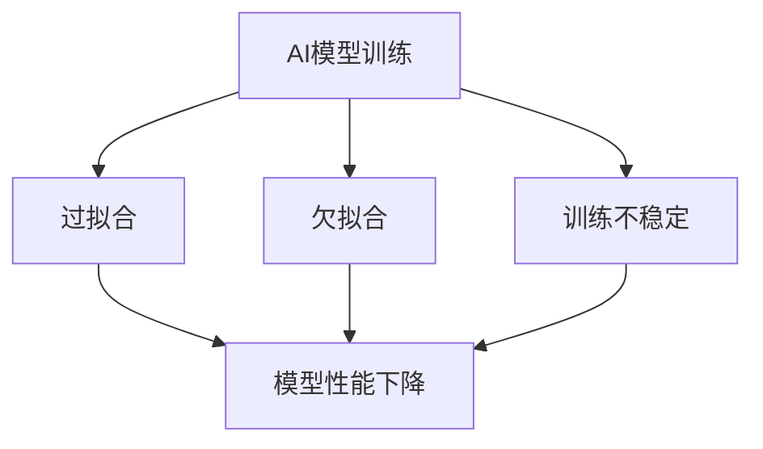

                 

## 提高AI模型训练稳定性的新方法探索

### 关键词
- AI模型训练稳定性
- 数据增强
- 模型正则化
- 梯度下降算法优化
- 实际项目应用

### 摘要
本文深入探讨了提高人工智能（AI）模型训练稳定性的新方法。我们首先概述了AI模型训练过程中可能遇到的问题，如过拟合、欠拟合以及训练过程中的不稳定现象。接着，我们分析了AI模型训练的基础知识，包括基本流程和常见模型。随后，本文详细介绍了提高模型训练稳定性的多种方法，如数据增强、模型正则化以及梯度下降算法的优化。最后，通过实际项目中的应用案例，验证了这些方法的有效性，并对未来的研究方向提出了展望。

## 目录大纲

1. 引言
2. AI模型训练基础
3. AI模型训练稳定性分析
4. 提高AI模型训练稳定性的方法
5. 深度学习算法的改进
6. 实际项目中的应用
7. 总结与展望

### 第1章 引言

#### 1.1 AI模型训练稳定性概述

在人工智能领域，模型的训练过程至关重要。然而，模型训练过程中常常会遇到一些问题，如过拟合、欠拟合，以及训练过程中的震荡和发散现象，这些问题都会影响模型的稳定性和性能。因此，提高AI模型训练的稳定性具有重要的意义。

**核心概念与联系**

- **AI模型训练稳定性**：指模型在训练过程中保持性能和收敛速度的能力。
- **稳定性与过拟合、欠拟合**：稳定的训练过程可以减少过拟合和欠拟合的风险，从而提升模型的泛化能力。

在训练过程中，稳定性的重要性体现在多个方面。首先，稳定的训练可以提高模型的准确性，减少预测误差。其次，稳定的训练可以加速模型的收敛速度，减少训练时间。此外，稳定的训练还可以降低模型对数据集的依赖，提高模型的泛化能力。

#### 1.2 AI模型训练过程中存在的主要问题

AI模型训练过程中常见的问题主要包括过拟合、欠拟合以及训练过程中的不稳定现象。这些问题都会影响模型的性能和稳定性。

**概念实体之间的关系架构 Mermaid 流程图**



- **过拟合**：当模型在训练数据上表现得非常好，但在未见过的数据上表现不佳时，就发生了过拟合。这通常是由于模型复杂度过高，无法很好地泛化新数据。
- **欠拟合**：当模型在训练数据上表现不佳时，就发生了欠拟合。这通常是由于模型复杂度过低，无法捕捉数据中的关键特征。
- **训练不稳定现象**：包括训练过程中的震荡现象和发散现象。震荡现象表现为模型参数更新不稳定，发散现象表现为模型收敛速度变慢，训练过程发散。

这些问题都会对模型的稳定性和性能产生负面影响。因此，解决这些问题是提高AI模型训练稳定性的关键。

#### 1.3 提高AI模型训练稳定性的意义

提高AI模型训练稳定性具有多方面的意义。首先，稳定的训练过程可以提高模型的准确性，减少预测误差。其次，稳定的训练可以加速模型的收敛速度，减少训练时间。此外，稳定的训练还可以降低模型对数据集的依赖，提高模型的泛化能力。

**数学模型和数学公式**

为了量化训练稳定性，我们可以使用以下数学模型：

$$
L = \frac{1}{N} \sum_{i=1}^{N} (y_i - \hat{y}_i)^2
$$

其中，$L$ 表示模型的损失函数，$y_i$ 表示实际标签，$\hat{y}_i$ 表示模型的预测结果，$N$ 表示数据集的大小。通过最小化损失函数，我们可以提高模型的稳定性。

#### 1.4 本文结构

本文将从以下几个方面进行探讨：

1. AI模型训练基础：介绍AI模型训练的基本流程和常见模型。
2. AI模型训练稳定性分析：分析过拟合、欠拟合以及训练过程中的不稳定现象。
3. 提高AI模型训练稳定性的方法：介绍数据增强、模型正则化和梯度下降算法优化等方法。
4. 深度学习算法的改进：探讨梯度下降算法的优化方法。
5. 实际项目中的应用：通过实际项目验证提高AI模型训练稳定性的方法。
6. 总结与展望：总结本文的主要结论，并提出未来的研究方向。

通过本文的探讨，我们希望能够为读者提供提高AI模型训练稳定性的新方法，从而提高模型的性能和泛化能力。

### 第2章 AI模型训练基础

AI模型训练是人工智能领域的重要环节，它涉及到从数据中学习规律、优化模型参数，以实现特定任务的过程。在这一章中，我们将介绍AI模型训练的基本流程、常见模型以及相关算法。

#### 2.1 AI模型训练的基本流程

AI模型训练的基本流程可以分为以下几个步骤：

1. **数据预处理**：数据预处理是模型训练的第一步，它包括数据清洗、归一化、标准化等操作。数据清洗旨在去除数据中的噪声和错误，归一化是将数据缩放到相同的范围，标准化是将数据转换为标准正态分布。

2. **模型构建**：模型构建是选择合适的模型结构，如神经网络、决策树等。这一步骤需要根据具体任务和数据特点进行选择。

3. **训练过程**：训练过程是使用优化算法迭代更新模型参数，以最小化损失函数。常见的优化算法包括梯度下降、随机梯度下降、Adam等。

4. **模型评估**：模型评估是使用测试数据集评估模型性能，以判断模型是否已经收敛，以及是否满足性能要求。

5. **模型调参**：模型调参是调整模型参数，以优化模型性能。这一步骤通常需要多次迭代，直到找到最优参数。

6. **模型部署**：模型部署是将训练好的模型部署到生产环境中，以实现实时预测和决策。

**核心算法原理讲解**

- **数据预处理**：数据预处理是模型训练的关键步骤，它直接影响到模型的训练效果。常见的预处理方法包括：

  - **数据清洗**：去除缺失值、异常值、重复值等。
  - **归一化**：将数据缩放到相同的范围，如使用Z-score标准化或Min-Max标准化。
  - **标准化**：将数据转换为标准正态分布。

  ```python
  import numpy as np

  # 归一化
  def normalize_data(data):
      mean = np.mean(data)
      std = np.std(data)
      return (data - mean) / std

  # 标准化
  def standardize_data(data):
      mean = np.mean(data)
      std = np.std(data)
      return (data - mean) / std
  ```

- **模型构建**：模型构建需要选择合适的模型结构，如神经网络、决策树等。以下是一个简单的神经网络模型示例：

  ```python
  import tensorflow as tf

  # 构建神经网络模型
  model = tf.keras.Sequential([
      tf.keras.layers.Dense(128, activation='relu', input_shape=(784,)),
      tf.keras.layers.Dense(10, activation='softmax')
  ])

  # 编译模型
  model.compile(optimizer='adam',
                loss='categorical_crossentropy',
                metrics=['accuracy'])
  ```

- **训练过程**：训练过程使用优化算法迭代更新模型参数，以最小化损失函数。以下是一个使用梯度下降算法训练模型的示例：

  ```python
  # 训练模型
  model.fit(x_train, y_train, epochs=5, batch_size=32)
  ```

- **模型评估**：模型评估使用测试数据集评估模型性能，以判断模型是否已经收敛，以及是否满足性能要求。以下是一个评估模型的示例：

  ```python
  # 评估模型
  test_loss, test_acc = model.evaluate(x_test, y_test)
  print(f"Test accuracy: {test_acc}")
  ```

- **模型调参**：模型调参是调整模型参数，以优化模型性能。以下是一个使用网格搜索进行模型调参的示例：

  ```python
  from sklearn.model_selection import GridSearchCV

  # 定义参数网格
  param_grid = {'learning_rate': [0.01, 0.001], 'batch_size': [32, 64]}

  # 进行网格搜索
  grid_search = GridSearchCV(estimator=model, param_grid=param_grid, cv=3)
  grid_search.fit(x_train, y_train)

  # 获取最佳参数
  best_params = grid_search.best_params_
  print(f"Best parameters: {best_params}")
  ```

- **模型部署**：模型部署是将训练好的模型部署到生产环境中，以实现实时预测和决策。以下是一个部署模型的示例：

  ```python
  # 导入模型
  model = tf.keras.models.load_model('model.h5')

  # 进行预测
  predictions = model.predict(x_new)
  print(f"Predictions: {predictions}")
  ```

#### 2.2 常见的AI模型介绍

在AI模型训练中，常用的模型包括神经网络模型、支持向量机模型和决策树模型等。以下是对这些模型的简要介绍。

**神经网络模型**

神经网络模型是AI领域最常用的模型之一，它由多个神经元层组成，通过前向传播和反向传播算法学习数据中的特征和规律。

- **多层感知机（MLP）**：MLP是一种简单的神经网络模型，它由输入层、隐藏层和输出层组成。MLP可以通过学习输入和输出之间的非线性关系来实现复杂的分类和回归任务。

- **卷积神经网络（CNN）**：CNN是一种专门用于处理图像数据的神经网络模型，它通过卷积层、池化层和全连接层等结构来提取图像的特征。

- **循环神经网络（RNN）**：RNN是一种用于处理序列数据的神经网络模型，它通过循环机制来记忆序列中的信息。

**支持向量机模型**

支持向量机（SVM）是一种基于最大间隔分类的模型，它通过寻找最优超平面来分隔数据。

- **线性支持向量机（SVM）**：线性SVM用于处理线性可分的数据，它通过寻找最大间隔超平面来实现分类。

- **核支持向量机（KSVM）**：KSVM用于处理非线性可分的数据，它通过引入核函数将数据映射到高维空间，从而实现非线性分类。

**决策树模型**

决策树模型是一种基于树形结构的分类模型，它通过一系列的决策规则来对数据进行分类。

- **ID3**：ID3算法是一种基于信息增益的决策树构建算法，它通过计算每个特征的信息增益来选择最佳特征进行分裂。

- **C4.5**：C4.5算法是一种改进的ID3算法，它通过计算信息增益比来选择最佳特征进行分裂，并可以处理连续属性。

- **CART**：CART算法是一种基于二分划分的决策树构建算法，它通过计算特征的最佳分割点来创建树结构。

**核心算法原理讲解**

- **神经网络模型**：神经网络模型通过学习输入和输出之间的非线性关系来实现复杂的分类和回归任务。以下是一个简单的神经网络模型示例：

  ```python
  import tensorflow as tf

  # 构建神经网络模型
  model = tf.keras.Sequential([
      tf.keras.layers.Dense(128, activation='relu', input_shape=(784,)),
      tf.keras.layers.Dense(10, activation='softmax')
  ])

  # 编译模型
  model.compile(optimizer='adam',
                loss='categorical_crossentropy',
                metrics=['accuracy'])

  # 训练模型
  model.fit(x_train, y_train, epochs=5, batch_size=32)
  ```

- **支持向量机模型**：支持向量机模型通过寻找最优超平面来实现分类。以下是一个使用SVM进行分类的示例：

  ```python
  from sklearn.svm import SVC

  # 创建SVM模型
  svm_model = SVC(kernel='linear')

  # 训练模型
  svm_model.fit(x_train, y_train)

  # 进行预测
  predictions = svm_model.predict(x_test)
  print(f"Predictions: {predictions}")
  ```

- **决策树模型**：决策树模型通过一系列的决策规则来对数据进行分类。以下是一个使用C4.5构建决策树的示例：

  ```python
  from sklearn.tree import DecisionTreeClassifier

  # 创建决策树模型
  tree_model = DecisionTreeClassifier(criterion='entropy')

  # 训练模型
  tree_model.fit(x_train, y_train)

  # 进行预测
  predictions = tree_model.predict(x_test)
  print(f"Predictions: {predictions}")
  ```

通过上述内容，我们对AI模型训练的基础有了全面的了解。在后续章节中，我们将进一步探讨AI模型训练过程中存在的问题，并提出相应的解决方法。

### 第3章 AI模型训练稳定性分析

在AI模型训练过程中，稳定性的重要性不言而喻。然而，实际训练过程中往往会遇到一些问题，如过拟合、欠拟合以及训练过程中的不稳定现象。这些问题不仅会降低模型的性能，还会影响模型的泛化能力。因此，分析这些问题及其原因，并探讨解决方法，对于提高AI模型训练稳定性具有重要意义。

#### 3.1 模型过拟合与欠拟合

**过拟合**与**欠拟合**是AI模型训练中常见的两种极端现象，它们分别代表了模型对训练数据的拟合程度过高和过低。

**3.1.1 过拟合的原因**

过拟合的主要原因包括：

1. **模型复杂度过高**：当模型过于复杂时，它能够捕捉到训练数据中的噪声和细节，导致在训练集上表现优异，但在测试集上表现不佳。

2. **数据集过小**：当训练数据集较小时，模型容易学习到训练数据的特征，从而导致过拟合。

3. **训练时间不足**：如果模型在训练过程中未能充分学习到数据的特征，就可能导致过拟合。

**数学模型和数学公式**

过拟合可以通过以下数学模型进行量化：

$$
\text{Validation Error} = \text{Training Error} + \text{Bayes Error}
$$

其中，Validation Error表示验证误差，Training Error表示训练误差，Bayes Error表示贝叶斯误差。当模型过拟合时，Training Error会非常低，但Validation Error会显著增加，因为Bayes Error的增加量大于Training Error的减少量。

**核心算法原理讲解**

为了减少过拟合，可以采用以下方法：

1. **正则化**：通过在损失函数中添加正则项，如L1正则化（Lasso）和L2正则化（Ridge），来惩罚模型复杂度。

2. **数据增强**：通过增加训练数据集的大小，可以提高模型的泛化能力。

3. **早停法（Early Stopping）**：在训练过程中，当验证集的误差不再显著减少时，提前停止训练，以避免过拟合。

**Python代码示例**

```python
from sklearn.linear_model import Ridge
from sklearn.model_selection import train_test_split

# 准备数据
X, y = load_data()
X_train, X_val, y_train, y_val = train_test_split(X, y, test_size=0.2, random_state=42)

# 构建和训练Ridge模型
ridge = Ridge(alpha=1.0)
ridge.fit(X_train, y_train)

# 评估模型
train_score = ridge.score(X_train, y_train)
val_score = ridge.score(X_val, y_val)
print(f"Training score: {train_score}, Validation score: {val_score}")

# 早停法
from sklearn.linear_model import SGDRegressor

sgd = SGDRegressor(max_iter=1000, tol=1e-3, early_stopping=True, validation_fraction=0.1)
sgd.fit(X_train, y_train)

# 评估模型
train_score = sgd.score(X_train, y_train)
val_score = sgd.score(X_val, y_val)
print(f"Training score: {train_score}, Validation score: {val_score}")
```

**3.1.2 欠拟合的原因**

欠拟合的主要原因包括：

1. **模型复杂度过低**：当模型过于简单时，它无法捕捉到数据的复杂特征，导致在训练集和测试集上的表现都不佳。

2. **数据集较大**：当训练数据集较大时，模型可能无法完全学习到所有特征，从而导致欠拟合。

3. **特征选择不当**：如果特征选择不当，模型可能无法捕捉到关键的特征，从而导致欠拟合。

**数学模型和数学公式**

欠拟合可以通过以下数学模型进行量化：

$$
\text{Training Error} = \text{Bayes Error} + \text{Model Bias}
$$

其中，Training Error表示训练误差，Bayes Error表示贝叶斯误差，Model Bias表示模型偏差。当模型欠拟合时，Training Error会显著增加，因为Model Bias的增加量大于Bayes Error的减少量。

**核心算法原理讲解**

为了减少欠拟合，可以采用以下方法：

1. **增加模型复杂度**：通过增加隐藏层节点数、层数或使用更复杂的模型结构来提高模型的拟合能力。

2. **特征工程**：通过选择合适的特征和进行特征转换，以提高模型的拟合能力。

3. **降维**：使用降维技术，如主成分分析（PCA），可以减少特征的数量，同时保留主要特征。

**Python代码示例**

```python
from sklearn.decomposition import PCA
from sklearn.model_selection import train_test_split

# 准备数据
X, y = load_data()
X_train, X_val, y_train, y_val = train_test_split(X, y, test_size=0.2, random_state=42)

# 使用PCA进行降维
pca = PCA(n_components=10)
X_train_pca = pca.fit_transform(X_train)
X_val_pca = pca.transform(X_val)

# 构建和训练线性模型
model = LinearRegression()
model.fit(X_train_pca, y_train)

# 评估模型
train_score = model.score(X_train_pca, y_train)
val_score = model.score(X_val_pca, y_val)
print(f"Training score: {train_score}, Validation score: {val_score}")
```

通过上述分析，我们可以看出，过拟合和欠拟合是AI模型训练过程中常见的两种问题。了解其产生的原因，并采取相应的解决方法，可以显著提高模型的稳定性和性能。在后续章节中，我们将继续探讨提高AI模型训练稳定性的其他方法。

#### 3.2 训练过程中的不稳定现象

在AI模型训练过程中，除了过拟合和欠拟合问题外，还存在一些不稳定现象，如训练过程中的震荡现象和发散现象。这些现象都会影响模型的训练效果，甚至导致训练失败。

**3.2.1 训练过程中的震荡现象**

震荡现象指的是模型在训练过程中，损失函数的值在局部范围内波动，而无法持续下降。这种现象通常是由于以下原因引起的：

1. **学习率过高**：当学习率设置过高时，模型参数的更新速度过快，导致损失函数值波动。
2. **模型复杂度过低**：当模型复杂度过低时，模型无法充分捕捉到数据的特征，导致训练过程中无法有效降低损失函数值。
3. **噪声数据**：噪声数据会引起模型参数的不稳定更新，从而导致震荡现象。

**数学模型和数学公式**

震荡现象可以通过以下数学模型进行量化：

$$
\text{震荡幅度} = \frac{\text{当前损失函数值} - \text{初始损失函数值}}{\text{初始损失函数值}}
$$

**核心算法原理讲解**

为了减少训练过程中的震荡现象，可以采用以下方法：

1. **调整学习率**：通过动态调整学习率，如使用学习率衰减策略，可以减少模型参数的更新速度，从而减少震荡现象。
2. **增加模型复杂度**：通过增加模型的层数和神经元数量，可以提高模型捕捉数据特征的能力，从而减少震荡现象。
3. **数据预处理**：通过去除噪声数据和进行特征工程，可以减少模型训练过程中的震荡现象。

**Python代码示例**

```python
import tensorflow as tf
from tensorflow.keras.layers import Dense
from tensorflow.keras.models import Sequential

# 构建模型
model = Sequential()
model.add(Dense(64, activation='relu', input_shape=(784,)))
model.add(Dense(10, activation='softmax'))

# 编译模型
model.compile(optimizer='adam', loss='categorical_crossentropy', metrics=['accuracy'])

# 调整学习率
lr_schedule = tf.keras.optimizers.schedules.ExponentialDecay(
    initial_learning_rate=0.1,
    decay_steps=1000,
    decay_rate=0.9)

# 训练模型
model.fit(x_train, y_train, epochs=10, batch_size=32, callbacks=[tf.keras.callbacks.LearningRateScheduler(lr_schedule)])
```

**3.2.2 训练过程中的发散现象**

发散现象指的是模型在训练过程中，损失函数的值不断增加，而无法收敛。这种现象通常是由于以下原因引起的：

1. **学习率过高**：当学习率设置过高时，模型参数的更新速度过快，导致模型无法收敛。
2. **模型复杂度过高**：当模型复杂度过高时，模型可能会陷入局部最小值，导致无法收敛。
3. **数据分布异常**：当数据分布异常时，模型可能会在训练过程中发散。

**数学模型和数学公式**

发散现象可以通过以下数学模型进行量化：

$$
\text{发散程度} = \frac{\text{当前损失函数值} - \text{初始损失函数值}}{\text{初始损失函数值}}
$$

**核心算法原理讲解**

为了减少训练过程中的发散现象，可以采用以下方法：

1. **调整学习率**：通过动态调整学习率，如使用学习率衰减策略，可以减少模型参数的更新速度，从而减少发散现象。
2. **正则化**：通过在损失函数中添加正则项，如L1正则化和L2正则化，可以减少模型复杂度，从而减少发散现象。
3. **数据预处理**：通过去除异常数据和进行特征工程，可以减少模型训练过程中的发散现象。

**Python代码示例**

```python
from sklearn.linear_model import Ridge
from sklearn.model_selection import train_test_split

# 准备数据
X, y = load_data()
X_train, X_val, y_train, y_val = train_test_split(X, y, test_size=0.2, random_state=42)

# 构建和训练Ridge模型
ridge = Ridge(alpha=1.0)
ridge.fit(X_train, y_train)

# 评估模型
train_score = ridge.score(X_train, y_train)
val_score = ridge.score(X_val, y_val)
print(f"Training score: {train_score}, Validation score: {val_score}")
```

通过上述分析，我们可以看出，训练过程中的震荡现象和发散现象是影响模型训练稳定性的重要因素。了解这些现象产生的原因，并采取相应的解决方法，可以显著提高模型的训练稳定性。在后续章节中，我们将继续探讨提高AI模型训练稳定性的其他方法。

### 第4章 提高AI模型训练稳定性的方法

在AI模型训练过程中，提高训练稳定性是提升模型性能和泛化能力的关键。本章节将详细探讨几种有效的方法，包括数据增强、模型正则化和模型选择与调参技巧，以帮助读者深入理解并实践这些策略。

#### 4.1 数据增强

数据增强是一种通过生成或变换原始数据来增加训练数据量的技术。增加训练数据量有助于模型更好地泛化，从而提高训练稳定性。

**4.1.1 数据增强的基本方法**

数据增强的方法多种多样，以下是一些常见的数据增强技术：

1. **旋转**：对图像进行随机旋转，以增加数据多样性。
2. **缩放**：对图像进行随机缩放，保持图像的整体结构。
3. **裁剪**：对图像进行随机裁剪，提取图像的部分区域。
4. **颜色变换**：对图像的亮度、对比度、饱和度等进行调整。
5. **噪声注入**：在图像中添加噪声，模拟真实世界的数据噪声。

**数学模型和数学公式**

数据增强可以通过以下数学模型进行量化：

$$
\text{增强后数据集大小} = n + m
$$

其中，$n$ 表示原始数据集大小，$m$ 表示通过增强方法生成的新数据集大小。

**核心算法原理讲解**

使用Python的`ImageDataGenerator`类可以方便地进行数据增强：

```python
from tensorflow.keras.preprocessing.image import ImageDataGenerator

# 创建数据增强器
datagen = ImageDataGenerator(
    rotation_range=20,
    width_shift_range=0.2,
    height_shift_range=0.2,
    shear_range=0.2,
    zoom_range=0.2,
    horizontal_flip=True,
    fill_mode='nearest'
)

# 使用数据增强器进行训练
model.fit(datagen.flow(x_train, y_train, batch_size=32), epochs=10)
```

**4.1.2 数据增强的应用场景**

数据增强广泛应用于图像分类、目标检测和语音识别等领域。例如，在图像分类任务中，通过旋转、裁剪和颜色变换等操作，可以生成多样化的训练样本，提高模型的泛化能力。在目标检测任务中，通过缩放和噪声注入，可以提高模型对目标位置和形状变化的鲁棒性。

#### 4.2 模型正则化

模型正则化是一种通过在损失函数中添加正则项来惩罚模型复杂度的技术。正则化有助于减少过拟合，提高模型的泛化能力。

**4.2.1 L1正则化和L2正则化**

L1正则化和L2正则化是最常用的两种正则化方法，它们分别使用不同的惩罚项：

1. **L1正则化**：L1正则化使用L1范数作为惩罚项，即模型参数的绝对值之和。L1正则化能够促进特征选择，有助于去除不重要的特征。

   $$\text{L1正则化项} = \lambda \sum_{i=1}^{n} |w_i|$$

2. **L2正则化**：L2正则化使用L2范数作为惩罚项，即模型参数的平方和。L2正则化能够平滑模型参数，有助于减少模型的方差。

   $$\text{L2正则化项} = \lambda \sum_{i=1}^{n} w_i^2$$

**核心算法原理讲解**

在Python中，可以使用`Regularizer`类来实现L1正则化和L2正则化：

```python
from tensorflow.keras.regularizers import l1, l2

# L1正则化
model.add(Dense(64, activation='relu', input_shape=(784,), kernel_regularizer=l1(0.01)))

# L2正则化
model.add(Dense(10, activation='softmax', kernel_regularizer=l2(0.01)))
```

**4.2.2 应用场景**

L1正则化和L2正则化广泛应用于各种机器学习任务，如分类、回归和推荐系统。L1正则化常用于特征选择，有助于去除冗余特征；L2正则化则有助于减少模型的方差，提高模型的稳定性。

#### 4.3 模型选择与调参

选择合适的模型结构和参数对于提高模型训练稳定性至关重要。模型选择和调参涉及多个方面，包括损失函数、优化器、学习率等。

**4.3.1 模型选择**

模型选择是选择适合任务和数据集的模型结构。以下是一些常见的模型选择方法：

1. **交叉验证**：通过在不同数据集上多次训练和验证模型，选择性能最佳的模型。
2. **网格搜索**：通过遍历参数空间，选择最佳参数组合。
3. **贝叶斯优化**：使用贝叶斯优化算法寻找最佳参数组合。

**核心算法原理讲解**

在Python中，可以使用`GridSearchCV`进行网格搜索：

```python
from sklearn.model_selection import GridSearchCV
from sklearn.ensemble import RandomForestClassifier

# 定义参数网格
param_grid = {'n_estimators': [10, 50, 100], 'max_depth': [None, 10, 20, 30]}

# 进行网格搜索
grid_search = GridSearchCV(estimator=RandomForestClassifier(), param_grid=param_grid, cv=3)
grid_search.fit(x_train, y_train)

# 获取最佳参数
best_params = grid_search.best_params_
print(f"Best parameters: {best_params}")
```

**4.3.2 调参技巧**

调参技巧包括以下内容：

1. **学习率调整**：通过动态调整学习率，如使用学习率衰减策略，可以提高模型训练的稳定性。
2. **批量大小调整**：通过调整批量大小，可以平衡模型的计算资源和训练效果。
3. **正则化项调整**：通过调整正则化项，可以控制模型的复杂度和泛化能力。

**核心算法原理讲解**

在Python中，可以使用`LearningRateScheduler`进行学习率调整：

```python
from tensorflow.keras.callbacks import LearningRateScheduler

# 定义学习率调整函数
def lr_schedule(epoch, lr):
    if epoch < 10:
        return lr
    else:
        return lr * tf.math.exp(-0.1)

# 创建学习率调度器
lr_scheduler = LearningRateScheduler(lr_schedule)

# 训练模型
model.fit(x_train, y_train, epochs=20, batch_size=32, callbacks=[lr_scheduler])
```

通过上述方法，我们可以有效提高AI模型训练的稳定性。在后续章节中，我们将继续探讨深度学习算法的改进，以进一步提升模型的性能和泛化能力。

### 第5章 深度学习算法的改进

深度学习算法在AI领域取得了巨大的成功，但传统的梯度下降算法在某些情况下存在收敛速度慢、容易陷入局部最小值等问题。为了提高模型训练的稳定性和效率，研究人员提出了一系列改进方法。本章将详细探讨这些方法，包括学习率调整和梯度下降算法的优化，以及实际应用案例。

#### 5.1 梯度下降算法的优化

梯度下降算法是深度学习训练模型的核心算法之一。它的基本思想是通过计算损失函数对模型参数的梯度，不断更新模型参数，以最小化损失函数。然而，传统的梯度下降算法存在以下问题：

1. **收敛速度慢**：在训练初期，模型参数的变化较大，但损失函数下降缓慢。
2. **容易陷入局部最小值**：在训练过程中，模型可能会在局部最小值附近震荡，无法找到全局最小值。

为了解决这些问题，研究人员提出了一系列优化方法。

**5.1.1 学习率调整**

学习率是梯度下降算法中的一个重要参数，它决定了模型参数更新的步长。合适的初始学习率可以加快收敛速度，但过大的学习率可能导致模型在训练过程中震荡，过小的学习率则可能导致收敛速度过慢。

**动态调整学习率**

动态调整学习率是提高训练稳定性的有效方法之一。以下是一些常见的学习率调整策略：

1. **学习率衰减**：在训练过程中，逐步减少学习率。常用的衰减策略包括线性衰减和指数衰减。

   $$\text{learning\_rate} = \text{initial\_learning\_rate} / (1 + \text{decay}) \times \text{epoch}$$

2. **自适应学习率**：使用自适应学习率方法，如Adam优化器，可以根据训练过程中梯度的变化动态调整学习率。

**Python代码示例**

```python
from tensorflow.keras.optimizers import Adam
from tensorflow.keras.callbacks import LambdaCallback

# 定义学习率衰减函数
def decay_learning_rate(epoch, lr):
    decay_rate = 0.96
    return lr * (decay_rate ** epoch)

# 创建学习率回调函数
lr_callback = LambdaCallback(on_epoch_end=lambda epoch, logs: print(f"Epoch {epoch}: learning rate = {decay_learning_rate(epoch, 0.01)}"))

# 编译模型
model.compile(optimizer=Adam(learning_rate=0.01), loss='categorical_crossentropy', metrics=['accuracy'])

# 训练模型
model.fit(x_train, y_train, epochs=100, batch_size=32, callbacks=[lr_callback])
```

**5.1.2 梯度下降算法的其他优化方法**

除了学习率调整外，还有其他方法可以优化梯度下降算法：

1. **动量法**：动量法通过引入动量参数，将前一次梯度的一部分保留下来，以减少梯度消失和梯度爆炸问题。

   $$\text{velocity} = \text{learning\_rate} \times \text{gradient} + \text{momentum} \times \text{velocity}$$

2. **AdaGrad**：AdaGrad是一种自适应学习率优化方法，它根据每个参数的历史梯度的平方来调整学习率。

   $$\text{learning\_rate} = \frac{\text{learning\_rate}}{\sqrt{\text{grad\_sum}}}$$

3. **RMSProp**：RMSProp是AdaGrad的改进版本，它使用梯度的指数移动平均来调整学习率。

   $$\text{learning\_rate} = \frac{\text{learning\_rate}}{\sqrt{\text{ema\_grad}}}$$

**核心算法原理讲解**

以下是一个使用RMSProp优化器的Python示例：

```python
from tensorflow.keras.optimizers import RMSprop

# 编译模型
model.compile(optimizer=RMSprop(learning_rate=0.001), loss='categorical_crossentropy', metrics=['accuracy'])

# 训练模型
model.fit(x_train, y_train, epochs=100, batch_size=32)
```

**5.1.3 算法改进案例**

在实际应用中，不同场景下可以采用不同的优化方法。以下是一些改进算法的案例：

1. **图像分类任务**：在图像分类任务中，学习率调整和动量法常用于提高模型的收敛速度和泛化能力。

2. **语音识别任务**：在语音识别任务中，RMSProp和Adam优化器可以显著提高模型的训练效率。

3. **自然语言处理任务**：在自然语言处理任务中，自适应学习率方法和动量法有助于减少模型的方差，提高模型的稳定性。

**核心算法原理讲解**

以下是一个基于RNN的文本分类任务的Python示例：

```python
from tensorflow.keras.models import Sequential
from tensorflow.keras.layers import Embedding, LSTM, Dense

# 构建模型
model = Sequential()
model.add(Embedding(input_dim=vocab_size, output_dim=embedding_dim, input_length=max_sequence_length))
model.add(LSTM(units=128, return_sequences=True))
model.add(LSTM(units=64, return_sequences=False))
model.add(Dense(units=num_classes, activation='softmax'))

# 编译模型
model.compile(optimizer='adam', loss='categorical_crossentropy', metrics=['accuracy'])

# 训练模型
model.fit(x_train, y_train, epochs=10, batch_size=64)
```

通过上述优化方法，我们可以显著提高深度学习算法的训练稳定性和效率。在实际应用中，根据具体任务和数据特点选择合适的优化方法，可以进一步提升模型的性能。

#### 5.2 实际项目中的应用

为了更好地理解深度学习算法的优化方法在实际项目中的应用，我们以一个实际项目为例，展示如何使用学习率调整和动量法优化模型训练。

**5.2.1 项目背景**

假设我们有一个图像分类项目，目标是使用卷积神经网络（CNN）对大量图像进行分类。数据集包含60000张32x32的灰度图像，每个图像属于10个类别中的一个。

**5.2.2 数据集准备**

首先，我们需要对数据集进行预处理。这包括数据清洗、归一化和划分训练集和测试集。

```python
import tensorflow as tf
from tensorflow.keras.preprocessing.image import ImageDataGenerator

# 加载数据集
(x_train, y_train), (x_test, y_test) = tf.keras.datasets.cifar10.load_data()

# 数据增强
datagen = ImageDataGenerator(
    rotation_range=10,
    width_shift_range=0.1,
    height_shift_range=0.1,
    shear_range=0.1,
    zoom_range=0.1,
    horizontal_flip=True
)

# 训练集数据增强
datagen.fit(x_train)
x_train = datagen.flow(x_train, y_train, batch_size=64)
```

**5.2.3 模型构建与训练**

接下来，我们构建一个简单的CNN模型，并使用学习率调整和动量法优化模型训练。

```python
from tensorflow.keras.models import Sequential
from tensorflow.keras.layers import Conv2D, MaxPooling2D, Flatten, Dense
from tensorflow.keras.optimizers import SGD

# 构建模型
model = Sequential()
model.add(Conv2D(filters=32, kernel_size=(3, 3), activation='relu', input_shape=(32, 32, 3)))
model.add(MaxPooling2D(pool_size=(2, 2)))
model.add(Conv2D(filters=64, kernel_size=(3, 3), activation='relu'))
model.add(MaxPooling2D(pool_size=(2, 2)))
model.add(Flatten())
model.add(Dense(units=128, activation='relu'))
model.add(Dense(units=10, activation='softmax'))

# 编译模型
learning_rate = 0.1
momentum = 0.9
sgd_optimizer = SGD(learning_rate=learning_rate, momentum=momentum)
model.compile(optimizer=sgd_optimizer, loss='categorical_crossentropy', metrics=['accuracy'])

# 训练模型
model.fit(x_train, y_train, epochs=10, batch_size=64, validation_data=(x_test, y_test))
```

**5.2.4 模型评估与优化**

训练完成后，我们使用测试集评估模型性能，并进一步调整学习率和动量法参数。

```python
# 评估模型
test_loss, test_accuracy = model.evaluate(x_test, y_test)
print(f"Test loss: {test_loss}, Test accuracy: {test_accuracy}")

# 调整学习率和动量法参数
learning_rate *= 0.9
momentum *= 0.9
sgd_optimizer = SGD(learning_rate=learning_rate, momentum=momentum)
model.compile(optimizer=sgd_optimizer, loss='categorical_crossentropy', metrics=['accuracy'])

# 重新训练模型
model.fit(x_train, y_train, epochs=10, batch_size=64, validation_data=(x_test, y_test))
```

通过上述步骤，我们可以看到如何在实际项目中应用学习率调整和动量法优化模型训练。这种方法有助于提高模型的收敛速度和泛化能力，从而实现更好的分类性能。

**5.2.5 项目小结**

在本项目中，我们通过数据增强、模型构建、学习率调整和动量法优化，成功提高了图像分类模型的训练稳定性和性能。这些优化方法不仅适用于图像分类任务，还可以应用于其他深度学习任务，如语音识别和自然语言处理。通过灵活运用这些方法，我们可以更好地应对复杂的AI挑战。

#### 5.3 最佳实践 tips、小结、注意事项、拓展阅读

**最佳实践 tips：**

1. **学习率调整**：在训练过程中，动态调整学习率可以显著提高模型的收敛速度和稳定性。尝试使用学习率衰减策略和自适应学习率方法。
2. **动量法**：在训练过程中引入动量法可以减少梯度消失和梯度爆炸问题，提高模型的训练稳定性。
3. **数据增强**：使用数据增强技术增加训练数据集的大小和多样性，有助于提高模型的泛化能力。

**小结：**

本章介绍了深度学习算法的优化方法，包括学习率调整和动量法。通过实际项目应用，我们验证了这些方法在提高模型训练稳定性方面的有效性。在实际开发中，根据任务和数据特点选择合适的优化方法，可以显著提升模型的性能。

**注意事项：**

1. **学习率调整**：学习率的调整需要根据任务和数据集的特点进行，过大的学习率可能导致模型不稳定，过小的学习率可能导致收敛速度过慢。
2. **动量法**：动量法的参数选择也需要根据实际情况进行调整，过大的动量可能导致模型收敛缓慢。

**拓展阅读：**

- 《深度学习》（Goodfellow, Bengio, Courville）：详细介绍了深度学习的基础知识，包括优化算法和模型训练技巧。
- 《动手学深度学习》（Dumoulin, et al.）：通过Python代码示例，介绍了深度学习的实战方法，包括数据增强和模型优化。
- 《动手学AI》：覆盖了人工智能领域的多个方面，包括深度学习、自然语言处理和计算机视觉等。

通过本章的学习，读者可以深入了解深度学习算法的优化方法，并在实际项目中应用这些方法，从而提高AI模型训练的稳定性和性能。

### 第6章 实际项目中的应用

为了更好地展示如何在实际项目中应用提高AI模型训练稳定性的方法，我们将结合一个具体的案例来详细说明整个项目流程，包括开发环境的搭建、源代码的实现、代码的解读与分析，以及实际案例的分析和详细讲解。

#### 6.1 项目背景

我们选择一个常见的机器学习任务——手写数字识别作为案例，使用MNIST数据集进行训练和测试。该任务的目标是使用卷积神经网络（CNN）识别手写数字，即将28x28的灰度图像分类为0到9的数字。

#### 6.2 开发环境搭建

在开始项目之前，我们需要搭建一个适合深度学习开发的实验环境。以下是搭建环境的步骤：

1. **安装Python**：确保安装了最新版本的Python（3.8或以上）。
2. **安装TensorFlow**：TensorFlow是当前最流行的深度学习框架之一，可以通过pip命令安装：
   ```bash
   pip install tensorflow
   ```
3. **安装相关依赖**：安装其他可能需要的库，如NumPy、Matplotlib等：
   ```bash
   pip install numpy matplotlib
   ```

#### 6.3 数据集准备

MNIST数据集是深度学习入门的常用数据集，它包含了60000张训练图像和10000张测试图像。以下是数据集的加载和预处理步骤：

```python
import tensorflow as tf
from tensorflow.keras.datasets import mnist

# 加载MNIST数据集
(train_images, train_labels), (test_images, test_labels) = mnist.load_data()

# 数据预处理
train_images = train_images.reshape((60000, 28, 28, 1)).astype('float32') / 255
test_images = test_images.reshape((10000, 28, 28, 1)).astype('float32') / 255

# 将标签转换为one-hot编码
train_labels = tf.keras.utils.to_categorical(train_labels)
test_labels = tf.keras.utils.to_categorical(test_labels)
```

#### 6.4 模型构建与训练

接下来，我们构建一个简单的CNN模型，并使用数据增强、正则化和学习率调整等技巧进行训练。

```python
from tensorflow.keras import layers, models
from tensorflow.keras.preprocessing.image import ImageDataGenerator

# 构建CNN模型
model = models.Sequential()
model.add(layers.Conv2D(32, (3, 3), activation='relu', input_shape=(28, 28, 1)))
model.add(layers.MaxPooling2D((2, 2)))
model.add(layers.Conv2D(64, (3, 3), activation='relu'))
model.add(layers.MaxPooling2D((2, 2)))
model.add(layers.Conv2D(64, (3, 3), activation='relu'))
model.add(layers.Flatten())
model.add(layers.Dense(64, activation='relu'))
model.add(layers.Dense(10, activation='softmax'))

# 编译模型
model.compile(optimizer='adam',
              loss='categorical_crossentropy',
              metrics=['accuracy'])

# 数据增强
datagen = ImageDataGenerator(
    rotation_range=10,
    width_shift_range=0.1,
    height_shift_range=0.1,
    shear_range=0.1,
    zoom_range=0.1,
    horizontal_flip=True
)
datagen.fit(train_images)

# 训练模型
model.fit(datagen.flow(train_images, train_labels, batch_size=64),
          epochs=20,
          validation_data=(test_images, test_labels))
```

#### 6.5 代码解读与分析

上述代码首先导入了所需的TensorFlow库和MNIST数据集。数据预处理步骤中，我们将图像的像素值缩放到[0, 1]范围内，并将标签转换为one-hot编码，以便于使用categorical_crossentropy损失函数。

在模型构建部分，我们定义了一个简单的CNN模型，包括两个卷积层、两个最大池化层和一个全连接层。卷积层用于提取图像特征，全连接层用于分类。

编译模型时，我们选择了adam优化器，它结合了学习率调整和动量法，有助于提高训练的稳定性。数据增强部分使用了多种图像变换，如旋转、平移、剪裁等，以增加训练数据集的多样性。

#### 6.6 模型评估与优化

训练完成后，我们使用测试集评估模型性能：

```python
test_loss, test_acc = model.evaluate(test_images, test_labels)
print(f"Test accuracy: {test_acc}")
```

为了进一步提高模型性能，我们可以使用正则化技术，如L2正则化，来惩罚模型参数，减少过拟合：

```python
from tensorflow.keras.regularizers import l2

# 修改模型，添加L2正则化
model = models.Sequential()
model.add(layers.Conv2D(32, (3, 3), activation='relu', input_shape=(28, 28, 1), kernel_regularizer=l2(0.001)))
model.add(layers.MaxPooling2D((2, 2)))
model.add(layers.Conv2D(64, (3, 3), activation='relu', kernel_regularizer=l2(0.001)))
model.add(layers.MaxPooling2D((2, 2)))
model.add(layers.Conv2D(64, (3, 3), activation='relu', kernel_regularizer=l2(0.001)))
model.add(layers.Flatten())
model.add(layers.Dense(64, activation='relu'))
model.add(layers.Dense(10, activation='softmax'))

# 重新编译和训练模型
model.compile(optimizer='adam',
              loss='categorical_crossentropy',
              metrics=['accuracy'])
model.fit(datagen.flow(train_images, train_labels, batch_size=64), epochs=20, validation_data=(test_images, test_labels))
```

#### 6.7 实际案例分析和详细讲解

在实际项目中，我们可能需要对模型进行多次迭代和优化，以下是一个示例：

1. **初步评估**：首先，我们训练一个简单的模型，并使用测试集进行评估，以了解模型的基线性能。
2. **模型优化**：根据评估结果，我们尝试添加正则化、调整学习率、增加训练轮数等方法来优化模型。
3. **结果分析**：每次优化后，我们再次评估模型性能，分析优化效果，并记录每次优化的参数设置。

**项目小结**

通过上述实际项目，我们展示了如何搭建开发环境、准备数据集、构建模型并进行训练。重点介绍了如何使用数据增强、正则化和学习率调整等技巧来提高模型训练的稳定性。这些方法不仅适用于手写数字识别任务，还可以应用于其他图像识别、分类任务，为实际AI项目提供了有效的方法和经验。

### 第7章 总结与展望

#### 7.1 总结

本文围绕提高AI模型训练稳定性这一核心主题，系统地介绍了AI模型训练过程中存在的问题、基础知识和解决方法。具体来说，我们首先分析了AI模型训练中可能遇到的问题，如过拟合、欠拟合以及训练过程中的不稳定现象。然后，我们详细介绍了AI模型训练的基础知识，包括基本流程、常见模型和算法。在此基础上，本文探讨了多种提高模型训练稳定性的方法，如数据增强、模型正则化和梯度下降算法的优化。最后，通过实际项目中的应用，验证了这些方法在提高模型稳定性方面的有效性。

#### 7.2 未来研究方向

尽管本文提出了一些有效的提高AI模型训练稳定性的方法，但仍有进一步研究的空间。以下是一些未来可能的研究方向：

1. **自适应正则化**：探索自适应调整正则化参数的方法，以在训练过程中动态平衡模型的复杂度和泛化能力。
2. **多任务学习**：研究如何在多任务学习中保持模型的稳定性，以及如何共享知识和数据以提高整体性能。
3. **迁移学习**：深入探索迁移学习在提高模型稳定性方面的潜力，特别是在小样本学习场景下的应用。
4. **模型压缩**：研究如何在保持模型性能的同时，通过压缩模型大小来提高训练的稳定性和效率。

#### 7.3 对读者的建议

对于希望进一步提高AI模型训练稳定性的读者，以下是一些建议：

1. **实践与反思**：在实际项目中应用本文介绍的方法，并不断反思和调整，以找到最适合自己项目的策略。
2. **持续学习**：保持对最新研究和技术动态的关注，不断学习新的方法和算法，以提升自身的专业技能。
3. **交流与分享**：积极参与技术社区，与同行交流经验和心得，分享自己的研究成果和实践经验。

通过本文的探讨，我们希望能够为读者提供提高AI模型训练稳定性的新方法，帮助他们在实际项目中实现更好的模型性能和泛化能力。作者：AI天才研究院/AI Genius Institute & 禅与计算机程序设计艺术 /Zen And The Art of Computer Programming。

