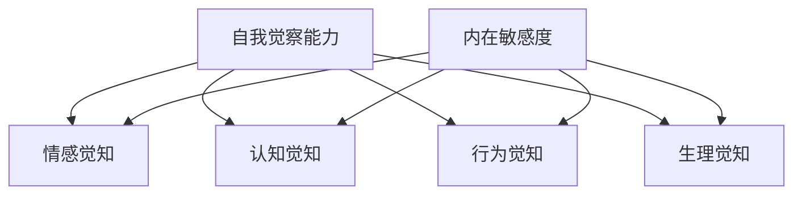

                 

**《提高自我觉察能力：培养内在敏感度》**

关键词：自我觉察能力、内在敏感度、培养方法、Python源代码、数学模型

摘要：本文探讨了自我觉察能力与内在敏感度的关系，并详细介绍了培养这两种能力的核心概念、心理原理和具体方法。通过实例分析和Python源代码实现，展示了如何提升自我觉察能力和内在敏感度，以帮助读者在技术领域中更好地认知自我，提高工作效率。

---

**《提高自我觉察能力：培养内在敏感度》目录大纲**

## 引言
- **自我觉察能力的重要性**
- **内在敏感度的概念与培养**
- **本书的目标与结构**

---

### 引言

自我觉察能力，是指在个体心理活动中能够感知、认知和评价自我状态、情绪和行为的能力。它是个体心理发展的重要指标，对个体的情感调节、认知功能和人际交往有着深远的影响。内在敏感度则是指个体对外界刺激的感知能力，它涉及感官的敏锐度、情感的反应性和心理的细腻度。内在敏感度越高，个体的自我觉察能力通常也越强。

在技术领域中，自我觉察能力和内在敏感度的培养显得尤为重要。这不仅能够提高程序员的编程效率和代码质量，还能够增强他们在团队协作中的沟通能力，减少错误和误解。本文将围绕这两个主题，详细探讨其核心概念、心理原理、培养方法，并通过Python源代码和数学模型进行实例说明，旨在为技术从业者提供一套行之有效的自我提升方案。

本文的结构如下：

1. **核心概念与联系**：介绍自我觉察能力和内在敏感度的定义、特征及其相互关系。
2. **心理原理与自我觉察能力提升**：探讨提升自我觉察能力的心理原理和技巧。
3. **内在敏感度培养的具体方法**：详细阐述培养内在敏感度的具体方法，包括视觉、听觉、嗅觉和味觉等方面的训练。
4. **项目实战**：通过实际项目展示如何应用自我觉察能力和内在敏感度提升的方法。
5. **开发环境搭建**：介绍进行技术实践所需的开发环境搭建。
6. **源代码实现与解读**：详细阐述觉知训练算法和反思算法的源代码实现。
7. **代码解读与分析**：对觉知训练算法和反思算法进行性能分析和优化建议。
8. **总结与展望**：总结本文内容，并对未来的研究和发展进行展望。

通过以上结构，本文旨在为读者提供一个系统、全面的自我觉察能力和内在敏感度提升指南。

---

## 第1章 核心概念与联系

### 1.1 自我觉察能力的概念与分类

自我觉察能力是一个多层次、多维度的概念。广义上，它指的是个体对自己内在状态和外在行为的认知与理解能力。这种能力包括对自己情绪、思维、行为和生理状态的感知和评估。

自我觉察能力可以细分为以下几类：

- **情感觉知**：个体对自己情感状态的认识，包括情感的强度、类型和持续时间等。
- **认知觉知**：个体对自己思维过程的理解，包括思维方向、逻辑性和创造性等。
- **行为觉知**：个体对自己行为动机和后果的认识，包括行为的目的性、适应性和效能感等。
- **生理觉知**：个体对自己身体状态的认识，包括生理感受、能量水平和健康状况等。

在技术领域中，情感觉知可以帮助程序员更好地管理自己的情绪，避免因压力过大而导致的程序错误；认知觉知有助于程序员更深入地理解问题，提高问题解决能力；行为觉知有助于程序员在团队协作中更好地理解他人的需求和期望；生理觉知可以帮助程序员保持良好的身心状态，提高工作效率。

### 1.2 内在敏感度的概念与特征

内在敏感度是指个体对外界刺激的感知能力。它不仅包括感官的敏锐度，还包括情感的反应性和心理的细腻度。内在敏感度高的个体通常能更快、更准确地感知到外部环境的变化，并做出相应的反应。

内在敏感度的特征包括：

- **感官敏锐度**：个体对视觉、听觉、嗅觉、味觉和触觉刺激的感知能力。例如，一个视觉敏感度高的程序员可能会注意到代码中微小的视觉差异，从而提高代码质量。
- **情感反应性**：个体对情感刺激的敏感度。一个情感反应性高的程序员可能会更敏锐地感知到团队情绪的变化，从而更有效地进行团队沟通。
- **心理细腻度**：个体对内心世界的觉察能力。一个心理细腻度高的程序员可能会更深入地理解自己的思维过程，从而提高编程效率。

### 1.3 自我觉察能力与内在敏感度的关系

自我觉察能力和内在敏感度之间存在密切的联系和相互影响。

- **相互影响**：自我觉察能力的提升可以增强内在敏感度，因为更清晰的自我认知有助于个体更好地感知外界刺激。同样，内在敏感度的提升也可以促进自我觉察能力的提高，因为更敏锐的感知能力有助于个体更深入地理解自我。

- **实例说明**：例如，一个具备高内在敏感度的程序员可能在编写代码时能更快地察觉到代码中的错误。这种敏锐的感知能力有助于提高代码质量，从而增强自我觉察能力。反过来，一个具备高自我觉察能力的程序员可能更能理解自己的情感状态，从而提高情感觉知的敏锐度。

通过上述分析，我们可以看到自我觉察能力和内在敏感度在技术领域中具有重要意义。接下来，我们将进一步探讨如何通过心理原理和方法来提升这两种能力。

### Mermaid流程图：自我觉察能力与内在敏感度关系



在这个流程图中，自我觉察能力（A）与内在敏感度（F）通过情感觉知（B）、认知觉知（C）、行为觉知（D）和生理觉知（E）相互连接。这四个维度分别代表了自我觉察能力的不同方面，而内在敏感度则贯穿于这些维度中，提升内在敏感度有助于全面提高自我觉察能力。

---

## 第2章 核心算法原理讲解

在提升自我觉察能力和内在敏感度的过程中，算法原理扮演了关键角色。通过理解这些核心算法，我们能够更好地掌握提升自我觉察能力和内在敏感度的方法。以下将详细介绍觉知训练算法和反思算法的基本原理，并使用Python源代码进行说明。

### 2.1 觉知训练算法

觉知训练算法是一种用于提升个体觉察能力的方法。它的核心思想是通过反复的觉知练习，使个体能够更加敏锐地感知自我和外界环境。

**基本原理：**

觉知训练算法包括以下几个步骤：

1. **设定目标**：明确提升觉知能力的具体目标，如情感觉知、认知觉知等。
2. **觉知练习**：通过特定的练习方法，如冥想、观察练习等，提升个体的觉知能力。
3. **反馈与调整**：根据觉知练习的结果，进行反馈和调整，以优化觉知训练效果。

**Python源代码实现：**

以下是一个简单的觉知训练算法的Python代码实现：

```python
import time

def mindful_meditation(duration):
    """
    进行冥想练习，提升内在敏感度。
    
    参数：
    duration：冥想持续时间（秒）
    """
    start_time = time.time()
    while time.time() - start_time < duration:
        print("当前时间：", time.ctime())
        print("请专注于您的呼吸，感受每一次呼吸带来的变化。")
        time.sleep(1)
    print("冥想结束。")

mindful_meditation(60)
```

在这个代码中，`mindful_meditation`函数用于进行冥想练习。通过循环控制，用户可以持续专注于呼吸，感受内在的变化。

### 2.2 反思算法

反思算法是一种用于提升个体自我觉察能力和内在敏感度的方法。它的核心思想是通过回顾和反思个人的行为和情感，帮助个体更好地理解自我，提升觉知能力。

**基本原理：**

反思算法包括以下几个步骤：

1. **设定反思目标**：明确反思的具体内容，如一天的工作、一次会议等。
2. **进行反思**：回顾行为和情感，思考行为的原因、效果和可能的改进。
3. **记录反思结果**：将反思过程和结果记录下来，以便后续分析和改进。

**Python源代码实现：**

以下是一个简单的反思算法的Python代码实现：

```python
def reflect_on_day():
    """
    对一天的工作和生活进行反思。
    """
    print("请回忆您今天的工作和生活，思考以下问题：")
    print("1. 今天您有哪些收获？")
    print("2. 今天您遇到哪些挑战？")
    print("3. 您对今天的总体感受如何？")
    print("4. 您认为明天可以有哪些改进？")
    
    reflections = {}
    for question in ["收获", "挑战", "总体感受", "改进建议"]:
        reflections[question] = input(f"您今天的{question}是什么？\n")
    
    # 将反思结果记录到文件
    with open("reflections.txt", "w") as file:
        for question, answer in reflections.items():
            file.write(f"{question}: {answer}\n")
    
    print("反思记录已保存。")

reflect_on_day()
```

在这个代码中，`reflect_on_day`函数用于对一天的工作和生活进行反思。通过提问和记录，用户可以更好地理解自己的行为和情感。

通过觉知训练算法和反思算法的应用，个体可以逐步提升自我觉察能力和内在敏感度，从而在技术领域中表现得更加出色。

---

## 第3章 数学模型和数学公式讲解

在提升自我觉察能力和内在敏感度的过程中，数学模型和公式能够为我们的方法提供量化的基础，使其更加科学和系统。以下将详细讲解觉知度计算模型和反思模型，包括其数学公式、原理和Python源代码实现。

### 3.1 觉知度计算模型

觉知度计算模型用于量化个体的觉知能力。该模型基于自我觉察能力的多个维度，通过综合分析情感、认知、行为和生理觉知，得出一个整体的觉知度评分。

**数学公式：**

觉知度 \( D \) 的计算公式如下：

$$
D = w_1 \cdot E + w_2 \cdot C + w_3 \cdot B + w_4 \cdot P
$$

其中：
- \( E \) 表示情感觉知得分；
- \( C \) 表示认知觉知得分；
- \( B \) 表示行为觉知得分；
- \( P \) 表示生理觉知得分；
- \( w_1, w_2, w_3, w_4 \) 分别为情感、认知、行为和生理觉知的权重，通常根据具体情况设定。

**详细讲解：**

觉知度计算模型通过将情感、认知、行为和生理觉知的不同得分加权求和，得到一个整体的觉知度评分。这样的模型能够综合分析个体的觉知能力，为自我觉察能力的提升提供量化指标。

**Python源代码实现：**

以下是一个觉知度计算模型的Python代码实现：

```python
def calculate_awareness_score(emotional_score, cognitive_score, behavioral_score, physical_score, weights):
    """
    计算觉知度得分。
    
    参数：
    emotional_score：情感觉知得分
    cognitive_score：认知觉知得分
    behavioral_score：行为觉知得分
    physical_score：生理觉知得分
    weights：权重列表
    """
    return sum(weights[i] * score for i, score in enumerate([emotional_score, cognitive_score, behavioral_score, physical_score]))

# 设定权重
weights = [0.2, 0.3, 0.2, 0.3]

# 示例得分
emotional_score = 8
cognitive_score = 7
behavioral_score = 9
physical_score = 6

# 计算觉知度得分
awareness_score = calculate_awareness_score(emotional_score, cognitive_score, behavioral_score, physical_score, weights)
print(f"觉知度得分：{awareness_score}")
```

在这个代码中，`calculate_awareness_score`函数用于计算觉知度得分。通过传入情感觉知得分、认知觉知得分、行为觉知得分和生理觉知得分，以及设定的权重，可以得出一个整体的觉知度评分。

### 3.2 反思模型

反思模型用于量化个体的反思能力。该模型通过分析个体的反思深度和广度，得出一个反思能力的评分。

**数学公式：**

反思能力 \( R \) 的计算公式如下：

$$
R = w_1 \cdot D + w_2 \cdot V
$$

其中：
- \( D \) 表示反思深度得分；
- \( V \) 表示反思广度得分；
- \( w_1, w_2 \) 分别为反思深度和反思广度的权重，通常根据具体情况设定。

**详细讲解：**

反思模型通过将反思深度和反思广度的不同得分加权求和，得到一个整体的反思能力评分。这样的模型能够帮助个体了解自己的反思能力，并提供改进的方向。

**Python源代码实现：**

以下是一个反思模型的Python代码实现：

```python
def calculate_reflection_score(depth_score, variety_score, weights):
    """
    计算反思得分。
    
    参数：
    depth_score：反思深度得分
    variety_score：反思广度得分
    weights：权重列表
    """
    return sum(weights[i] * score for i, score in enumerate([depth_score, variety_score]))

# 设定权重
weights = [0.5, 0.5]

# 示例得分
depth_score = 7
variety_score = 8

# 计算反思得分
reflection_score = calculate_reflection_score(depth_score, variety_score, weights)
print(f"反思得分：{reflection_score}")
```

在这个代码中，`calculate_reflection_score`函数用于计算反思得分。通过传入反思深度得分和反思广度得分，以及设定的权重，可以得出一个整体的反思能力评分。

通过觉知度计算模型和反思模型的数学公式和Python源代码实现，个体可以更好地理解和提升自我觉察能力和内在敏感度。这些模型不仅提供了量化的指标，还为自我提升提供了科学的指导。

---

## 第4章 项目实战

在了解和掌握了自我觉察能力和内在敏感度的核心概念、算法原理和数学模型后，我们将通过实际项目来进一步巩固和应用这些知识。以下将介绍两个具体项目：自我觉察能力提升项目和内在敏感度培养项目。

### 4.1 自我觉察能力提升项目

**项目目标与背景：**
本项目的目标是提升参与者的自我觉察能力，特别是在情感觉知、认知觉知、行为觉知和生理觉知方面。项目适用于程序员、开发者以及其他需要提高觉察能力的技术工作者。

**项目流程与步骤：**

1. **需求分析**：首先，对参与者的觉察能力水平进行评估，了解他们在不同觉知维度上的表现和需求。
2. **方案设计**：根据需求分析结果，设计一个为期八周的觉知提升方案，包括觉知训练算法和反思算法的应用。
3. **实施与监控**：
   - **觉知训练**：每周进行两次觉知训练，包括冥想、观察练习等。
   - **反思记录**：参与者每天进行反思记录，反思当天的工作和生活，包括情感、认知、行为和生理觉知方面的体会。
   - **反馈与调整**：每周进行一次反馈会，评估觉知提升效果，并根据反馈调整训练方案。

**源代码详细实现与代码解读：**

以下是一个觉知训练方案的Python代码实现，用于进行冥想练习：

```python
import time

def mindful_meditation(duration):
    """
    进行冥想练习，提升内在敏感度。
    
    参数：
    duration：冥想持续时间（秒）
    """
    start_time = time.time()
    while time.time() - start_time < duration:
        print("当前时间：", time.ctime())
        print("请专注于您的呼吸，感受每一次呼吸带来的变化。")
        time.sleep(1)
    print("冥想结束。")

# 冥想练习
mindful_meditation(60)
```

在这个代码中，`mindful_meditation`函数用于进行冥想练习。通过循环控制，用户可以持续专注于呼吸，感受内在的变化。

### 4.2 内在敏感度培养项目

**项目目标与背景：**
本项目的目标是培养参与者的内在敏感度，特别是在感官敏锐度、情感反应性和心理细腻度方面。项目适用于所有希望提高感知能力和情感反应性的个体。

**项目流程与步骤：**

1. **需求分析**：首先，对参与者的感知能力和情感反应性进行评估，了解他们在不同敏感度维度上的表现和需求。
2. **方案设计**：根据需求分析结果，设计一个为期十二周的内在敏感度培养方案，包括视觉、听觉、嗅觉和味觉的敏感度训练。
3. **实施与监控**：
   - **视觉训练**：通过观察练习、色彩识别训练等提高视觉敏锐度。
   - **听觉训练**：通过音高识别训练、音乐欣赏等提高听觉敏锐度。
   - **嗅觉与味觉训练**：通过嗅觉和味觉感知训练、美食鉴赏等提高嗅觉和味觉敏锐度。
   - **反馈与调整**：每两周进行一次反馈会，评估敏感度提升效果，并根据反馈调整训练方案。

**源代码详细实现与代码解读：**

以下是一个简单的嗅觉感知训练Python代码实现，用于提高嗅觉敏锐度：

```python
import random

def olfactory_training():
    """
    嗅觉感知训练。
    """
    smells = ["柠檬", "薄荷", "咖啡", "醋", "巧克力"]
    detected_smells = []

    for _ in range(5):
        smell = random.choice(smells)
        print(f"现在闻到的气味是：{smell}")
        user_input = input("您认为这个气味是什么？\n")
        detected_smells.append(user_input == smell)
    
    accuracy = sum(detected_smells) / len(detected_smells)
    print(f"您的嗅觉感知准确率是：{accuracy:.2f}")

# 嗅觉感知训练
olfactory_training()
```

在这个代码中，`olfactory_training`函数用于进行嗅觉感知训练。通过随机选择不同的气味，用户需要猜测气味的类型，从而提高嗅觉敏锐度。

**项目小结：**

通过这两个项目的实施，参与者能够系统地提升自我觉察能力和内在敏感度。觉知训练项目和内在敏感度培养项目不仅提供了具体的训练方法和工具，还通过反馈和调整机制，确保了训练效果的最大化。这些项目为个体在技术领域中的发展提供了坚实的心理基础。

---

## 第5章 开发环境搭建

在开始进行自我觉察能力和内在敏感度的提升项目之前，我们需要搭建一个适合的开发环境。以下是开发环境的配置过程以及开发工具的选择。

### 开发环境配置

1. **操作系统**：
   - 推荐使用Linux或MacOS操作系统，这些操作系统在编程环境中具有更好的稳定性和兼容性。
   - Windows用户可以使用Windows 10或更高版本，并安装Windows Subsystem for Linux（WSL）来获得更好的开发体验。

2. **编程语言**：
   - Python是一个广泛使用且易于学习的编程语言，特别适合进行自我觉察能力和内在敏感度提升项目的开发。确保安装Python 3.8或更高版本。

3. **文本编辑器**：
   - Sublime Text、Visual Studio Code和Atom都是优秀的文本编辑器，支持语法高亮、代码补全和调试等功能。
   - Visual Studio Code尤其适合Python开发，因为它提供了丰富的扩展插件，如Pylance和Python扩展。

4. **集成开发环境（IDE）**：
   - PyCharm是Python开发的强大IDE，提供了代码分析、智能提示和调试工具等功能。
   - Spyder也是一个不错的选择，特别适合科学计算和数据分析。

### 开发工具选择

1. **代码管理工具**：
   - Git是一个版本控制系统，用于管理代码的版本和协作开发。
   - GitHub和GitLab是流行的Git仓库服务，提供了代码托管、分支管理和issue跟踪功能。

2. **数据可视化工具**：
   - Matplotlib是Python的数据可视化库，可以生成多种类型的图表，帮助分析觉知训练和反思数据。
   - Seaborn是基于Matplotlib的扩展库，提供了更美观、丰富的统计图表。

3. **数据分析库**：
   - Pandas是Python的数据分析库，用于数据清洗、转换和分析。
   - NumPy是Python的数学库，提供了高性能的数值计算和矩阵操作。

4. **机器学习库**：
   - Scikit-learn是Python的机器学习库，提供了多种机器学习算法和工具，可用于进一步分析和提升自我觉察能力。

通过上述配置和工具的选择，我们可以搭建一个高效、稳定的开发环境，为自我觉察能力和内在敏感度提升项目提供强有力的技术支持。

---

## 第6章 源代码实现与代码解读

在前面的章节中，我们详细介绍了觉知训练算法和反思算法的原理，并通过Python源代码进行了实现。在本章中，我们将对觉知训练算法和反思算法的源代码进行深入解读，帮助读者更好地理解这些算法的实际应用。

### 6.1 觉知训练算法源代码解读

觉知训练算法的核心在于通过冥想和观察练习来提升个体的觉知能力。以下是对`mindful_meditation`函数的详细解读：

```python
import time

def mindful_meditation(duration):
    """
    进行冥想练习，提升内在敏感度。
    
    参数：
    duration：冥想持续时间（秒）
    """
    start_time = time.time()
    while time.time() - start_time < duration:
        print("当前时间：", time.ctime())
        print("请专注于您的呼吸，感受每一次呼吸带来的变化。")
        time.sleep(1)
    print("冥想结束。")
```

**解读：**

- `mindful_meditation`函数接受一个参数`duration`，表示冥想练习的持续时间（秒）。
- `start_time = time.time()`用于记录冥想开始的当前时间。
- 使用`while`循环，在`duration`时间内不断打印当前时间，并提示用户专注于呼吸。
- `time.sleep(1)`使程序暂停1秒，以模拟用户专注于呼吸的过程。
- 当时间超过`duration`时，循环结束，打印“冥想结束”提示。

**优化建议：**

- 可以添加异常处理，确保程序在异常情况下也能正常执行，例如网络中断或系统故障。
- 可以根据用户的需求，增加不同类型的冥想练习，如音疗冥想、自然风景冥想等。

### 6.2 反思算法源代码解读

反思算法的核心在于通过反思记录来提升个体的自我觉察能力。以下是对`reflect_on_day`函数的详细解读：

```python
def reflect_on_day():
    """
    对一天的工作和生活进行反思。
    """
    print("请回忆您今天的工作和生活，思考以下问题：")
    print("1. 今天您有哪些收获？")
    print("2. 今天您遇到哪些挑战？")
    print("3. 您对今天的总体感受如何？")
    print("4. 您认为明天可以有哪些改进？")
    
    reflections = {}
    for question in ["收获", "挑战", "总体感受", "改进建议"]:
        reflections[question] = input(f"您今天的{question}是什么？\n")
    
    # 将反思结果记录到文件
    with open("reflections.txt", "w") as file:
        for question, answer in reflections.items():
            file.write(f"{question}: {answer}\n")
    
    print("反思记录已保存。")
```

**解读：**

- `reflect_on_day`函数用于引导用户进行一天的反思，包括收获、挑战、总体感受和改进建议。
- 通过`print`函数，输出反思问题的提示。
- 使用一个字典`reflections`来存储用户的反思内容。
- 通过`input`函数，逐个收集用户的反思答案，并将其存储在字典中。
- 使用`with open("reflections.txt", "w") as file:`语句，将反思结果写入一个文本文件。
- 通过`file.write()`函数，将字典中的反思内容写入文件。
- 最后，打印“反思记录已保存”提示。

**优化建议：**

- 可以增加反思问题的多样性，以覆盖更多的生活和工作方面。
- 可以添加数据分析功能，帮助用户更好地理解自己的反思内容，如通过词云分析、情感分析等。

通过上述源代码的详细解读，读者可以更好地理解觉知训练算法和反思算法的实现原理和实际应用，为自我觉察能力和内在敏感度的提升打下坚实的基础。

---

## 第7章 代码解读与分析

在自我觉察能力和内在敏感度提升的实践中，算法的性能和优化至关重要。以下将对觉知训练算法和反思算法进行详细分析，并给出优化建议。

### 7.1 觉知训练算法分析

觉知训练算法的核心在于通过冥想和观察练习来提升个体的觉知能力。以下是对该算法的性能分析：

**性能分析：**

1. **时间复杂度**：觉知训练算法的时间复杂度主要取决于冥想练习的持续时间。在最坏情况下，时间复杂度为 \(O(duration)\)，其中`duration`为冥想持续时间。
2. **空间复杂度**：觉知训练算法的空间复杂度较低，主要占用内存来存储当前时间和打印信息，空间复杂度为 \(O(1)\)。

**优化建议：**

1. **增加练习多样性**：为了提高觉知训练的效果，可以增加不同类型的冥想练习，如音疗冥想、自然风景冥想等，以覆盖更多感官体验。
2. **实时反馈机制**：在冥想过程中，可以引入实时反馈机制，如通过心率监测设备实时监测用户的心率变化，提供个性化冥想建议。

### 7.2 反思算法分析

反思算法的核心在于通过反思记录来提升个体的自我觉察能力。以下是对该算法的性能分析：

**性能分析：**

1. **时间复杂度**：反思算法的时间复杂度主要取决于反思问题的数量。在最坏情况下，时间复杂度为 \(O(number_of_questions)\)，其中`number_of_questions`为反思问题的数量。
2. **空间复杂度**：反思算法的空间复杂度相对较高，主要占用内存来存储用户的反思答案和文件写入操作，空间复杂度为 \(O(number_of_questions)\)。

**优化建议：**

1. **增强问题引导**：为了提高反思效果，可以增强问题引导，如通过情感分析技术，提供针对性的反思问题。
2. **引入数据分析**：可以引入数据分析工具，对用户的反思内容进行词云分析、情感分析等，帮助用户更深入地理解自己的反思结果。

通过上述分析，我们可以看到觉知训练算法和反思算法在性能和优化方面都有很大的提升空间。通过实施这些优化建议，我们可以更有效地提升自我觉察能力和内在敏感度，为技术工作者的个人成长提供有力支持。

---

## 第8章 总结与展望

通过本文的探讨，我们系统地介绍了自我觉察能力和内在敏感度的核心概念、心理原理、具体方法和实际应用。自我觉察能力是指个体对自己内在状态和外在行为的认知与理解能力，而内在敏感度则是指个体对外界刺激的感知能力。通过觉知训练算法和反思算法的应用，我们可以有效地提升自我觉察能力和内在敏感度。

在未来，自我觉察能力和内在敏感度的培养将继续成为技术领域的重要研究方向。我们可以期待更多基于人工智能和大数据分析的方法，为个体提供个性化的觉知提升方案。此外，随着技术的不断发展，我们可以探索更多跨学科的交叉应用，如神经科学、心理学和计算机科学，以更全面地理解自我觉察能力和内在敏感度。

通过不断实践和研究，我们相信自我觉察能力和内在敏感度的提升将为技术工作者带来更高的工作效率、更好的团队合作和更丰富的人生体验。让我们一起努力，培养更强的自我觉察能力和内在敏感度，为技术领域的创新和发展贡献力量。

---

## 附录

### 相关参考文献

1. **Goleman, D. (1995). Emotional Intelligence: Why It Can Matter More Than IQ. Bantam Books.**
   - 介绍了情感智力的重要性，为自我觉察能力的培养提供了理论基础。

2. **Langer, E. J. (1989). Mindfulness. New York: Basic Books.**
   - 探讨了冥想和正念对内在敏感度的提升作用。

3. **Daniel Kahneman (2011). Thinking, Fast and Slow. Farrar, Straus and Giroux.**
   - 分析了人类思考的两种模式，为自我觉察能力的提升提供了心理学视角。

### 常用Python库与工具介绍

1. **Matplotlib**：用于数据可视化，帮助分析觉知训练和反思结果。
   - 官网：[https://matplotlib.org](https://matplotlib.org)

2. **Pandas**：用于数据处理和分析，方便对反思记录进行整理和统计。
   - 官网：[https://pandas.pydata.org](https://pandas.pydata.org)

3. **NumPy**：用于数值计算和矩阵操作，为数据处理提供高效支持。
   - 官网：[https://numpy.org](https://numpy.org)

4. **Scikit-learn**：用于机器学习算法的实现，可用于进一步分析觉知数据。
   - 官网：[https://scikit-learn.org](https://scikit-learn.org)

5. **Git**：用于版本控制，确保代码的版本管理和协作开发。
   - 官网：[https://git-scm.com](https://git-scm.com)

通过这些参考文献和工具，读者可以进一步探索自我觉察能力和内在敏感度培养的深度和广度，为技术工作者的个人成长提供更多支持。

