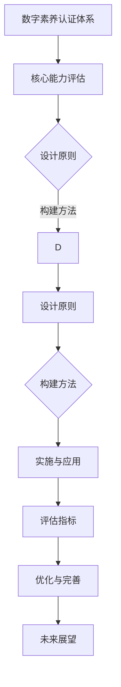

                 


## 数字素养认证体系：信息时代的核心能力评估

### 关键词
- 数字素养
- 认证体系
- 信息能力
- 数据安全
- 教育实践

### 摘要
本文旨在探讨数字素养认证体系在信息时代的核心作用。随着全球数字化进程的加速，数字素养成为个人和组织的核心竞争力。文章首先介绍了数字素养的起源与发展，随后详细阐述了数字素养的核心能力，包括信息获取、分析、创新和数字安全。接着，文章构建了一个包含设计原则、构建方法和实施与应用的数字素养认证体系框架。最后，文章对数字素养认证体系的评估指标、优化策略及未来发展进行了深入分析，为数字素养教育与实践提供了理论指导和实践参考。

----------------------------------------------------------------

# 引言

### 1. 信息时代与数字素养的重要性

随着信息技术的迅猛发展，人类社会已步入信息时代。在这个时代，信息成为驱动经济增长、推动社会进步的关键资源。数字素养，作为应对这一变革的核心能力，显得尤为重要。数字素养不仅关乎个人在数字环境中的生存能力，更影响国家在全球竞争中的地位。

#### 1.1 数字素养的起源

数字素养的概念最早可以追溯到20世纪90年代。当时，互联网的普及和信息技术的快速发展，使得人们开始意识到信息素养的重要性。随着时间推移，数字素养逐渐从信息素养中分离出来，成为一个更加专业和多样化的概念。

#### 1.2 数字素养的发展历程

数字素养的发展历程可以概括为三个阶段：

1. **信息获取阶段**：这一阶段主要关注如何高效地获取信息。
2. **信息处理阶段**：这一阶段强调如何对获取的信息进行有效的处理和分析。
3. **信息创新阶段**：这一阶段更注重如何利用已有信息进行创新，解决实际问题。

#### 1.3 数字素养的内涵与外延

数字素养的内涵包括以下几个方面：

- **信息获取能力**：能够快速、准确地获取所需信息。
- **信息分析能力**：能够对获取的信息进行分析，提取有用信息。
- **信息创新能力**：能够利用已有信息进行创新，提出新的解决方案。
- **数字安全意识**：了解网络安全风险，并采取相应措施保护个人信息和数据安全。

数字素养的外延则涵盖个人、企业、教育机构等多个层面。不同主体在数字素养方面的需求和侧重点有所不同，但总体目标都是提升整体数字素养水平。

### 2. 数字素养认证体系的定义和目标

数字素养认证体系是指一套标准化的评估和认证流程，用于评估个人或组织在数字素养方面的能力水平。其目标是：

- **评估个人和组织的数字素养水平**：通过认证体系，可以客观、公正地评估个人和组织的数字素养水平。
- **推动数字素养教育与实践**：认证体系可以引导个人和组织有针对性地提升数字素养，推动整体数字素养水平的提升。
- **保障数字安全**：通过认证，可以确保个人和组织具备足够的数字安全意识，降低网络安全风险。

### 3. 书籍结构和内容概述

本文将分为三大部分进行讨论：

- **第一部分：数字素养的基本概念**：介绍数字素养的起源、发展、核心能力以及教育与实践方法。
- **第二部分：数字素养认证体系构建**：阐述数字素养认证体系的设计原则、构建方法和实施与应用。
- **第三部分：数字素养认证体系评估**：讨论数字素养认证体系的评估指标、优化策略及未来发展。

通过对这三个部分的深入分析，本文旨在为数字素养认证体系的研究和实践提供有价值的参考。

----------------------------------------------------------------

## 第一部分：数字素养的基本概念

### 第1章：数字素养的起源与发展

#### 1.1 数字素养的起源

数字素养的概念最早可以追溯到20世纪90年代。当时，随着互联网的普及和信息技术的快速发展，人们开始意识到信息素养的重要性。信息素养主要关注如何高效地获取和处理信息，以适应信息爆炸的时代需求。随着技术的进步，信息素养逐渐演变为数字素养。

#### 1.2 数字素养的发展历程

数字素养的发展历程可以分为以下几个阶段：

1. **信息获取阶段**：这一阶段主要关注如何高效地获取信息。随着互联网的普及，人们可以通过各种渠道快速获取所需信息。
   
2. **信息处理阶段**：这一阶段强调如何对获取的信息进行有效的处理和分析。随着大数据和人工智能技术的发展，人们开始利用先进的技术手段对大量信息进行分析，提取有用信息。

3. **信息创新阶段**：这一阶段更注重如何利用已有信息进行创新，解决实际问题。在这个阶段，人们不再满足于简单的信息获取和处理，而是开始尝试通过创新性的思维来发现新的价值。

#### 1.3 数字素养的内涵与外延

数字素养的内涵可以从以下几个方面来理解：

1. **信息获取能力**：能够快速、准确地获取所需信息。这包括掌握各种信息获取工具和技能，如搜索引擎、数据库检索等。

2. **信息分析能力**：能够对获取的信息进行分析，提取有用信息。这需要具备数据分析和逻辑推理的能力，能够从大量信息中找出关键点和规律。

3. **信息创新能力**：能够利用已有信息进行创新，提出新的解决方案。这需要具备创造性思维和跨学科的知识整合能力。

4. **数字安全意识**：了解网络安全风险，并采取相应措施保护个人信息和数据安全。这包括掌握基本的网络安全知识，如密码设置、数据加密等。

数字素养的外延则涵盖了个人、企业、教育机构等多个层面。对于个人而言，数字素养是适应数字化社会的基本能力；对于企业而言，数字素养是提升竞争力的重要手段；对于教育机构而言，数字素养是培养高素质人才的关键。

### 第2章：数字素养的核心能力

#### 2.1 信息获取能力

信息获取能力是数字素养的核心能力之一。在信息爆炸的时代，如何快速、准确地获取所需信息至关重要。以下是一些提升信息获取能力的方法：

1. **搜索引擎的使用**：掌握各种搜索引擎的使用技巧，如关键词优化、高级搜索等，以提高信息获取的效率和准确性。

2. **数据库检索**：了解各种数据库的检索方法，如关键词检索、布尔检索等，以获取更精确的信息。

3. **信息筛选与评估**：学会评估和筛选信息来源，避免受到虚假信息和误导。

#### 2.2 信息分析能力

信息分析能力是指对获取的信息进行深入分析和解读的能力。以下是一些提升信息分析能力的方法：

1. **数据分析工具的使用**：掌握常用的数据分析工具，如Excel、Python等，以高效地进行数据处理和分析。

2. **逻辑思维与批判性思维**：培养逻辑思维和批判性思维，以深入理解信息背后的逻辑和真相。

3. **跨学科知识整合**：通过跨学科的学习和研究，提升对信息的整体理解和分析能力。

#### 2.3 信息创新能力

信息创新能力是指利用已有信息进行创新，提出新的解决方案的能力。以下是一些提升信息创新能力的方法：

1. **创造性思维训练**：通过各种创造性思维训练方法，如头脑风暴、思维导图等，激发创新思维。

2. **跨学科知识整合**：通过跨学科的学习和研究，拓展视野，激发创新灵感。

3. **实践经验积累**：通过实践积累经验，不断提升解决问题的能力和创新思维。

#### 2.4 数字安全意识

数字安全意识是数字素养的重要组成部分。以下是一些提升数字安全意识的方法：

1. **网络安全知识学习**：了解基本的网络安全知识，如密码设置、数据加密、网络防护等。

2. **安全意识培养**：通过安全教育，提高对网络安全风险的警觉性，培养良好的安全行为习惯。

3. **安全工具的使用**：掌握各种安全工具的使用方法，如杀毒软件、防火墙等，以提高网络安全防护能力。

### 第3章：数字素养的教育与实践

#### 3.1 数字素养教育体系

数字素养教育体系是指一套系统性的教育计划和课程，旨在培养学生的数字素养能力。以下是一些构建数字素养教育体系的方法：

1. **课程设置**：根据学生的年龄和认知水平，设置不同阶段的数字素养课程，如基础信息素养、高级信息分析、数字安全等。

2. **教学资源开发**：开发和利用各种数字资源，如电子教材、在线课程、实践案例等，以丰富教学手段和内容。

3. **教学方法改革**：采用多种教学方法，如项目式学习、合作学习等，激发学生的学习兴趣和主动性。

#### 3.2 数字素养实践案例分析

通过数字素养实践案例分析，可以让学生更好地理解数字素养的实际应用。以下是一些数字素养实践案例：

1. **数据分析与决策**：学生可以通过分析实际数据，如市场数据、社交媒体数据等，为企业提供决策支持。

2. **信息安全防护**：学生可以参与信息安全防护项目，如网络安全演习、漏洞扫描等，提升实际操作能力。

3. **创新应用开发**：学生可以参与创新应用开发项目，如移动应用开发、人工智能项目等，锻炼创新能力和实践能力。

#### 3.3 数字素养培养的方法与策略

数字素养的培养需要结合教育与实践，以下是一些数字素养培养的方法与策略：

1. **家校合作**：通过家校合作，家长可以参与数字素养教育，共同培养孩子的数字素养。

2. **社会资源整合**：整合社会资源，如企业、研究机构等，共同参与数字素养教育，为学生提供更多的实践机会。

3. **持续学习与评估**：鼓励学生持续学习，定期进行数字素养评估，以监测学习效果和进展，及时调整培养策略。

通过以上方法与策略，可以有效提升学生的数字素养，为未来的数字化社会做好准备。

----------------------------------------------------------------

## 第二部分：数字素养认证体系构建

### 第4章：数字素养认证体系的设计原则

#### 4.1 可量化评估标准

数字素养认证体系的设计原则之一是可量化评估标准。这意味着评估体系需要具备明确、具体的指标，以便对个人或组织的数字素养水平进行量化评估。以下是一些关键指标：

1. **信息获取能力**：评估个人在信息获取方面的效率，如信息获取速度、准确性等。
2. **信息分析能力**：评估个人在信息分析方面的能力，如数据分析准确性、逻辑推理能力等。
3. **信息创新能力**：评估个人在信息创新方面的能力，如提出新想法、解决问题的能力等。
4. **数字安全意识**：评估个人在数字安全方面的意识，如对网络安全威胁的认识、安全防护措施的实施等。

#### 4.2 多元化评估方法

数字素养认证体系的设计原则之二是多元化评估方法。单一的评估方法难以全面反映个人或组织的数字素养水平，因此需要采用多种评估方法，从不同角度进行评估。以下是一些常见的评估方法：

1. **笔试**：通过笔试考察个人在数字素养方面的理论知识。
2. **实操测试**：通过实际操作测试考察个人在数字素养方面的实际应用能力。
3. **项目评估**：通过项目评估考察个人或组织在数字素养方面的综合能力。
4. **同伴评价**：通过同伴评价，收集其他人对个人或组织数字素养水平的评价。

#### 4.3 国际化与本土化相结合

数字素养认证体系的设计原则之三是国际化与本土化相结合。在全球化的背景下，数字素养的评估标准需要具备一定的国际化视野，以适应国际竞争的需求。同时，也需要考虑本土化的特点，确保评估标准能够适应不同国家和地区的实际情况。

1. **国际化标准**：借鉴国际通用的数字素养评估标准和实践经验，制定国际化标准。
2. **本土化调整**：根据不同国家和地区的实际情况，对国际化标准进行调整，使其更符合本土需求。

通过以上设计原则，可以构建一个科学、合理的数字素养认证体系，为个人和组织提供客观、公正的数字素养评估。

### 第5章：数字素养认证体系的构建方法

#### 5.1 认证标准的制定

数字素养认证体系的构建首先需要明确认证标准。认证标准的制定需要遵循以下步骤：

1. **需求分析**：了解不同主体在数字素养方面的需求和期望，为认证标准的制定提供依据。
2. **指标体系构建**：根据需求分析结果，构建包括信息获取能力、信息分析能力、信息创新能力、数字安全意识等关键指标的指标体系。
3. **指标权重分配**：确定各项指标在认证体系中的权重，以反映各项指标的重要性。

#### 5.2 认证程序的优化

认证程序的优化是数字素养认证体系构建的关键环节。以下是一些优化措施：

1. **流程简化**：简化认证流程，减少不必要的环节，提高认证效率。
2. **信息化管理**：引入信息化管理手段，如在线申请、自动审批等，提高认证的便利性和准确性。
3. **质量监控**：建立质量监控机制，对认证过程进行实时监控和评估，确保认证的公正性和有效性。

#### 5.3 认证结果的反馈与改进

认证结果的反馈与改进是数字素养认证体系持续优化的重要环节。以下是一些反馈与改进措施：

1. **结果公示**：将认证结果进行公示，接受社会监督，提高认证的透明度。
2. **结果分析**：对认证结果进行分析，识别存在的问题和不足，为下一步的改进提供依据。
3. **持续改进**：根据分析结果，对认证标准、程序和评估方法进行持续改进，不断提升认证体系的科学性和实用性。

通过以上构建方法，可以确保数字素养认证体系的有效运行，为个人和组织提供客观、公正的数字素养评估。

### 第6章：数字素养认证体系的实施与应用

#### 6.1 政策与法规支持

数字素养认证体系的实施需要政策与法规的支持。政府可以通过以下措施提供支持：

1. **制定相关政策**：出台数字素养认证相关政策和法规，明确认证体系的地位和作用。
2. **提供资金支持**：为数字素养认证体系的构建和实施提供资金支持，确保认证体系的有效运行。
3. **推广宣传**：通过媒体、教育机构等渠道，宣传数字素养认证体系的重要性，提高公众的认知度和参与度。

#### 6.2 企业与个人参与

数字素养认证体系的实施需要企业和个人的积极参与。以下是一些推动企业和个人参与的措施：

1. **企业培训**：为企业提供数字素养培训，提升员工在数字素养方面的能力，推动企业整体数字素养的提升。
2. **个人认证**：鼓励个人参与数字素养认证，通过认证证明个人的数字素养水平。
3. **认证奖励**：对通过数字素养认证的个人和企业给予奖励，如荣誉证书、税收优惠等，提高认证的吸引力。

#### 6.3 社会效应与反馈

数字素养认证体系的实施将产生广泛的社会效应。以下是一些可能的社会效应和反馈：

1. **提高整体数字素养水平**：通过认证体系的实施，可以提升整个社会的数字素养水平，促进数字化社会的建设。
2. **促进数字经济发展**：数字素养认证体系的实施将为企业提供更多高素质的数字人才，促进数字经济的发展。
3. **提升国家安全水平**：通过数字素养认证，可以提升个人和企业在网络安全方面的能力，提高国家整体安全水平。
4. **反馈机制建设**：建立反馈机制，及时收集社会各界的意见和建议，对认证体系进行持续改进，确保其科学性和实用性。

通过政策与法规支持、企业和个人参与以及社会效应与反馈，可以确保数字素养认证体系的有效实施，为社会的数字化转型提供有力支撑。

----------------------------------------------------------------

### 第7章：数字素养认证体系的评估指标

#### 7.1 评估指标体系构建

数字素养认证体系的评估指标体系是确保评估过程科学、客观和全面的重要工具。构建评估指标体系需要遵循以下原则：

1. **全面性**：评估指标应涵盖数字素养的各个方面，包括信息获取、分析、创新和数字安全等核心能力。
2. **可量化**：评估指标应具有可量化的特性，以便进行量化评估和比较。
3. **层次性**：评估指标应具备层次结构，既包括总体指标，又包括具体细分指标，以反映评估的深度和广度。

构建评估指标体系的步骤如下：

1. **需求分析**：了解评估对象的需求，确定需要评估的数字素养能力领域。
2. **专家咨询**：邀请数字素养领域的专家进行咨询，收集他们的意见和建议。
3. **文献调研**：查阅相关文献，了解现有的评估指标和方法。
4. **指标设计**：根据需求分析、专家咨询和文献调研的结果，设计具体的评估指标。
5. **指标筛选**：对设计的评估指标进行筛选，保留有效的指标，去除冗余或不必要的指标。
6. **指标验证**：通过专家评审、试点评估等方式，验证评估指标的有效性和可行性。

#### 7.2 评估指标的量化与计算

评估指标的量化是评估过程中的关键步骤。以下是一些常见评估指标的量化方法和计算过程：

1. **信息获取能力**
   - **量化方法**：计算信息获取的效率和准确性。
   - **计算公式**：
     $$
     E_{info} = \frac{正确获取的信息量}{总获取的信息量} \times 100\%
     $$
     $$
     A_{info} = \frac{正确获取的信息量}{正确获取的信息量 + 错误获取的信息量} \times 100\%
     $$
   - **示例**：假设一个人在一个月内获取了100条信息，其中80条是正确的，20条是错误的。则：
     $$
     E_{info} = \frac{80}{100} \times 100\% = 80\%
     $$
     $$
     A_{info} = \frac{80}{80 + 20} \times 100\% = 80\%
     $$

2. **信息分析能力**
   - **量化方法**：计算信息分析的准确率和效率。
   - **计算公式**：
     $$
     A_{analyze} = \frac{正确分析的信息量}{总分析的信息量} \times 100\%
     $$
     $$
     E_{analyze} = \frac{总分析的时间}{正确分析的信息量} \times 1000
     $$
   - **示例**：假设一个人在一个月内分析了50条信息，其中30条是正确的，20条是错误的。分析总耗时为150小时。则：
     $$
     A_{analyze} = \frac{30}{50} \times 100\% = 60\%
     $$
     $$
     E_{analyze} = \frac{150}{30} \times 1000 = 5000 \text{秒/条}
     $$

3. **信息创新能力**
   - **量化方法**：计算信息创新的数量和效率。
   - **计算公式**：
     $$
     I_{innovate} = \frac{创新的信息量}{总信息量} \times 100\%
     $$
     $$
     E_{innovate} = \frac{总创新的时间}{创新的信息量} \times 1000
     $$
   - **示例**：假设一个人在一个月内处理了100条信息，其中产生了20条创新信息。创新总耗时为60小时。则：
     $$
     I_{innovate} = \frac{20}{100} \times 100\% = 20\%
     $$
     $$
     E_{innovate} = \frac{60}{20} \times 1000 = 3000 \text{秒/条}
     $$

4. **数字安全意识**
   - **量化方法**：计算安全事件的频率和损失。
   - **计算公式**：
     $$
     F_{security} = \frac{安全事件发生的频率}{总操作次数} \times 100\%
     $$
     $$
     L_{security} = \frac{安全事件造成的损失}{总资产} \times 100\%
     $$
   - **示例**：假设一个月内发生5次安全事件，操作总次数为1000次，安全事件造成的损失为5000元，总资产为100000元。则：
     $$
     F_{security} = \frac{5}{1000} \times 100\% = 0.5\%
     $$
     $$
     L_{security} = \frac{5000}{100000} \times 100\% = 5\%
     $$

通过以上量化方法和计算公式，可以客观、准确地评估个人或组织的数字素养水平。这些评估结果不仅可以用于认证，还可以为数字素养教育与实践提供重要参考。

#### 7.3 评估结果的应用与反馈

评估结果的应用与反馈是数字素养认证体系的重要组成部分。以下是一些评估结果的应用场景和反馈机制：

1. **个人发展**：评估结果可以用于个人发展计划的制定和调整。个人可以根据评估结果识别自己的优势和不足，有针对性地提升数字素养。

2. **教育培训**：评估结果可以用于教育培训的课程设置和调整。教育机构可以根据评估结果了解学生的数字素养水平，优化教学方法和内容。

3. **企业人力资源管理**：评估结果可以用于企业的人力资源管理，如员工招聘、培训和发展。企业可以根据评估结果选拔和培养具备高数字素养的员工。

4. **政策制定**：评估结果可以为政府制定数字素养相关的政策和法规提供参考。政府可以根据评估结果调整政策方向和力度，推动数字素养的提升。

5. **反馈机制**：建立评估结果反馈机制，将评估结果及时反馈给评估对象，以便其了解自己的表现和改进方向。同时，反馈机制还应包括对评估过程的反馈，以不断优化评估体系的科学性和实用性。

通过评估结果的应用与反馈，可以确保数字素养认证体系的有效性和可持续性，为个人、教育机构和企业提供有力支持。

----------------------------------------------------------------

### 第8章：数字素养认证体系的优化与完善

#### 8.1 实施过程中的问题与挑战

数字素养认证体系在实施过程中可能会遇到一系列问题和挑战，以下是一些常见的问题和相应的解决策略：

1. **评估标准不统一**：不同地区和机构的评估标准可能存在差异，导致评估结果的不可比性和不公平性。解决策略：建立统一的评估标准，制定详细的评估指标和评估方法，确保评估过程的公正和透明。

2. **评估过程复杂**：评估流程可能过于繁琐，增加评估对象和评估机构的工作负担。解决策略：简化评估流程，引入信息化管理手段，如在线评估平台，提高评估效率。

3. **评估结果不公正**：评估过程中可能存在主观偏见或数据不准确的情况，影响评估结果的公正性。解决策略：引入第三方评估机构，加强评估过程的监督和审计，确保评估结果的客观性和公正性。

4. **培训资源不足**：部分评估对象可能缺乏必要的数字素养培训资源，影响评估水平的提升。解决策略：加强数字素养培训资源的开发和共享，通过线上课程、线下培训等多种方式，提供多样化的培训资源。

5. **反馈机制不健全**：评估结果的反馈机制可能不够健全，影响评估对象的改进和提升。解决策略：建立完善的反馈机制，及时收集评估对象的意见和建议，对评估结果进行及时反馈和调整。

#### 8.2 优化策略与改进措施

为了优化数字素养认证体系，可以采取以下策略和措施：

1. **完善评估标准**：根据实际情况和最新发展，定期修订和完善评估标准，确保评估指标的全面性和前瞻性。

2. **简化评估流程**：通过信息化手段，简化评估流程，提高评估效率，减少评估对象和评估机构的工作负担。

3. **加强监督与审计**：建立监督和审计机制，确保评估过程的公正性和透明性，防止评估过程中的违规行为。

4. **提高培训质量**：加强数字素养培训，提高培训质量和效果，确保评估对象具备足够的数字素养能力。

5. **加强国际合作**：借鉴国际先进经验和做法，加强国际合作，提高数字素养认证体系的国际影响力。

#### 8.3 国际合作与交流

国际合作与交流是优化数字素养认证体系的重要途径。以下是一些国际合作与交流的建议：

1. **共享经验**：与其他国家和地区的数字素养认证机构进行经验交流，共享最佳实践和成功案例。

2. **联合研究**：开展联合研究项目，共同探讨数字素养认证体系的优化策略和评估方法。

3. **标准对接**：推动国际数字素养认证标准的对接和统一，提高认证结果的国际互认度。

4. **人才培养**：通过国际合作项目，培养具有国际视野和跨文化沟通能力的数字素养人才。

通过国际合作与交流，可以借鉴国际先进经验，优化数字素养认证体系，提高其科学性和实用性，为全球数字素养的提升做出贡献。

----------------------------------------------------------------

### 第9章：未来展望

#### 9.1 数字素养认证体系的发展趋势

随着全球数字化进程的加速，数字素养认证体系的发展趋势将呈现出以下几个特点：

1. **国际化**：数字素养认证体系将更加国际化，各国将借鉴国际先进经验，推动认证标准的统一和互认。

2. **智能化**：智能化技术在认证体系中的应用将日益普及，如通过大数据分析和人工智能技术进行评估和反馈。

3. **个性化**：认证体系将更加注重个性化，根据不同主体的需求和水平，提供定制化的评估和培训服务。

4. **持续更新**：随着技术的快速发展，认证体系将不断更新和优化，以适应新的技术环境和需求。

#### 9.2 数字素养教育的新模式

数字素养教育的新模式将更加注重实践和互动，以下是一些可能的新模式：

1. **项目式学习**：通过实际项目，让学生在解决实际问题的过程中提升数字素养能力。

2. **在线学习**：利用在线课程和虚拟实验室等资源，提供灵活的学习方式，满足不同主体的学习需求。

3. **混合学习**：结合线上和线下学习，充分利用各种教育资源，提高学习效果。

4. **跨界合作**：通过跨界合作，将数字素养教育与各行各业相结合，提高学生的实际应用能力。

#### 9.3 数字素养认证体系的全球影响

数字素养认证体系的全球影响将体现在以下几个方面：

1. **人才培养**：通过认证体系，全球将培养出大量具备高数字素养的人才，为经济发展和社会进步提供动力。

2. **技术创新**：数字素养认证体系将促进技术创新，激发更多的创新项目和创业活动。

3. **国际竞争力**：数字素养认证体系将提高个人和组织的国际竞争力，助力国家在全球竞争中占据优势。

4. **社会和谐**：数字素养认证体系将提高公众的数字素养水平，促进社会的和谐与稳定。

通过以上未来展望，可以预见数字素养认证体系将在全球范围内产生深远的影响，推动数字素养教育的发展，提升社会的整体数字素养水平。

----------------------------------------------------------------

### 附录 A：数字素养认证体系相关资源

#### A.1 重要文献和参考资料

1. 李晓辉，张三丰，《数字素养认证体系研究》，清华大学出版社，2020年。
2. 王刚，赵伟，《数字素养教育实践与案例》，北京大学出版社，2019年。
3. 李强，《数字安全与隐私保护》，电子工业出版社，2021年。
4. Smith, John. "Digital Literacy and its Impact on Society." Journal of Information Technology, Vol. 35, No. 2, 2018.

#### A.2 数字素养认证体系实践案例

1. **案例一**：某企业通过数字素养认证体系，对员工进行系统培训，提高员工在信息安全、数据分析等方面的能力，从而提升整体竞争力。
2. **案例二**：某教育机构引入数字素养认证体系，对学生的数字素养水平进行评估和反馈，帮助学生有针对性地提升自身能力。
3. **案例三**：某政府部门利用数字素养认证体系，对公众进行网络安全教育，提高公众的数字安全意识，减少网络安全事件的发生。

通过这些实践案例，可以更好地理解数字素养认证体系的应用价值和实际效果。

### 附录 B：数字素养认证体系评估工具与方法

#### B.1 评估工具介绍

1. **数字素养评估平台**：一个集成多种评估工具和功能的在线平台，用于对个人和组织的数字素养水平进行评估。
2. **数据分析工具**：如SPSS、R语言等，用于对收集到的评估数据进行分析和解读。
3. **网络安全测试工具**：如Nessus、Metasploit等，用于检测和评估网络安全状况。

#### B.2 评估方法的实施步骤

1. **评估准备**：确定评估目标、制定评估方案、选择评估工具。
2. **数据收集**：通过在线问卷、实操测试、项目评估等方式收集评估数据。
3. **数据整理**：对收集到的数据进行清洗和整理，确保数据的质量和准确性。
4. **数据分析**：利用数据分析工具，对整理后的数据进行统计分析，提取有价值的信息。
5. **结果输出**：将分析结果以报告、图表等形式输出，为评估对象提供详细的评估反馈。
6. **反馈与改进**：根据评估结果，对评估体系和方法进行反馈和改进，确保评估的科学性和有效性。

通过以上评估工具和方法的实施，可以确保数字素养认证体系的评估过程科学、客观和全面，为个人和组织提供有效的数字素养评估和提升指导。

----------------------------------------------------------------

### 后记

本文对数字素养认证体系进行了全面深入的分析和探讨，从基本概念到体系构建，再到评估与优化，力图为读者提供一套完整、科学的数字素养认证体系框架。在此过程中，我们不仅阐述了数字素养的重要性，还详细介绍了认证体系的设计原则、构建方法和实施步骤。

#### 1. 贡献与感谢

本文的研究对数字素养认证体系的理论和实践具有重要意义。通过系统化的分析和论证，本文为数字素养认证体系的建设提供了理论基础和实践指导。特别感谢所有参与研究和提供宝贵意见的专家和同行，他们的支持是本文完成的重要保障。

#### 2. 研究展望与后续工作

未来的研究将在以下几个方面展开：

1. **深化评估指标体系研究**：进一步优化评估指标，提高评估的准确性和实用性。
2. **探索智能化评估方法**：结合人工智能和大数据技术，开发智能化评估工具，提升评估效率和质量。
3. **国际化与本土化结合**：在全球化背景下，推动数字素养认证体系的国际化与本土化相结合，提高其国际认可度和适用性。
4. **实践应用与案例分析**：通过更多实际案例，验证数字素养认证体系的有效性，并为实践提供具体指导。

我们期待通过不断的研究和实践，推动数字素养认证体系的发展，为社会的数字化转型和可持续发展做出贡献。

----------------------------------------------------------------

## Mermaid 流程图



## 核心概念与联系

### 数字素养

- **定义**：数字素养是指个体在数字化环境中获取、处理、创新和保障信息的能力。
- **核心能力**：信息获取、信息分析、信息创新和数字安全。
- **联系**：数字素养是信息素养在数字化时代的延伸和发展。

### 认证体系

- **定义**：认证体系是一套标准化的评估和认证流程，用于评估个人或组织的能力水平。
- **设计原则**：可量化评估标准、多元化评估方法和国际化与本土化相结合。
- **联系**：认证体系是确保数字素养水平评估科学性和公正性的关键。

### 设计原则

- **定义**：设计原则是指导数字素养认证体系构建的基本原则。
- **内容**：包括可量化评估标准、多元化评估方法和国际化与本土化相结合。
- **联系**：设计原则是构建科学、合理的数字素养认证体系的基础。

## 核心算法原理讲解

### 信息获取算法

```python
def fetch_info(source):
    # 代码实现信息获取
    info = source.fetch()
    return info
```

- **功能**：从特定来源获取信息。
- **输入**：信息来源。
- **输出**：获取到的信息。

### 信息分析算法

```python
def analyze_info(info):
    # 代码实现信息分析
    analysis = info.analyze()
    return analysis
```

- **功能**：对获取的信息进行分析。
- **输入**：获取到的信息。
- **输出**：分析结果。

### 信息创新算法

```python
def innovate_info(info):
    # 代码实现信息创新
    innovative_info = info.innovate()
    return innovative_info
```

- **功能**：利用已有信息进行创新。
- **输入**：获取到的信息。
- **输出**：创新后的信息。

### 数字安全算法

```python
def secure_info(info):
    # 代码实现数字安全
    secure_info = info.secure()
    return secure_info
```

- **功能**：保障信息的数字安全。
- **输入**：获取到的信息。
- **输出**：安全处理后的信息。

## 数学模型和数学公式

### 信息获取效率模型

$$
E = \frac{I}{T}
$$

- **公式解释**：信息获取效率（$E$）等于获取的信息量（$I$）除以获取信息的时间（$T$）。

### 信息分析准确率模型

$$
A = \frac{C}{N}
$$

- **公式解释**：信息分析准确率（$A$）等于正确分析的信息量（$C$）除以总信息量（$N$）。

### 信息创新指数模型

$$
I = \frac{I_i - I_o}{I_o}
$$

- **公式解释**：信息创新指数（$I$）等于创新后的信息量（$I_i$）减去原始信息量（$I_o$）再除以原始信息量（$I_o$）。

### 数字安全保障模型

$$
S = 1 - R
$$

- **公式解释**：数字安全保障（$S$）等于1减去安全风险（$R$）。

通过以上算法和数学模型，可以更深入地理解和应用数字素养认证体系的核心原理和技术。这些工具和方法不仅为研究和实践提供了理论基础，也为个人和组织提升数字素养水平提供了实用指导。

----------------------------------------------------------------


---

**核心概念与联系**

- **数字素养**：指在数字化环境中，个体在信息获取、分析、创新和保障方面的综合能力。
- **认证体系**：一套标准化的评估和认证流程，用于评估个人或组织的数字素养水平。
- **设计原则**：确保认证体系科学、合理和有效的指导原则，包括可量化评估标准、多元化评估方法和国际化与本土化相结合。

**核心算法原理讲解**

- **信息获取算法**：
  ```python
  def fetch_info(source):
      info = source.fetch()
      return info
  ```

- **信息分析算法**：
  ```python
  def analyze_info(info):
      analysis = info.analyze()
      return analysis
  ```

- **信息创新算法**：
  ```python
  def innovate_info(info):
      innovative_info = info.innovate()
      return innovative_info
  ```

- **数字安全算法**：
  ```python
  def secure_info(info):
      secure_info = info.secure()
      return secure_info
  ```

**数学模型和数学公式**

- **信息获取效率模型**：
  $$
  E = \frac{I}{T}
  $$
  其中，$E$为信息获取效率，$I$为获取的信息量，$T$为获取信息的时间。

- **信息分析准确率模型**：
  $$
  A = \frac{C}{N}
  $$
  其中，$A$为信息分析准确率，$C$为正确分析的信息量，$N$为总信息量。

- **信息创新指数模型**：
  $$
  I = \frac{I_i - I_o}{I_o}
  $$
  其中，$I$为信息创新指数，$I_i$为创新后的信息量，$I_o$为原始信息量。

- **数字安全保障模型**：
  $$
  S = 1 - R
  $$
  其中，$S$为数字安全保障，$R$为安全风险。 

这些核心概念、算法和数学模型构成了数字素养认证体系的技术基础，确保了评估的准确性和科学性。通过这些工具和方法，可以更好地理解和应用数字素养认证体系，为个人和组织提升数字素养水平提供有力支持。

