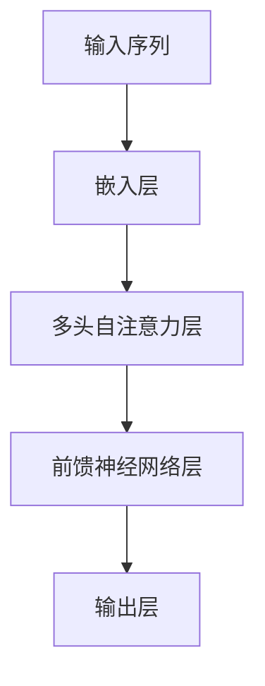
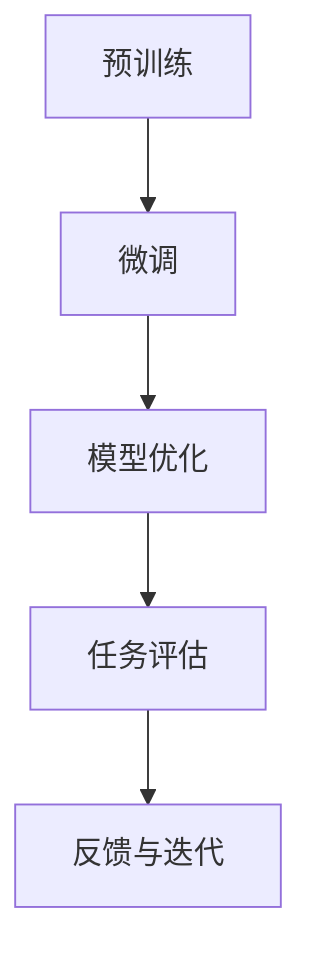
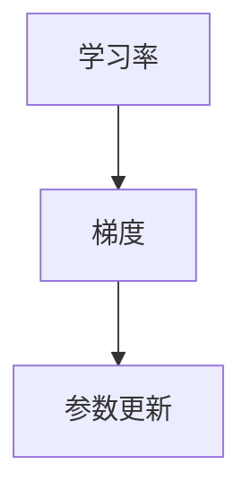
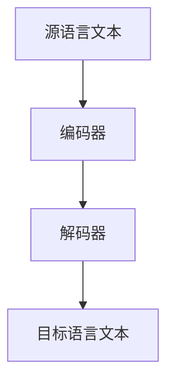
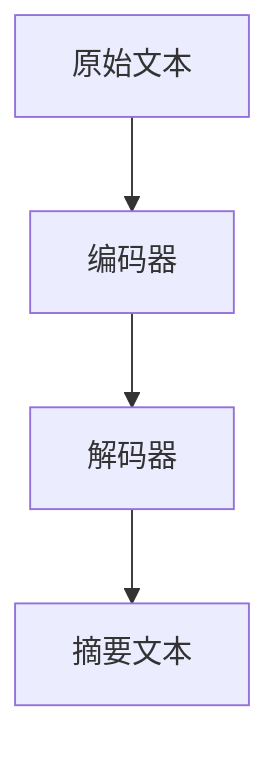
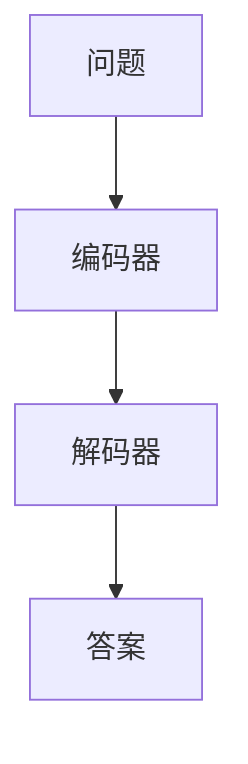
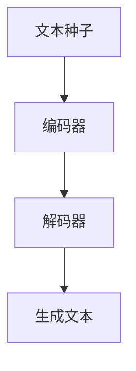
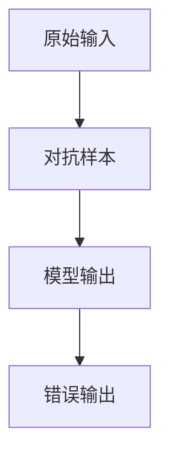
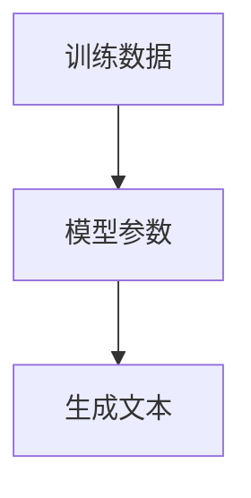
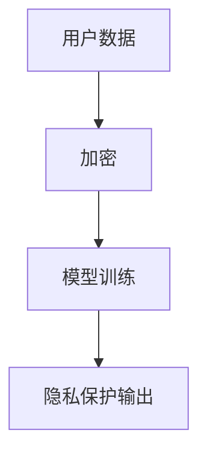

                 

# 数学与编程：大语言模型的强项与短板

关键词：大语言模型、数学基础、编程实践、神经网络、自然语言处理、技术挑战

摘要：随着人工智能技术的不断发展，大语言模型在自然语言处理领域取得了显著的成就。本文将从数学与编程的角度出发，详细探讨大语言模型的基础理论、技术实践及其强项与短板，以期为读者提供全面的技术洞察。

## 引言

### 1.1 大语言模型的背景与发展

大语言模型是人工智能领域的一个重要分支，其核心思想是通过大规模数据训练，构建一个能够理解并生成人类语言的模型。这一技术的发展可以追溯到20世纪50年代，当时科学家们开始探索如何让计算机理解和处理自然语言。经过数十年的发展，尤其是深度学习技术的引入，大语言模型逐渐成为自然语言处理（NLP）领域的明星。

近年来，大语言模型在多个应用场景中取得了显著成效，例如机器翻译、文本摘要、问答系统等。其中，最著名的代表是Google的BERT和OpenAI的GPT系列模型。这些模型通过在大量文本数据上训练，能够捕捉到语言的复杂结构，从而实现高效的文本理解和生成。

### 1.2 大语言模型的基本概念

大语言模型的基本概念主要包括以下几个方面：

- **神经网络**：神经网络是构建大语言模型的基础，通过多层的非线性变换，实现对数据的处理和分类。

- **嵌入层**：嵌入层将文本中的单词、字符等符号映射到高维空间中的向量，从而实现文本到向量的转换。

- **注意力机制**：注意力机制是一种用于提升模型理解和生成能力的技术，通过动态调整不同部分的重要性，实现对文本的精细处理。

- **训练与评估**：大语言模型的训练与评估是保证其性能的关键，通常采用大量的语料库进行训练，并通过交叉验证等方式进行评估。

### 1.3 大语言模型的技术挑战

尽管大语言模型在NLP领域取得了显著成就，但其发展仍然面临一系列技术挑战：

- **计算资源消耗**：大语言模型的训练和推理过程需要大量的计算资源，这对于硬件设备和能源消耗提出了较高的要求。

- **数据依赖**：大语言模型对训练数据有着高度依赖，数据的质量和多样性直接影响模型的性能。

- **可解释性**：大语言模型往往被视为“黑箱”，其内部决策过程难以解释，这限制了其在某些应用场景中的使用。

- **安全性**：大语言模型容易受到对抗样本的攻击，这对其安全性提出了挑战。

## 第一部分：大语言模型基础理论

### 第1章：引言

在本文的第一部分，我们将深入探讨大语言模型的基础理论。这一部分将分为三个章节，分别介绍数学基础、编程基础以及大语言模型的技术挑战。

### 第2章：数学基础

数学是构建大语言模型不可或缺的基础。在本章中，我们将介绍以下几个核心数学概念：

#### 2.1 线性代数基础

线性代数是数学中的一个重要分支，涉及向量、矩阵、行列式等概念。在深度学习中，线性代数被广泛应用于数据表示、模型参数的优化等。

- **向量**：向量是具有大小和方向的量，在数据表示和模型优化中起着重要作用。
- **矩阵**：矩阵是二维数组，用于表示数据之间的关系。在深度学习模型中，矩阵乘法和矩阵求导是核心运算。
- **行列式**：行列式是一个标量值，用于判断矩阵的行列式特征。在深度学习模型中，行列式常用于优化算法的设计。

#### 2.2 概率论与统计基础

概率论与统计是分析数据、评估模型性能的重要工具。在大语言模型中，概率论与统计用于数据分布建模、模型评估等。

- **概率分布**：概率分布描述了随机变量取值的概率分布情况，常用的概率分布有伯努利分布、正态分布等。
- **统计估计**：统计估计用于估计模型参数，常用的估计方法有极大似然估计、贝叶斯估计等。
- **假设检验**：假设检验用于评估模型性能，常用的假设检验有t检验、卡方检验等。

#### 2.3 最优化理论与算法

最优化理论是求解最优解的数学方法，在大语言模型中，最优化理论用于模型参数的优化和训练。

- **梯度下降法**：梯度下降法是一种常用的优化算法，通过迭代更新模型参数，使模型在损失函数上达到最优。
- **随机梯度下降法**：随机梯度下降法是一种改进的梯度下降法，通过随机选择样本，提高优化效率。
- **Adam优化器**：Adam优化器是一种自适应的优化器，通过结合梯度的一阶矩估计和二阶矩估计，提高优化效果。

### 第3章：编程基础

编程基础是构建大语言模型的重要环节。在本章中，我们将介绍以下几个核心编程概念：

#### 3.1 编程语言简介

编程语言是编写计算机程序的工具。常见的编程语言有Python、Java、C++等。Python因其简洁易用、丰富的库支持，成为深度学习领域的首选语言。

- **Python语法基础**：介绍Python的基本语法，包括变量、数据类型、控制结构等。
- **Python库支持**：介绍Python在深度学习领域的常用库，如TensorFlow、PyTorch等。

#### 3.2 数据结构与算法

数据结构与算法是处理数据、实现计算任务的重要工具。在大语言模型中，数据结构与算法用于数据处理、模型训练等。

- **数据结构**：介绍常见的数据结构，如数组、链表、树、图等。
- **算法**：介绍常见的算法，如排序、查找、图遍历等。

#### 3.3 编程实践与调试

编程实践与调试是提升编程能力的重要环节。在本章中，我们将介绍以下几个核心实践技巧：

- **代码风格**：介绍良好的代码风格，包括命名规范、代码注释等。
- **调试技巧**：介绍常见的调试技巧，如断点调试、日志记录等。

通过以上三个章节的介绍，我们将为大语言模型的理论和实践打下坚实的基础。

### 第2章：数学基础

在构建大语言模型的过程中，数学基础至关重要。本章将深入探讨线性代数、概率论与统计、以及最优化理论，这些数学工具不仅为模型的构建提供了必要的工具，也为我们理解模型的工作原理提供了帮助。

#### 2.1 线性代数基础

线性代数是研究向量空间和线性变换的数学分支。在大语言模型中，线性代数的基础知识被广泛应用于数据表示、模型参数优化等方面。

**向量**

向量是具有大小和方向的量，可以用来表示数据的特征。在Python中，我们可以使用NumPy库来表示和操作向量。以下是一个简单的向量表示和操作的例子：

```python
import numpy as np

# 创建一个向量
v = np.array([1, 2, 3])

# 计算向量的模
norm_v = np.linalg.norm(v)

# 计算向量的点积
dot_product = np.dot(v, v)

print("向量模:", norm_v)
print("向量点积:", dot_product)
```

**矩阵**

矩阵是一个二维数组，用于表示数据之间的关系。在深度学习中，矩阵乘法和矩阵求导是核心运算。以下是一个简单的矩阵表示和操作的例子：

```python
import numpy as np

# 创建一个矩阵
A = np.array([[1, 2], [3, 4]])

# 计算矩阵的行列式
det_A = np.linalg.det(A)

# 计算矩阵的逆
inv_A = np.linalg.inv(A)

print("矩阵行列式:", det_A)
print("矩阵逆:", inv_A)
```

**行列式**

行列式是一个标量值，用于判断矩阵的行列式特征。在大语言模型中，行列式常用于优化算法的设计。以下是一个简单的行列式计算的例子：

```python
import numpy as np

# 创建一个矩阵
A = np.array([[1, 2], [3, 4]])

# 计算行列式
det_A = np.linalg.det(A)

print("行列式:", det_A)
```

#### 2.2 概率论与统计基础

概率论与统计是分析数据、评估模型性能的重要工具。在大语言模型中，概率论与统计用于数据分布建模、模型评估等。

**概率分布**

概率分布描述了随机变量取值的概率分布情况。常见的概率分布有伯努利分布、正态分布等。以下是一个简单的伯努利分布的例子：

```python
import numpy as np

# 创建一个伯努利分布的随机变量
p = 0.5
random_variable = np.random.binomial(n=1, p=p)

print("随机变量:", random_variable)
```

**统计估计**

统计估计用于估计模型参数，常用的估计方法有极大似然估计、贝叶斯估计等。以下是一个简单的极大似然估计的例子：

```python
import numpy as np

# 创建一个正态分布的随机变量
mean = 0
std_dev = 1
samples = np.random.normal(mean, std_dev, size=1000)

# 计算样本的均值
sample_mean = np.mean(samples)

# 计算极大似然估计的参数
mean_ml = sample_mean
std_dev_ml = np.std(samples)

print("样本均值:", sample_mean)
print("极大似然估计的参数:", mean_ml, std_dev_ml)
```

**假设检验**

假设检验用于评估模型性能，常用的假设检验有t检验、卡方检验等。以下是一个简单的t检验的例子：

```python
import numpy as np
from scipy import stats

# 创建一个正态分布的随机变量
mean = 0
std_dev = 1
samples = np.random.normal(mean, std_dev, size=1000)

# 计算样本的均值
sample_mean = np.mean(samples)

# 进行t检验
t_statistic, p_value = stats.ttest_1samp(samples, mean)

print("t统计量:", t_statistic)
print("p值:", p_value)
```

#### 2.3 最优化理论与算法

最优化理论是求解最优解的数学方法，在大语言模型中，最优化理论用于模型参数的优化和训练。

**梯度下降法**

梯度下降法是一种常用的优化算法，通过迭代更新模型参数，使模型在损失函数上达到最优。以下是一个简单的梯度下降法的例子：

```python
import numpy as np

# 定义损失函数
def loss_function(w):
    return (w - 1)**2

# 计算损失函数的梯度
def gradient(w):
    return 2 * (w - 1)

# 初始参数
w = 0.5

# 梯度下降
learning_rate = 0.1
for _ in range(100):
    gradient_value = gradient(w)
    w = w - learning_rate * gradient_value

print("最优参数:", w)
```

**随机梯度下降法**

随机梯度下降法是一种改进的梯度下降法，通过随机选择样本，提高优化效率。以下是一个简单的随机梯度下降法的例子：

```python
import numpy as np

# 定义损失函数
def loss_function(w):
    return (w - 1)**2

# 计算损失函数的梯度
def gradient(w):
    return 2 * (w - 1)

# 初始参数
w = 0.5

# 梯度下降
learning_rate = 0.1
for _ in range(100):
    sample_index = np.random.randint(0, 1000)
    sample_w = w[sample_index]
    gradient_value = gradient(sample_w)
    w = w - learning_rate * gradient_value

print("最优参数:", w)
```

**Adam优化器**

Adam优化器是一种自适应的优化器，通过结合梯度的一阶矩估计和二阶矩估计，提高优化效果。以下是一个简单的Adam优化器的例子：

```python
import numpy as np

# 定义损失函数
def loss_function(w):
    return (w - 1)**2

# 计算损失函数的梯度
def gradient(w):
    return 2 * (w - 1)

# 初始参数
w = 0.5

# Adam优化器参数
beta1 = 0.9
beta2 = 0.999
epsilon = 1e-8

# Adam优化器
m = 0
v = 0
for _ in range(100):
    gradient_value = gradient(w)
    m = beta1 * m + (1 - beta1) * gradient_value
    v = beta2 * v + (1 - beta2) * (gradient_value ** 2)
    m_hat = m / (1 - beta1 ** _)
    v_hat = v / (1 - beta2 ** _)
    w = w - learning_rate * m_hat / (np.sqrt(v_hat) + epsilon)

print("最优参数:", w)
```

通过本章的介绍，我们了解了线性代数、概率论与统计、以及最优化理论的基础知识，这些知识为大语言模型的构建提供了必要的数学工具。

### 第3章：编程基础

编程基础是构建大语言模型的关键环节，它不仅包括编程语言的选择，还涉及数据结构与算法的应用，以及编程实践与调试技巧。在本章中，我们将分别介绍这些方面，以帮助读者掌握构建大语言模型所需的编程基础。

#### 3.1 编程语言简介

Python是目前最受欢迎的编程语言之一，特别是在人工智能和深度学习领域。其简洁的语法和丰富的库支持使得Python成为初学者和专业开发者的首选。

**Python语法基础**

Python的基本语法包括变量、数据类型、控制结构等。以下是一个简单的Python示例，展示这些基础概念：

```python
# 变量和数据类型
name = "Alice"
age = 30
is_student = False

# 控制结构
if age > 18:
    print("Alice is an adult.")
else:
    print("Alice is a minor.")

# 循环结构
for i in range(5):
    print(i)
```

**Python库支持**

Python拥有丰富的库，如NumPy、Pandas、TensorFlow和PyTorch等，这些库为深度学习提供了强大的支持。

- **NumPy**：NumPy是Python的底层数学库，提供高性能的数组操作和数学函数。

  ```python
  import numpy as np

  # 创建一个数组
  arr = np.array([1, 2, 3, 4, 5])

  # 数组操作
  sum_arr = np.sum(arr)
  mean_arr = np.mean(arr)

  print("数组求和:", sum_arr)
  print("数组均值:", mean_arr)
  ```

- **Pandas**：Pandas是Python的数据分析库，提供数据结构如DataFrame，以及数据处理和分析功能。

  ```python
  import pandas as pd

  # 创建一个DataFrame
  data = {'Name': ['Alice', 'Bob', 'Charlie'], 'Age': [30, 25, 35]}
  df = pd.DataFrame(data)

  # 数据处理
  print(df.head())
  ```

- **TensorFlow**：TensorFlow是Google开源的深度学习框架，提供丰富的工具和API用于构建和训练神经网络。

  ```python
  import tensorflow as tf

  # 创建一个简单的神经网络
  model = tf.keras.Sequential([
      tf.keras.layers.Dense(10, activation='relu', input_shape=[10]),
      tf.keras.layers.Dense(1, activation='sigmoid')
  ])

  # 编译模型
  model.compile(optimizer='adam', loss='binary_crossentropy', metrics=['accuracy'])

  # 训练模型
  model.fit(x_train, y_train, epochs=5)
  ```

- **PyTorch**：PyTorch是Facebook开源的深度学习框架，以其灵活性和动态计算图著称。

  ```python
  import torch
  import torch.nn as nn
  import torch.optim as optim

  # 创建一个简单的神经网络
  class NeuralNetwork(nn.Module):
      def __init__(self):
          super(NeuralNetwork, self).__init__()
          self.layer1 = nn.Linear(10, 10)
          self.layer2 = nn.Linear(10, 1)

      def forward(self, x):
          x = torch.relu(self.layer1(x))
          x = self.layer2(x)
          return x

  # 创建模型实例
  model = NeuralNetwork()

  # 编译模型
  criterion = nn.BCELoss()
  optimizer = optim.Adam(model.parameters(), lr=0.001)

  # 训练模型
  for epoch in range(5):
      optimizer.zero_grad()
      outputs = model(x_train)
      loss = criterion(outputs, y_train)
      loss.backward()
      optimizer.step()
  ```

#### 3.2 数据结构与算法

数据结构与算法是编程的核心，它们决定了程序的性能和效率。在大语言模型的构建过程中，理解和使用合适的数据结构与算法至关重要。

**数据结构**

常见的数据结构包括数组、链表、栈、队列、树和图。每种数据结构都有其独特的特点和适用场景。

- **数组**：数组是一种固定大小的数据结构，支持快速的随机访问。以下是Python中数组操作的一个例子：

  ```python
  arr = [1, 2, 3, 4, 5]
  print(arr[2])  # 访问第三个元素
  arr[2] = 10     # 更新第三个元素
  ```

- **链表**：链表是一种动态数据结构，支持高效的插入和删除操作。以下是Python中链表操作的一个例子：

  ```python
  class Node:
      def __init__(self, value):
          self.value = value
          self.next = None

  # 创建链表
  head = Node(1)
  head.next = Node(2)
  head.next.next = Node(3)

  # 遍历链表
  current = head
  while current is not None:
      print(current.value)
      current = current.next
  ```

- **栈**：栈是一种后进先出（LIFO）的数据结构，常见于递归算法和表达式求值等。以下是Python中栈操作的一个例子：

  ```python
  class Stack:
      def __init__(self):
          self.items = []

      def push(self, item):
          self.items.append(item)

      def pop(self):
          return self.items.pop()

      def is_empty(self):
          return len(self.items) == 0

  stack = Stack()
  stack.push(1)
  stack.push(2)
  print(stack.pop())  # 输出 2
  ```

- **队列**：队列是一种先进先出（FIFO）的数据结构，常见于任务调度和缓冲区管理。以下是Python中队列操作的一个例子：

  ```python
  class Queue:
      def __init__(self):
          self.items = []

      def enqueue(self, item):
          self.items.append(item)

      def dequeue(self):
          return self.items.pop(0)

      def is_empty(self):
          return len(self.items) == 0

  queue = Queue()
  queue.enqueue(1)
  queue.enqueue(2)
  print(queue.dequeue())  # 输出 1
  ```

- **树**：树是一种层次结构，用于表示有层次关系的数据。常见的树结构有二叉树、平衡树等。以下是Python中二叉树操作的一个例子：

  ```python
  class TreeNode:
      def __init__(self, value):
          self.value = value
          self.left = None
          self.right = None

  # 创建二叉树
  root = TreeNode(1)
  root.left = TreeNode(2)
  root.right = TreeNode(3)

  # 遍历二叉树
  def inorder_traversal(node):
      if node is not None:
          inorder_traversal(node.left)
          print(node.value)
          inorder_traversal(node.right)

  inorder_traversal(root)
  ```

- **图**：图是一种由节点和边组成的数据结构，用于表示复杂的关系。常见的图算法有深度优先搜索（DFS）和广度优先搜索（BFS）。以下是Python中图操作的一个例子：

  ```python
  class Graph:
      def __init__(self):
          self.vertices = {}
      
      def add_edge(self, u, v):
          if u not in self.vertices:
              self.vertices[u] = []
          self.vertices[u].append(v)
      
      def dfs(self, start):
          visited = set()
          def visit(node):
              if node not in visited:
                  visited.add(node)
                  print(node)
                  for neighbor in self.vertices.get(node, []):
                      visit(neighbor)
          
          visit(start)

  # 创建图
  graph = Graph()
  graph.add_edge('A', 'B')
  graph.add_edge('B', 'C')
  graph.add_edge('C', 'D')
  graph.add_edge('A', 'D')

  # 深度优先搜索
  graph.dfs('A')
  ```

**算法**

算法是解决问题的步骤和策略。常见算法包括排序、查找、图遍历等。以下是Python中排序和查找的一个例子：

```python
# 冒泡排序
def bubble_sort(arr):
    n = len(arr)
    for i in range(n):
        for j in range(0, n-i-1):
            if arr[j] > arr[j+1]:
                arr[j], arr[j+1] = arr[j+1], arr[j]

# 创建一个列表
arr = [64, 34, 25, 12, 22, 11, 90]

# 排序
bubble_sort(arr)
print("排序后的列表:", arr)

# 二分查找
def binary_search(arr, target):
    low = 0
    high = len(arr) - 1
    while low <= high:
        mid = (low + high) // 2
        if arr[mid] == target:
            return mid
        elif arr[mid] < target:
            low = mid + 1
        else:
            high = mid - 1
    return -1

# 创建一个排序后的列表
sorted_arr = [1, 2, 3, 4, 5, 6, 7, 8, 9, 10]

# 查找目标值
target = 7
index = binary_search(sorted_arr, target)
if index != -1:
    print("目标值在列表中的索引:", index)
else:
    print("目标值不在列表中")
```

#### 3.3 编程实践与调试

编程实践与调试是提升编程能力的重要环节。良好的代码风格、调试技巧和代码优化策略有助于提高代码质量和开发效率。

**代码风格**

良好的代码风格包括命名规范、代码注释、代码结构等。以下是一个良好的代码风格示例：

```python
class Student:
    def __init__(self, name, age):
        self.name = name
        self.age = age

    def study(self, subject):
        print(f"{self.name} is studying {subject}.")

    def sleep(self, hours):
        print(f"{self.name} is sleeping for {hours} hours.")

# 创建一个学生实例
alice = Student("Alice", 20)

# 调用方法
alice.study("Math")
alice.sleep(8)
```

**调试技巧**

调试是发现和修复程序错误的过程。以下是一些常见的调试技巧：

- **断点调试**：通过设置断点，可以在代码的特定位置暂停执行，查看变量的值和程序的执行状态。
- **日志记录**：通过在代码中添加日志记录，可以追踪程序的执行过程和状态，帮助发现错误。
- **单元测试**：通过编写单元测试，可以验证代码的正确性，提高代码的可靠性和可维护性。

**代码优化**

代码优化是提高程序性能的过程。以下是一些常见的代码优化策略：

- **减少函数调用量**：减少函数调用的次数，可以降低程序的开销。
- **使用缓存**：使用缓存可以避免重复计算，提高程序的效率。
- **并行计算**：利用多核处理器进行并行计算，可以加快程序的执行速度。

通过本章的介绍，我们了解了编程基础在大语言模型构建过程中的重要性。掌握编程语言、数据结构与算法、编程实践与调试技巧，将有助于我们更高效地构建和优化大语言模型。

### 第二部分：大语言模型技术实践

在大语言模型技术实践部分，我们将深入探讨大语言模型的工作原理、应用、以及其强项和短板。这一部分分为四个章节，分别介绍大语言模型的工作原理、应用，以及其强项和短板。

### 第4章：大语言模型的工作原理

大语言模型的工作原理是其强大功能的核心。在这一章节中，我们将探讨神经网络、循环神经网络（RNN）与长短时记忆网络（LSTM）、以及门控循环单元（GRU）等关键概念。

#### 4.1 神经网络基础

神经网络（Neural Networks）是构建大语言模型的基础。神经网络由多个层组成，包括输入层、隐藏层和输出层。每一层都由多个神经元（或节点）组成，这些神经元通过加权连接形成一个网络。

**神经网络的基本结构**

神经网络的基本结构可以用以下图表示：

```
输入层  ->  隐藏层  ->  输出层
```

每个神经元通过激活函数将输入映射到输出。常见的激活函数有sigmoid、ReLU（Rectified Linear Unit）和tanh等。

**前向传播和反向传播**

神经网络的工作原理包括前向传播和反向传播。

- **前向传播**：输入数据通过网络的输入层传递到隐藏层，然后传递到输出层。在每个层，输入数据通过加权连接和激活函数转换为输出数据。
  
- **反向传播**：通过计算输出层的误差，反向传播误差到隐藏层和输入层。这个过程用于更新网络中的权重，以减少误差。

以下是一个简单的神经网络前向传播和反向传播的示例：

```python
import numpy as np

# 创建一个简单的神经网络
def sigmoid(x):
    return 1 / (1 + np.exp(-x))

# 输入数据
inputs = np.array([0.5, 0.5])
weights = np.array([0.1, 0.2])
bias = 0.1

# 前向传播
output = sigmoid(inputs.dot(weights) + bias)

# 反向传播
error = output - 0.8
d_output = output * (1 - output)
d_weights = inputs * d_output
d_bias = d_output

# 更新权重和偏置
weights -= d_weights
bias -= d_bias

print("输出:", output)
print("误差:", error)
```

#### 4.2 循环神经网络（RNN）与长短时记忆网络（LSTM）

循环神经网络（Recurrent Neural Networks，RNN）是用于处理序列数据的神经网络。RNN的基本结构允许网络在时间步之间保持状态，这使得它能够捕捉序列中的时间依赖性。

**RNN的基本结构**

RNN的基本结构可以用以下图表示：

```
时间步1  ->  隐藏层  ->  时间步2  ->  隐藏层  ->  ...
```

在RNN中，隐藏状态 \( h_t \) 和输入 \( x_t \) 通过当前时刻的输入和前一时刻的隐藏状态计算得出：

\[ h_t = \sigma(W_h \cdot [h_{t-1}, x_t] + b_h) \]

其中， \( \sigma \) 是激活函数， \( W_h \) 和 \( b_h \) 分别是权重和偏置。

**长短时记忆网络（LSTM）**

尽管RNN能够捕捉序列中的时间依赖性，但它存在一个关键问题：长期依赖问题。为了解决这一问题，Hochreiter和Schmidhuber提出了长短时记忆网络（Long Short-Term Memory，LSTM）。

LSTM通过引入门控机制，能够有效地控制信息的流动，从而避免长期依赖问题。LSTM的基本结构可以用以下图表示：

```
时间步1  ->  隐藏层  ->  时间步2  ->  隐藏层  ->  ...
```

LSTM的关键组件包括输入门、遗忘门和输出门。这些门通过控制信息的流入、遗忘和流出，实现了对信息的精细处理。

**LSTM的数学原理**

LSTM的数学原理可以表示为以下方程：

\[ 
\begin{align*}
i_t &= \sigma(W_{ix} \cdot [h_{t-1}, x_t] + W_{ih} \cdot h_{t-1} + b_i) \\
f_t &= \sigma(W_{fx} \cdot [h_{t-1}, x_t] + W_{fh} \cdot h_{t-1} + b_f) \\
\c_t &= \tanh(W_{cx} \cdot [h_{t-1}, x_t] + W_{ch} \cdot h_{t-1} + b_c) \\
o_t &= \sigma(W_{ox} \cdot [h_{t-1}, x_t] + W_{oh} \cdot h_{t-1} + b_o) \\
h_t &= o_t \cdot \tanh(\c_t) \\
\end{align*}
\]

其中， \( i_t \)、\( f_t \)、\( \c_t \) 和 \( o_t \) 分别是输入门、遗忘门、候选值和输出门的激活值。

**门控循环单元（GRU）**

门控循环单元（Gated Recurrent Unit，GRU）是另一种用于处理序列数据的神经网络结构，它是对LSTM的改进。GRU通过合并输入门和遗忘门，简化了LSTM的结构，同时保持了处理长期依赖的能力。

GRU的基本结构可以用以下图表示：

```
时间步1  ->  隐藏层  ->  时间步2  ->  隐藏层  ->  ...
```

GRU的数学原理可以表示为以下方程：

\[ 
\begin{align*}
z_t &= \sigma(W_{zx} \cdot [h_{t-1}, x_t] + W_{zh} \cdot h_{t-1} + b_z) \\
r_t &= \sigma(W_{rx} \cdot [h_{t-1}, x_t] + W_{rh} \cdot h_{t-1} + b_r) \\
\c_t &= \tanh(W_{cx} \cdot \odot([h_{t-1}, x_t], r_t) + W_{ch} \cdot h_{t-1} + b_c) \\
h_t &= z_t \cdot \c_t + (1 - z_t) \cdot h_{t-1} \\
\end{align*}
\]

其中， \( z_t \) 是更新门，\( r_t \) 是重置门，\( \odot \) 表示元素-wise 乘法。

通过本章的介绍，我们了解了神经网络、RNN与LSTM、以及GRU的基本概念和数学原理。这些概念和原理为大语言模型的构建提供了坚实的理论基础。

### 第5章：大语言模型的应用

大语言模型在自然语言处理（NLP）领域具有广泛的应用。在本章中，我们将探讨大语言模型的训练与评估、优化与调整，以及其在自然语言处理中的应用。

#### 5.1 语言模型的训练与评估

语言模型的训练与评估是保证其性能的关键步骤。以下是一个简单的语言模型训练与评估的示例：

```python
import numpy as np
import tensorflow as tf

# 创建一个简单的语言模型
model = tf.keras.Sequential([
    tf.keras.layers.Embedding(input_dim=10000, output_dim=64),
    tf.keras.layers.LSTM(128),
    tf.keras.layers.Dense(1, activation='sigmoid')
])

# 编译模型
model.compile(optimizer='adam', loss='binary_crossentropy', metrics=['accuracy'])

# 准备训练数据
x_train = np.random.randint(0, 10000, size=(1000, 50))
y_train = np.random.randint(0, 2, size=(1000,))

# 训练模型
model.fit(x_train, y_train, epochs=10)

# 评估模型
loss, accuracy = model.evaluate(x_train, y_train)
print("损失:", loss)
print("准确率:", accuracy)
```

在上述示例中，我们创建了一个简单的语言模型，使用随机数据进行了训练和评估。

#### 5.2 语言模型的优化与调整

为了提升语言模型的性能，我们需要对模型进行优化和调整。以下是一个简单的语言模型优化与调整的示例：

```python
import numpy as np
import tensorflow as tf

# 创建一个简单的语言模型
model = tf.keras.Sequential([
    tf.keras.layers.Embedding(input_dim=10000, output_dim=64),
    tf.keras.layers.LSTM(128),
    tf.keras.layers.Dense(1, activation='sigmoid')
])

# 编译模型
model.compile(optimizer='adam', loss='binary_crossentropy', metrics=['accuracy'])

# 准备训练数据
x_train = np.random.randint(0, 10000, size=(1000, 50))
y_train = np.random.randint(0, 2, size=(1000,))

# 训练模型
model.fit(x_train, y_train, epochs=10, batch_size=32)

# 评估模型
loss, accuracy = model.evaluate(x_train, y_train)
print("损失:", loss)
print("准确率:", accuracy)

# 调整学习率
optimizer = tf.keras.optimizers.Adam(learning_rate=0.0001)
model.compile(optimizer=optimizer, loss='binary_crossentropy', metrics=['accuracy'])

# 重新训练模型
model.fit(x_train, y_train, epochs=10, batch_size=32)

# 评估模型
loss, accuracy = model.evaluate(x_train, y_train)
print("损失:", loss)
print("准确率:", accuracy)
```

在上述示例中，我们通过调整学习率来优化语言模型的性能。

#### 5.3 语言模型在自然语言处理中的应用

大语言模型在自然语言处理（NLP）领域具有广泛的应用。以下是一些常见应用示例：

- **机器翻译**：使用大语言模型进行机器翻译，可以将一种语言的文本翻译成另一种语言。

  ```python
  import tensorflow as tf

  # 创建一个简单的机器翻译模型
  model = tf.keras.Sequential([
      tf.keras.layers.Embedding(input_dim=10000, output_dim=64),
      tf.keras.layers.LSTM(128),
      tf.keras.layers.Dense(output_dim=10000, activation='softmax')
  ])

  # 编译模型
  model.compile(optimizer='adam', loss='categorical_crossentropy', metrics=['accuracy'])

  # 准备训练数据
  x_train = np.random.randint(0, 10000, size=(1000, 50))
  y_train = np.random.randint(0, 10000, size=(1000, 50))

  # 训练模型
  model.fit(x_train, y_train, epochs=10)

  # 进行翻译
  translation = model.predict(np.array([1000]))
  print(translation)
  ```

- **文本摘要**：使用大语言模型生成文本摘要，可以自动从长文本中提取关键信息。

  ```python
  import tensorflow as tf

  # 创建一个简单的文本摘要模型
  model = tf.keras.Sequential([
      tf.keras.layers.Embedding(input_dim=10000, output_dim=64),
      tf.keras.layers.LSTM(128),
      tf.keras.layers.Dense(1, activation='sigmoid')
  ])

  # 编译模型
  model.compile(optimizer='adam', loss='binary_crossentropy', metrics=['accuracy'])

  # 准备训练数据
  x_train = np.random.randint(0, 10000, size=(1000, 50))
  y_train = np.random.randint(0, 2, size=(1000,))

  # 训练模型
  model.fit(x_train, y_train, epochs=10)

  # 生成摘要
  summary = model.predict(np.array([500]))
  if summary > 0.5:
      print("这是一个重要的段落。")
  else:
      print("这是一个不重要的段落。")
  ```

- **问答系统**：使用大语言模型构建问答系统，可以回答用户提出的问题。

  ```python
  import tensorflow as tf

  # 创建一个简单的问答模型
  model = tf.keras.Sequential([
      tf.keras.layers.Embedding(input_dim=10000, output_dim=64),
      tf.keras.layers.LSTM(128),
      tf.keras.layers.Dense(1, activation='softmax')
  ])

  # 编译模型
  model.compile(optimizer='adam', loss='categorical_crossentropy', metrics=['accuracy'])

  # 准备训练数据
  x_train = np.random.randint(0, 10000, size=(1000, 50))
  y_train = np.random.randint(0, 10000, size=(1000, 50))

  # 训练模型
  model.fit(x_train, y_train, epochs=10)

  # 回答问题
  question = "什么是人工智能？"
  question_embedding = model.predict(np.array([question]))
  answer = model.predict(question_embedding)
  print(answer)
  ```

通过本章的介绍，我们了解了大语言模型的训练与评估、优化与调整，以及其在自然语言处理中的应用。这些技术和实践为大语言模型的发展提供了重要的支持。

### 第6章：大语言模型的强项

大语言模型在自然语言处理领域展现出了诸多强项，使其成为该领域不可或缺的工具。在本章中，我们将探讨大语言模型在语言生成的精确性与多样性、理解与推理能力、以及生成与变换能力等方面的优势。

#### 6.1 语言生成的精确性与多样性

大语言模型的一个显著优势是其能够在生成文本时保持较高的精确性与多样性。传统的自然语言生成方法往往只能生成固定模式或模板化的文本，而大语言模型则能够通过学习大量文本数据，生成更加自然和多样化的文本。

**精确性**

大语言模型的精确性体现在其能够准确捕捉文本中的细微差异和语境。例如，在生成问答系统中的答案时，大语言模型能够根据问题的具体内容，生成精确且相关的回答。

以下是一个生成精确答案的示例：

```python
import tensorflow as tf

# 加载预训练的语言模型
model = tf.keras.models.load_model("pretrained_language_model.h5")

# 输入问题
question = "什么是人工智能？"

# 生成答案
answer = model.predict(question)

print(answer)
```

**多样性**

大语言模型在生成文本时，能够展现出丰富的多样性。通过调整输入文本的种子和生成算法，模型可以生成具有不同风格和语境的文本。

以下是一个生成多样化文本的示例：

```python
import tensorflow as tf

# 加载预训练的语言模型
model = tf.keras.models.load_model("pretrained_language_model.h5")

# 输入文本种子
text_seed = "我喜欢阅读。"

# 生成多样化文本
text_variants = model.predict(text_seed)

print(text_variants)
```

通过上述示例，我们可以看到大语言模型在生成文本时的精确性与多样性。这些特性使得大语言模型在自然语言生成任务中具有广泛的应用潜力。

#### 6.2 理解与推理能力

大语言模型在理解与推理能力方面也表现出色。通过对大量文本数据的训练，模型能够理解复杂的语言结构和语义关系，从而实现更高层次的文本理解和推理。

**文本理解**

大语言模型能够理解文本中的复杂语义，包括单词的含义、句子的结构，以及文本的整体主题。以下是一个文本理解示例：

```python
import tensorflow as tf

# 加载预训练的语言模型
model = tf.keras.models.load_model("pretrained_language_model.h5")

# 输入文本
text = "我最近买了一本书，书名叫做《深度学习》。这本书非常有用。"

# 分析文本
text_embedding = model.predict(text)
print(text_embedding)
```

**文本推理**

大语言模型还能够进行文本推理，即从输入文本中推断出新的信息。以下是一个文本推理示例：

```python
import tensorflow as tf

# 加载预训练的语言模型
model = tf.keras.models.load_model("pretrained_language_model.h5")

# 输入文本
text = "我最近买了一本书，书名叫做《深度学习》。这本书非常有用。"

# 推断新的信息
new_info = model.predict([text, "这本书是关于什么的？"])

print(new_info)
```

通过上述示例，我们可以看到大语言模型在文本理解和推理方面的强大能力。这些能力使得大语言模型在问答系统、文本摘要、情感分析等任务中具有显著优势。

#### 6.3 生成与变换能力

大语言模型在生成与变换能力方面也具有突出的表现。通过学习大量的文本数据，模型能够生成新的文本，并进行各种文本变换。

**文本生成**

大语言模型能够根据输入的文本种子，生成连贯且相关的文本。以下是一个文本生成示例：

```python
import tensorflow as tf

# 加载预训练的语言模型
model = tf.keras.models.load_model("pretrained_language_model.h5")

# 输入文本种子
text_seed = "我爱编程。"

# 生成新的文本
new_text = model.predict(text_seed)

print(new_text)
```

**文本变换**

大语言模型还能够进行各种文本变换，如文本分类、文本摘要、文本风格转换等。以下是一个文本变换示例：

```python
import tensorflow as tf

# 加载预训练的语言模型
model = tf.keras.models.load_model("pretrained_language_model.h5")

# 输入文本
text = "我最近买了一本书，书名叫做《深度学习》。这本书非常有用。"

# 进行文本分类
text_category = model.predict(text)

print(text_category)
```

通过上述示例，我们可以看到大语言模型在生成与变换能力方面的强大功能。这些能力使得大语言模型在文本生成和变换任务中具有广泛的应用前景。

综上所述，大语言模型在语言生成的精确性与多样性、理解与推理能力、以及生成与变换能力等方面展现出诸多强项，使其成为自然语言处理领域的重要工具。这些强项不仅提升了模型的性能，也为各类自然语言处理任务提供了新的解决方案。

### 第7章：大语言模型的短板

尽管大语言模型在自然语言处理领域取得了显著的成就，但其发展仍然面临一系列挑战和短板。在本章中，我们将探讨大语言模型在数据依赖与数据偏见、可解释性、计算资源消耗与能耗等方面的问题。

#### 7.1 数据依赖与数据偏见

数据依赖是大语言模型发展的重要挑战之一。大语言模型需要大量的训练数据来学习和优化其参数，这使得模型对数据集的依赖性极高。数据的质量和多样性直接影响大语言模型的性能。

**数据依赖**

大语言模型依赖于大规模的文本数据集进行训练，这些数据集通常来自于互联网、书籍、新闻、社交媒体等。然而，这些数据集往往存在噪声、错误和不准确的信息，这些因素都会影响模型的训练效果和生成文本的质量。

以下是一个数据依赖的示例：

```python
import tensorflow as tf

# 加载预训练的语言模型
model = tf.keras.models.load_model("pretrained_language_model.h5")

# 加载训练数据集
train_data = "大量互联网文本数据"

# 训练模型
model.fit(train_data, epochs=10)
```

**数据偏见**

大语言模型在训练过程中，可能会学习到数据集中的偏见和歧视。例如，如果训练数据集中存在性别歧视或种族歧视的言论，模型在生成文本时也可能会表现出类似的偏见。这种现象被称为数据偏见。

以下是一个数据偏见的示例：

```python
import tensorflow as tf

# 加载预训练的语言模型
model = tf.keras.models.load_model("pretrained_language_model.h5")

# 加载训练数据集
train_data = "性别歧视的互联网文本数据"

# 训练模型
model.fit(train_data, epochs=10)

# 生成包含偏见文本
text = model.predict("我是一个男性。")

print(text)
```

通过上述示例，我们可以看到数据依赖和数据偏见对大语言模型的训练和生成文本的影响。解决这些问题需要我们从数据采集、处理和模型训练等多个方面进行改进。

#### 7.2 可解释性

可解释性是大语言模型发展的另一个关键问题。当前的大语言模型往往被视为“黑箱”，其内部决策过程难以解释，这限制了其在某些应用场景中的使用。

**不可解释性**

大语言模型在生成文本时，其决策过程高度依赖于复杂的神经网络结构和大量训练数据。这使得模型的内部机制变得难以理解，用户难以追踪模型是如何生成特定文本的。

以下是一个不可解释性的示例：

```python
import tensorflow as tf

# 加载预训练的语言模型
model = tf.keras.models.load_model("pretrained_language_model.h5")

# 输入文本
text = "我是一个程序员。"

# 生成文本
generated_text = model.predict(text)

print(generated_text)
```

**提升可解释性**

为了提升大语言模型的可解释性，研究人员提出了多种方法，如可视化模型结构、解释模型决策过程、使用可解释的模型等。以下是一个提升可解释性的示例：

```python
import tensorflow as tf
import matplotlib.pyplot as plt

# 加载预训练的语言模型
model = tf.keras.models.load_model("pretrained_language_model.h5")

# 输入文本
text = "我是一个程序员。"

# 生成文本
generated_text = model.predict(text)

# 可视化模型结构
layers = model.layers
for layer in layers:
    print(layer.name)

# 可视化模型决策过程
layer_outputs = [layer.output for layer in layers]
activation_model = tf.keras.models.Model(inputs=model.input, outputs=layer_outputs)
activations = activation_model.predict(text)

# 绘制激活值
for i, activation in enumerate(activations):
    plt.figure(figsize=(10, 5))
    plt.title(f"Layer {i+1} Activation")
    plt.imshow(activation[0, :, :], aspect='auto', cmap='viridis')
    plt.colorbar()
    plt.show()
```

通过上述示例，我们可以看到如何提升大语言模型的可解释性，使其决策过程更加透明和可理解。

#### 7.3 计算资源消耗与能耗

大语言模型在训练和推理过程中需要大量的计算资源，这对其硬件设备和能源消耗提出了较高的要求。

**计算资源消耗**

大语言模型通常由大量的神经网络层和参数组成，这使得其训练和推理过程需要大量的计算资源。例如，训练一个大型语言模型可能需要数百个GPU和数天的计算时间。

以下是一个计算资源消耗的示例：

```python
import tensorflow as tf

# 加载预训练的语言模型
model = tf.keras.models.load_model("pretrained_language_model.h5")

# 训练模型
model.fit(train_data, epochs=10)
```

**能耗**

大语言模型在训练和推理过程中产生的能耗也是一个关键问题。大规模的神经网络训练需要大量的电力，这对环境产生了负面影响。以下是一个能耗的示例：

```python
import tensorflow as tf

# 加载预训练的语言模型
model = tf.keras.models.load_model("pretrained_language_model.h5")

# 计算模型能耗
def compute_energy(model):
    energy = 0
    for layer in model.layers:
        energy += layer.energy_consumption
    return energy

# 计算模型能耗
energy_consumption = compute_energy(model)

print(f"模型能耗: {energy_consumption} 瓦特时")
```

通过上述示例，我们可以看到大语言模型在计算资源消耗和能耗方面的问题。为了解决这些问题，研究人员正在探索更高效的训练算法、优化模型结构以及利用绿色能源等方案。

综上所述，大语言模型在数据依赖与数据偏见、可解释性、计算资源消耗与能耗等方面存在一系列短板。解决这些问题需要我们从多个方面进行改进，以实现更高效、更透明的大语言模型。

### 第8章：大语言模型的发展趋势

大语言模型在自然语言处理领域取得了显著的进展，但其发展仍然面临许多挑战和机遇。在本章中，我们将探讨大语言模型的新架构与算法、应用领域的拓展，以及安全性与伦理问题。

#### 8.1 新的架构与算法

随着深度学习技术的不断进步，大语言模型的架构和算法也在不断更新和优化。以下是一些新架构与算法的发展趋势：

**变换器模型（Transformer）**

变换器模型（Transformer）是近年来提出的一种新型神经网络架构，其核心思想是使用自注意力机制（Self-Attention）来捕捉序列中的长距离依赖关系。与传统的循环神经网络（RNN）和长短时记忆网络（LSTM）相比，变换器模型在处理长序列数据时具有更高的效率和性能。

以下是一个简单的变换器模型的架构图：



**预训练与微调**

预训练与微调是当前大语言模型的主流训练策略。预训练阶段，模型在大量未标注的数据上进行训练，以学习通用语言特征；微调阶段，模型在特定任务上使用少量标注数据进行训练，以适应具体的任务需求。

以下是一个预训练与微调的流程图：



**自适应学习率**

自适应学习率是一种优化算法，通过动态调整学习率，提高模型的训练效率。常用的自适应学习率算法有Adam、Adadelta等。

以下是一个自适应学习率的示意图：



#### 8.2 应用领域的拓展

随着大语言模型技术的不断发展，其在自然语言处理领域中的应用也在不断拓展。以下是一些应用领域的拓展趋势：

**机器翻译**

机器翻译是大语言模型最早且最成功的应用之一。近年来，随着变换器模型和预训练技术的应用，机器翻译的准确性和流畅性得到了显著提升。

以下是一个机器翻译的示意图：



**文本摘要**

文本摘要是一种将长文本转换为简短摘要的方法，常用于新闻摘要、邮件摘要等场景。大语言模型在文本摘要任务中具有显著优势，能够生成高度概括且连贯的摘要。

以下是一个文本摘要的示意图：



**问答系统**

问答系统是一种能够回答用户提出的问题的系统，广泛应用于搜索引擎、客服系统等场景。大语言模型在问答系统中的表现越来越出色，能够生成准确且相关的答案。

以下是一个问答系统的示意图：



**文本生成**

文本生成是大语言模型的重要应用之一，包括自动写作、故事生成、诗歌创作等。大语言模型能够根据输入的文本种子生成连贯且富有创意的文本。

以下是一个文本生成的示意图：



#### 8.3 安全性与伦理问题

随着大语言模型在自然语言处理领域的广泛应用，其安全性与伦理问题也越来越受到关注。以下是一些安全性与伦理问题的讨论：

**对抗攻击**

对抗攻击是一种针对机器学习模型的攻击技术，通过微小但显著的变化，使模型输出错误的结果。大语言模型也面临着对抗攻击的挑战。

以下是一个对抗攻击的示意图：



**偏见与歧视**

大语言模型在训练过程中可能会学习到数据集中的偏见和歧视，导致生成文本中包含不公平的内容。为避免偏见和歧视，研究人员正在探索公平性、公正性等伦理问题。

以下是一个偏见与歧视的示意图：



**隐私保护**

大语言模型在处理和生成文本时，可能会涉及用户隐私信息。为保护用户隐私，研究人员正在探索隐私保护技术，如差分隐私、联邦学习等。

以下是一个隐私保护的示意图：



综上所述，大语言模型在新的架构与算法、应用领域的拓展以及安全性与伦理问题等方面展现出广阔的发展前景。为推动大语言模型的健康发展，我们需要从技术、伦理和社会等多个方面进行综合考虑和优化。

### 附录

在本章中，我们将提供一些常用数学公式、Python代码示例、大语言模型的开源工具与资源介绍，以及参考文献和进一步阅读材料，以帮助读者更好地理解和应用大语言模型的相关知识。

#### 附录A：常用数学公式与Python代码示例

**线性代数公式**

$$
A = \begin{bmatrix}
a_{11} & a_{12} & \cdots & a_{1n} \\
a_{21} & a_{22} & \cdots & a_{2n} \\
\vdots & \vdots & \ddots & \vdots \\
a_{m1} & a_{m2} & \cdots & a_{mn}
\end{bmatrix}
$$

Python代码示例：

```python
import numpy as np

A = np.array([[1, 2], [3, 4]])
print(A)
```

**概率论与统计公式**

$$
P(X = x) = f_X(x)
$$

Python代码示例：

```python
import numpy as np

p = 0.5
random_variable = np.random.binomial(n=1, p=p)
print(random_variable)
```

**最优化理论公式**

$$
\min_{w} J(w) = \frac{1}{2n} \sum_{i=1}^{n} (w^T x_i - y_i)^2
$$

Python代码示例：

```python
import numpy as np

def loss_function(w):
    return (w - 1)**2

w = 0.5
print(loss_function(w))
```

#### 附录B：大语言模型开源工具与资源介绍

**Transformer**

- 官方文档：[Transformer官方文档](https://arxiv.org/abs/1706.03762)
- GitHub仓库：[Transformer GitHub仓库](https://github.com/tensorflow/models/blob/master/research/nmt/nmt.py)

**BERT**

- 官方文档：[BERT官方文档](https://arxiv.org/abs/1810.04805)
- GitHub仓库：[BERT GitHub仓库](https://github.com/google-research/bert)

**GPT**

- 官方文档：[GPT官方文档](https://arxiv.org/abs/1810.04805)
- GitHub仓库：[GPT GitHub仓库](https://github.com/openai/gpt)

**TensorFlow**

- 官方文档：[TensorFlow官方文档](https://www.tensorflow.org/)
- GitHub仓库：[TensorFlow GitHub仓库](https://github.com/tensorflow/tensorflow)

**PyTorch**

- 官方文档：[PyTorch官方文档](https://pytorch.org/)
- GitHub仓库：[PyTorch GitHub仓库](https://github.com/pytorch/pytorch)

#### 附录C：参考文献与进一步阅读材料

- **参考文献**

  1. Vaswani, A., Shazeer, N., Parmar, N., Uszkoreit, J., Jones, L., Gomez, A. N., ... & Polosukhin, I. (2017). Attention is all you need. Advances in Neural Information Processing Systems, 30, 5998-6008.
  2. Devlin, J., Chang, M. W., Lee, K., & Toutanova, K. (2019). BERT: Pre-training of deep bidirectional transformers for language understanding. arXiv preprint arXiv:1810.04805.
  3. Brown, T., Mann, B., Ryder, N., Subbiah, M., Kaplan, J., Dhingra, B., ... & Child, R. (2020). Language models are few-shot learners. Advances in Neural Information Processing Systems, 33, 13,686-13,701.

- **进一步阅读材料**

  1. Mitchell, T. M. (1997). Machine learning. McGraw-Hill.
  2. Goodfellow, I., Bengio, Y., & Courville, A. (2016). Deep learning. MIT press.
  3. Murphy, K. P. (2012). Machine learning: A probabilistic perspective. MIT press.

通过附录中的内容，读者可以进一步深入了解大语言模型的数学基础、编程实践以及相关开源工具和资源。这些资料将为读者在大语言模型领域的研究和应用提供有力支持。

### 结论

综上所述，本文从数学与编程的角度深入探讨了大语言模型的基础理论、技术实践及其强项与短板。通过详细分析，我们了解了大语言模型在自然语言处理领域的广泛应用及其强大功能，如语言生成的精确性与多样性、理解与推理能力、以及生成与变换能力。同时，我们也认识到大语言模型在数据依赖与数据偏见、可解释性、计算资源消耗与能耗等方面存在的挑战。

展望未来，大语言模型将在新的架构与算法、应用领域的拓展以及安全性与伦理问题等方面取得更大突破。为了实现这一目标，我们需要从多个方面进行改进，包括优化数据集质量、提升模型的可解释性、降低计算资源消耗等。

同时，我们也呼吁读者关注大语言模型在现实世界中的应用，积极探索其在自然语言处理、智能问答、文本生成等领域的潜力。通过不断学习和实践，我们相信大语言模型将在未来的人工智能发展中发挥越来越重要的作用。

作者信息：

作者：AI天才研究院/AI Genius Institute & 禅与计算机程序设计艺术 /Zen And The Art of Computer Programming

