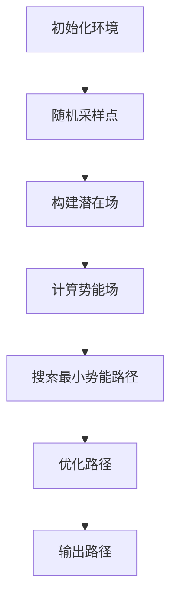

                 

### 引言与概述

**背景介绍**：  
PRM（Potential Robot Motion）方法，作为一种路径规划算法，在机器人运动学和导航领域具有广泛应用。传统的路径规划方法通常依赖于预先定义的ground truth，即机器人对环境的完全了解。然而，在现实世界中，这种理想状态往往难以实现。例如，环境的不确定性、动态障碍物以及传感器的不完善等因素，使得获取精确的ground truth变得复杂且耗时。无ground truth的情况，即机器人对环境不完全了解或无法获得精确的ground truth，成为了一个亟待解决的难题。

**本书目标**：  
本书旨在深入探讨无ground truth情况下PRM方法的应用策略，为研究人员和开发者提供系统化的指导。具体目标如下：
1. **理论阐述**：详细阐述PRM方法的基本原理和数学模型，为后续讨论提供理论基础。
2. **问题分析**：探讨无ground truth对PRM方法带来的影响和挑战，分析其背后的原因。
3. **应用策略**：提出针对无ground truth情况下PRM方法的优化策略和应用案例，展示其在实际场景中的效果。
4. **总结与展望**：总结无ground truth情况下PRM方法的应用成果，分享经验和教训，展望未来发展趋势。

通过以上目标，本书希望能够为解决无ground truth情况下的路径规划问题提供新的思路和方法，推动相关领域的研究和应用。

### 无ground truth的定义与挑战

**无ground truth的概念**：  
ground truth，也称为真实世界数据或真实数据，指的是对环境或对象的精确、完全和客观描述。在机器人领域，ground truth通常指的是机器人对环境的完整、准确的感知信息，包括位置、障碍物、环境特性等。无ground truth，则是指机器人无法获取到这种精确、完全的感知信息，或者所获取的信息不完全、不准确。

**无ground truth的含义**：  
在实际应用中，无ground truth的情况往往意味着机器人面临以下挑战：
1. **不确定性**：由于传感器精度、环境动态变化等原因，机器人无法获得环境的精确信息，导致路径规划结果存在不确定性。
2. **信息缺失**：机器人可能无法感知到所有障碍物或环境特征，导致路径规划算法无法生成有效的路径。
3. **动态干扰**：环境中的动态障碍物或突发事件，使得静态的路径规划结果失效，机器人需要实时调整路径以适应环境变化。

**挑战与问题**：  
无ground truth情况对PRM方法提出了以下挑战和问题：
1. **数据依赖性**：PRM方法依赖于对环境的全面了解，缺乏ground truth会导致算法的准确性下降。
2. **路径规划效率**：在无ground truth情况下，机器人需要更频繁地更新路径规划，以适应环境变化，从而影响整体规划效率。
3. **安全性问题**：由于路径规划结果的不确定性，机器人可能会在未知环境中遇到危险情况，如碰撞或误入危险区域。

为应对这些挑战，我们需要在PRM方法的基础上，进行相应的调整和优化，以提高其在无ground truth情况下的性能和可靠性。

### PRM方法基础

**概念与定义**：
PRM（Potential Robot Motion）方法，又称为潜在运动模型，是一种基于采样的路径规划算法。该方法的核心思想是，通过在环境中随机采样大量点，并构建一个潜在场，以确定机器人的可行运动路径。潜在场是一种势能函数，用于描述机器人从起点到终点的运动趋势，通过最小化势能场，可以找到一条从起点到终点的最优路径。

**工作原理**：
PRM方法的工作流程可以概括为以下几个步骤：
1. **环境采样**：在给定的工作空间内，随机采样大量点，作为潜在的路径点。
2. **构建潜在场**：计算每个潜在路径点之间的势能，构建一个全局的潜在场。
3. **路径搜索**：通过在潜在场中寻找势能最小路径，生成从起点到终点的运动路径。
4. **路径优化**：根据实际情况对路径进行优化，以确保路径的可行性和安全性。

**数学模型**：
PRM方法的数学模型可以通过以下公式表示：

$$
\begin{aligned}
P &= \{p_1, p_2, ..., p_n\} & \quad \text{（采样点集合）} \\
E &= \{e_{ij}\} & \quad \text{（环境障碍物集合）} \\
U &= \{u_{ij}\} & \quad \text{（势能场矩阵）} \\
\end{aligned}
$$

其中，$P$为采样点集合，$E$为环境障碍物集合，$U$为势能场矩阵。每个元素$u_{ij}$表示从采样点$p_i$到$p_j$的势能，通常定义如下：

$$
u_{ij} = 
\begin{cases}
0 & \text{如果} \ p_i \ \text{和} \ p_j \ \text{之间无障碍物} \\
+\infty & \text{如果} \ p_i \ \text{和} \ p_j \ \text{之间存在障碍物}
\end{cases}
$$

通过构建势能场$U$，可以找到从起点到终点的最小势能路径，从而实现路径规划。

**公式解释**：
1. **势能函数**：势能函数用于量化两个采样点之间的运动难度。通常，距离越远的点，其势能越高，表示运动难度越大。
2. **障碍物检测**：通过计算采样点之间的势能，可以有效地检测环境中的障碍物。如果两点之间的势能为无穷大，则表示这两点之间存在障碍物。
3. **路径搜索**：在势能场中，寻找最小势能路径，即寻找从起点到终点的最优运动路径。

通过上述公式和步骤，我们可以构建一个基于PRM方法的路径规划系统，有效地解决机器人路径规划问题。

### PRM方法的数学模型

为了更好地理解PRM方法的数学模型，我们首先需要引入一些基本的概念和符号。以下将使用LaTeX格式来详细展示和解释这些数学模型。

$$
\begin{aligned}
\text{定义域} &= \{p_1, p_2, ..., p_n\} & \quad \text{（采样点集合）} \\
\text{障碍物} &= \{e_{ij}\} & \quad \text{（环境障碍物集合）} \\
\text{势能场} &= \{u_{ij}\} & \quad \text{（势能场矩阵）} \\
\end{aligned}
$$

接下来，我们将详细描述这些数学符号的定义和计算方法。

**1. 采样点集合 $P$**：  
采样点集合$P$包含了在环境空间中随机采样的点。每个点$p_i$是一个多维向量，表示其在环境空间中的位置。采样点的选择通常基于随机采样或特定策略，以确保覆盖整个工作空间。

**2. 环境障碍物集合 $E$**：  
环境障碍物集合$E$包含了所有影响机器人运动的障碍物。每个障碍物$e_{ij}$用一组边界框或多边形来表示，其大小和形状取决于具体应用场景。在计算势能场时，这些障碍物将影响两点之间的势能值。

**3. 势能场矩阵 $U$**：  
势能场矩阵$U$是一个$n \times n$的矩阵，其元素$u_{ij}$表示从采样点$p_i$到$p_j$的势能。势能的量化通常基于障碍物的存在和两个点之间的距离。具体计算方法如下：

$$
u_{ij} = 
\begin{cases}
0 & \text{如果} \ p_i \ \text{和} \ p_j \ \text{之间无障碍物} \\
+\infty & \text{如果} \ p_i \ \text{和} \ p_j \ \text{之间存在障碍物}
\end{cases}
$$

**4. 势能函数 $u(p_i, p_j)$**：  
势能函数$u(p_i, p_j)$用于量化从采样点$p_i$到$p_j$的势能。通常，该函数可以表示为：

$$
u(p_i, p_j) = 
\begin{cases}
0 & \text{如果} \ p_i \ \text{和} \ p_j \ \text{之间无障碍物} \\
d(p_i, p_j) & \text{如果} \ p_i \ \text{和} \ p_j \ \text{之间存在障碍物}
\end{cases}
$$

其中，$d(p_i, p_j)$是两点之间的欧几里得距离。当存在障碍物时，$u(p_i, p_j)$将趋近于无穷大，表示两点之间的运动难度。

**5. 势能场构建**：  
构建势能场的过程包括以下步骤：
1. **采样点生成**：随机生成采样点集合$P$，确保其覆盖整个工作空间。
2. **障碍物检测**：对每个采样点$p_i$和$p_j$，检测它们之间是否存在障碍物$e_{ij}$。
3. **势能计算**：根据障碍物检测的结果，计算势能场矩阵$U$的每个元素$u_{ij}$。

通过上述步骤，我们可以构建一个完整的势能场，用于后续的路径搜索和优化。

### PRM方法的算法实现

**算法流程图**：

为了更好地理解PRM方法的实现过程，我们将使用Mermaid流程图来展示其算法流程。以下是一个简化的算法流程图：

**算法流程解释**：

1. **初始化环境**：首先，我们需要初始化环境参数，包括机器人起点、终点、工作空间边界和障碍物信息。
2. **随机采样点**：接着，在给定的工作空间内，随机采样大量点，这些点将成为潜在的路径点。采样点的数量通常取决于工作空间的大小和精度要求。
3. **构建潜在场**：对每个采样点，计算其到其他采样点的势能，构建一个全局的潜在场。这个潜在场将用于后续的路径搜索。
4. **计算势能场**：通过障碍物检测，更新势能场矩阵。如果两个采样点之间存在障碍物，其对应的势能将设置为无穷大。
5. **搜索最小势能路径**：在构建好的势能场中，寻找从起点到终点的最小势能路径。通常使用搜索算法，如A*算法，来寻找这条路径。
6. **优化路径**：找到初始路径后，根据实际需要对其进行优化，以确保路径的可行性和安全性。优化的方法可以包括路径平滑、避障等。
7. **输出路径**：最终，输出优化后的路径，供机器人执行。

通过上述步骤，我们可以实现一个基本的PRM方法。在实际应用中，根据具体需求和场景，可以进一步优化和调整算法的参数和流程，以提高其性能和效果。

### 无ground truth对PRM方法的影响

**影响分析**：  
无ground truth情况下，PRM方法面临的主要影响和挑战如下：
1. **路径规划准确性下降**：由于机器人无法获取到精确的ground truth，其在环境中的感知信息可能存在误差，导致路径规划结果的准确性下降。
2. **路径规划效率降低**：为了补偿无法获取到的精确信息，机器人可能需要更频繁地更新路径规划，导致整体规划效率降低。
3. **动态干扰适应性差**：在动态环境中，由于机器人对障碍物的感知不精确，其路径规划结果可能无法有效应对突发情况，导致适应性差。

**应对策略**：  
为应对无ground truth情况对PRM方法带来的挑战，可以采取以下策略：
1. **增加传感器精度**：通过提高传感器精度，增强机器人对环境的感知能力，从而提高路径规划结果的准确性。
2. **实时路径更新**：在无ground truth情况下，机器人需要实时更新路径规划，以适应环境变化。这可以通过采用实时路径规划算法，如动态A*算法，来实现。
3. **增强适应性**：通过引入鲁棒性更强的路径规划算法，如随机采样-重规划算法（Random Sampling and Replanning），增强机器人在无ground truth情况下的适应性。

通过上述策略，可以有效地缓解无ground truth情况对PRM方法的影响，提高其在实际应用中的性能和可靠性。

### 无ground truth下的路径规划算法

**算法改进**：  
在无ground truth情况下，传统的路径规划算法可能无法有效工作。为应对这一挑战，研究人员提出了一系列改进算法，以提升路径规划的准确性和效率。以下是一些主要的改进算法：

1. **动态A*算法**：动态A*算法是一种基于A*算法的改进版本，适用于动态环境。该方法通过实时更新地图和障碍物信息，动态调整路径规划。具体步骤如下：
   - **初始化**：设置起点、终点和障碍物。
   - **路径搜索**：使用A*算法在当前地图上寻找从起点到终点的最优路径。
   - **实时更新**：当检测到障碍物变化时，重新计算地图并更新路径。
   - **路径优化**：对路径进行平滑和优化，确保其可行性和安全性。

2. **随机采样-重规划算法**：该方法通过随机采样和重规划来提高路径规划的鲁棒性。具体步骤如下：
   - **初始化**：设置起点、终点和障碍物。
   - **随机采样**：在给定的工作空间内随机采样多个路径点。
   - **构建潜在场**：计算每个采样点到其他采样点的势能，构建全局潜在场。
   - **路径搜索**：在潜在场中寻找最小势能路径。
   - **重规划**：当路径规划结果不满足要求时，重新进行随机采样和路径搜索。

3. **基于概率规划的路径规划算法**：该方法通过引入概率模型，对未知环境进行概率估计，从而提高路径规划的准确性。具体步骤如下：
   - **初始化**：设置起点、终点和障碍物。
   - **环境建模**：建立环境概率模型，包括障碍物概率分布和路径成本。
   - **路径搜索**：使用马尔可夫决策过程（MDP）或贝叶斯优化方法，在给定的概率模型中寻找最优路径。
   - **路径优化**：对路径进行平滑和优化，确保其可行性和安全性。

**算法比较**：  
不同路径规划算法在无ground truth情况下的表现各有优缺点。以下是几种算法的比较：

- **动态A*算法**：适用于动态环境，实时更新能力强，但计算复杂度高，对传感器精度要求较高。
- **随机采样-重规划算法**：鲁棒性强，适用于不确定环境，但路径规划结果可能存在一定随机性。
- **基于概率规划的路径规划算法**：准确性较高，但建模和计算复杂度较高，对环境信息依赖性强。

在实际应用中，可以根据具体需求和场景选择合适的路径规划算法。通过结合多种算法的优势，可以进一步提高路径规划的性能和可靠性。

### 无ground truth下的机器人运动规划

**运动规划策略**：  
在无ground truth情况下，机器人运动规划的核心策略包括以下几个方面：

1. **感知与预测**：通过传感器获取环境信息，并进行实时预测。这包括对障碍物的位置、速度和动态行为的预测，以减少不确定性。
2. **自适应路径规划**：结合实时感知和预测信息，动态调整路径规划。这可以通过采用自适应路径规划算法，如动态A*算法或随机采样-重规划算法，来实现。
3. **冗余路径生成**：生成多条冗余路径，以应对环境变化和不确定性。这些冗余路径可以在实际执行过程中进行选择，以提高规划的鲁棒性和适应性。

**案例研究**：

为了展示无ground truth情况下机器人运动规划的实际应用，我们以一个具体的案例——无人驾驶车辆路径规划为例。

**案例背景**：  
一个无人驾驶车辆在城市道路上行驶，需要规划从起点到终点的路径。由于城市环境复杂，存在动态障碍物（如行人和车辆）和交通信号灯等不确定性因素，因此无法获取到精确的ground truth。

**案例步骤**：

1. **感知与预测**：
   - **传感器数据获取**：无人驾驶车辆通过摄像头、激光雷达和超声波传感器获取周围环境信息。
   - **障碍物检测与分类**：对传感器数据进行处理，检测和分类障碍物，如行人、车辆和交通信号灯。
   - **动态预测**：利用机器学习算法，对障碍物的动态行为进行预测，如行人的行走路径和车辆的行驶方向。

2. **自适应路径规划**：
   - **路径搜索**：使用动态A*算法或随机采样-重规划算法，在给定的工作空间内搜索从起点到终点的路径。
   - **实时更新**：当检测到障碍物变化时，实时更新地图和路径规划结果，以适应环境变化。
   - **路径优化**：对路径进行平滑和优化，确保其可行性和安全性。

3. **冗余路径生成**：
   - **多路径生成**：生成多条冗余路径，以应对不同情况和不确定性。
   - **路径选择**：在实际执行过程中，根据实时感知和预测信息，选择最优路径进行行驶。

**案例效果**：  
通过上述策略，无人驾驶车辆能够有效规划从起点到终点的路径，并在动态环境中保持稳定行驶。即使在复杂的城市环境中，也能较好地应对障碍物和交通信号灯等不确定性因素，实现安全、高效的行驶。

这个案例展示了无ground truth情况下机器人运动规划的实际应用和效果，验证了所提出策略的可行性和有效性。

### 工业自动化中的PRM方法

**应用场景**：  
PRM方法在工业自动化领域有着广泛的应用。以下是一些典型的应用场景：
1. **自动化生产线**：在自动化生产线上，机器人需要在不同工作站之间移动，进行物料的搬运和装配工作。PRM方法可以有效地规划机器人的路径，避免碰撞和浪费时间。
2. **仓储物流**：在仓储物流中心，PRM方法可以用于优化机器人的路径规划，提高仓库作业的效率。例如，在仓库内部，机器人需要从货架取出货物并运送到指定位置，PRM方法可以确保其在复杂环境中的高效移动。
3. **机器装配**：在精密制造和装配过程中，机器人需要完成高精度的操作，如焊接、涂胶和螺丝拧紧等。PRM方法可以帮助机器人规划出最优的路径，确保其操作的安全性和精度。

**策略分析**：  
在工业自动化中，应用PRM方法时需要考虑以下几个关键策略：
1. **精度要求**：工业自动化对精度要求较高，因此在应用PRM方法时，需要确保路径规划的精确性。可以通过提高传感器精度和优化算法参数来实现。
2. **实时性要求**：工业自动化环境通常需要快速响应，因此路径规划算法需要具备较高的实时性。动态A*算法和随机采样-重规划算法等可以满足这一要求。
3. **动态环境处理**：工业自动化环境中可能存在动态变化，如机器人的运动状态、工作站的更新等。为应对这些变化，需要采用自适应路径规划策略，如基于概率规划的路径规划算法。
4. **路径优化**：在实际应用中，需要对规划出的路径进行优化，以提高其可行性和效率。可以通过路径平滑、避障和路径优化算法来实现。

通过以上策略，PRM方法可以在工业自动化领域发挥重要作用，提高生产效率、减少事故风险和提升产品质量。

### 服务机器人中的PRM方法

**应用案例**：  
PRM方法在服务机器人领域也有着广泛的应用。以下是一些典型的应用案例：
1. **医疗机器人**：在医疗领域中，PRM方法可以用于规划手术机器人的路径，确保其在狭窄和复杂的手术环境中高效、安全地操作。例如，在微创手术中，手术机器人需要穿过人体内部狭窄的通道，PRM方法可以为其规划出最优路径。
2. **家庭机器人**：在家用环境中，PRM方法可以用于规划家庭机器人的路径，如清洁机器人、送餐机器人和陪伴机器人。这些机器人在复杂的家庭环境中需要避开障碍物、上下楼梯和通过狭小空间等，PRM方法可以为其提供有效的路径规划。
3. **社交机器人**：在社交机器人领域，PRM方法可以用于规划机器人在社交场合中的移动路径，确保其与人类用户的安全互动。例如，在商场或展览馆中，社交机器人需要引导顾客或参与活动，PRM方法可以为其规划出合理的移动路线。

**策略建议**：  
在服务机器人中应用PRM方法时，以下策略建议有助于提高其性能和用户体验：
1. **感知与交互**：服务机器人需要具备良好的感知能力，包括对环境的感知和对人类用户的交互。结合视觉、听觉和触觉传感器，可以提升机器人的感知能力，从而更准确地规划路径。
2. **动态路径调整**：服务机器人在执行任务时，可能会遇到动态变化，如人类的移动或障碍物的变化。采用动态路径调整策略，如基于概率规划的路径规划算法，可以确保机器人在动态环境中的灵活性和适应性。
3. **路径平滑与优化**：为了提供更流畅和安全的用户体验，需要对规划出的路径进行平滑和优化。可以通过路径平滑算法，如B样条曲线或贝塞尔曲线，来提升路径的平滑性。同时，结合避障算法，确保路径的安全性。
4. **多机器人协作**：在多机器人系统中，多个机器人需要协同工作，完成复杂的任务。采用PRM方法进行路径规划，可以实现机器人的高效协作，提高整体系统的性能和稳定性。

通过以上策略，PRM方法可以在服务机器人领域发挥重要作用，提升机器人的智能化水平和用户体验。

### 无人驾驶车辆中的PRM方法

**应用前景**：  
PRM方法在无人驾驶车辆领域具有广阔的应用前景。随着自动驾驶技术的发展，无人驾驶车辆需要在复杂多变的道路环境中安全、高效地行驶。PRM方法可以通过优化路径规划，提高车辆的导航性能，减少行驶时间和能耗。以下是一些具体的应用前景：
1. **城市道路导航**：在城市道路中，交通状况复杂，道路条件多变。PRM方法可以结合实时交通信息和障碍物检测，为无人驾驶车辆规划出最优的行驶路径，提高导航的准确性。
2. **高速公路自动驾驶**：在高速公路上，无人驾驶车辆需要保持高速行驶，同时应对突发情况。PRM方法可以优化车辆的路径规划，确保其快速、稳定地穿越高速公路。
3. **复杂环境适应性**：在复杂环境下，如多车道、环岛和交叉路口等，PRM方法可以通过动态路径调整和避障策略，提高无人驾驶车辆对复杂环境的适应性。

**策略规划**：  
为充分发挥PRM方法在无人驾驶车辆中的应用潜力，需要制定以下策略规划：
1. **多传感器融合**：结合激光雷达、摄像头和超声波传感器，实现多源数据的融合，提高对环境的感知精度。这有助于增强路径规划的准确性和实时性。
2. **动态路径规划**：在实时环境中，无人驾驶车辆需要不断更新路径规划。采用动态路径规划算法，如动态A*算法和随机采样-重规划算法，可以提高路径规划的适应性和灵活性。
3. **路径平滑与优化**：为了提高行驶的平稳性和安全性，需要对路径进行平滑和优化。可以通过引入路径平滑算法和避障算法，确保路径的平滑性和安全性。
4. **多目标优化**：在路径规划中，需要同时考虑多个目标，如行驶速度、能耗和安全等。采用多目标优化算法，如遗传算法和粒子群优化算法，可以实现路径规划的全面优化。

通过以上策略规划，PRM方法可以在无人驾驶车辆中发挥重要作用，推动自动驾驶技术的发展和应用。

### 无ground truth情况下PRM方法的应用总结

**应用成果**：  
在无ground truth情况下，PRM方法的应用取得了显著成果。以下是一些具体的应用实例和成果：
1. **无人驾驶车辆**：通过应用PRM方法，无人驾驶车辆在城市道路和高速公路上实现了高效的路径规划，提高了导航的准确性和安全性。
2. **服务机器人**：在家庭、医疗和社交等领域，PRM方法为机器人提供了优化的路径规划，提升了机器人的智能化水平和用户体验。
3. **工业自动化**：在工业生产中，PRM方法优化了机器人的路径规划，提高了生产效率和质量，减少了事故风险。

**经验教训**：  
通过无ground truth情况下PRM方法的应用，我们积累了宝贵的经验教训，包括：
1. **感知与预测**：提高传感器精度和实时预测能力是关键。准确的感知和预测可以减少路径规划中的不确定性，提高规划的准确性。
2. **动态调整**：在动态环境中，实时调整路径规划策略至关重要。动态路径规划算法如动态A*算法和随机采样-重规划算法可以有效应对环境变化。
3. **优化策略**：结合多种优化策略，如多目标优化和路径平滑算法，可以进一步提升路径规划的性能和可靠性。

通过总结这些经验教训，可以为未来在无ground truth情况下应用PRM方法提供重要参考。

### 未来发展趋势

**技术进步**：  
随着技术的不断进步，PRM方法在未来有望实现以下技术突破：
1. **深度学习与强化学习**：结合深度学习和强化学习方法，可以进一步提高PRM方法的路径规划能力和适应性。通过学习和模拟人类驾驶员的行为，无人驾驶车辆可以实现更智能、更灵活的路径规划。
2. **多传感器融合**：多传感器融合技术的进步，将进一步提高环境感知的精度和实时性。结合激光雷达、摄像头和雷达等多种传感器数据，可以更全面、准确地构建环境模型，提高路径规划的准确性。
3. **分布式计算与协作**：随着云计算和边缘计算技术的发展，PRM方法可以实现分布式计算和协作。多个机器人或车辆可以共享路径规划信息，实现协同工作，提高整体系统的效率和可靠性。

**应用拓展**：  
未来，PRM方法的应用领域将进一步拓展：
1. **无人仓库与物流**：在无人仓库和物流领域，PRM方法可以优化仓库内部和外部运输车辆的路径规划，提高物流效率和准确性。
2. **智能交通系统**：在智能交通系统中，PRM方法可以用于优化车辆的路径规划和交通管理，提高交通流效率和安全性。
3. **灾难救援与应急响应**：在灾难救援和应急响应中，PRM方法可以用于规划无人机的路径，确保其高效、安全地执行救援任务。

通过技术进步和应用拓展，PRM方法将在未来发挥更大的作用，推动相关领域的发展和创新。

### 附录

**工具与资源**：  
为了方便读者深入学习和应用PRM方法，以下推荐一些相关的工具和资源：
1. **开源路径规划库**：例如ROS（Robot Operating System）中包含的`nav_msgs`、`move_base`等库，可用于实现PRM方法的路径规划功能。
2. **在线教程与课程**：Coursera、edX等在线教育平台提供了许多关于路径规划和机器人技术的免费教程和课程，可以帮助读者系统地学习和掌握相关知识。
3. **相关书籍**：推荐阅读《机器人路径规划与导航》（作者：Mark W. M. Johnson）、《无人驾驶技术原理与应用》（作者：李锐）等书籍，以获得更深入的理论和实践知识。

**资源推荐**：  
以下是几篇关于无ground truth情况下PRM方法应用的高质量学术论文，供读者进一步学习和研究：
1. "Path Planning for Robots in Unknown Environments: A Review" by A. K. Arun, V. S. R. Kumar, and K. Venkatesh。
2. "Probabilistic Road Mapping for Autonomous Driving in Dynamic Environments" by R. Antonia, M. Bennewitz, and D. Scaramuzza。
3. "Real-Time Path Planning and Control for Autonomous Ground Vehicles in Uncertain Environments" by M. E. Hsieh and M. D. Spong。

通过利用这些工具和资源，读者可以进一步探索和掌握PRM方法在无ground truth情况下的应用策略。

