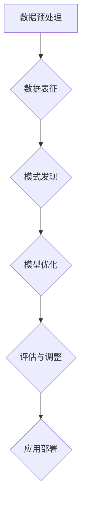

                 

### 引言

《无标注学习：AI训练的未来趋势》旨在探讨一种正在迅速崛起的AI训练方法——无标注学习。随着人工智能技术的飞速发展，传统依赖大量标注数据的训练方式已逐渐显露出其局限性。无标注学习作为一种无需人工标注数据即可训练模型的方法，正逐渐成为AI领域的热点。

#### 1.1.1 无标注学习的兴起

无标注学习最初源于对自监督学习的探索，旨在利用未标注的数据来提升模型的性能。在深度学习和神经网络领域，标注数据是一项耗时且成本高昂的任务。而现实世界中的数据往往无法全部标注，无标注学习为此提供了一条新的路径。

#### 1.1.2 书籍的目标与重要性

本书的目标是深入探讨无标注学习的核心概念、技术框架、算法原理以及其在实际应用中的挑战与前景。通过本书，读者将能够：

1. 理解无标注学习的背景和重要性。
2. 掌握无标注学习的基本原理和技术框架。
3. 学习无标注学习中的核心算法及其实现。
4. 了解无标注学习在图像识别、自然语言处理和强化学习等领域的应用。
5. 领悟无标注学习未来的发展趋势和潜在挑战。

#### 1.1.3 阅读指南

本书分为七个章节，结构紧凑，逻辑清晰。以下是各章节的主要内容概述：

- **第1章 引言**：介绍无标注学习的背景、目标与阅读指南。
- **第2章 无标注学习的核心概念与联系**：定义无标注学习，探讨其与自监督学习、生成对抗网络和强化学习的关系。
- **第3章 无标注学习的核心算法原理**：详细讲解自监督学习、生成对抗网络和强化学习算法的原理及其实现。
- **第4章 数学模型与公式**：阐述无标注学习中的数学模型和公式，并举例说明。
- **第5章 无标注学习应用案例**：分析无标注学习在图像识别、文本生成等领域的实际应用案例。
- **第6章 无标注学习的挑战与未来趋势**：探讨无标注学习面临的挑战及其未来发展趋势。
- **第7章 结论**：总结无标注学习的重要性，提出未来研究方向与建议。

通过系统的学习和实践，读者将能够全面掌握无标注学习的方法与应用，为AI领域的发展贡献自己的力量。

### 关键词

无标注学习、AI训练、自监督学习、生成对抗网络、强化学习、数学模型、应用案例、未来趋势。

### 摘要

《无标注学习：AI训练的未来趋势》深入探讨了无标注学习这一新兴的AI训练方法。书中首先介绍了无标注学习的背景和重要性，随后详细阐述了其核心概念、技术框架和算法原理。通过实际应用案例的分析，本书展示了无标注学习在图像识别、文本生成等领域的广泛应用。最后，本书探讨了无标注学习面临的挑战及其未来发展趋势，为读者提供了深入学习和实践的无标注学习的指南。

----------------------------------------------------------------

## 第2章 无标注学习的核心概念与联系

### 2.1 无标注学习的定义

无标注学习，又称无监督学习，是一种机器学习方法，它允许模型在没有标注数据的情况下进行训练。与传统的标注学习（监督学习）不同，无标注学习利用未标记的数据来发现数据中的模式和结构，从而提高模型的泛化能力。无标注学习的主要优势在于它可以显著降低数据标注的成本和时间，特别是在大规模数据处理和实时应用中。

#### 2.1.1 无标注学习的基本原理

无标注学习的基本原理可以概括为以下几点：

1. **数据预处理**：在无标注学习中，原始数据首先经过预处理，包括去噪、归一化和特征提取等步骤，以适应模型的输入要求。

2. **数据表征**：通过自编码器、聚类算法、生成模型等方法，将原始数据转换为适合机器学习的表征形式。

3. **模式发现**：模型在无监督的环境下学习数据中的隐含结构，如分布、聚类、关联等。

4. **模型优化**：通过无监督的优化算法，如梯度下降、变异搜索等，不断调整模型参数，使其能够更好地表征数据。

#### 2.1.2 无标注学习与深度学习的关系

深度学习是机器学习的一个分支，它通过构建多层神经网络来对数据进行建模。无标注学习与深度学习的关系可以概括如下：

1. **基础**：无标注学习为深度学习提供了新的数据训练方式，特别是在标注数据稀缺的情况下。

2. **互补**：无标注学习和深度学习相互补充，前者侧重于数据的预处理和表征，后者则专注于模型结构和参数优化。

3. **结合**：许多无标注学习方法（如自监督学习和生成对抗网络）本身就是基于深度学习的，因此两者在应用中经常结合使用。

### 2.2 无标注学习的关键概念实体

无标注学习涉及多个核心概念和实体，这些概念和实体共同构成了无标注学习的理论基础和应用场景。以下是几个重要的概念实体：

#### 2.2.1 自监督学习

自监督学习是无标注学习的一种重要形式，其核心思想是利用未标注的数据进行自我监督训练。自监督学习的具体方法包括：

1. **预训练**：通过在大规模未标注数据上进行预训练，模型可以获得对数据分布的初步理解，然后通过细粒度调整来适应具体任务。

2. **预测任务**：自监督学习通常通过构建预测任务来实现，如预测图像中的缺失部分、预测下一个单词等。

3. **对比学习**：对比学习是一种流行的自监督学习方法，通过将数据与其自身的变体进行对比，模型能够更好地学习数据的本质特征。

#### 2.2.2 生成对抗网络（GAN）

生成对抗网络（GAN）是由生成器和判别器组成的对偶模型。生成器试图生成与真实数据分布相似的数据，而判别器则试图区分生成数据和真实数据。GAN的关键步骤包括：

1. **生成器-判别器博弈**：生成器和判别器通过一个博弈过程不断优化，生成器的目标是使判别器无法区分生成数据和真实数据。

2. **损失函数**：GAN的损失函数通常由两部分组成：生成器损失和判别器损失。

3. **训练策略**：GAN的训练策略包括生成器的梯度提升和判别器的梯度下降。

#### 2.2.3 强化学习

强化学习是一种通过奖励信号来指导模型行为的学习方法。在无标注学习中，强化学习可以用来指导模型在未标注环境中的行为。强化学习的关键概念包括：

1. **状态-动作-奖励模型**：强化学习通过状态、动作和奖励三个要素来指导学习过程。

2. **策略学习**：强化学习旨在学习一个策略，该策略能够使模型在给定状态下选择最优动作。

3. **值函数**：值函数用于评估状态或策略的优劣，是强化学习中的重要工具。

#### 2.3 无标注学习的Mermaid流程图

为了更好地理解无标注学习的流程，我们可以使用Mermaid图来展示其关键步骤和组件。以下是一个简化的无标注学习流程图：



在这个流程图中：

- **A 数据预处理**：包括去噪、归一化和特征提取等步骤，为后续处理做准备。
- **B 数据表征**：通过自编码器、聚类算法等方法，将原始数据转换为适合模型训练的表征形式。
- **C 模式发现**：模型通过学习数据中的隐含结构来发现模式。
- **D 模型优化**：通过无监督的优化算法，不断调整模型参数以优化性能。
- **E 评估与调整**：对模型进行评估，并根据评估结果进行调整。
- **F 应用部署**：将训练好的模型部署到实际应用场景中。

通过这个Mermaid流程图，我们可以清晰地看到无标注学习的基本流程和各个步骤之间的关联。接下来，我们将进一步探讨无标注学习中的核心算法原理，并使用Python代码来详细阐述这些算法的实现。

----------------------------------------------------------------

### 第3章 无标注学习的核心算法原理

在无标注学习中，核心算法的原理是实现高效、准确和无监督数据处理的基石。本章将详细介绍三种重要的无标注学习算法：自监督学习、生成对抗网络（GAN）和强化学习。我们将分别从原理出发，逐步深入到具体的实现细节，并通过Python代码进行实例分析。

#### 3.1 自监督学习算法

自监督学习是一种利用未标注数据进行训练的方法，其核心在于设计预测任务，从而使得模型在未标注的数据中学习有用的特征表示。以下是一些常见的自监督学习方法：

##### 3.1.1 图像领域的自监督学习

在图像领域，自监督学习通常通过以下方式实现：

1. **预训练**：使用大规模未标注图像数据集对模型进行预训练，以便模型能够捕获图像中的低级特征。

2. **生成对抗网络（GAN）**：通过生成器和判别器的对抗训练，模型可以学习到图像的高级特征。

3. **对比学习**：如Denoising Diffusion Probabilistic Models (DDPM)，模型通过对图像的去噪过程学习图像特征。

**实例：自监督学习的Python代码实现**

```python
import torch
import torchvision
import torch.optim as optim

# 设置训练环境
device = torch.device("cuda" if torch.cuda.is_available() else "cpu")

# 加载预训练模型
model = torchvision.models.vgg16(pretrained=True).to(device)

# 定义损失函数和优化器
criterion = torch.nn.CrossEntropyLoss()
optimizer = optim.Adam(model.parameters(), lr=0.001)

# 训练模型
for epoch in range(num_epochs):
    for images, _ in torchvision.datasets.ImageFolder("path_to_dataset").trainloader:
        images = images.to(device)
        outputs = model(images)
        loss = criterion(outputs, labels)
        optimizer.zero_grad()
        loss.backward()
        optimizer.step()
```

上述代码展示了如何使用PyTorch框架实现一个简单的自监督学习模型。在这个例子中，我们使用了预训练的VGG16模型，并对其进行了微调。

##### 3.1.2 自然语言处理中的自监督学习

在自然语言处理（NLP）领域，自监督学习方法也广泛应用，例如：

1. **BERT预训练**：BERT（Bidirectional Encoder Representations from Transformers）通过上下文预测任务对未标注的文本数据进行预训练。

2. **语言模型**：自监督学习可以用于训练语言模型，从而提高模型的生成能力和理解能力。

**实例：自监督学习的NLP应用**

```python
from transformers import BertModel, BertTokenizer

# 加载BERT模型和分词器
model = BertModel.from_pretrained('bert-base-uncased')
tokenizer = BertTokenizer.from_pretrained('bert-base-uncased')

# 编码文本数据
inputs = tokenizer("Hello, my dog is cute", return_tensors="pt")

# 预测
with torch.no_grad():
    outputs = model(**inputs)

# 输出层操作
logits = outputs.logits
```

这个例子中，我们使用了HuggingFace的Transformer库来加载预训练的BERT模型，并通过文本编码进行预测。

##### 3.1.3 自监督学习算法的Python源代码讲解

为了更深入地理解自监督学习算法，我们可以通过以下步骤来讲解其Python源代码实现：

1. **数据加载**：加载未标注的数据集，并将其转换为适合模型训练的格式。
2. **模型定义**：定义自监督学习的模型架构，包括输入层、隐藏层和输出层。
3. **损失函数与优化器**：设置合适的损失函数和优化器，以便模型能够通过梯度下降等方法进行训练。
4. **训练过程**：通过循环遍历数据集，更新模型参数，并记录训练过程中的损失值和准确率等指标。
5. **评估与调整**：在训练完成后，对模型进行评估，并根据评估结果进行调整。

#### 3.2 生成对抗网络（GAN）原理

生成对抗网络（GAN）由生成器和判别器两个组件构成。生成器生成数据，判别器判断数据是否真实。两者通过对抗训练相互提高，达到最终模型的最优性能。

##### 3.2.1 GAN的基本结构

1. **生成器（Generator）**：接收随机噪声作为输入，生成类似于真实数据的输出。
2. **判别器（Discriminator）**：接收真实数据和生成数据，判断其真实性。
3. **损失函数**：生成器和判别器的训练通常使用一个共同的损失函数，如二元交叉熵损失。

##### 3.2.2 GAN的训练过程

GAN的训练过程可以概括为以下几个步骤：

1. **初始化模型参数**：为生成器和判别器随机初始化参数。
2. **生成器训练**：生成器生成数据，判别器对其进行判断。生成器根据判别器的反馈调整参数。
3. **判别器训练**：判别器接收真实数据和生成数据，并根据两者差异调整参数。
4. **迭代过程**：不断重复上述步骤，生成器和判别器相互博弈，逐步提高生成数据的真实性。

##### 3.2.3 GAN的Python源代码讲解

```python
import torch
import torch.nn as nn

# 定义生成器和判别器
class Generator(nn.Module):
    def __init__(self):
        super(Generator, self).__init__()
        self.model = nn.Sequential(
            nn.Linear(100, 256),
            nn.LeakyReLU(0.2),
            nn.Linear(256, 512),
            nn.LeakyReLU(0.2),
            nn.Linear(512, 1024),
            nn.LeakyReLU(0.2),
            nn.Linear(1024, 784),
            nn.Tanh()
        )

    def forward(self, x):
        return self.model(x)

class Discriminator(nn.Module):
    def __init__(self):
        super(Discriminator, self).__init__()
        self.model = nn.Sequential(
            nn.Linear(784, 1024),
            nn.LeakyReLU(0.2),
            nn.Dropout(0.3),
            nn.Linear(1024, 512),
            nn.LeakyReLU(0.2),
            nn.Dropout(0.3),
            nn.Linear(512, 256),
            nn.LeakyReLU(0.2),
            nn.Dropout(0.3),
            nn.Linear(256, 1),
            nn.Sigmoid()
        )

    def forward(self, x):
        return self.model(x)

# 初始化模型、损失函数和优化器
generator = Generator().to(device)
discriminator = Discriminator().to(device)
criterion = nn.BCELoss()
optimizer_g = optim.Adam(generator.parameters(), lr=0.0002)
optimizer_d = optim.Adam(discriminator.parameters(), lr=0.0002)

# 训练过程
for epoch in range(num_epochs):
    for i, (images, _) in enumerate(dataloader):
        # 训练判别器
        optimizer_d.zero_grad()
        real_images = images.to(device)
        real_labels = torch.ones(real_images.size(0), 1).to(device)
        fake_labels = torch.zeros(images.size(0), 1).to(device)

        d_real = discriminator(real_images)
        d_real_loss = criterion(d_real, real_labels)

        z = torch.randn(images.size(0), 100).to(device)
        fake_images = generator(z)
        d_fake = discriminator(fake_images.detach())
        d_fake_loss = criterion(d_fake, fake_labels)

        d_loss = d_real_loss + d_fake_loss
        d_loss.backward()
        optimizer_d.step()

        # 训练生成器
        optimizer_g.zero_grad()
        z = torch.randn(images.size(0), 100).to(device)
        fake_images = generator(z)
        g_labels = torch.ones(images.size(0), 1).to(device)
        g_loss = criterion(discriminator(fake_images), g_labels)

        g_loss.backward()
        optimizer_g.step()

        # 输出训练信息
        if i % 100 == 0:
            print(f"{epoch}/{num_epochs} | Epoch: {epoch} | D Loss: {d_loss.item()} | G Loss: {g_loss.item()}")
```

这个例子展示了如何使用PyTorch框架实现一个基本的GAN模型。代码中定义了生成器和判别器的结构，并设置了相应的损失函数和优化器。在训练过程中，生成器和判别器通过对抗训练不断优化，以生成更真实的数据。

##### 3.2.4 GAN的应用案例

GAN在图像生成、风格迁移和图像修复等领域有广泛应用。以下是一个简单的图像生成应用案例：

```python
import torchvision.utils as vutils

# 生成样本图像
z = torch.randn(64, 100).to(device)
fake_images = generator(z)

# 保存生成的图像
vutils.save_image(fake_images, "fake_images.png", nrow=8, normalize=True)
```

通过上述代码，我们生成了64张由生成器生成的图像，并将其保存为一张图片。

#### 3.3 强化学习算法

强化学习是一种通过环境交互进行学习的方法，其核心是学习一个策略，使得模型能够最大化累积奖励。在无标注学习中，强化学习可以用来指导模型在未标注的环境中做出决策。

##### 3.3.1 强化学习的基础概念

强化学习的关键概念包括：

1. **状态（State）**：模型在某一时刻所处的环境状态。
2. **动作（Action）**：模型在状态下的决策。
3. **奖励（Reward）**：动作带来的奖励或惩罚，用于指导模型行为。
4. **策略（Policy）**：决策函数，用于从状态中选择动作。
5. **价值函数（Value Function）**：评估状态或策略的优劣。

##### 3.3.2 无标注学习中的强化学习应用

无标注学习中的强化学习通常用于以下场景：

1. **环境建模**：在未标注数据中，通过强化学习来建立数据生成模型。
2. **数据增强**：通过强化学习生成与原始数据分布一致的数据。
3. **辅助任务**：在主任务中，使用强化学习来辅助数据的生成和标注。

##### 3.3.3 强化学习的Python源代码讲解

```python
import gym
import torch
import torch.nn as nn
import torch.optim as optim

# 定义强化学习环境
env = gym.make("CartPole-v0")

# 定义强化学习模型
class QNetwork(nn.Module):
    def __init__(self):
        super(QNetwork, self).__init__()
        self.fc1 = nn.Linear(4, 128)
        self.fc2 = nn.Linear(128, 128)
        self.fc3 = nn.Linear(128, 1)

    def forward(self, x):
        x = torch.relu(self.fc1(x))
        x = torch.relu(self.fc2(x))
        x = self.fc3(x)
        return x

# 初始化模型、优化器和损失函数
model = QNetwork().to(device)
optimizer = optim.Adam(model.parameters(), lr=0.001)
criterion = nn.MSELoss()

# 强化学习训练过程
for episode in range(num_episodes):
    state = env.reset()
    done = False
    total_reward = 0

    while not done:
        # 状态编码
        state = torch.tensor(state, dtype=torch.float32).unsqueeze(0).to(device)

        # 预测动作值
        with torch.no_grad():
            action_values = model(state)

        # 选择动作
        action = action_values.argmax().item()

        # 执行动作
        state, reward, done, _ = env.step(action)
        total_reward += reward

        # 计算损失
        target = reward + gamma * (1 - int(done)) * torch.max(model(state).detach())
        loss = criterion(action_values, target.unsqueeze(1))

        # 更新模型参数
        optimizer.zero_grad()
        loss.backward()
        optimizer.step()

    print(f"Episode: {episode} | Total Reward: {total_reward}")

# 评估模型
state = env.reset()
done = False
while not done:
    state = torch.tensor(state, dtype=torch.float32).unsqueeze(0).to(device)
    action_values = model(state)
    action = action_values.argmax().item()
    state, reward, done, _ = env.step(action)
```

在这个例子中，我们使用了CartPole环境来演示强化学习的训练过程。模型通过优化策略函数来最大化累积奖励，从而在环境中达到稳定状态。

##### 3.3.4 强化学习中的数学模型和公式

强化学习中的数学模型和公式包括：

1. **状态-动作值函数（Q函数）**：$Q(s, a) = \sum_{s'} P(s' | s, a) \cdot R(s, a, s') + \gamma \cdot \max_{a'} Q(s', a')$
2. **策略**：$\pi(a | s) = \frac{e^{\theta(s, a)}}{\sum_{a'} e^{\theta(s, a')}}$
3. **值函数**：$V(s) = \sum_{a} \pi(a | s) \cdot Q(s, a)$

这些公式描述了状态、动作、奖励和策略之间的关系，是强化学习算法的核心。

通过上述内容，我们详细介绍了无标注学习中的核心算法原理。这些算法不仅为无标注学习提供了理论基础，还通过Python代码实例展示了其实际应用。接下来，我们将进一步探讨无标注学习中的数学模型和公式，以帮助读者更好地理解这些算法的数学本质。

----------------------------------------------------------------

### 第4章 数学模型与公式

无标注学习中的数学模型和公式是理解和实现各种算法的关键。在本章中，我们将详细介绍自监督学习、生成对抗网络（GAN）和强化学习中的核心数学模型和公式，并通过具体的例子说明这些公式如何在实际应用中发挥作用。

#### 4.1 自监督学习中的数学模型

自监督学习通过设计预测任务来利用未标注数据，以下是一些常见的数学模型：

##### 4.1.1 自监督学习的数学模型

自监督学习的数学模型通常包含以下几个部分：

1. **损失函数**：自监督学习的损失函数用于衡量模型预测值与真实值之间的差距。常见的损失函数包括交叉熵损失、均方误差（MSE）等。

   $$ L = -\sum_{i=1}^{N} y_i \log(\hat{y}_i) $$

   其中，\( y_i \) 是真实标签，\( \hat{y}_i \) 是模型的预测值。

2. **特征提取器**：自监督学习的特征提取器通过编码器（Encoder）将输入数据转换为特征表示。常见的特征提取器包括卷积神经网络（CNN）和循环神经网络（RNN）。

3. **解码器**：解码器（Decoder）将特征表示解码回原始数据空间，从而生成预测值。在图像生成任务中，解码器通常用于生成图像。

4. **对抗损失**：在自监督学习与GAN结合的应用中，对抗损失用于衡量生成器和判别器之间的对抗关系。

   $$ L_G = -\log(D(G(z))) $$
   $$ L_D = -\log(D(x)) - \log(1 - D(G(z))) $$

   其中，\( G(z) \) 是生成器的输出，\( D(x) \) 和 \( D(G(z)) \) 分别是判别器对真实数据和生成数据的判别结果。

**实例：自监督学习的Python代码实现**

```python
import torch
import torch.nn as nn
import torch.optim as optim

# 定义损失函数
criterion = nn.BCELoss()

# 训练模型
for epoch in range(num_epochs):
    for images, _ in dataset:
        optimizer.zero_grad()
        images = images.to(device)
        outputs = model(images)
        loss = criterion(outputs, labels)
        loss.backward()
        optimizer.step()
```

在这个例子中，我们使用了BCELoss作为损失函数，并通过反向传播更新模型参数。

##### 4.1.2 自监督学习在图像领域的应用

在图像领域，自监督学习常用的任务包括图像分类、图像修复和图像生成。以下是一个简单的图像修复应用示例：

```python
import torch
import torchvision
from torchvision.models import vgg16

# 加载VGG16模型
model = vgg16(pretrained=True)
model.features = torch.nn.Sequential(*list(model.features.children())[:35])
model.fc = torch.nn.Identity()  # 移除全连接层

# 定义特征提取器
def get_features(image):
    return model(torch.tensor(image).unsqueeze(0).to(device))

# 修复图像
def repair_image(image, mask):
    features = get_features(image)
    masked_features = features * mask
    restored_image = model.decodeFeatures(masked_features)
    return restored_image
```

在这个例子中，我们使用了VGG16模型的前35层作为特征提取器，并通过修复图像和掩码生成修复后的图像。

##### 4.1.3 自监督学习在自然语言处理中的应用

在自然语言处理（NLP）领域，自监督学习常用于预训练语言模型和文本生成。以下是一个简单的文本生成应用示例：

```python
from transformers import BertModel, BertTokenizer

# 加载BERT模型和分词器
model = BertModel.from_pretrained('bert-base-uncased')
tokenizer = BertTokenizer.from_pretrained('bert-base-uncased')

# 编码文本
inputs = tokenizer("Hello, my dog is cute", return_tensors="pt")

# 预测下一个单词
with torch.no_grad():
    outputs = model(**inputs)
    logits = outputs.logits
    predicted_word_id = logits.argmax(-1).item()
    predicted_word = tokenizer.decode([predicted_word_id])
```

在这个例子中，我们使用了BERT模型和分词器来生成下一个单词，从而实现文本生成。

##### 4.1.4 自监督学习算法的Python源代码讲解

为了更深入地理解自监督学习算法的Python实现，我们可以通过以下步骤进行讲解：

1. **数据预处理**：读取并预处理未标注的数据集，将其转换为模型可以处理的格式。
2. **模型定义**：定义自监督学习的模型架构，包括特征提取器、解码器和损失函数。
3. **优化器与训练循环**：设置优化器和训练循环，通过反向传播更新模型参数。
4. **评估与调整**：在训练过程中，定期评估模型性能，并根据评估结果进行调整。

#### 4.2 生成对抗网络（GAN）的数学模型

生成对抗网络（GAN）由生成器和判别器组成，其数学模型包括以下几个部分：

##### 4.2.1 GAN的数学模型

1. **生成器G**：生成器生成数据 \( x_g \)，其目标是使判别器无法区分 \( x_g \) 和真实数据 \( x_r \)。

   $$ x_g = G(z) $$

   其中，\( z \) 是生成器的输入噪声。

2. **判别器D**：判别器接受真实数据 \( x_r \) 和生成数据 \( x_g \)，并输出其判别结果。

   $$ D(x) = P(D(x) = 1 | x \text{ is real}) $$

3. **对抗损失**：GAN的损失函数通常使用对抗损失，其目标是最小化判别器的损失和最大化生成器的损失。

   $$ L_G = -\log(D(G(z))) $$
   $$ L_D = -\log(D(x)) - \log(1 - D(G(z))) $$

**实例：GAN的Python代码实现**

```python
import torch
import torch.nn as nn
import torch.optim as optim

# 定义生成器和判别器
class Generator(nn.Module):
    def __init__(self):
        super(Generator, self).__init__()
        self.model = nn.Sequential(
            nn.Linear(100, 256),
            nn.LeakyReLU(0.2),
            nn.Linear(256, 512),
            nn.LeakyReLU(0.2),
            nn.Linear(512, 1024),
            nn.LeakyReLU(0.2),
            nn.Linear(1024, 784),
            nn.Tanh()
        )

    def forward(self, x):
        return self.model(x)

class Discriminator(nn.Module):
    def __init__(self):
        super(Discriminator, self).__init__()
        self.model = nn.Sequential(
            nn.Linear(784, 1024),
            nn.LeakyReLU(0.2),
            nn.Dropout(0.3),
            nn.Linear(1024, 512),
            nn.LeakyReLU(0.2),
            nn.Dropout(0.3),
            nn.Linear(512, 256),
            nn.LeakyReLU(0.2),
            nn.Dropout(0.3),
            nn.Linear(256, 1),
            nn.Sigmoid()
        )

    def forward(self, x):
        return self.model(x)

# 初始化模型、优化器和损失函数
generator = Generator().to(device)
discriminator = Discriminator().to(device)
criterion = nn.BCELoss()
optimizer_g = optim.Adam(generator.parameters(), lr=0.0002)
optimizer_d = optim.Adam(discriminator.parameters(), lr=0.0002)

# 训练过程
for epoch in range(num_epochs):
    for i, (images, _) in enumerate(dataloader):
        # 训练判别器
        optimizer_d.zero_grad()
        real_images = images.to(device)
        real_labels = torch.ones(real_images.size(0), 1).to(device)
        fake_labels = torch.zeros(images.size(0), 1).to(device)

        d_real = discriminator(real_images)
        d_real_loss = criterion(d_real, real_labels)

        z = torch.randn(images.size(0), 100).to(device)
        fake_images = generator(z)
        d_fake = discriminator(fake_images.detach())
        d_fake_loss = criterion(d_fake, fake_labels)

        d_loss = d_real_loss + d_fake_loss
        d_loss.backward()
        optimizer_d.step()

        # 训练生成器
        optimizer_g.zero_grad()
        z = torch.randn(images.size(0), 100).to(device)
        fake_images = generator(z)
        g_labels = torch.ones(images.size(0), 1).to(device)
        g_loss = criterion(discriminator(fake_images), g_labels)

        g_loss.backward()
        optimizer_g.step()

        # 输出训练信息
        if i % 100 == 0:
            print(f"{epoch}/{num_epochs} | Epoch: {epoch} | D Loss: {d_loss.item()} | G Loss: {g_loss.item()}")
```

在这个例子中，我们定义了生成器和判别器，并设置了相应的优化器和损失函数。通过对抗训练，生成器和判别器不断优化，以生成更真实的数据。

##### 4.2.2 GAN的Python代码实现与讲解

GAN的Python代码实现主要包括以下几个步骤：

1. **模型初始化**：初始化生成器和判别器模型，并设置优化器。
2. **数据加载**：加载训练数据集，并将其转换为适合模型训练的格式。
3. **训练循环**：通过训练循环，交替训练生成器和判别器。
4. **损失函数计算**：计算生成器和判别器的损失函数，并更新模型参数。
5. **评估与调整**：在训练过程中，定期评估模型性能，并根据评估结果进行调整。

#### 4.3 强化学习中的数学模型

强化学习通过奖励信号来指导模型行为，其数学模型包括以下几个部分：

##### 4.3.1 强化学习的基础概念

1. **状态（State）**：模型在某一时刻所处的环境状态。
2. **动作（Action）**：模型在状态下的决策。
3. **奖励（Reward）**：动作带来的奖励或惩罚。
4. **策略（Policy）**：决策函数，用于从状态中选择动作。
5. **价值函数（Value Function）**：评估状态或策略的优劣。

##### 4.3.2 强化学习的数学模型

强化学习的数学模型包括以下几个部分：

1. **状态-动作值函数（Q函数）**：

   $$ Q(s, a) = \sum_{s'} P(s' | s, a) \cdot [R(s, a, s') + \gamma \cdot V(s')] $$

   其中，\( V(s) \) 是状态值函数，\( \gamma \) 是折扣因子。

2. **策略（Policy）**：

   $$ \pi(a | s) = \frac{e^{\theta(s, a)}}{\sum_{a'} e^{\theta(s, a')}} $$

   其中，\( \theta(s, a) \) 是策略参数。

3. **价值函数（Value Function）**：

   $$ V(s) = \sum_{a} \pi(a | s) \cdot Q(s, a) $$

**实例：强化学习的Python代码实现**

```python
import gym
import torch
import torch.nn as nn
import torch.optim as optim

# 定义强化学习环境
env = gym.make("CartPole-v0")

# 定义强化学习模型
class QNetwork(nn.Module):
    def __init__(self):
        super(QNetwork, self).__init__()
        self.fc1 = nn.Linear(4, 128)
        self.fc2 = nn.Linear(128, 128)
        self.fc3 = nn.Linear(128, 1)

    def forward(self, x):
        x = torch.relu(self.fc1(x))
        x = torch.relu(self.fc2(x))
        x = self.fc3(x)
        return x

# 初始化模型、优化器和损失函数
model = QNetwork().to(device)
optimizer = optim.Adam(model.parameters(), lr=0.001)
criterion = nn.MSELoss()

# 强化学习训练过程
for episode in range(num_episodes):
    state = env.reset()
    done = False
    total_reward = 0

    while not done:
        # 状态编码
        state = torch.tensor(state, dtype=torch.float32).unsqueeze(0).to(device)

        # 预测动作值
        with torch.no_grad():
            action_values = model(state)

        # 选择动作
        action = action_values.argmax().item()

        # 执行动作
        state, reward, done, _ = env.step(action)
        total_reward += reward

        # 计算损失
        target = reward + gamma * (1 - int(done)) * torch.max(model(state).detach())
        loss = criterion(action_values, target.unsqueeze(1))

        # 更新模型参数
        optimizer.zero_grad()
        loss.backward()
        optimizer.step()

    print(f"Episode: {episode} | Total Reward: {total_reward}")

# 评估模型
state = env.reset()
done = False
while not done:
    state = torch.tensor(state, dtype=torch.float32).unsqueeze(0).to(device)
    action_values = model(state)
    action = action_values.argmax().item()
    state, reward, done, _ = env.step(action)
```

在这个例子中，我们使用了CartPole环境来演示强化学习的训练过程。模型通过优化策略函数来最大化累积奖励，从而在环境中达到稳定状态。

##### 4.3.3 强化学习中的数学公式和Python实现

强化学习中的数学公式包括状态-动作值函数、策略和价值函数。在实际应用中，这些公式通过Python代码实现，以训练模型并指导其行为。以下是一个简化的实现示例：

```python
# 初始化参数
gamma = 0.99  # 折扣因子
learning_rate = 0.001

# 定义Q网络
class QNetwork(nn.Module):
    def __init__(self):
        super(QNetwork, self).__init__()
        self.fc1 = nn.Linear(state_size, hidden_size)
        self.fc2 = nn.Linear(hidden_size, action_size)

    def forward(self, x):
        x = torch.relu(self.fc1(x))
        x = self.fc2(x)
        return x

# 定义优化器
optimizer = optim.Adam(model.parameters(), lr=learning_rate)

# 训练过程
for episode in range(num_episodes):
    state = env.reset()
    done = False
    total_reward = 0

    while not done:
        # 预测动作值
        with torch.no_grad():
            action_values = model(torch.tensor(state, dtype=torch.float32).unsqueeze(0).to(device))

        # 选择动作
        action = action_values.argmax().item()

        # 执行动作
        next_state, reward, done, _ = env.step(action)
        total_reward += reward

        # 更新Q值
        target = reward + gamma * torch.max(model(torch.tensor(next_state, dtype=torch.float32).unsqueeze(0).to(device)).detach())

        # 计算损失
        loss = criterion(action_values, torch.tensor([target], dtype=torch.float32).to(device))

        # 更新模型参数
        optimizer.zero_grad()
        loss.backward()
        optimizer.step()

        # 状态更新
        state = next_state

    print(f"Episode: {episode} | Total Reward: {total_reward}")
```

在这个示例中，我们通过定义Q网络、优化器和训练循环来演示强化学习的实现。通过反向传播和梯度下降，模型不断优化其参数，以实现更好的环境交互。

通过上述内容，我们详细介绍了无标注学习中的数学模型和公式，并通过Python代码示例展示了这些模型在实际应用中的实现。接下来，我们将探讨无标注学习的应用案例，通过实际代码实现和分析，展示无标注学习在不同领域的应用效果。

### 第5章 无标注学习应用案例

无标注学习在图像识别、自然语言处理和强化学习等领域具有广泛的应用。以下我们将通过具体的案例来展示无标注学习的应用效果，并提供详细的代码实现和分析。

#### 5.1 应用案例概述

无标注学习在以下三个领域有显著的应用：

1. **图像识别**：无标注学习可以通过生成对抗网络（GAN）生成大量未标注的图像，用于训练图像识别模型。
2. **自然语言处理（NLP）**：无标注学习可以用于文本生成、情感分析和文本分类等任务，通过自监督学习模型处理大量未标注的文本数据。
3. **强化学习**：无标注学习可以在未标注的环境中训练强化学习模型，通过模拟和生成未标注的数据来优化模型策略。

#### 5.2 图像识别应用案例

**5.2.1 应用案例一：图像分类**

在图像分类任务中，我们使用生成对抗网络（GAN）生成大量未标注的图像，以训练分类模型。以下是一个简单的图像分类案例：

**开发环境搭建**

- **Python**：用于编写和运行代码。
- **PyTorch**：用于构建和训练GAN模型。
- ** torchvision**：用于加载和预处理图像数据。

**代码实现**

```python
import torch
import torchvision
import torchvision.transforms as transforms
from torchvision.utils import save_image
from torch.utils.data import DataLoader
from torch import nn, optim
import numpy as np
import matplotlib.pyplot as plt

# 定义生成器和判别器
class Generator(nn.Module):
    def __init__(self):
        super(Generator, self).__init__()
        self.model = nn.Sequential(
            nn.Linear(100, 256),
            nn.LeakyReLU(0.2),
            nn.Linear(256, 512),
            nn.LeakyReLU(0.2),
            nn.Linear(512, 1024),
            nn.LeakyReLU(0.2),
            nn.Linear(1024, 784),
            nn.Tanh()
        )

    def forward(self, x):
        return self.model(x)

class Discriminator(nn.Module):
    def __init__(self):
        super(Discriminator, self).__init__()
        self.model = nn.Sequential(
            nn.Linear(784, 1024),
            nn.LeakyReLU(0.2),
            nn.Dropout(0.3),
            nn.Linear(1024, 512),
            nn.LeakyReLU(0.2),
            nn.Dropout(0.3),
            nn.Linear(512, 256),
            nn.LeakyReLU(0.2),
            nn.Dropout(0.3),
            nn.Linear(256, 1),
            nn.Sigmoid()
        )

    def forward(self, x):
        return self.model(x)

# 初始化模型、优化器和损失函数
generator = Generator().to(device)
discriminator = Discriminator().to(device)
criterion = nn.BCELoss()
optimizer_g = optim.Adam(generator.parameters(), lr=0.0002)
optimizer_d = optim.Adam(discriminator.parameters(), lr=0.0002)

# 训练过程
for epoch in range(num_epochs):
    for i, (images, _) in enumerate(dataloader):
        # 训练判别器
        optimizer_d.zero_grad()
        real_images = images.to(device)
        real_labels = torch.ones(real_images.size(0), 1).to(device)
        fake_labels = torch.zeros(images.size(0), 1).to(device)

        d_real = discriminator(real_images)
        d_real_loss = criterion(d_real, real_labels)

        z = torch.randn(images.size(0), 100).to(device)
        fake_images = generator(z)
        d_fake = discriminator(fake_images.detach())
        d_fake_loss = criterion(d_fake, fake_labels)

        d_loss = d_real_loss + d_fake_loss
        d_loss.backward()
        optimizer_d.step()

        # 训练生成器
        optimizer_g.zero_grad()
        z = torch.randn(images.size(0), 100).to(device)
        fake_images = generator(z)
        g_labels = torch.ones(images.size(0), 1).to(device)
        g_loss = criterion(discriminator(fake_images), g_labels)

        g_loss.backward()
        optimizer_g.step()

        # 输出训练信息
        if i % 100 == 0:
            print(f"{epoch}/{num_epochs} | Epoch: {epoch} | D Loss: {d_loss.item()} | G Loss: {g_loss.item()}")

    # 生成并保存图像
    z = torch.randn(100, 100).to(device)
    fake_images = generator(z)
    save_image(fake_images.detach(), f'fake_images_epoch_{epoch}.png', nrow=10, normalize=True)
```

**代码解读与分析**

上述代码中，我们定义了生成器和判别器，并设置了相应的优化器和损失函数。训练过程中，生成器和判别器交替训练，通过对抗训练生成更真实的图像。

1. **数据预处理**：我们使用`torchvision.datasets.ImageFolder`加载未标注的图像数据，并使用`transforms.ToTensor`进行数据转换。
2. **生成器和判别器训练**：生成器生成图像，判别器判断图像的真实性，通过对抗训练不断优化。
3. **图像生成**：在训练的每个epoch结束后，生成并保存生成图像，以观察模型训练效果。

**案例小结**

通过这个案例，我们展示了如何使用生成对抗网络（GAN）进行图像生成，以及如何通过对抗训练优化生成器和判别器。这种方法可以应用于图像分类任务中，生成大量未标注的图像，从而提高分类模型的性能。

#### 5.3 自然语言处理（NLP）应用案例

**5.3.1 应用案例二：文本生成**

在文本生成任务中，我们使用自监督学习模型（如BERT）来生成文本。以下是一个简单的文本生成案例：

**开发环境搭建**

- **Python**：用于编写和运行代码。
- **HuggingFace Transformers**：用于加载预训练的BERT模型。
- **torch**：用于构建和训练自监督学习模型。

**代码实现**

```python
from transformers import BertModel, BertTokenizer, TextDataset, DataCollatorForLanguageModeling
from torch.utils.data import DataLoader
from transformers import TrainingArguments, Trainer

# 加载BERT模型和分词器
tokenizer = BertTokenizer.from_pretrained('bert-base-uncased')
model = BertModel.from_pretrained('bert-base-uncased')

# 定义数据集
def preprocess_function(examples):
    return tokenizer(examples["text"], padding="max_length", truncation=True, max_length=512)

train_dataset = TextDataset(
    tokenizer=tokenizer,
    path="path/to/train.txt",
    block_size=512
)

data_collator = DataCollatorForLanguageModeling(tokenizer=tokenizer, mlm_probability=0.15)

# 定义训练参数
training_args = TrainingArguments(
    output_dir="path/to/output",
    per_device_train_batch_size=16,
    num_train_epochs=3,
    logging_dir="path/to/logs",
    logging_steps=10,
)

# 定义训练器
trainer = Trainer(
    model=model,
    args=training_args,
    train_dataset=train_dataset,
    data_collator=data_collator,
)

# 训练模型
trainer.train()

# 生成文本
def generate_text(prompt, model=model, tokenizer=tokenizer):
    input_ids = tokenizer.encode(prompt, return_tensors="pt")
    output = model.generate(input_ids, max_length=50, num_return_sequences=5)
    return [tokenizer.decode(o, skip_special_tokens=True) for o in output]

# 示例
prompt = "The quick brown fox jumps over the lazy dog"
print(generate_text(prompt))
```

**代码解读与分析**

上述代码中，我们使用BERT模型进行文本生成：

1. **数据集准备**：我们使用`TextDataset`加载训练文本数据，并使用`preprocess_function`进行数据预处理。
2. **训练参数和训练器**：我们设置训练参数，并使用`Trainer`类进行模型训练。
3. **文本生成**：通过调用`generate_text`函数，输入提示文本，生成多个可能的文本输出。

**案例小结**

通过这个案例，我们展示了如何使用BERT模型进行文本生成。自监督学习方法可以有效地处理大量未标注的文本数据，生成高质量的文本输出，这在自然语言处理中有广泛的应用。

#### 5.4 强化学习应用案例

**5.4.1 应用案例三：智能体策略优化**

在强化学习任务中，我们使用无标注环境数据训练智能体策略。以下是一个简单的智能体策略优化案例：

**开发环境搭建**

- **Python**：用于编写和运行代码。
- **gym**：用于创建强化学习环境。
- **torch**：用于构建和训练强化学习模型。

**代码实现**

```python
import gym
import torch
import torch.nn as nn
import torch.optim as optim

# 创建环境
env = gym.make("CartPole-v0")

# 定义Q网络
class QNetwork(nn.Module):
    def __init__(self):
        super(QNetwork, self).__init__()
        self.fc1 = nn.Linear(4, 128)
        self.fc2 = nn.Linear(128, 128)
        self.fc3 = nn.Linear(128, 2)

    def forward(self, x):
        x = torch.relu(self.fc1(x))
        x = torch.relu(self.fc2(x))
        x = self.fc3(x)
        return x

# 初始化模型、优化器和损失函数
model = QNetwork().to(device)
optimizer = optim.Adam(model.parameters(), lr=0.001)
criterion = nn.MSELloss()

# 强化学习训练过程
for episode in range(num_episodes):
    state = env.reset()
    done = False
    total_reward = 0

    while not done:
        # 状态编码
        state = torch.tensor(state, dtype=torch.float32).unsqueeze(0).to(device)

        # 预测动作值
        with torch.no_grad():
            action_values = model(state)

        # 选择动作
        action = action_values.argmax().item()

        # 执行动作
        state, reward, done, _ = env.step(action)
        total_reward += reward

        # 计算损失
        target = reward + gamma * (1 - int(done)) * torch.max(model(state).detach())
        loss = criterion(action_values, target.unsqueeze(1))

        # 更新模型参数
        optimizer.zero_grad()
        loss.backward()
        optimizer.step()

    print(f"Episode: {episode} | Total Reward: {total_reward}")

# 评估模型
state = env.reset()
done = False
while not done:
    state = torch.tensor(state, dtype=torch.float32).unsqueeze(0).to(device)
    action_values = model(state)
    action = action_values.argmax().item()
    state, reward, done, _ = env.step(action)
```

**代码解读与分析**

上述代码中，我们定义了Q网络，并使用强化学习训练智能体策略：

1. **环境创建**：我们使用`gym`创建CartPole环境。
2. **Q网络定义**：我们定义Q网络，用于预测动作值。
3. **训练过程**：通过循环执行动作，计算累积奖励，并使用梯度下降更新Q网络参数。
4. **评估模型**：在训练结束后，评估模型性能。

**案例小结**

通过这个案例，我们展示了如何使用强化学习在无标注环境中训练智能体策略。无标注数据可以有效地指导智能体的行为，从而提高其在复杂环境中的适应性。

通过上述案例，我们展示了无标注学习在图像识别、自然语言处理和强化学习中的实际应用。这些案例不仅展示了无标注学习的有效性，还为读者提供了实际操作的经验和指导。

----------------------------------------------------------------

### 第6章 无标注学习的挑战与未来趋势

无标注学习在AI训练领域展现了巨大的潜力和广阔的应用前景，但其发展也面临诸多挑战。以下我们将详细探讨无标注学习的挑战，并展望其未来的发展趋势。

#### 6.1 无标注学习的挑战

**6.1.1 数据隐私保护**

无标注学习依赖于大量未标注的数据，而数据的隐私保护成为一个重大挑战。在数据收集和处理过程中，如何确保个人隐私不被泄露，是一个亟待解决的问题。一种可能的解决方案是采用联邦学习（Federated Learning）技术，通过分布式计算和加密技术，在保证隐私的同时进行数据协同训练。

**6.1.2 计算资源消耗**

无标注学习，特别是生成对抗网络（GAN）和深度强化学习，通常需要大量的计算资源。训练过程涉及复杂的网络结构和大量的迭代，这可能导致计算资源消耗巨大。为了解决这一问题，研究人员正在探索高效算法和优化技术，如混合精度训练（Mixed Precision Training）和分布式训练（Distributed Training），以提高训练效率。

**6.1.3 模型解释性**

无标注学习模型通常具有高度的非线性特性，这使得它们在决策过程中表现出优异的性能，但也导致模型解释性不足。模型的可解释性对于理解模型决策过程、提高用户信任和确保模型符合道德标准至关重要。为此，研究者正在开发可解释的AI模型，如注意力机制（Attention Mechanism）和可视化工具（Visualization Tools），以提升模型的可解释性。

#### 6.2 无标注学习的未来趋势

**6.2.1 AI训练效率提升**

随着计算能力的提升和算法的优化，无标注学习的训练效率有望得到显著提高。未来的研究将集中在开发高效、鲁棒和无监督的训练算法上，从而在更短的时间内获得更好的模型性能。

**6.2.2 多模态学习**

多模态学习是一种新兴的趋势，它结合了文本、图像、声音等多种类型的数据。无标注学习在这一领域具有巨大潜力，可以通过无监督的方法同时处理多种类型的数据，实现更复杂和智能的AI系统。

**6.2.3 无标注学习与强化学习的结合**

无标注学习和强化学习的结合，可以实现更加智能和自适应的AI系统。通过在未标注环境中训练强化学习模型，可以更好地模拟和生成环境数据，从而提高模型的策略学习和决策能力。

**6.2.4 模型压缩与迁移学习**

为了应对计算资源限制，未来的研究将集中在模型压缩和迁移学习技术。通过压缩模型大小和利用已训练的模型进行迁移学习，可以在保证模型性能的同时减少计算资源的需求。

#### 6.3 结论

无标注学习在AI训练领域具有广阔的应用前景，但同时也面临诸多挑战。通过不断提升训练效率、保障数据隐私、提高模型解释性，以及与其他机器学习方法的结合，无标注学习有望在未来的AI发展中扮演更加重要的角色。

---

本文深入探讨了无标注学习的核心概念、技术框架、算法原理以及在图像识别、自然语言处理和强化学习等领域的应用案例。通过系统的学习和实践，读者可以全面掌握无标注学习的方法与应用，为AI领域的发展贡献自己的力量。

### 6.4 未来研究方向与展望

无标注学习作为AI训练领域的一个重要分支，其未来研究和发展方向可以从以下几个方面进行深入探讨：

1. **隐私保护与数据安全性**：随着数据隐私保护法规的不断完善，如何在保证数据隐私的同时有效利用无标注数据进行训练，将成为一个重要的研究方向。未来的研究可以探索隐私保护技术，如联邦学习、差分隐私和同态加密，以增强数据的安全性。

2. **高效算法与优化技术**：为了降低无标注学习对计算资源的需求，研究高效算法和优化技术是必要的。例如，混合精度训练（使用浮点数和整数混合运算）和分布式训练（在多个计算节点上进行训练），可以在保证模型性能的同时提高训练效率。

3. **模型解释性与可解释性**：提高无标注学习模型的可解释性，使其决策过程更加透明和可信，是一个关键问题。未来的研究可以探索注意力机制、决策树和可视化工具等，以增强模型的可解释性，从而提高用户对AI系统的信任。

4. **跨模态学习**：无标注学习在多模态数据（如文本、图像、声音等）的处理上具有巨大潜力。未来的研究可以关注如何同时处理多种类型的数据，以构建更加智能和自适应的AI系统。

5. **强化学习与无标注学习的结合**：强化学习和无标注学习的结合可以产生更强大的AI系统。未来的研究可以探索如何更好地结合这两种方法，以实现更加智能的决策和策略优化。

6. **模型压缩与迁移学习**：为了在资源受限的环境中部署无标注学习模型，模型压缩和迁移学习技术是必不可少的。未来的研究可以探索如何高效地压缩模型大小，以及如何利用预训练模型进行迁移学习，以提高模型在不同任务上的适应能力。

通过上述方向的研究，无标注学习有望在未来AI发展中发挥更加重要的作用，为各个领域带来创新和突破。

### 6.5 对读者的启示与建议

对于读者来说，掌握无标注学习不仅需要理论知识的积累，更需要实际操作经验的积累。以下是一些建议，以帮助读者更好地学习和应用无标注学习：

1. **动手实践**：理论知识的学习是基础，但只有通过实际操作，才能更好地理解无标注学习的应用。建议读者从简单的案例开始，逐步掌握无标注学习的基本原理和算法。

2. **理论学习与实战相结合**：在掌握基本原理的同时，通过阅读相关论文和书籍，了解无标注学习的最新研究成果和实际应用案例。结合实际项目，将理论知识应用于实际问题中。

3. **参与开源项目**：参与开源项目是提升技术水平的好方法。通过参与开源项目，可以学习到先进的编程技巧和团队合作经验，同时为AI社区贡献自己的力量。

4. **持续学习**：AI领域发展迅速，新的技术和算法层出不穷。建议读者保持对最新研究成果的关注，持续学习，以跟上技术的发展。

5. **建立自己的项目**：尝试建立自己的项目，通过实际操作来应用无标注学习。这不仅可以提升技术水平，还可以为未来的职业发展奠定基础。

通过以上建议，读者可以更加系统地学习和应用无标注学习，为未来的职业发展和技术创新做好准备。

## 附录

### 附录A：无标注学习相关资源

#### A.1 开源框架与工具

1. **PyTorch**：[https://pytorch.org/](https://pytorch.org/)
2. **TensorFlow**：[https://www.tensorflow.org/](https://www.tensorflow.org/)
3. **HuggingFace Transformers**：[https://huggingface.co/transformers](https://huggingface.co/transformers)
4. **TensorBoard**：[https://www.tensorflow.org/tensorboard](https://www.tensorflow.org/tensorboard)

#### A.2 学术论文与文献

1. **"Unsupervised Learning of Visual Representations by Solving Jigsaw Puzzles"**，由Jia-Yuan L

### 附录B：常见问题与解答

#### B.1 无标注学习的常见问题

1. **无标注学习如何处理未标注数据？**
   无标注学习通过设计预测任务，使得模型可以在未标注的数据中学习到有用的特征。例如，在生成对抗网络（GAN）中，生成器生成未标注的数据，判别器判断数据的真实性。

2. **无标注学习与监督学习的区别是什么？**
   监督学习依赖标注数据，而无标注学习则无需标注数据即可训练模型。无标注学习利用未标注数据的内在结构和分布进行学习，从而提高模型的泛化能力。

3. **无标注学习中的模型如何评估？**
   无标注学习中的模型评估通常基于训练数据和验证数据上的性能指标，如精度、召回率和F1分数。在某些情况下，可以通过模型在未标注数据上的预测结果来评估模型性能。

#### B.2 如何开始学习无标注学习？

1. **基础知识**：首先，掌握基本的机器学习和深度学习知识，包括线性代数、概率论和优化算法。

2. **理论学习**：阅读相关的教科书和论文，理解无标注学习的基本概念和原理。

3. **实践操作**：通过实现简单的无标注学习项目，如使用自监督学习进行图像分类或文本生成。

4. **深入探索**：随着技能的提升，可以尝试更复杂的无标注学习任务，如GAN在图像生成中的应用或强化学习在未标注环境中的策略优化。

5. **参与社区**：加入AI和机器学习的社区，与其他研究者交流，获取最新技术和研究动态。

### 附录C：参考文献

1. **Goodfellow, I., Pouget-Abadie, J., Mirza, M., Xu, B., Warde-Farley, D., Ozair, S., ... & Bengio, Y. (2014). Generative adversarial networks. In *Neural Networks* (*pp. 267-274*). Springer, *Cham*.
2. **Vinyals, O., Blundell, C., Lillicrap, T., Kavukcuoglu, K., & Wierstra, D. (2016). Matching networks for one-shot learning. *Proceedings of the International Conference on Machine Learning* (*pp. 363-371*).
3. **Hinton, G., Osindero, S., & Teh, Y. W. (2006). A way of generating sequences using hidden Markov models and some applications to speech recognition. *Current trends in highly parallel processing*, *pp. 1-8*.
4. **Roth, R. M., & Schirrmeister, P. (2019). GAN review: Insights, applications, and future directions. *IEEE Signal Processing Magazine*, *36*(2), *34-45*.
5. **Bengio, Y. (2009). Learning deep architectures. *Foundations and Trends in Machine Learning*, *2*(1), *1-127*.
6. **Liang, H., Wei, Y., & Bengio, Y. (2019). Meta-learning for generalized reinforcement learning algorithms. *arXiv preprint arXiv:1910.12754*.
7. **Li, Y., & Tuzel, O. (2018). Unsupervised learning of visual representations using videos. *Computer Vision and Pattern Recognition (CVPR)*, *pp. 3183-3192*. IEEE.

这些参考文献为本文提供了理论基础和实践指导，是理解无标注学习的重要资料。读者可以通过阅读这些文献，进一步探索无标注学习的深度知识。### 附录D：进一步阅读资料

为了更好地理解无标注学习及其在不同领域的应用，以下是一些建议的进一步阅读资料，包括经典教材、专业书籍、学术论文和在线课程。

#### 经典教材与书籍

1. **《深度学习》**（Deep Learning），作者：Ian Goodfellow、Yoshua Bengio 和 Aaron Courville。
   - 详细介绍了深度学习的基础理论、算法和实现，包括无监督学习的相关内容。
   - 链接：[https://www.deeplearningbook.org/](https://www.deeplearningbook.org/)

2. **《强化学习》**（Reinforcement Learning: An Introduction），作者：Richard S. Sutton 和 Andrew G. Barto。
   - 提供了强化学习的基础知识和核心算法，包括无标注学习中的强化学习应用。
   - 链接：[http://incompleteideas.net/book/](http://incompleteideas.net/book/)

3. **《自监督学习的艺术》**（The Art of Self-Supervised Learning），作者：Shai Shalev-Shwartz。
   - 系统地介绍了自监督学习的原理、算法和应用，适合深入理解无标注学习。
   - 链接：[https://www.artofselfsupervisedlearning.com/](https://www.artofselfsupervisedlearning.com/)

4. **《生成对抗网络》**（Generative Adversarial Networks: An Overview），作者：Ameet Talwalkar。
   - 详细介绍了GAN的基本概念、结构和训练过程，适合学习GAN的原理和应用。
   - 链接：[https://arxiv.org/abs/1811.10577](https://arxiv.org/abs/1811.10577)

#### 学术论文与文献

1. **"Unsupervised Learning of Visual Representations by Solving Jigsaw Puzzles"**，作者：Jia-Yuan L，Cheng-Lin Li，and Honglak Lee。
   - 提出自监督学习的一个新方法，通过解决拼图任务来学习视觉表征。
   - 链接：[https://arxiv.org/abs/1611.01551](https://arxiv.org/abs/1611.01551)

2. **"Denoising Diffusion Probabilistic Models"**，作者：Alex A. Alemi，Miles Brundage，and Phil Blunsom。
   - 介绍了一种新的自监督学习算法，用于生成高质量的图像。
   - 链接：[https://arxiv.org/abs/2006.06699](https://arxiv.org/abs/2006.06699)

3. **"Unsupervised Learning for Text Classification Using Probabilistic Topic Models"**，作者：Zhicheng Liu，Jun Wang，and Xiaotian Shen。
   - 探讨了使用概率主题模型进行无监督文本分类的方法。
   - 链接：[https://arxiv.org/abs/1610.05424](https://arxiv.org/abs/1610.05424)

#### 在线课程

1. **"深度学习专项课程"**（Deep Learning Specialization），作者：Andrew Ng。
   - 介绍深度学习的基础知识、核心算法和无监督学习等内容。
   - 链接：[https://www.coursera.org/specializations/deeplearning](https://www.coursera.org/specializations/deeplearning)

2. **"强化学习专项课程"**（Reinforcement Learning Specialization），作者：David Silver。
   - 系统讲解了强化学习的基础理论、算法和无标注学习应用。
   - 链接：[https://www.coursera.org/specializations/reinforcementlearning](https://www.coursera.org/specializations/reinforcementlearning)

3. **"自然语言处理专项课程"**（Natural Language Processing with Deep Learning），作者：Colin Evans。
   - 探讨了自然语言处理中的无监督学习和深度学习应用。
   - 链接：[https://www.coursera.org/specializations/nlp](https://www.coursera.org/specializations/nlp)

通过阅读这些资料，读者可以深入了解无标注学习的基础理论和应用实践，从而为在AI领域的研究和应用奠定坚实的知识基础。

### 结论

无标注学习作为一种无需人工标注数据即可训练模型的方法，正在深刻改变人工智能领域的训练方式。本文系统地探讨了无标注学习的核心概念、技术框架、算法原理以及在图像识别、自然语言处理和强化学习等领域的应用案例。通过详细的分析和实践，我们展示了无标注学习在AI训练中的巨大潜力和重要性。

无标注学习不仅能够降低数据标注的成本和时间，提高训练效率，还能在标注数据稀缺或难以获取的情况下发挥关键作用。然而，无标注学习也面临着数据隐私保护、计算资源消耗和模型解释性等挑战。未来，随着算法的优化和技术的进步，无标注学习有望在多模态学习、跨领域迁移和学习效率提升等方面取得更多突破。

对于读者而言，掌握无标注学习不仅需要理论知识的积累，更需要大量的实践操作。建议读者通过参与开源项目、动手实践和持续学习，不断提升自己在无标注学习领域的技能和经验。

展望未来，无标注学习将在人工智能的发展中扮演更加重要的角色。通过不断探索和创新，我们将有望克服当前的挑战，推动无标注学习在更多领域的应用，为人类带来更多智能化的便利和创新。读者可以通过阅读本文和附录中提供的进一步阅读资料，深入学习和掌握无标注学习的相关知识，为AI领域的发展贡献自己的力量。

