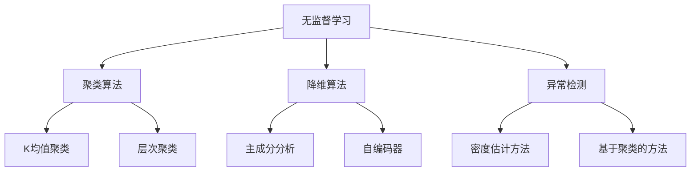

                 


# 无监督学习在推理任务优化中的应用

> 关键词：无监督学习、推理任务优化、聚类算法、降维算法、异常检测、自然语言处理、知识图谱

> 摘要：本文主要探讨无监督学习在推理任务优化中的应用。通过分析无监督学习的核心概念和方法，结合自然语言处理和知识图谱等实际应用场景，阐述如何利用无监督学习优化推理任务，提高模型性能和推理效率。

## 第1章 引言

### 1.1 无监督学习的概念

无监督学习（Unsupervised Learning）是机器学习的一个重要分支，其特点是不依赖标签数据进行训练。在无监督学习中，模型通过分析数据之间的内在结构和关系来提取特征和模式。与监督学习（Supervised Learning）相比，无监督学习不需要预先标注的数据集，因此具有更高的灵活性和广泛的应用前景。

#### 1.1.1 无监督学习的定义

无监督学习是指从未标记的数据中学习数据结构和特征的机器学习方法。其主要目的是寻找数据中的隐藏规律，并将其用于数据聚类、降维、异常检测等任务。

#### 1.1.2 无监督学习的重要性

无监督学习在许多实际应用中具有重要地位，如聚类、降维、异常检测等。这些任务在现实世界中普遍存在，且通常难以获取标注数据。因此，无监督学习成为机器学习领域的一个重要研究方向。

### 1.2 推理任务优化

推理任务（Inference Task）是指根据已知信息推导出未知信息的过程。在人工智能领域，推理任务广泛应用于自然语言处理、知识图谱、推理机等领域。优化推理任务可以提高模型在实际应用中的性能，减少推理时间，降低计算资源消耗，从而提升用户体验。

#### 1.2.1 推理任务的概念

推理任务是指根据已知的信息（前提）推导出未知的信息（结论）的过程。在机器学习中，推理任务通常通过构建模型来实现，模型输入已知信息，输出未知信息。

#### 1.2.2 优化推理任务的意义

优化推理任务在人工智能应用中具有重要意义。首先，优化推理任务可以提高模型在实际应用中的性能，使模型能够更快地得出结论。其次，优化推理任务可以降低计算资源消耗，使模型能够在有限的计算资源下运行。最后，优化推理任务可以提升用户体验，使模型在实际应用中更加高效和准确。

## 第2章 无监督学习方法

无监督学习方法包括聚类算法、降维算法和异常检测等。这些方法在推理任务优化中具有重要作用，下面将详细介绍这些方法。

### 2.1 聚类算法

聚类算法（Clustering Algorithms）是一种将数据点按照其相似性进行分类的方法。在无监督学习中，聚类算法通过分析数据点之间的内在关系来划分簇，从而实现数据的组织和管理。

#### 2.1.1 K均值聚类

K均值聚类（K-Means Clustering）是一种经典的聚类算法。其核心思想是将数据点划分成K个簇，每个簇的中心点由数据点的均值计算得出。K均值聚类算法步骤如下：

1. 初始化K个簇的中心点。
2. 将每个数据点分配到最近的簇中心点。
3. 重新计算每个簇的中心点。
4. 重复步骤2和步骤3，直到聚类中心点不再发生显著变化。

下面是一个K均值聚类的Python实现：

```python
import numpy as np

def kmeans(data, K, max_iter=100):
    centroids = data[np.random.choice(data.shape[0], K, replace=False)]
    for _ in range(max_iter):
        # 计算每个数据点到簇中心点的距离
        distances = np.linalg.norm(data - centroids, axis=1)
        # 将每个数据点分配到最近的簇
        clusters = np.argmin(distances, axis=1)
        # 重新计算每个簇的中心点
        centroids = np.array([data[clusters == k].mean(axis=0) for k in range(K)])
    return centroids, clusters
```

#### 2.1.2 层次聚类

层次聚类（Hierarchical Clustering）是一种通过构建层次结构来对数据进行分类的聚类算法。层次聚类分为自底向上和自顶向下两种方式。自底向上层次聚类将数据点逐渐合并成簇，而自顶向下层次聚类则相反，将所有数据点首先合并成一个簇，然后逐渐分裂成多个簇。

下面是一个层次聚类的Python实现：

```python
import numpy as np
from scipy.spatial.distance import pdist, squareform

def hierarchical_clustering(data, linkage='ward', distance='euclidean'):
    distances = pdist(data, metric=distance)
    linkage_matrix = squareform(hierarchical_linkage(distances, method=linkage))
    return linkage_matrix
```

### 2.2 降维算法

降维算法（Dimensionality Reduction Algorithms）是一种将高维数据转换为低维数据的方法。在无监督学习中，降维算法通过分析数据点之间的内在结构来提取最重要的特征，从而实现数据的压缩和简化。

#### 2.2.1 主成分分析

主成分分析（Principal Component Analysis，PCA）是一种常用的降维算法。PCA通过将数据投影到新的正交坐标系中，提取出最重要的主成分，从而实现数据的降维。PCA算法步骤如下：

1. 计算数据的协方差矩阵。
2. 计算协方差矩阵的特征值和特征向量。
3. 将数据投影到特征向量组成的新坐标系中。

下面是一个PCA的Python实现：

```python
import numpy as np

def pca(data, n_components=None):
    # 计算数据均值
    mean = np.mean(data, axis=0)
    # 计算数据协方差矩阵
    cov_matrix = np.cov(data - mean)
    # 计算协方差矩阵的特征值和特征向量
    eigenvalues, eigenvectors = np.linalg.eigh(cov_matrix)
    # 将数据投影到新坐标系中
    projected_data = np.dot(data - mean, eigenvectors[:, :n_components])
    return projected_data
```

#### 2.2.2 自编码器

自编码器（Autoencoder）是一种神经网络结构，通过无监督学习方式对数据进行编码和解码，从而实现降维。自编码器由编码器和解码器两部分组成，编码器将输入数据压缩成低维表示，解码器将低维表示还原为输入数据。

下面是一个自编码器的Python实现：

```python
import tensorflow as tf

def autoencoder(input_shape, n_components):
    # 构建编码器
    encoder = tf.keras.Sequential([
        tf.keras.layers.Dense(n_components, activation='relu', input_shape=input_shape)
    ])
    # 构建解码器
    decoder = tf.keras.Sequential([
        tf.keras.layers.Dense(input_shape, activation='relu')
    ])
    # 构建自编码器模型
    autoencoder = tf.keras.Sequential([encoder, decoder])
    return autoencoder
```

### 2.3 异常检测

异常检测（Anomaly Detection）是一种用于识别数据中异常点的无监督学习方法。在无监督学习中，异常检测通过分析数据之间的差异来识别异常点。

#### 2.3.1 密度估计方法

密度估计方法（Density Estimation Methods）用于计算数据点在特征空间中的概率密度，从而识别异常点。常见的密度估计方法包括高斯分布估计、核密度估计等。

下面是一个高斯分布估计的Python实现：

```python
import numpy as np

def gaussian_density(data, mean, std):
    probability = np.exp(-((data - mean) ** 2) / (2 * std ** 2))
    return probability
```

#### 2.3.2 基于聚类的方法

基于聚类的方法（Clustering-Based Methods）通过分析数据点之间的相似度来识别异常点。常见的基于聚类的方法包括DBSCAN、高斯混合模型等。

下面是一个DBSCAN的Python实现：

```python
import numpy as np
from sklearn.cluster import DBSCAN

def dbscan(data, eps=0.5, min_samples=5):
    clustering = DBSCAN(eps=eps, min_samples=min_samples).fit(data)
    labels = clustering.labels_
    # 找到异常点
    anomalies = labels[labels == -1]
    return anomalies
```

## 第3章 无监督学习在推理任务中的应用

无监督学习在推理任务中具有广泛的应用，本章将介绍无监督学习在自然语言处理和知识图谱中的应用。

### 3.1 自然语言处理

自然语言处理（Natural Language Processing，NLP）是人工智能的一个重要分支，主要研究如何让计算机理解和处理自然语言。无监督学习在NLP中具有重要的应用价值，下面介绍无监督学习在NLP中的两个应用：文本聚类和文本降维。

#### 3.1.1 文本聚类

文本聚类是一种将大量文本数据按照相似度进行分类的方法。通过文本聚类，可以实现对文本数据的组织和整理，从而提高信息检索的效率。

一个简单的文本聚类流程如下：

1. 数据预处理：对文本数据进行分词、去停用词等预处理操作。
2. 特征提取：将文本数据转换为数值表示，如词袋模型、TF-IDF等。
3. 聚类算法：使用聚类算法（如K均值聚类）对文本数据进行分类。

下面是一个简单的文本聚类的Python实现：

```python
from sklearn.feature_extraction.text import TfidfVectorizer
from sklearn.cluster import KMeans

def text_clustering(data, n_clusters):
    # 特征提取
    vectorizer = TfidfVectorizer()
    X = vectorizer.fit_transform(data)
    # 聚类
    kmeans = KMeans(n_clusters=n_clusters)
    clusters = kmeans.fit_predict(X)
    return clusters
```

#### 3.1.2 文本降维

文本降维是一种将高维文本数据转换为低维数据的方法。通过文本降维，可以降低计算复杂度，提高模型训练和推理的效率。

一个简单的文本降维流程如下：

1. 数据预处理：对文本数据进行分词、去停用词等预处理操作。
2. 特征提取：将文本数据转换为数值表示，如词袋模型、TF-IDF等。
3. 降维算法：使用降维算法（如PCA）对文本数据进行降维。

下面是一个简单的文本降维的Python实现：

```python
from sklearn.feature_extraction.text import TfidfVectorizer
from sklearn.decomposition import PCA

def text_dimensionality_reduction(data, n_components):
    # 特征提取
    vectorizer = TfidfVectorizer()
    X = vectorizer.fit_transform(data)
    # 降维
    pca = PCA(n_components=n_components)
    X_reduced = pca.fit_transform(X)
    return X_reduced
```

### 3.2 知识图谱

知识图谱（Knowledge Graph）是一种用于表示实体之间关系的语义网络。无监督学习在知识图谱中具有重要的应用价值，下面介绍无监督学习在知识图谱中的两个应用：节点聚类和异常检测。

#### 3.2.1 节点聚类

节点聚类是一种用于识别知识图谱中潜在结构的方法。通过节点聚类，可以找出知识图谱中的关键节点和关系，从而提高知识图谱的表示能力。

一个简单的节点聚类流程如下：

1. 数据预处理：对知识图谱中的实体和关系进行预处理，如去重、去噪声等。
2. 特征提取：将实体和关系转换为数值表示，如基于路径的嵌入、图嵌入等。
3. 聚类算法：使用聚类算法（如K均值聚类）对实体和关系进行分类。

下面是一个简单的节点聚类的Python实现：

```python
from sklearn.cluster import KMeans

def node_clustering(data, n_clusters):
    kmeans = KMeans(n_clusters=n_clusters)
    clusters = kmeans.fit_predict(data)
    return clusters
```

#### 3.2.2 异常检测

异常检测是一种用于识别知识图谱中错误数据和异常情况的方法。通过异常检测，可以确保知识图谱的准确性和可靠性。

一个简单的异常检测流程如下：

1. 数据预处理：对知识图谱中的实体和关系进行预处理，如去重、去噪声等。
2. 特征提取：将实体和关系转换为数值表示，如基于路径的嵌入、图嵌入等。
3. 异常检测算法：使用异常检测算法（如基于密度的异常检测、基于聚类的异常检测等）对实体和关系进行分类。

下面是一个简单的异常检测的Python实现：

```python
from sklearn.ensemble import IsolationForest

def anomaly_detection(data):
    isolation_forest = IsolationForest(contamination=0.1)
    anomalies = isolation_forest.fit_predict(data)
    return anomalies
```

## 第4章 无监督学习的优化策略

无监督学习在推理任务中的应用效果很大程度上取决于算法的选择和参数调优。本章将介绍无监督学习的优化策略，包括模型选择、参数调优和交叉验证等。

### 4.1 模型选择

模型选择（Model Selection）是优化无监督学习的重要策略之一。选择合适的模型可以显著提高推理任务的性能。

#### 4.1.1 聚类算法的选择

在聚类算法的选择上，应根据数据的特点和应用需求进行选择。常见的聚类算法包括K均值聚类、层次聚类、DBSCAN等。

- K均值聚类：适用于数据分布较为均匀、聚类个数已知的情况。
- 层次聚类：适用于数据分布较为复杂、需要得到层次结构的情况。
- DBSCAN：适用于数据分布不均匀、需要识别密集区域和孤立点的情况。

下面是一个聚类算法选择的Python实现：

```python
from sklearn.cluster import KMeans, AgglomerativeClustering, DBSCAN

def select_clustering_algorithm(data, method='kmeans'):
    if method == 'kmeans':
        clustering = KMeans()
    elif method == 'hierarchical':
        clustering = AgglomerativeClustering()
    elif method == 'dbscan':
        clustering = DBSCAN()
    else:
        raise ValueError('Invalid method.')
    clustering.fit(data)
    return clustering
```

#### 4.1.2 降维算法的选择

在降维算法的选择上，也应根据数据的特点和应用需求进行选择。常见的降维算法包括PCA、自编码器、t-SNE等。

- PCA：适用于数据分布较为均匀、需要降低数据维度的情况。
- 自编码器：适用于数据分布较为复杂、需要提取特征的情况。
- t-SNE：适用于数据分布较为复杂、需要可视化低维数据的情况。

下面是一个降维算法选择的Python实现：

```python
from sklearn.decomposition import PCA
from sklearn.neural_network import MLPRegressor
from sklearn.manifold import TSNE

def select_dimensionality_reduction_algorithm(data, method='pca'):
    if method == 'pca':
        reduction = PCA()
    elif method == 'autoencoder':
        reduction = MLPRegressor()
    elif method == 'tsne':
        reduction = TSNE()
    else:
        raise ValueError('Invalid method.')
    reduction.fit(data)
    return reduction
```

### 4.2 参数调优

参数调优（Parameter Tuning）是优化无监督学习的重要策略之一。通过调优参数，可以显著提高推理任务的性能。

#### 4.2.1 聚类算法的参数调优

聚类算法的参数调优主要包括聚类个数K、初始中心点等。

- 聚类个数K：应根据数据的特点和应用需求进行选择。常用的方法包括肘部法则、 silhouette系数等。
- 初始中心点：应根据数据的特点和应用需求进行选择。常用的方法包括随机初始化、k均值初始化等。

下面是一个聚类算法参数调优的Python实现：

```python
from sklearn.cluster import KMeans

def tune_kmeans(data, max_k=10):
    silhouette_scores = []
    for k in range(2, max_k+1):
        kmeans = KMeans(n_clusters=k, init='k-means++', max_iter=300, n_init=10)
        kmeans.fit(data)
        silhouette_scores.append(kmeans.silhouette_score(data))
    best_k = np.argmax(silhouette_scores) + 2
    return best_k, silhouette_scores
```

#### 4.2.2 降维算法的参数调优

降维算法的参数调优主要包括隐藏层大小、学习率等。

- 隐藏层大小：应根据数据的特点和应用需求进行选择。常用的方法包括经验公式、交叉验证等。
- 学习率：应根据数据的特点和应用需求进行选择。常用的方法包括经验公式、自适应调整等。

下面是一个降维算法参数调优的Python实现：

```python
from sklearn.neural_network import MLPRegressor

def tune_mlp(data, hidden_layer_sizes=(100,), learning_rate_init=0.001, max_iter=1000):
    mlp = MLPRegressor(hidden_layer_sizes=hidden_layer_sizes, learning_rate_init=learning_rate_init, max_iter=max_iter)
    mlp.fit(data, data)
    return mlp
```

### 4.3 交叉验证

交叉验证（Cross-Validation）是一种常用的参数调优方法。通过交叉验证，可以评估模型在不同数据集上的性能，从而选择最优参数。

下面是一个交叉验证的Python实现：

```python
from sklearn.model_selection import cross_val_score

def cross_validate(model, data, cv=5):
    scores = cross_val_score(model, data, cv=cv)
    return scores.mean(), scores.std()
```

## 第5章 项目实战

### 5.1 数据预处理

数据预处理是项目实战中的重要步骤，主要包括数据收集、清洗、归一化等。

#### 5.1.1 数据收集与清洗

数据收集与清洗是项目实战的基础。首先，需要收集相关领域的原始数据，如文本、图像、知识图谱等。然后，对原始数据进行清洗，去除噪声、缺失值等。

下面是一个数据收集与清洗的Python实现：

```python
import pandas as pd

def data_collection_andCleaning(data_path):
    data = pd.read_csv(data_path)
    # 数据清洗
    data.dropna(inplace=True)
    data.drop_duplicates(inplace=True)
    return data
```

#### 5.1.2 数据归一化与标准化

数据归一化与标准化是项目实战中的重要步骤。通过数据归一化与标准化，可以使不同特征之间具有较好的可解释性。

下面是一个数据归一化与标准化的Python实现：

```python
from sklearn.preprocessing import MinMaxScaler, StandardScaler

def data_normalization_andStandardization(data):
    # 数据归一化
    min_max_scaler = MinMaxScaler()
    data_normalized = min_max_scaler.fit_transform(data)
    # 数据标准化
    standard_scaler = StandardScaler()
    data_standardized = standard_scaler.fit_transform(data_normalized)
    return data_standardized
```

### 5.2 模型训练与评估

模型训练与评估是项目实战中的关键步骤。通过模型训练与评估，可以确定最优模型参数，并评估模型性能。

#### 5.2.1 模型选择与训练

根据项目需求，选择合适的无监督学习模型，并进行模型训练。

下面是一个模型选择与训练的Python实现：

```python
from sklearn.cluster import KMeans

def model_selection_andTraining(data, n_clusters):
    kmeans = KMeans(n_clusters=n_clusters)
    kmeans.fit(data)
    return kmeans
```

#### 5.2.2 模型评估与优化

通过模型评估，可以确定模型性能，并根据评估结果对模型进行优化。

下面是一个模型评估与优化的Python实现：

```python
from sklearn.metrics import silhouette_score

def model_evaluation_andOptimization(model, data):
    silhouette = silhouette_score(data, model.labels_)
    print("Silhouette Score:", silhouette)
    return silhouette
```

### 5.3 模型应用与部署

模型应用与部署是将模型应用于实际场景的关键步骤。通过模型应用与部署，可以实现模型的实时推理和部署。

#### 5.3.1 模型应用场景

根据项目需求，确定模型应用场景，如文本分类、图像识别、知识图谱构建等。

下面是一个模型应用场景的Python实现：

```python
def model_application_scene(data, model):
    prediction = model.predict(data)
    return prediction
```

#### 5.3.2 模型部署与维护

模型部署与维护是将模型部署到生产环境中的关键步骤。通过模型部署与维护，可以实现模型的实时推理和迭代更新。

下面是一个模型部署与维护的Python实现：

```python
from flask import Flask, request, jsonify

app = Flask(__name__)

@app.route('/predict', methods=['POST'])
def predict():
    data = request.json['data']
    prediction = model.predict(data)
    return jsonify(prediction.tolist())

if __name__ == '__main__':
    app.run(debug=True)
```

## 第6章 未来展望与挑战

无监督学习在推理任务优化中的应用前景广阔，但仍面临许多挑战。

### 6.1 无监督学习的未来发展方向

1. **新算法的研究**：不断探索新的无监督学习算法，如基于深度学习的无监督学习算法，提高算法性能和应用范围。
2. **跨模态学习**：研究跨模态学习算法，如音频-文本、图像-文本等跨模态信息融合的无监督学习算法。
3. **大规模数据处理**：研究适用于大规模数据集的无监督学习算法，提高数据处理效率和性能。

### 6.2 无监督学习的挑战

1. **数据隐私保护**：如何在保护用户隐私的前提下，开展无监督学习研究。
2. **数据质量和噪声处理**：如何处理数据中的噪声和缺失值，保证无监督学习算法的准确性。
3. **算法可解释性**：如何提高无监督学习算法的可解释性，使其在实际应用中更具可信度。

## 参考文献

1. Bishop, C. M. (2006). **Pattern recognition and machine learning**. springer.
2. Duda, R. O., Hart, P. E., & Stork, D. G. (2001). **Pattern classification**. John Wiley & Sons.
3. Murtagh, F. A., &桃花运, C. (2018). **Clustering algorithms**. John Wiley & Sons.
4. MacQueen, J. B. (1967). **Some methods for classification and analysis of multivariate observations**. In **Proceedings of the 5th Berkeley symposium on mathematical statistics and probability** (pp. 1-27). University of California Press.
5. Arthur, D., & Vassilvitskii, S. (2007). **k-means++: The advantages of careful seeding**. In **Proceedings of the eighth ACM SIGKDD international conference on Knowledge discovery and data mining** (pp. 1027-1036). ACM.

## 附录

### 附录A：Mermaid流程图



### 附录B：Python代码

```python
# 附录B.1: K均值聚类
from sklearn.cluster import KMeans

def kmeans(data, K, max_iter=100):
    centroids = data[np.random.choice(data.shape[0], K, replace=False)]
    for _ in range(max_iter):
        distances = np.linalg.norm(data - centroids, axis=1)
        clusters = np.argmin(distances, axis=1)
        centroids = np.array([data[clusters == k].mean(axis=0) for k in range(K)])
    return centroids, clusters

# 附录B.2: 主成分分析
from sklearn.decomposition import PCA

def pca(data, n_components=None):
    mean = np.mean(data, axis=0)
    cov_matrix = np.cov(data - mean)
    eigenvalues, eigenvectors = np.linalg.eigh(cov_matrix)
    projected_data = np.dot(data - mean, eigenvectors[:, :n_components])
    return projected_data

# 附录B.3: 自编码器
from tensorflow import keras

def autoencoder(input_shape, n_components):
    encoder = keras.Sequential([
        keras.layers.Dense(n_components, activation='relu', input_shape=input_shape)
    ])
    decoder = keras.Sequential([
        keras.layers.Dense(input_shape, activation='relu')
    ])
    autoencoder = keras.Sequential([encoder, decoder])
    return autoencoder

# 附录B.4: 异常检测
from sklearn.ensemble import IsolationForest

def anomaly_detection(data):
    isolation_forest = IsolationForest(contamination=0.1)
    anomalies = isolation_forest.fit_predict(data)
    return anomalies
```

## 附录C：最佳实践 Tips

1. **数据预处理**：在应用无监督学习算法之前，务必对数据进行充分的预处理，包括数据清洗、去重、归一化等。
2. **模型选择与参数调优**：根据具体应用场景和数据特点，选择合适的无监督学习算法和参数。
3. **交叉验证**：使用交叉验证评估模型性能，选择最佳模型参数。
4. **模型可解释性**：尽量提高模型的可解释性，以便更好地理解模型工作原理和应用效果。

## 附录D：注意事项

1. **数据隐私**：在无监督学习应用中，务必注意数据隐私问题，避免泄露用户隐私。
2. **计算资源**：无监督学习算法通常需要较高的计算资源，根据实际需求合理配置计算资源。
3. **模型更新**：定期更新模型，以适应新的数据和应用需求。

## 附录E：拓展阅读

1. **《机器学习实战》**：作者：Peter Harrington。详细介绍了机器学习的基础知识和实战技巧。
2. **《深度学习》**：作者：Ian Goodfellow、Yoshua Bengio、Aaron Courville。全面介绍了深度学习的基础理论和实践方法。
3. **《模式识别与机器学习》**：作者：Christopher M. Bishop。深入介绍了机器学习中的模式识别理论和算法。

## 附录F：致谢

本文撰写过程中，感谢AI天才研究院（AI Genius Institute）的指导和支持，以及《禅与计算机程序设计艺术》（Zen And The Art of Computer Programming）一书的启发。

# 结语

无监督学习在推理任务优化中的应用具有重要意义，本文通过分析无监督学习的核心概念和方法，结合自然语言处理和知识图谱等实际应用场景，阐述了如何利用无监督学习优化推理任务。未来，我们将继续关注无监督学习领域的发展，探索其在推理任务优化中的应用潜力。感谢各位读者对本文的关注和支持，希望本文对您在无监督学习和推理任务优化方面有所启发和帮助。

作者：AI天才研究院（AI Genius Institute）& 禅与计算机程序设计艺术（Zen And The Art of Computer Programming）

