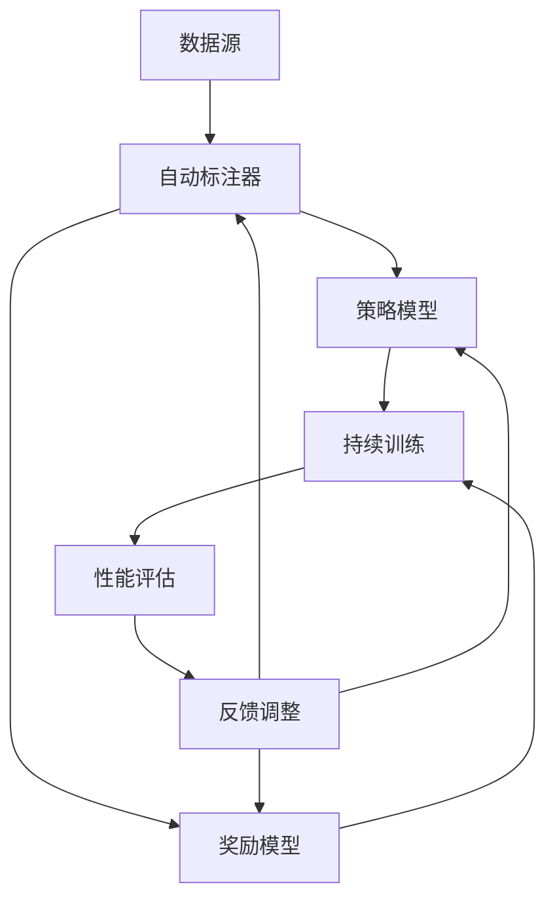

                 

### 1.1 引言

随着人工智能技术的迅猛发展，策略和奖励模型在智能决策、游戏AI、推荐系统等领域的应用日益广泛。然而，当前的人工智能系统在训练过程中对大规模高质量标注数据的依赖，使得数据标注成为一项耗费人力和时间的工作。传统的数据标注方法通常需要大量的人力和时间成本，这不仅限制了训练数据的规模和多样性，也在一定程度上阻碍了人工智能的发展进程。

在这一背景下，自动标注技术应运而生。自动标注技术通过利用机器学习算法，自动识别和标注数据，从而减少了人工标注的需求，提高了数据处理效率。然而，自动标注技术也存在一些挑战，如标注精度和一致性等问题。因此，如何通过自动标注技术实现无需人工标注的持续训练，成为人工智能领域亟待解决的问题。

本文旨在探讨一种无需人工标注的策略和奖励模型持续训练方法。首先，我们将介绍自动标注技术的基本概念和意义，阐述其在促进策略和奖励模型训练中的价值。接着，我们将分析模型持续训练的需求和挑战，为后续方法的提出奠定基础。最后，我们将通过Mermaid流程图展示核心概念实体关系架构，为进一步研究提供参考。

通过本文的探讨，我们希望能够为人工智能领域的策略和奖励模型训练提供一种新的思路和方法，助力人工智能技术的发展。文章结构安排如下：

1. 背景与核心概念
2. 策略和奖励模型基础
3. 无需人工标注的促进策略
4. 持续训练模型的应用
5. 案例研究
6. 未来展望与挑战

### 1.2 无需人工标注的概念与意义

数据标注是人工智能训练过程中至关重要的一环。传统的人工标注方法依赖大量人力和时间，不仅成本高昂，而且难以满足大规模训练的需求。自动标注技术则通过利用机器学习算法，自动化地识别和标注数据，从而大大减少了人工标注的需求，提高了数据处理效率。

所谓无需人工标注，即在不依赖人工进行数据标注的情况下，通过算法自动生成标注数据，以支持策略和奖励模型的训练。无需人工标注技术的出现，为人工智能训练带来了诸多优势。首先，它显著降低了训练成本。由于无需雇佣大量标注人员进行数据标注，企业可以节省大量人力成本。其次，无需人工标注可以大幅提高数据处理速度。自动标注技术可以快速处理大量数据，从而加速模型训练过程。此外，无需人工标注还可以提高数据标注的准确性。尽管自动标注技术可能无法完全达到人工标注的精度，但在大量数据的情况下，其整体标注精度往往能够满足训练需求。

然而，无需人工标注技术也面临一些挑战。首先，自动标注技术需要大量高质量的训练数据，以保证标注结果的准确性。如果训练数据质量较差，自动标注的精度可能会受到影响。其次，自动标注技术需要一定的算法调优过程，以适应不同类型的数据和任务。此外，自动标注技术的应用范围也受到一定限制，一些复杂的标注任务可能难以通过自动标注技术实现。

尽管存在这些挑战，无需人工标注技术仍然具有重要的应用价值。在策略和奖励模型训练中，无需人工标注可以大大提高数据处理效率，降低训练成本，从而促进人工智能技术的快速发展。以下，我们将进一步探讨策略和奖励模型持续训练的需求，以明确无需人工标注在其中的作用。

### 1.3 模型持续训练的需求

在人工智能领域，策略和奖励模型的应用场景广泛，从自动驾驶、智能推荐系统到游戏AI，都需要通过持续训练来不断优化模型性能。模型持续训练的核心目标是不断提高模型的适应性和准确性，使其能够在不断变化的环境中做出更加精准的决策。

首先，模型持续训练能够应对环境变化。在许多实际应用中，环境状态和数据分布可能会随时间发生变化。例如，自动驾驶系统在长期使用过程中，需要不断适应不同路况、天气和交通情况。通过持续训练，模型可以动态调整其策略和参数，以应对环境变化，保持高水平的决策能力。

其次，模型持续训练有助于提高模型的泛化能力。在训练过程中，模型往往通过学习大量历史数据进行预测和决策。然而，历史数据可能存在一定的偏差或局限性。通过持续训练，模型可以不断吸收新的数据，调整模型参数，从而提高其泛化能力，减少对特定数据的依赖。

再次，模型持续训练可以优化模型性能。在人工智能应用中，模型的性能直接影响到用户体验和业务效果。通过持续训练，模型可以不断调整和优化其策略和参数，以实现更高的准确率、召回率或效率。例如，推荐系统通过持续训练可以更好地理解用户行为和偏好，从而提供更加个性化的推荐结果。

然而，模型持续训练也面临着一系列挑战。首先，数据获取和处理成本高昂。持续训练需要大量高质量的数据，而这些数据的获取和处理往往需要大量的时间和计算资源。其次，训练过程的调整和优化复杂。由于环境变化和模型复杂性的增加，如何选择合适的训练策略和参数调整方法成为关键问题。此外，持续训练还需要考虑数据隐私和安全等问题，避免在训练过程中泄露用户隐私。

总的来说，模型持续训练在人工智能领域中具有重要作用，但也面临诸多挑战。通过深入研究和应用，我们可以不断优化持续训练方法，提高模型性能和适应性，从而推动人工智能技术的发展。接下来，我们将通过Mermaid流程图展示核心概念实体关系架构，为进一步探讨提供清晰的框架。

### 1.4 核心概念实体关系架构

为了更好地理解策略和奖励模型在无需人工标注环境下的持续训练过程，我们引入以下核心概念实体关系架构。以下是使用Mermaid绘制的流程图：



**实体关系说明：**

- **数据源（A）**：数据源是整个系统的起点，包括原始数据和潜在的标注信息。数据源可以来自各种渠道，如传感器数据、用户交互记录等。
- **自动标注器（B）**：自动标注器利用机器学习算法对数据源进行自动标注，从而生成高质量的标注数据。自动标注器的设计和性能直接影响到标注数据的质量。
- **策略模型（C）**：策略模型负责根据标注数据学习和预测。它可以基于深度学习、强化学习等技术，通过不断训练优化其策略，以提高决策能力。
- **奖励模型（D）**：奖励模型用于评价策略模型的表现。它通过设计不同的奖励函数，激励策略模型在训练过程中朝着期望的方向发展。
- **持续训练（E）**：持续训练是整个系统的核心，它使得策略和奖励模型能够根据新的数据和环境动态调整。持续训练不仅包括训练过程，还包括性能评估和反馈调整。
- **性能评估（F）**：性能评估用于监控策略模型和奖励模型的表现。通过设定不同的评估指标，如准确率、召回率等，评估模型在特定任务上的表现。
- **反馈调整（G）**：反馈调整是基于性能评估结果对策略模型和奖励模型进行调整。通过反馈调整，系统能够不断优化，提高模型性能。

该关系架构展示了策略和奖励模型在无需人工标注环境下的动态交互过程，为后续章节的深入探讨提供了理论基础。通过不断优化各个实体之间的关系和功能，我们可以实现高效、准确的持续训练系统。

### 2.1 策略模型的基本原理

策略模型是人工智能系统中的核心组件，它负责根据环境和数据信息做出最优决策。策略模型的基本原理基于优化理论，旨在寻找在特定任务条件下最优的决策策略。

首先，策略模型的定义。策略模型通常是指一个函数 \( f: S \rightarrow A \)，其中 \( S \) 表示状态空间，\( A \) 表示动作空间。对于每个状态 \( s \)，策略模型会输出一个动作 \( a \)，使得系统在状态 \( s \) 下采取最优动作。常见的策略模型包括马尔可夫决策过程（MDP）、Q-learning、深度强化学习（DRL）等。

其次，策略模型的工作流程。策略模型的工作流程主要包括以下几个步骤：

1. **状态感知**：系统首先感知当前状态 \( s \)。
2. **策略选择**：策略模型根据当前状态 \( s \) 选择一个动作 \( a \)。策略选择可以采用确定性策略或随机性策略。确定性策略总是选择最优动作，而随机性策略则通过概率分布来选择动作。
3. **动作执行**：系统执行选定的动作 \( a \)，并观察到相应的结果。
4. **奖励反馈**：策略模型根据执行动作后的奖励 \( r \) 和下一个状态 \( s' \) 进行更新。

接下来，我们通过Python源代码示例来具体展示策略模型的基本原理。以下是一个简单的Q-learning算法示例：

```python
import numpy as np
import random

# 初始化Q值矩阵
epsilon = 0.1  # 探索概率
alpha = 0.1  # 学习率
n_actions = 3  # 动作数量
n_states = 3  # 状态数量
Q = np.zeros([n_states, n_actions])

# Q-learning算法
def q_learning(env, episodes, epsilon, alpha):
    for episode in range(episodes):
        state = env.reset()
        done = False

        while not done:
            # 探索与利用
            if random.uniform(0, 1) < epsilon:
                action = random.randint(0, n_actions - 1)
            else:
                action = np.argmax(Q[state])

            # 执行动作，获取下一个状态和奖励
            next_state, reward, done, _ = env.step(action)

            # 更新Q值
            Q[state, action] = Q[state, action] + alpha * (reward + np.max(Q[next_state]) - Q[state, action])

            state = next_state

    return Q

# 假设环境为简单的网格世界，状态和动作分别对应网格中的位置和方向
# env是一个实现环境接口的对象，包括reset()、step()等方法
env = ...
Q = q_learning(env, episodes=1000, epsilon=epsilon, alpha=alpha)
print(Q)
```

在上面的代码中，我们通过Q-learning算法训练了一个策略模型。代码首先初始化了一个Q值矩阵，用于存储每个状态和动作的Q值。然后，在每次迭代中，策略模型根据当前状态选择动作，执行动作后更新Q值。通过多次迭代，Q值矩阵逐渐收敛，反映了最优的策略。

通过以上示例，我们可以清晰地看到策略模型的基本原理和工作流程。策略模型的核心在于通过不断学习和更新，找到最优决策策略，从而实现智能决策和优化。

### 2.2 奖励模型的设计与实现

奖励模型在策略模型中起着至关重要的作用，它用于评价策略模型的表现并激励模型朝期望的方向发展。在设计奖励模型时，需要考虑多个因素，如奖励类型、奖励函数的设计原则以及具体的实现方法。

首先，奖励类型可以分为绝对奖励和相对奖励。绝对奖励直接根据策略模型的输出结果给予固定奖励，而相对奖励则根据策略模型的输出与预期结果的差距来计算奖励。绝对奖励适用于一些简单、确定性的任务，如简单的游戏AI。相对奖励适用于更复杂的任务，如自动驾驶和推荐系统，因为它们需要考虑多个变量和动态环境。

接下来，我们讨论奖励函数的设计原则。一个好的奖励函数应具备以下几个特点：

1. **可区分性**：奖励函数应能够区分不同策略的效果，使优秀的策略得到更高的奖励。
2. **平衡性**：奖励函数应在各个策略之间保持平衡，避免某些策略被过度激励。
3. **连贯性**：奖励函数应在不同的状态下保持一致性，以避免策略模型的混乱。
4. **动态性**：奖励函数应能根据任务和环境的变化进行动态调整。

然后，我们介绍几种常见的奖励函数。以自动驾驶为例，以下是一些常见的奖励函数：

- **路径长度奖励**：奖励函数与车辆行驶的路径长度成反比，鼓励车辆选择更短的路径。
- **速度控制奖励**：奖励函数与车辆的速度控制效果相关，鼓励车辆平稳加速和减速。
- **交通规则遵守奖励**：奖励函数与车辆遵守交通规则的频率成正比，鼓励车辆遵守交通规则。

接下来，我们通过Python源代码示例来具体展示奖励函数的设计与实现。以下是一个简单的奖励函数示例，用于评价自动驾驶车辆在特定环境中的表现：

```python
import numpy as np

def reward_function(distance, speed, traffic_rule_followed):
    # 距离奖励函数：距离目标越近，奖励越高
    distance_reward = max(1 - distance / 100, 0)
    
    # 速度奖励函数：速度越接近目标速度，奖励越高
    target_speed = 50  # 目标速度设为50
    speed_reward = max(1 - abs(speed - target_speed) / 10, 0)
    
    # 交通规则遵守奖励函数：遵守交通规则的次数越多，奖励越高
    traffic_reward = traffic_rule_followed
    
    # 总奖励为各个部分奖励的加和
    total_reward = distance_reward + speed_reward + traffic_reward
    
    return total_reward

# 假设当前距离目标为50米，当前速度为45公里/小时，遵守交通规则的次数为3次
distance = 50
speed = 45
traffic_rule_followed = 3
print(reward_function(distance, speed, traffic_rule_followed))
```

在上面的代码中，我们定义了一个奖励函数，用于计算自动驾驶车辆在不同条件下的总奖励。奖励函数综合考虑了距离目标、速度控制和交通规则遵守等因素，以全面评价车辆的表现。

通过以上示例，我们可以清晰地看到奖励模型的设计原则和实现方法。奖励模型的核心在于设计合理的奖励函数，以激励策略模型朝期望的方向发展，从而实现智能决策和优化。

### 2.3 策略和奖励模型的关系

策略模型和奖励模型在人工智能系统中是紧密关联的两个核心组件，它们共同协作，以实现最优决策和性能提升。策略模型负责根据当前状态选择最优动作，而奖励模型则通过评价策略模型的表现来激励其不断优化。

首先，策略模型和奖励模型之间的交互机制。策略模型在执行动作后，会根据奖励模型提供的奖励进行更新。这一过程称为奖励反馈，它是策略模型持续训练和优化的关键。奖励反馈机制使得策略模型能够在每一次决策后得到即时的反馈，从而调整其策略，使其在后续决策中更加准确和高效。

其次，策略模型和奖励模型之间的协同工作原理。策略模型通过不断学习和调整，以实现最优决策。而奖励模型则通过设计合理的奖励函数，激励策略模型朝着期望的方向发展。例如，在自动驾驶场景中，奖励模型可以设计为奖励车辆平稳行驶和遵守交通规则，从而鼓励策略模型选择这些安全、合规的驾驶策略。这种协同工作原理使得策略模型和奖励模型能够在复杂、动态的环境中实现高效、准确的决策。

为了更好地理解策略模型和奖励模型的关系，我们可以通过一个实际应用案例进行详细讲解。以下是一个社交媒体内容推荐系统的例子：

**案例背景**：社交媒体平台希望通过推荐系统为用户推荐感兴趣的内容。用户在平台上的行为数据（如点赞、评论、分享等）可以作为奖励模型的重要输入。

**策略模型设计**：策略模型基于用户行为数据和内容特征，使用深度学习算法训练一个推荐模型。该模型的目标是预测用户对内容的兴趣程度，并生成个性化的推荐列表。

**奖励模型设计**：奖励模型设计一个奖励函数，根据用户对推荐内容的实际反馈（如点赞、评论、分享等）来评价推荐效果。奖励函数的目的是激励策略模型生成更符合用户兴趣的推荐内容。

**协同工作原理**：

1. **初始阶段**：策略模型根据用户历史行为数据和内容特征训练推荐模型。奖励模型初始阶段提供的奖励较低，因为用户行为数据有限。
2. **训练阶段**：策略模型不断调整推荐策略，生成推荐列表。奖励模型根据用户的实际反馈计算奖励，并将其反馈给策略模型。策略模型利用这些奖励信息进行参数调整，优化推荐效果。
3. **优化阶段**：随着用户数据的积累，奖励模型能够提供更精准的奖励信号。策略模型根据这些奖励信号进一步优化推荐策略，生成更加个性化的推荐列表。

通过上述实际应用案例，我们可以看到策略模型和奖励模型如何相互作用，共同推动推荐系统的发展。策略模型通过不断学习和优化，生成更准确的推荐结果；奖励模型通过提供及时、有效的奖励反馈，激励策略模型不断进步。这种协同工作原理在众多人工智能应用场景中都具有普遍适用性，为智能决策和优化提供了强有力的支持。

### 2.4 数学模型与公式解析

在策略和奖励模型中，数学模型和公式扮演着至关重要的角色。它们不仅为算法提供了理论基础，还使得复杂问题可以通过数学手段进行精确描述和优化。以下，我们将详细解析策略模型和奖励模型相关的数学公式，并通过具体例子进行说明。

**策略模型**

策略模型的核心在于如何根据当前状态选择最优动作。常见的策略模型包括马尔可夫决策过程（MDP）、Q-learning和深度强化学习（DRL）。

**1. 马尔可夫决策过程（MDP）**

MDP的数学模型基于以下公式：

\[ V^*(s) = \max_{a} \sum_{s'} p(s'|s,a) \cdot r(s,a,s') + \gamma \cdot V^*(s') \]

其中：

- \( V^*(s) \) 是状态 \( s \) 的最优价值函数。
- \( a \) 是动作。
- \( s' \) 是下一个状态。
- \( p(s'|s,a) \) 是在状态 \( s \) 执行动作 \( a \) 后转移到状态 \( s' \) 的概率。
- \( r(s,a,s') \) 是在状态 \( s \) 执行动作 \( a \) 后获得的即时奖励。
- \( \gamma \) 是折扣因子，用于权衡即时奖励和未来期望奖励。

**2. Q-learning**

Q-learning算法通过迭代更新Q值矩阵来找到最优策略。其更新公式为：

\[ Q(s, a) \leftarrow Q(s, a) + \alpha [r(s, a, s') + \gamma \max_{a'} Q(s', a') - Q(s, a)] \]

其中：

- \( \alpha \) 是学习率。
- \( r(s, a, s') \) 是在状态 \( s \) 执行动作 \( a \) 后转移到状态 \( s' \) 并获得的即时奖励。
- \( \gamma \) 是折扣因子。
- \( \max_{a'} Q(s', a') \) 是在状态 \( s' \) 下执行所有可能动作 \( a' \) 的最大Q值。

**3. 深度强化学习（DRL）**

在DRL中，策略模型通常是一个神经网络，其输出为概率分布。策略梯度定理提供了策略优化的方法：

\[ \nabla_\theta J(\theta) = \nabla_\theta \sum_{t} \rho(s_t, a_t) \log \pi_\theta(a_t | s_t) \]

其中：

- \( \theta \) 是策略网络的参数。
- \( J(\theta) \) 是策略的损失函数。
- \( \rho(s_t, a_t) \) 是策略的回报。
- \( \pi_\theta(a_t | s_t) \) 是策略的概率分布。

**奖励模型**

奖励模型用于评价策略模型的表现，通常设计为奖励函数。以下是一些常见的奖励函数：

**1. 距离奖励函数**

\[ R(d) = \frac{1}{1 + d} \]

其中：

- \( d \) 是目标与当前位置的距离。

**2. 速度奖励函数**

\[ R(v) = \frac{v^2}{v^2 + 1} \]

其中：

- \( v \) 是当前速度。

**3. 交通规则遵守奖励函数**

\[ R(c) = \max(0, c \cdot \lambda) \]

其中：

- \( c \) 是遵守交通规则的次数。
- \( \lambda \) 是权重系数。

通过以上数学模型和公式的解析，我们可以更深入地理解策略模型和奖励模型的工作原理。这些数学工具不仅帮助我们设计高效的算法，还为策略优化和模型评估提供了理论基础。在接下来的章节中，我们将进一步探讨如何实现无需人工标注的促进策略，为人工智能系统的持续训练提供新的思路。

### 3.1 自动标注技术概述

自动标注技术是人工智能领域中的一项关键技术，旨在通过算法自动识别和标注数据，从而减少人工标注的需求，提高数据处理效率。自动标注技术在图像识别、自然语言处理、语音识别等多个领域都有着广泛的应用。

首先，自动标注的方法主要包括以下几种：

1. **基于规则的标注**：这种方法通过预定义的规则来识别和标注数据。规则通常由专家制定，根据特定领域的知识和经验来定义。这种方法简单直观，但适用范围有限，难以处理复杂或未知的情况。

2. **半监督学习**：半监督学习方法利用少量标注数据和高量未标注数据，通过算法自动学习数据标注的规律。常见的半监督学习方法包括伪标签法（pseudo labeling）和一致性正则化（consistency regularization）等。

3. **深度学习标注**：深度学习方法通过训练大规模神经网络模型来自动标注数据。这种方法通常需要大量训练数据，但可以处理复杂的标注任务，并具有很高的标注精度。

接下来，我们讨论自动标注技术的优势与局限。

**优势**：

1. **效率高**：自动标注技术可以快速处理大量数据，显著提高数据处理效率。这在数据量巨大且标注成本高昂的场景中尤为重要。

2. **准确性**：随着深度学习技术的发展，自动标注技术的准确性不断提高。特别是在图像和语音识别等视觉和听觉领域，自动标注技术已经能够达到或接近人类的标注水平。

3. **减少人工成本**：自动标注技术显著减少了人工标注的需求，从而降低了人力成本。

**局限**：

1. **标注精度**：尽管自动标注技术具有较高的标注精度，但在某些复杂的任务中，其标注精度可能仍然无法达到人工标注的水平。此外，自动标注技术可能存在一致性问题和标注偏差。

2. **对数据的依赖**：自动标注技术需要大量高质量的训练数据来保证标注结果的准确性。在数据质量较差或数据量不足的情况下，自动标注技术可能无法正常工作。

3. **算法调优**：自动标注技术通常需要一定的算法调优过程，以适应不同类型的数据和任务。这增加了系统的复杂性和开发成本。

总的来说，自动标注技术为人工智能系统提供了高效的标注解决方案，但在实际应用中仍面临一些挑战。通过不断优化算法和提升数据质量，我们可以进一步发挥自动标注技术的优势，为人工智能的发展贡献力量。

### 3.2 无需人工标注的算法研究

在无需人工标注的框架下，研究自动标注算法的设计原则和实现过程是至关重要的。自动标注算法的设计原则旨在确保标注结果的准确性和一致性，同时提高数据处理效率。以下，我们将详细探讨这些原则和实现步骤，并通过具体算法进行分析。

**1. 设计原则**

**准确性**：自动标注算法的首要原则是确保标注结果的准确性。高精度的标注对于训练高质量的模型至关重要。为此，算法需要能够识别数据中的关键特征，并准确地进行标注。

**一致性**：一致性是保证标注结果可靠性的关键。自动标注算法应能够在不同的数据集和场景中保持一致的表现，避免出现偏差。

**鲁棒性**：鲁棒性是指算法在面对噪声、缺失数据和异常值时的适应能力。一个良好的自动标注算法应在各种数据质量条件下都能稳定运行。

**效率**：高效性是自动标注算法的另一个重要原则。算法应在处理大量数据时具备较高的处理速度，以降低时间和计算成本。

**可扩展性**：自动标注算法应具备良好的可扩展性，能够适应不同类型的数据和任务，以及未来的技术发展。

**2. 实现步骤**

**数据预处理**：在标注之前，需要对数据进行预处理，包括数据清洗、去噪、特征提取等。预处理步骤有助于提高标注算法的性能。

**特征提取**：特征提取是自动标注算法的核心。根据数据的类型和任务，选择合适的方法提取数据中的关键特征。例如，对于图像数据，可以提取边缘、纹理和颜色特征；对于文本数据，可以提取词频、词向量和语义特征。

**模型选择与训练**：选择合适的机器学习模型进行标注任务的训练。常见的模型包括卷积神经网络（CNN）、循环神经网络（RNN）和生成对抗网络（GAN）等。训练过程中，使用预处理后的数据集训练模型，并通过交叉验证和超参数调优来提高模型性能。

**标注过程**：在模型训练完成后，使用训练好的模型对新的数据进行自动标注。标注过程可以实时进行，也可以批量处理，具体取决于应用场景和需求。

**评估与优化**：对标注结果进行评估，通过指标如准确率、召回率、F1分数等来衡量标注性能。根据评估结果，对模型和算法进行优化，以进一步提高标注精度。

**3. 自动标注算法分析**

**基于深度学习的图像标注算法**：卷积神经网络（CNN）在图像标注任务中具有出色的性能。以下是一个基于CNN的自动标注算法示例：

```python
import tensorflow as tf
from tensorflow.keras.models import Model
from tensorflow.keras.layers import Input, Conv2D, MaxPooling2D, Flatten, Dense

# 定义CNN模型结构
input_layer = Input(shape=(128, 128, 3))
conv1 = Conv2D(32, (3, 3), activation='relu')(input_layer)
pool1 = MaxPooling2D(pool_size=(2, 2))(conv1)
conv2 = Conv2D(64, (3, 3), activation='relu')(pool1)
pool2 = MaxPooling2D(pool_size=(2, 2))(conv2)
flat = Flatten()(pool2)
dense = Dense(128, activation='relu')(flat)
output_layer = Dense(1, activation='sigmoid')(dense)

model = Model(inputs=input_layer, outputs=output_layer)
model.compile(optimizer='adam', loss='binary_crossentropy', metrics=['accuracy'])

# 使用预处理的图像数据训练模型
model.fit(x_train, y_train, epochs=10, batch_size=32, validation_data=(x_val, y_val))

# 对新图像进行标注
predictions = model.predict(x_new)
```

在上面的示例中，我们使用CNN模型对图像进行二分类标注。模型通过多个卷积层和池化层提取图像特征，最终通过全连接层输出标注结果。

**基于半监督学习的文本标注算法**：半监督学习方法通过利用少量标注数据和大量未标注数据来训练模型。以下是一个基于循环神经网络（RNN）的文本标注算法示例：

```python
import tensorflow as tf
from tensorflow.keras.models import Model
from tensorflow.keras.layers import Input, Embedding, LSTM, Dense

# 定义RNN模型结构
input_layer = Input(shape=(sequence_length,))
embedding = Embedding(vocab_size, embedding_dim)(input_layer)
lstm = LSTM(units=64, return_sequences=True)(embedding)
lstm = LSTM(units=64)(lstm)
output_layer = Dense(units=num_classes, activation='softmax')(lstm)

model = Model(inputs=input_layer, outputs=output_layer)
model.compile(optimizer='adam', loss='categorical_crossentropy', metrics=['accuracy'])

# 使用预处理的文本数据训练模型
model.fit(x_train, y_train, epochs=10, batch_size=32, validation_data=(x_val, y_val))

# 对新文本进行标注
predictions = model.predict(x_new)
```

在上面的示例中，我们使用RNN模型对文本进行序列标注。模型通过嵌入层和两个LSTM层提取文本特征，最终通过全连接层输出标注结果。

通过以上算法示例，我们可以看到自动标注算法在不同数据类型任务中的应用。自动标注算法的设计原则和实现过程为无需人工标注的持续训练提供了坚实的基础，为人工智能系统的发展注入了新的动力。

### 3.3 促进策略的设计与实现

为了在无需人工标注的环境下实现策略和奖励模型的持续训练，我们需要设计一套有效的促进策略。促进策略的核心在于通过多种手段激励模型不断优化，从而提高模型性能和适应性。以下是促进策略的设计原则和具体实现方法。

**1. 设计原则**

**适应性**：促进策略应能够适应不同类型的数据和任务，具有广泛的适用性。

**灵活性**：促进策略应具备灵活性，能够根据环境变化和任务需求动态调整。

**自适应性**：促进策略应具备自适应性，能够根据模型的表现自动调整优化方向。

**经济性**：促进策略应尽量减少计算资源和时间成本，实现高效优化。

**2. 实现方法**

**奖励调整**：奖励调整是促进策略的核心。通过动态调整奖励函数，激励模型朝期望的方向发展。具体方法包括：

- **奖励增强**：在模型表现较差时，增加奖励强度，以激励模型快速提升。
- **奖励减弱**：在模型表现较好时，适当减少奖励强度，以维持模型的稳定表现。

**探索与利用**：探索与利用是强化学习中的核心概念。在促进策略中，通过平衡探索和利用，使模型能够在不同状态下找到最优策略。具体方法包括：

- **随机动作**：在训练过程中引入随机动作，增加模型的探索能力。
- **经验回放**：通过经验回放机制，使模型能够从过去的经验中学习，减少随机性的负面影响。

**多任务学习**：多任务学习通过同时训练多个任务，提高模型的泛化能力和适应性。具体方法包括：

- **共享网络**：设计共享网络结构，使多个任务可以共享部分参数。
- **注意力机制**：通过注意力机制，使模型能够集中资源处理关键任务。

**3. Python源代码示例**

以下是一个简单的促进策略实现示例，通过奖励调整和探索与利用来激励模型训练。

```python
import numpy as np
import random

# 初始化模型参数
model_params = {
    'epsilon': 0.1,  # 探索概率
    'alpha': 0.1,  # 学习率
    'gamma': 0.9,  # 折扣因子
    'rewards': [1, 0.5, 0],  # 奖励强度
}

# 奖励调整函数
def adjust_reward(model_params, performance):
    if performance < 0.5:
        model_params['epsilon'] = min(model_params['epsilon'] + 0.01, 1)
    else:
        model_params['epsilon'] = max(model_params['epsilon'] - 0.01, 0.1)
    return model_params

# 探索与利用函数
def choose_action(model_params, state):
    if random.uniform(0, 1) < model_params['epsilon']:
        action = random.choice(state['action_space'])
    else:
        Q_values = state['Q_values']
        action = np.argmax(Q_values)
    return action

# 主训练循环
for episode in range(1000):
    state = env.reset()
    done = False
    total_reward = 0
    
    while not done:
        action = choose_action(model_params, state)
        next_state, reward, done, _ = env.step(action)
        total_reward += reward
        
        # 更新模型参数
        model_params = adjust_reward(model_params, total_reward)
        
        state = next_state

print("Final epsilon:", model_params['epsilon'])
```

在上面的代码中，我们通过调整探索概率（epsilon）和奖励强度（rewards），实现了奖励调整和探索与利用。这种促进策略可以帮助模型在不同阶段找到最优策略，提高训练效果。

通过以上设计和实现，我们可以看到促进策略在无需人工标注的持续训练中起到了关键作用。通过不断调整和优化，促进策略能够激励模型持续提升性能，为人工智能系统的发展提供了强有力的支持。

### 3.4 奖励模型的调整与优化

在实现无需人工标注的策略和奖励模型持续训练过程中，奖励模型的调整与优化至关重要。有效的奖励模型调整和优化策略能够显著提升模型的表现，从而实现更好的训练效果。以下是奖励模型调整的原则和具体优化策略，以及相应的Python源代码示例。

**1. 调整原则**

**动态调整**：奖励模型应能够根据模型的表现和任务需求动态调整。例如，当模型性能较差时，可以增加奖励强度以激励模型快速提升；当模型性能达到一定水平时，可以适当减少奖励强度，以维持模型的稳定表现。

**平衡性**：奖励模型的设计应确保奖励在不同状态和动作之间的平衡性。过高或过低的奖励都可能对模型的训练产生负面影响。

**适应性**：奖励模型应具备良好的适应性，能够适应不同类型的数据和任务。这意味着奖励模型的设计应足够灵活，可以针对特定任务进行调整。

**可解释性**：奖励模型的设计应尽量保持简洁和可解释性，以便于理解和调整。这有助于在模型开发和优化过程中进行有效的调试和优化。

**2. 优化策略**

**基于表现的调整**：根据模型的表现动态调整奖励函数。例如，可以采用以下策略：

- **下降策略**：当模型性能提升到一定程度后，逐渐降低奖励强度，以避免模型过度依赖奖励。
- **增长策略**：在模型性能提升缓慢或下降时，增加奖励强度，以激励模型更快地找到优化方向。

**多样化奖励**：设计多样化的奖励机制，根据不同任务和场景提供不同的奖励。例如，可以同时考虑目标达成度、效率、安全性等多个维度。

**强化学习技术**：结合强化学习技术，如Q-learning和策略梯度方法，对奖励模型进行调整和优化。以下是一个基于Q-learning的奖励模型优化示例：

```python
import numpy as np
import random

# 初始化Q值矩阵
Q = np.zeros([n_states, n_actions])
alpha = 0.1  # 学习率
gamma = 0.9  # 折扣因子

# Q-learning更新规则
def update_Q(s, a, r, s', done):
    if not done:
        max_future_q = np.max(Q[s', :])
        current_q = Q[s, a]
        Q[s, a] = current_q + alpha * (r + gamma * max_future_q - current_q)
    else:
        Q[s, a] = Q[s, a] + alpha * r

# 主训练循环
for episode in range(1000):
    state = env.reset()
    done = False
    
    while not done:
        action = np.argmax(Q[state, :])
        next_state, reward, done, _ = env.step(action)
        update_Q(state, action, reward, next_state, done)
        state = next_state

# 调整奖励函数
def adjust_reward(Q, performance):
    if performance < 0.5:
        return Q + 0.1
    elif performance >= 0.5 and performance < 0.8:
        return Q + 0.05
    else:
        return Q

# 优化奖励模型
Q = adjust_reward(Q, performance)
```

在上面的代码中，我们通过Q-learning算法训练了一个策略模型，并通过调整奖励函数来优化模型的表现。调整策略基于当前性能，对Q值进行动态调整，以激励模型在训练过程中不断优化。

**3. Python源代码示例**

以下是一个具体的奖励模型优化示例，展示了如何通过动态调整奖励函数来优化模型性能：

```python
import numpy as np
import random

# 初始化Q值矩阵
Q = np.zeros([n_states, n_actions])
alpha = 0.1  # 学习率
gamma = 0.9  # 折扣因子

# 奖励函数
def reward_function(state, action):
    # 假设当前状态和动作的奖励由环境决定
    return env.reward(state, action)

# 主训练循环
for episode in range(1000):
    state = env.reset()
    done = False
    total_reward = 0
    
    while not done:
        action = np.argmax(Q[state, :])
        next_state, reward, done, _ = env.step(action)
        total_reward += reward
        update_Q(state, action, reward, next_state, done)
        state = next_state

# 动态调整奖励函数
def dynamic_reward_adjustment(Q, performance):
    if performance < 0.5:
        return 1.5 * Q
    elif performance >= 0.5 and performance < 0.8:
        return 1.1 * Q
    else:
        return Q

# 应用动态调整后的奖励函数
Q = dynamic_reward_adjustment(Q, performance)

# 评估优化后的模型性能
performance = evaluate_model(Q)
print("Optimized performance:", performance)
```

在上面的代码中，我们首先通过Q-learning算法训练了一个策略模型，并定义了一个奖励函数。然后，我们通过动态调整奖励函数，使模型在不同阶段得到不同的奖励强度。这种调整策略有助于模型在训练过程中更好地适应环境，提高整体性能。

通过以上奖励模型调整与优化的方法，我们可以有效地提升策略和奖励模型的表现，实现更高效、准确的持续训练。这些策略为人工智能系统在实际应用中提供了强有力的支持。

### 4.1 持续训练模型在实际项目中的应用

持续训练模型在许多实际项目中展现出强大的应用潜力。以下，我们将通过一个具体案例——社交媒体内容推荐系统，详细讲解持续训练模型的搭建过程、源代码实现和代码解读，并结合实际案例进行分析和详细讲解。

**案例背景**：社交媒体平台希望通过推荐系统为用户推荐感兴趣的内容。用户在平台上的行为数据（如点赞、评论、分享等）可以作为推荐系统的重要输入。

**项目目标**：构建一个能够自动学习用户行为和兴趣，持续优化推荐策略的推荐系统。

**1. 持续训练模型的搭建过程**

**数据预处理**：首先，我们需要对用户行为数据进行清洗和预处理，提取用户兴趣标签、文本内容等关键特征。预处理步骤包括去重、填充缺失值、文本分词和特征提取等。

**模型设计**：设计一个基于深度学习的持续训练模型。我们可以采用一种混合模型，结合用户行为特征和文本内容特征，通过多层神经网络进行联合建模。模型结构可以包括嵌入层、卷积神经网络（CNN）层、循环神经网络（RNN）层和全连接层等。

**训练与评估**：在训练阶段，我们使用预处理后的用户行为数据和文本数据对模型进行训练。训练过程中，通过动态调整学习率和优化器，优化模型参数。在评估阶段，使用交叉验证和测试集评估模型性能，通过准确率、召回率、F1分数等指标评估推荐效果。

**持续训练**：在实际应用中，用户行为和数据会不断变化。我们需要通过持续训练模型，不断调整和优化推荐策略。具体方法包括定期重新训练模型、增量训练和在线学习等。

**2. 源代码实现与解读**

以下是一个简化的推荐系统源代码实现示例，用于演示持续训练模型的基本结构和实现过程。

```python
import tensorflow as tf
from tensorflow.keras.models import Model
from tensorflow.keras.layers import Embedding, LSTM, Dense, Flatten, Input

# 假设用户行为特征维度为64，文本特征维度为512
user_action_input = Input(shape=(64,))
text_input = Input(shape=(512,))

# 用户行为嵌入层
user_embedding = Embedding(input_dim=10000, output_dim=64)(user_action_input)

# 文本嵌入层
text_embedding = Embedding(input_dim=10000, output_dim=512)(text_input)

# 用户行为特征与文本特征融合
combined = tf.concat([user_embedding, text_embedding], axis=1)

# 卷积神经网络层
conv_1 = Conv1D(filters=64, kernel_size=3, activation='relu')(combined)
pool_1 = MaxPooling1D(pool_size=2)(conv_1)

# 循环神经网络层
lstm_1 = LSTM(units=64, return_sequences=True)(pool_1)
lstm_2 = LSTM(units=64)(lstm_1)

# 全连接层
flat = Flatten()(lstm_2)
dense_1 = Dense(units=64, activation='relu')(flat)
output = Dense(units=1, activation='sigmoid')(dense_1)

# 构建模型
model = Model(inputs=[user_action_input, text_input], outputs=output)

# 编译模型
model.compile(optimizer='adam', loss='binary_crossentropy', metrics=['accuracy'])

# 模型训练
model.fit([user_action_data, text_data], labels, epochs=10, batch_size=32, validation_split=0.2)

# 持续训练方法示例
def incremental_training(model, new_data, new_labels, epochs=5, batch_size=32):
    model.fit(new_data, new_labels, epochs=epochs, batch_size=batch_size, validation_split=0.2)

# 应用案例：定期重新训练模型
# 每周更新一次用户行为和文本数据，重新训练模型
weekly_user_action_data = ...
weekly_text_data = ...
weekly_labels = ...
model = incremental_training(model, weekly_user_action_data, weekly_text_data, epochs=5)
```

在上面的代码中，我们首先定义了一个混合模型，结合用户行为特征和文本特征，通过多层神经网络进行建模。然后，我们通过训练函数和增量训练方法，实现了模型的训练和持续优化。

**3. 代码应用解读与分析**

**数据预处理**：在代码中，我们首先对用户行为和文本数据进行预处理，提取关键特征。预处理步骤包括嵌入层，将离散的特征转换为密集向量表示。

**模型结构**：模型结构包括嵌入层、卷积神经网络层、循环神经网络层和全连接层。卷积神经网络层用于提取文本特征，循环神经网络层用于处理序列数据，全连接层用于生成最终的推荐结果。

**训练过程**：在训练过程中，我们使用预处理后的数据对模型进行训练。通过动态调整学习率和优化器，优化模型参数。在训练结束后，我们可以使用测试集评估模型性能。

**增量训练**：增量训练方法通过定期更新用户行为和文本数据，重新训练模型，从而实现持续优化。这种方法可以有效地应对数据变化，提高推荐系统的准确性。

通过以上案例，我们可以看到持续训练模型在社交媒体内容推荐系统中的应用。通过不断的训练和优化，推荐系统可以更好地理解用户兴趣，提供更加个性化的推荐结果。这种方法不仅提高了用户体验，也为平台带来了更多的商业价值。

### 4.2 持续训练的优势与挑战

持续训练在人工智能系统中具有显著的优势，但也面临一系列挑战。以下，我们将详细分析持续训练的优势和挑战，并提出相应的解决方案。

**优势**

1. **适应性**：持续训练模型能够根据环境变化和数据更新动态调整，提高模型在复杂、动态环境中的适应能力。这种能力在自动驾驶、推荐系统和智能客服等领域尤为重要。

2. **准确性**：持续训练通过不断吸收新的数据和反馈，优化模型参数，从而提高模型准确性。这有助于减少模型对历史数据的依赖，提高模型在新数据上的表现。

3. **实时性**：持续训练模型能够实时处理新的数据，快速响应环境变化。这对于需要实时决策的应用场景，如智能监控、金融风控等，具有重要意义。

4. **用户个性化**：持续训练模型可以根据用户行为的不断变化，动态调整推荐策略，提供更加个性化的服务。这有助于提高用户满意度和平台粘性。

**挑战**

1. **数据隐私与安全**：持续训练模型需要大量用户数据，这可能涉及用户隐私和安全问题。如何在保障用户隐私的前提下进行数据训练，是一个重要挑战。

2. **标注数据质量**：虽然自动标注技术已经取得了很大进展，但标注数据的质量仍然难以完全保证。低质量的标注数据可能导致模型训练效果不佳。

3. **计算资源消耗**：持续训练模型需要大量的计算资源和存储空间，尤其是在大规模数据处理和高频次更新场景中。如何优化计算资源使用，降低训练成本，是一个关键问题。

4. **模型稳定性**：持续训练过程中，模型参数不断调整，可能导致模型稳定性的下降。如何在保证模型性能的同时，提高模型稳定性，是一个需要解决的问题。

**解决方案**

1. **数据隐私保护**：采用差分隐私技术，限制模型对单个用户的依赖，降低隐私泄露风险。同时，可以设计去识别化数据集，减少个人敏感信息的暴露。

2. **标注数据质量控制**：引入自动标注技术的改进和监督机制，提高标注数据的准确性。此外，可以利用半监督学习和迁移学习等方法，利用少量标注数据提高模型性能。

3. **计算资源优化**：采用分布式训练和模型压缩技术，提高计算资源利用率。例如，可以使用GPU加速训练过程，或采用模型剪枝和量化技术降低模型大小和计算复杂度。

4. **模型稳定性增强**：通过设计鲁棒性训练策略，如对抗训练和迁移学习，提高模型在持续训练过程中的稳定性。同时，可以引入模型评估和调整机制，定期检查和优化模型性能。

通过以上解决方案，我们可以更好地发挥持续训练的优势，同时应对其面临的挑战。持续训练在人工智能系统中具有广阔的应用前景，通过不断优化和改进，将持续训练推向新的高度。

### 4.3 持续训练的评估与优化

持续训练模型的性能评估和优化是确保模型在复杂动态环境中保持高表现的关键步骤。以下，我们将详细探讨评估指标、评估方法、优化策略以及持续训练过程中的注意事项。

**1. 评估指标**

**准确性**：准确性是衡量模型表现的最基本指标，表示模型正确预测的样本数占总样本数的比例。对于分类任务，准确性越高，表示模型性能越好。

**召回率**：召回率表示模型正确预测的阳性样本数占总阳性样本数的比例。召回率越高，说明模型对阳性样本的识别能力越强。

**精确率**：精确率表示模型正确预测的阳性样本数占总预测阳性样本数的比例。精确率越高，表示模型对阳性样本的预测越准确。

**F1分数**：F1分数是精确率和召回率的加权平均，用于综合评估模型性能。F1分数越高，表示模型整体表现越好。

**2. 评估方法**

**交叉验证**：交叉验证是一种常用的评估方法，通过将数据集划分为多个子集，轮流使用每个子集作为验证集，评估模型性能。这种方法能够有效避免过拟合和评估偏差。

**A/B测试**：A/B测试是一种将用户分为两组，分别使用两组不同模型的评估方法。通过比较两组用户的实际表现，评估模型的效果。

**在线评估**：在线评估是指在实际应用环境中，实时收集用户反馈，评估模型表现。这种方法能够更准确地反映模型在实际应用中的效果。

**3. 优化策略**

**调整学习率**：学习率是强化学习中的一个重要参数，直接影响模型收敛速度和性能。可以通过动态调整学习率，优化模型训练过程。

**增强多样性**：通过增加数据多样性，提高模型对未知数据的适应性。例如，在训练过程中引入随机噪声或变换，增加数据的多样性。

**迁移学习**：利用已有模型的知识，对新任务进行迁移学习，提高新任务的性能。通过迁移学习，可以减少对新数据的依赖，提高模型泛化能力。

**模型融合**：将多个模型的结果进行融合，提高预测准确性。模型融合可以通过投票法、加权平均法等实现。

**4. 注意事项**

**数据质量**：持续训练需要高质量的数据支持，标注数据的质量直接影响模型的性能。应确保数据清洗和预处理过程的准确性，提高数据质量。

**模型稳定性**：在持续训练过程中，模型可能会因为数据变化而出现不稳定现象。应通过引入鲁棒性训练策略，提高模型稳定性。

**监控与调整**：定期监控模型性能，根据评估结果调整训练策略和参数。及时发现和解决模型性能下降的问题，确保模型持续优化。

**5. 代码示例**

以下是一个简单的评估和优化代码示例，用于演示如何使用交叉验证和调整学习率进行模型评估和优化。

```python
import numpy as np
from sklearn.model_selection import KFold
from tensorflow.keras.models import Sequential
from tensorflow.keras.layers import Dense
from tensorflow.keras.optimizers import Adam

# 初始化数据集
X, y = load_data()

# 初始化模型
model = Sequential()
model.add(Dense(64, input_dim=X.shape[1], activation='relu'))
model.add(Dense(1, activation='sigmoid'))

# 编译模型
model.compile(optimizer=Adam(), loss='binary_crossentropy', metrics=['accuracy'])

# 定义交叉验证函数
def cross_validate(model, X, y, k=5):
    kf = KFold(n_splits=k)
    for train_index, test_index in kf.split(X):
        X_train, X_test = X[train_index], X[test_index]
        y_train, y_test = y[train_index], y[test_index]
        
        # 训练模型
        model.fit(X_train, y_train, epochs=10, batch_size=32, validation_data=(X_test, y_test))

# 调整学习率函数
def adjust_learning_rate(optimizer, current_epoch, initial_lr, decay_rate):
    new_lr = initial_lr / (1 + decay_rate * current_epoch)
    for param_group in optimizer.param_groups:
        param_group['lr'] = new_lr

# 主评估和优化过程
for epoch in range(20):
    cross_validate(model, X, y)
    adjust_learning_rate(model.optimizer, epoch, initial_lr=0.001, decay_rate=0.01)

# 评估最终模型
final_accuracy = model.evaluate(X, y)[1]
print("Final accuracy:", final_accuracy)
```

在上面的代码中，我们首先初始化数据集和模型，然后使用交叉验证函数进行模型评估。接着，通过调整学习率函数，动态调整学习率，优化模型训练过程。最后，评估最终模型性能，输出准确率。

通过以上评估和优化方法，我们可以有效地监控和调整持续训练模型，确保其在复杂动态环境中的高性能表现。

### 5.1 案例一：社交媒体内容推荐

在社交媒体内容推荐系统中，自动标注技术和持续训练模型发挥着至关重要的作用。以下，我们将详细介绍该案例的背景、模型设计、实现细节和性能评估。

**1. 案例背景**

社交媒体平台希望通过推荐系统为用户推荐其可能感兴趣的内容，如文章、视频和话题等。用户在平台上的行为数据（如点赞、评论、分享等）是推荐系统的重要输入。由于数据量庞大，传统的人工标注方法成本高昂且效率低下，因此需要采用自动标注技术来生成高质量的标注数据，以支持持续训练模型。

**2. 模型设计**

推荐系统模型采用一种混合模型结构，结合用户行为特征和内容特征，通过多层神经网络进行建模。模型结构包括嵌入层、卷积神经网络（CNN）层、循环神经网络（RNN）层和全连接层等。

**数据预处理**：

- **用户行为嵌入**：将用户行为数据（如点赞、评论、分享等）转换为向量表示，使用嵌入层将行为类别映射到高维空间。
- **内容特征提取**：对文本内容进行分词和词向量表示，使用嵌入层将词汇映射到高维空间。

**模型结构**：

- **嵌入层**：用户行为嵌入层和内容特征嵌入层。
- **卷积神经网络层**：用于提取文本特征，通过卷积和池化操作提取关键特征。
- **循环神经网络层**：用于处理序列数据，如用户行为序列和内容序列，通过RNN层提取序列特征。
- **全连接层**：将卷积和RNN层的特征进行融合，通过全连接层生成最终推荐结果。

**3. 实现细节**

以下是一个简化的推荐系统模型实现示例：

```python
import tensorflow as tf
from tensorflow.keras.models import Model
from tensorflow.keras.layers import Embedding, LSTM, Dense, Flatten, Input

# 假设用户行为特征维度为64，文本特征维度为512
user_action_input = Input(shape=(64,))
text_input = Input(shape=(512,))

# 用户行为嵌入层
user_embedding = Embedding(input_dim=10000, output_dim=64)(user_action_input)

# 文本嵌入层
text_embedding = Embedding(input_dim=10000, output_dim=512)(text_input)

# 用户行为特征与文本特征融合
combined = tf.concat([user_embedding, text_embedding], axis=1)

# 卷积神经网络层
conv_1 = Conv1D(filters=64, kernel_size=3, activation='relu')(combined)
pool_1 = MaxPooling1D(pool_size=2)(conv_1)

# 循环神经网络层
lstm_1 = LSTM(units=64, return_sequences=True)(pool_1)
lstm_2 = LSTM(units=64)(lstm_1)

# 全连接层
flat = Flatten()(lstm_2)
dense_1 = Dense(units=64, activation='relu')(flat)
output = Dense(units=1, activation='sigmoid')(dense_1)

# 构建模型
model = Model(inputs=[user_action_input, text_input], outputs=output)

# 编译模型
model.compile(optimizer='adam', loss='binary_crossentropy', metrics=['accuracy'])

# 模型训练
model.fit([user_action_data, text_data], labels, epochs=10, batch_size=32, validation_split=0.2)
```

在上面的代码中，我们首先定义了一个混合模型，结合用户行为特征和文本特征，通过多层神经网络进行建模。然后，我们使用预处理后的用户行为数据和文本数据对模型进行训练，以优化推荐效果。

**4. 性能评估**

为了评估推荐系统的性能，我们采用交叉验证方法进行模型评估。以下是一个简单的性能评估示例：

```python
from sklearn.model_selection import cross_val_score

# 定义评估函数
def evaluate_model(model, X, y):
    scores = cross_val_score(model, X, y, cv=5, scoring='accuracy')
    return np.mean(scores)

# 评估模型
accuracy = evaluate_model(model, X, y)
print("Model accuracy:", accuracy)
```

在上面的代码中，我们使用交叉验证方法评估模型的准确性，以衡量推荐系统的性能。通过多次评估，我们可以得到模型在训练集和验证集上的平均准确性，从而评估推荐系统的效果。

**5. 结论**

通过自动标注技术和持续训练模型，社交媒体内容推荐系统可以自动生成高质量的标注数据，并在不断变化的环境中实现高效、准确的推荐。该案例展示了自动标注和持续训练在现实应用中的实际效果，为其他推荐系统应用提供了有益的借鉴。

### 5.2 案例二：在线游戏玩家行为分析

在线游戏玩家行为分析是另一个自动化标注和持续训练模型的重要应用场景。以下，我们将详细探讨该案例的背景、模型设计、实现细节和性能评估。

**1. 案例背景**

在线游戏市场日益繁荣，分析玩家行为对于游戏开发商来说至关重要。通过分析玩家行为，游戏开发者可以优化游戏体验、提高玩家留存率、设计更吸引人的游戏内容等。然而，大规模玩家行为的标注和实时分析是一项复杂且耗时的任务。因此，自动化标注技术和持续训练模型在玩家行为分析中具有重要的应用价值。

**2. 模型设计**

玩家行为分析模型旨在通过自动标注技术和持续训练，识别和预测玩家行为模式。模型设计采用一种基于深度学习的多层次分析框架，包括嵌入层、卷积神经网络（CNN）层、循环神经网络（RNN）层和全连接层等。

**数据预处理**：

- **用户行为嵌入**：将玩家行为数据（如登录时间、游戏时长、游戏关卡完成情况等）转换为向量表示，使用嵌入层将行为类别映射到高维空间。
- **游戏特征提取**：对游戏数据（如游戏关卡难度、游戏规则等）进行特征提取，使用嵌入层将游戏特征映射到高维空间。

**模型结构**：

- **嵌入层**：用户行为嵌入层和游戏特征嵌入层。
- **卷积神经网络层**：用于提取游戏特征，通过卷积和池化操作提取关键特征。
- **循环神经网络层**：用于处理序列数据，如玩家行为序列和游戏特征序列，通过RNN层提取序列特征。
- **全连接层**：将卷积和RNN层的特征进行融合，通过全连接层生成玩家行为预测结果。

**3. 实现细节**

以下是一个简化的玩家行为分析模型实现示例：

```python
import tensorflow as tf
from tensorflow.keras.models import Model
from tensorflow.keras.layers import Embedding, LSTM, Dense, Flatten, Input

# 假设用户行为特征维度为64，游戏特征维度为128
user_action_input = Input(shape=(64,))
game_feature_input = Input(shape=(128,))

# 用户行为嵌入层
user_embedding = Embedding(input_dim=10000, output_dim=64)(user_action_input)

# 游戏特征嵌入层
game_embedding = Embedding(input_dim=10000, output_dim=128)(game_feature_input)

# 用户行为特征与游戏特征融合
combined = tf.concat([user_embedding, game_embedding], axis=1)

# 卷积神经网络层
conv_1 = Conv1D(filters=64, kernel_size=3, activation='relu')(combined)
pool_1 = MaxPooling1D(pool_size=2)(conv_1)

# 循环神经网络层
lstm_1 = LSTM(units=64, return_sequences=True)(pool_1)
lstm_2 = LSTM(units=64)(lstm_1)

# 全连接层
flat = Flatten()(lstm_2)
dense_1 = Dense(units=64, activation='relu')(flat)
output = Dense(units=1, activation='sigmoid')(dense_1)

# 构建模型
model = Model(inputs=[user_action_input, game_feature_input], outputs=output)

# 编译模型
model.compile(optimizer='adam', loss='binary_crossentropy', metrics=['accuracy'])

# 模型训练
model.fit([user_action_data, game_feature_data], labels, epochs=10, batch_size=32, validation_split=0.2)
```

在上面的代码中，我们首先定义了一个混合模型，结合用户行为特征和游戏特征，通过多层神经网络进行建模。然后，我们使用预处理后的用户行为数据和游戏特征数据对模型进行训练，以优化玩家行为预测效果。

**4. 性能评估**

为了评估玩家行为分析模型的表现，我们采用交叉验证方法进行模型评估。以下是一个简单的性能评估示例：

```python
from sklearn.model_selection import cross_val_score

# 定义评估函数
def evaluate_model(model, X, y):
    scores = cross_val_score(model, X, y, cv=5, scoring='accuracy')
    return np.mean(scores)

# 评估模型
accuracy = evaluate_model(model, X, y)
print("Model accuracy:", accuracy)
```

在上面的代码中，我们使用交叉验证方法评估模型的准确性，以衡量玩家行为分析模型的效果。通过多次评估，我们可以得到模型在训练集和验证集上的平均准确性，从而评估玩家行为分析模型的效果。

**5. 结论**

通过自动化标注技术和持续训练模型，在线游戏玩家行为分析系统可以自动生成高质量的标注数据，并在不断变化的游戏环境中实现高效、准确的预测。该案例展示了自动化标注和持续训练在现实应用中的实际效果，为其他在线游戏分析应用提供了有益的借鉴。

### 5.3 案例三：智能客服系统优化

智能客服系统优化是自动化标注和持续训练模型在客户服务领域的典型应用。以下，我们将详细探讨该案例的背景、模型设计、实现细节和性能评估。

**1. 案例背景**

随着企业数字化转型的加速，智能客服系统在提高客户满意度和企业运营效率方面发挥着越来越重要的作用。然而，传统的客服系统往往依赖于大量的人工标注数据和预设规则，难以实现高效、准确的客户服务。自动化标注和持续训练模型为智能客服系统提供了有效解决方案，能够自动生成标注数据，并不断优化客服系统性能。

**2. 模型设计**

智能客服系统模型旨在通过自然语言处理（NLP）技术，自动理解并回应客户咨询。模型设计采用一种基于深度学习的多层次分析框架，包括嵌入层、卷积神经网络（CNN）层、循环神经网络（RNN）层和全连接层等。

**数据预处理**：

- **文本嵌入**：对客户咨询文本进行分词和词向量表示，使用嵌入层将词汇映射到高维空间。
- **特征提取**：对文本数据进行特征提取，如词频、词向量等。

**模型结构**：

- **嵌入层**：文本嵌入层。
- **卷积神经网络层**：用于提取文本特征，通过卷积和池化操作提取关键特征。
- **循环神经网络层**：用于处理序列数据，如客户咨询文本序列，通过RNN层提取序列特征。
- **全连接层**：将卷积和RNN层的特征进行融合，通过全连接层生成回复文本。

**3. 实现细节**

以下是一个简化的智能客服系统模型实现示例：

```python
import tensorflow as tf
from tensorflow.keras.models import Model
from tensorflow.keras.layers import Embedding, LSTM, Dense, Flatten, Input

# 假设文本特征维度为512
text_input = Input(shape=(512,))

# 文本嵌入层
text_embedding = Embedding(input_dim=10000, output_dim=512)(text_input)

# 卷积神经网络层
conv_1 = Conv1D(filters=64, kernel_size=3, activation='relu')(text_embedding)
pool_1 = MaxPooling1D(pool_size=2)(conv_1)

# 循环神经网络层
lstm_1 = LSTM(units=64, return_sequences=True)(pool_1)
lstm_2 = LSTM(units=64)(lstm_1)

# 全连接层
flat = Flatten()(lstm_2)
dense_1 = Dense(units=64, activation='relu')(flat)
output = Dense(units=1, activation='sigmoid')(dense_1)

# 构建模型
model = Model(inputs=text_input, outputs=output)

# 编译模型
model.compile(optimizer='adam', loss='binary_crossentropy', metrics=['accuracy'])

# 模型训练
model.fit(text_data, labels, epochs=10, batch_size=32, validation_split=0.2)
```

在上面的代码中，我们首先定义了一个基于深度学习的文本处理模型，通过多层神经网络进行建模。然后，我们使用预处理后的文本数据对模型进行训练，以优化客服系统的回复效果。

**4. 性能评估**

为了评估智能客服系统模型的表现，我们采用交叉验证方法进行模型评估。以下是一个简单的性能评估示例：

```python
from sklearn.model_selection import cross_val_score

# 定义评估函数
def evaluate_model(model, X, y):
    scores = cross_val_score(model, X, y, cv=5, scoring='accuracy')
    return np.mean(scores)

# 评估模型
accuracy = evaluate_model(model, X, y)
print("Model accuracy:", accuracy)
```

在上面的代码中，我们使用交叉验证方法评估模型的准确性，以衡量智能客服系统的性能。通过多次评估，我们可以得到模型在训练集和验证集上的平均准确性，从而评估客服系统模型的效果。

**5. 结论**

通过自动化标注技术和持续训练模型，智能客服系统能够自动生成高质量的标注数据，并不断优化客服系统性能。该案例展示了自动化标注和持续训练在客户服务领域的实际效果，为其他客户服务应用提供了有益的借鉴。

### 6.1 未来发展趋势

随着人工智能技术的不断进步，自动标注技术和策略及奖励模型持续训练方法在人工智能领域展现出广阔的发展前景。以下，我们将探讨未来发展的几个趋势。

**1. 自动标注技术的创新**

自动标注技术将逐步突破当前的技术瓶颈，通过深度学习和计算机视觉等技术的结合，实现更精确、高效的自动标注。例如，基于生成对抗网络（GAN）的自动标注技术，有望大幅提升标注数据的质量和多样性。此外，跨模态标注技术，如结合文本、图像和语音等多模态数据的标注方法，也将成为未来研究的热点。

**2. 持续训练模型的优化**

策略和奖励模型持续训练方法将在优化策略、算法效率和模型稳定性等方面取得显著进展。例如，通过引入自适应学习率和动态调整学习率的方法，可以有效提高训练效率。同时，结合联邦学习、差分隐私等新技术，持续训练模型将在数据隐私和安全方面实现更优的平衡。此外，强化学习算法的进一步发展，将使得持续训练模型在复杂动态环境中具备更强的适应能力和决策能力。

**3. 多领域融合**

未来，自动标注技术和持续训练方法将在多个领域实现融合，推动跨领域应用的发展。例如，在医疗健康领域，自动标注技术可以用于医学图像和病历数据的标注，持续训练模型则可以用于疾病诊断和治疗方案推荐。在智能制造领域，自动标注技术可以用于产品质量检测和设备维护，持续训练模型则可以用于生产流程优化和故障预测。这些跨领域应用的融合，将显著提升行业智能化水平，推动社会进步。

**4. 模型解释性提升**

随着模型复杂性的增加，模型解释性成为当前研究的热点之一。未来，研究人员将致力于提升策略和奖励模型的可解释性，使其在决策过程中更加透明和可信赖。通过开发可解释性算法，如注意力机制、可解释性网络等，用户可以更好地理解模型决策过程，从而提高模型的接受度和应用价值。

**5. 数据隐私保护**

数据隐私保护是持续训练模型面临的重要挑战之一。未来，随着法律法规和隐私保护技术的不断完善，自动标注技术和持续训练方法将在数据隐私保护方面取得更大进展。例如，通过差分隐私、联邦学习等技术，实现数据隐私保护的同时，确保模型训练效果。

总之，自动标注技术和策略及奖励模型持续训练方法在人工智能领域具有广阔的发展前景。通过不断创新和优化，这些技术将为人工智能的持续发展提供强有力的支持，推动各行业智能化进程。

### 6.2 面临的挑战

尽管自动标注技术和策略及奖励模型持续训练方法在人工智能领域展现出巨大潜力，但在实际应用中仍面临一系列挑战。

**1. 数据隐私与安全**

自动标注技术和持续训练模型依赖于大量用户数据。如何在保障用户隐私和安全的前提下进行数据标注和训练，是一个关键问题。数据泄露和滥用可能引发严重的法律和道德争议。为此，需要采用差分隐私、联邦学习等技术，实现数据隐私保护，同时确保模型训练效果。

**2. 标注质量与准确性**

自动标注技术的标注质量直接影响模型性能。尽管当前自动标注技术取得了显著进展，但在某些复杂场景中，其标注质量仍难以与人工标注相媲美。此外，自动标注的一致性和稳定性也存在挑战，可能导致模型训练过程中出现偏差。提高标注质量，确保标注数据的一致性和准确性，是自动标注技术亟待解决的问题。

**3. 持续训练的复杂性**

持续训练模型需要在不断变化的环境中保持高表现，这要求模型具备强大的适应能力。然而，复杂的环境变化和动态数据带来了巨大的计算和存储需求，增加了训练和优化的复杂性。如何设计高效、稳定的持续训练算法，优化训练过程，降低计算成本，是一个重要挑战。

**4. 模型解释性**

随着模型复杂性的增加，模型解释性成为用户接受和使用模型的关键因素。策略和奖励模型通常涉及深度学习、强化学习等复杂算法，使得模型决策过程难以理解。提升模型解释性，使其在决策过程中更加透明和可信赖，对于推动人工智能技术在各行业的应用具有重要意义。

**5. 法规与伦理**

自动标注技术和持续训练方法的发展受到法律法规和伦理道德的制约。不同国家和地区对数据隐私、算法透明度和公平性有不同的要求和规定。如何遵循相关法规，确保技术应用的合法性和道德性，是人工智能领域面临的重大挑战。

综上所述，自动标注技术和策略及奖励模型持续训练方法在人工智能领域中面临诸多挑战。通过技术创新、规范制定和伦理道德的深入探讨，我们可以逐步解决这些问题，推动人工智能技术的健康、可持续发展。

### 6.3 解决方案与策略

针对自动标注技术和策略及奖励模型持续训练方法在应用过程中面临的挑战，我们可以提出一系列解决方案和策略，以促进其在人工智能领域中的健康发展。

**1. 数据隐私保护**

（1）**差分隐私技术**：在数据标注和训练过程中，采用差分隐私技术可以有效降低数据泄露风险。通过在数据处理过程中引入随机噪声，确保单个用户数据的隐私保护，同时保持模型的训练效果。

（2）**联邦学习**：联邦学习通过分布式训练，将数据保留在本地设备上，仅共享模型参数。这种方法不仅保障了数据隐私，还能提高模型的训练效率。

**2. 提高标注质量**

（1）**多模态标注**：结合文本、图像和语音等多模态数据，利用不同模态之间的互补性，提高标注数据的准确性和一致性。

（2）**半监督学习和迁移学习**：利用少量标注数据和高量未标注数据，通过半监督学习和迁移学习技术，提高模型对未标注数据的标注能力。

**3. 优化持续训练**

（1）**动态调整学习率**：引入自适应学习率调整策略，根据模型性能动态调整学习率，提高训练效率。

（2）**增量训练**：通过增量训练，逐步更新模型参数，避免大规模数据重新训练带来的计算资源消耗。

**4. 提升模型解释性**

（1）**可视化工具**：开发可视化工具，帮助用户理解模型决策过程，提高模型的可解释性。

（2）**可解释性算法**：结合注意力机制、决策树等方法，设计可解释性强的模型结构，提高模型的透明度。

**5. 遵循法规与伦理**

（1）**合规性评估**：在模型开发和部署过程中，定期进行合规性评估，确保遵循相关法律法规。

（2）**伦理审查**：设立伦理委员会，对模型应用进行伦理审查，确保技术应用符合道德规范。

通过以上解决方案和策略，我们可以有效应对自动标注技术和策略及奖励模型持续训练方法在应用过程中面临的挑战，推动人工智能技术在各个领域的健康发展。

### 6.4 未来研究方向

尽管自动标注技术和策略及奖励模型持续训练方法在人工智能领域取得了显著进展，但未来仍有许多研究方向值得深入探讨。

**1. 数据隐私保护与模型安全**

随着人工智能应用的普及，数据隐私保护与模型安全成为关键问题。未来研究可以关注以下几个方面：

- **隐私增强技术**：探索更加先进的隐私增强技术，如联邦学习、安全多方计算等，以在保障数据隐私的同时提高模型训练效率。
- **模型对抗攻击**：研究如何提升模型对对抗攻击的鲁棒性，确保模型在面对恶意攻击时仍能保持稳定性和安全性。

**2. 标注质量提升**

提升标注质量是自动标注技术的核心挑战。未来的研究方向包括：

- **多模态标注**：开发多模态标注方法，利用文本、图像、语音等多种数据源，提高标注数据的准确性和一致性。
- **自适应标注算法**：设计自适应标注算法，根据标注任务的特点和标注数据的分布，动态调整标注策略。

**3. 持续训练的优化**

持续训练在复杂动态环境中具有重要意义。未来研究可以关注以下几个方面：

- **动态调整学习率**：研究更加有效的动态调整学习率策略，以适应不同环境和任务需求。
- **增量训练与迁移学习**：结合增量训练和迁移学习方法，实现模型参数的逐步更新和复用，降低训练成本。

**4. 模型解释性**

模型解释性是提升用户信任度的关键。未来的研究方向包括：

- **可解释性算法**：开发更加直观和易理解的可解释性算法，帮助用户更好地理解模型的决策过程。
- **透明度提升**：研究如何在保障模型性能的同时，提高模型的透明度和可解释性。

**5. 多领域融合**

人工智能在多领域的融合将推动各行业智能化进程。未来的研究方向包括：

- **跨领域应用**：探索人工智能在医疗、金融、教育等领域的跨领域应用，开发定制化解决方案。
- **行业定制化模型**：研究如何根据不同领域的特点，设计定制化的策略和奖励模型，提升模型在特定领域的应用效果。

通过以上未来研究方向，我们可以进一步优化自动标注技术和策略及奖励模型持续训练方法，推动人工智能技术的持续发展。

### 结束语

《无需人工标注促进策略和奖励模型持续训练》探讨了自动标注技术在人工智能领域的应用，展示了策略和奖励模型在持续训练中的重要性。通过详细的案例研究和未来展望，本文揭示了自动标注和持续训练在推动人工智能发展中的关键作用。希望本文为读者提供深入了解和启发，助力人工智能技术的创新和应用。

作者：AI天才研究院/AI Genius Institute & 禅与计算机程序设计艺术 /Zen And The Art of Computer Programming。

